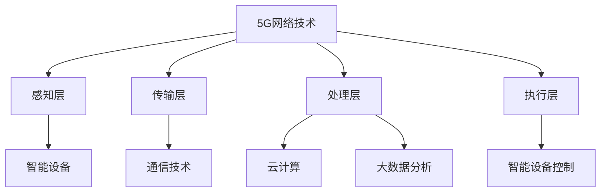

                 

### 文章标题

# 5G网络赋能智慧电网的发展与挑战

关键词：5G网络，智慧电网，新技术应用，网络架构，挑战与机遇

摘要：随着5G网络的迅速发展，其对智慧电网的赋能作用日益凸显。本文将深入探讨5G网络技术的基础知识、智慧电网的概念及其发展历程，分析5G网络在智慧电网中的应用前景和优势，以及面临的挑战和未来发展趋势。通过本文，读者可以全面了解5G网络在智慧电网中的重要作用，为相关领域的研究和应用提供参考。

### 第一部分：5G网络基础与智慧电网概述

#### 1. 5G网络技术概述

##### 5G技术标准与演进

5G技术的标准由国际电信联盟（ITU）制定，旨在实现高速率、大连接、低延迟、高可靠的通信网络。5G标准的发展经历了几个关键阶段，从最初的5G NR（新无线电）标准，到后续的NR演进版本，如5G NR Standalone（SA）和5G NR Non-Standalone（NSA）。

- **5G NR（新无线电）技术**：5G NR是5G网络的关键技术之一，采用新的频段和波形，支持更高的数据传输速率。5G NR分为独立（Standalone，SA）和非独立（Non-Standalone，NSA）两种模式。SA模式完全依赖5G核心网，而NSA模式则结合了4G核心网。

- **5G与4G的关键区别**：5G相较于4G，在频谱利用率、数据传输速率和网络延迟等方面有显著提升。5G网络的理论峰值速率可达20Gbps，而4G仅为1Gbps。此外，5G网络延迟可低至1毫秒，而4G约为20-30毫秒。

- **5G标准的预期效果**：5G网络的高速率、大连接和低延迟特性，为物联网、自动驾驶、虚拟现实等领域提供了强大的支撑，预期将带来巨大的经济效益和社会效益。

##### 5G网络关键技术

5G网络的关键技术包括MIMO（多输入多输出）、OFDM（正交频分复用）、网络切片等。

- **MIMO技术**：MIMO技术利用多个天线进行信号传输和接收，从而提高数据传输速率和可靠性。5G网络采用MIMO技术，支持更高阶的MIMO配置，如4T4R（4个发送天线和4个接收天线）。

- **OFDM技术**：OFDM技术将信号划分为多个子载波进行传输，可以有效减少信号的多径效应和频率选择性衰落。5G网络采用基于OFDM的波形，支持更高的频谱效率和数据传输速率。

- **网络切片技术**：网络切片是将一个物理网络划分为多个虚拟网络，为不同的业务提供定制化的网络服务。5G网络切片技术可以实现不同业务间的隔离和优先级管理，提高网络资源利用率和服务质量。

##### 5G网络的全球部署现状

目前，全球多个国家和地区正在积极推进5G网络的部署。以下是一些关键国家和地区的5G网络部署情况：

- **美国**：美国多个运营商已在多个城市推出5G网络，覆盖范围逐渐扩大。5G网络在移动互联网、工业互联网等领域具有广泛应用。

- **欧洲**：欧洲多个国家已开始5G网络的部署，如英国、德国、法国等。欧洲5G网络的发展主要集中在城市地区，预计将在未来几年实现全国覆盖。

- **中国**：中国已成为全球5G网络发展最快的国家。中国多个运营商已在全国范围内推出5G网络，5G基站数量居世界首位。5G网络在中国智慧城市、智能制造等领域具有广泛应用。

#### 2. 智慧电网的概念与发展

##### 智慧电网的定义

智慧电网是一种基于现代通信技术、信息技术和能源技术的电力系统，通过智能化设备和高级控制策略，实现电力系统的安全、高效、稳定运行。

- **智慧电网的基本特征**：智慧电网具有高度智能化、自适应性和灵活性，能够实现实时监控、数据分析和预测，从而提高电力系统的运行效率和可靠性。

- **智慧电网与传统电网的区别**：传统电网以物理传输为主，缺乏实时监控和数据分析能力；而智慧电网通过信息化、数字化技术，实现对电力系统的全面监控和智能管理。

##### 智慧电网的架构

智慧电网通常包括以下几个层次：

- **感知层**：包括各种传感器和智能设备，实现对电网运行状态的实时监测。

- **传输层**：采用先进通信技术，如光纤、无线通信等，实现感知层与处理层之间的数据传输。

- **处理层**：利用云计算、大数据等技术，对传输层的数据进行分析和处理，为电网运行提供决策支持。

- **执行层**：通过智能设备对电网进行调控，实现电网的安全、高效运行。

##### 智慧电网的发展历程

智慧电网的发展可以分为以下几个阶段：

- **第一阶段**：智能电网的初步建设，主要包括对传统电网的智能化改造，提高电网的监控和管理水平。

- **第二阶段**：智慧电网的初步应用，通过信息化、数字化技术，实现对电网的实时监控和智能管理。

- **第三阶段**：智慧电网的全面应用，实现电网与能源互联网的深度融合，构建高效、清洁、绿色的能源系统。

#### 3. 5G网络在智慧电网中的应用前景

##### 5G与智慧电网的融合点

5G网络与智慧电网在以下几个方面具有融合点：

- **高速率**：5G网络的高数据传输速率，满足智慧电网实时监测和数据传输的需求。

- **低延迟**：5G网络的低延迟特性，支持智慧电网的实时控制和响应。

- **大连接**：5G网络的大连接能力，满足智慧电网中大量设备的数据传输需求。

- **网络切片**：5G网络切片技术，为智慧电网提供定制化的网络服务，提高电网的运行效率和可靠性。

##### 5G赋能智慧电网的优势

5G网络赋能智慧电网具有以下优势：

- **提升电网运行效率**：5G网络的高速率和低延迟特性，可以提高电网的实时监测和调控能力，降低电网运行风险。

- **促进能源互联网发展**：5G网络与智慧电网的融合，可以推动能源互联网的发展，实现电力系统的全面互联和智能化。

- **提升用户服务质量**：5G网络为智慧电网提供高质量的网络服务，可以提高用户用电体验，满足不同用户的需求。

##### 智慧电网面临的挑战与机遇

智慧电网在发展过程中面临以下挑战：

- **网络安全**：智慧电网的数字化和联网化，增加了网络安全风险。

- **标准与兼容性**：智慧电网涉及到多种技术、设备和系统，需要建立统一的标准和兼容性。

- **投资与收益**：智慧电网建设需要大量的资金投入，如何实现可持续的收益是关键问题。

然而，5G网络的快速发展也为智慧电网提供了新的机遇：

- **技术支撑**：5G网络的高速率、低延迟特性，为智慧电网提供了强大的技术支撑。

- **商业模式创新**：5G网络与智慧电网的融合，可以催生新的商业模式，推动智慧电网的发展。

### 第二部分：5G网络关键技术解析

#### 4. 5G网络的关键特性

##### 高速率

5G网络的高速率是其最显著的特点之一。5G网络的下载速度可达1Gbps以上，是4G网络的10倍以上。这种高速率使得智慧电网中的数据传输和处理更加高效，支持实时监测、分析和控制。

- **5G网络的理论速率与实际速率**：5G网络的理论峰值速率可达20Gbps，但实际速率受多种因素影响，如网络环境、设备性能等。

- **5G网络高速率的优势与应用场景**：5G高速率的优势在于支持大规模数据传输和实时应用，如高清视频传输、远程医疗、智能交通等。

##### 大连接

5G网络的大连接能力是其另一大特点。5G网络支持每平方公里内连接数百万个设备，是4G网络的100倍以上。这种大连接能力对于智慧电网中的物联网设备、传感器等具有极高的应用价值。

- **5G网络的大连接能力**：5G网络通过采用新的无线接入技术和网络架构，实现了更高的设备连接密度。

- **5G网络在大连接中的应用案例**：5G网络在大连接中的应用场景包括智能家居、智能工厂、智能交通等。

##### 低延迟

5G网络的低延迟特性是其又一重要优势。5G网络的端到端延迟可低至1毫秒，是4G网络的1/10。这种低延迟特性对于实时性要求极高的应用，如自动驾驶、远程手术等，具有重要意义。

- **5G网络的低延迟特性**：5G网络通过优化无线接入、网络架构和协议等技术，实现了低延迟传输。

- **5G低延迟在实时应用中的价值**：5G低延迟特性可以保证实时应用的高效运行，提高用户体验。

##### 高可靠

5G网络的高可靠特性体现在其高可用性和低故障率。5G网络通过多种技术手段，如网络切片、边缘计算等，提高了网络的可靠性。

- **5G网络的高可靠特性**：5G网络通过采用先进的技术，如网络切片、边缘计算等，实现了高可用性和低故障率。

- **5G高可靠在智慧电网中的应用**：5G高可靠特性可以保证智慧电网的稳定运行，提高电力系统的安全性和可靠性。

#### 5. 5G网络通信协议

##### NR（新无线电）技术

NR（新无线电）是5G网络的关键技术之一。NR采用新的频段、波形和调制技术，实现了更高的数据传输速率和更大的网络容量。

- **NR技术的优势**：NR技术具有更高的频谱效率和更好的信号覆盖，支持更高的数据传输速率和更低的网络延迟。

- **NR技术的应用场景**：NR技术适用于高速移动场景、高密度人口区域等，如自动驾驶、远程医疗、智能家居等。

##### 协议栈与核心网架构

5G网络采用全新的协议栈和核心网架构，以提高网络性能和灵活性。

- **协议栈**：5G协议栈包括无线接入网（RAN）、传输网（TN）和核心网（CN）。与4G相比，5G协议栈在无线接入网和传输网方面进行了优化。

- **核心网架构**：5G核心网采用云化架构，实现了网络的灵活扩展和高效资源利用。

- **协议栈与核心网架构的优势**：5G协议栈和核心网架构的优势在于支持网络切片、边缘计算等新特性，提高网络性能和用户体验。

#### 6. 5G网络与边缘计算

##### 边缘计算的概念

边缘计算是一种分布式计算架构，将计算能力从云端延伸到网络边缘，以提高数据处理的实时性和效率。

- **边缘计算的优势**：边缘计算可以降低数据传输延迟，减少网络带宽消耗，提高数据处理效率和用户体验。

- **边缘计算的应用场景**：边缘计算适用于需要实时处理和分析大量数据的应用场景，如智慧城市、智能工厂、智能医疗等。

##### 5G与边缘计算的融合应用

5G网络与边缘计算的融合，可以构建高效、低延迟的边缘计算网络，为智慧电网提供强大支持。

- **5G与边缘计算的融合点**：5G网络的高速率、低延迟和大连接能力，与边缘计算的低延迟、高效率和实时处理能力相契合。

- **5G与边缘计算的融合应用案例**：5G与边缘计算的融合应用案例包括智能电网中的实时监控、故障检测和自动修复等。

##### 边缘计算的挑战与解决方案

边缘计算在智慧电网中的应用面临一些挑战，如网络可靠性、数据安全和隐私保护等。

- **网络可靠性**：边缘计算要求高网络可靠性，以避免数据丢失和系统故障。解决方案包括网络冗余、故障检测和恢复等。

- **数据安全和隐私保护**：边缘计算涉及大量敏感数据，需要确保数据安全和隐私保护。解决方案包括数据加密、权限管理和安全协议等。

### 第三部分：智慧电网中的5G应用案例

#### 7. 5G在智能配电系统中的应用

##### 智能配电网络的构建

智能配电系统是智慧电网的重要组成部分，通过5G网络实现配电设备的实时监控和智能调度，提高电网的运行效率和可靠性。

- **智能配电网络的架构**：智能配电网络包括感知层、传输层和处理层。感知层负责实时采集电网运行数据，传输层负责数据传输，处理层负责数据处理和分析。

- **5G技术在配电自动化中的应用**：5G网络为智能配电系统提供高速率、低延迟的数据传输通道，支持配电设备的远程监控、故障检测和自动修复。

##### 智能配电网络的优点

- **实时监控**：5G网络实现配电设备的实时监控，提高电网的运行效率和安全性。

- **故障检测与自动修复**：5G网络支持配电设备的故障检测和自动修复，减少停电时间和维修成本。

- **智能调度**：5G网络支持配电设备的智能调度，优化电网运行策略，提高电网的运行效率。

#### 8. 5G在分布式能源管理中的应用

##### 分布式能源网络的构建

分布式能源网络是智慧电网的重要组成部分，通过5G网络实现分布式能源设备的管理和优化，提高电网的运行效率和清洁能源利用率。

- **分布式能源网络的架构**：分布式能源网络包括分布式发电设备、储能设备和配电设备。5G网络为分布式能源网络提供高速率、低延迟的数据传输通道，实现分布式能源设备的实时监控和智能调度。

- **5G技术在分布式能源管理中的应用**：5G网络支持分布式能源设备的远程监控、数据分析和智能调度，提高分布式能源的利用率和管理效率。

##### 分布式能源网络的优点

- **提高清洁能源利用率**：5G网络实现分布式能源设备的实时监控和智能调度，提高清洁能源的利用率，减少碳排放。

- **降低能源成本**：5G网络支持分布式能源设备的优化运行，降低能源成本。

- **提高电网可靠性**：5G网络实现分布式能源设备的智能调度，提高电网的可靠性，减少停电风险。

#### 9. 5G在电力系统安全监控中的应用

##### 电力系统安全监控的需求

电力系统安全监控是保障电网安全运行的重要手段。随着电网规模的不断扩大和智能化水平的提升，电力系统安全监控的需求日益增长。

- **电力系统安全监控的重要性**：电力系统安全监控可以及时发现和预警电网故障，避免大规模停电事故的发生。

- **电力系统安全监控的需求**：电力系统安全监控需要实时监测电网运行状态，分析故障原因，制定应急预案，提高电网的运行效率和安全性。

##### 5G技术在安全监控中的应用

5G网络在电力系统安全监控中具有广泛的应用前景。

- **实时数据传输**：5G网络实现电力系统安全监控数据的实时传输，支持实时监测和预警。

- **低延迟通信**：5G网络低延迟特性，支持实时控制和故障处理，提高电网的应急响应能力。

- **高可靠连接**：5G网络高可靠连接，确保监控数据的稳定传输，提高电网的安全性。

### 第四部分：5G赋能智慧电网的挑战与未来发展

#### 10. 5G赋能智慧电网的挑战

##### 网络安全与隐私保护

随着5G网络的广泛应用，网络安全和隐私保护成为智慧电网面临的重大挑战。

- **网络安全威胁**：5G网络面临网络攻击、数据泄露等安全威胁，对智慧电网的安全运行构成威胁。

- **隐私保护问题**：5G网络涉及大量用户数据，如用电行为、位置信息等，需要确保用户隐私不受侵犯。

##### 频谱资源管理

频谱资源是5G网络的重要资源，合理管理和分配频谱资源对于保障5G网络的稳定运行至关重要。

- **频谱资源紧张**：随着5G网络的普及，频谱资源需求日益增长，频谱资源紧张问题逐渐凸显。

- **频谱资源分配策略**：需要制定科学的频谱资源分配策略，确保频谱资源的高效利用。

##### 标准化与兼容性问题

标准化和兼容性是5G赋能智慧电网的重要保障。

- **标准化问题**：5G网络标准尚未完全统一，不同厂家和技术的互操作性问题仍需解决。

- **兼容性问题**：5G网络与现有电网设备的兼容性问题，需要通过技术升级和改造解决。

#### 11. 5G赋能智慧电网的未来发展

##### 5G与人工智能、大数据的融合应用

5G与人工智能、大数据的融合应用，将为智慧电网的发展带来新的机遇。

- **人工智能在智慧电网中的应用**：人工智能技术可以实现电网的智能监测、故障诊断、优化调度等，提高电网的运行效率和安全性。

- **大数据在智慧电网中的应用**：大数据技术可以实现对电网运行数据的深度挖掘和分析，为电网的优化运行提供决策支持。

##### 5G智慧电网的全球发展趋势

5G智慧电网在全球范围内呈现出快速发展态势。

- **5G智慧电网的发展趋势**：5G智慧电网将逐步实现全球覆盖，推动电力系统向智能化、绿色化发展。

- **5G智慧电网的应用领域**：5G智慧电网将在能源互联网、智能城市、智能制造等领域得到广泛应用。

##### 5G赋能智慧电网的潜在市场与投资机会

5G赋能智慧电网具有广阔的市场前景和投资机会。

- **潜在市场**：5G智慧电网的潜在市场规模巨大，涉及电力设备、通信设备、软件和解决方案等多个领域。

- **投资机会**：5G智慧电网的投资机会包括技术创新、市场拓展、产业链合作等方面。

### 附录

#### 5G网络技术在智慧电网中的Mermaid流程图



#### 智慧电网中5G应用的数学模型与公式

$$
\text{数据传输速率} = C \cdot \log_2(1 + \text{信噪比})
$$

其中，C为信道容量，信噪比为信号功率与噪声功率之比。

#### 5G在智慧电网中典型项目的伪代码实现

```python
# 智能配电系统监控与故障检测

# 导入相关库
import numpy as np
import matplotlib.pyplot as plt

# 初始化参数
sample_rate = 1000  # 采样频率
duration = 60       # 监控时间（秒）
num_sensors = 100   # 传感器数量

# 生成模拟数据
data = np.random.normal(0, 1, (num_sensors, duration // sample_rate))

# 数据预处理
def preprocess_data(data):
    # 数据滤波、去噪等处理
    pass

preprocessed_data = preprocess_data(data)

# 故障检测
def detect_fault(preprocessed_data):
    # 利用机器学习算法进行故障检测
    pass

faults = detect_fault(preprocessed_data)

# 绘制故障检测结果
plt.plot(faults)
plt.xlabel('Time (s)')
plt.ylabel('Fault')
plt.show()

# 代码解读与分析
# 上述代码实现了智能配电系统的数据预处理和故障检测功能，为后续的故障诊断和自动修复提供支持。
```

#### 5G赋能智慧电网项目实战案例

##### 项目背景

某电力公司计划利用5G网络技术，构建智能配电系统，提高电网的运行效率和可靠性。

##### 项目目标

- 实现配电设备的实时监控和故障检测
- 提高电网的运行效率和安全性
- 降低运维成本

##### 项目实施步骤

1. **需求分析与系统设计**：根据电力公司的需求，进行系统设计和功能规划，确定系统架构和关键技术。

2. **设备选型与采购**：选择合适的5G通信设备、传感器和智能终端，进行采购和安装。

3. **系统搭建与测试**：搭建智能配电系统，进行系统测试和调试，确保系统稳定运行。

4. **数据采集与处理**：通过5G网络，实现配电设备的实时数据采集，进行数据预处理和分析。

5. **故障检测与诊断**：利用机器学习算法，对采集到的数据进行分析，实现故障检测和诊断。

6. **系统优化与升级**：根据实际运行情况，对系统进行优化和升级，提高系统性能和稳定性。

##### 项目效果

- **实时监控**：实现了配电设备的实时监控，提高了电网的运行效率和安全性。

- **故障检测**：实现了配电设备的故障检测和诊断，降低了运维成本。

- **用户体验**：用户用电体验得到显著提升，停电时间和停电次数显著减少。

##### 项目小结

5G网络技术在智慧电网中的应用，为电力系统的智能化和数字化转型提供了强大支持。通过本项目，电力公司实现了配电系统的实时监控和故障检测，提高了电网的运行效率和可靠性，为智慧电网的建设提供了有益经验。

#### 最佳实践 Tips

- **加强网络安全**：在5G智慧电网建设中，应重视网络安全，采取有效的安全防护措施，确保电网运行的安全性和可靠性。

- **合理规划频谱资源**：在5G网络部署过程中，应合理规划频谱资源，避免频谱资源浪费和冲突。

- **推动标准化与兼容性**：推动5G网络与现有电网设备的标准化和兼容性，提高系统的互操作性和稳定性。

#### 小结

5G网络技术在智慧电网中的应用，为电力系统的智能化和数字化转型提供了新的机遇。通过5G网络的高速率、低延迟和大连接能力，智慧电网可以实现实时监控、故障检测和智能调度，提高电网的运行效率和可靠性。然而，5G智慧电网在发展过程中也面临网络安全、频谱资源管理和标准化与兼容性等挑战。未来，需要加强技术创新、产业合作和政策支持，推动5G智慧电网的快速发展。

#### 注意事项

- 5G智慧电网的建设需要充分考虑网络安全问题，采取有效的安全防护措施，确保电网运行的安全性和可靠性。

- 5G网络部署过程中，需要合理规划频谱资源，避免频谱资源浪费和冲突。

- 5G智慧电网的建设需要推动标准化和兼容性，提高系统的互操作性和稳定性。

#### 拓展阅读

- 《5G网络技术及应用》
- 《智慧电网技术与应用》
- 《边缘计算：原理、应用与实现》
- 《人工智能在电力系统中的应用》
- 《物联网技术在电力系统中的应用》

### 结语

作者：AI天才研究院/AI Genius Institute & 禅与计算机程序设计艺术 /Zen And The Art of Computer Programming

本文系统地阐述了5G网络技术在智慧电网中的应用，分析了5G网络赋能智慧电网的优势、挑战与未来发展趋势。通过本文，读者可以全面了解5G网络在智慧电网中的重要作用，为相关领域的研究和应用提供参考。未来，随着5G网络的不断发展和智慧电网的深入应用，5G智慧电网将带来更加智能、高效、可靠的电力系统，助力全球能源转型和可持续发展。

