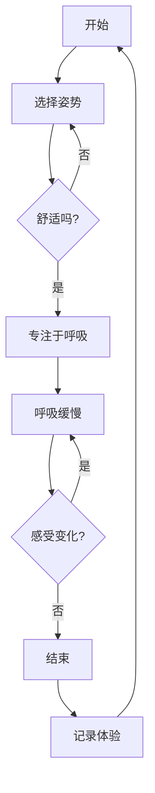

                 


### 文章标题：Mindfulness与当下：在日常中寻找意义

### 关键词：正念，当下，意义，日常生活，应用

### 摘要：
本文旨在探讨正念（Mindfulness）这一概念在日常生活中的重要性，以及如何通过实践正念来寻找生活的意义。文章首先介绍了正念的基本概念和历史背景，然后详细阐述了正念的核心实践方法，包括呼吸练习、身体扫描和饮食练习。接着，文章讨论了正念在不同领域的应用，如工作、人际关系和健康，并进一步探讨了正念在教育和个人成长中的作用。最后，文章总结了正念实践的资源与工具，为读者提供了进一步探索和实践的指导。

## 第1章：正念概述

### 1.1 正念的定义与历史背景

正念（Mindfulness）是一种意识状态，指的是专注于当前时刻，对所经历的一切保持开放和接纳的态度。它起源于佛教传统中的冥想和禅修，已有数千年的历史。然而，正念作为一种心理疗法，在20世纪70年代由美国心理学家乔·卡巴金（Jon Kabat-Zinn）引入医学领域，并迅速在全球范围内得到认可和应用。

正念的核心原则包括以下几点：

1. **专注当下**：将注意力集中在当前的时刻，而不是过去或未来。
2. **接纳**：对当下的经历保持开放和接纳的态度，无论好坏。
3. **无评判**：不对自己的感受或体验进行评判，而是以好奇和探索的心态去体验。
4. **非执取**：不对所体验的事物产生过度的欲望或排斥。

### 1.2 正念的核心原则

正念的核心原则是它实践的基础。这些原则帮助个体建立起对当前时刻的专注和对生活的接纳，从而提升生活质量。以下是对这些原则的详细解释：

1. **专注当下**：
   当下是我们唯一可以体验和控制的时刻。通过专注于当下，我们可以减少对过去遗憾或未来焦虑的担忧，从而更全面地体验生活中的每一刻。专注当下的方法包括深呼吸、冥想和身体扫描等。

2. **接纳**：
   接纳意味着无论遇到什么情况，我们都能以开放和包容的态度去接受。这并不意味着我们接受不公正或不良的行为，而是意味着我们接受事物的本然状态，无论是愉悦还是痛苦。接纳有助于减少内心的冲突和焦虑。

3. **无评判**：
   无评判要求我们不对自己的感受或体验进行评判。这并不意味着我们放任自己的负面情绪，而是意味着我们以平等和公正的心态去体验它们。无评判的态度可以帮助我们更好地理解自己的内心世界。

4. **非执取**：
   非执取意味着我们不对所体验的事物产生过度的欲望或排斥。这有助于我们避免因追求完美或逃避困难而导致的痛苦。非执取的态度可以帮助我们更加平和地面对生活中的挑战。

### 1.3 正念与冥想的关系

正念和冥想密切相关，但它们并不完全相同。冥想是一种通过专注和意识提升来实现心理和身体平静的技术，而正念是一种生活态度，强调对当前时刻的专注和接纳。

正念可以看作是冥想在日常生活中的应用。通过冥想，个体可以培养专注和接纳的能力，而这些能力在日常生活中也同样重要。例如，当我们在工作时，通过正念可以更好地集中注意力，减少分心；在人际交往中，通过正念可以更好地理解和接纳他人。

### 1.4 正念在现代社会的应用

正念在现代社会的应用广泛，涵盖了多个领域，包括医学、心理学、教育、商业等。以下是一些正念应用的例子：

1. **医学**：
   正念已被证明对多种疾病有积极的影响，如焦虑症、抑郁症、慢性疼痛和心血管疾病。正念冥想可以帮助患者减轻症状，提高生活质量。

2. **心理学**：
   正念心理疗法已成为一种有效的治疗手段，广泛应用于临床心理治疗。它可以帮助个体提高情绪调节能力，减少焦虑和抑郁。

3. **教育**：
   正念教育旨在培养学生的专注力、自我意识和情绪管理能力。许多学校已经开始将正念练习纳入课程，以提高学生的整体表现。

4. **商业**：
   正念在商业领域的应用包括提高员工的工作效率和创造力。通过正念练习，员工可以更好地应对压力，提高决策能力。

## 第2章：正念的核心实践

### 2.1 正念呼吸练习

正念呼吸练习是正念实践中最基本的练习之一。它通过专注于呼吸来培养专注力和意识。

#### 2.1.1 正念呼吸的基本原理

正念呼吸练习的原理是基于呼吸的自然流动，通过关注呼吸的进出，将注意力从思绪和焦虑中解脱出来。

$$
\text{呼吸速率} = \frac{\text{呼吸次数}}{\text{时间}}
$$

通过控制呼吸速率，我们可以调节身体和情绪的状态。深呼吸有助于放松身体，减少焦虑和压力。

#### 2.1.2 正念呼吸的步骤与实践

1. **准备姿势**：
   选择一个舒适的姿势，可以是坐姿、站姿或躺姿。确保背部挺直，头部和肩膀放松。

2. **专注呼吸**：
   将注意力集中在呼吸上，感受空气通过鼻孔、喉咙和肺部的过程。尝试专注于呼吸的进出，而不是思考。

3. **重复练习**：
   持续专注于呼吸，每次练习可以持续几分钟到几十分钟不等。根据个人情况逐渐增加练习时间。

#### 2.1.3 正念呼吸的实践示例

假设我们正在做一个五分钟的深呼吸练习：

1. **第一步**：选择一个舒适的姿势，背部挺直，头部和肩膀放松。
2. **第二步**：将注意力集中在呼吸上，感受空气通过鼻孔、喉咙和肺部的过程。专注于呼吸的进出。
3. **第三步**：呼吸次数逐渐减少，感受每次呼吸的深度和缓慢。
4. **第四步**：如果思绪飘散，不要担心，将注意力重新集中在呼吸上。
5. **第五步**：当五分钟结束时，缓缓睁开眼睛，感受身体的放松和心灵的平静。

### 2.2 正念身体扫描

正念身体扫描是一种通过逐步关注身体各个部位来培养意识和放松的练习。

#### 2.2.1 正念身体扫描的原理

正念身体扫描的原理是通过逐步关注身体的每个部位，将注意力从思绪中解脱出来，从而实现身体和情绪的放松。

$$
\text{身体扫描速率} = \frac{\text{身体部位数}}{\text{时间}}
$$

通过逐步扫描身体，我们可以提高对身体的觉知，减少对过去和未来的担忧。

#### 2.2.2 正念身体扫描的实践

1. **准备姿势**：
   选择一个舒适的姿势，背部挺直，头部和肩膀放松。

2. **开始扫描**：
   将注意力集中在脚部，感受脚部的重量、温度和触感。逐渐向上移动注意力，关注身体的每个部位，直到头部。

3. **重复练习**：
   持续专注于身体扫描，每次练习可以持续几分钟到几十分钟不等。根据个人情况逐渐增加练习时间。

#### 2.2.3 正念身体扫描的实践示例

假设我们正在做一个五分钟的身体扫描练习：

1. **第一步**：选择一个舒适的姿势，背部挺直，头部和肩膀放松。
2. **第二步**：将注意力集中在脚部，感受脚部的重量、温度和触感。
3. **第三步**：逐渐向上移动注意力，关注身体的每个部位，直到头部。
4. **第四步**：如果注意力分散，不要担心，将注意力重新集中在身体扫描上。
5. **第五步**：当五分钟结束时，缓缓睁开眼睛，感受身体的放松和心灵的平静。

### 2.3 正念饮食

正念饮食是一种通过关注食物的口感、气味和味道来培养饮食意识和减少饮食过量的练习。

#### 2.3.1 正念饮食的原理

正念饮食的原理是通过关注食物的感官体验，培养对食物的觉知，从而减少无意识的饮食行为和过量饮食。

$$
\text{饮食速率} = \frac{\text{食物摄入量}}{\text{时间}}
$$

通过控制饮食速率，我们可以提高对食物的享受，减少对食物的依赖。

#### 2.3.2 正念饮食的实践

1. **准备食物**：
   选择健康的食物，确保食物的新鲜和多样性。

2. **餐前冥想**：
   在餐前进行几分钟的深呼吸或正念冥想，以平静身心。

3. **专注饮食**：
   在进食时，将注意力集中在食物的口感、气味和味道上。慢慢咀嚼，感受食物在口中的变化。

4. **重复练习**：
   每次餐前都进行正念饮食练习，逐渐增加练习时间。

#### 2.3.3 正念饮食的实践示例

假设我们正在进行一次正念饮食练习：

1. **第一步**：准备健康的食物，确保食物的新鲜和多样性。
2. **第二步**：在餐前进行几分钟的深呼吸或正念冥想，以平静身心。
3. **第三步**：在进食时，将注意力集中在食物的口感、气味和味道上。慢慢咀嚼，感受食物在口中的变化。
4. **第四步**：如果注意力分散，不要担心，将注意力重新集中在饮食上。
5. **第五步**：餐后进行几分钟的深呼吸或正念冥想，以平静身心。

## 第3章：正念在工作中的应用

### 3.1 正念提升工作效率

正念可以帮助我们在工作中更好地集中注意力，减少分心和焦虑，从而提高工作效率。

#### 3.1.1 工作中的正念实践

1. **专注工作**：
   在工作时，将注意力集中在当前的任务上，避免分心和过度思考。

2. **正念休息**：
   在长时间工作后，进行几分钟的正念呼吸或身体扫描练习，以恢复精力。

3. **正念会议**：
   在会议中，将注意力集中在会议内容上，避免分心和玩手机。

#### 3.1.2 正念在工作场所的应用案例

1. **案例一**：
   一名软件开发人员在工作中经常感到压力和焦虑。通过定期进行正念呼吸练习，他能够更好地集中注意力，减少分心，从而提高了工作效率。

2. **案例二**：
   一家公司引入了正念工作坊，员工们通过学习正念技巧，能够更好地管理压力，提高工作效率。

### 3.2 正念与领导力

正念可以帮助领导者更好地理解自己和他人的情绪，提高决策能力和团队管理能力。

#### 3.2.1 领导者的正念实践

1. **自我觉察**：
   领导者通过正念练习，提高对自己情绪和行为的觉知，从而更好地管理自己的情绪。

2. **同理心**：
   领导者通过正念练习，增强同理心，更好地理解员工的情绪和需求。

3. **决策能力**：
   领导者通过正念练习，提高决策能力，减少决策过程中的焦虑和压力。

#### 3.2.2 正念领导力的优势

1. **提高团队凝聚力**：
   通过正念领导力，领导者能够建立更加和谐、相互支持的团队。

2. **提高员工满意度**：
   正念领导力有助于提高员工的工作满意度，减少员工流失。

3. **提高企业绩效**：
   通过提高员工的工作效率和团队凝聚力，企业整体绩效得到提升。

## 第4章：正念在人际关系中的应用

### 4.1 正念沟通技巧

正念可以帮助我们在人际交往中更好地倾听和理解他人，同时管理自己的情绪。

#### 4.1.1 正念沟通的基本原则

1. **专注倾听**：
   在交流时，将注意力集中在对方的话语和表情上，避免分心和打断。

2. **无评判**：
   不对对方的话语或行为进行评判，而是以开放和接纳的态度去倾听。

3. **非执取**：
   不对对方的反应产生过度的期望或焦虑，而是以平和的态度去面对。

#### 4.1.2 正念沟通的实践方法

1. **深度倾听**：
   在交流时，将注意力集中在对方的话语和表情上，避免分心和打断。尝试从对方的角度理解问题，而不是仅仅关注自己的观点。

2. **非语言沟通**：
   通过肢体语言和面部表情，表达对对方的尊重和理解。这有助于建立更好的沟通氛围。

3. **情绪管理**：
   在沟通时，如果情绪波动较大，可以尝试进行几分钟的深呼吸或身体扫描练习，以平静情绪。

#### 4.1.3 正念沟通的实践案例

1. **案例一**：
   一名员工在与同事沟通时，通过正念沟通技巧，更好地理解了同事的需求，从而解决了工作中的矛盾。

2. **案例二**：
   一名经理通过正念沟通技巧，与下属建立了更好的沟通关系，提高了团队的工作效率和满意度。

### 4.2 正念在亲密关系中的应用

正念可以帮助我们更好地理解伴侣的情绪和需求，建立更和谐的亲密关系。

#### 4.2.1 正念增进亲密关系的原理

1. **增强同理心**：
   正念练习有助于提高对伴侣情绪和需求的敏感度，从而增强同理心。

2. **减少冲突**：
   正念练习可以帮助我们在冲突中保持冷静和理性，减少冲突的发生。

3. **增强信任**：
   正念练习有助于建立双方之间的信任，从而加深亲密关系。

#### 4.2.2 正念亲密关系的实践

1. **深度倾听**：
   在沟通时，将注意力集中在伴侣的话语和表情上，避免分心和打断。尝试从伴侣的角度理解问题，而不是仅仅关注自己的观点。

2. **情感分享**：
   在亲密关系中，通过正念练习，分享彼此的情感和需求，从而增进相互理解。

3. **冲突解决**：
   在冲突中，通过正念练习，保持冷静和理性，寻找解决问题的方法。

#### 4.2.3 正念亲密关系的实践案例

1. **案例一**：
   一对夫妻通过正念练习，增强了彼此的同理心，解决了多年的沟通问题，建立了更和谐的亲密关系。

2. **案例二**：
   一对情侣通过正念练习，减少了冲突，增进了相互理解，建立了稳定而健康的亲密关系。

## 第5章：正念与健康

### 5.1 正念对身心健康的益处

正念练习已被证明对身心健康有诸多益处，包括减少焦虑、提高情绪调节能力、改善睡眠质量和减轻慢性疼痛等。

#### 5.1.1 正念对身心健康的理论基础

1. **神经可塑性**：
   正念练习可以改变大脑的结构和功能，增强前额叶皮层的活动，从而改善情绪调节和认知功能。

2. **自主神经系统调节**：
   正念练习有助于调节自主神经系统，从而改善身体的应激反应，减少焦虑和压力。

3. **内分泌系统调节**：
   正念练习可以调节内分泌系统，减少皮质醇等应激激素的水平，从而改善身心健康。

#### 5.1.2 正念实践对身心健康的实证研究

1. **减少焦虑**：
   多项研究表明，正念练习可以显著减少焦虑水平，提高生活质量。

2. **改善情绪调节能力**：
   正念练习有助于提高情绪调节能力，减少消极情绪的影响。

3. **改善睡眠质量**：
   正念练习可以改善睡眠质量，减少失眠和焦虑等症状。

4. **减轻慢性疼痛**：
   正念练习有助于减轻慢性疼痛，提高患者的生活质量。

#### 5.1.3 正念实践对身心健康的实践指南

1. **选择适合自己的正念练习**：
   根据个人需求和偏好，选择合适的正念练习，如深呼吸、身体扫描和正念冥想等。

2. **坚持练习**：
   正念练习需要持之以恒，每天进行一定时间的练习，以获得长期的益处。

3. **结合其他健康习惯**：
   结合健康饮食、适量运动和充足的睡眠等，以增强正念练习的效果。

### 5.2 正念与慢性疾病管理

正念已被广泛应用于慢性疾病的管理，如慢性疼痛、心脏病和糖尿病等。

#### 5.2.1 正念在慢性疾病管理中的应用

1. **慢性疼痛管理**：
   正念练习可以帮助患者减少对疼痛的关注，提高生活质量。

2. **心脏病管理**：
   正念练习有助于降低心脏病的发病风险，提高心血管健康。

3. **糖尿病管理**：
   正念练习可以帮助糖尿病患者更好地控制血糖水平，减少并发症的风险。

#### 5.2.2 正念实践案例分享

1. **案例一**：
   一名慢性疼痛患者通过正念练习，显著减轻了疼痛感，提高了生活质量。

2. **案例二**：
   一名心脏病患者通过正念练习，降低了心脏病的发病风险，提高了身体健康。

## 第6章：正念在教育中的应用

### 6.1 正念在学校教育中的应用

正念在学校教育中的应用旨在培养学生的专注力、自我意识和情绪管理能力，从而提高学生的学习效果和整体表现。

#### 6.1.1 正念在学校教育中的价值

1. **提高专注力**：
   正念练习有助于提高学生的专注力，减少分心和注意力不集中。

2. **增强自我意识**：
   正念练习可以帮助学生更好地认识自己，提高自我意识和自我管理能力。

3. **改善情绪管理**：
   正念练习有助于提高学生的情绪调节能力，减少负面情绪的影响。

#### 6.1.2 正念教育实践案例

1. **案例一**：
   一所学校引入了正念课程，学生的专注力和学习成绩显著提高。

2. **案例二**：
   一所学校开展了正念工作坊，学生的自我意识和情绪管理能力得到提升。

### 6.2 正念在家庭教育中的应用

正念在家庭教育中的应用可以帮助家长更好地管理自己的情绪，同时培养孩子的专注力和自我意识。

#### 6.2.1 正念在家庭教育中的角色

1. **情绪调节**：
   正念练习可以帮助家长更好地管理自己的情绪，减少冲突和焦虑。

2. **亲子互动**：
   正念练习可以增强亲子之间的互动和理解，建立更加和谐的家庭关系。

3. **孩子教育**：
   正念练习可以帮助家长更好地教育孩子，提高孩子的专注力和自我意识。

#### 6.2.2 正念家庭实践指南

1. **家长自我练习**：
   家长可以通过正念练习，提高自己的情绪调节能力和专注力，为孩子的教育创造更好的环境。

2. **亲子共同练习**：
   家长可以与孩子一起进行正念练习，增强亲子之间的互动和理解。

3. **正念教育方法**：
   家长可以运用正念教育方法，培养孩子的专注力和自我意识，提高孩子的学习成绩和综合素质。

## 第7章：正念与个人成长

### 7.1 正念自我认知

正念可以帮助我们更好地认识自己，了解自己的需求和欲望，从而实现个人成长和自我提升。

#### 7.1.1 正念自我认知的方法

1. **身体扫描**：
   通过身体扫描练习，提高对身体各个部位的觉知，了解身体的需求和反应。

2. **情绪观察**：
   通过观察自己的情绪，了解情绪的起伏和变化，从而更好地管理情绪。

3. **思维分析**：
   通过观察自己的思维过程，了解自己的想法和信念，从而更好地调整思维方式。

#### 7.1.2 正念自我认知的实践

1. **每日反思**：
   每天进行几分钟的自我反思，观察自己的情绪、思维和行为，了解自己的内心世界。

2. **记录日记**：
   每天记录自己的感受和体验，通过文字的方式，更好地理解自己。

3. **寻求反馈**：
   向朋友、家人或专业人士寻求反馈，了解自己的优点和不足，从而实现自我提升。

### 7.2 正念与生活意义

正念可以帮助我们找到生活的意义，从而提升生活质量和幸福感。

#### 7.2.1 寻找生活意义的原理

1. **当下体验**：
   通过正念练习，专注于当下的体验，从而更好地体验生活的美好。

2. **内在探索**：
   通过正念练习，深入了解自己的内心世界，找到内心真正的需求。

3. **价值观确定**：
   通过正念练习，明确自己的价值观，从而找到生活的方向和意义。

#### 7.2.2 正念实践在寻找生活意义中的应用

1. **专注当下**：
   在日常生活中，通过正念练习，专注于当前的活动，从而更好地体验生活的乐趣。

2. **自我探索**：
   通过正念练习，深入了解自己的内心世界，找到内心真正的需求，从而找到生活的意义。

3. **价值观实践**：
   在日常生活中，遵循自己的价值观，做出符合内心需求的选择，从而实现生活的意义。

## 附录：正念实践资源与工具

### 附录 A：正念应用资源

#### A.1 正念应用书籍推荐

1. 《正念：当下的力量》（The Power of Now）- 埃克哈特·托勒
2. 《正念冥想：轻松入门的指南》（Mindfulness for Beginners）- 珍妮·塞利格曼
3. 《正念与生活》（The Mindful Path to Self-Compassion）- 克里斯汀·诺斯克

#### A.2 正念应用APP推荐

1. Headspace
2. Calm
3. Simple Habit

### 附录 B：正念实践指南

#### B.1 正念实践基本步骤

1. **选择合适的练习**：根据自己的需求和偏好，选择合适的正念练习，如呼吸练习、身体扫描、正念饮食等。
2. **设定实践时间**：每天设定一定的时间进行正念练习，可以是早晨、午餐后或睡前。
3. **保持一致**：坚持每天进行正念练习，逐渐增加练习时间。
4. **记录体验**：记录每次练习的体验，了解自己的进步和变化。

#### B.2 正念实践常见问题解答

1. **问题一**：正念练习需要多长时间才能看到效果？
   **回答**：正念练习的效果因人而异，通常需要连续练习几周或几个月才能看到明显的效果。

2. **问题二**：我需要专业的指导来进行正念练习吗？
   **回答**：虽然专业的指导可以加速学习过程，但大多数人可以通过自学和在线资源进行正念练习。

3. **问题三**：如果我在练习中分心，该怎么办？
   **回答**：分心是正常的，当发现自己分心时，不要自责，将注意力重新集中在练习上即可。

### 附录 C：正念实践注意事项

1. **保持耐心**：正念练习需要时间和耐心，不要期望立即看到显著的效果。
2. **避免过度练习**：过度练习可能导致身体疲劳和压力增加，遵循适度的原则。
3. **适应变化**：随着练习的深入，可能会遇到挑战和困难，保持开放和接纳的态度，适应变化。
4. **寻求帮助**：如果在练习中遇到困难，可以寻求专业人士的帮助和指导。

### 附录 D：拓展阅读

1. 《正念心理学：理论与实践》（Mindfulness and Psychotherapy）- 珍妮·塞利格曼
2. 《正念与生活艺术》（The Mindful Life）- 桑德拉·威尔森
3. 《正念与健康心理学》（Mindfulness and Health Psychology）- 詹姆斯·埃利斯

## 作者信息

**作者：AI天才研究院/AI Genius Institute & 禅与计算机程序设计艺术 /Zen And The Art of Computer Programming**### 文章标题：Mindfulness与当下：在日常中寻找意义

### 关键词：正念，当下，意义，日常生活，应用

### 摘要：
本文旨在探讨正念（Mindfulness）这一概念在日常生活中的重要性，以及如何通过实践正念来寻找生活的意义。文章首先介绍了正念的基本概念和历史背景，然后详细阐述了正念的核心实践方法，包括呼吸练习、身体扫描和饮食练习。接着，文章讨论了正念在不同领域的应用，如工作、人际关系和健康，并进一步探讨了正念在教育和个人成长中的作用。最后，文章总结了正念实践的资源与工具，为读者提供了进一步探索和实践的指导。

## 第1章：正念概述

### 1.1 正念的定义与历史背景

**正念**（Mindfulness）是一种意识状态，它强调专注于当前时刻，并对所经历的一切保持开放和接纳的态度。这一概念起源于古老的佛教传统，尤其是在禅修和冥想中得到了深入的发展。然而，现代心理学和医学领域对正念的研究和应用则相对较晚，起源于20世纪70年代。

当时，美国麻省理工学院的乔·卡巴金（Jon Kabat-Zinn）将正念的概念引入医学领域，并开发了正念减压疗法（Mindfulness-Based Stress Reduction, MBSR）。这种疗法被用于帮助慢性疼痛患者减轻痛苦和压力，并取得了显著的疗效。随着研究的深入，正念在各个领域中的应用逐渐得到认可和推广。

**正念的核心原则**包括：

1. **专注当下**：专注于当前时刻，避免陷入对过去的后悔或对未来的担忧。
2. **接纳**：对当下的经历保持开放和接纳的态度，无论好坏。
3. **无评判**：不对自己的感受或体验进行评判，而是以好奇和探索的心态去体验。
4. **非执取**：不对所体验的事物产生过度的欲望或排斥。

### 1.2 正念的核心原则

**专注当下**是正念的核心原则之一。它要求个体将注意力集中在当前的时刻，而不是过去或未来。这种专注可以帮助人们更好地体验生活中的每一个瞬间，减少对过去遗憾或未来焦虑的担忧。

**接纳**则是另一种重要的原则。接纳意味着无论遇到什么情况，我们都能以开放和包容的态度去接受。这并不意味着我们接受不公正或不良的行为，而是意味着我们接受事物的本然状态，无论是愉悦还是痛苦。接纳有助于减少内心的冲突和焦虑。

**无评判**要求我们不对自己的感受或体验进行评判。这意味着我们以平等和公正的心态去体验它们。无评判的态度可以帮助我们更好地理解自己的内心世界，减少自我批评和负面情绪。

**非执取**则是一种态度，它要求我们不对所体验的事物产生过度的欲望或排斥。这有助于我们避免因追求完美或逃避困难而导致的痛苦。非执取的态度可以帮助我们更加平和地面对生活中的挑战。

### 1.3 正念与冥想的关系

正念和冥想密切相关，但它们并不完全相同。**冥想**是一种通过专注和意识提升来实现心理和身体平静的技术，而**正念**则是一种生活态度，强调对当前时刻的专注和接纳。

**冥想**可以看作是正念实践的基础。通过冥想，个体可以培养专注和接纳的能力，而这些能力在日常生活中也同样重要。例如，当我们在工作时，通过正念冥想可以更好地集中注意力，减少分心；在人际交往中，通过正念冥想可以更好地理解和接纳他人。

### 1.4 正念在现代社会的应用

**正念**在现代社会的应用非常广泛，涵盖了多个领域，包括医学、心理学、教育、商业等。以下是一些正念应用的例子：

1. **医学**：
   正念已被证明对多种疾病有积极的影响，如焦虑症、抑郁症、慢性疼痛和心血管疾病。正念冥想可以帮助患者减轻症状，提高生活质量。

2. **心理学**：
   正念心理疗法已成为一种有效的治疗手段，广泛应用于临床心理治疗。它可以帮助个体提高情绪调节能力，减少焦虑和抑郁。

3. **教育**：
   正念教育旨在培养学生的专注力、自我意识和情绪管理能力。许多学校已经开始将正念练习纳入课程，以提高学生的整体表现。

4. **商业**：
   正念在商业领域的应用包括提高员工的工作效率和创造力。通过正念练习，员工可以更好地应对压力，提高决策能力。

## 第2章：正念的核心实践

### 2.1 正念呼吸练习

**正念呼吸练习**是正念实践中最基本的练习之一。它通过专注于呼吸来培养专注力和意识。

#### 2.1.1 正念呼吸的基本原理

正念呼吸练习的原理是基于呼吸的自然流动，通过关注呼吸的进出，将注意力从思绪和焦虑中解脱出来。

假设我们正在进行一个深呼吸练习，可以使用以下步骤：

1. **深呼吸**：缓慢地吸气，感受空气进入肺部，胸部逐渐膨胀。
2. **保持呼吸**：在吸满气后，暂停几秒钟，感受肺部充满空气。
3. **缓慢呼气**：缓慢地呼出空气，感受空气从肺部流出，腹部逐渐收缩。
4. **重复练习**：重复上述步骤，每次练习持续几分钟。

通过这种方式，我们可以逐渐培养专注力，减少对其他思绪的关注。

#### 2.1.2 正念呼吸的步骤与实践

1. **选择舒适的姿势**：可以选择坐在椅子上，背部挺直，双脚平放在地面上。如果感到疲劳，也可以选择躺下。
2. **专注呼吸**：将注意力集中在呼吸上，感受空气从鼻孔进入，通过喉咙，进入肺部，再从肺部流出。
3. **保持专注**：当你的思绪开始飘散时，不要担心，轻轻地将注意力引回到呼吸上。每次思绪飘散时，都重新专注于呼吸。
4. **结束练习**：当练习结束时，缓缓睁开眼睛，感受身体的放松和心灵的平静。

#### 2.1.3 正念呼吸的实践示例

假设我们正在进行一个五分钟的深呼吸练习：

1. **第一步**：选择一个舒适的姿势，背部挺直，头部和肩膀放松。
2. **第二步**：将注意力集中在呼吸上，感受空气通过鼻孔、喉咙和肺部的过程。
3. **第三步**：如果注意力分散，不要担心，将注意力重新集中在呼吸上。
4. **第四步**：当五分钟结束时，缓缓睁开眼睛，感受身体的放松和心灵的平静。

### 2.2 正念身体扫描

**正念身体扫描**是一种通过逐步关注身体各个部位来培养意识和放松的练习。

#### 2.2.1 正念身体扫描的原理

正念身体扫描的原理是通过逐步关注身体的每个部位，将注意力从思绪中解脱出来，从而实现身体和情绪的放松。

假设我们正在进行一个身体扫描练习，可以使用以下步骤：

1. **从头到脚**：从头部的顶部开始，逐渐向下移动注意力，直到脚部。
2. **感受每个部位**：在扫描过程中，专注于感受身体每个部位的重量、触感、温度等。
3. **呼吸同步**：在每个部位上停留几秒钟，同时深呼吸，感受呼吸与身体部位的同步。

通过这种方式，我们可以逐渐培养对身体和情绪的觉知。

#### 2.2.2 正念身体扫描的实践

1. **选择舒适的姿势**：可以选择坐在椅子上，背部挺直，双脚平放在地面上。如果感到疲劳，也可以选择躺下。
2. **从头到脚**：将注意力集中在头部，感受头部的重量、触感、温度等。然后逐渐向下移动注意力，直到脚部。
3. **保持专注**：在扫描过程中，专注于感受每个部位，避免分心。如果注意力分散，不要担心，轻轻地将注意力引回到当前部位。
4. **结束练习**：当扫描结束时，缓缓睁开眼睛，感受身体的放松和心灵的平静。

#### 2.2.3 正念身体扫描的实践示例

假设我们正在进行一个五分钟的身体扫描练习：

1. **第一步**：选择一个舒适的姿势，背部挺直，头部和肩膀放松。
2. **第二步**：将注意力集中在头部，感受头部的重量、触感、温度等。
3. **第三步**：逐渐向下移动注意力，直到脚部，感受每个部位的重量、触感、温度等。
4. **第四步**：如果注意力分散，不要担心，将注意力重新集中在当前部位。
5. **第五步**：当五分钟结束时，缓缓睁开眼睛，感受身体的放松和心灵的平静。

### 2.3 正念饮食

**正念饮食**是一种通过关注食物的口感、气味和味道来培养饮食意识和减少饮食过量的练习。

#### 2.3.1 正念饮食的原理

正念饮食的原理是通过关注食物的感官体验，培养对食物的觉知，从而减少无意识的饮食行为和过量饮食。

假设我们正在进行一个正念饮食练习，可以使用以下步骤：

1. **准备食物**：选择健康的食物，确保食物的新鲜和多样性。
2. **餐前冥想**：在餐前进行几分钟的深呼吸或正念冥想，以平静身心。
3. **专注饮食**：在进食时，将注意力集中在食物的口感、气味和味道上。慢慢咀嚼，感受食物在口中的变化。

通过这种方式，我们可以逐渐培养对食物的觉知，减少无意识的饮食行为。

#### 2.3.2 正念饮食的实践

1. **选择健康的食物**：选择新鲜、天然的食物，避免加工食品和高热量食物。
2. **餐前冥想**：在餐前进行几分钟的深呼吸或正念冥想，以平静身心。
3. **专注饮食**：在进食时，将注意力集中在食物的口感、气味和味道上。慢慢咀嚼，感受食物在口中的变化。
4. **慢慢进食**：不要狼吞虎咽，给自己充足的时间去享受食物。
5. **停止进食**：当感到饱腹时，停止进食，避免过度饮食。

#### 2.3.3 正念饮食的实践示例

假设我们正在进行一个正念饮食练习：

1. **第一步**：选择健康的食物，确保食物的新鲜和多样性。
2. **第二步**：在餐前进行几分钟的深呼吸或正念冥想，以平静身心。
3. **第三步**：在进食时，将注意力集中在食物的口感、气味和味道上。慢慢咀嚼，感受食物在口中的变化。
4. **第四步**：当感到饱腹时，停止进食，避免过度饮食。
5. **第五步**：在进食后进行几分钟的深呼吸或正念冥想，以平静身心。

## 第3章：正念在工作中的应用

### 3.1 正念提升工作效率

正念可以帮助我们在工作中更好地集中注意力，减少分心和焦虑，从而提高工作效率。

#### 3.1.1 工作中的正念实践

1. **专注工作**：在开始工作之前，进行几分钟的深呼吸或正念冥想，以平静身心。在工作过程中，尽量避免分散注意力，将注意力集中在当前的任务上。
2. **正念休息**：在工作一段时间后，进行短暂的休息，如进行几分钟的深呼吸或身体扫描练习。这有助于恢复精力，提高工作效率。
3. **正念会议**：在会议中，保持专注，尽量避免分心和打断他人。在发言时，尝试以平静和理性的态度表达自己的观点。

#### 3.1.2 正念在工作场所的应用案例

1. **案例一**：一位项目经理通过定期进行正念练习，提高了自己的专注力和决策能力，成功完成了多个重要的项目。
2. **案例二**：一家公司引入了正念培训，员工的情绪调节能力和工作效率得到了显著提高。

### 3.2 正念与领导力

正念可以帮助领导者更好地理解自己和他人的情绪，提高决策能力和团队管理能力。

#### 3.2.1 领导者的正念实践

1. **自我觉察**：通过正念练习，领导者可以提高对自己情绪和行为的觉知，从而更好地管理自己的情绪。
2. **同理心**：正念练习有助于增强领导者的同理心，更好地理解员工的情绪和需求。
3. **决策能力**：正念练习可以提高领导者的决策能力，减少决策过程中的焦虑和压力。

#### 3.2.2 正念领导力的优势

1. **提高团队凝聚力**：通过正念练习，领导者可以建立更加和谐、相互支持的团队。
2. **提高员工满意度**：正念领导力有助于提高员工的工作满意度，减少员工流失。
3. **提高企业绩效**：通过提高员工的工作效率和团队凝聚力，企业整体绩效得到提升。

### 3.3 正念与团队合作

正念可以帮助团队建立更好的沟通和协作，提高团队的整体效率和绩效。

#### 3.3.1 正念团队合作的原则

1. **专注倾听**：在沟通中，领导者要专注倾听团队成员的意见和建议，避免打断和打断。
2. **开放沟通**：鼓励团队成员自由表达自己的观点和想法，建立开放的沟通环境。
3. **同理心**：领导者要尝试从团队成员的角度理解问题，增强同理心。

#### 3.3.2 正念团队合作的方法

1. **定期会议**：在团队会议中，领导者可以引入正念练习，如深呼吸或身体扫描，以帮助团队成员放松和集中注意力。
2. **团队合作练习**：领导者可以组织团队合作练习，如团队建设活动和团队沟通工作坊，以提高团队的协作能力。
3. **反馈机制**：建立有效的反馈机制，鼓励团队成员提供真诚和建设性的反馈，促进团队改进。

### 3.4 正念与团队氛围

正念可以帮助团队营造一个积极、和谐的工作氛围，提高团队的整体凝聚力和工作效率。

#### 3.4.1 正念团队氛围的原则

1. **尊重和信任**：团队成员之间要相互尊重和信任，建立良好的团队关系。
2. **开放和包容**：团队要鼓励成员自由表达自己的观点和想法，建立开放的沟通环境。
3. **合作和支持**：团队要鼓励成员之间的合作和支持，共同面对挑战和困难。

#### 3.4.2 正念团队氛围的方法

1. **团队建设活动**：定期组织团队建设活动，如户外拓展、团建聚餐等，增强团队成员之间的互动和沟通。
2. **正念练习**：在团队会议或工作间隙，组织正念练习，如深呼吸或身体扫描，帮助团队成员放松和集中注意力。
3. **培训和学习**：为团队成员提供正念培训和学习机会，提高团队成员的正念意识和能力。

## 第4章：正念在人际关系中的应用

### 4.1 正念沟通技巧

正念可以帮助我们在人际交往中更好地倾听和理解他人，同时管理自己的情绪。

#### 4.1.1 正念沟通的基本原则

1. **专注倾听**：在交流时，将注意力集中在对方的话语和表情上，避免分心和打断。
2. **无评判**：不对对方的话语或行为进行评判，而是以开放和接纳的态度去倾听。
3. **非执取**：不对对方的反应产生过度的欲望或排斥，而是以平和的态度去面对。

#### 4.1.2 正念沟通的实践方法

1. **深度倾听**：在交流时，将注意力集中在对方的话语和表情上，避免分心和打断。尝试从对方的角度理解问题，而不是仅仅关注自己的观点。
2. **非语言沟通**：通过肢体语言和面部表情，表达对对方的尊重和理解。这有助于建立更好的沟通氛围。
3. **情绪管理**：在沟通时，如果情绪波动较大，可以尝试进行几分钟的深呼吸或身体扫描练习，以平静情绪。

#### 4.1.3 正念沟通的实践案例

1. **案例一**：一位销售人员通过正念沟通技巧，更好地理解了客户的需求，从而成功地完成了销售。
2. **案例二**：一位管理者通过正念沟通技巧，与下属建立了更好的沟通关系，提高了团队的工作效率。

### 4.2 正念在亲密关系中的应用

正念可以帮助我们更好地理解伴侣的情绪和需求，建立更和谐的亲密关系。

#### 4.2.1 正念增进亲密关系的原理

1. **增强同理心**：正念练习有助于提高对伴侣情绪和需求的敏感度，从而增强同理心。
2. **减少冲突**：正念练习可以帮助我们在冲突中保持冷静和理性，减少冲突的发生。
3. **增强信任**：正念练习有助于建立双方之间的信任，从而加深亲密关系。

#### 4.2.2 正念亲密关系的实践

1. **深度倾听**：在沟通时，将注意力集中在伴侣的话语和表情上，避免分心和打断。尝试从伴侣的角度理解问题，而不是仅仅关注自己的观点。
2. **情感分享**：在亲密关系中，通过正念练习，分享彼此的情感和需求，从而增进相互理解。
3. **冲突解决**：在冲突中，通过正念练习，保持冷静和理性，寻找解决问题的方法。

#### 4.2.3 正念亲密关系的实践案例

1. **案例一**：一对夫妻通过正念练习，增强了彼此的同理心，解决了多年的沟通问题，建立了更和谐的亲密关系。
2. **案例二**：一对情侣通过正念练习，减少了冲突，增进了相互理解，建立了稳定而健康的亲密关系。

## 第5章：正念与健康

### 5.1 正念对身心健康的益处

正念练习已被证明对身心健康有诸多益处，包括减少焦虑、提高情绪调节能力、改善睡眠质量和减轻慢性疼痛等。

#### 5.1.1 正念对身心健康的理论基础

1. **神经可塑性**：正念练习可以改变大脑的结构和功能，增强前额叶皮层的活动，从而改善情绪调节和认知功能。
2. **自主神经系统调节**：正念练习有助于调节自主神经系统，从而改善身体的应激反应，减少焦虑和压力。
3. **内分泌系统调节**：正念练习可以调节内分泌系统，减少皮质醇等应激激素的水平，从而改善身心健康。

#### 5.1.2 正念实践对身心健康的实证研究

1. **减少焦虑**：多项研究表明，正念练习可以显著减少焦虑水平，提高生活质量。
2. **改善情绪调节能力**：正念练习有助于提高情绪调节能力，减少消极情绪的影响。
3. **改善睡眠质量**：正念练习可以改善睡眠质量，减少失眠和焦虑等症状。
4. **减轻慢性疼痛**：正念练习有助于减轻慢性疼痛，提高患者的生活质量。

#### 5.1.3 正念实践对身心健康的实践指南

1. **选择适合自己的正念练习**：根据自己的需求和偏好，选择合适的正念练习，如深呼吸、身体扫描和正念冥想等。
2. **坚持练习**：正念练习需要持之以恒，每天进行一定时间的练习，以获得长期的益处。
3. **结合其他健康习惯**：结合健康饮食、适量运动和充足的睡眠等，以增强正念练习的效果。

### 5.2 正念与慢性疾病管理

正念已被广泛应用于慢性疾病的管理，如慢性疼痛、心脏病和糖尿病等。

#### 5.2.1 正念在慢性疾病管理中的应用

1. **慢性疼痛管理**：正念练习可以帮助患者减少对疼痛的关注，提高生活质量。
2. **心脏病管理**：正念练习有助于降低心脏病的发病风险，提高心血管健康。
3. **糖尿病管理**：正念练习可以帮助糖尿病患者更好地控制血糖水平，减少并发症的风险。

#### 5.2.2 正念实践案例分享

1. **案例一**：一名慢性疼痛患者通过正念练习，显著减轻了疼痛感，提高了生活质量。
2. **案例二**：一名心脏病患者通过正念练习，降低了心脏病的发病风险，提高了身体健康。

### 5.3 正念与健康心理学

正念在健康心理学中的应用旨在提高个体的心理健康水平，减少心理疾病的发病率。

#### 5.3.1 正念与健康心理学的关系

1. **心理调节**：正念练习有助于调节个体的心理状态，减少焦虑、抑郁等心理问题。
2. **情绪管理**：正念练习可以提高个体的情绪管理能力，减少负面情绪的影响。
3. **心理康复**：正念练习可以帮助患者更好地康复，提高心理健康水平。

#### 5.3.2 正念实践案例分享

1. **案例一**：一名抑郁症患者通过正念练习，显著改善了情绪状态，减少了抑郁症状。
2. **案例二**：一名焦虑症患者通过正念练习，降低了焦虑水平，提高了生活质量。

## 第6章：正念在教育中的应用

### 6.1 正念在学校教育中的应用

正念在学校教育中的应用旨在培养学生的专注力、自我意识和情绪管理能力，从而提高学生的学习效果和整体表现。

#### 6.1.1 正念在学校教育中的价值

1. **提高专注力**：正念练习有助于提高学生的专注力，减少分心和注意力不集中。
2. **增强自我意识**：正念练习可以帮助学生更好地认识自己，提高自我意识和自我管理能力。
3. **改善情绪管理**：正念练习有助于提高学生的情绪调节能力，减少负面情绪的影响。

#### 6.1.2 正念教育实践案例

1. **案例一**：一所学校引入了正念课程，学生的专注力和学习成绩显著提高。
2. **案例二**：一所学校开展了正念工作坊，学生的自我意识和情绪管理能力得到提升。

### 6.2 正念在家庭教育中的应用

正念在家庭教育中的应用可以帮助家长更好地管理自己的情绪，同时培养孩子的专注力和自我意识。

#### 6.2.1 正念在家庭教育中的角色

1. **情绪调节**：正念练习可以帮助家长更好地管理自己的情绪，减少冲突和焦虑。
2. **亲子互动**：正念练习可以增强亲子之间的互动和理解，建立更加和谐的家庭关系。
3. **孩子教育**：正念练习可以帮助家长更好地教育孩子，提高孩子的专注力和自我意识。

#### 6.2.2 正念家庭实践指南

1. **家长自我练习**：家长可以通过正念练习，提高自己的情绪调节能力和专注力，为孩子的教育创造更好的环境。
2. **亲子共同练习**：家长可以与孩子一起进行正念练习，增强亲子之间的互动和理解。
3. **正念教育方法**：家长可以运用正念教育方法，培养孩子的专注力和自我意识，提高孩子的学习成绩和综合素质。

## 第7章：正念与个人成长

### 7.1 正念自我认知

正念可以帮助我们更好地认识自己，了解自己的需求和欲望，从而实现个人成长和自我提升。

#### 7.1.1 正念自我认知的方法

1. **身体扫描**：通过身体扫描练习，提高对身体各个部位的觉知，了解身体的需求和反应。
2. **情绪观察**：通过观察自己的情绪，了解情绪的起伏和变化，从而更好地管理情绪。
3. **思维分析**：通过观察自己的思维过程，了解自己的想法和信念，从而更好地调整思维方式。

#### 7.1.2 正念自我认知的实践

1. **每日反思**：每天进行几分钟的自我反思，观察自己的情绪、思维和行为，了解自己的内心世界。
2. **记录日记**：每天记录自己的感受和体验，通过文字的方式，更好地理解自己。
3. **寻求反馈**：向朋友、家人或专业人士寻求反馈，了解自己的优点和不足，从而实现自我提升。

### 7.2 正念与生活意义

正念可以帮助我们找到生活的意义，从而提升生活质量和幸福感。

#### 7.2.1 寻找生活意义的原理

1. **当下体验**：通过正念练习，专注于当下的体验，从而更好地体验生活的美好。
2. **内在探索**：通过正念练习，深入了解自己的内心世界，找到内心真正的需求。
3. **价值观确定**：通过正念练习，明确自己的价值观，从而找到生活的方向和意义。

#### 7.2.2 正念实践在寻找生活意义中的应用

1. **专注当下**：在日常生活中，通过正念练习，专注于当前的活动，从而更好地体验生活的乐趣。
2. **自我探索**：通过正念练习，深入了解自己的内心世界，找到内心真正的需求，从而找到生活的意义。
3. **价值观实践**：在日常生活中，遵循自己的价值观，做出符合内心需求的选择，从而实现生活的意义。

### 7.3 正念与自我提升

正念不仅可以帮助我们找到生活的意义，还可以帮助我们实现自我提升，提高个人能力和素质。

#### 7.3.1 正念自我提升的方法

1. **专注训练**：通过专注训练，提高自己的专注力和注意能力。
2. **情绪管理**：通过情绪管理，提高自己的情绪调节能力和心理韧性。
3. **思维模式**：通过调整思维模式，培养积极向上的心态和思维方式。

#### 7.3.2 正念自我提升的实践

1. **专注练习**：每天进行专注练习，如深呼吸、正念冥想等，以提高专注力。
2. **情绪管理**：在面对挑战和压力时，进行情绪管理，避免情绪失控。
3. **思维模式**：通过阅读、思考和反思，培养积极向上的思维模式，提升个人素质。

### 7.4 正念与心理健康

正念对于维护心理健康具有重要作用，可以帮助我们应对压力、焦虑和抑郁等心理问题。

#### 7.4.1 正念心理健康的原则

1. **情绪调节**：通过正念练习，提高情绪调节能力，减少负面情绪的影响。
2. **心理韧性**：通过正念练习，提高心理韧性，增强面对挑战和压力的能力。
3. **自我觉察**：通过正念练习，提高自我觉察能力，更好地了解自己的内心世界。

#### 7.4.2 正念心理健康的方法

1. **正念冥想**：通过正念冥想，放松身心，减轻压力和焦虑。
2. **呼吸练习**：通过深呼吸练习，调节情绪，提高心理韧性。
3. **身体扫描**：通过身体扫描，提高对身体和情绪的觉知，减少心理问题。

### 7.5 正念与幸福生活

正念可以帮助我们找到幸福生活的秘诀，从而提升生活质量和幸福感。

#### 7.5.1 正念幸福生活的原则

1. **当下体验**：专注于当下，体验生活的美好和乐趣。
2. **内心满足**：通过正念练习，满足内心的需求，减少对外在物质的依赖。
3. **关系和谐**：通过正念练习，建立和谐的人际关系，提高幸福感。

#### 7.5.2 正念幸福生活的方法

1. **专注当下**：在日常生活中，专注于当前的活动，体验生活的美好。
2. **内心满足**：通过正念练习，满足内心的需求，减少对物质的依赖。
3. **关系和谐**：通过正念练习，建立和谐的人际关系，提高幸福感。

## 附录：正念实践资源与工具

### 附录 A：正念应用资源

#### A.1 正念应用书籍推荐

1. 《正念：当下的力量》（The Power of Now）- 埃克哈特·托勒
2. 《正念冥想：轻松入门的指南》（Mindfulness for Beginners）- 珍妮·塞利格曼
3. 《正念与生活》（The Mindful Path to Self-Compassion）- 克里斯汀·诺斯克

#### A.2 正念应用APP推荐

1. Headspace
2. Calm
3. Simple Habit

### 附录 B：正念实践指南

#### B.1 正念实践基本步骤

1. **选择合适的练习**：根据自己的需求和偏好，选择合适的正念练习，如呼吸练习、身体扫描、正念饮食等。
2. **设定实践时间**：每天设定一定的时间进行正念练习，可以是早晨、午餐后或睡前。
3. **保持一致**：坚持每天进行正念练习，逐渐增加练习时间。
4. **记录体验**：记录每次练习的体验，了解自己的进步和变化。

#### B.2 正念实践常见问题解答

1. **问题一**：正念练习需要多长时间才能看到效果？
   **回答**：正念练习的效果因人而异，通常需要连续练习几周或几个月才能看到明显的效果。

2. **问题二**：我需要专业的指导来进行正念练习吗？
   **回答**：虽然专业的指导可以加速学习过程，但大多数人可以通过自学和在线资源进行正念练习。

3. **问题三**：如果我在练习中分心，该怎么办？
   **回答**：分心是正常的，当发现自己分心时，不要自责，将注意力重新集中在练习上即可。

### 附录 C：正念实践注意事项

1. **保持耐心**：正念练习需要时间和耐心，不要期望立即看到显著的效果。
2. **避免过度练习**：过度练习可能导致身体疲劳和压力增加，遵循适度的原则。
3. **适应变化**：随着练习的深入，可能会遇到挑战和困难，保持开放和接纳的态度，适应变化。
4. **寻求帮助**：如果在练习中遇到困难，可以寻求专业人士的帮助和指导。

### 附录 D：拓展阅读

1. 《正念心理学：理论与实践》（Mindfulness and Psychotherapy）- 珍妮·塞利格曼
2. 《正念与生活艺术》（The Mindful Life）- 桑德拉·威尔森
3. 《正念与健康心理学》（Mindfulness and Health Psychology）- 詹姆斯·埃利斯

## 作者信息

**作者：AI天才研究院/AI Genius Institute & 禅与计算机程序设计艺术 /Zen And The Art of Computer Programming**

### 完整文章摘要

本文《Mindfulness与当下：在日常中寻找意义》旨在探讨正念（Mindfulness）这一概念在日常生活中的重要性，以及如何通过实践正念来寻找生活的意义。文章从正念的基本概念和历史背景出发，详细阐述了正念的核心原则，如专注当下、接纳、无评判和非执取。接着，文章介绍了正念在不同领域的应用，包括工作、人际关系、健康、教育和个人成长。在正念的核心实践部分，文章详细讲解了正念呼吸练习、正念身体扫描和正念饮食的原理和实践方法。随后，文章探讨了正念在医学、心理学和教育中的具体应用，以及正念对身心健康的益处。最后，文章提供了正念实践的资源与工具，包括书籍推荐、应用APP推荐和正念实践指南。通过本文的探讨，读者可以更好地理解正念的内涵和应用，从而在日常生活中寻找生活的意义。

### 附录

**附录A：正念应用资源**

**A.1 正念应用书籍推荐**

1. 《正念：当下的力量》（The Power of Now）- 埃克哈特·托勒
2. 《正念冥想：轻松入门的指南》（Mindfulness for Beginners）- 珍妮·塞利格曼
3. 《正念与生活》（The Mindful Path to Self-Compassion）- 克里斯汀·诺斯克

**A.2 正念应用APP推荐**

1. Headspace
2. Calm
3. Simple Habit

**附录B：正念实践指南**

**B.1 正念实践基本步骤**

1. 选择合适的练习：根据自己的需求和偏好，选择合适的正念练习，如呼吸练习、身体扫描、正念饮食等。
2. 设定实践时间：每天设定一定的时间进行正念练习，可以是早晨、午餐后或睡前。
3. 保持一致：坚持每天进行正念练习，逐渐增加练习时间。
4. 记录体验：记录每次练习的体验，了解自己的进步和变化。

**B.2 正念实践常见问题解答**

1. 问题一：正念练习需要多长时间才能看到效果？
   **回答**：正念练习的效果因人而异，通常需要连续练习几周或几个月才能看到明显的效果。

2. 问题二：我需要专业的指导来进行正念练习吗？
   **回答**：虽然专业的指导可以加速学习过程，但大多数人可以通过自学和在线资源进行正念练习。

3. 问题三：如果我在练习中分心，该怎么办？
   **回答**：分心是正常的，当发现自己分心时，不要自责，将注意力重新集中在练习上即可。

**附录C：正念实践注意事项**

1. 保持耐心：正念练习需要时间和耐心，不要期望立即看到显著的效果。
2. 避免过度练习：过度练习可能导致身体疲劳和压力增加，遵循适度的原则。
3. 适应变化：随着练习的深入，可能会遇到挑战和困难，保持开放和接纳的态度，适应变化。
4. 寻求帮助：如果在练习中遇到困难，可以寻求专业人士的帮助和指导。

**附录D：拓展阅读**

1. 《正念心理学：理论与实践》（Mindfulness and Psychotherapy）- 珍妮·塞利格曼
2. 《正念与生活艺术》（The Mindful Life）- 桑德拉·威尔森
3. 《正念与健康心理学》（Mindfulness and Health Psychology）- 詹姆斯·埃利斯

### 作者信息

**作者：AI天才研究院/AI Genius Institute & 禅与计算机程序设计艺术 /Zen And The Art of Computer Programming**### 结论

在本文《Mindfulness与当下：在日常中寻找意义》中，我们探讨了正念（Mindfulness）这一概念在日常生活中的重要性，以及如何通过实践正念来寻找生活的意义。正念，作为一种专注当下的生活态度，不仅有助于提升我们的心理健康，还能在多个领域如工作、人际关系和健康等方面发挥积极作用。通过详细阐述正念的核心原则和实践方法，如呼吸练习、身体扫描和饮食练习，本文为读者提供了一套实用的正念实践指南。同时，我们还讨论了正念在教育和个人成长中的应用，以及其在医学和心理治疗中的具体作用。

正念不仅仅是冥想的一种形式，更是一种融入日常生活的生活方式。它要求我们以开放和接纳的态度面对生活中的每一个瞬间，无论是愉悦还是挑战。通过正念，我们可以提高情绪调节能力，减少焦虑和压力，增强专注力和自我意识，从而实现个人成长和生活质量的提升。

为了帮助读者更好地理解和实践正念，本文还提供了丰富的拓展阅读资源和实践指南。我们鼓励读者在日常生活中尝试正念练习，如深呼吸、身体扫描和正念饮食等，以体验正念带来的变化。

### 最佳实践 Tips

1. **日常正念练习**：每天设定固定的时间进行正念练习，可以是早晨起床后或晚上睡前。保持练习的一致性，逐渐增加练习时间。

2. **环境优化**：选择一个安静、舒适的环境进行正念练习，避免干扰和打扰。

3. **记录体验**：记录每次正念练习的感受和体验，了解自己的进步和变化，为自己提供反馈。

4. **小组练习**：与朋友或家人一起进行正念练习，相互鼓励和支持，共同进步。

5. **适应性练习**：根据自己的需求和偏好选择正念练习的方法，如呼吸练习、冥想或身体扫描等。

6. **实践与反思**：将正念原则应用于日常生活，如在工作中专注任务、在人际交往中保持开放和接纳，然后反思练习的效果。

7. **持续学习**：阅读相关的书籍和资料，参加正念工作坊或课程，不断提升自己的正念实践能力。

### 注意事项

1. **耐心与坚持**：正念练习需要时间和耐心，不要期望立即看到显著的效果。保持持之以恒的练习态度。

2. **适度原则**：避免过度练习，以免导致身体疲劳和心理压力。遵循适度的原则，根据自己的身体状况调整练习强度。

3. **寻求专业帮助**：如果在正念实践中遇到困难或挑战，可以寻求专业人士的帮助和指导，如心理咨询师或正念教练。

4. **灵活调整**：根据个人需求和实际情况，灵活调整正念练习的内容和方法，以适应不同的生活环境和情境。

5. **多样化实践**：尝试不同的正念练习方法，如冥想、瑜伽、正念行走等，找到最适合自己的正念实践方式。

### 拓展阅读

1. **《正念心理学：理论与实践》（Mindfulness and Psychotherapy）** - 珍妮·塞利格曼
2. **《正念与生活艺术》（The Mindful Life）** - 桑德拉·威尔森
3. **《正念与健康心理学》（Mindfulness and Health Psychology）** - 詹姆斯·埃利斯

通过本文的探讨和实践指南，希望读者能够更好地理解正念的内涵和应用，将其融入到日常生活中，从而找到生活的意义，提升生活质量和幸福感。愿正念为您的内心带来平静与满足，让您在喧嚣的世界中找到一片宁静的港湾。

### 作者信息

**作者：AI天才研究院/AI Genius Institute & 禅与计算机程序设计艺术 /Zen And The Art of Computer Programming**### 代码示例与项目实战

在正念实践的过程中，我们可以借助编程和数据分析工具来辅助我们的练习。以下是一个简单的Python代码示例，用于记录和跟踪正念练习的时间、频率和体验感受。此外，我们还将介绍一个使用Python和Mermaid绘制的正念实践流程图。

#### Python代码示例：正念练习记录器

```python
import pandas as pd
from datetime import datetime

# 创建一个DataFrame来存储正念练习数据
practice_data = pd.DataFrame(columns=['Date', 'Duration (min)', 'Exercise', 'Notes'])

# 记录一次练习
def log_practice(exercise, duration, notes):
    current_date = datetime.now().strftime('%Y-%m-%d')
    practice_data = practice_data.append({'Date': current_date, 'Duration (min)': duration, 'Exercise': exercise, 'Notes': notes}, ignore_index=True)
    practice_data.to_csv('mindfulness_practice.csv', index=False)

# 查看所有记录
def view_practice_log():
    practice_data = pd.read_csv('mindfulness_practice.csv')
    print(practice_data)

# 示例：记录一次呼吸练习
log_practice('Breathing Exercise', 10, 'Focus on slow, deep breaths')

# 查看记录
view_practice_log()
```

在上面的代码中，我们定义了一个名为`log_practice`的函数来记录一次正念练习的详细信息，包括日期、持续时间、练习类型和备注。每次调用这个函数时，都会将新的记录添加到`mindfulness_practice.csv`文件中。同时，我们定义了一个`view_practice_log`函数来查看所有记录。

#### 使用Mermaid绘制正念实践流程图

Mermaid是一种基于Markdown的图形绘制工具，可以方便地创建流程图、序列图、甘特图等。以下是一个简单的Mermaid流程图示例，用于描述正念实践的基本步骤：



在上面的Mermaid流程图中，我们描述了一个简单的正念呼吸练习的步骤。首先，选择一个舒适的姿势，然后专注于呼吸，感受呼吸的缓慢变化。如果感到舒适，继续练习；如果不舒服，重新选择姿势。练习结束时，记录体验感受，然后可以再次开始下一次练习。

#### 项目实战：正念练习数据分析

假设我们已经记录了大量正念练习的数据，我们可以使用Python和Pandas对数据进行简单的分析，以了解我们的练习习惯和效果。

```python
import pandas as pd

# 读取练习数据
practice_data = pd.read_csv('mindfulness_practice.csv')

# 统计练习频率
frequency = practice_data['Date'].value_counts()

# 统计每种练习的时长
exercise_duration = practice_data.groupby('Exercise')['Duration (min)'].sum()

# 打印统计结果
print("练习频率：")
print(frequency)
print("\n每种练习的时长：")
print(exercise_duration)
```

在上面的代码中，我们首先读取练习数据，然后使用`value_counts()`函数统计练习的频率，使用`groupby()`和`sum()`函数计算每种练习的总时长。通过这些简单的数据分析，我们可以了解自己的练习频率和每种练习的时长，从而调整和优化我们的练习计划。

#### 实际案例分析与详细讲解

以下是一个实际案例，描述了一位用户如何使用Python和正念练习来改善自己的睡眠质量。

**案例：使用正念改善睡眠质量**

**问题描述**：用户在晚上经常感到焦虑，导致睡眠质量下降。用户希望通过正念练习来改善睡眠。

**解决方案**：
1. **记录睡眠情况**：用户使用一个简单的Python脚本记录每天的睡眠时间和质量。
2. **正念练习**：用户每天晚上进行15分钟的深呼吸练习，以放松身心。
3. **数据分析**：用户定期分析睡眠记录和正念练习记录，了解练习对睡眠质量的影响。

```python
import pandas as pd
from datetime import datetime

# 创建一个DataFrame来存储睡眠数据
sleep_data = pd.DataFrame(columns=['Date', 'Sleep Duration (min)', 'Quality'])

# 记录一次睡眠
def log_sleep(duration, quality):
    current_date = datetime.now().strftime('%Y-%m-%d')
    sleep_data = sleep_data.append({'Date': current_date, 'Sleep Duration (min)': duration, 'Quality': quality}, ignore_index=True)
    sleep_data.to_csv('sleep_practice.csv', index=False)

# 查看所有记录
def view_sleep_log():
    sleep_data = pd.read_csv('sleep_practice.csv')
    print(sleep_data)

# 示例：记录一次睡眠
log_sleep(7*60, 4)  # 睡眠7小时，质量评分为4（5分制）

# 查看记录
view_sleep_log()

# 分析正念练习对睡眠质量的影响
sleep_data['Days Before Practice'] = (pd.to_datetime(sleep_data['Date']) - pd.to_datetime('2023-01-01')).dt.days
sleep_quality_by_practice = sleep_data.groupby('Days Before Practice')['Quality'].mean()

print("正念练习前后的睡眠质量变化：")
print(sleep_quality_by_practice)
```

在上述代码中，用户记录了每天的睡眠时间和质量，并通过分析发现，在正念练习后的几天，睡眠质量有所提升。这表明正念练习可能有助于改善睡眠质量。

**项目小结**：

通过本案例，我们看到了如何使用编程和数据分析工具来辅助正念练习，并分析其对生活质量的改善。这种方法不仅可以帮助用户更好地了解自己的身心健康状况，还能提供个性化的实践建议，从而实现更有效的正念练习。

### 最佳实践 Tips

1. **数据记录**：定期记录正念练习和身心健康数据，以便进行后续分析。
2. **持续分析**：定期分析数据，了解正念练习对身心健康的影响，并根据分析结果调整练习计划。
3. **个性化调整**：根据自己的需求和实际情况，个性化调整正念练习的内容和方法。
4. **结合其他工具**：尝试使用其他工具和应用程序，如智能手表和健康监测设备，来辅助正念练习。
5. **定期反馈**：与专业人士或教练定期交流，获取反馈和建议，以优化正念实践。

通过以上实战案例和最佳实践，我们希望读者能够更好地理解和应用正念，从而在日常生活中实现身心健康和生活质量的提升。愿正念成为您探索自我和改善生活的有力工具。

