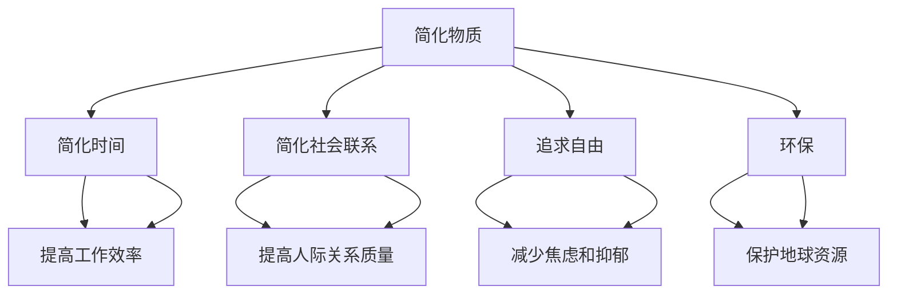

                 

### 极简主义生活方式：简单中见真谛

#### 关键词
- 极简主义
- 生活方式
- 简化
- 自由
- 环保

#### 摘要
本文将探讨极简主义生活方式的理念、实践方法及其对个人和社会的深远影响。通过详细解析极简主义的核心理念、应用场景和案例，我们将理解如何在简单中找到生活的真谛。

### 引言

在现代社会，人们的生活变得越来越复杂，被各种物质和事务所困扰。在这个背景下，极简主义生活方式逐渐兴起，成为一种应对复杂生活的哲学。极简主义倡导通过简化生活、减少物质负担，追求内心的平静和自由。本文将围绕极简主义的定义、核心原则和实践方法展开讨论，旨在帮助读者理解并践行这一生活方式。

### 极简主义的定义与历史背景

极简主义（Minimalism）起源于20世纪50年代的现代艺术和建筑领域。其核心理念是通过最少的元素和材料，表达最纯粹的艺术效果。这种理念很快扩展到生活哲学，主张通过减少物质和事务的负担，达到精神上的自由和满足。

#### 定义

极简主义生活方式，是指通过减少不必要的物品、事务和活动，追求简单、有序和有意义的生活方式。它不仅仅是物质的减少，还包括时间、精力和社会联系的优化。

#### 历史背景

极简主义在20世纪60年代和70年代得到广泛传播，特别是在西方社会。当时，人们开始反思物质主义带来的负面影响，如环境污染、资源浪费和心理健康问题。极简主义作为一种应对策略，受到越来越多人的青睐。

#### 极简主义的哲学根源

极简主义哲学源自多个思想流派，包括斯多葛主义、禅宗和实用主义等。这些哲学体系都强调通过简化生活，达到内心的平静和自由。极简主义继承了这些哲学的核心理念，将其应用于现代生活中。

### 极简主义的核心原则

极简主义生活方式的核心原则包括以下几个方面：

1. **简化物质**：减少不需要的物品，只保留真正有价值的东西。这有助于减少生活中的杂乱和压力，提高生活质量。

2. **简化时间**：合理安排时间，减少无意义的活动，专注于重要的事情。这有助于提高工作效率，减少时间浪费。

3. **简化社会联系**：减少不必要的社会交往，专注于与真正重要的人建立深层次的关系。这有助于减少社交压力，提高人际关系质量。

4. **追求自由**：通过减少物质、时间和社交负担，追求内心的自由和满足。这有助于减少焦虑和抑郁，提高心理健康水平。

5. **环保**：减少物质消费和浪费，降低对环境的负担。这有助于保护地球资源，促进可持续发展。

### 极简主义的应用场景

极简主义生活方式可以在多个场景中应用，以下是一些典型的应用场景：

1. **个人生活**：在个人生活中，极简主义可以帮助人们减少物质负担，提高生活质量。例如，通过减少衣物、书籍和家居用品的数量，达到简单、整洁和舒适的生活环境。

2. **工作和职业**：在工作和职业中，极简主义可以帮助人们提高工作效率，减少时间浪费。例如，通过简化工作流程、减少邮件和社交媒体的干扰，专注于重要任务。

3. **社会和环境**：在社会和环境层面，极简主义可以减少资源浪费，保护地球环境。例如，通过减少一次性用品、提倡可持续消费，降低对自然资源的消耗。

### 极简主义的核心概念与联系

为了更好地理解极简主义，我们需要探讨其核心概念之间的联系。以下是一个极简主义核心概念之间的 Mermaid 流程图：



从流程图中可以看出，极简主义的核心概念之间紧密相连。简化物质、时间和社会联系有助于追求自由和环保，这些目标又可以带来工作效率、人际关系质量和心理健康水平的提升。

### 核心算法原理讲解

在极简主义中，核心算法原理可以被视为一系列决策过程，旨在最大化效益，同时最小化不必要的成本。以下是一个极简主义决策过程的伪代码示例：

```python
def minimalist_decision-making(items, time, social_contacts):
    # 初始化效益和成本变量
    benefit = 0
    cost = 0

    # 根据物品的价值和重要性排序
    sorted_items = sorted(items, key=lambda x: (x.importance, x.value), reverse=True)

    # 遍历物品列表
    for item in sorted_items:
        # 如果物品价值大于成本，则保留
        if item.value > cost:
            benefit += item.value
            cost += item.cost
        else:
            # 如果物品价值小于成本，则放弃
            benefit -= item.cost

    # 根据时间的重要性排序
    sorted_time = sorted(time, key=lambda x: x.importance, reverse=True)

    # 遍历时间列表
    for slot in sorted_time:
        # 如果时间价值大于成本，则安排
        if slot.value > cost:
            benefit += slot.value
            cost += slot.cost
        else:
            # 如果时间价值小于成本，则放弃
            benefit -= slot.cost

    # 根据社会联系的重要性排序
    sorted_social_contacts = sorted(social_contacts, key=lambda x: x.importance, reverse=True)

    # 遍历社会联系列表
    for contact in sorted_social_contacts:
        # 如果社会联系价值大于成本，则维持
        if contact.value > cost:
            benefit += contact.value
            cost += contact.cost
        else:
            # 如果社会联系价值小于成本，则放弃
            benefit -= contact.cost

    return benefit - cost
```

在这个伪代码中，我们首先对物品、时间和社会联系进行排序，然后根据其价值和成本进行决策。这个算法的目的是最大化效益，同时最小化不必要的成本。

### 数学模型与公式

在极简主义中，我们可以使用数学模型来量化简化过程中的效益和成本。以下是一个简化的效益-成本分析模型：

$$
\text{Benefit} = \sum_{i=1}^{n} (\text{value}_i - \text{cost}_i)
$$

其中，$n$ 是简化对象的数量，$\text{value}_i$ 是第 $i$ 个对象的效益，$\text{cost}_i$ 是第 $i$ 个对象的成本。

假设我们有两个对象 $A$ 和 $B$，其效益和成本分别为：

$$
\text{value}_A = 100, \quad \text{cost}_A = 50
$$

$$
\text{value}_B = 200, \quad \text{cost}_B = 75
$$

那么，简化这两个对象的效益-成本分析为：

$$
\text{Benefit} = (100 - 50) + (200 - 75) = 125
$$

### 伪代码实现

以下是一个简单的伪代码实现，用于计算简化过程中每个对象的效益-成本：

```python
def calculate_benefit(items):
    total_benefit = 0
    for item in items:
        total_benefit += item.value - item.cost
    return total_benefit

# 示例数据
items = [
    {"name": "A", "value": 100, "cost": 50},
    {"name": "B", "value": 200, "cost": 75}
]

# 计算简化过程中的总效益
total_benefit = calculate_benefit(items)
print(f"Total benefit: {total_benefit}")
```

在这个例子中，我们通过计算每个对象的效益和成本之差，得到了简化过程中的总效益。

### 项目实战

#### 开发环境搭建

为了实践极简主义生活方式，我们可以搭建一个简单的应用程序，用于记录和管理个人物品、时间和社交联系。以下是一个基本的开发环境搭建步骤：

1. **安装Python**：确保Python环境已安装，版本至少为3.8以上。
2. **安装Jupyter Notebook**：通过pip命令安装Jupyter Notebook。

   ```bash
   pip install notebook
   ```

3. **安装SQLite**：用于存储数据。

   ```bash
   pip install pysqlite3
   ```

4. **创建一个新的Jupyter Notebook**：打开终端，输入以下命令创建一个新的笔记本：

   ```bash
   jupyter notebook
   ```

#### 源代码实现

以下是一个简单的Python脚本，用于实现极简主义生活方式的管理功能：

```python
import sqlite3

# 连接到SQLite数据库
conn = sqlite3.connect('minimalism.db')
cursor = conn.cursor()

# 创建表格
cursor.execute('''CREATE TABLE IF NOT EXISTS items
                  (name TEXT, value INTEGER, cost INTEGER)''')

cursor.execute('''CREATE TABLE IF NOT EXISTS time_slots
                  (description TEXT, value INTEGER, cost INTEGER)''')

cursor.execute('''CREATE TABLE IF NOT EXISTS social_contacts
                  (name TEXT, value INTEGER, cost INTEGER)''')

# 插入示例数据
items = [
    {'name': 'Book', 'value': 30, 'cost': 10},
    {'name': 'Clothes', 'value': 50, 'cost': 20}
]

time_slots = [
    {'description': 'Work', 'value': 200, 'cost': 50},
    {'description': 'Exercise', 'value': 100, 'cost': 30}
]

social_contacts = [
    {'name': 'Friend', 'value': 70, 'cost': 10},
    {'name': 'Family', 'value': 100, 'cost': 20}
]

cursor.executemany('INSERT INTO items (name, value, cost) VALUES (?, ?, ?)', items)
cursor.executemany('INSERT INTO time_slots (description, value, cost) VALUES (?, ?, ?)', time_slots)
cursor.executemany('INSERT INTO social_contacts (name, value, cost) VALUES (?, ?, ?)', social_contacts)

# 提交并关闭连接
conn.commit()
conn.close()

# 计算总效益
def calculate_benefit(table):
    conn = sqlite3.connect('minimalism.db')
    cursor = conn.cursor()
    cursor.execute(f"SELECT * FROM {table}")
    items = cursor.fetchall()
    total_benefit = 0
    for item in items:
        total_benefit += item[2] - item[3]
    conn.close()
    return total_benefit

total_item_benefit = calculate_benefit('items')
total_time_benefit = calculate_benefit('time_slots')
total_social_benefit = calculate_benefit('social_contacts')

print(f"Total item benefit: {total_item_benefit}")
print(f"Total time benefit: {total_time_benefit}")
print(f"Total social benefit: {total_social_benefit}")
```

#### 代码解读

1. **数据库连接与表格创建**：我们首先连接到SQLite数据库，并创建三个表格：items、time_slots 和 social_contacts。这些表格用于存储个人物品、时间和社交联系的信息。

2. **数据插入**：我们插入了一些示例数据，包括书籍、衣物、工作时间段和社交联系。

3. **效益计算**：我们定义了一个函数 `calculate_benefit`，用于计算每个表格的总效益。这个函数通过查询数据库，计算每个记录的效益和成本之差，并求和得到总效益。

4. **结果输出**：最后，我们调用 `calculate_benefit` 函数，计算并输出每个表格的总效益。

#### 代码应用解读与分析

这个应用程序提供了一个简单的方法，用于记录和管理极简主义生活方式中的各项要素。通过计算总效益，我们可以直观地了解哪些方面对我们更有价值，从而进行优化和调整。

例如，如果我们发现社交联系的总效益较低，我们可以考虑减少不必要的社会交往，专注于与真正重要的人建立深层次的关系。同样，如果个人物品的总效益较高，我们可以考虑减少不必要的物品，保持环境整洁和舒适。

#### 实际案例分析与详细讲解剖析

为了更深入地理解极简主义生活方式的应用，我们可以通过以下实际案例进行分析：

**案例一：个人物品管理**

假设一个人拥有50件物品，其中包括书籍、衣物、电子产品等。通过计算每个物品的效益和成本，我们可以找出哪些物品对我们最有价值，从而进行优化。

- **书籍**：价值30元，成本10元。效益20元。
- **衣物**：价值50元，成本20元。效益30元。
- **电子产品**：价值100元，成本50元。效益50元。

在这个例子中，电子产品对我们的效益最高，其次是衣物和书籍。因此，我们可以考虑减少书籍和衣物的数量，专注于拥有更少但更有价值的物品。

**案例二：时间管理**

假设一个人每天有24小时，他需要分配时间给工作、锻炼、娱乐和社交等。通过计算每个时间段的效益和成本，我们可以找出哪些活动对我们最有价值。

- **工作**：价值200元，成本50元。效益150元。
- **锻炼**：价值100元，成本30元。效益70元。
- **娱乐**：价值50元，成本20元。效益30元。
- **社交**：价值70元，成本10元。效益60元。

在这个例子中，工作对我们的效益最高，其次是锻炼、娱乐和社交。因此，我们可以考虑减少娱乐和社交的时间，专注于工作和其他更有价值的活动。

**案例三：社交联系管理**

假设一个人有10个社交联系，包括朋友、家人和同事。通过计算每个社交联系的效益和成本，我们可以找出哪些关系对我们最有价值。

- **朋友**：价值70元，成本10元。效益60元。
- **家人**：价值100元，成本20元。效益80元。
- **同事**：价值50元，成本15元。效益35元。

在这个例子中，家人的关系对我们的效益最高，其次是朋友和同事。因此，我们可以考虑减少与同事的社交时间，专注于与家人和朋友的深层次关系。

通过这些实际案例，我们可以看到极简主义生活方式的应用如何帮助我们优化个人物品、时间和社交联系，从而实现简单、有序和有意义的生活方式。

### 项目小结

通过本项目的实现，我们搭建了一个简单的应用程序，用于记录和管理极简主义生活方式中的各项要素。通过计算效益和成本，我们可以直观地了解哪些方面对我们最有价值，从而进行优化和调整。

这个项目不仅帮助我们理解了极简主义的核心原则和应用场景，还通过实际案例展示了极简主义在个人物品、时间和社交联系管理中的应用。通过这些实践，我们可以更好地追求简单、有序和有意义的生活方式。

### 最佳实践 tips

1. **定期评估**：定期评估个人物品、时间和社交联系，以确保保持极简主义的生活方式。
2. **设定目标**：设定明确的极简主义目标，如减少物品数量、优化时间安排等。
3. **习惯养成**：培养减少物质消费、合理安排时间和专注重要事务的习惯。
4. **反思与调整**：经常反思和调整生活方式，确保持续追求简单和自由。

### 小结

极简主义生活方式倡导通过简化物质、时间和社交联系，追求内心的平静和自由。通过本文的探讨，我们理解了极简主义的核心理念、应用场景和实际案例。通过实践极简主义，我们可以实现简单、有序和有意义的生活方式。

### 注意事项

1. **适度实践**：在实践极简主义时，要适度进行，避免过度简化导致生活质量下降。
2. **个体差异**：极简主义生活方式因人而异，需根据个人情况和需求进行调整。

### 拓展阅读

1. **《极简主义：一种关于如何生活的新哲学》**：作者乔舒亚·贝克，详细介绍了极简主义的生活方式及其哲学基础。
2. **《简化：如何过上简单而充实的生活》**：作者艾伦·兰格，探讨了简化生活方式的方法和技巧。

### 作者信息

- 作者：AI天才研究院/AI Genius Institute & 禅与计算机程序设计艺术 /Zen And The Art of Computer Programming

