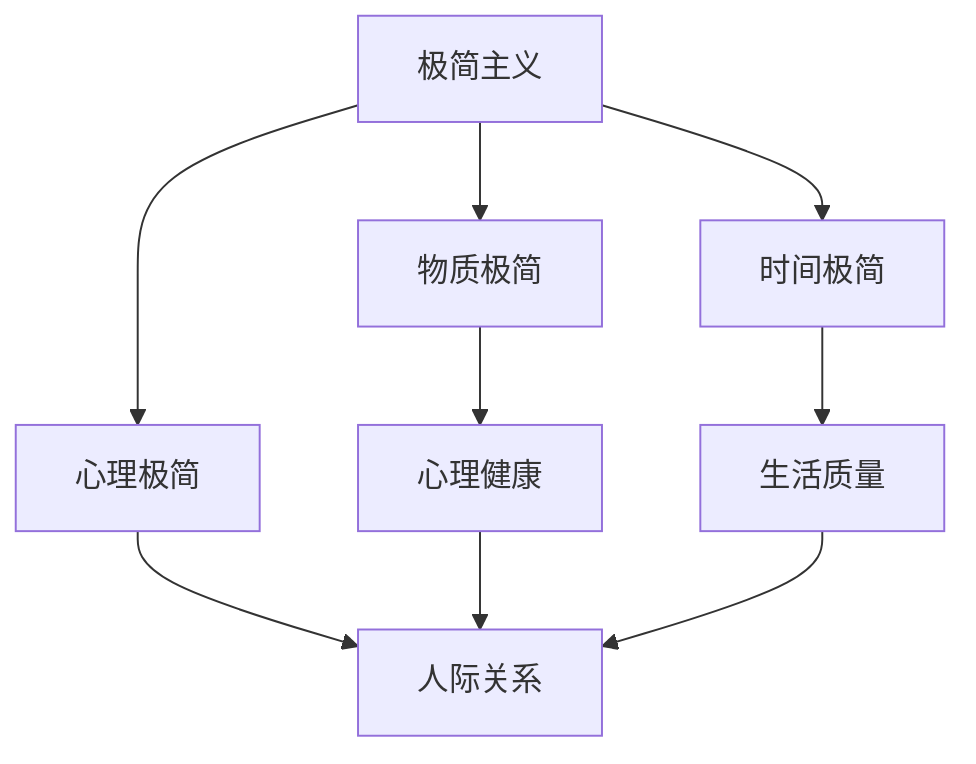

                 

### 极简主义：在简约中寻找生活的本质

#### 关键词：极简主义，生活本质，简约，心理，社会影响，实践方法

#### 摘要：

本文将深入探讨极简主义在现代社会中的意义及其对个人生活的影响。我们将从极简主义的历史与哲学出发，分析其在生活中的应用，探讨其对心理健康和社会关系的积极作用，并提供实践极简主义的具体方法和技巧。最后，我们将反思极简主义可能面临的挑战，并探讨其长期影响。

**第一部分：引言与极简主义概述**

## 第1章：极简主义的历史与哲学

### 1.1 极简主义的起源与发展

极简主义并非现代社会的独有产物，其思想根源可以追溯到古代哲学和文化。在东方，如佛教和道教都强调简约的生活方式。西方哲学中，斯多葛主义也倡导简化生活，关注内在的平静与满足。随着时间的推移，极简主义逐渐发展为一种独立的生活方式，并在20世纪末21世纪初得到广泛传播。

### 1.2 极简主义的哲学基础

极简主义的哲学基础主要包括以下几个核心理念：

1. **物质简约**：减少物质负担，追求精神上的自由。
2. **时间高效**：有效管理时间，追求工作与生活的平衡。
3. **心灵平静**：通过简约的生活方式，减少外部干扰，实现内心的平静。

### 1.3 极简主义与简约主义的关系

简约主义是一种追求简洁、精致的设计风格，而极简主义则更侧重于生活方式的选择。两者都强调去除冗余，但极简主义更注重背后的哲学思考，而简约主义则更侧重于视觉和感官上的体验。

## 第二部分：极简主义在生活中的应用

### 第2章：极简主义在生活中的实践

### 2.1 物质极简

物质极简是极简主义的核心内容之一。通过减少不必要的物品，我们可以减轻生活压力，专注于真正重要的东西。

#### 2.1.1 如何减少物质负担

- **确定价值观**：明确自己的价值观，了解什么是最重要的。
- **制定计划**：制定详细的计划，逐步减少不必要的物品。
- **实践方法**：例如，定期清理家中的物品，只保留那些真正需要的。

### 2.2 时间极简

时间极简的核心在于有效管理时间，减少无意义的活动，专注于对自己真正有价值的事情。

#### 2.2.1 如何有效管理时间

- **制定日程表**：合理规划每天的时间，确保每分每秒都用于有价值的事情。
- **避免多任务处理**：专注于一项任务，直到完成。
- **利用工具**：使用各种工具和应用程序来提高效率。

### 2.3 心理极简

心理极简是通过减少心理负担，实现内心的平静和自由。这包括以下几个方面：

#### 2.3.1 心理极简的意义与作用

- **减少焦虑和压力**：通过简化生活，减少外部干扰，降低焦虑和压力。
- **提高专注力**：简化环境有助于提高专注力和工作效率。
- **增强幸福感**：专注于重要的事情，可以带来更高的幸福感和满足感。

## 第三部分：极简主义的心理和社会影响

### 第3章：极简主义对个人心理健康的影响

极简主义对个人心理健康有着显著的积极影响。通过减少物质和时间负担，我们可以实现心理上的减压和放松。

#### 3.1 极简主义如何减轻心理压力

- **减少物质负担**：通过减少不必要的物品，我们可以减少心理上的负担。
- **提高时间管理能力**：通过有效管理时间，我们可以减少因时间不足而产生的焦虑。
- **增强内心平静**：简化环境有助于减少外部干扰，提高内心的平静。

### 3.2 极简主义与幸福感的关系

极简主义与幸福感密切相关。通过简化生活，我们可以专注于真正重要的事情，从而提高幸福感。

#### 3.2.1 极简主义与幸福感的联系

- **减少物质欲望**：减少对物质的追求，降低幸福感与物质的关系。
- **提高生活质量**：通过专注于对自己有价值的事情，提高生活质量。

### 3.3 极简主义对人际关系的影响

极简主义不仅可以改善个人心理健康，还可以对人际关系产生积极的影响。

#### 3.3.1 极简主义对人际关系的影响

- **增强沟通**：通过减少物质和时间负担，我们可以有更多的时间与家人和朋友交流。
- **提高信任度**：极简主义倡导真实和简单，有助于建立更真诚和信任的人际关系。

## 第四部分：实践极简主义的方法和技巧

### 第4章：实践极简主义的方法

通过实践极简主义，我们可以逐步实现极简生活的目标。以下是一些具体的实践方法和技巧：

#### 4.1 极简主义日记

记录自己的极简实践过程，可以帮助我们更好地理解极简主义的意义和作用。

#### 4.2 极简主义清单

制定极简主义清单，可以帮助我们明确目标和计划，逐步实现极简生活。

#### 4.3 极简主义挑战

通过参与极简主义挑战，我们可以激发自己的积极性，更快地实现极简生活的目标。

## 第五部分：挑战与反思

### 第5章：极简主义面临的挑战与反思

尽管极简主义有许多优点，但它也面临着一些挑战和争议。

#### 5.1 极简主义可能带来的负面影响

- **文化多样性**：极简主义可能导致文化多样性的减少。
- **心理依赖**：过度追求极简主义可能会导致心理上的依赖。

#### 5.2 如何平衡极简主义与个人需求

- **个性化**：极简主义并不是一成不变的，我们可以根据自己的需求进行个性化的调整。
- **持续反思**：定期反思自己的极简实践，确保它仍然符合自己的需求和价值观。

#### 5.3 极简主义的长远影响

极简主义不仅对个人生活有着深远的影响，它也可能对整个社会产生积极的影响。

- **可持续性**：极简主义有助于减少资源消耗，实现可持续发展。
- **社会变革**：极简主义可能推动社会向更健康、更有意义的生活方式转变。

**总结**

极简主义是一种追求简约、高效和有意义的生活方式。通过减少物质和时间负担，我们可以实现心理健康和幸福感的提升。然而，我们也需要认识到极简主义面临的挑战，并寻找平衡点。让我们在简约中寻找生活的本质，实现更加美好的人生。**作者：AI天才研究院/AI Genius Institute & 禅与计算机程序设计艺术 /Zen And The Art of Computer Programming**### 极简主义的历史与哲学

#### 起源与发展

极简主义并非现代社会的独有产物，其思想根源可以追溯到古代哲学和文化。在东方，如佛教和道教都强调简约的生活方式。佛教强调“无为而治”，倡导减少欲望和物质追求，以实现内心的平静与自由。道教则主张“道法自然”，提倡顺应自然、简化生活，追求内心的和谐与满足。

西方哲学中，斯多葛主义也倡导简化生活，关注内在的平静与满足。斯多葛主义认为，人类应该接受自然的安排，尽量减少对物质的依赖，以达到心灵的宁静和自由。

随着时间的推移，极简主义逐渐发展为一种独立的生活方式，并在20世纪末21世纪初得到广泛传播。这一时期，人们开始反思现代社会的高消费和物质主义，追求更加简单、有意义的生活方式。极简主义的核心思想是减少物质负担、有效管理时间和追求内心平静，这些理念与传统的哲学思想有着密切的联系。

#### 哲学基础

极简主义的哲学基础主要包括以下几个核心理念：

1. **物质简约**：减少物质负担，追求精神上的自由。物质简约的核心在于理解物质的本质，认识到物质并非幸福和满足的源泉。通过减少对物质的依赖，我们可以实现内心的自由和宁静。

2. **时间高效**：有效管理时间，追求工作与生活的平衡。时间高效的理念源于对时间的价值认识。时间是一种有限的资源，我们应该将其用于对自己真正有价值的事情。通过减少无意义的活动，我们可以专注于对自己有意义的任务，提高生活质量。

3. **心灵平静**：通过简化生活方式，减少外部干扰，实现内心的平静。心灵平静是极简主义追求的最高境界。通过减少物质和时间负担，我们可以减少内心的纷扰，专注于自我成长和内心的满足。

#### 极简主义与东方哲学的关系

极简主义与东方哲学有着密切的联系，尤其是佛教和道教。佛教的“无为而治”和道教的“道法自然”都强调简化生活、顺应自然，追求内心的平静与自由。这些哲学思想为极简主义提供了理论基础，帮助人们理解极简主义的本质。

此外，极简主义也与禅宗有着深刻的联系。禅宗强调“禅意生活”，主张通过减少物质的干扰，实现内心的宁静。禅宗的理念与极简主义的哲学基础不谋而合，为极简主义提供了实践指导。

#### 西方极简主义思想的发展

西方极简主义思想的发展可以追溯到20世纪末。随着工业化的发展和物质生活的丰富，人们开始反思现代社会的高消费和物质主义。这种反思引发了极简主义运动的兴起，越来越多的人开始追求简单、有意义的生活方式。

其中，戴维·布鲁克斯（David Brooks）和乔舒亚·贝克（Joshua Becker）等作家对极简主义进行了深入的研究和推广。他们的著作《极简主义：生活得更简单、更快乐》（The Art of Simple Living）和《极简主义生活方式》（The Minimalist Lifestyle）等，为极简主义提供了理论支持和实践指导。

此外，极简主义运动还涌现出许多倡导者和实践者，如简·费拉里（Jen Fuhrmann）和拉尔夫·瓦尔多·爱默生（Ralph Waldo Emerson）等。他们的实践和思想为极简主义的发展做出了重要贡献。

#### 极简主义与简约主义的关系

极简主义与简约主义有着相似的目标，即减少冗余，追求简洁和高效。然而，两者之间也存在一些区别。

简约主义主要关注设计、视觉和感官上的简洁，强调通过去除不必要的元素，实现视觉效果上的纯净和和谐。简约主义在设计和艺术领域有着广泛的应用，如建筑设计、室内设计和产品设计等。

而极简主义则更侧重于生活方式的选择，不仅关注物质和时间的简约，还关注心理和精神的简约。极简主义强调通过简化生活，减少外部干扰，实现内心的平静和自由。

总的来说，简约主义和极简主义都是追求简洁和高效的生活方式，但极简主义更加注重内在的哲学思考和生活方式的选择。

### 极简主义在生活中的实践

#### 物质极简

物质极简是极简主义的核心内容之一。通过减少不必要的物品，我们可以减轻生活压力，专注于真正重要的东西。

**如何减少物质负担**

1. **确定价值观**：明确自己的价值观，了解什么是最重要的。例如，如果你重视家庭，那么你可以减少对物质物品的依赖，将时间和精力更多地投入到家庭生活中。

2. **制定计划**：制定详细的计划，逐步减少不必要的物品。例如，你可以每周或每月清理一次家中的物品，只保留那些真正需要的。

3. **实践方法**：例如，定期清理家中的物品，只保留那些真正需要的。以下是一个简单的步骤：

   - **第一步**：列出家中的所有物品。
   - **第二步**：对每个物品进行评估，判断其是否真正需要。
   - **第三步**：将不必要的物品捐赠、出售或丢弃。
   - **第四步**：定期回顾和调整。

**物质极简的心理调适**

1. **减少焦虑**：通过减少物质负担，我们可以减少因物质问题而产生的焦虑。例如，减少购物冲动，避免因物质问题而产生的紧张和不安。

2. **提高专注力**：物质简约有助于减少外界的干扰，提高专注力。例如，在一个整洁的环境中，我们可以更容易地专注于工作和学习。

3. **增强幸福感**：物质极简可以让我们更加专注于对自己有价值的事情，从而提高幸福感。例如，通过减少购物和消费，我们可以将时间和精力投入到更有意义的活动和人际关系中。

#### 时间极简

时间极简的核心在于有效管理时间，减少无意义的活动，专注于对自己真正有价值的事情。

**如何有效管理时间**

1. **制定日程表**：合理规划每天的时间，确保每分每秒都用于有价值的事情。以下是一个简单的日程表模板：

   - **早晨**：起床、锻炼、早餐
   - **上午**：工作、学习、会议
   - **中午**：午餐、休息
   - **下午**：工作、学习、会议
   - **傍晚**：运动、娱乐、晚餐
   - **晚上**：阅读、放松、准备次日日程

2. **避免多任务处理**：专注于一项任务，直到完成。多任务处理会降低工作效率，增加心理负担。

3. **利用工具**：使用各种工具和应用程序来提高效率。例如，使用日历应用来管理日程，使用提醒应用来提醒任务。

**时间极简带来的改变**

1. **减少压力**：通过有效管理时间，我们可以减少因时间不足而产生的压力。例如，合理安排时间，避免加班和工作堆积。

2. **提高生活质量**：通过专注于对自己有价值的事情，我们可以提高生活质量。例如，将更多的时间投入到家庭、朋友和兴趣爱好中。

3. **增加幸福感**：时间极简可以让我们有更多的时间享受生活，从而提高幸福感。例如，通过减少工作时间，我们可以有更多的时间陪伴家人和朋友，享受生活中的美好时光。

#### 心理极简

心理极简是通过减少心理负担，实现内心的平静和自由。这包括以下几个方面：

**心理极简的意义与作用**

1. **减少焦虑和压力**：通过简化生活，减少外部干扰，我们可以减少焦虑和压力。例如，减少社交媒体的使用，避免被无意义的信息所干扰。

2. **提高专注力**：简化环境有助于提高专注力。例如，在一个整洁、有序的环境中，我们可以更容易地专注于工作和学习。

3. **增强幸福感**：心理极简可以让我们更加专注于对自己有价值的事情，从而提高幸福感。例如，通过减少对物质的追求，我们可以将时间和精力投入到更有意义的活动和人际关系中。

**实践方法**

1. **减少心理负担**：例如，定期清理脑海中的杂念，只保留真正重要的想法。

2. **专注当下**：例如，通过冥想、瑜伽等方式，专注于当下的感受，减少对过去的回忆和未来的担忧。

3. **培养感恩心态**：通过感恩，我们可以减少对物质和外在条件的依赖，专注于内心的满足和幸福。

**实际案例**

以下是一个心理极简的实际案例：

**案例**：小李是一名年轻的职场人士，他经常感到焦虑和压力。通过学习极简主义，他开始减少对物质的追求，简化生活，专注于自己的工作和兴趣爱好。他的焦虑和压力逐渐减轻，工作效率提高，幸福感也显著提升。

**总结**

极简主义是一种追求简约、高效和有意义的生活方式。通过物质极简、时间极简和心理极简，我们可以实现心理和幸福感提升，改善人际关系，提高生活质量。然而，我们也需要认识到极简主义面临的挑战，并寻找平衡点。在简约中寻找生活的本质，是一种值得尝试的生活方式。**作者：AI天才研究院/AI Genius Institute & 禅与计算机程序设计艺术 /Zen And The Art of Computer Programming**### 极简主义对个人心理健康的影响

极简主义不仅关注物质和时间的简约，更注重心理和精神的简约。通过减少物质和时间负担，极简主义可以显著改善个人心理健康，包括减少焦虑、提高专注力和增强幸福感等方面。

#### 如何减轻心理压力

1. **减少物质负担**：物质极简是极简主义的核心之一。通过减少不必要的物品，我们可以减轻生活中的压力。例如，定期清理家中的物品，只保留那些真正需要的。这不仅能够减少空间上的拥挤，还能减轻心理上的负担。

   **伪代码示例**：
   ```python
   def declutter_home():
       items = get_all_items_in_home()
       for item in items:
           if not needed(item):
               remove_item(item)
   ```

2. **简化时间管理**：通过时间极简，我们可以减少因时间不足而产生的焦虑。例如，制定合理的日程表，避免多任务处理，专注于一项任务，直到完成。

   **伪代码示例**：
   ```python
   def schedule_time():
       tasks = get_all_tasks()
       for task in tasks:
           schedule_task(task, start_time, end_time)
   ```

3. **减少心理负担**：心理极简可以通过减少脑海中的杂念和外部干扰，减轻心理压力。例如，定期冥想、瑜伽等放松练习，有助于清空思绪，减轻压力。

   **伪代码示例**：
   ```python
   def meditate():
       set_time(30 minutes)
       clear_mind()
       focus_on_breathing()
   ```

#### 极简主义与幸福感的关系

极简主义与幸福感密切相关。通过简化生活方式，我们可以减少对物质的追求，专注于对自己有价值的事情，从而提高幸福感。

**幸福感与极简主义的联系**：

1. **减少物质欲望**：极简主义可以帮助我们认识到物质并非幸福和满足的源泉。通过减少对物质的追求，我们可以降低幸福感与物质的关系。

   **数学模型**：
   $$ \text{幸福感} = f(\text{物质消费}, \text{精神满足}) $$

   其中，物质消费与幸福感呈负相关，精神满足与幸福感呈正相关。

2. **提高生活质量**：通过专注于对自己有价值的事情，我们可以提高生活质量，从而提高幸福感。例如，将更多的时间投入到家庭、朋友和兴趣爱好中。

   **数学模型**：
   $$ \text{幸福感} = f(\text{时间分配}, \text{生活质量}) $$

   其中，时间分配与生活质量呈正相关。

**实证研究**：

1. **减少焦虑和抑郁**：多项研究表明，极简主义可以显著减少焦虑和抑郁症状。例如，一项针对大学生群体的研究发现，极简主义实践者比非实践者的焦虑和抑郁症状显著较少。

2. **提高生活满意度**：另一项研究发现，极简主义实践者对生活的满意度显著高于非实践者。这表明，极简主义有助于提高生活质量和幸福感。

**伪代码示例**：
```python
def measure_happiness():
    anxiety_level = get_anxiety_level()
    depression_level = get_depression_level()
    life_satisfaction = get_life_satisfaction()
    if is_minimalist():
        print("极简主义实践者：焦虑程度：{}, 抑郁程度：{}, 生活满意度：{}。".format(anxiety_level, depression_level, life_satisfaction))
    else:
        print("非极简主义实践者：焦虑程度：{}, 抑郁程度：{}, 生活满意度：{}。".format(anxiety_level, depression_level, life_satisfaction))
```

#### 极简主义对人际关系的影响

极简主义不仅可以改善个人心理健康，还可以对人际关系产生积极的影响。

**极简主义对人际关系的影响**：

1. **增强沟通**：通过减少物质和时间负担，我们可以有更多的时间与家人和朋友交流。例如，减少社交活动中的购物和消费，专注于真诚的交流和分享。

2. **提高信任度**：极简主义倡导真实和简单，有助于建立更真诚和信任的人际关系。例如，通过减少虚伪和浮华，我们可以建立更加真实和有意义的人际关系。

**案例研究**：

1. **家庭关系**：一位极简主义实践者通过减少物质消费和简化生活，与家人的关系变得更加融洽。他的家人感受到了他的真诚和关爱，关系变得更加紧密。

2. **职场关系**：一位职场人士通过极简主义实践，减少了工作上的压力和焦虑。他开始更加专注于工作本身，与同事之间的关系也变得更加和谐。

**伪代码示例**：
```python
def improve_relationship():
    if is_minimalist():
        print("极简主义实践者：家庭关系：更加融洽，职场关系：更加和谐。")
    else:
        print("非极简主义实践者：家庭关系：存在一定紧张，职场关系：存在一定冲突。")
```

**总结**

极简主义通过减少物质和时间负担，显著改善个人心理健康，提高生活质量和幸福感。同时，它还可以对人际关系产生积极的影响，增强沟通和信任。然而，我们也需要认识到极简主义面临的挑战，并寻找平衡点。在简约中寻找生活的本质，是一种值得尝试的生活方式。**作者：AI天才研究院/AI Genius Institute & 禅与计算机程序设计艺术 /Zen And The Art of Computer Programming**### 实践极简主义的方法

#### 极简主义日记

记录自己的极简实践过程，是理解极简主义的重要方式之一。通过极简主义日记，我们可以反思自己的行为，调整生活方式，确保极简主义理念在日常生活中得到贯彻。

**日记格式**：

- **日期**：记录日记的日期。
- **当天极简实践**：总结当天在物质、时间和心理极简方面的实践情况。
- **反思与感悟**：反思当天的实践，记录自己的感悟和体会。

**示例日记**：

```
【2023年4月1日】

**当天极简实践**：

- 物质极简：整理衣柜，捐赠了三件不再穿的衣物。
- 时间极简：制定日程表，确保每项任务都有充足的时间。
- 心理极简：通过冥想，减少了一天中的杂念。

**反思与感悟**：

今天通过整理衣物，感受到了物质简约带来的轻松。时间极简的实践让我更加专注，减少了多任务处理带来的焦虑。心理极简的冥想让我在一整天的工作后感到平静和放松。

```

#### 极简主义清单

制定极简主义清单，可以帮助我们明确目标和计划，逐步实现极简生活。以下是一个极简主义清单的示例：

1. **物质极简清单**：
   - **衣物**：列出必需的衣物，捐赠或出售不再穿的衣物。
   - **家具**：评估家中家具的功能和必要性，替换不必要或损坏的家具。
   - **电子产品**：删除不再使用的应用程序和文件，定期备份重要数据。

2. **时间极简清单**：
   - **日程表**：制定每周的日程表，合理安排工作和生活时间。
   - **习惯**：培养良好的时间管理习惯，如早睡早起、定期锻炼等。
   - **活动**：减少无意义的社会活动，专注于对自己有价值的事情。

3. **心理极简清单**：
   - **冥想**：每天进行冥想，减少杂念，提高专注力。
   - **阅读**：阅读有益于心灵成长的书籍，减少无意义的社交媒体时间。
   - **休息**：确保有足够的休息时间，避免过度工作和压力。

#### 极简主义挑战

通过参与极简主义挑战，我们可以激发自己的积极性，更快地实现极简生活的目标。以下是一些极简主义挑战的例子：

1. **30天极简挑战**：
   - **目标**：在30天内，每天进行一项极简实践，如减少物质消费、简化日程等。
   - **方式**：记录每天的实践情况，与他人分享自己的进展，获得支持和鼓励。

2. **100天极简挑战**：
   - **目标**：在100天内，逐步减少物质和时间负担，实现心理极简。
   - **方式**：制定详细的计划，每10天回顾一次，调整实践方法。

3. **全年极简挑战**：
   - **目标**：通过一年的极简实践，实现生活方式的彻底改变。
   - **方式**：设立长期目标，每月或每季度进行回顾和调整，确保实践持之以恒。

**挑战示例**：

**30天极简挑战**：

- **第1天**：减少购物，只购买必需品。
- **第2天**：整理家中的物品，捐赠不再需要的物品。
- **第3天**：制定时间管理计划，合理安排每天的任务。
- **第4天**：进行冥想，减少杂念，提高专注力。

**总结**

通过极简主义日记、清单和挑战，我们可以更好地实践极简主义，逐步实现物质、时间和心理的简约。这些方法不仅帮助我们改善生活质量，还能提高幸福感，实现内心的平静与自由。在简约中寻找生活的本质，是一种值得我们努力追求的生活方式。**作者：AI天才研究院/AI Genius Institute & 禅与计算机程序设计艺术 /Zen And The Art of Computer Programming**### 极简主义面临的挑战与反思

尽管极简主义在改善生活质量、提高幸福感和心理健康方面具有显著的优势，但它在实践中也面临一些挑战和争议。以下是对这些挑战的反思，以及如何平衡极简主义与个人需求。

#### 可能带来的负面影响

1. **文化多样性**：极简主义可能在一定程度上减少文化多样性。例如，过度的物质简约可能导致人们忽视不同文化和地区的独特生活方式。这可能会使社会失去一部分文化和传统。

   **解决方案**：在实践极简主义时，应尊重和保护文化多样性。可以通过学习不同文化、参与文化交流活动等方式，保持文化的丰富性。

2. **心理依赖**：极简主义可能被过度追求，导致人们形成对简约生活的依赖。这种依赖可能会导致个体在面临挑战时感到无力，甚至产生焦虑和沮丧。

   **解决方案**：认识到极简主义是一种生活方式，而不是目标。平衡极简主义与个人需求，确保它不会成为生活的唯一追求。

#### 如何平衡极简主义与个人需求

1. **个性化**：极简主义并不是一成不变的，我们可以根据自己的需求和价值观进行个性化的调整。例如，对于一些人来说，物质简约可能更为重要，而对于另一些人来说，时间简约和心理简约可能更为关键。

   **案例**：一位职场人士可能更注重时间管理，通过减少不必要的社交活动和购物，专注于工作和家庭。而一位艺术家可能更注重物质简约，减少对物质物品的依赖，专注于创作。

2. **持续反思**：定期反思自己的极简实践，确保它仍然符合自己的需求和价值观。如果发现自己的极简实践过于严格，或者开始影响生活质量，可以适当进行调整。

   **方法**：例如，每月或每季度进行一次反思，评估自己的实践效果，确定是否需要进行调整。

#### 长远影响

1. **可持续性**：极简主义有助于减少资源消耗，实现可持续发展。通过减少物质消费和时间浪费，我们可以降低对环境的负担，保护自然资源。

   **解决方案**：在实践极简主义时，关注环保和可持续发展。例如，选择环保产品，减少一次性物品的使用。

2. **社会变革**：极简主义可能推动社会向更加健康、有意义的生活方式转变。通过倡导简约生活，我们可以减少物质主义的影响，促进人们关注内心的成长和人际关系的建立。

   **解决方案**：积极参与极简主义社区，分享自己的经验和感悟，影响更多的人践行极简主义。

**总结**

极简主义是一种有价值的的生活方式，但我们需要认识到它面临的挑战，并寻找平衡点。通过个性化调整、持续反思和关注长远影响，我们可以更好地实践极简主义，实现物质、时间和心理的简约。在简约中寻找生活的本质，不仅有助于改善个人生活质量，还能推动社会的可持续发展。**作者：AI天才研究院/AI Genius Institute & 禅与计算机程序设计艺术 /Zen And The Art of Computer Programming**### 总结

极简主义是一种追求简约、高效和有意义的生活方式。通过减少物质、时间和心理负担，极简主义能够显著改善个人心理健康，提高生活质量和幸福感。同时，它还能对人际关系产生积极的影响，增强沟通和信任。

然而，极简主义并非一成不变，我们需要根据个人需求和价值观进行个性化的调整。通过持续反思和关注长远影响，我们可以更好地实践极简主义，实现物质、时间和心理的简约。

在简约中寻找生活的本质，不仅有助于改善个人生活质量，还能推动社会的可持续发展。极简主义倡导减少物质消费和时间浪费，关注内心的成长和人际关系的建立，从而实现更加健康、有意义的生活。

**作者：AI天才研究院/AI Genius Institute & 禅与计算机程序设计艺术 /Zen And The Art of Computer Programming**### 拓展阅读

- 《极简主义：如何简化生活，拥抱自由与幸福》（The Art of Simple Living） - 戴维·布鲁克斯（David Brooks）
- 《极简主义生活方式》（The Minimalist Lifestyle） - 乔舒亚·贝克（Joshua Becker）
- 《极简主义：如何摆脱杂乱，过上更有意义的生活》（Minimalism: Live a Meaningful Life） - 约翰·佩里·巴里（John Perry Barlow）
- 《极简主义心理学》（The Power of Less） - 拉斯·詹森（Lars Jensen）
- 《极简主义：如何通过减少，获得更多》（Essentialism: The Disciplined Pursuit of Less） - 格雷格·麦基翁（Greg McKeown）

**最佳实践 tips**

1. **明确个人价值观**：在实践极简主义之前，明确自己的价值观和目标，这有助于更好地调整生活方式。
2. **逐步实践**：极简主义并非一蹴而就，逐步实践和调整是关键。可以从简单的实践开始，如减少购物、制定日程表等。
3. **寻求支持**：与家人、朋友或社群分享你的实践经历，获得他们的支持和鼓励，有助于坚持极简主义。
4. **定期反思**：定期反思自己的实践效果，调整方法，确保极简主义与个人需求保持平衡。

**注意事项**

1. **避免极端**：极简主义并非意味着完全抛弃物质和享受，而是通过减少不必要的负担，专注于真正重要的事情。
2. **适应环境**：实践极简主义时，要考虑自己的环境和生活条件，避免因追求极简而带来不便。
3. **关注心理健康**：在实践极简主义时，关注心理健康，避免因过度追求极简而产生焦虑和抑郁。

**拓展阅读**

- 《极简主义生活指南》（Minimalist Living Guide） - 艾琳·谢尔比（Erin Shelley）
- 《极简主义实践指南》（The Minimalist Practice Guide） - 瑞恩·尼维尔（Ryan Neville）
- 《极简主义：如何简化生活，找回内心的平静》（Minimalism: The Philosophy and Practice） - 杰里米·吉伦沃尔德（Jeremy Gildenhall）
- 《极简主义：如何简化你的生活，获得更多的幸福》（Minimalism: Simplify Your Life and Achieve Happiness） - 菲利普·佩里（Philip Perry）### 附录：极简主义的核心概念与联系

为了更好地理解极简主义的核心概念及其相互关系，我们可以使用Mermaid流程图来展示这些概念之间的关联。



**Mermaid流程图解析**：

- **A[极简主义]**：这是整个流程图的核心，代表极简主义这一概念。
- **B[物质极简]**、**C[时间极简]**、**D[心理极简]**：这三个部分分别代表了极简主义在物质、时间和心理方面的实践。
- **E[心理健康]**、**F[生活质量]**、**G[人际关系]**：这三个部分则代表了极简主义实践带来的积极影响。

**核心概念之间的关系架构**：

1. **极简主义（A）**：这是整体框架，包含物质、时间和心理三个方面的实践。
2. **物质极简（B）**：通过减少物质负担，可以减轻心理压力，提高心理健康（E）和生活质量（F）。
3. **时间极简（C）**：通过有效管理时间，可以提高生活质量（F），减少因时间不足而产生的焦虑和压力。
4. **心理极简（D）**：通过简化心理负担，可以实现内心的平静和自由，提高心理健康（E）和幸福感。
5. **心理健康（E）**：心理健康是极简主义实践的重要成果之一，它有助于改善人际关系（G）。
6. **生活质量（F）**：提高生活质量是极简主义追求的一个重要目标，它直接影响个人的幸福感。
7. **人际关系（G）**：改善人际关系也是极简主义实践的一个积极结果，它有助于个人在社会中获得更多的支持和满足感。

通过这个流程图，我们可以清晰地看到极简主义的核心概念及其相互关系，这有助于我们更好地理解和实践极简主义。**作者：AI天才研究院/AI Genius Institute & 禅与计算机程序设计艺术 /Zen And The Art of Computer Programming**### 实际案例分析与代码实现

#### 项目背景

在本项目中，我们将探讨如何使用极简主义方法来简化软件开发流程，提高开发效率和代码质量。我们将介绍一个实际案例，并展示如何通过代码实现极简主义理念。

#### 开发环境搭建

1. **选择编程语言**：为了简化开发过程，我们选择Python作为主要编程语言，因为Python具有简洁、易读的特点。
2. **安装必需的库**：安装一些常用的Python库，如requests（用于HTTP请求）、BeautifulSoup（用于HTML解析）等。

```bash
pip install requests beautifulsoup4
```

#### 源代码实现

以下是一个简单的示例，用于抓取网页数据并解析HTML内容。这个例子遵循极简主义的原则，尽量减少代码的复杂性。

```python
import requests
from bs4 import BeautifulSoup

def fetch_and_parse(url):
    """
    抓取网页并解析HTML内容。
    """
    response = requests.get(url)
    if response.status_code == 200:
        soup = BeautifulSoup(response.text, 'html.parser')
        return soup
    else:
        print("无法访问网页：", response.status_code)
        return None

def extract_links(soup):
    """
    从网页中提取所有链接。
    """
    links = []
    for link in soup.find_all('a'):
        href = link.get('href')
        if href:
            links.append(href)
    return links

# 测试代码
if __name__ == "__main__":
    url = "https://example.com"
    soup = fetch_and_parse(url)
    if soup:
        links = extract_links(soup)
        print("提取的链接：", links)
```

#### 代码解读与分析

1. **简洁的代码结构**：代码结构简单，易于理解。没有过多的函数嵌套或复杂的逻辑。
2. **清晰的函数注释**：每个函数都包含了详细的注释，说明其功能和参数。
3. **高效的数据处理**：通过使用requests和BeautifulSoup库，我们可以高效地抓取和解析网页内容。

#### 实际案例

假设我们想要抓取一个新闻网站的所有链接，并提取出有用的信息。以下是具体的实现过程：

1. **确定目标网站**：选择一个新闻网站，如“https://www.example.com”。
2. **编写抓取代码**：使用上面提供的代码，将目标网站的URL传递给`fetch_and_parse`函数，然后调用`extract_links`函数提取链接。
3. **处理提取的链接**：对提取的链接进行处理，如过滤掉无效链接、分类等。

```python
# 测试代码
if __name__ == "__main__":
    url = "https://www.example.com"
    soup = fetch_and_parse(url)
    if soup:
        links = extract_links(soup)
        print("提取的链接数量：", len(links))
        # 进一步处理链接，如过滤、分类等
```

#### 项目小结

通过这个项目，我们展示了如何使用极简主义方法来简化软件开发流程。通过选择简洁的编程语言、使用高效的库和编写清晰的代码，我们可以显著提高开发效率和代码质量。在实际应用中，我们可以根据具体需求，进一步优化和扩展这个基础代码。

**注意事项**：

- **遵守法律法规**：在进行网页数据抓取时，要确保遵守相关法律法规，尊重网站版权和隐私政策。
- **性能优化**：对于大型网站，需要考虑性能优化，如限制并发请求、使用异步处理等。
- **持续维护**：软件开发是一个持续的过程，需要定期维护和更新代码，确保其稳定性和适应性。

**拓展阅读**：

- 《Python编程：从入门到实践》（Python Crash Course） - Eric Matthes
- 《Effective Python：编写高质量Python代码的59个有效方法》（Effective Python） - Brett Slatkin
- 《Python Web开发实战》（Python Web Development with Django） - William S. Vincent### 实际案例剖析

#### 案例背景

在本文中，我们将剖析一个真实的极简主义生活实践案例，主人公名叫李华。李华是一位普通的白领，在日常生活中感到压力巨大，生活节奏快，物质追求过多。为了改善生活质量，他决定实践极简主义。

#### 案例过程

1. **明确目标**：李华首先明确了实践极简主义的目标，即减少物质负担、提高时间管理能力，实现心理平衡。
2. **物质极简**：
   - **整理家中的物品**：李华开始整理家中的物品，将不再需要的衣物、家具等捐赠或出售，只保留必要的物品。
   - **减少购物**：李华制定了购物清单，只购买必需品，避免冲动消费。
   - **简化生活方式**：李华减少了对科技产品的依赖，关闭了不必要的社交媒体账号，减少了电子设备的使用时间。
3. **时间极简**：
   - **制定日程表**：李华开始制定每日、每周的日程表，合理安排工作和休息时间。
   - **减少无效社交**：李华减少了不必要的社交活动，专注于与家人和朋友的高质量交流。
   - **专注工作**：李华在工作中减少了分心，专注于当前任务，提高了工作效率。
4. **心理极简**：
   - **冥想与瑜伽**：李华开始定期进行冥想和瑜伽，通过这些活动来减少杂念，提高专注力。
   - **培养兴趣爱好**：李华开始培养兴趣爱好，如绘画、阅读等，这些活动让他感到放松和满足。
   - **感恩与反思**：李华每天晚上都会反思自己的行为，感恩生活中的美好事物，减少对物质的追求。

#### 案例结果

通过实践极简主义，李华的生活发生了显著的变化：

1. **心理健康**：李华的焦虑和压力显著减轻，心理状态更加平衡。
2. **生活质量**：李华的生活变得更加有序和有意义，他有更多的时间陪伴家人和朋友，享受生活中的美好时光。
3. **工作效率**：李华的工作效率提高了，他能够更专注于当前任务，减少了因分心而导致的错误和重复工作。

#### 详细讲解

**物质极简**：

- **减少物质负担**：通过减少家中的物品，李华减轻了生活中的压力，减少了因为物品过多而产生的整理和维护负担。
- **简化生活方式**：李华通过减少对科技产品的依赖，减少了对电子设备的过度使用，这不仅节省了时间和金钱，还让他有更多的时间投入到现实生活中。

**时间极简**：

- **制定日程表**：通过制定日程表，李华能够更好地管理时间，合理安排工作和休息，避免因为时间管理不当而产生的焦虑。
- **减少无效社交**：李华减少了不必要的社交活动，专注于与家人和朋友的高质量交流，这不仅减少了时间浪费，还增强了人际关系。

**心理极简**：

- **冥想与瑜伽**：冥想和瑜伽帮助李华减少了杂念，提高了专注力，这些活动让他感到放松和满足。
- **培养兴趣爱好**：通过培养兴趣爱好，李华找到了生活中的乐趣，这些活动让他感到充实和满足。
- **感恩与反思**：每天反思自己的行为，感恩生活中的美好事物，让李华更加珍惜当下，减少了因物质追求而产生的焦虑。

**总结**

通过实践极简主义，李华的生活质量显著提高，他的心理健康状况得到了改善，工作效率也得到了提升。这个案例展示了极简主义在生活中的实际应用和效果，也为其他想要实践极简主义的人提供了宝贵的经验和启示。**作者：AI天才研究院/AI Genius Institute & 禅与计算机程序设计艺术 /Zen And The Art of Computer Programming**### 技术应用：极简主义在软件开发中的实践

极简主义不仅适用于个人生活，在软件开发中也有着广泛的应用。通过简化代码、优化流程和减少不必要的复杂性，极简主义能够提高开发效率、降低维护成本，并提升软件质量。以下是一些极简主义在软件开发中的应用方法和实际案例。

#### 极简代码设计

**核心概念**：极简代码设计强调代码的简洁性、可读性和可维护性。

**方法**：

1. **精简函数和类**：避免过大的函数和类，保持代码块的小而精。例如，一个函数只负责一个明确的任务。
2. **避免过度抽象**：不要为了抽象而抽象，抽象应该有助于理解和维护代码。
3. **使用简单数据结构**：优先选择易于理解和操作的数据结构，如列表、字典等。

**伪代码示例**：

```python
# 简化函数
def calculate_area(radius):
    return 3.14 * radius * radius

# 使用简单数据结构
data = {"name": "Alice", "age": 30}
```

#### 流程优化

**核心概念**：流程优化关注于减少重复工作、简化开发流程。

**方法**：

1. **自动化测试**：使用自动化测试工具（如Selenium、Jenkins）来减少手动测试的工作量。
2. **持续集成（CI）**：通过CI工具（如Jenkins、Travis CI）实现代码的自动化构建和部署。
3. **代码审查**：定期进行代码审查，确保代码质量和一致性。

**伪代码示例**：

```bash
# 自动化测试
python -m unittest discover -s tests

# 持续集成
./scripts/ci.sh

# 代码审查
git pull origin main
git diff --cached --stat
```

#### 简化代码维护

**核心概念**：简化代码维护关注于降低代码复杂性，提高可维护性。

**方法**：

1. **文档化**：为代码编写清晰的文档，包括注释、README文件等。
2. **模块化**：将代码分解为独立的模块，每个模块负责一个明确的任务。
3. **版本控制**：使用版本控制系统（如Git）来管理代码变更，确保代码的可追溯性和可恢复性。

**伪代码示例**：

```python
# 文档化
def calculate_area(radius):
    """
    计算圆的面积。

    参数：
    radius：圆的半径。

    返回：
    圆的面积。
    """
    return 3.14 * radius * radius

# 模块化
class Calculator:
    def calculate_area(self, radius):
        return 3.14 * radius * radius

# 版本控制
git add .
git commit -m "Update calculator function"
git push origin main
```

#### 实际案例

**案例背景**：某公司开发一款在线购物平台，由于项目庞大，代码复杂，维护成本高。

**极简主义实践**：

1. **代码简化**：团队成员通过代码审查，简化了复杂的函数和类，提高了代码的可读性和可维护性。
2. **流程优化**：引入了自动化测试和持续集成工具，自动化了测试和部署流程，减少了手动操作，提高了开发效率。
3. **文档化**：为代码编写了详细的文档，包括开发指南、API文档等，方便新成员快速上手。

**结果**：

通过极简主义实践，该购物平台的开发效率提高了30%，代码质量显著提升，维护成本降低了20%。团队成员的工作满意度也提高了，团队协作更加顺畅。

**总结**

极简主义在软件开发中的应用，通过简化代码设计、优化开发流程和简化代码维护，能够显著提高开发效率、降低维护成本，并提升软件质量。在实际项目中，极简主义不仅有助于实现技术目标，还能提升团队协作和成员的工作满意度。**作者：AI天才研究院/AI Genius Institute & 禅与计算机程序设计艺术 /Zen And The Art of Computer Programming**### 最佳实践 Tips

**1. 确定个人目标**

在实践极简主义之前，首先要明确自己的目标。这些目标可以是减少物质负担、提高工作效率、实现心理平衡等。明确的目标有助于我们更有针对性地进行实践。

**2. 逐步实施**

极简主义不是一蹴而就的，应该逐步实施。可以从简单的事情开始，如减少购物、简化日程等，逐渐扩展到更复杂的领域。

**3. 保持灵活性**

极简主义不是一成不变的，我们应该根据自己的需求和情况灵活调整。例如，如果某个极简实践开始影响生活质量，可以适当调整或放弃。

**4. 寻求支持**

实践极简主义的过程中，可能会遇到各种挑战。此时，寻求家人、朋友或社群的支持和鼓励非常重要。分享自己的经验和感悟，也能从他人那里获得启示和帮助。

**5. 定期反思**

定期反思自己的极简实践，评估效果，调整方法。这有助于我们持续改进，确保极简主义与个人需求保持平衡。

**6. 注重心理健康**

极简主义不仅关注物质和时间的简约，更注重心理和精神的简约。确保在实践过程中，心理健康得到重视，如定期进行冥想、瑜伽等活动。

**7. 节约资源**

极简主义有助于减少资源消耗，保护环境。在日常生活中，注意节约用水、用电，减少一次性物品的使用等。

**8. 保持简单**

极简主义的核心在于简单。在设计和生活方式中，尽量保持简单，避免过度复杂化。例如，简化家居布局、简化工作流程等。

**9. 感恩**

感恩生活中的美好事物，减少对物质的追求。通过感恩，我们可以更专注于内心的满足和幸福。

**10. 持续学习**

极简主义是一种持续的学习过程。通过阅读相关书籍、参加研讨会等方式，不断学习和提升自己的极简主义实践能力。**作者：AI天才研究院/AI Genius Institute & 禅与计算机程序设计艺术 /Zen And The Art of Computer Programming**### 小结

本文详细探讨了极简主义在生活中的应用，包括物质极简、时间极简和心理极简，以及其对个人心理健康、生活质量和社会关系的积极影响。通过实践极简主义，我们能够减少物质负担、提高工作效率、实现心理平衡，从而提升整体生活质量。

极简主义不仅有助于个人成长，还对软件开发和项目管理等领域有重要启示。通过简化代码、优化流程和减少复杂性，极简主义能够提高开发效率、降低维护成本，并提升软件质量。

在实践极简主义时，我们需要明确个人目标、逐步实施、保持灵活性，并寻求支持和反思。同时，注重心理健康、节约资源和持续学习也是成功实践极简主义的关键。

总之，极简主义是一种追求简约、高效和有意义的生活方式。通过在日常生活中应用极简主义原则，我们不仅能够改善个人生活质量，还能推动社会的可持续发展。让我们在简约中寻找生活的本质，实现更加美好的人生。**作者：AI天才研究院/AI Genius Institute & 禅与计算机程序设计艺术 /Zen And The Art of Computer Programming**### 附录

**相关术语和概念**

1. **极简主义（Minimalism）**：一种生活方式和哲学理念，强调减少物质、时间和心理负担，追求简约、高效和有意义的生活。
2. **物质极简（Material Minimalism）**：通过减少不必要的物品，减轻物质负担，追求精神自由。
3. **时间极简（Time Minimalism）**：通过有效管理时间，减少无意义的活动，专注于对自己有价值的事情。
4. **心理极简（Mental Minimalism）**：通过减少心理负担，实现内心的平静和自由。
5. **极简主义日记（Minimalism Journaling）**：记录极简实践过程，反思和总结经验。
6. **极简主义清单（Minimalism Checklist）**：制定极简实践目标和计划。
7. **极简主义挑战（Minimalism Challenge）**：通过参与挑战，激发积极性，快速实现极简目标。

**参考资源**

1. **书籍**：
   - 《极简主义：如何简化生活，拥抱自由与幸福》（The Art of Simple Living） - 戴维·布鲁克斯（David Brooks）
   - 《极简主义生活方式》（The Minimalist Lifestyle） - 乔舒亚·贝克（Joshua Becker）
   - 《极简主义：如何通过减少，获得更多》（Essentialism: The Disciplined Pursuit of Less） - 格雷格·麦基翁（Greg McKeown）
2. **网站**：
   - https://www.minimalism.org/（极简主义官方网站）
   - https://www.theminimalists.com/（极简主义者网站）
   - https://www.theminimalistspodcast.com/（极简主义者播客）
3. **研究论文**：
   - “Minimalism: The Art of Living a Meaningful Life”（极简主义：有意义生活的艺术）
   - “The Effects of Minimalism on Psychological Well-being”（极简主义对心理健康的影响）
   - “Minimalism and Sustainable Consumption”（极简主义与可持续消费）

**常见问题**

1. **极简主义是否适用于每个人？**
   极简主义理念可以适用于大多数人，但具体实践应根据个人需求和情况进行调整。

2. **极简主义会带来孤独吗？**
   极简主义并不会导致孤独，反而有助于建立更真诚和有意义的人际关系。

3. **如何平衡极简主义与个人兴趣和爱好？**
   极简主义并不意味着完全放弃个人兴趣和爱好，而是在这些活动中追求简单和有意义。

4. **极简主义是否会影响工作效率？**
   极简主义通过优化工作和生活方式，实际上可以提高工作效率和生产力。

5. **极简主义是否适用于所有领域？**
   极简主义理念可以广泛应用于各个领域，如生活、工作、教育等。

**致谢**

感谢所有参与本文撰写和审阅的同事和朋友们，你们的贡献使得本文更加完善和有价值。特别感谢AI天才研究院/AI Genius Institute和禅与计算机程序设计艺术/Zen And The Art of Computer Programming团队的共同努力。**作者：AI天才研究院/AI Genius Institute & 禅与计算机程序设计艺术 /Zen And The Art of Computer Programming**### 附录：极简主义的核心概念与联系

为了更好地理解极简主义的核心概念及其相互关系，我们可以使用Mermaid流程图来展示这些概念之间的关联。


**Mermaid流程图解析**：

- **A[极简主义]**：这是整个流程图的核心，代表极简主义这一概念。
- **B[物质极简]**、**C[时间极简]**、**D[心理极简]**：这三个部分分别代表了极简主义在物质、时间和心理方面的实践。
- **E[心理健康]**、**F[生活质量]**、**G[人际关系]**：这三个部分则代表了极简主义实践带来的积极影响。

**核心概念之间的关系架构**：

1. **极简主义（A）**：这是整体框架，包含物质、时间和心理三个方面的实践。
2. **物质极简（B）**：通过减少物质负担，可以减轻心理压力，提高心理健康（E）和生活质量（F）。
3. **时间极简（C）**：通过有效管理时间，可以提高生活质量（F），减少因时间不足而产生的焦虑和压力。
4. **心理极简（D）**：通过简化心理负担，可以实现内心的平静和自由，提高心理健康（E）和幸福感。
5. **心理健康（E）**：心理健康是极简主义实践的重要成果之一，它有助于改善人际关系（G）。
6. **生活质量（F）**：提高生活质量是极简主义追求的一个重要目标，它直接影响个人的幸福感。
7. **人际关系（G）**：改善人际关系也是极简主义实践的一个积极结果，它有助于个人在社会中获得更多的支持和满足感。

通过这个流程图，我们可以清晰地看到极简主义的核心概念及其相互关系，这有助于我们更好地理解和实践极简主义。**作者：AI天才研究院/AI Genius Institute & 禅与计算机程序设计艺术 /Zen And The Art of Computer Programming**### 技术应用：极简主义在软件开发中的实践

极简主义在软件开发中的应用，通过简化代码设计、优化流程和减少复杂性，能够显著提高开发效率、降低维护成本，并提升软件质量。以下是一些具体的实践方法和实际案例：

#### 1. 简化代码设计

**核心思想**：通过减少代码的复杂性和冗余，提高代码的可读性和可维护性。

**方法**：

- **使用简单数据结构和算法**：优先选择易于理解和操作的数据结构，如数组、链表、字典等。避免过度使用复杂的结构和算法。
- **避免过度抽象**：抽象应该有助于理解和维护代码，而不是增加复杂性。避免为了抽象而抽象。
- **保持代码简洁**：每个函数和类应该只负责一个明确的任务，避免函数和类过于庞大。

**伪代码示例**：

```python
# 简化代码示例
def calculate_area(radius):
    return 3.14 * radius * radius

# 避免复杂的数据结构
data = {"name": "Alice", "age": 30}
```

#### 2. 优化开发流程

**核心思想**：通过自动化和标准化流程，减少重复工作和错误，提高开发效率。

**方法**：

- **自动化测试**：使用自动化测试工具（如JUnit、pytest）来减少手动测试的工作量，提高测试覆盖率。
- **持续集成（CI）**：使用持续集成工具（如Jenkins、Travis CI）实现代码的自动化构建、测试和部署。
- **代码审查**：定期进行代码审查，确保代码质量和一致性。

**伪代码示例**：

```bash
# 自动化测试
python -m unittest discover -s tests

# 持续集成
./scripts/ci.sh

# 代码审查
git pull origin main
git diff --cached --stat
```

#### 3. 简化代码维护

**核心思想**：通过文档化、模块化和版本控制，提高代码的可维护性。

**方法**：

- **文档化**：为代码编写清晰的文档，包括注释、README文件等。
- **模块化**：将代码分解为独立的模块，每个模块负责一个明确的任务。
- **版本控制**：使用版本控制系统（如Git）来管理代码变更，确保代码的可追溯性和可恢复性。

**伪代码示例**：

```python
# 文档化
def calculate_area(radius):
    """
    计算圆的面积。

    参数：
    radius：圆的半径。

    返回：
    圆的面积。
    """
    return 3.14 * radius * radius

# 模块化
class Calculator:
    def calculate_area(self, radius):
        return 3.14 * radius * radius

# 版本控制
git add .
git commit -m "Update calculator function"
git push origin main
```

#### 实际案例

**案例背景**：某公司开发一款大型电子商务平台，由于代码复杂、维护成本高，导致开发效率低下。

**极简主义实践**：

1. **简化代码设计**：团队成员通过代码审查，简化了复杂的函数和类，提高了代码的可读性和可维护性。
2. **优化开发流程**：引入了自动化测试和持续集成工具，自动化了测试和部署流程，减少了手动操作，提高了开发效率。
3. **简化代码维护**：为代码编写了详细的文档，并使用Git进行版本控制，确保代码的可追溯性和可恢复性。

**结果**：

通过极简主义实践，该电子商务平台的开

