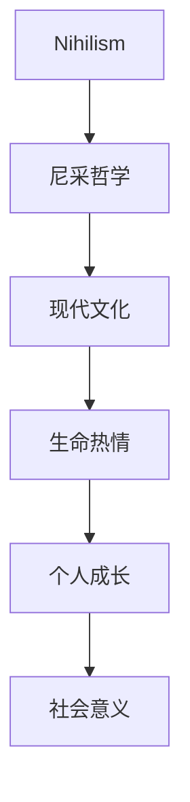

                 

### 1. 确定书的核心内容

《nihilism与生命热情的平衡艺术》这本书的核心内容主要围绕尼采的nihilism理论和生命热情的概念展开，旨在探讨如何在现代社会中找到一种平衡这两种极端情感的方法。首先，我们需要明确以下几个核心概念：

- **Nihilism（虚无主义）**：虚无主义是一种哲学观点，认为宇宙或存在本身缺乏内在的价值和目的。尼采是虚无主义的代表人物之一，他的观点深刻地影响了现代哲学和文化。

- **生命热情（Life Passion）**：生命热情是指个体对生活充满热情、激情和动力的状态。它是一种积极的情感，能够激发个体的创造力和行动力。

- **平衡（Balance）**：平衡是指在不同的事物、情感或理念之间找到一种稳定和协调的状态。在本书中，平衡nihilism与生命热情的目标是帮助个体在生活的不确定性和复杂性中找到内心的平静和方向。

为了更好地理解和探讨这些核心概念，我们需要构建一个概念框架，展示它们之间的关系。下面是一个简单的 Mermaid 流程图，用来表示这些概念之间的关系：

- **Nihilism与尼采哲学**：尼采是虚无主义的代表人物，他的哲学思想对虚无主义的发展产生了深远的影响。尼采的哲学强调对传统价值观的质疑和对个体自我实现的需求。

- **Nihilism与现代文化**：虚无主义在现代文化中有着广泛的影响，尤其是在文学、艺术和哲学领域。现代社会中存在许多对生活意义和目的的质疑，这与虚无主义有一定的联系。

- **生命热情**：生命热情是一种积极的情感，能够激发个体的创造力和行动力。它对个人的成长和社会的进步都有着重要的意义。

- **平衡**：在本书中，平衡nihilism与生命热情的目标是帮助个体在生活的不确定性和复杂性中找到内心的平静和方向。平衡不仅是一种理念，也是一种实践，需要个体通过不断地自我反思和实践来实现。

通过这个概念框架，我们可以更清晰地理解本书的核心内容，并为进一步的讨论和分析打下基础。在接下来的章节中，我们将详细探讨尼采的虚无主义理论、生命热情的概念及其平衡艺术，帮助读者更好地理解和应用这些理念。

