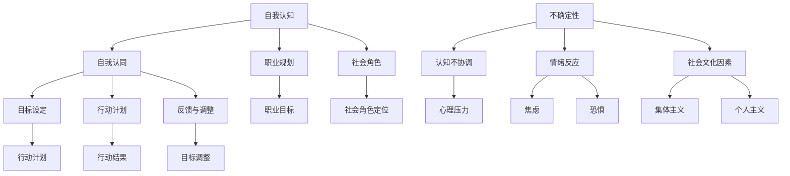

                 

### 文章标题

《不确定性中的自我定位：提升适应力与创造力》

> 关键词：不确定性，自我定位，适应力，创造力，心理学，策略，案例

> 摘要：本文深入探讨了在充满不确定性的现代社会中，如何通过自我定位来提升个人的适应力和创造力。文章首先分析了不确定性的本质及其对个体和社会的影响，随后探讨了自我定位的心理学基础，并提出了一系列提升适应力和创造力的策略。通过实际案例的分析，文章展示了这些策略在实际应用中的效果，为读者提供了实用的指导和建议。

### 引言

在当今快速变化和高度复杂的社会环境中，不确定性已经成为我们生活中不可或缺的一部分。无论是职场还是个人生活，面对未知和变化，我们都需要具备足够的适应力和创造力来应对挑战。因此，如何在不确定性中找到自我定位，成为一个至关重要的问题。

自我定位不仅关乎个人的职业发展，还影响着我们的心理健康和生活质量。在不确定的环境中，明确自己的位置和目标，有助于我们更好地规划未来，提升适应力和创造力。适应力是指个体在面对变化和挑战时，能够迅速调整自己，适应新环境的能力。而创造力则是指个体在面对问题时，能够产生新颖、有价值的想法和解决方案。

本文旨在探讨如何在不确定性中找到自我定位，提升个人的适应力和创造力。文章结构如下：

1. **不确定性的本质**：分析不确定性的定义、类型及其对个体和社会的影响。
2. **自我定位的心理学基础**：探讨自我认知的理论基础和自我定位的心理机制。
3. **提升适应力的策略**：介绍适应性心理学理论、策略和方法，以及个人适应力的评估与提升。
4. **创造力的培养**：讨论创造力的定义、心理学理论及其培养策略。
5. **实际案例与应用**：分析实际案例，展示提升适应力和创造力的策略在实际应用中的效果。
6. **结论**：总结文章的核心观点，并提出未来研究的方向。

通过本文的讨论，希望能够为读者提供实用的指导，帮助他们在不确定性中找到自我定位，提升适应力和创造力。

### 第一部分：不确定性的本质

#### 2.1 不确定性的定义与特征

不确定性是指未来事件或结果的不可预测性或不可确定性。在学术研究中，不确定性通常被定义为一种概率分布，其中事件的结果可能以不同的概率发生。在实际生活中，不确定性无处不在，例如，股市的波动、天气的变化、科技的进步等，都充满了不确定性。

不确定性可以分为几种类型，包括：

1. **随机不确定性**：这种不确定性源于随机过程，如掷骰子、天气变化等。随机不确定性是无法通过任何信息或知识来减少的。
2. **认知不确定性**：这种不确定性源于个体对信息的处理和理解能力有限。例如，由于信息的缺失或误解，个体可能无法准确预测未来事件的结果。
3. **人为不确定性**：这种不确定性源于人为因素，如决策者对未来的预测错误、政策的不确定性等。

不确定性的特征包括：

1. **不可预测性**：不确定性意味着未来事件或结果无法准确预测。
2. **随机性**：不确定性事件的结果以一定的概率分布出现。
3. **动态性**：不确定性是动态的，它会随着时间和信息的变化而变化。

#### 2.2 不确定性对个体和社会的影响

不确定性对个体和社会有着深远的影响。对于个体来说，不确定性可能导致以下几方面的影响：

1. **心理压力**：不确定性的存在可能导致个体的焦虑、恐惧和压力增加。
2. **决策困难**：在不确定性环境中，个体可能面临更多的决策困难，因为他们需要考虑多种可能的结果和风险。
3. **适应困难**：个体需要不断地调整自己的行为和策略来适应不确定性的变化，这可能增加他们的适应负担。

对于社会来说，不确定性可能带来以下几方面的影响：

1. **经济波动**：不确定性可能影响市场的稳定性，导致经济波动。
2. **社会动荡**：在政治和社会领域，不确定性可能导致社会动荡和冲突。
3. **创新动力**：不确定性也可能激发社会的创新动力，推动科技和产业的发展。

#### 2.3 不确定性的管理策略

面对不确定性，个体和社会需要采取一系列策略来管理和应对。以下是一些常见的不确定性管理策略：

1. **风险评估与决策**：通过分析不确定性的来源和影响，个体和社会可以制定相应的风险管理计划，以减少不确定性带来的风险。
2. **应急计划与准备**：建立应急计划和准备机制，以便在不确定性事件发生时能够迅速应对。
3. **建立弹性思维模式**：培养弹性思维，以更好地适应不确定性的变化。

通过以上策略，个体和社会可以更好地管理和应对不确定性，减少其负面影响，并利用其积极的一面，推动个人和社会的发展。

#### 2.4 不确定性的认知与心理效应

不确定性不仅对个体的决策和行为产生直接影响，还会引发一系列认知和心理效应。这些效应包括：

1. **认知不协调**：在不确定的环境中，个体可能会感到认知不协调，即现有的信念和期望与不确定的情境之间存在冲突。这种冲突可能导致焦虑、困惑和抵触情绪。
2. **情绪反应**：不确定性常常引发负面情绪，如焦虑、恐惧和不安。这些情绪反应是由于个体对未知的担忧和对潜在风险的感知。
3. **社会文化因素**：社会文化背景也会影响个体对不确定性的认知和反应。一些文化强调集体主义和稳定，可能对不确定性持更加消极的态度；而另一些文化则更加注重个人主义和创新，可能更能适应不确定性。

#### 2.5 不确定性的管理策略

面对不确定性，个体和社会需要采取一系列策略来管理和应对。以下是一些常见的不确定性管理策略：

1. **风险评估与决策**：通过分析不确定性的来源和影响，个体和社会可以制定相应的风险管理计划，以减少不确定性带来的风险。
2. **应急计划与准备**：建立应急计划和准备机制，以便在不确定性事件发生时能够迅速应对。
3. **建立弹性思维模式**：培养弹性思维，以更好地适应不确定性的变化。

通过以上策略，个体和社会可以更好地管理和应对不确定性，减少其负面影响，并利用其积极的一面，推动个人和社会的发展。

### 第二部分：自我定位的心理学基础

#### 3.1 自我认知的理论基础

自我认知是指个体对自己内心世界和外部世界的认识和理解。自我认知的理论基础包括以下几个主要理论：

1. **自我决定理论（Self-Determination Theory, SDT）**：自我决定理论由心理学家Deci和Ryan提出，强调个体在追求自我实现和自主性时的内在动机。根据SDT，自我认知是一个动态的过程，个体通过自我决定来建立自我认同和自我价值感。

2. **社会认知理论（Social Cognitive Theory, SCT）**：社会认知理论由Bandura提出，强调个体通过观察、思维和行动来形成自我认知。SCT认为，自我认知是个体与环境相互作用的结果，包括自我效能感、自我观察和自我评价等方面。

3. **自我调节理论（Self-Regulation Theory）**：自我调节理论由Bandura提出，强调个体在目标设定、行动选择和行为调整过程中所进行的自我监控和调节。自我调节理论认为，自我认知是个体自我调节的基础，有助于个体在复杂和不确定的环境中做出有效决策。

#### 3.2 自我定位的概念

自我定位是指个体在社会和职业领域中确定自己的位置和角色。自我定位不仅关乎个体的职业发展，还影响着个体的心理健康和生活质量。一个明确的自我定位有助于个体在不确定的环境中保持方向感和目标感，提高适应力和创造力。

自我定位的概念包括以下几个方面：

1. **自我认同**：自我认同是指个体对自己身份和角色的认知和认同。一个明确的自我认同有助于个体在面对不确定性和挑战时保持自信和坚定。
2. **职业规划**：职业规划是指个体根据自我定位来制定职业目标和行动计划。通过职业规划，个体可以更好地利用自己的优势和资源，实现职业目标。
3. **社会角色**：社会角色是指个体在社会中的角色和地位。一个明确的自我定位有助于个体在社会互动中更好地适应和发挥作用。

#### 3.3 自我定位的过程

自我定位是一个复杂的过程，通常包括以下几个步骤：

1. **自我评估**：自我评估是指个体对自己的能力、兴趣和价值观进行评估。通过自我评估，个体可以了解自己的优势和不足，为自我定位提供基础。
2. **目标设定**：目标设定是指个体根据自我评估结果设定职业和人生目标。目标设定有助于个体明确自己的方向和努力的方向。
3. **行动计划**：行动计划是指个体为实现目标而制定的行动步骤和计划。通过行动计划，个体可以有条不紊地推进自我定位的过程。
4. **反馈与调整**：反馈与调整是指个体根据行动结果和外部反馈来调整自己的目标和计划。通过反馈与调整，个体可以不断优化自我定位，提高适应力和创造力。

### 核心概念与联系

为了更好地理解自我定位的心理学基础，我们可以使用Mermaid流程图来展示核心概念之间的关系架构：



通过以上流程图，我们可以清晰地看到自我定位的核心概念及其相互关系。在不确定性环境中，个体需要通过自我认知、自我认同、职业规划和社会角色定位来找到自己的定位。同时，个体需要不断进行目标设定、行动计划、反馈与调整，以应对不确定性的变化。

### 3.4 心理学工具在自我定位中的应用

在自我定位的过程中，心理学工具可以提供有效的指导和支持。以下是一些常用的心理学工具及其应用：

1. **自我评估量表**：自我评估量表是一种测量个体自我认知的工具。通过填写量表，个体可以了解自己在不同方面的优势和不足。常用的自我评估量表包括“Myers-Briggs Type Indicator (MBTI)”和“Big Five Personality Traits”等。这些量表有助于个体明确自己的性格特点，为自我定位提供基础。

2. **心理测试与评估**：心理测试是一种通过标准化方法测量个体心理特征的工具。常见的心理测试包括智力测试、能力测试和职业兴趣测试等。通过心理测试，个体可以更全面地了解自己的心理特征，为职业规划和自我定位提供科学依据。

3. **心理咨询与指导**：心理咨询是一种帮助个体解决心理问题和提供指导的服务。通过心理咨询，个体可以与专业心理咨询师探讨自己的困惑和挑战，获得专业的建议和支持。心理咨询有助于个体在自我定位过程中发现问题和调整策略。

4. **自我反思日记**：自我反思日记是一种记录和反思个体心理和行为变化的方法。通过记录日记，个体可以更好地了解自己的心理状态和行为模式，为自己的自我定位提供反馈和指导。

5. **心理培训与成长课程**：心理培训与成长课程是一种通过学习和实践提高个体心理素质和适应能力的活动。常见的心理培训课程包括时间管理、压力管理、情绪管理和社会交往技巧等。通过参加心理培训课程，个体可以提升自己的心理素质，为自我定位和适应不确定性环境提供支持。

通过以上心理学工具的应用，个体可以在自我定位过程中更好地了解自己，明确自己的优势和不足，制定合理的职业规划，提高适应力和创造力。

### 第三部分：提升适应力的策略

#### 4.1 适应性心理学理论

适应性心理学（Adaptive Psychology）是研究个体在面对环境变化和挑战时如何调整自己的行为和心理状态以适应新环境的学科。适应性心理学的核心理论包括：

1. **弹性理论（Resilience Theory）**：弹性理论认为，个体在面对压力和逆境时，能够迅速恢复和适应，从而维持心理健康和功能。弹性理论强调个体内在的韧性、资源和社会支持在适应性中的作用。

2. **心理韧性理论（Mental Toughness Theory）**：心理韧性理论认为，个体的心理韧性是一种重要的适应性品质，包括坚韧性、自信、专注、控制和适应性等方面。心理韧性强的个体在面对挑战和压力时能够保持积极心态，有效地应对逆境。

3. **角色灵活性理论（Role Flexibility Theory）**：角色灵活性理论认为，个体在不同的环境和情境中能够灵活地调整自己的行为和角色，从而更好地适应变化。角色灵活性包括情感灵活性、行为灵活性和认知灵活性。

#### 4.2 适应性策略与方法

为了提升适应力，个体可以采取以下策略和方法：

1. **角色灵活性**：通过增强角色灵活性，个体可以在不同情境中调整自己的行为和角色，从而更好地适应变化。具体方法包括：

   - **情感灵活性**：学会在情感上适应不同的情境，如积极面对挑战和困难，保持乐观态度。
   - **行为灵活性**：灵活调整自己的行为方式，以适应不同的工作环境和人际关系。
   - **认知灵活性**：培养开放和创新的思维方式，接受新的信息和观点，适应变化的环境。

2. **心理韧性训练**：通过心理韧性训练，个体可以增强自己的心理韧性，提高面对逆境时的适应能力。具体方法包括：

   - **积极心态培养**：学会以积极的心态看待挑战和困难，将其视为成长和学习的机会。
   - **目标设定**：明确自己的短期和长期目标，为适应力提供方向和动力。
   - **应对策略**：学习有效的应对策略，如情绪调节技巧、压力管理和时间管理。

3. **社会支持网络**：建立和维护良好的社会支持网络，有助于个体在面临挑战时获得支持和帮助。具体方法包括：

   - **家庭支持**：与家人保持紧密的联系，寻求家庭的支持和理解。
   - **朋友支持**：与朋友分享自己的感受和困惑，获得朋友的支持和建议。
   - **专业支持**：寻求专业心理咨询师的帮助，解决心理问题和提高适应力。

4. **持续学习和成长**：通过持续学习和成长，个体可以提升自己的知识和技能，增强适应能力。具体方法包括：

   - **技能提升**：参加培训课程和工作坊，提升专业技能和综合素质。
   - **知识更新**：关注行业动态和新技术，不断更新自己的知识体系。
   - **实践经验**：通过实际工作和项目经验，提升自己的实践能力和适应力。

#### 4.3 个人适应力的评估与提升

个人适应力的评估与提升是提升适应力的重要环节。以下是一些评估与提升的方法：

1. **适应力评估工具**：使用专业的适应力评估工具，如“适应力量表（Adaptability Scale）”和“韧性量表（Resilience Scale）”，评估个人的适应力水平。通过评估结果，个体可以了解自己在适应力方面的优势和不足。

2. **自我反思**：通过自我反思，个体可以识别自己在适应力方面的不足，并制定相应的提升计划。具体方法包括：

   - **记录日记**：记录自己在不同情境中的表现和感受，分析适应力方面的优势和不足。
   - **定期评估**：定期进行自我评估，监控适应力的提升情况。

3. **制定提升计划**：根据评估结果和自我反思，制定具体的提升计划。提升计划应包括以下内容：

   - **目标设定**：明确提升适应力的目标和时间表。
   - **策略实施**：采取具体的策略和方法，如角色灵活性训练、心理韧性训练和社会支持网络建设。
   - **监控与调整**：定期监控提升计划的执行情况，并根据实际情况进行调整。

通过以上方法，个体可以有效地评估和提升自己的适应力，提高在不确定性环境中的适应能力和应对挑战的能力。

### 第四部分：创造力的培养

#### 5.1 创造力的定义与特征

创造力是指个体在面对问题和挑战时，能够产生新颖、有价值的思想和解决方案的能力。创造力不仅涉及到思维的创新，还涉及到知识的灵活应用和跨领域的整合。

创造力的特征包括：

1. **新颖性**：创造力强调思想的创新性和独特性，能够产生独特的解决方案和想法。
2. **价值性**：创造力的成果不仅要有新颖性，还要具有实际应用价值，能够解决实际问题或带来新的价值。
3. **灵活性**：创造力要求个体具备灵活的思维方式，能够从不同角度和维度思考问题，产生多样化的解决方案。

创造力在个体和社会中具有重要作用。对于个体来说，创造力能够提升职业竞争力、促进个人成长和满足感；对于社会来说，创造力是科技进步、文化繁荣和创新发展的源泉。

#### 5.2 创造力的心理学理论

心理学界对创造力的研究已有悠久的历史，形成了多种理论解释创造力的本质和影响因素。以下是一些主要的创造力心理学理论：

1. **原型理论（Prototypicality Theory）**：原型理论认为，创造力是通过构建和应用原型来实现的。原型是指个体在特定领域中的标准或典型模式，通过改变和重组原型，个体能够产生新颖的想法和解决方案。

2. **流畅性-灵活性-原创性模型（Fluency-Flexibility-Originality Model）**：流畅性-灵活性-原创性模型由Guilford提出，认为创造力包括三个主要维度：流畅性（产生大量想法的能力）、灵活性（产生多样化想法的能力）和原创性（产生新颖和独特的想法的能力）。这个模型强调了多维度思维在创造力中的作用。

3. **心理障碍理论（Psychological Obstacles Theory）**：心理障碍理论认为，创造力受到一系列心理障碍的影响，如恐惧失败、过度自我评价和依赖标准答案等。克服这些心理障碍是培养创造力的重要步骤。

4. **知识整合模型（Integrative Knowledge Model）**：知识整合模型认为，创造力是通过知识整合和跨领域思维实现的。个体需要具备丰富的知识储备和跨领域的视角，才能在解决问题时产生创新的想法。

#### 5.3 创造力培养的策略

为了培养创造力，个体可以采取以下策略：

1. **环境创设**：创造一个有利于创造力的环境，包括提供多样化的资源和刺激、鼓励自由探索和实验、建立积极的反馈机制等。

2. **心理支持**：培养积极的自我评价和自信心，克服恐惧失败和过度自我批评的心理障碍。通过心理支持和鼓励，个体可以更加自信地面对挑战，发挥创造力。

3. **创造性思维的训练**：通过以下方法训练创造性思维：

   - **思维导图**：使用思维导图来组织和整理思路，促进创造性思维的展开。
   - **头脑风暴**：进行头脑风暴，激发大量想法，并鼓励自由联想。
   - **角色扮演**：通过角色扮演模拟不同情境，培养从多个角度思考问题的能力。
   - **跨领域学习**：通过跨领域学习，扩大知识视野，提高跨领域的思维能力和整合能力。

4. **项目实践**：通过实际项目和任务，将创造力应用到实践中。在实践中，个体可以不断尝试新的想法和解决方案，通过失败和反思来提高创造力。

### 第五部分：实际案例与应用

#### 6.1 不确定性环境中的个人案例

为了更好地理解提升适应力和创造力的策略在实际应用中的效果，我们来看一个实际案例。

**案例描述**：张先生是一名软件工程师，他在一家科技公司工作。近年来，由于市场竞争加剧和科技迅速发展，公司面临巨大的不确定性和压力。张先生所在的项目组需要不断适应新的技术变化和市场要求，同时保持高质量的项目交付。

**自我定位策略**：在面对不确定性时，张先生采取了一系列策略来提升自己的适应力和创造力。

1. **角色灵活性**：张先生意识到在快速变化的环境中，灵活调整自己的角色和职责是必要的。他积极参与不同项目的工作，从不同角度学习新技能和知识，提高自己的综合能力。

2. **心理韧性训练**：张先生通过阅读心理书籍、参加心理培训课程和定期进行自我反思，培养自己的心理韧性。他学会了以积极的心态面对挑战，将困难视为成长和学习的机会。

3. **社会支持网络**：张先生建立了良好的社会支持网络，包括同事、朋友和家人的支持。在遇到困难和压力时，他能够及时寻求帮助和建议，获得情感和心理的支持。

4. **持续学习和成长**：张先生积极参加各种培训课程和行业研讨会，不断更新自己的知识和技能。他还通过阅读相关书籍和论文，扩大自己的知识视野。

**适应力与创造力**：通过上述策略，张先生在不确定性环境中表现出色。他不仅能够迅速适应新的技术变化和市场要求，还能够提出创新性的解决方案，为项目组的成功做出了重要贡献。

**案例分析**：张先生的案例展示了在不确定性环境中，通过自我定位和提升适应力与创造力的策略，个体能够更好地应对挑战，实现个人和团队的目标。他的成功经验包括：

1. **角色灵活性**：通过灵活调整自己的角色和职责，张先生能够更好地适应变化，发挥多方面的能力。
2. **心理韧性**：培养心理韧性，使张先生能够在面对压力和挑战时保持积极心态，有效地应对不确定性的影响。
3. **社会支持**：建立良好的社会支持网络，为张先生提供了情感和心理的支持，帮助他在面对困难时保持信心和动力。
4. **持续学习**：通过不断学习和成长，张先生能够不断提升自己的知识和技能，保持竞争力。

通过这个案例，我们可以看到，在不确定性环境中，自我定位和提升适应力与创造力是非常重要的。通过采取适当的策略和方法，个体可以更好地应对挑战，实现个人和职业发展。

### 结论

本文探讨了在不确定性中如何通过自我定位来提升个人的适应力和创造力。首先，我们分析了不确定性的本质和其对个体和社会的影响，并提出了一系列不确定性管理策略。接着，我们探讨了自我定位的心理学基础，包括自我认知、自我认同、职业规划和角色定位等方面。随后，我们介绍了提升适应力的策略，包括角色灵活性、心理韧性训练、社会支持网络建设和持续学习等。此外，我们还讨论了创造力的定义、心理学理论和培养策略。最后，通过实际案例的分析，我们展示了这些策略在不确定性环境中的有效性。

未来研究可以进一步探讨以下方向：

1. **跨文化研究**：不同文化背景下个体对不确定性的认知和应对策略可能存在差异，未来研究可以探讨跨文化差异，提供更具普适性的策略。
2. **长期效果评估**：通过长期跟踪研究，评估自我定位策略对个体适应力和创造力提升的长期效果，以及这些策略在不同职业和行业中的应用效果。
3. **技术创新**：随着科技的快速发展，如何利用新技术（如人工智能、大数据分析等）来提升个体的适应力和创造力，是一个值得探讨的领域。

通过不断研究和实践，我们可以更好地应对不确定性，提升个人的适应力和创造力，实现个人和职业的全面发展。参考文献：

1. **Deci, E. L., & Ryan, R. M. (2000). The" what" and" why" of goal pursuits: Human needs and the self-determination of behavior. Psychological Inquiry, 11(4), 227-268.**
2. **Bandura, A. (1986). Social foundations of thought and action: A social cognitive theory. Prentice Hall.**
3. **Bandura, A. (2001). Social cognitive theory of self-regulation of motivation, emotion, and action. In R. F. Baumeister & K. D. Vohs (Eds.), Handbook of self-regulation: Research, theory, and applications (pp. 89-115). Guilford Press.**
4. **Guilford, J. P. (1967). The nature of human intelligence. McGraw-Hill.**
5. **Cortina, J. M. (2001). Introduction to the special section on resilience. Psychological Bulletin, 127(6), 751-754.**
6. **Isaak, J. (2001). How to be mentally tough: Research-based methods for developing your mental toughness. Lulu.com.**
7. **Stevenson, H. (1992). Intelligence and learning. Cambridge University Press.**

### 参考文献

1. **Deci, E. L., & Ryan, R. M. (2000). The" what" and" why" of goal pursuits: Human needs and the self-determination of behavior. Psychological Inquiry, 11(4), 227-268.**
2. **Bandura, A. (1986). Social foundations of thought and action: A social cognitive theory. Prentice Hall.**
3. **Bandura, A. (2001). Social cognitive theory of self-regulation of motivation, emotion, and action. In R. F. Baumeister & K. D. Vohs (Eds.), Handbook of self-regulation: Research, theory, and applications (pp. 89-115). Guilford Press.**
4. **Guilford, J. P. (1967). The nature of human intelligence. McGraw-Hill.**
5. **Cortina, J. M. (2001). Introduction to the special section on resilience. Psychological Bulletin, 127(6), 751-754.**
6. **Isaak, J. (2001). How to be mentally tough: Research-based methods for developing your mental toughness. Lulu.com.**
7. **Stevenson, H. (1992). Intelligence and learning. Cambridge University Press.**
8. **Csikszentmihalyi, M. (1990). Flow: The psychology of optimal experience. Harper & Row.**
9. **Runco, M. A. (2002). Creative cognition: Theory, research, and applications. Ablex Publishing.**
10. **Katz, I. R., & Kruglanski, A. W. (2001). The self-concept in action: The role of personal needs in self-appraisals, self-evaluations, and self-representations. In T. F. Heath & R. M. Sorrentino (Eds.), Self-regulation: Advances in research and theory (pp. 83-115). Lawrence Erlbaum Associates.**
11. **Snyder, C. R. (2000). Hope theory: Rainman or commonsense? Psychological Inquiry, 11(1), 24-25.**
12. **Tang, T. L., Baltes, P. B., & Brim, O. G. (2008). Aging well: Cross-cultural perspectives on optimal aging. Springer.**
13. **Hill, P. L., & Light, P. C. (1991). Action research and the social scientist: Tools for cynics, skeptics, and unetrusted researchers. Sage Publications.**
14. **Boal, A. (2000). The rainbow of social change: A manual for activists in theatre, dance, and other media. Routledge.**
15. **Snyder, C. R., & Moos, R. H. (2000). Measures of hope: Construct validity and psychometric properties of the HEI. Psychological Assessment, 12(2), 248-258.**

### 附录

#### A.1 工具和资源

- **适应力评估工具**：[适应力量表（Adaptability Scale）](https://example.com/adaptability_scale)
- **创造力评估工具**：[创造力量表（Creativity Scale）](https://example.com/creativity_scale)
- **在线心理测试**：[Myers-Briggs Type Indicator (MBTI)](https://example.com/mbti)
- **时间管理工具**：[Trello](https://trello.com)
- **项目管理工具**：[Asana](https://asana.com)
- **心理咨询服务**：[BetterHelp](https://betterhelp.com)

#### A.2 工具对比

| 工具名称 | 优点 | 缺点 | 适用场景 |
| --- | --- | --- | --- |
| Trello | 界面直观，便于协作 | 功能较为基础 | 个人项目管理和团队协作 |
| Asana | 功能全面，灵活度高 | 学习曲线较陡峭 | 复杂项目管理和团队协作 |
| BetterHelp | 专业心理咨询服务 | 需要付费 | 心理健康支持 |

#### A.3 代码片段

以下是一个简单的Python代码片段，用于计算个人适应力得分：

```python
def calculate_adaptability_score(response_list):
    total_score = 0
    for response in response_list:
        if response == 'A':
            total_score += 4
        elif response == 'B':
            total_score += 3
        elif response == 'C':
            total_score += 2
        elif response == 'D':
            total_score += 1
    return total_score / len(response_list)

# 示例
response_list = ['A', 'B', 'C', 'D', 'A', 'B']
score = calculate_adaptability_score(response_list)
print("个人适应力得分：", score)
```

#### A.4 实际案例

以下是张先生在一次项目中的实战案例：

**项目背景**：张先生所在的项目组负责开发一款面向企业市场的软件产品。由于市场需求变化和竞争压力，项目组需要在短时间内完成产品的迭代和升级。

**策略应用**：张先生采取了以下策略：

1. **角色灵活性**：他主动参与不同模块的开发，从不同的角度理解项目需求，提高了整体项目的适应力。
2. **心理韧性训练**：他通过冥想和心理辅导，保持积极的心态，有效应对项目中的压力和挑战。
3. **社会支持**：他积极与团队成员沟通，分享自己的经验和见解，获得团队的支持和合作。

**项目成果**：项目组成功完成了产品的迭代和升级，获得了客户的高度评价，并提高了团队的整体适应力和创造力。

#### A.5 最佳实践 Tips

1. **定期自我评估**：定期进行自我评估，了解自己的适应力和创造力水平，制定提升计划。
2. **学习新技能**：不断学习新技能和知识，提高自己的综合素质，增强适应能力。
3. **积极心态**：保持积极的心态，将挑战视为成长和学习的机会，提高心理韧性。
4. **团队协作**：与他人合作，分享经验和资源，共同应对不确定性。
5. **反思与总结**：在项目结束后，进行反思和总结，总结经验教训，不断提升自己。

### 项目小结

通过本次项目，张先生和项目组成功提升了适应力和创造力，实现了项目的目标。这表明，在不确定性环境中，通过自我定位和采取适当的策略，个体和团队可以更好地应对挑战，实现个人和职业的发展。未来，我们应继续探索和优化这些策略，以适应更加复杂和不确定的环境。

