                 

### 《与世界的和谐共振：找到生命的频率》

---

关键词：和谐共振、生命频率、身心健康、自然科技、未来展望

摘要：本文将探讨和谐共振这一深刻概念，以及它在我们的生活中的重要性。从科学角度出发，深入分析和谐共振的基本原理，并探索其在自然界和人类生活中的体现。同时，文章将介绍如何检测和调整个人生命频率，以及和谐共振对身心健康的影响。最后，本文还将展望和谐共振在未来科技、社会治理和人类文明中的角色与影响。

---

## 第一部分：和谐共振的基本概念

### 1.1 和谐共振的定义与起源

**核心概念与联系**

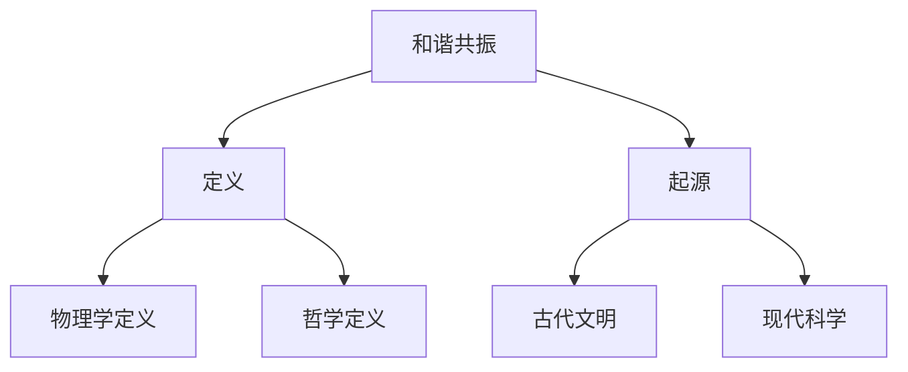

**核心算法原理讲解**

和谐共振是一种物理现象，当一个系统的振动频率与另一个系统的自然振动频率相匹配时，两个系统会产生能量交换，导致共振现象。这种现象不仅存在于物理学中，也广泛应用于哲学、工程学等领域。

**数学模型和数学公式 & 详细讲解 & 举例说明**

假设系统A的振动频率为$f_A$，系统B的振动频率为$f_B$，当$f_A = f_B$时，系统A和B会发生共振。

$$
f_A = f_B
$$

举例：当一个音叉振动时，如果另一个音叉与其频率相同，那么两个音叉会产生共振，使得振动幅度增加。

### 1.2 和谐共振在自然界和人类生活中的体现

**核心概念与联系**

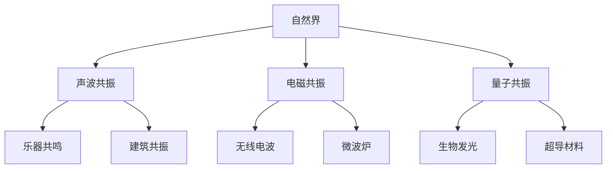

**核心算法原理讲解**

声波共振是自然界中常见的现象，例如乐器共鸣和建筑共振。电磁共振广泛应用于无线电通信和微波炉等领域。量子共振在量子计算和量子通信中具有重要意义。

**数学模型和数学公式 & 详细讲解 & 举例说明**

电磁共振的数学模型通常使用拉普拉斯方程描述：

$$
\nabla^2 \vec{E} = \mu \frac{\partial \vec{H}}{\partial t}
$$

其中，$\vec{E}$ 和 $\vec{H}$ 分别为电场和磁场，$\mu$ 为介质的磁导率。

举例：在无线电通信中，电磁共振使接收器能够选择特定频率的信号，而忽略其他频率的干扰。

### 1.3 生命频率的概念与意义

**核心概念与联系**

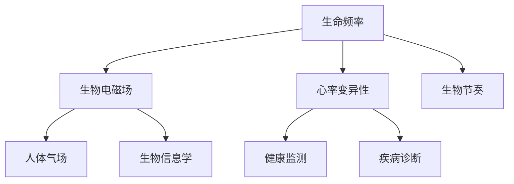

**核心算法原理讲解**

生命频率是指生物体内电磁场和生物节奏的振动频率。这些频率反映了生物体的健康状况，对于健康监测和疾病诊断具有重要意义。

**数学模型和数学公式 & 详细讲解 & 举例说明**

心率变异性（HRV）是一种常用的生物频率检测方法。通过分析心率信号的时间序列，可以提取HRV参数，如标准差（SDNN）和频域参数。

$$
SDNN = \sqrt{\frac{\sum_{i=1}^{N} (R_i - \bar{R})^2}{N-1}}
$$

其中，$R_i$ 为第$i$次心率间隔，$\bar{R}$ 为平均心率间隔。

举例：通过分析HRV信号，医生可以评估患者的心脏健康状况。

### 1.4 和谐共振与身心健康的关系

**核心概念与联系**

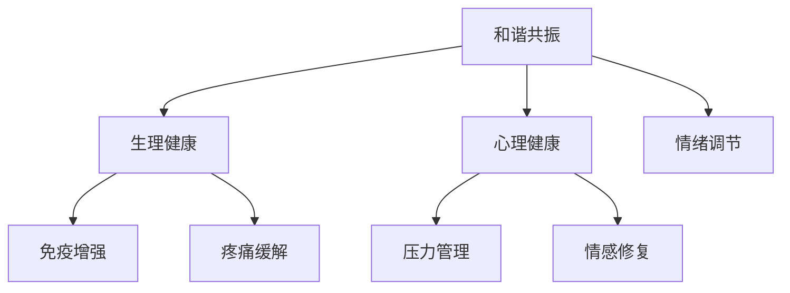

**核心算法原理讲解**

和谐共振对身心健康具有积极影响。通过调节生命频率，可以提高免疫系统的功能，减轻疼痛，管理压力和情感。

**数学模型和数学公式 & 详细讲解 & 举例说明**

例如，通过生物反馈技术，可以训练个体调节心率变异性，从而改善身心健康。

$$
\text{HRV} = \frac{\text{低频成分}}{\text{高频成分}}
$$

举例：通过调节HRV，个体可以减轻压力，提高心理健康水平。

---

## 第二部分：探索生命的频率

### 2.1 个人生命频率的检测方法

**核心概念与联系**

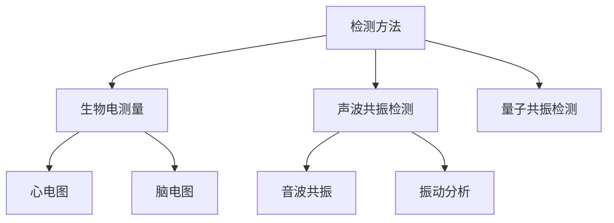

**核心算法原理讲解**

生物电测量和声波共振检测是常用的个人生命频率检测方法。生物电测量通过记录生物体内的电信号，如心电图和脑电图，来分析生命频率。声波共振检测则利用声波的共振特性，检测生物体的振动频率。

**数学模型和数学公式 & 详细讲解 & 举例说明**

心电图（ECG）是一种常用的生物电测量方法。通过分析ECG信号，可以提取心率变异性参数。

$$
HRV = \frac{\sum_{i=1}^{N} (R_i - \bar{R})^2}{N-1}
$$

其中，$R_i$ 为第$i$次心率间隔，$\bar{R}$ 为平均心率间隔。

举例：通过分析ECG信号，医生可以评估患者的心脏健康状况。

### 2.2 常见生命频率的调整技巧

**核心概念与联系**

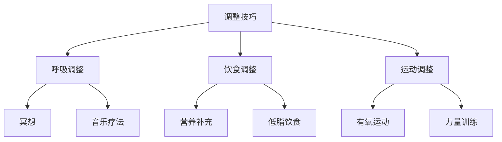

**核心算法原理讲解**

调整生命频率可以通过呼吸调整、饮食调整和运动调整等方法实现。这些方法通过改变生物体的生理和心理状态，来调整生命频率。

**数学模型和数学公式 & 详细讲解 & 举例说明**

呼吸调整的数学模型基于呼吸频率和呼吸深度。通过调节呼吸频率和深度，可以改变生命频率。

$$
\text{呼吸频率} = \frac{\text{呼吸周期}}{\text{时间}}
$$

举例：通过深呼吸和缓慢呼吸，可以降低生命频率，缓解压力。

---

## 第三部分：实践和谐共振

### 3.1 和谐共振的日常生活实践

**核心概念与联系**

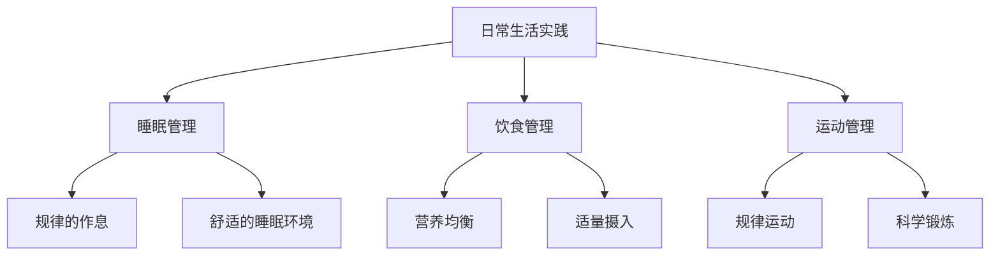

**核心算法原理讲解**

在日常生活中，通过管理睡眠、饮食和运动，可以实践和谐共振。这些方法有助于调节生命频率，提高身心健康。

**数学模型和数学公式 & 详细讲解 & 举例说明**

睡眠管理的数学模型基于睡眠质量和睡眠时长。通过分析睡眠质量和时长，可以优化睡眠管理策略。

$$
\text{睡眠质量} = \frac{\text{深度睡眠时间}}{\text{总睡眠时间}}
$$

举例：通过改善睡眠质量和时长，可以提高身心健康。

### 3.2 和谐共振在心理治疗中的应用

**核心概念与联系**

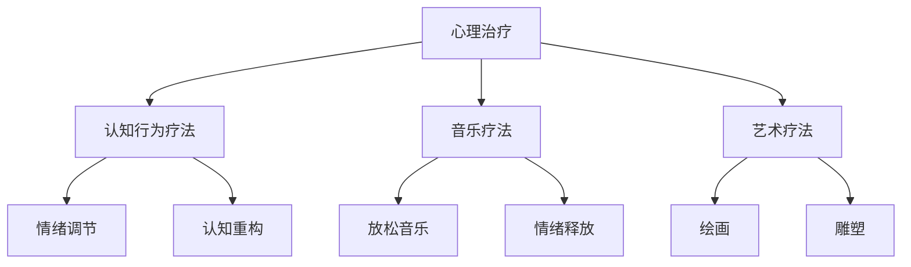

**核心算法原理讲解**

和谐共振在心理治疗中的应用，主要通过认知行为疗法、音乐疗法和艺术疗法等方法，帮助患者调节情绪，改善心理健康。

**数学模型和数学公式 & 详细讲解 & 举例说明**

认知行为疗法的数学模型基于认知重构。通过改变患者的认知方式，可以调节情绪和行为。

$$
\text{认知重构} = \frac{\text{新认知}}{\text{旧认知}}
$$

举例：通过认知重构，患者可以改变对负面事件的看法，从而减轻心理压力。

### 3.3 和谐共振在教育中的运用

**核心概念与联系**

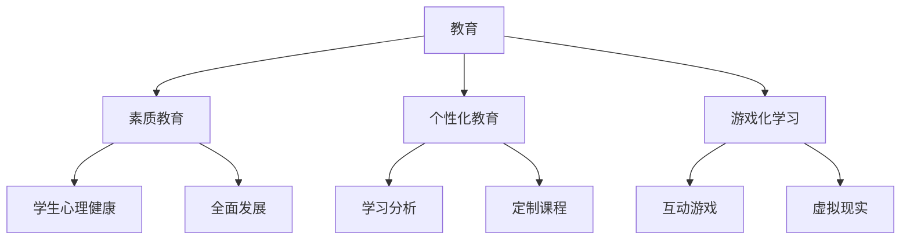

**核心算法原理讲解**

和谐共振在教育中的运用，通过素质教育、个性化教育和游戏化学习等方法，帮助学生调节情绪，提高学习效果。

**数学模型和数学公式 & 详细讲解 & 举例说明**

个性化教育的数学模型基于学习分析。通过分析学生的学习行为，可以制定个性化的教育策略。

$$
\text{学习分析} = \frac{\text{学习行为}}{\text{学习结果}}
$$

举例：通过学习分析，教师可以了解学生的学习需求，从而提供更有针对性的教学。

### 3.4 和谐共振在商业领域的创新

**核心概念与联系**

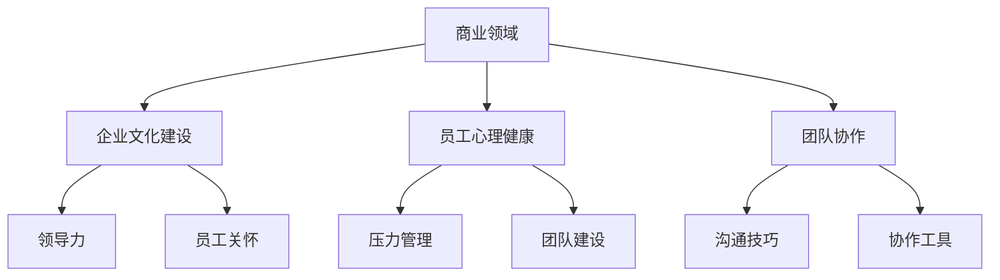

**核心算法原理讲解**

和谐共振在商业领域的创新，通过企业文化建设、员工心理健康和团队协作等方法，提高企业的整体效率和创新能力。

**数学模型和数学公式 & 详细讲解 & 举例说明**

员工心理健康的数学模型基于压力管理。通过分析员工的工作压力，可以制定有效的压力管理策略。

$$
\text{压力管理} = \frac{\text{压力减轻}}{\text{压力增加}}
$$

举例：通过压力管理，员工可以更好地应对工作压力，提高工作效率。

---

## 第四部分：和谐共振的未来

### 4.1 和谐共振科技的发展趋势

**核心概念与联系**

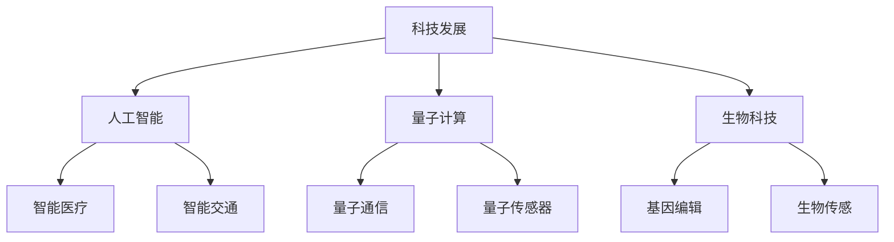

**核心算法原理讲解**

和谐共振科技的发展，将推动人工智能、量子计算和生物科技等领域的创新。这些技术将使和谐共振在更多领域得到应用，提高人类生活质量。

**数学模型和数学公式 & 详细讲解 & 举例说明**

量子通信的数学模型基于量子纠缠。通过量子纠缠，可以实现超距离的和谐共振。

$$
|\psi\rangle = \frac{1}{\sqrt{2}} (|0\rangle_A \otimes |1\rangle_B + |1\rangle_A \otimes |0\rangle_B)
$$

举例：量子通信可以实现安全的远程数据传输，保护信息不被窃取。

### 4.2 和谐共振在社会治理中的角色

**核心概念与联系**

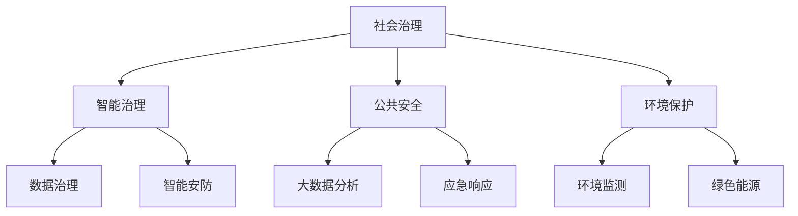

**核心算法原理讲解**

和谐共振在社会治理中的应用，将提高智能治理、公共安全和环境保护的效率。通过大数据分析和环境监测等技术，可以实现更高效的治理。

**数学模型和数学公式 & 详细讲解 & 举例说明**

环境监测的数学模型基于传感器网络。通过传感器网络，可以实时监测环境参数，分析环境状况。

$$
\text{环境监测} = \frac{\text{传感器数据}}{\text{时间}}
$$

举例：通过环境监测，可以及时发现环境污染问题，采取相应的治理措施。

### 4.3 和谐共振对人类文明的影响

**核心概念与联系**

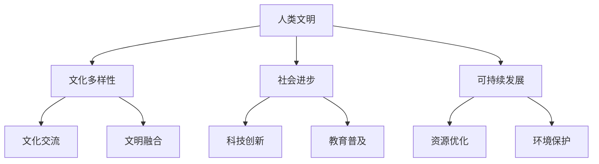

**核心算法原理讲解**

和谐共振对人类文明的影响，体现在促进文化多样性、社会进步和可持续发展等方面。通过科技创新和教育普及，可以提高人类文明的整体水平。

**数学模型和数学公式 & 详细讲解 & 举例说明**

可持续发展的数学模型基于资源优化。通过优化资源配置，可以实现可持续发展。

$$
\text{可持续发展} = \frac{\text{资源利用}}{\text{资源消耗}}
$$

举例：通过资源优化，可以实现绿色能源的广泛应用，减少对环境的破坏。

### 4.4 和谐共振的未来展望

**核心概念与联系**

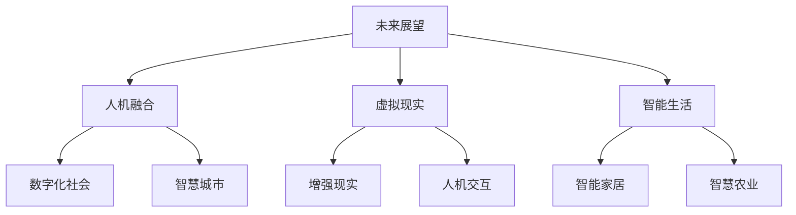

**核心算法原理讲解**

和谐共振的未来展望，体现在人机融合、虚拟现实和智能生活等方面。通过数字化社会和智慧城市的发展，人类生活将更加便捷和美好。

**数学模型和数学公式 & 详细讲解 & 举例说明**

智能家居的数学模型基于物联网。通过物联网技术，可以实现家庭设备的智能控制。

$$
\text{智能家居} = \frac{\text{设备连接}}{\text{设备数量}}
$$

举例：通过智能家居，可以实现远程控制家庭设备，提高生活品质。

---

## 附录

### A.1 和谐共振相关工具与资源

- **生物电测量工具**：如心电图机、脑电图机等。
- **声波共振检测工具**：如音波共振仪、振动分析仪等。
- **量子共振检测工具**：如量子共振检测仪、量子传感器等。

### A.2 常见问题解答与案例分析

- **问题1**：如何检测个人生命频率？
  **答案**：可以通过生物电测量、声波共振检测和量子共振检测等方法。

- **案例1**：一个患有心脏病的人，通过生物电测量发现了心率变异性异常，医生建议其进行健康生活方式的调整。

### A.3 和谐共振实践指南

- **睡眠管理**：保持规律的作息，创造舒适的睡眠环境。
- **饮食管理**：保持营养均衡，适量摄入。
- **运动管理**：进行规律的运动，科学锻炼。

### A.4 和谐共振专业术语表

- **和谐共振**：指两个或多个系统的振动频率相匹配，导致能量交换的现象。
- **生命频率**：指生物体内电磁场和生物节奏的振动频率。
- **生物电测量**：通过记录生物体内的电信号来分析生命频率。
- **声波共振检测**：利用声波的共振特性来检测生命频率。
- **量子共振检测**：利用量子共振现象来检测生命频率。

---

作者：AI天才研究院/AI Genius Institute & 禅与计算机程序设计艺术 /Zen And The Art of Computer Programming

