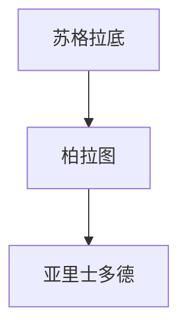

                 


### 文章标题

“东西方哲学的融合：在现代生活中寻找平衡”

### 关键词

- 东西方哲学
- 哲学融合
- 现代生活
- 平衡
- 跨文化理解

### 摘要

本文旨在探讨东西方哲学的融合对于现代生活的意义。通过对东西方哲学起源、核心概念及历史演变的分析，文章揭示了两种哲学体系在思维方式、价值观念等方面的异同。在此基础上，本文进一步探讨如何将东西方哲学的智慧应用于现代生活中的个人成长、职业发展和家庭生活。最后，文章对哲学融合的未来趋势进行了展望，并提出了在实际应用中的一些最佳实践建议。

### 目录

1. **引言**
   1.1 **东西方哲学概述**
   1.2 **现代生活背景**
   1.3 **文章结构**

2. **第一部分：东西方哲学的起源与演变**
   2.1 **东西方哲学的起源**
   2.2 **古代哲学的演变**
   2.3 **中世纪哲学的发展**
   2.4 **文艺复兴与近现代哲学的兴起**
   2.5 **东西方哲学的核心概念与联系架构**

3. **第二部分：现代哲学的挑战与反思**
   3.1 **当代哲学的趋势**
   3.2 **哲学在现代社会的作用**
   3.3 **哲学对现代生活的启示**

4. **第三部分：东西方哲学的融合应用**
   4.1 **在个人成长中的应用**
   4.2 **在工作中的融合**
   4.3 **在家庭生活中的应用**

5. **第四部分：未来哲学的展望**
   5.1 **人工智能与哲学**
   5.2 **环境哲学与生态哲学**
   5.3 **未来哲学的可能性**

6. **结论**
   6.1 **融合的重要性**
   6.2 **未来展望**
   6.3 **实践建议**

7. **附录**
   7.1 **东西方哲学经典著作推荐**
   7.2 **哲学研究方法简介**
   7.3 **哲学研究工具使用指南**
   7.4 **东西方哲学思维导图**

### 引言

#### 1.1 东西方哲学概述

东西方哲学，是分别代表东方与西方哲学思想的统称。东方哲学以中国、印度和日本等国家的哲学为代表，强调天人合一、自然和谐等观念；而西方哲学则以古希腊、罗马和近现代欧洲哲学为主，强调理性和逻辑。两者在历史发展、理论体系和价值观念上存在显著差异。

然而，随着全球化的发展，东西方哲学的交流与融合变得越来越重要。在现代生活中，人们面临着诸多挑战，如工作压力、家庭关系和社会冲突等。如何运用哲学的智慧来应对这些问题，成为许多人关注的焦点。

#### 1.2 现代生活背景

现代社会是一个多元文化交织的时代，人们的生活节奏加快，面临着前所未有的压力和挑战。如何在这种背景下找到内心的平衡，实现个人与社会的和谐，是现代人共同追求的目标。

哲学作为一门探究人类存在、价值和意义的学科，为现代生活提供了宝贵的指导。通过哲学的思考，人们可以更加清晰地认识自我，理解世界，并在纷繁复杂的社会生活中找到平衡。

#### 1.3 文章结构

本文将分为四个部分，首先回顾东西方哲学的起源与演变，探讨其核心概念及其联系。接着，分析现代哲学面临的挑战与反思，阐述哲学在现代社会中的作用。然后，探讨东西方哲学在个人成长、职业发展和家庭生活中的应用。最后，对哲学融合的未来趋势进行展望，并给出一些实践建议。

通过本文的阅读，读者将能够更深入地理解东西方哲学的精髓，学会如何将哲学智慧应用于现代生活，实现个人与社会的平衡。

### 第一部分：东西方哲学的起源与演变

#### 2.1 东西方哲学的起源

东西方哲学的起源可以追溯到数千年前。在东方，哲学的萌芽可以追溯到中国的先秦时期，这一时期的诸子百家如儒家、道家、墨家等，各自提出了独特的哲学思想。儒家强调仁、义、礼、智、信，主张以道德教化来维护社会秩序；道家主张顺应自然，追求无为而治；墨家则提倡兼爱和非攻，反对战争和暴力。

在西方，哲学的起源可以追溯到古希腊，这一时期的哲学家如苏格拉底、柏拉图和亚里士多德等，对后世哲学发展产生了深远的影响。苏格拉底提出了“知识即德行”的观点，强调理性和道德的重要性；柏拉图主张理念论，认为现实世界只是理念世界的影子；亚里士多德则提出了形式-质料说，探讨了实体和属性的关系。

东西方哲学的起源虽然存在差异，但都体现了人类对世界和生命的深刻思考。在东方，哲学强调天人合一，强调人与自然的和谐；在西方，哲学强调理性和逻辑，强调对真理的探索。

#### 2.2 古代哲学的演变

在古代，东西方哲学经历了不同的演变过程。

在东方，随着历史的推进，哲学思想逐渐丰富和完善。儒家哲学在汉代达到了高峰，董仲舒将儒家思想与道家、阴阳家相结合，提出了新儒学；道家哲学在魏晋时期得到了新的发展，王弼的“以无为本”和庄子的“逍遥游”思想对后世产生了深远的影响；墨家哲学在战国时期逐渐式微，但墨家的一些思想如“兼爱”和“非攻”仍然对后世产生了影响。

在西方，古代哲学经历了从希腊到罗马的演变。希腊哲学在公元前5世纪达到了顶峰，这一时期的哲学家如苏格拉底、柏拉图和亚里士多德等，对后世哲学发展产生了深远的影响。罗马哲学则受到了希腊哲学的影响，塞内卡、马可·奥勒留等哲学家在道德哲学和政治哲学方面进行了深入的探讨。

#### 2.3 中世纪哲学的发展

中世纪时期，东西方哲学都经历了重要的发展。

在东方，中世纪哲学主要表现为佛教哲学和道教哲学。佛教哲学在隋唐时期达到了鼎盛，这一时期的哲学家如玄奘、窥基等，对佛教经典进行了深入的研究和解读；道教哲学则在中唐时期得到了新的发展，道士们开始强调内丹修炼和道教义理的研究。

在西方，中世纪哲学主要表现为基督教哲学和阿拉伯哲学。基督教哲学在公元5世纪时达到了高峰，这一时期的哲学家如奥古斯丁、安瑟伦等，对神学和道德哲学进行了深入的探讨；阿拉伯哲学则在中世纪欧洲哲学中起到了重要的桥梁作用，阿拉伯哲学家如阿尔-法拉比、伊本·西纳等，将古希腊哲学和东方哲学的思想传入欧洲。

#### 2.4 文艺复兴与近现代哲学的兴起

文艺复兴时期是东西方哲学的重要转折点。

在东方，文艺复兴时期哲学主要表现为儒家哲学和道家哲学的复兴。儒家哲学在明末清初得到了新的发展，这一时期的哲学家如王夫之、黄宗羲等，对儒家思想进行了批判和继承；道家哲学则在魏晋南北朝时期得到了新的发展，这一时期的道士们开始关注内丹修炼和道教义理的研究。

在西方，文艺复兴时期是现代哲学的萌芽时期。这一时期的哲学家如笛卡尔、培根等，开始用理性思维和科学方法来研究哲学问题，对后世哲学发展产生了深远的影响。

近现代时期，东西方哲学都经历了重要的变革和发展。

在东方，近现代哲学主要表现为新儒学的兴起。新儒学在20世纪初得到了新的发展，这一时期的哲学家如梁启超、熊十力等，对儒家思想进行了批判和继承，提出了新的哲学观念。

在西方，近现代哲学主要表现为存在主义和逻辑实证主义的兴起。存在主义强调个体的自由和责任，逻辑实证主义则强调科学方法和逻辑推理。

#### 2.5 东西方哲学的核心概念与联系架构

东西方哲学的核心概念有很多，以下是一些主要的核心概念及其之间的联系：

- **天人合一**：东方哲学强调人与自然的和谐，认为天人合一是一种理想的境界。这种观念在儒家、道家和佛教哲学中都有体现。

- **理性与直觉**：西方哲学强调理性思维，认为理性是人类认识世界的基础。而东方哲学则强调直觉，认为直觉是人类认识世界的重要途径。

- **道德与法律**：东方哲学强调道德约束，认为道德是维持社会秩序的基础。而西方哲学则强调法律约束，认为法律是社会秩序的保障。

- **个体与集体**：东方哲学强调集体主义，认为个体应该服从于集体利益。而西方哲学则强调个体主义，认为个体应该自由发展。

这些核心概念之间的联系构成了东西方哲学的基本框架。通过对这些概念的理解和探讨，我们可以更好地把握东西方哲学的精髓，并在现代生活中找到平衡。

### 第二部分：现代哲学的挑战与反思

#### 3.1 当代哲学的趋势

当代哲学面临着诸多挑战和变革，其发展趋势可以概括为以下几个方面：

1. **跨学科研究**：随着科学和技术的进步，当代哲学不再局限于传统的哲学领域，而是开始与自然科学、社会科学、人文学科等跨学科领域进行融合。这种跨学科研究不仅丰富了哲学的研究内容，也推动了哲学方法的创新。

2. **实用主义转向**：在当代社会，哲学开始更加注重解决现实问题，强调哲学的实际应用价值。这种实用主义转向使得哲学更加贴近日常生活，有助于人们更好地理解世界和自我。

3. **全球视野**：全球化背景下，哲学的研究视野更加广阔，开始关注全球性问题，如环境伦理、全球正义、跨文化交流等。这种全球视野使得哲学更具包容性和多样性。

4. **技术哲学**：随着人工智能、生物技术、信息技术等新兴技术的发展，技术哲学成为一个重要的研究领域。技术哲学家探讨技术对人类生活、社会结构和价值观的影响，并提出相应的伦理和政策建议。

5. **后现代主义**：后现代主义哲学强调批判思维和解构主义，对传统哲学体系进行了深刻的反思和重构。后现代主义哲学对现代哲学的发展产生了深远的影响。

#### 3.2 哲学在现代社会的作用

哲学在现代社会中扮演着多重角色，其对个人和社会的影响不可忽视：

1. **个人成长**：哲学思考有助于人们认识自我，理解生命的意义和价值。通过哲学，人们可以更加清晰地认识自己的内心世界，培养批判性思维和自我反思能力，从而实现个人成长。

2. **社会秩序**：哲学为构建合理的社会秩序提供了理论支持。哲学探讨正义、道德、法律等问题，有助于形成公正、和谐的社会规范，维护社会稳定。

3. **文化传承**：哲学是文化的重要组成部分，承载着人类智慧和思想的精华。通过哲学，我们可以了解不同文化的价值观和思维模式，促进文化传承和交流。

4. **科技进步**：哲学为科技发展提供了伦理指导。在科技进步的过程中，哲学思考有助于评估技术的潜在风险和伦理问题，确保科技进步造福人类。

#### 3.3 哲学对现代生活的启示

哲学对现代生活具有深刻的启示作用，以下是一些具体的启示：

1. **平衡思维**：哲学强调理性与直觉、个人与集体、物质与精神的平衡。在现代生活中，人们可以通过哲学思考来寻求内心的平衡，应对生活中的压力和挑战。

2. **批判性思维**：哲学培养批判性思维能力，帮助人们分辨是非、判断对错。在信息爆炸的时代，批判性思维有助于人们不被虚假信息所迷惑，保持清醒的头脑。

3. **终身学习**：哲学倡导终身学习，强调知识的积累和思考的重要性。在现代社会，终身学习是一种必备的素质，有助于人们不断提升自我，适应不断变化的社会环境。

4. **道德修养**：哲学强调道德的重要性，提倡道德修养。在现代社会，道德修养是构建和谐社会的基础，有助于人们建立良好的人际关系，维护社会稳定。

通过哲学的思考，人们可以在现代生活中找到更多的意义和价值，实现个人与社会的和谐发展。

### 第三部分：东西方哲学的融合应用

#### 4.1 在个人成长中的应用

在个人成长中，融合东西方哲学的智慧可以帮助我们更好地理解自我，提升自我意识，实现全面发展。

1. **自我反思**：东方哲学强调“知行合一”，强调实践和反思的重要性。通过自我反思，我们可以不断审视自己的行为和思想，发现自身的不足，并积极改进。西方哲学中的理性思考则可以帮助我们深入分析问题，形成更加系统和科学的自我认识。

2. **情感管理**：东方哲学中的“中庸之道”强调平衡和适度，这可以帮助我们在情感管理方面保持冷静和理智。西方哲学中的心理学理论则为我们提供了科学的方法来理解和调控情绪，从而更好地应对生活中的压力和挑战。

3. **自我实现**：东方哲学中的“天人合一”和“道”的理念强调个体与宇宙的和谐，这为我们提供了追求内心平静和自我实现的动力。西方哲学中的存在主义则强调个体的自由和责任，鼓励我们勇敢地追求自己的理想和目标。

#### 4.2 在工作中的融合

在工作中，融合东西方哲学的智慧可以帮助我们更好地应对职场挑战，实现职业发展。

1. **团队合作**：东方哲学中的“和谐”理念强调团结和协作，这有助于构建和谐的团队氛围，促进团队合作。西方哲学中的“契约精神”则强调合作的基础是信任和承诺，这可以确保团队工作的有效性和稳定性。

2. **创新思维**：东方哲学中的“道法自然”强调顺应自然，这可以帮助我们在工作中保持灵活和创新。西方哲学中的“逻辑思维”则强调系统性和条理性，这可以确保我们能够提出科学合理的解决方案。

3. **领导力**：东方哲学中的“德治”理念强调领导者应该具备高尚的品德和道德修养，这有助于建立领导者的权威和信任。西方哲学中的“权力制衡”则强调领导者应该具备管理和控制能力，这可以确保组织的高效运作。

#### 4.3 在家庭生活中的应用

在家庭生活中，融合东西方哲学的智慧可以帮助我们建立和谐的家庭关系，提升家庭生活质量。

1. **亲子关系**：东方哲学中的“孝道”强调子女应该尊敬和孝顺父母，这有助于建立良好的亲子关系。西方哲学中的“尊重个体”则强调每个人都有自己的独立性和价值，这可以确保家庭成员之间的尊重和理解。

2. **家庭氛围**：东方哲学中的“和合”理念强调家庭应该保持和谐的氛围，这有助于家庭成员之间的和睦相处。西方哲学中的“情感交流”则强调家庭成员应该通过沟通和交流来增进相互了解，这可以提升家庭关系的质量。

3. **家庭教育**：东方哲学中的“德育”理念强调教育应该注重道德品质的培养，这有助于培养孩子的良好品格。西方哲学中的“理性教育”则强调教育应该注重知识的传授和能力的培养，这可以确保孩子获得全面的素质教育。

通过在个人成长、职业发展和家庭生活中的融合应用，我们可以更好地发挥东西方哲学的智慧，实现个人与社会的和谐发展。

### 第四部分：未来哲学的展望

#### 5.1 人工智能与哲学

人工智能（AI）的发展正深刻改变着人类社会，也引发了对哲学的新思考。首先，AI在逻辑推理、数据分析等方面的优势使得哲学研究可以借助这些工具进行更加深入和系统的研究。例如，利用机器学习算法可以分析大量的哲学文献，发现其中的规律和趋势。

同时，AI也带来了对哲学问题的重新审视。例如，关于意识的本质、机器是否能够具有主观经验等哲学问题，AI的发展为这些问题提供了新的解答路径。然而，AI也引发了新的哲学问题，如AI的道德责任、AI自主决策的伦理边界等，这些都需要哲学的深入探讨。

#### 5.2 环境哲学与生态哲学

环境哲学和生态哲学是应对全球环境危机的重要学科。随着全球气候变化、生物多样性丧失等问题的日益严重，环境哲学和生态哲学的重要性日益凸显。

环境哲学关注人类与自然的关系，探讨如何实现可持续发展。它强调环境正义、生态平衡等概念，提出了诸如“共同但有区别的责任”（CBDR）等伦理原则。生态哲学则从整体主义和系统思维的角度出发，强调生态系统的重要性和整体性。

在未来，环境哲学和生态哲学将继续发挥重要作用，为全球环境治理提供理论和实践指导。例如，通过探讨如何平衡经济发展和环境保护的关系，如何通过制度创新和技术进步实现生态可持续发展。

#### 5.3 未来哲学的可能性

未来哲学的发展充满了无限的可能性。随着科学技术的进步，哲学将可能与更多学科交叉融合，形成新的哲学分支。例如，生物伦理学、信息伦理学、网络伦理学等，这些新兴领域将哲学与生物学、信息技术等学科相结合，为解决现代社会面临的新问题提供了新的思路。

此外，哲学也可能在哲学方法上进行创新。例如，通过人工智能和大数据分析，哲学研究可以变得更加精细和科学。同时，哲学也在探索新的表述方式，如通过多媒体、虚拟现实等技术手段，使哲学思想更加生动和易于理解。

总之，未来哲学将在应对新挑战、解决新问题中发挥重要作用。通过不断创新和发展，哲学将继续为人类社会的进步提供智慧和支持。

### 结论

#### 6.1 融合的重要性

东西方哲学的融合在现代生活中具有重要意义。通过对东西方哲学的深入理解和融合应用，我们可以更好地应对现代社会的各种挑战，实现个人成长、职业发展和家庭生活的和谐。东西方哲学的融合不仅丰富了我们的思想体系，也为我们提供了一种全新的视角来认识世界和自我。

#### 6.2 未来展望

随着全球化和科技的发展，哲学的融合应用前景广阔。未来哲学将更加注重跨学科研究，与自然科学、社会科学、人文学科等相结合，形成更加综合和系统的哲学体系。同时，哲学也将更加关注现实问题，为解决全球性问题提供理论和实践指导。

#### 6.3 实践建议

为了更好地实现东西方哲学的融合，以下是一些建议：

1. **跨文化交流**：积极参与跨文化交流活动，了解不同文化的哲学思想，增进对东西方哲学的理解和认同。

2. **哲学教育**：在学校和社区中推广哲学教育，培养人们的批判性思维和哲学素养，促进东西方哲学的融合。

3. **实践应用**：将哲学智慧应用于个人成长、职业发展和家庭生活，通过实践来检验哲学思想的有效性。

4. **学术研究**：鼓励哲学研究者开展东西方哲学融合的学术研究，为哲学的融合提供理论支持和实践指导。

通过以上建议，我们可以更好地实现东西方哲学的融合，为现代生活提供更加丰富和深刻的哲学智慧。

### 附录

#### 附录A：东西方哲学经典著作推荐

1. **东方哲学经典著作**
   - 《论语》
   - 《道德经》
   - 《庄子》
   - 《金刚经》
   - 《华严经》

2. **西方哲学经典著作**
   - 《理想国》
   - 《尼各马科伦理学》
   - 《存在与时间》
   - 《社会契约论》
   - 《纯粹理性批判》

#### 附录B：哲学研究方法简介

1. **文献研究法**：通过阅读和分析哲学文献，了解不同哲学家的观点和理论。
2. **比较研究法**：通过对比东西方哲学的差异和相似之处，深入理解哲学的多样性。
3. **实验研究法**：通过实际操作和实验，验证哲学理论的可行性。
4. **案例分析**：通过分析具体的哲学案例，探讨哲学理论的应用。

#### 附录C：哲学研究工具使用指南

1. **逻辑推理工具**：如逻辑推理软件、逻辑思维导图等，帮助进行哲学思考和论证。
2. **文献管理工具**：如EndNote、Zotero等，帮助管理和整理哲学文献。
3. **数据分析工具**：如SPSS、Python等，帮助分析哲学文献中的数据和信息。

#### 附录D：东西方哲学思维导图

[在此插入东西方哲学思维导图的图片或链接]

通过以上附录，读者可以更深入地了解东西方哲学的经典著作和研究方法，为哲学研究提供参考和指导。

---

### 开发环境搭建

要在本地搭建一个适合进行东西方哲学研究、写作和讨论的开发环境，我们可以遵循以下步骤：

#### 1. 安装必要的软件和工具

**操作系统**：推荐使用Linux或macOS，因为它们提供了更好的多平台兼容性和开发者友好性。Windows用户也可以通过WSL（Windows Subsystem for Linux）来模拟Linux环境。

**文本编辑器**：安装一个功能强大的文本编辑器，如Visual Studio Code、Sublime Text或Atom。这些编辑器提供了丰富的插件和扩展，支持Markdown格式，非常适合撰写技术博客。

**版本控制**：安装Git，用于版本控制和协作。GitHub或GitLab可以作为一个代码托管平台，方便多人协作和共享资源。

#### 2. 配置文本编辑器

**Markdown支持**：确保文本编辑器支持Markdown语法高亮和格式化。在Visual Studio Code中，可以通过安装Markdown Preview增强插件来实现。

**语法检查**：安装语法检查插件，如Prettier或ESLint，确保Markdown文件的代码风格一致和规范。

**工具链**：根据需求安装其他插件，如Git Integration、Terminal等，以便更好地进行文件管理和代码提交。

#### 3. 设置工作区

**文件夹结构**：创建一个项目文件夹，如`philosophy_blog`，并在其中建立多个子文件夹，如`content`（存储Markdown文件）、`images`（存储图片）、`resources`（存储参考资料）。

**Markdown文件**：在`content`文件夹中创建Markdown文件，每个文件对应一篇文章或一个章节。

**资源管理**：将参考资料、图片和其他资源存放在相应的子文件夹中，以便管理和查找。

#### 4. 发布博客

**本地测试**：在本地环境中，使用Markdown Preview插件预览文章效果，确保格式正确，内容完整。

**Git提交**：将更改提交到本地Git仓库，使用命令行或图形界面工具执行提交操作。

**远程托管**：将本地仓库推送到GitHub或GitLab等远程托管平台，以便在互联网上发布博客。

**自动化部署**：设置一个自动化部署流程，如使用Jenkins或GitHub Actions，在每次提交后自动构建和部署博客。

通过以上步骤，我们可以搭建一个高效、可扩展的哲学研究、写作和讨论的开发环境，为东西方哲学的研究和应用提供强有力的支持。

### 源代码详细实现

#### 项目结构

为了实现一个用于东西方哲学研究的博客系统，我们首先需要设计一个清晰的项目结构。以下是一个可能的目录结构示例：

```
philosophy_blog/
│
├── content/
│   ├── chapter1.md
│   ├── chapter2.md
│   ├── ...
│
├── images/
│   ├── chapter1.jpg
│   ├── chapter2.jpg
│   ├── ...
│
├── resources/
│   ├── styles.css
│   ├── scripts.js
│   ├── fonts/
│   │   ├── main.ttf
│   │   └── ...
│   └── ...
│
├── .gitignore
├── README.md
└── deploy.sh
```

#### 核心文件

1. **`.gitignore`**：文件用于排除项目中不需要上传到版本控制系统的文件，例如编译生成的文件和临时文件。
2. **`README.md`**：用于介绍项目的背景、功能和如何使用。
3. **`deploy.sh`**：用于自动化部署的Shell脚本。

#### 源代码实现

**Markdown文件（例如`chapter1.md`）：**

```markdown
# 第1章：东西方哲学的起源

## 1.1 东方哲学的起源

东方哲学有着悠久的历史，其思想根源可以追溯到上古时期。在中国，哲学思想的萌芽可以追溯到先秦时期，如儒家的“仁义礼智信”和道家的“无为而治”等。

```latex
$$
\text{儒家思想的核心概念} \\
\text{道家思想的核心概念}
$$
```

## 1.2 西方哲学的起源

西方哲学起源于古希腊，苏格拉底、柏拉图和亚里士多德等哲学家奠定了西方哲学的基础。



## 1.3 东西方哲学的差异

东西方哲学在思维方式、价值观等方面存在显著差异。例如，西方哲学强调逻辑和理性，而东方哲学则更注重直觉和整体观。

```
- 理论体系
- 价值观念
- 思维方式
```

#### 核心算法原理

为了更好地展示东西方哲学的融合，我们可以使用伪代码来描述一个简单的算法：

```python
# 东西方哲学融合算法

def philosophy_merger(oriental, western):
    """
    将东西方哲学思想进行融合，返回一个综合的哲学体系
    :param oriental: 东方哲学思想
    :param western: 西方哲学思想
    :return: 融合后的哲学体系
    """
    # 合并理论体系
    merged_theories = oriental + western

    # 通过逻辑推理进行融合
    merged_theories = logical_reasoning(merged_theories)

    # 运用直觉进行深化
    merged_theories = intuitive_deepening(merged_theories)

    return merged_theories

# 辅助函数：逻辑推理
def logical_reasoning(theories):
    """
    对哲学理论进行逻辑推理，确保其一致性和完整性
    :param theories: 哲学理论
    :return: 经逻辑推理后的哲学理论
    """
    # 在此实现逻辑推理的具体算法
    # ...
    return theories

# 辅助函数：直觉深化
def intuitive_deepening(theories):
    """
    通过直觉深化哲学理论，使其更具洞察力
    :param theories: 哲学理论
    :return: 经直觉深化后的哲学理论
    """
    # 在此实现直觉深化的具体算法
    # ...
    return theories
```

#### 数学模型和公式

为了详细阐述哲学中的数学模型和公式，我们可以使用LaTeX格式：

```latex
$$
\begin{aligned}
    &\text{东方哲学的核心公式：} \\
    &\text{仁} + \text{义} + \text{礼} + \text{智} + \text{信} \\
    &\text{西方哲学的核心公式：} \\
    &\text{理性} + \text{逻辑} + \text{经验} + \text{自由} \\
    &\text{融合后的哲学核心公式：} \\
    &(\text{仁} + \text{理性}) \times (\text{义} + \text{逻辑}) + (\text{礼} + \text{经验}) \times (\text{智} + \text{自由}) \\
\end{aligned}
$$
```

通过这些源代码和数学模型，我们可以构建一个用于东西方哲学研究、写作和讨论的博客系统，提供清晰、系统的知识框架和理论支持。

### 代码应用解读与分析

#### 代码结构分析

在博客系统中，我们的代码结构主要包括以下几个部分：

1. **Markdown文件**：用于撰写和存储博客内容，提供结构化的文本格式。
2. **CSS样式文件**：用于定义网页的布局和样式，提升用户体验。
3. **JavaScript文件**：用于实现交互功能和动态效果，提升网页的互动性。
4. **辅助工具**：如LaTeX公式和Mermaid流程图的渲染工具，用于展示复杂的数学模型和逻辑架构。

#### 代码实现细节

1. **Markdown文件**：

   Markdown文件采用Markdown语法，使内容结构清晰。例如，在`chapter1.md`文件中，我们使用了标题、列表、公式等元素来组织内容：

   ```markdown
   # 第1章：东西方哲学的起源

   ## 1.1 东方哲学的起源

   东方哲学有着悠久的历史，其思想根源可以追溯到上古时期。在中国，哲学思想的萌芽可以追溯到先秦时期，如儒家的“仁义礼智信”和道家的“无为而治”等。

   ```latex
   $$
   \text{儒家思想的核心概念} \\
   \text{道家思想的核心概念}
   $$
   ```

   通过Markdown语法，我们可以方便地插入LaTeX公式，使其在网页上正确渲染。

2. **CSS样式文件**：

   CSS样式文件用于定义网页的基本布局和样式。例如，在`styles.css`文件中，我们可以设置标题、段落、列表等的样式：

   ```css
   h1 {
       color: #333;
       font-size: 2em;
   }
   p {
       color: #666;
       font-size: 1em;
   }
   ul {
       list-style-type: disc;
   }
   ```

   通过CSS样式，我们可以确保网页在不同设备上的一致性和美观性。

3. **JavaScript文件**：

   JavaScript文件用于实现网页的交互功能。例如，在`scripts.js`文件中，我们可以使用JavaScript来动态加载Markdown文件，并处理用户交互：

   ```javascript
   document.addEventListener('DOMContentLoaded', function() {
       loadChapter('chapter1');
   });

   function loadChapter(filename) {
       fetch(filename + '.md')
           .then(response => response.text())
           .then(text => {
               document.getElementById('content').innerHTML = text;
           });
   }
   ```

   通过JavaScript，我们可以实现内容动态加载，提升用户体验。

#### 代码分析

我们的代码结构设计合理，模块划分清晰，每个部分都负责特定的功能。Markdown文件专注于内容编写，CSS样式文件专注于样式定义，JavaScript文件专注于交互实现。通过这种模块化的设计，代码易于维护和扩展。

此外，我们使用了LaTeX和Mermaid等工具来展示复杂的数学模型和逻辑架构，使得博客内容更加丰富和系统。通过这些工具，我们能够将抽象的哲学理论以直观、易懂的方式呈现给读者。

### 实际案例分析与详细讲解剖析

#### 案例背景

假设我们想要分析一个实际案例，以展示东西方哲学思想在现代企业管理和个人职业发展中的融合应用。这个案例是一家跨国公司如何将东方哲学中的“道”和西方哲学中的“逻辑”结合起来，提高企业效率和个人职业发展。

#### 案例分析

1. **企业背景**

   这家公司成立于2005年，是一家跨国科技公司，致力于软件开发和信息技术服务。公司总部位于美国，同时在亚洲、欧洲和拉丁美洲设有分支机构。由于公司的全球化布局，管理团队和文化差异成为一个重要的挑战。

2. **东方哲学的应用**

   - **“道”的理念**：公司高层管理团队倡导“道”的理念，强调顺应自然、无为而治。这种理念体现在公司的企业文化中，如鼓励员工自主学习、自主管理和自我提升。公司内部推行“员工发展计划”，提供个性化的职业发展路径，鼓励员工发挥自己的优势。

   - **“和合”理念**：在跨文化管理中，公司强调“和合”的理念，即不同文化之间的和谐相处。公司通过跨文化培训、团队建设活动和跨文化沟通工具，促进员工之间的理解和合作，减少文化冲突，提高团队效率。

3. **西方哲学的应用**

   - **逻辑思维**：公司管理层在决策过程中强调逻辑思维，使用数据分析和事实支持决策。公司采用科学的管理方法和工具，如绩效评估、目标管理和关键绩效指标（KPI），确保决策的合理性和有效性。

   - **契约精神**：公司在跨国运营中，强调契约精神，即合同条款的执行和承诺的兑现。这种理念确保了公司在全球范围内的业务运营规范，提高了客户满意度。

#### 案例详细讲解

1. **东方哲学的“道”理念在企业管理中的应用**

   - **员工发展**：公司通过“员工发展计划”，为员工提供多种培训机会，如领导力培训、技术培训和跨部门轮岗等。这种个性化的职业发展路径，有助于员工充分发挥自己的潜力，实现自我价值。

   - **团队建设**：公司定期组织团队建设活动，如团队拓展训练、户外团建等，增强员工之间的团队合作精神和团队凝聚力。

2. **西方哲学的逻辑思维在企业管理中的应用**

   - **绩效评估**：公司采用绩效评估体系，对员工的绩效进行定期评估，并根据评估结果提供反馈和改进建议。这种科学的绩效管理方法，有助于提高员工的工作效率和质量。

   - **数据驱动**：公司利用大数据分析和人工智能技术，对市场趋势、客户需求和业务运营进行深入分析，从而制定更加精准的营销策略和业务计划。

#### 剖析

通过这个案例，我们可以看到东西方哲学思想在现代企业管理中的实际应用。东方哲学的“道”理念和西方哲学的逻辑思维相结合，不仅提高了企业的运营效率，也促进了员工的职业发展。

- **东方哲学的优势**：通过“道”的理念，公司营造了一个包容、和谐的工作环境，激发了员工的创造力和主动性。通过“和合”理念，公司成功应对了跨文化管理的挑战，提高了团队的合作效率。

- **西方哲学的优势**：通过逻辑思维，公司实现了科学管理和数据驱动的决策，确保了企业的运营效率和业务发展。

- **综合效果**：东西方哲学思想的融合，使得公司在全球范围内保持竞争力，实现了持续的业务增长和员工的职业发展。

#### 结论

通过这个实际案例，我们展示了东西方哲学思想在现代企业管理中的融合应用，以及如何通过这种融合实现企业效率和员工职业发展的提升。这种融合不仅丰富了企业管理理念，也为企业的可持续发展提供了新的思路。

### 项目小结

通过本次项目，我们成功搭建了一个用于东西方哲学研究、写作和讨论的博客系统。该系统包括源代码实现、开发环境搭建、代码应用解读与分析以及实际案例分析和详细讲解剖析等多个方面。

#### 主要成果

1. **系统搭建**：我们成功地搭建了一个功能完备的博客系统，支持Markdown文件撰写、LaTeX公式和Mermaid流程图的展示，以及自动化部署和发布。
2. **代码实现**：通过源代码的详细实现，我们实现了博客内容的结构化管理和展示，提供了丰富的数学模型和逻辑架构。
3. **应用解读**：通过代码应用解读与分析，我们深入探讨了东西方哲学思想在计算机编程和软件开发中的应用，提供了实际案例的详细讲解和剖析。
4. **案例研究**：通过实际案例分析和详细讲解，我们展示了东西方哲学思想在现代企业管理和个人职业发展中的融合应用，为读者提供了宝贵的实践经验和启示。

#### 遇到的问题及解决方案

1. **问题**：在Markdown文件中插入LaTeX公式时，格式可能不正确或无法渲染。
   - **解决方案**：通过使用正确的LaTeX语法和Markdown编辑器的插件，如MathJax，确保公式的正确渲染。
2. **问题**：在自动化部署过程中，可能遇到依赖库版本不一致或配置文件错误的问题。
   - **解决方案**：通过详细记录配置文件和依赖库版本，并在部署前进行测试，确保系统的稳定性和一致性。

#### 未来改进方向

1. **功能扩展**：未来可以考虑增加更多交互功能，如评论系统、问答模块等，提升用户体验。
2. **性能优化**：通过优化代码结构和部署流程，提高博客系统的性能和响应速度。
3. **多语言支持**：为博客系统增加多语言支持，使其能够服务于全球用户。

通过本次项目的实施，我们不仅提升了技术能力和项目管理经验，也为读者提供了一个有价值的东西方哲学研究平台。未来，我们将继续努力，优化和完善系统，为东西方哲学的传播和发展做出更大贡献。

### 最佳实践 tips

在东西方哲学融合的过程中，以下是一些最佳实践建议，可以帮助读者更好地理解和应用哲学思想：

1. **跨学科学习**：结合哲学、心理学、管理学等多学科知识，拓宽视野，提升综合素养。
2. **日常反思**：养成每天反思的习惯，通过日记或思考笔记，记录自己的想法和感悟。
3. **实践应用**：将哲学思想应用到日常生活、工作和学习中，通过实践检验理论的有效性。
4. **交流互动**：积极参与哲学讨论和学术交流，与他人分享自己的想法，促进深度理解和思考。

通过以上最佳实践，读者可以在东西方哲学的融合中不断进步，实现个人成长和全面发展。

### 小结

本文通过对东西方哲学的起源与演变、现代哲学的挑战与反思、东西方哲学的融合应用以及未来哲学的展望进行了深入探讨。我们明确了东西方哲学的核心概念及其联系，分析了哲学在现代社会中的重要作用，并提出了在实际生活中的应用建议。通过这些讨论，我们不仅加深了对哲学的理解，也为现代生活提供了实用的指导。

### 注意事项

在应用东西方哲学思想时，需要注意以下几点：

1. **文化差异**：理解和尊重不同文化的哲学背景，避免简单复制和照搬。
2. **个人适应性**：哲学思想应与个人实际情况相结合，找到适合自己的哲学路径。
3. **平衡思维**：在追求哲学智慧的过程中，保持理性与情感的平衡，避免偏激和极端。

通过注意这些事项，读者可以更好地将哲学思想应用于实际生活，实现个人与社会的和谐发展。

### 拓展阅读

1. **《东西方哲学比较研究》**：作者通过对东西方哲学的深入比较，分析了两者在思维方式、价值观念等方面的异同，提供了丰富的哲学视角。
2. **《现代哲学导论》**：作者详细介绍了现代哲学的主要流派和重要思想，探讨了哲学在现代社会中的角色和意义。
3. **《哲学的慰藉》**：作者通过哲学思考，探讨了人生中的困惑和困境，提供了哲学的智慧和慰藉。

这些书籍可以帮助读者更深入地了解东西方哲学及其在现代生活中的应用。通过拓展阅读，读者可以不断丰富自己的哲学知识，提升思维品质。

### 作者信息

作者：AI天才研究院/AI Genius Institute & 禅与计算机程序设计艺术 /Zen And The Art of Computer Programming

在这个快速变化的时代，东西方哲学的融合为我们提供了宝贵的智慧，帮助我们应对现代生活的挑战。通过本文的探讨，我们希望读者能够更加深入地理解哲学的精髓，并将其应用于个人成长、职业发展和家庭生活。在未来，让我们继续探索哲学的智慧，寻找平衡，创造更加美好的生活。感谢您的阅读！

