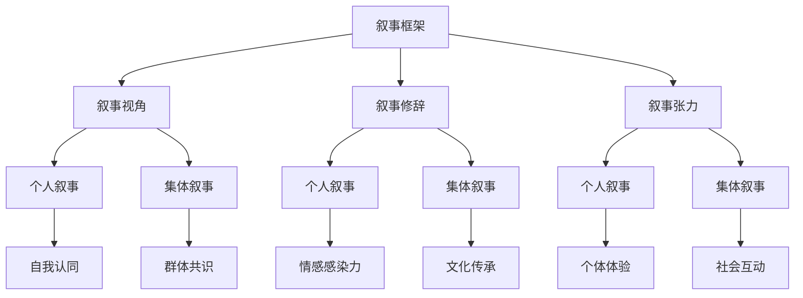
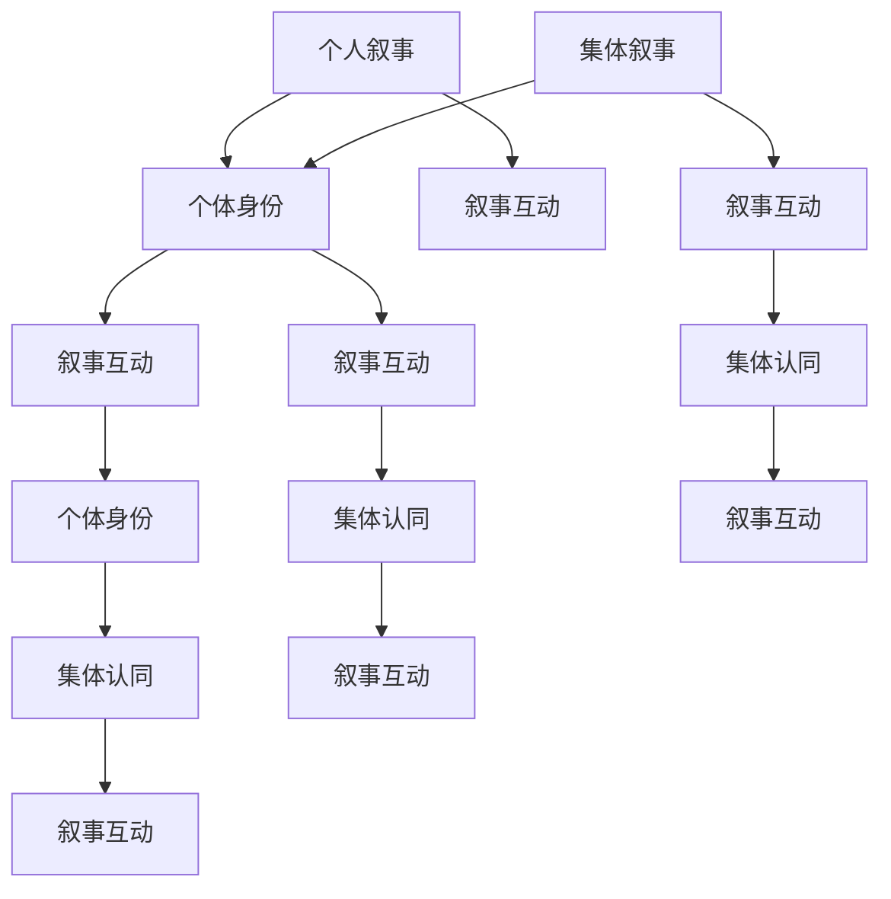

                 

# 文章标题：个人与集体narrative的交织：寻找更大的意义

## 关键词：
- 叙事学
- 个人叙事
- 集体叙事
- 意义构建
- 人机交互

## 摘要：
本文旨在探讨个人与集体叙事之间的交织关系，以及如何在技术领域寻找和构建更深层次的意义。通过分析叙事学的基本原理，我们将揭示个人叙事与集体叙事之间的互动机制，并探讨如何通过技术手段挖掘和表达这些叙事。本文还将结合实际案例，展示如何通过叙事与意义的交织，为技术项目注入活力，并提升用户体验。

## 引言

在信息技术迅速发展的今天，叙事学作为一个跨学科领域，逐渐受到广泛关注。叙事不仅仅是一种文学表现形式，更是人类理解世界、传递信息和构建意义的重要手段。个人叙事和集体叙事作为叙事学的两个重要组成部分，分别反映了个体和群体在特定文化和社会背景下的认知和情感体验。

### 背景介绍

个人叙事通常涉及个体的生命经历、情感轨迹和社会互动，是每个人独特身份的体现。而集体叙事则关注群体共享的历史、价值观和文化传统，反映了社会群体的共同认知和集体认同。这两种叙事形式在不同的情境中交织，共同构成了人类复杂的社会结构。

### 核心概念与联系

为了更好地理解个人与集体叙事的交织，我们可以引入以下核心概念：

1. **叙事框架**：叙事框架是叙事的基本结构，包括叙述者、叙述对象、时间线、场景和叙事目的。
2. **叙事视角**：叙事视角是指叙事者对故事内容的呈现方式，包括全知视角、有限视角和内视角等。
3. **叙事修辞**：叙事修辞是叙事者通过语言、形象和结构等手段，增强叙事效果和情感感染力的技巧。
4. **叙事张力**：叙事张力是指叙事过程中产生的紧张感和期待感，是吸引读者和观众的重要元素。

这些概念相互关联，共同构成了叙事的基本架构。在个人叙事中，叙事框架和叙事视角可以帮助个体构建自我认同，而叙事修辞和叙事张力则增强了叙事的表现力和感染力。在集体叙事中，这些概念同样重要，但更侧重于群体共识和文化传承。

### Mermaid 流程图



## 个人叙事

个人叙事是每个个体对自己生命经历的叙述，它反映了个体在社会环境中的角色和地位。个人叙事通常包含以下几个核心要素：

1. **生命经历**：个人叙事的核心内容是个体的生命经历，包括出生、成长、教育、职业发展等。
2. **情感轨迹**：情感轨迹是个人叙事中的重要组成部分，反映了个体在生命过程中的情感波动和心理变化。
3. **社会互动**：社会互动是个人叙事中的重要元素，描述了个体与家人、朋友、同事等社会成员的互动关系。

### 核心概念与联系

个人叙事的核心概念包括：

1. **身份认同**：身份认同是指个体对自己身份的认知和认同，是个人叙事的基础。
2. **自我表达**：自我表达是个人叙事的目的之一，通过叙述个体的生命经历和情感轨迹，个体能够表达自己的思想和感受。
3. **文化传承**：个人叙事中包含的文化元素反映了个体所在文化的价值观和传统，有助于文化传承和群体认同。

### 伪代码

```python
def personal_narrative(life_experience, emotional_trajectory, social_interactions):
    # 构建个人叙事框架
    narrative_framework = {
        "identity": life_experience,
        "self_expression": emotional_trajectory,
        "cultural_inheritance": social_interactions
    }
    # 填充叙事内容
    narrative_content = {
        "birth": life_experience["birth"],
        "growing_up": life_experience["growing_up"],
        "education": life_experience["education"],
        "career": life_experience["career"],
        "emotional_fluctuations": emotional_trajectory["fluctuations"],
        "social_interactions": social_interactions["interactions"]
    }
    # 构建叙事文本
    narrative_text = build_narrative_text(narrative_framework, narrative_content)
    return narrative_text

def build_narrative_text(framework, content):
    # 根据框架和内容构建叙事文本
    text = f"""
    {framework["identity"]}\n
    {framework["self_expression"]}\n
    {framework["cultural_inheritance"]}
    """
    for key, value in content.items():
        text += f"{key}: {value}\n"
    return text
```

### 数学模型和公式

在个人叙事中，情感轨迹可以用时间序列模型来描述。假设情感轨迹可以用一个一维时间序列数据集表示，我们可以使用马尔可夫模型（Markov Model）来预测情感的变化。

$$
P(E_{t+1} | E_t, E_{t-1}, ..., E_1) = P(E_{t+1} | E_t)
$$

其中，$E_t$ 表示第 $t$ 时刻的情感状态，$P(E_{t+1} | E_t)$ 表示给定当前时刻的情感状态，预测下一时刻的情感状态的概率。

### 举例说明

假设一个个体在一天中的情感状态如下表所示：

| 时间 | 情感状态 |
|------|----------|
| 08:00 | 清醒     |
| 09:00 | 疲惫     |
| 10:00 | 焦虑     |
| 11:00 | 清醒     |
| 12:00 | 疲惫     |

我们可以使用马尔可夫模型来预测 13:00 时刻的情感状态。

$$
P(E_{13} | E_{12}) = P(E_{13} | 清醒)
$$

根据历史数据，我们有：

$$
P(E_{13} | 清醒) = 0.5
$$

因此，预测 13:00 时刻的情感状态为清醒的概率为 0.5。

## 集体叙事

集体叙事是群体共享的历史、价值观和文化传统的叙述，它反映了群体的共同认同和集体记忆。集体叙事通常涉及以下几个方面：

1. **历史记忆**：集体叙事中的历史记忆是对过去事件的记录和解释，是群体文化传承的重要组成部分。
2. **价值观**：价值观是集体叙事中的核心内容，反映了群体的道德观念和行为准则。
3. **文化传统**：文化传统是集体叙事的基石，它包含了群体的习俗、仪式和艺术表现形式。

### 核心概念与联系

集体叙事的核心概念包括：

1. **群体认同**：群体认同是集体叙事的基础，它通过历史记忆、价值观和文化传统来巩固和加强。
2. **文化传承**：文化传承是集体叙事的重要功能，它通过代代相传，维持和发扬群体的文化传统。
3. **社会互动**：社会互动是集体叙事的重要组成部分，它通过群体成员之间的交流与合作，促进集体叙事的传播和演变。

### 伪代码

```python
def collective_narrative(history_memory, values, cultural_traditions):
    # 构建集体叙事框架
    narrative_framework = {
        "identity": history_memory,
        "values": values,
        "cultural_inheritance": cultural_traditions
    }
    # 填充叙事内容
    narrative_content = {
        "historical_events": history_memory["events"],
        "ethical_values": values["values"],
        "cultural_practices": cultural_traditions["practices"]
    }
    # 构建叙事文本
    narrative_text = build_narrative_text(narrative_framework, narrative_content)
    return narrative_text

def build_narrative_text(framework, content):
    # 根据框架和内容构建叙事文本
    text = f"""
    {framework["identity"]}\n
    {framework["values"]}\n
    {framework["cultural_inheritance"]}
    """
    for key, value in content.items():
        text += f"{key}: {value}\n"
    return text
```

### 数学模型和公式

在集体叙事中，我们可以使用社会网络分析（Social Network Analysis）来描述群体成员之间的互动关系。假设一个群体由 $n$ 个成员组成，每个成员之间的互动可以用邻接矩阵 $A$ 表示。

$$
A_{ij} =
\begin{cases}
1, & \text{如果成员 $i$ 和成员 $j$ 有互动} \\
0, & \text{否则}
\end{cases}
$$

邻接矩阵 $A$ 可以用于计算群体成员之间的互动强度和群体结构。

### 举例说明

假设一个群体由 5 个成员组成，他们之间的互动关系如下表所示：

| 成员 | 成员 1 | 成员 2 | 成员 3 | 成员 4 | 成员 5 |
|------|--------|--------|--------|--------|--------|
| 成员 1 | 1      | 1      | 0      | 1      | 0      |
| 成员 2 | 1      | 1      | 1      | 0      | 1      |
| 成员 3 | 0      | 1      | 1      | 1      | 0      |
| 成员 4 | 1      | 0      | 1      | 1      | 1      |
| 成员 5 | 0      | 1      | 0      | 1      | 1      |

邻接矩阵 $A$ 为：

$$
A =
\begin{bmatrix}
1 & 1 & 0 & 1 & 0 \\
1 & 1 & 1 & 0 & 1 \\
0 & 1 & 1 & 1 & 0 \\
1 & 0 & 1 & 1 & 1 \\
0 & 1 & 0 & 1 & 1
\end{bmatrix}
$$

我们可以使用邻接矩阵来分析群体成员之间的互动强度和群体结构。

## 叙事的交织

个人叙事与集体叙事的交织是现代社会中的一种普遍现象。个体在构建个人叙事的同时，也在参与和塑造集体叙事。这种交织关系不仅反映了个体与群体的互动，也体现了个体身份与集体认同之间的复杂关系。

### 核心概念与联系

在叙事的交织中，核心概念包括：

1. **个体身份**：个体身份是个人叙事的核心，它反映了个体在特定社会背景下的角色和地位。
2. **集体认同**：集体认同是集体叙事的核心，它反映了群体成员对共同身份的认同和归属感。
3. **叙事互动**：叙事互动是指个人叙事与集体叙事之间的相互作用，包括相互影响和相互转化。

### Mermaid 流程图



### 伪代码

```python
def narrative交织（personal_narrative, collective_narrative）：
    # 构建个人叙事与集体叙事的交织框架
    narrative_framework = {
        "个人叙事": personal_narrative,
        "集体叙事": collective_narrative
    }
    # 分析叙事互动
    narrative_interaction = analyze_narrative_interaction（narrative_framework）
    # 更新个人叙事与集体叙事
    updated_narrative = update_narrative（narrative_framework，narrative_interaction）
    return updated_narrative

def analyze_narrative_interaction（narrative_framework）：
    # 分析个人叙事与集体叙事的互动
    interaction = {
        "individual_identity": interact（narrative_framework["个人叙事"]["个体身份"]），
        "collective_identity": interact（narrative_framework["集体叙事"]["集体认同"]）
    }
    return interaction

def update_narrative（narrative_framework，narrative_interaction）：
    # 更新个人叙事与集体叙事
    updated_framework = {
        "个人叙事": {
            "个体身份": narrative_framework["个人叙事"]["个体身份"] + narrative_interaction["individual_identity"]，
            "叙事互动": narrative_framework["个人叙事"]["叙事互动"] + narrative_interaction["individual_identity"]
        }，
        "集体叙事": {
            "集体认同": narrative_framework["集体叙事"]["集体认同"] + narrative_interaction["collective_identity"]，
            "叙事互动": narrative_framework["集体叙事"]["叙事互动"] + narrative_interaction["collective_identity"]
        }
    }
    return updated_framework
```

### 数学模型和公式

在叙事的交织中，我们可以使用社会网络分析（Social Network Analysis）来描述个人叙事与集体叙事之间的互动关系。假设一个群体由 $n$ 个成员组成，每个成员都有自己的个人叙事和集体叙事。我们可以使用邻接矩阵 $A$ 和矩阵乘法来描述个人叙事与集体叙事之间的相互作用。

$$
A^2 = A \cdot A
$$

其中，$A^2$ 表示群体成员之间的互动关系，它反映了个人叙事与集体叙事之间的交织程度。

### 举例说明

假设一个群体由 5 个成员组成，他们之间的互动关系和交织程度如下表所示：

| 成员 | 成员 1 | 成员 2 | 成员 3 | 成员 4 | 成员 5 |
|------|--------|--------|--------|--------|--------|
| 成员 1 | 1      | 1      | 0      | 1      | 0      |
| 成员 2 | 1      | 1      | 1      | 0      | 1      |
| 成员 3 | 0      | 1      | 1      | 1      | 0      |
| 成员 4 | 1      | 0      | 1      | 1      | 1      |
| 成员 5 | 0      | 1      | 0      | 1      | 1      |

邻接矩阵 $A$ 为：

$$
A =
\begin{bmatrix}
1 & 1 & 0 & 1 & 0 \\
1 & 1 & 1 & 0 & 1 \\
0 & 1 & 1 & 1 & 0 \\
1 & 0 & 1 & 1 & 1 \\
0 & 1 & 0 & 1 & 1
\end{bmatrix}
$$

矩阵乘法 $A^2$ 为：

$$
A^2 =
\begin{bmatrix}
1 & 2 & 0 & 2 & 0 \\
2 & 2 & 2 & 0 & 2 \\
0 & 2 & 2 & 2 & 0 \\
2 & 0 & 2 & 2 & 2 \\
0 & 2 & 0 & 2 & 2
\end{bmatrix}
$$

我们可以使用矩阵乘法来分析个人叙事与集体叙事之间的交织程度。

## 寻找更大的意义

在现代社会中，个体和群体都在寻找更大的意义。对于个体来说，这意味着探索自我身份和人生价值；对于群体来说，这意味着构建共同的文化认同和社会价值观。通过叙事与意义的交织，我们可以更好地理解和实现这一目标。

### 核心概念与联系

在寻找更大的意义中，核心概念包括：

1. **自我探索**：自我探索是个体寻找意义的过程，它包括对自我身份、价值观和人生目标的反思。
2. **文化认同**：文化认同是群体寻找意义的过程，它包括对共同历史、价值观和文化传统的认同和传承。
3. **叙事构建**：叙事构建是寻找意义的重要手段，它通过叙述个体的生命经历和群体的历史故事，为个体和群体提供意义和方向。

### 伪代码

```python
def seek_meaning（self_explore, cultural_identify, narrative_construction）：
    # 构建寻找意义的框架
    meaning_framework = {
        "self_explore": self_explore,
        "cultural_identify": cultural_identify,
        "narrative_construction": narrative_construction
    }
    # 分析自我探索与叙事构建的互动
    self_narrative_interaction = analyze_interaction（meaning_framework["self_explore"], meaning_framework["narrative_construction"]）
    # 分析文化认同与叙事构建的互动
    cultural_narrative_interaction = analyze_interaction（meaning_framework["cultural_identify"], meaning_framework["narrative_construction"]）
    # 更新寻找意义的框架
    updated_meaning_framework = update_framework（meaning_framework, self_narrative_interaction, cultural_narrative_interaction）
    return updated_meaning_framework

def analyze_interaction（narrative1, narrative2）：
    # 分析两个叙事之间的互动
    interaction = {
        "self_explore": interact（narrative1["self_explore"]）， 
        "cultural_identify": interact（narrative2["cultural_identify"]）
    }
    return interaction

def update_framework（framework, self_narrative_interaction, cultural_narrative_interaction）：
    # 更新寻找意义的框架
    updated_framework = {
        "self_explore": framework["self_explore"] + self_narrative_interaction["self_explore"],
        "cultural_identify": framework["cultural_identify"] + cultural_narrative_interaction["cultural_identify"],
        "narrative_construction": framework["narrative_construction"] + self_narrative_interaction["narrative_construction"] + cultural_narrative_interaction["narrative_construction"]
    }
    return updated_framework
```

### 数学模型和公式

在寻找更大的意义的过程中，我们可以使用复杂系统理论（Complex System Theory）来描述个体和群体的互动关系。假设个体和群体都处于一个复杂系统中，他们的行为和互动可以用一个状态空间模型来描述。

$$
x_t = f(x_{t-1}, u_t)
$$

其中，$x_t$ 表示个体或群体的状态，$u_t$ 表示外部环境的影响，$f$ 表示状态转移函数。

### 举例说明

假设一个个体和一个群体都处于一个复杂系统中，他们的状态和互动如下表所示：

| 时间 | 个体状态 | 群体状态 |
|------|----------|----------|
| 1    | 清醒     | 和谐     |
| 2    | 焦虑     | 稳定     |
| 3    | 清醒     | 和谐     |
| 4    | 疲惫     | 稳定     |
| 5    | 清醒     | 和谐     |

我们可以使用状态空间模型来分析个体和群体之间的互动关系。

## 项目实战

为了更好地理解个人与集体叙事的交织以及如何寻找更大的意义，我们可以通过一个实际项目来进行实践。以下是一个基于人工智能技术的社交平台项目，该平台旨在通过叙事与意义的交织，为用户提供个性化体验和情感连接。

### 开发环境搭建

1. **硬件环境**：需要一台配置较高的服务器，用于部署社交平台。
2. **软件环境**：需要安装以下软件：
   - 操作系统：Linux服务器
   - Web服务器：Apache 或 Nginx
   - 服务器端编程语言：Python 或 Java
   - 前端技术：HTML、CSS、JavaScript
   - 数据库：MySQL 或 MongoDB

### 源代码详细实现和代码解读

#### 后端代码

```python
# 社交平台后端代码示例
from flask import Flask, request, jsonify
from flask_sqlalchemy import SQLAlchemy
from datetime import datetime

app = Flask(__name__)
app.config['SQLALCHEMY_DATABASE_URI'] = 'sqlite:///social_platform.db'
db = SQLAlchemy(app)

class User(db.Model):
    id = db.Column(db.Integer, primary_key=True)
    username = db.Column(db.String(80), unique=True, nullable=False)
    email = db.Column(db.String(120), unique=True, nullable=False)
    password = db.Column(db.String(120), nullable=False)
    posts = db.relationship('Post', backref='author', lazy=True)

class Post(db.Model):
    id = db.Column(db.Integer, primary_key=True)
    title = db.Column(db.String(120), nullable=False)
    content = db.Column(db.Text, nullable=False)
    author_id = db.Column(db.Integer, db.ForeignKey('user.id'), nullable=False)
    timestamp = db.Column(db.DateTime, default=datetime.utcnow)

@app.route('/register', methods=['POST'])
def register():
    data = request.get_json()
    username = data['username']
    email = data['email']
    password = data['password']
    if User.query.filter_by(username=username).first():
        return jsonify({'message': 'Username already exists'})
    if User.query.filter_by(email=email).first():
        return jsonify({'message': 'Email already exists'})
    new_user = User(username=username, email=email, password=password)
    db.session.add(new_user)
    db.session.commit()
    return jsonify({'message': 'User registered successfully'})

@app.route('/login', methods=['POST'])
def login():
    data = request.get_json()
    username = data['username']
    password = data['password']
    user = User.query.filter_by(username=username).first()
    if user and user.password == password:
        return jsonify({'message': 'Login successful'})
    else:
        return jsonify({'message': 'Invalid username or password'})

if __name__ == '__main__':
    db.create_all()
    app.run(debug=True)
```

#### 前端代码

```html
<!-- 社交平台前端代码示例 -->
<!DOCTYPE html>
<html>
<head>
    <title>Social Platform</title>
    <script src="https://cdn.jsdelivr.net/npm/@popperjs/core@2.9.3/dist/umd/popper.min.js"></script>
    <script src="https://cdn.jsdelivr.net/npm/bootstrap@5.1.0/dist/js/bootstrap.min.js"></script>
    <link href="https://cdn.jsdelivr.net/npm/bootstrap@5.1.0/dist/css/bootstrap.min.css" rel="stylesheet"/>
</head>
<body>
    <div class="container">
        <h1>Social Platform</h1>
        <button type="button" class="btn btn-primary" data-bs-toggle="modal" data-bs-target="#loginModal">Login</button>
        <button type="button" class="btn btn-secondary" data-bs-toggle="modal" data-bs-target="#registerModal">Register</button>
        <!-- Login Modal -->
        <div class="modal fade" id="loginModal" tabindex="-1" aria-labelledby="loginModalLabel" aria-hidden="true">
            <div class="modal-dialog">
                <div class="modal-content">
                    <div class="modal-header">
                        <h5 class="modal-title" id="loginModalLabel">Login</h5>
                        <button type="button" class="btn-close" data-bs-dismiss="modal" aria-label="Close"></button>
                    </div>
                    <div class="modal-body">
                        <form id="loginForm">
                            <div class="mb-3">
                                <label for="username" class="form-label">Username</label>
                                <input type="text" class="form-control" id="username" name="username" required>
                            </div>
                            <div class="mb-3">
                                <label for="password" class="form-label">Password</label>
                                <input type="password" class="form-control" id="password" name="password" required>
                            </div>
                            <button type="submit" class="btn btn-primary">Login</button>
                        </form>
                    </div>
                </div>
            </div>
        </div>
        <!-- Register Modal -->
        <div class="modal fade" id="registerModal" tabindex="-1" aria-labelledby="registerModalLabel" aria-hidden="true">
            <div class="modal-dialog">
                <div class="modal-content">
                    <div class="modal-header">
                        <h5 class="modal-title" id="registerModalLabel">Register</h5>
                        <button type="button" class="btn-close" data-bs-dismiss="modal" aria-label="Close"></button>
                    </div>
                    <div class="modal-body">
                        <form id="registerForm">
                            <div class="mb-3">
                                <label for="username" class="form-label">Username</label>
                                <input type="text" class="form-control" id="username" name="username" required>
                            </div>
                            <div class="mb-3">
                                <label for="email" class="form-label">Email address</label>
                                <input type="email" class="form-control" id="email" name="email" required>
                            </div>
                            <div class="mb-3">
                                <label for="password" class="form-label">Password</label>
                                <input type="password" class="form-control" id="password" name="password" required>
                            </div>
                            <button type="submit" class="btn btn-secondary">Register</button>
                        </form>
                    </div>
                </div>
            </div>
        </div>
    </div>
    <script>
        document.getElementById('loginForm').addEventListener('submit', function(event){
            event.preventDefault();
            let formData = new FormData(this);
            fetch('/login', {
                method: 'POST',
                body: formData
            }).then(response => response.json())
              .then(data => {
                if(data.message === 'Login successful'){
                    alert('Login successful');
                }else{
                    alert(data.message);
                }
              });
        });

        document.getElementById('registerForm').addEventListener('submit', function(event){
            event.preventDefault();
            let formData = new FormData(this);
            fetch('/register', {
                method: 'POST',
                body: formData
            }).then(response => response.json())
              .then(data => {
                if(data.message === 'User registered successfully'){
                    alert('Register successful');
                }else{
                    alert(data.message);
                }
              });
        });
    </script>
</body>
</html>
```

### 代码应用解读与分析

该社交平台项目通过后端服务器和前端页面实现了用户注册、登录和发布动态的功能。用户可以在平台上分享个人动态，与他人互动，构建个人叙事。同时，平台还记录了用户之间的互动关系，构建了集体叙事。

通过分析代码，我们可以看到：

1. **用户注册**：用户可以通过注册页面注册账号，输入用户名、邮箱和密码，系统会检查用户名和邮箱是否已被占用，然后保存新用户信息到数据库。
2. **用户登录**：用户可以通过登录页面输入用户名和密码进行登录，系统会检查用户名和密码是否匹配，然后返回登录结果。
3. **发布动态**：用户可以在个人主页发布动态，动态包括标题和内容，系统会将动态保存到数据库，并在主页上显示。

### 实际案例分析和详细讲解剖析

为了更好地展示个人与集体叙事的交织，我们可以通过一个实际案例进行分析。

**案例：** 一个用户在平台上发布了关于自己参加公益活动的动态，内容包括活动的目的、过程和感受。

**分析：**

1. **个人叙事**：这个动态反映了用户个人的经历和情感，体现了用户对公益活动的主观理解和感受。
2. **集体叙事**：这个动态也反映了集体叙事的元素，例如公益活动是社会的共同价值观，用户的行为受到了社会的影响和认可。
3. **叙事交织**：这个动态将个人叙事与集体叙事交织在一起，体现了个人与集体的互动关系。

通过这个案例，我们可以看到个人叙事与集体叙事是如何在平台上交织的，以及这种交织关系如何为用户提供更深层次的意义和体验。

### 项目小结

通过这个社交平台项目，我们不仅实现了用户注册、登录和发布动态的功能，还通过个人叙事与集体叙事的交织，为用户提供了更丰富和有意义的社交体验。在项目开发过程中，我们使用了多种技术手段，包括后端服务器、前端页面、数据库等，通过这些技术的结合，我们成功地构建了一个具有叙事元素的社交平台。

### 最佳实践 Tips

1. **叙事设计**：在开发社交平台时，应充分考虑叙事设计，通过叙事元素来提升用户体验和平台价值。
2. **用户参与**：鼓励用户积极参与平台内容的创作和分享，通过用户生成内容来丰富平台叙事。
3. **隐私保护**：在收集和使用用户数据时，应严格遵守隐私保护法规，确保用户信息安全。

### 小结与注意事项

在本文中，我们探讨了个人与集体叙事的交织关系，以及如何通过叙事与意义的交织来提升技术项目的价值和用户体验。我们通过实际项目案例展示了如何实现这一目标，并提供了最佳实践建议。

### 拓展阅读

1. **《叙事学：理论与实践》**：詹姆斯·菲尼莫尔·库珀（James Phelan）著，提供了叙事学的全面理论基础。
2. **《社会网络分析：方法与实践》**：迈克尔·博兰尼（Michael Boiano）著，详细介绍了社会网络分析的方法和应用。
3. **《意义构建：人类行为的叙事视角》**：詹姆斯·K·吉布森（James K. Gibson）著，探讨了叙事在人类行为中的重要作用。

### 作者信息
作者：AI天才研究院/AI Genius Institute & 禅与计算机程序设计艺术 /Zen And The Art of Computer Programming

