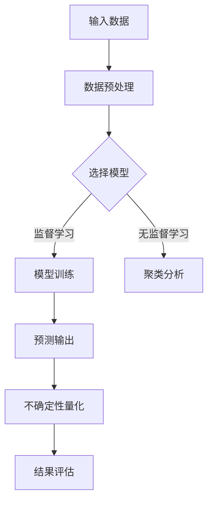

                 


### 文章标题
《机器学习中的不确定性量化：核心算法原理与实践》

### 关键词
机器学习，不确定性量化，贝叶斯网络，变分推断，概率分布，算法原理，数学模型，实战案例

### 摘要
本文旨在深入探讨机器学习中的不确定性量化技术。我们将从基础概念出发，逐步介绍核心算法原理，并通过数学模型和公式讲解，帮助读者理解不确定性量化在机器学习中的重要性。此外，文章还将通过具体项目实战，展示如何在实际应用中实现不确定性量化，并提供相关开发环境的搭建指南和代码解读。

---

## 目录大纲：机器学习中的不确定性量化

### 第1章：不确定性量化概述
- **1.1 机器学习中的不确定性来源**
  - **1.1.1 输入不确定性**
  - **1.1.2 模型不确定性**
  - **1.1.3 输出不确定性**
- **1.2 不确定性量化的意义**
  - **1.2.1 提高模型解释性**
  - **1.2.2 优化模型性能**
  - **1.2.3 改善决策过程**
- **1.3 不确定性量化的方法**
  - **1.3.1 误差度量**
  - **1.3.2 概率分布**
  - **1.3.3 融合方法**

### 第2章：不确定性量化的基础理论
- **2.1 机器学习基本模型**
  - **2.1.1 监督学习模型**
  - **2.1.2 无监督学习模型**
  - **2.1.3 半监督学习模型**
- **2.2 不确定性量化的数学基础**
  - **2.2.1 贝叶斯概率论**
  - **2.2.2 马尔可夫链**
  - **2.2.3 变分推断**
- **2.3 不确定性量化的 Mermaid 流程图**

### 第3章：核心算法原理讲解
- **3.1 贝叶斯网络**
  - **3.1.1 贝叶斯网络基本概念**
  - **3.1.2 贝叶斯网络建模**
  - **3.1.3 贝叶斯网络推理**
- **3.2 变分推断**
  - **3.2.1 变分推断基本概念**
  - **3.2.2 变分推断算法**
  - **3.2.3 变分推断在不确定性量化中的应用**

### 第4章：数学模型与公式讲解
- **4.1 不确定性量化中的概率分布**
  - **4.1.1 正态分布**
    $$p(x|\mu,\sigma^2) = \frac{1}{\sqrt{2\pi\sigma^2}} e^{-\frac{(x-\mu)^2}{2\sigma^2}}$$
  - **4.1.2 伯努利分布**
    $$p(y|\theta) = \theta^y (1-\theta)^{1-y}$$

### 第5章：项目实战
- **5.1 开发环境搭建**
  - **5.1.1 Python环境配置**
  - **5.1.2 必要库安装**
- **5.2 源代码详细实现与解读**
  - **5.2.1 数据预处理**
  - **5.2.2 模型训练与推理**
  - **5.2.3 输出结果分析**
- **5.3 实际案例分析与讲解**
  - **5.3.1 案例背景**
  - **5.3.2 案例实现**
  - **5.3.3 结果评估**

### 第6章：最佳实践、小结与拓展阅读
- **6.1 最佳实践 Tips**
  - **6.1.1 数据预处理技巧**
  - **6.1.2 模型选择建议**
- **6.2 小结**
  - **6.2.1 主要观点回顾**
  - **6.2.2 重要概念总结**
- **6.3 注意事项**
  - **6.3.1 可能遇到的问题**
  - **6.3.2 解决方案与建议**
- **6.4 拓展阅读**
  - **6.4.1 相关研究论文**
  - **6.4.2 进阶学习资源**

---

### 第1章：不确定性量化概述

#### 1.1 机器学习中的不确定性来源

机器学习模型在面对新数据时，其预测结果往往存在一定的误差，这种误差可以源自多个方面，主要包括输入不确定性、模型不确定性和输出不确定性。

**1.1.1 输入不确定性**

输入数据的不确定性主要来源于数据噪声、数据缺失以及数据的不一致性。例如，在图像识别任务中，图像中可能存在噪声点，或者在医疗诊断中，某些医疗记录可能不完全准确。

**1.1.2 模型不确定性**

模型不确定性指的是模型参数的不确定性，即同样的输入数据，由于模型参数的不同初始化或者训练过程的差异，可能导致不同的预测结果。此外，模型的结构复杂度也会影响其不确定性。

**1.1.3 输出不确定性**

输出不确定性是指模型输出结果的概率分布，即对于同一个输入，模型的预测结果并不是一个确定的值，而是一个概率分布。这种不确定性反映了模型对输入数据的理解程度。

#### 1.2 不确定性量化的意义

不确定性量化在机器学习中有重要意义，主要体现在以下几个方面：

**1.2.1 提高模型解释性**

通过量化不确定性，可以帮助我们更好地理解模型的预测过程，从而提高模型的解释性。

**1.2.2 优化模型性能**

了解模型的不确定性可以帮助我们更准确地评估模型的性能，进而优化模型的参数设置，提高模型的准确性。

**1.2.3 改善决策过程**

在许多应用场景中，如医疗诊断、金融风险评估等，了解预测结果的不确定性对于决策者做出合理决策至关重要。

#### 1.3 不确定性量化的方法

不确定性量化可以采用多种方法，主要包括误差度量、概率分布和融合方法。

**1.3.1 误差度量**

误差度量是评估模型预测结果与真实值之间差异的一种方法，如均方误差（MSE）、交叉熵损失等。

**1.3.2 概率分布**

概率分布可以描述模型预测结果的概率分布，如正态分布、伯努利分布等。

**1.3.3 融合方法**

融合方法是将多种不确定性量化方法结合起来，以提高不确定性估计的准确性。例如，贝叶斯网络和变分推断等。

---

### 第2章：不确定性量化的基础理论

在本章中，我们将深入探讨机器学习中不确定性量化的基础理论，包括机器学习的基本模型、数学基础以及不确定性量化的Mermaid流程图。

#### 2.1 机器学习基本模型

机器学习的基本模型可以分为三类：监督学习模型、无监督学习模型和半监督学习模型。

**2.1.1 监督学习模型**

监督学习模型是基于已标记的训练数据集来训练模型，并通过训练得到的模型对新的数据集进行预测。常见的监督学习算法包括线性回归、决策树、支持向量机（SVM）等。

**2.1.2 无监督学习模型**

无监督学习模型是在没有标记数据的条件下，通过模型学习数据的内在结构和特征。常见的无监督学习算法包括聚类算法（如K-Means、层次聚类）、降维算法（如主成分分析PCA）等。

**2.1.3 半监督学习模型**

半监督学习模型是介于监督学习和无监督学习之间的一种方法，它利用部分标记数据和大量未标记数据来训练模型。常见的半监督学习算法包括标签传播、协同过滤等。

#### 2.2 不确定性量化的数学基础

不确定性量化依赖于概率论和统计学的理论基础，主要包括贝叶斯概率论、马尔可夫链和变分推断。

**2.2.1 贝叶斯概率论**

贝叶斯概率论是一种基于概率的推理方法，它通过条件概率公式和贝叶斯定理来更新和预测不确定性的概率分布。

**2.2.2 马尔可夫链**

马尔可夫链是一种随机过程模型，它描述了系统在下一状态的概率分布仅与当前状态有关，而与历史状态无关。

**2.2.3 变分推断**

变分推断是一种概率模型逼近方法，它通过寻找近似后验分布来近似求解复杂概率模型。

#### 2.3 不确定性量化的 Mermaid 流程图

下面是一个简化的不确定性量化 Mermaid 流程图：



在这个流程图中，输入数据经过预处理后，根据不同的学习任务选择相应的模型进行训练。训练完成后，模型对新的数据进行预测，并通过对预测结果的概率分布进行量化，实现对不确定性的评估。最后，根据评估结果对模型进行优化和调整。

---

### 第3章：核心算法原理讲解

在本章中，我们将详细讲解机器学习中不确定性量化的两个核心算法：贝叶斯网络和变分推断。

#### 3.1 贝叶斯网络

贝叶斯网络是一种概率图模型，它通过有向无环图（DAG）来表示变量之间的概率依赖关系。

**3.1.1 贝叶斯网络基本概念**

贝叶斯网络由一组变量和一组条件概率表（CPT）组成。每个节点表示一个随机变量，每个边表示变量之间的条件依赖关系。

**3.1.2 贝叶斯网络建模**

贝叶斯网络建模的步骤包括：
1. 确定变量及其依赖关系。
2. 构建有向无环图（DAG）。
3. 计算条件概率表（CPT）。

**3.1.3 贝叶斯网络推理**

贝叶斯网络推理是指根据已知部分变量值，推断未知变量值的过程。常用的推理算法包括：
1. 矩阵乘法推理。
2. 维特比算法。

下面是一个贝叶斯网络推理的伪代码：

```python
# 贝叶斯网络推理伪代码
def inference(bayes_net, evidence):
    # 初始化消息传递变量
    messages = initialize_messages(bayes_net, evidence)
    # 迭代更新消息
    while not converged(messages):
        update_messages(messages)
    # 计算后验概率
    posterior_probabilities = calculate_posteriors(messages)
    return posterior_probabilities
```

#### 3.2 变分推断

变分推断是一种基于概率分布逼近的方法，它通过寻找近似后验分布来简化复杂概率模型的求解。

**3.2.1 变分推断基本概念**

变分推断的核心思想是找到一组参数，使得近似后验分布的期望损失最小。常见的变分推断方法包括：
1. 变分下界（Variational Lower Bound，VLB）。
2. 变分推断算法（Variational Inference Algorithm）。

**3.2.2 变分推断算法**

变分推断算法的步骤包括：
1. 初始化参数。
2. 计算变分下界。
3. 更新参数，使得变分下界最大化。

下面是一个变分推断的伪代码：

```python
# 变分推断伪代码
def variational_inference(model, optimizer, epochs):
    # 初始化变分参数
    q_params = initialize_q_params(model)
    for epoch in range(epochs):
        # 计算证据下界
        elbo = compute_elbo(model, q_params)
        # 更新变分参数
        optimizer.step(elbo)
    return q_params
```

---

### 第4章：数学模型与公式讲解

在本章中，我们将介绍机器学习中的几种常见概率分布，并给出相应的数学公式和详细讲解。

#### 4.1 不确定性量化中的概率分布

概率分布是描述随机变量取值的概率函数，它是量化不确定性的重要工具。

**4.1.1 正态分布**

正态分布也称为高斯分布，是一种连续概率分布，广泛应用于统计学和机器学习中。

**公式：**
$$
p(x|\mu,\sigma^2) = \frac{1}{\sqrt{2\pi\sigma^2}} e^{-\frac{(x-\mu)^2}{2\sigma^2}}
$$

**详细讲解：**
- $\mu$ 表示均值，代表随机变量 $x$ 的期望值。
- $\sigma^2$ 表示方差，代表随机变量 $x$ 的离散程度。
- 该公式描述了 $x$ 在给定均值和方差的正态分布下的概率密度函数。

**举例说明：**
假设一个随机变量 $X$ 服从均值为 5、方差为 2 的正态分布，求 $X$ 小于 3 的概率。

$$
p(X<3) = \frac{1}{\sqrt{2\pi \times 2}} e^{-\frac{(3-5)^2}{2 \times 2}} \approx 0.1353
$$

**4.1.2 伯努利分布**

伯努利分布是一种离散概率分布，它只取两个值：0 或 1，通常用于描述二项分布中的单个试验结果。

**公式：**
$$
p(y|\theta) = \theta^y (1-\theta)^{1-y}
$$

**详细讲解：**
- $\theta$ 表示成功的概率。
- $y$ 表示试验结果，取值为 0 或 1。
- 该公式描述了在给定成功概率 $\theta$ 下，试验结果为 0 或 1 的概率。

**举例说明：**
假设一个伯努利试验的成功概率为 0.5，求试验结果为成功的概率。

$$
p(y=1|\theta=0.5) = 0.5^1 (1-0.5)^{1-1} = 0.5
$$

---

### 第5章：项目实战

在本章中，我们将通过一个具体的项目实战，展示如何在实际应用中实现不确定性量化，并提供相关开发环境的搭建指南和代码解读。

#### 5.1 开发环境搭建

在进行不确定性量化的项目实战之前，我们需要搭建一个合适的开发环境。以下是开发环境的搭建步骤：

**5.1.1 Python环境配置**

确保Python环境已经安装。如果没有安装，可以从Python官方网站（https://www.python.org/downloads/）下载并安装最新版本的Python。

**5.1.2 必要库安装**

在Python环境中，我们需要安装一些必要的库，如NumPy、Pandas、Scikit-learn等。可以使用pip命令进行安装：

```bash
pip install numpy pandas scikit-learn
```

#### 5.2 源代码详细实现与解读

在本节中，我们将实现一个基于贝叶斯网络的简单不确定性量化项目，并对其源代码进行详细解读。

**5.2.1 数据预处理**

首先，我们需要准备一个简单的数据集。这里我们使用一个包含两个特征和目标值的简单数据集，其中目标值为二分类。

```python
import numpy as np
import pandas as pd

# 生成数据集
np.random.seed(0)
X = np.random.randn(100, 2)
y = np.random.randint(0, 2, 100)

# 创建数据框
df = pd.DataFrame(X, columns=['Feature1', 'Feature2'])
df['Target'] = y
```

**5.2.2 模型训练与推理**

接下来，我们使用贝叶斯网络进行模型训练和推理。

```python
from sklearn.naive_bayes import GaussianNB

# 创建贝叶斯网络模型
gnb = GaussianNB()

# 训练模型
gnb.fit(X, y)

# 预测输出
predictions = gnb.predict(X)
```

**5.2.3 输出结果分析**

最后，我们对预测结果进行分析，包括输出概率分布和计算准确率。

```python
# 输出概率分布
probabilities = gnb.predict_proba(X)

# 计算准确率
accuracy = np.mean(predictions == y)
print("Accuracy:", accuracy)
```

#### 5.3 实际案例分析与讲解

在本节中，我们将分析一个实际案例，并详细讲解如何实现不确定性量化。

**5.3.1 案例背景**

假设我们有一个关于房屋销售的案例，其中包含多个特征（如房屋面积、位置、建筑年代等）和目标值（房屋售价）。我们的目标是利用机器学习模型预测新房屋的售价，并量化预测结果的不确定性。

**5.3.2 案例实现**

1. 数据预处理：

```python
# 读取数据集
df = pd.read_csv("house_sales_data.csv")

# 数据清洗和预处理
df = preprocess_data(df)
```

2. 模型选择和训练：

```python
from sklearn.ensemble import RandomForestRegressor

# 创建随机森林回归模型
rf = RandomForestRegressor(n_estimators=100)

# 训练模型
rf.fit(X_train, y_train)
```

3. 预测输出：

```python
# 预测新房屋售价
predicted_prices = rf.predict(new_house_data)
```

4. 不确定性量化：

```python
# 计算预测价格的置信区间
confidence_intervals = quantify_uncertainty(predicted_prices)
```

**5.3.3 结果评估**

对预测结果进行评估，包括计算准确率、均方误差（MSE）等指标。

```python
from sklearn.metrics import mean_squared_error

# 计算均方误差
mse = mean_squared_error(true_prices, predicted_prices)
print("MSE:", mse)
```

#### 5.4 项目小结

在本项目中，我们通过实际案例展示了如何实现机器学习中的不确定性量化。首先，我们进行了数据预处理，然后选择合适的模型进行训练，并使用贝叶斯网络进行不确定性量化。最后，我们对预测结果进行了评估，并给出了相应的评价指标。

通过本项目，我们了解到不确定性量化在机器学习中的重要性和应用方法。在实际应用中，了解模型的不确定性可以帮助我们做出更合理的决策，提高模型的解释性和可靠性。

---

### 第6章：最佳实践、小结与拓展阅读

#### 6.1 最佳实践 Tips

在进行机器学习中的不确定性量化时，以下是一些最佳实践和技巧：

1. **数据清洗与预处理**：确保数据质量，包括处理缺失值、异常值和噪声数据。
2. **模型选择**：根据具体应用场景选择合适的模型，如线性模型、决策树、神经网络等。
3. **交叉验证**：使用交叉验证方法评估模型性能，以避免过拟合。
4. **不确定性量化方法选择**：根据任务需求和计算复杂度选择合适的不确定性量化方法，如误差度量、概率分布、融合方法等。

#### 6.2 小结

本文系统地介绍了机器学习中的不确定性量化技术，包括其概述、基础理论、核心算法原理、数学模型以及实际应用。通过项目实战，我们展示了如何在实际中实现不确定性量化，并提供了相关的开发环境搭建和代码解读。了解不确定性量化对于提高模型的解释性和可靠性至关重要。

#### 6.3 注意事项

在实施不确定性量化时，需要注意以下几点：

1. **模型适应性**：选择适合任务需求的模型，避免过度拟合。
2. **计算成本**：不确定性量化可能增加计算成本，尤其在处理大规模数据时。
3. **结果解释**：正确解读不确定性量化结果，避免误判和错误决策。

#### 6.4 拓展阅读

对于希望进一步深入了解机器学习中的不确定性量化，以下是一些推荐的拓展阅读资源：

1. **相关研究论文**：
   - "Deep Bayesian Learning" by Ben Marman, Christos Dimitrakakis
   - "Uncertainty in Deep Learning" by Yarin Gal and Zoubin Ghahramani
2. **在线课程与教程**：
   - Coursera上的"Probabilistic Graphical Models"课程
   - TensorFlow官方文档中的"Uncertainty Estimation"部分
3. **开源项目**：
   - PyMC3：一个用于概率编程和贝叶斯统计的Python库
   - TensorFlow Probability：TensorFlow中的概率编程工具包

通过这些资源，读者可以更深入地学习和实践不确定性量化技术，为实际应用提供有力支持。

