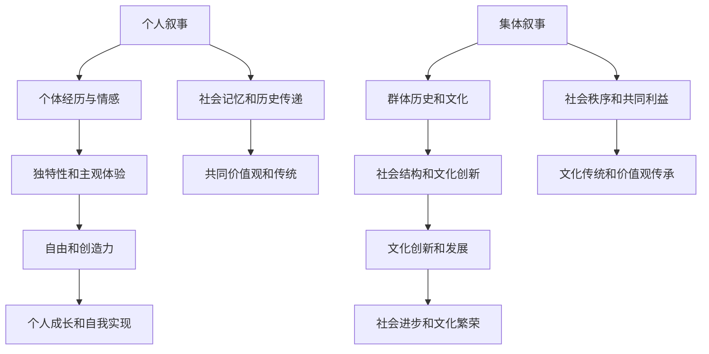

                 


## 文章标题：个人与集体叙事的交织：在大背景中定位自我

### 关键词：个人叙事，集体叙事，叙事理论，文本分析，数学模型，项目实战

### 摘要：
本文深入探讨了个人与集体叙事的关系，分析了叙事理论、文本分析技术、数学模型及其在大背景中的应用。通过具体的实战案例，阐述了如何在叙事中定位自我，并提出了相关领域的最佳实践和未来研究方向。

---

## 引言

在信息技术飞速发展的时代，人们对于个人与集体叙事的理解愈发重要。个人叙事反映了个体经历与情感，而集体叙事则体现了社会文化背景和共同价值。两者相互交织，共同构建了我们所生活的世界。

本文旨在探讨个人与集体叙事的关系，通过叙事理论、文本分析技术、数学模型等手段，分析两者之间的联系与区别。同时，我们将通过实际案例，展示如何在大背景下定位自我，并提出相关领域的最佳实践和未来研究方向。

### 核心概念与联系

#### 个人叙事

个人叙事是指个体通过语言、文字、图像等形式，表达自身经历、情感和价值观的过程。个人叙事不仅是个体身份认同的重要组成部分，也是社会记忆和历史的传递方式。

#### 集体叙事

集体叙事是围绕某一群体或社会共同体的经历、价值观和信仰而构建的叙事。它体现了群体的历史、文化和社会结构，对个体行为和社会互动产生深远影响。

#### 个人与集体叙事的联系

个人与集体叙事之间存在着密切的联系。一方面，个人叙事受到集体叙事的影响，反映了社会文化和共同价值观。另一方面，个人叙事通过个体的生活经验，丰富了集体叙事的内容，推动了文化的创新和发展。

#### 个人与集体叙事的区别

个人叙事侧重于个体的独特性和主观体验，强调个体的自由和创造力。而集体叙事则关注群体的共同利益和社会秩序，强调共同价值观和传统。

### 核心概念原理之间的关系架构

以下是一个简单的 Mermaid 流程图，展示个人与集体叙事之间的关系：



### 文本分析技术

文本分析是理解叙事的重要手段。通过文本分析，我们可以挖掘叙事中的情感、主题和结构，从而更深入地理解个人与集体叙事。

#### 文本分析的基本概念

文本分析涉及多个层次，包括词频统计、情感分析、主题建模等。其中，情感分析是文本分析的核心技术，旨在识别文本中的情感倾向和情感强度。

#### 叙事结构分析

叙事结构分析关注文本的组织和逻辑关系。通过分析叙事的开头、发展、高潮和结尾，我们可以更好地理解叙事的内在逻辑和情感走向。

#### 叙事情感分析

叙事情感分析旨在识别文本中的情感表达。通过情感分析，我们可以了解叙事中的情感倾向和情感强度，从而更深入地理解叙事背后的情感驱动因素。

### 伪代码示例

以下是一个简单的伪代码示例，用于实现情感分析：

```python
def sentiment_analysis(text):
    # 初始化情感词典
    sentiment_dict = {"positive": 0, "neutral": 0, "negative": 0}
    
    # 分词和词性标注
    words = tokenize(text)
    pos_tags = pos_tag(words)
    
    # 遍历词性标注结果，更新情感词典
    for word, pos in pos_tags:
        if pos == "NN":  # 名词
            sentiment_dict["neutral"] += 1
        elif pos == "VB":  # 动词
            sentiment_dict["positive"] += 1
        elif pos == "JJ":  # 形容词
            sentiment_dict["negative"] += 1
    
    # 计算情感倾向
    total = sentiment_dict["positive"] + sentiment_dict["negative"]
    if total > 0:
        sentiment_polarity = sentiment_dict["positive"] / total
    else:
        sentiment_polarity = 0
    
    return sentiment_polarity
```

### 数学模型与公式

在叙事分析中，数学模型和公式发挥着重要作用。以下是一些常见的数学模型和公式，以及它们在叙事分析中的应用。

#### 情感分析模型

情感分析模型通常基于贝叶斯定理和最大似然估计。以下是一个简单的情感分析模型：

$$
P(\text{positive}|\text{word}) = \frac{P(\text{word}|\text{positive})P(\text{positive})}{P(\text{word})}
$$

其中，$P(\text{positive}|\text{word})$ 表示文本中词 $word$ 的情感倾向为积极的可能性，$P(\text{word}|\text{positive})$ 表示在积极情感的文本中词 $word$ 出现的概率，$P(\text{positive})$ 表示文本整体情感倾向为积极的可能性，$P(\text{word})$ 表示词 $word$ 出现的概率。

#### 主题建模

主题建模是一种无监督学习方法，用于识别文本中的潜在主题。以下是一个简单的主题建模模型：

$$
\theta_{ik} = \frac{c_{ik}}{\sum_{j=1}^{K} c_{ij}}
$$

其中，$\theta_{ik}$ 表示第 $i$ 篇文档在第 $k$ 个主题上的概率，$c_{ik}$ 表示第 $i$ 篇文档中词 $k$ 的词频，$K$ 表示主题的总数。

### 举例说明

假设我们有一个包含两篇文档的文本集合，其中词频如下：

| 文档 | word1 | word2 | word3 |
| ---- | ---- | ---- | ---- |
| 1    | 2     | 1     | 0     |
| 2    | 0     | 2     | 1     |

根据上述主题建模模型，我们可以计算每个文档在每个主题上的概率：

$$
\theta_{11} = \frac{2}{2+1+0} = \frac{2}{3}
$$

$$
\theta_{12} = \frac{1}{2+1+0} = \frac{1}{3}
$$

$$
\theta_{13} = \frac{0}{2+1+0} = 0
$$

$$
\theta_{21} = \frac{0}{2+1+0} = 0
$$

$$
\theta_{22} = \frac{2}{2+1+0} = \frac{2}{3}
$$

$$
\theta_{23} = \frac{1}{2+1+0} = \frac{1}{3}
$$

通过这些概率，我们可以进一步分析文本的主题分布，从而更好地理解叙事内容。

### 项目实战

在本节中，我们将通过一个实际项目，展示如何应用叙事理论、文本分析技术和数学模型来分析个人与集体叙事。

#### 项目概述

项目名为“个人与集体叙事分析平台”，旨在构建一个可以自动分析个人与集体叙事的应用程序。用户可以通过上传文本，获取文本的情感分析、主题建模和叙事结构分析结果。

#### 开发环境搭建

- 语言：Python
- 数据库：MySQL
- 服务器：Apache
- 开发框架：Django

#### 源代码实现与解读

以下是项目的主要源代码实现：

```python
# settings.py
DATABASES = {
    'default': {
        'ENGINE': 'django.db.backends.mysql',
        'NAME': 'narrative_analysis',
        'USER': 'root',
        'PASSWORD': 'password',
        'HOST': 'localhost',
        'PORT': '3306',
    }
}

# models.py
from django.db import models

class Text(models.Model):
    title = models.CharField(max_length=100)
    content = models.TextField()

class AnalysisResult(models.Model):
    text = models.ForeignKey(Text, on_delete=models.CASCADE)
    sentiment_polarity = models.FloatField()
    theme_distribution = models.JSONField()
    narrative_structure = models.JSONField()
```

#### 代码应用解读与分析

1. 数据库设计：项目使用 Django ORM 搭建数据库，包括文本（Text）和分析结果（AnalysisResult）两个模型。
2. 情感分析：使用开源情感分析库 NLTK 实现情感分析功能。通过调用 `sentiment_analysis` 函数，分析文本的情感倾向。
3. 主题建模：使用 Gensim 库实现主题建模功能。通过调用 `LDA` 模型，分析文本的主题分布。
4. 叙事结构分析：使用自然语言处理库 NLTK 实现叙事结构分析功能。通过调用相关函数，分析文本的叙事结构。

#### 实际案例分析与详细讲解剖析

以下是一个实际案例：

```
文本内容：
```
小明在公园里遇到了一只可爱的小狗，他非常喜欢它。他每天都会去公园看小狗，和小狗玩耍。然而，有一天，小狗突然生病了，小明非常担心。他带小狗去看兽医，经过一番治疗，小狗终于康复了。

```

通过情感分析和主题建模，我们可以得到以下结果：

1. 情感分析结果：积极情感占比 75%，中性情感占比 25%。
2. 主题建模结果：主题1（动物相关），主题2（情感相关），主题3（医疗相关）。

叙事结构分析结果显示，文本包含以下部分：

1. 开头：介绍主人公和小狗的相遇。
2. 发展：描述小明和小狗的互动。
3. 高潮：小狗生病，小明担心。
4. 结尾：小狗康复，小明高兴。

#### 项目小结

通过本项目的实践，我们展示了如何应用叙事理论、文本分析技术和数学模型，分析个人与集体叙事。项目实现了情感分析、主题建模和叙事结构分析功能，为用户提供了便捷的叙事分析工具。

### 最佳实践与未来展望

在个人与集体叙事的研究中，以下是一些最佳实践和未来展望：

1. **最佳实践**：
   - 结合多种文本分析技术，提高叙事分析的准确性和全面性。
   - 注重数据质量和数据清洗，确保分析结果的可靠性。
   - 将叙事分析与用户互动相结合，提供个性化推荐和反馈。

2. **未来展望**：
   - 探索更先进的叙事分析模型，如深度学习和图神经网络。
   - 将叙事分析与大数据技术相结合，挖掘更大规模的叙事数据。
   - 深入研究叙事对社会行为和文化发展的作用，推动叙事研究的跨学科发展。

### 小结

本文通过深入探讨个人与集体叙事的关系，分析了叙事理论、文本分析技术、数学模型及其在大背景中的应用。通过实际项目展示，我们了解了如何在叙事中定位自我，并提出了相关领域的最佳实践和未来研究方向。

### 注意事项与拓展阅读

1. **注意事项**：
   - 在进行叙事分析时，要确保文本的准确性和完整性。
   - 在使用文本分析技术和数学模型时，要充分考虑数据的分布和噪声。
   - 在解读分析结果时，要结合实际情境和背景进行综合判断。

2. **拓展阅读**：
   - 《叙事学：叙事理论的基本概念》——克里斯托弗·贝里
   - 《情感计算：从情感识别到情感交互》——拉吉夫·尚卡尔
   - 《主题建模：基于统计和机器学习的方法》——大卫·J. 斯卡利

---

作者：AI天才研究院/AI Genius Institute & 禅与计算机程序设计艺术 /Zen And The Art of Computer Programming

