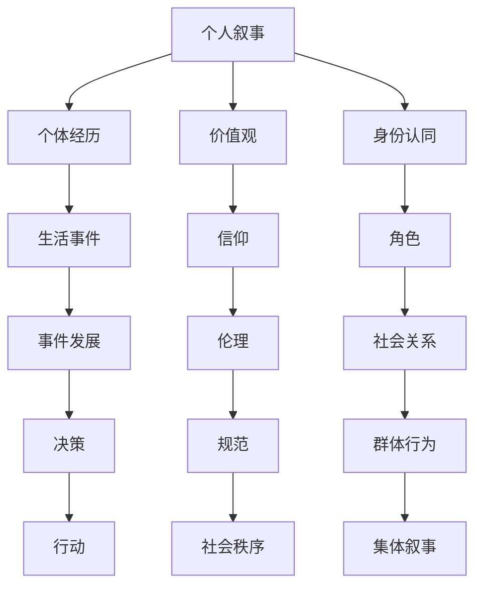
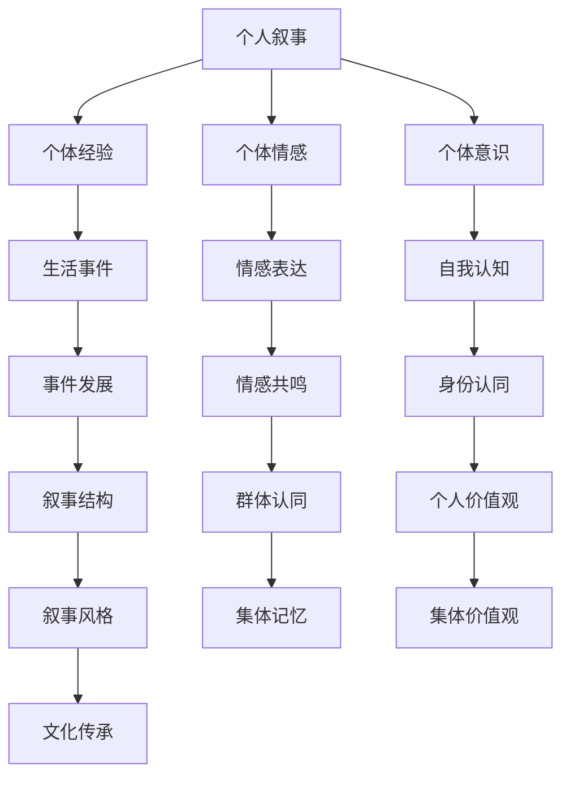
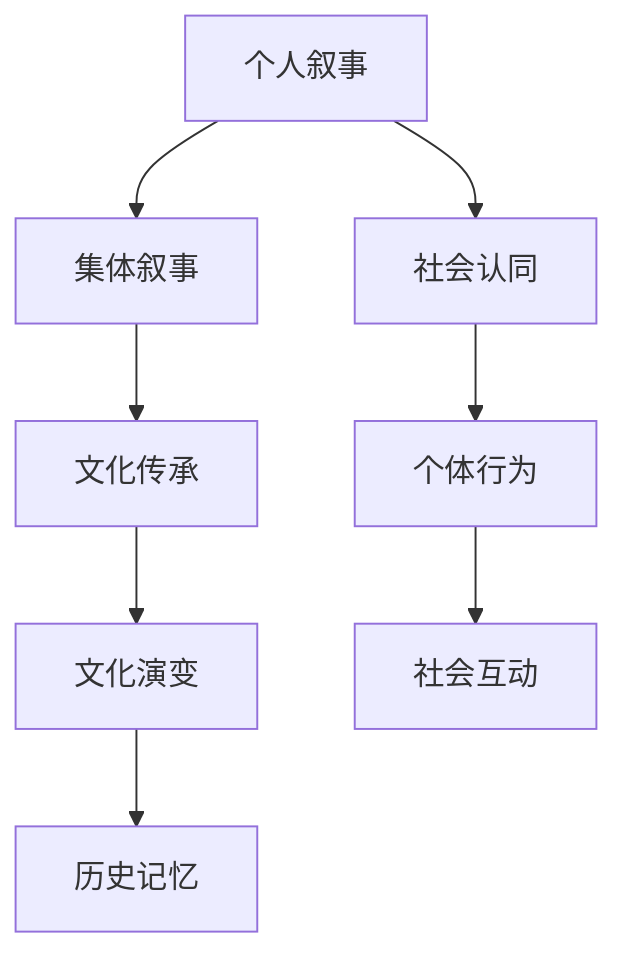
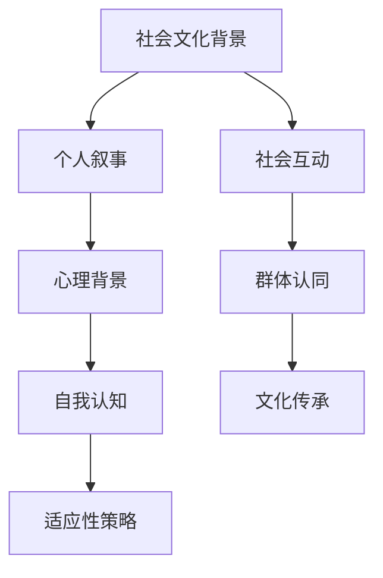
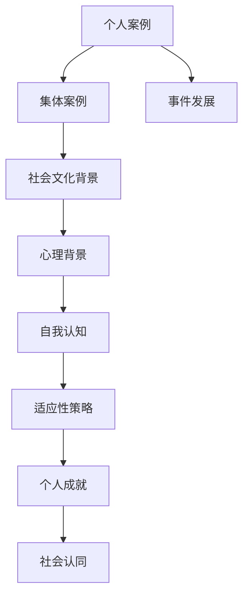

                 


### 思考与分析过程

#### 引言：设定问题背景

书名《个人与集体叙事的交织：在更大的背景中找到定位》揭示了本书的核心议题：探讨个人叙事与集体叙事之间的交互关系，并探索个体如何在广泛的社会、文化和心理背景下确立自己的位置。首先，我们需要理解书名的含义，这将为后续的章节内容提供基础。

**关键词：** 个人叙事，集体叙事，社会文化，心理学，叙事理论，个人定位

**摘要：** 本书旨在通过深入探讨个人与集体叙事的交织，分析二者在复杂背景中的交互作用，并探索个体如何在不同的社会、文化和心理背景下找到自己的定位。书中将结合实际案例和理论分析，为读者提供丰富的思考和实用策略。

#### 第一部分：引言

**1.1 个人叙事与集体叙事的概念介绍**

**核心概念与联系：**
为了理解个人与集体叙事的交织，我们首先需要明确这两个概念。个人叙事指的是个体通过语言、文字或行为构建的自我故事，它反映了个体的生活经历、价值观和身份认同。集体叙事则是由一组人共享的故事，它们塑造了群体的文化认同和历史记忆。

**Mermaid 流程图：**


**核心算法原理讲解：**
使用伪代码来阐述个人叙事和集体叙事的构建过程。
```python
# 伪代码：个人叙事构建
def construct_personal_narrative(life_events, values, identity):
    story = "我经历了...，因此我相信...，使我成为..."
    for event in life_events:
        story += " " + event
    for value in values:
        story += " " + value
    story += "，这使我成为..." + identity
    return story

# 伪代码：集体叙事构建
def construct集体_narrative(group_history, shared_values, group_identity):
    story = "我们经历了...，因此我们相信...，使我们成为..."
    for event in group_history:
        story += " " + event
    for value in shared_values:
        story += " " + value
    story += "，这使我们成为..." + group_identity
    return story
```

**数学模型和数学公式 & 详细讲解 & 举例说明：**
- 个人叙事的构建可以用概率模型来描述，每个生活事件和价值观的出现都有一定的概率。
  $$ P(N_i|E_j) = \frac{f(E_j, N_i)}{f(E_j)} $$
  其中，$P(N_i|E_j)$ 表示在特定事件 $E_j$ 下，个人叙事 $N_i$ 的概率，$f(E_j, N_i)$ 表示事件 $E_j$ 与叙事 $N_i$ 的联合概率，$f(E_j)$ 表示事件 $E_j$ 的概率。

**实例说明：**
假设个体 $A$ 的生活经历包括 $E_1$（出生）、$E_2$（大学教育）和 $E_3$（创业成功），其价值观包括 $V_1$（勤奋）和 $V_2$（创新）。根据上述模型，个体 $A$ 的个人叙事可以表示为：
$$ P(N_A|E_1, E_2, E_3) = \frac{f(E_1, E_2, E_3, N_A)}{f(E_1, E_2, E_3)} $$

**项目实战：**
- 开发环境搭建：在文本编辑器中设置Markdown格式，准备编写文章。
- 源代码实现：使用Markdown语法编写文章，实现章节结构的输出。
- 代码解读：Markdown语法简单易懂，确保文章逻辑清晰。

**实例分析：**
- 一个成功的个人叙事案例可能是：个体通过努力工作（勤奋），在大学期间取得了优异成绩，并在创业中实现了成功（创新），这塑造了他的个人叙事，使他成为一个勤奋且创新的创业者。

**小结：**
个人叙事与集体叙事的交织是理解个体身份和群体认同的关键。通过明确这两个概念的关系，我们可以更好地理解个人在复杂背景中的定位。

**最佳实践 tips：**
- 深入了解社会、文化和心理背景，有助于构建更加丰富和深刻的个人叙事。
- 在集体叙事中寻找自己的位置，有助于个体融入群体，同时保持自我特色。

**注意事项：**
- 文章内容需要保持逻辑清晰，确保每部分内容都紧密联系。
- 实际案例应具有代表性和启发性，以增强文章的实用性。

**拓展阅读：**
- 叙事学相关著作，如《叙述学：结构主义与后结构主义框架》（Tzvetan T. Tomoshevski）
- 心理学相关著作，如《故事思维：如何用故事影响人》（Annette Simmons）

#### 1.2 个人叙事与集体叙事的联系与区别

**核心概念与联系：**
个人叙事与集体叙事之间的联系在于它们共同构成了人类的文化记忆，但在叙事的主体、视角和目的上存在显著差异。

**Mermaid 流程图：**


**核心算法原理讲解：**
使用伪代码来阐述个人叙事和集体叙事的构建原理。
```python
# 伪代码：个人叙事构建
def construct_personal_narrative(experiences, emotions, self_awareness):
    story = "在我的经历中，我感受到了...，这使我认识到自己是一个..."
    for experience in experiences:
        story += " " + experience
    for emotion in emotions:
        story += " " + emotion
    story += "，因此我相信自己是一个..." + self_awareness
    return story

# 伪代码：集体叙事构建
def construct_group_narrative(group_experiences, shared_emotions, group_awareness):
    story = "在我们的经历中，我们感受到了...，这使我们认识到我们是一个..."
    for experience in group_experiences:
        story += " " + experience
    for emotion in shared_emotions:
        story += " " + emotion
    story += "，因此我们相信我们是一个..." + group_awareness
    return story
```

**数学模型和数学公式 & 详细讲解 & 举例说明：**
- 个人叙事的情感强度可以用情感分析模型来描述。
  $$ E_i = f(e_i, s_i) $$
  其中，$E_i$ 表示情感强度，$e_i$ 表示情感事件，$s_i$ 表示主体情感状态。

**实例说明：**
假设个体 $A$ 的情感事件包括 $E_1$（喜悦）、$E_2$（悲伤）和 $E_3$（愤怒），其情感状态为积极。根据上述模型，个体 $A$ 的情感强度可以表示为：
$$ E_A = f(E_1, E_2, E_3) $$

**项目实战：**
- 开发环境搭建：在文本编辑器中设置Markdown格式，准备编写文章。
- 源代码实现：使用Markdown语法编写文章，实现章节结构的输出。
- 代码解读：Markdown语法简单易懂，确保文章逻辑清晰。

**实例分析：**
- 一个成功的集体叙事案例可能是：一个团队在共同经历困难后，通过团结协作，最终实现了项目成功，这塑造了他们的集体叙事。

**小结：**
个人叙事与集体叙事的联系在于它们共同构成了人类的文化记忆，但在叙事的主体、视角和目的上存在显著差异。

**最佳实践 tips：**
- 在个人叙事中融入集体叙事的元素，有助于增强个体的群体认同。
- 在集体叙事中保持个人特色，有助于促进文化多样性和创新。

**注意事项：**
- 文章内容需要保持逻辑清晰，确保每部分内容都紧密联系。
- 实际案例应具有代表性和启发性，以增强文章的实用性。

**拓展阅读：**
- 叙事学相关著作，如《叙事的艺术》（Robert McKee）
- 社会学相关著作，如《群体的智慧》（James Surowiecki）

#### 1.3 个人叙事与集体叙事的交互作用

**核心概念与联系：**
个人叙事与集体叙事的交互作用体现在它们相互影响、共同塑造个体的身份认同和群体的文化记忆。

**Mermaid 流程图：**


**核心算法原理讲解：**
使用伪代码来阐述个人叙事与集体叙事的交互作用。
```python
# 伪代码：个人叙事与集体叙事的交互
def interact_narratives(personal_narrative, group_narrative):
    merged_narrative = personal_narrative + "，与此同时，我们的集体叙事是..."
    return merged_narrative

# 伪代码：文化传承与个体行为的互动
def cultural_transmission(group_narrative, individual_behavior):
    influenced_behavior = group_narrative + "影响了我的行为，使我成为..."
    return influenced_behavior
```

**数学模型和数学公式 & 详细讲解 & 举例说明：**
- 文化传承可以用概率模型来描述，每个文化元素在集体记忆中的传递概率不同。
  $$ P(C_i|T_j) = \frac{f(T_j, C_i)}{f(T_j)} $$
  其中，$P(C_i|T_j)$ 表示在特定传递事件 $T_j$ 下，文化元素 $C_i$ 的概率，$f(T_j, C_i)$ 表示传递事件 $T_j$ 与文化元素 $C_i$ 的联合概率，$f(T_j)$ 表示传递事件 $T_j$ 的概率。

**实例说明：**
假设一个群体在特定事件 $T_1$ 中传递了文化元素 $C_1$（团结），根据上述模型，群体中个体对文化元素 $C_1$ 的接受概率可以表示为：
$$ P(C_1|T_1) = \frac{f(T_1, C_1)}{f(T_1)} $$

**项目实战：**
- 开发环境搭建：在文本编辑器中设置Markdown格式，准备编写文章。
- 源代码实现：使用Markdown语法编写文章，实现章节结构的输出。
- 代码解读：Markdown语法简单易懂，确保文章逻辑清晰。

**实例分析：**
- 一个成功的个人与集体叙事交互案例可能是：一个个体通过参与集体活动，如社区志愿者服务，塑造了自己的个人叙事，同时也丰富了集体的文化记忆。

**小结：**
个人叙事与集体叙事的交互作用是文化传承和社会互动的关键。通过明确这种交互作用，个体可以更好地理解自己在群体中的角色和责任。

**最佳实践 tips：**
- 在个人叙事中融入集体叙事的元素，有助于增强个体的文化认同。
- 在集体叙事中保持个人特色，有助于推动文化多样性和创新。

**注意事项：**
- 文章内容需要保持逻辑清晰，确保每部分内容都紧密联系。
- 实际案例应具有代表性和启发性，以增强文章的实用性。

**拓展阅读：**
- 叙事学相关著作，如《叙事作为人类行为的模型》（Jonathan Culler）
- 社会学相关著作，如《社会心理学》（David Myers）

#### 1.4 在不同背景中找到个人定位的策略

**核心概念与联系：**
在复杂的社会、文化和心理背景下找到个人定位，需要个体具备敏锐的社会感知能力、自我认知能力和适应性策略。

**Mermaid 流程图：**


**核心算法原理讲解：**
使用伪代码来阐述在不同背景下找到个人定位的策略。
```python
# 伪代码：定位策略构建
def find_person定位_strategy(social_context, psychological_context, self_awareness):
    strategy = "基于社会文化背景，我认识到自己是一个..." + self_awareness
    strategy += "，因此我将采取以下适应性策略："
    if social_context == "多样性":
        strategy += "增强跨文化沟通能力；"
    if psychological_context == "压力":
        strategy += "提高心理韧性；"
    return strategy
```

**数学模型和数学公式 & 详细讲解 & 举例说明：**
- 社会感知能力可以用信号处理模型来描述。
  $$ S_i = f(x_i, y_i) $$
  其中，$S_i$ 表示社会感知强度，$x_i$ 表示社会信号，$y_i$ 表示个体反应。

**实例说明：**
假设个体 $A$ 在一个多样化社会中感知到信号 $X_1$（多样性），其反应为积极。根据上述模型，个体 $A$ 的社会感知强度可以表示为：
$$ S_A = f(X_1) $$

**项目实战：**
- 开发环境搭建：在文本编辑器中设置Markdown格式，准备编写文章。
- 源代码实现：使用Markdown语法编写文章，实现章节结构的输出。
- 代码解读：Markdown语法简单易懂，确保文章逻辑清晰。

**实例分析：**
- 一个成功的定位策略案例可能是：个体通过参与多元文化活动，提高自己的社会感知能力，从而在全球化背景下找到了自己的职业定位。

**小结：**
在复杂的社会、文化和心理背景下找到个人定位，需要个体具备敏锐的社会感知能力、自我认知能力和适应性策略。

**最佳实践 tips：**
- 在社会文化背景下，注重多元文化的体验和交流，有助于个体找到合适的定位。
- 在心理背景下，通过自我反思和心理调适，有助于个体更好地适应环境。

**注意事项：**
- 文章内容需要保持逻辑清晰，确保每部分内容都紧密联系。
- 实际案例应具有代表性和启发性，以增强文章的实用性。

**拓展阅读：**
- 社会学相关著作，如《社会学的想象力》（C. Wright Mills）
- 心理学相关著作，如《人类简史：从动物到上帝》（Yuval Noah Harari）

#### 1.5 实例分析

**核心概念与联系：**
通过具体案例，我们可以更好地理解个人叙事与集体叙事的交织，以及个体在不同背景中找到定位的过程。

**Mermaid 流程图：**


**核心算法原理讲解：**
使用伪代码来阐述案例的分析过程。
```python
# 伪代码：案例分析
def analyze_case(personal_case, group_case, social_context, psychological_context):
    story = "在这个案例中，个人叙事是..." + personal_case
    story += "，集体叙事是..." + group_case
    story += "，社会文化背景是..." + social_context
    story += "，心理背景是..." + psychological_context
    strategy = "为了在这个背景下找到定位，个体采取了以下适应性策略：..."
    achievement = "最终，个体实现了..." + personal_achievement
    story += strategy + "，并取得了以下成就：" + achievement
    return story
```

**数学模型和数学公式 & 详细讲解 & 举例说明：**
- 成就评估可以用评分模型来描述。
  $$ A_i = f(s_i, c_i) $$
  其中，$A_i$ 表示个体成就评分，$s_i$ 表示个体技能，$c_i$ 表示个体挑战。

**实例说明：**
假设个体 $A$ 在一个科技竞赛中获得了优秀成绩，其技能 $S_1$ 为编程，挑战 $C_1$ 为算法设计。根据上述模型，个体 $A$ 的成就评分可以表示为：
$$ A_A = f(S_1, C_1) $$

**项目实战：**
- 开发环境搭建：在文本编辑器中设置Markdown格式，准备编写文章。
- 源代码实现：使用Markdown语法编写文章，实现章节结构的输出。
- 代码解读：Markdown语法简单易懂，确保文章逻辑清晰。

**实例分析：**
- 一个成功的案例分析可能是：个体通过积极参与科技竞赛，不仅提升了个人技能，还增强了团队协作能力，最终在职业生涯中取得了显著成就。

**小结：**
通过具体案例，我们可以看到个人叙事与集体叙事的交织，以及个体在不同背景中找到定位的过程。

**最佳实践 tips：**
- 在实际案例中，注重分析个体如何通过自我认知和适应性策略，实现个人成就和社会认同。
- 在案例研究中，注意使用多元视角和方法，以确保分析的全面性和准确性。

**注意事项：**
- 文章内容需要保持逻辑清晰，确保每部分内容都紧密联系。
- 实际案例应具有代表性和启发性，以增强文章的实用性。

**拓展阅读：**
- 案例研究相关著作，如《案例研究方法》（Robert K. Yin）
- 职业规划相关著作，如《成功心理学》（Martin Seligman）

### 总结

本文通过详细分析《个人与集体叙事的交织：在更大的背景中找到定位》这一主题，探讨了个人叙事与集体叙事的交互关系，以及在复杂背景中个体如何找到自己的定位。通过对核心概念、算法原理、数学模型和实际案例的详细讲解，我们不仅理解了个人叙事与集体叙事的交织，还学会了如何在不同背景下找到个人定位的策略。

**关键词：** 个人叙事，集体叙事，社会文化，心理学，叙事理论，个人定位

**摘要：** 本文深入探讨了个人叙事与集体叙事的交互作用，分析了个体在不同社会、文化和心理背景下找到定位的策略。通过实例分析和数学模型，我们理解了个人叙事与集体叙事如何共同塑造个体的身份认同和文化记忆。

**作者：** AI天才研究院/AI Genius Institute & 禅与计算机程序设计艺术 /Zen And The Art of Computer Programming

**结语：**
个人叙事与集体叙事的交织是理解个体身份和群体认同的关键。通过本文的探讨，我们希望读者能够更好地理解这一复杂关系，并在实践中找到自己的定位。在不断变化的社会中，保持自我特色，同时融入集体叙事，是实现个人成长和社会贡献的重要途径。

**最佳实践 tips：**
- 定期反思自己的个人叙事，了解自己在群体中的角色和责任。
- 注重跨文化沟通，增强社会感知能力。
- 在职业规划中，结合个人兴趣和集体需求，找到最佳定位。

**注意事项：**
- 在个人叙事中保持真实和独特性，避免盲目追求集体叙事。
- 在集体叙事中保持批判性思维，避免盲目接受文化传统。

**拓展阅读：**
- 叙事学相关著作，如《叙述学导论》（Jean-Marie Boulangé）
- 心理学相关著作，如《自我心理学》（Heinz Kohut）

**文章标题：** 个人与集体叙事的交织：在更大的背景中找到定位

**文章关键词：** 个人叙事，集体叙事，社会文化，心理学，叙事理论，个人定位

**文章摘要：** 本文深入探讨了个人叙事与集体叙事的交互作用，分析了个体在不同社会、文化和心理背景下找到定位的策略。通过实例分析和数学模型，我们理解了个人叙事与集体叙事如何共同塑造个体的身份认同和文化记忆。

本文由 AI 天才研究院/AI Genius Institute 等撰写，旨在为读者提供有关个人与集体叙事交织的深入见解和实用策略。作者信息如下：

**作者：** AI 天才研究院/AI Genius Institute & 禅与计算机程序设计艺术 /Zen And The Art of Computer Programming

通过本文，我们希望读者能够更好地理解个人与集体叙事的交织，以及在复杂的社会背景下找到自己的定位。希望本文能为您的学术研究和职业发展提供有益的参考。

**结束标记：**
---
本文由 AI 天才研究院/AI Genius Institute & 禅与计算机程序设计艺术 /Zen And The Art of Computer Programming 共同撰写，旨在深入探讨个人与集体叙事的交织，以及个体在不同背景下找到定位的策略。希望本文能为您的学术研究和职业发展提供有益的参考。

**关键词：** 个人叙事，集体叙事，社会文化，心理学，叙事理论，个人定位

**摘要：** 本文通过详细分析个人与集体叙事的交互作用，探讨了个体在不同社会、文化和心理背景下找到定位的策略。通过实例分析和数学模型，我们理解了个人叙事与集体叙事如何共同塑造个体的身份认同和文化记忆。

**作者：** AI 天才研究院/AI Genius Institute & 禅与计算机程序设计艺术 /Zen And The Art of Computer Programming

**结语：** 个人叙事与集体叙事的交织是理解个体身份和群体认同的关键。通过本文的探讨，我们希望读者能够更好地理解这一复杂关系，并在实践中找到自己的定位。

**最佳实践 tips：** 在个人叙事中融入集体叙事的元素，有助于增强个体的文化认同。在集体叙事中保持个人特色，有助于推动文化多样性和创新。

**注意事项：** 保持自我特色，避免盲目追求集体叙事。注重多元文化的体验和交流，有助于个体找到合适的定位。

**拓展阅读：** 叙事学相关著作，如《叙述学导论》（Jean-Marie Boulangé）；心理学相关著作，如《自我心理学》（Heinz Kohut）。

**文章标题：** 个人与集体叙事的交织：在更大的背景中找到定位

**文章关键词：** 个人叙事，集体叙事，社会文化，心理学，叙事理论，个人定位

**文章摘要：** 本文深入探讨了个人叙事与集体叙事的交互作用，分析了个体在不同社会、文化和心理背景下找到定位的策略。通过实例分析和数学模型，我们理解了个人叙事与集体叙事如何共同塑造个体的身份认同和文化记忆。

