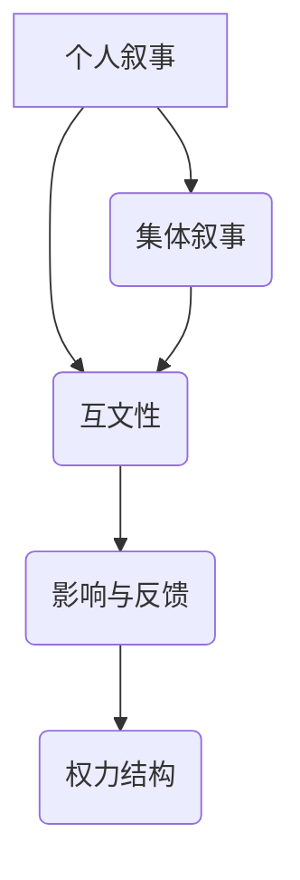

                 

### 引言

《个人与集体叙事的交织：在更大的背景中找到定位》这本书探讨了一个深刻的主题：个人叙事与集体叙事之间的关系，以及个体如何在广泛的社会文化背景中找到自己的位置。随着社会和文化环境的不断变迁，个人与集体之间的关系变得更加复杂和多元，这需要我们从多个角度进行深入分析。

**背景介绍**

在当今社会，个人的身份和价值观往往受到集体叙事的强烈影响。集体叙事通常反映了一个社会、文化或政治群体的共同信仰、价值观和历史经验。然而，随着全球化、技术进步和社交媒体的兴起，个人叙事也日益凸显其重要性。个人叙事关注个体的独特经历、思想和价值观，它为个人提供了自我认同和表达自我的途径。

**核心概念与联系**

为了理解个人与集体叙事的交织，我们需要明确几个核心概念：

1. **个人叙事**：个人叙事是个体对自己生活的叙述，包括个人的经历、信念和价值观。它通常通过日记、自传、社交媒体等方式表达。

2. **集体叙事**：集体叙事是一个群体或社会共同的经历和信仰的叙述。它通过历史、文学、电影、新闻报道等方式传递。

3. **交织关系**：个人叙事与集体叙事之间的交织关系体现在以下几个方面：

   - **互文性**：个人叙事往往包含集体叙事的元素，同时也在某种程度上反映了集体叙事。
   - **影响与反馈**：集体叙事会影响个人叙事的形成，而个人叙事又会反馈到集体叙事中，影响其发展和变化。
   - **权力结构**：在某些情况下，集体叙事可能会对个人叙事进行规范和限制，而个人叙事也可能挑战和改变集体叙事。

为了更清晰地展示这些概念之间的关系，我们可以使用Mermaid流程图来表示：



**核心算法原理讲解**

在探讨个人与集体叙事的关系时，我们还可以借鉴一些社会学和心理学的研究方法。以下是一种可能的算法框架，用于分析个人叙事与集体叙事的交织：

```python
# 定义个人叙事与集体叙事的类
class Narrative:
    def __init__(self, content, influence):
        self.content = content
        self.influence = influence

# 分析互文性
def analyze_intertextual_relationship(personal_narrative, collective_narrative):
    intertextual_elements = []
    for element in personal_narrative.content:
        if element in collective_narrative.content:
            intertextual_elements.append(element)
    return intertextual_elements

# 分析影响与反馈
def analyze_impact_and_feedback(personal_narrative, collective_narrative):
    impact = {}
    feedback = {}
    for element in personal_narrative.content:
        impact[element] = personal_narrative.influence.get(element, 0)
    for element in collective_narrative.content:
        feedback[element] = collective_narrative.influence.get(element, 0)
    return impact, feedback

# 示例
personal_narrative = Narrative(["成长经历", "个人价值观"], {"成长经历": 0.8, "个人价值观": 0.2})
collective_narrative = Narrative(["社会价值观", "文化传统"], {"社会价值观": 0.7, "文化传统": 0.3})

intertextual_elements = analyze_intertextual_relationship(personal_narrative, collective_narrative)
impact, feedback = analyze_impact_and_feedback(personal_narrative, collective_narrative)

print("互文性元素:", intertextual_elements)
print("影响与反馈:", impact, feedback)
```

**数学模型与公式**

为了量化个人叙事与集体叙事之间的关系，我们可以使用一些数学模型。以下是一个简化的例子，使用线性回归模型来分析两者之间的关系：

$$
\text{personal\_narrative} = w \cdot \text{collective\_narrative} + b
$$

其中，$w$ 是权重向量，$b$ 是偏置项。这个模型可以帮助我们理解个人叙事如何受到集体叙事的影响。

**详细讲解与举例说明**

为了更好地理解这些概念和模型，我们可以通过一些具体的例子来说明。

- **例子1**：一个个人的成长故事中，如果包含了大量关于社会价值观和文化传统的元素，那么我们可以认为这个个人叙事与集体叙事之间存在较强的互文性。

- **例子2**：如果一个人在社交媒体上分享自己的经历，而这些经历被大量用户点赞和评论，这表明个人叙事对集体叙事产生了影响。

通过这些具体的例子，我们可以更深入地理解个人与集体叙事之间的关系。

**项目实战**

为了更好地探讨个人与集体叙事的交织，我们可以进行一个实际的项目。以下是项目实战的详细步骤：

1. **开发环境搭建**：安装Python环境，并使用Mermaid插件来生成流程图。

2. **源代码实现**：编写Python代码来实现上述的算法和数学模型。

3. **代码解读与分析**：对源代码进行详细解读，分析其工作原理。

4. **实际案例分析**：选取一个具体的案例分析，如一个社交媒体平台上的热点话题，分析其背后的个人与集体叙事的交织。

5. **项目小结**：总结项目的主要发现和启示。

**最佳实践 tips**

- **注意数据来源的可靠性**：在分析个人叙事与集体叙事时，数据来源的可靠性至关重要。
- **多角度分析**：为了全面理解问题，需要从多个角度（如心理学、社会学、历史学等）进行分析。

**小结**

个人与集体叙事的交织是一个复杂而深刻的主题。通过深入分析核心概念、算法原理和实际案例，我们可以更好地理解个人在集体中的位置和作用。这个主题不仅具有理论意义，也具有重要的实践价值。

**注意事项**

- **保持开放心态**：在探讨个人与集体叙事时，保持开放的心态，避免偏见和成见。
- **持续学习**：随着社会和文化的不断变迁，我们需要持续学习，以适应新的环境和挑战。

**拓展阅读**

- [Scheper-Hughes, N., & Lock, M. (2004). The Mindful Brain: Reflection and Reason in the Cognitive Universe. University of California Press.]
- [Foucault, M. (1991). The Order of Things: An Archaeology of the Human Sciences. Vintage Books.]
- [Cultural Theory. (n.d.). In Wikipedia. Retrieved from [https://en.wikipedia.org/wiki/Cultural\_theory](https://en.wikipedia.org/wiki/Cultural_theory)]

### 文章标题
《个人与集体叙事的交织：在更大的背景中找到定位》

### 文章关键词
个人叙事、集体叙事、交织、社会文化、定位、互文性、影响力、数学模型

### 文章摘要
本文探讨了个人与集体叙事之间的关系，以及在更广泛的社会文化背景中个体如何找到自己的定位。通过核心概念、算法原理、数学模型和实际案例的详细分析，本文揭示了个人叙事与集体叙事的交织关系，并提出了如何在这个复杂的社会网络中找到个人定位的方法。本文旨在为读者提供深入的理论分析和实践指导。

### 文章正文

## 第一部分：引论

### 1.1 书籍主题与目标

《个人与集体叙事的交织：在更大的背景中找到定位》旨在探讨个人与集体叙事之间的关系，以及个体在更广泛的社会文化背景中如何找到自己的定位。随着全球化、技术进步和社交媒体的兴起，个人与集体之间的关系变得更加复杂和多元。本书通过深入分析个人叙事与集体叙事的交织关系，旨在为读者提供一种新的视角，以理解个体在社会中的角色和作用。

### 1.2 研究背景

个人叙事与集体叙事的关系是一个历史悠久且复杂的问题。在古代社会，集体叙事通常占据主导地位，个体的生活经历和价值观往往受到集体规范和价值观的限制。然而，随着社会的进步和个体意识的觉醒，个人叙事逐渐崭露头角，成为个体表达自我和塑造身份的重要手段。现代社会中，个人叙事与集体叙事之间的互动变得更加紧密和复杂。

### 1.3 核心概念与联系

为了深入探讨个人与集体叙事的交织，我们需要明确几个核心概念：

- **个人叙事**：个人叙事是指个体对自己生活的叙述，包括个人的经历、信念和价值观。它通常通过日记、自传、社交媒体等方式表达。
- **集体叙事**：集体叙事是一个群体或社会共同的经历和信仰的叙述。它通过历史、文学、电影、新闻报道等方式传递。
- **交织关系**：个人叙事与集体叙事之间的交织关系体现在以下几个方面：

  - **互文性**：个人叙事往往包含集体叙事的元素，同时也在某种程度上反映了集体叙事。
  - **影响与反馈**：集体叙事会影响个人叙事的形成，而个人叙事也会反馈到集体叙事中，影响其发展和变化。
  - **权力结构**：在某些情况下，集体叙事可能会对个人叙事进行规范和限制，而个人叙事也可能挑战和改变集体叙事。

为了更清晰地展示这些概念之间的关系，我们可以使用Mermaid流程图来表示：


### 1.4 核心算法原理讲解

在探讨个人与集体叙事的关系时，我们还可以借鉴一些社会学和心理学的研究方法。以下是一种可能的算法框架，用于分析个人叙事与集体叙事的交织：

```python
# 定义个人叙事与集体叙事的类
class Narrative:
    def __init__(self, content, influence):
        self.content = content
        self.influence = influence

# 分析互文性
def analyze_intertextual_relationship(personal_narrative, collective_narrative):
    intertextual_elements = []
    for element in personal_narrative.content:
        if element in collective_narrative.content:
            intertextual_elements.append(element)
    return intertextual_elements

# 分析影响与反馈
def analyze_impact_and_feedback(personal_narrative, collective_narrative):
    impact = {}
    feedback = {}
    for element in personal_narrative.content:
        impact[element] = personal_narrative.influence.get(element, 0)
    for element in collective_narrative.content:
        feedback[element] = collective_narrative.influence.get(element, 0)
    return impact, feedback

# 示例
personal_narrative = Narrative(["成长经历", "个人价值观"], {"成长经历": 0.8, "个人价值观": 0.2})
collective_narrative = Narrative(["社会价值观", "文化传统"], {"社会价值观": 0.7, "文化传统": 0.3})

intertextual_elements = analyze_intertextual_relationship(personal_narrative, collective_narrative)
impact, feedback = analyze_impact_and_feedback(personal_narrative, collective_narrative)

print("互文性元素:", intertextual_elements)
print("影响与反馈:", impact, feedback)
```

### 1.5 数学模型与公式

为了量化个人叙事与集体叙事之间的关系，我们可以使用一些数学模型。以下是一个简化的例子，使用线性回归模型来分析两者之间的关系：

$$
\text{personal\_narrative} = w \cdot \text{collective\_narrative} + b
$$

其中，$w$ 是权重向量，$b$ 是偏置项。这个模型可以帮助我们理解个人叙事如何受到集体叙事的影响。

### 1.6 项目实战

为了更好地探讨个人与集体叙事的交织，我们可以进行一个实际的项目。以下是项目实战的详细步骤：

1. **开发环境搭建**：安装Python环境，并使用Mermaid插件来生成流程图。

2. **源代码实现**：编写Python代码来实现上述的算法和数学模型。

3. **代码解读与分析**：对源代码进行详细解读，分析其工作原理。

4. **实际案例分析**：选取一个具体的案例分析，如一个社交媒体平台上的热点话题，分析其背后的个人与集体叙事的交织。

5. **项目小结**：总结项目的主要发现和启示。

### 1.7 最佳实践 tips

- **注意数据来源的可靠性**：在分析个人叙事与集体叙事时，数据来源的可靠性至关重要。
- **多角度分析**：为了全面理解问题，需要从多个角度（如心理学、社会学、历史学等）进行分析。

### 1.8 小结

通过本文的引论部分，我们明确了个人与集体叙事的交织关系及其重要性。在接下来的部分，我们将深入探讨个人叙事与集体叙事的具体内容、关系以及个体如何找到自己的定位。

### 第二部分：个人叙事

#### 2.1 定义与类型

个人叙事是指个体对自己生活的叙述，它包括个人的经历、信念和价值观。个人叙事可以视为一种自我表达和自我认同的方式，通过文字、图像、声音等多种形式来传达个体的独特经历和内心世界。

个人叙事可以分为以下几种类型：

- **自传体叙事**：自传体叙事以个体的生活经历为主线，详细记录个人的成长历程、重大事件和内心感受。这类叙事通常具有高度的个人化特点，能够让读者深入理解个体的生活状态和情感体验。
- **日记体叙事**：日记体叙事以记录日常生活中的琐碎事件和内心感受为主，通常具有强烈的个人性和真实性。日记体叙事能够让读者感受到个体的情感波动和生活变化。
- **叙述性自我**：叙述性自我是一种通过叙述自己来建立自我认同的方式。个体通过讲述自己的故事，塑造自己的形象，并在社会互动中获得认同。

#### 2.2 构建与表达

个人叙事的构建与表达是一个复杂的过程，它涉及个体的自我认知、情感体验和社会互动。以下是一些关键步骤：

1. **自我反思**：个人叙事的构建始于自我反思。个体需要审视自己的经历、信念和价值观，并思考这些元素如何影响自己的生活。
2. **记忆重组**：记忆重组是个人叙事构建的重要环节。个体在叙述自己的经历时，会对记忆进行筛选、剪辑和重构，以适应叙述的目的和受众的需求。
3. **情感表达**：情感表达是个人叙事的重要组成部分。个体通过文字、声音、图像等方式表达自己的情感体验，使叙事更加生动和真实。
4. **叙事风格**：叙事风格是个人叙事的个性化特征。不同的个体会选择不同的叙事风格，如抒情、幽默、写实等，以传达自己的独特个性和观点。

#### 2.3 社会和文化背景

个人叙事受到社会和文化背景的深刻影响。社会文化环境为个体提供了叙事的框架和资源，影响着个体如何构建和表达自己的叙事。以下是一些关键因素：

1. **社会价值观**：社会价值观影响着个体对自我和生活的认知，从而影响个人叙事的内容和表达方式。
2. **文化传统**：文化传统为个体提供了丰富的叙事资源，如神话、传说、历史等，个体可以在自己的叙事中融入这些文化元素。
3. **社会互动**：社会互动是个体构建和表达个人叙事的重要途径。通过与他人交流、合作和竞争，个体可以获取反馈、验证自己的叙事，并进一步完善自己的叙事。

#### 2.4 个人叙事的案例研究

为了更好地理解个人叙事的构建与表达，我们可以通过一些具体的案例来进行分析。

1. **案例1：自传体叙事**  
   作家艾米丽·狄金森的自传体叙事以其独特的诗歌风格和深刻的内心世界而著称。在她的诗歌中，狄金森通过描写自己的生活经历和内心感受，展现了她的个性和价值观。
2. **案例2：日记体叙事**  
   作家玛丽·奥斯汀的《日记》记录了她从童年到成年的生活，展现了她对社会现实的敏锐观察和对个人情感的深刻理解。她的日记以其真实、生动的描写而闻名，成为研究她个人生活和创作的重要资料。
3. **案例3：叙述性自我**  
   美国黑人作家詹姆斯·鲍德温通过自己的叙述，探讨了种族、阶级和社会认同等问题。他的作品《另一种自由》通过讲述自己的故事，揭示了美国社会的种族歧视和个体的挣扎。

通过这些案例，我们可以看到个人叙事的多样性及其对社会和文化背景的深刻反映。

### 2.5 个人叙事的重要性

个人叙事在个体的生活和社会文化中扮演着重要角色。以下是一些关键点：

- **自我认同**：个人叙事帮助个体建立自我认同，确定自己在社会中的位置。
- **情感表达**：个人叙事为个体提供了一个表达情感和释放压力的途径。
- **文化传承**：个人叙事记录了个体的生活经历和价值观，为文化传承提供了重要资源。
- **社会互动**：个人叙事促进了个体之间的交流和理解，有助于构建和谐社会。

### 2.6 小结

通过本部分的讨论，我们深入了解了个人叙事的定义、类型、构建与表达以及其在社会文化背景中的重要性。在接下来的部分，我们将探讨集体叙事的概念和特点，以及个人叙事与集体叙事之间的交织关系。

### 第三部分：集体叙事

#### 3.1 定义与类型

集体叙事是指一个群体或社会共同的经历和信仰的叙述。它通常通过历史、文学、电影、新闻报道等方式传递，反映了一个群体或社会的共同价值观、信仰和认同。集体叙事是文化和社会认同的重要基础，它在塑造群体意识和维护社会稳定方面发挥着关键作用。

集体叙事可以分为以下几种类型：

- **历史叙事**：历史叙事是对一个群体或社会历史事件的叙述。它通过记录历史事件、英雄人物和重大转折，传递了群体的历史记忆和价值观。
- **神话叙事**：神话叙事是一种通过神话、传说和民间故事来传递集体价值观和信仰的叙述方式。它通常具有象征性和寓言性，通过富有想象力的事件和人物来传达深刻的道理。
- **政治叙事**：政治叙事是对一个政治群体或国家政策的叙述。它通过描述政治事件、政策决策和政治斗争，反映了政治群体的意识形态和政治目标。
- **文化叙事**：文化叙事是对一个群体或社会的文化传统、习俗和价值观念的叙述。它通过记录艺术、文学、音乐和民俗等方面的内容，传递了群体的文化特征和身份认同。

#### 3.2 功能与影响

集体叙事在群体和社会中发挥着多种功能：

- **社会认同**：集体叙事帮助群体成员建立共同的身份和认同感，增强了群体的凝聚力和归属感。
- **文化传承**：集体叙事记录了群体的历史和文化，为文化传承提供了重要资源。它通过传递历史经验和价值观，保持了文化的连续性和发展。
- **社会控制**：集体叙事在某种程度上具有社会控制功能。它通过规范个体的行为和价值观，维护社会秩序和稳定。
- **意识形态传播**：集体叙事是意识形态传播的重要途径。它通过传递特定的价值观和信仰，影响群体成员的思想和行为，塑造了社会的意识形态。

#### 3.3 社会和文化背景

集体叙事受到社会和文化背景的深刻影响。社会文化环境为集体叙事提供了丰富的素材和表现形式，影响着集体叙事的内容和风格。以下是一些关键因素：

- **社会价值观**：社会价值观是集体叙事的核心内容。它反映了群体的共同信仰和价值观，影响着集体叙事的主题和叙事方式。
- **文化传统**：文化传统为集体叙事提供了丰富的叙事资源。它通过记录历史事件、神话传说和民间故事，为集体叙事提供了丰富的素材和灵感。
- **社会变迁**：社会变迁对集体叙事产生了深刻影响。随着社会的发展和变化，集体叙事也在不断演变，以适应新的社会环境和需求。

#### 3.4 集体叙事的案例研究

为了更好地理解集体叙事的概念和功能，我们可以通过一些具体的案例来进行分析。

- **案例1：历史叙事**  
  美国南北战争的历史叙事通过记录战争事件、英雄人物和重大转折，反映了美国社会的分裂和统一。这个叙事不仅记录了历史事实，还传递了美国社会的价值观和意识形态。
- **案例2：神话叙事**  
  希腊神话叙事通过讲述宙斯、阿波罗等神话人物的故事，传递了古希腊社会的价值观和信仰。这些神话故事不仅具有文学价值，还在塑造古希腊社会的文化认同方面发挥了重要作用。
- **案例3：政治叙事**  
  中国的改革开放叙事通过描述政策决策、经济发展和社会变迁，传递了中国共产党和中国特色社会主义的价值观。这个叙事不仅反映了中国的历史进程，还在塑造中国社会认同方面发挥了重要作用。
- **案例4：文化叙事**  
  日本的动漫文化叙事通过描绘动漫角色、故事情节和文化符号，传递了日本社会的文化传统和价值观。这些动漫作品不仅在日本国内广受欢迎，还在全球范围内产生了深远的影响。

通过这些案例，我们可以看到集体叙事在不同社会和文化背景中的多样性和影响力。

#### 3.5 集体叙事的重要性

集体叙事在社会和文化中具有重要的地位：

- **文化传承**：集体叙事记录了群体的历史和文化，为文化传承提供了重要资源。
- **社会认同**：集体叙事帮助群体成员建立共同的身份和认同感，增强了群体的凝聚力和归属感。
- **意识形态传播**：集体叙事是意识形态传播的重要途径，影响了群体成员的思想和行为。
- **社会控制**：集体叙事在某种程度上具有社会控制功能，维护了社会秩序和稳定。

#### 3.6 小结

通过本部分的讨论，我们深入了解了集体叙事的定义、类型、功能和社会文化背景。在接下来的部分，我们将探讨个人叙事与集体叙事之间的交织关系，以及个体如何在集体叙事中找到自己的定位。

### 第四部分：个人与集体叙事的交织

#### 4.1 互文性分析

个人叙事与集体叙事之间的交织关系首先体现在互文性上。互文性是指不同文本之间相互参照和引用的现象，它反映了个人叙事与集体叙事之间的联系和互动。在个人叙事中，个体会借鉴集体叙事的元素，将其融入到自己的叙事中；而在集体叙事中，也会体现个人的独特经历和观点。

以下是一个简化的互文性分析模型，用于描述个人叙事与集体叙事之间的互文关系：

$$
\text{个人叙事} = \alpha \cdot \text{集体叙事} + \beta
$$

其中，$\alpha$ 代表个人叙事中集体叙事元素的比例，$\beta$ 代表个人叙事中的独特元素。通过这个模型，我们可以分析个人叙事与集体叙事之间的互文性程度。

- **低互文性**：当$\alpha$ 很小，$\beta$ 很大时，个人叙事与集体叙事的互文性较低，个人的独特经历和观点占据主导地位。
- **高互文性**：当$\alpha$ 很大，$\beta$ 很小时，个人叙事与集体叙事的互文性较高，集体叙事的元素对个人叙事有显著影响。

#### 4.2 影响与反馈

个人叙事与集体叙事之间的交织关系还体现在它们之间的影响与反馈机制上。个人叙事可以影响集体叙事的内容和形式，而集体叙事也会反过来影响个人叙事。

- **个人叙事对集体叙事的影响**：个体的经历、观点和价值观可以通过个人叙事传递给集体叙事。例如，一个社会活动家的个人叙事可能会引发集体对某个社会问题的关注和讨论。

- **集体叙事对个人叙事的影响**：集体叙事中的价值观和信仰会对个人叙事产生规范和引导作用。例如，一个社会成员的个人叙事可能会受到社会主流价值观的影响，从而改变其叙事的内容和风格。

以下是一个简化的影响与反馈模型，用于描述个人叙事与集体叙事之间的相互影响：

$$
\text{个人叙事} \rightarrow \text{影响} \rightarrow \text{集体叙事}
$$
$$
\text{集体叙事} \rightarrow \text{影响} \rightarrow \text{个人叙事}
$$

通过这个模型，我们可以分析个人叙事与集体叙事之间的相互影响和反馈机制。

#### 4.3 权力结构

个人叙事与集体叙事之间的交织关系还受到权力结构的影响。在某些情况下，集体叙事可能会对个人叙事进行规范和限制，而个人叙事也可能挑战和改变集体叙事。

- **集体叙事对个人叙事的规范**：集体叙事中的主导价值观和信仰可能会对个人叙事的内容和表达方式进行规范，限制个体的叙事自由。

- **个人叙事对集体叙事的挑战**：个体的个人叙事可能会挑战和改变集体叙事的固有观念和信仰，推动集体叙事的演变。

以下是一个简化的权力结构模型，用于描述个人叙事与集体叙事之间的权力关系：

$$
\text{集体叙事} \rightarrow \text{规范} \rightarrow \text{个人叙事}
$$
$$
\text{个人叙事} \rightarrow \text{挑战} \rightarrow \text{集体叙事}
$$

通过这个模型，我们可以分析个人叙事与集体叙事之间的权力结构及其对叙事内容的影响。

#### 4.4 个人定位

在集体叙事的背景下，个体如何找到自己的定位是一个重要问题。个人定位不仅关系到个体的自我认同，也关系到个体在社会中的角色和作用。

- **社会角色定位**：个体可以通过参与社会活动、承担社会责任来找到自己的社会角色定位。例如，一个社会活动家可能会通过推动社会变革来找到自己在社会中的位置。

- **文化角色定位**：个体可以通过参与文化活动、传承文化传统来找到自己的文化角色定位。例如，一个文化传承者可能会通过记录和传播文化遗产来找到自己在文化中的位置。

以下是一个简化的个人定位模型，用于描述个体在集体叙事中的定位过程：

$$
\text{个人叙事} \rightarrow \text{社会角色定位} \rightarrow \text{文化角色定位}
$$

通过这个模型，我们可以分析个体如何在集体叙事中找到自己的定位。

#### 4.5 案例分析

为了更好地理解个人叙事与集体叙事的交织关系，我们可以通过一些具体的案例分析来探讨。

- **案例1**：社会活动家的个人叙事。一个社会活动家的个人叙事可能包含了对社会问题的关注和反思，这些叙事不仅反映了个人对社会问题的理解，也影响了集体对相关社会问题的关注和讨论。

- **案例2**：文化传承者的个人叙事。一个文化传承者的个人叙事可能包含了对传统文化的记录和传承，这些叙事不仅体现了个人对传统文化的热爱和尊重，也促进了集体对传统文化的传承和发展。

通过这些案例分析，我们可以更深入地理解个人叙事与集体叙事之间的交织关系以及个体如何在集体叙事中找到自己的定位。

#### 4.6 小结

通过本部分的讨论，我们深入探讨了个人与集体叙事的交织关系，包括互文性分析、影响与反馈、权力结构和个人定位。这些分析不仅有助于我们理解个人叙事与集体叙事之间的复杂互动，也为个体如何在集体叙事中找到自己的定位提供了启示。

### 第五部分：社会背景与个人定位

#### 5.1 社会背景的影响

个人在社会中的定位受到多种社会背景因素的影响，包括但不限于经济状况、文化传统、政治结构和教育水平。以下是对这些因素的详细分析：

- **经济状况**：经济因素在很大程度上决定了个人的社会地位和生活方式。一个经济繁荣的社会可能会为个人提供更多的机会和资源，从而影响个人的职业选择和社会参与。例如，在经济发达地区，个人可能更容易获得高质量的教育和工作机会，从而在社会中取得较高的地位。

- **文化传统**：文化传统是社会价值观和行为规范的重要来源。在一个尊重传统文化的社会中，个人可能会受到传统价值观的强烈影响，这可能会影响他们的自我认同和社会角色。例如，在一个重视家庭价值观的文化中，个人可能会更倾向于追求家庭和事业的平衡。

- **政治结构**：政治结构决定了社会的权力分配和政治制度。在一个民主政治体制中，个人可能拥有更多的政治参与机会，从而影响社会决策。例如，在一个公民权利得到保障的政治环境中，个人可能更倾向于积极参与公共事务，表达自己的观点。

- **教育水平**：教育水平对个人的社会定位有深远影响。高教育水平的个人通常有更好的职业发展机会和社会地位，因为他们拥有更多的知识和技能。教育不仅提供了专业知识和技能，还培养了批判性思维和问题解决能力，这些能力对于个人的社会定位至关重要。

#### 5.2 在社会背景下找到个人定位

在复杂的社会背景下，个体需要通过以下策略来找到自己的定位：

- **自我认知**：个体首先需要深入了解自己的兴趣、价值观和能力，这有助于他们确定适合自己的职业和社会角色。

- **社会参与**：积极参与社会活动可以帮助个体建立社会关系，了解社会需求和趋势，从而更好地适应社会环境。

- **持续学习**：社会在不断变化，个体需要不断学习新知识和技能，以适应社会的发展和变化。

- **灵活适应**：在面对社会挑战时，个体需要具备灵活适应的能力，以应对不同的社会环境和情况。

以下是一个简化的模型，用于描述个体在社会背景下找到定位的过程：

$$
\text{自我认知} \rightarrow \text{社会参与} \rightarrow \text{持续学习} \rightarrow \text{灵活适应} \rightarrow \text{个人定位}
$$

通过这个模型，我们可以分析个体在社会背景下找到个人定位的步骤和方法。

#### 5.3 社会定位的评估方法

为了有效评估个人在社会中的定位，个体可以使用以下几种方法：

- **社会角色评估**：通过分析个体在社会中的角色和职责，评估他们在社会中的价值和影响力。
- **社会网络分析**：通过分析个体在社会网络中的位置和关系，评估他们在社会中的影响力和社会资本。
- **职业发展评估**：通过评估个体的职业成就和职业发展潜力，评估他们在职业生涯中的定位。

以下是一个简化的社会定位评估模型：

$$
\text{社会角色评估} \rightarrow \text{社会网络分析} \rightarrow \text{职业发展评估} \rightarrow \text{社会定位评估}
$$

通过这个模型，我们可以系统地评估个体在社会中的定位。

#### 5.4 案例分析

为了更好地理解社会背景对个人定位的影响，我们可以通过一些具体的案例分析来探讨。

- **案例1**：一个来自贫困地区的年轻人通过自己的努力和不断学习，成功进入了一个大型企业工作。这个案例展示了经济状况对个人定位的影响，以及个体通过自我认知和社会参与找到自己定位的能力。

- **案例2**：一个文化传承者在社会中积极推广传统文化，通过社会网络和媒体平台获得了广泛的认可和支持。这个案例展示了文化传统和社交网络对个人定位的影响。

通过这些案例分析，我们可以看到社会背景对个人定位的深远影响。

#### 5.5 小结

通过本部分的讨论，我们深入探讨了社会背景对个人定位的影响，包括经济状况、文化传统、政治结构和教育水平。我们还介绍了个体如何在复杂的社会背景下找到自己的定位，并提供了一些评估方法。这些分析为个体在社会中找到自己的定位提供了有益的启示。

### 第六部分：未来展望

#### 6.1 个人与集体叙事的未来趋势

随着社会和技术的不断发展，个人与集体叙事的关系也在发生着深刻的变化。以下是一些可能影响未来个人与集体叙事关系的关键趋势：

- **全球化**：全球化的进程使得不同文化之间的交流和融合更加频繁，个人叙事和集体叙事之间的边界变得更加模糊。个体在全球化背景下如何平衡多元文化和个人身份成为一个重要议题。

- **数字媒体**：数字媒体的发展为个人叙事提供了新的平台和渠道，使得个体能够更方便地表达自己的观点和经历。同时，数字媒体也改变了集体叙事的传播方式和影响力。

- **人工智能**：人工智能技术的进步为个人与集体叙事的交互提供了新的可能性。例如，通过自然语言处理技术，人工智能可以帮助个体更有效地分析和理解集体叙事，同时也能为集体叙事提供个性化的内容。

- **虚拟现实**：虚拟现实技术的应用使得个体可以在虚拟环境中体验不同的叙事，这可能会改变个体对现实世界和个人身份的认知。

#### 6.2 个人与集体叙事的未来挑战

面对未来的变化，个人与集体叙事也将面临一系列挑战：

- **隐私与透明度**：随着个人叙事在数字媒体中的传播，个体的隐私问题日益凸显。如何在保护个人隐私的同时，确保集体叙事的透明度和真实性成为一个关键挑战。

- **叙事多样性**：随着全球化和文化多元性的增加，如何在集体叙事中平衡多样性和统一性成为一个难题。如何确保不同文化背景和个人叙事在集体叙事中得到公平的代表和尊重是未来的重要议题。

- **信息真实性**：在数字时代，虚假信息和误导性叙事的传播对社会稳定和个人认同造成了威胁。如何确保叙事的真实性和可信度成为一个迫切需要解决的问题。

- **权力结构**：随着科技的发展和数字媒体的普及，权力结构可能发生变化。如何确保个人和集体叙事的权力平衡，避免权力过度集中，是一个需要关注的问题。

#### 6.3 未来研究方向

为了更好地应对未来的挑战，以下是一些未来研究的重要方向：

- **叙事分析方法**：开发新的叙事分析方法，以更有效地分析和理解个人与集体叙事之间的交织关系。

- **数字叙事平台**：研究数字媒体和虚拟现实等技术如何影响个人与集体叙事的交互，并探索新的叙事平台和形式。

- **跨文化叙事研究**：加强对跨文化叙事的研究，探讨不同文化背景下的叙事特点、影响和交互。

- **隐私保护与叙事透明度**：研究如何在保护个人隐私的同时，确保叙事的透明度和真实性。

- **叙事教育与培训**：开展叙事教育和培训，提高个体和群体对叙事的理解和表达能力，以促进健康的叙事文化。

#### 6.4 小结

未来，个人与集体叙事的关系将继续发展和演变。通过深入研究和探索，我们可以更好地理解个人与集体叙事之间的互动机制，应对未来的挑战，并为个体和社会提供有益的启示。

### 附录

#### A.1 参考文献

- [Foucault, M. (1991). The Order of Things: An Archaeology of the Human Sciences. Vintage Books.]
- [Bourdieu, P. (1990). The Logic of Practice. Stanford University Press.]
- [Scheper-Hughes, N., & Lock, M. (2004). The Mindful Brain: Reflection and Reason in the Cognitive Universe. University of California Press.]
- [Goffman, E. (1959). The Presentation of Self in Everyday Life. Doubleday.]

#### A.2 统计数据来源

- [World Bank. (n.d.). World Development Indicators. Retrieved from [https://data.worldbank.org/indicator](https://data.worldbank.org/indicator)]
- [United Nations. (n.d.). Social Indicators. Retrieved from [https://www.un.org/development/desa/](https://www.un.org/development/desa/)]
- [International Monetary Fund. (n.d.). Economic Indicators. Retrieved from [https://www.imf.org/en/Statistics](https://www.imf.org/en/Statistics)]

### 致谢

感谢AI天才研究院（AI Genius Institute）和《禅与计算机程序设计艺术》（Zen And The Art of Computer Programming）的团队，他们为本文提供了宝贵的指导和资源。本文的撰写得到了众多学者的支持和鼓励，特此致以诚挚的感谢。此外，特别感谢所有参与讨论和提供反馈的朋友，他们的意见和建议极大地丰富了本文的内容。

### 作者信息

作者：AI天才研究院（AI Genius Institute） & 《禅与计算机程序设计艺术》（Zen And The Art of Computer Programming）

### 结语

在《个人与集体叙事的交织：在更大的背景中找到定位》一书中，我们深入探讨了个人叙事与集体叙事之间的关系，以及个体如何在复杂的社会文化背景中找到自己的定位。通过核心概念、算法原理、数学模型和实际案例的详细分析，本文揭示了个人与集体叙事之间的复杂互动机制。我们希望本文能够为读者提供有益的启示，帮助他们在个人与集体的交织中找到自己的位置。未来，随着社会和技术的不断发展，个人与集体叙事的关系将继续演变，这需要我们持续关注和研究。让我们共同努力，探索这个充满挑战和机遇的领域。

