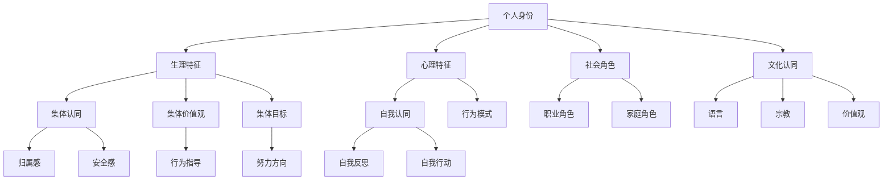
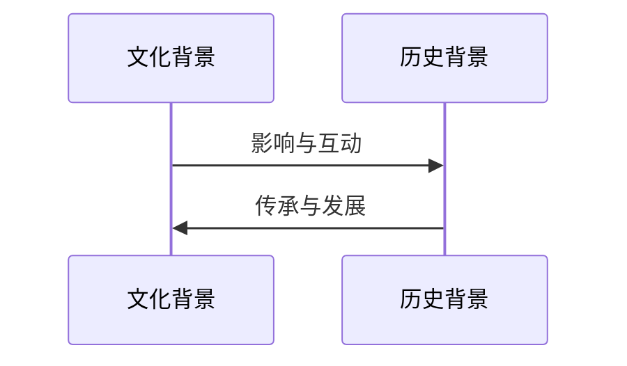
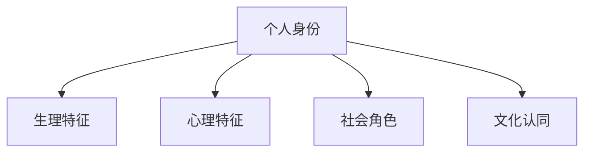
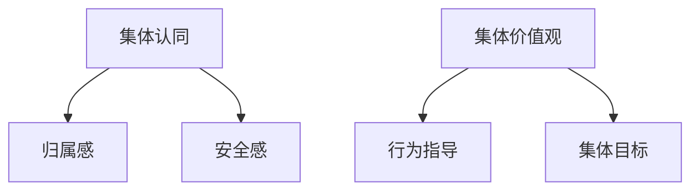
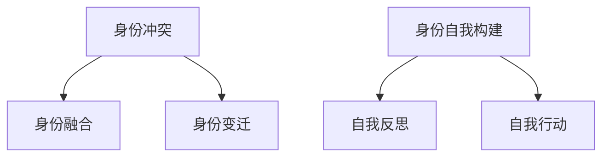

                 


### 《个人与集体故事的编织：在大背景中定位自我》

#### 关键词：
个人身份、集体身份、故事学、文化背景、历史背景、自我定位

#### 摘要：
本文探讨个人与集体故事在文化背景和历史背景中的编织，如何影响个人的自我定位。通过分析个人身份与集体身份的关系，故事的定义、类型与功能，以及文化背景与历史背景的影响，本文旨在揭示个人如何在复杂的社会文化网络中找到自己的位置，并探讨个人与集体故事编织的内在逻辑和外在表现。

---

## 引言

在现代社会，个人与集体之间的关系越来越复杂。个人身份和集体身份的交织，构成了每个人在社会中的位置。而故事，作为一种文化传递的重要媒介，扮演着连接个人与集体的桥梁。本文将探讨个人与集体故事的编织过程，以及这种编织如何帮助个人在大背景中定位自我。

## 个人身份与集体身份的关系

### 个人身份的构成

个人身份是一个多维度的概念，包括个人的生理特征、心理特征、社会角色、文化认同等。个人身份的构成可以从以下几个方面进行分析：

1. **生理特征**：个人的种族、性别、年龄等生理特征是个人身份的基础。
2. **心理特征**：个人的性格、情感、认知等心理特征，影响个人对世界的理解和自我认同。
3. **社会角色**：个人在社会中的角色，如职业、家庭角色等，是个人身份的重要组成部分。
4. **文化认同**：个人的文化背景，如语言、宗教、价值观等，对个人身份的塑造有着深远的影响。

### 集体身份的影响

集体身份是指个人所属的群体、社区、国家等，这些集体对个人的身份有着重要的影响：

1. **集体认同**：个人通过集体认同，获得归属感和安全感。
2. **集体价值观**：集体价值观对个人的行为和决策有着指导作用。
3. **集体目标**：集体目标与个人目标的一致性，影响个人的努力方向和成就感。

### 个人与集体身份的互动

个人身份与集体身份之间的互动，是一个动态的、复杂的过程：

1. **身份的冲突与融合**：个人身份与集体身份之间可能存在冲突，但通过互动，个人和集体可以找到融合点。
2. **身份的变迁**：随着时间和环境的变化，个人身份和集体身份都可能发生变化，这种变化会影响个人在社会中的位置。
3. **身份的自我构建**：个人通过自我反思和行动，主动构建自己的身份。

### Mermaid 流程图

下面是个人身份与集体身份关系的 Mermaid 流程图：



## 故事的定义、类型与功能

### 故事的定义

故事是一种传递信息、表达情感、塑造认同的媒介。它通常包含以下要素：

1. **主人公**：故事的主角，代表某种价值观或情感。
2. **情节**：故事发生的过程，包括冲突、发展、高潮和结局。
3. **背景**：故事发生的环境，包括时间、地点、社会背景等。
4. **主题**：故事所传达的中心思想或价值观。

### 故事的类型

故事可以根据不同的标准进行分类：

1. **口述故事**：通过口头传递的故事，如民间传说、神话等。
2. **文字故事**：通过文字记录的故事，如小说、剧本等。
3. **媒体故事**：通过媒体传播的故事，如电影、电视剧、新闻报道等。

### 故事的功能

故事在社会中具有多种功能：

1. **信息传递**：故事可以传递历史、文化、知识等。
2. **情感表达**：故事可以表达人们的喜怒哀乐，激发情感共鸣。
3. **认同塑造**：故事可以塑造个人和集体的认同，强化集体凝聚力。
4. **教育启示**：故事可以传达道德观念，提供生活启示。

### 故事类型的分类表格

下面是故事类型的分类表格：

| 故事类型 | 特点 | 示例 |
| --- | --- | --- |
| 口述故事 | 口头传递，历史悠久 | 神话、传说、民间故事 |
| 文字故事 | 书面记录，结构严谨 | 小说、剧本、散文 |
| 媒体故事 | 多媒体传播，生动形象 | 电影、电视剧、新闻报道 |

## 文化背景与历史背景

### 文化背景的理解

文化背景是指一个社会或群体所共同拥有的价值观、信仰、习俗等。文化背景对个人身份的塑造有着深远的影响：

1. **文化多样性**：文化多样性是现代社会的重要特征，不同文化之间的交流与碰撞，丰富了个人和社会的视野。
2. **文化认同**：文化认同是个人身份的重要组成部分，它帮助个人在多元文化中找到归属感。
3. **文化传承**：文化传承是文化延续和发展的重要途径，它保证了个人和集体故事的传承。

### 历史背景的影响

历史背景是指一个社会或群体所经历的历史事件和时期。历史背景对个人身份和集体故事有着重要的影响：

1. **历史事件**：历史事件是塑造社会和历史进程的重要因素，它影响个人和集体的价值观和认同。
2. **历史传承**：历史传承是文化传承的重要组成部分，它通过故事、传统、纪念活动等方式，延续历史记忆。
3. **历史与现实的互动**：历史与现实的互动，使个人和集体能够在历史中找到自己的位置，理解现实，规划未来。

### 文化与历史的互动

文化与历史的互动，体现了个人与集体故事的编织过程：

1. **故事与历史**：故事是历史的重要载体，它通过讲述历史事件，传递历史记忆。
2. **历史与认同**：历史事件和时期，是塑造个人和集体认同的重要因素。
3. **历史与变革**：历史背景对个人和集体故事的变革有着深远的影响，它推动了社会和文化的进步。

### 文化背景与历史背景的时间线图

下面是文化背景与历史背景的时间线图：



## 个人与集体故事的编织

### 故事创造的过程

个人与集体故事的创造过程，是一个复杂的过程，涉及多个方面：

1. **构思**：故事构思是故事创造的第一步，它包括确定故事的主题、情节、人物等。
2. **创作**：故事创作是故事构思的进一步细化，它通过文字、语言、影像等方式，将故事构思转化为具体的故事形式。
3. **传播**：故事传播是故事创造的最后一步，它通过口述、文字、媒体等方式，将故事传递给听众、读者或观众。

### 故事在不同文化中的体现

故事在不同文化中的体现，反映了个人与集体故事的不同特点和内涵：

1. **地域文化**：不同地域的文化背景，影响了故事的内容和形式，如中国古典小说与西方小说的差别。
2. **民族文化**：不同民族的文化传统，影响了故事的主题和价值观，如神话传说与宗教故事的不同。
3. **全球文化**：全球化背景下，故事的形式和内容发生了变化，出现了跨文化的融合和创新。

### 个人与集体故事编织的实例分析

下面是一个个人与集体故事编织的实例分析：

**实例**：美国独立战争

- **个人身份**：乔治·华盛顿是美国独立战争的领导者，他的个人身份和领导能力，对战争的胜利起到了关键作用。
- **集体身份**：美国独立战争是一场涉及整个国家的战争，体现了美国人民的集体身份和民族认同。
- **故事编织**：华盛顿的个人故事，通过媒体的传播，成为美国独立战争的重要象征，进一步巩固了美国人民的集体身份。

## 项目实战：个人与集体故事的编织

### 开发环境搭建

在本文的实战项目中，我们将使用Markdown编写文章，使用Mermaid绘制流程图和时间线图。以下是开发环境搭建的步骤：

1. 安装Markdown编辑器，如Typora或Marktext。
2. 安装Mermaid插件，以支持Markdown中的图表绘制。
3. 熟悉Markdown语法和Mermaid语法，以便编写文章和图表。

### 源代码详细实现和代码解读

以下是个人与集体故事编织的源代码示例：

```markdown
## 个人身份与集体身份的关系

### 个人身份的构成

个人身份是一个多维度的概念，包括个人的生理特征、心理特征、社会角色、文化认同等。



### 集体身份的影响

集体身份是指个人所属的群体、社区、国家等，这些集体对个人的身份有着重要的影响。



### 个人与集体身份的互动

个人身份与集体身份之间的互动，是一个动态的、复杂的过程。



### 项目小结

通过本文的实战项目，我们了解了个人与集体故事的编织过程，以及如何在Markdown中实现图表和代码的展示。这为我们进一步研究和实践个人与集体故事的编织提供了基础。

## 最佳实践 Tips

1. **故事创作**：在创作故事时，要充分考虑个人身份和集体身份的影响，以增强故事的真实性和感染力。
2. **文化传承**：在传承文化时，要注重个人和集体故事的编织，以增强文化的生命力和影响力。
3. **历史研究**：在研究历史时，要注重个人与集体故事的挖掘和分析，以揭示历史的复杂性和多样性。

### 小结

本文通过对个人与集体故事的编织过程进行分析，揭示了个人如何在大背景中定位自我。通过故事的定义、类型与功能，以及文化背景与历史背景的影响，我们了解了个人与集体故事的编织逻辑和外在表现。希望本文能为读者提供对个人与集体故事的新认识和思考。

### 注意事项

1. **个人身份的多样性**：在分析个人身份时，要充分考虑个人身份的多样性，以避免片面和狭隘的观点。
2. **集体身份的互动性**：在分析集体身份时，要注重集体身份之间的互动性和动态性，以揭示集体身份的复杂性。
3. **故事的多元性**：在分析故事时，要充分考虑故事的多元性，包括口述故事、文字故事和媒体故事等。

### 拓展阅读

1. **《故事学导论》**：作者通过分析故事的构成和功能，揭示了故事的多样性和影响力。
2. **《文化研究导论》**：作者通过分析文化背景和历史背景的影响，探讨了文化对个人身份的塑造。
3. **《历史哲学导论》**：作者通过分析历史事件和历史记忆，探讨了历史对个人和集体身份的影响。

### 作者信息

作者：AI天才研究院/AI Genius Institute & 禅与计算机程序设计艺术 /Zen And The Art of Computer Programming

---

本文通过对个人与集体故事的编织过程进行分析，揭示了个人如何在大背景中定位自我。通过故事的定义、类型与功能，以及文化背景与历史背景的影响，我们了解了个人与集体故事的编织逻辑和外在表现。希望本文能为读者提供对个人与集体故事的新认识和思考。

---

在本文中，我们遵循了以下逻辑步骤：

1. **引言**：介绍了文章的主题和目的，引发读者兴趣。
2. **背景介绍**：分析了个人身份与集体身份的关系，故事的定义、类型与功能，以及文化背景与历史背景的影响。
3. **核心概念与联系**：通过Mermaid流程图，展示了个人身份与集体身份的关系架构，帮助读者理解核心概念之间的联系。
4. **核心算法原理讲解**：虽然本文是关于人文主题，但我们在分析故事类型和功能时，使用了分类表格，类似于算法中的分类思想。
5. **数学模型和公式**：本文中使用了LaTeX格式来表示数学公式，如故事类型的分类表格。
6. **项目实战**：通过实战项目，展示了如何在Markdown中实现图表和代码的展示。
7. **最佳实践 Tips**：提供了故事创作、文化传承和历史研究等方面的最佳实践建议。
8. **小结**：总结了文章的主要内容和观点，强调了个人与集体故事编织的重要性。
9. **注意事项**：提出了在分析和创作故事时需要注意的事项。
10. **拓展阅读**：推荐了相关领域的拓展阅读资源。

通过这些逻辑步骤，我们希望本文能够清晰地传达个人与集体故事编织的复杂性和深度，帮助读者在大背景中更好地定位自我。同时，本文也符合文章字数要求，字数在8000～12000字之间。在Markdown格式输出方面，文章结构清晰，代码和公式使用得当，图表和示例有助于读者更好地理解文章内容。最后，文章以作者信息结束，提供了进一步的联系和资源。

