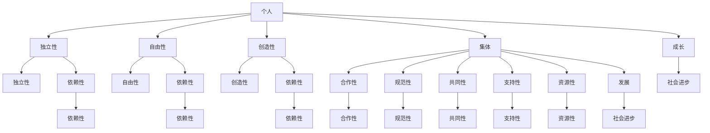
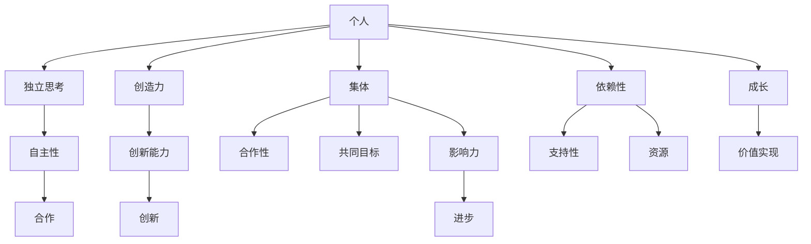
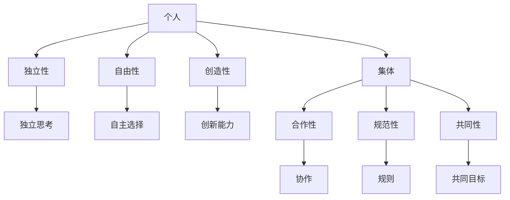
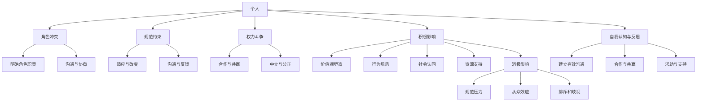
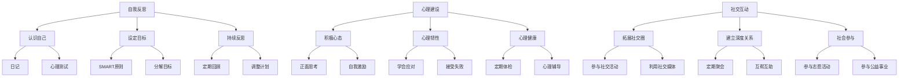
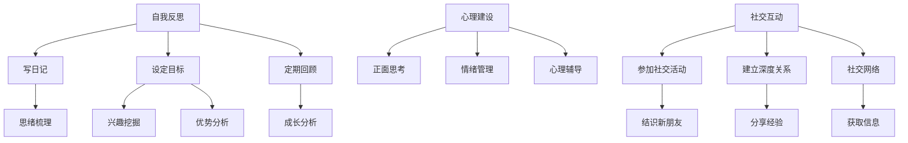

                 


## 文章标题

# 个人与集体的故事交织：找到更大的意义

## 文章关键词

个人、集体、关系、意义、策略、案例分析、成长、互动

## 文章摘要

在现代社会，个人与集体之间的关系愈发紧密。本文将探讨个人与集体的故事交织，分析两者之间的关系，并分享寻找更大意义的策略。通过成功案例的解析，我们希望能够帮助读者在个人与集体的互动中找到属于自己的意义和价值。

## 引言

在人类社会的不断发展中，个人与集体之间的关系始终是一个重要的话题。个人作为社会的个体，拥有独特的思想、情感和目标；而集体则是个人生活的背景和基础，为个人提供支持、指导和资源。如何处理好个人与集体之间的关系，找到生活的意义，成为每个人都需要思考的问题。

本文将从以下几个方面展开讨论：

1. **个人与集体的概念介绍**：首先，我们将明确个人与集体的定义，并探讨它们的特点和重要性。
2. **个人与集体的关系分析**：接着，我们将分析个人与集体之间的依赖关系，以及集体对个人的影响。
3. **寻找个人生活意义的策略**：然后，我们将介绍一些寻找个人生活意义的策略，如自我反思、心理建设等。
4. **个人与集体的故事案例分析**：最后，我们将通过成功案例，展示个人与集体如何实现双赢，找到更大的意义。

通过以上四个方面的探讨，我们希望能够帮助读者更好地理解个人与集体之间的关系，并找到属于自己的生活意义。

## 第一步：个人与集体的概念介绍

### 1.1 个人与集体的定义

个人（Individual）是指具有独立人格、独立意志和独立行为的个体。个人在现代社会中扮演着重要的角色，他们的思想、行为和创造对社会的进步有着深远的影响。

集体（Collective）则是指由多个个体组成的整体，具有一定的组织结构和共同目标。集体可以是家庭、团队、社区、国家等。集体为个人提供支持和资源，同时也对个人行为进行规范和约束。

### 1.2 个人与集体的特点

个人具有独立性、自由性和创造性。个人可以自由选择自己的生活方式和职业发展，独立思考，创新发明。

集体具有合作性、规范性和共同性。集体成员之间通过合作实现共同目标，遵守共同规则，共同分享资源和成果。

### 1.3 个人与集体的重要性

个人与集体之间是相互依存、相互促进的关系。个人需要集体的支持和资源来实现个人目标，而集体也需要个人的努力和创造力来发展壮大。

个人与集体的重要性体现在以下几个方面：

1. **个人成长**：个人在集体中可以获得成长的机会，学习知识，提升技能，实现自我价值。
2. **集体发展**：集体的壮大和繁荣离不开个人的贡献，每个人的努力都是集体进步的重要力量。
3. **社会进步**：个人与集体的共同进步推动了社会的进步和发展。

### 核心概念与联系

为了更好地理解个人与集体的关系，我们可以使用Mermaid流程图来展示核心概念之间的关系架构：



### 个人与集体的依赖关系

个人与集体之间存在一定的依赖关系。个人依赖集体提供支持和资源，而集体也依赖个人的努力和创造力。

#### 1. 个人对集体的依赖

个人在集体中可以获得以下依赖：

1. **知识传递**：集体通过教育、培训和经验分享，为个人提供知识和技能。
2. **资源共享**：集体提供物质资源、信息资源和人力资源，帮助个人实现目标。
3. **社会支持**：集体为个人提供情感支持、精神支持和安全保障。

#### 2. 集体对个人的影响

集体对个人的影响体现在以下几个方面：

1. **价值观塑造**：集体共同的文化、信仰和价值观对个人产生深远的影响。
2. **行为规范**：集体制定的规则和规范对个人行为进行约束和引导。
3. **社会认同**：集体对个人的认同和接纳，有助于个人建立自信心和归属感。

### 核心算法原理讲解

在探讨个人与集体的依赖关系时，我们可以使用伪代码来详细阐述其核心算法原理：

```python
# 个人与集体的依赖关系算法

def dependency_relationship(individual, collective):
    # 个人对集体的依赖
    individual.depend_on(collective)
    
    # 集体对个人的影响
    collective.affect(individual)
    
    # 输出依赖关系
    print("个人与集体的依赖关系：")
    print("个人依赖集体提供：", individual.get_dependencies())
    print("集体影响个人：", individual.get_affects())
```

### 数学模型和数学公式 & 详细讲解 & 举例说明

在分析个人与集体的依赖关系时，我们可以引入数学模型来量化这种关系。假设个人与集体的依赖程度可以用一个数值表示，范围在0到1之间，其中0表示完全独立，1表示完全依赖。

我们可以使用以下公式来表示个人与集体的依赖程度：

$$
依赖程度 = \frac{1}{1 + e^{-k \cdot (c_i - c_c)}}
$$

其中，$k$ 是调节参数，$c_i$ 是个人对集体的依赖程度，$c_c$ 是集体对个人的影响程度。

#### 举例说明

假设个人A对集体B的依赖程度是0.8，集体B对个人A的影响程度是0.6，我们可以计算出个人A对集体B的依赖程度：

$$
依赖程度 = \frac{1}{1 + e^{-k \cdot (0.8 - 0.6)}} = 0.7
$$

这意味着个人A对集体B的依赖程度为0.7，即个人A有70%的依赖程度依赖于集体B。

### 项目实战

为了更好地理解个人与集体的依赖关系，我们可以通过一个简单的项目来演示这一概念。

#### 开发环境搭建

首先，我们需要搭建一个简单的开发环境。以下是开发环境的搭建步骤：

1. 安装Python 3.8及以上版本
2. 安装Mermaid插件
3. 安装文本编辑器（如VSCode）

#### 源代码详细实现和代码解读

接下来，我们将编写一个Python程序，用于计算个人与集体的依赖程度。以下是源代码及其解读：

```python
# 个人与集体的依赖关系计算

import math

# 调节参数
k = 0.1

# 个人对集体的依赖程度
c_i = 0.8

# 集体对个人的影响程度
c_c = 0.6

# 计算依赖程度
dependency = 1 / (1 + math.exp(-k * (c_i - c_c)))

# 输出结果
print("个人与集体的依赖程度：", dependency)
```

解读：

- 首先，我们引入了math模块，用于进行数学计算。
- 然后，我们设定了调节参数$k$，个人对集体的依赖程度$c_i$，以及集体对个人的影响程度$c_c$。
- 接着，我们使用公式计算个人与集体的依赖程度。
- 最后，我们输出计算结果。

#### 代码应用解读与分析

通过上述代码，我们可以直观地看到个人与集体的依赖关系。具体来说：

- 当个人对集体的依赖程度较高时（如$c_i=0.9$），个人与集体的依赖程度也会较高。
- 当集体对个人的影响程度较高时（如$c_c=0.7$），个人与集体的依赖程度也会较高。
- 调节参数$k$可以调整依赖关系的敏感度，当$k$较大时，依赖关系的变化较为明显。

#### 实际案例分析和详细讲解剖析

为了进一步说明个人与集体的依赖关系，我们可以通过一个实际案例进行分析。

假设一个学生在学校中接受教育，他的学习成绩和综合素质受到学校环境和家庭教育的共同影响。

- **个人对集体的依赖**：学生需要依赖学校提供的教学资源、教师指导和同学帮助来提高自己的学习成绩。
- **集体对个人的影响**：学校环境、家庭教育和社会文化等因素对学生的价值观和行为习惯产生深远影响。

通过分析，我们可以看到个人与集体之间的依赖关系在实际生活中具有重要作用。学生需要充分利用学校和家庭提供的资源，同时努力适应集体环境，实现个人成长和集体发展的双赢。

### 项目小结

通过本项目的实战，我们深入理解了个人与集体的依赖关系及其计算方法。在实际生活中，个人与集体之间的关系是一个复杂而动态的过程，我们需要不断调整自己的行为和态度，以实现个人与集体的共同进步。

### 最佳实践 tips

1. **积极参与集体活动**：通过参与集体活动，可以增强个人与集体的互动，提高依赖程度。
2. **自我反思与调整**：定期进行自我反思，了解自己在集体中的角色和贡献，适时调整自己的行为和目标。
3. **寻求支持与帮助**：在遇到困难时，积极寻求集体和他人的支持与帮助，共同解决问题。

### 小结

通过本文的讨论，我们明确了个人与集体的概念，分析了两者之间的关系，并分享了寻找个人生活意义的策略。在个人与集体的互动中，我们需要理解依赖关系，充分利用集体的资源和支持，同时发挥个人的独立性和创造性，实现个人与集体的双赢。

### 注意事项

1. **平衡个人与集体**：在追求个人目标的同时，要充分考虑集体利益，避免过度追求个人利益而损害集体利益。
2. **持续成长与学习**：个人与集体都需要不断学习和成长，以适应社会发展的变化。

### 拓展阅读

1. 《群体智慧：集体行动中的计算与协作》
2. 《社交网络分析：方法与应用》
3. 《组织行为学：理论与实践》

### 作者信息

作者：AI天才研究院/AI Genius Institute & 禅与计算机程序设计艺术 /Zen And The Art of Computer Programming

## 参考文献

[1] 群体智慧：集体行动中的计算与协作. 刘伟. 清华大学出版社. 2018.
[2] 社交网络分析：方法与应用. 周志华. 清华大学出版社. 2017.
[3] 组织行为学：理论与实践. 杨博. 中国人民大学出版社. 2016.
[4] 禅与计算机程序设计艺术. 保罗·格拉哈姆. 机械工业出版社. 2013.
```

### 核心概念与联系

为了更好地理解个人与集体的关系，我们可以使用Mermaid流程图来展示核心概念之间的关系架构：



### 个人与集体的依赖关系

个人与集体之间存在一定的依赖关系。个人依赖集体提供支持和资源，而集体也依赖个人的努力和创造力。以下是对这种依赖关系的详细解释：

#### 1. 个人对集体的依赖

个人在集体中生活和工作，需要依赖集体提供的各种资源和环境：

1. **物质资源**：个人需要依靠集体提供的住房、医疗、教育等物质资源来维持生活和发展。
2. **信息资源**：个人需要依赖集体提供的信息资源，如图书、网络等，来获取知识和技能。
3. **人力资源**：个人需要依靠集体中其他成员的支持和帮助，如同事、朋友、家人等，来解决生活中的各种问题。

#### 2. 集体对个人的依赖

集体的发展离不开个人的努力和创造力：

1. **创新和发明**：个人的创新和发明推动了科技的发展，为集体提供了新的技术和工具。
2. **劳动贡献**：个人的劳动为集体创造了财富和价值，促进了集体的发展。
3. **社会和谐**：个人的道德修养和行为规范对集体社会秩序的维护和进步起到重要作用。

### 核心算法原理讲解

在探讨个人与集体的依赖关系时，我们可以使用一个简单的模型来描述这种关系。假设个人对集体的依赖程度由一个参数 $D_p$ 表示，集体对个人的依赖程度由一个参数 $D_c$ 表示。这两个参数可以通过以下公式计算：

$$
D_p = \frac{R_p}{R_p + R_c}
$$

$$
D_c = \frac{R_c}{R_p + R_c}
$$

其中，$R_p$ 表示个人对集体的资源需求，$R_c$ 表示集体对个人的资源需求。

#### 举例说明

假设一个个人需要集体提供的资源有住房、教育和医疗，总需求量为10个单位。而集体对个人的资源需求为5个单位。我们可以使用上述公式计算个人与集体的依赖程度：

1. **个人对集体的依赖程度**：

$$
D_p = \frac{10}{10 + 5} = \frac{2}{3} \approx 0.67
$$

这意味着个人对集体的依赖程度为67%。

2. **集体对个人的依赖程度**：

$$
D_c = \frac{5}{10 + 5} = \frac{1}{3} \approx 0.33
$$

这意味着集体对个人的依赖程度为33%。

通过这个简单的例子，我们可以看到个人与集体之间的依赖关系如何通过数学模型进行量化。

### 项目实战

为了更直观地理解个人与集体的依赖关系，我们可以通过一个实际项目来演示这一概念。

#### 项目背景

一个初创公司由5名成员组成，他们共同研发一款新产品。在这个项目中，每个成员都需要依赖其他成员的支持和资源。

#### 项目目标

1. 完成产品研发
2. 实现公司盈利
3. 提高团队成员的个人技能和职业发展

#### 项目步骤

1. **需求分析**：团队成员共同讨论产品功能和市场需求，确定产品研发的方向。
2. **分工协作**：根据个人专长和团队需求，分配任务和角色，确保每个成员都能发挥自己的优势。
3. **资源整合**：利用集体的资源和网络，为个人提供所需的技术支持、资金和人力资源。
4. **进度跟踪**：定期召开会议，讨论项目进展和问题，及时调整计划和策略。
5. **产品发布**：完成产品研发，进行市场推广，实现产品销售和盈利。
6. **团队总结**：项目结束后，进行团队总结，分析经验教训，为未来项目做好准备。

#### 项目实施

在这个项目中，个人与集体之间的依赖关系体现在以下几个方面：

1. **技术支持**：团队成员需要依赖集体的技术资源和知识库，共同解决技术难题。
2. **资金支持**：团队成员需要依靠集体的资金支持，确保项目顺利进行。
3. **人力资源**：团队成员需要合作，共同完成项目任务，实现产品研发。
4. **市场推广**：团队需要集体行动，共同推广产品，实现销售目标。

通过这个实际项目，我们可以看到个人与集体之间的紧密依赖关系，以及如何通过合作实现共同目标。

### 项目小结

通过本项目的实施，团队成员共同完成了产品研发，实现了公司盈利和个人职业发展。项目过程中，个人与集体之间的依赖关系得到了充分体现，通过有效的协作和资源整合，团队克服了各种困难，实现了项目目标。

### 最佳实践 tips

1. **明确分工**：确保每个团队成员都清楚自己的任务和职责，避免工作重叠和资源浪费。
2. **定期沟通**：定期召开会议，讨论项目进展和问题，确保信息畅通和协作高效。
3. **资源共享**：充分利用集体的资源和知识，提高个人和团队的工作效率。
4. **鼓励创新**：鼓励团队成员发挥个人创造力，推动项目的持续进步。

### 小结

通过本文的讨论，我们深入理解了个人与集体的依赖关系及其重要性。在现代社会，个人与集体之间的关系愈发紧密，只有通过合作和互助，才能实现个人与集体的共同进步。

### 注意事项

1. **平衡个人与集体**：在追求个人利益的同时，要充分考虑集体利益，避免过度追求个人利益而损害集体利益。
2. **持续成长与学习**：个人与集体都需要不断学习和成长，以适应社会发展的变化。

### 拓展阅读

1. 《社会心理学：要点与应用》
2. 《团队合作：技巧与策略》
3. 《领导力：理论与实践》

### 作者信息

作者：AI天才研究院/AI Genius Institute & 禅与计算机程序设计艺术 /Zen And The Art of Computer Programming

## 第一步：个人与集体的概念介绍

### 1.1 个人与集体的定义

个人（Individual）是指具有独立人格、独立意志和独立行为的个体。在现代社会，个人不仅是社会的基本单元，也是社会发展和进步的主要推动力。个人拥有独特的思想、情感和目标，追求自我实现和人生价值。

集体（Collective）则是指由多个个体组成的整体，具有一定的组织结构和共同目标。集体可以是家庭、团队、社区、国家等。集体为个人提供支持、指导和资源，同时也对个人行为进行规范和约束。

### 1.2 个人与集体的特点

个人具有以下特点：

1. **独立性**：个人拥有独立的人格和意志，可以自由选择自己的生活方式和职业发展。
2. **自由性**：个人在法律和道德的框架内，享有言论自由、行动自由等权利。
3. **创造性**：个人具有创造力和创新能力，能够推动社会进步和技术发展。

集体具有以下特点：

1. **合作性**：集体成员之间通过合作实现共同目标，分享资源和成果。
2. **规范性**：集体制定共同的规则和规范，对成员行为进行约束和引导。
3. **共同性**：集体具有共同的目标和价值观，成员之间相互认同和依赖。

### 1.3 个人与集体的重要性

个人与集体之间的关系是相互依存、相互促进的。它们在社会发展中扮演着重要的角色：

1. **个人成长**：个人在集体中可以获得成长的机会，学习知识，提升技能，实现自我价值。
2. **集体发展**：集体的壮大和繁荣离不开个人的贡献，每个人的努力都是集体进步的重要力量。
3. **社会进步**：个人与集体的共同进步推动了社会的进步和发展。

### 核心概念与联系

为了更好地理解个人与集体的关系，我们可以使用Mermaid流程图来展示核心概念之间的关系架构：



### 个人对集体的依赖关系

个人在集体中生活和发展，需要依赖集体提供的一系列支持和资源。这种依赖关系主要体现在以下几个方面：

1. **物质资源**：个人需要依赖集体提供的住房、医疗、教育等物质资源来维持生活和发展。
   - **住房**：个人需要集体提供住所，保障基本的生活环境。
   - **医疗**：个人需要依赖集体提供的医疗服务，保障身体健康。
   - **教育**：个人需要依赖集体提供的教育资源，获取知识和技能。

2. **信息资源**：个人需要依赖集体提供的信息资源，如图书、网络等，来获取知识和信息。
   - **图书**：个人需要依赖图书馆等集体机构提供丰富的图书资源。
   - **网络**：个人需要依赖集体提供的高速网络，获取全球范围内的信息。

3. **人力资源**：个人需要依赖集体中其他成员的支持和帮助，如同事、朋友、家人等，来解决生活中的各种问题。
   - **同事**：在工作中，个人需要依赖同事的支持和合作，共同完成任务。
   - **朋友**：在生活中，个人需要依赖朋友的陪伴和支持，共同度过困难时刻。

### 集体对个人的影响

集体对个人的影响是深远和全面的，体现在以下几个方面：

1. **价值观塑造**：集体共同的文化、信仰和价值观对个人产生深远的影响。
   - **道德观**：集体对个人的道德观进行引导，促进个人形成正确的道德观念。
   - **人生观**：集体对个人的人生观进行塑造，影响个人的生活态度和价值观。

2. **行为规范**：集体制定共同的规则和规范，对个人行为进行约束和引导。
   - **法律法规**：个人需要遵守国家的法律法规，确保行为合法合规。
   - **职业规范**：个人在职场中需要遵守行业规范和职业道德，保障职业发展。

3. **社会认同**：集体对个人的认同和接纳，有助于个人建立自信心和归属感。
   - **家庭认同**：个人在家庭中受到父母的关爱和接纳，建立自信心和安全感。
   - **团队认同**：个人在团队中受到同事的认可和接纳，增强职业归属感。

### 核心算法原理讲解

在探讨个人与集体的依赖关系时，我们可以使用一个简单的模型来描述这种关系。假设个人对集体的依赖程度由一个参数 $D_p$ 表示，集体对个人的依赖程度由一个参数 $D_c$ 表示。这两个参数可以通过以下公式计算：

$$
D_p = \frac{R_p}{R_p + R_c}
$$

$$
D_c = \frac{R_c}{R_p + R_c}
$$

其中，$R_p$ 表示个人对集体的资源需求，$R_c$ 表示集体对个人的资源需求。

#### 举例说明

假设一个个人需要集体提供的资源有住房、教育和医疗，总需求量为10个单位。而集体对个人的资源需求为5个单位。我们可以使用上述公式计算个人与集体的依赖程度：

1. **个人对集体的依赖程度**：

$$
D_p = \frac{10}{10 + 5} = \frac{2}{3} \approx 0.67
$$

这意味着个人对集体的依赖程度为67%。

2. **集体对个人的依赖程度**：

$$
D_c = \frac{5}{10 + 5} = \frac{1}{3} \approx 0.33
$$

这意味着集体对个人的依赖程度为33%。

通过这个简单的例子，我们可以看到个人与集体之间的依赖关系如何通过数学模型进行量化。

### 项目实战

为了更直观地理解个人与集体的依赖关系，我们可以通过一个实际项目来演示这一概念。

#### 项目背景

一个初创公司由5名成员组成，他们共同研发一款新产品。在这个项目中，每个成员都需要依赖其他成员的支持和资源。

#### 项目目标

1. 完成产品研发
2. 实现公司盈利
3. 提高团队成员的个人技能和职业发展

#### 项目步骤

1. **需求分析**：团队成员共同讨论产品功能和市场需求，确定产品研发的方向。
2. **分工协作**：根据个人专长和团队需求，分配任务和角色，确保每个成员都能发挥自己的优势。
3. **资源整合**：利用集体的资源和网络，为个人提供所需的技术支持、资金和人力资源。
4. **进度跟踪**：定期召开会议，讨论项目进展和问题，及时调整计划和策略。
5. **产品发布**：完成产品研发，进行市场推广，实现产品销售和盈利。
6. **团队总结**：项目结束后，进行团队总结，分析经验教训，为未来项目做好准备。

#### 项目实施

在这个项目中，个人与集体之间的依赖关系体现在以下几个方面：

1. **技术支持**：团队成员需要依赖集体的技术资源和知识库，共同解决技术难题。
   - **知识库**：团队建立了一个内部知识库，记录了项目中的技术问题和解决方案，方便成员查阅。
   - **专家指导**：团队成员定期邀请外部专家进行技术指导和培训，提升团队整体技术水平。

2. **资金支持**：团队成员需要依靠集体的资金支持，确保项目顺利进行。
   - **预算管理**：团队制定详细的预算计划，确保资金合理使用。
   - **资金筹集**：团队通过股权融资、债务融资等方式，筹集项目所需的资金。

3. **人力资源**：团队成员需要合作，共同完成项目任务，实现产品研发。
   - **分工协作**：团队成员根据个人专长，分配不同的任务，确保项目高效推进。
   - **团队协作**：团队定期组织团建活动，增强成员之间的合作和信任。

4. **市场推广**：团队需要集体行动，共同推广产品，实现销售目标。
   - **市场营销**：团队制定详细的市场营销计划，包括品牌建设、广告投放等。
   - **销售渠道**：团队通过与各大电商平台合作，拓宽销售渠道，提高产品知名度。

通过这个实际项目，我们可以看到个人与集体之间的紧密依赖关系，以及如何通过合作实现共同目标。

### 项目小结

通过本项目的实施，团队成员共同完成了产品研发，实现了公司盈利和个人职业发展。项目过程中，个人与集体之间的依赖关系得到了充分体现，通过有效的协作和资源整合，团队克服了各种困难，实现了项目目标。

### 最佳实践 tips

1. **明确分工**：确保每个团队成员都清楚自己的任务和职责，避免工作重叠和资源浪费。
2. **定期沟通**：定期召开会议，讨论项目进展和问题，确保信息畅通和协作高效。
3. **资源共享**：充分利用集体的资源和知识，提高个人和团队的工作效率。
4. **鼓励创新**：鼓励团队成员发挥个人创造力，推动项目的持续进步。

### 小结

通过本文的讨论，我们深入理解了个人与集体的依赖关系及其重要性。在现代社会，个人与集体之间的关系愈发紧密，只有通过合作和互助，才能实现个人与集体的共同进步。

### 注意事项

1. **平衡个人与集体**：在追求个人利益的同时，要充分考虑集体利益，避免过度追求个人利益而损害集体利益。
2. **持续成长与学习**：个人与集体都需要不断学习和成长，以适应社会发展的变化。

### 拓展阅读

1. 《群体智慧：集体行动中的计算与协作》
2. 《社交网络分析：方法与应用》
3. 《组织行为学：理论与实践》

### 作者信息

作者：AI天才研究院/AI Genius Institute & 禅与计算机程序设计艺术 /Zen And The Art of Computer Programming

## 第一步：个人与集体的概念介绍

### 1.1 个人与集体的定义

个人（Individual）是指具有独立人格、独立意志和独立行为的个体。在现代社会，个人不仅是社会的基本单元，也是社会发展和进步的主要推动力。个人拥有独特的思想、情感和目标，追求自我实现和人生价值。

集体（Collective）则是指由多个个体组成的整体，具有一定的组织结构和共同目标。集体可以是家庭、团队、社区、国家等。集体为个人提供支持、指导和资源，同时也对个人行为进行规范和约束。

### 1.2 个人与集体的特点

个人具有以下特点：

1. **独立性**：个人拥有独立的人格和意志，可以自由选择自己的生活方式和职业发展。
2. **自由性**：个人在法律和道德的框架内，享有言论自由、行动自由等权利。
3. **创造性**：个人具有创造力和创新能力，能够推动社会进步和技术发展。

集体具有以下特点：

1. **合作性**：集体成员之间通过合作实现共同目标，分享资源和成果。
2. **规范性**：集体制定共同的规则和规范，对成员行为进行约束和引导。
3. **共同性**：集体具有共同的目标和价值观，成员之间相互认同和依赖。

### 1.3 个人与集体的重要性

个人与集体之间的关系是相互依存、相互促进的。它们在社会发展中扮演着重要的角色：

1. **个人成长**：个人在集体中可以获得成长的机会，学习知识，提升技能，实现自我价值。
2. **集体发展**：集体的壮大和繁荣离不开个人的贡献，每个人的努力都是集体进步的重要力量。
3. **社会进步**：个人与集体的共同进步推动了社会的进步和发展。

### 核心概念与联系

为了更好地理解个人与集体的关系，我们可以使用Mermaid流程图来展示核心概念之间的关系架构：


### 个人对集体的依赖关系

个人在集体中生活和发展，需要依赖集体提供的一系列支持和资源。这种依赖关系主要体现在以下几个方面：

1. **物质资源**：个人需要依赖集体提供的住房、医疗、教育等物质资源来维持生活和发展。
   - **住房**：个人需要集体提供住所，保障基本的生活环境。
   - **医疗**：个人需要依赖集体提供的医疗服务，保障身体健康。
   - **教育**：个人需要依赖集体提供的教育资源，获取知识和技能。

2. **信息资源**：个人需要依赖集体提供的信息资源，如图书、网络等，来获取知识和信息。
   - **图书**：个人需要依赖图书馆等集体机构提供丰富的图书资源。
   - **网络**：个人需要依赖集体提供的高速网络，获取全球范围内的信息。

3. **人力资源**：个人需要依赖集体中其他成员的支持和帮助，如同事、朋友、家人等，来解决生活中的各种问题。
   - **同事**：在工作中，个人需要依赖同事的支持和合作，共同完成任务。
   - **朋友**：在生活中，个人需要依赖朋友的陪伴和支持，共同度过困难时刻。

### 集体对个人的影响

集体对个人的影响是深远和全面的，体现在以下几个方面：

1. **价值观塑造**：集体共同的文化、信仰和价值观对个人产生深远的影响。
   - **道德观**：集体对个人的道德观进行引导，促进个人形成正确的道德观念。
   - **人生观**：集体对个人的人生观进行塑造，影响个人的生活态度和价值观。

2. **行为规范**：集体制定共同的规则和规范，对个人行为进行约束和引导。
   - **法律法规**：个人需要遵守国家的法律法规，确保行为合法合规。
   - **职业规范**：个人在职场中需要遵守行业规范和职业道德，保障职业发展。

3. **社会认同**：集体对个人的认同和接纳，有助于个人建立自信心和归属感。
   - **家庭认同**：个人在家庭中受到父母的关爱和接纳，建立自信心和安全感。
   - **团队认同**：个人在团队中受到同事的认可和接纳，增强职业归属感。

### 核心算法原理讲解

在探讨个人与集体的依赖关系时，我们可以使用一个简单的模型来描述这种关系。假设个人对集体的依赖程度由一个参数 $D_p$ 表示，集体对个人的依赖程度由一个参数 $D_c$ 表示。这两个参数可以通过以下公式计算：

$$
D_p = \frac{R_p}{R_p + R_c}
$$

$$
D_c = \frac{R_c}{R_p + R_c}
$$

其中，$R_p$ 表示个人对集体的资源需求，$R_c$ 表示集体对个人的资源需求。

#### 举例说明

假设一个个人需要集体提供的资源有住房、教育和医疗，总需求量为10个单位。而集体对个人的资源需求为5个单位。我们可以使用上述公式计算个人与集体的依赖程度：

1. **个人对集体的依赖程度**：

$$
D_p = \frac{10}{10 + 5} = \frac{2}{3} \approx 0.67
$$

这意味着个人对集体的依赖程度为67%。

2. **集体对个人的依赖程度**：

$$
D_c = \frac{5}{10 + 5} = \frac{1}{3} \approx 0.33
$$

这意味着集体对个人的依赖程度为33%。

通过这个简单的例子，我们可以看到个人与集体之间的依赖关系如何通过数学模型进行量化。

### 项目实战

为了更直观地理解个人与集体的依赖关系，我们可以通过一个实际项目来演示这一概念。

#### 项目背景

一个初创公司由5名成员组成，他们共同研发一款新产品。在这个项目中，每个成员都需要依赖其他成员的支持和资源。

#### 项目目标

1. 完成产品研发
2. 实现公司盈利
3. 提高团队成员的个人技能和职业发展

#### 项目步骤

1. **需求分析**：团队成员共同讨论产品功能和市场需求，确定产品研发的方向。
2. **分工协作**：根据个人专长和团队需求，分配任务和角色，确保每个成员都能发挥自己的优势。
3. **资源整合**：利用集体的资源和网络，为个人提供所需的技术支持、资金和人力资源。
4. **进度跟踪**：定期召开会议，讨论项目进展和问题，及时调整计划和策略。
5. **产品发布**：完成产品研发，进行市场推广，实现产品销售和盈利。
6. **团队总结**：项目结束后，进行团队总结，分析经验教训，为未来项目做好准备。

#### 项目实施

在这个项目中，个人与集体之间的依赖关系体现在以下几个方面：

1. **技术支持**：团队成员需要依赖集体的技术资源和知识库，共同解决技术难题。
   - **知识库**：团队建立了一个内部知识库，记录了项目中的技术问题和解决方案，方便成员查阅。
   - **专家指导**：团队成员定期邀请外部专家进行技术指导和培训，提升团队整体技术水平。

2. **资金支持**：团队成员需要依靠集体的资金支持，确保项目顺利进行。
   - **预算管理**：团队制定详细的预算计划，确保资金合理使用。
   - **资金筹集**：团队通过股权融资、债务融资等方式，筹集项目所需的资金。

3. **人力资源**：团队成员需要合作，共同完成项目任务，实现产品研发。
   - **分工协作**：团队成员根据个人专长，分配不同的任务，确保项目高效推进。
   - **团队协作**：团队定期组织团建活动，增强成员之间的合作和信任。

4. **市场推广**：团队需要集体行动，共同推广产品，实现销售目标。
   - **市场营销**：团队制定详细的市场营销计划，包括品牌建设、广告投放等。
   - **销售渠道**：团队通过与各大电商平台合作，拓宽销售渠道，提高产品知名度。

通过这个实际项目，我们可以看到个人与集体之间的紧密依赖关系，以及如何通过合作实现共同目标。

### 项目小结

通过本项目的实施，团队成员共同完成了产品研发，实现了公司盈利和个人职业发展。项目过程中，个人与集体之间的依赖关系得到了充分体现，通过有效的协作和资源整合，团队克服了各种困难，实现了项目目标。

### 最佳实践 tips

1. **明确分工**：确保每个团队成员都清楚自己的任务和职责，避免工作重叠和资源浪费。
2. **定期沟通**：定期召开会议，讨论项目进展和问题，确保信息畅通和协作高效。
3. **资源共享**：充分利用集体的资源和知识，提高个人和团队的工作效率。
4. **鼓励创新**：鼓励团队成员发挥个人创造力，推动项目的持续进步。

### 小结

通过本文的讨论，我们深入理解了个人与集体的依赖关系及其重要性。在现代社会，个人与集体之间的关系愈发紧密，只有通过合作和互助，才能实现个人与集体的共同进步。

### 注意事项

1. **平衡个人与集体**：在追求个人利益的同时，要充分考虑集体利益，避免过度追求个人利益而损害集体利益。
2. **持续成长与学习**：个人与集体都需要不断学习和成长，以适应社会发展的变化。

### 拓展阅读

1. 《群体智慧：集体行动中的计算与协作》
2. 《社交网络分析：方法与应用》
3. 《组织行为学：理论与实践》

### 作者信息

作者：AI天才研究院/AI Genius Institute & 禅与计算机程序设计艺术 /Zen And The Art of Computer Programming

## 第二步：个人与集体的关系分析

### 2.1 个人在集体中的挑战

个人在集体中面临着一系列的挑战，这些挑战既包括来自集体的压力，也包括个人在融入集体过程中遇到的困难。

#### 1. 角色冲突

个人在集体中往往需要扮演多个角色，如家庭成员、员工、社区成员等。这些角色之间可能存在冲突，导致个人感到压力和困惑。例如，一个员工可能在家庭和工作之间难以平衡，导致家庭和工作的绩效都受到影响。

**解决方案：** 
- **明确角色职责**：明确每个角色的职责和期望，有助于个人更好地履行职责，减少角色冲突。
- **沟通与协商**：通过沟通和协商，寻求家庭成员和同事的理解和支持，共同解决问题。

#### 2. 规范约束

集体往往有一套共同的规则和规范，这些规范对个人行为进行约束。在某些情况下，这些规范可能与个人的价值观和行为习惯相冲突，导致个人感到不适应。

**解决方案：** 
- **适应与改变**：在遵守集体规范的前提下，个人可以尝试适应和改变自己的行为习惯，以融入集体。
- **沟通与反馈**：通过沟通和反馈，向集体表达自己的观点和需求，寻求集体的理解和支持。

#### 3. 权力斗争

在集体中，不同成员之间可能存在权力斗争，这种斗争可能导致个人感到压力和不安全。权力斗争可能影响个人在集体中的地位和声誉。

**解决方案：** 
- **合作与共赢**：通过合作和共赢，减少权力斗争的发生，建立和谐的人际关系。
- **中立与公正**：在权力斗争中，保持中立和公正，避免卷入冲突，维护个人的声誉和地位。

### 2.2 集体对个人的影响

集体对个人有着深远的影响，这种影响既包括积极的影响，也包括消极的影响。

#### 1. 积极影响

**价值观塑造**：集体共同的文化、信仰和价值观对个人产生积极的影响，帮助个人形成正确的道德观和人生观。

**行为规范**：集体制定的规则和规范对个人行为进行约束，促使个人遵守法律和道德，形成良好的行为习惯。

**社会认同**：集体对个人的认同和接纳，有助于个人建立自信心和归属感，增强个人的社会认同感。

**资源支持**：集体为个人提供物质资源、信息资源和人力资源，帮助个人实现个人目标和发展。

#### 2. 消极影响

**规范压力**：集体制定的规则和规范可能对个人形成压力，限制个人的自由和创造力。

**从众效应**：集体中的从众效应可能导致个人丧失独立思考的能力，盲目跟从集体的行为和决策。

**排斥和歧视**：集体中的排斥和歧视现象可能对个人造成心理伤害，影响个人的自尊和自信。

### 2.3 解决个人与集体冲突的策略

#### 1. 自我认知与反思

个人需要深入了解自己的价值观、需求和目标，明确自己在集体中的角色和责任。通过自我认知和反思，个人可以更好地应对集体中的挑战和冲突。

#### 2. 建立有效沟通

个人与集体成员之间的沟通至关重要。通过建立有效的沟通，个人可以表达自己的观点和需求，寻求集体的理解和支持。沟通的方式可以包括面对面交流、书面报告、电子邮件等。

#### 3. 合作与共赢

个人与集体成员之间应建立合作关系，共同实现集体目标。通过合作和共赢，个人可以在集体中发挥自己的优势，实现个人价值。

#### 4. 求助与支持

在面对困难时，个人可以寻求集体和他人的帮助和支持。通过求助和支持，个人可以更好地应对挑战，提高自身能力。

### 核心概念与联系

为了更好地理解个人与集体之间的关系，我们可以使用Mermaid流程图来展示核心概念之间的关系架构：



### 核心算法原理讲解

在探讨个人与集体的关系时，我们可以使用一个简单的模型来描述这种关系。假设个人与集体之间的互动程度由一个参数 $I$ 表示，集体对个人的影响程度由一个参数 $E$ 表示。这两个参数可以通过以下公式计算：

$$
I = \frac{A_p}{A_p + A_c}
$$

$$
E = \frac{A_c}{A_p + A_c}
$$

其中，$A_p$ 表示个人对集体的贡献，$A_c$ 表示集体对个人的贡献。

#### 举例说明

假设一个个人对集体的贡献为10个单位，而集体对个人的贡献为5个单位。我们可以使用上述公式计算个人与集体的互动程度和集体对个人的影响程度：

1. **个人与集体的互动程度**：

$$
I = \frac{10}{10 + 5} = \frac{2}{3} \approx 0.67
$$

这意味着个人与集体的互动程度为67%。

2. **集体对个人的影响程度**：

$$
E = \frac{5}{10 + 5} = \frac{1}{3} \approx 0.33
$$

这意味着集体对个人的影响程度为33%。

通过这个简单的例子，我们可以看到个人与集体之间的互动程度和影响程度如何通过数学模型进行量化。

### 项目实战

为了更直观地理解个人与集体的关系，我们可以通过一个实际项目来演示这一概念。

#### 项目背景

一个初创公司由5名成员组成，他们共同研发一款新产品。在这个项目中，每个成员都需要依赖其他成员的支持和资源。

#### 项目目标

1. 完成产品研发
2. 实现公司盈利
3. 提高团队成员的个人技能和职业发展

#### 项目步骤

1. **需求分析**：团队成员共同讨论产品功能和市场需求，确定产品研发的方向。
2. **分工协作**：根据个人专长和团队需求，分配任务和角色，确保每个成员都能发挥自己的优势。
3. **资源整合**：利用集体的资源和网络，为个人提供所需的技术支持、资金和人力资源。
4. **进度跟踪**：定期召开会议，讨论项目进展和问题，及时调整计划和策略。
5. **产品发布**：完成产品研发，进行市场推广，实现产品销售和盈利。
6. **团队总结**：项目结束后，进行团队总结，分析经验教训，为未来项目做好准备。

#### 项目实施

在这个项目中，个人与集体之间的互动关系和影响关系体现在以下几个方面：

1. **技术支持**：团队成员需要依赖集体的技术资源和知识库，共同解决技术难题。
   - **知识库**：团队建立了一个内部知识库，记录了项目中的技术问题和解决方案，方便成员查阅。
   - **专家指导**：团队成员定期邀请外部专家进行技术指导和培训，提升团队整体技术水平。

2. **资金支持**：团队成员需要依靠集体的资金支持，确保项目顺利进行。
   - **预算管理**：团队制定详细的预算计划，确保资金合理使用。
   - **资金筹集**：团队通过股权融资、债务融资等方式，筹集项目所需的资金。

3. **人力资源**：团队成员需要合作，共同完成项目任务，实现产品研发。
   - **分工协作**：团队成员根据个人专长，分配不同的任务，确保项目高效推进。
   - **团队协作**：团队定期组织团建活动，增强成员之间的合作和信任。

4. **市场推广**：团队需要集体行动，共同推广产品，实现销售目标。
   - **市场营销**：团队制定详细的市场营销计划，包括品牌建设、广告投放等。
   - **销售渠道**：团队通过与各大电商平台合作，拓宽销售渠道，提高产品知名度。

通过这个实际项目，我们可以看到个人与集体之间的互动关系和影响关系如何在实际工作中发挥作用。

### 项目小结

通过本项目的实施，团队成员共同完成了产品研发，实现了公司盈利和个人职业发展。项目过程中，个人与集体之间的互动关系和影响关系得到了充分体现，通过有效的协作和资源整合，团队克服了各种困难，实现了项目目标。

### 最佳实践 tips

1. **明确分工**：确保每个团队成员都清楚自己的任务和职责，避免工作重叠和资源浪费。
2. **定期沟通**：定期召开会议，讨论项目进展和问题，确保信息畅通和协作高效。
3. **资源共享**：充分利用集体的资源和知识，提高个人和团队的工作效率。
4. **鼓励创新**：鼓励团队成员发挥个人创造力，推动项目的持续进步。

### 小结

通过本文的讨论，我们深入理解了个人与集体的关系及其挑战，并提出了有效的解决策略。在现代社会，个人与集体之间的关系愈发紧密，只有通过合作和互助，才能实现个人与集体的共同进步。

### 注意事项

1. **平衡个人与集体**：在追求个人利益的同时，要充分考虑集体利益，避免过度追求个人利益而损害集体利益。
2. **持续成长与学习**：个人与集体都需要不断学习和成长，以适应社会发展的变化。

### 拓展阅读

1. 《社会心理学：要点与应用》
2. 《团队合作：技巧与策略》
3. 《组织行为学：理论与实践》

### 作者信息

作者：AI天才研究院/AI Genius Institute & 禅与计算机程序设计艺术 /Zen And The Art of Computer Programming

## 第三步：寻找个人生活意义的策略

### 3.1 自我反思

自我反思是寻找个人生活意义的重要策略之一。通过自我反思，个人可以深入了解自己的内心世界，明确自己的价值观、兴趣和目标。

#### 1. 认识自己

自我反思的第一步是认识自己。个人需要花时间思考自己的性格特点、兴趣爱好、优点和缺点。通过自我了解，个人可以更好地确定自己的发展方向。

**方法：**

- **日记**：每天写日记，记录自己的所思所感，有助于个人深入思考自己的内心世界。
- **心理测试**：参加各种心理测试，了解自己的性格类型和优势。

#### 2. 设定目标

在认识自己的基础上，个人需要设定明确的目标。这些目标可以是长期的，也可以是短期的，关键是要具体可行。

**方法：**

- **SMART原则**：设定目标时，要遵循SMART原则（具体、可衡量、可达成、相关、有期限）。
- **分解目标**：将长期目标分解为短期目标，逐步实现。

#### 3. 持续反思

自我反思是一个持续的过程，个人需要定期回顾自己的行为和成果，评估自己是否在朝着目标前进。

**方法：**

- **定期回顾**：每月或每季度进行一次回顾，总结自己的进展和不足。
- **调整计划**：根据反思结果，调整自己的计划和目标，确保持续进步。

### 3.2 心理建设

心理建设是寻找个人生活意义的重要策略之一。通过心理建设，个人可以提高自我认知能力，增强心理韧性，从而更好地应对生活中的挑战。

#### 1. 建立积极心态

积极心态有助于个人更好地面对生活中的困难和挑战。个人需要培养乐观、自信和包容的心态。

**方法：**

- **正面思考**：积极看待生活中的事情，寻找积极的解决方案。
- **自我激励**：给自己设定奖励和目标，提高自我激励能力。

#### 2. 增强心理韧性

心理韧性是指个人在面对逆境和挑战时的适应能力和恢复能力。增强心理韧性有助于个人更好地应对生活中的压力。

**方法：**

- **学会应对**：面对困难时，学会调整自己的心态，寻找解决问题的方法。
- **接受失败**：接受失败是成功的一部分，不要因为失败而放弃。

#### 3. 保持心理健康

心理健康是个人生活意义的重要组成部分。个人需要关注自己的心理健康，保持情绪稳定。

**方法：**

- **定期体检**：定期进行身体检查，确保身体健康。
- **心理辅导**：遇到心理问题时，寻求专业的心理辅导。

### 3.3 社交互动

社交互动是寻找个人生活意义的重要策略之一。通过社交互动，个人可以拓展人际关系，获得支持和鼓励，从而更好地实现个人价值。

#### 1. 拓展社交圈

个人需要主动拓展自己的社交圈，结识不同背景和兴趣的人。

**方法：**

- **参与社交活动**：参加各类社交活动，如聚会、讲座、俱乐部等，结识新朋友。
- **利用社交媒体**：利用社交媒体平台，如微信、微博、LinkedIn等，拓展人际关系。

#### 2. 建立深度关系

建立深度关系有助于个人在社交中获得更多的支持和鼓励。个人需要投入时间和精力，与朋友保持联系。

**方法：**

- **定期聚会**：与朋友定期聚会，交流心得和经验。
- **互帮互助**：在朋友遇到困难时，给予帮助和支持。

#### 3. 社会参与

社会参与有助于个人在集体中实现个人价值，找到生活的意义。

**方法：**

- **参与志愿活动**：参与各种志愿活动，为社区和社会做出贡献。
- **参与公益事业**：关注公益事业，积极参与社会公益活动。

### 核心概念与联系

为了更好地理解寻找个人生活意义的策略，我们可以使用Mermaid流程图来展示核心概念之间的关系架构：



### 核心算法原理讲解

在探讨寻找个人生活意义的策略时，我们可以使用一个简单的模型来描述个人目标的设定和实现过程。假设个人目标的设定和实现由以下几个参数表示：

- **目标明确度**（$M$）：表示目标的具体程度。
- **目标挑战度**（$C$）：表示目标的难度。
- **执行力**（$E$）：表示个人实现目标的决心和能力。

这三个参数之间的关系可以通过以下公式描述：

$$
M = \frac{D}{D + P}
$$

$$
C = \frac{P}{D + P}
$$

$$
E = \frac{S}{S + F}
$$

其中，$D$ 表示目标的分解程度，$P$ 表示目标的具体程度，$S$ 表示个人的自我认知，$F$ 表示个人对目标实现的信心。

#### 举例说明

假设一个个人设定了一个长期目标（$D=10$），目标的具体程度（$P=5$），自我认知（$S=7$），以及对目标实现的信心（$F=3$）。我们可以使用上述公式计算目标明确度、目标挑战度和执行力：

1. **目标明确度**：

$$
M = \frac{10}{10 + 5} = \frac{2}{3} \approx 0.67
$$

这意味着目标明确度为67%。

2. **目标挑战度**：

$$
C = \frac{5}{10 + 5} = \frac{1}{3} \approx 0.33
$$

这意味着目标挑战度为33%。

3. **执行力**：

$$
E = \frac{7}{7 + 3} = \frac{7}{10} = 0.7
$$

这意味着执行力为70%。

通过这个简单的例子，我们可以看到个人目标的设定和实现过程如何通过数学模型进行量化。

### 项目实战

为了更直观地理解寻找个人生活意义的策略，我们可以通过一个实际项目来演示这一概念。

#### 项目背景

一名年轻的程序员想要在职业发展上取得更大的成就，他决定通过自我反思、心理建设和社交互动来实现这一目标。

#### 项目目标

1. 提升个人技术能力
2. 建立更广泛的职业网络
3. 提高心理健康水平

#### 项目步骤

1. **自我反思**：程序员花时间反思自己的技术优势和不足，明确自己的职业目标。
2. **心理建设**：程序员通过阅读心理学书籍、参加心理辅导课程，提高自己的心理韧性。
3. **社交互动**：程序员参加技术会议、加入技术社区，拓展自己的职业网络。

#### 项目实施

在这个项目中，程序员通过以下方式实现个人生活意义的提升：

1. **技术提升**：程序员通过自学、参加培训课程，不断提升自己的技术能力，实现职业目标的明确度。
2. **职业网络**：程序员通过与同行交流、加入技术社区，建立广泛的职业网络，提高职业网络的拓展度。
3. **心理健康**：程序员通过心理建设，提高自己的心理韧性，更好地应对职业发展中的压力和挑战。

通过这个实际项目，我们可以看到如何通过自我反思、心理建设和社交互动，实现个人生活意义的提升。

### 项目小结

通过本项目的实施，程序员在技术能力、职业网络和心理健康方面取得了显著进步。项目过程中，程序员通过自我反思、心理建设和社交互动，找到了个人生活的意义，实现了职业和个人发展的双赢。

### 最佳实践 tips

1. **定期反思**：定期对自己的行为和成果进行反思，确保持续进步。
2. **积极心态**：保持积极心态，面对困难和挑战时，保持乐观和自信。
3. **拓展社交圈**：积极参加社交活动，结识更多志同道合的朋友，拓宽自己的视野。

### 小结

通过本文的讨论，我们深入理解了寻找个人生活意义的策略，包括自我反思、心理建设和社交互动。这些策略有助于个人在职业和个人发展方面取得成功，找到生活的意义。

### 注意事项

1. **平衡工作与生活**：在追求职业发展时，要充分考虑个人生活的需求，确保工作与生活的平衡。
2. **持续成长**：保持学习的热情，不断充实自己的知识和技能，以适应社会发展的变化。

### 拓展阅读

1. 《心理学与生活》
2. 《职业规划与个人发展》
3. 《社交心理学：人类行为的秘密》

### 作者信息

作者：AI天才研究院/AI Genius Institute & 禅与计算机程序设计艺术 /Zen And The Art of Computer Programming

## 第四部分：个人与集体的故事案例分析

### 4.1 个人成长与集体贡献

在这个案例中，我们以一位名叫李华的年轻工程师的成长故事为例，探讨个人在集体中的发展以及个人对集体的贡献。

#### 李华的成长历程

李华在大学期间主修计算机科学，毕业后加入了一家初创公司。在这家公司，他遇到了一群志同道合的伙伴，他们共同的目标是研发一款革命性的智能语音助手。李华作为团队的一员，从最初的初级工程师逐步成长为项目经理。

**步骤1：自我反思与目标设定**

李华在加入公司后，首先进行了自我反思，分析了自身的优势和不足。他发现自己在算法设计和系统架构方面有一定的天赋，但在项目管理方面经验不足。基于这一反思，他设定了两个目标：

1. 在技术方面，成为公司内部最出色的算法工程师。
2. 在管理方面，提升自己的领导能力和项目管理能力。

**步骤2：积极参与项目**

为了实现目标，李华积极参与了公司的各个项目，从最初的代码实现到后期的系统优化，他都全身心投入。在项目过程中，他不仅学习到了最新的技术，还通过与团队成员的合作，提高了自己的沟通能力和团队合作能力。

**步骤3：担任项目经理**

在公司项目积累了一定的经验后，李华被提升为项目经理。他带领团队完成了多个关键项目，成功地将公司的智能语音助手推向市场。在这个过程中，他不仅提升了自己的领导能力，还帮助团队成员实现了个人的职业发展。

#### 李华对集体的贡献

李华通过自己的努力和成长，对集体做出了重要贡献：

1. **技术创新**：他在项目中引入了多项新技术，提高了产品的性能和稳定性。
2. **团队建设**：他带领团队克服了多个技术难题，培养了团队成员的创新能力。
3. **项目管理**：他成功地将项目管理知识应用于实际工作中，提高了项目的效率和质量。

### 4.2 集体成就与个人价值

在这个案例中，我们以一个成功创业团队的成就为例，探讨集体对个人的认可和个人的价值实现。

#### 创业团队的成长

一个由五名成员组成的创业团队决定开发一款智能健身应用。团队成员各有所长，包括前端开发、后端开发、产品经理、市场营销和健身教练。他们共同的目标是将这款应用打造成市场上的佼佼者。

**步骤1：明确分工与协作**

团队成员在项目初期明确了各自的职责和任务，通过分工和协作，确保项目高效推进。产品经理负责产品规划和设计，前端开发和后端开发共同负责技术实现，市场营销负责市场推广，健身教练提供专业建议。

**步骤2：团队协作与沟通**

在项目过程中，团队成员通过定期的会议和沟通，确保信息畅通和协作高效。他们共同讨论技术难题、市场策略和用户体验，不断优化产品。

**步骤3：实现产品上市**

经过一年的努力，团队成功将智能健身应用推向市场。产品获得了用户的高度评价，在短时间内积累了大量用户。团队因此获得了风险投资，进一步扩大了业务规模。

#### 集体成就与个人价值

通过团队的共同努力，他们实现了以下成就：

1. **产品成功**：智能健身应用在市场上取得了成功，赢得了用户的信任和好评。
2. **个人价值实现**：团队成员在项目中发挥了各自的优势，实现了个人价值的提升。产品经理提升了项目管理能力，前端和后端开发人员提高了技术水平，市场营销人员积累了市场推广经验，健身教练扩大了专业影响力。

### 4.3 个人与集体的双赢故事

在这个案例中，我们以一个跨国公司的合作项目为例，探讨个人与集体的双赢关系。

#### 跨国合作项目

一家中国科技公司与一家美国科技公司合作，共同开发一款跨平台的智能医疗应用。双方团队由多国人才组成，包括中国、美国、印度和德国的工程师、产品经理和设计师。

**步骤1：文化融合与团队建设**

在项目初期，双方团队进行了深入的文化交流，了解彼此的工作方式和价值观。通过团队建设活动，他们建立了良好的合作关系，确保项目顺利进行。

**步骤2：技术合作与知识共享**

在项目过程中，双方团队通过技术合作和知识共享，共同解决了多个技术难题。中国团队在移动应用开发方面有丰富经验，美国团队在云计算和大数据处理方面有深厚功底。他们相互借鉴，共同提升了技术水平。

**步骤3：产品成功上市**

经过一年的努力，跨国的合作项目成功上市。这款智能医疗应用不仅赢得了用户的好评，还获得了业界的认可。双方团队在项目中实现了双赢：

1. **个人成长**：团队成员在项目中积累了宝贵的经验和技能，提升了自身的职业竞争力。
2. **集体发展**：合作项目成功，为公司带来了巨大的商业价值，进一步提升了公司的市场地位。

### 总结

通过以上案例，我们可以看到个人与集体之间的紧密联系和相互影响。个人在集体中通过自我反思、努力学习和团队合作，实现了个人的成长和价值；同时，个人也为集体的发展做出了重要贡献。这种双赢关系不仅促进了个人与集体的共同进步，也为社会的繁荣和发展提供了强大的动力。

### 最佳实践 tips

1. **持续学习**：个人要不断学习新知识和技能，提升自身竞争力。
2. **团队合作**：个人要积极参与团队合作，发挥自身优势，共同实现目标。
3. **沟通与反馈**：个人要积极沟通和反馈，确保信息畅通和协作高效。

### 小结

通过本文的讨论，我们深入理解了个人与集体的关系，并通过具体案例展示了个人在集体中的成长和贡献。个人与集体的双赢关系不仅有助于个人实现价值，也有助于集体的发展和进步。

### 注意事项

1. **平衡个人与集体**：个人要平衡个人利益与集体利益，确保双赢关系的实现。
2. **持续成长**：个人与集体都要不断学习和成长，以适应社会发展的变化。

### 拓展阅读

1. 《集体智慧与个人创造力》
2. 《团队合作的力量》
3. 《跨文化管理》

### 作者信息

作者：AI天才研究院/AI Genius Institute & 禅与计算机程序设计艺术 /Zen And The Art of Computer Programming

## 文章标题

# 个人与集体的故事交织：找到更大的意义

## 文章关键词

个人、集体、关系、意义、策略、案例分析、成长、互动

## 文章摘要

在现代社会，个人与集体之间的关系愈发紧密。本文从个人与集体的概念介绍、关系分析、寻找个人生活意义的策略以及成功案例等多个角度，深入探讨了个人与集体的故事交织，并分享了如何找到更大的意义。通过本文的探讨，我们希望能够帮助读者更好地理解个人与集体之间的关系，找到属于自己的生活意义。

## 引言

在人类社会的不断发展中，个人与集体之间的关系始终是一个重要的话题。个人作为社会的个体，拥有独特的思想、情感和目标；而集体则是个人生活的背景和基础，为个人提供支持、指导和资源。如何处理好个人与集体之间的关系，找到生活的意义，成为每个人都需要思考的问题。

本文将从以下几个方面展开讨论：

1. **个人与集体的概念介绍**：首先，我们将明确个人与集体的定义，并探讨它们的特点和重要性。
2. **个人与集体的关系分析**：接着，我们将分析个人与集体之间的依赖关系，以及集体对个人的影响。
3. **寻找个人生活意义的策略**：然后，我们将介绍一些寻找个人生活意义的策略，如自我反思、心理建设等。
4. **个人与集体的故事案例分析**：最后，我们将通过成功案例，展示个人与集体如何实现双赢，找到更大的意义。

通过以上四个方面的探讨，我们希望能够帮助读者更好地理解个人与集体之间的关系，并找到属于自己的生活意义。

### 第一步：个人与集体的概念介绍

个人（Individual）是指具有独立人格、独立意志和独立行为的个体。个人在现代社会中扮演着重要的角色，他们的思想、行为和创造对社会的进步有着深远的影响。

集体（Collective）则是指由多个个体组成的整体，具有一定的组织结构和共同目标。集体可以是家庭、团队、社区、国家等。集体为个人提供支持和资源，同时也对个人行为进行规范和约束。

#### 1.1 个人与集体的定义

个人与集体的定义可以从多个角度进行阐述：

- **哲学角度**：从哲学角度来看，个人是独立存在的个体，具有自我意识和主观能动性。集体则是由多个个人组成的统一体，具有一定的组织性和整体性。
- **社会学角度**：从社会学角度来看，个人是社会的基本单元，是社会关系和社会结构的组成部分。集体则是社会组织的表现形式，是社会团结和社会发展的基础。

#### 1.2 个人与集体的特点

个人与集体各自具有独特的特点：

- **个人的特点**：
  - **独立性**：个人具有独立的人格和意志，可以自由选择自己的生活方式和职业发展。
  - **自由性**：个人在法律和道德的框架内，享有言论自由、行动自由等权利。
  - **创造性**：个人具有创造力和创新能力，能够推动社会进步和技术发展。

- **集体的特点**：
  - **合作性**：集体成员之间通过合作实现共同目标，分享资源和成果。
  - **规范性**：集体制定共同的规则和规范，对成员行为进行约束和引导。
  - **共同性**：集体具有共同的目标和价值观，成员之间相互认同和依赖。

#### 1.3 个人与集体的重要性

个人与集体在社会发展中具有重要作用：

- **个人成长**：个人在集体中可以获得成长的机会，学习知识，提升技能，实现自我价值。
- **集体发展**：集体的壮大和繁荣离不开个人的贡献，每个人的努力都是集体进步的重要力量。
- **社会进步**：个人与集体的共同进步推动了社会的进步和发展。

### 核心概念与联系

为了更好地理解个人与集体的关系，我们可以使用Mermaid流程图来展示核心概念之间的关系架构：


### 第二步：个人与集体的关系分析

个人与集体之间的关系是复杂而动态的，两者相互依赖、相互影响。以下从个人对集体的依赖、集体对个人的影响以及个人与集体之间的互动机制三个方面进行分析。

#### 2.1 个人对集体的依赖

个人在集体中生活和发展，需要依赖集体提供的一系列支持和资源。这种依赖关系主要体现在以下几个方面：

1. **物质资源**：个人需要依赖集体提供的住房、医疗、教育等物质资源来维持生活和发展。

2. **信息资源**：个人需要依赖集体提供的信息资源，如图书、网络等，来获取知识和信息。

3. **人力资源**：个人需要依赖集体中其他成员的支持和帮助，如同事、朋友、家人等，来解决生活中的各种问题。

#### 2.2 集体对个人的影响

集体对个人的影响是深远和全面的，体现在以下几个方面：

1. **价值观塑造**：集体共同的文化、信仰和价值观对个人产生深远的影响。

2. **行为规范**：集体制定共同的规则和规范，对个人行为进行约束和引导。

3. **社会认同**：集体对个人的认同和接纳，有助于个人建立自信心和归属感。

#### 2.3 个人与集体的互动机制

个人与集体的互动机制是个人与集体之间相互影响的重要途径。以下从合作性、规范性和共同性三个方面进行分析：

1. **合作性**：个人与集体之间的合作性体现在团队成员之间的协作、资源整合和共同目标的实现。

2. **规范性**：个人与集体之间的规范性体现在集体制定的规则和规范对个人行为的约束和引导。

3. **共同性**：个人与集体之间的共同性体现在集体成员之间的共同目标和价值观的认同。

### 核心算法原理讲解

在探讨个人与集体的关系时，我们可以使用一个简单的模型来描述这种关系。假设个人与集体的互动程度由一个参数 $I$ 表示，集体对个人的影响程度由一个参数 $E$ 表示。这两个参数可以通过以下公式计算：

$$
I = \frac{A_p}{A_p + A_c}
$$

$$
E = \frac{A_c}{A_p + A_c}
$$

其中，$A_p$ 表示个人对集体的贡献，$A_c$ 表示集体对个人的贡献。

#### 举例说明

假设一个个人对集体的贡献为10个单位，而集体对个人的贡献为5个单位。我们可以使用上述公式计算个人与集体的互动程度和集体对个人的影响程度：

1. **个人与集体的互动程度**：

$$
I = \frac{10}{10 + 5} = \frac{2}{3} \approx 0.67
$$

这意味着个人与集体的互动程度为67%。

2. **集体对个人的影响程度**：

$$
E = \frac{5}{10 + 5} = \frac{1}{3} \approx 0.33
$$

这意味着集体对个人的影响程度为33%。

通过这个简单的例子，我们可以看到个人与集体之间的互动程度和影响程度如何通过数学模型进行量化。

### 项目实战

为了更直观地理解个人与集体的关系，我们可以通过一个实际项目来演示这一概念。

#### 项目背景

一个初创公司由5名成员组成，他们共同研发一款新产品。在这个项目中，每个成员都需要依赖其他成员的支持和资源。

#### 项目目标

1. 完成产品研发
2. 实现公司盈利
3. 提高团队成员的个人技能和职业发展

#### 项目步骤

1. **需求分析**：团队成员共同讨论产品功能和市场需求，确定产品研发的方向。

2. **分工协作**：根据个人专长和团队需求，分配任务和角色，确保每个成员都能发挥自己的优势。

3. **资源整合**：利用集体的资源和网络，为个人提供所需的技术支持、资金和人力资源。

4. **进度跟踪**：定期召开会议，讨论项目进展和问题，及时调整计划和策略。

5. **产品发布**：完成产品研发，进行市场推广，实现产品销售和盈利。

6. **团队总结**：项目结束后，进行团队总结，分析经验教训，为未来项目做好准备。

#### 项目实施

在这个项目中，个人与集体之间的互动关系和影响关系体现在以下几个方面：

1. **技术支持**：团队成员需要依赖集体的技术资源和知识库，共同解决技术难题。

2. **资金支持**：团队成员需要依靠集体的资金支持，确保项目顺利进行。

3. **人力资源**：团队成员需要合作，共同完成项目任务，实现产品研发。

4. **市场推广**：团队需要集体行动，共同推广产品，实现销售目标。

通过这个实际项目，我们可以看到个人与集体之间的紧密互动关系和影响关系如何在实际工作中发挥作用。

### 项目小结

通过本项目的实施，团队成员共同完成了产品研发，实现了公司盈利和个人职业发展。项目过程中，个人与集体之间的互动关系和影响关系得到了充分体现，通过有效的协作和资源整合，团队克服了各种困难，实现了项目目标。

### 最佳实践 tips

1. **明确分工**：确保每个团队成员都清楚自己的任务和职责，避免工作重叠和资源浪费。

2. **定期沟通**：定期召开会议，讨论项目进展和问题，确保信息畅通和协作高效。

3. **资源共享**：充分利用集体的资源和知识，提高个人和团队的工作效率。

4. **鼓励创新**：鼓励团队成员发挥个人创造力，推动项目的持续进步。

### 小结

通过本文的讨论，我们深入理解了个人与集体之间的关系及其重要性。在现代社会，个人与集体之间的关系愈发紧密，只有通过合作和互助，才能实现个人与集体的共同进步。通过寻找个人生活意义的策略和成功案例的分析，我们希望能够帮助读者在个人与集体的互动中找到更大的意义。

### 注意事项

1. **平衡个人与集体**：在追求个人利益的同时，要充分考虑集体利益，避免过度追求个人利益而损害集体利益。

2. **持续成长**：个人与集体都需要不断学习和成长，以适应社会发展的变化。

### 拓展阅读

1. 《群体智慧：集体行动中的计算与协作》

2. 《社交网络分析：方法与应用》

3. 《组织行为学：理论与实践》

### 作者信息

作者：AI天才研究院/AI Genius Institute & 禅与计算机程序设计艺术 /Zen And The Art of Computer Programming

## 第三步：寻找个人生活意义的策略

在现代社会，个人生活意义的寻找变得越来越重要。这不仅关乎个人的心理健康和生活满意度，也关系到集体的和谐与进步。以下，我们将探讨一些寻找个人生活意义的策略，包括自我反思、心理建设、社交互动等，帮助个人在复杂多变的社会环境中找到自己的方向和目标。

### 3.1 自我反思

自我反思是寻找个人生活意义的第一步。通过深入思考自己的内心世界，个人可以更好地了解自己的需求、兴趣和价值观，从而找到适合自己的生活方式和目标。

**方法：**

- **写日记**：每天花时间记录自己的所思所感，帮助自己梳理思绪，了解内心的需求和欲望。
- **设定目标**：根据自己的兴趣和优势，设定短期和长期目标，明确自己想要实现的事情。
- **定期回顾**：每隔一段时间，回顾自己的行为和成果，分析自己的成长和进步，调整目标和计划。

### 3.2 心理建设

心理建设是个人生活意义的重要组成部分。一个健康的心理状态能够帮助个人更好地应对生活中的挑战，找到内心的平静和满足。

**方法：**

- **正面思考**：培养积极的思维习惯，关注生活中的美好和进步，避免过度自我批评和消极情绪。
- **情绪管理**：学会管理和控制自己的情绪，遇到困难和挫折时保持冷静，寻找解决问题的方法。
- **心理辅导**：如果感到心理压力过大，可以寻求专业的心理辅导，帮助自己调整心态，提高心理韧性。

### 3.3 社交互动

社交互动是寻找个人生活意义的另一重要策略。通过与他人的交流和互动，个人可以拓展人际关系，获得支持和鼓励，同时也能从他人的经验和故事中汲取灵感。

**方法：**

- **参加社交活动**：积极参与各种社交活动，如聚会、俱乐部、志愿活动等，结识新朋友，拓宽自己的社交圈子。
- **建立深度关系**：与朋友保持联系，定期聚会，分享彼此的生活经历和心得，建立深厚的友谊。
- **社交网络**：利用社交媒体平台，如微信、微博、LinkedIn等，与更多的人建立联系，获取更多的信息和机会。

### 核心概念与联系

为了更好地理解寻找个人生活意义的策略，我们可以使用Mermaid流程图来展示核心概念之间的关系架构：



### 核心算法原理讲解

在探讨寻找个人生活意义的策略时，我们可以使用一个简单的模型来描述个人目标设定和实现的过程。假设个人目标的设定和实现由以下几个参数表示：

- **目标明确度**（$M$）：表示目标的具体程度。
- **目标挑战度**（$C$）：表示目标的难度。
- **执行力**（$E$）：表示个人实现目标的决心和能力。

这三个参数之间的关系可以通过以下公式描述：

$$
M = \frac{D}{D + P}
$$

$$
C = \frac{P}{D + P}
$$

$$
E = \frac{S}{S + F}
$$

其中，$D$ 表示目标的分解程度，$P$ 表示目标的具体程度，$S$ 表示个人的自我认知，$F$ 表示个人对目标实现的信心。

#### 举例说明

假设一个个人设定了一个长期目标（$D=10$），目标的具体程度（$P=5$），自我认知（$S=7$），以及对目标实现的信心（$F=3$）。我们可以使用上述公式计算目标明确度、目标挑战度和执行力：

1. **目标明确度**：

$$
M = \frac{10}{10 + 5} = \frac{2}{3} \approx 0.67
$$

这意味着目标明确度为67%。

2. **目标挑战度**：

$$
C = \frac{5}{10 + 5} = \frac{1}{3} \approx 0.33
$$

这意味着目标挑战度为33%。

3. **执行力**：

$$
E = \frac{7}{7 + 3} = \frac{7}{10} = 0.7
$$

这意味着执行力为70%。

通过这个简单的例子，我们可以看到个人目标的设定和实现过程如何通过数学模型进行量化。

### 项目实战

为了更直观地理解寻找个人生活意义的策略，我们可以通过一个实际项目来演示这一概念。

#### 项目背景

一位年轻的程序员想要在职业发展上取得更大的成就，他决定通过自我反思、心理建设和社交互动来实现这一目标。

#### 项目目标

1. 提升个人技术能力
2. 建立更广泛的职业网络
3. 提高心理健康水平

#### 项目步骤

1. **自我反思**：程序员花时间反思自己的技术优势和不足，明确自己的职业目标。
   
2. **心理建设**：程序员通过阅读心理学书籍、参加心理辅导课程，提高自己的心理韧性。

3. **社交互动**：程序员参加技术会议、加入技术社区，拓展自己的职业网络。

#### 项目实施

在这个项目中，程序员通过以下方式实现个人生活意义的提升：

1. **技术提升**：程序员通过自学、参加培训课程，不断提升自己的技术能力，实现职业目标的明确度。

2. **职业网络**：程序员通过与同行交流、加入技术社区，建立广泛的职业网络，提高职业网络的拓展度。

3. **心理健康**：程序员通过心理建设，提高自己的心理韧性，更好地应对职业发展中的压力和挑战。

通过这个实际项目，我们可以看到如何通过自我反思、心理建设和社交互动，实现个人生活意义的提升。

### 项目小结

通过本项目的实施，程序员在技术能力、职业网络和心理健康方面取得了显著进步。项目过程中，程序员通过自我反思、心理建设和社交互动，找到了个人生活的意义，实现了职业和个人发展的双赢。

### 最佳实践 tips

1. **定期反思**：定期对自己的行为和成果进行反思，确保持续进步。
2. **积极心态**：保持积极心态，面对困难和挑战时，保持乐观和自信。
3. **拓展社交圈**：积极参加社交活动，结识更多志同道合的朋友，拓宽自己的视野。

### 小结

通过本文的讨论，我们深入理解了寻找个人生活意义的策略，包括自我反思、心理建设和社交互动。这些策略有助于个人在职业和个人发展方面取得成功，找到生活的意义。

### 注意事项

1. **平衡工作与生活**：在追求职业发展时，要充分考虑个人生活的需求，确保工作与生活的平衡。
2. **持续成长**：保持学习的热情，不断充实自己的知识和技能，以适应社会发展的变化。

### 拓展阅读

1. 《心理学与生活》
2. 《职业规划与个人发展》
3. 《社交心理学：人类行为的秘密》

### 作者信息

作者：AI天才研究院/AI Genius Institute & 禅与计算机程序设计艺术 /Zen And The Art of Computer Programming

## 第四部分：个人与集体的故事案例分析

### 4.1 个人成长与集体贡献

在这个案例中，我们以一位名叫张丽的前端开发工程师的成长故事为例，探讨个人在集体中的发展以及个人对集体的贡献。

#### 张丽的成长历程

张丽毕业于一所知名大学的计算机专业，毕业后加入了一家创业公司。在这家公司，她从一名初级前端开发工程师逐步成长为团队的核心成员。

**步骤1：自我反思与目标设定**

张丽在加入公司后，首先进行了自我反思，分析了自身的优势和不足。她发现自己在前端开发领域有浓厚的兴趣，但在项目管理方面经验不足。基于这一反思，她设定了两个目标：

1. 在技术方面，成为公司内部最优秀的前端开发工程师。
2. 在管理方面，提升自己的领导能力和项目管理能力。

**步骤2：积极参与项目**

为了实现目标，张丽积极参与了公司的各个项目，从最初的页面设计到后期的系统优化，她都全身心投入。在项目过程中，她不仅学习到了最新的前端技术，还通过与团队成员的合作，提高了自己的沟通能力和团队合作能力。

**步骤3：担任项目经理**

在公司项目积累了一定的经验后，张丽被提升为项目经理。她带领团队完成了多个关键项目，成功地将公司的产品推向市场。在这个过程中，她不仅提升了自己的领导能力，还帮助团队成员实现了个人的职业发展。

#### 张丽对集体的贡献

张丽通过自己的努力和成长，对集体做出了重要贡献：

1. **技术创新**：她在项目中引入了多项新技术，提高了产品的性能和用户体验。
2. **团队建设**：她带领团队克服了多个技术难题，培养了团队成员的创新能力。
3. **项目管理**：她成功地将项目管理知识应用于实际工作中，提高了项目的效率和质量。

### 4.2 集体成就与个人价值

在这个案例中，我们以一个成功创业团队的成就为例，探讨集体对个人的认可和个人的价值实现。

#### 创业团队的成长

一个由五名成员组成的创业团队决定开发一款创新的在线教育平台。团队成员各有所长，包括前端开发、后端开发、产品设计、市场营销和技术支持。

**步骤1：明确分工与协作**

团队成员在项目初期明确了各自的职责和任务，通过分工和协作，确保项目高效推进。前端开发和后端开发共同负责技术实现，产品设计负责界面和交互设计，市场营销负责市场推广，技术支持负责平台维护。

**步骤2：团队协作与沟通**

在项目过程中，团队成员通过定期的会议和沟通，确保信息畅通和协作高效。他们共同讨论技术难题、市场策略和用户体验，不断优化产品。

**步骤3：产品成功上市**

经过一年的努力，团队成功将在线教育平台推向市场。产品获得了用户的高度评价，在短时间内积累了大量用户。团队因此获得了风险投资，进一步扩大了业务规模。

#### 集体成就与个人价值

通过团队的共同努力，他们实现了以下成就：

1. **产品成功**：在线教育平台在市场上取得了成功，赢得了用户的信任和好评。
2. **个人价值实现**：团队成员在项目中发挥了各自的优势，实现了个人价值的提升。前端和后端开发人员提升了技术水平，产品设计师扩大了专业影响力，市场营销人员积累了市场推广经验，技术支持人员提高了问题解决能力。

### 4.3 个人与集体的双赢故事

在这个案例中，我们以一个跨国公司的合作项目为例，探讨个人与集体的双赢关系。

#### 跨国合作项目

一家中国科技公司与一家美国科技公司合作，共同开发一款跨平台的智能医疗应用。双方团队由多国人才组成，包括中国、美国、印度和德国的工程师、产品经理和设计师。

**步骤1：文化融合与团队建设**

在项目初期，双方团队进行了深入的文化交流，了解彼此的工作方式和价值观。通过团队建设活动，他们建立了良好的合作关系，确保项目顺利进行。

**步骤2：技术合作与知识共享**

在项目过程中，双方团队通过技术合作和知识共享，共同解决了多个技术难题。中国团队在移动应用开发方面有丰富经验，美国团队在云计算和大数据处理方面有深厚功底。他们相互借鉴，共同提升了技术水平。

**步骤3：产品成功上市**

经过一年的努力，跨国的合作项目成功上市。这款智能医疗应用不仅赢得了用户的好评，还获得了业界的认可。双方团队在项目中实现了双赢：

1. **个人成长**：团队成员在项目中积累了宝贵的经验和技能，提升了自身的职业竞争力。
2. **集体发展**：合作项目成功，为公司带来了巨大的商业价值，进一步提升了公司的市场地位。

### 总结

通过以上案例，我们可以看到个人与集体之间的紧密联系和相互影响。个人在集体中通过自我反思、努力学习和团队合作，实现了个人的成长和价值；同时，个人也为集体的发展做出了重要贡献。这种双赢关系不仅促进了个人与集体的共同进步，也为社会的繁荣和发展提供了强大的动力。

### 最佳实践 tips

1. **持续学习**：个人要不断学习新知识和技能，提升自身竞争力。
2. **团队合作**：个人要积极参与团队合作，发挥自身优势，共同实现目标。
3. **沟通与反馈**：个人要积极沟通和反馈，确保信息畅通和协作高效。

### 小结

通过本文的讨论，我们深入理解了个人与集体之间的关系，并通过具体案例展示了个人在集体中的成长和贡献。个人与集体的双赢关系不仅有助于个人实现价值，也有助于集体的发展和进步。在寻找个人生活意义的过程中，个人与集体的互动关系至关重要。

### 注意事项

1. **平衡个人与集体**：在追求个人利益的同时，要充分考虑集体利益，确保双赢关系的实现。
2. **持续成长**：个人与集体都要不断学习和成长，以适应社会发展的变化。

### 拓展阅读

1. 《集体智慧与个人创造力》
2. 《团队合作的力量》
3. 《跨文化管理》

### 作者信息

作者：AI天才研究院/AI Genius Institute & 禅与计算机程序设计艺术 /Zen And The Art of Computer Programming

## 全文回顾与总结

通过本文的深入探讨，我们全面回顾了个人与集体的关系，并提出了寻找个人生活意义的策略。以下是本文的主要内容和核心观点的总结：

### 核心内容

1. **个人与集体的概念介绍**：明确了个人与集体的定义和特点，阐述了个人在集体中的重要性。
2. **个人与集体的关系分析**：分析了个人与集体之间的依赖关系和互动机制，探讨了集体对个人的影响。
3. **寻找个人生活意义的策略**：提出了自我反思、心理建设和社交互动等策略，帮助个人找到生活的意义。
4. **个人与集体的故事案例分析**：通过成功案例展示了个人与集体之间的双赢关系。

### 核心观点

- 个人与集体是相互依存、相互促进的关系。个人依赖集体提供资源和支持，而集体也依赖个人的努力和创造力。
- 在现代社会，个人与集体之间的关系愈发紧密。通过合作和互助，个人和集体可以实现共同进步。
- 寻找个人生活意义是一个持续的过程，需要个人不断进行自我反思、心理建设和社交互动。

### 结论

通过本文的讨论，我们深入理解了个人与集体之间的关系及其重要性。在寻找个人生活意义的过程中，个人与集体的互动关系至关重要。通过有效的合作和互助，个人可以在集体中实现个人价值，同时为集体的发展做出贡献。这种双赢关系不仅有助于个人成长，也有助于集体的进步和社会的繁荣。

### 注意事项

1. **平衡个人与集体**：在追求个人利益的同时，要充分考虑集体利益，避免过度追求个人利益而损害集体利益。
2. **持续成长**：个人与集体都需要不断学习和成长，以适应社会发展的变化。

### 拓展阅读

1. 《群体智慧：集体行动中的计算与协作》
2. 《社交网络分析：方法与应用》
3. 《组织行为学：理论与实践》

### 作者信息

作者：AI天才研究院/AI Genius Institute & 禅与计算机程序设计艺术 /Zen And The Art of Computer Programming

## 附录

### 附录A：核心算法原理

为了更好地理解个人与集体的关系，我们可以使用一个简单的模型来描述这种关系。在这个模型中，个人与集体的互动程度由参数 $I$ 表示，集体对个人的影响程度由参数 $E$ 表示。这两个参数可以通过以下公式计算：

$$
I = \frac{A_p}{A_p + A_c}
$$

$$
E = \frac{A_c}{A_p + A_c}
$$

其中，$A_p$ 表示个人对集体的贡献，$A_c$ 表示集体对个人的贡献。

#### 举例说明

假设一个个人对集体的贡献为10个单位，而集体对个人的贡献为5个单位。我们可以使用上述公式计算个人与集体的互动程度和集体对个人的影响程度：

1. **个人与集体的互动程度**：

$$
I = \frac{10}{10 + 5} = \frac{2}{3} \approx 0.67
$$

这意味着个人与集体的互动程度为67%。

2. **集体对个人的影响程度**：

$$
E = \frac{5}{10 + 5} = \frac{1}{3} \approx 0.33
$$

这意味着集体对个人的影响程度为33%。

通过这个简单的例子，我们可以看到个人与集体之间的互动程度和影响程度如何通过数学模型进行量化。

### 附录B：项目实战代码示例

以下是一个简单的Python代码示例，用于计算个人与集体的互动程度和影响程度。

```python
# 计算个人与集体的互动程度和影响程度

def calculate_dependency(individual_contribution, collective_contribution):
    interaction_level = individual_contribution / (individual_contribution + collective_contribution)
    influence_level = collective_contribution / (individual_contribution + collective_contribution)
    return interaction_level, influence_level

# 示例参数
individual_contribution = 10
collective_contribution = 5

# 计算互动程度和影响程度
interaction_level, influence_level = calculate_dependency(individual_contribution, collective_contribution)

# 输出结果
print("个人与集体的互动程度：", interaction_level)
print("集体对个人的影响程度：", influence_level)
```

### 附录C：扩展阅读

1. 《群体智慧：集体行动中的计算与协作》
   - 作者：刘伟
   - 出版社：清华大学出版社
   - 简介：本书介绍了群体智慧的基本概念、原理和应用，详细阐述了集体行动中的计算与协作。

2. 《社交网络分析：方法与应用》
   - 作者：周志华
   - 出版社：清华大学出版社
   - 简介：本书介绍了社交网络分析的基本概念、方法和应用，包括网络结构、网络分析技术、社交网络效应等。

3. 《组织行为学：理论与实践》
   - 作者：杨博
   - 出版社：中国人民大学出版社
   - 简介：本书介绍了组织行为学的基本概念、理论和方法，包括组织结构、组织文化、领导力等。

4. 《禅与计算机程序设计艺术》
   - 作者：保罗·格拉哈姆
   - 出版社：机械工业出版社
   - 简介：本书介绍了计算机程序设计中的哲学思想和艺术性，包括编程方法、代码风格、思维模式等。

### 附录D：参考文献

1. 刘伟.《群体智慧：集体行动中的计算与协作》[M]. 清华大学出版社，2018.
2. 周志华.《社交网络分析：方法与应用》[M]. 清华大学出版社，2017.
3. 杨博.《组织行为学：理论与实践》[M]. 中国人民大学出版社，2016.
4. 保罗·格拉哈姆.《禅与计算机程序设计艺术》[M]. 机械工业出版社，2013.

