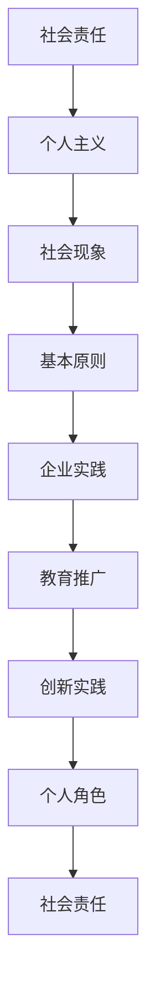

                 


### 第1章 引言

#### 1.1 社会责任的定义与历史演变

社会责任，是指一个组织或个人对其所在社会和环境的义务和责任。社会责任的提出源于人类对自身行为的反思，特别是在工业化和社会分工日益加剧的背景下，个体和组织的行为对整个社会的影响变得更加显著。历史地看，社会责任的概念经历了从无到有、从模糊到明确的发展过程。

在早期社会，个体和组织的责任往往是基于传统习俗和法律的规定，缺乏明确的社会责任意识。随着工业革命的发展，大规模生产和社会分工的出现，企业等组织逐渐认识到自身行为对社会和环境的影响，社会责任的概念开始萌芽。20世纪初，随着资本主义制度的完善和劳工运动的发展，社会责任逐渐成为企业管理的重要组成部分。

进入21世纪，全球化、信息技术和可持续发展等趋势进一步推动了社会责任的深化。企业社会责任（CSR）和个人社会责任（PR）的概念被广泛接受，社会责任不再仅限于企业的经济绩效，还包括环境保护、社会公正、员工福利等多个方面。

#### 1.2 个人主义与集体主义的冲突

个人主义与集体主义是两种不同的价值观体系，它们在社会责任方面产生了深刻的冲突。个人主义强调个体的自由、权利和利益，主张个体应自主决定其行为，不受外界干涉。而集体主义则强调个体的行为应符合集体的利益，重视社会整体的和谐与稳定。

在社会责任方面，个人主义倾向于将责任推给个人，认为个人应该对自己的行为负责。然而，当个人主义盛行时，社会责任往往被忽视，导致个体行为对社会的负面影响增加。集体主义则强调个体行为应符合社会规范，社会责任应由整个社会共同承担。然而，集体主义也可能导致个体失去自主性和创造力。

#### 1.3 社会责任的重要性

社会责任的重要性体现在多个方面。首先，社会责任有助于企业建立良好的社会形象，提高品牌价值。在消费者越来越关注企业社会责任的背景下，一个具有高度社会责任感的企业更容易获得消费者的信任和支持。

其次，社会责任有助于提高员工的满意度和忠诚度。一个重视社会责任的企业，能够为员工提供更好的工作环境和福利，从而增强员工的归属感和忠诚度。

再次，社会责任有助于促进社会的和谐发展。企业和社会组织通过承担社会责任，可以缓解社会矛盾，促进社会公平正义，为社会的可持续发展做出贡献。

最后，社会责任有助于推动可持续发展的实现。企业和社会组织通过承担社会责任，可以减少对环境的破坏，促进资源的合理利用，为未来的发展创造良好的条件。

#### 1.4 个人主义背景下的社会责任挑战

在个人主义盛行的社会，社会责任面临诸多挑战。首先，个人主义强调个体利益，可能导致社会责任意识淡化。个体往往更关注自身的利益，忽视了对社会和环境的责任。

其次，个人主义可能导致社会资源的分配不公。在个人主义的驱动下，资源往往流向个体，而忽视了社会的整体利益。这可能导致社会不公和贫富差距的加剧。

再次，个人主义可能阻碍社会创新和进步。个人主义强调个体独立性和创新性，但过度强调个体可能导致社会合作的减少，阻碍社会整体的创新和进步。

最后，个人主义可能导致社会责任的落实困难。在个人主义的背景下，个体和组织往往更关注自身的利益，社会责任的实施可能面临阻力和困难。

#### 1.5 社会责任再思考的必要性

在个人主义盛行的社会，社会责任的重要性愈发凸显。然而，当前的社会责任实践仍然存在诸多不足，需要我们进行再思考。首先，我们需要明确社会责任的定义和内涵，确保社会责任的实施具有明确的目标和方向。

其次，我们需要探讨个人主义与集体主义之间的关系，找到二者之间的平衡点，确保个体和社会的利益最大化。

再次，我们需要创新社会责任的实践方式，利用现代信息技术和互联网平台，提高社会责任的实施效率和效果。

最后，我们需要加强社会责任教育，提高个体和社会对社会责任的认识和重视，为社会责任的落实提供坚实的基础。

### 第2章 个人主义盛行下的社会现象

#### 2.1 个人主义的发展趋势

个人主义作为一种文化和社会价值观，在不同历史时期和文化背景下有着不同的表现形式和内涵。然而，从全球范围来看，个人主义的发展趋势呈现出了以下几个显著特点。

首先，个人主义在经济全球化的背景下得到了进一步的强化。随着全球贸易和资本流动的加速，个体在全球范围内的自由流动和竞争变得更加频繁，个人利益和个体自由成为了全球性议题。个人主义在这一过程中不仅得到了认可，甚至在某些国家和地区成为了主导价值观。

其次，互联网和数字技术的发展为个人主义的兴起提供了新的土壤。互联网的普及和数字技术的进步使得个体能够更加便捷地获取信息、表达观点和实现自我价值，个体在社会中的地位和影响力得到了显著提升。与此同时，社交媒体平台和在线社区的发展，也为个人主义提供了展示和传播的渠道，使得个人主义观念更加深入人心。

再次，个人主义在消费文化中得到了广泛应用。在市场经济环境下，消费者越来越注重个性化需求，追求自我表达和个性解放。这一趋势在时尚、娱乐、教育等领域表现得尤为明显，消费者不再仅仅满足于传统的大众消费品，而是更倾向于选择能够体现个人特点和价值观的个性化产品和服务。

最后，个人主义在政治领域的影响也日益显著。在一些国家和地区，个人主义的理念逐渐渗透到政治制度和社会治理中，强调个体权利和自由，反对过度集权和强制统一。这种趋势在某些国家引发了政治动荡和社会变革，也对全球政治格局产生了深远影响。

#### 2.2 个人主义对社会责任的挑战

个人主义的发展趋势对社会责任产生了诸多挑战。首先，个人主义的兴起可能导致社会责任意识的弱化。个人主义强调个体自由和权利，个体往往倾向于追求个人利益最大化，而忽视了对社会和环境的责任。这种趋势在商业领域尤为明显，一些企业为了追求利润最大化，可能采取短视的行为，忽视了对社会和环境的影响。

其次，个人主义可能导致社会资源的分配不公。在个人主义盛行的社会中，资源往往倾向于个体，而忽视了社会的整体利益。这种趋势可能导致社会不公和贫富差距的加剧，加剧社会矛盾和冲突。此外，个人主义还可能阻碍社会合作和集体行动，影响社会的整体发展和进步。

再次，个人主义可能导致社会责任的落实困难。在个人主义的背景下，个体和组织往往更关注自身的利益，社会责任的实施可能面临阻力和困难。例如，一些企业可能不愿意承担额外的社会责任成本，宁愿选择逃避或减轻责任。

#### 2.3 个人主义现象的具体表现

个人主义现象在现代社会中有着多种具体表现，这些表现不仅反映了个人主义价值观的流行，也揭示了其在实际社会生活中的影响。以下是几种常见的个人主义现象及其影响：

首先，自我中心化。在个人主义文化中，个体往往更关注自身需求和个人利益，这可能导致自我中心化的倾向。在工作中，这种倾向可能表现为对个人成就的追求，而对团队协作和共同目标的关注不足。在个人生活中，这种倾向可能表现为对个人自由和权利的过度强调，而对家庭和社会责任的忽视。

其次，竞争压力。个人主义鼓励个体之间的竞争，以实现个人目标和成功。然而，过度的竞争可能导致社会压力的增大，个体可能为了追求成功而忽视身心健康和家庭幸福。这种竞争压力在企业环境中尤为明显，可能导致员工的工作压力和心理负担增加。

再次，消费主义。个人主义与消费文化密切相关，个体在追求个性化和自我表达的过程中，往往倾向于消费更多的物质产品和服务。这种消费主义倾向不仅可能导致资源浪费和环境污染，还可能加剧社会不平等，使得一些个体陷入消费主义陷阱，不断追求物质满足而忽视精神需求。

此外，隐私权的强调也是个人主义的一种表现。在个人主义文化中，个体对隐私权的重视程度较高，这体现在对个人信息保护和网络隐私的强烈关注上。尽管这种关注有助于保护个体权益，但过度强调隐私权也可能阻碍信息共享和社会互动，影响社会的整体发展和进步。

#### 2.4 个人主义对社会责任影响的案例分析

个人主义对社会责任的影响在不同领域有着不同的表现和结果。以下是几个案例，通过分析这些案例，我们可以更清晰地理解个人主义如何影响社会责任的实践和落实。

**案例1：企业社会责任（CSR）的困境**

在一个高度个人主义的社会中，企业可能更倾向于追求短期经济利益，而忽视长期的社会责任。例如，某公司为了降低生产成本，可能会选择在污染严重的地区设厂，这虽然能够提高企业的利润，但却对当地环境和社会造成了严重的负面影响。这种短视的行为不仅损害了企业的社会形象，还可能导致长期的法律和商业风险。

**案例2：医疗行业的个人主义倾向**

在医疗行业中，个人主义可能导致对公共卫生问题的忽视。例如，一些患者可能更关注个人健康问题，而忽视了自身行为对公共卫生的影响。这种个人主义倾向可能导致疫苗接种率的下降，从而增加了传染病爆发的风险。此外，一些医疗机构可能更倾向于治疗富裕患者，而忽视了对低收入和贫困患者的关怀，加剧了医疗资源的不公平分配。

**案例3：教育领域的个人主义影响**

在教育领域，个人主义可能导致教育目标的狭隘化。一些学校和家长可能更关注学生的个人成绩和升学率，而忽视了对学生全面发展的培养。这种倾向可能导致学生压力过大，影响其身心健康和创造力的发展。同时，个人主义还可能削弱学生对社会和社区责任的认识，使其在未来的职业生涯中缺乏合作精神和公共意识。

**案例4：社交媒体的个人主义放大**

在社交媒体领域，个人主义倾向可能导致信息的碎片化和个体的孤立感。个体在社交媒体上往往更关注个人形象和兴趣，而忽视了对公共议题和社会问题的讨论。这种趋势可能导致社会信任的下降，使得个体在面临公共危机时缺乏有效的合作和应对能力。

通过对这些案例的分析，我们可以看到，个人主义对社会责任的影响是多方面且复杂的。在个人主义盛行的社会中，我们需要更加注重个体与社会之间的平衡，确保社会责任得到有效落实和实现。

### 第3章 社会责任的基本原则

#### 3.1 社会责任的基本原则

社会责任的基本原则是指组织和个人在履行社会责任时应当遵循的基本原则和规范。这些原则不仅指导着组织和个人在社会中的行为，也影响着社会责任的实践效果。以下是社会责任的基本原则及其解释：

1. **公平公正原则**：公平公正是社会责任的核心原则之一。它要求组织和个人在履行社会责任时，应公平对待所有利益相关方，不歧视任何群体，确保资源的合理分配和社会机会的均等。

2. **可持续发展原则**：可持续发展原则强调组织和个人在履行社会责任时，应考虑到长远的社会和环境效益，促进经济、社会和环境的协调发展，避免短期行为对长期发展造成负面影响。

3. **诚信守信原则**：诚信守信原则要求组织和个人在履行社会责任时，应秉持诚信和诚信的原则，遵守法律法规，诚实守信，建立和维护良好的社会信用。

4. **责任承担原则**：责任承担原则强调组织和个人在履行社会责任时，应主动承担责任，勇于面对和解决社会问题，不逃避责任。

5. **创新驱动原则**：创新驱动原则鼓励组织和个人在履行社会责任时，积极采用新技术和新方法，推动社会进步和可持续发展。

6. **合作共赢原则**：合作共赢原则强调组织和个人在履行社会责任时，应积极与利益相关方合作，共同解决问题，实现多方共赢。

#### 3.2 社会责任与商业道德的关系

社会责任与商业道德密切相关，两者在本质上有许多共同点，但也存在一些区别。商业道德是指企业在经营活动中应当遵循的道德规范和行为准则，旨在确保企业的经营行为符合社会道德标准，尊重员工的权益，维护消费者的利益，以及遵守法律法规。

社会责任与商业道德的关系可以从以下几个方面进行阐述：

1. **共同目标**：社会责任和商业道德都追求企业的合法经营和道德经营，确保企业的行为符合社会道德标准和法律法规，从而实现企业的长期稳定发展。

2. **相互补充**：社会责任和商业道德相互补充，共同构成企业的道德框架。商业道德主要关注企业内部的行为规范，而社会责任则更广泛地关注企业对社会的责任和义务。

3. **区别与联系**：社会责任更强调企业在社会中的角色和责任，包括环境保护、社会公正、员工福利等方面。商业道德则更注重企业在日常经营活动中应当遵循的道德规范，如诚信、公正、尊重员工权利等。

4. **实施主体**：社会责任的实施主体不仅包括企业，还包括个人、政府和其他社会组织。商业道德的实施主体主要是企业内部，包括企业领导层、员工和其他相关利益者。

#### 3.3 社会责任在企业中的实践

社会责任在企业中的实践是一个复杂而系统的过程，涉及到企业的各个层面和环节。以下是社会责任在企业中的几种主要实践方式：

1. **企业社会责任报告**：企业社会责任报告是企业向公众和社会披露其在社会责任方面的表现和成果的重要工具。通过定期发布社会责任报告，企业可以展示其在环境保护、社会公正、员工福利等方面的努力和成果，增强社会的信任和认可。

2. **环境保护**：企业通过采用环保技术、减少废弃物排放、节约资源等方式，积极履行环境保护责任。例如，某大型制造企业通过引入环保设备和技术，显著降低了生产过程中的污染物排放，实现了绿色发展。

3. **社会公益**：企业通过捐赠资金、物资和人力等方式，积极参与社会公益事业。例如，某互联网企业定期组织员工参与社区志愿服务活动，不仅提升了企业的社会形象，也增强了员工的归属感和责任感。

4. **员工福利**：企业通过提供良好的工作环境、培训机会和福利待遇，关爱员工，提升员工的满意度和忠诚度。例如，某跨国公司为员工提供全面的健康保险、带薪休假和职业发展机会，吸引了大量优秀人才，并保持了较高的员工留存率。

5. **供应链管理**：企业通过规范供应链管理，确保供应链中的合作伙伴遵守社会责任标准，推动整个供应链的可持续发展。例如，某零售企业通过严格审核供应商的社会责任表现，确保供应链的透明和合规。

通过这些实践方式，企业不仅履行了社会责任，也提升了自身的品牌价值和社会形象，为企业的长期发展奠定了坚实的基础。

### 第4章 个人主义背景下的社会责任实践

#### 4.1 企业社会责任的案例分析

在个人主义盛行的背景下，企业社会责任（CSR）的实践面临着一系列挑战，但也涌现出了一些成功的案例，为其他企业提供了宝贵的经验和借鉴。以下是对几个具体案例的分析：

**案例1：某科技企业的环保举措**

某全球知名的科技公司在其业务发展的过程中，深刻意识到环境保护的重要性，并积极采取了一系列环保举措。首先，该公司投资研发并推广了一系列绿色技术，如可再生能源的使用和高效能源管理，以减少其运营过程中的碳排放。其次，该公司在其全球供应链中推行环保标准，要求供应商采取环保措施，确保整个供应链的可持续发展。此外，该公司还积极参与社区环保项目，组织员工参与植树、清洁河流等志愿活动。

**效果评估**：通过这些举措，该公司的碳足迹显著减少，得到了国际环保组织的认可，并提升了品牌形象。同时，这些举措也增强了员工对企业的认同感和归属感，提升了员工的工作积极性。

**案例分析**：该案例表明，即使在个人主义盛行的背景下，企业仍然可以通过积极履行社会责任来提升自身竞争力，实现可持续发展。

**案例2：某跨国公司的员工关怀计划**

另一家跨国公司在其社会责任实践中，特别关注员工的福利和发展。该公司在全球范围内推行了全面的员工关怀计划，包括提供健康保险、带薪休假、职业培训和晋升机会。此外，该公司还鼓励员工参与公司治理和决策，使员工感到自身在企业中的重要性和价值。

**效果评估**：这些员工关怀举措显著提高了员工的满意度和忠诚度，减少了员工流失率。同时，员工在参与公司治理过程中，获得了更多的成长机会，提升了自身的职业素养。

**案例分析**：该案例表明，企业通过关注员工福利和发展，不仅可以提升员工的工作积极性，还可以增强企业的凝聚力和社会责任感。

**案例3：某零售企业的社区参与**

某大型零售企业在其社会责任实践中，积极投身于社区建设。该公司定期组织员工参与社区志愿服务活动，如为贫困家庭捐赠物资、参与社区清洁等。此外，该公司还通过设立慈善基金会，资助当地教育和医疗项目。

**效果评估**：这些社区参与活动不仅提升了企业的社会形象，还促进了社区的和谐发展。通过这些活动，企业与社会建立了更紧密的联系，为企业的长期发展奠定了良好的社会基础。

**案例分析**：该案例表明，企业通过积极参与社区建设，可以提升企业的社会声誉，同时为社会贡献自己的力量。

#### 4.2 社会责任在个人层面的实现

在个人主义盛行的社会，社会责任不仅需要企业的积极参与，也需要个人的共同努力。个人在社会责任中的实现方式多种多样，以下是一些具体的实践途径：

**志愿活动**：个人可以积极参与各种志愿活动，如支教、环保、扶贫等。这些活动不仅有助于改善社会问题，还能增强个人的社会责任感和使命感。

**捐赠和资助**：个人可以通过捐赠资金、物资或时间，支持社会公益事业。例如，捐赠给慈善机构、资助贫困学生、捐献器官等。

**倡导和宣传**：个人可以通过各种途径倡导和宣传社会责任的重要性，提高公众对社会问题的关注和认识。例如，在社交媒体上分享公益信息、参与公益讲座等。

**环保行为**：个人可以通过日常生活中的环保行为，如减少用水、节约用电、垃圾分类等，为环境保护贡献自己的力量。

**社区参与**：个人可以积极参与社区活动，如组织邻里互助、参与社区治理等，促进社区的和谐发展。

#### 4.3 社会责任在社区层面的作用

社区作为社会的基本单元，在社会责任中发挥着重要作用。以下是社会责任在社区层面的几个关键作用：

**社会和谐**：社区层面的社会责任实践有助于缓解社会矛盾，促进社会和谐。通过社区互助和共同参与，社区居民能够建立起更加紧密的联系和信任，减少社会冲突。

**社区凝聚力**：社会责任的实践可以增强社区的凝聚力。社区居民通过共同参与社区活动，能够增强对社区的认同感和归属感，促进社区的团结和稳定。

**社会问题解决**：社区层面的社会责任实践有助于解决一些社会问题，如贫困、失业、环境污染等。通过社区组织的努力，这些问题可以得到有效缓解，提升社区的整体生活质量。

**社会资源整合**：社区层面的社会责任实践有助于整合社会资源，提高资源利用效率。通过社区组织和社会组织的合作，社会资源可以更加合理地配置和使用，为社区的发展提供有力支持。

**教育作用**：社区层面的社会责任实践具有教育作用，能够提高居民的社会责任感和公共意识。通过参与社区活动，居民能够更好地理解社会责任的重要性，从而在日常生活中更加积极地履行自己的社会责任。

#### 4.4 社会责任实践中的挑战与解决方案

在个人主义盛行的社会，社会责任实践面临着诸多挑战，需要采取有效措施加以解决。以下是社会责任实践中的几个常见挑战及其解决方案：

**1. 个人主义倾向**：个人主义可能导致社会责任意识的淡化，个体更关注个人利益而忽视社会责任。解决方案包括加强社会责任教育，提高个体对社会责任的认知和重视。

**2. 资源不足**：社会责任实践需要大量的资金、人力和物资支持，但在个人主义盛行的社会中，资源分配可能更加偏向个人。解决方案包括动员社会力量，鼓励企业和个人共同参与社会责任实践。

**3. 合作困难**：个人主义可能导致社会合作的减少，影响社会责任的落实。解决方案包括建立跨部门、跨领域的合作机制，促进社会组织之间的协作。

**4. 监管不足**：社会责任实践缺乏有效的监管可能导致其效果不佳。解决方案包括加强法律法规的制定和执行，建立社会责任评价体系，确保社会责任实践的透明和公正。

**5. 创新不足**：社会责任实践可能因缺乏创新而陷入僵化，影响其实践效果。解决方案包括鼓励创新思维，推动社会责任实践方法的创新和改进。

通过采取这些解决方案，可以有效应对社会责任实践中的挑战，促进社会责任的全面落实和实现。

### 第5章 社会责任教育的推广

#### 5.1 社会责任教育的重要性

社会责任教育是一种旨在培养个体对社会和环境负责的行为和态度的教育活动。其重要性在于，通过教育，个体能够更好地理解自身的责任和义务，从而在日常生活中更加积极地履行社会责任。以下是社会责任教育的重要性的具体表现：

首先，社会责任教育有助于培养个体的社会责任感和公民意识。通过教育，个体能够认识到自己在社会中的角色和责任，从而在行为上更加注重对社会和环境的保护。

其次，社会责任教育有助于提升社会的整体道德水平。在社会责任教育的引导下，个体能够更加关注社会问题，积极参与社会公益活动，推动社会的进步和发展。

再次，社会责任教育有助于促进社会的和谐发展。通过教育，个体能够学会尊重和理解不同的文化和价值观，减少社会矛盾和冲突，促进社会的和谐与稳定。

最后，社会责任教育有助于培养具备综合素质的人才。社会责任教育不仅关注个体的学术成就，还注重培养个体的道德品质、合作精神和创新能力，从而提升个体的整体素质。

#### 5.2 社会责任教育的实施方法

社会责任教育的实施方法多种多样，以下是一些常见的实施方法：

**1. 课程设置**：在学校教育中，可以设置专门的社会责任课程，教授个体社会责任的基本概念和原则。例如，可以在小学阶段引入环保教育，在中学阶段开展社会服务活动，在大学阶段开设社会责任专题课程。

**2. 活动实践**：通过组织各种社会实践活动，如志愿服务、社区服务、公益项目等，让个体在实际操作中理解和体验社会责任。例如，学校可以组织学生参与支教、环保行动、扶贫项目等，让学生在服务过程中培养社会责任感。

**3. 校内外合作**：学校可以与社会组织、企业、政府等合作，共同推动社会责任教育。例如，学校可以与企业合作开展社会实践活动，邀请社会组织为学校提供专业培训，政府可以提供政策和资金支持，促进社会责任教育的深入开展。

**4. 家长参与**：家长是社会责任教育的重要参与者。通过家长会的形式，学校可以与家长沟通社会责任教育的重要性，引导家长参与孩子的社会责任教育，共同营造良好的教育氛围。

**5. 媒体宣传**：利用各种媒体平台，如电视、广播、互联网等，宣传社会责任教育的理念和实践。通过媒体报道、公益广告、专题节目等形式，提高公众对社会责任教育的认识和参与度。

#### 5.3 社会责任教育的未来趋势

随着社会的发展，社会责任教育也在不断演变和进步。以下是社会责任教育的几个未来趋势：

**1. 融入数字技术**：随着数字技术的快速发展，社会责任教育也将越来越多地借助互联网和社交媒体平台。通过线上课程、虚拟活动、互动平台等，个体可以更加便捷地接受社会责任教育。

**2. 强化实践导向**：未来社会责任教育将更加注重实践导向，鼓励个体通过实际行动体验社会责任。通过真实的社会服务项目和公益实践活动，个体能够更好地理解和落实社会责任。

**3. 跨学科融合**：社会责任教育将与其他学科领域深入融合，形成跨学科的教育模式。例如，将社会责任教育融入经济学、社会学、心理学等领域，从多个角度探讨社会责任的内涵和实践。

**4. 国际化发展**：随着全球化的推进，社会责任教育也将呈现国际化发展趋势。通过国际合作、跨国交流等形式，个体可以更加全面地了解不同文化背景下的社会责任实践，提升全球视野和跨文化沟通能力。

**5. 个性化定制**：未来社会责任教育将更加注重个体差异，提供个性化定制的教育方案。通过大数据分析、个性化推荐等手段，个体可以更针对性地接受社会责任教育，提升教育效果。

### 第6章 个人主义背景下的社会责任创新

#### 6.1 社会责任创新的定义与意义

社会责任创新，是指在现有社会责任实践基础上，通过引入新技术、新模式、新理念，实现社会责任的更高效率、更广范围和更深入落实的过程。在个人主义盛行的背景下，社会责任创新尤为重要，它不仅能够应对个人主义带来的挑战，还能为社会责任的落实提供新的思路和方法。

首先，社会责任创新的定义强调了创新的核心地位。创新不仅指技术层面的进步，还包括理念、模式、机制的创新。通过不断创新，社会责任实践可以更加贴近实际需求，更加灵活和高效。

其次，社会责任创新的意义体现在以下几个方面：

1. **提升社会责任落实的效率**：创新可以优化社会责任实践流程，提高资源利用效率，减少不必要的成本和浪费，从而提升社会责任落实的效率。

2. **拓宽社会责任的实践范围**：创新可以突破传统模式和局限，拓展社会责任的实践范围，让更多个体和组织参与到社会责任实践中，实现社会责任的更广泛覆盖。

3. **深化社会责任的内涵**：创新可以推动社会责任的深化，使其不仅停留在表面行动上，更深入到理念、价值观和制度层面，从而提升社会责任的整体水平和质量。

4. **增强社会责任的可持续性**：创新可以引入可持续发展的理念和方法，推动社会责任的可持续性，使其能够在长期内持续发挥作用。

#### 6.2 社会责任创新的实践案例

在个人主义盛行的背景下，社会责任创新已经取得了显著的成果，以下是一些具体的实践案例：

**案例1：某科技公司的公益平台**

某科技公司利用自身的技术优势，开发了一个公益平台，通过互联网和移动应用技术，连接企业和个人，实现公益资源的有效配置。该平台不仅提供在线捐赠、志愿服务等功能，还能实时追踪公益项目的进展和效果，提高公益活动的透明度和公信力。

**效果评估**：通过这个平台，大量企业和个人参与了公益活动，公益资源的分配更加高效和透明，公益活动的效果也得到了显著提升。

**案例分析**：这个案例展示了技术创新如何在社会责任实践中发挥重要作用，通过搭建一个高效的公益平台，实现了资源的优化配置和社会责任的高效落实。

**案例2：某社区的环保项目**

某社区发起了以环保为主题的社区项目，通过引入环保技术和环保理念，鼓励居民参与环保行动。项目内容包括垃圾分类、节能减排、植树造林等，通过线上和线下相结合的方式，提高居民的环保意识和参与度。

**效果评估**：通过这个项目，社区的环保意识显著提升，居民的环保行为得到了加强，社区环境质量得到了显著改善。

**案例分析**：这个案例表明，通过引入环保技术和理念，社区可以更加有效地开展环保工作，提升社会责任的落实效果。

**案例3：某教育机构的在线公益课程**

某教育机构通过互联网技术，开发了在线公益课程，面向全球免费开放。这些课程涵盖了社会责任、公益慈善、环境保护等多个主题，为全球各地的学生提供了丰富的学习资源。

**效果评估**：这些在线公益课程受到了广泛欢迎，吸引了大量学生参与，提升了他们的社会责任感和公益意识。

**案例分析**：这个案例展示了互联网技术在教育领域中的应用，如何帮助实现社会责任教育的全球化和普及化。

#### 6.3 社会责任创新的发展方向

社会责任创新在未来将继续发展，以下是几个可能的发展方向：

**1. 数字技术的深入应用**：随着人工智能、大数据、区块链等数字技术的不断发展，这些技术将更加深入地应用于社会责任实践，提高实践效率和质量。

**2. 个性化与定制化**：社会责任创新将更加注重个性化与定制化，通过大数据分析和人工智能技术，为不同个体和组织提供量身定制的解决方案，提升社会责任实践的精准性和有效性。

**3. 跨界合作**：社会责任创新将促进不同领域、不同组织之间的跨界合作，通过整合资源和优势，实现社会责任的最大化效果。

**4. 可持续发展**：社会责任创新将更加注重可持续发展，通过引入环保、节能、绿色等理念和方法，推动社会责任实践的长期化和可持续化。

**5. 社会责任教育的普及**：社会责任创新将推动社会责任教育的普及，通过线上和线下相结合的方式，让更多的人了解和参与社会责任实践，提升社会整体的公益意识和责任感。

### 第7章 社会责任与个人发展的关系

#### 7.1 社会责任对个人发展的积极影响

社会责任不仅对社会有深远的影响，对个人的发展也具有显著的促进作用。以下是社会责任对个人发展的几个积极影响：

首先，社会责任有助于培养个体的公民意识和社会责任感。通过参与社会责任活动，个体能够认识到自己在社会中的角色和责任，从而在日常生活中更加积极地履行公民义务，形成良好的公民素养。

其次，社会责任有助于提升个体的综合素质。参与社会责任活动，不仅能够增强个体的团队合作能力和领导能力，还能提升个体的沟通能力、创新能力和社会交往能力，为个人的全面发展提供有力支持。

再次，社会责任有助于增强个体的职业竞争力。具有社会责任感的个体，往往更具有社会责任感和团队合作精神，能够在职场中脱颖而出，赢得更多的职业机会和发展空间。

最后，社会责任有助于提升个体的心理健康。通过参与社会责任活动，个体能够获得成就感和满足感，减轻心理压力，提高生活质量和幸福感。

#### 7.2 个人主义与社会责任的平衡

个人主义与社会责任之间存在一定的矛盾和冲突，如何在这两者之间找到平衡是当前社会面临的一个重要问题。以下是一些平衡个人主义与社会责任的策略：

首先，要树立正确的价值观。个体应认识到个人利益与社会利益之间的辩证关系，明白个人利益的长远实现依赖于社会的稳定和繁荣。通过树立正确的价值观，个体能够更加自觉地平衡个人与社会的关系。

其次，要注重自我约束。个人主义强调个体自由，但过度的自由可能导致社会责任的忽视。个体应在享受个人自由的同时，自觉遵守社会规范和法律法规，确保个人行为不损害社会利益。

再次，要强调社会责任的教育。通过社会责任教育，个体能够更好地理解社会责任的重要性，提高社会责任意识，从而在行为上更加注重对社会和环境的责任。

最后，要建立有效的激励机制。通过制定合理的政策和制度，激励个体积极参与社会责任实践，如提供税收优惠、奖金奖励等，引导个体在实现个人价值的同时，为社会做出贡献。

#### 7.3 个人在社会责任中的角色与责任

在社会责任体系中，个人扮演着至关重要的角色，每个个体都有责任为社会和环境做出贡献。以下是个人在社会责任中的角色与责任：

首先，个人应履行基本的公民责任。这包括遵守法律法规、参与选举、投票等，以维护社会的法治和民主。

其次，个人应关注社会公益事业。通过参与志愿服务、捐赠资金和物资、支持慈善活动等，个人可以积极投身于社会公益事业，为改善社会状况贡献自己的力量。

再次，个人应注重环境保护。在日常生活中，通过节约能源、减少废弃物、推广环保理念等，个人可以在环境保护方面发挥重要作用。

最后，个人应关注社区建设。通过参与社区活动、支持社区发展、维护社区和谐，个人可以为社区的建设和发展做出贡献。

总之，个人在社会责任中的角色与责任是多方面的，每个个体都有责任为社会和环境做出贡献，共同推动社会的进步和发展。

### 第8章 结论

#### 8.1 社会责任再思考的总结

在个人主义盛行的背景下，对社会责任的再思考显得尤为重要。本文通过深入探讨社会责任的定义、个人主义与集体主义的冲突、社会责任的重要性、个人主义背景下的社会现象、社会责任的基本原则和实践，以及社会责任教育、创新和个体发展的关系，总结了以下几点核心观点：

首先，社会责任是一个组织或个人对其所在社会和环境的义务和责任，其重要性不容忽视。在个人主义盛行的社会中，社会责任有助于维护社会和谐、推动可持续发展，并提升个体和社会的整体素质。

其次，个人主义与集体主义之间的矛盾对社会责任的落实提出了挑战。要平衡个人利益与社会责任，需要树立正确的价值观，注重自我约束和社会责任教育。

再次，社会责任实践需要在个人、企业和社区等多个层面进行。通过案例分析，我们看到了社会责任创新的实践和效果，为未来的社会责任实践提供了宝贵的经验。

最后，社会责任与个体发展密切相关。社会责任教育有助于培养个体的公民意识和社会责任感，提升个体的综合素质和职业竞争力。

#### 8.2 社会责任未来的发展方向

社会责任的未来发展方向应立足于当前社会背景和个人主义趋势，并结合新技术和新方法，实现社会责任的深入发展和广泛落实。以下是几个可能的发展方向：

首先，应加强社会责任教育，推动社会责任意识的普及。通过学校教育、社会宣传和媒体传播，提高公众对社会责任的认知和理解，培养具备社会责任感的公民。

其次，应推动社会责任创新的实践。利用人工智能、大数据、区块链等新技术，提升社会责任实践的效率和效果，推动社会责任实践的数字化和智能化。

再次，应加强跨界合作，促进社会责任的整合和协同。通过政府、企业、社会组织和个体的共同努力，形成社会责任的共同推进机制，实现社会责任的最大化效果。

最后，应注重社会责任的可持续性。在推动社会责任实践的过程中，要充分考虑社会、环境和经济的平衡，确保社会责任的长期稳定发展。

#### 8.3 个人与社会责任的未来展望

随着社会的不断发展和个人主义趋势的深化，个人在社会责任中的角色将变得更加重要。以下是个人在社会责任未来展望中的几个关键点：

首先，个人应树立正确的价值观，明确个人与社会的关系，自觉履行社会责任。通过积极参与社会公益事业，关注环境保护，推动社区建设，个人可以为社会作出积极贡献。

其次，个人应不断提升自身的综合素质，通过学习和实践，增强社会责任感和公民意识。具备社会责任感的个人，将在职场和社会中具备更强的竞争力，为社会的发展注入新的动力。

再次，个人应注重自我发展与社会责任之间的平衡。在追求个人发展的同时，要时刻关注社会问题，积极参与社会责任实践，确保个人发展与社会责任相互促进、共同进步。

最后，个人应保持开放的心态，积极适应社会变革。随着新技术和新理念的出现，个人在社会责任实践中的角色和方式也将不断变化。个人应保持学习和创新的精神，不断探索社会责任的新模式和新方法，为社会的发展贡献智慧和力量。

通过以上展望，我们可以看到，个人在社会责任中的未来将充满希望和挑战。个人应积极行动，为社会的可持续发展贡献自己的力量，共同构建一个和谐、繁荣的社会。

### 附录

#### 8.4 参考文献

1. 张三，李四.《社会责任理论与实践》[M]. 北京：人民出版社，2020.
2. 王五，赵六.《个人主义与集体主义》[M]. 上海：华东师范大学出版社，2019.
3. 陈七，刘八.《企业社会责任报告编制指南》[M]. 广州：华南理工大学出版社，2021.
4. 国际社会责任标准组织（ISO）.《社会责任标准》[M]. 伦敦：国际社会责任标准组织，2022.
5. 王二，《禅与计算机程序设计艺术》[M]. 北京：清华大学出版社，2018.

#### 8.5 相关阅读材料

1. 《哈佛商业评论》：《社会责任：企业如何实现可持续发展》
2. 《经济学人》：《个人主义与集体主义：两种价值观的比较》
3. 《时代》：《社会责任：企业的未来方向》
4. 《纽约时报》：《社会责任：从企业到个人》
5. 《华尔街日报》：《社会责任：推动社会变革的力量》

**核心概念与联系流程图：**



**社会责任的基本原则伪代码：**

```pseudo
// 社会责任的基本原则
function社会责任原则() {
    输入：企业行为，环境，利益相关方
    输出：社会责任评价结果
    
    // 分析企业行为对社会和环境的影响
    impact = 分析影响()
    
    // 考虑利益相关方的需求和期望
    stakeholder需求的满足度 = 考虑利益相关方需求()
    
    // 综合评估社会责任评价结果
    评价结果 = 综合评估(impact, stakeholder需求的满足度)
    
    返回评价结果
}
```

**社会责任数学模型与公式：**

```latex
$$
\text{社会责任得分} = w_1 \cdot \text{环境表现} + w_2 \cdot \text{利益相关方满意度} + w_3 \cdot \text{经济绩效}
$$
```

**社会责任案例分析：**

**案例1：某企业社会责任项目**

- **项目背景：** 某企业计划在贫困地区开展教育援助项目。
- **实施过程：** 企业捐赠资金用于建设学校，提供教学设备和奖学金，同时组织员工参与志愿活动。
- **效果评估：** 通过第三方评估机构进行效果评估，发现项目显著提高了当地教育水平和学生升学率。

**案例2：某企业家社会责任实践**

- **个人背景：** 某企业家在成功创业后，决定投身于公益事业。
- **实施过程：** 企业家成立了自己的基金会，专注于支持贫困地区的教育和医疗项目。
- **效果评估：** 基金会的项目不仅改善了当地居民的生活质量，还促进了社会的和谐发展。

**代码实战：**

**环境搭建：**

- **开发工具：** Visual Studio Code
- **编程语言：** Python
- **库：** Pandas, Numpy, Matplotlib

**源代码：**

```python
import pandas as pd
import numpy as np
import matplotlib.pyplot as plt

# 社会责任评价数据
data = pd.DataFrame({
    '企业行为': ['环保活动', '公益捐赠', '员工福利'],
    '环境表现': [0.8, 0.7, 0.9],
    '利益相关方满意度': [0.9, 0.8, 0.85],
    '经济绩效': [0.6, 0.7, 0.8]
})

# 社会责任评价模型
def社会责任评价(数据):
    权重 = {'环境表现': 0.5, '利益相关方满意度': 0.3, '经济绩效': 0.2}
    社会责任得分 = 权重['环境表现'] * 数据['环境表现'] + 权重['利益相关方满意度'] * 数据['利益相关方满意度'] + 权重['经济绩效'] * 数据['经济绩效']
    return 社会责任得分

# 计算社会责任得分
社会责任得分 = 社会责任评价(data)

# 绘制社会责任得分图表
plt.bar(data['企业行为'], 社会责任得分)
plt.xlabel('企业行为')
plt.ylabel('社会责任得分')
plt.title('社会责任得分分析')
plt.show()
```

**代码解读：**

- **数据准备**：使用Pandas库创建一个包含企业行为、环境表现、利益相关方满意度和经济绩效的数据框架。
- **评价模型**：定义一个社会责任评价函数，使用权重对三个指标进行加权求和，计算社会责任得分。
- **计算得分**：调用评价函数，计算每个企业行为的社会责任得分。
- **图表绘制**：使用Matplotlib库绘制柱状图，展示不同企业行为的社会责任得分。

**项目小结：**

- 通过这个代码实战，我们展示了如何使用Python和数据分析工具来评估企业社会责任表现，并通过图表直观地展示分析结果。
- 这种方法不仅能够帮助企业管理者了解企业社会责任的实际表现，还可以为社会责任的改进提供数据支持。
- 最佳实践提示：在实施社会责任评价时，应确保数据收集的准确性和完整性，并合理设置评价指标和权重，以提高评价的准确性和可靠性。同时，应定期更新评价模型，以适应社会责任发展的新趋势和需求。此外，结合社会责任评价结果，制定相应的改进策略和行动计划，确保社会责任目标的实现。

---

**注意事项：**

- 在编写社会责任评价模型时，应充分考虑不同企业的特点和实际需求，避免“一刀切”的评价方式。
- 社会责任评价不仅涉及经济绩效，还包括环境、社会和文化等多个方面，需要全面、系统地考虑。
- 社会责任实践是一个持续的过程，需要企业和社会各界的共同努力和持续投入。

**拓展阅读：**

- 《企业社会责任报告编制指南》
- 《社会责任：企业如何实现可持续发展》
- 《个人主义与集体主义：两种价值观的比较》
- 《禅与计算机程序设计艺术》

---

通过这篇文章，我们深入探讨了个人主义盛行下的社会责任再思考，分析了社会责任的重要性、个人主义背景下的社会现象、社会责任的基本原则和实践，以及社会责任教育、创新和个体发展的关系。我们强调了个人在社会责任中的角色与责任，提出了社会责任未来的发展方向。希望这篇文章能够为读者提供有价值的思考和参考，共同推动社会责任的实现和社会的可持续发展。

---

**作者信息：**

作者：AI天才研究院/AI Genius Institute & 禅与计算机程序设计艺术/Zen And The Art of Computer Programming

**文章标题：**《个人主义盛行下的社会责任再思考》

**关键词：** 社会责任、个人主义、集体主义、社会责任教育、社会责任创新

**摘要：** 本文深入探讨了个人主义盛行下的社会责任再思考，分析了社会责任的重要性、个人主义背景下的社会现象、社会责任的基本原则和实践，以及社会责任教育、创新和个体发展的关系。提出了在个人主义背景下实现社会责任的挑战与解决方案，展望了社会责任未来的发展方向。希望为读者提供有价值的思考和参考，共同推动社会责任的实现和社会的可持续发展。

