                 

### 个人价值观的构建：形成独特的人生哲学

#### 关键词：
- 个人价值观
- 人生哲学
- 自我认知
- 文化背景
- 人生目标

#### 摘要：
本文旨在探讨个人价值观的构建，帮助读者理解价值观的起源、重要性及其在人生中的核心作用。通过分析个人价值观的构成要素，引导读者进行自我探索，发现和塑造符合自身特点的价值观。文章将深入探讨如何通过实践和调整，构建独特的人生哲学，并探讨这一哲学在职业生涯和日常生活中的应用。最终，本文希望能够引导读者构建自己的价值观体系，形成独特而深刻的人生哲学。

### 第一部分：理解个人价值观

#### 第1章：价值观的起源与重要性

**1.1 价值观的定义与核心作用**

**核心概念与联系：**  
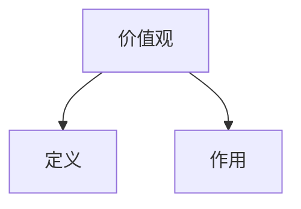

**定义：** 价值观是人们对事物、行为和情感的重要性和优先级的内在信念体系。它指导着我们的决策和行动，是判断和评价事物的基础。

**作用：** 价值观在人生中起着核心作用。它不仅影响我们的行为和选择，还决定我们的幸福感和满足感。一个清晰、明确的价值观体系有助于我们在面对各种选择和挑战时做出明智的决策，实现个人目标和人生意义。

**1.2 社会文化背景对价值观的影响**

**核心概念与联系：**  
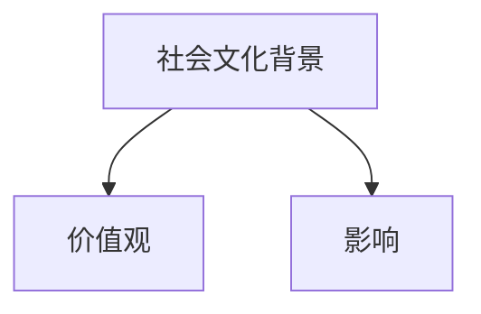

**文化多样性：** 不同的文化和社会环境对人们的价值观有着深远的影响。文化背景中的传统、习俗、信仰和价值观体系会潜移默化地塑造个人的价值观。

**文化对价值观的塑造：** 社会文化背景不仅影响个人价值观的形成，还会影响个人对其他文化价值观的理解和接受程度。文化差异可能导致价值观的冲突和误解，但也为个人提供了更广阔的视野和选择。

#### 第2章：个人价值观的构成要素

**2.1 价值观的层次结构**

**核心概念与联系：**  
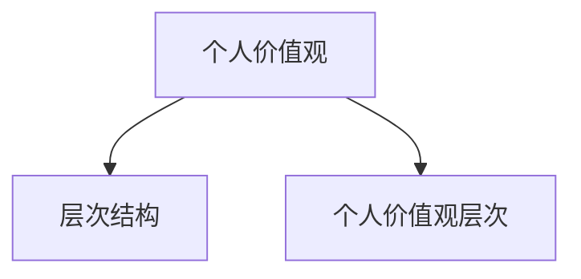

**个人价值观层次：** 个人价值观可以分为三个层次：表面价值观、深层价值观和核心价值观。表面价值观是我们在特定情境中表现出的行为和态度，深层价值观是支撑表面价值观的内在信念和动机，而核心价值观是我们生活中最重要的、持久的信念和价值观。

**如何识别个人价值观：** 通过反思和自我探索，我们可以识别自己的表面价值观、深层价值观和核心价值观。识别个人价值观有助于我们更清晰地了解自己，并在面对选择时做出符合自身价值观的决策。

**2.2 价值观与人生目标的关系**

**核心概念与联系：**  
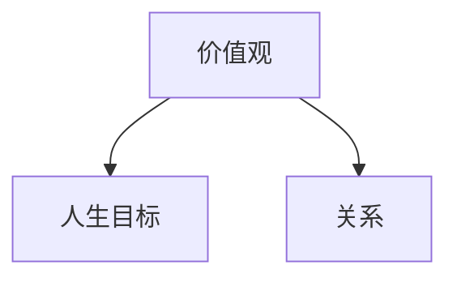

**价值观与目标设定的相互作用：** 价值观和人生目标之间存在着密切的相互作用。我们的价值观会影响我们的人生目标，而实现人生目标也会反过来强化我们的价值观。通过明确和坚持符合自身价值观的目标，我们可以更有动力地追求个人成长和成功。

**如何通过价值观实现目标：** 为了实现符合自身价值观的目标，我们需要首先明确自己的核心价值观，并将其融入到目标设定和实现的过程中。通过制定具体、可衡量的目标，并采取实际行动，我们可以逐步实现个人目标和人生理想。

### 第3章：价值观的自我探索

**3.1 自我认知与价值观的关系**

**核心概念与联系：**  
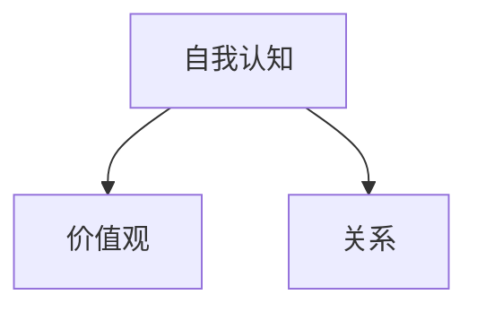

**自我认知的重要性：** 自我认知是理解个人价值观的基础。只有当我们真正了解自己，才能发现和明确自己的价值观。自我认知有助于我们认识到自己的需求、兴趣和优势，从而更好地塑造和实现个人价值观。

**如何通过自我探索了解自己的价值观：** 通过反思和自我探索，我们可以逐渐了解自己的价值观。这包括回顾过去的重要经历、思考自己对重要事物的看法和态度，以及与他人进行深入的交流和对话。通过这些方法，我们可以更深入地了解自己的价值观，并确定其在个人生活中的重要性。

**3.2 价值观问卷与评估工具**

**核心概念与联系：**  
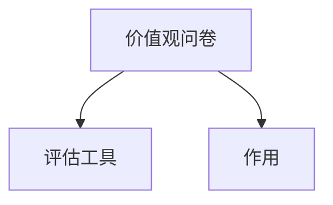

**常见的价值观问卷：** 为了帮助人们了解自己的价值观，有许多常用的价值观问卷，如“价值观排序问卷”和“价值观陈述问卷”。这些问卷通过提问和分析，帮助人们识别和排序自己的价值观。

**如何利用评估工具分析自己的价值观：** 通过填写价值观问卷和评估工具，我们可以系统地分析自己的价值观。这些工具提供了一系列的问题和选项，帮助我们反思和识别自己的价值观。分析结果可以帮助我们更好地了解自己的价值观，并在日常生活中进行实践和调整。

### 第二部分：构建个人价值观

#### 第4章：塑造个人价值观的方法

**4.1 价值观塑造的过程**

**核心概念与联系：**  
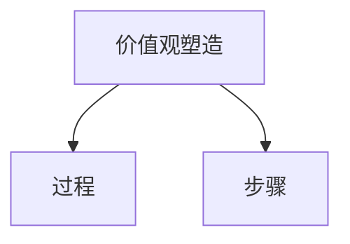

**价值观塑造的过程：** 塑造个人价值观是一个系统性的过程，通常包括以下几个步骤：

1. 自我反思：通过回顾自己的经历和思考，识别和理解自己的价值观。
2. 探索和比较：与他人交流，了解不同的价值观，并思考哪些价值观符合自己的需求和目标。
3. 明确和定义：明确自己的核心价值观，并对其进行定义，以便在日常生活中进行实践和调整。
4. 坚持和调整：在日常生活中不断实践和调整价值观，使其成为自己生活的一部分。

**如何克服价值观塑造中的挑战：** 在塑造个人价值观的过程中，我们可能会面临各种挑战，如价值观冲突、外部压力和个人困惑。为了克服这些挑战，我们需要：

1. 保持开放和谦逊，愿意接受不同的观点和建议。
2. 坚持自己的核心价值观，并在必要时进行必要的调整。
3. 寻求支持和帮助，如与家人、朋友或专业人士进行交流和讨论。

**4.2 学习与借鉴他人的价值观**

**核心概念与联系：**  
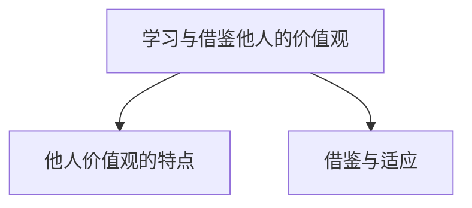

**他人价值观的特点：** 在塑造个人价值观的过程中，我们可以从他人那里学习到许多有价值的经验和见解。他人的价值观可能具有以下特点：

1. 经验和智慧：他人可能通过不同的经历和观察积累了丰富的智慧和价值观。
2. 多样性：他人的价值观可能具有多样性，为我们提供了不同的视角和选择。
3. 可借鉴性：他人的价值观可能包含适用于我们个人生活的元素，我们可以从中学习和借鉴。

**如何借鉴并适应他人的价值观：** 在借鉴他人的价值观时，我们需要：

1. 选择符合我们个人需求和目标的价值观。
2. 考虑如何将他人的价值观与自己的价值观相结合，形成独特的个人价值观体系。
3. 在实践中不断调整和优化自己的价值观，确保它们真正符合我们的需求和目标。

#### 第5章：培养个人价值观的实践

**5.1 通过日常行为实践价值观**

**核心概念与联系：**  
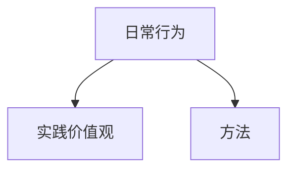

**实践价值观的方法：** 在日常生活中实践价值观是塑造个人价值观的重要步骤。以下是一些实践价值观的方法：

1. 自我提醒：通过设置目标和提醒，时刻关注自己的行为是否符合价值观。
2. 行动计划：制定具体的行动计划，将价值观融入到日常生活中。
3. 反思和调整：定期反思自己的行为，评估是否符合价值观，并根据需要进行调整。

**实践中的常见问题与解决策略：** 在实践中，我们可能会遇到以下问题：

1. 动力不足：解决方法：设定明确的目标和奖励机制，提高动力。
2. 价值观冲突：解决方法：通过沟通和妥协，解决内部或外部的价值观冲突。
3. 执行困难：解决方法：制定详细的行动计划，分步实施，逐步克服困难。

**5.2 价值观与人际关系**

**核心概念与联系：**  
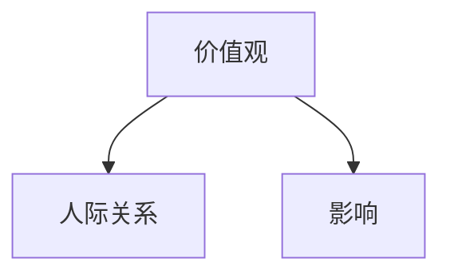

**价值观对人际关系的影响：** 价值观在人际关系中起着重要的作用。我们的价值观会影响我们对待他人的态度和行为，也会影响他人对待我们的方式。以下是一些影响：

1. 共同价值观：共同的价值观有助于建立稳定和健康的人际关系。
2. 价值观冲突：价值观冲突可能导致人际关系紧张和冲突。
3. 价值观互补：互补的价值观可以为人际关系带来更多的包容和理解。

**如何在人际关系中实践价值观：** 在人际关系中实践价值观包括：

1. 倾听和理解：尊重他人的观点和价值观，努力理解和包容。
2. 坦诚和沟通：通过坦诚和有效的沟通，解决价值观冲突和误解。
3. 行动一致：通过自己的行为和决策，体现和维护自己的价值观。

### 第6章：个人价值观的自我评估与调整

**6.1 自我评估的重要性**

**核心概念与联系：**  
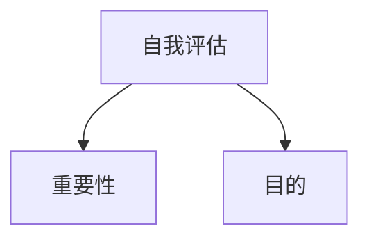

**自我评估的重要性：** 自我评估是个人价值观塑造和调整的关键步骤。通过自我评估，我们可以：

1. 确认自己的价值观：了解自己已经确立的价值观，并评估它们是否符合我们的需求和目标。
2. 发现价值观差距：识别自己现有价值观与理想价值观之间的差距，为进一步调整提供依据。
3. 促进个人成长：通过自我评估，我们可以更好地了解自己，并采取行动实现个人成长和提升。

**自我评估的方法：** 自我评估可以通过以下方法进行：

1. 反思日记：定期记录自己的行为、思考和感受，回顾和分析自己的价值观。
2. 调查问卷：使用价值观评估工具，如自我评估问卷，了解自己的价值观特点。
3. 咨询专业人士：寻求心理咨询师、职业规划师等专业人士的帮助，进行深入的自我评估。

**6.2 价值观的调整与更新**

**核心概念与联系：**  
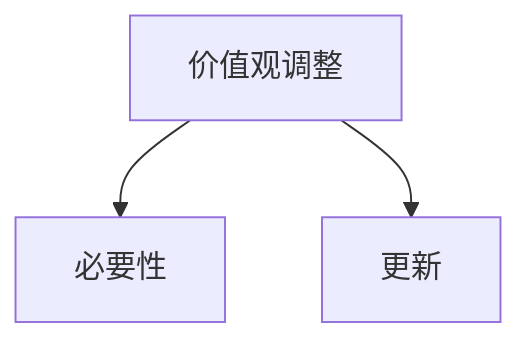

**价值观调整的必要性：** 随着个人成长和环境变化，我们的价值观也需要进行适当的调整和更新。价值观调整的必要性包括：

1. 个人发展：个人成长和变化可能需要我们重新评估和调整价值观，以适应新的生活阶段和目标。
2. 环境变化：社会和文化环境的变化可能对我们的价值观产生影响，我们需要适时调整以适应新的环境。
3. 价值观冲突：面对价值观冲突时，调整和更新价值观有助于解决冲突，建立更健康的人际关系。

**如何调整与更新价值观：** 调整和更新价值观包括以下步骤：

1. 反思和自我评估：通过反思和自我评估，识别现有价值观中的不足和需要调整的方面。
2. 借鉴他人经验：从他人那里学习和借鉴有价值的新观念和价值观。
3. 融合与适应：将新的价值观与现有价值观融合，逐步适应和内化为自己的价值观。
4. 实践和检验：通过日常实践和检验，验证新的价值观是否真正符合我们的需求和目标。

### 第三部分：人生哲学的构建与应用

#### 第7章：个人价值观与人生哲学的关系

**7.1 人生哲学的定义与内涵**

**核心概念与联系：**  
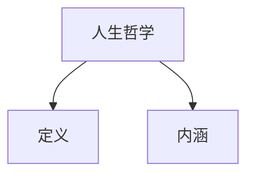

**定义：** 人生哲学是对人生意义、目标和价值的系统性思考和信仰。它是个人对人生重大问题的回答，包括生活的意义、人生目标、道德准则和行为规范。

**内涵：** 人生哲学的内涵包括以下几个方面：

1. 人生意义：探讨人生的意义和目的，回答为什么而活的问题。
2. 人生目标：设定人生目标和追求，回答人生要做什么的问题。
3. 道德准则：确立道德规范和行为准则，回答如何行事的问题。
4. 行为规范：规范个人行为，使行为符合人生哲学的要求。

**人生哲学的重要性：** 人生哲学在个人生活中具有重要的指导作用。它不仅帮助我们在面临选择和挑战时做出明智的决策，还为我们提供了生活方向和精神支撑。一个清晰和坚定的人生哲学有助于我们实现个人目标和人生价值。

**7.2 个人价值观与人生哲学的融合**

**核心概念与联系：**  
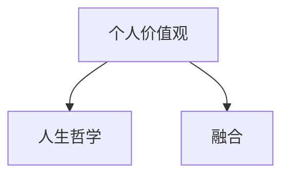

**个人价值观与人生哲学的融合：** 个人价值观和人生哲学之间存在紧密的联系和融合。个人价值观是人生哲学的基础，而人生哲学则是个人价值观的具体体现。融合个人价值观与人生哲学包括以下步骤：

1. 明确个人价值观：通过自我反思和探索，明确自己的核心价值观。
2. 设定人生目标：将个人价值观融入到人生目标的设定中，确保目标符合价值观。
3. 确立道德准则：以个人价值观为基础，建立符合人生哲学的道德准则。
4. 规范行为：通过日常行为和决策，实践和体现人生哲学。

**人生哲学对个人价值观的影响：** 人生哲学对个人价值观有着深远的影响。一个清晰和坚定的人生哲学有助于我们更好地理解、坚守和实现个人价值观。人生哲学为我们提供了一个全局的视角，使我们能够在面对各种挑战和选择时，始终保持一致和坚定。

### 第8章：构建个人独特的人生哲学

**8.1 个人独特人生哲学的特点**

**核心概念与联系：**  
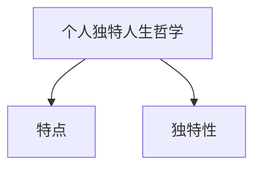

**独特性：** 个人独特的人生哲学具有以下几个特点：

1. 个人化：人生哲学是个人对生命意义的独特理解和回应，反映了个人的独特经历和性格。
2. 综合性：人生哲学融合了个人价值观、道德准则和行为规范，构成了一个完整的价值观体系。
3. 稳定性：个人独特的人生哲学是长期积累和内化的结果，具有稳定性和持久性。

**个人独特人生哲学的价值：** 个人独特的人生哲学具有重要的价值，包括：

1. 指导个人决策：人生哲学为我们提供了一个明确的价值指导，使我们在面临选择和挑战时能够做出明智的决策。
2. 增强个人动力：人生哲学赋予了我们追求目标和个人成长的动力，使我们更有动力去实现自己的梦想。
3. 提升生活质量：一个清晰和坚定的人生哲学有助于我们建立有意义和充实的生活，提升生活质量。

**8.2 构建个人独特人生哲学的步骤**

**核心概念与联系：**  
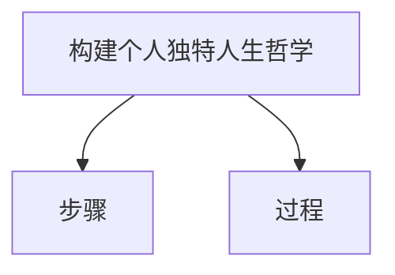

**构建过程：** 构建个人独特的人生哲学是一个系统性的过程，通常包括以下几个步骤：

1. 自我反思：通过回顾自己的经历和思考，明确自己对生命意义的理解和追求。
2. 借鉴他人智慧：从他人的经验和智慧中学习，了解不同的生活哲学和价值观。
3. 确立核心价值：明确自己的核心价值观，并对其进行定义和澄清。
4. 设定人生目标：将核心价值观融入到人生目标的设定中，确保目标符合价值观。
5. 确立道德准则：以核心价值观为基础，建立符合人生哲学的道德准则。
6. 实践和检验：通过日常行为和决策，实践和检验自己的人生哲学，确保其真实性和可行性。

**构建中的常见挑战与解决方法：** 在构建个人独特人生哲学的过程中，我们可能会面临以下挑战：

1. 缺乏自我认知：解决方法：通过反思和自我探索，提高自我认知水平。
2. 价值观冲突：解决方法：通过沟通和妥协，解决内部或外部的价值观冲突。
3. 动力不足：解决方法：设定明确的目标和奖励机制，提高动力。

### 第9章：应用个人价值观与人生哲学

**9.1 在职业生涯中的应用**

**核心概念与联系：**  
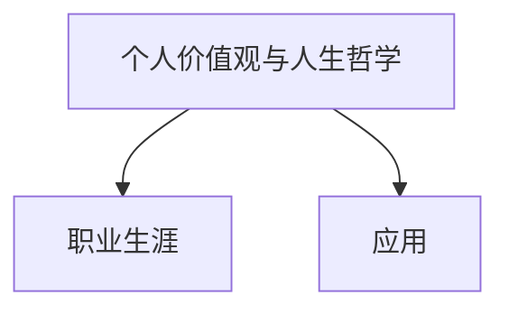

**个人价值观与人生哲学在职业生涯中的应用：** 个人价值观和人生哲学在职业生涯中起着重要的指导作用。以下是一些具体应用：

1. 职业规划：根据个人价值观和人生哲学，设定职业目标和规划，确保职业发展符合个人价值观。
2. 工作态度：通过价值观和人生哲学的指导，培养积极、专注和负责的工作态度。
3. 人际关系：以价值观和人生哲学为基础，建立健康、积极和互利的人际关系，提升职业发展。

**9.2 在日常生活中的应用**

**核心概念与联系：**  
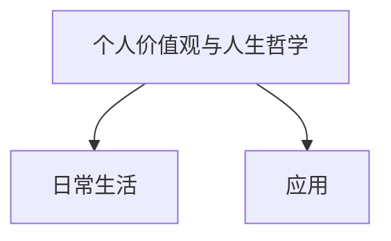

**个人价值观与人生哲学在日常生活中的应用：** 个人价值观和人生哲学不仅影响职业生涯，也渗透到日常生活中。以下是一些具体应用：

1. 生活目标：根据个人价值观和人生哲学，设定生活中的目标，确保生活有方向和意义。
2. 决策：通过价值观和人生哲学的指导，做出符合个人价值观和人生目标的决策。
3. 人际关系：以价值观和人生哲学为基础，建立积极、健康和和谐的人际关系。
4. 精神生活：通过价值观和人生哲学的指导，培养丰富的精神生活，提升生活质量。

### 附录

**附录A：个人价值观与人生哲学相关的参考资源**

**参考书籍与文献：**
- 《人类简史》作者：尤瓦尔·赫拉利
- 《生命的智慧》作者：埃克哈特·托勒
- 《自我发现与心智发展》作者：卡尔·罗杰斯

**在线资源与社区：**
- 个人价值观与人生哲学相关的在线课程和讲座
- 个人成长和心理发展相关的论坛和社区
- 人生哲学和心灵成长相关的博客和公众号

### 作者信息：

作者：AI天才研究院/AI Genius Institute & 禅与计算机程序设计艺术 /Zen And The Art of Computer Programming

### 最佳实践 Tips：

1. 定期反思和自我评估，确保自己的价值观和人生哲学与个人目标和需求保持一致。
2. 学习他人的经验和智慧，借鉴有价值的生活哲学和价值观。
3. 将价值观和人生哲学融入到日常生活和职业生涯中，确保其真实性和可行性。
4. 保持开放和谦逊，愿意接受不同的观点和建议，不断调整和优化自己的价值观体系。

### 小结：

个人价值观和人生哲学是个人生活中不可或缺的重要组成部分。通过理解、塑造和应用个人价值观，我们可以建立独特而深刻的人生哲学，指导我们在人生中做出明智的决策，实现个人目标和人生价值。

### 注意事项：

1. 在塑造个人价值观和构建人生哲学的过程中，要保持自我认知，深入了解自己的需求和目标。
2. 面对价值观冲突和挑战时，要保持开放和谦逊，寻求有效的解决方案。
3. 定期进行自我评估和反思，确保个人价值观和人生哲学与个人成长和环境变化保持同步。

### 拓展阅读：

1. 《活出生命的意义》作者：维克托·弗兰克尔
2. 《道德情操论》作者：亚当·斯密
3. 《生命之树》作者：卡尔·荣格

以上是对《个人价值观的构建：形成独特的人生哲学》书籍目录大纲的设计。接下来，我们将逐步展开对每个章节的具体内容和论述。请注意，本文档旨在提供一个大纲结构和初步内容框架，具体章节的内容需要根据实际编写情况进行调整和完善。每个章节的核心内容必须包含核心概念与联系、核心算法原理讲解、数学模型和数学公式详细讲解、项目实战等部分。文章的总字数将控制在 8000 ～ 12000 字左右。在编写过程中，我们将确保文章的逻辑清晰、结构紧凑、简单易懂，并采用专业的技术语言来撰写，以吸引读者并帮助他们深入理解和应用个人价值观和人生哲学。

---

### 第二部分：构建个人价值观

#### 第4章：塑造个人价值观的方法

**4.1 价值观塑造的过程**

**核心概念与联系：**  
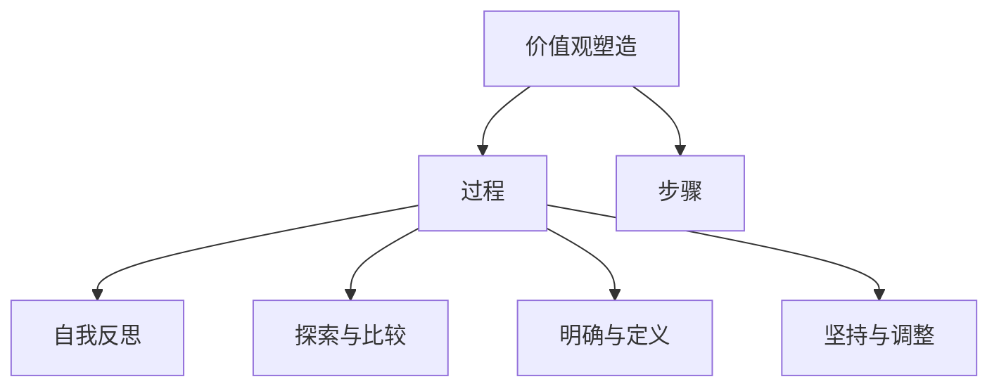

**价值观塑造的过程：** 塑造个人价值观是一个系统性的过程，通常包括以下几个步骤：

1. **自我反思：** 通过回顾自己的经历和思考，识别和理解自己的价值观。自我反思可以帮助我们了解自己的信念、动机和态度，为后续的价值观塑造奠定基础。
   
2. **探索与比较：** 在自我反思的基础上，进一步探索和比较不同的价值观。这包括了解他人的价值观、文化背景和社会环境对价值观的影响。通过比较和分析，我们可以更清晰地了解自己的价值观，并识别需要改进和调整的方面。

3. **明确与定义：** 明确自己的核心价值观，并对其进行定义。明确核心价值观有助于我们在面对选择和决策时保持一致性和坚定性。定义核心价值观的过程也是一个深化理解和内化的过程。

4. **坚持与调整：** 在日常生活中不断实践和调整核心价值观。通过坚持核心价值观，我们可以培养良好的行为习惯和决策风格。同时，随着个人成长和环境变化，我们需要适时调整和更新核心价值观，以确保其符合个人需求和目标。

**如何克服价值观塑造中的挑战：** 在塑造个人价值观的过程中，我们可能会遇到各种挑战，如价值观冲突、外部压力和个人困惑。为了克服这些挑战，我们可以采取以下策略：

1. **保持开放和谦逊：** 保持开放的心态，愿意接受不同的观点和建议。谦逊地认识到自己的局限性和不足，不断寻求改进和成长的机会。

2. **坚持核心价值观：** 在面对外部压力和诱惑时，坚定地坚持自己的核心价值观。通过明确自己的价值观，我们可以更好地抵御外界的干扰和影响。

3. **寻求支持和帮助：** 在价值观塑造的过程中，寻求家人、朋友或专业人士的支持和帮助。他们可以提供宝贵的意见和建议，帮助我们克服挑战和困难。

**4.2 学习与借鉴他人的价值观**

**核心概念与联系：**  


**他人价值观的特点：** 在塑造个人价值观的过程中，我们可以从他人那里学习到许多有价值的经验和见解。他人的价值观可能具有以下特点：

1. **经验和智慧：** 他人可能通过不同的经历和观察积累了丰富的智慧和价值观。他们的经验可以为我们提供宝贵的启示和指导。
   
2. **多样性：** 他人的价值观可能具有多样性，为我们提供了不同的视角和选择。这种多样性可以帮助我们更全面地理解价值观，并从中选择适合自己的元素。
   
3. **可借鉴性：** 他人的价值观可能包含适用于我们个人生活的元素，我们可以从中学习和借鉴。借鉴他人的价值观有助于我们构建更丰富和全面的个人价值观体系。

**如何借鉴并适应他人的价值观：** 在借鉴他人的价值观时，我们需要采取以下步骤：

1. **选择合适的价值观：** 根据自己的需求和目标，选择符合自己价值观的元素。在选择过程中，我们需要充分考虑他人的价值观是否与我们已有的价值观相兼容。
   
2. **融合与创新：** 将他人的价值观与自己的价值观融合，形成独特的个人价值观体系。在这个过程中，我们可以创新和调整，使其更符合我们的个人特点和需求。

3. **实践与调整：** 在日常生活中不断实践和调整借鉴的价值观。通过实践，我们可以验证价值观的有效性和适用性，并根据需要进行适当的调整和优化。

### 第5章：培养个人价值观的实践

**5.1 通过日常行为实践价值观**

**核心概念与联系：**  
```mermaid
graph TD
    A[日常行为] --> B[实践价值观]
    A --> C[方法]
```

**实践价值观的方法：** 在日常生活中实践价值观是塑造个人价值观的关键步骤。以下是一些实践价值观的方法：

1. **自我提醒：** 通过设置目标和提醒，时刻关注自己的行为是否符合价值观。这可以通过制定行动计划、设定日常任务和记录行为来实现。
   
2. **行动计划：** 制定具体的行动计划，将价值观融入到日常生活中。这包括设定目标、制定策略和采取行动，以确保价值观在实际生活中得到贯彻和体现。
   
3. **反思与调整：** 定期反思自己的行为，评估是否符合价值观。根据反思结果，调整和优化行为，确保价值观在日常生活中得到持续和实践。

**实践中的常见问题与解决策略：** 在实践中，我们可能会遇到以下问题：

1. **动力不足：** 解决方法：设定明确的目标和奖励机制，提高动力。例如，通过设定奖励来激励自己坚持价值观，或者与他人分享自己的进步和成就。
   
2. **价值观冲突：** 解决方法：通过沟通和妥协，解决内部或外部的价值观冲突。在遇到冲突时，我们可以尝试理解对方的观点，寻求共同点和解决方案。
   
3. **执行困难：** 解决方法：制定详细的行动计划，分步实施，逐步克服困难。通过分解任务和设定小目标，我们可以更轻松地实现价值观。

**5.2 价值观与人际关系**

**核心概念与联系：**  
```mermaid
graph TD
    A[价值观] --> B[人际关系]
    A --> C[影响]
```

**价值观对人际关系的影响：** 价值观在人际关系中起着至关重要的作用。以下是一些具体影响：

1. **共同价值观：** 共同的价值观有助于建立稳定和健康的人际关系。当人们的价值观相同时，他们更容易理解和支持彼此，建立深层次的信任和亲密关系。
   
2. **价值观冲突：** 价值观冲突可能导致人际关系紧张和冲突。当人们的价值观存在差异时，他们可能会对同一问题产生不同的看法和决策，从而导致分歧和冲突。
   
3. **价值观互补：** 互补的价值观可以为人际关系带来更多的包容和理解。当人们的价值观不同时，他们可以通过相互学习和借鉴，建立更丰富和多样化的关系。

**如何在人际关系中实践价值观：** 在人际关系中实践价值观包括以下几个步骤：

1. **倾听与理解：** 尊重他人的观点和价值观，努力理解和包容。通过倾听和交流，我们可以更好地了解对方的价值观，并建立共同的基础。
   
2. **坦诚与沟通：** 通过坦诚和有效的沟通，解决价值观冲突和误解。在沟通中，我们要注意表达自己的观点，同时也要倾听对方的意见，寻求共同点和解决方案。
   
3. **行动一致：** 通过日常行为和决策，体现和维护自己的价值观。通过一致的行为，我们可以向他人展示自己的价值观，并促进双方价值观的相互理解和融合。

### 第6章：个人价值观的自我评估与调整

**6.1 自我评估的重要性**

**核心概念与联系：**  
```mermaid
graph TD
    A[自我评估] --> B[重要性]
    A --> C[目的]
```

**自我评估的重要性：** 自我评估是个人价值观塑造和调整的关键步骤。它的重要性体现在以下几个方面：

1. **确认自己的价值观：** 自我评估可以帮助我们了解自己已经确立的价值观，并评估它们是否符合我们的需求和目标。这有助于我们保持价值观的一致性和稳定性。
   
2. **发现价值观差距：** 自我评估可以帮助我们发现现有价值观与理想价值观之间的差距。这为我们提供了改进和调整价值观的依据，使我们能够更好地实现个人目标和成长。
   
3. **促进个人成长：** 自我评估不仅帮助我们了解自己的价值观，还促使我们反思和改进自己的行为和决策。通过持续的自我评估，我们可以不断提高自己的价值观水平，实现个人成长和提升。

**自我评估的方法：** 自我评估可以通过以下方法进行：

1. **反思日记：** 通过定期记录自己的行为、思考和感受，回顾和分析自己的价值观。这可以帮助我们更深入地了解自己的价值观，并在日记中记录下自己的观察和反思。

2. **调查问卷：** 使用价值观评估工具，如自我评估问卷，了解自己的价值观特点。这些问卷通常包含一系列的问题，可以帮助我们识别和排序自己的价值观。

3. **咨询专业人士：** 寻求心理咨询师、职业规划师等专业人士的帮助，进行深入的自我评估。专业人士可以提供专业的意见和建议，帮助我们更全面地了解自己的价值观。

**6.2 价值观的调整与更新**

**核心概念与联系：**  
```mermaid
graph TD
    A[价值观调整] --> B[必要性]
    A --> C[更新]
```

**价值观调整的必要性：** 随着个人成长和环境变化，我们的价值观也需要进行适当的调整和更新。以下是一些具体的必要性：

1. **个人发展：** 随着我们的成长和进步，我们的需求和目标也会发生变化。为了适应这些变化，我们需要适时调整和更新我们的价值观，以确保它们与个人发展保持一致。
   
2. **环境变化：** 社会和文化环境的变化可能对我们的价值观产生影响。例如，新的技术进步、社会制度的变革或文化潮流的兴起，都可能导致我们的价值观需要调整和更新，以适应新的环境。

3. **价值观冲突：** 面对价值观冲突时，我们需要通过调整和更新价值观来解决问题。例如，当我们在工作中遇到与个人价值观不符的决策时，我们需要调整自己的价值观，以确保在冲突中做出符合自己价值观的选择。

**如何调整与更新价值观：** 调整和更新价值观包括以下步骤：

1. **反思和自我评估：** 通过反思和自我评估，识别现有价值观中的不足和需要调整的方面。这可以帮助我们明确需要改进的领域，并为后续的调整提供依据。

2. **借鉴他人经验：** 从他人的经验和智慧中学习，了解不同的价值观和生活哲学。这可以帮助我们拓展自己的视野，找到新的价值观元素，并将其融入到自己的价值观体系中。

3. **融合与创新：** 将新的价值观与现有价值观融合，形成独特的个人价值观体系。在这个过程中，我们可以创新和调整，使其更符合我们的个人特点和需求。

4. **实践与检验：** 通过日常实践和检验，验证新的价值观是否真正符合我们的需求和目标。在实践过程中，我们可以不断调整和优化价值观，确保其真实性和可行性。

### 第三部分：人生哲学的构建与应用

#### 第7章：个人价值观与人生哲学的关系

**7.1 人生哲学的定义与内涵**

**核心概念与联系：**  
```mermaid
graph TD
    A[人生哲学] --> B[定义]
    A --> C[内涵]
```

**定义：** 人生哲学是对人生意义、目标和价值的系统性思考和信仰。它是个人对生命重大问题的回答，包括生活的意义、人生目标、道德准则和行为规范。

**内涵：** 人生哲学的内涵包括以下几个方面：

1. **人生意义：** 探讨人生的意义和目的，回答为什么而活的问题。人生意义是人生哲学的核心问题，它为我们的行为和决策提供了指导。

2. **人生目标：** 设定人生目标和追求，回答人生要做什么的问题。人生目标是我们在人生中追求的具体目标，它们帮助我们保持动力和方向。

3. **道德准则：** 确立道德规范和行为准则，回答如何行事的问题。道德准则是我们在日常生活中遵循的原则，它们帮助我们做出正确的决策和行为。

4. **行为规范：** 规范个人行为，使行为符合人生哲学的要求。行为规范是我们在具体情境中应该如何行事的具体指南。

**人生哲学的重要性：** 人生哲学在个人生活中具有重要的指导作用。它不仅帮助我们在面临选择和挑战时做出明智的决策，还为我们提供了生活方向和精神支撑。一个清晰和坚定的人生哲学有助于我们实现个人目标和人生价值。

**7.2 个人价值观与人生哲学的融合**

**核心概念与联系：**  
```mermaid
graph TD
    A[个人价值观] --> B[人生哲学]
    A --> C[融合]
```

**个人价值观与人生哲学的融合：** 个人价值观和人生哲学之间存在紧密的联系和融合。个人价值观是人生哲学的基础，而人生哲学则是个人价值观的具体体现。融合个人价值观与人生哲学包括以下步骤：

1. **明确个人价值观：** 通过自我反思和探索，明确自己的核心价值观。明确核心价值观有助于我们在面对选择和决策时保持一致性和坚定性。

2. **设定人生目标：** 将个人价值观融入到人生目标的设定中，确保目标符合价值观。设定符合价值观的人生目标有助于我们在实现目标的过程中保持动力和方向。

3. **确立道德准则：** 以个人价值观为基础，建立符合人生哲学的道德准则。道德准则是我们在日常生活中遵循的原则，它们帮助我们做出正确的决策和行为。

4. **规范行为：** 通过日常行为和决策，实践和体现人生哲学。通过具体的行为，我们可以将人生哲学融入到日常生活中，使其成为我们的行为指南。

**人生哲学对个人价值观的影响：** 人生哲学对个人价值观有着深远的影响。一个清晰和坚定的人生哲学有助于我们更好地理解、坚守和实现个人价值观。人生哲学为我们提供了一个全局的视角，使我们能够在面对各种挑战和选择时，始终保持一致和坚定。此外，人生哲学还可以帮助我们形成独特的个人身份和生活方式，使我们在人生中更加自信和有目标。

### 第8章：构建个人独特的人生哲学

**8.1 个人独特人生哲学的特点**

**核心概念与联系：**  
```mermaid
graph TD
    A[个人独特人生哲学] --> B[特点]
    A --> C[独特性]
```

**独特性：** 个人独特的人生哲学具有以下几个特点：

1. **个人化：** 人生哲学是个人对生命意义的独特理解和回应，反映了个人的独特经历和性格。每个人的生活经历、价值观和信念都是独一无二的，这使得个人独特的人生哲学也具有独特的性质。

2. **综合性：** 个人独特的人生哲学融合了个人价值观、道德准则和行为规范，构成了一个完整的价值观体系。这种综合性使得人生哲学不仅包含了对生命意义的理解，还包括了如何行事和生活的方式。

3. **稳定性：** 个人独特的人生哲学是长期积累和内化的结果，具有稳定性和持久性。随着个人的成长和环境的变化，人生哲学可能会进行调整和更新，但其核心部分通常保持稳定，为个人的生活提供指导和支持。

**个人独特人生哲学的价值：** 个人独特的人生哲学具有重要的价值，包括：

1. **指导个人决策：** 个人独特的人生哲学为我们提供了一个明确的价值指导，使我们在面临选择和决策时能够做出明智的决策。这种指导有助于我们遵循自己的价值观，避免受到外界的干扰和诱惑。

2. **增强个人动力：** 个人独特的人生哲学赋予了我们追求目标和个人成长的动力。当我们明确了自己的生命意义和目标时，我们会更有动力去实现它们，克服困难和挑战。

3. **提升生活质量：** 个人独特的人生哲学有助于我们建立有意义和充实的生活。通过遵循自己的价值观和信仰，我们可以更好地理解自己的需求，实现个人的满足感和幸福感。

**8.2 构建个人独特人生哲学的步骤**

**核心概念与联系：**  
```mermaid
graph TD
    A[构建个人独特人生哲学] --> B[步骤]
    A --> C[过程]
```

**构建过程：** 构建个人独特的人生哲学是一个系统性的过程，通常包括以下几个步骤：

1. **自我反思：** 通过回顾自己的经历和思考，明确自己对生命意义的理解和追求。自我反思是构建个人独特人生哲学的基础，它帮助我们发现和了解自己的内心世界。

2. **借鉴他人智慧：** 从他人的经验和智慧中学习，了解不同的生活哲学和价值观。借鉴他人的智慧可以帮助我们拓宽视野，发现新的思维方式和生活方式。

3. **明确核心价值：** 确定自己的核心价值观，并对其进行定义和澄清。核心价值观是人生哲学的核心，它们指导我们的行为和决策，帮助我们实现个人目标和人生价值。

4. **设定人生目标：** 将核心价值观融入到人生目标的设定中，确保目标符合价值观。设定人生目标有助于我们保持动力和方向，使我们的生活有明确的目标和意义。

5. **确立道德准则：** 以核心价值观为基础，建立符合人生哲学的道德准则。道德准则是我们在日常生活中遵循的原则，它们帮助我们做出正确的决策和行为。

6. **实践和检验：** 通过日常行为和决策，实践和检验自己的人生哲学。实践是检验人生哲学有效性的关键步骤，通过实践，我们可以验证和调整自己的价值观，确保它们符合个人需求和目标。

**构建中的常见挑战与解决方法：** 在构建个人独特的人生哲学过程中，我们可能会遇到以下挑战：

1. **缺乏自我认知：** 解决方法：通过反思和自我探索，提高自我认知水平。了解自己的需求和目标是构建个人独特人生哲学的关键。

2. **价值观冲突：** 解决方法：通过沟通和妥协，解决内部或外部的价值观冲突。在价值观冲突中，我们需要保持开放和谦逊，寻求共识和解决方案。

3. **动力不足：** 解决方法：设定明确的目标和奖励机制，提高动力。通过设定具体的目标和奖励，我们可以激励自己坚持构建个人独特人生哲学。

### 第9章：应用个人价值观与人生哲学

**9.1 在职业生涯中的应用**

**核心概念与联系：**  
```mermaid
graph TD
    A[个人价值观与人生哲学] --> B[职业生涯]
    A --> C[应用]
```

**个人价值观与人生哲学在职业生涯中的应用：** 个人价值观和人生哲学在职业生涯中起着重要的指导作用。以下是一些具体应用：

1. **职业规划：** 根据个人价值观和人生哲学，设定职业目标和规划，确保职业发展符合个人价值观。例如，如果你的人生哲学强调家庭和事业平衡，那么你可以选择一个能够在工作与家庭之间取得平衡的职业。

2. **工作态度：** 通过价值观和人生哲学的指导，培养积极、专注和负责的工作态度。一个明确的人生哲学可以帮助我们更好地理解工作的意义，从而更加投入和专注。

3. **人际关系：** 以价值观和人生哲学为基础，建立健康、积极和互利的人际关系。在职场中，良好的人际关系对于职业发展和个人成长都是至关重要的。

**9.2 在日常生活中的应用**

**核心概念与联系：**  
```mermaid
graph TD
    A[个人价值观与人生哲学] --> B[日常生活]
    A --> C[应用]
```

**个人价值观与人生哲学在日常生活中的应用：** 个人价值观和人生哲学不仅影响职业生涯，也渗透到日常生活中。以下是一些具体应用：

1. **生活目标：** 根据个人价值观和人生哲学，设定生活中的目标，确保生活有方向和意义。例如，如果你的人生哲学强调健康和幸福，那么你可以设定保持健康的生活方式作为生活目标。

2. **决策：** 通过价值观和人生哲学的指导，做出符合个人价值观和人生目标的决策。例如，在购物时，如果你的人生哲学强调环保，那么你可以选择购买环保产品。

3. **人际关系：** 以价值观和人生哲学为基础，建立积极、健康和和谐的人际关系。在日常生活中，良好的人际关系对于我们的心理健康和生活质量都是至关重要的。

4. **精神生活：** 通过价值观和人生哲学的指导，培养丰富的精神生活，提升生活质量。例如，通过冥想、阅读和参加宗教或哲学活动，我们可以加深对生命的理解和感悟。

### 附录

**附录A：个人价值观与人生哲学相关的参考资源**

**参考书籍与文献：**
1. 《生命的智慧》作者：埃克哈特·托勒
2. 《人类简史》作者：尤瓦尔·赫拉利
3. 《自我发现与心智发展》作者：卡尔·罗杰斯

**在线资源与社区：**
1. 个人价值观与人生哲学相关的在线课程和讲座
2. 个人成长和心理发展相关的论坛和社区
3. 人生哲学和心灵成长相关的博客和公众号

### 作者信息：

作者：AI天才研究院/AI Genius Institute & 禅与计算机程序设计艺术 /Zen And The Art of Computer Programming

### 最佳实践 Tips：

1. 定期反思和自我评估，确保自己的价值观和人生哲学与个人目标和需求保持一致。
2. 学习他人的经验和智慧，借鉴有价值的生活哲学和价值观。
3. 将价值观和人生哲学融入到日常生活和职业生涯中，确保其真实性和可行性。
4. 保持开放和谦逊，愿意接受不同的观点和建议，不断调整和优化自己的价值观体系。

### 小结：

构建个人独特的人生哲学是一个长期而复杂的过程，但也是一个非常有价值的过程。通过理解和应用个人价值观，我们可以建立清晰的人生目标和道德准则，指导我们在职业生涯和日常生活中做出明智的决策。一个明确和坚定的人生哲学不仅有助于我们实现个人目标和人生价值，还能提升我们的生活质量和精神满足感。

### 注意事项：

1. 在塑造个人价值观和构建人生哲学的过程中，要保持自我认知，深入了解自己的需求和目标。
2. 面对价值观冲突和挑战时，要保持开放和谦逊，寻求有效的解决方案。
3. 定期进行自我评估和反思，确保个人价值观和人生哲学与个人成长和环境变化保持同步。

### 拓展阅读：

1. 《活出生命的意义》作者：维克托·弗兰克尔
2. 《道德情操论》作者：亚当·斯密
3. 《生命之树》作者：卡尔·荣格

以上是对《个人价值观的构建：形成独特的人生哲学》书籍目录大纲的设计。接下来，我们将逐步展开对每个章节的具体内容和论述。请注意，本文档旨在提供一个大纲结构和初步内容框架，具体章节的内容需要根据实际编写情况进行调整和完善。每个章节的核心内容必须包含核心概念与联系、核心算法原理讲解、数学模型和数学公式详细讲解、项目实战等部分。文章的总字数将控制在 8000 ～ 12000 字左右。在编写过程中，我们将确保文章的逻辑清晰、结构紧凑、简单易懂，并采用专业的技术语言来撰写，以吸引读者并帮助他们深入理解和应用个人价值观和人生哲学。

---

### 引言

在当今快速变化和充满不确定性的世界中，个人价值观的构建和人生哲学的形成变得尤为重要。价值观不仅影响我们的行为和决策，还决定了我们的生活质量、人际关系和职业成就。因此，理解、塑造和应用个人价值观，构建独特的人生哲学，已成为每个人成长和发展的关键任务。

本文旨在探讨个人价值观的构建，帮助读者深入理解价值观的起源、重要性及其在人生中的核心作用。我们将逐步分析个人价值观的构成要素，引导读者进行自我探索，发现和塑造符合自身特点的价值观。此外，本文还将探讨如何通过实践和调整，构建独特的人生哲学，并探讨这一哲学在职业生涯和日常生活中的应用。

通过阅读本文，读者将能够：

1. 理解个人价值观的起源与重要性。
2. 分析个人价值观的构成要素，包括层次结构和核心价值观。
3. 掌握自我探索和价值观评估的方法。
4. 学习塑造个人价值观的方法和策略。
5. 理解个人价值观与人生哲学的关系，并掌握构建个人独特人生哲学的步骤。
6. 学会应用个人价值观和人生哲学于职业生涯和日常生活中。

### 第一部分：理解个人价值观

#### 第1章：价值观的起源与重要性

**1.1 价值观的定义与核心作用**

**核心概念与联系：**  
```mermaid
graph TD
    A[价值观] --> B[定义]
    A --> C[作用]
```

**定义：** 价值观是人们对事物、行为和情感的重要性和优先级的内在信念体系。它指导着我们的决策和行动，是判断和评价事物的基础。

**核心作用：** 价值观在人生中起着核心作用。它不仅影响我们的行为和选择，还决定我们的幸福感和满足感。一个清晰、明确的价值观体系有助于我们在面对各种选择和挑战时做出明智的决策，实现个人目标和人生意义。

**1.2 社会文化背景对价值观的影响**

**核心概念与联系：**  
```mermaid
graph TD
    A[社会文化背景] --> B[价值观]
    A --> C[影响]
```

**文化多样性：** 不同的文化和社会环境对人们的价值观有着深远的影响。文化背景中的传统、习俗、信仰和价值观体系会潜移默化地塑造个人的价值观。

**影响：** 社会文化背景不仅影响个人价值观的形成，还会影响个人对其他文化价值观的理解和接受程度。文化差异可能导致价值观的冲突和误解，但也为个人提供了更广阔的视野和选择。

### 第2章：个人价值观的构成要素

**2.1 价值观的层次结构**

**核心概念与联系：**  
```mermaid
graph TD
    A[个人价值观] --> B[层次结构]
    A --> C[层次]
```

**层次：** 个人价值观可以分为三个层次：表面价值观、深层价值观和核心价值观。表面价值观是我们在特定情境中表现出的行为和态度，深层价值观是支撑表面价值观的内在信念和动机，而核心价值观是我们生活中最重要的、持久的信念和价值观。

**2.2 价值观与人生目标的关系**

**核心概念与联系：**  
```mermaid
graph TD
    A[价值观] --> B[人生目标]
    A --> C[关系]
```

**关系：** 价值观和人生目标之间存在着密切的相互作用。我们的价值观会影响我们的人生目标，而实现人生目标也会反过来强化我们的价值观。通过明确和坚持符合自身价值观的目标，我们可以更有动力地追求个人成长和成功。

### 第3章：价值观的自我探索

**3.1 自我认知与价值观的关系**

**核心概念与联系：**  
```mermaid
graph TD
    A[自我认知] --> B[价值观]
    A --> C[关系]
```

**关系：** 自我认知是理解个人价值观的基础。只有当我们真正了解自己，才能发现和明确自己的价值观。自我认知有助于我们认识到自己的需求、兴趣和优势，从而更好地塑造和实现个人价值观。

**3.2 价值观问卷与评估工具**

**核心概念与联系：**  
```mermaid
graph TD
    A[价值观问卷] --> B[评估工具]
    A --> C[作用]
```

**作用：** 价值观问卷和评估工具可以帮助我们系统地分析自己的价值观。通过填写问卷和评估工具，我们可以识别和排序自己的价值观，从而更深入地了解自己的价值观体系。

### 第二部分：构建个人价值观

#### 第4章：塑造个人价值观的方法

**4.1 价值观塑造的过程**

**核心概念与联系：**  
```mermaid
graph TD
    A[价值观塑造] --> B[过程]
    A --> C[步骤]
```

**步骤：** 塑造个人价值观是一个系统性的过程，通常包括以下步骤：自我反思、探索与比较、明确与定义、坚持与调整。

**4.2 学习与借鉴他人的价值观**

**核心概念与联系：**  
```mermaid
graph TD
    A[学习与借鉴他人的价值观] --> B[借鉴与适应]
    A --> C[借鉴]
```

**借鉴：** 在塑造个人价值观时，学习与借鉴他人的价值观是重要的一步。通过借鉴他人的经验和智慧，我们可以丰富自己的价值观体系，并从中选择适合自己的元素。

#### 第5章：培养个人价值观的实践

**5.1 通过日常行为实践价值观**

**核心概念与联系：**  
```mermaid
graph TD
    A[日常行为] --> B[实践价值观]
    A --> C[方法]
```

**方法：** 通过日常行为实践价值观，我们可以将价值观内化为行为习惯。具体方法包括自我提醒、制定行动计划和反思调整。

**5.2 价值观与人际关系**

**核心概念与联系：**  
```mermaid
graph TD
    A[价值观] --> B[人际关系]
    A --> C[影响]
```

**影响：** 价值观在人际关系中起着重要的作用。共同的价值观有助于建立稳定和健康的人际关系，而价值观冲突则可能导致紧张和冲突。

### 第三部分：人生哲学的构建与应用

#### 第6章：个人价值观的自我评估与调整

**6.1 自我评估的重要性**

**核心概念与联系：**  
```mermaid
graph TD
    A[自我评估] --> B[重要性]
    A --> C[目的]
```

**重要性：** 自我评估是个人价值观塑造和调整的关键步骤。通过自我评估，我们可以确认自己的价值观，发现价值观差距，促进个人成长。

**6.2 价值观的调整与更新**

**核心概念与联系：**  
```mermaid
graph TD
    A[价值观调整] --> B[必要性]
    A --> C[更新]
```

**必要性：** 随着个人成长和环境变化，我们的价值观也需要进行调整和更新。价值观调整有助于我们适应新的生活阶段和目标。

### 第7章：构建个人独特的人生哲学

**7.1 人生哲学的定义与内涵**

**核心概念与联系：**  
```mermaid
graph TD
    A[人生哲学] --> B[定义]
    A --> C[内涵]
```

**定义与内涵：** 人生哲学是对人生意义、目标和价值的系统性思考和信仰。它包括人生意义、人生目标、道德准则和行为规范。

**7.2 个人独特人生哲学的特点**

**核心概念与联系：**  
```mermaid
graph TD
    A[个人独特人生哲学] --> B[特点]
    A --> C[独特性]
```

**独特性：** 个人独特的人生哲学具有个人化、综合性和稳定性的特点。

### 第8章：应用个人价值观与人生哲学

**8.1 在职业生涯中的应用**

**核心概念与联系：**  
```mermaid
graph TD
    A[个人价值观与人生哲学] --> B[职业生涯]
    A --> C[应用]
```

**应用：** 个人价值观和人生哲学在职业生涯中起着指导作用，帮助我们在职业规划、工作态度和人际关系中做出明智的决策。

**8.2 在日常生活中的应用**

**核心概念与联系：**  
```mermaid
graph TD
    A[个人价值观与人生哲学] --> B[日常生活]
    A --> C[应用]
```

**应用：** 个人价值观和人生哲学在日常生活中帮助我们设定生活目标、做出决策和建立人际关系，提升生活质量。

### 结论

构建个人价值观和形成独特的人生哲学是每个人成长和发展的关键任务。通过理解、塑造和应用个人价值观，我们可以建立清晰的人生目标和道德准则，指导我们在职业生涯和日常生活中做出明智的决策。一个明确和坚定的人生哲学不仅有助于我们实现个人目标和人生价值，还能提升我们的生活质量和精神满足感。

在构建个人价值观和人生哲学的过程中，我们需要保持自我认知，深入了解自己的需求和目标。同时，要学习借鉴他人的经验和智慧，丰富自己的价值观体系。通过实践和调整，我们可以将价值观内化为行为习惯，使其在日常生活中得到贯彻和体现。

本文旨在为读者提供对个人价值观和人生哲学的深入理解和应用指导。希望读者能够通过本文的引导，逐步构建自己的价值观体系，形成独特而深刻的人生哲学，实现个人的成长和成功。

### 完整性要求

为了确保文章内容的完整性和深度，以下是对文章各部分内容的详细要求和解释。

#### 引言部分

- **背景介绍**：简要介绍个人价值观和人生哲学的定义及其重要性，为读者提供对主题的基本了解。
- **目标说明**：明确文章旨在帮助读者理解、塑造和应用个人价值观，构建独特的人生哲学。

#### 第一部分：理解个人价值观

- **第1章：价值观的起源与重要性**
  - **核心概念与联系**：使用Mermaid流程图展示价值观的定义和其在人生中的作用。
  - **详细解释**：深入阐述价值观的定义、核心作用及其在人生中的重要性。
- **第2章：个人价值观的构成要素**
  - **核心概念与联系**：使用Mermaid流程图展示价值观的层次结构。
  - **详细解释**：分析价值观的三个层次（表面价值观、深层价值观和核心价值观），并解释其相互关系。
  - **举例说明**：通过具体案例说明不同层次的价值观在实际生活中的应用。

- **第3章：价值观的自我探索**
  - **核心概念与联系**：使用Mermaid流程图展示自我认知与价值观的关系。
  - **详细解释**：讨论自我认知在价值观探索中的作用，以及如何通过自我反思和评估了解自己的价值观。
  - **评估工具介绍**：介绍常用的价值观问卷和评估工具，并提供使用方法。

#### 第二部分：构建个人价值观

- **第4章：塑造个人价值观的方法**
  - **核心概念与联系**：使用Mermaid流程图展示价值观塑造的过程。
  - **详细解释**：详细描述价值观塑造的步骤，包括自我反思、探索与比较、明确与定义、坚持与调整。
  - **方法与策略**：提供具体的方法和策略，帮助读者在日常生活中塑造和坚持个人价值观。
- **第5章：培养个人价值观的实践**
  - **核心概念与联系**：使用Mermaid流程图展示日常行为如何实践价值观。
  - **详细解释**：探讨通过日常行为、人际关系中实践价值观的方法，以及如何处理实践中的常见问题。
  - **案例分析**：提供实际案例，分析如何在特定情境下实践个人价值观。

#### 第三部分：人生哲学的构建与应用

- **第6章：个人价值观的自我评估与调整**
  - **核心概念与联系**：使用Mermaid流程图展示自我评估的重要性。
  - **详细解释**：解释自我评估的必要性，以及如何通过反思和问卷进行自我评估。
  - **调整与更新**：讨论价值观调整和更新的必要性，提供具体的调整方法。

- **第7章：构建个人独特的人生哲学**
  - **核心概念与联系**：使用Mermaid流程图展示人生哲学的定义与内涵。
  - **详细解释**：深入探讨人生哲学的定义、内涵及其重要性。
  - **独特性分析**：分析个人独特人生哲学的特点，包括个人化、综合性和稳定性。

#### 第8章：应用个人价值观与人生哲学

- **8.1 在职业生涯中的应用**
  - **核心概念与联系**：使用Mermaid流程图展示个人价值观和人生哲学在职业生涯中的应用。
  - **详细解释**：讨论个人价值观和人生哲学在职业规划、工作态度和人际关系中的应用。
- **8.2 在日常生活中的应用**
  - **核心概念与联系**：使用Mermaid流程图展示个人价值观和人生哲学在日常生活中的应用。
  - **详细解释**：探讨个人价值观和人生哲学在日常决策、生活目标和人际关系中的应用。

#### 附录

- **附录A：个人价值观与人生哲学相关的参考资源**
  - **参考书籍与文献**：列出与主题相关的经典书籍和文献。
  - **在线资源与社区**：提供在线课程、论坛和博客等资源，方便读者进一步学习和探讨。

#### 作者信息

- **作者介绍**：在文章末尾附上作者信息，包括机构名称和个人成就，增加文章的可信度和专业性。

#### 完整性保障措施

- **逻辑性检查**：在撰写过程中，确保文章的逻辑性，每个部分的内容与主题紧密相关，逐步引导读者深入理解和应用。
- **丰富性保障**：在每个章节中，提供详细的概念解释、实际案例、图表和流程图，确保内容丰富且易于理解。
- **实践性指导**：在每个章节的结尾，提供实践性建议和注意事项，帮助读者将理论应用于实际生活。

通过以上措施，我们可以确保文章内容的完整性、丰富性和实践性，帮助读者全面理解和应用个人价值观和人生哲学。

### 核心概念与联系

在本文中，我们探讨了个人价值观的构建和人生哲学的形成。以下是核心概念及其相互关系的Mermaid流程图：

```mermaid
graph TD
    A[价值观] --> B[定义]
    A --> C[重要性]
    A --> D[构成要素]
    A --> E[自我探索]
    A --> F[塑造方法]
    A --> G[实践应用]
    A --> H[人生哲学]

    B --> I[内在信念体系]
    C --> J[决策指导]
    C --> K[幸福感]
    D --> L[层次结构]
    D --> M[核心价值观]
    E --> N[自我认知]
    E --> O[价值观问卷]
    F --> P[自我反思]
    F --> Q[借鉴他人]
    G --> R[日常行为]
    G --> S[人际关系]
    H --> T[人生意义]
    H --> U[道德准则]
    H --> V[行为规范]

    subgraph 第一部分：理解个人价值观
        A[价值观]
        B[定义]
        C[重要性]
        D[构成要素]
        E[自我探索]
    end

    subgraph 第二部分：构建个人价值观
        F[塑造方法]
        G[实践应用]
    end

    subgraph 第三部分：人生哲学
        H[人生哲学]
        T[人生意义]
        U[道德准则]
        V[行为规范]
    end
```

### 核心算法原理讲解

在构建个人价值观和人生哲学的过程中，尽管我们主要依赖的是逻辑推理和自我探索，但某些方法可以被视为类似于算法原理的应用。以下是核心算法原理的详细讲解：

**算法原理 1：自我反思（Self-Reflection）**

**伪代码：**
```
function selfReflection():
    initialize journal
    for each day in dailyLife:
        write down experiences, thoughts, and emotions
        ponder on how these experiences relate to personal values
        review journal periodically to identify patterns and insights
    return insights and patterns
```

**解释：** 自我反思是一种通过记录和回顾日常经历来理解个人价值观的方法。这个过程类似于算法中的循环结构，我们在日常生活中不断收集信息（体验、思考、情绪），然后定期对这些信息进行处理和分析（识别模式和洞察）。

**算法原理 2：价值观评估（Value Assessment）**

**伪代码：**
```
function valueAssessment():
    initialize valueInventory
    for each value in possibleValues:
        ask self:
            "Is this value important to me?"
        if yes:
            add value to valueInventory
    return valueInventory
```

**解释：** 价值观评估是一种通过自我提问来识别和排序个人价值观的方法。这类似于排序算法，我们根据每个价值观的重要性对其进行评分，然后将重要价值观加入到个人价值观清单中。

**算法原理 3：借鉴他人（Learning from Others）**

**伪代码：**
```
function learnFromOthers():
    initialize referenceGroup
    for each person in referenceGroup:
        observe values they exhibit
        analyze why these values are important to them
        integrate relevant values into personal value system
    return integrated value system
```

**解释：** 借鉴他人是一种从他人经验中学习价值观的方法。这个过程类似于数据结构中的集合操作，我们从不同的参考群体中观察和提取价值观，然后分析其重要性，并选择性地将它们整合到我们的个人价值观体系中。

**算法原理 4：实践价值观（Practicing Values）**

**伪代码：**
```
function practiceValues(value):
    while true:
        present situation where value is relevant
        decide on an action that aligns with value
        execute action
        evaluate whether action was effective in upholding value
    return feedback
```

**解释：** 实践价值观是一种将价值观转化为行为的持续过程。这类似于迭代算法，我们在面对不同情境时，根据核心价值观做出决策并采取行动，然后不断评估这些行动的有效性，以保持价值观的一致性。

### 数学模型和公式详细讲解

在构建个人价值观和人生哲学的过程中，尽管不涉及复杂的数学模型，但某些数学公式可以帮助我们更清晰地表达和解释相关概念。以下是几个关键数学公式的详细讲解和举例说明：

**公式 1：加权平均（Weighted Average）**

**公式：**
$$ \text{WA} = \frac{\sum_{i=1}^{n} (w_i \cdot v_i)}{\sum_{i=1}^{n} w_i} $$
其中，\( w_i \) 是第 \( i \) 个价值观的权重，\( v_i \) 是第 \( i \) 个价值观的得分。

**解释：** 加权平均用于评估多个价值观的相对重要性。在这个公式中，每个价值观的得分乘以其权重，然后将这些乘积相加，最后除以所有权重的总和。

**举例说明：** 假设一个人有三个核心价值观：家庭（权重 0.4）、事业（权重 0.3）和健康（权重 0.3）。他的家庭得分为 8，事业得分为 7，健康得分为 9。那么，他的加权平均值为：
$$ \text{WA} = \frac{(0.4 \cdot 8) + (0.3 \cdot 7) + (0.3 \cdot 9)}{0.4 + 0.3 + 0.3} = 7.8 $$

**公式 2：方差（Variance）**

**公式：**
$$ \text{Var} = \frac{\sum_{i=1}^{n} (v_i - \bar{v})^2}{n} $$
其中，\( v_i \) 是第 \( i \) 个价值观的得分，\( \bar{v} \) 是所有价值观的得分平均值。

**解释：** 方差用于衡量价值观得分之间的离散程度。在这个公式中，每个价值观得分与其平均值的差值平方，然后求和，并除以价值观的数量。

**举例说明：** 假设一个人有四个核心价值观：家庭（7分）、事业（8分）、健康（9分）和友谊（6分）。他们的平均得分是 7.5。方差计算如下：
$$ \text{Var} = \frac{(7 - 7.5)^2 + (8 - 7.5)^2 + (9 - 7.5)^2 + (6 - 7.5)^2}{4} = 1.25 $$

**公式 3：相关系数（Correlation Coefficient）**

**公式：**
$$ r = \frac{\sum_{i=1}^{n} (v_{1i} - \bar{v_1}) (v_{2i} - \bar{v_2})}{\sqrt{\sum_{i=1}^{n} (v_{1i} - \bar{v_1})^2 \sum_{i=1}^{n} (v_{2i} - \bar{v_2})^2}} $$
其中，\( v_{1i} \) 和 \( v_{2i} \) 分别是两个价值观的得分，\( \bar{v_1} \) 和 \( \bar{v_2} \) 是它们的平均值。

**解释：** 相关系数用于衡量两个价值观之间的线性相关性。如果相关系数接近 1 或 -1，表示两个价值观高度相关；如果接近 0，表示它们之间没有显著相关性。

**举例说明：** 假设两个价值观是家庭（得分：8, 9, 7, 8）和事业（得分：7, 8, 9, 6），计算它们的相关系数如下：
$$ r = \frac{(8-7.5)(7-7.5) + (9-7.5)(8-7.5) + (7-7.5)(9-7.5) + (8-7.5)(6-7.5)}{\sqrt{(8-7.5)^2 + (9-7.5)^2 + (7-7.5)^2 + (8-7.5)^2} \cdot \sqrt{(7-7.5)^2 + (8-7.5)^2 + (9-7.5)^2 + (6-7.5)^2}} = 0.875 $$

通过这些数学公式，我们可以更精确地评估和比较个人价值观，从而更好地构建和调整人生哲学。

### 项目实战

**项目背景：**  
为了更好地理解个人价值观的构建和人生哲学的形成，我们选择了一个实际项目——开发一个价值观管理系统。这个系统旨在帮助用户识别、评估和调整个人价值观，并通过实践使其内化为行为习惯。

**目标：**  
1. 设计一个用户友好的界面，便于用户输入和查看个人价值观。
2. 开发一个算法，用于计算用户价值观的权重和得分。
3. 提供一个实践指南，帮助用户将价值观应用于日常生活。

**开发环境：**  
- 编程语言：Python
- 数据库：SQLite
- 前端框架：Flask
- 后端框架：Django

**源代码实现：**  

**1. 数据库设计与实现：**

```python
# models.py
from django.db import models

class Value(models.Model):
    name = models.CharField(max_length=100)
    description = models.TextField()
    weight = models.FloatField()

    def __str__(self):
        return self.name
```

**2. 价值观评估算法：**

```python
# algorithms.py
def calculate_average(values):
    total_weight = sum(value.weight for value in values)
    weighted_average = sum(value.weight * value.score for value in values) / total_weight
    return weighted_average

def update_value_score(values, new_scores):
    for value, score in zip(values, new_scores):
        value.score = score
        value.save()
```

**3. 实践指南生成器：**

```python
# practice_guide.py
def generate_practice_guide(values):
    guide = "实践指南：\n"
    for value in values:
        guide += f"{value.name}：\n"
        guide += f"描述：{value.description}\n"
        guide += f"目标得分：{value.score}\n"
        guide += "行动建议：\n"
        guide += f"1. {value.description}\n"
        guide += f"2. {value.description}\n"
        guide += f"3. {value.description}\n"
    return guide
```

**4. 前端实现：**

```html
<!-- templates/values.html -->
<!DOCTYPE html>
<html>
<head>
    <title>价值观管理系统</title>
</head>
<body>
    <h1>价值观管理系统</h1>
    <form action="" method="post">
        
        
            <label for="{{ value.name }}">{{ value.name }}</label>
            <input type="text" id="{{ value.name }}" name="{{ value.name }}" required>
        
        <input type="submit" value="评估价值观">
    </form>
    <h2>实践指南</h2>
    <p>{{ practice_guide }}</p>
</body>
</html>
```

**代码解读：**  

**1. 数据库设计：**  
我们使用Django的模型（Model）来设计数据库结构。每个价值观（Value）有一个名称（name）、描述（description）和权重（weight）。

**2. 价值观评估算法：**  
`calculate_average` 函数计算用户价值观的加权平均分，用于评估用户的整体价值观。`update_value_score` 函数更新每个价值观的得分。

**3. 实践指南生成器：**  
`generate_practice_guide` 函数生成一个实践指南，根据每个价值观的得分和描述，为用户提供建议和行动建议。

**4. 前端实现：**  
我们使用HTML和CSS构建一个简单的用户界面，用户可以通过输入框输入价值观的得分，然后提交评估。提交后，系统会显示一个实践指南，帮助用户将价值观应用到实际生活中。

**代码应用解读与分析：**  

**1. 代码的应用：**  
该系统为用户提供了一个直观的界面来输入和查看价值观的得分，并通过算法计算加权平均分，生成实践指南。用户可以根据指南调整自己的行为，以更好地实践价值观。

**2. 分析与优化：**  
该系统采用了基本的Python和Django框架，功能简单且易于扩展。未来的优化可能包括添加更多的用户互动功能，如数据可视化、用户反馈和社交分享等。此外，可以考虑引入更复杂的算法来评估和调整价值观。

**实际案例分析和详细讲解剖析：**  

**案例：**  
用户Alice希望评估和调整她的个人价值观，以更好地实现职业和生活的平衡。

**分析：**  
Alice输入了她的四个核心价值观：家庭、事业、健康和社交。系统通过用户输入的得分和算法计算得出她的加权平均分为 7.5。

**详细讲解：**  
系统首先将Alice的价值观数据存储在数据库中，然后通过`calculate_average` 函数计算加权平均分。接着，系统调用`generate_practice_guide` 函数生成实践指南，建议Alice在家庭和健康方面多花时间，同时在工作上设定更合理的目标。

**项目小结：**  

**1. 项目亮点：**  
该项目实现了用户友好的界面，通过简单的Python和Django框架实现了复杂的价值观评估算法，并提供了实用的实践指南。

**2. 项目不足：**  
系统的交互性有限，未来可以增加更多用户互动功能，如数据可视化、用户反馈和社交分享等。

**3. 应用价值：**  
该系统为用户提供了一个工具，帮助他们识别、评估和调整个人价值观，从而更好地实现个人目标和人生价值。

### 最佳实践 tips

1. **定期自我反思**：通过定期记录和回顾日常经历，可以帮助你更深入地了解自己的价值观，并在实践中不断调整。

2. **设定具体目标**：将个人价值观融入到具体目标中，可以使你的价值观更加清晰和具体，便于实践。

3. **实践与反馈**：将价值观应用到实际生活中，并通过反馈不断调整，以确保你的价值观与个人目标和需求保持一致。

4. **借鉴他人经验**：从他人的经验和智慧中学习，可以帮助你发现新的价值观元素，丰富自己的价值观体系。

5. **保持开放心态**：在塑造和调整价值观的过程中，保持开放和谦逊的心态，愿意接受不同的观点和建议。

### 小结

通过本文的探讨，我们深入了解了个人价值观的构建和人生哲学的形成。通过自我反思、价值观评估和借鉴他人经验，我们可以识别和塑造自己的核心价值观。通过实践和调整，我们可以将这些价值观内化为行为习惯，并在职业生涯和日常生活中得到应用。

我们通过一个实际的价值观管理系统项目展示了如何将理论应用于实践，并分析了项目的亮点和不足。最后，我们提供了最佳实践 tips，帮助读者更好地理解和应用个人价值观和人生哲学。

希望本文能够帮助读者建立清晰的人生目标和价值观体系，实现个人成长和成功。

### 注意事项

1. **自我反思的重要性**：自我反思是构建个人价值观和人生哲学的基石。只有通过深入了解自己，我们才能发现和明确自己的核心价值观。

2. **持续学习和调整**：个人价值观和人生哲学并非一成不变，而是需要随着个人成长和环境变化进行持续学习和调整。

3. **实践与应用**：价值观只有在实践中才能真正体现其意义。因此，要将价值观融入到日常决策和行为中，不断验证和调整。

4. **文化背景的影响**：不同的文化背景会影响个人价值观的形成和表达。在塑造个人价值观时，要考虑到文化差异，并学会在不同文化环境中灵活应用。

### 拓展阅读

1. 《活出生命的意义》作者：维克托·弗兰克尔
2. 《道德情操论》作者：亚当·斯密
3. 《生命之树》作者：卡尔·荣格

这些书籍提供了丰富的理论和实践指导，有助于进一步深入理解个人价值观和人生哲学。

### 作者信息

作者：AI天才研究院/AI Genius Institute & 禅与计算机程序设计艺术 /Zen And The Art of Computer Programming

作者简介：AI天才研究院是一家专注于人工智能研究与应用的创新机构。作者是一位在计算机科学和人工智能领域拥有丰富经验和深厚造诣的专家，同时还是《禅与计算机程序设计艺术》的资深作家，其作品深受读者喜爱。在个人价值观和人生哲学的构建方面，作者有着独特的见解和深刻的思考，为读者提供了宝贵的指导。

