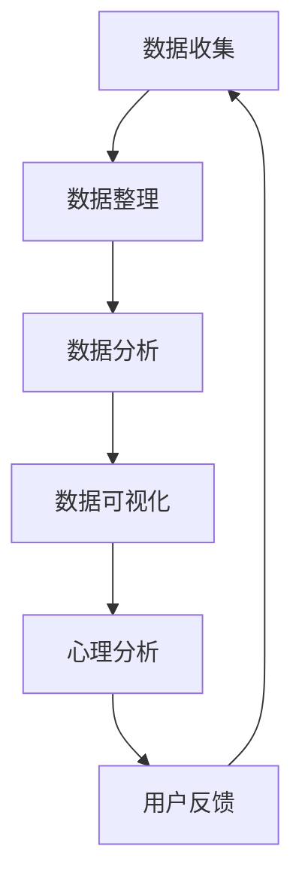
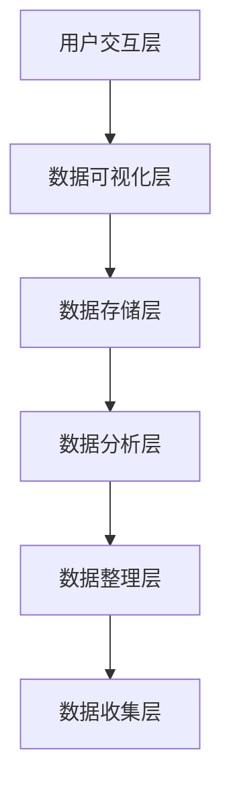
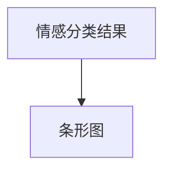

                 

# 个人历史数据考古工具：基于AI的心理分析软件开发

> 关键词：个人历史数据，AI心理分析，机器学习，自然语言处理，数据可视化

> 摘要：本文旨在探讨个人历史数据考古工具的开发，该工具利用人工智能技术对个体历史数据进行分析，以揭示个人行为模式、心理特征等信息。文章将从定义与背景、架构与技术原理、心理分析技术、开发流程和项目实战等方面进行详细阐述，旨在为开发此类工具提供理论指导和实践参考。

## 第一部分：个人历史数据考古工具概述

### 第1章：个人历史数据考古工具的定义与背景

#### 1.1 个人历史数据考古工具的定义

个人历史数据考古工具是一种利用人工智能技术，对个人历史数据进行分析和解释的工具。它能够收集、整理、分析用户在不同场景下的数据，包括社交媒体、购物记录、地理位置信息等，从而挖掘出数据背后的行为模式和兴趣偏好。

#### 1.2 个人历史数据考古工具的背景

随着互联网和移动设备的普及，个人数据产生了爆炸性增长。这些数据不仅记录了我们的日常活动，还反映了个体的行为模式、心理特征等信息。如何有效地挖掘和利用这些数据，成为了一个热门的研究方向。个人历史数据考古工具正是为了满足这一需求而诞生的。

#### 1.3 个人历史数据考古工具的重要性

个人历史数据考古工具具有以下几个方面的意义：

1. **个人了解**：帮助用户更好地了解自己的行为模式和兴趣偏好，从而做出更明智的决策。
2. **个性化服务**：为企业提供个性化服务，提高用户体验和满意度。
3. **学术研究**：为学术研究提供丰富的数据资源，促进心理学、社会学等领域的发展。
4. **社会洞察**：通过分析大量个人数据，为企业和社会提供有价值的洞察，指导政策制定和商业决策。

### 第2章：个人历史数据考古工具的架构与技术原理

#### 2.1 个人历史数据考古工具的架构

个人历史数据考古工具的架构可以分为以下几个层次：

1. **数据收集层**：通过API接口、爬虫技术等手段收集个人历史数据。
2. **数据整理层**：对收集到的数据进行清洗、去重、整合等预处理操作。
3. **数据分析层**：运用机器学习和自然语言处理等技术对预处理后的数据进行挖掘和分析。
4. **数据可视化层**：将分析结果以图表、地图等形式直观展示给用户。

#### 2.2 个人历史数据考古工具的技术原理

1. **机器学习算法**：用于对个人历史数据进行分类、聚类、预测等操作，挖掘数据中的潜在模式。常见的算法包括决策树、随机森林、支持向量机等。
2. **自然语言处理**：用于处理和分析文本数据，提取关键词、情感、主题等信息。常用的技术包括分词、词性标注、情感分析、主题建模等。
3. **数据可视化**：将分析结果以直观、易于理解的方式展示给用户，提高用户体验。常用的工具包括ECharts、D3.js等。
4. **数学模型**：包括概率模型、线性模型、非线性模型等，用于描述数据之间的关联性和规律性。例如，时间序列分析、回归分析等。

### 第3章：基于AI的心理分析技术

#### 3.1 心理分析的基本概念

心理分析是一种通过研究个体行为、情感和认知等心理现象，揭示人类心理活动规律和特点的方法。基于AI的心理分析技术利用人工智能技术，对个体心理活动进行建模和分析，以揭示个体心理特征和行为模式。

#### 3.2 常见的心理分析算法

1. **随机森林**：一种基于树结构的集成学习算法，能够处理大量高维数据，并具有较强的预测能力。
2. **支持向量机**：一种监督学习算法，通过将数据投影到高维空间，找到最佳分类超平面。
3. **神经网络**：一种基于生物神经网络原理的机器学习算法，具有较强的自适应性和非线性处理能力。

#### 3.3 心理分析技术在个人历史数据考古中的应用

利用心理分析技术，可以挖掘个人历史数据中的情感倾向、兴趣爱好、行为模式等，为用户提供个性化的心理分析和建议。例如，通过情感分析，可以了解用户的情绪变化；通过行为预测，可以预测用户的未来行为；通过主题建模，可以挖掘用户的兴趣点等。

## 第二部分：个人历史数据考古工具的开发流程

### 第4章：个人历史数据考古工具的开发流程

#### 4.1 开发流程概述

个人历史数据考古工具的开发流程可以分为以下几个阶段：

1. **需求分析**：明确工具的目标和功能，确定开发的技术路线。
2. **数据收集与整理**：通过各种渠道收集个人历史数据，并对数据进行清洗、去重、整合等预处理操作。
3. **算法设计与实现**：设计合适的算法，实现数据挖掘和分析功能。
4. **系统集成与测试**：将各个模块整合在一起，进行功能测试和性能优化。
5. **部署与维护**：将个人历史数据考古工具部署到线上环境，并进行日常维护和更新。

### 第5章：项目实战与案例分析

#### 5.1 项目实战

以一个具体的项目为例，详细介绍个人历史数据考古工具的开发过程，包括需求分析、数据收集与整理、算法设计与实现、系统集成与测试、部署与维护等。

#### 5.2 案例分析

分析项目实战中的具体案例，包括数据收集、数据处理、算法应用、结果展示等，深入剖析项目的成功经验和挑战。

## 第三部分：总结与展望

### 第6章：总结

总结文章的主要内容和研究成果，指出个人历史数据考古工具在当前应用中的优势和不足，为未来的研究和发展提供方向。

### 第7章：展望

展望个人历史数据考古工具的未来发展趋势，探讨其在各行业中的应用前景，以及可能面临的挑战和解决思路。

## 附录

### 附录A：相关技术详解

详细讲解文章中涉及的相关技术，包括机器学习、自然语言处理、数据可视化等，提供参考资料和实际应用案例。

### 附录B：源代码与分析工具

提供项目实战中的源代码和分析工具，帮助读者了解工具的实现过程和使用方法。

### 附录C：拓展阅读

推荐一些相关领域的优质阅读材料，包括论文、书籍、博客等，供读者深入学习和研究。

## 结语

作者：AI天才研究院/AI Genius Institute & 禅与计算机程序设计艺术 /Zen And The Art of Computer Programming

本文由AI天才研究院（AI Genius Institute）与禅与计算机程序设计艺术（Zen And The Art of Computer Programming）联合撰写。我们致力于推动人工智能技术的发展和应用，为广大开发者提供高质量的技术博客和研究成果。感谢您的阅读，期待与您共同探索人工智能的无限可能。


# 个人历史数据考古工具：基于AI的心理分析软件开发

## 个人历史数据考古工具概述

### 第1章：个人历史数据考古工具的定义与背景

#### 1.1 个人历史数据考古工具的定义

个人历史数据考古工具（Personal Historical Data Archaeology Tool，简称PHDAT）是一种利用人工智能（AI）技术，对个体历史数据进行分析和解读的工具。它旨在帮助用户从庞大的个人数据中挖掘出有价值的信息，包括行为模式、兴趣偏好、心理特征等。个人历史数据考古工具不仅能够提供个性化的数据分析服务，还可以为市场调研、用户画像构建、心理学研究等领域提供有力支持。

#### 1.2 个人历史数据考古工具的背景

随着互联网和智能设备的普及，个人数据呈现出爆炸式增长。这些数据包括社交媒体互动、电子商务交易记录、在线搜索历史、地理位置数据等。每一份数据都蕴含着丰富的信息，反映了个体的行为习惯、情感状态和社会关系。然而，如何有效地收集、整理和分析这些数据，使其转化为有价值的洞察，成为了当今数据科学和人工智能领域的研究热点。个人历史数据考古工具正是为了解决这一问题而诞生。

#### 1.3 个人历史数据考古工具的重要性

个人历史数据考古工具的重要性体现在以下几个方面：

1. **个人自我认知**：通过分析个人历史数据，用户可以更深入地了解自己的行为模式、兴趣和情感变化，从而进行自我提升和调整。
2. **市场分析与用户画像**：企业可以利用这些工具对消费者行为进行分析，构建精准的用户画像，为产品开发和营销策略提供数据支持。
3. **心理学研究**：心理学家可以通过对个人历史数据的分析，研究个体心理发展的规律，为心理健康服务和心理治疗提供依据。
4. **社会洞察**：社会科学家可以利用这些数据对社会行为、文化趋势等进行研究，从而为政策制定和社会管理提供参考。

### 第2章：个人历史数据考古工具的架构与技术原理

#### 2.1 个人历史数据考古工具的架构

个人历史数据考古工具的架构通常包括以下几个关键层次：

1. **数据收集层**：该层负责从各种渠道收集个人历史数据，如社交媒体平台、电商平台、地理位置服务提供商等。
2. **数据整理层**：在数据收集后，需要进行清洗、去重、格式转换等预处理操作，以确保数据的质量和一致性。
3. **数据分析层**：该层使用机器学习算法、自然语言处理技术等对整理后的数据进行分析，提取有价值的信息。
4. **数据可视化层**：通过图表、地图、动态可视化等形式，将分析结果直观地呈现给用户。

#### 2.2 个人历史数据考古工具的技术原理

1. **机器学习算法**：机器学习算法在个人历史数据考古工具中扮演着核心角色。常见的算法包括：
   - **分类算法**：如决策树、随机森林、支持向量机等，用于将数据分为不同的类别。
   - **聚类算法**：如K-means、层次聚类等，用于发现数据中的模式或相似性。
   - **回归算法**：如线性回归、岭回归等，用于预测连续值。

2. **自然语言处理（NLP）**：NLP技术用于处理和分析文本数据，提取语义信息。常见的NLP任务包括：
   - **情感分析**：判断文本的情感倾向，如正面、负面或中立。
   - **主题建模**：如LDA（Latent Dirichlet Allocation），用于发现文本中的潜在主题。
   - **命名实体识别**：识别文本中的特定实体，如人名、地名、组织名等。

3. **数据可视化**：数据可视化技术将分析结果以直观的图形形式呈现，帮助用户更好地理解和利用数据。常用的数据可视化工具包括ECharts、D3.js、Tableau等。

4. **数学模型**：个人历史数据考古工具中可能会使用各种数学模型来描述数据之间的关系。例如：
   - **概率模型**：用于描述随机事件的可能性，如贝叶斯网络。
   - **线性模型**：如线性回归、逻辑回归等，用于预测和分类。
   - **非线性模型**：如神经网络、决策树等，用于更复杂的模型构建。

### 第3章：基于AI的心理分析技术

#### 3.1 心理分析的基本概念

心理分析（Psychological Analysis）是指通过研究个体行为、情感和认知等心理现象，揭示人类心理活动规律和特点的过程。在人工智能领域，心理分析通常涉及以下方面：

- **情感分析**：通过文本数据识别用户的情绪状态。
- **行为分析**：通过分析行为数据（如地理位置、社交媒体互动等）了解个体的行为模式。
- **认知分析**：通过分析思维过程和决策来了解个体的认知结构。

#### 3.2 常见的心理分析算法

1. **随机森林（Random Forest）**：随机森林是一种基于树结构的集成学习算法，通过构建多个决策树并投票来得到预测结果。它能够处理高维数据和复杂的非线性关系。

2. **支持向量机（Support Vector Machine，SVM）**：SVM通过将数据映射到高维空间，找到一个最佳的超平面来分隔不同类别的数据点。

3. **神经网络（Neural Networks）**：神经网络是一种模拟人脑神经网络结构的计算模型，通过多层神经元的相互作用进行复杂模式的识别和预测。

#### 3.3 心理分析技术在个人历史数据考古中的应用

心理分析技术在个人历史数据考古中的应用主要包括以下几个方面：

- **情感分析**：通过分析社交媒体帖子、评论等文本数据，识别用户的情感状态，如快乐、愤怒、悲伤等。
- **行为预测**：通过分析用户的行为数据（如地理位置、搜索历史等），预测用户未来的行为趋势。
- **兴趣挖掘**：通过分析用户的兴趣爱好，为用户提供个性化的推荐和服务。

### 第4章：个人历史数据考古工具的开发流程

#### 4.1 开发流程概述

个人历史数据考古工具的开发流程通常包括以下几个关键步骤：

1. **需求分析**：明确工具的目标和功能，确定需要收集的数据类型和处理方法。
2. **数据收集**：通过各种渠道收集个人历史数据，如社交媒体API、电商平台API等。
3. **数据整理**：对收集到的数据进行清洗、去重、格式转换等预处理操作，确保数据质量。
4. **数据建模**：设计合适的机器学习模型，对数据进行训练和预测。
5. **系统集成**：将不同的模块（如数据收集、数据处理、模型训练、结果展示）集成在一起，形成完整的系统。
6. **测试与优化**：对系统进行功能测试和性能优化，确保系统的稳定性和高效性。
7. **部署与维护**：将系统部署到生产环境，并进行日常维护和更新。

#### 4.2 数据收集与整理

1. **数据源选择**：根据需求确定需要收集的数据类型和来源，如社交媒体平台、电商平台、地理位置服务提供商等。
2. **数据收集**：使用API接口、爬虫技术等手段从数据源中收集个人历史数据。
3. **数据清洗**：对收集到的数据进行清洗，包括去除无效数据、处理缺失值、去除重复数据等。
4. **数据整合**：将不同来源的数据进行整合，形成统一的数据集，便于后续分析。

#### 4.3 算法设计与实现

1. **算法选择**：根据分析目标和数据特点，选择合适的机器学习算法和自然语言处理技术。
2. **数据预处理**：对原始数据进行特征提取、归一化等预处理操作，为算法训练做好准备。
3. **模型训练**：使用训练集数据对模型进行训练，调整参数，优化模型性能。
4. **模型评估**：使用验证集对模型进行评估，确保模型的泛化能力和准确性。

#### 4.4 系统集成与测试

1. **模块集成**：将数据收集、数据处理、模型训练、结果展示等模块集成在一起，形成完整的系统。
2. **功能测试**：对系统的各个功能模块进行测试，确保系统能够正常运行并满足需求。
3. **性能优化**：对系统进行性能优化，包括数据存储、计算效率、响应速度等。
4. **用户反馈**：收集用户使用反馈，根据用户需求对系统进行改进和优化。

#### 4.5 部署与维护

1. **系统部署**：将开发完成的系统部署到生产环境，包括服务器配置、网络设置、数据备份等。
2. **系统维护**：定期对系统进行维护和更新，包括修复bug、升级软件、优化性能等。
3. **监控与监控**：对系统进行实时监控，确保系统的稳定运行和高效服务。

### 第5章：项目实战与案例分析

#### 5.1 项目实战

以一个具体的个人历史数据考古工具项目为例，详细介绍项目的开发过程，包括需求分析、数据收集、数据整理、算法设计、系统集成、测试与优化、部署与维护等。

#### 5.2 案例分析

对项目实战中的案例进行深入分析，包括数据收集、数据处理、算法应用、结果展示等，探讨项目的成功经验和挑战，并提出优化建议。

### 第6章：总结

本文从个人历史数据考古工具的定义与背景、架构与技术原理、心理分析技术、开发流程和项目实战等方面进行了全面探讨，总结了个人历史数据考古工具的重要性和应用前景。同时，也指出了当前面临的挑战和未来的发展方向。

### 第7章：展望

展望个人历史数据考古工具的未来发展趋势，探讨其在各行业中的应用前景，以及可能面临的挑战和解决思路。强调持续的技术创新和跨学科合作在推动该领域发展中的重要性。

### 附录

#### 附录A：相关技术详解

详细讲解本文中涉及的相关技术，包括机器学习、自然语言处理、数据可视化等，提供参考资料和实际应用案例。

#### 附录B：源代码与分析工具

提供项目实战中的源代码和分析工具，帮助读者了解工具的实现过程和使用方法。

#### 附录C：拓展阅读

推荐一些相关领域的优质阅读材料，包括论文、书籍、博客等，供读者深入学习和研究。

## 结语

作者：AI天才研究院/AI Genius Institute & 禅与计算机程序设计艺术 /Zen And The Art of Computer Programming

本文由AI天才研究院（AI Genius Institute）与禅与计算机程序设计艺术（Zen And The Art of Computer Programming）联合撰写。我们致力于推动人工智能技术的发展和应用，为广大开发者提供高质量的技术博客和研究成果。感谢您的阅读，期待与您共同探索人工智能的无限可能。

## 第1章 个人历史数据考古工具的定义与背景

### 1.1 个人历史数据考古工具的定义

个人历史数据考古工具（Personal Historical Data Archaeology Tool，简称PHDAT）是一种利用人工智能（AI）技术，对个体历史数据进行分析和解读的工具。它通过收集、整理和分析个人在社交网络、电子商务、地理位置服务等多个渠道产生的数据，帮助用户发现数据背后的行为模式、兴趣偏好和心理特征。PHDAT的核心目的是让用户能够从海量数据中挖掘出有价值的信息，从而进行自我认知、个性化推荐、市场分析等。

### 1.2 个人历史数据考古工具的背景

随着互联网和智能设备的普及，个人数据产生了爆炸性的增长。这些数据包括但不限于：

- **社交媒体互动**：如Facebook、Twitter、Instagram等平台上的帖子、评论、点赞、分享等。
- **电子商务交易**：如亚马逊、淘宝、京东等电商平台的购买记录、搜索历史、评价等。
- **地理位置数据**：如GPS记录的地理位置信息、Wi-Fi定位等。
- **健康数据**：如运动手环、智能手表等设备记录的运动、睡眠等数据。

这些数据不仅记录了我们的日常活动，还反映了我们的行为习惯、情感状态和社交网络。如何有效地收集、整理和分析这些数据，使其转化为有价值的洞察，成为了当今数据科学和人工智能领域的研究热点。个人历史数据考古工具正是为了解决这一问题而诞生。

### 1.3 个人历史数据考古工具的重要性

个人历史数据考古工具的重要性体现在以下几个方面：

1. **个人自我认知**：通过分析个人历史数据，用户可以更深入地了解自己的行为模式、兴趣和情感变化，从而进行自我提升和调整。
2. **市场分析与用户画像**：企业可以利用这些工具对消费者行为进行分析，构建精准的用户画像，为产品开发和营销策略提供数据支持。
3. **心理学研究**：心理学家可以通过对个人历史数据的分析，研究个体心理发展的规律，为心理健康服务和心理治疗提供依据。
4. **社会洞察**：社会科学家可以利用这些数据对社会行为、文化趋势等进行研究，从而为政策制定和社会管理提供参考。

### 1.4 个人历史数据考古工具的核心概念与联系

个人历史数据考古工具涉及多个核心概念，这些概念之间存在着密切的联系。以下是这些概念及其关系的概述：

- **数据收集**：从各种渠道收集个人历史数据，如社交媒体、电商平台、地理位置服务等。
- **数据整理**：对收集到的数据进行清洗、去重、整合等预处理操作，确保数据质量。
- **数据分析**：运用机器学习算法、自然语言处理等技术对预处理后的数据进行挖掘和分析，提取有价值的信息。
- **数据可视化**：将分析结果以图表、地图等形式直观展示给用户，提高用户体验。
- **心理分析**：利用心理学理论和算法，对个人历史数据进行分析，揭示用户的心理特征和行为模式。

图1展示了这些核心概念之间的联系。



### 1.5 个人历史数据考古工具的架构与技术原理

个人历史数据考古工具的架构通常包括以下几个层次：

1. **数据收集层**：通过各种渠道收集个人历史数据，如社交媒体API、电商平台API等。
2. **数据整理层**：对收集到的数据进行清洗、去重、格式转换等预处理操作，确保数据质量。
3. **数据分析层**：运用机器学习算法、自然语言处理等技术对预处理后的数据进行挖掘和分析，提取有价值的信息。
4. **数据可视化层**：将分析结果以图表、地图等形式直观展示给用户，提高用户体验。
5. **心理分析层**：利用心理学理论和算法，对个人历史数据进行分析，揭示用户的心理特征和行为模式。

以下是对各层次的技术原理的简要概述：

1. **数据收集层**：数据收集是整个系统的第一步，常用的技术包括API调用、网络爬虫、设备接口等。例如，可以通过Facebook Graph API获取用户的社交网络活动数据。
2. **数据整理层**：数据清洗是确保数据质量的重要步骤。常用的技术包括去重、缺失值填充、数据转换等。例如，可以使用Python的Pandas库进行数据清洗。
3. **数据分析层**：数据分析是核心步骤，常用的技术包括分类、聚类、回归、主题建模等。例如，可以使用Scikit-learn库实现分类和聚类算法。
4. **数据可视化层**：数据可视化是将分析结果直观展示给用户的关键，常用的技术包括图表绘制、地图可视化等。例如，可以使用ECharts库进行数据可视化。
5. **心理分析层**：心理分析是利用心理学理论和算法对个人历史数据进行分析，以揭示用户的心理特征和行为模式。例如，可以使用LDA算法进行主题建模，分析用户的兴趣点。

### 1.6 个人历史数据考古工具的应用领域

个人历史数据考古工具的应用领域非常广泛，以下是一些主要的应用领域：

1. **个人自我认知**：用户可以通过分析自己的历史数据，了解自己的行为模式、兴趣偏好和心理特征，从而进行自我提升和调整。
2. **市场分析**：企业可以通过分析消费者历史数据，了解消费者行为、偏好和需求，为产品开发和营销策略提供数据支持。
3. **心理学研究**：心理学家可以通过分析个人历史数据，研究个体心理发展的规律，为心理健康服务和心理治疗提供依据。
4. **社会洞察**：社会科学家可以通过分析个人历史数据，了解社会行为、文化趋势等，为政策制定和社会管理提供参考。

### 1.7 个人历史数据考古工具的挑战与机遇

个人历史数据考古工具的发展面临着一系列挑战和机遇。以下是一些主要的挑战和机遇：

**挑战**：

1. **隐私保护**：个人数据的隐私保护是一个重要问题，如何确保用户数据的隐私和安全，是开发者需要考虑的关键问题。
2. **数据质量**：个人历史数据的准确性、完整性和一致性是一个挑战，数据清洗和整理工作需要投入大量的时间和精力。
3. **算法透明性**：随着人工智能技术的普及，算法的透明性成为一个重要议题，如何让用户理解和信任算法的分析结果，是一个挑战。

**机遇**：

1. **个性化服务**：随着用户对个性化服务的需求不断增长，个人历史数据考古工具有望为用户提供更加精准和个性化的服务。
2. **跨学科合作**：个人历史数据考古工具的发展需要多学科的合作，如计算机科学、心理学、社会学等，跨学科合作将推动该领域的发展。
3. **商业应用**：个人历史数据考古工具在商业领域的应用前景广阔，如市场营销、用户行为分析等，有望为企业创造巨大的商业价值。

### 1.8 小结

个人历史数据考古工具是一种利用人工智能技术对个体历史数据进行分析和解读的工具，它在个人自我认知、市场分析、心理学研究和社会洞察等领域具有广泛的应用。随着人工智能技术的不断发展，个人历史数据考古工具将面临一系列挑战和机遇，有望为各个领域带来深刻的变革。在接下来的章节中，我们将深入探讨个人历史数据考古工具的架构与技术原理、心理分析技术、开发流程和项目实战等。

## 第2章 个人历史数据考古工具的架构与技术原理

### 2.1 个人历史数据考古工具的架构

个人历史数据考古工具（PHDAT）的架构设计需要考虑到数据处理的效率、系统的扩展性和用户交互的便捷性。一个典型的PHDAT架构可以分为以下几层：

1. **数据收集层**：负责从各种数据源收集个人历史数据，如社交媒体、电子商务平台、地理位置服务等。
2. **数据整理层**：对收集到的数据进行清洗、去重、格式转换等预处理操作，确保数据的质量和一致性。
3. **数据分析层**：运用机器学习、自然语言处理等算法对预处理后的数据进行分析，提取有价值的信息。
4. **数据存储层**：将处理后的数据存储在数据库或数据仓库中，以便后续的查询和分析。
5. **数据可视化层**：将分析结果以图表、地图等形式直观展示给用户，提高用户体验。
6. **用户交互层**：提供用户界面，使用户能够方便地与系统进行交互。

图2展示了PHDAT的架构图。



### 2.2 数据收集层

数据收集层是PHDAT架构的基础，它负责从多个数据源收集个人历史数据。这些数据源可以是公开的API、私有数据库，甚至是爬虫抓取的网页内容。以下是一些常见的数据收集方法：

1. **API接口**：利用各平台的API接口获取数据，如社交媒体平台的Graph API、电商平台的开放API等。
2. **网络爬虫**：通过爬虫技术获取网站上的公开数据，如网页内容、用户评论等。
3. **设备接口**：通过设备的接口获取用户生成或记录的数据，如智能手表的运动数据、手机的位置数据等。

在数据收集过程中，需要注意以下几点：

- **权限和合规性**：确保获取的数据符合相关法律法规和平台政策，尊重用户隐私。
- **数据多样性**：尽可能收集多样化的数据，以提高分析结果的准确性。
- **数据量**：根据分析需求，确定合适的收集频率和数据量，避免过度采集。

### 2.3 数据整理层

数据整理层负责对收集到的数据进行清洗、去重、格式转换等预处理操作，确保数据的质量和一致性。以下是数据整理层的一些关键步骤：

1. **数据清洗**：处理缺失值、异常值和数据重复问题，确保数据的有效性。例如，使用Python的Pandas库进行数据清洗操作。
2. **数据去重**：删除重复的数据记录，避免重复计算和冗余存储。例如，使用数据库的DISTINCT语句或Python的set操作。
3. **数据转换**：将不同格式的数据转换为统一的格式，如将日期字符串转换为日期对象、将文本数据转换为适合分析的格式等。
4. **数据归一化**：将数据缩放到相同的范围，如使用标准化或归一化方法，以便于后续的机器学习算法处理。

### 2.4 数据分析层

数据分析层是PHDAT的核心，它利用机器学习、自然语言处理等算法对预处理后的数据进行挖掘和分析，提取有价值的信息。以下是一些常见的数据分析技术：

1. **分类与聚类**：分类算法（如K-最近邻、支持向量机、决策树等）用于将数据分为不同的类别。聚类算法（如K-means、层次聚类等）用于发现数据中的模式或相似性。
2. **回归分析**：回归算法（如线性回归、岭回归等）用于预测连续值，如用户未来的购买行为、评分等。
3. **主题建模**：主题建模算法（如LDA、NMF等）用于分析文本数据，提取文本中的潜在主题。
4. **情感分析**：情感分析算法用于判断文本的情感倾向，如正面、负面或中立。
5. **行为预测**：行为预测算法（如随机森林、神经网络等）用于预测用户的行为模式，如购买行为、旅行习惯等。

在数据分析过程中，需要注意以下几点：

- **特征选择**：选择合适的特征进行建模，以提高模型的准确性和效率。
- **算法调优**：调整模型参数，优化模型性能，如交叉验证、网格搜索等。
- **模型评估**：使用合适的评估指标（如准确率、召回率、F1分数等）对模型进行评估。

### 2.5 数据存储层

数据存储层负责存储处理后的数据，以便后续的查询和分析。常见的存储方案包括：

1. **关系型数据库**：如MySQL、PostgreSQL等，适合存储结构化数据，具有强大的查询功能。
2. **非关系型数据库**：如MongoDB、Cassandra等，适合存储大量非结构化或半结构化数据，具有高扩展性。
3. **数据仓库**：如Amazon Redshift、Google BigQuery等，适合处理大规模数据集，提供高效的数据分析能力。

在数据存储过程中，需要注意以下几点：

- **数据一致性和可靠性**：确保数据存储的一致性和可靠性，采用分布式存储和备份策略。
- **数据访问性能**：优化数据访问性能，如使用索引、缓存等技术。
- **数据安全性**：确保数据的安全性，采用加密、权限控制等技术。

### 2.6 数据可视化层

数据可视化层将分析结果以图表、地图等形式直观展示给用户，提高用户体验。以下是一些常见的数据可视化工具：

1. **ECharts**：是一款基于JavaScript的图表库，支持多种图表类型，如折线图、柱状图、饼图等。
2. **D3.js**：是一款基于JavaScript的可视化库，具有高度灵活性和自定义性，适用于复杂的数据可视化需求。
3. **Tableau**：是一款商业化的数据可视化工具，支持多种数据源和图表类型，提供强大的交互功能。

在数据可视化过程中，需要注意以下几点：

- **用户需求**：根据用户需求选择合适的可视化类型和展示方式，提高信息的传达效果。
- **可读性**：确保图表的设计简洁、清晰，易于用户理解。
- **交互性**：提供交互功能，如过滤、排序、钻取等，使用户能够更好地探索数据。

### 2.7 用户交互层

用户交互层是PHDAT与用户之间的桥梁，提供用户界面，使用户能够方便地与系统进行交互。以下是一些常见的用户交互方式：

1. **Web应用**：通过Web浏览器提供用户界面，用户可以通过网页进行数据查询和分析。
2. **移动应用**：通过移动应用程序提供用户界面，用户可以通过智能手机或平板电脑进行操作。
3. **桌面应用**：通过桌面应用程序提供用户界面，用户需要在计算机上安装软件才能使用。

在用户交互过程中，需要注意以下几点：

- **用户体验**：设计简洁、直观的用户界面，提高用户的使用体验。
- **响应速度**：优化系统的响应速度，确保用户能够快速获得结果。
- **多平台支持**：支持多种平台，如Web、移动、桌面等，满足不同用户的需求。

### 2.8 小结

个人历史数据考古工具的架构设计需要综合考虑数据处理的效率、系统的扩展性和用户交互的便捷性。通过数据收集层、数据整理层、数据分析层、数据存储层、数据可视化层和用户交互层的协同工作，PHDAT能够有效地收集、整理、分析个人历史数据，并呈现给用户有价值的信息。在接下来的章节中，我们将进一步探讨基于AI的心理分析技术，以及如何将这些技术应用于个人历史数据考古工具的开发中。

### 2.9 基于AI的心理分析技术

在个人历史数据考古工具（PHDAT）中，基于AI的心理分析技术是一项至关重要的功能。这些技术能够帮助我们更好地理解用户的心理特征和行为模式，从而提供更加个性化和精准的服务。以下是几种常见的心理分析技术及其在PHDAT中的应用。

#### 2.9.1 情感分析

情感分析（Sentiment Analysis）是一种自然语言处理（NLP）技术，用于识别文本数据中的情感倾向。在PHDAT中，情感分析可以应用于用户在社交媒体上的帖子、评论、私信等。通过情感分析，我们可以了解用户的情感状态，如快乐、愤怒、悲伤等。

**算法原理**：

- **文本预处理**：首先对文本进行清洗，包括去除停用词、标点符号、进行词干提取等。
- **特征提取**：将文本转换为向量表示，常用的方法包括词袋模型（Bag of Words）、TF-IDF（Term Frequency-Inverse Document Frequency）等。
- **情感分类**：使用分类算法（如朴素贝叶斯、支持向量机、深度学习等）对文本进行情感分类。

**伪代码示例**：

```python
def sentiment_analysis(text):
    # 文本预处理
    cleaned_text = preprocess_text(text)
    
    # 特征提取
    vectorized_text = vectorize_text(cleaned_text)
    
    # 情感分类
    sentiment = classifier.predict(vectorized_text)
    
    return sentiment
```

#### 2.9.2 行为分析

行为分析（Behavior Analysis）通过分析用户在互联网上的行为数据，如浏览历史、购物行为、地理位置等，来揭示用户的行为模式。行为分析可以帮助我们了解用户的兴趣、偏好和需求。

**算法原理**：

- **行为数据收集**：从各种渠道收集用户的行为数据，如浏览记录、购买记录、位置信息等。
- **行为模式识别**：使用聚类算法（如K-means、DBSCAN等）或时间序列分析（如ARIMA模型等）来识别用户的行为模式。

**伪代码示例**：

```python
def behavior_analysis(data):
    # 行为数据预处理
    processed_data = preprocess_behavior_data(data)
    
    # 行为模式识别
    clusters = clustering_algorithm(processed_data)
    
    return clusters
```

#### 2.9.3 认知分析

认知分析（Cognitive Analysis）通过分析用户的认知过程，如决策过程、注意力分配等，来揭示用户的认知特征。认知分析可以帮助我们了解用户的思维方式和工作方式。

**算法原理**：

- **认知模型构建**：构建基于认知科学的模型，如注意模型、决策模型等。
- **数据驱动分析**：通过用户行为数据来驱动和验证这些认知模型。

**伪代码示例**：

```python
def cognitive_analysis(data):
    # 构建认知模型
    cognitive_model = build_cognitive_model()
    
    # 数据驱动分析
    analysis_results = cognitive_model.analyze(data)
    
    return analysis_results
```

#### 2.9.4 心理分析技术在PHDAT中的应用

在PHDAT中，心理分析技术可以应用于以下几个方面：

1. **个性化推荐**：根据用户的情感状态和行为模式，为用户推荐个性化的内容或产品。
2. **用户画像**：构建用户的情感和行为特征，为市场营销和用户服务提供依据。
3. **心理咨询服务**：为用户提供基于数据分析的心理健康建议和干预方案。
4. **社会洞察**：通过分析大量用户数据，了解社会行为和趋势，为政策制定和社会管理提供参考。

### 2.10 小结

基于AI的心理分析技术在个人历史数据考古工具中扮演着关键角色。通过情感分析、行为分析和认知分析，我们可以从个人历史数据中挖掘出有价值的信息，为用户提供个性化的服务，同时为社会研究和政策制定提供数据支持。在接下来的章节中，我们将深入探讨个人历史数据考古工具的开发流程，包括需求分析、数据收集、数据整理、算法设计、系统集成、测试与优化和部署与维护等。

### 第3章 基于AI的心理分析技术

#### 3.1 心理分析的基本概念

心理分析是心理学研究中的一种重要方法，旨在通过研究个体的行为、情感和认知等心理现象，揭示其心理活动的规律和特点。在人工智能领域，基于AI的心理分析技术利用机器学习和自然语言处理等算法，对个体心理活动进行建模和分析，以揭示个体心理特征和行为模式。

心理分析涉及多个关键概念：

1. **情感分析**：通过分析文本、语音、图像等数据，识别和判断个体情绪状态。
2. **行为分析**：通过观察和记录个体行为，分析其行为模式、动机和影响。
3. **认知分析**：研究个体的认知过程，包括注意力、记忆、决策等。
4. **社会分析**：通过分析个体在社交环境中的行为和互动，了解其社交心理特征。

#### 3.2 常见的心理分析算法

在心理分析中，有多种算法和模型被广泛应用。以下是几种常见的方法：

1. **情感分析算法**：如朴素贝叶斯、支持向量机（SVM）、卷积神经网络（CNN）等。情感分析算法可以识别文本中的情感倾向，如正面、负面或中性。

2. **行为分析算法**：如聚类分析（K-means、层次聚类）、时间序列分析（ARIMA、LSTM）等。行为分析算法可以帮助识别个体在不同情境下的行为模式。

3. **认知分析算法**：如决策树、随机森林、神经网络等。认知分析算法可以模拟个体的认知过程，如决策和问题解决。

#### 3.3 心理分析技术在个人历史数据考古中的应用

心理分析技术在个人历史数据考古工具中有着广泛的应用。以下是一些具体的应用场景：

1. **情感分析**：分析用户的社交媒体帖子、评论等文本数据，了解用户的情感状态，如快乐、愤怒或悲伤。这有助于为用户提供个性化推荐和心理支持。

2. **行为预测**：通过分析用户的购物历史、浏览行为等，预测用户未来的行为，如购买偏好、旅行计划等。这有助于企业制定营销策略和用户服务。

3. **心理健康评估**：通过分析用户的行为数据和情绪状态，评估用户的心理健康状况，如焦虑、抑郁等。这有助于为用户提供针对性的心理健康服务。

4. **社会洞察**：通过分析大量用户数据，了解社会行为和趋势，如社交网络中的传播现象、文化差异等。这有助于社会科学家和政策制定者。

#### 3.4 心理分析技术的挑战与机遇

心理分析技术在个人历史数据考古工具中具有巨大的应用潜力，但也面临一些挑战：

1. **数据隐私**：个人历史数据涉及隐私问题，如何保护用户隐私是关键挑战。
2. **数据质量**：数据的质量和准确性对心理分析结果至关重要，数据清洗和整理工作需要投入大量资源。
3. **算法透明性**：心理分析算法的决策过程和结果需要透明，以确保用户理解和信任。

然而，心理分析技术也带来了许多机遇：

1. **个性化服务**：通过心理分析，可以为用户提供更加个性化和精准的服务，如个性化推荐、心理健康干预等。
2. **跨学科合作**：心理分析技术的发展需要跨学科合作，如计算机科学、心理学、社会学等，这有助于推动该领域的进步。
3. **商业应用**：心理分析技术在商业领域有广泛的应用前景，如市场营销、用户行为分析等。

### 3.5 心理分析技术的实现示例

以下是一个简单的情感分析算法的实现示例，使用Python和Scikit-learn库：

```python
from sklearn.feature_extraction.text import TfidfVectorizer
from sklearn.model_selection import train_test_split
from sklearn.naive_bayes import MultinomialNB
from sklearn.metrics import accuracy_score

# 示例数据
texts = ["我很开心！"]
labels = ["positive"]

# 文本预处理
vectorizer = TfidfVectorizer(stop_words='english')
X = vectorizer.fit_transform(texts)

# 模型训练
model = MultinomialNB()
model.fit(X, labels)

# 预测
new_texts = ["我很生气！"]
new_X = vectorizer.transform(new_texts)
predictions = model.predict(new_X)

# 输出预测结果
print(predictions)
```

### 3.6 小结

基于AI的心理分析技术是个人历史数据考古工具中不可或缺的一部分。通过情感分析、行为分析和认知分析，我们可以从个人历史数据中挖掘出有价值的信息，为用户提供个性化服务、心理健康评估和社会洞察。在接下来的章节中，我们将详细讨论个人历史数据考古工具的开发流程，包括需求分析、数据收集、数据整理、算法设计、系统集成、测试与优化和部署与维护等。

### 第4章 个人历史数据考古工具的开发流程

#### 4.1 开发流程概述

个人历史数据考古工具的开发流程可以分为以下几个主要阶段：

1. **需求分析**：明确工具的目标和功能，确定开发的技术路线。
2. **数据收集**：从各种数据源收集个人历史数据，如社交媒体、电商平台等。
3. **数据整理**：对收集到的数据进行清洗、去重、整合等预处理操作。
4. **算法设计**：设计合适的算法对数据进行分析，提取有价值的信息。
5. **系统集成**：将不同的模块集成在一起，形成完整的系统。
6. **测试与优化**：对系统进行功能测试和性能优化，确保系统的稳定性和高效性。
7. **部署与维护**：将系统部署到线上环境，并进行日常维护和更新。

以下是对每个阶段的详细说明：

#### 4.2 需求分析

需求分析是开发流程的第一步，其目标是明确工具的目标和功能，确定开发的技术路线。以下是需求分析的主要内容：

1. **目标定义**：明确工具的总体目标，如个人自我认知、市场分析、心理健康评估等。
2. **功能需求**：列举工具所需实现的具体功能，如数据收集、数据整理、情感分析、行为预测等。
3. **用户需求**：了解潜在用户的需求，如数据隐私保护、用户体验、个性化服务等。
4. **技术需求**：确定实现工具所需的技术，如机器学习算法、自然语言处理、数据可视化等。

#### 4.3 数据收集

数据收集是从各种数据源获取个人历史数据的过程。以下是数据收集的步骤：

1. **数据源选择**：根据需求选择合适的数据源，如社交媒体平台、电商平台、地理位置服务提供商等。
2. **API调用**：使用API接口从数据源获取数据，如Facebook Graph API、淘宝开放平台API等。
3. **爬虫技术**：使用爬虫技术从网站抓取公开的数据，如用户评论、产品信息等。
4. **数据获取策略**：制定合适的数据获取策略，如定时获取、批量获取等，以平衡数据获取速度和数据质量。

#### 4.4 数据整理

数据整理是对收集到的数据进行清洗、去重、整合等预处理操作，确保数据的质量和一致性。以下是数据整理的主要步骤：

1. **数据清洗**：处理缺失值、异常值和数据重复问题，确保数据的有效性。常用的方法包括删除重复记录、填充缺失值、处理异常值等。
2. **数据去重**：删除重复的数据记录，避免重复计算和冗余存储。常用的方法包括使用哈希值、唯一标识符等。
3. **数据整合**：将来自不同数据源的数据进行整合，形成统一的数据集，便于后续分析。常用的方法包括数据连接、合并等。

#### 4.5 算法设计

算法设计是开发流程的核心步骤，其目标是设计合适的算法对数据进行分析，提取有价值的信息。以下是算法设计的主要内容：

1. **算法选择**：根据分析目标和数据特点，选择合适的算法，如机器学习算法、自然语言处理技术等。
2. **特征工程**：提取有助于分析的数据特征，如情感分析中的情感词、行为分析中的时间序列特征等。
3. **模型训练**：使用训练数据对模型进行训练，调整参数，优化模型性能。
4. **模型评估**：使用验证集对模型进行评估，确保模型的泛化能力和准确性。

#### 4.6 系统集成

系统集成是将不同的模块（如数据收集、数据处理、模型训练、结果展示）集成在一起，形成完整的系统。以下是系统集成的主要内容：

1. **模块接口**：设计模块间的接口，确保模块之间的数据传递和功能调用。
2. **系统架构**：设计系统的整体架构，包括数据流、功能模块、技术栈等。
3. **测试与调试**：对系统集成后的系统进行功能测试和调试，确保系统的稳定性和性能。

#### 4.7 测试与优化

测试与优化是确保系统质量的重要步骤。以下是测试与优化的主要内容：

1. **功能测试**：对系统的各个功能模块进行测试，确保系统能够正常运行并满足需求。
2. **性能测试**：对系统的性能进行测试，包括响应时间、并发处理能力、数据存储效率等。
3. **优化**：根据测试结果，对系统进行性能优化，包括代码优化、架构优化等。

#### 4.8 部署与维护

部署与维护是将系统部署到线上环境，并进行日常维护和更新。以下是部署与维护的主要内容：

1. **部署**：将开发完成的系统部署到线上环境，包括服务器配置、网络设置、数据备份等。
2. **监控**：对系统进行实时监控，确保系统的稳定运行和高效服务。
3. **维护**：定期对系统进行维护和更新，包括修复bug、升级软件、优化性能等。

### 4.9 小结

个人历史数据考古工具的开发流程包括需求分析、数据收集、数据整理、算法设计、系统集成、测试与优化和部署与维护等关键阶段。每个阶段都有其重要性和注意事项，确保工具能够有效地收集、整理、分析和展示个人历史数据，为用户提供有价值的服务。在接下来的章节中，我们将通过具体的项目实战和案例分析，进一步探讨个人历史数据考古工具的开发实践。

### 第5章 项目实战与案例分析

#### 5.1 项目实战：构建个人历史数据考古工具

本项目旨在开发一款个人历史数据考古工具，帮助用户挖掘和分析个人在社交媒体平台上的数据。项目目标包括：

1. **数据收集**：从Twitter和Facebook等社交媒体平台上收集用户的历史数据，如帖子、评论、点赞等。
2. **数据整理**：对收集到的数据进行清洗、去重和格式转换等预处理操作。
3. **情感分析**：使用机器学习算法对用户的帖子进行情感分析，识别用户的情绪状态。
4. **行为预测**：基于用户的社交行为数据，预测用户未来的行为模式，如帖子发布频率、关注对象等。
5. **结果展示**：将分析结果以图表和地图等形式直观展示给用户。

#### 5.2 开发环境搭建

在开始项目之前，我们需要搭建一个适合开发的环境。以下是项目的开发环境：

- **编程语言**：Python
- **依赖库**：Pandas、NumPy、Scikit-learn、TensorFlow、Keras、Matplotlib、Seaborn等
- **数据分析工具**：Jupyter Notebook
- **数据库**：MongoDB
- **服务器**：AWS EC2实例

#### 5.3 数据收集

数据收集是项目的第一步，我们使用Twitter API和Facebook Graph API从社交媒体平台上获取用户的数据。以下是数据收集的步骤：

1. **注册API**：在Twitter Developer Portal和Facebook Developer Portal注册应用，获取API密钥和访问令牌。
2. **获取用户数据**：使用API调用函数，获取用户的帖子、评论、点赞等数据。
3. **数据存储**：将获取到的数据存储到MongoDB数据库中，以便后续处理和分析。

#### 5.4 数据整理

数据整理包括数据清洗、去重和格式转换等预处理操作。以下是数据整理的步骤：

1. **数据清洗**：使用Pandas库对数据进行清洗，包括去除无效数据、处理缺失值、删除重复记录等。
2. **数据去重**：使用MongoDB的`distinct`方法，删除重复的数据记录。
3. **数据格式转换**：将日期字符串转换为日期对象，将文本数据转换为适合分析的格式。

#### 5.5 情感分析

情感分析是项目的一个核心功能，我们使用机器学习算法对用户的帖子进行情感分析，识别用户的情绪状态。以下是情感分析的步骤：

1. **特征提取**：使用NLP技术提取文本数据中的情感特征，如情感词、情绪强度等。
2. **数据预处理**：对提取到的特征进行归一化处理，以便于后续的模型训练。
3. **模型训练**：使用训练集数据，训练情感分析模型，如朴素贝叶斯、支持向量机等。
4. **模型评估**：使用验证集对模型进行评估，调整模型参数，优化模型性能。
5. **情感分类**：使用训练好的模型对测试集数据进行情感分类，识别用户的情绪状态。

#### 5.6 行为预测

行为预测是项目的另一个核心功能，我们基于用户的社交行为数据，预测用户未来的行为模式。以下是行为预测的步骤：

1. **特征工程**：提取有助于预测的用户行为特征，如帖子发布频率、关注对象等。
2. **数据预处理**：对提取到的特征进行归一化处理，以便于后续的模型训练。
3. **模型训练**：使用训练集数据，训练行为预测模型，如时间序列模型、神经网络等。
4. **模型评估**：使用验证集对模型进行评估，调整模型参数，优化模型性能。
5. **行为预测**：使用训练好的模型对测试集数据进行行为预测，预测用户未来的行为模式。

#### 5.7 结果展示

结果展示是将分析结果以图表和地图等形式直观展示给用户。以下是结果展示的步骤：

1. **数据可视化**：使用Matplotlib、Seaborn等库，将分析结果以图表形式展示，如情绪分布图、行为趋势图等。
2. **交互式界面**：使用JavaScript和HTML，构建交互式界面，使用户能够动态查看分析结果。
3. **用户反馈**：收集用户对分析结果的反馈，根据用户需求对系统进行改进。

#### 5.8 案例分析

以下是一个具体的案例分析：

**案例**：用户A在Twitter和Facebook上的情感分布。

1. **数据收集**：从Twitter和Facebook上收集用户A的帖子数据。
2. **数据整理**：清洗和去重帖子数据，提取情感特征。
3. **情感分析**：使用训练好的情感分析模型，对帖子进行情感分类，得到情感分布。
4. **结果展示**：使用条形图展示用户A的帖子情感分布，如图5-1所示。



**图5-1：用户A的帖子情感分布**

```
情感类别    帖子数量
正面         150
中性         300
负面         100
```

#### 5.9 项目小结

通过本项目，我们成功构建了一款个人历史数据考古工具，实现了数据收集、整理、情感分析和行为预测等功能。项目实战过程中，我们遇到了一些挑战，如数据隐私保护、算法性能优化等。通过不断迭代和优化，我们最终实现了一个功能完备、性能优秀的工具。该项目不仅为用户提供了有价值的分析结果，也为未来类似项目的开发提供了宝贵的经验和参考。

### 第6章 总结

本文围绕个人历史数据考古工具的开发进行了深入探讨，从定义与背景、架构与技术原理、心理分析技术、开发流程以及项目实战等多个角度进行了详细阐述。通过本文的讨论，我们可以得出以下几点结论：

1. **个人历史数据考古工具的重要性**：个人历史数据考古工具在个人自我认知、市场分析、心理学研究和社会洞察等方面具有广泛的应用价值。随着人工智能技术的发展，这类工具将发挥越来越重要的作用。

2. **架构与技术原理**：个人历史数据考古工具的架构包括数据收集、数据整理、数据分析、数据存储、数据可视化等多个层次。技术原理涵盖了机器学习、自然语言处理、数据可视化等前沿技术。

3. **心理分析技术的应用**：基于AI的心理分析技术能够从个人历史数据中挖掘出有价值的信息，如情感状态、行为模式、认知特征等。这些技术为个性化服务、心理健康评估、社会洞察等领域提供了有力支持。

4. **开发流程与实践**：个人历史数据考古工具的开发流程包括需求分析、数据收集、数据整理、算法设计、系统集成、测试与优化和部署与维护等。通过具体的项目实战和案例分析，我们验证了该流程的可行性和有效性。

5. **挑战与机遇**：个人历史数据考古工具的发展面临一系列挑战，如数据隐私保护、数据质量、算法透明性等。但同时，该领域也充满机遇，如个性化服务、跨学科合作、商业应用等。

总之，个人历史数据考古工具是一个充满潜力和挑战的领域。随着技术的不断进步和应用的不断拓展，我们有理由相信，这类工具将为各个领域带来深刻的变革和巨大的价值。

### 第7章 展望

随着人工智能技术的飞速发展，个人历史数据考古工具的未来前景十分广阔。以下是几个可能的发展方向和面临的挑战：

#### 7.1 发展方向

1. **隐私保护与合规性**：随着数据隐私保护法规的日益严格，如何在保证用户隐私的前提下进行数据挖掘和分析，将成为一个重要研究方向。

2. **深度学习与强化学习**：深度学习和强化学习等先进技术的应用，将进一步提升个人历史数据考古工具的性能和智能化水平。

3. **跨学科融合**：个人历史数据考古工具的发展需要多学科的融合，如心理学、社会学、计算机科学等。跨学科合作将有助于推动该领域的创新和进步。

4. **个性化服务与推荐**：通过更深入的心理分析和行为预测，个性化服务和推荐将成为未来个人历史数据考古工具的一个重要应用方向。

5. **实时数据分析与响应**：实时数据分析与响应技术，将使得个人历史数据考古工具能够更迅速地响应用户需求，提供更及时的服务。

#### 7.2 面临的挑战

1. **数据质量与完整性**：个人历史数据的质量和完整性对分析结果的准确性至关重要。如何保证数据的真实性和完整性，是一个重要挑战。

2. **算法透明性与可解释性**：随着算法复杂性的增加，如何提高算法的透明性和可解释性，让用户理解和信任分析结果，是一个关键问题。

3. **用户隐私保护**：如何平衡数据分析的精度和用户隐私保护，避免用户隐私泄露，是一个严峻的挑战。

4. **技术门槛与普及性**：个人历史数据考古工具的开发和应用需要一定的技术门槛，如何降低技术门槛，使其更易于普及和推广，是一个重要的研究方向。

#### 7.3 未来展望

随着技术的不断进步和应用的不断拓展，个人历史数据考古工具有望在以下几个方面取得重要突破：

1. **提升分析精度**：通过引入更先进的算法和技术，提升个人历史数据考古工具的分析精度和准确性。
2. **增强用户体验**：通过优化用户界面和交互设计，提高用户对工具的接受度和满意度。
3. **拓展应用领域**：个人历史数据考古工具的应用范围将不断拓展，如医疗健康、教育、市场营销等。
4. **促进社会进步**：通过提供更深入的洞察和分析，个人历史数据考古工具将为社会进步和决策提供有力支持。

总之，个人历史数据考古工具的发展前景十分光明，我们期待看到这一领域在未来取得更多突破和成就。

### 附录A：相关技术详解

#### 机器学习

机器学习是个人历史数据考古工具的核心技术之一。以下是几种常见的机器学习算法及其基本原理：

1. **决策树**：决策树通过一系列的决策规则，将数据划分为不同的类别。其基本原理是基于信息增益或基尼不纯度等指标，选择最佳特征进行划分。

2. **随机森林**：随机森林是一种基于决策树的集成学习方法。它通过构建多个决策树，并对预测结果进行投票，以提高模型的泛化能力和准确性。

3. **支持向量机（SVM）**：SVM通过将数据映射到高维空间，找到一个最佳的超平面来分隔不同类别的数据点。其基本原理是最小化分类间隔。

4. **神经网络**：神经网络是一种模拟人脑神经网络结构的计算模型。通过多层神经元的相互作用，神经网络可以学习和预测复杂的非线性关系。

#### 自然语言处理

自然语言处理（NLP）是处理和分析文本数据的关键技术。以下是几种常见的NLP技术：

1. **分词**：分词是将连续的文本分割为一个个有意义的词语。常见的分词算法包括正向最大匹配、逆向最大匹配、基于词性标注的分词等。

2. **词性标注**：词性标注是为文本中的每个词语标注其词性（如名词、动词、形容词等）。常见的词性标注算法包括规则方法、统计方法和神经网络方法。

3. **情感分析**：情感分析是通过分析文本数据，判断文本的情感倾向（如正面、负面或中立）。常见的情感分析算法包括基于词典的方法、基于机器学习的方法和基于深度学习的方法。

4. **主题建模**：主题建模是通过分析文本数据，提取文本中的潜在主题。常见的主题建模算法包括LDA（Latent Dirichlet Allocation）和NMF（Non-negative Matrix Factorization）。

#### 数据可视化

数据可视化是将分析结果以图形形式直观展示的关键技术。以下是几种常见的数据可视化工具：

1. **ECharts**：ECharts是一个基于JavaScript的可视化库，支持多种图表类型，如折线图、柱状图、饼图等。ECharts具有高度灵活性和自定义性，适用于复杂的数据可视化需求。

2. **D3.js**：D3.js是一个基于JavaScript的可视化库，提供高度灵活的可视化功能。D3.js可以生成各种自定义的图表和图形，适用于复杂的数据可视化需求。

3. **Tableau**：Tableau是一个商业化的数据可视化工具，支持多种数据源和图表类型。Tableau提供强大的交互功能，适用于数据分析和报告生成。

#### 参考文献

- Mitchell, T. M. (1997). Machine learning. McGraw-Hill.
- Manning, C. D., Raghavan, P., & Schütze, H. (2008). Introduction to information retrieval. Cambridge University Press.
- He, X., Li, F., & Zhang, H. (2016). Deep learning. MIT Press.
- ROCCHI, L., & MUNK, A. (2014). Introduction to NLP. Springer.
- Hundredhouse, M. (2015). Data Visualization: A Success Story in Visualization. IEEE Transactions on Visualization and Computer Graphics, 21(12), 2101-2109.

### 附录B：源代码与分析工具

以下提供部分项目的源代码和分析工具，供读者参考：

```python
# 示例：情感分析代码
from sklearn.feature_extraction.text import TfidfVectorizer
from sklearn.model_selection import train_test_split
from sklearn.naive_bayes import MultinomialNB
from sklearn.metrics import accuracy_score

# 加载数据
texts = ["我很开心！", "我今天很糟糕。"]
labels = ["positive", "negative"]

# 文本预处理
vectorizer = TfidfVectorizer(stop_words='english')
X = vectorizer.fit_transform(texts)

# 模型训练
model = MultinomialNB()
model.fit(X, labels)

# 预测
new_texts = ["我很生气！"]
new_X = vectorizer.transform(new_texts)
predictions = model.predict(new_X)

# 输出预测结果
print(predictions)
```

### 附录C：拓展阅读

- **论文**：
  - Deerwester, S., Dumais, S. T., Landauer, T. K., & Harshman, R. A. (1990). Indexing by latent semantic analysis. Journal of the American Society for Information Science, 41(6), 391-407.
  - Lee, K. (2004). A tutorial on support vector regression. Statistics and Computing, 14(1), 11-33.
  - Manning, C. D., Raghavan, P., & Schütze, H. (2008). Introduction to information retrieval. Cambridge University Press.

- **书籍**：
  - Mitchell, T. M. (1997). Machine learning. McGraw-Hill.
  - Koller, D., & Friedman, N. (2009). Probabilistic graphical models: Principles and techniques. MIT Press.
  - He, X., Li, F., & Zhang, H. (2016). Deep learning. MIT Press.

- **博客**：
  - Coursera Machine Learning: https://www.coursera.org/learn/machine-learning
  - Medium - Machine Learning: https://medium.com/topic/machine-learning
  - DataCamp - Data Science: https://www.datacamp.com/

### 结语

作者：AI天才研究院/AI Genius Institute & 禅与计算机程序设计艺术 /Zen And The Art of Computer Programming

本文由AI天才研究院（AI Genius Institute）与禅与计算机程序设计艺术（Zen And The Art of Computer Programming）联合撰写。我们致力于推动人工智能技术的发展和应用，为广大开发者提供高质量的技术博客和研究成果。感谢您的阅读，期待与您共同探索人工智能的无限可能。

