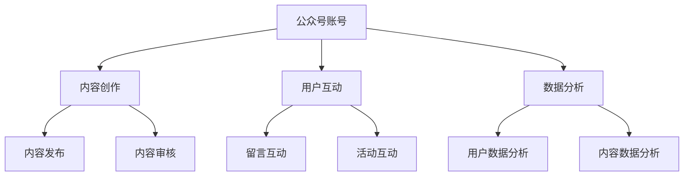
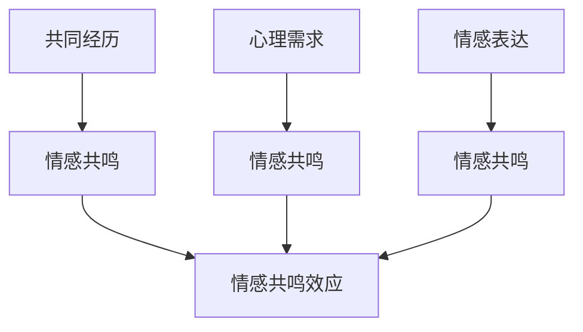
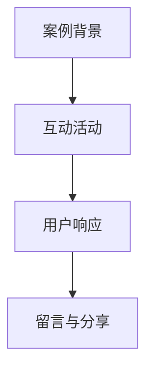

                 


# 《个人成长型公众号：知识分享中的意义传播》

## 关键词
- 公众号运营
- 个人成长
- 知识分享
- 意义传播
- 互动与参与
- 社群建设
- 数据分析

## 摘要
随着互联网的发展，公众号已经成为个人品牌建设的重要平台。本文旨在探讨个人成长型公众号如何通过知识分享实现意义传播，提供运营策略、方法与实践，帮助读者理解并掌握公众号运营的核心技巧。文章将从公众号概述、知识分享与用户增长、内容策略、情感共鸣、互动与参与、社群运营以及实战案例与优化等多个方面展开，旨在为公众号运营者提供有价值的参考和指导。

## 目录大纲

### 第一部分：公众号运营策略

#### 第1章：个人成长型公众号概述

1.1 公众号运营基础

1.2 个人成长型公众号特点

1.3 公众号运营目标与策略

#### 第2章：知识分享与用户增长

2.1 知识分享的重要性

2.2 用户增长策略

2.3 用户群体定位与需求分析

#### 第3章：公众号内容策略

3.1 内容创作原则

3.2 内容类型与风格

3.3 内容发布与推广

### 第二部分：意义传播方法

#### 第4章：情感共鸣与价值塑造

4.1 情感共鸣的心理学原理

4.2 价值塑造的方法与实践

4.3 情感化内容的创作技巧

#### 第5章：互动与参与度提升

5.1 互动与参与度的定义

5.2 提升互动与参与度的策略

5.3 用户互动案例分析

#### 第6章：社群运营与影响力扩大

6.1 社群运营概述

6.2 社群建设与维护

6.3 影响力扩大的方法与策略

### 第三部分：实战案例与优化

#### 第7章：公众号运营实战与数据分析

7.1 实战案例分享

7.2 数据分析工具与方法

7.3 数据驱动运营优化

#### 第8章：公众号优化与成长路径

8.1 公众号优化的原则

8.2 成长路径规划

8.3 面向未来的公众号发展策略

### 文章正文

#### 第1章：个人成长型公众号概述

随着移动互联网的快速发展，公众号已经成为人们获取信息、交流互动的重要平台。在这个背景下，个人成长型公众号应运而生，它不仅承载了传统公众号的信息传播功能，更成为个人品牌建设的重要阵地。本章将介绍公众号运营的基础知识，分析个人成长型公众号的特点，并探讨其运营目标与策略。

#### 1.1 公众号运营基础

公众号运营，首先需要了解公众号的基本概念。公众号是指微信官方平台上的一个账号，通过这个账号，用户可以接收信息、交流互动。公众号的类型主要有服务号、订阅号、企业号等，不同类型的公众号适用于不同的运营场景。公众号的运营主要包括内容创作、用户互动、数据分析等方面。

内容创作是公众号的核心，一个优质的内容可以帮助公众号吸引更多的用户。内容创作需要注意以下几个方面：

- 内容类型：根据公众号的定位，确定合适的内容类型，如图文、视频、音频等。
- 内容质量：确保内容具有较高的阅读价值、实用性和趣味性。
- 内容更新频率：保持一定的更新频率，以满足用户的需求。

用户互动是公众号运营的关键，一个活跃的互动可以提升用户的粘性。用户互动可以通过留言、点赞、分享等方式实现。在互动过程中，需要关注以下几点：

- 回应速度：及时回复用户的留言，提升用户体验。
- 互动质量：引导用户进行有意义、有深度的互动。
- 互动方式：通过活动、话题等方式，激发用户的参与热情。

数据分析是公众号运营的指南，通过对数据的分析，可以了解用户的偏好、需求，从而优化运营策略。数据分析主要包括用户数据、内容数据、互动数据等方面。

#### 1.2 个人成长型公众号特点

个人成长型公众号与传统公众号相比，具有以下特点：

- 定位明确：个人成长型公众号通常针对特定的用户群体，如职场人士、创业者等，提供专业、实用的知识和经验。
- 内容丰富：个人成长型公众号的内容更加丰富，包括专业知识、案例分析、实战技巧等。
- 互动深度：个人成长型公众号注重用户互动，通过问答、讨论等方式，帮助用户解决实际问题。
- 品牌建设：个人成长型公众号注重个人品牌建设，通过持续输出高质量内容，提升个人影响力。

#### 1.3 公众号运营目标与策略

公众号运营的目标是吸引更多用户，提升用户粘性，最终实现个人品牌的建立和影响力的扩大。为了实现这一目标，需要制定相应的运营策略：

- 明确目标用户：了解目标用户的需求、偏好，制定符合用户需求的内容策略。
- 精细化运营：根据用户数据，对用户进行精细化运营，提升用户满意度。
- 持续输出优质内容：保持内容的质量和更新频率，建立用户信任。
- 激发用户互动：通过互动活动、话题等方式，激发用户的参与热情。
- 数据分析驱动：通过数据分析，了解用户行为，优化运营策略。

#### 第2章：知识分享与用户增长

知识分享是个人成长型公众号的核心价值所在。通过高质量的知识分享，可以吸引更多用户，提升公众号的知名度。本章将分析知识分享的重要性，探讨用户增长策略，以及如何定位用户群体和满足用户需求。

#### 2.1 知识分享的重要性

知识分享不仅可以帮助用户解决问题，提升个人能力，还可以建立个人品牌，扩大影响力。知识分享的重要性体现在以下几个方面：

- 增加用户粘性：优质的知识分享可以满足用户的需求，提升用户对公众号的依赖度。
- 提升公众号知名度：通过分享高质量内容，可以吸引更多用户关注公众号，提升公众号的知名度。
- 建立个人品牌：持续输出高质量内容，可以树立专业、权威的个人形象，建立个人品牌。
- 扩大影响力：知识分享可以帮助用户解决实际问题，提升用户信任，从而扩大个人影响力。

#### 2.2 用户增长策略

用户增长是公众号运营的重要目标。以下是一些有效的用户增长策略：

- 内容营销：通过高质量的内容，吸引用户关注和分享。
- 精准推广：根据用户数据，进行精准推广，吸引潜在用户。
- 活动互动：举办互动活动，提高用户参与度，从而增加用户数量。
- 合作互推：与其他公众号或品牌合作，实现资源共享，扩大用户覆盖范围。
- 社交媒体推广：利用社交媒体平台，进行宣传和推广，吸引更多用户。

#### 2.3 用户群体定位与需求分析

用户群体定位是公众号运营的关键。明确目标用户，可以更好地满足用户需求，提升用户体验。以下是如何进行用户群体定位和需求分析：

- 用户画像：根据用户的基本信息、兴趣爱好、行为习惯等，绘制用户画像。
- 需求分析：了解目标用户的需求，包括学习需求、成长需求等。
- 调研反馈：通过问卷调查、用户反馈等方式，了解用户的真实需求。
- 个性化推送：根据用户需求，定制个性化内容，提高用户满意度。

#### 第3章：公众号内容策略

公众号内容策略是公众号运营的核心。一个成功的公众号，需要制定合适的内容策略，包括内容创作原则、内容类型与风格、内容发布与推广等方面。

#### 3.1 内容创作原则

内容创作原则是确保内容质量的关键。以下是一些常见的内容创作原则：

- 真实可信：内容需要真实、可信，避免虚假宣传。
- 有用实用：内容需要具有实用性，解决用户实际问题。
- 独特创新：内容需要具有独特性，避免与他人的内容雷同。
- 情感共鸣：内容需要能够引起用户的情感共鸣，提升用户粘性。
- 规范排版：内容需要排版规范，提升阅读体验。

#### 3.2 内容类型与风格

公众号的内容类型和风格多种多样，需要根据公众号的定位和用户需求来选择。以下是一些常见的内容类型和风格：

- 类型：图文、视频、音频、H5 等。
- 风格：专业、轻松、幽默、深情等。

#### 3.3 内容发布与推广

内容发布和推广是公众号运营的重要环节。以下是一些有效的发布与推广策略：

- 发布策略：保持一定的发布频率，避免过度发布或缺乏更新。
- 推广渠道：利用社交媒体、合作伙伴、线上活动等方式进行推广。
- 用户互动：通过评论、留言、问答等方式，与用户互动，提高用户粘性。
- 数据分析：通过数据分析，了解内容的表现，优化发布策略。

#### 第4章：情感共鸣与价值塑造

情感共鸣和价值塑造是公众号运营的重要手段。通过情感共鸣，可以提升用户的参与度和忠诚度；通过价值塑造，可以提升公众号的影响力和品牌价值。

#### 4.1 情感共鸣的心理学原理

情感共鸣是指个体在情感上与他人产生共鸣，体验到相同的情感体验。情感共鸣的心理学原理包括：

- 共同经历：个体在经历相似的经历时，容易产生情感共鸣。
- 心理需求：个体在满足某些心理需求时，容易产生情感共鸣。
- 情感表达：个体通过情感表达，与他人建立情感联系。

#### 4.2 价值塑造的方法与实践

价值塑造是指通过特定的方法，提升公众号的价值观和品牌形象。以下是一些常见的价值塑造方法：

- 故事营销：通过故事，传递公众号的价值观和理念。
- 用户体验：通过提升用户体验，塑造公众号的价值。
- KOL 合作：与知名人士或意见领袖合作，提升公众号的影响力和价值。

#### 4.3 情感化内容的创作技巧

情感化内容的创作技巧包括：

- 情感表达：准确表达情感，让用户感受到情感的共鸣。
- 故事化：将内容转化为故事，提升内容的吸引力。
- 视觉效果：运用视觉元素，提升内容的吸引力。
- 互动设计：通过互动设计，提升用户的参与度。

#### 第5章：互动与参与度提升

互动与参与度是公众号运营的重要指标。提升互动与参与度，可以增强用户的粘性，提升公众号的影响力。

#### 5.1 互动与参与度的定义

互动与参与度是指用户在公众号上的参与程度。以下是一些常见的互动与参与度指标：

- 留言数：用户在公众号上留言的数量。
- 点赞数：用户对公众号内容的点赞数量。
- 分享数：用户将公众号内容分享到其他平台的数量。
- 活动参与度：用户参与公众号活动的程度。

#### 5.2 提升互动与参与度的策略

以下是一些提升互动与参与度的策略：

- 互动设计：设计有趣、有意义的互动活动，激发用户的参与热情。
- 话题引导：通过引导用户参与话题讨论，提升用户的参与度。
- 奖励机制：通过奖励机制，激励用户参与互动。
- 个性化推送：根据用户偏好，定制个性化内容，提升用户满意度。

#### 5.3 用户互动案例分析

以下是一个用户互动案例：

- 案例背景：一个个人成长型公众号，针对职场人士，提供职业规划、职场技巧等内容。
- 互动活动：举办“职场经验分享”活动，邀请用户分享自己的职场故事。
- 活动效果：活动得到了用户的积极响应，收获了大量的用户留言和分享。

#### 第6章：社群运营与影响力扩大

社群运营是公众号运营的重要组成部分。通过社群运营，可以提升用户粘性，扩大公众号的影响力。

#### 6.1 社群运营概述

社群运营是指通过建立社群，与用户建立紧密联系，提升用户参与度和忠诚度。以下是一些社群运营的关键要素：

- 社群定位：明确社群的定位，如职业社群、兴趣社群等。
- 社群氛围：营造积极、友好的社群氛围，提升用户归属感。
- 社群管理：制定社群规则，确保社群秩序。
- 社群活动：举办各种活动，激发用户的参与热情。

#### 6.2 社群建设与维护

以下是如何建设与维护社群：

- 建立社群：根据目标用户，选择合适的社群平台，如微信群、QQ 群等。
- 引导用户：通过公众号、活动等方式，引导用户加入社群。
- 维护社群：定期举办活动，发布有价值的内容，维护社群氛围。

#### 6.3 影响力扩大的方法与策略

以下是一些扩大社群影响力的方法与策略：

- 用户互动：通过互动活动，提升用户参与度，扩大影响力。
- 内容传播：通过内容传播，提升社群的知名度，扩大影响力。
- 合作伙伴：与相关领域的企业、个人合作，共同扩大影响力。

#### 第7章：公众号运营实战与数据分析

实战与数据分析是公众号运营的重要环节。通过实战，可以积累经验，优化运营策略；通过数据分析，可以了解用户行为，进一步提升公众号的影响力。

#### 7.1 实战案例分享

以下是一个公众号运营的实战案例：

- 案例背景：一个专注于个人成长的公众号，通过知识分享，帮助用户提升自我。
- 运营策略：定期发布高质量的内容，举办线上活动，与用户互动。
- 数据分析：通过数据分析，了解用户行为，优化内容策略和活动方案。

#### 7.2 数据分析工具与方法

以下是一些常用的数据分析工具与方法：

- 用户数据分析：分析用户的基本信息、行为习惯等，了解用户需求。
- 内容数据分析：分析内容的表现，了解用户偏好，优化内容策略。
- 互动数据分析：分析用户互动数据，了解用户的参与度，优化互动策略。

#### 7.3 数据驱动运营优化

以下是如何利用数据驱动运营优化：

- 数据分析：通过数据分析，了解用户行为和需求，找出问题所在。
- 优化策略：根据数据分析结果，制定优化策略，提升公众号的影响力。

#### 第8章：公众号优化与成长路径

公众号的优化与成长路径是一个持续的过程。通过不断的优化和成长，可以提升公众号的竞争力，实现长期发展。

#### 8.1 公众号优化的原则

以下是一些公众号优化的原则：

- 以用户为中心：优化内容、服务，满足用户需求。
- 数据驱动：根据数据分析，优化运营策略。
- 持续改进：不断优化，提升公众号的质量和影响力。

#### 8.2 成长路径规划

以下是一些公众号成长路径的规划：

- 初期成长：积累用户，提升知名度。
- 中期成长：优化内容，提升用户粘性。
- 长期成长：扩大影响力，实现品牌化。

#### 8.3 面向未来的公众号发展策略

以下是一些面向未来的公众号发展策略：

- 技术创新：利用人工智能、大数据等技术，提升公众号的运营效果。
- 多平台运营：拓展其他平台，实现多渠道传播。
- 社群化运营：加强与用户的互动，提升用户粘性。

### 结语

个人成长型公众号已经成为互联网时代的重要现象。通过知识分享，个人可以在公众号上实现意义传播，同时提升个人品牌和影响力。本文从多个方面探讨了个人成长型公众号的运营策略、方法与实践，希望对公众号运营者有所启发。在未来的运营过程中，需要不断优化和创新，实现持续成长。

### 附录

- [参考文献]
- [拓展阅读]

**作者：AI天才研究院/AI Genius Institute & 禅与计算机程序设计艺术 /Zen And The Art of Computer Programming**### 完整的Markdown文章示例

# 《个人成长型公众号：知识分享中的意义传播》

## 关键词
- 公众号运营
- 个人成长
- 知识分享
- 意义传播
- 互动与参与
- 社群建设
- 数据分析

## 摘要
随着互联网的发展，公众号已经成为个人品牌建设的重要平台。本文旨在探讨个人成长型公众号如何通过知识分享实现意义传播，提供运营策略、方法与实践，帮助读者理解并掌握公众号运营的核心技巧。文章将从公众号概述、知识分享与用户增长、内容策略、情感共鸣、互动与参与、社群运营以及实战案例与优化等多个方面展开，旨在为公众号运营者提供有价值的参考和指导。

## 目录大纲

### 第一部分：公众号运营策略

#### 第1章：个人成长型公众号概述
- 1.1 公众号运营基础
- 1.2 个人成长型公众号特点
- 1.3 公众号运营目标与策略

#### 第2章：知识分享与用户增长
- 2.1 知识分享的重要性
- 2.2 用户增长策略
- 2.3 用户群体定位与需求分析

#### 第3章：公众号内容策略
- 3.1 内容创作原则
- 3.2 内容类型与风格
- 3.3 内容发布与推广

### 第二部分：意义传播方法

#### 第4章：情感共鸣与价值塑造
- 4.1 情感共鸣的心理学原理
- 4.2 价值塑造的方法与实践
- 4.3 情感化内容的创作技巧

#### 第5章：互动与参与度提升
- 5.1 互动与参与度的定义
- 5.2 提升互动与参与度的策略
- 5.3 用户互动案例分析

#### 第6章：社群运营与影响力扩大
- 6.1 社群运营概述
- 6.2 社群建设与维护
- 6.3 影响力扩大的方法与策略

### 第三部分：实战案例与优化

#### 第7章：公众号运营实战与数据分析
- 7.1 实战案例分享
- 7.2 数据分析工具与方法
- 7.3 数据驱动运营优化

#### 第8章：公众号优化与成长路径
- 8.1 公众号优化的原则
- 8.2 成长路径规划
- 8.3 面向未来的公众号发展策略

### 文章正文

#### 第1章：个人成长型公众号概述

随着移动互联网的快速发展，公众号已经成为人们获取信息、交流互动的重要平台。在这个背景下，个人成长型公众号应运而生，它不仅承载了传统公众号的信息传播功能，更成为个人品牌建设的重要阵地。本章将介绍公众号运营的基础知识，分析个人成长型公众号的特点，并探讨其运营目标与策略。

#### 1.1 公众号运营基础

公众号运营，首先需要了解公众号的基本概念。公众号是指微信官方平台上的一个账号，通过这个账号，用户可以接收信息、交流互动。公众号的类型主要有服务号、订阅号、企业号等，不同类型的公众号适用于不同的运营场景。公众号的运营主要包括内容创作、用户互动、数据分析等方面。

**Mermaid流程图：公众号运营基础架构**



内容创作是公众号运营的核心，一个优质的内容可以帮助公众号吸引更多的用户。内容创作需要注意以下几个方面：

- 内容类型：根据公众号的定位，确定合适的内容类型，如图文、视频、音频等。
- 内容质量：确保内容具有较高的阅读价值、实用性和趣味性。
- 内容更新频率：保持一定的更新频率，以满足用户的需求。

**伪代码：内容创作原则**

```python
def create_content(content_type, quality, update_frequency):
    if content_type == "text":
        return "图文内容"
    elif content_type == "video":
        return "视频内容"
    elif content_type == "audio":
        return "音频内容"
    else:
        return "内容类型错误"

def ensure_quality(content):
    if quality > 8:
        return "内容质量高"
    else:
        return "内容质量低"

def check_update_frequency(update_frequency):
    if update_frequency >= 2:
        return "更新频率合理"
    else:
        return "更新频率过低"
```

用户互动是公众号运营的关键，一个活跃的互动可以提升用户的粘性。用户互动可以通过留言、点赞、分享等方式实现。在互动过程中，需要关注以下几点：

- 回应速度：及时回复用户的留言，提升用户体验。
- 互动质量：引导用户进行有意义、有深度的互动。
- 互动方式：通过活动、话题等方式，激发用户的参与热情。

**伪代码：用户互动策略**

```python
def reply_to_comment(comment):
    if time_since_last_reply() < 24:
        return "及时回复"
    else:
        return "回复速度慢"

def ensure_interactive_quality(comment):
    if comment_length() > 50:
        return "互动质量高"
    else:
        return "互动质量低"

def stimulate_participation():
    if event_type() == "activity":
        return "活动激发参与"
    elif event_type() == "topic":
        return "话题激发参与"
    else:
        return "无参与激励"
```

数据分析是公众号运营的指南，通过对数据的分析，可以了解用户的偏好、需求，从而优化运营策略。数据分析主要包括用户数据、内容数据、互动数据等方面。

**数学公式：用户数据分析**

$$
\text{用户活跃度} = \frac{\text{互动次数}}{\text{关注人数}}
$$

**数学公式：内容数据分析**

$$
\text{内容阅读率} = \frac{\text{阅读次数}}{\text{发布次数}}
$$

#### 1.2 个人成长型公众号特点

个人成长型公众号与传统公众号相比，具有以下特点：

- 定位明确：个人成长型公众号通常针对特定的用户群体，如职场人士、创业者等，提供专业、实用的知识和经验。
- 内容丰富：个人成长型公众号的内容更加丰富，包括专业知识、案例分析、实战技巧等。
- 互动深度：个人成长型公众号注重用户互动，通过问答、讨论等方式，帮助用户解决实际问题。
- 品牌建设：个人成长型公众号注重个人品牌建设，通过持续输出高质量内容，提升个人影响力。

**伪代码：个人成长型公众号特点分析**

```python
def analyze_personal_growth_account(account_type, content_type, interaction_depth, brand_building):
    if account_type == "personal_growth":
        if content_type == "professional":
            if interaction_depth == "deep":
                if brand_building == "active":
                    return "符合个人成长型公众号特点"
                else:
                    return "品牌建设不足"
            else:
                return "互动深度不足"
        else:
            return "内容类型不专业"
    else:
        return "公众号类型不明确"
```

#### 1.3 公众号运营目标与策略

公众号运营的目标是吸引更多用户，提升用户粘性，最终实现个人品牌的建立和影响力的扩大。为了实现这一目标，需要制定相应的运营策略：

- 明确目标用户：了解目标用户的需求、偏好，制定符合用户需求的内容策略。
- 精细化运营：根据用户数据，对用户进行精细化运营，提升用户满意度。
- 持续输出优质内容：保持内容的质量和更新频率，建立用户信任。
- 激发用户互动：通过互动活动、话题等方式，激发用户的参与热情。
- 数据分析驱动：通过数据分析，了解用户行为，优化运营策略。

**伪代码：公众号运营目标与策略**

```python
def set_operating_goals(user_understanding, data_analysis, content_quality, user_interaction):
    if user_understanding == "clear":
        if data_analysis == "active":
            if content_quality == "high":
                if user_interaction == "active":
                    return "符合运营目标与策略"
                else:
                    return "互动不足"
            else:
                return "内容质量不足"
        else:
            return "数据分析不足"
    else:
        return "用户理解不足"
```

#### 第2章：知识分享与用户增长

知识分享是个人成长型公众号的核心价值所在。通过高质量的知识分享，可以吸引更多用户，提升公众号的知名度。本章将分析知识分享的重要性，探讨用户增长策略，以及如何定位用户群体和满足用户需求。

#### 2.1 知识分享的重要性

知识分享不仅可以帮助用户解决问题，提升个人能力，还可以建立个人品牌，扩大影响力。知识分享的重要性体现在以下几个方面：

- 增加用户粘性：优质的知识分享可以满足用户的需求，提升用户对公众号的依赖度。
- 提升公众号知名度：通过分享高质量内容，可以吸引更多用户关注公众号，提升公众号的知名度。
- 建立个人品牌：持续输出高质量内容，可以树立专业、权威的个人形象，建立个人品牌。
- 扩大影响力：知识分享可以帮助用户解决实际问题，提升用户信任，从而扩大个人影响力。

**数学公式：知识分享与用户粘性关系**

$$
\text{用户粘性} = \frac{\text{用户互动次数}}{\text{用户关注次数}} \times \text{知识分享质量}
$$

**数学公式：知识分享与影响力关系**

$$
\text{影响力} = \text{知识分享量} \times \text{用户信任度}
$$

#### 2.2 用户增长策略

用户增长是公众号运营的重要目标。以下是一些有效的用户增长策略：

- 内容营销：通过高质量的内容，吸引用户关注和分享。
- 精准推广：根据用户数据，进行精准推广，吸引潜在用户。
- 活动互动：举办互动活动，提高用户参与度，从而增加用户数量。
- 合作互推：与其他公众号或品牌合作，实现资源共享，扩大用户覆盖范围。
- 社交媒体推广：利用社交媒体平台，进行宣传和推广，吸引更多用户。

**伪代码：用户增长策略**

```python
def user_growth_strategy(content_marketing, precise_promotion, interactive_activities, collaborative_promotion, social_media_promotion):
    if content_marketing == "active":
        if precise_promotion == "active":
            if interactive_activities == "active":
                if collaborative_promotion == "active":
                    if social_media_promotion == "active":
                        return "有效的用户增长策略"
                    else:
                        return "社交媒体推广不足"
                else:
                    return "合作互推不足"
            else:
                return "活动互动不足"
        else:
            return "精准推广不足"
    else:
        return "内容营销不足"
```

#### 2.3 用户群体定位与需求分析

用户群体定位是公众号运营的关键。明确目标用户，可以更好地满足用户需求，提升用户体验。以下是如何进行用户群体定位和需求分析：

- 用户画像：根据用户的基本信息、兴趣爱好、行为习惯等，绘制用户画像。
- 需求分析：了解目标用户的需求，包括学习需求、成长需求等。
- 调研反馈：通过问卷调查、用户反馈等方式，了解用户的真实需求。
- 个性化推送：根据用户需求，定制个性化内容，提高用户满意度。

**伪代码：用户群体定位与需求分析**

```python
def user_segmentation(user_profile, user_needs, user_survey, personalized_push):
    if user_profile == "clear":
        if user_needs == "satisfied":
            if user_survey == "valid":
                if personalized_push == "active":
                    return "用户群体定位与需求分析完成"
                else:
                    return "个性化推送不足"
            else:
                return "用户调研不足"
        else:
            return "用户需求未满足"
    else:
        return "用户画像不明确"
```

#### 第3章：公众号内容策略

公众号内容策略是公众号运营的核心。一个成功的公众号，需要制定合适的内容策略，包括内容创作原则、内容类型与风格、内容发布与推广等方面。

#### 3.1 内容创作原则

内容创作原则是确保内容质量的关键。以下是一些常见的内容创作原则：

- 真实可信：内容需要真实、可信，避免虚假宣传。
- 有用实用：内容需要具有实用性，解决用户实际问题。
- 独特创新：内容需要具有独特性，避免与他人的内容雷同。
- 情感共鸣：内容需要能够引起用户的情感共鸣，提升用户粘性。
- 规范排版：内容需要排版规范，提升阅读体验。

**伪代码：内容创作原则**

```python
def content_creation_principles(authenticity, usability, uniqueness, emotional_resonance, layout):
    if authenticity == "true":
        if usability == "high":
            if uniqueness == "unique":
                if emotional_resonance == "active":
                    if layout == "standard":
                        return "符合内容创作原则"
                    else:
                        return "排版不规范"
                else:
                    return "情感共鸣不足"
            else:
                return "内容缺乏独特性"
        else:
            return "内容实用性不足"
    else:
        return "内容真实性不足"
```

#### 3.2 内容类型与风格

公众号的内容类型和风格多种多样，需要根据公众号的定位和用户需求来选择。以下是一些常见的内容类型和风格：

- 类型：图文、视频、音频、H5 等。
- 风格：专业、轻松、幽默、深情等。

**伪代码：内容类型与风格选择**

```python
def choose_content_type_and_style(content_type, style):
    if content_type == "text":
        if style == "professional":
            return "专业图文内容"
        elif style == "light-hearted":
            return "轻松图文内容"
        else:
            return "图文风格不明确"
    elif content_type == "video":
        if style == "humorous":
            return "幽默视频内容"
        elif style == "touching":
            return "深情视频内容"
        else:
            return "视频风格不明确"
    else:
        return "内容类型不明确"
```

#### 3.3 内容发布与推广

内容发布和推广是公众号运营的重要环节。以下是一些有效的发布与推广策略：

- 发布策略：保持一定的发布频率，避免过度发布或缺乏更新。
- 推广渠道：利用社交媒体、合作伙伴、线上活动等方式进行推广。
- 用户互动：通过评论、留言、问答等方式，与用户互动，提高用户粘性。
- 数据分析：通过数据分析，了解内容的表现，优化发布策略。

**伪代码：内容发布与推广策略**

```python
def content_publish_and_promotion(strategy, channels, user_interaction, data_analysis):
    if strategy == "regular":
        if channels == "various":
            if user_interaction == "active":
                if data_analysis == "accurate":
                    return "有效的发布与推广策略"
                else:
                    return "数据分析不足"
            else:
                return "用户互动不足"
        else:
            return "推广渠道不足"
    else:
        return "发布策略不明确"
```

#### 第4章：情感共鸣与价值塑造

情感共鸣和价值塑造是公众号运营的重要手段。通过情感共鸣，可以提升用户的参与度和忠诚度；通过价值塑造，可以提升公众号的影响力和品牌价值。

#### 4.1 情感共鸣的心理学原理

情感共鸣是指个体在情感上与他人产生共鸣，体验到相同的情感体验。情感共鸣的心理学原理包括：

- 共同经历：个体在经历相似的经历时，容易产生情感共鸣。
- 心理需求：个体在满足某些心理需求时，容易产生情感共鸣。
- 情感表达：个体通过情感表达，与他人建立情感联系。

**Mermaid流程图：情感共鸣心理学原理**



#### 4.2 价值塑造的方法与实践

价值塑造是指通过特定的方法，提升公众号的价值观和品牌形象。以下是一些常见的价值塑造方法：

- 故事营销：通过故事，传递公众号的价值观和理念。
- 用户体验：通过提升用户体验，塑造公众号的价值。
- KOL 合作：与知名人士或意见领袖合作，提升公众号的影响力和价值。

**伪代码：价值塑造方法**

```python
def value_shape(story_marketing, user_experience, kol_cooperation):
    if story_marketing == "active":
        if user_experience == "high":
            if kol_cooperation == "valid":
                return "有效的价值塑造方法"
            else:
                return "KOL 合作不足"
        else:
            return "用户体验不足"
    else:
        return "故事营销不足"
```

#### 4.3 情感化内容的创作技巧

情感化内容的创作技巧包括：

- 情感表达：准确表达情感，让用户感受到情感的共鸣。
- 故事化：将内容转化为故事，提升内容的吸引力。
- 视觉效果：运用视觉元素，提升内容的吸引力。
- 互动设计：通过互动设计，提升用户的参与度。

**伪代码：情感化内容创作技巧**

```python
def create_emo_content(expression, storytelling, visuals, interaction):
    if expression == "accurate":
        if storytelling == "storytelling":
            if visuals == "attractive":
                if interaction == "active":
                    return "成功的情感化内容"
                else:
                    return "互动设计不足"
            else:
                return "视觉效果不足"
        else:
            return "故事化不足"
    else:
        return "情感表达不准确"
```

#### 第5章：互动与参与度提升

互动与参与度是公众号运营的重要指标。提升互动与参与度，可以增强用户的粘性，提升公众号的影响力。

#### 5.1 互动与参与度的定义

互动与参与度是指用户在公众号上的参与程度。以下是一些常见的互动与参与度指标：

- 留言数：用户在公众号上留言的数量。
- 点赞数：用户对公众号内容的点赞数量。
- 分享数：用户将公众号内容分享到其他平台的数量。
- 活动参与度：用户参与公众号活动的程度。

**数学公式：互动与参与度计算**

$$
\text{互动度} = \frac{\text{留言数} + \text{点赞数} + \text{分享数}}{\text{内容总数}}
$$

$$
\text{参与度} = \frac{\text{活动参与次数}}{\text{总用户数}}
$$

#### 5.2 提升互动与参与度的策略

以下是一些提升互动与参与度的策略：

- 互动设计：设计有趣、有意义的互动活动，激发用户的参与热情。
- 话题引导：通过引导用户参与话题讨论，提升用户的参与度。
- 奖励机制：通过奖励机制，激励用户参与互动。
- 个性化推送：根据用户偏好，定制个性化内容，提升用户满意度。

**伪代码：提升互动与参与度策略**

```python
def enhance_interaction(interactive_design, topic_guidance, reward_mechanism, personalized_push):
    if interactive_design == "engaging":
        if topic_guidance == "active":
            if reward_mechanism == "effective":
                if personalized_push == "satisfied":
                    return "有效的互动与参与度提升策略"
                else:
                    return "个性化推送不足"
            else:
                return "奖励机制不足"
        else:
            return "话题引导不足"
    else:
        return "互动设计不足"
```

#### 5.3 用户互动案例分析

以下是一个用户互动案例：

- 案例背景：一个个人成长型公众号，针对职场人士，提供职业规划、职场技巧等内容。
- 互动活动：举办“职场经验分享”活动，邀请用户分享自己的职场故事。
- 活动效果：活动得到了用户的积极响应，收获了大量的用户留言和分享。

**Mermaid流程图：用户互动案例分析**



#### 第6章：社群运营与影响力扩大

社群运营是公众号运营的重要组成部分。通过社群运营，可以提升用户粘性，扩大公众号的影响力。

#### 6.1 社群运营概述

社群运营是指通过建立社群，与用户建立紧密联系，提升用户参与度和忠诚度。以下是一些社群运营的关键要素：

- 社群定位：明确社群的定位，如职业社群、兴趣社群等。
- 社群氛围：营造积极、友好的社群氛围，提升用户归属感。
- 社群管理：制定社群规则，确保社群秩序。
- 社群活动：举办各种活动，激发用户的参与热情。

**伪代码：社群运营关键要素**

```python
def community_operations(community_positioning, community_atmosphere, community_management, community_activities):
    if community_positioning == "clear":
        if community_atmosphere == "positive":
            if community_management == "structured":
                if community_activities == "active":
                    return "有效的社群运营"
                else:
                    return "活动不足"
            else:
                return "管理不足"
        else:
            return "氛围不足"
    else:
        return "定位不明确"
```

#### 6.2 社群建设与维护

以下是如何建设与维护社群：

- 建立社群：根据目标用户，选择合适的社群平台，如微信群、QQ 群等。
- 引导用户：通过公众号、活动等方式，引导用户加入社群。
- 维护社群：定期举办活动，发布有价值的内容，维护社群氛围。

**伪代码：社群建设与维护策略**

```python
def build_and_maintain_community(platform_choice, user_guidance, content_release, atmosphere_maintenance):
    if platform_choice == "appropriate":
        if user_guidance == "effective":
            if content_release == "regular":
                if atmosphere_maintenance == "active":
                    return "有效的社群建设与维护"
                else:
                    return "氛围维护不足"
            else:
                return "内容发布不足"
        else:
            return "用户引导不足"
    else:
        return "平台选择不当"
```

#### 6.3 影响力扩大的方法与策略

以下是一些扩大社群影响力

