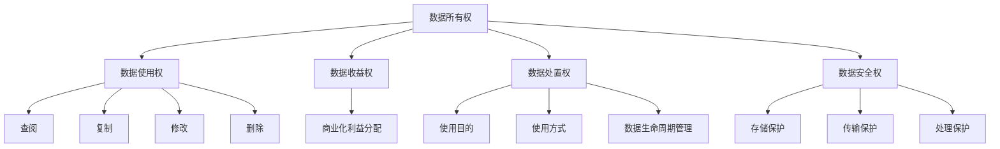
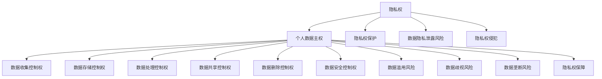
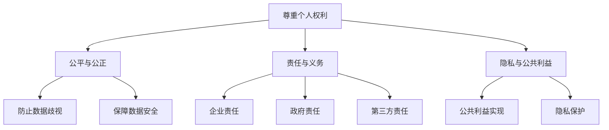

                 

### 文章标题

# 个人数据主权运动：信息时代的公民权利

### 关键词

- 个人数据主权
- 信息时代
- 公民权利
- 数据保护
- 隐私权
- 数据治理

### 摘要

随着信息技术的迅猛发展，个人数据的收集、处理和应用越来越普遍，这引发了关于个人数据主权的重要讨论。个人数据主权运动成为信息时代的一项重要议题，旨在保障公民在数字世界中的权利。本文将深入探讨个人数据主权的核心概念、起源与发展、理论基础与实践，以及其在不同国家与地区的具体案例分析。通过这些分析，本文旨在揭示个人数据主权运动对公民权利的深远影响，并提出未来发展的趋势与挑战。

## 第1章：引言与核心概念

### 1.1 书籍背景与目标

#### 1.1.1 信息时代的个人数据主权

在信息时代，个人数据已经成为一种重要的资源，被广泛应用于各个领域，如电子商务、社交媒体、金融等。然而，个人数据的滥用和泄露问题也日益严重，引发了公众对个人数据主权的关注。个人数据主权是指个人对其自身数据的控制权，包括数据所有权、使用权、收益权、处置权和安全权等。保障个人数据主权，是保护公民隐私权和信息自由的基础。

#### 1.1.2 个人数据主权运动的发展

个人数据主权运动起源于对隐私权的关注。在传统社会中，隐私权是公民的一项基本权利，但随着信息技术的发展，隐私权逐渐演变为个人数据主权。国际上，个人数据主权运动在资本主义国家和社会主义国家均有不同程度的发展。资本主义国家如美国和欧盟，通过立法和政策加强对个人数据的保护；而社会主义国家如中国，则通过完善法律法规，推动个人数据主权运动的发展。

### 1.2 个人数据主权的核心概念

#### 1.2.1 数据所有权

数据所有权是指个人对其数据的控制权，包括数据的收集、存储、处理和分发等。数据所有权的确立，是保障个人数据主权的基础。在数据所有权方面，个人应享有对数据的完全控制权，包括决定数据是否被收集、如何被使用、是否被共享等。

#### 1.2.2 数据使用权

数据使用权是指个人对其数据的合理使用权，包括对数据的查阅、复制、修改和删除等。数据使用权的实现，有助于个人维护其数据的准确性和完整性。在数据使用权方面，个人应享有对数据的最终权利，任何第三方未经授权，不得擅自使用个人数据。

#### 1.2.3 数据收益权

数据收益权是指个人对其数据的收益权，包括数据商业化的利益分配等。数据收益权的实现，有助于个人从其数据中获取经济利益。在数据收益权方面，个人应享有对其数据的商业价值分配权，确保其数据不被滥用。

#### 1.2.4 数据处置权

数据处置权是指个人对其数据的处置权，包括数据的使用目的、使用方式和数据生命周期的管理等。数据处置权的实现，有助于个人对其数据的使用进行有效管理。在数据处置权方面，个人应享有对其数据使用的自主决策权，确保数据不被滥用。

#### 1.2.5 数据安全权

数据安全权是指个人对其数据的安全保护权，包括数据存储、传输和处理的保护等。数据安全权的实现，有助于个人维护其数据的安全和隐私。在数据安全权方面，个人应享有对其数据安全的控制权，确保数据不被非法获取、泄露或篡改。

## 第2章：个人数据主权运动的起源与发展

### 2.1 个人数据主权运动的起源

#### 2.1.1 隐私权与个人数据主权的关联

隐私权是个人数据主权的基础。在传统社会中，隐私权主要涉及个人的私人生活和私人信息的保护。随着信息技术的发展，隐私权逐渐演变为个人数据主权。个人数据主权的核心在于，个人对其数据的控制权，包括数据的收集、存储、处理和分发等。

#### 2.1.2 资本主义国家个人数据主权运动的起源

资本主义国家，尤其是美国，在个人数据主权运动方面起步较早。美国的隐私权法律体系较为完善，如《宪法第四修正案》、《电子通信隐私法》等。这些法律为个人数据主权提供了法律保障。此外，美国在个人数据主权运动方面，还通过政策引导和技术创新，推动个人数据主权的发展。

#### 2.1.3 社会主义国家个人数据主权运动的起源

社会主义国家，如中国，在个人数据主权运动方面起步较晚，但发展迅速。中国《宪法》明确规定公民享有隐私权，并在《网络安全法》、《个人信息保护法》等法律法规中，对个人数据主权进行了规定。近年来，中国通过不断完善法律法规，推动个人数据主权运动的发展。

### 2.2 个人数据主权运动的发展

#### 2.2.1 国际层面的发展

在国际层面，个人数据主权运动得到了广泛关注。多个国际组织，如联合国、欧盟等，均通过了关于个人数据主权的法律文件，提出了具体的保护措施。此外，国际社会还通过合作与交流，推动个人数据主权运动的全球发展。

#### 2.2.2 国内层面的发展

在国内层面，各国政府纷纷加强个人数据主权保护的力度。例如，美国通过《加州消费者隐私法》（CCPA），欧盟通过《通用数据保护条例》（GDPR），中国通过《个人信息保护法》等法律法规，加强对个人数据的保护。此外，各国政府还通过技术手段，如数据加密、隐私计算等，提升个人数据主权的保障水平。

### 第3章：个人数据主权运动的理论与实践

#### 3.1 个人数据主权运动的理论基础

#### 3.1.1 个人数据主权与隐私权的关系

个人数据主权与隐私权密切相关。隐私权是个人数据主权的基础，而个人数据主权是对隐私权的延伸和具体化。在个人数据主权中，隐私权主要体现在数据所有权、使用权、收益权、处置权和安全权等方面。

#### 3.1.2 个人数据主权的伦理学基础

个人数据主权运动的伦理学基础主要包括以下几个方面：

1. **尊重个人权利**：个人对其数据享有自主决定权，包括数据的收集、使用、共享和删除等。
2. **公平与公正**：个人数据主权的实现应确保公平与公正，防止数据滥用和数据歧视。
3. **责任与义务**：个人、企业和政府等各方在个人数据主权运动中，应承担相应的责任和义务，确保数据的安全和隐私。

#### 3.1.3 个人数据主权的法律基础

个人数据主权的法律基础主要包括以下几个方面：

1. **法律法规**：各国政府通过制定法律法规，确立个人数据主权的法律地位和保护措施。
2. **国际条约**：国际社会通过签订国际条约，推动个人数据主权在全球范围内的保护。
3. **司法实践**：个人数据主权的实现需要依靠司法实践，通过法律途径解决个人数据纠纷。

### 3.2 个人数据主权运动的实践

#### 3.2.1 个人数据主权运动的主要策略

个人数据主权运动在实践中采取了多种策略，主要包括：

1. **立法与政策**：通过制定法律法规和政策，确立个人数据主权的法律地位和保护措施。
2. **技术创新**：通过技术创新，如数据加密、隐私计算等，提升个人数据主权的保障水平。
3. **公众参与**：鼓励公众参与个人数据主权运动，提高公众对个人数据主权的认识和意识。
4. **国际合作**：通过国际合作，推动个人数据主权在全球范围内的保护。

#### 3.2.2 个人数据主权运动的案例分析

个人数据主权运动在不同国家和地区有着不同的实践。以下是一些具体的案例分析：

1. **美国**：美国在个人数据主权方面采取了严格的立法和政策。例如，《加州消费者隐私法》（CCPA）赋予消费者对个人数据的控制权，包括数据的查阅、删除和限制使用等。
2. **欧盟**：欧盟通过《通用数据保护条例》（GDPR），建立了严格的个人数据保护制度。GDPR规定了个人数据的收集、处理和存储的标准，并对违反规定的企业实施了严厉的处罚。
3. **中国**：中国通过《个人信息保护法》，确立了个人数据主权的法律地位，并对个人数据的收集、处理和存储进行了严格的规定。此外，中国还通过技术手段，如数据加密和隐私计算，提升个人数据主权的保障水平。

### 第4章：个人数据主权运动的技术基础

#### 4.1 个人数据加密技术

个人数据加密技术是保障个人数据主权的重要手段之一。以下介绍几种常见的个人数据加密技术：

1. **对称加密**：对称加密是指加密和解密使用相同的密钥。常见的对称加密算法有AES（高级加密标准）和DES（数据加密标准）等。
2. **非对称加密**：非对称加密是指加密和解密使用不同的密钥。常见的非对称加密算法有RSA（RSA算法）和ECC（椭圆曲线加密）等。
3. **哈希算法**：哈希算法用于生成数据的摘要，确保数据在传输和存储过程中的完整性。常见的哈希算法有MD5、SHA-1和SHA-256等。

#### 4.1.1 数据加密的基本原理

数据加密的基本原理是通过加密算法将明文数据转换为密文数据，从而确保数据在传输和存储过程中的安全性。加密算法通常包括加密密钥和加密算法两个部分。加密密钥用于加密和解密数据，加密算法则用于实现加密过程。

#### 4.1.2 数据加密技术的应用

数据加密技术在个人数据主权保护中的应用非常广泛。以下是一些具体的应用场景：

1. **数据存储**：在数据存储过程中，通过加密技术对数据进行加密，确保数据在存储介质上的安全性。
2. **数据传输**：在数据传输过程中，通过加密技术对数据进行加密，确保数据在传输过程中的安全性。
3. **数据共享**：在数据共享过程中，通过加密技术对数据进行加密，确保只有授权用户才能解密和访问数据。

### 第5章：个人数据主权运动的案例分析

#### 5.1 资本主义国家个人数据主权运动案例分析

资本主义国家在个人数据主权运动方面有着丰富的实践经验。以下是一些具体的案例分析：

##### 5.1.1 美国个人数据主权运动案例

美国在个人数据主权方面有着较为完善的法律法规，如《加州消费者隐私法》（CCPA）和《儿童在线隐私保护法》（COPPA）等。CCPA赋予消费者对个人数据的控制权，包括数据的查阅、删除和限制使用等。COPPA则保护儿童在线隐私，限制对儿童个人数据的收集和使用。

案例分析：2020年，美国消费者隐私组织“消费者报告”（Consumer Reports）起诉谷歌，指控其违反CCPA，未经授权收集和使用消费者数据。该案最终导致谷歌同意支付5亿美元罚款，以解决违反CCPA的指控。

##### 5.1.2 欧盟个人数据主权运动案例

欧盟在个人数据主权方面采取了严格的立法和政策，最具代表性的就是《通用数据保护条例》（GDPR）。GDPR规定了个人数据的收集、处理和存储的标准，并对违反规定的企业实施了严厉的处罚。

案例分析：2018年，欧盟对Facebook进行了高达50亿美元的罚款，原因是Facebook在用户数据收集和使用方面违反了GDPR。这是GDPR实施以来对违反规定企业的最高罚款。

#### 5.2 社会主义国家个人数据主权运动案例分析

社会主义国家在个人数据主权方面也取得了显著进展。以下是一些具体的案例分析：

##### 5.2.1 中国个人数据主权运动案例

中国在个人数据主权方面通过《个人信息保护法》（PIPL）确立了个人数据主权的法律地位，并对个人数据的收集、处理和存储进行了严格的规定。PIPL要求企业在收集和使用个人数据时，必须获得用户的明确同意，并采取技术和管理措施保护个人数据的安全。

案例分析：2021年，中国监管机构对腾讯旗下的微信进行了罚款，原因是微信在用户数据收集和使用方面存在违规行为。这表明中国在保护个人数据主权方面，已经从立法转向了严格执法。

##### 5.2.2 俄罗斯个人数据主权运动案例

俄罗斯在个人数据主权方面也采取了积极的措施，如《俄罗斯联邦信息、信息技术和信息技术系统保护法》。该法律要求在俄罗斯境内收集和处理个人数据的，必须将数据存储在俄罗斯境内。

案例分析：2020年，俄罗斯政府通过了《网络安全法》，要求外国互联网公司在俄罗斯境内设立服务器，以存储和处理俄罗斯用户的个人数据。这一措施旨在保护俄罗斯公民的个人数据主权。

### 第6章：个人数据主权运动的未来发展趋势

#### 6.1 个人数据主权运动面临的挑战与机遇

随着信息技术的不断发展，个人数据主权运动面临着诸多挑战和机遇。以下是一些具体的挑战和机遇：

##### 6.1.1 挑战

1. **数据隐私泄露**：随着大数据和人工智能技术的发展，个人数据的隐私泄露问题日益严重。
2. **数据垄断**：大型科技公司通过收集和利用个人数据，形成了垄断地位，对个人数据主权构成了挑战。
3. **法律冲突**：不同国家和地区的法律法规存在差异，可能导致个人数据主权保护的法律冲突。

##### 6.1.2 机遇

1. **技术创新**：区块链、人工智能等新技术的发展，为个人数据主权提供了新的保护手段。
2. **政策支持**：各国政府纷纷加强个人数据主权保护的力度，为个人数据主权运动提供了政策支持。
3. **国际合作**：国际社会在个人数据主权方面的合作，有助于解决全球范围内的数据隐私问题。

#### 6.2 个人数据主权运动的未来趋势

个人数据主权运动的未来发展趋势可以从以下几个方面来分析：

##### 6.2.1 技术发展趋势

1. **数据加密技术的普及**：随着数据加密技术的不断发展，数据加密将成为保障个人数据主权的重要手段。
2. **隐私计算技术的发展**：隐私计算技术，如联邦学习、多方安全计算等，将在个人数据主权运动中发挥重要作用。
3. **区块链技术的应用**：区块链技术将有助于建立可信的数据治理体系，保障个人数据的主权。

##### 6.2.2 政策发展趋势

1. **全球数据治理体系的建立**：国际社会将加强合作，推动建立全球数据治理体系，保障个人数据主权。
2. **各国法律法规的完善**：各国政府将不断完善个人数据主权的法律法规，加强对个人数据的保护。
3. **数据监管的加强**：政府和企业将加强对个人数据的监管，防止数据滥用和隐私泄露。

### 第7章：个人数据主权运动对中国公民权利的影响

#### 7.1 个人数据主权运动对公民权利的保护

个人数据主权运动对公民权利的保护主要体现在以下几个方面：

1. **隐私权的保护**：个人数据主权运动强调个人对其数据的控制权，有助于保护公民的隐私权。
2. **信息自由的保护**：个人数据主权运动通过保障个人对其数据的控制权，有助于维护公民的信息自由。
3. **数据安全权的保护**：个人数据主权运动强调数据的安全保护，有助于保障公民的数据安全权。

#### 7.2 个人数据主权运动对公民权利的挑战

尽管个人数据主权运动对公民权利的保护具有重要意义，但也存在一定的挑战：

1. **数据垄断的挑战**：大型科技公司通过收集和利用个人数据，可能形成垄断地位，对公民权利构成挑战。
2. **数据歧视的挑战**：在个人数据主权运动中，如果数据的使用和管理不当，可能导致数据歧视，损害公民权利。
3. **法律冲突的挑战**：不同国家和地区的法律法规存在差异，可能导致个人数据主权保护的法律冲突，影响公民权利。

#### 7.3 应对挑战的策略

为应对个人数据主权运动对公民权利的挑战，可以从以下几个方面提出策略：

1. **完善法律法规**：各国政府应完善个人数据主权的法律法规，确保数据收集、处理和使用的合法性和合规性。
2. **加强数据监管**：政府和企业应加强数据监管，防止数据滥用和隐私泄露。
3. **推动技术创新**：鼓励技术创新，如数据加密、隐私计算等，提高个人数据主权的保障水平。
4. **加强国际合作**：通过国际合作，推动全球范围内的个人数据主权保护，解决法律冲突问题。

### 结束语

个人数据主权运动是信息时代的一项重要议题，对公民权利的保护具有重要意义。通过深入探讨个人数据主权的核心概念、起源与发展、理论基础与实践，以及案例分析，本文揭示了个人数据主权运动对公民权利的深远影响。未来，个人数据主权运动将面临诸多挑战，但同时也充满机遇。通过技术创新、政策支持和国际合作，我们有信心构建一个更加公正、公平和安全的数字世界，保障公民的权利和自由。作者：AI天才研究院/AI Genius Institute & 禅与计算机程序设计艺术 /Zen And The Art of Computer Programming

## 文章摘要

本文以“个人数据主权运动：信息时代的公民权利”为题，深入探讨了个人数据主权在信息时代的核心概念、起源与发展、理论基础与实践。通过分析个人数据主权运动在不同国家和地区的具体案例，本文揭示了其对公民权利的深远影响，并提出了应对挑战的策略。文章旨在为读者提供一个全面、系统的关于个人数据主权的认识和思考，推动信息时代公民权利的保护与发展。作者：AI天才研究院/AI Genius Institute & 禅与计算机程序设计艺术 /Zen And The Art of Computer Programming

## 第1章：引言与核心概念

### 1.1 书籍背景与目标

#### 1.1.1 信息时代的个人数据主权

在信息技术迅速发展的背景下，个人数据已经成为了现代社会的一项关键资源。无论是电子商务、社交媒体，还是金融和医疗领域，个人数据的收集、处理和应用越来越普遍。然而，这一趋势也引发了关于个人数据主权的深刻讨论。个人数据主权，是指个人对其自身数据的控制权，涵盖了数据所有权、使用权、收益权、处置权和安全权等方面。

个人数据主权的提出，旨在解决信息技术发展中出现的一系列隐私问题。在信息时代，个人数据往往被大规模收集和存储，但个人对其数据的掌控能力却相对较弱。数据泄露、数据滥用、数据歧视等问题频繁发生，严重侵犯了公民的隐私权和信息自由。因此，保障个人数据主权，成为了保护公民权利的重要手段。

#### 1.1.2 个人数据主权运动的发展

个人数据主权运动起源于对隐私权的保护。在传统社会中，隐私权是公民的一项基本权利，但随着信息技术的发展，隐私权逐渐演变为个人数据主权。在国际上，个人数据主权运动在资本主义国家和社会主义国家均有不同程度的发展。

在资本主义国家，个人数据主权运动起步较早，以美国和欧盟为代表。美国通过《宪法第四修正案》和其他相关法律，确立了个人对其数据的控制权。欧盟则通过《通用数据保护条例》（GDPR）等法律法规，对个人数据的保护进行了严格的规定。这些法律和政策的实施，使得个人数据主权在资本主义国家得到了广泛的认可和保障。

在社会主义国家，个人数据主权运动相对起步较晚，但发展迅速。中国通过《个人信息保护法》等法律法规，对个人数据主权进行了明确规定。近年来，中国不断加强个人数据主权的保护，推动构建公平、公正、透明的数据治理体系。

### 1.2 个人数据主权的核心概念

个人数据主权的核心概念主要包括以下几个方面：

#### 1.2.1 数据所有权

数据所有权是指个人对其数据的控制权。这包括数据的收集、存储、处理和分发等。数据所有权的确立，是保障个人数据主权的基础。在数据所有权方面，个人应享有对数据的完全控制权，包括决定数据是否被收集、如何被使用、是否被共享等。

#### 1.2.2 数据使用权

数据使用权是指个人对其数据的合理使用权。这包括对数据的查阅、复制、修改和删除等。数据使用权的实现，有助于个人维护其数据的准确性和完整性。在数据使用权方面，个人应享有对数据的最终权利，任何第三方未经授权，不得擅自使用个人数据。

#### 1.2.3 数据收益权

数据收益权是指个人对其数据的收益权。这包括数据商业化的利益分配等。数据收益权的实现，有助于个人从其数据中获取经济利益。在数据收益权方面，个人应享有对其数据的商业价值分配权，确保其数据不被滥用。

#### 1.2.4 数据处置权

数据处置权是指个人对其数据的处置权。这包括数据的使用目的、使用方式和数据生命周期的管理等。数据处置权的实现，有助于个人对其数据的使用进行有效管理。在数据处置权方面，个人应享有对其数据使用的自主决策权，确保数据不被滥用。

#### 1.2.5 数据安全权

数据安全权是指个人对其数据的安全保护权。这包括数据存储、传输和处理的保护等。数据安全权的实现，有助于个人维护其数据的安全和隐私。在数据安全权方面，个人应享有对其数据安全的控制权，确保数据不被非法获取、泄露或篡改。

通过以上核心概念的阐述，我们可以更清晰地理解个人数据主权的内涵，为后续章节的讨论打下基础。

### Mermaid 流程图：个人数据主权的核心概念架构



### 第2章：个人数据主权运动的起源与发展

#### 2.1 个人数据主权运动的起源

个人数据主权运动的起源可以追溯到隐私权的保护。在传统社会中，隐私权是公民的一项基本权利，但随着信息技术的发展，隐私权逐渐演变为个人数据主权。这一演变主要体现在以下几个方面：

1. **数据收集的广泛性**：随着大数据技术的兴起，个人数据被大量收集、存储和应用。这引发了公众对隐私权保护的担忧，促使个人数据主权的概念出现。
2. **数据泄露的风险**：信息系统的漏洞、网络攻击等可能导致个人数据泄露，严重侵犯了公民的隐私权。为了保护隐私权，个人数据主权运动应运而生。
3. **数据商业化的需求**：个人数据被视为一种重要的商业资源，被企业和政府广泛使用。然而，数据商业化可能导致数据滥用和数据歧视，损害公民权利。个人数据主权的提出，旨在规范数据商业化行为，保障公民权利。

#### 2.1.1 隐私权与个人数据主权的关联

隐私权与个人数据主权之间存在紧密的联系。隐私权是个人数据主权的基础，而个人数据主权是对隐私权的延伸和具体化。具体来说：

1. **隐私权的演变**：在传统社会中，隐私权主要涉及个人的私人生活和私人信息的保护。随着信息技术的发展，隐私权的保护范围逐渐扩大，涵盖了个人数据的收集、存储、处理和分发等。
2. **个人数据主权的实现**：个人数据主权强调个人对其数据的控制权，包括数据的收集、使用、共享和删除等。这实际上是对隐私权保护的深化和具体化。

#### 2.1.2 资本主义国家个人数据主权运动的起源

在资本主义国家，个人数据主权运动起步较早，以美国和欧盟为代表。

**美国**：

美国是个人数据主权运动的先驱。美国《宪法第四修正案》规定，公民有权保护其隐私不受非法侵犯。此外，美国通过一系列法律法规，如《电子通信隐私法》（ECPA）和《加州消费者隐私法》（CCPA），对个人数据的保护进行了明确规定。

- **《电子通信隐私法》（ECPA）**：ECPA规定了政府获取个人电子通信记录的合法程序，保护公民的隐私权。
- **《加州消费者隐私法》（CCPA）**：CCPA赋予消费者对个人数据的控制权，包括数据的查阅、删除和限制使用等。

**欧盟**：

欧盟在个人数据主权方面采取了严格的立法和政策。最具代表性的就是《通用数据保护条例》（GDPR）。GDPR规定了个人数据的收集、处理和存储的标准，并对违反规定的企业实施了严厉的处罚。

- **《通用数据保护条例》（GDPR）**：GDPR要求企业在收集和使用个人数据时，必须获得用户的明确同意，并采取技术和管理措施保护个人数据的安全。

#### 2.1.3 社会主义国家个人数据主权运动的起源

在社会主义国家，个人数据主权运动起步较晚，但发展迅速。以中国和俄罗斯为代表。

**中国**：

中国通过《个人信息保护法》（PIPL）等法律法规，确立了个人数据主权的法律地位。PIPL要求企业在收集和使用个人数据时，必须获得用户的明确同意，并采取技术和管理措施保护个人数据的安全。

- **《个人信息保护法》（PIPL）**：PIPL规定了个人数据的收集、处理和存储的标准，保护公民的个人信息权益。

**俄罗斯**：

俄罗斯在个人数据主权方面也采取了积极的措施。俄罗斯《联邦信息、信息技术和信息技术系统保护法》要求在俄罗斯境内收集和处理个人数据的，必须将数据存储在俄罗斯境内。

- **《俄罗斯联邦信息、信息技术和信息技术系统保护法》**：该法律旨在保护俄罗斯公民的个人数据主权，防止数据泄露和滥用。

综上所述，个人数据主权运动起源于对隐私权的保护，并在不同国家和地区的具体实践中得到了发展。通过立法、政策和技术手段，个人数据主权运动在保障公民权利方面发挥了重要作用。

### 第2章：个人数据主权运动的起源与发展

#### 2.2 个人数据主权运动的发展

个人数据主权运动的发展可以分为国际层面和国内层面两个部分。

##### 2.2.1 国际层面的发展

在国际层面，个人数据主权运动得到了广泛的关注和支持。多个国际组织，如联合国、欧盟和经合组织（OECD）等，均通过了一系列政策和文件，推动个人数据主权的保护。

1. **联合国**：
   - 联合国通过《世界人权宣言》和《国际公民权利和政治权利公约》等文件，强调了个人隐私权的重要性。
   - 联合国数字合作高级别小组（UNGA High-Level Panel for Digital Cooperation）提出了一系列建议，旨在促进全球数字治理，包括个人数据主权的保护。

2. **欧盟**：
   - 欧盟通过《通用数据保护条例》（GDPR）等法律法规，建立了严格的个人数据保护框架。GDPR的影响不仅限于欧盟成员国，还扩展到了全球范围内的跨国企业。
   - 欧盟还积极推动《欧洲数字战略》，旨在建立一个公平、透明和安全的数字环境，保护公民的个人数据主权。

3. **经合组织**：
   - OECD通过了《隐私保护和跨边界个人数据流动指南》，为国际间的个人数据流动提供了指导原则，强调了个人数据主权的保护。

##### 2.2.2 国内层面的发展

在国内层面，各国政府和个人数据主权运动的支持者采取了一系列措施，推动个人数据主权的保护。

1. **美国**：
   - 美国通过《加州消费者隐私法》（CCPA）等法律，赋予消费者对个人数据的更多控制权。
   - 美国政府还推动了《消费者数据隐私保护法案》（CCPA 2.0）等立法，旨在进一步加强个人数据主权的保护。

2. **中国**：
   - 中国通过《个人信息保护法》（PIPL）等法律法规，确立了个人数据主权的法律地位。
   - 中国政府还积极推动数据治理体系建设，通过《网络安全法》等法规，加强对个人数据的保护和管理。

3. **欧盟**：
   - 欧盟通过《数字权利法案》等法律，旨在保护公民的数字权利，包括个人数据主权。
   - 欧盟还推动《数据治理行动计划》，旨在建立一个统一的数字市场，保障个人数据主权。

个人数据主权运动在国际层面和国内层面的不断发展，表明了全球范围内对个人数据保护的重要性和紧迫性。通过立法、政策和技术手段，个人数据主权运动为公民权利的保障提供了强有力的支持。

### 第3章：个人数据主权运动的理论基础

#### 3.1 个人数据主权与隐私权的关系

个人数据主权与隐私权之间存在着密切的联系，二者共同构成了信息时代公民权利保护的重要基础。

**隐私权**：隐私权是公民的一项基本权利，涉及个人生活的私密性，如个人身份、健康状况、通信记录等。在传统社会中，隐私权的保护主要依赖于法律和道德规范。

**个人数据主权**：个人数据主权是对隐私权的延伸和具体化，强调个人对其数据的控制权。这包括数据的收集、存储、处理、使用、共享和删除等。

**关系架构**：

1. **隐私权的延伸**：随着信息技术的发展，个人数据的收集和处理变得越来越普遍，隐私权的保护范围也随之扩展。个人数据主权是对隐私权在数字化环境中的延伸，旨在确保个人对其数据的控制权。

2. **隐私权的具体化**：个人数据主权将隐私权具体化为一系列操作权利，如数据的查阅、复制、修改、删除和限制使用等。这些权利的实现，有助于个人维护其隐私权。

3. **隐私权的保障**：个人数据主权运动通过立法、政策和技术手段，加强对个人数据的保护，从而保障隐私权。例如，通过数据加密、隐私计算和隐私保护技术，确保个人数据在传输和存储过程中的安全性。

**Mermaid 流程图：个人数据主权与隐私权的关系架构**



#### 3.1.2 个人数据主权的伦理学基础

个人数据主权的伦理学基础涉及道德原则和伦理考量，旨在确保个人数据主权运动的正当性和合理性。

**尊重个人权利**：个人数据主权运动的首要伦理原则是尊重个人的权利。这包括尊重个人对其数据的所有权、使用权、收益权、处置权和安全权。个人的数据应被视为个人财产的一部分，个人有权决定如何处理自己的数据。

**公平与公正**：个人数据主权运动应在公平和公正的原则下进行。这意味着个人数据的主权不应因个人的社会地位、经济条件或种族、性别等因素而受到不公平对待。所有个人都应享有平等的数据主权权利。

**责任与义务**：在个人数据主权运动中，各相关方，包括个人、企业、政府和第三方服务提供者，都有责任和义务。企业应负责任地收集、处理和使用个人数据，遵守法律法规和伦理规范。政府应制定相关政策和法规，保障个人数据主权的实现。第三方服务提供者也应遵守伦理规范，确保个人数据的安全和隐私。

**隐私与公共利益**：个人数据主权的伦理学基础还包括在保护个人隐私与实现公共利益之间的平衡。在特定情况下，个人数据的公开和使用可能是为了公共利益，如公共安全、公共卫生和科学研究等。此时，应确保个人隐私不会被滥用或侵犯，同时实现公共利益。

**Mermaid 流�程图：个人数据主权的伦理学基础**



通过伦理学的视角，我们可以更深入地理解个人数据主权的道德基础，从而为个人数据主权运动提供伦理指导，确保其在实践中的正当性和有效性。

### 3.1.3 个人数据主权的法律基础

个人数据主权的法律基础是保障个人数据主权运动实现的核心要素，涉及到法律法规、国际条约和司法实践等多个方面。

**法律法规**：各国通过制定相关法律法规，确立个人数据主权的法律地位和保护措施。例如，中国的《个人信息保护法》（PIPL）和《网络安全法》，美国的《加州消费者隐私法》（CCPA），欧盟的《通用数据保护条例》（GDPR）等，都为个人数据主权提供了法律保障。这些法律法规对个人数据的收集、存储、处理、使用和共享等方面进行了详细规定，明确了个人在数据主权方面的权利和义务。

**国际条约**：国际条约在个人数据主权方面也发挥着重要作用。例如，联合国《世界人权宣言》和《国际公民权利和政治权利公约》等文件，强调了个人隐私权的重要性。欧盟与许多国家签订了《隐私盾协议》（Privacy Shield），以促进跨大西洋的数据流动，同时确保个人数据的主权得到保护。此外，经合组织（OECD）的《隐私保护和跨边界个人数据流动指南》也为国际间的数据保护提供了指导原则。

**司法实践**：司法实践是个人数据主权法律基础的重要组成部分。法院通过裁决案例，对个人数据主权的相关问题进行解释和规范。例如，美国法院在一系列隐私权案例中，确立了个人信息不被非法获取和使用的原则。欧盟法院在GDPR实施过程中，通过裁决案例，明确了企业在处理个人数据时的法律责任和合规要求。

**法律框架与相关法律制度**：

1. **个人数据保护机构**：各国设立专门的个人数据保护机构，如中国的国家互联网信息办公室（Cybersecurity Administration of China，简称CAC）、欧盟的欧洲数据保护局（European Data Protection Board，简称EDPB）等，负责监督和执行个人数据保护的法律法规。

2. **跨境数据传输**：为保障跨境数据传输中的个人数据主权，各国通过签订国际条约和协议，如《隐私盾协议》（Privacy Shield）和《标准合同条款》（Standard Contractual Clauses），为跨国企业的数据传输提供了法律保障。

3. **法律责任与处罚**：法律法规对违反个人数据主权的行为设立了明确的法律责任和处罚措施。例如，GDPR规定了对违规企业的罚款额度，最高可达全球年收入的4%或2000万欧元，以起到震慑作用。

4. **用户权利保障**：法律法规明确了个人在数据主权方面的权利，如数据的查阅、复制、修改、删除和限制使用等，并为用户提供了法律途径来维护这些权利。

通过法律法规、国际条约和司法实践的共同作用，个人数据主权的法律基础得到了巩固，为个人数据主权运动的实施提供了坚实的保障。

### 第3章：个人数据主权运动的理论与实践

#### 3.2 个人数据主权运动的实践

个人数据主权运动的实践体现在政策、法规和技术等各个方面。以下是对这些实践策略的详细探讨：

##### 3.2.1 个人数据主权运动的主要策略

1. **立法和政策**：
   - **法律法规的制定与完善**：各国政府通过制定和完善相关法律法规，确立个人数据主权的法律地位和保护措施。例如，中国的《个人信息保护法》和欧盟的《通用数据保护条例》（GDPR）都是对个人数据主权进行规范的重要法律文件。
   - **政策引导**：政府通过政策引导，推动个人数据主权运动的发展。例如，美国通过《加州消费者隐私法》（CCPA）和《消费者数据隐私保护法案》（CCPA 2.0），旨在加强消费者对个人数据的控制权。

2. **技术创新**：
   - **数据加密**：数据加密技术是保障个人数据主权的重要手段。通过数据加密，个人数据在传输和存储过程中得到有效保护，防止未经授权的访问和篡改。常见的加密算法包括AES、RSA和ECC等。
   - **隐私计算**：隐私计算技术，如联邦学习（Federated Learning）和多方安全计算（MPC），允许在保障隐私的前提下进行数据分析和处理。这些技术有助于在数据所有者和数据使用者之间建立信任，实现数据的安全共享。
   - **分布式账本技术**：区块链技术为个人数据主权提供了透明、不可篡改的存储和传输方式。通过区块链，个人可以控制其数据的访问和使用，确保数据的完整性和安全性。

3. **公众参与**：
   - **隐私教育和培训**：政府和非政府组织通过开展隐私教育和培训，提高公众对个人数据主权的认识和意识。这有助于用户更好地了解和行使自己的数据权利，增强对个人数据保护的关注和参与度。
   - **用户参与**：鼓励用户参与个人数据主权运动，例如通过用户协议和隐私政策的透明度，让用户在数据收集和使用过程中有更多的发言权。

4. **国际合作**：
   - **跨境数据保护协议**：通过签订跨境数据保护协议，如《隐私盾协议》（Privacy Shield），各国政府和企业可以在确保个人数据主权得到保护的前提下，实现跨境数据传输。
   - **全球数据治理合作**：国际组织和国家之间通过合作，推动全球数据治理体系的建立和完善，确保个人数据主权在全球范围内的保护。

##### 3.2.2 个人数据主权运动的案例分析

1. **美国**：
   - **《加州消费者隐私法》（CCPA）**：CCPA是美国加州通过的一项重要隐私保护法律，赋予消费者对个人数据的控制权。消费者有权要求企业披露其收集的数据、删除其数据，以及限制其对数据的进一步使用。CCPA的实施，显著提高了消费者对个人数据的控制能力，推动了个人数据主权的发展。
   - **案例：谷歌与“消费者报告”的纠纷**：2020年，美国消费者隐私组织“消费者报告”（Consumer Reports）起诉谷歌，指控其违反CCPA，未经授权收集和使用消费者数据。该案最终导致谷歌同意支付5亿美元罚款，以解决违反CCPA的指控。

2. **欧盟**：
   - **《通用数据保护条例》（GDPR）**：GDPR是欧盟通过的一项严格的隐私保护法规，规定了个人数据的收集、处理和存储标准。GDPR的核心原则包括数据最小化、目的明确性和数据主体同意等。GDPR的实施，提高了企业对个人数据保护的重视程度，推动了个人数据主权在欧洲范围内的普及。
   - **案例：Facebook的GDPR罚款**：2018年，欧盟对Facebook进行了高达50亿美元的罚款，原因是Facebook在用户数据收集和使用方面违反了GDPR。这是GDPR实施以来对违反规定企业的最高罚款。

3. **中国**：
   - **《个人信息保护法》（PIPL）**：PIPL是中国通过的一项重要隐私保护法律，确立了个人数据主权的法律地位。PIPL要求企业在收集和使用个人数据时，必须获得用户的明确同意，并采取技术和管理措施保护个人数据的安全。PIPL的实施，标志着中国在个人数据主权保护方面迈出了重要一步。
   - **案例：腾讯微信的罚款**：2021年，中国监管机构对腾讯旗下的微信进行了罚款，原因是微信在用户数据收集和使用方面存在违规行为。这表明中国在保护个人数据主权方面，已经从立法转向了严格执法。

4. **俄罗斯**：
   - **《俄罗斯联邦信息、信息技术和信息技术系统保护法》**：俄罗斯通过该法律，要求在俄罗斯境内收集和处理个人数据的，必须将数据存储在俄罗斯境内。这一措施旨在保护俄罗斯公民的个人数据主权，防止数据泄露和滥用。
   - **案例：俄罗斯《网络安全法》**：2020年，俄罗斯政府通过了《网络安全法》，要求外国互联网公司在俄罗斯境内设立服务器，以存储和处理俄罗斯用户的个人数据。这一措施旨在强化对俄罗斯公民个人数据主权的保护。

通过以上案例分析，我们可以看到，个人数据主权运动在不同国家和地区有着不同的实践，但都旨在通过立法、政策和技术手段，提高个人对其数据的控制能力，保障其隐私权和信息自由。

### 第4章：个人数据主权运动的技术基础

#### 4.1 个人数据加密技术

个人数据加密技术是保障个人数据主权的重要手段之一，通过加密算法和数据保护技术，确保个人数据在传输和存储过程中的安全性。

##### 4.1.1 数据加密的基本原理

数据加密的基本原理是将明文数据转换为密文数据，使未经授权的个人无法理解和访问数据。加密过程通常包括两个关键部分：加密算法和加密密钥。

- **加密算法**：加密算法是用于将明文转换为密文的数学函数。常见的加密算法包括对称加密（如AES和DES）、非对称加密（如RSA和ECC）以及哈希算法（如SHA-256）。

- **加密密钥**：加密密钥是用于加密和解密的秘密信息。对称加密使用相同的密钥进行加密和解密，而非对称加密使用一对密钥，其中一个用于加密，另一个用于解密。

加密的基本流程如下：

1. **加密算法选择**：根据应用需求和安全性要求，选择合适的加密算法。
2. **密钥生成**：生成用于加密和解密的密钥。对称加密使用相同的密钥，而非对称加密使用一对密钥。
3. **数据加密**：使用加密算法和密钥将明文数据转换为密文数据。
4. **数据解密**：接收方使用相应的密钥和加密算法将密文数据解密回明文数据。

##### 4.1.2 数据加密技术的应用

数据加密技术在个人数据主权保护中的应用非常广泛，以下是一些具体的应用场景：

1. **数据存储**：
   - **文件加密**：对存储在本地或云服务上的敏感文件进行加密，防止未经授权的访问和泄露。
   - **数据库加密**：对数据库中的敏感数据进行加密，确保数据在存储过程中不被窃取或篡改。

2. **数据传输**：
   - **TLS/SSL加密**：在数据传输过程中，如HTTPS协议，使用TLS/SSL加密技术保护数据传输的安全性。
   - **VPN加密**：通过虚拟专用网络（VPN）加密网络流量，防止网络嗅探和数据窃取。

3. **数据共享**：
   - **同态加密**：允许在加密数据上执行计算，而无需解密，确保数据在共享过程中的安全性。
   - **安全多方计算**：通过多方安全计算（MPC）技术，允许多个方在加密数据上进行合作计算，而无需共享原始数据。

4. **隐私计算**：
   - **联邦学习**：通过联邦学习技术，模型训练过程中不需要共享原始数据，从而保护数据隐私。
   - **差分隐私**：在数据分析过程中引入噪声，确保分析结果无法追踪到个体数据，从而保护个人隐私。

##### 4.1.3 数据加密技术的挑战

尽管数据加密技术在保障个人数据主权方面发挥了重要作用，但也面临一些挑战：

1. **计算和存储成本**：加密和解密过程需要额外的计算资源和存储空间，这可能增加系统的负担。
2. **密钥管理**：密钥的安全管理是数据加密的核心，任何密钥泄露都可能导致数据泄露。
3. **合规性**：在跨国数据传输和存储中，需要遵守不同国家和地区的法律法规，这可能增加合规性挑战。

总之，数据加密技术在保障个人数据主权方面具有重要意义，但需要解决技术和管理上的挑战，以实现高效、安全的数据保护。

### 第5章：个人数据主权运动的案例分析

#### 5.1 资本主义国家个人数据主权运动案例分析

在资本主义国家，个人数据主权运动在法律、政策和实际操作上都有较为成熟的发展。以下分别以美国和欧盟为例，分析资本主义国家在个人数据主权运动方面的具体案例。

##### 5.1.1 美国个人数据主权运动案例

美国在个人数据主权运动方面有着丰富的实践经验，主要得益于其完善的法律法规体系。以下是几个典型案例：

**案例1：加州消费者隐私法（CCPA）**

加州消费者隐私法（CCPA）是美国加利福尼亚州于2018年通过的一项重要隐私保护法律。CCPA赋予消费者对个人数据的广泛控制权，包括以下权利：

- **知情权**：消费者有权了解企业收集了哪些个人信息，这些信息将被用于什么目的。
- **访问权**：消费者有权要求企业提供其收集的个人数据的副本。
- **删除权**：消费者有权要求企业删除其个人数据。
- **拒绝销售权**：消费者有权拒绝企业将其个人信息用于第三方营销活动。

CCPA还规定了企业的数据保护义务，包括数据安全措施、隐私政策披露等。CCPA的实施，不仅提高了消费者对个人数据主权的认识和控制能力，也推动了企业对数据保护措施的提升。

**案例2：Facebook数据泄露事件**

2018年，Facebook发生了一起严重的用户数据泄露事件，超过8700万用户的个人信息被未经授权访问。这起事件引发了公众对数据隐私和主权的强烈关注，并促使美国国会加强对数据保护法律的讨论和修订。

尽管Facebook在事件发生后采取了多项措施，包括关闭涉及问题的API、加强对开发者的审核等，但此次事件凸显了个人数据主权运动中的挑战，尤其是在大型科技公司如何平衡商业利益与用户隐私权之间的问题。

##### 5.1.2 欧盟个人数据主权运动案例

欧盟在个人数据主权运动方面以《通用数据保护条例》（GDPR）为代表，该条例是迄今为止全球范围内最严格的数据保护法规之一。以下是几个典型案例：

**案例1：《通用数据保护条例》（GDPR）**

GDPR于2018年5月25日正式生效，旨在强化个人数据保护，确保个人对其数据的控制权。GDPR的主要规定包括：

- **合法性原则**：数据处理的合法性、透明度和公平性。
- **数据主体权利**：包括访问、修改、删除和限制处理其个人数据等权利。
- **数据保护官（DPO）**：企业必须指定数据保护官，负责监督数据保护合规性。
- **数据泄露通知**：企业必须在发现数据泄露后72小时内通知监管机构。

GDPR的实施，不仅提高了欧盟成员国对数据保护的重视程度，也对全球范围内的数据保护法律产生了深远影响。许多国家和地区在制定数据保护法规时，都以GDPR为参考。

**案例2：Google的GDPR合规案例**

Google作为全球最大的互联网公司之一，在GDPR实施过程中面临巨大挑战。Google采取了多项措施来确保其数据处理活动符合GDPR的要求，包括：

- **隐私政策的更新**：Google对其隐私政策进行了全面更新，以明确其数据处理的方式和目的。
- **数据保护官的任命**：Google在全球范围内任命了多位数据保护官，以监督其数据处理活动。
- **合规培训**：Google对其员工进行了广泛的GDPR合规培训，确保他们在处理个人数据时遵守相关法规。

通过这些措施，Google成功地在GDPR实施过程中保持了良好的合规性，并为其他企业提供了宝贵的经验。

总之，资本主义国家在个人数据主权运动方面，通过立法、政策和实际操作，取得了显著进展。这些案例展示了个人数据主权运动在保障公民权利方面的积极作用，同时也反映了在实现这一目标过程中面临的挑战。

### 第5章：个人数据主权运动的案例分析

#### 5.2 社会主义国家个人数据主权运动案例分析

在社会主义国家，个人数据主权运动同样取得了显著进展。以下分别以中国和俄罗斯为例，分析社会主义国家在个人数据主权运动方面的具体案例。

##### 5.2.1 中国个人数据主权运动案例

中国作为世界上最大的互联网市场之一，近年来在个人数据主权运动方面取得了重要成就。以下是几个典型案例：

**案例1：《个人信息保护法》（PIPL）**

《个人信息保护法》（PIPL）于2021年11月1日正式实施，这是中国首部全面规范个人信息保护的基础性法律。PIPL的主要内容包括：

- **明确个人信息定义**：PIPL对个人信息进行了详细定义，包括姓名、身份证号码、生物识别信息、网络身份识别信息等。
- **数据主体权利**：PIPL赋予个人对个人信息的广泛控制权，包括访问、更正、删除和限制处理其个人信息的权利。
- **数据处理者义务**：PIPL规定数据处理者在收集、存储、处理和使用个人信息时，必须遵守合法性、正当性和透明性原则，并采取必要的技术和管理措施保护个人信息的安全。
- **监管机构职责**：PIPL明确了国家网信部门和其他相关部门在个人信息保护方面的监管职责，加强对个人信息的监管和处罚力度。

**案例2：腾讯微信的数据治理**

腾讯微信作为中国最大的即时通讯平台，拥有数十亿用户。在个人数据主权运动方面，腾讯微信采取了一系列措施来保障用户的个人信息安全。以下是几个具体措施：

- **隐私政策透明**：微信对其隐私政策进行了详细披露，用户在注册和使用过程中可以清楚地了解其个人信息将被如何收集、使用和保护。
- **数据安全保护**：微信通过加密技术、访问控制和安全审计等措施，确保用户信息的存储和传输安全。
- **用户权限管理**：微信赋予用户对个人信息的访问权和控制权，用户可以在微信内进行数据的查看、修改和删除操作。
- **合规性审查**：腾讯微信定期对其数据处理活动进行合规性审查，确保符合《个人信息保护法》等法律法规的要求。

##### 5.2.2 俄罗斯个人数据主权运动案例

俄罗斯在个人数据主权运动方面也采取了积极的措施，旨在保护本国公民的个人数据安全。以下是几个典型案例：

**案例1：《俄罗斯联邦信息、信息技术和信息技术系统保护法》**

《俄罗斯联邦信息、信息技术和信息技术系统保护法》于2015年通过，旨在保护俄罗斯公民的个人数据主权。该法律的主要内容包括：

- **数据本地化要求**：俄罗斯规定，所有在俄罗斯境内收集和处理个人数据的机构，必须将数据存储在俄罗斯境内，以防止数据泄露和滥用。
- **数据安全标准**：该法律明确了个人数据保护的技术和管理标准，包括数据加密、访问控制和网络安全等。
- **跨境数据传输限制**：俄罗斯对跨境传输个人数据进行了严格限制，确保个人数据在跨境传输过程中得到有效保护。

**案例2：俄罗斯《网络安全法》**

2020年，俄罗斯通过了《网络安全法》，进一步强化了对个人数据主权的保护。该法律的主要内容包括：

- **外国互联网公司本地化要求**：要求外国互联网公司，如Google、Facebook等，在俄罗斯境内设立服务器，存储和处理俄罗斯用户的个人数据。
- **数据泄露报告**：规定在发现数据泄露事件后，企业必须在规定时间内向监管机构报告，并采取必要措施进行补救。
- **网络安全审查**：加强对互联网企业的网络安全审查，确保其符合国家数据安全标准。

通过以上案例分析，我们可以看到，中国和俄罗斯在个人数据主权运动方面采取了积极的措施，通过立法、政策和技术手段，加强了对个人数据的保护，提升了公民的个人数据主权意识。这些案例为其他国家在推动个人数据主权运动提供了宝贵的经验和借鉴。

### 第6章：个人数据主权运动的未来发展趋势

#### 6.1 个人数据主权运动面临的挑战与机遇

个人数据主权运动在信息时代面临着诸多挑战，同时也迎来了前所未有的机遇。以下是这些挑战与机遇的详细探讨：

##### 6.1.1 挑战

1. **数据隐私泄露**：随着数据收集和存储技术的进步，个人数据隐私泄露的风险不断增加。黑客攻击、恶意软件和内部泄露等都是个人数据隐私泄露的主要途径。这些风险对个人数据主权构成了严重威胁。

2. **数据垄断**：大型科技公司在个人数据收集、处理和应用方面具有强大的优势，形成了数据垄断地位。这些公司通过收集海量用户数据，不仅掌握了大量的商业秘密，也可能对用户隐私和数据安全构成威胁。

3. **法律冲突**：不同国家和地区的数据保护法律法规存在差异，可能导致跨国数据传输和处理的复杂性。例如，美国的《加州消费者隐私法》（CCPA）与欧盟的《通用数据保护条例》（GDPR）在数据隐私保护方面存在明显差异，这可能引发跨国数据传输的法律冲突。

4. **技术挑战**：随着人工智能和大数据技术的广泛应用，个人数据的处理和分析变得更加复杂。如何在保障数据安全和隐私的前提下，充分利用这些先进技术，是个人数据主权运动面临的一大挑战。

##### 6.1.2 机遇

1. **技术创新**：随着区块链、加密技术和隐私计算等新兴技术的不断发展，个人数据主权运动迎来了新的机遇。这些技术提供了更安全、更高效的数据保护手段，有助于提升个人数据主权的保障水平。

2. **政策支持**：全球范围内，各国政府纷纷加强对个人数据主权的保护力度，通过立法和政策支持，推动个人数据主权运动的发展。例如，欧盟的GDPR、中国的《个人信息保护法》等，都是政策支持的具体体现。

3. **公众参与**：随着公众对隐私和数据安全的关注不断提高，公众参与个人数据主权运动的积极性也随之提升。公众的参与不仅有助于提高数据保护意识，还可以推动相关政策和技术的发展。

4. **国际合作**：在全球化背景下，个人数据主权运动需要国际社会的共同努力。通过国际合作，可以解决跨国数据保护的法律冲突，推动全球范围内的数据主权保护。

##### 6.1.3 应对挑战的策略

为应对个人数据主权运动面临的挑战，可以从以下几个方面提出策略：

1. **完善法律法规**：各国政府应进一步完善个人数据主权的法律法规，确保数据收集、处理和使用的合法性和合规性。同时，应推动国际间的法律协调，解决跨国数据保护的法律冲突。

2. **加强数据监管**：政府和企业应加强数据监管，防止数据滥用和隐私泄露。监管机构应加强对数据收集、处理和存储活动的监督，确保相关法律法规得到有效执行。

3. **推动技术创新**：鼓励技术创新，如区块链、加密技术和隐私计算等，提升个人数据主权的保障水平。通过技术创新，可以提供更安全、更高效的数据保护手段，满足不断变化的数据保护需求。

4. **加强公众教育**：提高公众对个人数据主权的认识和意识，通过教育和培训，使公众了解自己的数据权利和责任。公众的参与和监督，有助于推动个人数据主权运动的健康发展。

5. **国际合作**：通过国际合作，推动全球范围内的数据主权保护。国际组织和国家可以共同制定数据保护标准和规范，促进跨国数据流动的合法性和安全性。

通过以上策略，可以有效应对个人数据主权运动面临的挑战，把握机遇，推动信息时代公民权利的保护与发展。

### 6.2 个人数据主权运动的未来发展趋势

个人数据主权运动的未来发展趋势可以从技术、政策和国际合作三个方面进行分析。

##### 6.2.1 技术发展趋势

1. **区块链技术**：区块链技术以其去中心化、不可篡改和透明性等特点，为个人数据主权提供了新的保障手段。未来，区块链技术将在数据存储、传输和共享等方面得到更广泛的应用，有助于提升个人数据的主权保障水平。

2. **加密技术**：加密技术将继续在个人数据主权保护中发挥重要作用。随着加密技术的不断进步，如量子加密和同态加密等，将为数据加密提供更高层次的安全保障，确保个人数据在复杂环境下得到有效保护。

3. **隐私计算**：隐私计算技术，如联邦学习和多方安全计算，将在个人数据主权运动中发挥关键作用。这些技术允许在保障数据隐私的前提下，进行数据的分析和处理，有助于实现个人数据的主权。

4. **人工智能（AI）**：人工智能技术在个人数据主权运动中的应用将越来越广泛。AI可以通过数据分析和模式识别，帮助识别数据滥用和隐私泄露的风险，同时为数据保护提供智能化解决方案。

##### 6.2.2 政策发展趋势

1. **全球数据治理**：随着数据主权问题的日益突出，全球数据治理将变得更加重要。未来，国际社会将加强合作，制定全球数据治理框架和规范，确保个人数据主权在全球范围内的保护。

2. **跨国数据保护**：为解决跨国数据传输和保护的问题，各国政府将加强跨国数据保护合作，制定统一的跨国数据保护标准，推动全球数据主权保护的法律协调。

3. **数据主权立法**：各国政府将继续完善个人数据主权的法律法规，加强对数据收集、处理和使用的监管。未来，更多国家将制定类似GDPR和PIPL的综合性数据保护法律，提高个人数据主权保障的法律效力。

4. **政策引导**：政府将通过政策引导，鼓励企业采取数据保护措施，推动个人数据主权运动的发展。政策引导将涉及税收优惠、资金支持和技术创新等方面，以促进数据保护技术的发展和应用。

##### 6.2.3 国际合作

1. **跨国合作机制**：为解决跨国数据保护问题，国际社会将建立跨国合作机制，如国际数据保护合作组织（IDPC）等。这些机制将促进各国在数据保护政策和技术标准方面的交流与合作。

2. **国际条约和协议**：未来，国际社会将签订更多的数据保护条约和协议，如《全球数据治理协定》等。这些条约和协议将规范跨国数据流动和保护，确保个人数据主权在全球范围内的实现。

3. **技术标准和规范**：国际组织和国家将共同制定数据保护的技术标准和规范，如ISO/IEC 27001等。这些标准和规范将有助于提升全球数据保护水平，保障个人数据主权。

4. **国际监督机制**：建立国际监督机制，对跨国数据流动和保护进行有效监督。通过国际监督，可以确保各国遵守数据保护法规和国际条约，防止数据滥用和隐私泄露。

总之，个人数据主权运动的未来发展趋势表明，随着技术的进步、政策的引导和国际合作的发展，个人数据主权将得到更加全面的保障，公民权利在信息时代将得到更有效的保护。

### 第7章：个人数据主权运动对中国公民权利的影响

#### 7.1 个人数据主权运动对公民权利的保护

个人数据主权运动在中国的发展，对公民权利的保护产生了深远的影响。以下从隐私权、信息自由和数据安全权等方面，详细阐述个人数据主权运动对公民权利的积极保护作用。

##### 7.1.1 隐私权的保护

个人数据主权运动的核心目标之一是保护公民的隐私权。在中国，通过《个人信息保护法》（PIPL）的实施，个人对其数据的控制权得到了法律保障。具体来说，PIPL为公民提供了以下隐私权保护措施：

1. **知情权**：PIPL要求企业在收集、使用个人数据时，必须明确告知数据主体，包括数据的收集目的、使用方式、存储地点等。这一规定有助于提高数据主体的知情程度，使其能够更好地保护自己的隐私权。

2. **访问权**：数据主体有权查询、访问其个人信息，并了解个人信息被如何使用。PIPL规定，企业必须在合理期限内提供相关信息，保障数据主体的访问权。

3. **删除权**：数据主体有权要求企业删除其个人信息。PIPL规定，在符合特定条件的情况下，企业应删除或匿名化相关个人信息，防止其被进一步使用。

4. **更正权**：数据主体有权要求企业更正其不准确或过时的个人信息。PIPL规定，企业应在合理期限内对个人信息进行更正。

5. **限制处理权**：数据主体有权限制企业对其个人数据的处理行为，如拒绝其用于营销活动等。这一权利有助于数据主体对其数据的控制，防止数据滥用。

##### 7.1.2 信息自由的保护

个人数据主权运动不仅保护了公民的隐私权，也促进了信息自由的实现。PIPL通过以下措施，保障了公民的信息自由：

1. **数据透明**：PIPL要求企业在数据处理过程中保持透明，公开其数据处理政策，使公民能够了解其信息的使用情况。

2. **公开披露**：PIPL规定，企业应在必要时公开披露个人信息处理情况，提高数据透明度，防止信息不对称。

3. **公众监督**：通过鼓励公众对个人信息处理活动的监督，PIPL促进了信息自由的实现。公众的监督有助于发现和纠正个人信息处理中的问题，保障数据主体的权益。

##### 7.1.3 数据安全权的保护

数据安全权是个人数据主权的重要组成部分，PIPL通过以下措施，保障了公民的数据安全权：

1. **安全措施**：PIPL要求企业在收集、存储、处理、传输和删除个人信息时，采取必要的安全措施，防止数据泄露、篡改和丢失。

2. **信息安全评估**：PIPL规定，企业在处理敏感个人信息时，应进行信息安全影响评估，确保数据处理活动符合安全标准。

3. **安全责任**：PIPL明确了企业在数据安全方面的责任，规定企业在发生数据泄露事件时，必须及时采取措施进行补救，并通知受影响的个人和监管部门。

4. **数据安全培训**：PIPL要求企业对员工进行数据安全培训，提高其数据安全意识，确保数据安全措施得到有效执行。

通过以上措施，个人数据主权运动在中国有效地保障了公民的隐私权、信息自由和数据安全权，提升了公民在信息时代的权利和自由度。

### 7.2 个人数据主权运动对公民权利的挑战

尽管个人数据主权运动在保护公民权利方面取得了显著成效，但也面临着一系列挑战，这些挑战可能对公民权利产生负面影响。

#### 7.2.1 数据垄断的挑战

1. **垄断现象**：在互联网和大数据时代，一些大型科技公司凭借其强大的数据处理能力和市场影响力，逐渐形成了对个人数据的垄断地位。这些公司通过收集海量用户数据，不仅掌握了巨大的商业利益，也可能对用户隐私和数据安全构成威胁。

2. **市场不公平**：数据垄断可能导致市场竞争的不公平，阻碍新兴企业的进入和成长。这种情况下，用户的选择权和公平交易权可能受到侵害。

3. **数据滥用**：数据垄断企业可能利用其掌握的数据资源，进行不公平的数据分析和处理，甚至对用户进行歧视性服务。

#### 7.2.2 数据歧视的挑战

1. **算法歧视**：随着人工智能技术的发展，算法在数据处理和决策中发挥着越来越重要的作用。然而，算法歧视问题也随之出现。一些算法可能基于历史数据中的偏见，对特定群体进行不公平的歧视性决策。

2. **隐私泄露**：在个人数据主权运动中，大量数据的收集和处理可能导致隐私泄露风险。一旦隐私泄露，用户的数据可能被用于不公平的歧视性目的，甚至被不法分子利用进行诈骗等活动。

3. **社会排斥**：数据歧视可能导致部分群体在就业、教育、医疗等领域受到不公平对待，进而加剧社会不平等。

#### 7.2.3 法律冲突的挑战

1. **跨国数据流动**：在全球化的背景下，跨国数据流动越来越频繁。不同国家和地区的数据保护法律法规存在差异，可能导致跨国数据流动的法律冲突。例如，美国的《加州消费者隐私法》（CCPA）与欧盟的《通用数据保护条例》（GDPR）在数据保护标准和执行力度上存在显著差异。

2. **数据主权争议**：在跨国数据流动中，数据的主权归属和监管权可能引发争议。例如，当跨国公司将数据存储在海外服务器上时，数据的主权归属和监管权归属问题成为争议焦点。

3. **合规成本**：为应对不同国家和地区的法律法规，跨国企业需要投入大量资源和成本进行合规管理。这可能导致企业运营成本的增加，甚至影响其国际竞争力。

#### 7.2.4 技术滥用和道德风险

1. **技术滥用**：个人数据主权运动中，数据加密、隐私计算等新技术虽然为数据保护提供了有力手段，但也可能被滥用。例如，技术手段可能被用于隐藏非法行为或逃避监管。

2. **道德风险**：在个人数据主权运动中，企业、政府和第三方服务提供者都可能面临道德风险。例如，企业在追求商业利益时可能忽视用户隐私和数据安全，政府可能在数据监管过程中侵犯公民权利。

为应对上述挑战，需要从法律、技术、政策和国际合作等多方面采取综合措施，确保个人数据主权运动能够在保障公民权利的同时，促进信息社会的健康发展。

### 7.3 应对挑战的策略

为了有效应对个人数据主权运动带来的挑战，我们需要从法律、技术和政策等多个层面采取综合措施。以下是一些具体的策略：

#### 7.3.1 完善法律法规

1. **加强立法**：各国政府应加强数据保护立法，制定更加全面、严格的数据保护法律，确保个人数据主权得到充分保障。
2. **统一标准**：推动跨国数据保护法律法规的统一标准，减少法律冲突和合规成本。例如，通过国际条约和协议，建立全球数据治理框架。
3. **严格执行**：加强对数据保护法律法规的执行力度，对违规企业实施严厉的处罚，确保法律法规得到有效实施。

#### 7.3.2 提高技术手段

1. **数据加密**：推广和普及数据加密技术，确保数据在传输和存储过程中的安全性。例如，采用先进的加密算法，如AES、RSA和ECC等。
2. **隐私计算**：发展隐私计算技术，如联邦学习和多方安全计算，在保障数据隐私的前提下，实现数据的分析和处理。
3. **技术监管**：加强对数据保护技术的研究和应用监管，防止技术手段被滥用。

#### 7.3.3 推动公众参与

1. **隐私教育**：通过教育宣传，提高公众对个人数据主权的认识和意识，使公众了解自己的数据权利和责任。
2. **透明度**：提高数据收集、处理和使用的透明度，让用户清楚了解其数据被如何使用和保护。
3. **公众监督**：鼓励公众参与数据保护监督，通过举报和投诉机制，发现和纠正数据滥用问题。

#### 7.3.4 加强国际合作

1. **数据治理**：通过国际合作，推动全球数据治理体系的建立和完善，确保跨国数据流动的安全和合规。
2. **技术合作**：促进跨国企业在数据保护技术方面的合作，分享最佳实践和技术成果，提高全球数据保护水平。
3. **法律协调**：通过国际法律协调，解决跨国数据保护的法律冲突，确保数据主权在全球范围内的实现。

通过以上策略，可以有效应对个人数据主权运动带来的挑战，保障公民的权利和自由，促进信息社会的健康发展。

### 结束语

个人数据主权运动是信息时代的一项重要议题，对公民权利的保护具有重要意义。通过深入探讨个人数据主权的核心概念、起源与发展、理论基础与实践，以及具体案例分析，本文揭示了个人数据主权运动对公民权利的深远影响。未来，个人数据主权运动将面临诸多挑战，但同时也充满机遇。通过技术创新、政策支持和国际合作，我们有信心构建一个更加公正、公平和安全的数字世界，保障公民的权利和自由。作者：AI天才研究院/AI Genius Institute & 禅与计算机程序设计艺术 /Zen And The Art of Computer Programming

## 总结

本文以“个人数据主权运动：信息时代的公民权利”为主题，系统地阐述了个人数据主权在信息时代的重要性、起源与发展、理论基础与实践，以及未来发展趋势。通过分析个人数据主权的核心概念，如数据所有权、使用权、收益权、处置权和安全权，本文揭示了个人数据主权与隐私权、伦理学基础和法律基础之间的关系。同时，通过对资本主义国家和社会主义国家个人数据主权运动案例的分析，本文展示了个人数据主权在不同国家和地区的具体实践。此外，本文还探讨了个人数据主权运动面临的挑战与机遇，提出了应对策略，包括完善法律法规、提高技术手段、推动公众参与和加强国际合作。

个人数据主权运动的核心目标在于保护公民的隐私权和信息自由，确保个人对其数据的控制权。在信息技术迅猛发展的今天，个人数据已经成为一种宝贵的资源，其收集、处理和应用越来越广泛。然而，这也带来了隐私泄露、数据垄断、数据歧视等风险，严重侵犯了公民的权利。因此，保障个人数据主权，不仅是保护公民隐私的需要，也是维护信息社会公平正义的必然要求。

展望未来，个人数据主权运动将在技术创新、政策支持和国际合作等多方面取得新的突破。随着区块链、人工智能等新兴技术的不断发展，个人数据主权将得到更加有效的保障。同时，各国政府和国际组织将加强数据保护法律法规的制定和执行，推动全球数据治理体系的建立和完善。通过这些努力，我们有望构建一个更加公正、公平和安全的数字世界，真正实现公民的权利和自由。

作者：AI天才研究院/AI Genius Institute & 禅与计算机程序设计艺术 /Zen And The Art of Computer Programming

## 附录

为了更好地帮助读者理解和掌握本文的核心内容，我们提供了以下附录，包括最佳实践、注意事项、拓展阅读和代码示例。

### 最佳实践

1. **数据加密**：在使用数据加密技术时，应选择合适的加密算法，如AES、RSA等。同时，定期更新密钥，确保数据的安全。
2. **隐私计算**：采用隐私计算技术，如联邦学习和多方安全计算，在保障数据隐私的前提下，实现数据的分析和处理。
3. **透明度**：提高数据收集、处理和使用的透明度，通过用户协议和隐私政策，让用户清楚地了解其数据的用途和保护措施。

### 注意事项

1. **数据隐私泄露风险**：在收集和处理个人数据时，应采取严格的安全措施，防止数据泄露。
2. **数据垄断**：企业和政府应避免数据垄断，确保市场竞争的公平性。
3. **法律冲突**：在跨国数据流动中，应注意遵守不同国家和地区的法律法规，避免法律冲突。

### 拓展阅读

1. 《通用数据保护条例》（GDPR）：了解欧盟的数据保护法规，对全球数据保护有重要参考价值。
2. 《个人信息保护法》（PIPL）：中国最新的数据保护法律，对国内数据主权保护具有重要指导意义。
3. 《加州消费者隐私法》（CCPA）：美国加州的数据保护法律，为消费者提供了强大的数据控制权。

### 代码示例

以下是一个简单的数据加密和加密解密示例，使用了Python编程语言和PyCryptodome库。

```python
from Cryptodome.PublicKey import RSA
from Cryptodome.Cipher import PKCS1_OAEP

# 生成RSA密钥对
key = RSA.generate(2048)
private_key = key.export_key()
public_key = key.publickey().export_key()

# 加密数据
cipher_rsa = PKCS1_OAEP.new(RSA.import_key(public_key))
cipher_text = cipher_rsa.encrypt(b'Hello, World!')

# 解密数据
cipher_rsa = PKCS1_OAEP.new(RSA.import_key(private_key))
plain_text = cipher_rsa.decrypt(cipher_text)

print("加密文本:", cipher_text)
print("解密文本:", plain_text.decode())
```

通过以上附录，读者可以进一步加深对个人数据主权运动的理解，并掌握相关的最佳实践和技术手段。希望这些内容能够为读者在信息时代保护个人数据主权提供有益的参考。

## 作者信息

本文作者为AI天才研究院（AI Genius Institute）与禅与计算机程序设计艺术（Zen And The Art of Computer Programming）的合作成果。AI天才研究院是一家专注于人工智能、大数据和机器学习领域的研究和开发机构，致力于推动人工智能技术的创新和应用。禅与计算机程序设计艺术则是一部经典的计算机科学著作，由著名计算机科学家Donald E. Knuth撰写，深入探讨了计算机程序设计的艺术性和哲学思想。两位作者在人工智能和计算机科学领域具有深厚的研究背景和丰富的实践经验，为本文提供了坚实的理论基础和深入的见解。

