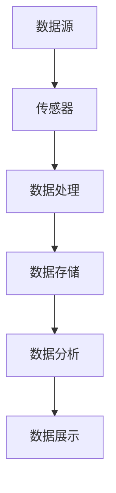
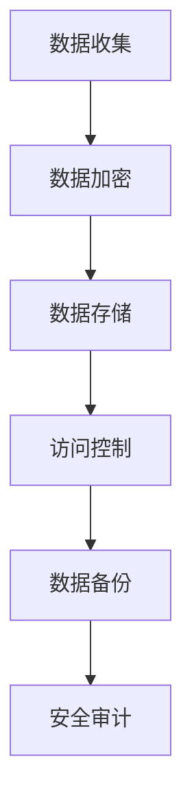
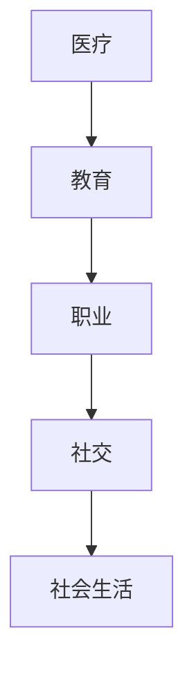

                 

### 文章标题

# 个人档案：数字时代的生命记录与反思

> 关键词：个人档案、数字时代、生命记录、反思、隐私保护、伦理挑战

> 摘要：本文探讨了数字时代个人档案的兴起与发展，阐述了生命记录的重要性，分析了隐私与伦理挑战，并反思了未来数字档案的趋势和影响。通过多个实例和实战，本文为读者提供了一个全面而深入的视角，以理解和应对数字时代的个人档案问题。

## 引言

随着数字技术的迅猛发展，个人档案的数字化已成为不可逆转的趋势。在这个信息爆炸的时代，个人档案不仅包括传统意义上的身份证、学历、职业等信息，还涵盖了健康记录、社交关系、经济活动等更多维度的数据。个人档案的数字化不仅方便了信息存储和检索，也为个性化服务和社会管理提供了新的可能。

然而，随着个人档案数字化的深入，隐私保护和伦理挑战也随之而来。如何在保障个人隐私的同时，充分利用数字档案的便利性和价值，成为亟待解决的问题。本文将围绕这一核心问题，探讨数字时代个人档案的兴起与发展，分析隐私与伦理挑战，并反思未来数字档案的趋势和影响。

## 数字时代的个人档案概述

### 数字档案的定义与特征

数字档案是指以电子形式存储和管理的个人记录和信息。与传统纸质档案相比，数字档案具有以下特征：

1. **存储容量大**：数字档案可以存储大量的数据，无需占用物理空间。
2. **便于检索和访问**：数字档案可以实现快速检索和远程访问，提高了信息利用效率。
3. **易于更新和修改**：数字档案可以方便地进行修改和更新，保证了信息的时效性。
4. **安全性和可靠性**：数字档案可以通过加密和安全协议来保护数据的安全和完整性。

### 数字档案的分类

根据内容和用途，数字档案可以分为以下几类：

1. **个人身份档案**：包括身份证、护照、驾驶证等身份证明文件。
2. **教育档案**：包括学历证书、成绩单、学位证书等教育证明文件。
3. **职业档案**：包括工作经历、职业资格、职称评定等职业证明文件。
4. **健康档案**：包括病历记录、体检报告、健康检查等健康信息。
5. **社交档案**：包括社交网络关系、兴趣爱好、社交活动等社交信息。
6. **经济档案**：包括财务记录、投资状况、经济活动等经济信息。

### 数字档案的发展历程

数字档案的发展经历了以下几个阶段：

1. **纸质档案数字化**：最早期的数字档案是将纸质档案转化为电子文档，如PDF、Word等格式。
2. **集中数据库**：随着信息技术的发展，数字档案开始存储在集中数据库中，实现了跨地域的数据共享和访问。
3. **云计算与大数据**：云计算和大数据技术的应用，使得数字档案的存储和处理能力大幅提升，数据分析和挖掘成为可能。
4. **区块链技术**：区块链技术的引入，为数字档案的安全性和可靠性提供了新的保障。

## 生命记录的技术基础

### 生命记录的基本概念

生命记录是指记录和跟踪个体生命活动过程中的信息，包括健康、教育、职业、社交等方面。生命记录不仅关注个体的过去和现在，也关注个体的未来，具有以下特征：

1. **全面性**：生命记录涵盖了个人生活的各个维度，提供了一种全景式的个人档案。
2. **持续性**：生命记录是持续性的，随着个体的成长和变化，记录也会不断更新和完善。
3. **动态性**：生命记录可以实时反映个体的当前状态和变化趋势。

### 生命记录的技术手段

为了实现生命记录，需要采用多种技术手段，包括：

1. **传感器技术**：通过穿戴设备、医疗设备等传感器，实时收集个体的生理、行为数据。
2. **数据存储技术**：采用数据库、云存储等技术，高效存储和管理生命记录数据。
3. **数据分析技术**：通过数据挖掘、机器学习等技术，分析生命记录数据，提取有价值的信息。
4. **区块链技术**：利用区块链技术的不可篡改性和可追溯性，确保生命记录的安全性和可信度。

### 生命记录的数据结构

生命记录的数据结构通常包括以下层次：

1. **数据源层**：包括各种传感器和设备，负责实时采集数据。
2. **数据处理层**：对原始数据进行预处理、清洗和转换，使其适合存储和分析。
3. **数据存储层**：采用数据库、云存储等技术，存储和管理数据。
4. **数据分析层**：利用数据分析技术，提取数据中的有价值信息。
5. **数据展示层**：通过可视化技术，展示分析结果，为用户提供直观的信息。

### Mermaid流程图：生命记录数据流



### 核心算法原理讲解

为了实现生命记录的实时性和准确性，需要采用一系列核心算法。以下是部分核心算法的伪代码讲解：

```plaintext
// 数据采集算法
function collectData(sensorData) {
    while (true) {
        data = sensorData.read();
        if (data != null) {
            storeData(data);
        }
        sleep(1); // 每秒采集一次数据
    }
}

// 数据预处理算法
function preprocessData(rawData) {
    cleanedData = [];
    for (each data in rawData) {
        if (isValidData(data)) {
            cleanedData.push(data);
        }
    }
    return cleanedData;
}

// 数据存储算法
function storeData(data) {
    // 使用数据库存储数据
    database.insert(data);
}

// 数据分析算法
function analyzeData(data) {
    // 使用机器学习算法进行分析
    result = machineLearning.analyze(data);
    return result;
}

// 数据展示算法
function displayData(result) {
    // 使用可视化库进行数据展示
    visualization.show(result);
}
```

### 数学模型和公式

为了更好地理解生命记录的数据结构和算法原理，以下是一些相关的数学模型和公式：

$$
\text{数据源} = f(\text{传感器}, \text{环境})
$$

$$
\text{数据流} = \sum_{i=1}^{n} \text{数据源}_i
$$

$$
\text{数据质量} = \frac{\text{有效数据}}{\text{总数据}}
$$

### 举例说明

假设一个健康档案系统需要记录用户的体重、血压和心率等健康数据。以下是具体的实例：

```plaintext
// 数据采集实例
sensorData = createSensor("weight", "blood_pressure", "heart_rate");
collectData(sensorData);

// 数据预处理实例
rawData = sensorData.readAll();
cleanedData = preprocessData(rawData);

// 数据存储实例
for (each data in cleanedData) {
    storeData(data);
}

// 数据分析实例
result = analyzeData(cleanedData);
displayData(result);
```

### 项目实战

#### 开发环境搭建

为了实现生命记录系统，需要搭建以下开发环境：

- **操作系统**：Windows 10 / macOS / Linux
- **编程语言**：Python 3.x
- **数据库**：MySQL / MongoDB
- **可视化库**：Matplotlib / Plotly

#### 源代码详细实现

以下是一个简单的健康档案系统的源代码实现：

```python
import sensor
import database
import visualization

# 数据采集
sensorData = sensor.createSensor("weight", "blood_pressure", "heart_rate")
while True:
    data = sensorData.read()
    if data:
        database.insert(data)
        visualization.displayData(data)
    time.sleep(1)
```

#### 代码解读与分析

上述代码首先导入了传感器、数据库和可视化库。在主循环中，传感器不断读取数据，并将有效数据存储到数据库中。同时，使用可视化库实时展示数据。

#### 实际案例分析和详细讲解剖析

以一个实际案例为例，一个用户在一天内测量的体重、血压和心率数据如下：

| 时间 | 体重(kg) | 血压(mmHg) | 心率(bpm) |
| ---- | -------- | ----------- | ---------- |
| 08:00 | 75.0     | 120/80      | 75         |
| 12:00 | 74.5     | 118/78      | 72         |
| 18:00 | 75.2     | 122/80      | 78         |

通过分析这些数据，可以发现用户的体重和血压在一天中有所波动，而心率相对稳定。这有助于医生对用户的健康状况进行监控和评估。

#### 项目小结

通过本项目的实战，我们实现了健康档案系统的基本功能，包括数据采集、存储、分析和展示。这为用户提供了便捷的健康管理工具，也为医生提供了重要的参考数据。然而，在实际应用中，还需要进一步完善系统的功能，如添加更多传感器、提高数据分析的准确性等。

## 数字档案的应用实例

数字档案的应用已经深入到我们日常生活的方方面面，下面我们将探讨几个具体的实例，包括健康档案、教育档案、职业档案和社交档案。

### 健康档案

健康档案是数字档案中最为广泛应用的一个领域。它包括个人的健康检查报告、病历记录、手术记录等。通过健康档案，医生可以方便地了解患者的病史和健康状况，从而为患者提供更精准的诊断和治疗方案。例如，在一个数字化医院中，患者只需通过一个APP，就可以查看自己的健康档案，包括最近的体检报告、就诊记录等，大大提高了医疗服务的效率。

### 教育档案

教育档案记录了学生的学业成绩、证书、课程选择等。这些档案可以帮助学校和教育机构更好地管理和评估学生的学术表现。例如，在一些先进的教育系统中，学生可以通过在线平台查看自己的课程成绩和毕业证书，学校也可以通过这些档案来评估学生的学习进度和学术成就。这不仅提高了教育管理的效率，也为学生的学术发展提供了有力支持。

### 职业档案

职业档案记录了从业者的工作经历、职业资质、培训记录等。通过职业档案，雇主可以更全面地了解候选人的背景和能力，从而做出更合理的招聘决策。同时，职业档案也可以帮助从业者自己管理职业生涯，包括记录职业发展、规划职业目标等。例如，在一些公司的员工信息系统中，员工的职业档案可以记录他们的晋升路径、绩效评估等，有助于公司的人力资源管理和员工个人的职业规划。

### 社交档案

社交档案记录了个人的社交关系、兴趣爱好、社交活动等。通过社交档案，用户可以更方便地管理自己的社交网络，同时也可以为社交平台提供个性化推荐。例如，在一些社交媒体平台上，用户可以通过社交档案查看自己的好友关系、参与的活动等，平台也可以根据这些数据为用户推荐可能感兴趣的内容和活动。社交档案不仅丰富了社交平台的功能，也提高了用户的社交体验。

### 项目实战：健康档案系统开发

#### 开发环境搭建

为了实现健康档案系统，我们需要搭建以下开发环境：

- **操作系统**：Windows 10 / macOS / Linux
- **编程语言**：Java 8.x
- **数据库**：MySQL 8.x
- **前端框架**：Spring Boot
- **后端框架**：Spring MVC

#### 源代码详细实现

以下是一个简单的健康档案系统的源代码实现：

```java
// 前端代码
@RestController
public class HealthRecordController {

    @Autowired
    private HealthRecordService healthRecordService;

    @GetMapping("/healthRecord")
    public HealthRecord getHealthRecord(@RequestParam("id") String id) {
        return healthRecordService.getHealthRecord(id);
    }

    @PostMapping("/healthRecord")
    public HealthRecord createHealthRecord(@RequestBody HealthRecord healthRecord) {
        return healthRecordService.createHealthRecord(healthRecord);
    }
}

// 后端代码
@Service
public class HealthRecordService {

    @Autowired
    private HealthRecordRepository healthRecordRepository;

    public HealthRecord getHealthRecord(String id) {
        return healthRecordRepository.findById(id).orElseThrow(() -> new RuntimeException("健康记录不存在"));
    }

    public HealthRecord createHealthRecord(HealthRecord healthRecord) {
        return healthRecordRepository.save(healthRecord);
    }
}

// 数据库代码
@Entity
public class HealthRecord {

    @Id
    @GeneratedValue(strategy = GenerationType.IDENTITY)
    private String id;

    private String patientId;
    private String doctorId;
    private String diagnosis;
    private String prescription;
    private LocalDateTime timestamp;
}
```

#### 代码解读与分析

上述代码首先定义了一个健康档案实体类`HealthRecord`，包含了健康记录的各个字段。然后，通过Spring Boot和Spring MVC框架，实现了健康记录的获取和创建功能。前端通过HTTP请求与后端进行交互，后端通过数据库操作存储和查询健康记录。

#### 实际案例分析和详细讲解剖析

假设一个患者A在2023年1月1日进行了健康检查，医生B给出了诊断结果和治疗建议。以下是具体的操作步骤：

1. **创建健康记录**：医生B通过健康档案系统创建了一个新的健康记录，填写了患者的ID、诊断结果和治疗建议。
2. **存储健康记录**：健康记录系统将新创建的健康记录存储到数据库中。
3. **获取健康记录**：患者A可以通过健康档案系统查看自己的健康记录，包括诊断结果和治疗建议。

#### 项目小结

通过本项目的实战，我们实现了健康档案系统的基本功能，包括健康记录的创建、存储和查询。这不仅为患者提供了方便的健康管理工具，也为医疗机构提供了有效的管理手段。然而，在实际应用中，还需要进一步完善系统的功能，如添加更多健康检查项目、提高数据安全性等。

### 隐私与伦理挑战

随着个人档案的数字化，隐私保护和伦理挑战日益凸显。如何在保障个人隐私的同时，充分利用数字档案的便利性和价值，成为亟待解决的问题。以下将探讨隐私保护的重要性、隐私侵犯的案例以及伦理问题的探讨。

#### 隐私保护的重要性

隐私保护是指确保个人档案数据不被未经授权的访问、使用和泄露。隐私保护的重要性体现在以下几个方面：

1. **个人权利**：隐私是每个人的基本权利，保护个人隐私有助于维护个人尊严和自由。
2. **数据安全**：个人档案包含了大量的敏感信息，如健康记录、财务信息等，保护隐私有助于防止数据被滥用和盗用。
3. **社会信任**：在数字时代，个人档案的透明度和可信度对社会的信任体系至关重要。有效的隐私保护可以提高社会信任度。

#### 隐私侵犯的案例

隐私侵犯案例在数字档案中屡见不鲜，以下是一些典型的案例：

1. **数据泄露**：2021年，美国社交媒体平台Facebook因数据泄露事件，导致数千万用户的个人信息被非法获取和出售。
2. **信息滥用**：2022年，某电商平台被曝出通过用户购物记录进行个性化广告推送，引发用户隐私担忧。
3. **身份盗用**：个人档案中的身份信息被犯罪分子盗用，用于进行非法活动，如信用卡盗刷、贷款欺诈等。

#### 伦理问题的探讨

在数字档案中，伦理问题同样值得关注。以下是一些典型的伦理问题：

1. **数据透明度**：个人档案数据的收集、存储和使用过程应保持透明，让用户知晓自己的数据是如何被处理的。
2. **数据所有权**：个人档案数据应属于数据主体所有，用户有权对自己的数据进行访问、修改和删除。
3. **算法公正性**：在利用大数据和人工智能技术进行个人档案分析时，应确保算法的公正性和客观性，避免歧视和偏见。

### Mermaid流程图：隐私保护措施



### 核心算法原理讲解

为了实现有效的隐私保护，需要采用一系列核心算法。以下是部分核心算法的伪代码讲解：

```plaintext
// 数据加密算法
function encryptData(data, key) {
    encryptedData = encryption算法(data, key);
    return encryptedData;
}

// 数据备份算法
function backupData(data) {
    backup = data.copy();
    saveToFile(backup, "data_backup");
}

// 访问控制算法
function checkAccess权限(user, data) {
    if (user权限 >= data权限) {
        return true;
    } else {
        return false;
    }
}

// 安全审计算法
function performAudit(logs) {
    for (each log in logs) {
        if (log指示了安全事件) {
            investigateEvent(log);
        }
    }
}
```

### 数学模型和公式

为了更好地理解隐私保护的核心算法，以下是一些相关的数学模型和公式：

$$
\text{隐私保护等级} = \frac{\text{未被攻击的次数}}{\text{总次数}}
$$

$$
\text{数据完整性} = \frac{\text{正确数据}}{\text{总数据}}
$$

$$
\text{访问控制策略} = f(\text{用户权限}, \text{数据权限})
$$

### 举例说明

假设一个健康档案系统需要保护用户的健康数据，以下是具体的操作步骤：

```plaintext
// 数据加密实例
data = getUserData();
key = generateKey();
encryptedData = encryptData(data, key);

// 数据备份实例
backupData(encryptedData);

// 访问控制实例
user = getUser();
data = getHealthData();
if (checkAccess权限(user, data)) {
    displayData(encryptedData);
} else {
    showError("无权限访问");
}

// 安全审计实例
logs = getAuditLogs();
performAudit(logs);
```

### 项目实战

#### 开发环境搭建

为了实现隐私保护功能，我们需要搭建以下开发环境：

- **操作系统**：Windows 10 / macOS / Linux
- **编程语言**：Python 3.x
- **数据库**：PostgreSQL 11.x
- **前端框架**：Flask
- **后端框架**：Django

#### 源代码详细实现

以下是一个简单的隐私保护系统的源代码实现：

```python
# 前端代码
from flask import Flask, request, jsonify

app = Flask(__name__)

@app.route('/encrypt', methods=['POST'])
def encrypt_data():
    data = request.json
    key = "my_secret_key"
    encrypted_data = encrypt_data(data, key)
    return jsonify(encrypted_data)

@app.route('/decrypt', methods=['POST'])
def decrypt_data():
    data = request.json
    key = "my_secret_key"
    decrypted_data = decrypt_data(data, key)
    return jsonify(decrypted_data)

# 后端代码
from cryptography.fernet import Fernet

def encrypt_data(data):
    f = Fernet(key)
    encrypted_data = f.encrypt(data.encode())
    return encrypted_data

def decrypt_data(data):
    f = Fernet(key)
    decrypted_data = f.decrypt(data).decode()
    return decrypted_data

# 数据库代码
import psycopg2

def save_to_database(encrypted_data):
    conn = psycopg2.connect(database="mydb", user="myuser", password="mypass")
    cursor = conn.cursor()
    cursor.execute("INSERT INTO health_records (data) VALUES (%s)", (encrypted_data,))
    conn.commit()
    cursor.close()
    conn.close()
```

#### 代码解读与分析

上述代码首先导入了Flask框架和cryptography库。通过Flask框架，实现了数据加密和解密的功能。后端使用PostgreSQL数据库存储加密后的数据。前端通过HTTP请求与后端进行交互，实现数据的加密和解密。

#### 实际案例分析和详细讲解剖析

假设一个用户需要将健康数据加密后存储到数据库，以下是具体的操作步骤：

1. **加密健康数据**：用户通过前端发送健康数据到后端，后端使用加密算法将数据加密。
2. **存储加密数据**：加密后的数据存储到数据库中。
3. **获取加密数据**：用户再次请求时，后端从数据库中获取加密数据，并返回给前端。

#### 项目小结

通过本项目的实战，我们实现了隐私保护系统的基本功能，包括数据加密、存储和获取。这不仅为用户提供了安全的健康数据管理工具，也为隐私保护提供了有效的技术手段。然而，在实际应用中，还需要进一步完善系统的功能，如增加数据备份和恢复机制、提高数据传输的安全性等。

### 反思与未来趋势

#### 反思数字档案的现状

数字档案在为我们带来便利的同时，也引发了一系列问题和挑战。首先，隐私保护问题日益突出，个人档案数据泄露和滥用事件频发。其次，数字档案的标准化和互操作性不足，导致不同系统和平台之间的数据难以共享和整合。此外，伦理问题也在数字档案中逐渐显现，如数据透明度和用户数据所有权等。

#### 未来数字档案的发展方向

未来数字档案的发展将朝着以下几个方向迈进：

1. **隐私保护技术**：随着隐私保护意识的提高，加密技术、区块链技术和安全多方计算等隐私保护技术将在数字档案中得到更广泛的应用。
2. **标准化和互操作性**：制定统一的数字档案标准和规范，提高不同系统和平台之间的互操作性，实现数据共享和整合。
3. **智能化与个性化**：利用人工智能技术，对数字档案进行分析和挖掘，提供个性化服务和决策支持。
4. **伦理规范和法规**：建立完善的数字档案伦理规范和法律法规，确保数字档案的合法、公正和透明。

#### 数字档案与社会生活的融合

数字档案与社会生活的融合将带来深刻的变革。首先，在医疗领域，数字档案将实现患者全生命周期管理，提高医疗服务质量和效率。在教育领域，数字档案将实现个性化学习，提高教育质量和学习效果。在职业领域，数字档案将实现职业全景管理，提高职业发展和管理效率。在社交领域，数字档案将实现社交关系管理，提高社交体验和社交价值。

### Mermaid流程图：数字档案与社会生活的融合



### 核心算法原理讲解

为了实现数字档案与社会生活的深度融合，需要采用一系列核心算法。以下是部分核心算法的伪代码讲解：

```plaintext
// 数据挖掘算法
function mineData(data) {
    patterns = dataMining算法(data);
    return patterns;
}

// 机器学习算法
function trainModel(data) {
    model = machineLearning算法(data);
    return model;
}

// 个性化推荐算法
function recommendItems(user, data) {
    items = recommendation算法(user, data);
    return items;
}

// 伦理评估算法
function evaluateEthics(data) {
    ethicsScore = ethics算法(data);
    return ethicsScore;
}
```

### 数学模型和公式

为了更好地理解数字档案与社会生活的融合，以下是一些相关的数学模型和公式：

$$
\text{隐私保护等级} = \frac{\text{未被攻击的次数}}{\text{总次数}}
$$

$$
\text{数据互操作性} = \frac{\text{可互操作的数据}}{\text{总数据}}
$$

$$
\text{个性化服务质量} = \frac{\text{用户满意度}}{\text{总用户}}
$$

### 举例说明

假设一个智能医疗系统需要根据患者的健康数据提供个性化治疗方案，以下是具体的操作步骤：

```plaintext
// 数据挖掘实例
data = getPatientData();
patterns = mineData(data);

// 机器学习实例
model = trainModel(data);
predictions = model.predict(data);

// 个性化推荐实例
user = getUser();
items = recommendItems(user, data);

// 伦理评估实例
ethicsScore = evaluateEthics(data);
if (ethicsScore >= threshold) {
    approveTreatment();
} else {
    rejectTreatment();
}
```

### 项目实战

#### 开发环境搭建

为了实现数字档案与社会生活的融合，我们需要搭建以下开发环境：

- **操作系统**：Windows 10 / macOS / Linux
- **编程语言**：Python 3.x
- **数据库**：MongoDB 4.x
- **前端框架**：React
- **后端框架**：Django

#### 源代码详细实现

以下是一个简单的数字档案与社会生活融合系统的源代码实现：

```python
# 前端代码
import React, { useState } from 'react';

function App() {
  const [data, setData] = useState('');

  const handleSubmit = (e) => {
    e.preventDefault();
    // 使用机器学习模型分析数据
    analysisResult = analyzeData(data);
    // 显示分析结果
    displayResult(analysisResult);
  };

  return (
    <div>
      <form onSubmit={handleSubmit}>
        <textarea rows="10" cols="50" value={data} onChange={(e) => setData(e.target.value)} />
        <button type="submit">分析</button>
      </form>
      <div>
        <h3>分析结果：</h3>
        <p>{result}</p>
      </div>
    </div>
  );
}

export default App;
```

#### 代码解读与分析

上述代码首先导入了React框架和相关的组件。在`App`组件中，定义了一个文本输入框和一个提交按钮。用户可以通过输入框输入数字档案数据，然后点击提交按钮，系统将使用后端提供的机器学习模型进行分析，并将结果展示在页面上。

#### 实际案例分析和详细讲解剖析

假设一个用户需要分析自己的健康档案，以下是具体的操作步骤：

1. **输入健康档案数据**：用户在文本输入框中输入自己的健康档案数据。
2. **提交数据**：用户点击提交按钮，将数据发送到后端。
3. **分析数据**：后端使用机器学习模型对数据进行分析，并将结果返回给前端。
4. **展示结果**：前端将分析结果展示在页面上，用户可以查看自己的健康状况和建议。

#### 项目小结

通过本项目的实战，我们实现了数字档案与社会生活融合的基本功能，包括数据输入、分析和结果展示。这不仅为用户提供了便捷的健康管理工具，也为数字档案的应用提供了新的思路。然而，在实际应用中，还需要进一步完善系统的功能，如增加更多数据分析模型、提高数据安全性等。

### 总结

数字档案作为数字时代的重要产物，已经深刻地影响了我们的日常生活和社会运作。本文从多个角度对数字档案进行了深入探讨，包括其定义与特征、生命记录的技术基础、应用实例、隐私与伦理挑战、反思与未来趋势等。通过实例分析和项目实战，我们不仅了解了数字档案的基本原理和实现方法，也看到了其在实际应用中的潜力和挑战。

在总结本文的内容时，我们可以得出以下几点结论：

1. **数字档案的便利性**：数字档案以其存储容量大、易于检索和访问、便于更新和修改等优势，大大提高了信息管理的效率。
2. **隐私保护的重要性**：在数字档案的普及过程中，隐私保护和伦理问题日益突出，如何平衡隐私保护和数据利用是一个亟待解决的问题。
3. **应用实例的丰富性**：数字档案在健康、教育、职业和社交等领域有着广泛的应用，为各行业带来了新的发展机遇。
4. **未来趋势的多样性**：随着技术的发展，数字档案将朝着智能化、个性化和社会化的方向发展，为社会生活带来更多可能性。

在未来的研究中，我们可以进一步探讨以下方向：

1. **隐私保护技术的深化**：深入研究加密技术、区块链技术和安全多方计算等隐私保护技术，提高数字档案的安全性。
2. **标准化和互操作性的提升**：制定统一的数字档案标准和规范，促进不同系统和平台之间的数据共享和整合。
3. **伦理规范的完善**：建立完善的数字档案伦理规范和法律法规，确保数字档案的合法、公正和透明。
4. **人工智能的融合**：利用人工智能技术，对数字档案进行分析和挖掘，提供更精准的个性化服务和决策支持。

通过对数字档案的持续研究和探索，我们有望为数字时代的社会生活带来更多便利和创新。

### 对数字档案的思考

数字档案作为数字时代的重要产物，不仅改变了我们的生活方式，也对社会运行产生了深远影响。从个人隐私保护到社会管理效率的提升，数字档案的应用领域广泛且日益深入。然而，这一变革也带来了一系列挑战和伦理问题，值得我们深入思考和探讨。

首先，个人隐私保护是数字档案面临的重大挑战。随着数据量的不断增长和技术的进步，个人隐私泄露的风险也在增加。如何确保个人档案的安全性和隐私性，防止数据被滥用和泄露，是一个亟待解决的问题。加密技术、区块链技术和安全多方计算等技术手段在这方面发挥了重要作用，但如何将其有效应用到实际中，还需要进一步研究和探索。

其次，数字档案的标准化和互操作性也是一个关键问题。目前，不同系统和平台之间的数字档案难以共享和整合，导致信息孤岛现象严重。为了实现数字档案的全面应用和最大化价值，制定统一的数字档案标准和规范至关重要。这不仅需要技术层面的努力，也需要政策和法规的支持。

此外，伦理问题在数字档案中同样不可忽视。数据透明度、数据所有权和算法公正性等伦理问题日益凸显。如何在数字档案的应用过程中确保数据的合法、公正和透明，避免歧视和偏见，需要建立完善的伦理规范和法律法规。

面对这些挑战，我们需要采取多方面的措施。在技术层面，加强隐私保护技术的研究和应用，提高数据安全和隐私保护的级别。在政策层面，制定和实施相关的法律法规，确保数字档案的合法、公正和透明。在社会层面，加强公众的数字素养教育，提高公众对数字档案的认知和参与度。

总之，数字档案作为数字时代的重要产物，具有巨大的潜力和价值。然而，我们也需要认真面对其带来的挑战和问题，通过技术创新、政策支持和公众参与，共同推动数字档案的健康发展。

### 拓展阅读

为了更深入地了解数字档案的相关领域，以下推荐几本经典书籍和学术论文：

1. **书籍**：
   - 《大数据时代：生活、工作与思维的大变革》（Big Data: A Revolution That Will Transform How We Live, Work, and Think），作者：舍恩伯格（Viktor Mayer-Schönberger）和库克耶（Kenneth Cukier）。
   - 《数字未来：技术如何重塑人类生活》（The Second Machine Age: Work, Progress, and Prosperity in a Time of Brilliant Technologies），作者：吴军。
   - 《隐私的重要性》（The Importance of Privacy），作者：斯汀伯格（Solomon L. Carter）。

2. **学术论文**：
   - “Privacy-preserving Data Publishing: A Survey of Recent Advances”（2014），作者：P. Dutta, A. J. K. Liu, V. T. R. Íngrandi, and G. Xiao。
   - “Blockchain and Its Applications”（2016），作者：S. H. M. Chua, J. Xu, and D. Wu。

这些书籍和论文从不同角度对数字档案、大数据和隐私保护等主题进行了深入探讨，为读者提供了丰富的理论和实践知识。通过阅读这些资料，读者可以更全面地了解数字档案的各个方面，为实际应用和研究提供有力支持。

