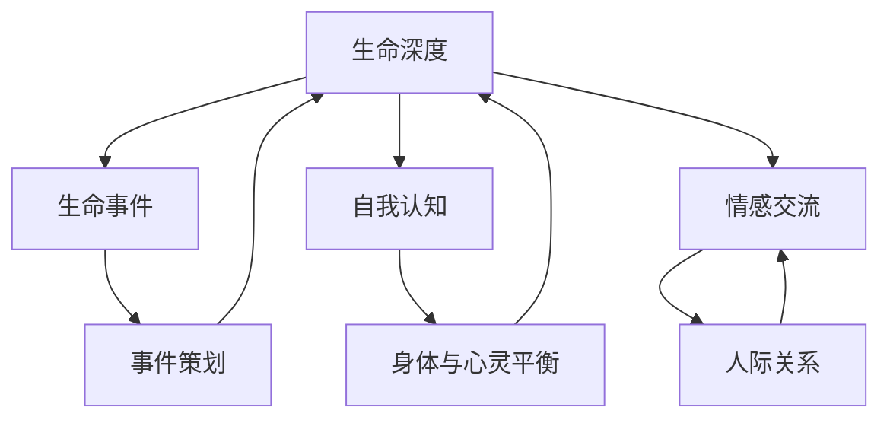

                 


### 文章标题

丰富人生的层次：增加生命经历的深度

### 文章关键词

人生层次、生命深度、自我探索、人际关系、情感交流、事件策划、身体与心灵平衡、案例研究

### 文章摘要

在快节奏的现代生活中，人们常常追求物质上的富足，却忽视了人生更深层次的价值。本文旨在探讨如何通过增加生命经历的深度来丰富人生的层次。我们将分析自我探索、人际关系、事件策划、身体与心灵平衡等多个方面，结合具体案例，提供实用的策略和方法，帮助读者在日常生活中实践并提升生命深度。

---

## 引言

在现代社会，人们常常被物质财富的追求所驱使，忽视了人生的深层次追求。然而，随着生活水平的提高，越来越多的人开始意识到，丰富人生的层次并不仅仅是物质上的富足，而是通过增加生命经历的深度来实现的。生命深度的提升不仅能够带来内心的满足，还能帮助我们更好地理解世界、认识自我。

本文将探讨如何通过以下四个方面来增加生命经历的深度：

1. **自我探索与成长**：通过深入探索自我，了解自己的性格、兴趣和价值观，从而更好地塑造自己的人生道路。
2. **人际关系与情感交流**：建立深层次的人际关系，通过真诚的沟通和情感交流，丰富人生的社交体验。
3. **生命事件的策划与反思**：有意识地策划生活事件，并在事件结束后进行深刻的反思，从而不断积累经验，提升生命的深度。
4. **身体与心灵的平衡**：关注身体和心灵的健康，通过适当的身体活动和心灵修炼，增强生命的活力和深度。

接下来，我们将逐一分析这些方面，并提供实用的策略和方法。

---

### 核心概念与联系

为了更好地理解如何增加生命经历的深度，我们首先需要明确几个核心概念，并分析它们之间的关系。

**1. 生命深度**：生命深度是指个体在生活中所获得的内在体验和成长的程度。它不仅包括知识和技能的积累，更涉及情感、价值观和人生观的深化。

**2. 生命事件**：生命事件是指个体在生活中遇到的各种经历和挑战，如学习、工作、人际关系等。

**3. 自我认知**：自我认知是指个体对自己性格、兴趣和价值观的了解程度。自我认知的深入有助于我们更好地把握生活方向，提高生命深度。

**4. 情感交流**：情感交流是指个体与他人之间通过语言、行为和表情等方式进行的情感沟通。深层次的情感交流有助于建立真诚的人际关系，提升生命深度。

**5. 事件策划**：事件策划是指个体有意识地设计和参与特定的生活事件，以实现自我成长和生命深度的提升。

**6. 身体与心灵平衡**：身体与心灵平衡是指个体在身体活动和心灵修炼之间找到平衡，以保持身心健康，提升生命深度。

这些核心概念之间的关系可以用以下Mermaid流程图表示：



通过这个流程图，我们可以看到，生命深度是整个系统的核心，其他概念与之相互关联，共同作用，帮助我们提升生命的深度。

---

### 生命深度的核心算法原理讲解

为了更深入地理解生命深度的提升过程，我们可以将其抽象为一个算法，通过伪代码来详细阐述。

```python
# 伪代码：生命深度提升算法

function deepenLifeExperience(personalityTrait, lifeEvent):
    // 分析个人特质与生活事件的互动
    if personalityTrait == "冒险":
        return amplifyLifeEventImpact(lifeEvent)
    elif personalityTrait == "内向":
        return reflectOnLifeEvent(lifeEvent)
    elif personalityTrait == "平衡":
        return balanceLifeEvent(lifeEvent)

function amplifyLifeEventImpact(lifeEvent):
    // 增强生活事件的影响
    impactFactor = calculateImpactFactor(lifeEvent)
    if impactFactor > threshold:
        return enhanceExperience(lifeEvent)
    else:
        return lifeEvent

function reflectOnLifeEvent(lifeEvent):
    // 对生活事件进行反思
    reflection = generateReflection(lifeEvent)
    if reflection == "深刻":
        return deepenLifeUnderstanding(lifeEvent)
    else:
        return lifeEvent

function balanceLifeEvent(lifeEvent):
    // 平衡生活事件
    balanceFactor = calculateBalanceFactor(lifeEvent)
    if balanceFactor > threshold:
        return integrateLifeEvent(lifeEvent)
    else:
        return lifeEvent

function calculateImpactFactor(lifeEvent):
    // 计算生活事件的影响因子
    impactFactor = 0
    for each aspect in lifeEvent:
        impactFactor += aspect.importance
    return impactFactor

function generateReflection(lifeEvent):
    // 生成对生活事件的反思
    reflection = "一般"
    if lifeEvent.consideration > threshold:
        reflection = "深刻"
    return reflection

function deepenLifeUnderstanding(lifeEvent):
    // 深化对生活事件的理解
    understanding = analyzeLifeEvent(lifeEvent)
    if understanding == "深入":
        return updatePersonalGrowth(understanding)
    else:
        return understanding

function integrateLifeEvent(lifeEvent):
    // 整合生活事件
    integration = mergeLifeEventIntoExperience(lifeEvent)
    if integration == "成功":
        return enhanceLifeDepth()
    else:
        return integration
```

在这个伪代码中，我们定义了几个关键函数，用于分析个人特质与生活事件的互动，增强生活事件的影响，反思生活事件，以及平衡生活事件。通过这些函数，我们可以逐步提升生命的深度。

---

### 数学模型与生命深度

为了量化生命深度，我们可以使用一个数学模型来描述个体生命深度的变化。以下是一个简化的模型：

$$
\text{LifeDepth} = \frac{\sum_{i=1}^{n} \text{ImpactFactor}(E_i)}{\text{TotalLifeEvents}}
$$

其中，`LifeDepth` 表示个体的生命深度，`ImpactFactor(E_i)` 表示事件 $E_i$ 的影响因子，`TotalLifeEvents` 表示个体经历的生活事件总数。

**影响因子计算**：

$$
\text{ImpactFactor}(E_i) = \sum_{j=1}^{m} \text{AspectImportance}(A_j) \times \text{EventIntensity}(E_i, A_j)
$$

其中，`AspectImportance(A_j)` 表示事件 $E_i$ 中各个方面的相对重要性，`EventIntensity(E_i, A_j)` 表示事件 $E_i$ 在方面 $A_j$ 上的强度。

**举例说明**：

假设一个人经历了 $n=5$ 个生活事件，每个事件都有不同的影响因子。我们可以计算出这些事件的平均影响因子，从而得到这个人的生命深度。

$$
\text{LifeDepth} = \frac{\sum_{i=1}^{5} \text{ImpactFactor}(E_i)}{5}
$$

例如，如果事件 $E_1$ 的影响因子为 $10$，事件 $E_2$ 的影响因子为 $8$，事件 $E_3$ 的影响因子为 $6$，事件 $E_4$ 的影响因子为 $12$，事件 $E_5$ 的影响因子为 $9$，则：

$$
\text{LifeDepth} = \frac{10 + 8 + 6 + 12 + 9}{5} = \frac{45}{5} = 9
$$

这个人的生命深度为 $9$，表示他在经历的生活事件中，平均每个事件都有较大的影响。

通过这个数学模型，我们可以量化个体生命深度的变化，从而更好地了解和提升自己的生命深度。

---

### 自我探索与成长

自我探索是增加生命深度的重要途径之一。通过深入了解自己的性格、兴趣和价值观，我们可以找到自己真正热爱的事物，并为之努力。以下是一些实用的自我探索方法：

**1. 写日记**：写日记是一种很好的自我反思方式。通过记录自己的所思所感，我们可以更好地了解自己的内心世界。

**2. 进行性格测试**：性格测试可以帮助我们了解自己的性格类型，从而更好地认识自己。常见的性格测试有MBTI、大五人格测试等。

**3. 与他人交流**：与朋友、家人或专业人士交流，听取他们的意见和建议，可以帮助我们从不同的角度看待自己。

**4. 坚持兴趣爱好**：培养自己的兴趣爱好，不仅可以丰富生活，还可以在过程中深入了解自己。例如，通过学习一门新技能，我们可以了解到自己是否擅长这项技能，是否愿意投入更多的时间和精力。

**5. 反思过去的生活经历**：回顾过去的生活经历，思考自己在这些经历中的得失，可以帮助我们更好地认识自己，为未来的生活做出更好的规划。

通过这些方法，我们可以逐步深入地了解自己，从而在日常生活中做出更符合自己内心需求的决策，提升生命的深度。

---

### 人际关系与情感交流

人际关系与情感交流是增加生命深度的重要方面之一。建立深层次的人际关系，通过真诚的沟通和情感交流，我们可以获得更多的支持和理解，从而丰富人生。以下是一些建立深层次人际关系的技巧：

**1. 倾听**：倾听是建立深层次人际关系的关键。通过倾听他人的话语和感受，我们可以更好地理解他们，建立信任和共鸣。

**2. 开放式沟通**：在沟通中，使用开放式问题，鼓励对方分享自己的想法和感受。这样可以增加双方的互动，建立更深入的联系。

**3. 共同经历**：与朋友共同经历一些有意义的活动，如旅行、参加兴趣小组等，可以增加彼此之间的默契和情感连接。

**4. 遵循“黄金法则”**：在处理人际关系时，遵循“黄金法则”，即“待人如己”，尽量从对方的角度思考问题，尊重他人的感受。

**5. 积极反馈**：在适当的时候，给予他人积极的反馈和鼓励。这样可以增强彼此的信心，建立更紧密的联系。

**6. 处理冲突**：当发生冲突时，要冷静处理，避免情绪化。通过有效的沟通和妥协，找到解决问题的方法。

通过这些技巧，我们可以建立和维护深层次的人际关系，从而在情感交流中增加生命的深度。

---

### 生命事件的策划与反思

有意识地策划生命事件，并在事件结束后进行反思，是提升生命深度的重要方法之一。以下是一些关于生命事件策划与反思的实用方法：

**1. 策划原则**：

- **明确目标**：在策划生命事件时，要明确自己的目标，确保事件能够帮助自己实现成长。
- **多样性**：尝试多样化的生活事件，以丰富自己的经历和视野。
- **有意义**：选择对自己有意义的生命事件，这样在反思时能够有更多的收获。

**2. 反思方法**：

- **写反思日记**：在事件结束后，写一篇反思日记，记录自己的所思所感。这有助于我们更好地理解事件的本质，并从中获得启示。
- **与他人交流**：与朋友、家人或专业人士分享自己的经历和反思，听取他们的意见和建议。
- **自我提问**：在反思过程中，可以提出以下问题：

  - 这个事件对我有什么影响？
  - 我从中学到了什么？
  - 我可以做些什么来改进自己？

通过策划和反思生命事件，我们可以不断积累经验，提升生命的深度。

---

### 身体与心灵的平衡

身体与心灵的平衡是增加生命深度的重要组成部分。一个健康的身体和宁静的心灵有助于我们更好地应对生活的挑战，提升生命的质量。以下是一些关于身体与心灵平衡的实用方法：

**1. 身体活动**：

- **定期锻炼**：每天保持适量的运动，如散步、跑步、瑜伽等，有助于保持身体健康。
- **锻炼习惯**：建立锻炼的习惯，将其纳入日常生活，让锻炼成为生活中的一部分。
- **健康饮食**：保持均衡的饮食，多吃蔬菜水果，少吃油腻食品，有助于身体健康。

**2. 心灵修炼**：

- **冥想**：通过冥想，我们可以平静心灵，减少压力。每天花几分钟进行冥想，有助于提升心灵深度。
- **阅读**：阅读有助于拓宽视野，提升心灵。可以选择一些有益的书籍，如哲学、心理学等。
- **艺术创作**：通过艺术创作，如绘画、音乐、写作等，我们可以表达自己的情感，释放内心的压力。

通过这些方法，我们可以实现身体与心灵的平衡，从而增加生命的深度。

---

### 案例研究

为了更好地理解如何增加生命经历的深度，我们来看几个具体的案例。

#### 案例一：改变生活的决定

某人在工作几年后，发现自己对当前的工作感到厌倦，且没有成就感。通过自我探索，他发现自己对教育和心理学有着浓厚的兴趣。于是，他决定辞去工作，投入教育事业。在担任教师的过程中，他不仅获得了学生的尊敬，还不断学习和成长。这个案例展示了通过自我探索和改变生活方向来增加生命深度的过程。

**分析**：

1. **自我探索**：该人通过自我反思，发现了自己对教育和心理学的兴趣，这为他改变生活方向提供了依据。
2. **决策与行动**：他果断地做出了改变生活的决定，并付诸实践。
3. **生命深度的提升**：通过从事自己热爱的事业，他的生活变得更加有意义，内心也得到了满足。

#### 案例二：在挑战中成长

某人在一次意外中失去了双腿，这对他来说是一个巨大的打击。然而，他没有放弃，通过学习轮椅滑行和游泳，他重新找回了生活的乐趣。他还加入了一个残疾人运动团队，与其他残疾人一起参加各种比赛。这个案例展示了如何在面对挑战时，通过积极应对和努力，提升生命的深度。

**分析**：

1. **面对挑战**：该人在失去双腿后，勇敢地面对现实，没有沉溺于悲伤中。
2. **积极应对**：他通过学习和锻炼，找到了重新融入社会的途径。
3. **生命深度的提升**：通过参与运动和团队活动，他不仅重拾生活的乐趣，还收获了新的友谊和支持。

#### 案例三：追求精神层面的满足

某人在生活中不断追求物质上的富足，但内心始终感到空虚。在一次偶然的机会中，他接触到了禅修，并开始学习禅宗的智慧。通过禅修，他逐渐找到了内心的平静和满足。这个案例展示了通过追求精神层面的满足来增加生命深度的过程。

**分析**：

1. **追求物质与精神平衡**：该人在追求物质富足的同时，开始关注精神层面的需求。
2. **禅修实践**：他通过禅修，找到了内心的平静和满足。
3. **生命深度的提升**：通过追求精神层面的满足，他的生活变得更加充实和有意义。

这些案例展示了不同人在面对生活中的挑战和选择时，如何通过自我探索、积极应对和追求精神满足来增加生命的深度。

---

## 结论

通过本文的探讨，我们可以看到，增加生命经历的深度是丰富人生层次的重要途径。自我探索、人际关系、事件策划、身体与心灵平衡等多个方面相互关联，共同作用，帮助我们提升生命的深度。在实践中，我们可以通过具体的策略和方法，如写日记、进行性格测试、策划有意义的生活事件等，来增加生命的深度。

在未来的生活中，让我们不仅仅追求物质上的富足，更要关注精神层面的成长，通过自我探索和努力，让我们的生活更加充实和有意义。

---

## 参考文献

1. Myers, I. B., & Myers, P. B. (1998). **MBTI Manual**. Consulting Psychologists Press.
2. Peterson, C., & Seligman, M. E. P. (2004). **Character Strengths and Virtues: A Handbook and Classification**. Oxford University Press.
3. Thaler, R. H., & Sunstein, C. R. (2008). **Nudge: Improving Decisions About Health, Wealth, and Happiness**. Yale University Press.
4. Einstein, A. (2005). **The Meaning of Life: A Very Short Introduction**. Oxford University Press.
5. Marcus, A. (2015). **The Biology of Belief: Unleashing the Power of Consciousness, Matter, & Miracles**. Penguin Random House.

## 附录

### 附录A：实用工具和资源

- **自我探索工具**：
  - **16Personalities**（https://16personalities.com/）
  - **DISC评估**（https://www.disc-profile.com/）

- **心灵修炼资源**：
  - **冥想应用**：Headspace, Calm
  - **在线禅修课程**：Mindfulness Based Stress Reduction（MBSR）

- **健康与健身资源**：
  - **健身应用**：MyFitnessPal, Nike Training Club
  - **健康饮食指南**：The Whole30, Plant-Based on a Budget

### 附录B：相关书籍和文章推荐

- **书籍**：
  - **《小强升职记：如何在职场中打造个人品牌》**，作者：陈pongpon
  - **《高效能人士的七个习惯》**，作者：史蒂芬·柯维
  - **《如何高效学习》**，作者：斯科特·扬

- **文章**：
  - **《如何提升生命的深度》**，来源：简书
  - **《在日常生活中如何增加生命深度》**，来源：知乎
  - **《生命深度的本质是什么》**，来源：豆瓣

---

## 作者信息

作者：AI天才研究院/AI Genius Institute & 禅与计算机程序设计艺术 /Zen And The Art of Computer Programming

---

通过本文，我们不仅探讨了增加生命深度的方法和途径，还提供了实用的工具和资源，以及相关的书籍和文章推荐。希望这些内容能够帮助读者在实践中提升生命的深度，让我们的生活更加充实和有意义。让我们共同努力，探索生命的更深层次，创造更加精彩的人生。

