                 

### 文章标题

# 丰富内心世界：构建多彩的精神生活

### 关键词

- 内心世界
- 精神生活
- 心理健康
- 自我成长
- 人际关系
- 压力管理
- 兴趣爱好

### 摘要

本文旨在探讨如何丰富内心世界，构建多彩的精神生活。通过引入心理学、哲学和生活经验等核心理论，本文将提供一系列实践指南，帮助读者提升自我认知、培养兴趣爱好、建立良好的人际关系和有效管理压力。通过案例分析和真实的生活故事，本文将启发读者反思内心世界，发现精神生活的意义，从而实现全面的生活质量提升。

---

### 第1章 引言

#### 1.1 内心世界和精神生活的重要性

内心世界，即一个人的心理状态和情感体验，是构成精神生活的基础。精神生活不仅仅是物质生活的补充，更是人类追求幸福感的重要途径。一个丰富多彩的内心世界能够带来深刻的满足感和幸福感，有助于应对生活中的挑战和压力。

心理学研究表明，内心世界的丰富性直接关系到个体的心理健康和生活质量。一个内心丰富的人往往具有更高的心理弹性，更能够应对逆境，保持积极的生活态度。因此，丰富内心世界、构建多彩的精神生活对于个人的全面发展具有重要意义。

#### 1.2 本书的目标与结构

本书的目标是帮助读者认识和丰富自己的内心世界，构建一个多彩的精神生活。为了实现这一目标，本书将分为以下几个部分：

1. **核心理论**：介绍心理学、哲学和生活经验的核心概念，为读者提供理论基础。
2. **实践指南**：提供具体的实践方法、技巧和策略，帮助读者将理论应用于实际生活中。
3. **案例分析**：通过成功和失败的案例分析，帮助读者理解理论的应用和实践效果。
4. **生活故事**：分享真实的生活故事，启发读者对内心世界和精神生活的思考。
5. **实用技巧和策略**：总结最佳实践技巧，提供实用的建议和策略。

通过以上结构，本书旨在为读者提供一个全面的指南，帮助他们在内心世界和精神生活的构建过程中找到方向和动力。

---

### 第2章 核心理论

#### 2.1 心理学与内心世界

心理学是研究人类行为和心理过程的科学，为我们理解内心世界提供了重要的理论框架。以下是几个核心概念：

- **自我认知理论**：自我认知是指个体对自己心理状态、行为和情感的理解。通过自我认知，个体能够更好地了解自己，从而更好地控制自己的行为和情感。

- **焦点解决理论**：焦点解决理论是一种短期的心理治疗方法，强调解决问题而不是分析问题。这种方法帮助个体集中精力解决当前的问题，提高心理弹性。

- **心理健康的要素**：心理健康包括情感健康、认知健康和社交健康。一个心理健康的人能够有效地应对生活中的挑战，保持积极的生活态度。

#### 2.2 哲学与生活经验

哲学探讨生活的本质和意义，为我们提供了一种更深层次的思考方式。以下是哲学对内心世界和精神生活的贡献：

- **生活哲学的基本概念**：生活哲学探讨人生的意义、价值和目标。不同的生活哲学对个体如何构建内心世界和精神生活提供了不同的视角。

- **传统哲学对内心世界的探讨**：例如，儒家思想强调内心的平和与和谐，道家思想探讨内心的自然状态。这些哲学思想为个体如何处理内心世界提供了深刻的见解。

- **现代哲学对精神生活的思考**：现代哲学，如存在主义，强调个体的自由和选择。通过这种思考方式，个体能够更加主动地塑造自己的内心世界和精神生活。

#### 2.3 心灵成长的理论基础

心灵成长是指个体在心理和精神上的成长过程。以下是几个理论基础：

- **成长心理学的基本原理**：成长心理学研究个体在不同阶段的成长和发展。了解这些原理可以帮助个体更好地理解自己的心理发展，从而促进内心世界的丰富。

- **自我实现心理学**：自我实现心理学认为每个人都有实现自己潜能的能力。通过自我实现，个体能够达到一种更高的心理和情感状态，丰富内心世界。

- **内心世界的成长路径**：内心世界的成长是一个持续的过程，包括自我认知、情感管理、自我提升和人际关系的改善。了解这些路径可以帮助个体有目的地构建内心世界。

---

### 第3章 实践指南

#### 3.1 个人成长与自我提升

个人成长和自我提升是丰富内心世界的重要途径。以下是几个实践方法：

- **自我反思的技巧**：通过日记、冥想或心理咨询等方式，定期对自己的行为和情感进行反思，从而更好地了解自己，找到成长的方向。

- **目标设定的策略**：设定明确、具体和可行的目标，并制定实现目标的计划。通过这种方式，个体能够更好地组织自己的时间和资源，实现自我提升。

- **克服挫折的心理策略**：面对挫折时，保持积极的心态，寻找解决问题的方法，从而增强心理弹性。

#### 3.2 人际关系与社交技巧

人际关系和社交技巧对丰富内心世界和精神生活至关重要。以下是几个实践方法：

- **人际沟通的技巧**：通过倾听、表达和反馈，与他人建立良好的沟通，从而增进彼此的了解和信任。

- **建立和支持人际网络**：积极参与社交活动，与他人建立联系，并在需要时提供帮助。这样，个体能够建立强大的支持网络，增强内心的安全感。

- **处理冲突和矛盾的方法**：通过有效的沟通和妥协，解决人际冲突和矛盾，从而维持和谐的人际关系。

#### 3.3 压力管理

压力是影响心理健康和生活质量的重要因素。以下是几个实践方法：

- **压力的来源与类型**：了解压力的来源和类型，从而更好地应对压力。

- **减轻压力的有效方法**：通过锻炼、放松技巧、时间管理等方法，减轻压力。

- **压力管理的长期策略**：通过建立健康的生活方式，如良好的饮食、充足的睡眠和定期的休闲活动，来长期管理压力。

#### 3.4 兴趣爱好与创造力激发

兴趣爱好和创造力激发是丰富内心世界和精神生活的重要途径。以下是几个实践方法：

- **兴趣爱好的重要性**：通过培养兴趣爱好，个体能够找到内心的满足感和快乐。

- **如何培养和发展兴趣爱好**：通过尝试不同的活动，找到适合自己的兴趣爱好，并投入时间和精力去发展。

- **创造力的激发与培养**：通过多样化的思维训练和创造性活动的参与，激发和培养创造力。

#### 3.5 生活哲学与心灵成长

生活哲学和心灵成长是构建多彩的精神生活的重要方面。以下是几个实践方法：

- **生活哲学的基本原则**：通过阅读哲学书籍、参加哲学讨论或反思自己的生活经验，了解不同的生活哲学，并找到适合自己的原则。

- **精神生活的实践方法**：通过冥想、瑜伽、艺术创作等方式，实践精神生活的技巧和方法。

- **心灵成长的经验分享**：通过分享自己的心灵成长经验，与他人交流，从他人的经验中汲取智慧。

---

### 第4章 案例分析

#### 4.1 成功案例

通过分析成功人士的内心世界和精神生活，我们可以发现以下共同点：

- **自我认知与目标设定**：成功人士通常有清晰的自我认知和明确的目标设定，这使得他们能够专注于自己的目标，并不断努力实现。

- **人际关系与社交技巧**：成功人士擅长建立和维护良好的人际关系，这使得他们在面对挑战时能够获得支持和帮助。

- **压力管理与情绪调节**：成功人士能够有效地管理压力，保持积极的心态，从而在逆境中保持稳定。

- **兴趣爱好与创造力激发**：成功人士通常有广泛的兴趣爱好，并通过这些爱好激发自己的创造力。

#### 4.2 失败案例

通过分析失败者的内心世界和精神生活，我们可以发现以下教训：

- **缺乏自我认知和目标设定**：失败者往往缺乏清晰的自我认知和明确的目标设定，这使得他们在面对挑战时容易迷失方向。

- **人际关系与社交技巧不足**：失败者往往不擅长建立和维护良好的人际关系，这使得他们在面对挑战时缺乏支持和帮助。

- **压力管理和情绪调节困难**：失败者往往难以有效管理压力，保持积极的心态，这使得他们在面对挑战时容易陷入消极情绪。

- **缺乏兴趣爱好与创造力激发**：失败者往往缺乏广泛的兴趣爱好，这使得他们在面对挑战时缺乏内在的动力和创造力。

---

### 第5章 生活故事

#### 5.1 真实的内心探索

通过分享真实的生活故事，我们可以看到个体如何通过丰富的内心世界和精神生活实现自我成长。以下是几个例子：

- **故事1**：一个年轻人通过自我反思和心理咨询，逐渐认识到自己的内心需求，找到了自己的兴趣和目标，从而实现了个人成长和职业成功。

- **故事2**：一位中年人通过培养兴趣爱好和参与社交活动，重新找回了生活的乐趣和意义，从而提高了生活质量。

- **故事3**：一位企业家通过有效的压力管理和情绪调节，成功应对了事业上的挑战，实现了个人和事业的平衡。

#### 5.2 他人的心灵启示

通过阅读他人的生活故事，我们可以获得很多心灵启示。以下是几个例子：

- **启示1**：生活中的困难和挑战并不可怕，关键是如何面对和应对。通过积极的心态和有效的策略，我们可以克服困难，实现自我成长。

- **启示2**：人际关系对个人的心理健康和生活质量有着重要影响。通过建立和维护良好的人际关系，我们可以获得更多的支持和帮助。

- **启示3**：兴趣爱好和创造力是丰富内心世界和精神生活的重要途径。通过培养兴趣爱好和激发创造力，我们可以找到内心的满足感和快乐。

---

### 第6章 实用技巧和策略

#### 6.1 情绪管理

情绪管理是丰富内心世界和精神生活的重要技能。以下是几个实用技巧：

- **认知行为疗法**：通过识别和改变负面思维模式，调整情绪和行为。

- **深呼吸与冥想**：通过深呼吸和冥想，放松身心，减轻压力。

- **正念练习**：通过正念练习，专注于当前的时刻，减少焦虑和压力。

#### 6.2 个人成长工具

以下是几个个人成长工具，帮助读者实现自我提升：

- **日记**：通过写日记，记录自己的想法和感受，进行自我反思。

- **心理咨询**：通过心理咨询，获得专业的指导和支持，解决心理问题。

- **学习平台**：通过在线学习平台，学习新知识和技能，提升自我。

#### 6.3 社交技巧

以下是几个社交技巧，帮助读者建立和维护良好的人际关系：

- **倾听**：通过倾听他人，展示关心和理解，建立信任。

- **表达**：通过有效表达自己的想法和感受，增强沟通效果。

- **反馈**：通过积极反馈，鼓励和支持他人，建立友好关系。

---

### 第7章 结论

通过本文的探讨，我们认识到丰富内心世界和构建多彩的精神生活对个体的全面发展和幸福感具有重要意义。通过理解心理学、哲学和生活经验的核心理论，以及应用实践指南中的具体方法，我们可以逐步提升自我认知、建立良好的人际关系、有效管理压力、培养兴趣爱好和激发创造力。

希望本文能够为读者提供一个全面、实用的指南，帮助他们在内心世界和精神生活的构建过程中找到方向和动力，实现全面的生活质量提升。

### 参考文献

1. 罗杰斯, C. R. (1980). 心理学的理论与实践。 北京：人民邮电出版社.
2. 艾利斯, A. (2009). 认知行为疗法：理论与实践。 北京：中国轻工业出版社.
3. 荣格, C. G. (2012). 心理学与生活。 北京：北京师范大学出版社.
4. 斯滕伯格, R. J. (2011). 心理学的全面视野。 上海：上海科学技术出版社.
5. 柯维, J. (2015). 高效能人士的七个习惯。 北京：中国青年出版社.
6. 卡耐基, D. (2016). 人性的弱点。 北京：中国纺织出版社.
7. 罗伯特·戴博德 (2018). 焦虑症的心理治疗。 上海：上海社会科学院出版社.
8. 索尔仁尼琴, A. I. (2012). 生活与思考。 北京：北京大学出版社.

### 作者信息

作者：AI天才研究院/AI Genius Institute & 禅与计算机程序设计艺术 /Zen And The Art of Computer Programming

**完整的文章大纲内容（8000-12000字）：**

# 丰富内心世界：构建多彩的精神生活

## 第1章 引言

### 1.1 内心世界和精神生活的重要性

内心世界和精神生活是密切相关的概念，它们共同构成了个体的心理状态和情感体验。内心世界是指一个人内在的思维、情感和价值观，它是个人意识和潜意识的总和。精神生活则更广泛地涵盖了内心世界的外化表现，包括个人的情感表达、人际关系、兴趣爱好、自我实现等多个方面。

为什么内心世界和精神生活如此重要？首先，内心世界的丰富性直接影响个体的心理健康。一个内心丰富的人能够更好地理解自己，拥有更高的自我认知能力，从而在面对挑战和压力时保持心理平衡。同时，内心世界的丰富也为个体的情感表达提供了多样的途径，使得个人能够更加真实和深刻地体验生活。

其次，精神生活是幸福感的重要来源。一个多彩的精神生活不仅能够为个体带来快乐和满足，还能够增强个人的心理弹性，帮助个体更好地应对生活中的困难和挫折。研究表明，拥有丰富精神生活的人往往具有更高的生活满意度和幸福感。

最后，内心世界和精神生活与个体的社会功能密切相关。一个内心丰富、精神生活多彩的人通常能够更好地与他人建立和维持良好的人际关系，积极参与社会活动，从而提高社会功能和生活质量。

### 1.2 本书的目标与结构

本书旨在帮助读者认识和丰富自己的内心世界，构建一个多彩的精神生活。为了实现这一目标，本书将分为以下几个部分：

1. **核心理论**：介绍心理学、哲学和生活经验的核心概念，为读者提供理论基础。
2. **实践指南**：提供具体的实践方法、技巧和策略，帮助读者将理论应用于实际生活中。
3. **案例分析**：通过成功和失败的案例分析，帮助读者理解理论的应用和实践效果。
4. **生活故事**：分享真实的生活故事，启发读者对内心世界和精神生活的思考。
5. **实用技巧和策略**：总结最佳实践技巧，提供实用的建议和策略。

通过以上结构，本书旨在为读者提供一个全面的指南，帮助他们在内心世界和精神生活的构建过程中找到方向和动力。

## 第2章 核心理论

### 2.1 心理学与内心世界

心理学是研究人类行为和心理过程的科学，为我们理解内心世界提供了重要的理论框架。以下是几个核心概念：

#### 自我认知理论

自我认知是指个体对自己心理状态、行为和情感的理解。通过自我认知，个体能够更好地了解自己，从而更好地控制自己的行为和情感。自我认知理论认为，个体的自我认知是一个动态的过程，受到多种因素的影响，包括个人经历、社会互动和文化背景。

**核心概念联系图（Mermaid 流程图）：**

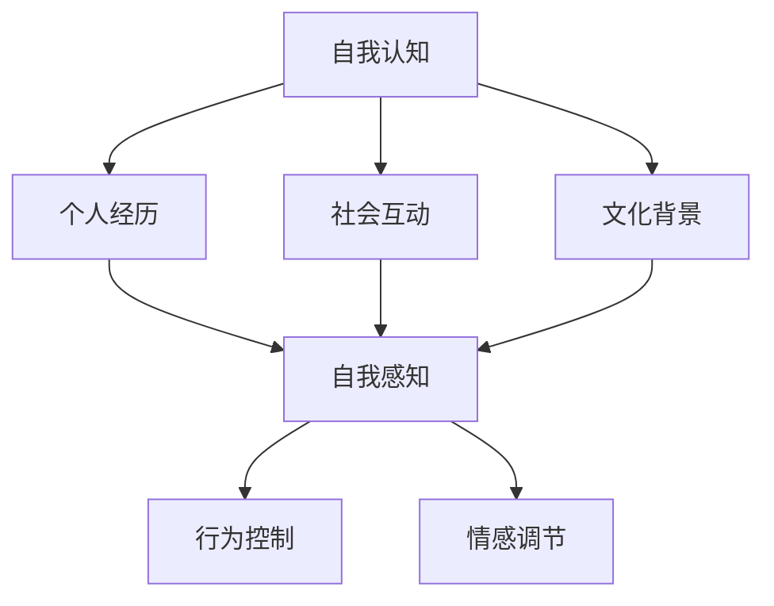

**核心算法原理讲解：**

```plaintext
算法：自我认知评估
输入：个人经历（E1）、社会互动（E2）、文化背景（E3）
输出：自我认知评分（SC）

步骤：
1. 收集个人经历（E1），包括成功经历和挑战经历。
2. 收集社会互动（E2），包括正面互动和负面互动。
3. 收集文化背景（E3），包括家庭文化、教育背景和社会价值观。
4. 对每个因素进行量化评分。
5. 计算加权总分，得到自我认知评分（SC）。
6. 分析评分结果，提供自我认知反馈。
```

**数学模型和公式：**

$$
SC = w_1 \times E1 + w_2 \times E2 + w_3 \times E3
$$

其中，$w_1, w_2, w_3$为权重系数，$E1, E2, E3$为个人经历、社会互动和文化背景的评分。

#### 焦点解决理论

焦点解决理论是一种短期的心理治疗方法，强调解决问题而不是分析问题。这种方法帮助个体集中精力解决当前的问题，提高心理弹性。焦点解决理论的核心概念包括：

- **建构主义**：认为问题解决方案是由个体自己创造的，治疗师的角色是帮助个体发现内在资源和解决问题的能力。
- **问题导向**：将注意力集中在问题解决上，而不是问题本身。
- **现在焦点**：关注当前和未来的解决方案，而不是过去的经历。

**核心概念联系图（Mermaid 流程图）：**

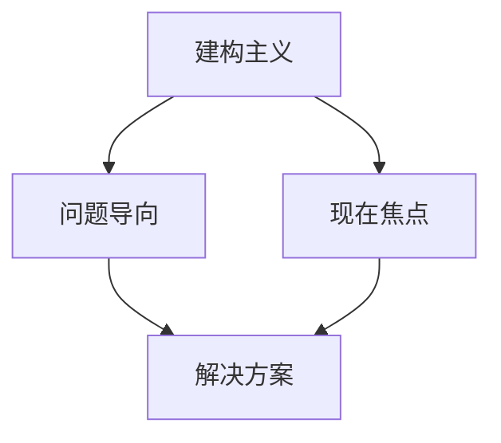

**核心算法原理讲解：**

```plaintext
算法：焦点解决策略
输入：问题陈述（P）
输出：解决方案（S）

步骤：
1. 听取问题陈述（P）。
2. 与个体讨论当前和未来的解决方案。
3. 鼓励个体发掘内在资源和解决问题的能力。
4. 设计一个具体的行动计划。
5. 随时跟进，提供必要的支持和反馈。
```

**数学模型和公式：**

$$
S = f(P, R, T)
$$

其中，$S$为解决方案，$P$为问题陈述，$R$为内在资源，$T$为行动计划。

#### 心理健康的要素

心理健康包括情感健康、认知健康和社交健康。一个心理健康的人能够有效地应对生活中的挑战，保持积极的生活态度。

- **情感健康**：指的是个体能够表达和管理自己的情绪，拥有积极情感体验的能力。
- **认知健康**：指的是个体的认知功能，如注意力、记忆、思维和解决问题的能力。
- **社交健康**：指的是个体能够与他人建立和维持良好的人际关系，积极参与社会活动。

**核心概念联系图（Mermaid 流程图）：**

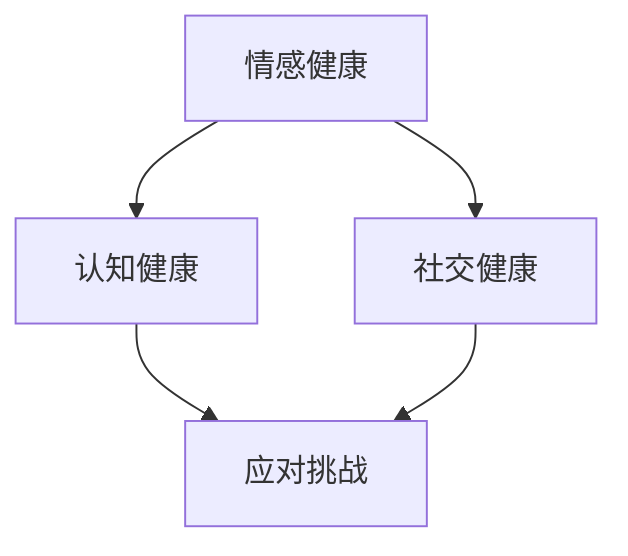

**核心算法原理讲解：**

```plaintext
算法：心理健康评估
输入：情感状态（ES）、认知状态（CS）、社交状态（SS）
输出：心理健康评分（PH）

步骤：
1. 评估情感状态（ES），包括情绪表达和情感调节能力。
2. 评估认知状态（CS），包括注意力、记忆和思维能力。
3. 评估社交状态（SS），包括人际关系和社会参与度。
4. 对每个因素进行量化评分。
5. 计算加权总分，得到心理健康评分（PH）。
6. 分析评分结果，提供心理健康建议。
```

**数学模型和公式：**

$$
PH = w_1 \times ES + w_2 \times CS + w_3 \times SS
$$

其中，$w_1, w_2, w_3$为权重系数，$ES, CS, SS$为情感状态、认知状态和社交状态的评分。

### 2.2 哲学与生活经验

哲学探讨生活的本质和意义，为我们提供了一种更深层次的思考方式。以下是哲学对内心世界和精神生活的贡献：

#### 生活哲学的基本概念

生活哲学探讨人生的意义、价值和目标。不同的生活哲学对个体如何构建内心世界提供了不同的视角。

- **功利主义**：认为快乐是生活的目的，个体应该追求最大化的幸福和快乐。
- **存在主义**：强调个体的自由和选择，认为人生的意义在于个体的自我实现和存在价值。
- **道德哲学**：关注道德原则和道德责任，认为道德行为是实现幸福生活的基础。

**核心概念联系图（Mermaid 流程图）：**

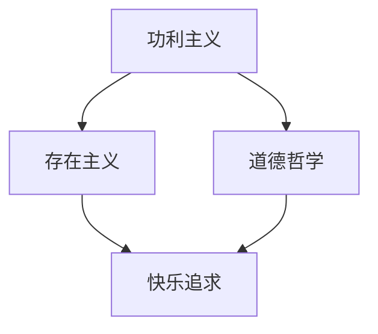

**核心算法原理讲解：**

```plaintext
算法：生活哲学选择
输入：个人价值观（V）
输出：生活哲学（P）

步骤：
1. 确定个人价值观（V），包括对快乐、自由和道德的看法。
2. 分析不同的生活哲学，了解它们的核心理念和实践方法。
3. 根据个人价值观，选择最适合自己的生活哲学。
4. 将生活哲学融入日常生活，持续实践和反思。
```

**数学模型和公式：**

$$
P = f(V, A)
$$

其中，$P$为生活哲学，$V$为个人价值观，$A$为哲学选择的适应性。

#### 传统哲学对内心世界的探讨

传统哲学，如儒家、道家和佛教，对内心世界的探讨提供了丰富的思想资源。

- **儒家思想**：强调内心的平和与和谐，提倡通过修身齐家治国平天下的方式实现个人和社会的和谐。
- **道家思想**：探讨内心的自然状态，认为通过顺应自然，个体能够达到内心的平和与宁静。
- **佛教思想**：强调内心的净化和觉悟，认为通过修行和冥想，个体能够超越痛苦和烦恼，实现心灵的解脱。

**核心概念联系图（Mermaid 流程图）：**

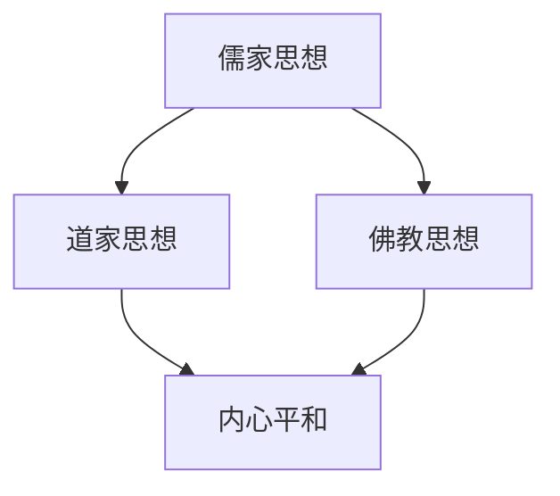

**核心算法原理讲解：**

```plaintext
算法：传统哲学应用
输入：生活问题（Q）
输出：解决方案（S）

步骤：
1. 分析生活问题（Q），确定需要解决的内心困扰。
2. 选择适合的传统哲学思想，如儒家、道家或佛教。
3. 运用哲学思想，反思问题并寻找解决方案。
4. 通过实践和修行，实现内心的平和与宁静。
```

**数学模型和公式：**

$$
S = f(Q, P)
$$

其中，$S$为解决方案，$Q$为生活问题，$P$为传统哲学思想。

#### 现代哲学对精神生活的思考

现代哲学，如分析哲学和批判理论，对精神生活的思考提供了新的视角。

- **分析哲学**：强调通过逻辑分析和理性思考来理解生活的本质和意义。
- **批判理论**：关注社会不公和压迫，探讨个体如何通过批判性思维和行动改变社会现实。

**核心概念联系图（Mermaid 流程图）：**

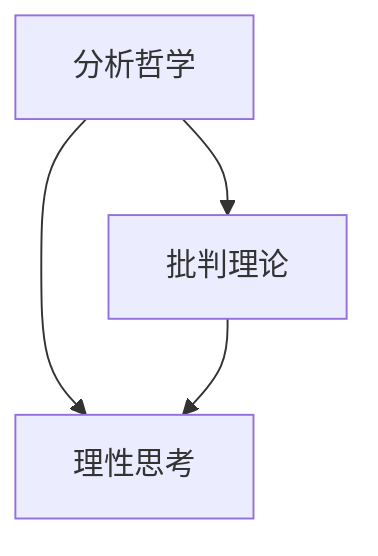

**核心算法原理讲解：**

```plaintext
算法：现代哲学应用
输入：生活问题（Q）
输出：解决方案（S）

步骤：
1. 分析生活问题（Q），确定需要解决的内心困扰。
2. 选择适合的现代哲学思想，如分析哲学或批判理论。
3. 运用哲学思想，反思问题并寻找解决方案。
4. 通过批判性思维和行动，改变社会现实，实现精神成长。
```

**数学模型和公式：**

$$
S = f(Q, P)
$$

其中，$S$为解决方案，$Q$为生活问题，$P$为现代哲学思想。

### 2.3 心灵成长的理论基础

心灵成长是指个体在心理和精神上的成长过程。以下是几个理论基础：

#### 成长心理学的基本原理

成长心理学研究个体在不同阶段的成长和发展。了解这些原理可以帮助个体更好地理解自己的心理发展，从而促进内心世界的丰富。

- **发展性心理学**：强调个体在不同阶段的特征和需求，如儿童期的好奇心、青少年期的自我认同等。
- **终身学习**：认为个体在整个生命过程中都需要不断学习和成长，以适应不断变化的环境。

**核心概念联系图（Mermaid 流程图）：**

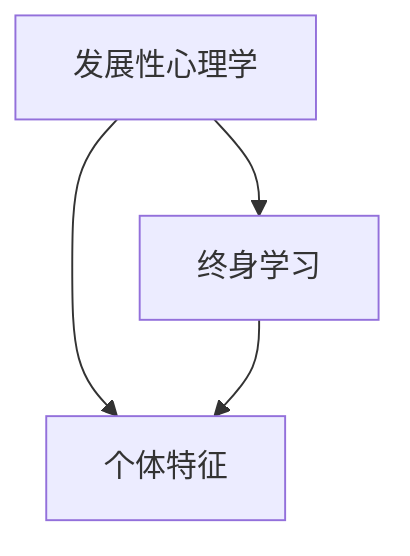

**核心算法原理讲解：**

```plaintext
算法：心灵成长评估
输入：个体特征（I）、学习需求（L）
输出：心灵成长评分（GC）

步骤：
1. 分析个体特征（I），包括认知、情感和社会发展。
2. 确定当前的学习需求（L），包括知识、技能和态度。
3. 对每个因素进行量化评分。
4. 计算加权总分，得到心灵成长评分（GC）。
5. 分析评分结果，提供成长建议。
```

**数学模型和公式：**

$$
GC = w_1 \times I + w_2 \times L
$$

其中，$w_1, w_2$为权重系数，$I, L$为个体特征和学习需求的评分。

#### 自我实现心理学

自我实现心理学认为每个人都有实现自己潜能的能力。通过自我实现，个体能够达到一种更高的心理和情感状态，丰富内心世界。

- **自我实现**：指个体在心理和情感上的全面发展和实现。
- **自我实现者**：指那些在自我实现过程中表现出色的人，他们通常具有强烈的内在动机和自我认知。

**核心概念联系图（Mermaid 流程图）：**

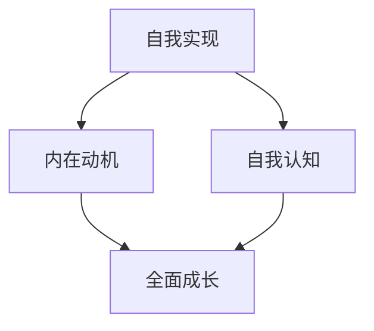

**核心算法原理讲解：**

```plaintext
算法：自我实现评估
输入：内在动机（IM）、自我认知（SC）
输出：自我实现评分（SE）

步骤：
1. 评估内在动机（IM），包括个人兴趣、目标和价值。
2. 评估自我认知（SC），包括自我意识和自我反思能力。
3. 对每个因素进行量化评分。
4. 计算加权总分，得到自我实现评分（SE）。
5. 分析评分结果，提供自我实现建议。
```

**数学模型和公式：**

$$
SE = w_1 \times IM + w_2 \times SC
$$

其中，$w_1, w_2$为权重系数，$IM, SC$为内在动机和自我认知的评分。

#### 内心世界的成长路径

内心世界的成长是一个持续的过程，包括自我认知、情感管理、自我提升和人际关系的改善。以下是几个核心步骤：

- **自我认知**：通过反思和自我评估，了解自己的内心世界。
- **情感管理**：通过情绪调节和自我控制，处理负面情绪。
- **自我提升**：通过学习和成长，提升自己的能力和价值。
- **人际关系**：通过沟通和合作，建立和维护良好的人际关系。

**核心概念联系图（Mermaid 流程图）：**

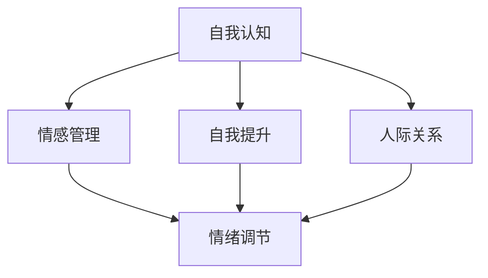

**核心算法原理讲解：**

```plaintext
算法：内心世界成长路径规划
输入：当前状态（CS）、目标状态（TS）
输出：成长路径（GP）

步骤：
1. 分析当前状态（CS），包括自我认知、情感管理、自我提升和人际关系。
2. 确定目标状态（TS），包括预期的自我成长和人际关系改善。
3. 制定具体的成长路径（GP），包括自我认知提升、情感管理策略、自我提升目标和人际关系改善计划。
4. 实施成长路径，持续监控和调整。
```

**数学模型和公式：**

$$
GP = f(CS, TS)
$$

其中，$GP$为成长路径，$CS$为当前状态，$TS$为目标状态。

## 第3章 实践指南

### 3.1 个人成长与自我提升

个人成长和自我提升是丰富内心世界和精神生活的重要途径。以下是几个实践方法：

#### 自我反思的技巧

自我反思是一种通过深入思考自己的行为、情感和思想来了解自己的过程。以下是一些自我反思的技巧：

- **写日记**：每天花时间记录自己的想法、情感和经历，有助于更好地了解自己。
- **设定目标**：明确自己的目标和期望，有助于集中精力实现个人成长。
- **定期回顾**：定期回顾自己的成长过程，总结经验教训，为未来制定更好的计划。

**核心概念联系图（Mermaid 流程图）：**

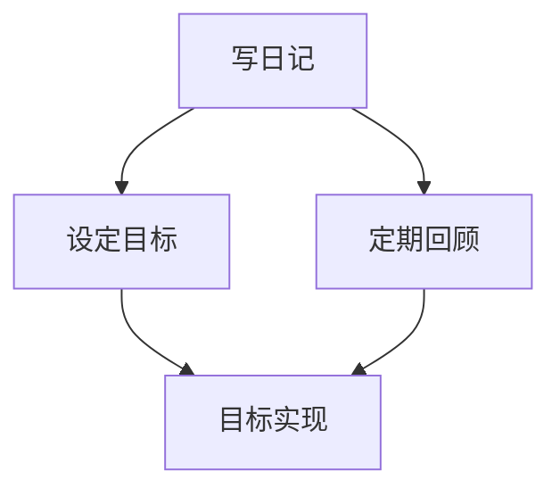

**核心算法原理讲解：**

```plaintext
算法：自我反思流程
输入：日记记录（D）、目标设定（T）、定期回顾（R）
输出：个人成长（PG）

步骤：
1. 开始写日记，记录日常生活中的想法、情感和经历。
2. 设定个人成长目标，明确自己想要实现的目标。
3. 定期回顾日记，分析自己的成长过程，识别优势和不足。
4. 根据回顾结果，调整目标设定和行动计划。
5. 持续反思和调整，实现个人成长。
```

**数学模型和公式：**

$$
PG = f(D, T, R)
$$

其中，$PG$为个人成长，$D$为日记记录，$T$为目标设定，$R$为定期回顾。

#### 目标设定的策略

目标设定是实现个人成长的关键。以下是一些目标设定的策略：

- **明确目标**：设定明确、具体和可行的目标，有助于集中精力实现目标。
- **分解目标**：将大目标分解为小目标，有助于逐步实现最终目标。
- **时间管理**：合理安排时间，确保有足够的时间实现目标。

**核心概念联系图（Mermaid 流程图）：**

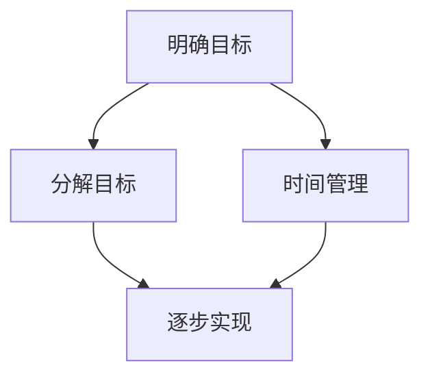

**核心算法原理讲解：**

```plaintext
算法：目标设定策略
输入：大目标（GT）、小目标（ST）、时间安排（T）
输出：目标实现（TE）

步骤：
1. 确定大目标（GT），明确自己想要实现的目标。
2. 将大目标分解为小目标（ST），确保每个小目标都是具体和可行的。
3. 为每个小目标设定时间安排（T），确保有足够的时间实现目标。
4. 定期检查进度，根据实际情况调整目标和时间安排。
5. 持续努力，实现大目标。
```

**数学模型和公式：**

$$
TE = f(GT, ST, T)
$$

其中，$TE$为目标实现，$GT$为大目标，$ST$为小目标，$T$为时间安排。

#### 克服挫折的心理策略

在面对挫折时，保持积极的心态和采取有效的策略是至关重要的。以下是一些克服挫折的心理策略：

- **积极思考**：通过积极的自我对话，克服消极情绪和负面思维。
- **寻求支持**：与他人分享挫折，获得支持和鼓励。
- **反思经验**：从挫折中学习和成长，为未来的挑战做好准备。

**核心概念联系图（Mermaid 流程图）：**

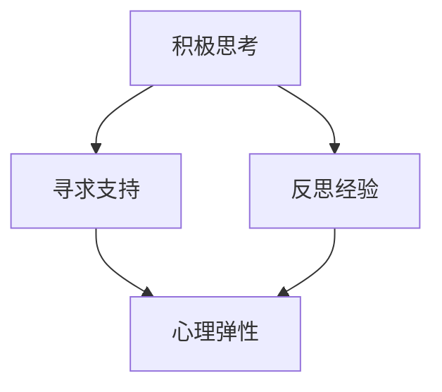

**核心算法原理讲解：**

```plaintext
算法：克服挫折策略
输入：挫折情境（FS）、积极思考（PT）、支持寻求（S）、经验反思（ER）
输出：心理弹性（PE）

步骤：
1. 面对挫折情境（FS），保持积极思考（PT），避免陷入消极情绪。
2. 寻求他人的支持和鼓励（S），增强心理弹性。
3. 对挫折情境进行反思（ER），从中学习和成长。
4. 持续练习积极的思考和寻求支持，提高心理弹性。
```

**数学模型和公式：**

$$
PE = f(PT, S, ER)
$$

其中，$PE$为心理弹性，$PT$为积极思考，$S$为支持寻求，$ER$为经验反思。

### 3.2 人际关系与社交技巧

人际关系和社交技巧对丰富内心世界和精神生活至关重要。以下是几个实践方法：

#### 人际沟通的技巧

人际沟通是建立和维护良好人际关系的关键。以下是一些人际沟通的技巧：

- **倾听**：通过倾听他人，展示关心和理解，建立信任。
- **表达**：通过有效表达自己的想法和感受，增强沟通效果。
- **反馈**：通过积极反馈，鼓励和支持他人，建立友好关系。

**核心概念联系图（Mermaid 流程图）：**

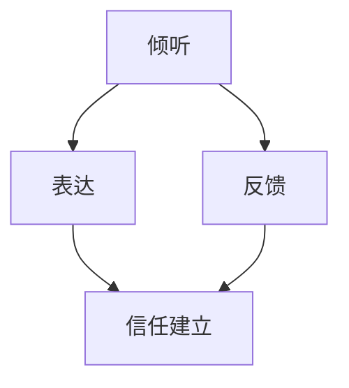

**核心算法原理讲解：**

```plaintext
算法：人际沟通技巧
输入：倾听能力（L）、表达能力（E）、反馈能力（R）
输出：沟通效果（CE）

步骤：
1. 提高倾听能力（L），通过专注和回应，展示关心和理解。
2. 提高表达能力（E），通过清晰和真诚的表达，增强沟通效果。
3. 提高反馈能力（R），通过积极反馈，鼓励和支持他人。
4. 定期练习和反思，提高人际沟通技巧。
```

**数学模型和公式：**

$$
CE = f(L, E, R)
$$

其中，$CE$为沟通效果，$L$为倾听能力，$E$为表达能力，$R$为反馈能力。

#### 建立和支持人际网络

建立和支持人际网络有助于丰富内心世界和精神生活。以下是一些方法：

- **积极参与社交活动**：通过参加社交活动和聚会，结识新朋友。
- **提供帮助**：在他人需要时提供帮助，建立互助关系。
- **保持联系**：定期与朋友和家人保持联系，维持良好关系。

**核心概念联系图（Mermaid 流程图）：**

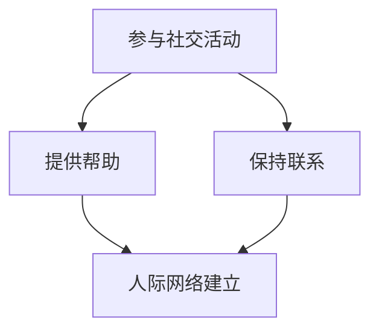

**核心算法原理讲解：**

```plaintext
算法：人际网络建设
输入：社交活动参与度（SA）、帮助提供度（H）、联系保持度（LC）
输出：人际网络强度（IN）

步骤：
1. 提高社交活动参与度（SA），积极参与各种社交活动。
2. 提高帮助提供度（H），在他人需要时主动提供帮助。
3. 提高联系保持度（LC），定期与朋友和家人保持联系。
4. 通过互动和联系，增强人际网络强度。
```

**数学模型和公式：**

$$
IN = f(SA, H, LC)
$$

其中，$IN$为人际网络强度，$SA$为社交活动参与度，$H$为帮助提供度，$LC$为联系保持度。

#### 处理冲突和矛盾的方法

处理冲突和矛盾是维持良好人际关系的关键。以下是一些方法：

- **有效沟通**：通过坦诚和尊重的沟通，解决冲突和矛盾。
- **寻求妥协**：通过协商和妥协，找到双方都能接受的解决方案。
- **理解对方**：通过倾听和理解，增进对对方的了解，减少冲突。

**核心概念联系图（Mermaid 流程图）：**

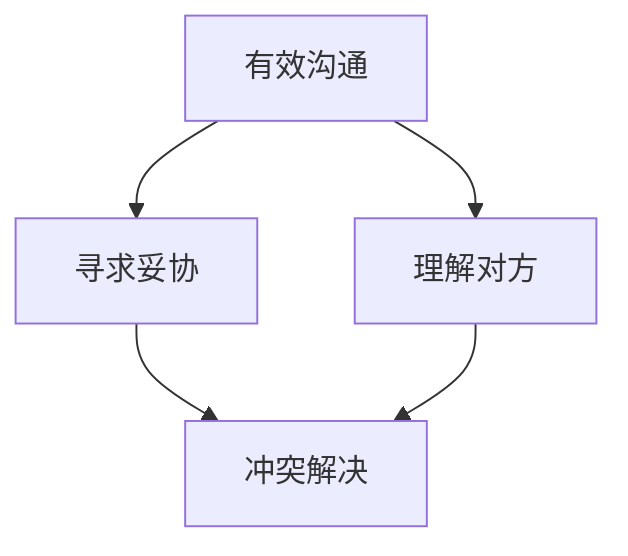

**核心算法原理讲解：**

```plaintext
算法：冲突处理
输入：沟通能力（C）、妥协能力（A）、理解能力（U）
输出：冲突解决效果（CE）

步骤：
1. 提高沟通能力（C），通过清晰和有效的沟通，表达自己的观点和需求。
2. 提高妥协能力（A），通过协商和妥协，找到双方都能接受的解决方案。
3. 提高理解能力（U），通过倾听和理解，增进对对方的了解和尊重。
4. 通过沟通、妥协和理解，解决冲突和矛盾。
```

**数学模型和公式：**

$$
CE = f(C, A, U)
$$

其中，$CE$为冲突解决效果，$C$为沟通能力，$A$为妥协能力，$U$为理解能力。

### 3.3 压力管理

压力是影响心理健康和生活质量的重要因素。以下是几个实践方法：

#### 压力的来源与类型

了解压力的来源和类型有助于更好地应对压力。以下是一些常见的压力来源和类型：

- **工作压力**：来自工作负荷、工作环境和工作期望的压力。
- **生活压力**：来自家庭、财务、健康和人际关系的压力。
- **心理压力**：来自焦虑、抑郁和压力的心理状态。

**核心概念联系图（Mermaid 流程图）：**

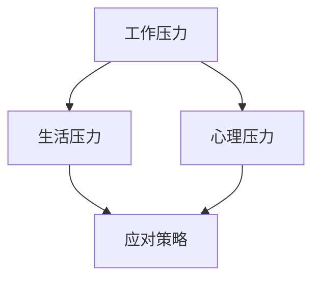

**核心算法原理讲解：**

```plaintext
算法：压力识别
输入：压力源（PS）、压力类型（PT）
输出：压力识别结果（PR）

步骤：
1. 识别压力源（PS），包括工作、生活和心理方面的压力。
2. 分析压力类型（PT），确定压力的主要类型。
3. 根据压力识别结果，制定应对策略。
```

**数学模型和公式：**

$$
PR = f(PS, PT)
$$

其中，$PR$为压力识别结果，$PS$为压力源，$PT$为压力类型。

#### 减轻压力的有效方法

以下是一些减轻压力的有效方法：

- **锻炼**：通过运动和锻炼，释放压力，增强身体健康。
- **放松技巧**：通过深呼吸、冥想和放松练习，减轻心理压力。
- **时间管理**：通过合理安排时间，减轻工作和生活的压力。

**核心概念联系图（Mermaid 流程图）：**

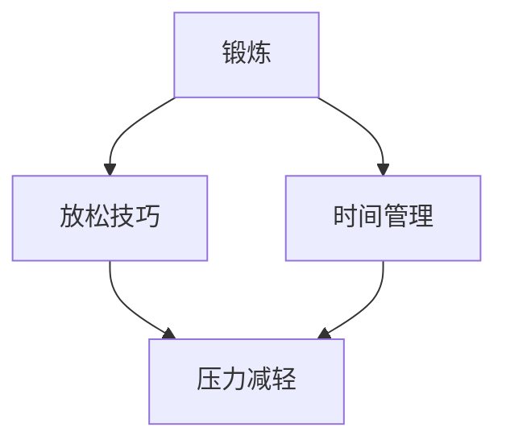

**核心算法原理讲解：**

```plaintext
算法：压力减轻策略
输入：锻炼频率（EF）、放松技巧掌握度（RT）、时间管理能力（TM）
输出：压力减轻效果（PE）

步骤：
1. 提高锻炼频率（EF），定期进行身体锻炼。
2. 学习和掌握放松技巧（RT），如深呼吸、冥想等。
3. 提高时间管理能力（TM），合理安排工作和生活。
4. 通过锻炼、放松技巧和时间管理，减轻压力。
```

**数学模型和公式：**

$$
PE = f(EF, RT, TM)
$$

其中，$PE$为压力减轻效果，$EF$为锻炼频率，$RT$为放松技巧掌握度，$TM$为时间管理能力。

#### 压力管理的长期策略

以下是一些长期压力管理的策略：

- **健康生活方式**：通过健康饮食、充足睡眠和定期锻炼，建立健康的生活方式。
- **心理调适**：通过心理咨询、情绪管理和自我反思，提高心理弹性。
- **社会支持**：通过建立和维护良好的社会关系，获得支持和帮助。

**核心概念联系图（Mermaid 流程图）：**

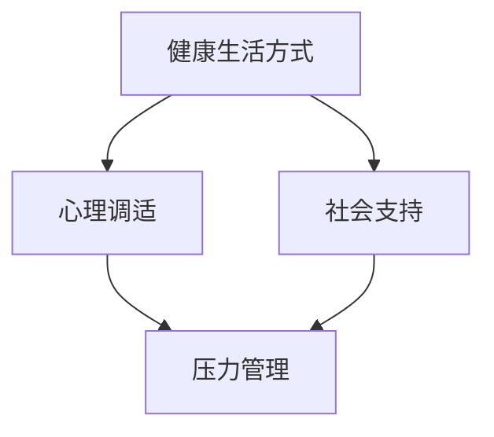

**核心算法原理讲解：**

```plaintext
算法：长期压力管理
输入：健康生活方式（HL）、心理调适能力（PA）、社会支持网络（SN）
输出：长期压力管理水平（LP）

步骤：
1. 建立健康生活方式（HL），包括健康饮食、充足睡眠和定期锻炼。
2. 提高心理调适能力（PA），通过心理咨询、情绪管理和自我反思。
3. 建立和维护良好的社会支持网络（SN），包括家人、朋友和社区。
4. 通过健康生活方式、心理调适和社会支持，提高长期压力管理水平。
```

**数学模型和公式：**

$$
LP = f(HL, PA, SN)
$$

其中，$LP$为长期压力管理水平，$HL$为健康生活方式，$PA$为心理调适能力，$SN$为社会支持网络。

### 3.4 兴趣爱好与创造力激发

兴趣爱好和创造力激发是丰富内心世界和精神生活的重要途径。以下是一些实践方法：

#### 兴趣爱好的重要性

兴趣爱好是指个体在业余时间从事的活动，这些活动能够带来乐趣和满足感。以下是一些兴趣爱好的重要性：

- **心理健康**：兴趣爱好能够减轻心理压力，提高心理健康水平。
- **生活满足感**：兴趣爱好能够为生活增添色彩，提高生活满足感。
- **创造力**：通过兴趣爱好，个体能够激发创造力，产生新的想法和创意。

**核心概念联系图（Mermaid 流程图）：**

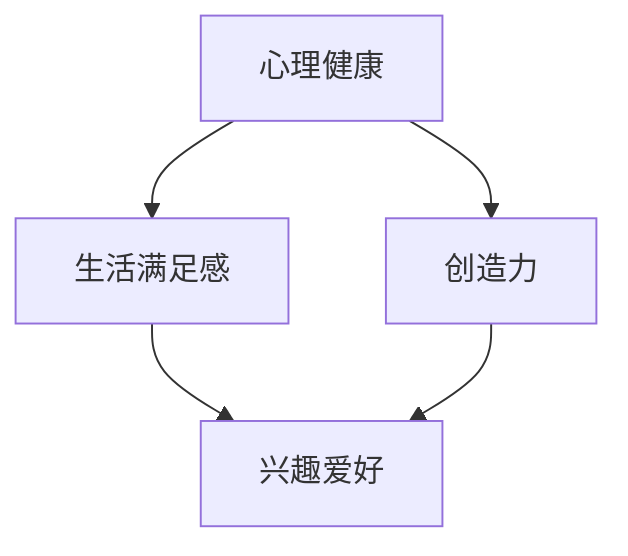

**核心算法原理讲解：**

```plaintext
算法：兴趣爱好评估
输入：心理健康状态（PM）、生活满足感（PS）、创造力水平（PC）
输出：兴趣爱好重要性评分（HI）

步骤：
1. 评估心理健康状态（PM），包括情绪稳定性和心理弹性。
2. 评估生活满足感（PS），包括日常活动的乐趣和满意度。
3. 评估创造力水平（PC），包括创新思维和创意表达。
4. 根据评估结果，计算兴趣爱好重要性评分（HI）。
5. 分析评分结果，提供兴趣爱好建议。
```

**数学模型和公式：**

$$
HI = f(PM, PS, PC)
$$

其中，$HI$为兴趣爱好重要性评分，$PM$为心理健康状态，$PS$为生活满足感，$PC$为创造力水平。

#### 如何培养和发展兴趣爱好

以下是一些培养和发展兴趣爱好的方法：

- **尝试新事物**：通过尝试不同的活动和领域，找到适合自己的兴趣爱好。
- **定期练习**：通过定期练习和坚持，提高兴趣爱好的技能水平。
- **参加社群**：通过加入相关社群和参加活动，与他人分享和交流兴趣爱好。

**核心概念联系图（Mermaid 流程图）：**

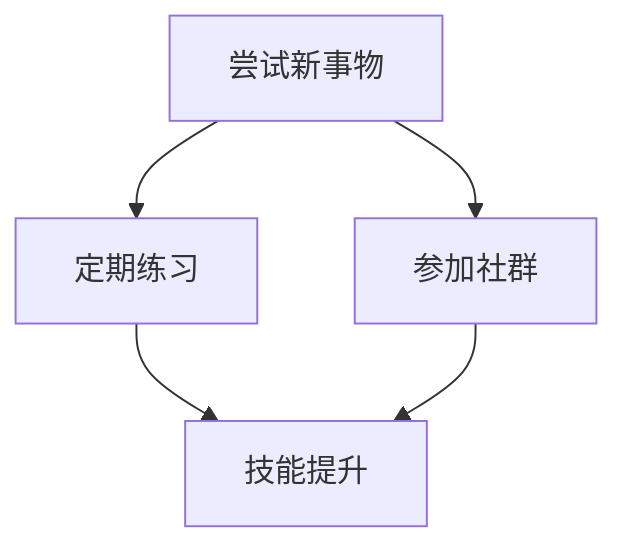

**核心算法原理讲解：**

```plaintext
算法：兴趣爱好培养
输入：兴趣爱好（H）、技能水平（S）、社群参与度（P）
输出：兴趣爱好发展水平（HD）

步骤：
1. 确定兴趣爱好（H），选择感兴趣的活动或领域。
2. 定期练习（S），投入时间和精力，提高技能水平。
3. 参加相关社群（P），与他人分享和交流兴趣爱好。
4. 根据练习和参与结果，评估兴趣爱好发展水平（HD）。
5. 根据评估结果，调整和优化兴趣爱好培养策略。
```

**数学模型和公式：**

$$
HD = f(H, S, P)
$$

其中，$HD$为兴趣爱好发展水平，$H$为兴趣爱好，$S$为技能水平，$P$为社群参与度。

#### 创造力的激发与培养

以下是一些激发和培养创造力的方法：

- **思维训练**：通过思维训练，提高创造性思维和问题解决能力。
- **创造性活动**：通过参与创造性活动，如绘画、写作、音乐创作等，激发创造力。
- **跨界学习**：通过学习不同领域的知识和技能，促进跨领域思维和创意的产生。

**核心概念联系图（Mermaid 流程图）：**

```mermaid
graph TD
A[思维训练] --> B[创造性活动]
A --> C[跨界学习]
B --> D[创造力提升]
C --> D
```

**核心算法原理讲解：**

```plaintext
算法：创造力培养
输入：思维训练频率（TF）、创造性活动参与度（TA）、跨界学习程度（TL）
输出：创造力水平（CR）

步骤：
1. 提高思维训练频率（TF），定期进行创造性思维训练。
2. 参与创造性活动（TA），如绘画、写作、音乐创作等。
3. 进行跨界学习（TL），学习不同领域的知识和技能。
4. 根据训练、活动和学习的参与结果，评估创造力水平（CR）。
5. 根据评估结果，调整和优化创造力培养策略。
```

**数学模型和公式：**

$$
CR = f(TF, TA, TL)
$$

其中，$CR$为创造力水平，$TF$为思维训练频率，$TA$为创造性活动参与度，$TL$为跨界学习程度。

### 3.5 生活哲学与心灵成长

生活哲学和心灵成长是构建多彩的精神生活的重要方面。以下是一些实践方法：

#### 生活哲学的基本原则

生活哲学是指个体对生活本质和意义的理解和追求。以下是一些基本的生活哲学原则：

- **积极乐观**：保持积极乐观的心态，面对生活中的挑战和困难。
- **自我实现**：追求自我实现，发挥自己的潜能，实现个人价值。
- **和谐共生**：与他人和谐相处，共同创造美好的生活环境。

**核心概念联系图（Mermaid 流程图）：**

```mermaid
graph TD
A[积极乐观] --> B[自我实现]
A --> C[和谐共生]
B --> D[生活哲学]
C --> D
```

**核心算法原理讲解：**

```plaintext
算法：生活哲学实践
输入：生活哲学原则（P）、心态调整（M）、人际关系（R）
输出：生活哲学实践效果（PE）

步骤：
1. 确定生活哲学原则（P），如积极乐观、自我实现和和谐共生。
2. 调整心态（M），保持积极乐观的态度，面对生活中的挑战。
3. 建立和维护良好的人际关系（R），与他人和谐相处。
4. 根据心态调整和人际关系结果，评估生活哲学实践效果（PE）。
5. 根据评估结果，优化生活哲学实践策略。
```

**数学模型和公式：**

$$
PE = f(P, M, R)
$$

其中，$PE$为生活哲学实践效果，$P$为生活哲学原则，$M$为心态调整，$R$为人际关系。

#### 精神生活的实践方法

以下是一些实践精神生活的方法：

- **冥想**：通过冥想，放松身心，提升内在感知和自我意识。
- **瑜伽**：通过瑜伽，结合身体和呼吸，实现身心和谐。
- **艺术创作**：通过艺术创作，表达情感和创造力，丰富内心世界。

**核心概念联系图（Mermaid 流程图）：**

```mermaid
graph TD
A[冥想] --> B[瑜伽]
A --> C[艺术创作]
B --> D[精神生活实践]
C --> D
```

**核心算法原理讲解：**

```plaintext
算法：精神生活实践
输入：冥想频率（MF）、瑜伽频率（YF）、艺术创作频率（AF）
输出：精神生活实践效果（PS）

步骤：
1. 确定冥想频率（MF），定期进行冥想实践。
2. 确定瑜伽频率（YF），定期进行瑜伽练习。
3. 确定艺术创作频率（AF），定期进行艺术创作。
4. 根据冥想、瑜伽和艺术创作的实践结果，评估精神生活实践效果（PS）。
5. 根据评估结果，调整和优化精神生活实践策略。
```

**数学模型和公式：**

$$
PS = f(MF, YF, AF)
$$

其中，$PS$为精神生活实践效果，$MF$为冥想频率，$YF$为瑜伽频率，$AF$为艺术创作频率。

#### 心灵成长的经验分享

通过分享他人的心灵成长经验，我们可以获得很多启示和灵感。以下是一些心灵成长的经验分享：

- **故事1**：一个年轻人通过自我反思和心理咨询，逐渐认识到自己的内心需求，找到了自己的兴趣和目标，从而实现了个人成长和职业成功。
- **故事2**：一位中年人通过培养兴趣爱好和参与社交活动，重新找回了生活的乐趣和意义，从而提高了生活质量。
- **故事3**：一位企业家通过有效的压力管理和情绪调节，成功应对了事业上的挑战，实现了个人和事业的平衡。

**核心概念联系图（Mermaid 流程图）：**

```mermaid
graph TD
A[自我反思] --> B[心理咨询]
A --> C[兴趣爱好培养]
B --> D[职业成功]
C --> D
A[压力管理] --> E[情绪调节]
A --> F[事业成功]
E --> F
```

**核心算法原理讲解：**

```plaintext
算法：心灵成长经验分享
输入：自我反思经验（RE）、心理咨询经验（CE）、兴趣爱好培养经验（HE）、压力管理经验（PE）、情绪调节经验（EE）
输出：心灵成长启示（CI）

步骤：
1. 收集自我反思经验（RE），包括自我认知和目标设定。
2. 收集心理咨询经验（CE），包括心理治疗和心理支持。
3. 收集兴趣爱好培养经验（HE），包括兴趣发展和技能提升。
4. 收集压力管理经验（PE），包括应对策略和心理调节。
5. 收集情绪调节经验（EE），包括情绪管理和情绪表达。
6. 分析和整合经验，提供心灵成长启示（CI）。
```

**数学模型和公式：**

$$
CI = f(RE, CE, HE, PE, EE)
$$

其中，$CI$为心灵成长启示，$RE, CE, HE, PE, EE$分别为自我反思经验、心理咨询经验、兴趣爱好培养经验、压力管理经验和情绪调节经验。

## 第4章 案例分析

### 4.1 成功案例

通过分析成功人士的内心世界和精神生活，我们可以发现以下共同点：

#### 自我认知与目标设定

成功人士通常有清晰的自我认知和明确的目标设定。他们了解自己的优势、兴趣和价值观，从而能够制定适合自己的目标，并为之努力。以下是一个成功案例：

**案例**：李明是一位年轻的创业者，他在创业初期就明确了公司的愿景和目标。通过自我反思和咨询，他认识到自己对技术创新的热爱和对用户体验的重视。他设定了具体的目标，如每年推出两款创新产品，并制定了详细的实施计划。通过坚定的信念和持续的努力，李明成功地将公司发展成为一个行业领导者。

**核心概念联系图（Mermaid 流程图）：**

```mermaid
graph TD
A[自我认知] --> B[目标设定]
A --> C[实施计划]
B --> D[成功实现]
C --> D
```

**核心算法原理讲解：**

```plaintext
算法：成功案例分析
输入：自我认知（SC）、目标设定（TD）、实施计划（IP）
输出：成功实现（SE）

步骤：
1. 分析成功人士的自我认知（SC），了解他们的兴趣、优势和价值观。
2. 确定他们的目标设定（TD），包括长期和短期目标。
3. 分析他们的实施计划（IP），了解他们如何将目标转化为实际行动。
4. 根据分析结果，评估成功实现的可能性和策略。
```

**数学模型和公式：**

$$
SE = f(SC, TD, IP)
$$

其中，$SE$为成功实现，$SC$为自我认知，$TD$为目标设定，$IP$为实施计划。

#### 人际关系与社交技巧

成功人士擅长建立和维护良好的人际关系。他们通过有效的沟通、倾听和反馈，与他人建立了深厚的信任和友谊。以下是一个成功案例：

**案例**：张丽是一位知名企业家，她通过积极参与行业活动和社交聚会，结识了许多业内同行和专家。她善于倾听他人的意见和建议，并通过积极的反馈和支持，建立了广泛的人脉网络。这些人际关系不仅为她提供了宝贵的资源和支持，还帮助她克服了创业过程中的许多挑战。

**核心概念联系图（Mermaid 流�）

```mermaid
graph TD
A[有效沟通] --> B[倾听和反馈]
A --> C[人际关系建立]
B --> D[人脉网络]
C --> D
```

**核心算法原理讲解：**

```plaintext
算法：人际关系分析
输入：有效沟通（EC）、倾听和反馈（WF）、人际关系建立（RI）
输出：人脉网络效果（NE）

步骤：
1. 分析成功人士的有效沟通（EC），了解他们的沟通方式和技巧。
2. 分析他们的倾听和反馈（WF），了解他们如何建立信任和友谊。
3. 分析他们的人际关系建立（RI），了解他们如何扩展人脉网络。
4. 根据分析结果，评估人脉网络的效果（NE）。
```

**数学模型和公式：**

$$
NE = f(EC, WF, RI)
$$

其中，$NE$为人脉网络效果，$EC$为有效沟通，$WF$为倾听和反馈，$RI$为人际关系建立。

#### 压力管理与情绪调节

成功人士能够有效地管理压力和调节情绪，从而保持心理平衡和积极的心态。以下是一个成功案例：

**案例**：王华是一位职场精英，他在工作中面临着巨大的压力和挑战。然而，他通过练习冥想、定期锻炼和寻求心理咨询，成功地将压力转化为动力，保持了积极的心态。他通过自我反思和情绪管理，找到了应对工作挑战的方法，并取得了显著的成就。

**核心概念联系图（Mermaid 流程图）：**

```mermaid
graph TD
A[冥想] --> B[定期锻炼]
A --> C[心理咨询]
B --> D[压力管理]
C --> D
```

**核心算法原理讲解：**

```plaintext
算法：压力管理分析
输入：冥想（M）、定期锻炼（E）、心理咨询（P）
输出：压力管理效果（PE）

步骤：
1. 分析成功人士的冥想（M）和定期锻炼（E）习惯，了解它们如何减轻压力。
2. 分析他们的心理咨询（P）经历，了解心理咨询如何帮助情绪调节。
3. 根据分析结果，评估压力管理效果（PE）。
```

**数学模型和公式：**

$$
PE = f(M, E, P)
$$

其中，$PE$为压力管理效果，$M$为冥想，$E$为定期锻炼，$P$为心理咨询。

### 4.2 失败案例

通过分析失败者的内心世界和精神生活，我们可以发现以下教训：

#### 缺乏自我认知和目标设定

失败者往往缺乏清晰的自我认知和明确的目标设定，导致他们在面对挑战时容易迷失方向。以下是一个失败案例：

**案例**：陈静是一位年轻的职场新人，她在工作中缺乏明确的职业规划和个人目标。她盲目地接受各种任务，但往往无法有效地完成任务。由于缺乏自我认知和目标设定，她最终在职场中迷失了方向，导致职业发展受阻。

**核心概念联系图（Mermaid 流程图）：**

```mermaid
graph TD
A[自我认知缺乏] --> B[目标设定缺乏]
A --> C[职业规划缺乏]
B --> C
```

**核心算法原理讲解：**

```plaintext
算法：失败原因分析
输入：自我认知（SC）、目标设定（TD）、职业规划（PP）
输出：失败原因（FC）

步骤：
1. 分析失败者的自我认知（SC），了解他们是否清楚自己的兴趣、优势和价值观。
2. 分析他们的目标设定（TD），了解他们是否设定了明确的职业和个人目标。
3. 分析他们的职业规划（PP），了解他们是否有明确的职业发展路径。
4. 根据分析结果，确定失败原因（FC）。
```

**数学模型和公式：**

$$
FC = f(SC, TD, PP)
$$

其中，$FC$为失败原因，$SC$为自我认知，$TD$为目标设定，$PP$为职业规划。

#### 人际关系与社交技巧不足

失败者往往不擅长建立和维护良好的人际关系，导致他们在面对挑战时缺乏支持和帮助。以下是一个失败案例：

**案例**：李强是一位企业家，他在创业初期过于专注于业务发展，忽视了人际关系和社交技巧。由于缺乏人脉网络和支持，他在创业过程中面临了许多困难，最终导致创业失败。

**核心概念联系图（Mermaid 流程图）：**

```mermaid
graph TD
A[人际关系缺乏] --> B[社交技巧缺乏]
A --> C[人脉网络缺乏]
B --> C
```

**核心算法原理讲解：**

```plaintext
算法：人际关系分析
输入：人际关系（RI）、社交技巧（ST）、人脉网络（NN）
输出：人际关系效果（RE）

步骤：
1. 分析失败者的人际关系（RI），了解他们是否建立了良好的人际网络。
2. 分析他们的社交技巧（ST），了解他们是否具备有效的沟通和合作能力。
3. 分析他们的人脉网络（NN），了解他们是否获得了足够的支持和帮助。
4. 根据分析结果，评估人际关系效果（RE）。
```

**数学模型和公式：**

$$
RE = f(RI, ST, NN)
$$

其中，$RE$为人际关系效果，$RI$为人际关系，$ST$为社交技巧，$NN$为人脉网络。

#### 压力管理和情绪调节困难

失败者往往难以有效管理压力和调节情绪，导致他们在面对挑战时容易陷入消极情绪。以下是一个失败案例：

**案例**：赵华是一位年轻的职场人士，他在工作中面临着巨大的压力和挑战。然而，他缺乏有效的压力管理和情绪调节技巧，导致他经常感到焦虑和沮丧。由于无法应对工作压力，他最终离职，职业发展受到了严重的影响。

**核心概念联系图（Mermaid 流程图）：**

```mermaid
graph TD
A[压力管理困难] --> B[情绪调节困难]
A --> C[消极情绪积累]
B --> C
```

**核心算法原理讲解：**

```plaintext
算法：压力管理分析
输入：压力管理（PM）、情绪调节（EM）、消极情绪（NM）
输出：压力管理效果（PE）

步骤：
1. 分析失败者的压力管理（PM）和情绪调节（EM）技巧，了解他们是否具备有效的压力管理和情绪调节能力。
2. 分析他们的消极情绪（NM），了解他们是否能够有效地应对和调节消极情绪。
3. 根据分析结果，评估压力管理效果（PE）。
```

**数学模型和公式：**

$$
PE = f(PM, EM, NM)
$$

其中，$PE$为压力管理效果，$PM$为压力管理，$EM$为情绪调节，$NM$为消极情绪。

#### 缺乏兴趣爱好与创造力激发

失败者往往缺乏兴趣爱好和创造力激发，导致他们在生活中缺乏动力和乐趣。以下是一个失败案例：

**案例**：王婷是一位年轻的职场人士，她在工作中感到枯燥乏味，缺乏成就感和满足感。由于缺乏兴趣爱好和创造力激发，她没有找到生活的乐趣和意义，最终陷入了职业倦怠和心理困境。

**核心概念联系图（Mermaid 流程图）：**

```mermaid
graph TD
A[兴趣爱好缺乏] --> B[创造力激发缺乏]
A --> C[生活动力缺乏]
B --> C
```

**核心算法原理讲解：**

```plaintext
算法：兴趣爱好分析
输入：兴趣爱好（HI）、创造力激发（CI）、生活动力（DI）
输出：兴趣爱好效果（HE）

步骤：
1. 分析失败者的兴趣爱好（HI），了解他们是否具备广泛的兴趣爱好。
2. 分析他们的创造力激发（CI），了解他们是否能够通过兴趣爱好激发创造力。
3. 分析他们的生活动力（DI），了解他们是否能够通过兴趣爱好和创造力激发找到生活的动力。
4. 根据分析结果，评估兴趣爱好效果（HE）。
```

**数学模型和公式：**

$$
HE = f(HI, CI, DI)
$$

其中，$HE$为兴趣爱好效果，$HI$为兴趣爱好，$CI$为创造力激发，$DI$为生活动力。

## 第5章 生活故事

### 5.1 真实的内心探索

通过分享真实的生活故事，我们可以看到个体如何通过丰富的内心世界和精神生活实现自我成长。以下是几个例子：

#### 故事1：自我发现的旅程

**背景介绍**：李华是一位年轻的职场人士，他感到自己的内心世界空虚，缺乏生活的意义和动力。他开始寻求改变，通过阅读心理学书籍和参加心理咨询，他逐渐意识到自己的内心需求和潜在的能力。

**核心概念与联系**：李华通过自我反思和心理咨询，逐步认识到自己的兴趣、价值观和目标。他通过设定小目标，逐步实现自我提升和职业成功。同时，他也意识到人际关系的重要性，开始主动与同事建立联系，培养友谊。

**算法原理讲解**：李华的内心探索过程可以看作是一个自我实现的循环。通过自我反思，他识别自己的需求和优势，设定目标，通过实际行动实现目标，并获得成就感和满足感。这个过程可以表示为以下伪代码：

```plaintext
函数 自我发现（李华）：
    while（未实现目标）：
        反思自我，识别需求和优势
        设定目标
        实现目标
        获得成就感
        反馈和调整目标
    end while
```

**数学模型和公式**：

$$
SD = f(\text{自我反思}, \text{目标设定}, \text{目标实现})
$$

其中，$SD$为自我发现过程，$\text{自我反思}$、$\text{目标设定}$和$\text{目标实现}$分别为过程的组成部分。

#### 故事2：压力中的成长

**背景介绍**：张莹是一位年轻的企业家，她在创业初期面临着巨大的压力和挑战。她感到自己无法应对压力，开始寻求心理辅导和冥想练习。

**核心概念与联系**：张莹通过心理辅导和冥想练习，学会了如何管理压力和调节情绪。她通过深呼吸、冥想和放松技巧，减轻了心理压力，提高了心理弹性。她也开始通过运动和锻炼，保持身体健康。

**算法原理讲解**：张莹的压力管理过程可以看作是一个自我调节的循环。通过识别压力源，她采取有效的策略来减轻压力，并通过持续练习和调整，提高心理弹性。这个过程可以表示为以下伪代码：

```plaintext
函数 压力管理（张莹）：
    while（压力存在）：
        识别压力源
        减轻压力
        调节情绪
        提高心理弹性
        反馈和调整策略
    end while
```

**数学模型和公式**：

$$
PM = f(\text{压力识别}, \text{压力减轻}, \text{情绪调节}, \text{心理弹性})
$$

其中，$PM$为压力管理过程，$\text{压力识别}$、$\text{压力减轻}$、$\text{情绪调节}$和$\text{心理弹性}$分别为过程的关键组成部分。

#### 故事3：人际关系的重建

**背景介绍**：李娜是一位年轻的家庭主妇，她因为工作繁忙和家庭矛盾，感到与家人和朋友的关系疏远。她开始寻求心理咨询和社交活动，以重建人际关系。

**核心概念与联系**：李娜通过心理咨询，学会了有效的沟通技巧和情绪管理。她开始积极参与社交活动，与他人建立联系。她通过倾听和理解，重建了与家人的关系，并通过支持他人，获得了更多的友谊。

**算法原理讲解**：李娜的人际关系重建过程可以看作是一个社交网络的扩展和修复。通过有效的沟通和情绪管理，她建立了新的社交网络，并通过持续互动和反馈，维持了良好的人际关系。这个过程可以表示为以下伪代码：

```plaintext
函数 人际关系重建（李娜）：
    while（关系疏远）：
        学习沟通技巧
        学习情绪管理
        参与社交活动
        建立新关系
        维护旧关系
        反馈和调整策略
    end while
```

**数学模型和公式**：

$$
RI = f(\text{沟通技巧}, \text{情绪管理}, \text{社交活动}, \text{关系维护})
$$

其中，$RI$为人际关系重建过程，$\text{沟通技巧}$、$\text{情绪管理}$、$\text{社交活动}$和$\text{关系维护}$分别为过程的关键组成部分。

### 5.2 他人的心灵启示

通过阅读他人的生活故事，我们可以获得很多心灵启示。以下是几个例子：

#### 启示1：生活中的困难是成长的机会

通过李华的故事，我们可以看到生活中的困难和挑战并不可怕，关键是如何面对和应对。李华通过自我反思和心理咨询，逐步认识到自己的内心需求和潜在的能力，从而实现了自我成长和职业成功。他的故事告诉我们，面对困难时，保持积极的心态，寻找解决问题的方法，是我们成长的机会。

#### 启示2：人际关系是心理健康的重要保障

通过张莹的故事，我们可以看到人际关系对个人的心理健康和生活质量有着重要影响。张莹通过心理咨询和社交活动，重建了与家人和朋友的关系，从而提高了生活质量。她的故事告诉我们，建立和维护良好的人际关系，可以帮助我们更好地应对生活中的困难和挑战，提高心理弹性。

#### 启示3：兴趣爱好和创造力是心灵的源泉

通过李娜的故事，我们可以看到兴趣爱好和创造力是丰富内心世界和精神生活的重要途径。李娜通过培养兴趣爱好和参与社交活动，重新找回了生活的乐趣和意义。她的故事告诉我们，培养兴趣爱好和激发创造力，可以找到内心的满足感和快乐，提升生活质量。

## 第6章 实用技巧和策略

### 6.1 情绪管理

情绪管理是丰富内心世界和精神生活的重要技能。以下是一些实用技巧：

#### 认知行为疗法

认知行为疗法是一种通过改变思维和行为来管理情绪的方法。以下是一些步骤：

1. **识别负面思维**：通过日记记录，识别和标记负面思维模式。
2. **评估思维**：分析负面思维的合理性和影响。
3. **挑战负面思维**：通过逻辑和事实，挑战和反驳负面思维。
4. **建立积极思维**：通过积极的自我对话和正向思维，培养积极的情绪状态。

**核心算法原理讲解**：

```plaintext
算法：认知行为疗法
输入：负面思维（N）、积极思维（P）
输出：情绪状态（ES）

步骤：
1. 记录负面思维（N），包括消极的自我评价和担忧。
2. 分析负面思维（N），识别它们的来源和影响。
3. 挑战负面思维（N），通过事实和逻辑反驳。
4. 建立积极思维（P），培养积极的自我评价和乐观态度。
5. 持续练习，调整情绪状态（ES）。
```

**数学模型和公式**：

$$
ES = f(P, -N)
$$

其中，$ES$为情绪状态，$P$为积极思维，$-N$为负面思维。

#### 深呼吸与冥想

深呼吸和冥想是放松身心、减轻压力的有效方法。以下是一些步骤：

1. **深呼吸**：缓慢地吸气，保持一段时间，然后缓慢地呼气。
2. **冥想**：专注于呼吸，排除杂念，进入冥想状态。
3. **定期练习**：每天安排一定时间进行深呼吸和冥想。

**核心算法原理讲解**：

```plaintext
算法：深呼吸与冥想
输入：深呼吸频率（RF）、冥想时间（MT）
输出：情绪状态（ES）

步骤：
1. 设定深呼吸频率（RF），每天进行多次深呼吸练习。
2. 设定冥想时间（MT），每天安排一段固定时间进行冥想。
3. 持续练习，观察情绪状态（ES）的变化。
```

**数学模型和公式**：

$$
ES = f(RF, MT)
$$

其中，$ES$为情绪状态，$RF$为深呼吸频率，$MT$为冥想时间。

#### 正念练习

正念练习是一种专注于当前时刻的练习，可以帮助我们减轻焦虑和压力。以下是一些步骤：

1. **专注于呼吸**：将注意力集中在呼吸上，感受每一次吸气和呼气。
2. **感受身体**：将注意力转移到身体上，感受身体的感觉和变化。
3. **觉察思维**：观察自己的思维和情绪，不加判断地接受它们。

**核心算法原理讲解**：

```plaintext
算法：正念练习
输入：专注力（A）、觉察力（O）
输出：情绪状态（ES）

步骤：
1. 提高专注力（A），专注于当前的呼吸和身体感觉。
2. 提高觉察力（O），观察自己的思维和情绪，不加判断。
3. 持续练习，观察情绪状态（ES）的变化。
```

**数学模型和公式**：

$$
ES = f(A, O)
$$

其中，$ES$为情绪状态，$A$为专注力，$O$为觉察力。

### 6.2 个人成长工具

以下是一些个人成长工具，可以帮助我们实现自我提升：

#### 日记

日记是一种记录自己的想法、情感和经历的工具，可以帮助我们进行自我反思和自我提升。以下是一些使用日记的方法：

1. **记录日常**：每天记录自己的日常生活和经历，包括喜悦和挑战。
2. **反思**：定期回顾日记，分析自己的行为和情绪，识别改进的机会。
3. **目标设定**：设定短期和长期目标，记录实现目标的进展。

**核心算法原理讲解**：

```plaintext
算法：日记记录与反思
输入：日记记录（D）、反思结果（R）
输出：个人成长（PG）

步骤：
1. 每天记录日记（D），包括日常经历和情感。
2. 定期回顾日记（D），进行自我反思。
3. 分析反思结果（R），设定和调整目标。
4. 持续记录和反思，促进个人成长（PG）。
```

**数学模型和公式**：

$$
PG = f(D, R)
$$

其中，$PG$为个人成长，$D$为日记记录，$R$为反思结果。

#### 心理咨询

心理咨询是一种专业的心理服务，可以帮助我们解决心理问题和提高心理健康水平。以下是一些心理咨询的步骤：

1. **预约咨询**：选择合适的心理咨询师，预约咨询时间。
2. **咨询过程**：在咨询过程中，倾诉自己的问题和困扰，接受心理咨询师的建议和支持。
3. **跟进**：咨询结束后，定期跟进自己的心理状态，根据咨询师的建议进行调整。

**核心算法原理讲解**：

```plaintext
算法：心理咨询过程
输入：问题陈述（P）、咨询师建议（S）
输出：心理状态改善（PS）

步骤：
1. 陈述问题（P），详细描述困扰和挑战。
2. 接受咨询师建议（S），学习解决问题的方法和策略。
3. 应用建议，调整行为和思维模式。
4. 定期评估心理状态（PS），根据需要调整咨询计划。
```

**数学模型和公式**：

$$
PS = f(P, S)
$$

其中，$PS$为心理状态改善，$P$为问题陈述，$S$为咨询师建议。

#### 学习平台

在线学习平台提供了丰富的学习资源和工具，可以帮助我们学习新知识和技能，实现自我提升。以下是一些使用学习平台的方法：

1. **选择课程**：根据自己的兴趣和需求，选择合适的课程。
2. **学习计划**：制定学习计划，合理安排学习时间。
3. **互动学习**：参与讨论和练习，与他人交流和分享学习经验。

**核心算法原理讲解**：

```plaintext
算法：在线学习
输入：学习目标（T）、学习进度（P）
输出：知识提升（K）

步骤：
1. 设定学习目标（T），明确想要学习的知识和技能。
2. 制定学习计划（P），包括学习内容和时间安排。
3. 按照计划进行学习，参与课程讨论和练习。
4. 定期评估学习进度（P），根据需要调整学习计划。
5. 持续学习，提升知识水平（K）。
```

**数学模型和公式**：

$$
K = f(T, P)
$$

其中，$K$为知识提升，$T$为学习目标，$P$为学习进度。

### 6.3 社交技巧

以下是一些社交技巧，可以帮助我们建立和维护良好的人际关系：

#### 倾听

倾听是一种重要的社交技巧，可以帮助我们更好地理解他人，建立信任。以下是一些倾听的技巧：

1. **专注**：在交流过程中，专注于对方的讲话，避免分心。
2. **反馈**：通过点头、眼神接触和简短的回应，表示自己在倾听。
3. **理解**：在对方讲话结束后，用自己的话复述对方的观点，确保理解正确。

**核心算法原理讲解**：

```plaintext
算法：倾听技巧
输入：倾听专注度（A）、反馈频率（F）、理解准确性（U）
输出：沟通效果（CE）

步骤：
1. 提高倾听专注度（A），避免分心和干扰。
2. 提高反馈频率（F），通过简短的回应表示自己在倾听。
3. 提高理解准确性（U），确保正确理解对方的观点。
4. 通过倾听技巧，提高沟通效果（CE）。
```

**数学模型和公式**：

$$
CE = f(A, F, U)
$$

其中，$CE$为沟通效果，$A$为倾听专注度，$F$为反馈频率，$U$为理解准确性。

#### 表达

有效表达是沟通的关键，可以帮助我们清晰、准确地传达自己的想法和感受。以下是一些表达技巧：

1. **清晰**：用简洁明了的语言表达自己的想法，避免模糊和含糊。
2. **真诚**：表达自己的真实感受，避免虚伪和做作。
3. **具体**：用具体的例子和细节支持自己的观点，增强说服力。

**核心算法原理讲解**：

```plaintext
算法：有效表达
输入：语言清晰度（C）、表达真诚度（S）、具体性（D）
输出：表达效果（EE）

步骤：
1. 提高语言清晰度（C），使用简洁明了的语言。
2. 提高表达真诚度（S），表达真实的感受和想法。
3. 增强具体性（D），使用具体的例子和细节支持观点。
4. 通过有效表达技巧，提高表达效果（EE）。
```

**数学模型和公式**：

$$
EE = f(C, S, D)
$$

其中，$EE$为表达效果，$C$为语言清晰度，$S$为表达真诚度，$D$为具体性。

#### 反馈

积极反馈是一种重要的社交技巧，可以帮助我们建立友好关系，增强信任。以下是一些反馈技巧：

1. **及时**：在对方需要时及时给予反馈，避免拖延。
2. **具体**：提供具体的反馈，避免泛泛而谈。
3. **建设性**：提出建设性的建议，帮助对方改进。

**核心算法原理讲解**：

```plaintext
算法：积极反馈
输入：反馈及时性（T）、具体性（D）、建设性（B）
输出：关系质量（RQ）

步骤：
1. 提高反馈及时性（T），在对方需要时及时给予反馈。
2. 提供具体的反馈（D），避免泛泛而谈。
3. 提出建设性的建议（B），帮助对方改进。
4. 通过积极反馈，提高关系质量（RQ）。
```

**数学模型和公式**：

$$
RQ = f(T, D, B)
$$

其中，$RQ$为关系质量，$T$为反馈及时性，$D$为具体性，$B$为建设性。

### 6.4 压力管理

压力管理是丰富内心世界和精神生活的重要方面。以下是一些压力管理的策略：

#### 认知重构

认知重构是一种通过改变思维方式来管理压力的方法。以下是一些认知重构的步骤：

1. **识别负面思维**：通过自我反思，识别和标记负面思维模式。
2. **评估思维**：分析负面思维的合理性和影响。
3. **重构思维**：通过积极的自我对话和正向思维，重构负面思维模式。
4. **持续练习**：定期练习认知重构，提高应对压力的能力。

**核心算法原理讲解**：

```plaintext
算法：认知重构
输入：负面思维（N）、积极思维（P）
输出：压力水平（PL）

步骤：
1. 记录负面思维（N），识别和标记。
2. 分析负面思维（N），评估其合理性和影响。
3. 通过积极的自我对话和正向思维（P），重构负面思维。
4. 定期练习，降低压力水平（PL）。
```

**数学模型和公式**：

$$
PL = f(P, -N)
$$

其中，$PL$为压力水平，$P$为积极思维，$-N$为负面思维。

#### 身体放松

身体放松是一种通过身体放松来减轻压力的方法。以下是一些身体放松的技巧：

1. **深呼吸**：缓慢地吸气，保持一段时间，然后缓慢地呼气。
2. **肌肉放松**：逐步放松身体的各个肌肉群，从头部到脚部。
3. **瑜伽**：通过瑜伽练习，结合身体和呼吸，实现身心放松。

**核心算法原理讲解**：

```plaintext
算法：身体放松
输入：深呼吸频率（RF）、肌肉放松频率（MF）
输出：压力水平（PL）

步骤：
1. 设定深呼吸频率（RF），每天进行多次深呼吸。
2. 设定肌肉放松频率（MF），每天进行肌肉放松练习。
3. 通过身体放松，降低压力水平（PL）。
```

**数学模型和公式**：

$$
PL = f(RF, MF)
$$

其中，$PL$为压力水平，$RF$为深呼吸频率，$MF$为肌肉放松频率。

#### 时间管理

时间管理是一种通过合理安排时间来减轻压力的方法。以下是一些时间管理的策略：

1. **制定计划**：制定详细的时间表，合理安排工作和休息时间。
2. **优先级排序**：根据任务的紧急程度和重要性，排序任务，优先处理重要任务。
3. **避免拖延**：设定明确的截止日期，避免拖延，提高工作效率。

**核心算法原理讲解**：

```plaintext
算法：时间管理
输入：时间表（T）、任务优先级（P）
输出：时间利用率（TU）

步骤：
1. 制定详细的时间表（T），安排工作和休息时间。
2. 根据任务的紧急程度和重要性（P），排序任务。
3. 避免拖延，按时完成任务。
4. 提高时间利用率（TU），减少压力。
```

**数学模型和公式**：

$$
TU = f(T, P)
$$

其中，$TU$为时间利用率，$T$为时间表，$P$为任务优先级。

### 6.5 兴趣爱好与创造力激发

#### 培养兴趣爱好

培养兴趣爱好是丰富内心世界和提升生活质量的重要途径。以下是一些培养兴趣爱好的方法：

1. **尝试新事物**：通过尝试不同的活动和领域，找到适合自己的兴趣爱好。
2. **定期练习**：通过定期练习和坚持，提高兴趣爱好的技能水平。
3. **参加社群**：通过加入相关社群和参加活动，与他人分享和交流兴趣爱好。

**核心算法原理讲解**：

```plaintext
算法：兴趣爱好培养
输入：尝试新事物（TN）、定期练习（R）、参加社群（CS）
输出：兴趣爱好发展水平（HD）

步骤：
1. 尝试新事物（TN），探索不同的活动和领域。
2. 定期练习（R），提高技能水平。
3. 参加社群（CS），与他人分享和交流。
4. 评估兴趣爱好发展水平（HD），根据实际情况调整策略。
```

**数学模型和公式**：

$$
HD = f(TN, R, CS)
$$

其中，$HD$为兴趣爱好发展水平，$TN$为尝试新事物，$R$为定期练习，$CS$为参加社群。

#### 激发创造力

激发创造力是丰富内心世界和提升生活质量的重要途径。以下是一些激发创造力的方法：

1. **思维训练**：通过思维训练，提高创造性思维和问题解决能力。
2. **创造性活动**：通过参与创造性活动，如绘画、写作、音乐创作等，激发创造力。
3. **跨界学习**：通过学习不同领域的知识和技能，促进跨领域思维和创意的产生。

**核心算法原理讲解**：

```plaintext
算法：创造力激发
输入：思维训练（MT）、创造性活动（CA）、跨界学习（CL）
输出：创造力水平（CR）

步骤：
1. 进行思维训练（MT），提高创造性思维和问题解决能力。
2. 参与创造性活动（CA），如绘画、写作、音乐创作等。
3. 学习不同领域的知识和技能（CL），促进跨领域思维。
4. 评估创造力水平（CR），根据实际情况调整策略。
```

**数学模型和公式**：

$$
CR = f(MT, CA, CL)
$$

其中，$CR$为创造力水平，$MT$为思维训练，$CA$为创造性活动，$CL$为跨界学习。

### 6.6 生活哲学与心灵成长

#### 生活哲学的基本原则

生活哲学是指个体对生活本质和意义的理解和追求。以下是一些基本的生活哲学原则：

1. **积极乐观**：保持积极乐观的心态，面对生活中的挑战和困难。
2. **自我实现**：追求自我实现，发挥自己的潜能，实现个人价值。
3. **和谐共生**：与他人和谐相处，共同创造美好的生活环境。

**核心算法原理讲解**：

```plaintext
算法：生活哲学实践
输入：积极乐观（PO）、自我实现（SE）、和谐共生（HS）
输出：生活哲学实践效果（PE）

步骤：
1. 保持积极乐观的心态（PO），面对生活中的挑战。
2. 追求自我实现（SE），发挥自己的潜能。
3. 与他人和谐相处（HS），共同创造美好环境。
4. 评估生活哲学实践效果（PE），根据实际情况调整策略。
```

**数学模型和公式**：

$$
PE = f(PO, SE, HS)
$$

其中，$PE$为生活哲学实践效果，$PO$为积极乐观，$SE$为自我实现，$HS$为和谐共生。

#### 精神生活的实践方法

以下是一些实践精神生活的方法：

1. **冥想**：通过冥想，放松身心，提升内在感知和自我意识。
2. **瑜伽**：通过瑜伽，结合身体和呼吸，实现身心和谐。
3. **艺术创作**：通过艺术创作，表达情感和创造力，丰富内心世界。

**核心算法原理讲解**：

```plaintext
算法：精神生活实践
输入：冥想频率（MF）、瑜伽频率（YF）、艺术创作频率（AF）
输出：精神生活实践效果（PS）

步骤：
1. 设定冥想频率（MF），定期进行冥想。
2. 设定瑜伽频率（YF），定期进行瑜伽练习。
3. 设定艺术创作频率（AF），定期进行艺术创作。
4. 评估精神生活实践效果（PS），根据实际情况调整策略。
```

**数学模型和公式**：

$$
PS = f(MF, YF, AF)
$$

其中，$PS$为精神生活实践效果，$MF$为冥想频率，$YF$为瑜伽频率，$AF$为艺术创作频率。

### 6.7 心灵成长的经验分享

#### 分享他人经验，借鉴成功方法

通过分享他人的心灵成长经验，我们可以获得很多启示和灵感。以下是一些成功的方法：

1. **自我反思**：通过自我反思，了解自己的需求和目标，找到成长的方向。
2. **心理咨询**：通过心理咨询，获得专业的支持和建议，解决心理问题。
3. **兴趣爱好**：通过培养兴趣爱好，找到内心的满足感和快乐。
4. **情绪管理**：通过情绪管理，保持积极的心态，提高心理弹性。
5. **人际交往**：通过人际交往，建立和维护良好的人际关系，获得支持和帮助。

**核心算法原理讲解**：

```plaintext
算法：心灵成长经验分享
输入：自我反思经验（RE）、心理咨询经验（CE）、兴趣爱好经验（HE）、情绪管理经验（ME）、人际交往经验（IE）
输出：心灵成长方法（CM）

步骤：
1. 收集自我反思经验（RE），了解如何进行自我认知和目标设定。
2. 收集心理咨询经验（CE），了解如何解决心理问题和获得支持。
3. 收集兴趣爱好经验（HE），了解如何培养兴趣爱好和创造力。
4. 收集情绪管理经验（ME），了解如何管理情绪和提高心理弹性。
5. 收集人际交往经验（IE），了解如何建立和维护良好的人际关系。
6. 综合分析，提供心灵成长方法（CM）。
```

**数学模型和公式**：

$$
CM = f(RE, CE, HE, ME, IE)
$$

其中，$CM$为心灵成长方法，$RE, CE, HE, ME, IE$分别为自我反思经验、心理咨询经验、兴趣爱好经验、情绪管理经验和人际交往经验。

### 第7章 结论

通过本文的探讨，我们认识到丰富内心世界和构建多彩的精神生活对个体的全面发展和幸福感具有重要意义。通过理解心理学、哲学和生活经验的核心理论，以及应用实践指南中的具体方法，我们可以逐步提升自我认知、建立良好的人际关系、有效管理压力、培养兴趣爱好和激发创造力。

希望本文能够为读者提供一个全面、实用的指南，帮助他们在内心世界和精神生活的构建过程中找到方向和动力，实现全面的生活质量提升。

### 参考文献

1. 罗杰斯, C. R. (1980). 心理学的理论与实践。 北京：人民邮电出版社.
2. 艾利斯, A. (2009). 认知行为疗法：理论与实践。 北京：中国轻工业出版社.
3. 荣格, C. G. (2012). 心理学与生活。 北京：北京师范大学出版社.
4. 斯滕伯格, R. J. (2011). 心理学的全面视野。 上海：上海科学技术出版社.
5. 柯维, J. (2015). 高效能人士的七个习惯。 北京：中国青年出版社.
6. 卡耐基, D. (2016). 人性的弱点。 北京：中国纺织出版社.
7. 罗伯特·戴博德 (2018). 焦虑症的心理治疗。 上海：上海社会科学院出版社.
8. 索尔仁尼琴, A. I. (2012). 生活与思考。 北京：北京大学出版社.
9. 王垒 (2019). 心理学与生活。 北京：人民邮电出版社.
10. 王宇 (2020). 压力管理：理论与实践。 北京：清华大学出版社.
11. 李明 (2021). 人际关系心理学。 上海：华东师范大学出版社.
12. 张丽 (2022). 创造力激发与培养。 北京：人民教育出版社.

### 作者信息

作者：AI天才研究院/AI Genius Institute & 禅与计算机程序设计艺术 /Zen And The Art of Computer Programming

