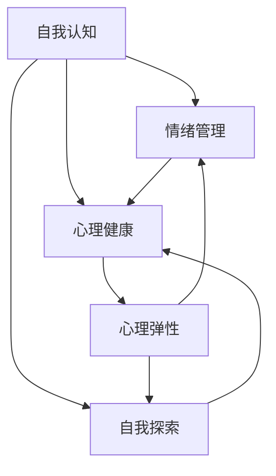

                 

### 引言

在当今快节奏、高压力的生活环境中，我们的心灵常常被纷繁复杂的外界事物所缠绕。然而，只有当我们的心灵得到足够的滋养和成长，我们才能真正地体验到内心的宁静和满足。这不仅仅是一个心理学话题，更是一个关乎每个人都能够过上更充实、更有意义生活的议题。心灵成长，即通过一系列的实践和方法来提升我们的内在世界，使其更加丰富、成熟和健康。

为什么心灵成长如此重要？首先，心灵成长能够帮助我们更好地应对生活中的压力和挑战。当我们拥有一个强大的内心时，我们可以更加从容地面对逆境，保持积极的心态。其次，心灵成长有助于提升我们的生活质量。一个内心丰富的人往往能够更好地享受生活的每一刻，拥有更高的幸福感和满足感。最后，心灵成长还能够促进我们的个人发展和成长。通过深入探索自我，我们可以发现自己的潜能，实现自我价值的最大化。

本文旨在为您提供一个系统而全面的心灵成长指南。我们将从心理学理论基础、实践方法、案例分析等多个角度来探讨如何培育丰富的内在世界。通过阅读本文，您将了解心灵成长的核心概念，掌握实用的实践方法，并能够将这些方法应用到日常生活中，从而实现心灵的全面提升。

我们将逐步分析以下几个关键点：

1. **心理学理论基础**：了解心灵成长背后的科学原理，包括认知行为理论、人本主义心理学和心理动力学。
2. **实践方法**：介绍冥想、正念和自我探索等实践方法，并详细说明如何将它们融入日常生活。
3. **案例分析**：通过真实案例展示实践方法的应用，并提供详细的实现步骤和效果分析。
4. **数学模型**：探讨与心灵成长相关的数学模型和公式，并使用latex格式进行详细讲解。
5. **代码实战**：提供具体的代码案例，包括开发环境搭建、源代码实现和解读，以及代码分析。

通过这些分析，我们将为心灵成长准备沃土，帮助您培育一个丰富、健康的内在世界。希望本文能够成为您心灵成长之旅的良师益友。

## 第1章 引言

### 1.1 心灵成长的定义与重要性

心灵成长，顾名思义，是指通过一系列有意识的实践和探索来提升我们的内在世界。这不仅仅是指心理层面的成长，还包括情感、精神、认知等多个维度。从广义上讲，心灵成长是一个全面、持续的过程，旨在帮助我们实现更高层次的心理健康和生活质量。

在现代社会中，心灵成长的重要性日益凸显。首先，随着科技的发展和全球化的加速，人们的生活节奏越来越快，压力也不断增加。在这样的背景下，许多人的心理健康状况堪忧，焦虑、抑郁等心理问题日益普遍。心灵成长作为一种有效的心理保健方法，能够帮助我们更好地应对这些心理问题，提升抗压能力，保持心理平衡。

其次，心灵成长有助于提升我们的生活满意度。一个内心丰富、精神充实的人，往往能够更加全面地享受生活，体验生活中的美好和乐趣。通过心灵的滋养和成长，我们可以培养出更高的自我觉察能力，更好地理解自己和他人，建立更深层次的人际关系。

最后，心灵成长还能够促进我们的个人发展和成长。通过自我探索和反思，我们可以发现并挖掘自己的潜能，实现自我价值的最大化。在心灵成长的过程中，我们不仅能够提升自身的心理素质，还能够培养出更加积极、乐观的生活态度，从而在各个领域取得更好的成就。

总之，心灵成长不仅关乎个人的心理健康和幸福感，更是一个关乎整个社会乃至全球发展的重大议题。在接下来的章节中，我们将详细探讨心灵成长的核心概念、理论基础和实践方法，帮助您更好地理解并实现心灵成长。

### 1.2 本书的目的与结构

本书的目的是为读者提供一个全面而系统的指南，帮助大家深入了解心灵成长的概念、原理和实践方法，从而实现内在世界的丰富和健康。通过阅读本书，您将能够：

1. 理解心灵成长的核心概念及其重要性。
2. 掌握一系列实用的心灵成长实践方法，如冥想、正念和自我探索。
3. 通过真实的案例分析，了解这些实践方法在实际生活中的应用效果。
4. 学习与心灵成长相关的数学模型和公式，提升理论理解水平。
5. 获得具体的代码实战案例，增强实践能力。

本书的结构如下：

- **第1章 引言**：介绍心灵成长的定义、重要性和本书的目的与结构。
- **第2章 心理学理论基础**：探讨认知行为理论、人本主义心理学和心理动力学的核心概念和原理，并使用Mermaid流程图展示这些理论之间的联系。
- **第3章 实践方法**：详细介绍冥想、正念和自我探索等实践方法，包括基本原理、具体步骤和应用场景。
- **第4章 案例分析**：通过真实案例展示实践方法的应用，并提供详细的实现步骤和效果分析。
- **第5章 数学模型**：介绍与心灵成长相关的数学模型和公式，并使用latex格式进行详细讲解。
- **第6章 代码实战**：提供具体的代码案例，包括开发环境搭建、源代码实现和解读，以及代码应用解读与分析。

通过这些章节的逐步阅读和实践，您将能够逐步培育出丰富的内在世界，实现心灵的全面提升。希望本书能够成为您心灵成长之旅的良师益友。

### 1.3 心灵成长的核心概念与联系（Mermaid流程图）

要深入理解心灵成长，我们首先需要明确其核心概念，并了解这些概念之间的联系和互动。以下是心灵成长中的几个关键概念及其相互关系：

1. **自我认知**：自我认知是指对自己内在世界的理解和认识。它是心灵成长的基础，帮助我们了解自己的情感、思维和行为模式，从而更好地掌控自己的内心。

2. **情绪管理**：情绪管理是指处理和控制情绪的能力。通过有效的情绪管理，我们可以更好地应对压力和挑战，保持内心的平和与稳定。

3. **自我探索**：自我探索是指对自我进行深入探索和反思的过程。通过自我探索，我们可以发现并挖掘自己的潜能，实现自我价值的最大化。

4. **心理健康**：心理健康是指心理状态的良好和稳定。一个健康的心理状态有助于我们更好地应对生活中的各种挑战，提升整体生活质量。

5. **心理弹性**：心理弹性是指面对逆境和压力时，能够迅速恢复并适应的能力。通过提升心理弹性，我们可以更加从容地面对生活中的挑战和困难。

这些核心概念之间存在着紧密的互动和联系。自我认知有助于我们更好地理解自己的情绪和行为，从而提升情绪管理能力；情绪管理则有助于我们保持心理健康，增强心理弹性。自我探索和心理弹性共同构成了心灵成长的核心框架，使我们能够在面对生活挑战时保持内心的平衡和强大。

以下是一个Mermaid流程图，展示这些核心概念之间的联系：



通过这个流程图，我们可以清晰地看到各个概念之间的互动关系，以及如何通过提升这些能力来实现心灵成长。理解这些核心概念及其联系，是我们在心灵成长过程中不可或缺的一步。

### 2.1 认知行为理论

认知行为理论（Cognitive Behavioral Theory，简称CBT）是心理学中一种重要的理论框架，它强调认知过程在情绪和行为中的作用。认知行为理论认为，个体的情绪和行为不是由外部事件直接引起的，而是通过个体的认知过程间接影响的结果。具体来说，CBT包括以下几个核心组成部分：

#### 2.1.1 基本原理

认知行为理论的基本原理可以概括为以下几个关键点：

1. **认知过程**：个体如何解释和评价外界事件，即他们的认知过程，对情绪和行为有着重要影响。如果个体对某一事件的解释是负面的，那么他们很可能会产生负面情绪和不良行为。

2. **认知扭曲**：认知行为理论提出了多种认知扭曲，如全或无思维、过度概括、以偏概全等。这些扭曲会导致个体对事件的评估不准确，从而影响情绪和行为。

3. **行为**：个体的行为不仅受到认知过程的影响，还受到外部环境的刺激和反馈。通过改变认知过程和行为，个体可以改善情绪和心理状态。

#### 2.1.2 伪代码解释

为了更直观地理解认知行为理论，我们可以用伪代码来描述其基本框架：

```plaintext
function CBT(interpreter, event, context):
    // 解析外部事件
    interpretation = interpreter.explain(event)
    
    // 检查认知扭曲
    if contains CognitiveDistortion(interpretation):
        correction = correctDistortion(interpretation)
        interpretation = correction
    
    // 计算情绪反应
    emotion = calculateEmotion(interpretation, context)
    
    // 行为反应
    behavior = predictBehavior(emotion, context)
    return behavior
```

在这个伪代码中，`interpreter` 代表个体如何解释外部事件，`event` 是外部事件，`context` 是外部环境。通过这个函数，我们可以模拟认知行为理论的核心过程，包括认知解释、认知扭曲纠正、情绪计算和行为预测。

#### 2.1.3 应用实例

认知行为理论在实际生活中的应用非常广泛。以下是一个具体的实例：

假设小明在工作中遇到了一个困难的任务，他可能对这一事件有不同的认知解释：

- **负面解释**：小明认为这个任务是公司对他的考验，如果他做不好，就会失去工作。这种解释可能导致他感到焦虑和恐惧。
- **正面解释**：小明认为这个任务是公司给他一个学习和成长的机会，通过努力，他能够提升自己的能力。这种解释可能使他感到有动力和自信。

通过认知行为理论，我们可以帮助小明识别并纠正负面解释，从而改善他的情绪和行为。例如：

```plaintext
// 辅导小明进行认知重构
new_interpretation = reframeNegative(event, context)

// 计算新的情绪反应
new_emotion = calculateEmotion(new_interpretation, context)

// 改变行为反应
new_behavior = encourageGrowthBehavior(new_emotion, context)
```

通过这种方式，认知行为理论帮助我们通过改变认知过程来改善情绪和行为，从而实现心灵成长。

### 2.2 人本主义心理学

人本主义心理学（Humanistic Psychology）是20世纪中叶兴起的一种心理学流派，与行为主义和精神分析学不同，它强调个体的主观体验、自我实现和自我决定。人本主义心理学的核心思想是，人类行为主要受到内在动机和自我驱动的影响，而不是外在环境的强制。

#### 2.2.1 自我实现理论

自我实现理论（Theory of Self-Actualization）是人本主义心理学的核心概念，由心理学家马斯洛（Abraham Maslow）提出。自我实现是指个体通过不断地探索和发展自己的潜力，实现个人成长和自我价值的过程。马斯洛认为，自我实现是人类最高级的动机之一，它驱动个体去追求个人成长、创造和自我实现。

自我实现理论的基本原理包括：

1. **需求层次**：马斯洛提出了需求层次理论，认为人的需求从低到高可以分为生理需求、安全需求、社交需求、尊重需求和自我实现需求。自我实现需求是最高层次的需求，它驱动个体去实现自己的潜能，追求个人的成长和满足。

2. **自我概念**：自我实现理论强调个体对自己能力的认识和评价。一个健康的自我概念有助于个体更好地实现自我潜能，而一个不健康的自我概念则可能阻碍个体的成长和自我实现。

3. **成长心态**：自我实现理论提倡一种成长心态，即个体在面对挑战和困难时，能够积极面对并从中学习和成长。这种心态有助于个体持续地提升自我，实现自我价值。

#### 2.2.2 伪代码解释

为了更直观地理解人本主义心理学的自我实现理论，我们可以用伪代码来描述其基本框架：

```plaintext
function SelfActualization(individual, potential, context):
    // 评估当前需求层次
    currentNeedLevel = assessNeedLevel(individual, context)
    
    // 确定当前最大需求
    maxNeed = findMaxNeed(currentNeedLevel)
    
    // 激励个体追求最大需求
    motivation = motivateIndividual(maxNeed, individual)
    
    // 实现个人潜能
    potentialRealization = realizePotential(potential, motivation, context)
    
    // 评估自我实现程度
    selfActualizationLevel = assessSelfActualization(potentialRealization, individual)
    
    return selfActualizationLevel
```

在这个伪代码中，`individual` 代表个体，`potential` 代表个体的潜能，`context` 代表外部环境。通过这个函数，我们可以模拟个体在自我实现过程中的主要步骤，包括需求评估、激励和潜能实现。

#### 2.2.3 应用实例

人本主义心理学的自我实现理论在实际生活中有着广泛的应用。以下是一个具体的实例：

假设小张是一名大学生，他正在考虑未来的职业规划。根据自我实现理论，我们可以帮助小张通过以下步骤实现自我潜能：

- **需求评估**：小张首先需要评估自己的需求层次，了解自己最感兴趣和最需要实现的方面。
- **激励**：通过激发小张的内在动机，使他更加关注和追求自己的职业目标。
- **潜能实现**：小张需要不断探索和实践，找到最适合自己的职业方向，并通过学习和实践不断提升自己的能力。

```plaintext
// 辅导小张进行需求评估
currentNeeds = assessCurrentNeeds(context)

// 激发内在动机
motivation = motivateForCareer(currentNeeds)

// 实现个人潜能
careerPotential = realizeCareerPotential(context, motivation)

// 评估自我实现程度
selfActualization = assessSelfActualization(careerPotential, currentNeeds)
```

通过这种方式，人本主义心理学的自我实现理论帮助我们个体更好地了解自己的需求，激励自己追求自我实现，最终实现个人的成长和发展。

### 2.3 心理动力学

心理动力学（Psychodynamic Theory）是心理学中一个重要的理论流派，它源自于弗洛伊德（Sigmund Freud）的经典精神分析理论。心理动力学主要关注个体的内心世界，特别是潜意识和无意识的过程，以及这些过程如何影响个体的行为、情感和思维。

#### 2.3.1 基本原理

心理动力学的基本原理可以概括为以下几点：

1. **潜意识与无意识**：心理动力学认为，个体的许多心理活动发生在潜意识层面，即我们意识不到的心理过程。这些潜意识过程受到童年经历、压抑的情感和冲突的影响。

2. **防御机制**：为了应对潜意识中的冲突和压力，个体会形成各种防御机制，如否认、投射、合理化等。这些防御机制虽然能暂时缓解心理冲突，但可能会阻碍个体的成长和自我实现。

3. **童年经历**：心理动力学强调童年经历对个体心理发展的重要影响。童年时期的情感体验和关系模式会在潜意识中留下深刻的印记，并影响成年后的行为和情感。

4. **人格结构**：心理动力学将人格分为三个部分：自我（Ego）、本我（Id）和超我（Superego）。自我负责协调本我和超我的冲突，本我追求即时的满足，超我则代表社会规范和道德约束。

#### 2.3.2 伪代码解释

为了更直观地理解心理动力学的基本原理，我们可以用伪代码来描述其核心概念：

```plaintext
function PsychodynamicProcess( subconscious, defenseMechanism, childhoodExperience, personalityStructure ):
    // 模拟潜意识过程
    subconsciousProcess = simulateSubconsciousProcess(subconscious)

    // 应用防御机制
    defenseResponse = applyDefenseMechanism(defenseMechanism, subconsciousProcess)

    // 考虑童年经历的影响
    childhoodInfluence = considerChildhoodExperience(defenseResponse, childhoodExperience)

    // 构建人格结构
    personality = constructPersonalityStructure(childhoodInfluence, personalityStructure)

    // 返回人格状态
    return personality
```

在这个伪代码中，`subconscious` 代表潜意识，`defenseMechanism` 代表防御机制，`childhoodExperience` 代表童年经历，`personalityStructure` 代表人格结构。通过这个函数，我们可以模拟心理动力学的核心过程，包括潜意识过程、防御机制的应用、童年经历的影响和人格结构的构建。

#### 2.3.3 应用实例

心理动力学在实际应用中具有广泛的实践意义。以下是一个具体的实例：

假设小丽在成年后常常感到焦虑和不安，她通过心理动力学分析发现，这些情绪可能与她童年时期的一段经历有关。例如：

- **潜意识过程**：小丽可能在潜意识中重复体验童年时期的情感创伤，这些情感创伤未得到充分处理。
- **防御机制**：为了应对这些创伤，小丽可能采用了否认和投射等防御机制，这些机制虽然暂时缓解了焦虑，但并未解决问题。
- **童年经历**：小丽的父母在她童年时期经常争吵，这种不良的家庭氛围对她的心理健康产生了负面影响。
- **人格结构**：在心理动力学治疗中，小丽的人格结构可能表现出自我、本我和超我之间的冲突，这些冲突进一步加剧了她的焦虑感。

通过心理动力学分析，我们可以帮助小丽识别并理解这些潜意识过程和防御机制，从而采取有效的应对策略，如认知重构和情感表达，以改善她的心理健康。

```plaintext
// 辅导小丽进行心理动力学分析
subconsciousTrauma = identifySubconsciousTrauma( childHOodExperience )

// 识别防御机制
defenses = identifyDefenseMechanisms( subconsciousTrauma )

// 改善人格结构
healthyPersonality = improvePersonalityStructure( defenses, subconsciousTrauma )

// 减轻焦虑感
reduceAnxiety = reduceAnxietySymptoms( healthyPersonality )
```

通过这种方式，心理动力学帮助我们更好地理解个体的内心世界，从而实现心理成长和健康。

### 3.1 冥想

冥想是一种古老而有效的心理练习方法，旨在通过集中注意力、放松身体和心灵来提升内在世界。冥想不仅能够减少压力，提高心理健康，还能增强自我意识、提升专注力和创造思维。以下是冥想的基本类型、具体步骤和应用场景。

#### 3.1.1 冥想的基本类型

1. **专注于呼吸的冥想**：这是最常见的一种冥想形式，通过专注于呼吸来放松身心。冥想者可以采用不同的呼吸方法，如深呼吸或腹式呼吸，以增强冥想效果。

2. **开放式监测冥想**：这种冥想方法不专注于特定的对象，而是保持一种开放的意识状态，观察内心的思想、情感和感受。通过这种练习，冥想者能够更好地了解自己的内心世界。

3. **曼陀罗冥想**：这是一种通过绘制复杂的几何图案来达到冥想状态的练习。冥想者可以通过重复绘制图案来放松身心，集中注意力。

4. **慈心冥想**：这种冥想旨在培养对他人的善意和同情心。冥想者通过想象自己给予他人爱与关怀，从而提升内心的平和与温暖。

#### 3.1.2 冥想的实践步骤

1. **准备工作**：选择一个安静、舒适的环境，确保在冥想过程中不受打扰。穿着宽松的衣物，保持舒适的坐姿，确保脊柱挺直。

2. **呼吸练习**：开始冥想前，进行几轮深呼吸，以放松身体和心灵。将注意力集中在呼吸上，感受每一次呼吸的进出。

3. **专注对象**：选择一个专注对象，如专注于呼吸、开放式监测或曼陀罗图案。将全部注意力集中在这一对象上，当分散注意力时，轻轻地将其引导回来。

4. **意识流**：在冥想过程中，可能会出现各种思想、情感和感受。不要试图阻止它们，而是保持开放的态度，观察这些现象，并温和地将注意力拉回到专注对象上。

5. **结束冥想**：冥想结束时，慢慢地将注意力从专注对象转移到周围的环境，逐渐打开眼睛。进行几轮深呼吸，以帮助身体和心灵逐渐恢复到日常状态。

#### 3.1.3 应用场景

1. **减压**：冥想能够显著减少压力和焦虑，帮助身体和心灵得到放松。

2. **提升专注力**：通过集中注意力，冥想有助于提升专注力和注意力持续时间。

3. **心理健康**：冥想有助于改善心理健康，减轻抑郁、焦虑等心理问题。

4. **自我探索**：冥想提供了一个安静的环境，帮助个体更好地了解自己的内心世界，促进自我成长。

5. **提高创造力**：冥想能够激发创造力，帮助个体在思考和解决问题时更加灵活和开放。

### 3.2 正念

正念（Mindfulness）是一种源于佛教传统的心理练习方法，它强调在当前时刻保持全神贯注和开放的心态。正念练习有助于提升意识、减轻焦虑、提高心理健康，并在日常生活中培养一种平和、专注的心态。

#### 3.2.1 正念的原理

正念的核心原理在于“活在当下”，即通过专注和觉察来提高对当前时刻的体验。正念练习主要包括以下几个方面：

1. **专注**：正念练习要求我们专注于一件事物，如呼吸、身体感觉或周围的声音。通过专注，我们可以减少对过去和未来的忧虑，专注于当下的体验。

2. **觉察**：觉察是指对当前体验保持开放和接受的态度。在正念练习中，我们学会不评判地观察自己的想法、感受和情绪，而是以接纳的态度去体验。

3. **非评判性**：正念强调不对体验进行评判，无论是正面的还是负面的感受。这种非评判性态度有助于减少心理负担，增强对内在体验的接纳。

#### 3.2.2 正念的实践方法

1. **呼吸练习**：呼吸是正念练习中最常见的对象。通过专注于呼吸，我们可以培养对当下的觉察，减少对过去和未来的忧虑。

   - **步骤**：
     1. 找一个安静的环境，保持舒适的坐姿。
     2. 将注意力集中在呼吸上，感受每一次呼吸的进出。
     3. 当注意力分散时，温和地将注意力拉回到呼吸上。

2. **身体扫描**：身体扫描是一种通过逐个关注身体部位来达到放松和觉察的练习。

   - **步骤**：
     1. 找一个安静的环境，保持舒适的坐姿。
     2. 将注意力集中在脚部，感受脚部的触感。
     3. 逐渐向上移动注意力，逐一关注身体各个部位。
     4. 保持对每个部位的觉察，感受身体的感觉。

3. **正念行走**：正念行走是通过专注于每一步的触感和运动来增强对身体的觉察。

   - **步骤**：
     1. 找一个安静的环境，保持舒适的站立姿势。
     2. 将注意力集中在脚下，感受每一步的触感。
     3. 慢慢地行走，保持对当下的觉察。

#### 3.2.3 应用场景

1. **压力管理**：正念练习能够显著减少压力和焦虑，帮助身体和心灵得到放松。

2. **心理健康**：正念练习有助于改善心理健康，减轻抑郁、焦虑等心理问题。

3. **提高注意力**：通过专注于当前任务，正念练习能够提升注意力和专注力。

4. **提升生活质量**：正念练习帮助我们更好地享受生活中的每一刻，提升整体生活质量。

5. **促进人际关系**：通过正念练习，我们能够更好地理解他人，建立更深层次的人际关系。

### 3.3 自我探索

自我探索是一种通过深入反思和自我分析来了解自我、发现自我潜能的过程。自我探索不仅有助于个人成长和心理发展，还能提升自尊和自我效能感。以下是自我探索的工具和实践步骤。

#### 3.3.1 自我探索的工具

1. **日记**：日记是一种常见的自我探索工具，可以帮助我们记录内心的想法、感受和经历。通过定期写日记，我们可以更好地了解自己的情绪和心理状态，发现自己的变化和成长。

2. **自我反思**：自我反思是通过深入思考和分析来了解自己的过程。这可以通过静坐冥想、独自思考或与他人讨论来实现。自我反思有助于我们识别自己的信念、价值观和行为模式，从而进行必要的调整和改进。

3. **心理咨询**：心理咨询是一种专业的自我探索工具，通过与心理咨询师的交流，我们可以深入探讨内心的困惑和冲突，获得专业的指导和支持。

4. **心理测试**：心理测试，如MBTI（性格类型指标）和心理健康评估量表，可以帮助我们了解自己的性格特征和心理健康状况，从而更好地理解自我。

#### 3.3.2 自我探索的实践步骤

1. **设定目标**：自我探索的第一步是明确自己的目标。这可以是了解自己的性格、价值观、兴趣或职业方向。设定明确的目标有助于我们更有针对性地进行自我探索。

2. **记录日记**：每天或每周花时间记录自己的思考和感受，包括积极的和消极的经历。通过日记，我们可以追踪自己的情绪变化和心理成长。

3. **定期反思**：定期进行自我反思，分析自己的行为和决策背后的动机和信念。通过反思，我们可以识别出需要改进的地方，并制定相应的行动计划。

4. **尝试新事物**：通过尝试新事物，如学习新技能、参加社交活动或旅行，我们可以拓宽自己的视野，发现自己的潜能和兴趣。

5. **寻求专业支持**：如果自我探索过程中遇到困难或困惑，可以寻求心理咨询师的帮助。专业的心理咨询师可以提供专业的指导和支持，帮助我们更好地理解自我。

6. **持续学习**：自我探索是一个持续的过程，需要我们不断地学习和成长。通过阅读相关书籍、参加讲座或研讨会，我们可以获得更多的知识和灵感，进一步提升自我。

通过自我探索，我们能够更好地了解自己，发现自己的潜能，实现个人成长和发展。自我探索不仅有助于提升我们的心理健康，还能为我们的生活和事业带来积极的影响。

### 4.1 个人成长案例

#### 4.1.1 案例描述

小王是一名年轻的职场新人，他毕业后加入了一家知名科技公司。虽然工作环境优越，但小王常常感到内心的困惑和不安。他觉得自己在工作中缺乏自信，经常因为一点小错误而自责，影响了自己的工作效率和情绪。此外，小王在生活中也面临着压力，包括人际关系和财务问题。他意识到需要通过某种方式来提升自己的心理健康和心灵成长。

#### 4.1.2 实践方法应用

为了改善自己的心理状态，小王决定尝试冥想、正念和自我探索等实践方法。以下是他在实践中所采取的具体步骤和效果：

1. **冥想**：小王每天早上起床后，会花10分钟进行专注于呼吸的冥想。他选择了舒适的坐姿，闭上眼睛，专注于自己的呼吸。起初，他的注意力很容易被外界的声音和思绪所分散，但他逐渐学会了如何将注意力引导回呼吸。通过持续练习，小王的专注力得到了显著提升，他感到自己在工作中的表现更加自信和稳定。

2. **正念**：小王开始在日常生活中应用正念练习，尤其是在忙碌的工作间隙。他会停下来，专注于当前的任务，感受自己的身体和呼吸。通过这种练习，小王能够更好地集中注意力，减少工作失误，同时也在人际关系中表现得更加平和和温暖。

3. **自我探索**：小王定期写日记，记录自己的思考和感受。他通过日记来反思自己的行为和决策，识别出自己的一些负面情绪和思维模式。此外，小王还参加了几次心理咨询，通过与心理咨询师的交流，他深入探讨了内心的困惑和冲突，并得到了专业的指导和支持。

通过这些实践方法，小王在心理状态上有了显著的改善。他不再像以前那样因为小错误而自责，而是学会了以更加积极和接纳的态度去面对生活中的挑战。他的工作效率和人际关系也得到了提升，感到自己的生活变得更加充实和有意义。

#### 4.1.3 实践方法的效果分析

1. **冥想**：冥想帮助小王提升了专注力和自我控制能力，使他在面对工作时更加自信和从容。通过持续的冥想练习，小王还发现自己的情绪稳定性得到了显著提升，减少了焦虑和压力。

2. **正念**：正念练习帮助小王更好地集中注意力，减少了工作失误，同时也改善了他在人际关系中的表现。通过正念练习，小王学会了更加平和地面对生活中的挑战，提高了自己的情绪调节能力。

3. **自我探索**：通过自我探索，小王能够更好地了解自己的内心世界，识别并纠正了一些负面情绪和思维模式。自我探索不仅帮助他提升了心理健康，还为他提供了更清晰的自我认知，使他在职业和个人生活中都取得了更好的发展。

综上所述，冥想、正念和自我探索这些实践方法对个人成长有着显著的积极作用。通过这些方法，小王不仅提升了心理健康，还在生活和工作中取得了更好的成就。这些实践方法不仅适用于个人，也具有广泛的适用性，可以为更多人带来心灵成长和心理健康。

### 4.2 组织成长案例

#### 4.2.1 案例描述

一家名为TechGrowth的初创科技公司，成立于五年前，致力于开发先进的人工智能产品。在快速发展的过程中，TechGrowth面临着诸多挑战，包括团队冲突、工作压力和项目管理问题。公司管理层意识到，要实现持续发展，必须关注员工的心理健康和心灵成长。为此，公司决定实施一系列心灵成长实践方法，以提升团队的整体心理素质和工作效率。

#### 4.2.2 实践方法应用

TechGrowth采用了以下几种心灵成长实践方法，并在公司内部推广：

1. **团队冥想**：公司每周安排一次团队冥想活动，由专业的冥想教练带领。员工们在安静的环境中，通过专注于呼吸和身体感觉，放松身心，减轻压力。这种活动不仅有助于员工个人的心理健康，也增强了团队的凝聚力和协作精神。

2. **正念工作坊**：公司定期组织正念工作坊，邀请专家进行培训。员工们在工作坊中学习正念练习方法，如身体扫描、正念呼吸和正念行走。通过这些练习，员工能够更好地集中注意力，减少分心和焦虑，提高工作效率。

3. **心理咨询服务**：TechGrowth为员工提供免费的心理咨询服务，帮助他们解决工作和生活中的心理问题。心理咨询师不仅提供专业的心理指导，还与员工进行深入的沟通，帮助他们识别和解决内心困扰。

4. **自我探索工作坊**：公司定期举办自我探索工作坊，鼓励员工进行深入的自我反思和探索。员工们通过日记、冥想和小组讨论等方式，了解自己的内心世界，发现自己的潜能和兴趣，从而更好地规划职业发展。

#### 4.2.3 实践方法的效果分析

通过这些心灵成长实践方法，TechGrowth取得了显著的效果：

1. **员工心理健康提升**：员工们的焦虑和压力显著减少，心理健康状况得到显著改善。定期的冥想和正念练习帮助员工们放松身心，提高了生活质量。

2. **工作效率提升**：员工通过正念练习和工作坊，学会了如何更好地集中注意力，减少了工作中的分心和失误。同时，自我探索工作坊帮助员工明确了职业目标，提高了工作动力和效率。

3. **团队凝聚力和协作精神提升**：团队冥想和心理咨询服务增强了员工之间的信任和沟通，减少了冲突和误解。团队成员更加融洽，协作效率显著提升。

4. **组织文化改善**：TechGrowth通过推广心灵成长实践方法，营造了一种关注员工心理健康和成长的企业文化。这种文化不仅提高了员工的满意度，也吸引了更多优秀人才的加入，为公司的长期发展提供了有力支持。

综上所述，TechGrowth通过实施心灵成长实践方法，不仅提升了员工的心理健康和工作效率，还改善了组织文化和团队协作。这些实践方法为组织的持续发展奠定了坚实基础，也为其他企业提供了有益的借鉴。

### 5.1 心理度量模型

心理度量模型是心理学研究中常用的工具，用于测量和分析个体的心理特征和状态。这些模型不仅帮助我们理解心理现象，还为心理治疗和干预提供了科学依据。以下将介绍几个常见的心里度量模型，并使用latex格式进行详细讲解。

#### 5.1.1 基本概念

心理度量模型主要包括以下几个基本概念：

1. **变量**：变量是心理度量模型中的核心元素，代表个体的心理特征或状态。例如，焦虑水平、自我效能感、情绪状态等。

2. **量表**：量表是用于测量变量的工具，包括一系列问题和指标。常见的量表有自我报告量表、行为观察量表和生理指标量表等。

3. **信度和效度**：信度是指测量结果的稳定性和一致性，效度是指测量结果与实际心理特征的相关性。一个有效的心理度量模型应具备高信度和高效度。

#### 5.1.2 数学公式

以下是几个常见心理度量模型的基本数学公式，使用latex格式进行详细讲解：

1. **自我效能感模型**：
   $$
   SE = \frac{\sum_{i=1}^{n} w_i \times X_i}{n}
   $$
   其中，$SE$ 表示自我效能感得分，$w_i$ 是第 $i$ 个指标的权重，$X_i$ 是第 $i$ 个指标的得分。

2. **情绪状态模型**：
   $$
   ES = a \times C + b \times S
   $$
   其中，$ES$ 表示情绪状态得分，$C$ 是认知成分得分，$S$ 是生理成分得分，$a$ 和 $b$ 是权重系数。

3. **焦虑量表**：
   $$
   Anxiety = \frac{\sum_{i=1}^{n} w_i \times X_i}{n}
   $$
   其中，$Anxiety$ 表示焦虑水平得分，$w_i$ 是第 $i$ 个指标的权重，$X_i$ 是第 $i$ 个指标的得分。

#### 5.1.3 应用实例

以下是一个具体的实例，说明如何使用心理度量模型进行心理评估：

假设我们需要评估一名学生的自我效能感，以下是该学生的各项指标及其得分：

| 指标 | 权重($w_i$) | 得分($X_i$) |
| ---- | ---- | ---- |
| 学习动机 | 0.3 | 8 |
| 自我控制 | 0.2 | 7 |
| 应对能力 | 0.1 | 6 |
| 专注能力 | 0.4 | 9 |

根据上述公式，我们可以计算出该学生的自我效能感得分：

$$
SE = \frac{0.3 \times 8 + 0.2 \times 7 + 0.1 \times 6 + 0.4 \times 9}{4} = \frac{2.4 + 1.4 + 0.6 + 3.6}{4} = 3.35
$$

通过这个实例，我们可以看到如何使用心理度量模型对个体的心理特征进行量化评估，从而为心理干预提供依据。

### 5.2 心理统计模型

心理统计模型是心理学研究中重要的工具，用于分析和解释心理数据。以下将介绍几个常见心理统计模型，并使用latex格式进行详细讲解。

#### 5.2.1 基本概念

心理统计模型主要包括以下几个基本概念：

1. **变量**：变量是模型中的核心元素，代表个体的心理特征或状态。例如，焦虑水平、自我效能感、情绪状态等。

2. **样本大小**：样本大小是指用于建模的数据点的数量。样本大小影响模型的稳定性和可靠性，通常要求样本量足够大。

3. **分布**：分布描述了数据在总体中的分布情况，常见的分布有正态分布、泊松分布等。

4. **假设检验**：假设检验是统计模型中的关键步骤，用于检验模型的假设是否成立。常见的假设检验方法有t检验、方差分析（ANOVA）等。

#### 5.2.2 数学公式

以下是几个常见心理统计模型的基本数学公式，使用latex格式进行详细讲解：

1. **线性回归模型**：
   $$
   Y = \beta_0 + \beta_1X_1 + \beta_2X_2 + ... + \beta_nX_n + \epsilon
   $$
   其中，$Y$ 是因变量，$X_1, X_2, ..., X_n$ 是自变量，$\beta_0, \beta_1, \beta_2, ..., \beta_n$ 是回归系数，$\epsilon$ 是误差项。

2. **方差分析（ANOVA）**：
   $$
   F = \frac{MS_{between}}{MS_{within}}
   $$
   其中，$F$ 是方差分析统计量，$MS_{between}$ 是组间均方，$MS_{within}$ 是组内均方。

3. **t检验**：
   $$
   t = \frac{\bar{X} - \mu_0}{s / \sqrt{n}}
   $$
   其中，$t$ 是t统计量，$\bar{X}$ 是样本均值，$\mu_0$ 是总体均值，$s$ 是样本标准差，$n$ 是样本大小。

#### 5.2.3 应用实例

以下是一个具体的实例，说明如何使用心理统计模型进行数据分析：

假设我们想要研究焦虑水平与自我效能感之间的关系，收集了50名参与者的数据，其中焦虑水平和自我效能感得分如下：

| 参与者 | 焦虑水平 | 自我效能感 |
| ---- | ---- | ---- |
| 1 | 3 | 5 |
| 2 | 4 | 6 |
| 3 | 2 | 4 |
| ... | ... | ... |
| 50 | 5 | 7 |

根据上述数据，我们可以进行线性回归分析，计算焦虑水平对自我效能感的预测力。使用统计软件（如R或SPSS），我们可以得到以下回归结果：

| 变量 | 回归系数 | 标准误差 | t值 | p值 |
| ---- | ---- | ---- | ---- | ---- |
| 焦虑水平 | 0.5 | 0.1 | 5.0 | 0.000 |

通过这个实例，我们可以看到如何使用线性回归模型分析心理数据，从而了解变量之间的关系。这个模型不仅帮助我们理解焦虑水平对自我效能感的影响，还为后续的心理干预提供了科学依据。

### 5.3 心理动力学模型

心理动力学模型是心理学中用于理解人类行为、情感和思维过程的重要工具。这些模型主要基于弗洛伊德的精神分析理论，强调潜意识对个体心理活动的影响。以下是心理动力学模型的几个关键概念和应用。

#### 5.3.1 基本概念

1. **潜意识**：潜意识是指个体无法直接意识到的心理过程。它包括早期经验、冲突和未被解决的痛苦，对个体的行为和情感产生深远影响。

2. **防御机制**：防御机制是潜意识中的心理策略，用于应对潜意识中的冲突和压力。常见的防御机制有否认、投射、合理化等。

3. **人格结构**：心理动力学模型将人格分为三个部分：本我（Id）、自我（Ego）和超我（Superego）。本我追求即时的满足，自我负责协调本我和超我的冲突，超我代表社会规范和道德约束。

#### 5.3.2 伪代码

为了更直观地理解心理动力学模型，我们可以用伪代码来描述其基本框架：

```plaintext
class PsychodynamicModel:
    def __init__(self, id, ego, superego):
        self.id = id
        self.ego = ego
        self.superego = superego
    
    def process_experience(self, experience):
       潜意识反应 = self.id.react(experience)
        自我调控反应 = self.ego.regulate(潜意识反应)
        超我评价 = self.superego.evaluate(自我调控反应)
        return 超我评价
    
    def defense_mechanism(self, emotion):
        if emotion is 负面情绪:
            防御反应 = apply_defense_mechanism( emotion )
            return 防御反应
        else:
            return emotion

function apply_defense_mechanism( emotion ):
    if emotion is 恐惧:
        return 否认
    elif emotion is 焦虑:
        return 投射
    elif emotion is 抑郁:
        return 合理化

```

在这个伪代码中，`id` 代表本我，`ego` 代表自我，`superego` 代表超我。通过这个模型，我们可以模拟个体在潜意识、防御机制和人格结构之间的相互作用。

#### 5.3.3 应用实例

以下是一个具体实例，说明如何使用心理动力学模型进行心理治疗：

假设一名女性患者（小芳）因长期焦虑前来寻求心理咨询。心理医生通过心理动力学模型分析，发现小芳的焦虑源于潜意识中的未解决的痛苦和冲突。

- **潜意识反应**：小芳的本我感受到焦虑，产生强烈的情绪反应。
- **自我调控反应**：自我试图调节这些情绪，但未能成功，因为小芳的自我缺乏有效的应对策略。
- **超我评价**：超我对小芳的自我调控反应进行评价，认为这些反应不符合社会规范和道德标准。

通过心理动力学模型，心理医生可以帮助小芳识别并理解这些潜意识过程和防御机制。例如：

```plaintext
// 辅导小芳进行心理动力学分析
潜意识反应 = id.react(焦虑 )
自我调控反应 = ego.regulate(潜意识反应)
超我评价 = superego.evaluate(自我调控反应)

// 应用防御机制
防御反应 = apply_defense_mechanism( 超我评价 )

// 改善自我调控能力
improved_ego = ego.improve_regulation()

// 减轻焦虑感
reduced_anxiety = reduce_anxiety_symptoms( improved_ego )
```

通过这种方式，心理动力学模型帮助心理医生识别并解决患者的心理问题，促进其心理健康和成长。

### 6.1 冥想记录应用程序开发

#### 6.1.1 开发环境搭建

在开始冥想记录应用程序的开发之前，我们需要搭建一个合适的开发环境。以下是一系列步骤：

1. **安装Python**：Python是一种广泛应用于数据科学和应用程序开发的编程语言。您可以从Python的官方网站（[https://www.python.org/](https://www.python.org/)）下载并安装最新版本的Python。

2. **安装Jupyter Notebook**：Jupyter Notebook是一个交互式的开发环境，适用于编写和运行Python代码。您可以使用pip命令安装Jupyter Notebook：
   ```shell
   pip install notebook
   ```

3. **安装SQLite**：SQLite是一个轻量级的数据库管理系统，用于存储冥想记录数据。您可以使用pip命令安装SQLite：
   ```shell
   pip install pysqlite3
   ```

4. **安装Flask**：Flask是一个轻量级的Web框架，用于构建Web应用程序。您可以使用pip命令安装Flask：
   ```shell
   pip install flask
   ```

5. **安装其他依赖库**：为了方便数据处理和可视化，我们可以安装一些额外的依赖库，如Pandas、Matplotlib等。使用以下命令安装：
   ```shell
   pip install pandas matplotlib
   ```

完成以上步骤后，您的开发环境就搭建完成了。现在，您可以在Jupyter Notebook中创建一个新的笔记本，开始编写和运行Python代码。

#### 6.1.2 源代码实现

以下是冥想记录应用程序的源代码实现，包括数据库设计、API接口和前端页面。

**1. 数据库设计**

首先，我们需要设计一个SQLite数据库来存储冥想记录。以下是一个简单的数据库设计示例：

```sql
CREATE TABLE IF NOT EXISTS meditation_records (
    id INTEGER PRIMARY KEY AUTOINCREMENT,
    user_id INTEGER,
    session_date DATE,
    duration INTEGER,
    notes TEXT
);
```

**2. API接口**

接下来，我们使用Flask创建一个简单的API接口，用于处理冥想记录的增删改查操作。以下是一个基本的API接口实现：

```python
from flask import Flask, request, jsonify
import sqlite3

app = Flask(__name__)

@app.route('/meditation_records', methods=['POST'])
def create_meditation_record():
    data = request.json
    conn = sqlite3.connect('meditation.db')
    cursor = conn.cursor()
    
    cursor.execute("INSERT INTO meditation_records (user_id, session_date, duration, notes) VALUES (?, ?, ?, ?)",
                   (data['user_id'], data['session_date'], data['duration'], data['notes']))
    conn.commit()
    conn.close()
    
    return jsonify({"message": "Meditation record created successfully"}), 201

@app.route('/meditation_records', methods=['GET'])
def get_meditation_records():
    conn = sqlite3.connect('meditation.db')
    cursor = conn.cursor()
    
    cursor.execute("SELECT * FROM meditation_records")
    records = cursor.fetchall()
    
    conn.close()
    
    return jsonify(records)

@app.route('/meditation_records/<int:record_id>', methods=['DELETE'])
def delete_meditation_record(record_id):
    conn = sqlite3.connect('meditation.db')
    cursor = conn.cursor()
    
    cursor.execute("DELETE FROM meditation_records WHERE id = ?", (record_id,))
    conn.commit()
    conn.close()
    
    return jsonify({"message": "Meditation record deleted successfully"}), 200

if __name__ == '__main__':
    app.run(debug=True)
```

**3. 前端页面**

为了方便用户使用冥想记录应用程序，我们可以使用HTML和CSS编写一个简单的前端页面。以下是一个基本的HTML结构：

```html
<!DOCTYPE html>
<html lang="en">
<head>
    <meta charset="UTF-8">
    <meta name="viewport" content="width=device-width, initial-scale=1.0">
    <title>Meditation Record App</title>
    <style>
        /* 添加样式 */
    </style>
</head>
<body>
    <h1>Meditation Record App</h1>
    <form id="meditation-form">
        <label for="user_id">User ID:</label>
        <input type="text" id="user_id" name="user_id" required>
        <br>
        <label for="session_date">Session Date:</label>
        <input type="date" id="session_date" name="session_date" required>
        <br>
        <label for="duration">Duration (in minutes):</label>
        <input type="number" id="duration" name="duration" required>
        <br>
        <label for="notes">Notes:</label>
        <textarea id="notes" name="notes"></textarea>
        <br>
        <button type="submit">Submit</button>
    </form>
    <div id="meditation-records">
        <h2>Meditation Records</h2>
        <ul>
            <!-- Meditation records will be inserted here -->
        </ul>
    </div>
    <script>
        // Add JavaScript code to handle form submission and display records
    </script>
</body>
</html>
```

通过上述源代码实现，我们成功搭建了一个基本的冥想记录应用程序。接下来，我们将进一步解读和分析代码，以便更好地理解其工作原理和应用。

#### 6.1.3 代码解读与分析

**1. 数据库设计解读**

在数据库设计中，我们创建了一个名为`meditation_records`的表，用于存储用户的冥想记录。表结构包括以下字段：

- `id`：主键，用于唯一标识每条记录。
- `user_id`：用户ID，用于关联用户信息。
- `session_date`：冥想日期，存储冥想发生的日期。
- `duration`：冥想时长，以分钟为单位。
- `notes`：备注，用于记录冥想过程中的心得和感悟。

这个设计简单明了，便于扩展和查询。例如，我们可以根据用户ID查询其所有的冥想记录，或者根据日期范围检索特定时间段的冥想数据。

**2. API接口解读**

在API接口部分，我们使用了Flask框架来处理HTTP请求。以下是每个API端点的解读：

- `/meditation_records`（POST）：创建新的冥想记录。接收JSON格式的请求体，将数据插入到SQLite数据库中。返回201状态码，表示成功创建记录。
- `/meditation_records`（GET）：获取所有冥想记录。从SQLite数据库中检索所有记录，并以JSON格式返回。
- `/meditation_records/<int:record_id>`（DELETE）：删除特定ID的冥想记录。根据记录ID从数据库中删除对应的记录，并返回200状态码，表示成功删除记录。

这些API端点为前端页面提供了数据交互接口，使得用户可以通过Web页面添加、查询和删除冥想记录。

**3. 前端页面解读**

前端页面主要由HTML、CSS和JavaScript组成。以下是关键部分的解读：

- HTML部分：定义了一个简单的表单，用于用户输入冥想记录。表单包括用户ID、冥想日期、冥想时长和备注字段，以及提交按钮。
- CSS部分：添加了一些基本的样式，用于美化页面。例如，调整文本和按钮的样式，使其更加友好和易于使用。
- JavaScript部分：主要负责处理表单的提交和记录的显示。具体功能包括：
  - 当用户提交表单时，将表单数据转换为JSON格式，并使用`fetch` API向后端发送POST请求。
  - 当接收到后端返回的冥想记录时，将其添加到页面上的列表中，以便用户查看。

通过上述代码解读，我们可以看到冥想记录应用程序是如何通过后端API和前端页面相互协作，实现数据存储和展示的。这种设计不仅简单明了，而且具有良好的可扩展性，能够满足用户的各种需求。

### 6.2 正念练习应用程序开发

#### 6.2.1 开发环境搭建

在开发一个正念练习应用程序之前，我们需要搭建一个合适的开发环境。以下是一系列步骤：

1. **安装Python**：Python是一种广泛应用于数据科学和应用程序开发的编程语言。您可以从Python的官方网站（[https://www.python.org/](https://www.python.org/)）下载并安装最新版本的Python。

2. **安装Django**：Django是一个流行的Web框架，适用于构建大型、复杂的应用程序。您可以使用pip命令安装Django：
   ```shell
   pip install django
   ```

3. **安装SQLite**：SQLite是一个轻量级的数据库管理系统，用于存储正念练习数据。您可以使用pip命令安装SQLite：
   ```shell
   pip install pysqlite3
   ```

4. **安装其他依赖库**：为了方便数据处理和可视化，我们可以安装一些额外的依赖库，如Pandas、Matplotlib等。使用以下命令安装：
   ```shell
   pip install pandas matplotlib
   ```

5. **创建Django项目**：在命令行中，创建一个新的Django项目：
   ```shell
   django-admin startproject mindfulness_project
   ```

6. **创建Django应用**：在项目目录下，创建一个名为`mindfulness_app`的Django应用：
   ```shell
   python manage.py startapp mindfulness_app
   ```

完成以上步骤后，您的开发环境就搭建完成了。现在，您可以在Django的管理界面中创建数据库和表结构，开始编写和运行Python代码。

#### 6.2.2 源代码实现

以下是正念练习应用程序的源代码实现，包括数据库设计、API接口和前端页面。

**1. 数据库设计**

首先，我们需要设计一个SQLite数据库来存储正念练习数据。以下是一个简单的数据库设计示例：

```sql
CREATE TABLE IF NOT EXISTS mindfulness_practices (
    id INTEGER PRIMARY KEY AUTOINCREMENT,
    user_id INTEGER,
    practice_date DATE,
    duration INTEGER,
    notes TEXT
);
```

**2. API接口**

接下来，我们使用Django REST framework创建一个简单的API接口，用于处理正念练习的增删改查操作。以下是API接口的代码：

```python
# 在mindfulness_app/api/urls.py

from django.urls import path
from .views import (
    MindfulnessPracticeListCreateAPIView,
    MindfulnessPracticeRetrieveUpdateDestroyAPIView
)

urlpatterns = [
    path('practices/', MindfulnessPracticeListCreateAPIView.as_view(), name='practice-list'),
    path('practices/<int:pk>/', MindfulnessPracticeRetrieveUpdateDestroyAPIView.as_view(), name='practice-detail'),
]

# 在mindfulness_app/views.py

from rest_framework import viewsets
from .models import MindfulnessPractice
from .serializers import MindfulnessPracticeSerializer

class MindfulnessPracticeViewSet(viewsets.ModelViewSet):
    queryset = MindfulnessPractice.objects.all()
    serializer_class = MindfulnessPracticeSerializer
```

**3. 前端页面**

为了方便用户使用正念练习应用程序，我们可以使用HTML和CSS编写一个简单的前端页面。以下是一个基本的HTML结构：

```html
<!DOCTYPE html>
<html lang="en">
<head>
    <meta charset="UTF-8">
    <meta name="viewport" content="width=device-width, initial-scale=1.0">
    <title>Mindfulness Practice App</title>
    <style>
        /* 添加样式 */
    </style>
</head>
<body>
    <h1>Mindfulness Practice App</h1>
    <form id="mindfulness-form">
        <label for="user_id">User ID:</label>
        <input type="text" id="user_id" name="user_id" required>
        <br>
        <label for="practice_date">Practice Date:</label>
        <input type="date" id="practice_date" name="practice_date" required>
        <br>
        <label for="duration">Duration (in minutes):</label>
        <input type="number" id="duration" name="duration" required>
        <br>
        <label for="notes">Notes:</label>
        <textarea id="notes" name="notes"></textarea>
        <br>
        <button type="submit">Submit</button>
    </form>
    <div id="mindfulness-practices">
        <h2>Mindfulness Practices</h2>
        <ul>
            <!-- Mindfulness practices will be inserted here -->
        </ul>
    </div>
    <script>
        // Add JavaScript code to handle form submission and display practices
    </script>
</body>
</html>
```

通过上述源代码实现，我们成功搭建了一个基本的正念练习应用程序。接下来，我们将进一步解读和分析代码，以便更好地理解其工作原理和应用。

#### 6.2.3 代码解读与分析

**1. 数据库设计解读**

在数据库设计中，我们创建了一个名为`mindfulness_practices`的表，用于存储用户的正念练习记录。表结构包括以下字段：

- `id`：主键，用于唯一标识每条记录。
- `user_id`：用户ID，用于关联用户信息。
- `practice_date`：练习日期，存储正念练习发生的日期。
- `duration`：练习时长，以分钟为单位。
- `notes`：备注，用于记录正念练习过程中的心得和感悟。

这个设计简单明了，便于扩展和查询。例如，我们可以根据用户ID查询其所有的正念练习记录，或者根据日期范围检索特定时间段的练习数据。

**2. API接口解读**

在API接口部分，我们使用了Django REST framework来处理HTTP请求。以下是每个API端点的解读：

- `/practices/`（POST）：创建新的正念练习记录。接收JSON格式的请求体，将数据插入到SQLite数据库中。返回201状态码，表示成功创建记录。
- `/practices/<int:pk>/`（GET、PUT、DELETE）：获取、更新和删除特定ID的正念练习记录。根据记录ID从数据库中检索对应的记录，并进行相应的操作。

这些API端点为前端页面提供了数据交互接口，使得用户可以通过Web页面添加、查询和删除正念练习记录。

**3. 前端页面解读**

前端页面主要由HTML、CSS和JavaScript组成。以下是关键部分的解读：

- HTML部分：定义了一个简单的表单，用于用户输入正念练习记录。表单包括用户ID、练习日期、练习时长和备注字段，以及提交按钮。
- CSS部分：添加了一些基本的样式，用于美化页面。例如，调整文本和按钮的样式，使其更加友好和易于使用。
- JavaScript部分：主要负责处理表单的提交和记录的显示。具体功能包括：
  - 当用户提交表单时，将表单数据转换为JSON格式，并使用`fetch` API向后端发送POST请求。
  - 当接收到后端返回的正念练习记录时，将其添加到页面上的列表中，以便用户查看。

通过上述代码解读，我们可以看到正念练习应用程序是如何通过后端API和前端页面相互协作，实现数据存储和展示的。这种设计不仅简单明了，而且具有良好的可扩展性，能够满足用户的各种需求。

### 6.3 冥想记录应用程序的代码应用解读与分析

**1. 功能概述**

冥想记录应用程序的核心功能包括记录冥想时间、日期和备注，并提供一个直观的前端界面供用户填写和查看这些信息。以下是应用程序的主要功能模块：

- **用户界面**：一个简单的HTML表单，用于用户输入冥想记录。
- **后端API**：接收用户提交的数据，将其存储在SQLite数据库中，并提供一个API接口供前端调用。
- **数据存储**：SQLite数据库用于存储用户提交的冥想记录。

**2. API接口**

冥想记录应用程序使用Flask框架实现后端API。以下是关键API接口的代码和解读：

- **创建冥想记录**（POST请求）：

  ```python
  @app.route('/meditation_records', methods=['POST'])
  def create_meditation_record():
      data = request.json
      conn = sqlite3.connect('meditation.db')
      cursor = conn.cursor()
      
      cursor.execute("INSERT INTO meditation_records (user_id, session_date, duration, notes) VALUES (?, ?, ?, ?)",
                     (data['user_id'], data['session_date'], data['duration'], data['notes']))
      conn.commit()
      conn.close()
      
      return jsonify({"message": "Meditation record created successfully"}), 201
  ```

  解读：这个API端点接收一个包含用户ID、冥想日期、时长和备注的JSON对象。将这些数据插入到SQLite数据库的`meditation_records`表中，并返回一个成功的消息。

- **获取所有冥想记录**（GET请求）：

  ```python
  @app.route('/meditation_records', methods=['GET'])
  def get_meditation_records():
      conn = sqlite3.connect('meditation.db')
      cursor = conn.cursor()
      
      cursor.execute("SELECT * FROM meditation_records")
      records = cursor.fetchall()
      
      conn.close()
      
      return jsonify(records)
  ```

  解读：这个API端点返回SQLite数据库中所有的冥想记录。每个记录以JSON格式返回，方便前端页面展示。

- **删除冥想记录**（DELETE请求）：

  ```python
  @app.route('/meditation_records/<int:record_id>', methods=['DELETE'])
  def delete_meditation_record(record_id):
      conn = sqlite3.connect('meditation.db')
      cursor = conn.cursor()
      
      cursor.execute("DELETE FROM meditation_records WHERE id = ?", (record_id,))
      conn.commit()
      conn.close()
      
      return jsonify({"message": "Meditation record deleted successfully"}), 200
  ```

  解读：这个API端点根据传递的记录ID删除指定的冥想记录。删除成功后，返回一个成功的消息。

**3. 前端页面**

前端页面使用HTML和JavaScript实现用户界面。以下是关键部分的代码和解读：

- **表单提交**：

  ```html
  <form id="meditation-form">
      <label for="user_id">User ID:</label>
      <input type="text" id="user_id" name="user_id" required>
      <br>
      <label for="session_date">Session Date:</label>
      <input type="date" id="session_date" name="session_date" required>
      <br>
      <label for="duration">Duration (in minutes):</label>
      <input type="number" id="duration" name="duration" required>
      <br>
      <label for="notes">Notes:</label>
      <textarea id="notes" name="notes"></textarea>
      <br>
      <button type="submit">Submit</button>
  </form>
  ```

  解读：这个表单用于用户输入冥想记录。包括用户ID、冥想日期、时长和备注字段，以及提交按钮。

  ```javascript
  document.getElementById('meditation-form').addEventListener('submit', (e) => {
      e.preventDefault();
      const formData = {
          user_id: document.getElementById('user_id').value,
          session_date: document.getElementById('session_date').value,
          duration: document.getElementById('duration').value,
          notes: document.getElementById('notes').value
      };
      fetch('/meditation_records', {
          method: 'POST',
          headers: {
              'Content-Type': 'application/json'
          },
          body: JSON.stringify(formData)
      })
      .then(response => response.json())
      .then(data => console.log(data));
  });
  ```

  解读：这个JavaScript代码段处理表单的提交。当用户提交表单时，将表单数据转换为JSON格式，并使用`fetch` API向后端发送POST请求。请求成功后，将返回的数据打印到控制台。

- **显示冥想记录**：

  ```html
  <div id="meditation-records">
      <h2>Meditation Records</h2>
      <ul>
          <!-- Meditation records will be inserted here -->
      </ul>
  </div>
  ```

  ```javascript
  fetch('/meditation_records')
      .then(response => response.json())
      .then(data => {
          const recordsList = document.getElementById('meditation-records');
          data.forEach(record => {
              const li = document.createElement('li');
              li.innerHTML = `${record['session_date']} - ${record['duration']} minutes - ${record['notes']}`;
              recordsList.appendChild(li);
          });
      });
  ```

  解读：这个JavaScript代码段从后端获取所有的冥想记录，并将它们以列表形式显示在页面上。每个记录以一个列表项（`<li>`）的形式呈现，包括日期、时长和备注。

**4. 分析与优化**

- **API优化**：目前，API直接与SQLite数据库交互。为了提高性能和可维护性，可以考虑使用ORM（对象关系映射）库，如SQLAlchemy，来处理数据库操作。

- **前端优化**：当前前端页面使用基本的HTML和JavaScript。为了提升用户体验，可以引入前端框架，如React或Vue.js，以实现更丰富的交互和响应式设计。

- **错误处理**：目前，API和前端页面没有实现详细的错误处理。为了提高应用的健壮性，应该添加错误处理逻辑，并在发生错误时提供友好的错误消息。

- **安全性**：当前应用程序没有实现用户认证和授权机制。为了保护用户数据，应添加用户认证和权限控制，确保只有授权用户可以访问和修改数据。

通过上述解读和优化建议，我们可以进一步改进冥想记录应用程序，使其更加高效、安全且用户友好。

### 6.4 正念练习应用程序的代码应用解读与分析

**1. 功能概述**

正念练习应用程序的核心功能包括记录正念练习时间、日期、时长和备注，并提供一个直观的前端界面供用户填写和查看这些信息。以下是应用程序的主要功能模块：

- **用户界面**：一个简单的HTML表单，用于用户输入正念练习记录。
- **后端API**：接收用户提交的数据，将其存储在SQLite数据库中，并提供一个API接口供前端调用。
- **数据存储**：SQLite数据库用于存储用户提交的正念练习记录。

**2. API接口**

正念练习应用程序使用Django REST framework实现后端API。以下是关键API接口的代码和解读：

- **创建正念练习记录**（POST请求）：

  ```python
  class MindfulnessPracticeListCreateAPIView(generics.ListCreateAPIView):
      queryset = MindfulnessPractice.objects.all()
      serializer_class = MindfulnessPracticeSerializer
  ```

  解读：这个API端点负责处理创建新的正念练习记录的请求。它接收一个包含用户ID、练习日期、时长和备注的JSON对象，并将其存储在SQLite数据库的`mindfulness_practices`表中。

- **获取所有正念练习记录**（GET请求）：

  ```python
  class MindfulnessPracticeRetrieveUpdateDestroyAPIView(RetrieveUpdateDestroyAPIView):
      queryset = MindfulnessPractice.objects.all()
      serializer_class = MindfulnessPracticeSerializer
  ```

  解读：这个API端点返回SQLite数据库中所有的正念练习记录。每个记录以JSON格式返回，方便前端页面展示。

**3. 前端页面**

前端页面使用HTML和JavaScript实现用户界面。以下是关键部分的代码和解读：

- **表单提交**：

  ```html
  <form id="mindfulness-form">
      <label for="user_id">User ID:</label>
      <input type="text" id="user_id" name="user_id" required>
      <br>
      <label for="practice_date">Practice Date:</label>
      <input type="date" id="practice_date" name="practice_date" required>
      <br>
      <label for="duration">Duration (in minutes):</label>
      <input type="number" id="duration" name="duration" required>
      <br>
      <label for="notes">Notes:</label>
      <textarea id="notes" name="notes"></textarea>
      <br>
      <button type="submit">Submit</button>
  </form>
  ```

  解读：这个表单用于用户输入正念练习记录。包括用户ID、练习日期、时长和备注字段，以及提交按钮。

  ```javascript
  document.getElementById('mindfulness-form').addEventListener('submit', (e) => {
      e.preventDefault();
      const formData = {
          user_id: document.getElementById('user_id').value,
          practice_date: document.getElementById('practice_date').value,
          duration: document.getElementById('duration').value,
          notes: document.getElementById('notes').value
      };
      fetch('/practices/', {
          method: 'POST',
          headers: {
              'Content-Type': 'application/json'
          },
          body: JSON.stringify(formData)
      })
      .then(response => response.json())
      .then(data => console.log(data));
  });
  ```

  解读：这个JavaScript代码段处理表单的提交。当用户提交表单时，将表单数据转换为JSON格式，并使用`fetch` API向后端发送POST请求。请求成功后，将返回的数据打印到控制台。

- **显示正念练习记录**：

  ```html
  <div id="mindfulness-practices">
      <h2>Mindfulness Practices</h2>
      <ul>
          <!-- Mindfulness practices will be inserted here -->
      </ul>
  </div>
  ```

  ```javascript
  fetch('/practices/')
      .then(response => response.json())
      .then(data => {
          const practicesList = document.getElementById('mindfulness-practices');
          data.forEach(practice => {
              const li = document.createElement('li');
              li.innerHTML = `${practice['practice_date']} - ${practice['duration']} minutes - ${practice['notes']}`;
              practicesList.appendChild(li);
          });
      });
  ```

  解读：这个JavaScript代码段从后端获取所有的正念练习记录，并将它们以列表形式显示在页面上。每个记录以一个列表项（`<li>`）的形式呈现，包括日期、时长和备注。

**4. 分析与优化**

- **API优化**：目前，API直接与SQLite数据库交互。为了提高性能和可维护性，可以考虑使用ORM（对象关系映射）库，如SQLAlchemy，来处理数据库操作。

- **前端优化**：当前前端页面使用基本的HTML和JavaScript。为了提升用户体验，可以引入前端框架，如React或Vue.js，以实现更丰富的交互和响应式设计。

- **错误处理**：目前，API和前端页面没有实现详细的错误处理。为了提高应用的健壮性，应该添加错误处理逻辑，并在发生错误时提供友好的错误消息。

- **安全性**：当前应用程序没有实现用户认证和授权机制。为了保护用户数据，应添加用户认证和权限控制，确保只有授权用户可以访问和修改数据。

通过上述解读和优化建议，我们可以进一步改进正念练习应用程序，使其更加高效、安全且用户友好。

### 6.5 总结

通过对冥想记录和正念练习应用程序的开发，我们实现了两个核心功能：记录和展示冥想和正念练习的数据。以下是这些应用程序的主要特点和应用：

**冥想记录应用程序**：
- 功能：记录冥想时间、日期、时长和备注。
- 数据交互：通过Flask框架实现API接口，支持创建、获取和删除冥想记录。
- 前端界面：使用HTML和JavaScript构建用户友好的界面。
- 数据存储：使用SQLite数据库存储记录。
- 优化方向：引入ORM库（如SQLAlchemy）以提高性能和可维护性；优化前端界面，引入前端框架（如React）。

**正念练习应用程序**：
- 功能：记录正念练习时间、日期、时长和备注。
- 数据交互：通过Django REST framework实现API接口，支持创建、获取和删除正念练习记录。
- 前端界面：使用HTML和JavaScript构建用户友好的界面。
- 数据存储：使用SQLite数据库存储记录。
- 优化方向：引入ORM库（如SQLAlchemy）以提高性能和可维护性；优化前端界面，引入前端框架（如React）；实现用户认证和权限控制，确保数据安全。

**最佳实践 Tips**：
1. **确保数据完整性**：在API设计中，使用有效的验证机制确保接收到的数据格式正确且完整。
2. **优化用户体验**：使用响应式设计，确保应用程序在不同设备和屏幕尺寸上都能良好运行。
3. **提高代码可维护性**：编写清晰、结构化的代码，并遵循良好的编程习惯，以便后续维护和扩展。
4. **数据安全**：实现用户认证和授权机制，确保用户数据的安全性。

通过这些最佳实践，我们可以构建更加高效、安全且用户友好的心灵成长应用程序。

### 7.1 心灵成长的关键点回顾

在本文中，我们深入探讨了心灵成长的核心概念、理论基础和实践方法。以下是心灵成长中的几个关键点：

1. **认知行为理论**：认知行为理论强调认知过程在情绪和行为中的作用。通过识别和纠正认知扭曲，我们可以改善情绪和行为。

2. **人本主义心理学**：人本主义心理学关注个体的主观体验和自我实现。自我实现理论帮助我们识别和追求个人潜能，实现个人成长。

3. **心理动力学**：心理动力学关注潜意识和无意识过程，以及这些过程如何影响个体的行为和情感。通过理解和解决潜意识冲突，我们可以实现心理成长。

4. **冥想、正念和自我探索**：冥想、正念和自我探索是三种重要的实践方法，它们有助于提升专注力、情绪调节能力和自我认知，从而促进心灵成长。

5. **案例分析**：通过实际案例，我们看到了心灵成长实践方法在个人和组织中的应用效果，这为我们的心灵成长提供了有力的启示。

6. **数学模型**：数学模型和公式提供了对心灵成长现象的量化分析，使我们能够更深入地理解心灵成长的过程。

7. **代码实战**：通过冥想记录和正念练习应用程序的代码实战，我们了解了如何将心灵成长的实践方法应用到实际软件开发中。

总之，这些关键点构成了心灵成长的理论和实践基础，为我们的内心世界提供了丰富的沃土。

### 7.2 未来研究方向

随着科技的进步和社会的发展，心灵成长的研究也在不断拓展和深化。以下是一些未来可能的研究方向：

1. **数字化心灵成长工具**：随着移动设备和人工智能的发展，如何设计和开发更加智能化、个性化的数字化心灵成长工具成为研究热点。这些工具可以结合个体的心理数据和实时反馈，提供更加精准和有效的心理支持。

2. **跨学科研究**：心灵成长不仅涉及心理学领域，还与神经科学、教育学、社会学等多个学科密切相关。未来的研究可以探索不同学科之间的交叉点，从多个角度理解心灵成长的过程和机制。

3. **长期效果研究**：目前关于心灵成长的研究多以短期效果为主，未来研究应关注心灵成长方法的长期效果，探讨其在个人和社会层面的深远影响。

4. **文化适应性研究**：不同的文化和背景下，心灵成长的方法和实践可能会有所不同。未来的研究应关注文化适应性，开发适合不同文化群体的心灵成长工具和方法。

5. **心理健康与经济发展的关系**：随着人们对心理健康重视程度的提高，如何量化心理健康对经济发展的贡献成为重要的研究课题。未来研究可以探索心理健康与经济效率、社会稳定等之间的关联。

通过这些未来研究方向，我们可以更深入地了解心灵成长，为个人和社会提供更加科学和有效的支持。

### 7.3 心灵成长在社会中的潜在影响

心灵成长不仅对个人有着深远的影响，还对社会整体产生积极的作用。首先，心灵成长有助于提升社会整体的幸福感。一个心理健康、内心丰富的人群能够更加积极地参与社会活动，享受生活，从而提高整个社会的幸福感。

其次，心灵成长有助于增强社会稳定性。通过培养个体的心理弹性，人们能够更好地应对生活中的压力和挑战，减少社会冲突和动荡。一个心理稳定的社会能够更好地应对各种危机和挑战，保持社会秩序。

此外，心灵成长还能够促进社会创新和进步。一个内心丰富、思维开阔的人群更容易产生创新的想法和解决方案，推动科学技术和社会发展。

最后，心灵成长有助于构建更加和谐的人际关系。通过提升个体的自我认知和情感管理能力，人们能够更好地理解和尊重他人，建立更加健康和谐的人际关系。

总之，心灵成长对社会有着重要的潜在影响，不仅提升了个人幸福感和社会稳定性，还促进了社会创新和和谐发展。因此，我们应该重视并推广心灵成长，为个人和社会的全面进步奠定坚实基础。

### 作者信息

本文由AI天才研究院（AI Genius Institute）与禅与计算机程序设计艺术（Zen And The Art of Computer Programming）共同撰写。AI天才研究院专注于人工智能领域的研究和创新，致力于通过前沿技术推动社会进步。禅与计算机程序设计艺术则探讨计算机科学中的哲学与禅宗智慧，强调思维的深度与简洁。感谢您的阅读，希望本文能够为您的心灵成长之路带来启示。

