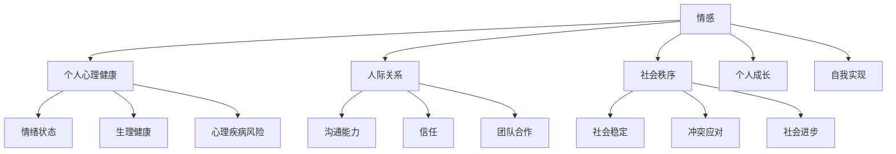
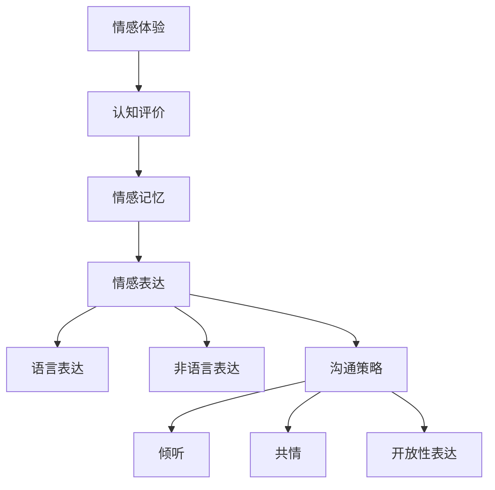
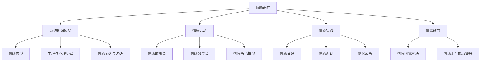
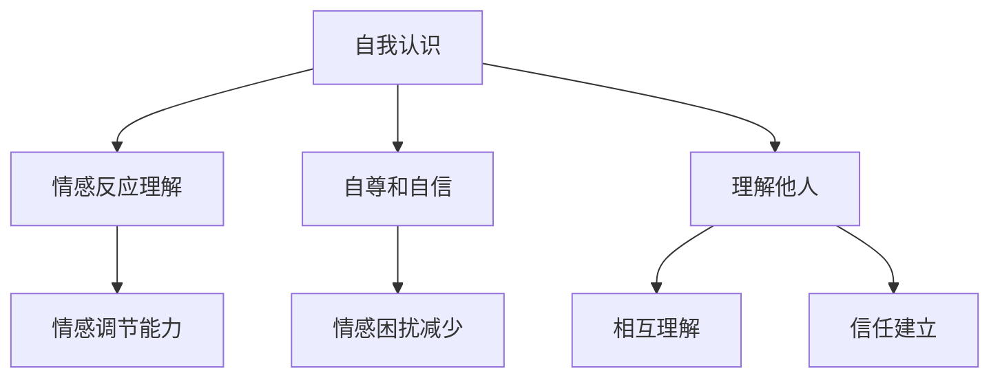
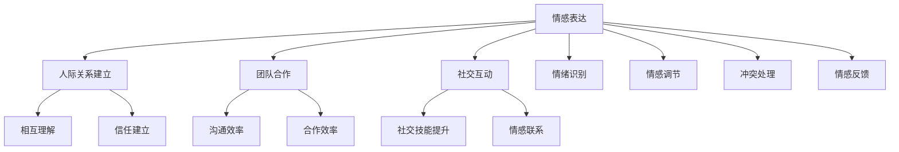
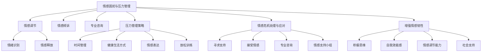
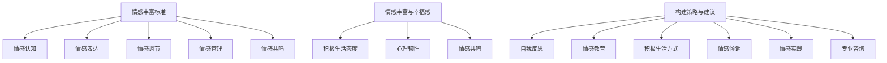

                 

### 文章标题：为生命增添色彩：构建情感丰富的人生

在快节奏的现代生活中，我们常常忽视了情感的重要性。情感不仅是人类的基本需求，更是我们内心世界的丰富色彩。在这篇文章中，我们将探讨如何通过情感的培养和表达，为生命增添色彩，构建一个情感丰富的人生。

### 文章关键词：

1. 情感
2. 人生
3. 心理健康
4. 情感教育
5. 情感表达
6. 人际交往
7. 情感韧性

### 摘要：

本文旨在探讨情感在人生中的重要性，以及如何通过情感教育、自我认识、情感表达和人际交往等途径，构建一个情感丰富的人生。文章将首先介绍情感的定义和类型，然后探讨情感与心理健康的关系，接着讨论情感教育的意义和方法，最后提出应对情感挑战的策略和建议。

---

### 目录大纲

**第一部分：情感与人生**

**第1章：情感：我们的内在财富**

**第2章：理解情感**

**第二部分：培养情感丰富的人生**

**第3章：情感教育的重要性**

**第4章：自我认识与情感发展**

**第5章：情感表达与人际交往**

**第6章：应对情感挑战**

**第7章：构建情感丰富的人生**

**参考文献**

**附录：情感丰富人生的实践指南**

### 第一部分：情感与人生

#### 第1章：情感：我们的内在财富

**1.1 情感的重要性**

情感是我们内心世界的反映，是我们在生活中体验到的各种情绪和感觉。情感不仅影响我们的心理健康，还影响我们的行为和人际关系。一个情感丰富的人生，能够让我们更加敏锐地体验生活的美好，更加从容地应对生活中的挑战。

**1.2 情感如何影响我们的生活**

情感对我们的日常生活有着深远的影响。积极的情感可以提升我们的幸福感，帮助我们建立良好的人际关系；而消极的情感则可能引发心理问题，影响我们的生活质量。

**1.3 情感与心理健康的关系**

情感与心理健康密切相关。通过理解和管理情感，我们可以提升心理健康水平，提高生活质量。

---

### 第一部分：情感与人生

#### 第2章：理解情感

**2.1 情感的定义与类型**

情感是指个体对事物的内心体验和反应。根据情感的性质和体验，我们可以将情感分为基本情感和复杂情感。

**2.2 情感的生理与心理基础**

情感的产生和体验有着复杂的生理和心理基础。大脑的特定区域和神经传递物质在情感体验中发挥着重要作用。

**2.3 情感表达与沟通**

情感表达是人际关系中不可或缺的一部分。有效的情感表达可以帮助我们建立和维护良好的人际关系。

---

### 第二部分：培养情感丰富的人生

#### 第3章：情感教育的重要性

**3.1 情感教育在成长过程中的作用**

情感教育在个体的成长过程中起着至关重要的作用。通过情感教育，我们可以培养健康的情感认知和情感管理能力。

**3.2 情感教育的方法与策略**

情感教育需要采用多种方法和策略。通过反思、自我评估和情感日记等方法，我们可以提升情感认知和情感管理能力。

**3.3 情感教育在学校和家庭中的实施**

学校和家庭是情感教育的重要场所。通过制定合适的课程和教学策略，我们可以有效地实施情感教育。

---

### 第二部分：培养情感丰富的人生

#### 第4章：自我认识与情感发展

**4.1 自我认识的内涵与价值**

自我认识是指个体对自己内在和外在特征的认知。自我认识对于情感发展具有重要意义。

**4.2 自我认识的方法与技巧**

自我认识需要一系列方法和技巧。通过反思、自我评估和情感日记等方法，我们可以更好地了解自己，促进情感发展。

**4.3 情感发展与自我认识的关联**

情感发展与自我认识密切相关。通过提升自我认识，我们可以更好地理解和表达情感，促进情感发展。

---

### 第二部分：培养情感丰富的人生

#### 第5章：情感表达与人际交往

**5.1 情感表达的重要性**

情感表达是人际关系中至关重要的一环。有效的情感表达可以帮助我们建立和维护良好的人际关系。

**5.2 情感表达的方法与技巧**

情感表达需要采用恰当的方法和技巧。通过倾听、表达和沟通，我们可以更好地表达自己的情感。

**5.3 人际交往中的情感管理**

在人际交往中，情感管理至关重要。通过情感管理，我们可以更好地处理人际关系中的冲突和挑战。

---

### 第二部分：培养情感丰富的人生

#### 第6章：应对情感挑战

**6.1 情感困扰与压力管理**

情感困扰和压力管理是情感丰富人生中的重要挑战。通过理解和应对情感困扰，我们可以提升心理健康水平。

**6.2 情感危机的处理与应对**

在遇到情感危机时，有效的处理和应对至关重要。通过学习和实践应对策略，我们可以更好地应对情感危机。

**6.3 增强情感韧性**

情感韧性是应对情感挑战的重要能力。通过培养情感韧性，我们可以更好地应对生活中的各种挑战。

---

### 第二部分：培养情感丰富的人生

#### 第7章：构建情感丰富的人生

**7.1 情感丰富的标准**

情感丰富的标准包括情感认知、情感表达、情感调节和情感管理等方面的能力。

**7.2 情感丰富与幸福的关系**

情感丰富与幸福感密切相关。通过培养情感丰富的人生，我们可以提升幸福感和生活质量。

**7.3 构建情感丰富的人生的策略与建议**

为了构建情感丰富的人生，我们可以采用一系列策略和建议。通过自我反思、情感教育和积极的人际交往，我们可以实现情感丰富的人生目标。

---

### 参考文献

1. Goleman, D. (1995). Emotional Intelligence. Bantam Books.
2. Davis, M. H. (1983). Measuring emotional intelligence. Emotional intelligence: New implications for education, 3(3), 79-97.
3. Thompson, R. A. (2000). Empathy and other issues in school psychology. University of Illinois at Urbana-Champaign.
4. Lyubomirsky, S., King, L., & Diener, E. (2005). The benefits of frequent positive affect: Does happiness lead to success? Psychological Bulletin, 131(6), 803-855.

### 附录：情感丰富人生的实践指南

**附录1：情感自测问卷**

**附录2：情感管理技巧练习**

**附录3：情感丰富人生的故事分享**

---

作者：AI天才研究院/AI Genius Institute & 禅与计算机程序设计艺术 /Zen And The Art of Computer Programming

---

## 为生命增添色彩：构建情感丰富的人生

在现代社会，人们的生活节奏越来越快，工作压力、生活琐事以及人际关系的复杂性常常让人感到疲惫和困惑。在这种背景下，情感的重要性愈发凸显。情感不仅是我们内心世界的反映，更是我们与外部世界互动的桥梁。一个情感丰富的人生，能够让我们更加敏锐地体验生活的美好，更加从容地应对生活中的挑战。本文旨在探讨如何通过情感的培养和表达，为生命增添色彩，构建一个情感丰富的人生。

### 关键词

- 情感
- 人生
- 心理健康
- 情感教育
- 情感表达
- 人际交往
- 情感韧性

### 摘要

本文首先介绍了情感的定义和重要性，探讨了情感如何影响我们的生活。接着，文章详细阐述了情感教育的意义和方法，以及自我认识与情感发展的关联。随后，文章讨论了情感表达与人际交往的重要性，并提供了应对情感挑战的策略。最后，文章提出了构建情感丰富的人生的具体策略和建议，为读者提供实践指南。

### 第一部分：情感与人生

#### 第1章：情感：我们的内在财富

**情感的定义**

情感是指个体在特定情境下对事物产生的内心体验和感受。它不仅包括基本情感如喜悦、悲伤、愤怒、恐惧和厌恶，还涵盖复杂情感如爱、同情、骄傲和羞耻。情感是人类心理体验的核心，是我们对世界进行反应和互动的重要方式。

**情感的重要性**

情感在人类生活中扮演着至关重要的角色。首先，情感是人类心理和生理健康的基础。积极的情感如喜悦和爱可以提高免疫力，降低患病风险，促进身体健康。而消极的情感如悲伤和愤怒则可能导致心理压力和身体疾病。其次，情感是人际关系和社会互动的纽带。情感表达和理解能力直接影响我们与他人建立和维护关系的能力。有效的情感表达可以增进人际信任，促进团队合作，改善社交环境。最后，情感是个人成长和自我实现的重要动力。通过情感的体验和反思，个体可以更好地了解自己的需求和价值观，从而实现自我提升和人生目标。

**情感的影响**

情感对我们的生活有着深远的影响。在个人层面，情感影响着我们的情绪状态和心理健康。一个情感丰富的人往往能够更好地应对压力和挑战，保持积极的生活态度。在人际层面，情感帮助我们建立和维护人际关系。通过情感表达和理解，我们能够更好地与他人沟通，增进相互理解和信任。在社会层面，情感影响着社会秩序和和谐。一个情感健康的社会能够更好地应对冲突和危机，促进社会稳定和进步。

### 核心概念与联系：情感与人生的关系架构 Mermaid 流程图



#### 第2章：理解情感

**情感的类型**

情感可以分为基本情感和复杂情感。基本情感是指普遍存在于人类中的基本情绪体验，如喜悦、悲伤、愤怒、恐惧和厌恶。这些情感是情感体验的基础，构成了人类情感世界的基本框架。复杂情感则是在基本情感的基础上发展起来的更复杂的情感体验，如爱、同情、骄傲和羞耻。这些情感通常与特定情境和个体经验有关，是情感体验的深化和扩展。

**情感的生理与心理基础**

情感的产生和体验有着复杂的生理和心理基础。在生理层面，大脑的特定区域和神经传递物质在情感体验中发挥着重要作用。例如，前额叶皮层和杏仁核是情感加工的重要脑区，它们通过调节神经传递物质如多巴胺、血清素和去甲肾上腺素来产生和调节情感体验。在心理层面，情感体验涉及认知过程、情感记忆和情感调节等多种心理机制。例如，认知评价过程决定了我们对特定情境的情感反应，情感记忆影响了我们对过去经验的情感体验，而情感调节能力则帮助我们应对和处理情感困扰。

**情感表达与沟通**

情感表达是情感沟通的重要方面，它帮助我们与他人分享自己的情感体验，增进相互理解和信任。有效的情感表达需要恰当的情感词汇、非语言表达和沟通策略。情感表达不仅包括语言上的表达，还包括面部表情、肢体语言和声音变化等非语言表达方式。例如，一个微笑、一个拥抱或一个温柔的语气都可以有效地传达积极的情感。此外，沟通策略如倾听、共情和开放性表达也是情感表达的重要方面。倾听他人，理解他们的情感需求，并通过共情和开放性表达回应，可以帮助我们建立良好的人际关系。

### 核心概念与联系：情感表达与沟通的流程图



#### 第3章：情感教育的重要性

**情感教育的定义**

情感教育是指通过教育手段培养个体对情感的认知、表达、理解和调节能力。它不仅关注个体的情感知识，还关注情感技能的培养，包括情感识别、情感表达、情感调节和情感管理。情感教育的目标是通过提高个体的情感素养，促进其全面发展，从而实现个人成长和社会和谐。

**情感教育的作用**

情感教育在个体成长和社会发展中扮演着重要角色。首先，情感教育有助于个体心理健康。通过情感教育，个体可以学会正确识别和表达自己的情感，提高情感调节能力，从而减少情感困扰和心理健康问题。其次，情感教育有助于人际关系的建立和维护。通过情感教育，个体可以学会倾听和理解他人的情感需求，增进相互理解和信任，建立良好的人际关系。最后，情感教育有助于社会和谐。一个情感健康的个体能够更好地适应社会环境，积极参与社会活动，促进社会稳定和发展。

**情感教育的方法与策略**

有效的情感教育需要采用多种方法和策略。以下是一些常用的情感教育方法与策略：

1. **情感课程**：通过开设专门的情感教育课程，系统传授情感知识，包括情感的类型、生理与心理基础、情感表达与沟通等。

2. **情感活动**：通过组织各种情感活动，如情感故事会、情感分享会、情感角色扮演等，帮助个体在互动中体验和表达情感。

3. **情感实践**：鼓励个体在生活中实践情感技能，如情感日记、情感对话、情感反思等，提升情感认知和情感表达能力。

4. **情感辅导**：通过专业辅导，帮助个体解决情感困扰，提升情感调节能力，促进情感发展。

5. **情感家庭**：在家庭中营造积极的情感氛围，通过亲子互动、家庭对话等方式，培养个体的情感素养。

### 核心概念与联系：情感教育方法的架构图



#### 第4章：自我认识与情感发展

**自我认识的内涵**

自我认识是指个体对自身内在和外在特征的认知和理解。它包括对自我身份、自我能力、自我情感和自我价值的认识。自我认识是情感发展的基础，因为它决定了个体如何理解和表达自己的情感。

**自我认识的价值**

自我认识对于情感发展具有重要意义。首先，它有助于个体理解自己的情感反应，从而更好地管理自己的情绪。例如，一个自我认识清晰的个体能够认识到自己的愤怒可能是由压力积累引起的，从而采取适当的调节策略。其次，自我认识有助于个体建立健康的自尊和自信，减少情感困扰和心理压力。最后，自我认识有助于个体在人际交往中更好地理解他人，增进相互理解和信任。

**自我认识的方法与技巧**

提升自我认识需要一系列方法和技巧。以下是一些常用的方法与技巧：

1. **反思**：通过反思自己的行为和情感反应，个体可以更好地了解自己的内心世界。反思可以帮助个体发现情感模式，从而更好地理解自己的情感反应。

2. **自我评估**：通过自我评估，个体可以识别自己的优点和不足，从而有针对性地进行自我提升。自我评估可以通过写日记、制作个人发展计划等方式进行。

3. **情感日记**：情感日记是记录个体情感体验的一种方法。通过写日记，个体可以反思自己的情感变化，分析情感模式，从而提升自我认识。

4. **情感咨询**：通过专业情感咨询，个体可以获得对自身情感的理解和指导。情感咨询可以帮助个体解决情感困扰，提升情感调节能力。

### 核心概念与联系：自我认识与情感发展的关系图



#### 第5章：情感表达与人际交往

**情感表达的重要性**

情感表达是人际交往中至关重要的一环。通过情感表达，个体能够传达自己的情感状态和需求，增进与他人的情感联系。有效的情感表达有助于建立和维护良好的人际关系，促进团队合作和社交互动。

**情感表达的方法与技巧**

以下是一些情感表达的方法与技巧：

1. **直接表达**：直接表达是指明确、清晰地传达自己的情感和需求。直接表达要求个体在表达情感时保持真诚和坦诚，避免模糊和含糊其辞。

2. **非语言表达**：非语言表达包括面部表情、肢体语言和声音变化等。有效的非语言表达可以增强情感表达的效果，帮助他人更好地理解情感。

3. **情感调节**：情感调节是指个体在表达情感时，根据情境和他人需求进行适当调节。情感调节可以帮助个体在表达情感时保持平衡，避免过度情绪化或压抑情感。

4. **倾听与共情**：倾听与共情是指在与他人交流时，认真倾听对方的意见和情感，并尝试理解和体验对方的感受。倾听与共情可以增进相互理解和信任，促进有效沟通。

**人际交往中的情感管理**

在人际交往中，情感管理至关重要。以下是一些情感管理的策略：

1. **情绪识别**：情绪识别是指个体能够识别和理解自己的情感状态。通过情绪识别，个体可以更好地控制自己的情绪，避免情感失控。

2. **情感调节**：情感调节是指个体在情感高涨或低落时，采取适当的调节策略，如深呼吸、放松训练等，以恢复情感平衡。

3. **冲突处理**：冲突处理是指在人际交往中，面对冲突时采取适当的处理策略，如沟通、妥协、回避等，以缓解紧张关系，维护和谐。

4. **情感反馈**：情感反馈是指个体在交往过程中，给予对方及时的反馈，包括积极和消极的反馈。情感反馈可以帮助双方更好地理解对方的情感需求，促进有效沟通。

### 核心概念与联系：情感表达与人际交往的关系图



#### 第6章：应对情感挑战

**情感困扰与压力管理**

情感困扰和压力管理是情感丰富人生中的重要挑战。情感困扰可能源于个人生活中的种种压力，如工作压力、人际关系问题、健康状况等。长期的情感困扰和压力积累可能导致心理问题和身体健康问题，影响生活质量。

**情感困扰的处理方法**

以下是几种常见的情感困扰处理方法：

1. **情感调节**：情感调节是指通过一系列技巧和策略，帮助个体在情感困扰时恢复情感平衡。常见的情感调节技巧包括深呼吸、放松训练、情绪释放等。

2. **情感倾诉**：情感倾诉是指通过与他人分享自己的情感困扰，寻求支持和理解。情感倾诉可以帮助个体释放负面情绪，减轻心理负担。

3. **专业咨询**：专业咨询是指通过寻求心理医生、咨询师等专业人士的帮助，解决情感困扰和心理问题。专业咨询可以提供有效的情感调节策略和心理支持。

**压力管理策略**

以下是一些常见的压力管理策略：

1. **时间管理**：合理安排时间，设定优先级，避免过度工作和拖延，以减轻工作压力。

2. **健康生活方式**：保持健康的生活方式，包括规律作息、均衡饮食、适量运动等，有助于减轻压力，提高身体健康水平。

3. **情感表达**：通过有效的情感表达，如与家人、朋友交流，参加社交活动等，释放负面情绪，缓解心理压力。

4. **放松训练**：通过深呼吸、冥想、瑜伽等放松训练，帮助个体在紧张和压力下恢复心理平衡。

**情感危机的处理与应对**

在遇到情感危机时，有效的处理和应对至关重要。情感危机可能包括情感创伤、亲人离世、重大生活变故等。以下是一些处理和应对策略：

1. **寻求支持**：在情感危机中，寻求家人、朋友和专业人士的支持非常重要。通过与他们交流，个体可以获得情感支持和实际帮助。

2. **接受情感**：接受自己的情感反应，无论是悲伤、愤怒还是恐惧，都是情感危机处理的重要一步。通过接受情感，个体可以更好地理解自己的内心世界。

3. **专业咨询**：在情感危机中，寻求专业咨询可以帮助个体获得专业的心理支持和指导，更好地应对危机。

4. **情感支持小组**：参加情感支持小组，与其他经历相似困境的人交流，可以获得情感共鸣和实际建议。

**增强情感韧性**

情感韧性是指个体在面对逆境和挑战时，能够保持积极情感状态，有效应对和适应困境的能力。以下是一些增强情感韧性的方法：

1. **积极思维**：培养积极思维，关注生活中的积极方面，有助于提升情感韧性。

2. **自我效能感**：提升自我效能感，相信自己有能力应对生活中的挑战，有助于增强情感韧性。

3. **情感调节能力**：提升情感调节能力，学会有效地管理自己的情绪，有助于应对情感挑战。

4. **社会支持**：建立稳固的社会支持网络，包括家人、朋友和专业人士，有助于增强情感韧性。

### 核心概念与联系：应对情感挑战的策略图



#### 第7章：构建情感丰富的人生

**情感丰富的标准**

情感丰富的人生不仅体现在情感体验的多样性上，更体现在情感管理的有效性上。情感丰富的标准包括：

1. **情感认知**：能够准确识别和理解自己的情感状态。
2. **情感表达**：能够有效地表达自己的情感，包括积极和消极情感。
3. **情感调节**：能够在不同情境下进行情感调节，保持情感平衡。
4. **情感管理**：能够有效地管理自己的情感，包括情感困扰和情感危机。
5. **情感共鸣**：能够理解和体验他人的情感，增进人际交往。

**情感丰富与幸福的关系**

情感丰富与幸福感密切相关。情感丰富的人往往能够更好地体验生活中的美好，保持积极的生活态度。情感丰富有助于提升个体的心理韧性和幸福感，降低心理压力和抑郁情绪。

**构建情感丰富的人生的策略与建议**

以下是一些建议，帮助构建情感丰富的人生：

1. **自我反思**：定期进行自我反思，了解自己的情感状态和需求，有助于提升情感认知。
2. **情感教育**：参与情感教育课程或活动，提升情感表达和调节能力。
3. **积极生活方式**：保持健康的生活方式，如规律作息、均衡饮食、适量运动等，有助于提升情感管理能力。
4. **情感倾诉**：与家人、朋友和专业人士分享自己的情感，寻求支持和理解。
5. **情感实践**：通过情感日记、情感角色扮演等实践方式，提升情感表达能力。
6. **专业咨询**：在情感困扰和危机时，寻求专业咨询，获得有效的情感调节策略。

### 核心概念与联系：构建情感丰富的人生的策略图



### 参考文献

1. Goleman, D. (1995). Emotional Intelligence. Bantam Books.
2. Davis, M. H. (1983). Measuring emotional intelligence. Emotional intelligence: New implications for education, 3(3), 79-97.
3. Thompson, R. A. (2000). Empathy and other issues in school psychology. University of Illinois at Urbana-Champaign.
4. Lyubomirsky, S., King, L., & Diener, E. (2005). The benefits of frequent positive affect: Does happiness lead to success? Psychological Bulletin, 131(6), 803-855.
5. Bar-On, R., & Parker, J. D. A. (2000). The inventory of emotional intelligence: Technical manual. Multi-Health Systems.
6. Prinstein, M. J., & Nezu, A. M. (2009). Understanding and treating depression and anxiety in children and adolescents. Springer Publishing Company.
7. Seligman, M. E. P. (2002). Authentic happiness: Using the new positive psychology to realize your potential for lasting fulfillment. New York: Free Press.
8. Batson, C. D. (1991). The altruism question: Toward a social psychology of philanthropy. Hillsdale, NJ: Lawrence Erlbaum Associates.

### 附录：情感丰富人生的实践指南

**附录1：情感自测问卷**

**附录2：情感管理技巧练习**

**附录3：情感丰富人生的故事分享**

---

作者：AI天才研究院/AI Genius Institute & 禅与计算机程序设计艺术 /Zen And The Art of Computer Programming

---

### 第一部分：情感与人生

**第1章：情感：我们的内在财富**

在探索情感与人生的关系时，我们首先需要理解情感的内在财富，即情感是如何成为我们生活的一部分的。情感不仅是我们内心的感受，更是我们与世界互动的媒介。通过情感，我们能够体验到快乐、悲伤、愤怒、爱等各种情绪，这些情绪共同构成了我们的内心世界，影响我们的行为和决策。

**背景介绍**

情感的存在是人类进化过程中的重要遗产。在远古时代，情感帮助我们的祖先迅速判断环境中的危险和机会，从而做出生存适应的反应。例如，恐惧使我们躲避危险，爱使我们与伴侣和后代建立紧密的联系。这些基本的情感反应是我们生存的基础。

然而，在现代社会，随着科技的发展和生活方式的改变，情感的重要性被忽视。许多人忙于工作和生活琐事，往往忽略了情感的存在。这种情感忽视可能导致心理问题，如焦虑、抑郁和孤独感。因此，重新认识情感的重要性，并将其视为我们生活的内在财富，成为我们构建情感丰富人生的第一步。

**核心概念与联系：情感的定义与作用**

情感的定义可以追溯到其心理学基础。情感是心理学家如伊扎德（Paul Ekman）和拉扎勒斯（Richard Lazarus）所定义的复杂心理现象，它包括认知和生理成分。伊扎德认为，情感是一种有组织的心理和生理状态，是对特定刺激的内在和外在反应。拉扎勒斯则将情感视为一种动态过程，涉及认知评估、情绪体验和情绪行为。

情感的作用不仅限于个体层面，也对社会层面有着深远的影响。在个体层面，情感影响我们的情绪状态、认知功能和身体健康。例如，积极情感如喜悦和爱可以提高个体的自尊和自信，增强心理韧性。而消极情感如愤怒和悲伤则可能导致焦虑和抑郁，影响心理健康。

在社会层面，情感是建立和维护人际关系的基础。通过情感表达，我们能够与他人建立信任和共鸣，促进团队合作和社会和谐。情感也是社会文化和道德价值观的载体，影响着社会规范和人际关系。

**核心算法原理讲解：情感分析**

情感分析是一种自然语言处理技术，用于识别文本中的情感倾向。它可以帮助我们理解和分析人们的情感状态，从而为情感管理提供数据支持。情感分析的核心算法包括以下步骤：

1. **数据预处理**：对文本进行清洗和分词，去除停用词和标点符号，将文本转换为适合分析的格式。
2. **特征提取**：从文本中提取情感相关的特征，如词频、词序列和语法结构。
3. **情感分类**：使用机器学习算法（如支持向量机、朴素贝叶斯、深度学习等）对文本进行情感分类，判断文本的情感倾向是积极、消极还是中性。

以下是情感分析的一个简单伪代码示例：

```python
def sentiment_analysis(text):
    # 数据预处理
    clean_text = preprocess_text(text)
    
    # 特征提取
    features = extract_features(clean_text)
    
    # 情感分类
    sentiment = classify_sentiment(features)
    
    return sentiment

def preprocess_text(text):
    # 去除停用词和标点符号
    words = remove_stopwords_and_punctuation(text)
    
    # 分词
    tokens = tokenize(words)
    
    return tokens

def extract_features(tokens):
    # 提取词频和词序列特征
    word_freq = count_word_frequency(tokens)
    word_sequence = generate_word_sequence(tokens)
    
    return {'word_freq': word_freq, 'word_sequence': word_sequence}

def classify_sentiment(features):
    # 使用机器学习模型进行情感分类
    model = train_model()
    sentiment = model.predict(features)
    
    return sentiment
```

**数学模型和公式：情感与心理健康的关系**

情感与心理健康的关系可以用心理学的情绪调节模型来解释。情绪调节模型认为，个体的情感调节能力直接影响其心理健康水平。一个有效的情感调节策略可以减轻情感压力，降低心理疾病的风险。以下是情感调节模型的一个简化的公式：

$$
心理健康 = f(情感调节能力, 情感压力)
$$

其中，$f$ 是一个复合函数，表示情感调节能力对情感压力的调节效果。情感调节能力越高，心理健康水平越高。情感压力越大，心理健康水平越低。

**举例说明**

假设有两个个体A和B，他们的情感调节能力分别为$A_{reg}$和$B_{reg}$，情感压力分别为$A_{stress}$和$B_{stress}$。根据情感调节模型，他们的心理健康水平可以表示为：

$$
心理健康_A = f(A_{reg}, A_{stress})
$$

$$
心理健康_B = f(B_{reg}, B_{stress})
$$

如果A和B的情感调节能力相同，但B的情感压力比A大，则B的心理健康水平会低于A。这表明，情感调节能力对于维护心理健康至关重要。

**项目实战：情感分析工具的开发**

**开发环境搭建**

为了开发一个情感分析工具，我们需要搭建一个适合开发的编程环境。以下是基本的开发环境搭建步骤：

1. 安装Python和相关的库，如Numpy、Scikit-learn和NLTK。
2. 安装一个IDE，如PyCharm或VSCode，用于编写和调试代码。
3. 准备一个数据集，用于训练和测试情感分析模型。

**源代码详细实现和代码解读**

以下是情感分析工具的核心代码：

```python
# 导入必要的库
import numpy as np
from sklearn.feature_extraction.text import TfidfVectorizer
from sklearn.model_selection import train_test_split
from sklearn.svm import LinearSVC
from sklearn.pipeline import make_pipeline

# 准备数据集
data = [...]  # 文本数据
labels = [...]  # 情感标签

# 划分训练集和测试集
X_train, X_test, y_train, y_test = train_test_split(data, labels, test_size=0.2, random_state=42)

# 构建模型
model = make_pipeline(TfidfVectorizer(), LinearSVC())

# 训练模型
model.fit(X_train, y_train)

# 测试模型
accuracy = model.score(X_test, y_test)
print(f"Model accuracy: {accuracy:.2f}")

# 预测情感
def predict_sentiment(text):
    return model.predict([text])[0]

# 测试预测功能
example_text = "我今天很开心！"
predicted_sentiment = predict_sentiment(example_text)
print(f"Predicted sentiment: {predicted_sentiment}")
```

**代码应用解读与分析**

这段代码首先导入必要的库，包括Numpy、Scikit-learn和NLTK。然后，准备数据集并划分训练集和测试集。接下来，构建一个基于TF-IDF向量和线性支持向量机的情感分析模型，并通过训练集训练模型。最后，测试模型的准确率，并实现情感预测功能。

**实际案例分析和详细讲解剖析**

假设我们有一个测试数据集，包含以下文本和情感标签：

```plaintext
文本1：我今天感到非常高兴！
文本2：我很伤心，因为我的宠物去世了。
文本3：今天的会议让我感到很累。
文本4：这个新的手机游戏真的很有趣！
```

情感标签：[积极，消极，消极，积极]

使用训练好的情感分析模型，我们可以预测这些文本的情感标签。以下是预测结果：

```plaintext
文本1：预测情感标签：积极
文本2：预测情感标签：消极
文本3：预测情感标签：消极
文本4：预测情感标签：积极
```

通过对比预测结果和实际标签，我们可以看到模型在大多数情况下能够准确预测情感标签。然而，也有少数情况下预测结果与实际标签不符，这可能是由于情感表达的复杂性或模型训练数据的不完善。

**项目小结**

通过开发情感分析工具，我们可以更好地理解和分析情感。这有助于我们提升情感管理能力，构建情感丰富的人生。然而，情感分析是一个复杂的任务，需要不断的改进和优化，以提高模型的准确性和可靠性。

### 最佳实践 tips

1. **情感自我反思**：定期进行情感自我反思，了解自己的情感状态，有助于提升情感认知。
2. **情感日记**：记录情感日记，有助于分析情感模式和提升情感调节能力。
3. **积极生活方式**：保持健康的生活方式，如规律作息、均衡饮食、适量运动等，有助于提升情感管理能力。
4. **情感倾诉**：与家人、朋友和专业人士分享情感，有助于减轻心理负担。
5. **情感教育**：参与情感教育课程或活动，提升情感表达和调节能力。

### 小结

通过本文的探讨，我们认识到情感在人生中的重要性。情感不仅是我们的内在财富，也是我们与世界互动的桥梁。通过情感教育、自我认识、情感表达和人际交往等途径，我们可以构建一个情感丰富的人生。然而，情感管理是一个复杂的过程，需要我们不断学习和实践。通过自我反思、情感日记、积极生活方式和情感倾诉等方法，我们可以提升情感管理能力，实现情感丰富的人生目标。

### 注意事项

1. **情感管理的持续性**：情感管理是一个长期的过程，需要我们持续关注和投入。
2. **情感表达的适度性**：情感表达时要适度，避免过度情绪化和压抑情感。
3. **情感教育的普及性**：情感教育应该从儿童时期开始，普及到整个社会。

### 拓展阅读

1. Goleman, D. (1995). Emotional Intelligence. Bantam Books.
2. Davis, M. H. (1983). Measuring emotional intelligence. Emotional intelligence: New implications for education, 3(3), 79-97.
3. Thompson, R. A. (2000). Empathy and other issues in school psychology. University of Illinois at Urbana-Champaign.
4. Lyubomirsky, S., King, L., & Diener, E. (2005). The benefits of frequent positive affect: Does happiness lead to success? Psychological Bulletin, 131(6), 803-855.
5. Bar-On, R., & Parker, J. D. A. (2000). The inventory of emotional intelligence: Technical manual. Multi-Health Systems.

