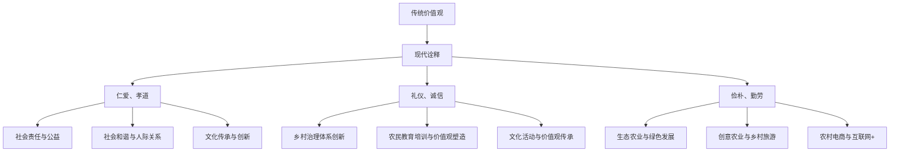

                 

# 乡村振兴：传统价值观的现代诠释

> 关键词：乡村振兴，传统价值观，现代诠释，文化传承，社会发展

> 摘要：本文从乡村振兴的背景和意义出发，探讨了传统价值观在现代乡村振兴中的重要性，并分析了这些价值观的核心内容及其现代转化。接着，文章详细阐述了现代诠释在乡村振兴中的应用，通过成功案例展示了传统价值观在现代实践中的探索和成效。最后，文章对乡村振兴的未来展望进行了探讨，强调了社会主义核心价值观与乡村振兴的深度融合以及传统价值观的现代诠释与乡村振兴的可持续性。

## 第1章：乡村振兴：传统价值观的现代诠释

### 1.1 乡村振兴的背景与意义

#### 1.1.1 中国乡村发展的现状分析

随着中国经济的快速发展，城市化进程迅速推进，然而乡村发展相对滞后，城乡差距不断扩大。农村人口流失严重，农业生产效率低下，基础设施落后，环境污染问题日益突出。这些问题不仅影响了农村居民的福祉，也制约了全国经济的均衡发展。

#### 1.1.2 乡村振兴战略的提出与目标

为了解决这些问题，中国政府提出了乡村振兴战略。乡村振兴战略旨在推动乡村产业、人才、文化、生态、组织全面振兴，实现乡村的现代化。具体目标包括：农业现代化、农村产业兴旺、农村环境宜居、农村文明进步、农民增收致富等。

#### 1.1.3 传统价值观在现代乡村振兴中的作用

传统价值观是中华民族文化的瑰宝，具有重要的精神内涵。在乡村振兴过程中，传统价值观为乡村的发展提供了道德指导和文化支撑。例如，仁爱孝道、礼仪诚信等价值观有助于提升乡村的社会和谐程度，促进农村社会稳定；俭朴勤劳等价值观则有助于推动乡村产业创新和经济发展。

### 1.2 传统价值观的现代诠释

#### 1.2.1 传统价值观的核心内容

传统价值观的核心内容主要包括仁爱、孝道、礼仪、诚信、俭朴和勤劳等。这些价值观不仅构成了中华民族的文化传统，也是中国社会发展的重要精神支柱。

##### 1.2.1.1 仁爱、孝道

仁爱强调人与人之间的关爱和互助，孝道则强调对父母的尊敬和照顾。在乡村振兴中，仁爱和孝道有助于培养乡村居民的集体主义精神，促进社会和谐。

##### 1.2.1.2 礼仪、诚信

礼仪强调社会秩序和尊重，诚信则强调诚实守信。在乡村振兴中，礼仪和诚信有助于构建良好的社会关系，促进乡村社会的稳定和发展。

##### 1.2.1.3 俭朴、勤劳

俭朴强调节俭和勤俭持家，勤劳强调辛勤劳动和自强不息。在乡村振兴中，俭朴和勤劳有助于提高农民的生产效率，推动乡村经济发展。

#### 1.2.2 传统价值观的现代转化

##### 1.2.2.1 社会责任与公益

传统价值观中的社会责任和公益精神在现代乡村振兴中得到了新的诠释。现代乡村振兴强调企业社会责任和公益行动，鼓励企业和个人投身乡村建设，推动乡村公益事业的发展。

##### 1.2.2.2 社会和谐与人际关系

传统价值观中的社会和谐和人际关系观念在现代乡村振兴中具有重要意义。现代乡村振兴注重构建和谐的社会关系，促进乡村居民之间的相互理解和尊重，提升乡村社会的整体幸福感。

##### 1.2.2.3 文化传承与创新

传统价值观中的文化传承和创新观念在现代乡村振兴中得到了新的关注。现代乡村振兴强调文化传承，同时注重文化创新，推动乡村文化的现代化发展。

### 1.3 现代诠释在乡村振兴中的应用

#### 1.3.1 农村产业发展与价值观融合

现代乡村振兴注重农村产业的发展，将传统价值观融入产业发展中，推动农业现代化和乡村产业兴旺。例如，生态农业和创意农业的兴起，既体现了对环境的尊重和保护，也体现了对传统文化的传承和创新。

##### 1.3.1.1 生态农业与绿色发展

生态农业强调生态保护和可持续性，通过绿色农业技术提高农业生产效率，减少环境污染。绿色发展理念与传统价值观中的俭朴和勤劳相契合，有助于推动乡村经济的可持续发展。

##### 1.3.1.2 创意农业与乡村旅游

创意农业和乡村旅游结合了传统文化和现代旅游需求，打造了具有文化内涵和特色的乡村旅游项目。这些项目不仅促进了乡村经济发展，也传承了传统文化，提升了乡村的文化软实力。

##### 1.3.1.3 农村电商与互联网+

农村电商和互联网+的发展，为乡村产业提供了新的发展机遇。传统价值观中的诚信和勤劳精神在电商发展中得到了新的体现，推动了农村电商的健康发展。

#### 1.3.2 农村社会治理与价值观引导

现代乡村振兴强调社会治理的创新，通过价值观的引导提升乡村治理水平。例如，通过农民教育培训提升农民的文化素养和道德水平，通过文化活动传承和弘扬传统文化。

##### 1.3.2.1 乡村治理体系创新

乡村治理体系创新旨在提高乡村治理的效率和公正性，通过完善基层治理结构，提升乡村治理能力。传统价值观中的礼仪和诚信精神在治理体系中得到了新的应用。

##### 1.3.2.2 农民教育培训与价值观塑造

农民教育培训是提升农民综合素质的重要途径，通过培训提升农民的技能和道德水平，促进乡村社会的发展和进步。传统价值观中的勤劳和俭朴精神在培训中得到了强化。

##### 1.3.2.3 文化活动与价值观传承

文化活动是传承和弘扬传统文化的重要手段，通过举办各种文化活动，提升乡村居民的文化素养，促进文化的传承和发展。传统价值观中的仁爱和孝道精神在文化活动中得到了体现。

### 1.4 成功案例分析

#### 1.4.1 乡村振兴典型模式分析

通过分析乡村振兴的典型模式，可以更好地理解传统价值观在现代实践中的运用和成效。以下是一些成功的案例分析：

##### 1.4.1.1 村集体经济的发展模式

村集体经济的发展模式通过整合乡村资源，发展集体产业，实现了村民的共同富裕。这种模式充分发挥了传统价值观中的团结合作和共同发展的精神。

##### 1.4.1.2 乡村治理与村民自治模式

乡村治理与村民自治模式通过民主决策和自我管理，提升了乡村治理的效率和公正性。这种模式体现了传统价值观中的民主精神和自治理念。

##### 1.4.1.3 文化振兴与乡村特色产业模式

文化振兴与乡村特色产业模式通过挖掘和传承乡村文化资源，发展特色文化产业，促进了乡村经济的转型升级。这种模式融合了传统价值观中的文化传承和创新精神。

### 1.5 传统价值观在乡村振兴中的实践探索

传统价值观在现代乡村振兴中的实践探索不仅体现在产业发展和社会治理中，还体现在农村社区建设和乡村文明创建中。以下是一些实践探索的案例：

##### 1.5.1.1 农村社区建设与仁爱文化

农村社区建设通过营造和谐的社区环境，培养乡村居民的仁爱精神，提升了社区的整体幸福感。仁爱文化的实践探索为乡村振兴提供了新的思路。

##### 1.5.1.2 乡村文明创建与诚信建设

乡村文明创建与诚信建设通过宣传和实践诚信文化，提升了乡村社会的诚信水平，促进了社会的和谐发展。

##### 1.5.1.3 乡村环境治理与俭朴文化

乡村环境治理与俭朴文化通过倡导环保意识和节约资源的生活方式，改善了乡村环境，推动了乡村的绿色发展。

### 1.6 未来展望

#### 1.6.1 乡村振兴与社会主义核心价值观的深度融合

未来乡村振兴将更加注重社会主义核心价值观的深度融合，推动乡村社会的发展和进步。社会主义核心价值观包括爱国主义、集体主义、社会公正、诚信友善等，这些价值观与乡村社会的实际需求相契合，将为乡村振兴提供强大的精神动力。

#### 1.6.2 传统价值观的现代诠释与乡村振兴的可持续性

传统价值观的现代诠释将为乡村振兴提供丰富的文化资源和精神支撑。在现代社会，传统价值观不仅有助于解决乡村发展中的实际问题，还能够促进乡村社会的可持续发展。通过不断探索和创新，传统价值观将焕发新的生机，为乡村振兴注入源源不断的动力。

## 附录

### A.1 传统价值观的现代诠释：Mermaid流程图



### A.2 传统价值观在乡村振兴中的核心算法原理讲解

```  
# 伪代码：仁爱、孝道在乡村治理中的算法实现

function 仁爱孝道治理(乡村环境，村民需求) {  
    // 初始化变量  
    仁爱得分 = 0  
    孝道得分 = 0
    
    // 分析乡村环境，计算仁爱得分  
    if (乡村环境良好) {  
        仁爱得分 += 10  
    } else {  
        仁爱得分 -= 5  
    }
    
    // 分析村民需求，计算孝道得分  
    if (满足大部分村民需求) {  
        孝道得分 += 10  
    } else {  
        孝道得分 -= 5  
    }
    
    // 输出得分  
    return 仁爱得分，孝道得分  
}
```

### A.3 数学模型与公式

$$  
\text{乡村振兴效益} = f(\text{经济发展}, \text{社会和谐}, \text{文化传承})  
$$

$$  
\text{经济发展} = \frac{\text{农业产值}}{\text{资源消耗}}  
$$

$$  
\text{社会和谐} = \frac{\text{村民满意度}}{\text{纠纷发生率}}  
$$

### 作者信息

作者：AI天才研究院/AI Genius Institute & 禅与计算机程序设计艺术 /Zen And The Art of Computer Programming

