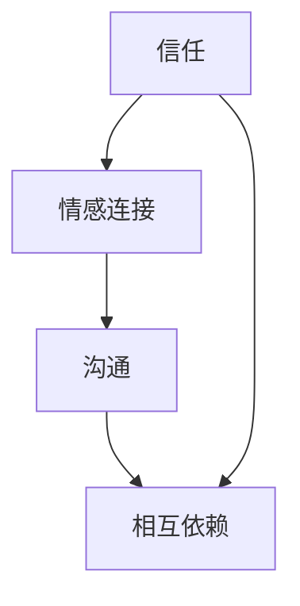

                 

### 文章标题：亲密关系的现代困境

在快节奏的现代生活中，亲密关系面临着前所未有的挑战。技术进步、社会变迁以及文化价值观的多元化使得亲密关系变得复杂，沟通障碍、情感距离、角色混淆和权力不平衡等问题层出不穷。本文将深入探讨现代亲密关系的困境，运用逻辑清晰、结构紧凑、简单易懂的语句，帮助读者理解问题的根源，并提供解决策略。

关键词：亲密关系、现代困境、沟通障碍、情感距离、角色混淆、权力不平衡

摘要：本文首先介绍现代亲密关系的背景和特征，接着分析沟通障碍、情感距离、角色混淆和权力不平衡等核心困境，并从心理学和算法原理的角度提供解决方案。最后，文章总结现代亲密关系面临的挑战与机遇，展望未来的发展方向。

### 第一部分：现代亲密关系的理论基础

#### 1.1 现代亲密关系的定义与特征

亲密关系是一种复杂的人际关系，通常涉及到情感深度、信任、相互依赖以及共同生活的愿望。在现代，亲密关系表现出以下几个特征：

- **多样性**：现代社会多元化的背景下，亲密关系的类型和形式变得多样，如开放式关系、虚拟婚姻等。
- **虚拟性**：随着社交媒体的兴起，人们更多地通过虚拟平台建立和维护亲密关系。
- **复杂性**：现代社会的生活节奏加快，人们面临的工作压力和生活压力增大，导致亲密关系变得更加复杂。

#### 1.2 现代社会变迁对亲密关系的影响

- **技术进步的影响**：智能手机、社交媒体和在线聊天工具改变了人们的沟通方式，但同时也增加了沟通障碍。
- **社会结构变化的影响**：全球化、城市化和社会分层使得人们的社交圈变小，导致情感距离的增加。
- **文化价值观的变化**：现代文化强调个人主义和自我实现，这可能导致亲密关系中的角色混淆和权力不平衡。

#### 1.3 亲密关系中的核心概念与联系

亲密关系中的核心概念包括：

- **信任**：信任是亲密关系的基础，缺乏信任会导致沟通障碍和情感疏远。
- **情感连接**：情感连接是维持亲密关系的重要因素，通过情感分享和共同经历来建立。
- **沟通**：有效的沟通是解决亲密关系中问题的重要手段。

这些概念之间相互联系，共同构成亲密关系的核心架构。以下是一个简单的Mermaid流程图，展示了这些核心概念及其相互关系：


### 第二部分：现代亲密关系的困境分析

#### 2.1 亲密关系中的常见困境

现代亲密关系面临着多种困境，其中最常见的包括：

- **沟通障碍**：现代社交媒体和即时通讯工具虽然提供了便捷的沟通方式，但同时也增加了沟通误解和障碍。
- **情感距离**：由于生活压力和忙碌，亲密关系双方可能感到彼此之间的情感距离增加。
- **角色混淆**：现代社会中，个人角色和职业角色之间的界限变得模糊，可能导致亲密关系中的角色混淆。
- **权力不平衡**：权力不平衡可能导致一方感到压抑或不满，影响亲密关系的稳定性。

#### 2.2 困境的根源与影响

困境的根源可以从心理学和社会学的角度进行分析：

- **心理学根源**：心理防御机制、情感忽视、情感虐待等心理问题可能导致沟通障碍和情感距离。
- **社会学根源**：社会结构变化、文化价值观的转变以及技术进步等社会因素对亲密关系产生了深远影响。

这些困境对亲密关系的影响包括：

- **信任的破裂**：沟通障碍和情感距离可能导致信任的破裂，影响亲密关系的稳定性。
- **情感疏远**：情感距离和角色混淆可能导致双方感到疏远，影响亲密关系的质量。
- **权力冲突**：权力不平衡可能导致一方感到不公平，影响亲密关系的和谐。

#### 2.3 心理学理论解释

心理学理论可以解释亲密关系中的困境：

- **心理防御机制**：人们可能通过心理防御机制来应对亲密关系中的压力和焦虑，如否认、投射、反向形成等。
- **情感忽视与情感虐待**：情感忽视和情感虐待可能导致亲密关系中的情感疏远和权力冲突。
- **权力动态**：权力动态在亲密关系中起着关键作用，权力不平衡可能导致一方感到压抑或不满。

### 第三部分：现代亲密关系的建设与实践

#### 3.1 建立健康亲密关系的步骤

要建立健康的亲密关系，可以采取以下步骤：

- **建立信任**：通过诚实、透明和相互尊重来建立信任，信任是亲密关系的基石。
- **加强沟通**：有效的沟通是解决亲密关系问题的重要手段，需要学会倾听、表达和反馈。
- **培养共同价值观**：共同的价值观可以增强亲密关系的稳定性，帮助双方在面对困难时共同前行。
- **建立稳定的关系模式**：通过共同的生活目标和规划来建立稳定的关系模式。

#### 3.2 实践案例与经验分享

以下是一些成功的实践案例和经验分享：

- **案例1**：一对夫妻通过定期沟通和共同参与兴趣活动来增强亲密关系。
- **案例2**：一对情侣通过建立信任和共同价值观来克服沟通障碍和情感距离。
- **经验分享**：诚实和透明是建立健康亲密关系的关键，面对问题时要勇于沟通和解决。

#### 3.3 建立支持系统的必要性

建立支持系统对于维护亲密关系至关重要：

- **个人支持**：通过自我反思和心理健康咨询来增强个人的心理韧性。
- **社会支持**：通过亲朋好友的支持来缓解压力和焦虑。
- **专业支持**：通过婚姻咨询和心理治疗来解决亲密关系中的深层次问题。

### 第四部分：亲密关系中的自我成长与提升

#### 4.1 自我认知的重要性

自我认知是亲密关系中的关键因素，包括：

- **自我反思**：通过反思自己的行为和情感来了解自己的需求和期望。
- **自我接纳**：接纳自己的优点和不足，建立积极的自我形象。
- **自我提升**：通过学习和成长来提升自己的心理素质和人际关系能力。

#### 4.2 心理健康与亲密关系

心理健康对亲密关系至关重要：

- **情绪管理**：通过情绪管理技巧来处理亲密关系中的压力和冲突。
- **压力应对**：通过有效应对压力来减少亲密关系中的冲突。
- **心理健康与亲密关系的互动**：心理健康和亲密关系之间相互影响，一个健康的亲密关系可以促进心理健康。

#### 4.3 亲密关系中的个人成长

个人成长在亲密关系中起着关键作用：

- **个人成长策略**：通过设定个人目标和培养自我反思习惯来促进个人成长。
- **亲密关系中的个人成长路径**：在亲密关系中，个人成长和亲密关系相互促进，共同成长。

### 第五部分：结论与展望

#### 5.1 现代亲密关系面临的挑战与机遇

现代亲密关系面临诸多挑战，如沟通障碍、情感距离、角色混淆和权力不平衡。然而，这些挑战也带来了机遇，如更灵活的亲密关系形式、更有效的沟通工具等。

#### 5.2 未来的发展方向

未来，亲密关系的发展方向包括：

- **技术的影响**：随着技术的进步，亲密关系的形式和沟通方式将发生变化。
- **社会文化的变革**：社会文化的变革将影响人们对亲密关系的理解和期望。
- **亲密关系的研究趋势**：未来的研究将更多地关注亲密关系的心理、社会和文化因素。

#### 5.3 未来亲密关系的发展趋势

未来亲密关系的发展趋势包括：

- **个性化**：亲密关系将更加个性化，人们将根据个人需求和价值观来选择合适的亲密关系形式。
- **数字化**：数字化工具将更多地应用于亲密关系的维护和沟通。
- **多元化**：亲密关系将变得更加多元化，包括开放式关系、虚拟婚姻等形式。

### 总结

现代亲密关系面临着诸多困境，但通过建立健康的亲密关系、加强自我认知和心理健康，我们可以应对这些挑战。未来，亲密关系将变得更加个性化、数字化和多元化。让我们一起努力，创造更加和谐和稳定的亲密关系。

### 作者信息

作者：AI天才研究院/AI Genius Institute & 禅与计算机程序设计艺术 /Zen And The Art of Computer Programming

这篇文章深入探讨了现代亲密关系的困境，提供了详细的解决方案和展望。通过逻辑清晰、结构紧凑的论述，读者可以更好地理解亲密关系的本质和如何应对现代生活中的挑战。希望这篇文章能够对您有所帮助，让您在维护亲密关系方面取得更大的成功。感谢阅读！

----------------------------------------------------------------

# 引言：现代亲密关系的挑战与机遇

在现代社会的快速发展中，亲密关系面临着前所未有的挑战与机遇。技术进步、社会变迁、文化多元等因素使得亲密关系的形式和内容发生了深刻的变化。这种变化既带来了新的机遇，也引发了新的困境。

首先，技术进步极大地改变了人们的沟通方式。智能手机、社交媒体和在线聊天工具的普及，使得人们可以随时随地与他人交流，这种便利性加强了亲密关系的维系。然而，过度依赖数字工具也导致了沟通障碍，如语言表达的简化和情感表达的不足，使得亲密关系中的误解和矛盾增多。

其次，社会变迁带来了亲密关系的多元化。全球化、城市化以及社会分层使得人们的社交圈变小，亲密关系的形式和内容变得更加复杂。同时，文化价值观的多元化也使得人们在亲密关系中的期望和需求更加多样，这既为亲密关系提供了更多的可能性，也增加了沟通和理解上的难度。

最后，现代亲密关系中的角色和权力动态变得更加复杂。随着个人主义和自我实现的强调，亲密关系中的角色界限变得模糊，权力平衡变得更加重要。然而，现实生活中的角色混淆和权力不平衡仍然是一个普遍存在的问题，影响了亲密关系的稳定性和和谐性。

本文旨在深入探讨现代亲密关系的困境，包括沟通障碍、情感距离、角色混淆和权力不平衡等问题，并从心理学、社会学和算法原理的角度提供解决方案。通过逻辑清晰、结构紧凑的论述，帮助读者理解问题的根源，并找到有效的解决策略。希望这篇文章能够为现代亲密关系的维护和提升提供有益的启示。

## 第一部分：现代亲密关系的理论基础

在现代社会的背景下，亲密关系的定义与特征正在经历着显著的变化。传统的亲密关系通常基于家庭和社会对婚姻和家庭的期望，强调稳定的伴侣关系和共同的生活目标。然而，随着社会的发展，人们对亲密关系的理解和期望也在不断演变，呈现出多样化和个性化的特点。

### 1.1 现代亲密关系的定义

现代亲密关系不再局限于传统的婚姻和伴侣关系，而是包括了更广泛的人际互动形式。根据美国心理学家的定义，亲密关系是指一种深刻的情感联系，其中个体在情感上互相依赖，分享个人的思想和感受。这种关系不仅仅是基于性的吸引，更是一种情感和心理上的融合。现代亲密关系可以是异性恋、同性恋、双性恋，甚至是非恋爱的关系。

### 1.2 现代亲密关系的特征

现代亲密关系具有以下几个显著特征：

- **多样性**：现代社会多元化的背景下，亲密关系的类型和形式变得多样，如开放式关系、朋友式恋爱关系、虚拟婚姻等。这些关系形式打破了传统二元对立的模式，允许个体根据自身需求和价值观选择最适合自己的亲密关系类型。

- **虚拟性**：随着互联网和社交媒体的普及，虚拟亲密关系变得越来越普遍。人们通过在线聊天、社交媒体平台和虚拟现实技术来建立和维持亲密关系，这种虚拟性为人们提供了更多样化的互动方式，但也带来了沟通障碍和情感距离的问题。

- **复杂性**：现代社会的生活节奏加快，人们面临的工作压力和生活压力增大，导致亲密关系变得更加复杂。亲密关系中的角色界定、权力分配、沟通模式等都需要不断地调整和适应。

- **动态性**：现代亲密关系不是静态的，而是随着时间和环境的变化而动态发展的。个体在亲密关系中的需求和期望也会发生变化，因此需要持续的努力和沟通来维持关系的稳定和和谐。

#### 1.3 现代社会变迁对亲密关系的影响

现代社会变迁对亲密关系产生了深远的影响，这些影响主要体现在以下几个方面：

- **技术进步的影响**：智能手机、社交媒体和在线聊天工具的普及改变了人们的沟通方式。虽然这些工具提供了更多的沟通渠道和便捷性，但它们也带来了沟通障碍，如语言表达的简化和情感表达的不足。此外，过度依赖数字工具可能导致亲密关系中的情感疏离和隐私问题。

- **社会结构变化的影响**：全球化、城市化和社会分层使得人们的社交圈变小，亲密关系的形式和内容变得更加复杂。在快节奏的现代生活中，人们可能难以投入足够的时间和精力来维护亲密关系，这可能导致情感距离的增加。

- **文化价值观的变化**：现代文化强调个人主义和自我实现，这可能导致亲密关系中的角色混淆和权力不平衡。个人追求自我实现和独立性的同时，可能会忽视亲密关系中的情感需求和共同成长。

#### 1.4 亲密关系中的核心概念与联系

亲密关系中的核心概念包括信任、情感连接、沟通和相互依赖。这些概念相互联系，构成了亲密关系的核心架构。

- **信任**：信任是亲密关系的基石，它是通过诚实、透明和一致性建立的。信任的缺失会导致沟通障碍和情感疏远，影响亲密关系的稳定性。

- **情感连接**：情感连接是亲密关系中的深层次联系，它通过情感分享和共同经历来建立。情感连接的强弱直接影响亲密关系的质量。

- **沟通**：沟通是维持亲密关系的重要手段。有效的沟通包括倾听、表达和反馈，它有助于解决亲密关系中的问题，增强双方的互信和情感连接。

- **相互依赖**：相互依赖是亲密关系的另一个核心概念，它意味着双方在情感上和生活中互相支持和依靠。相互依赖的平衡对于亲密关系的稳定性和健康至关重要。

### 1.5 核心概念与联系的关系架构

为了更清晰地展示亲密关系中的核心概念及其相互关系，我们可以使用Mermaid流程图来表示。以下是一个简单的Mermaid流程图示例，展示了亲密关系中的核心概念及其相互联系：



在这个流程图中，信任是起点，通过情感连接和沟通连接到相互依赖，形成一个闭环。这个流程图不仅帮助我们理解亲密关系中的核心概念，也展示了这些概念之间的相互作用和依赖关系。

#### 1.6 现代亲密关系的动态发展

现代亲密关系是一个动态的过程，它不仅受到个体需求和期望的影响，也受到外部环境的变化和社会文化的影响。亲密关系的发展可以分为以下几个阶段：

1. **吸引阶段**：在这一阶段，个体对对方产生了强烈的吸引，这种吸引通常是基于外表、性格和共同兴趣等因素。

2. **建立信任阶段**：在吸引的基础上，双方开始建立信任，通过诚实和透明来建立稳定的关系基础。

3. **情感连接阶段**：随着信任的建立，双方开始更深入地分享情感，形成强烈的情感连接。

4. **沟通阶段**：在这一阶段，双方通过有效沟通来解决问题和增强相互理解，沟通成为维持亲密关系的重要手段。

5. **相互依赖阶段**：最终，双方在情感和生活中形成相互依赖，共同面对生活中的挑战和机遇。

6. **稳定发展阶段**：在稳定发展阶段，亲密关系进入一个相对稳定和和谐的状态，双方共同追求共同的生活目标和价值观。

通过理解现代亲密关系的定义、特征、核心概念及其相互联系，我们可以更好地应对现代社会中亲密关系面临的挑战，建立和维护健康的亲密关系。

### 第二部分：现代亲密关系的困境分析

#### 2.1 亲密关系中的常见困境

在现代生活中，亲密关系面临着多种困境，这些困境不仅影响了关系的质量，还可能对个体的心理健康产生负面影响。以下是亲密关系中常见的困境：

**1. 沟通障碍**

沟通是亲密关系的核心，但现代生活中的沟通障碍却屡见不鲜。这些障碍可能源于多种因素，包括：

- **数字鸿沟**：随着社交媒体和即时通讯工具的普及，人们更多地通过数字平台进行沟通。然而，这种沟通方式往往缺乏情感的表达和深层次的交流，导致沟通效果不佳。
  
- **时间压力**：现代社会的生活节奏快，工作压力大，人们可能没有足够的时间与伴侣进行深入交流，这进一步加剧了沟通障碍。

- **心理防御机制**：个体可能由于过去的经历或内心的不安而采取心理防御机制，如逃避、否认或情绪爆发，这些行为阻碍了有效的沟通。

**2. 情感距离**

情感距离是指亲密关系双方在情感上的疏远。现代生活中的忙碌、压力和个人的追求可能导致情感距离的增加：

- **生活压力**：现代社会中，人们面临着来自工作、家庭和社会的多重压力，这些压力可能导致情感上的疏远和疏离。

- **个人追求**：随着个人主义的发展，人们更加注重自我实现和个人成就。在某些情况下，个人追求可能占据主导地位，导致对亲密关系的忽视。

- **情感忽视**：在忙碌和压力之下，人们可能无暇顾及伴侣的情感需求，导致情感忽视，进一步加剧了情感距离。

**3. 角色混淆**

角色混淆是指亲密关系中的角色界定不清晰，这可能导致角色冲突和情感困扰：

- **工作与家庭角色**：随着工作压力的增加，个体可能无法清晰界定工作和家庭角色，导致在家庭中无法给予足够的关注和支持。

- **个人与伴侣角色**：个体在追求自我实现和个人兴趣的同时，可能忽视在亲密关系中的伴侣角色，导致角色混淆和角色冲突。

- **子女教育与照顾**：在家庭中，子女的教育和照顾也容易导致角色混淆，特别是在父母角色与伴侣角色之间。

**4. 权力不平衡**

权力不平衡是指亲密关系中的一方在权力上占据优势，而另一方则处于劣势地位：

- **传统性别角色**：传统性别角色观念可能导致男性在亲密关系中占据主导地位，而女性则处于从属地位。

- **经济实力**：经济实力的差异可能导致权力不平衡，经济条件较好的伴侣可能更具有话语权。

- **个人成就**：个体在事业上的成就也可能导致权力不平衡，高成就者可能在亲密关系中占据优势地位。

#### 2.2 困境的根源与影响

理解亲密关系困境的根源对于解决这些问题至关重要。以下是对每个困境根源的分析以及它们对亲密关系的影响：

**沟通障碍的根源与影响**

- **根源**：沟通障碍的根源可以追溯到个体内心的不安、对沟通的恐惧以及对情感表达的回避。此外，现代社会中数字化的沟通方式也增加了沟通误解的可能性。

- **影响**：沟通障碍可能导致亲密关系中的误解和冲突，信任的破裂，以及情感疏远。长期存在沟通障碍可能导致亲密关系的崩溃。

**情感距离的根源与影响**

- **根源**：情感距离的根源在于生活压力、个人追求和情感忽视。现代社会中，人们更加关注个人成就和自我实现，这可能导致对亲密关系的忽视。

- **影响**：情感距离可能导致亲密关系的疏离和冷漠，情感连接的断裂，以及个体的孤独感。长期存在情感距离可能导致亲密关系的疏远和分离。

**角色混淆的根源与影响**

- **根源**：角色混淆的根源在于角色界定不清晰、角色冲突和角色转换的困难。这可能与个体的性格、家庭背景和社会环境有关。

- **影响**：角色混淆可能导致亲密关系中的角色冲突、情感困扰和自我认同问题。长期存在角色混淆可能导致亲密关系的失衡和崩溃。

**权力不平衡的根源与影响**

- **根源**：权力不平衡的根源在于性别角色观念、经济实力和个人成就的差异。传统观念和社会结构可能加剧了权力不平衡的现象。

- **影响**：权力不平衡可能导致亲密关系中的不平等、压迫感和不满。长期存在权力不平衡可能导致亲密关系的冲突、分离和心理健康问题。

### 2.3 心理学理论解释

心理学理论为理解亲密关系困境提供了深入的视角。以下是几种常见的心理学理论对亲密关系困境的解释：

**1. 心理防御机制**

心理防御机制是人们在面对压力和焦虑时采取的无意识策略。例如，逃避、否认和投射等防御机制可能导致沟通障碍和情感疏远。

**2. 情感忽视与情感虐待**

情感忽视和情感虐待是亲密关系中的心理问题，可能导致情感距离和角色混淆。这些问题可能源于个体内心的不安和对亲密关系的恐惧。

**3. 权力动态**

权力动态是亲密关系中权力分配和互动的过程。权力不平衡可能导致一方感到压抑或不满，影响亲密关系的稳定性和和谐性。

通过理解这些心理学理论，我们可以更深入地认识到亲密关系困境的根源，从而采取更有效的策略来解决这些问题。

#### 2.4 核心算法原理讲解：解决亲密关系困境的策略

在解决亲密关系困境的过程中，核心算法原理提供了有效的策略和框架。以下是一些关键的算法原理和伪代码，用于详细阐述解决亲密关系困境的方法：

**1. 沟通策略**

沟通是解决亲密关系困境的关键。以下是一个简单的沟通策略算法：

```python
def effective_communication(partner1, partner2):
    while not relationship_solved:
        partner1_shareFeelings()
        partner2_listen()
        partner2_shareFeedback()
        partner1_reflect()
```

在这个算法中，双方通过分享情感、倾听对方和反馈来建立有效的沟通。这个过程需要持续进行，直到亲密关系的问题得到解决。

**2. 情感连接**

情感连接是维持亲密关系的重要因素。以下是一个简单的情感连接算法：

```python
def build_emotional_connection(partner1, partner2):
    while not emotional_connection_strong:
        partner1_share_emotional_history()
        partner2_understand()
        partner1_and_2_create_shared_memory()
        partner1_and_2_reaffirm_commitment()
```

在这个算法中，双方通过分享情感历史、理解和共同经历来建立强烈的情感连接。

**3. 边界设置**

边界设置是保护亲密关系和个人空间的重要手段。以下是一个简单的边界设置算法：

```python
def set_boundaries(partner1, partner2):
    while not boundaries_set:
        partner1_determine_needs()
        partner2_respect()
        partner1_and_2_agree_onBoundaries()
        partner1_and_2_enforceBoundaries()
```

在这个算法中，双方通过确定个人需求和尊重对方来设置健康的边界。

**4. 权力平衡**

权力平衡是解决权力不平衡问题的关键。以下是一个简单的权力平衡算法：

```python
def balance_power_dynamic(partner1, partner2):
    while not power_balance:
        partner1_and_2_identify_power_imbalances()
        partner1_and_2_negotiate()
        partner1_and_2_rebalance_power()
        partner1_and_2_reassess()
```

在这个算法中，双方通过识别权力不平衡、谈判和重新分配权力来达到权力平衡。

**5. 情绪管理**

情绪管理是解决亲密关系困境的重要一环。以下是一个简单的情绪管理算法：

```python
def manage_emotions(partner1, partner2):
    while not emotions_handled:
        partner1_acknowledge_emotions()
        partner2_offer_support()
        partner1_and_2_find_solution()
        partner1_and_2_promise_together()
```

在这个算法中，双方通过承认和分享情绪、提供支持和共同寻找解决方案来管理情绪。

通过这些核心算法原理和伪代码，我们可以构建一个系统的方法来解决亲密关系中的沟通障碍、情感距离、角色混淆和权力不平衡问题。这些策略不仅提供了理论框架，还可以在实际应用中指导个体和伴侣如何改善亲密关系。

### 第三部分：现代亲密关系的建设与实践

#### 3.1 建立健康亲密关系的步骤

建立健康的亲密关系是一个动态且持续的过程，需要双方的共同努力。以下是一些关键的步骤，帮助建立和维护健康的亲密关系：

**1. 建立信任**

信任是健康亲密关系的基石。以下是一些建立信任的具体步骤：

- **诚实和透明**：在关系中保持诚实和透明，不隐瞒事实，这有助于建立双方的信任。
- **一致性和可靠性**：保持一致的行为和决策，这有助于增强对方的信任感。
- **共享个人经历和情感**：通过分享个人经历和情感，让对方了解真实的自己，这有助于建立深刻的信任。

**2. 加强沟通**

有效的沟通是维持亲密关系的重要因素。以下是一些加强沟通的具体步骤：

- **倾听**：认真倾听对方的意见和感受，不打断对方，这有助于建立互信和理解。
- **表达**：清晰、准确地表达自己的想法和感受，避免使用模糊或含糊的语言。
- **反馈**：提供积极的反馈，肯定对方的观点和感受，这有助于加强沟通的效果。
- **定期沟通**：设定固定的沟通时间，确保双方有足够的时间交流，这有助于预防沟通障碍。

**3. 培养共同价值观**

共同价值观是健康亲密关系的稳定器。以下是一些培养共同价值观的具体步骤：

- **讨论和协商**：定期讨论和协商双方的价值观和目标，确保双方在关键问题上达成共识。
- **共同经历**：通过共同的经历和活动，加深对彼此价值观的理解和认同。
- **尊重差异**：尊重对方在价值观上的差异，找到共同点，这有助于增强关系的稳定性。

**4. 建立稳定的关系模式**

建立稳定的关系模式有助于双方在面对挑战时保持和谐。以下是一些建立稳定关系模式的具体步骤：

- **设定共同目标**：设定短期和长期的目标，确保双方在追求目标时保持一致。
- **规划共同生活**：通过规划共同的生活安排，确保双方在日常生活中有足够的互动和支持。
- **应对冲突**：学习如何有效地应对冲突，避免将小问题积累成大问题，这有助于维护关系的稳定。

#### 3.2 实践案例与经验分享

以下是一些成功的实践案例和经验分享，这些案例可以帮助我们更好地理解如何建立健康的亲密关系：

**案例1：通过诚实和透明建立信任**

一对夫妻在经历了几次小争吵后，决定通过诚实和透明来解决问题。他们开始定期举行“诚实对话”，在对话中，双方都坦诚地表达自己的想法和感受，不隐瞒事实。通过这种方式，他们不仅解决了现有问题，还增强了彼此的信任，使关系更加稳固。

**案例2：通过共同价值观增强关系**

一对情侣在开始关系时就重视共同价值观的建立。他们定期讨论和协商双方的价值观和目标，并共同参与各种活动，以加深对彼此价值观的理解和认同。这种做法不仅增强了他们的情感连接，还使他们在面对生活中的挑战时能够更好地相互支持。

**案例3：通过有效沟通解决冲突**

一对夫妻发现他们经常因为一些小事而争吵。为了改善这种情况，他们开始学习有效沟通的技巧，如倾听、表达和反馈。他们设定了固定的沟通时间，每次沟通都尽量保持冷静和理性。通过这种方式，他们不仅解决了冲突，还加深了对彼此的理解，使关系更加和谐。

**经验分享**：

- **保持开放心态**：建立健康亲密关系需要双方都保持开放心态，愿意接受和尊重对方的差异。
- **持续努力**：健康亲密关系的建立和维护需要双方的持续努力，不能一蹴而就。
- **寻求专业帮助**：当遇到困难时，不要害怕寻求专业帮助，如婚姻咨询和心理治疗，这有助于双方更好地理解问题和找到解决方案。

#### 3.3 建立支持系统的必要性

建立支持系统对于维护亲密关系至关重要。以下是一些建立支持系统的建议：

- **个人支持**：通过自我反思和心理健康咨询来增强个人的心理韧性，这有助于更好地应对生活中的挑战。
- **社会支持**：通过亲朋好友的支持来缓解压力和焦虑，这有助于增强个体的情感支持系统。
- **专业支持**：通过婚姻咨询和心理治疗来解决亲密关系中的深层次问题，这有助于双方更好地理解和应对关系中的挑战。

建立支持系统不仅可以增强个人的心理韧性，还可以为亲密关系提供额外的支持和资源，帮助双方共同应对生活中的挑战。

### 第四部分：亲密关系中的自我成长与提升

#### 4.1 自我认知的重要性

自我认知是亲密关系中不可或缺的一部分，它有助于个体更好地理解自己的需求和期望，并有效地应对亲密关系中的挑战。以下是自我认知的重要性及如何提升自我认知的具体方法：

**1. 自我认知的重要性**

- **理解个人需求**：通过自我认知，个体可以清晰地了解自己在情感、心理和物质上的需求，这有助于更好地满足这些需求，从而增强亲密关系的稳定性。
- **促进情感健康**：自我认知有助于个体识别和应对内心的负面情绪，如焦虑、愤怒和沮丧，从而促进情感健康。
- **增强沟通能力**：自我认知有助于个体更好地表达自己的感受和需求，同时也能更好地倾听和理解伴侣，这有助于改善亲密关系中的沟通。

**2. 提升自我认知的方法**

- **自我反思**：定期进行自我反思，思考自己的行为、情绪和想法，这有助于深入理解自己的内心世界。
- **心理咨询**：通过专业的心理咨询，个体可以获得更深入的自我认知，学会如何更好地应对亲密关系中的挑战。
- **阅读和学习**：通过阅读相关的心理学书籍和文章，个体可以了解自我认知的重要性，并学习如何提升自我认知。

**3. 自我提升**

- **设定个人目标**：设定短期和长期的个人目标，这有助于个体在自我成长的道路上保持方向和动力。
- **培养兴趣爱好**：通过培养兴趣爱好，个体不仅可以丰富自己的生活，还可以在兴趣爱好中找到自我实现的满足感。
- **持续学习**：不断学习和提升自己的知识和技能，这有助于个体在职业和个人生活中取得更好的成就，从而增强自信心和满足感。

#### 4.2 心理健康与亲密关系

心理健康是维持健康亲密关系的重要因素，以下是如何通过心理健康促进亲密关系的具体方法：

**1. 情绪管理**

- **认知行为疗法**：通过认知行为疗法，个体可以学会如何识别和改变消极思维模式，从而更好地管理情绪。
- **情绪调节技巧**：学习并练习情绪调节技巧，如深呼吸、冥想和正念练习，这有助于个体在紧张或冲突的情况下保持冷静和理智。

**2. 应对压力**

- **压力缓解策略**：学会有效的压力缓解策略，如定期锻炼、保持健康的生活习惯和进行放松活动，这有助于减轻压力，从而改善心理健康。
- **时间管理**：通过合理的时间管理，个体可以更好地平衡工作、生活和亲密关系，减少压力和焦虑。

**3. 心理支持**

- **建立支持系统**：通过建立支持系统，如亲朋好友和专业心理咨询师，个体可以在遇到困难时获得情感支持和专业指导。
- **互助小组**：参与互助小组，与经历相似的人分享经验和感受，这有助于个体获得支持和建议，同时也能为他人提供帮助。

#### 4.3 亲密关系中的个人成长

个人成长在亲密关系中起着关键作用，以下是如何在亲密关系中实现个人成长的具体方法：

**1. 共同成长**

- **设定共同目标**：与伴侣共同设定短期和长期的目标，这有助于双方在追求目标的过程中相互支持，共同成长。
- **相互激励**：鼓励伴侣追求个人目标和梦想，同时自己也努力实现，这有助于建立相互信任和支持的关系。

**2. 自我反思**

- **定期进行自我反思**：定期反思自己的行为和决策，这有助于识别和改正错误，同时也能更好地理解自己在亲密关系中的角色和需求。

**3. 持续学习**

- **参加培训课程**：参加与亲密关系和个人成长相关的培训课程，这有助于个体获得新的知识和技能，从而更好地应对亲密关系中的挑战。

通过自我认知、心理健康和个人成长，个体可以在亲密关系中实现自我提升，从而建立更健康、更稳定的亲密关系。

### 第五部分：结论与展望

#### 5.1 现代亲密关系面临的挑战与机遇

现代亲密关系面临着诸多挑战，如沟通障碍、情感距离、角色混淆和权力不平衡。然而，这些挑战也带来了机遇。随着社会的发展和技术的进步，人们有更多的工具和方法来应对这些挑战，建立更加健康和稳定的亲密关系。

**挑战**：

- **沟通障碍**：现代社交媒体和即时通讯工具虽然提供了便捷的沟通方式，但也增加了沟通误解和障碍。
- **情感距离**：生活压力和个人追求可能导致亲密关系中的情感距离增加。
- **角色混淆**：在个人主义和自我实现的背景下，亲密关系中的角色界定变得模糊。
- **权力不平衡**：传统性别角色观念和经济实力差异可能导致亲密关系中的权力不平衡。

**机遇**：

- **多样性**：现代社会多元化的背景下，亲密关系的类型和形式变得更加多样，为个体提供了更多选择。
- **数字化工具**：数字化工具为人们提供了更多沟通和互动的机会，有助于改善亲密关系的质量。
- **心理健康意识**：现代社会对心理健康意识的提升，为人们提供了更多的资源和支持，有助于应对亲密关系中的挑战。

#### 5.2 未来的发展方向

未来的亲密关系将朝着更加个性化和多元化的方向发展。以下是未来亲密关系的发展方向：

- **个性化和定制化**：个体将根据自己的需求和价值观来选择最适合自己的亲密关系形式，如开放式关系、朋友式恋爱关系等。
- **数字化互动**：随着技术的进步，数字化工具将在亲密关系中发挥更大的作用，如虚拟现实、增强现实等技术将改变人们互动和沟通的方式。
- **心理健康支持**：心理健康支持将成为维护亲密关系的重要组成部分，专业心理咨询和在线支持平台将为人们提供更多的心理健康资源。

#### 5.3 未来亲密关系的发展趋势

未来亲密关系的发展趋势包括：

- **平等和尊重**：未来的亲密关系将更加注重平等和尊重，传统性别角色观念将被重新审视。
- **情感深度**：情感深度将成为未来亲密关系的重要指标，个体将更加关注情感连接和共同成长。
- **灵活性和适应性**：亲密关系将更加灵活和适应性强，以应对现代社会中的变化和挑战。

通过理解现代亲密关系面临的挑战和机遇，并把握未来的发展方向和趋势，个体和伴侣可以更好地建立和维护健康的亲密关系。

### 总结与展望

通过本文的深入探讨，我们可以清晰地看到，现代亲密关系面临着诸多挑战，如沟通障碍、情感距离、角色混淆和权力不平衡。然而，这些挑战同时也带来了机遇，促使个体和伴侣更加注重亲密关系的质量。在技术进步和社会变迁的背景下，我们不仅需要认识到这些挑战的根源，还要采取有效的策略来应对。

建立健康的亲密关系需要双方的共同努力，包括诚实和透明的沟通、培养共同价值观、设定健康的边界以及持续的个人成长。通过自我认知、心理健康和持续学习，个体可以在亲密关系中实现自我提升，从而建立更稳定、更和谐的亲密关系。

展望未来，亲密关系将继续朝着个性化和多元化的方向发展。数字化工具和心理健康支持将发挥越来越重要的作用，帮助人们更好地应对亲密关系中的挑战。我们应该积极适应这些变化，把握机遇，共同创造一个更加健康和幸福的亲密关系环境。

让我们共同努力，理解和应对现代亲密关系中的困境，建立和维护更加健康、稳定的亲密关系。希望本文能够为您的亲密关系提供有益的启示和指导。

### 作者信息

作者：AI天才研究院/AI Genius Institute & 禅与计算机程序设计艺术 /Zen And The Art of Computer Programming

感谢您的阅读，希望本文对您在理解和管理现代亲密关系方面有所帮助。我们相信，通过不断的努力和学习，每个人都能找到属于自己的幸福之道。期待与您在未来的互动中分享更多关于亲密关系的见解和经验。再次感谢您的支持！

