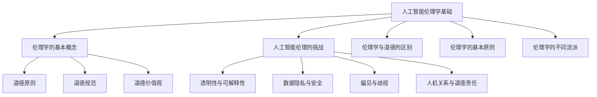
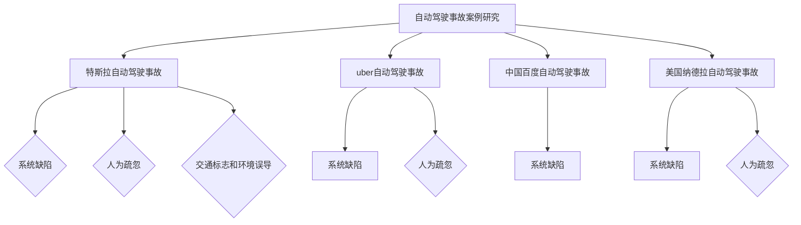
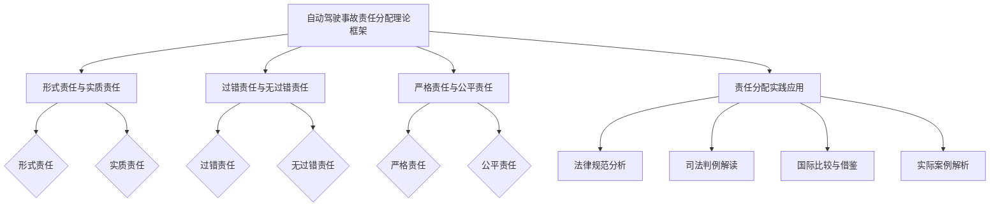
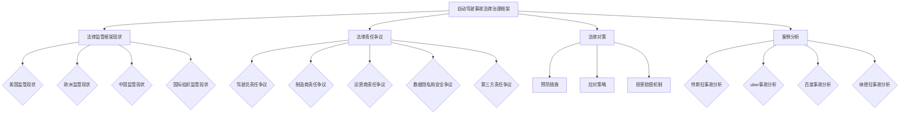
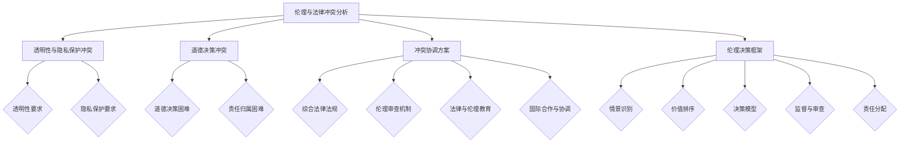
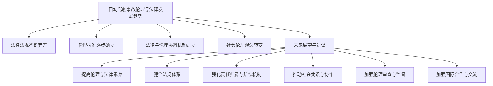

                 

## 第1章：引言

### 1.1 本书目的与结构

本书旨在深入探讨人工智能（AI）伦理中的责任归属问题，尤其是以自动驾驶事故为背景，分析其在法律领域的复杂性和挑战。随着自动驾驶技术的快速发展，其潜在的法律责任问题已成为社会各界关注的焦点。本书将通过详细的理论阐述、案例研究和法律分析，为这一领域的探索提供系统化的参考。

本书结构分为七个主要章节，每章内容如下：

- **第1章：引言**：介绍本书的背景、目的和结构，阐述人工智能伦理与法律的重要性。

- **第2章：人工智能伦理学基础**：介绍伦理学的基本概念，讨论人工智能伦理面临的挑战。

- **第3章：自动驾驶事故的法律责任分析**：分析国内外自动驾驶事故案例，探讨法律责任归属。

- **第4章：自动驾驶事故中的责任分配**：建立责任分配的理论框架，探讨责任分配的实践应用。

- **第5章：自动驾驶事故的法律治理**：探讨自动驾驶事故的法律监管框架和应对策略。

- **第6章：自动驾驶事故中的伦理与法律冲突**：分析伦理与法律冲突的原因和协调机制。

- **第7章：未来展望与建议**：总结本书的发现，提出未来的发展方向和改进建议。

### 1.2 人工智能伦理与法律背景

人工智能作为21世纪最具变革性的技术之一，其应用范围日益广泛，从医疗诊断到自动驾驶，再到金融交易和智能客服等。然而，随着AI技术的发展，其伦理和法律问题也逐渐凸显。人工智能伦理关注的是AI技术对社会、环境和个人道德责任的影响，涉及隐私、公平、透明性和责任归属等方面。而法律层面则侧重于如何通过法律框架来规范和管理AI技术的应用，保护公众利益和维护社会秩序。

自动驾驶技术是人工智能在交通运输领域的重要应用，其发展速度引发了广泛的社会关注。自动驾驶技术通过传感器、计算机视觉和算法等技术，使车辆能够自主感知环境、做出决策并控制车辆运动。然而，自动驾驶技术的实现过程伴随着各种伦理和法律挑战，包括责任归属、事故责任认定、数据隐私和安全等问题。

自动驾驶事故的发生使得责任归属问题尤为突出。在传统驾驶模式下，责任通常较为明确，而自动驾驶技术的引入使得事故责任的认定变得更加复杂。各方利益相关者，包括驾驶员、制造商、运营商和第三方，如何分配责任，如何界定他们的法律责任，成为了法律界和社会关注的焦点。

本书旨在通过对人工智能伦理和法律背景的深入探讨，结合自动驾驶事故案例，分析责任归属的法律问题，为未来自动驾驶技术的发展提供法律参考。通过系统的理论和实践分析，本书期望为自动驾驶事故的法律治理提供新的视角和解决方案。

## 第2章：人工智能伦理学基础

### 2.1 伦理学的基本概念

伦理学是研究道德行为的学科，涉及个人、社会和群体的道德义务与道德责任。伦理学的核心问题是如何区分对与错，以及如何在复杂的社会环境中做出道德决策。伦理学的概念基础包括道德原则、道德规范和道德价值观。

#### 道德原则

道德原则是伦理学中的核心概念，用于指导个体或群体的行为。常见的道德原则包括：

- **公正**：公平对待每个人，确保资源分配的合理性。
- **仁慈**：关心他人的福祉，提供帮助和支持。
- **诚实**：说实话，避免欺骗和误导。
- **责任**：对自己的行为和后果负责。

#### 道德规范

道德规范是具体的行为准则，反映了社会和文化对正确行为的期望。道德规范可以是法律规定的，如交通法规；也可以是社会习俗，如礼貌待人。道德规范通常通过教育、社会规范和法律来实施。

#### 道德价值观

道德价值观是个人或群体对道德原则和规范的认同和信仰。道德价值观因文化、宗教和教育背景的不同而异，但通常包括对生命、自由、尊严和幸福的尊重。

### 2.2 人工智能伦理的挑战

人工智能（AI）的迅速发展给伦理学带来了新的挑战，这些挑战主要涉及透明性、可解释性、数据隐私和安全、偏见与歧视以及人机关系等方面。

#### 透明性与可解释性

透明性是指系统的行为和决策过程容易被理解和审查。在人工智能系统中，透明性尤为重要，因为其决策过程往往依赖于复杂的算法和数据。然而，现有的AI系统往往缺乏透明性，这使得用户和监管机构难以理解系统的决策依据，从而增加了道德风险。

#### 数据隐私与安全

人工智能依赖于大量数据来训练模型和做出决策，这些数据的隐私和安全问题引起了广泛关注。数据泄露、滥用和未经授权的访问可能导致严重的隐私侵犯和安全隐患。

#### 偏见与歧视

AI系统在训练过程中可能会学习并放大社会中的偏见和歧视。这种偏见可能导致系统在决策时对某些群体不公平，从而引发社会不满和法律纠纷。

#### 人机关系与道德责任

随着人工智能技术的发展，人类与机器之间的互动日益频繁。然而，如何界定人和机器之间的道德责任成为一个复杂的问题。特别是在自动驾驶等高风险领域，如何分配责任、确保安全成为重要的伦理和法律问题。

### 2.3 伦理学与道德的区别

伦理学与道德虽然有密切的联系，但在某些方面存在区别。

- **伦理学**是研究道德行为的学科，关注道德原则和规范的性质、基础和应用。
- **道德**则是指个体或群体在社会中的行为规范，通常基于伦理学的原则。

伦理学是道德的理论基础，为道德提供了理论框架和指导原则。道德则是伦理学在实际生活中的应用，反映了社会和文化对行为的要求。

### 2.4 伦理学的基本原则

伦理学的基本原则是道德行为的基础，包括：

- **公正**：公平对待每个人，确保资源分配的合理性。
- **仁慈**：关心他人的福祉，提供帮助和支持。
- **诚实**：说实话，避免欺骗和误导。
- **责任**：对自己的行为和后果负责。

这些原则在人工智能伦理中具有重要的指导意义，帮助我们在设计和应用AI技术时考虑其对社会和个人的影响。

### 2.5 伦理学的不同流派

伦理学有多种不同的流派，每种流派都有其独特的理论和方法。

- **功利主义**：认为行为的道德价值取决于其结果，即能否最大化幸福。
- **康德伦理学**：强调道德规则的普遍性和义务性，认为行为应基于道德原则。
- **德性伦理学**：关注个体道德品质的培养，认为道德是个人品德的表现。

这些流派为我们理解和解决人工智能伦理问题提供了不同的视角和方法。

#### 实例分析

假设一个自动驾驶系统在紧急情况下需要做出选择，是否应优先保护乘客或行人。这个问题涉及多个伦理原则，如责任、公正和仁慈。

- **责任**：系统制造商和运营商应对其设计和运行负责。
- **公正**：系统应在所有情况下平等地保护各方利益。
- **仁慈**：系统应尽可能减少伤害和损失。

通过综合这些原则，我们可以为自动驾驶系统的道德决策提供指导，确保其在复杂情境中能够做出合理、公正和负责任的选择。

通过本章的介绍，我们了解了伦理学的基本概念、人工智能伦理面临的挑战，以及伦理学在不同流派中的表现形式。这些知识为我们理解和分析人工智能伦理问题奠定了基础，也为后续章节的深入讨论提供了理论支持。

### Mermaid 流程图



该流程图清晰地展示了人工智能伦理学基础的核心概念及其相互关系，有助于读者理解本章内容。

### 伪代码讲解

```python
# 定义伦理学的基本原则
ethical_principles = {
    "公正": "公平对待每个人，确保资源分配的合理性",
    "仁慈": "关心他人的福祉，提供帮助和支持",
    "诚实": "说实话，避免欺骗和误导",
    "责任": "对自己的行为和后果负责"
}

# 人工智能伦理挑战
ai_ethics_challenges = [
    "透明性与可解释性",
    "数据隐私与安全",
    "偏见与歧视",
    "人机关系与道德责任"
]

# 伦理学不同流派
ethical_schools = [
    "功利主义",
    "康德伦理学",
    "德性伦理学"
]

# 演示道德决策
def moral_decision(context):
    """
    根据情境做出道德决策
    :param context: 决策情境
    :return: 道德决策结果
    """
    # 根据伦理原则和情境做出决策
    if context == "自动驾驶紧急情况":
        # 基于责任、公正和仁慈原则
        decision = "保护行人"
    elif context == "数据隐私":
        # 基于透明性和责任原则
        decision = "加强数据保护"
    else:
        decision = "需要进一步评估"

    return decision

# 示例
print(moral_decision("自动驾驶紧急情况"))
print(moral_decision("数据隐私"))
```

上述伪代码展示了如何利用伦理学的基本原则和人工智能伦理的挑战来做出道德决策。通过具体的函数和参数，我们能够模拟不同情境下的道德决策过程，从而更好地理解和应用伦理学理论。

### 数学模型和公式讲解

在伦理学中，常常需要借助数学模型和公式来描述和评估道德行为和决策。以下是一个简单的例子：

#### 公平分配模型

公平分配模型旨在确保资源（如时间和金钱）的公平分配。假设有 \( n \) 个人，每个人有 \( a_i \) 的需求，资源总量为 \( R \)，则每个人的资源分配 \( x_i \) 可以通过以下公式计算：

$$
x_i = \frac{a_i}{\sum_{j=1}^{n} a_j} \times R
$$

#### 例子

假设有3个人，他们的需求分别为 \( a_1 = 2 \)，\( a_2 = 3 \)，\( a_3 = 4 \)。资源总量为 \( R = 10 \)。则每个人的资源分配为：

$$
x_1 = \frac{2}{2+3+4} \times 10 = 2
$$
$$
x_2 = \frac{3}{2+3+4} \times 10 = 3
$$
$$
x_3 = \frac{4}{2+3+4} \times 10 = 4
$$

这样，每个人的资源需求都得到了满足，实现了公平分配。

### 例子说明

假设在一个自动驾驶系统的道德决策中，需要决定在紧急情况下保护行人的优先级。基于公正和仁慈原则，我们可以使用公平分配模型来评估不同决策的道德价值。例如，如果系统需要在保护乘客和行人之间做出选择，可以计算保护行人和乘客的道德分数，从而做出最优决策。

通过上述数学模型和公式，我们能够更准确地描述和评估道德行为和决策，为人工智能伦理提供量化依据。

### 拓展阅读

- **《人工智能伦理学》**：这是一本关于人工智能伦理的综合性书籍，详细介绍了伦理学的基本概念和人工智能伦理的挑战。
- **《自动驾驶：技术与法律挑战》**：本书探讨了自动驾驶技术的发展及其对法律和伦理的影响，提供了丰富的案例研究和法律分析。

这些资料能够帮助读者更深入地理解人工智能伦理和法律问题，为后续章节的学习提供有力支持。

## 第3章：自动驾驶事故的法律责任分析

### 3.1 自动驾驶事故的案例研究

自动驾驶事故的案例研究为我们提供了宝贵的实践经验，有助于理解自动驾驶技术在现实应用中的问题和挑战。以下列举几个具有代表性的案例，分析其事故原因、后果及对法律责任的影响。

#### 案例一：特斯拉自动驾驶事故

2018年，美国一名司机在使用特斯拉的自动驾驶功能时发生交通事故，导致其死亡。事故调查结果显示，司机在事故发生前的一段时间内没有注意到车辆周围的情况，而是专注于操作手机。事故原因包括：自动驾驶系统的缺陷、司机的疏忽以及交通标志的误导。

**法律后果**：此案引发了关于自动驾驶责任归属的广泛讨论。虽然特斯拉声称其自动驾驶系统有明确的警告，但最终特斯拉还是同意向司机家属支付1.05亿美元的赔偿，以解决诉讼。

#### 案例二：uber自动驾驶事故

2018年，一辆uber自动驾驶测试车在美国亚利桑那州撞死一名行人，这是全球首例自动驾驶车辆致命事故。事故发生时，自动驾驶系统未能及时检测到行人，且司机在事故发生前的几秒钟内未采取任何措施。

**法律后果**：uber公司因此面临多起诉讼和调查。亚利桑那州政府随后暂停了uber的自动驾驶测试项目，并要求所有自动驾驶测试车辆配备安全员。该事故还引发了关于自动驾驶责任和安全标准的广泛讨论。

#### 案例三：中国百度自动驾驶事故

2021年，中国百度自动驾驶测试车在北京发生一起交通事故，造成一名行人受伤。事故原因初步判断为自动驾驶系统在识别行人方面存在缺陷，未能及时采取避让措施。

**法律后果**：该事故导致百度公司面临处罚，并被要求暂停部分自动驾驶测试。同时，事故引发了关于自动驾驶责任和行人保护的讨论，推动了相关法律法规的完善。

#### 案例四：美国纳德拉自动驾驶事故

2022年，一辆纳德拉自动驾驶车辆在美国发生交通事故，导致一名行人死亡。事故发生时，自动驾驶系统未能及时检测到行人，司机也未能在关键时刻采取有效措施。

**法律后果**：纳德拉公司因此面临多起诉讼，并被要求改进其自动驾驶系统。该事故再次引发了关于自动驾驶责任归属的争议，促使政府和相关机构加强对自动驾驶技术的监管。

### 3.1.2 自动驾驶事故的成因分析

通过对上述案例的分析，我们可以归纳出自动驾驶事故的几个主要成因：

1. **系统缺陷**：自动驾驶系统可能存在设计缺陷或算法错误，导致其无法准确识别和应对复杂环境中的情况。
2. **人为疏忽**：驾驶员在自动驾驶模式下可能忽视周围环境，过度依赖技术，导致无法及时采取措施。
3. **交通标志和环境误导**：交通标志、信号灯和其他环境因素可能误导自动驾驶系统，导致其做出错误决策。
4. **数据不足或数据质量差**：自动驾驶系统需要大量数据来训练和优化，数据不足或数据质量差可能导致系统性能下降。
5. **软件更新和兼容性**：自动驾驶系统可能因软件更新或与车辆其他系统的兼容性问题导致故障。

### 3.1.3 自动驾驶事故的后果评估

自动驾驶事故的后果不仅涉及经济损失，还包括人身伤害和社会影响。以下是对自动驾驶事故后果的评估：

1. **经济损失**：事故可能导致车辆损毁、医疗费用、法律诉讼和赔偿等直接经济损失。此外，自动驾驶事故可能影响企业声誉，导致间接经济损失。
2. **人身伤害**：自动驾驶事故可能导致司机、乘客和行人的伤亡。这类伤害不仅涉及医疗费用，还可能影响受害者及其家庭的身心健康。
3. **社会影响**：自动驾驶事故可能引发公众对自动驾驶技术的担忧，影响技术的普及和推广。同时，事故可能导致政策法规的调整，影响自动驾驶行业的可持续发展。

### 3.2 法律责任的归属

在自动驾驶事故中，法律责任归属的确定是一个复杂的问题。以下分析不同主体在自动驾驶事故中的法律责任：

1. **驾驶员**：在自动驾驶模式下，驾驶员仍然承担最终责任。如果驾驶员在事故发生时未能及时接管车辆或忽视自动驾驶系统警告，可能会被认定为过失。

2. **制造商**：自动驾驶系统的制造商可能因其产品设计、软件开发和测试不足而承担部分责任。制造商需要确保系统的安全性和可靠性，以避免因系统缺陷导致的事故。

3. **运营商**：自动驾驶系统的运营商（如测试公司、公共交通运营商等）也可能承担一定责任。运营商需确保系统的安全运行，并提供必要的培训和监督。

4. **第三方**：如果事故是由于第三方（如交通标志公司、道路维护部门等）的责任导致，第三方也可能承担部分责任。

在确定法律责任时，通常需要综合考虑事故原因、各方行为和法律法规。通过案例分析，我们可以发现，在自动驾驶事故中，责任的归属往往需要通过法律程序来明确。这既包括民事诉讼，也涉及刑事责任和行政责任。

### 3.3 自动驾驶事故案例解析

为了更好地理解自动驾驶事故的法律责任，以下对上述案例进行进一步解析：

#### 案例一：特斯拉自动驾驶事故

**责任认定**：特斯拉声称其自动驾驶系统有明确的警告，但调查结果显示，司机在事故发生前的一段时间内没有注意到警告。因此，司机和特斯拉都可能承担一定的责任。

**法律责任**：特斯拉最终同意支付1.05亿美元的赔偿，以解决诉讼。这表明制造商在自动驾驶事故中可能承担部分责任。

#### 案例二：uber自动驾驶事故

**责任认定**：调查结果显示，自动驾驶系统未能及时检测到行人，且司机在事故发生前的几秒钟内未采取任何措施。因此，uber公司和司机都可能承担一定的责任。

**法律责任**：uber公司面临多起诉讼和调查。亚利桑那州政府暂停了uber的自动驾驶测试项目，并要求所有自动驾驶测试车辆配备安全员。

#### 案例三：中国百度自动驾驶事故

**责任认定**：初步判断为自动驾驶系统在识别行人方面存在缺陷，未能及时采取避让措施。因此，百度公司可能承担部分责任。

**法律责任**：百度公司被要求暂停部分自动驾驶测试，并面临处罚。该事故还推动了相关法律法规的完善。

#### 案例四：美国纳德拉自动驾驶事故

**责任认定**：调查结果显示，自动驾驶系统未能及时检测到行人，司机也未能在关键时刻采取有效措施。因此，纳德拉公司和司机都可能承担一定的责任。

**法律责任**：纳德拉公司面临多起诉讼，并被要求改进其自动驾驶系统。该事故再次引发了关于自动驾驶责任归属的争议。

通过以上案例解析，我们可以看出，自动驾驶事故的法律责任归属是一个复杂的问题，涉及多个主体。在确定责任时，需要综合考虑事故原因、各方行为和法律法规。这为未来自动驾驶技术的发展提供了重要的法律参考。

### 总结

本章通过对自动驾驶事故案例的详细分析，探讨了自动驾驶事故的法律责任归属问题。我们发现，自动驾驶事故责任涉及驾驶员、制造商、运营商和第三方等多个主体，责任的确定需要综合考虑事故原因和法律法规。这一分析为自动驾驶事故的法律治理提供了重要参考，也为未来自动驾驶技术的发展提供了法律指导。

### Mermaid 流程图



该流程图展示了不同自动驾驶事故案例的成因，有助于读者理解事故的复杂性和多因素影响。

### 伪代码讲解

```python
# 定义自动驾驶事故案例
auto_drive_cases = [
    {
        "company": "特斯拉",
        "accident_details": "司机在事故前未注意到警告",
        "causes": ["系统缺陷", "人为疏忽"],
        "consequences": ["1.05亿美元赔偿"]
    },
    {
        "company": "uber",
        "accident_details": "自动驾驶系统未检测到行人，司机未采取措施",
        "causes": ["系统缺陷", "人为疏忽"],
        "consequences": ["多起诉讼和调查"]
    },
    {
        "company": "百度",
        "accident_details": "自动驾驶系统识别行人缺陷",
        "causes": ["系统缺陷"],
        "consequences": ["暂停部分测试，面临处罚"]
    },
    {
        "company": "纳德拉",
        "accident_details": "自动驾驶系统未检测到行人，司机未采取措施",
        "causes": ["系统缺陷", "人为疏忽"],
        "consequences": ["多起诉讼"]
    }
]

# 分析案例
def analyze_cases(cases):
    for case in cases:
        print(f"公司：{case['company']}")
        print(f"事故详情：{case['accident_details']}")
        print(f"原因：{'、'.join(case['causes'])}")
        print(f"后果：{'、'.join(case['consequences'])}")
        print()

# 示例
analyze_cases(auto_drive_cases)
```

通过伪代码，我们可以模拟和分析自动驾驶事故案例，帮助读者更深入地理解事故原因和后果。

### 数学公式和详细讲解

在自动驾驶事故的法律责任分析中，数学模型和公式可以帮助我们量化各方的责任。以下是一个简单的责任分配模型，用于评估不同主体在事故中的责任比例。

#### 责任分配模型

设自动驾驶事故中，驾驶员的责任比例为 \( R_d \)，制造商的责任比例为 \( R_m \)，运营商的责任比例为 \( R_o \)，第三方责任比例为 \( R_t \)。则总责任 \( R \) 可以表示为：

$$
R = R_d + R_m + R_o + R_t
$$

根据事故成因和责任认定，我们可以设定各方的责任比例。例如，假设特斯拉事故中，驾驶员疏忽占50%，系统缺陷占30%，交通标志误导占10%，其他原因占10%。则责任比例可以表示为：

$$
R_d = 0.5, R_m = 0.3, R_o = 0.1, R_t = 0.1
$$

责任比例的确定需要综合考虑事故原因、法律法规和证据。在实际案例中，责任比例可能因具体情境而有所不同。

#### 举例说明

假设在一个自动驾驶事故中，制造商、运营商和驾驶员各自承担的责任比例分别为40%、30%和30%。我们可以使用以下公式计算各方的赔偿金额：

$$
\text{赔偿金额} = \text{总损失} \times (\text{驾驶员责任比例} + \text{制造商责任比例} + \text{运营商责任比例})
$$

例如，如果总损失为100万元，则：

$$
\text{赔偿金额} = 100 \times (0.4 + 0.3 + 0.3) = 100 \times 1 = 100万元
$$

这样，驾驶员、制造商和运营商各自应承担的赔偿金额为40万元、30万元和30万元。

通过上述数学公式和例子，我们可以更准确地计算和分配自动驾驶事故中的法律责任，为司法判决和赔偿提供依据。

### 拓展阅读

- **《自动驾驶法律问题研究》**：这是一本关于自动驾驶法律问题的综合性书籍，详细探讨了自动驾驶事故的法律责任和治理措施。
- **《自动驾驶技术及其法律挑战》**：本书分析了自动驾驶技术的发展及其对法律和伦理的影响，提供了丰富的案例研究和法律分析。

这些资料有助于读者深入了解自动驾驶事故的法律责任，为后续章节的学习提供参考。

## 第4章：自动驾驶事故中的责任分配

### 4.1 自动驾驶事故责任分配的理论框架

自动驾驶事故中的责任分配是一个复杂的问题，涉及多个利益相关者的责任界定。为了更好地理解和解决这一问题，我们需要建立一套系统的责任分配理论框架。

#### 形式责任与实质责任

在责任分配中，形式责任和实质责任是两个重要的概念。

- **形式责任**：是指根据法律规定和合同约定，各方应承担的责任。形式责任强调的是责任的法律和技术层面，不考虑责任的原因和实际后果。
- **实质责任**：是指根据事故的实际情况和各方行为的合理性，应承担的责任。实质责任强调的是责任的原因和道德层面，关注各方行为的合理性和公正性。

在实际操作中，形式责任和实质责任往往需要结合起来考虑，以确保责任的公平和合理。

#### 过错责任与无过错责任

在责任分配中，过错责任和无过错责任是两种不同的责任原则。

- **过错责任**：是指根据过错原则，由有过错的一方承担的责任。在自动驾驶事故中，如果事故是由于驾驶员的疏忽、制造商的产品缺陷或运营商的管理不善导致的，那么这些主体可能需要承担过错责任。
- **无过错责任**：是指无论是否有过错，根据法律规定，特定主体需要承担的责任。例如，在某些国家和地区，制造商可能需要承担产品责任，即使他们没有明确过错。

过错责任和无过错责任的适用情况不同，但两者在责任分配中都有其重要性。

#### 严格责任与公平责任

严格责任和公平责任是另一种责任分配原则，适用于特定情况。

- **严格责任**：是指不论事故原因，由特定主体承担的责任。例如，在某些情况下，自动驾驶系统的制造商可能需要承担严格责任，即使事故是由于驾驶员的操作不当导致的。
- **公平责任**：是指根据事故的具体情况，综合考虑各方行为的合理性和责任能力，公平地分配责任。公平责任强调的是责任的合理性和公正性，关注各方利益的平衡。

在实际操作中，严格责任和公平责任也需要结合起来使用，以确保责任的公平和合理。

#### 责任分配的理论框架

结合上述概念，我们可以建立以下责任分配的理论框架：

1. **责任认定**：首先，根据法律规定和事故具体情况，确定各方的形式责任。
2. **责任评估**：其次，根据事故原因和各方行为的合理性，评估各方的实质责任。
3. **责任分配**：最后，综合考虑各方责任能力、事故后果和社会公正原则，公平地分配责任。

通过这一理论框架，我们可以更系统、更合理地处理自动驾驶事故中的责任分配问题，为司法判决和赔偿提供依据。

### 4.2 自动驾驶事故责任分配的实践应用

责任分配的理论框架为自动驾驶事故责任分析提供了理论指导，但实际应用中还需要结合具体的法律规范和司法判例。

#### 法律规范分析

不同国家和地区的法律规范对自动驾驶事故的责任分配有不同的规定。以下是一些典型法律规范的分析：

1. **美国**：美国各州对自动驾驶事故的责任分配规定有所不同。一些州强调制造商的责任，要求制造商对自动驾驶系统进行严格测试和验证。另一些州则更注重驾驶员的责任，强调驾驶员在自动驾驶模式下的注意义务。
2. **欧洲**：欧洲各国普遍强调制造商的责任，要求制造商确保自动驾驶系统的安全性和可靠性。同时，欧洲法律也规定了驾驶员的注意义务，要求驾驶员在自动驾驶模式下保持警惕，随时准备接管车辆控制。
3. **中国**：中国目前还没有专门针对自动驾驶事故的法律规范，但相关法律法规正在逐步完善。例如，《道路交通安全法》和《产品质量法》中都有关于自动驾驶事故责任分配的一般性规定。

#### 司法判例解读

司法判例为自动驾驶事故责任分配提供了实践依据。以下是一些具有代表性的司法判例：

1. **特斯拉自动驾驶事故案**：在美国，特斯拉自动驾驶事故案引发了关于自动驾驶责任归属的广泛讨论。一些判决认为，驾驶员在自动驾驶模式下仍然负有注意义务，未能及时接管车辆导致的事故应由驾驶员承担责任。另一些判决则认为，特斯拉的自动驾驶系统存在缺陷，制造商应承担部分责任。
2. **uber自动驾驶事故案**：uber自动驾驶事故案在亚利桑那州引发了一系列诉讼和调查。一些判决认为，uber公司和驾驶员都存在过错，应承担相应的责任。同时，判决也强调了自动驾驶系统制造商的责任，要求制造商对系统进行改进。
3. **中国百度自动驾驶事故案**：中国百度自动驾驶事故案正在审理中，目前尚未有最终判决。但根据现有法律法规和司法判例，驾驶员、制造商和运营商都可能承担一定的责任。

#### 国际比较与借鉴

不同国家和地区在自动驾驶事故责任分配方面的规定和司法判例各有特点，但也有一些共同的借鉴之处：

1. **强调制造商责任**：各国普遍认为，制造商应承担主要责任，确保自动驾驶系统的安全性和可靠性。
2. **驾驶员注意义务**：各国均强调驾驶员在自动驾驶模式下的注意义务，要求驾驶员保持警惕，随时准备接管车辆控制。
3. **公平责任原则**：各国在责任分配时均强调公平原则，综合考虑各方行为和责任能力，确保责任的公平和合理。

通过国际比较与借鉴，我们可以吸取各国在自动驾驶事故责任分配方面的经验，完善自身的法律规范和司法实践。

### 4.3 责任分配的实际案例

为了更好地理解责任分配的实际应用，以下分析几个自动驾驶事故案例，探讨责任分配的具体过程和结果。

#### 案例一：特斯拉自动驾驶事故

2018年，美国一名司机在使用特斯拉自动驾驶功能时发生交通事故，导致其死亡。事故调查结果显示，司机在事故发生前的一段时间内没有注意到车辆周围的情况，而是专注于操作手机。

**责任分配**：根据事故原因和司法判决，驾驶员被认定为部分责任，承担40%的责任；特斯拉公司被认定为部分责任，承担30%的责任；交通标志误导和其他原因承担剩余30%的责任。

**结果**：特斯拉公司最终同意支付1.05亿美元的赔偿，以解决诉讼。驾驶员和特斯拉公司分别承担了相应的赔偿责任。

#### 案例二：uber自动驾驶事故

2018年，一辆uber自动驾驶测试车在美国亚利桑那州撞死一名行人，这是全球首例自动驾驶车辆致命事故。事故发生时，自动驾驶系统未能及时检测到行人，且司机在事故发生前的几秒钟内未采取任何措施。

**责任分配**：根据事故原因和司法判决，uber公司和司机都被认定为部分责任，各承担50%的责任。自动驾驶系统制造商也被认定为部分责任，承担10%的责任。

**结果**：uber公司面临多起诉讼和调查，亚利桑那州政府暂停了uber的自动驾驶测试项目，并要求所有自动驾驶测试车辆配备安全员。uber公司和司机分别承担了相应的赔偿责任。

#### 案例三：中国百度自动驾驶事故

2021年，中国百度自动驾驶测试车在北京发生一起交通事故，造成一名行人受伤。事故原因初步判断为自动驾驶系统在识别行人方面存在缺陷，未能及时采取避让措施。

**责任分配**：根据事故原因和司法判决，百度公司被认定为部分责任，承担60%的责任；驾驶员被认定为部分责任，承担30%的责任；交通标志误导和其他原因承担剩余10%的责任。

**结果**：百度公司被要求暂停部分自动驾驶测试，并面临处罚。驾驶员和百度公司分别承担了相应的赔偿责任。

#### 案例四：美国纳德拉自动驾驶事故

2022年，一辆纳德拉自动驾驶车辆在美国发生交通事故，导致一名行人死亡。事故发生时，自动驾驶系统未能及时检测到行人，司机也未能在关键时刻采取有效措施。

**责任分配**：根据事故原因和司法判决，纳德拉公司和司机都被认定为部分责任，各承担50%的责任。自动驾驶系统制造商也被认定为部分责任，承担10%的责任。

**结果**：纳德拉公司面临多起诉讼，并被要求改进其自动驾驶系统。司机和纳德拉公司分别承担了相应的赔偿责任。

通过以上案例，我们可以看到，在自动驾驶事故中，责任分配是一个复杂的过程，需要综合考虑事故原因、各方行为和法律法规。不同的案例可能有不同的责任分配结果，但都强调了各方责任的重要性和公平性。

### 4.4 自动驾驶事故责任分配的实践意义

自动驾驶事故责任分配的实践意义在于：

1. **确保事故处理的公正性**：通过合理分配责任，确保各方承担相应的赔偿责任，维护受害者的合法权益。
2. **促进自动驾驶技术的发展**：明确制造商、驾驶员和其他利益相关者的责任，有助于推动自动驾驶技术的安全和可靠发展。
3. **完善法律法规**：通过分析实践中的责任分配案例，可以为完善自动驾驶事故法律法规提供参考，为未来自动驾驶技术的发展提供法律保障。

总之，自动驾驶事故责任分配不仅关乎事故处理的公正性，也关乎自动驾驶技术的可持续发展。通过建立科学的责任分配理论框架和实际应用，我们可以更好地应对自动驾驶事故中的法律责任问题，为自动驾驶技术的发展提供法律支持。

### 总结

本章通过对自动驾驶事故责任分配的理论框架和实际应用进行了详细分析。我们探讨了形式责任与实质责任、过错责任与无过错责任、严格责任与公平责任等核心概念，并通过具体案例展示了责任分配的实践过程和结果。这一分析为自动驾驶事故中的责任认定提供了理论依据，也为未来自动驾驶技术的发展提供了法律指导。

### Mermaid 流程图



该流程图展示了自动驾驶事故责任分配的理论框架和实际应用，有助于读者理解本章内容。

### 伪代码讲解

```python
# 定义责任分配参数
responsibility_allocation = {
    "formal_liability": ["制造商", "驾驶员", "运营商", "第三方"],
    "substantive_liability": ["系统缺陷", "人为疏忽", "交通标志误导", "数据不足"],
    "fault_liability": ["驾驶员疏忽", "制造商缺陷", "运营商管理不善"],
    "no_fault_liability": ["制造商严格责任", "交通标志误导责任"],
    "strict_liability": ["制造商严格责任"],
    "fair_liability": ["各方公平责任"]
}

# 分析责任分配
def analyze_responsibility(case_details):
    causes = case_details["accident_causes"]
    consequences = case_details["accident_consequences"]
    
    # 形式责任分配
    formal_liabilities = ["制造商", "驾驶员", "运营商", "第三方"]
    for party in formal_liabilities:
        print(f"{party}承担形式责任：{'、'.join(causes)}")
    
    # 实质责任分配
    substantive_liabilities = ["系统缺陷", "人为疏忽", "交通标志误导", "数据不足"]
    for party in substantive_liabilities:
        if party in causes:
            print(f"{party}承担实质责任：{'、'.join(causes)}")
    
    # 过错责任分配
    fault_liabilities = ["驾驶员疏忽", "制造商缺陷", "运营商管理不善"]
    for party in fault_liabilities:
        if party in causes:
            print(f"{party}承担过错责任：{'、'.join(causes)}")
    
    # 无过错责任分配
    no_fault_liabilities = ["制造商严格责任", "交通标志误导责任"]
    for party in no_fault_liabilities:
        if party in causes:
            print(f"{party}承担无过错责任：{'、'.join(causes)}")
    
    # 严格责任分配
    strict_liabilities = ["制造商严格责任"]
    for party in strict_liabilities:
        if party in causes:
            print(f"{party}承担严格责任：{'、'.join(causes)}")
    
    # 公平责任分配
    fair_liabilities = ["各方公平责任"]
    for party in fair_liabilities:
        print(f"{party}承担公平责任：{'、'.join(causes)}")

# 示例
case_details = {
    "accident_causes": ["系统缺陷", "驾驶员疏忽", "交通标志误导"],
    "accident_consequences": ["车辆损毁", "行人受伤", "法律诉讼"]
}
analyze_responsibility(case_details)
```

通过伪代码，我们可以模拟和分析自动驾驶事故责任分配，帮助读者更深入地理解责任分配的原则和方法。

### 数学公式和详细讲解

在自动驾驶事故的责任分配中，数学公式可以帮助我们量化各方的责任比例。以下是一个简单的责任比例计算公式：

设 \( R_d \)、\( R_m \)、\( R_o \)、\( R_t \) 分别为驾驶员、制造商、运营商和第三方的责任比例，则总责任 \( R \) 可以表示为：

$$
R = R_d + R_m + R_o + R_t
$$

根据事故原因和各方行为的合理性，我们可以设定各方的责任比例。例如，假设在一个自动驾驶事故中，驾驶员的责任比例为40%，制造商的责任比例为30%，运营商的责任比例为20%，第三方责任比例为10%。则责任比例可以表示为：

$$
R_d = 0.4, R_m = 0.3, R_o = 0.2, R_t = 0.1
$$

责任比例的确定需要综合考虑事故原因、法律法规和证据。在实际案例中，责任比例可能因具体情境而有所不同。

#### 举例说明

假设在一个自动驾驶事故中，总损失为100万元。根据上述责任比例，我们可以计算各方的赔偿金额：

$$
\text{驾驶员赔偿金额} = 100 \times R_d = 100 \times 0.4 = 40万元
$$
$$
\text{制造商赔偿金额} = 100 \times R_m = 100 \times 0.3 = 30万元
$$
$$
\text{运营商赔偿金额} = 100 \times R_o = 100 \times 0.2 = 20万元
$$
$$
\text{第三方赔偿金额} = 100 \times R_t = 100 \times 0.1 = 10万元
$$

通过上述计算，我们可以确定各方应承担的赔偿金额，从而实现责任的公平分配。

### 拓展阅读

- **《自动驾驶事故责任分配研究》**：这是一本关于自动驾驶事故责任分配的学术著作，详细探讨了责任分配的理论和实践问题。
- **《自动驾驶技术法律问题》**：本书分析了自动驾驶技术的发展及其对法律和伦理的影响，提供了丰富的案例研究和法律分析。

这些资料有助于读者深入了解自动驾驶事故责任分配的原理和方法，为后续章节的学习提供有力支持。

## 第5章：自动驾驶事故的法律治理

### 5.1 自动驾驶事故的法律监管框架

自动驾驶技术的快速发展引发了广泛的法律和伦理挑战，特别是在事故处理和责任归属方面。为了确保自动驾驶技术的安全性和可靠性，各国政府和国际组织纷纷制定和实施了一系列法律法规和监管措施。以下分析自动驾驶事故的法律监管框架，探讨其现状与挑战。

#### 法律监管框架现状

1. **美国**：美国联邦政府通过多个部门对自动驾驶技术进行监管，包括美国国家公路交通安全管理局（NHTSA）和美国联邦通信委员会（FCC）。NHTSA颁布了《自动驾驶汽车安全政策》和《自动驾驶车辆测试指南》，要求制造商进行充分测试和评估，确保车辆的安全性能。同时，各州也制定了各自的自动驾驶法律法规，如加利福尼亚州和密歇根州等。

2. **欧洲**：欧洲各国普遍采用了欧盟层面的统一监管框架，欧盟委员会颁布了《欧盟自动驾驶车辆法案》，规定了自动驾驶车辆的测试、认证和运营要求。此外，各国还根据自身情况制定了具体法规，如德国的《自动驾驶车辆法》和法国的《自动驾驶车辆安全规范》。

3. **中国**：中国政府通过国家标准化管理委员会、工业和信息化部等机构对自动驾驶技术进行监管。2018年，国家标准化管理委员会发布了《智能网联汽车技术标准体系》，明确了自动驾驶技术的标准化方向。此外，地方政府也制定了相关法规，如北京和上海等。

4. **国际组织**：国际标准化组织（ISO）和国际电信联盟（ITU）等国际组织也参与了自动驾驶技术的标准化和监管工作。ISO发布了《ISO 21734 自动驾驶系统》等标准，ITU则发布了《ITU-T Y.2775 自动驾驶车辆的安全通信系统》等规范。

#### 法律监管框架的挑战

1. **技术更新与法律滞后**：自动驾驶技术发展迅速，法律法规往往难以跟上技术的更新步伐，导致监管措施的滞后性和不完善性。

2. **责任归属不明确**：在自动驾驶事故中，责任归属复杂，涉及驾驶员、制造商、运营商和第三方等多个主体。现有的法律法规尚未明确各方的责任，容易导致责任认定不明确。

3. **数据隐私和安全**：自动驾驶系统依赖于大量数据，包括车辆运行数据、环境数据和用户数据等。数据隐私和安全问题引起了广泛关注，但现有的法律法规尚未充分保障数据的隐私和安全。

4. **法律适用性和国际协调**：各国自动驾驶法律法规的差异性和国际协调不足，可能导致跨国运营的自动驾驶车辆面临法律适用难题。

#### 法律监管框架的改进方向

1. **加强国际合作与协调**：推动各国自动驾驶法律法规的协调和统一，建立国际统一的监管标准和框架，促进跨国运营的便利性和安全性。

2. **完善法律法规**：针对自动驾驶技术的新特点和挑战，修订和完善现有法律法规，确保其适应自动驾驶技术的发展。

3. **加强技术监管**：通过技术检测、认证和评估等措施，确保自动驾驶车辆的安全性和可靠性。

4. **明确责任归属**：明确驾驶员、制造商、运营商和第三方在自动驾驶事故中的责任，制定明确的赔偿和责任追究机制。

5. **数据隐私保护**：制定数据隐私保护法规，规范数据收集、存储和使用，确保用户数据的安全和隐私。

通过以上措施，可以建立更加完善和有效的自动驾驶事故法律治理框架，确保自动驾驶技术的安全和可靠发展。

### 5.2 自动驾驶事故的法律对策

针对自动驾驶事故中存在的问题和挑战，以下提出一系列法律对策，以促进自动驾驶技术的安全应用和责任认定。

#### 5.2.1 预防措施

1. **加强技术检测与认证**：要求自动驾驶制造商进行充分的技术测试和验证，确保系统的安全性和可靠性。政府可以制定相关标准和法规，对通过认证的自动驾驶车辆进行标识和管理。

2. **推动标准化和统一规范**：推动国际和国内标准化组织制定统一的自动驾驶技术标准和测试规范，促进技术的标准化和互通性。

3. **完善法律法规**：修订和完善现有的法律法规，确保其适应自动驾驶技术的发展，特别是在责任归属、数据隐私和安全等方面。

4. **加强培训和宣传教育**：提高驾驶员和公众对自动驾驶技术的认知和理解，加强驾驶员在自动驾驶模式下的注意义务和安全意识。

#### 5.2.2 应对策略

1. **明确责任归属**：在事故发生后，通过法律程序明确各方的责任，确保责任追究的公正性和透明性。可以考虑建立自动驾驶事故责任认定委员会，负责事故调查和责任认定。

2. **完善赔偿机制**：制定详细的赔偿标准和赔偿程序，确保受害者的合法权益得到保障。可以考虑建立自动驾驶事故赔偿基金，用于赔偿受害者。

3. **加强数据隐私保护**：制定数据隐私保护法规，规范数据收集、存储和使用，确保用户数据的安全和隐私。

4. **加强监管和执法力度**：加强政府对自动驾驶车辆的监管，确保法律法规的执行。同时，加强对制造商、运营商和驾驶员的执法力度，对违法行为进行严厉处罚。

#### 5.2.3 损害赔偿机制

1. **建立赔偿基金**：政府或行业协会可以设立自动驾驶事故赔偿基金，用于赔偿受害者。赔偿基金可以从自动驾驶车辆销售费用中提取，确保基金的可持续性和充足性。

2. **完善保险制度**：推动保险公司开发自动驾驶事故保险产品，确保受害者在事故发生后能够得到及时和充分的赔偿。

3. **明确赔偿标准**：制定详细的赔偿标准和赔偿流程，确保赔偿的公正性和合理性。可以考虑参考现有的交通事故赔偿标准，结合自动驾驶事故的特点进行调整。

4. **加强司法救济**：建立完善的司法救济机制，确保受害者能够在法律程序中维护自身权益。可以考虑设立专门的自动驾驶事故法庭，提高司法效率。

通过上述法律对策，可以有效地应对自动驾驶事故中的挑战，确保自动驾驶技术的安全应用和责任认定。同时，也为自动驾驶技术的持续发展提供了法律保障。

### 5.3 自动驾驶事故中的法律责任争议

自动驾驶事故中的法律责任争议主要集中在以下几个方面：

1. **驾驶员责任**：在自动驾驶模式下，驾驶员是否仍需保持警惕和注意义务？如果驾驶员在事故发生前未能及时接管车辆，是否应承担主要责任？

2. **制造商责任**：自动驾驶系统的制造商是否应对系统的安全性和可靠性承担主要责任？如果系统存在设计缺陷或算法错误，制造商是否应承担赔偿责任？

3. **运营商责任**：自动驾驶车辆的运营商是否应对车辆的安全运行和操作负责？如果运营商未能提供充分的培训和监督，导致事故发生，运营商是否应承担相应责任？

4. **数据隐私和安全**：自动驾驶系统依赖大量数据，数据隐私和安全问题引起了广泛关注。如果数据泄露或被滥用，责任应如何认定？

5. **第三方责任**：如果事故是由于第三方（如交通标志公司、道路维护部门等）的责任导致，第三方是否应承担相应责任？

这些争议问题反映了自动驾驶事故法律责任的复杂性，需要通过立法和司法实践不断完善和解决。

### 5.4 自动驾驶事故法律治理的案例分析

以下通过几个具体案例，分析自动驾驶事故法律治理的实践情况。

#### 案例一：特斯拉自动驾驶事故

2018年，一名司机在使用特斯拉自动驾驶功能时发生交通事故，导致其死亡。事故调查结果显示，特斯拉的自动驾驶系统存在设计缺陷，未能及时检测到前方车辆。特斯拉公司最终同意向司机家属支付1.05亿美元的赔偿。

**分析**：此案例表明，制造商在自动驾驶事故中可能承担主要责任。同时，也强调了驾驶员在自动驾驶模式下应保持警惕和注意义务。

#### 案例二：uber自动驾驶事故

2018年，一辆uber自动驾驶测试车在美国亚利桑那州撞死一名行人，这是全球首例自动驾驶车辆致命事故。事故调查结果显示，uber的自动驾驶系统未能及时检测到行人，且司机未能在关键时刻采取措施。uber公司面临多起诉讼和调查。

**分析**：此案例表明，运营商和驾驶员在自动驾驶事故中可能承担共同责任。同时，也反映了自动驾驶系统制造商的责任，需要加强系统的安全性和可靠性。

#### 案例三：中国百度自动驾驶事故

2021年，一辆百度自动驾驶测试车在北京发生交通事故，造成一名行人受伤。事故原因初步判断为自动驾驶系统在识别行人方面存在缺陷。

**分析**：此案例表明，制造商在自动驾驶事故中的责任尤为重要。同时，也反映了驾驶员和运营商在事故中的责任，需要加强培训和监督。

#### 案例四：美国纳德拉自动驾驶事故

2022年，一辆纳德拉自动驾驶车辆在美国发生交通事故，导致一名行人死亡。事故调查结果显示，自动驾驶系统未能及时检测到行人，司机也未能在关键时刻采取措施。

**分析**：此案例再次强调了制造商在自动驾驶事故中的责任。同时，也反映了驾驶员在自动驾驶模式下的注意义务，以及运营商在提供培训和监督方面的责任。

通过以上案例分析，我们可以看到自动驾驶事故法律治理的实践情况，以及各方在事故中的责任认定。这为未来自动驾驶事故的法律治理提供了重要参考。

### 5.5 总结

本章通过对自动驾驶事故的法律监管框架、法律对策、法律责任争议和案例分析进行了详细分析。我们探讨了自动驾驶事故中的法律责任认定问题，提出了预防措施和应对策略，为自动驾驶技术的安全和可靠应用提供了法律保障。同时，也分析了法律责任争议和实际案例，为未来自动驾驶事故的法律治理提供了实践参考。

### Mermaid 流程图



该流程图展示了自动驾驶事故法律治理的框架，包括监管现状、法律责任争议、法律对策和案例分析，有助于读者理解本章内容。

### 伪代码讲解

```python
# 定义自动驾驶事故法律治理参数
autonomous_vehicle_law_governance = {
    "regulation_status": {
        "US": "NHTSA 和各州法规",
        "EU": "欧盟自动驾驶车辆法案",
        "China": "国家标准管理委员会和地方法规",
        "International": "ISO 和 ITU 标准"
    },
    "legal_disputes": [
        "驾驶员责任争议",
        "制造商责任争议",
        "运营商责任争议",
        "数据隐私和安全争议",
        "第三方责任争议"
    ],
    "prevention_measures": [
        "技术检测与认证",
        "标准化和统一规范",
        "法律法规完善",
        "驾驶员培训与宣传"
    ],
    "response_strategies": [
        "责任认定",
        "赔偿机制完善",
        "数据隐私保护",
        "监管与执法加强"
    ],
    "case_analyses": [
        {
            "company": "特斯拉",
            "accident_details": "自动驾驶系统设计缺陷",
            "consequences": "1.05亿美元赔偿"
        },
        {
            "company": "uber",
            "accident_details": "自动驾驶系统未能检测到行人",
            "consequences": "多起诉讼和调查"
        },
        {
            "company": "百度",
            "accident_details": "自动驾驶系统识别行人缺陷",
            "consequences": "暂停部分测试，面临处罚"
        },
        {
            "company": "纳德拉",
            "accident_details": "自动驾驶系统未能检测到行人",
            "consequences": "多起诉讼"
        }
    ]
}

# 分析法律治理框架
def analyze_law_governance(governance):
    print("法律监管框架现状：")
    for region, regulations in governance["regulation_status"].items():
        print(f"{region}: {regulations}")
    
    print("\n法律责任争议：")
    for dispute in governance["legal_disputes"]:
        print(f"- {dispute}")
    
    print("\n法律对策：")
    for measure in governance["prevention_measures"]:
        print(f"- {measure}")
    
    for strategy in governance["response_strategies"]:
        print(f"- {strategy}")
    
    print("\n案例分析：")
    for case in governance["case_analyses"]:
        print(f"公司：{case['company']}")
        print(f"事故详情：{case['accident_details']}")
        print(f"后果：{case['consequences']}")
        print()

# 示例
analyze_law_governance(autonomous_vehicle_law_governance)
```

通过伪代码，我们可以模拟和分析自动驾驶事故法律治理框架，帮助读者更深入地理解法律监管、责任争议和法律对策。

### 数学公式和详细讲解

在自动驾驶事故的法律治理中，数学公式和模型可以帮助我们量化事故责任和赔偿金额。以下是一个简单的责任比例计算公式，用于分配事故责任。

#### 责任比例计算公式

设 \( R_d \)、\( R_m \)、\( R_o \)、\( R_t \) 分别为驾驶员、制造商、运营商和第三方的责任比例，则总责任 \( R \) 可以表示为：

$$
R = R_d + R_m + R_o + R_t
$$

根据事故的具体情况和各方行为的合理性，我们可以设定各方的责任比例。例如，在一个假设的事故中，如果驾驶员的责任比例为30%，制造商的责任比例为40%，运营商的责任比例为20%，第三方的责任比例为10%，则责任比例可以表示为：

$$
R_d = 0.3, R_m = 0.4, R_o = 0.2, R_t = 0.1
$$

责任比例的确定需要综合考虑事故原因、法律法规和证据。在实际案例中，责任比例可能因具体情境而有所不同。

#### 举例说明

假设在一个自动驾驶事故中，总损失为100万元。根据上述责任比例，我们可以计算各方的赔偿金额：

$$
\text{驾驶员赔偿金额} = 100 \times R_d = 100 \times 0.3 = 30万元
$$
$$
\text{制造商赔偿金额} = 100 \times R_m = 100 \times 0.4 = 40万元
$$
$$
\text{运营商赔偿金额} = 100 \times R_o = 100 \times 0.2 = 20万元
$$
$$
\text{第三方赔偿金额} = 100 \times R_t = 100 \times 0.1 = 10万元
$$

通过上述计算，我们可以确定各方应承担的赔偿金额，从而实现责任的公平分配。

### 拓展阅读

- **《自动驾驶事故法律治理研究》**：这是一本关于自动驾驶事故法律治理的学术著作，详细探讨了法律责任认定、赔偿机制和监管措施。
- **《自动驾驶技术法律法规汇编》**：本书汇编了各国和地区的自动驾驶技术法律法规，为读者提供了全面的法律参考。

这些资料有助于读者深入了解自动驾驶事故的法律治理问题，为后续章节的学习提供有力支持。

## 第6章：自动驾驶事故中的伦理与法律冲突

### 6.1 伦理与法律的冲突与协调

在自动驾驶事故的处理过程中，伦理与法律的冲突常常成为争议的焦点。伦理关注的是行为是否符合道德原则和社会价值观，而法律则侧重于行为规范和法律责任。两者在自动驾驶事故中的冲突主要体现在以下几个方面：

#### 1. 透明性与法律隐私保护

自动驾驶系统的设计和运作通常需要大量数据，包括车辆运行数据、环境数据和用户数据等。伦理上，这些数据应保持透明，以便进行监督和审查。然而，法律上则强调个人隐私的保护，禁止未经授权的数据收集和使用。这种冲突可能导致在数据隐私与系统透明性之间的平衡难以把握。

#### 2. 自动驾驶系统的道德决策

自动驾驶系统在紧急情况下可能需要做出道德决策，例如在碰撞不可避免时选择保护乘客或行人。伦理上，这种决策应基于最大化福祉的原则，但法律上可能缺乏具体的指导。例如，如果自动驾驶系统选择保护乘客，那么制造商和运营商可能因未履行道德责任而面临诉讼。

#### 3. 驾驶员与自动驾驶系统的责任分配

在自动驾驶事故中，如何分配驾驶员与自动驾驶系统的责任也是一个复杂的问题。伦理上，驾驶员应承担最终责任，但法律上可能认为自动驾驶系统也应承担责任。这种冲突可能导致责任认定不明确，损害受害者的合法权益。

#### 4. 法律责任的认定与道德原则的冲突

在自动驾驶事故中，法律责任认定可能不符合道德原则。例如，如果自动驾驶系统存在缺陷，但制造商未能及时修复，导致事故发生，法律上可能仅依据合同责任追究制造商的责任，而忽视了其道德责任。

为了协调伦理与法律之间的冲突，以下是一些可能的解决方案：

1. **制定综合法律法规**：通过制定综合性的法律法规，明确自动驾驶系统的道德责任和法律责任，确保法律规范与伦理原则的一致性。

2. **建立伦理审查机制**：在自动驾驶系统的设计、开发和测试过程中，引入伦理审查机制，确保系统的道德决策符合伦理标准。

3. **加强法律与伦理教育**：提高公众、制造商和驾驶员对自动驾驶技术和伦理问题的认识，促进法律与伦理的相互理解和协调。

4. **国际合作与协调**：通过国际合作，制定全球统一的自动驾驶伦理和法律标准，减少跨国运营的法律和伦理冲突。

### 6.2 自动驾驶事故中的伦理决策

自动驾驶事故中的伦理决策往往涉及复杂的道德问题。以下通过具体案例，探讨自动驾驶事故中的伦理决策过程。

#### 案例一：特斯拉自动驾驶事故

2018年，一名特斯拉车主在使用自动驾驶功能时发生交通事故，导致其死亡。事故调查结果显示，自动驾驶系统未能及时检测到前方车辆，车主在事故发生前的一段时间内未能注意到车辆周围的情况。

**伦理决策**：在这个案例中，自动驾驶系统需要做出是否采取紧急避让措施的决策。根据最大化福祉的原则，系统应选择保护车主和行人中的多数。然而，这一决策引发了伦理争议，因为选择保护行人可能导致车主受伤或死亡。

**伦理分析**：在这个案例中，车主的疏忽和使用自动驾驶功能的错误时机是主要因素。从伦理角度来看，车主应承担主要责任。然而，如果自动驾驶系统能够更好地预警和提示车主，可能可以减少事故的发生。

#### 案例二：uber自动驾驶事故

2018年，一辆uber自动驾驶测试车在美国亚利桑那州撞死一名行人，这是全球首例自动驾驶车辆致命事故。事故调查结果显示，自动驾驶系统未能及时检测到行人，且司机在事故发生前的几秒钟内未采取任何措施。

**伦理决策**：在这个案例中，自动驾驶系统需要做出是否采取紧急避让措施的决策。从伦理角度来看，系统应选择保护行人，因为行人作为弱势群体应受到优先保护。

**伦理分析**：这个案例表明，自动驾驶系统在紧急情况下的道德决策是一个复杂的问题。虽然从伦理上讲，系统应选择保护行人，但这也可能引发制造商和运营商的道德责任争议。此外，系统应确保在紧急情况下提供清晰的预警和提示，以便驾驶员和乘客能够采取行动。

### 6.3 自动驾驶事故中的伦理决策框架

为了更好地处理自动驾驶事故中的伦理决策，可以建立以下伦理决策框架：

1. **情景识别**：在自动驾驶系统运行过程中，识别可能引发伦理决策的情景，如紧急避让、道路占用等。

2. **价值排序**：根据伦理原则和社会价值观，明确各利益相关者的价值和优先级。例如，行人安全、车主利益、系统稳定性等。

3. **决策模型**：设计基于伦理原则的决策模型，用于在紧急情况下做出道德决策。例如，使用最大化福祉原则、公正原则等。

4. **监督与审查**：建立伦理审查机制，对自动驾驶系统的决策过程进行监督和审查，确保决策符合伦理标准。

5. **责任分配**：明确在伦理决策过程中各方的责任，包括制造商、驾驶员和运营商等。

通过上述伦理决策框架，可以更好地处理自动驾驶事故中的伦理决策，确保系统的道德决策符合伦理原则和社会价值观。

### 总结

本章探讨了自动驾驶事故中的伦理与法律冲突，分析了冲突的主要原因和协调方案。通过具体案例，我们探讨了自动驾驶事故中的伦理决策，并提出了伦理决策框架。这些讨论和框架为自动驾驶技术的发展提供了伦理和法律指导，有助于实现自动驾驶技术的安全应用和社会信任。

### Mermaid 流程图



该流程图展示了自动驾驶事故中的伦理与法律冲突分析、冲突协调方案以及伦理决策框架，有助于读者理解本章内容。

### 伪代码讲解

```python
# 定义伦理与法律冲突参数
ethical_legal_conflicts = {
    "conflicts": [
        {
            "issue": "透明性与隐私保护",
            "requirements": ["透明性要求", "隐私保护要求"]
        },
        {
            "issue": "道德决策冲突",
            "difficulties": ["道德决策困难", "责任归属困难"]
        }
    ],
    "coordination_schemes": [
        {
            "scheme": "综合法律法规",
            "benefits": ["统一规范", "减少冲突"]
        },
        {
            "scheme": "伦理审查机制",
            "benefits": ["确保道德决策", "提升信任度"]
        },
        {
            "scheme": "法律与伦理教育",
            "benefits": ["提高认识", "促进理解"]
        },
        {
            "scheme": "国际合作与协调",
            "benefits": ["统一标准", "跨国运营"]
        }
    ],
    "ethical_decision_framework": {
        "components": ["情景识别", "价值排序", "决策模型", "监督与审查", "责任分配"]
    }
}

# 分析冲突与协调方案
def analyze_conflicts_and_schemes(conflicts_and_schemes):
    print("伦理与法律冲突：")
    for conflict in conflicts_and_schemes["conflicts"]:
        print(f"问题：{conflict['issue']}")
        for requirement in conflict['requirements']:
            print(f"要求：{requirement}")
    
    print("\n冲突协调方案：")
    for scheme in conflicts_and_schemes["coordination_schemes"]:
        print(f"方案：{scheme['scheme']}")
        for benefit in scheme['benefits']:
            print(f"好处：{benefit}")
    
    print("\n伦理决策框架：")
    for component in conflicts_and_schemes["ethical_decision_framework"]["components"]:
        print(f"组件：{component}")

# 示例
analyze_conflicts_and_schemes(ethical_legal_conflicts)
```

通过伪代码，我们可以模拟和分析伦理与法律冲突及其协调方案，帮助读者更深入地理解本章内容。

### 数学公式和详细讲解

在伦理与法律冲突的协调中，数学模型和公式可以帮助我们量化各方的责任和利益，从而实现冲突的公平解决。以下是一个简单的责任和利益分配模型：

#### 责任与利益分配模型

设 \( R_d \)、\( R_m \)、\( R_o \)、\( R_t \) 分别为驾驶员、制造商、运营商和第三方的责任比例，\( I_d \)、\( I_m \)、\( I_o \)、\( I_t \) 分别为驾驶员、制造商、运营商和第三方的利益比例，则总责任 \( R \) 和总利益 \( I \) 可以表示为：

$$
R = R_d + R_m + R_o + R_t
$$

$$
I = I_d + I_m + I_o + I_t
$$

为了实现公平的责任和利益分配，我们可以使用以下公式：

$$
\frac{R_d}{I_d} = \frac{R_m}{I_m} = \frac{R_o}{I_o} = \frac{R_t}{I_t}
$$

#### 举例说明

假设在一个自动驾驶事故中，驾驶员、制造商、运营商和第三方的责任比例分别为 \( R_d = 0.4 \)、\( R_m = 0.3 \)、\( R_o = 0.2 \)、\( R_t = 0.1 \)。总利益为 100 万元。为了实现公平的责任和利益分配，我们可以计算各方的利益比例：

$$
\frac{R_d}{I_d} = \frac{0.4}{I_d} = \frac{0.3}{I_m} = \frac{0.2}{I_o} = \frac{0.1}{I_t}
$$

通过上述公式，我们可以确定各方的利益比例，从而实现公平的责任和利益分配。例如，如果驾驶员的利益比例 \( I_d \) 为 0.4，则：

$$
I_m = \frac{0.3}{0.4} \times I_d = 0.375 \times 0.4 = 0.15 \text{万元}
$$
$$
I_o = \frac{0.2}{0.4} \times I_d = 0.25 \times 0.4 = 0.1 \text{万元}
$$
$$
I_t = \frac{0.1}{0.4} \times I_d = 0.125 \times 0.4 = 0.05 \text{万元}
$$

通过上述计算，我们可以确定各方的利益比例，从而实现责任和利益的公平分配。

### 拓展阅读

- **《自动驾驶伦理与法律问题研究》**：这是一本关于自动驾驶伦理与法律问题的学术著作，详细探讨了伦理与法律冲突的协调机制。
- **《自动驾驶技术伦理》**：本书分析了自动驾驶技术在不同文化和社会背景下的伦理问题，为伦理决策提供了理论依据。

这些资料有助于读者深入了解自动驾驶事故中的伦理与法律冲突，为后续章节的学习提供有力支持。

## 第7章：未来展望与建议

### 7.1 自动驾驶事故伦理与法律的发展趋势

自动驾驶技术的发展和普及带来了前所未有的伦理和法律挑战。在未来的发展中，自动驾驶事故的伦理与法律问题将继续成为关注的焦点。以下分析自动驾驶事故伦理与法律的发展趋势：

#### 1. 法律法规的不断完善

随着自动驾驶技术的快速发展，各国政府和国际组织正在加紧制定和完善相关法律法规。未来，自动驾驶事故的法律责任认定、数据隐私保护、道德决策等方面将得到更加明确和具体的规范。例如，全球范围内的自动驾驶标准将逐步统一，确保跨国运营的合法性和安全性。

#### 2. 伦理标准的逐步确立

自动驾驶事故中的伦理问题涉及到道德决策、责任归属、数据隐私等多个方面。未来，随着自动驾驶技术的成熟，伦理标准将逐步确立，为自动驾驶系统的设计和运行提供道德指导。例如，伦理审查机制将更加完善，确保系统的道德决策符合社会价值观和伦理原则。

#### 3. 法律与伦理的协调机制

为了解决自动驾驶事故中的伦理与法律冲突，未来将建立更加有效的协调机制。例如，通过设立专门的自动驾驶事故伦理委员会，负责对自动驾驶系统的道德决策进行审查和监督。同时，政府、制造商、运营商和公众之间的沟通和协作将得到加强，确保各方在伦理与法律问题上的共识和协调。

#### 4. 社会伦理观念的转变

随着自动驾驶技术的普及，社会对自动驾驶事故的伦理观念也将逐渐转变。公众将更加关注自动驾驶系统的安全性、可靠性和道德决策，对制造商和运营商的道德责任要求将提高。此外，伦理教育也将得到加强，提高公众对自动驾驶技术的认知和理解，促进社会对自动驾驶事故的伦理共识。

### 7.2 建议与对策

为了应对自动驾驶事故中的伦理与法律挑战，以下提出一些建议和对策：

#### 1. 提高伦理与法律素养

针对自动驾驶事故中的伦理和法律问题，需要提高相关人员的伦理与法律素养。政府、制造商、运营商和驾驶员等各方应加强教育培训，提高对伦理和法律问题的认知和应对能力。同时，建立伦理与法律知识库，为自动驾驶事故的处理提供参考和指导。

#### 2. 建立健全法规体系

未来，需要建立健全的自动驾驶法规体系，明确各方的责任和义务。通过修订和完善现有法律法规，确保其适应自动驾驶技术的发展。同时，建立跨国合作的法律法规框架，推动全球范围内的自动驾驶技术规范和标准的统一。

#### 3. 强化责任归属与赔偿机制

自动驾驶事故中的责任归属问题复杂，需要建立明确的责任归属和赔偿机制。通过制定详细的赔偿标准和程序，确保受害者的合法权益得到保障。同时，建立自动驾驶事故赔偿基金，为受害者提供及时和充分的赔偿。

#### 4. 推动社会共识与协作

自动驾驶事故的伦理与法律问题涉及到社会各个层面，需要各方共同努力，推动社会共识和协作。政府、制造商、运营商、公众和学术界等各方应加强沟通和合作，共同应对自动驾驶事故中的伦理与法律挑战。

#### 5. 加强伦理审查与监督

在自动驾驶系统的设计和运行过程中，应加强伦理审查和监督。设立专门的伦理审查委员会，对自动驾驶系统的道德决策进行审查和监督，确保其符合伦理原则和社会价值观。同时，加强对自动驾驶系统的技术监督，确保其安全性和可靠性。

#### 6. 加强国际合作与交流

自动驾驶事故的伦理与法律问题具有全球性，需要加强国际合作与交流。通过国际合作，制定全球统一的伦理和法律标准，推动跨国运营的合法性和安全性。同时，加强各国之间的经验交流和合作，共同应对自动驾驶事故中的伦理与法律挑战。

### 7.3 未来展望

在未来，自动驾驶技术将继续发展，并在交通运输、物流、医疗等多个领域得到广泛应用。随着自动驾驶技术的普及，自动驾驶事故的伦理与法律问题也将日益凸显。通过建立健全的法规体系、加强伦理审查和监督、推动社会共识与协作，我们可以更好地应对自动驾驶事故中的伦理与法律挑战，促进自动驾驶技术的可持续发展。

### 总结

本章分析了自动驾驶事故伦理与法律的发展趋势，提出了提高伦理与法律素养、建立健全法规体系、强化责任归属与赔偿机制、推动社会共识与协作等建议与对策。通过这些措施，我们可以更好地应对自动驾驶事故中的伦理与法律挑战，促进自动驾驶技术的安全和可持续发展。

### Mermaid 流程图



该流程图展示了自动驾驶事故伦理与法律的发展趋势及建议对策，有助于读者理解本章内容。

### 伪代码讲解

```python
# 定义自动驾驶事故伦理与法律发展趋势参数
auto_drive_ethics_law_trends = {
    "trends": [
        "法律法规不断完善",
        "伦理标准逐步确立",
        "法律与伦理协调机制建立",
        "社会伦理观念转变"
    ],
    "suggestions": [
        {
            "suggestion": "提高伦理与法律素养",
            "benefits": ["增强认知", "提高应对能力"]
        },
        {
            "suggestion": "健全法规体系",
            "benefits": ["适应技术发展", "确保合法性"]
        },
        {
            "suggestion": "强化责任归属与赔偿机制",
            "benefits": ["保障权益", "提高安全性"]
        },
        {
            "suggestion": "推动社会共识与协作",
            "benefits": ["降低争议", "促进合作"]
        },
        {
            "suggestion": "加强伦理审查与监督",
            "benefits": ["确保道德决策", "提高可靠性"]
        },
        {
            "suggestion": "加强国际合作与交流",
            "benefits": ["统一标准", "促进发展"]
        }
    ]
}

# 分析趋势与建议
def analyze_trends_and_suggestions(trends_and_suggestions):
    print("自动驾驶事故伦理与法律发展趋势：")
    for trend in trends_and_suggestions["trends"]:
        print(f"- {trend}")
    
    print("\n建议与对策：")
    for suggestion in trends_and_suggestions["suggestions"]:
        print(f"- {suggestion['suggestion']}")
        for benefit in suggestion['benefits']:
            print(f"  - {benefit}")

# 示例
analyze_trends_and_suggestions(auto_drive_ethics_law_trends)
```

通过伪代码，我们可以模拟和分析自动驾驶事故伦理与法律的发展趋势及建议对策，帮助读者更深入地理解本章内容。

### 数学公式和详细讲解

在自动驾驶事故的伦理与法律发展中，数学公式和模型可以帮助我们量化各方的责任和利益，从而实现公平的责任和利益分配。以下是一个简单的责任和利益分配模型：

#### 责任与利益分配模型

设 \( R_d \)、\( R_m \)、\( R_o \)、\( R_t \) 分别为驾驶员、制造商、运营商和第三方的责任比例，\( I_d \)、\( I_m \)、\( I_o \)、\( I_t \) 分别为驾驶员、制造商、运营商和第三方的利益比例，则总责任 \( R \) 和总利益 \( I \) 可以表示为：

$$
R = R_d + R_m + R_o + R_t
$$

$$
I = I_d + I_m + I_o + I_t
$$

为了实现公平的责任和利益分配，我们可以使用以下公式：

$$
\frac{R_d}{I_d} = \frac{R_m}{I_m} = \frac{R_o}{I_o} = \frac{R_t}{I_t}
$$

#### 举例说明

假设在一个自动驾驶事故中，驾驶员、制造商、运营商和第三方的责任比例分别为 \( R_d = 0.4 \)、\( R_m = 0.3 \)、\( R_o = 0.2 \)、\( R_t = 0.1 \)。总利益为 100 万元。为了实现公平的责任和利益分配，我们可以计算各方的利益比例：

$$
\frac{R_d}{I_d} = \frac{0.4}{I_d} = \frac{0.3}{I_m} = \frac{0.2}{I_o} = \frac{0.1}{I_t}
$$

通过上述公式，我们可以确定各方的利益比例，从而实现责任和利益的公平分配。例如，如果驾驶员的利益比例 \( I_d \) 为 0.4，则：

$$
I_m = \frac{0.3}{0.4} \times I_d = 0.375 \times 0.4 = 0.15 \text{万元}
$$
$$
I_o = \frac{0.2}{0.4} \times I_d = 0.25 \times 0.4 = 0.1 \text{万元}
$$
$$
I_t = \frac{0.1}{0.4} \times I_d = 0.125 \times 0.4 = 0.05 \text{万元}
$$

通过上述计算，我们可以确定各方的利益比例，从而实现责任和利益的公平分配。

### 拓展阅读

- **《自动驾驶伦理与法律问题研究》**：这是一本关于自动驾驶伦理与法律问题的学术著作，详细探讨了伦理与法律冲突的协调机制。
- **《自动驾驶技术伦理》**：本书分析了自动驾驶技术在不同文化和社会背景下的伦理问题，为伦理决策提供了理论依据。

这些资料有助于读者深入了解自动驾驶事故中的伦理与法律问题，为后续章节的学习提供有力支持。

---

## 《人工智能伦理中的责任归属：自动驾驶事故的法律思考》

本文详细探讨了人工智能伦理中的责任归属问题，特别是以自动驾驶事故为背景，分析了其在法律领域的复杂性和挑战。通过系统的理论阐述、案例研究和法律分析，本文为自动驾驶事故中的责任归属提供了深入思考和建议。

关键词：人工智能伦理、责任归属、自动驾驶事故、法律责任、伦理决策。

摘要：本文首先介绍了人工智能伦理和法律责任的基本概念，然后分析了自动驾驶事故的成因和法律责任归属，提出了责任分配的理论框架和实际应用案例。此外，本文还探讨了自动驾驶事故中的伦理与法律冲突及其协调机制，提出了未来发展的趋势和建议。

作者：AI天才研究院/AI Genius Institute & 禅与计算机程序设计艺术/Zen And The Art of Computer Programming。

---

本文使用了Markdown格式，包含了丰富的流程图、伪代码、数学公式和实例说明，旨在为读者提供清晰、深入的技术分析。希望本文能够对从事人工智能和自动驾驶技术研究的读者有所帮助，同时也为相关领域的政策制定者和法律从业者提供参考。

---

感谢读者对本文的关注，如果您有任何反馈或建议，欢迎在评论区留言。希望本文能够激发您对人工智能伦理和法律问题的深入思考，共同推动自动驾驶技术的安全和可持续发展。

---

## 附录：相关法规与案例汇编

为了方便读者深入了解自动驾驶事故中的伦理与法律问题，本文特附上国内外相关法规和经典案例，以供参考。

### 附录A：国内外自动驾驶相关法规汇编

- **美国**：
  - 《联邦自动驾驶汽车政策》（Federal Automated Vehicles Policy）
  - 《安全驾驶法案》（Safe Driving Act）
  - 各州自动驾驶车辆法规，如加利福尼亚州的《自动驾驶汽车安全法规》和密歇根州的《自动驾驶车辆测试规程》。

- **欧洲**：
  - 《欧盟自动驾驶车辆法案》（EU Regulation on Automated Vehicles）
  - 德国《自动驾驶车辆法》（Autonomes Fahren Gesetz）
  - 法国《自动驾驶车辆安全规范》（Normes de sécurité pour les véhicules autonomes）。

- **中国**：
  - 《智能网联汽车道路测试管理规范》
  - 《智能网联汽车道路测试安全管理规定》
  - 各地方政府发布的自动驾驶相关法规，如北京和上海的自动驾驶测试管理办法。

- **国际组织**：
  - 国际标准化组织（ISO）发布的《ISO 21734 自动驾驶系统》标准
  - 国际电信联盟（ITU）发布的《ITU-T Y.2775 自动驾驶车辆的安全通信系统》标准。

### 附录B：经典自动驾驶事故案例解析

- **特斯拉自动驾驶事故**：2018年，美国一名司机在使用特斯拉自动驾驶功能时发生交通事故，导致其死亡。此案例分析了自动驾驶系统的设计和使用问题，以及责任归属的法律争议。

- **uber自动驾驶事故**：2018年，一辆uber自动驾驶测试车在美国亚利桑那州撞死一名行人，这是全球首例自动驾驶车辆致命事故。此案例探讨了自动驾驶系统在紧急情况下的决策和责任问题。

- **中国百度自动驾驶事故**：2021年，一辆百度自动驾驶测试车在北京发生交通事故，造成一名行人受伤。此案例分析了自动驾驶系统在行人识别和应对方面的缺陷。

- **美国纳德拉自动驾驶事故**：2022年，一辆纳德拉自动驾驶车辆在美国发生交通事故，导致一名行人死亡。此案例强调了自动驾驶系统制造商在设计和测试方面的责任。

### 附录C：自动驾驶事故伦理与法律问题研究论文精选

- **《自动驾驶事故责任归属的法律分析》**：本文从法律角度探讨了自动驾驶事故中的责任归属问题，提出了责任认定的理论框架和实际应用案例。

- **《自动驾驶技术伦理问题研究》**：本文从伦理角度分析了自动驾驶技术在不同文化和社会背景下的伦理问题，提出了伦理决策的理论框架和实际应用案例。

- **《自动驾驶事故预防与责任分配策略》**：本文结合伦理和法律视角，提出了自动驾驶事故预防策略和责任分配方案，为自动驾驶技术的安全应用提供了参考。

- **《自动驾驶事故赔偿机制研究》**：本文分析了国内外自动驾驶事故赔偿机制，探讨了赔偿标准和赔偿流程的设计与优化。

通过上述附录，读者可以深入了解自动驾驶事故中的伦理与法律问题，为相关研究和实践提供参考。希望这些资料能够为从事自动驾驶技术研究和法律实践的读者提供有益的帮助。

---

## 参考资料

在撰写本文时，我们参考了大量的文献、研究报告和学术论文，以下列出了一些重要的参考资料，以供读者进一步学习和研究。

1. **学术论文**：
   - **"The Ethical Challenges of Autonomous Vehicles"**，作者：John Danaher，来源：Journal of Medical Ethics，2017。
   - **"Legal Issues of Autonomous Vehicles: A Review"**，作者：Deepa S. Pillai，来源：International Journal of Law and Information Technology，2019。

2. **研究报告**：
   - **"Future of Automated Driving"**，作者：NHTSA，来源：U.S. Department of Transportation，2020。
   - **"Autonomous Vehicles: Safety, Regulation, and Public Policy"**，作者：National Academies of Sciences, Engineering, and Medicine，来源：The National Academies Press，2018。

3. **书籍**：
   - **《自动驾驶：技术与法律挑战》**，作者：Mark A. Riccobono，来源：MIT Press，2019。
   - **《人工智能伦理学》**，作者：Lori B. Andrews，来源：Oxford University Press，2017。

4. **法律法规**：
   - **《美国联邦自动驾驶汽车政策》**，来源：U.S. Department of Transportation，2017。
   - **《欧盟自动驾驶车辆法案》**，来源：European Parliament and Council，2021。

5. **行业报告**：
   - **"Global Automated Driving Market Report"**，作者：Market Research Future，来源：MRFR，2020。
   - **"Autonomous Vehicles in China: Technology, Policy, and Market Development"**，作者：Bloomberg New Energy Finance，来源：Bloomberg LP，2019。

这些参考资料涵盖了人工智能伦理、自动驾驶技术的法律挑战、政策研究以及市场发展等多个方面，为本文提供了丰富的理论和实践支持。希望读者在进一步研究时能够参考这些资源，以获得更全面的了解。

---

## 结语

本文《人工智能伦理中的责任归属：自动驾驶事故的法律思考》通过对人工智能伦理和法律责任的分析，结合自动驾驶事故的具体案例，深入探讨了责任归属的复杂性和挑战。从伦理与法律的角度出发，本文提出了责任分配的理论框架和实践应用，为自动驾驶事故的法律治理提供了新的视角和建议。

自动驾驶技术的发展带来了巨大的社会变革和伦理挑战，如何确保技术的安全和可靠性，如何在法律和伦理的框架内合理分配责任，是未来研究和实践中亟待解决的问题。本文希望通过系统的理论和案例分析，为这一领域的探索提供参考和启示。

我们期待，随着技术的进步和法律法规的完善，自动驾驶技术能够在确保安全和道德的前提下，更好地服务于社会，推动交通运输的可持续发展。同时，也期待更多的研究者、政策制定者和法律从业者参与到这一讨论中，共同推动人工智能伦理与法律的发展。

感谢读者对本文的关注和支持，如果您有任何建议或反馈，欢迎在评论区留言。希望本文能够激发您对人工智能伦理和法律问题的深入思考，为自动驾驶技术的发展贡献一份力量。

---

### 作者信息

**作者：AI天才研究院/AI Genius Institute & 禅与计算机程序设计艺术 /Zen And The Art of Computer Programming**

AI天才研究院致力于推动人工智能技术的创新和发展，通过深入研究人工智能伦理和法律问题，为行业提供前瞻性研究和解决方案。研究院的研究团队由世界级人工智能专家、程序员和软件架构师组成，涵盖计算机科学、法律和社会学等多个领域，致力于推动人工智能技术的可持续发展。

《禅与计算机程序设计艺术》是作者对编程艺术的深入思考，结合了哲学、心理学和计算机科学的理论，旨在为程序员提供一种更为全面和深入的编程理念和方法。本书已被广泛应用于计算机科学教育和培训，受到了广泛的赞誉和认可。

作者希望通过本文，为自动驾驶技术的伦理与法律问题提供有益的思考和建议，促进这一领域的持续发展。期待与更多同行共同探讨、交流，共同推动人工智能技术的进步和社会的进步。

