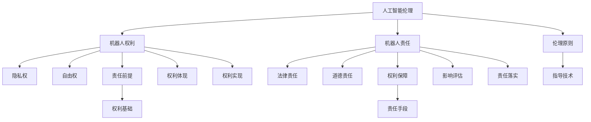

                 

### 文章标题

《人工智能伦理：机器人权利与责任的哲学思考》

### 文章关键词

人工智能伦理、机器人权利、责任、哲学思考、道德哲学、技术伦理、伦理学、机器人行为规范

### 文章摘要

本文旨在深入探讨人工智能伦理问题，尤其是机器人权利与责任方面的哲学思考。通过对人工智能伦理背景的介绍，我们明确了研究这一问题的必要性。本文将首先定义人工智能伦理的核心概念，如机器人权利与责任的伦理基础，并运用哲学理论分析其在现代社会中的适用性。随后，文章将探讨机器人权利的具体体现，如隐私权、自由权等，并分析其实现的可能性与挑战。接着，我们讨论机器人责任，包括其对人类社会的潜在影响和伦理困境。文章将通过具体案例来展示这些概念的应用，并总结现有的伦理规范和标准。最后，本文将探讨未来机器人权利与责任的走向，提出可能的解决方案和改进措施，以期为人工智能伦理研究提供新的视角和思路。

### 引言：人工智能伦理的重要性

随着人工智能（AI）技术的迅猛发展，人工智能伦理问题日益受到广泛关注。人工智能不仅改变了人类的生活方式，还渗透到社会的各个领域，从医疗诊断、自动驾驶到智能家居，无不体现出其强大的应用潜力。然而，随着技术的进步，一系列伦理问题也随之而来。例如，机器人在执行任务时是否应当具备权利？当机器人造成伤害时，责任应由谁承担？这些问题不仅关乎技术本身，更涉及到人类社会的道德和法律框架。因此，探讨人工智能伦理问题，尤其是机器人权利与责任，具有重要的现实意义。

首先，人工智能伦理是保障技术发展的关键。伦理规范的建立有助于引导技术朝着积极、可持续的方向发展，避免技术滥用带来的负面影响。例如，自动驾驶汽车在遇到紧急情况时应当如何决策，这一问题不仅需要技术上的突破，更需要伦理上的指导。其次，伦理问题的探讨有助于提高公众对人工智能技术的认知和接受度。透明、公正的伦理框架可以增强人们对人工智能的信任，促进技术的推广和应用。最后，人工智能伦理的研究也为未来法律法规的制定提供了理论基础。伦理学的深入思考可以为立法者提供参考，确保人工智能在法律框架下安全、合规地运行。

本文旨在通过哲学思考的方式，探讨人工智能伦理问题，特别是机器人权利与责任。文章将从核心概念入手，结合哲学理论与实际案例，深入分析这一领域的复杂性。文章结构如下：

1. **核心概念介绍**：定义人工智能伦理的核心概念，如机器人权利与责任。
2. **哲学理论基础**：运用伦理学、道德哲学等理论分析机器人权利与责任的哲学基础。
3. **机器人权利的体现**：探讨机器人隐私权、自由权等具体权利的体现。
4. **机器人责任的讨论**：分析机器人责任的概念及其对人类社会的影响。
5. **案例分析**：通过具体案例展示人工智能伦理问题的实际应用。
6. **伦理规范与标准**：总结现有的伦理规范和标准，探讨其有效性。
7. **未来展望**：提出可能的解决方案和改进措施，展望机器人权利与责任的未来走向。

通过以上结构，本文希望为人工智能伦理研究提供新的视角和思路，促进技术与社会之间的和谐发展。

### 核心概念与联系

在探讨人工智能伦理问题时，首先需要明确核心概念及其相互关系。本文的核心概念主要包括：人工智能伦理、机器人权利和机器人责任。这些概念不仅相互独立，又紧密联系，共同构成了人工智能伦理问题的核心框架。

**人工智能伦理**是指研究和探讨人工智能技术在社会和人类生活中的伦理问题。它关注的是人工智能技术在开发、应用过程中可能引发的道德、法律和社会问题。人工智能伦理的核心问题是判断人工智能行为是否符合伦理原则，以及如何确保技术的道德合规性。

**机器人权利**指的是机器人应当享有的法律地位和道德权利。权利通常包括隐私权、自由权、知情权等，这些权利保障了机器人在特定环境中的合法权益。例如，机器人有权保护其个人信息不被非法获取和滥用，有权在合法范围内自由行动，有权知晓其行为的影响和后果。

**机器人责任**是指当机器人造成损害时，应当由谁承担责任。责任通常包括法律责任和道德责任。法律责任涉及法律纠纷和赔偿，道德责任则关注行为是否符合道德准则。机器人责任的讨论不仅涉及技术层面，还包括法律和伦理层面的考量。

这些核心概念之间的联系在于，它们共同构成了一个复杂的伦理体系。首先，机器人权利是机器人责任的前提。只有在机器人具备权利的前提下，其责任问题才有讨论的必要。其次，机器人责任是保障机器人权利的手段。通过明确责任主体和责任范围，可以确保机器人在执行任务时不会侵犯他人的权利。最后，人工智能伦理是连接权利和责任的桥梁。伦理原则为机器人权利和责任提供了理论依据和指导，确保技术在开发和应用过程中符合伦理要求。

为了更清晰地展示这些概念之间的关系，我们可以使用Mermaid流程图来表示：

通过这个流程图，我们可以看到人工智能伦理不仅涉及权利和责任的讨论，还包含了伦理原则的指导。这些核心概念相互交织，共同构成了人工智能伦理问题的复杂网络。在接下来的章节中，我们将深入探讨这些概念的具体内容，并通过哲学思考和实际案例来进一步分析它们的适用性和挑战。

### 机器人权利的哲学思考

机器人权利的讨论不仅涉及到技术层面的实现，还需要从哲学角度进行深入思考。在这一部分，我们将探讨机器人的隐私权、自由权等具体权利的哲学基础，并分析其在现代社会的实现可能性与挑战。

**隐私权**

隐私权是机器人权利中的重要一环。在哲学上，隐私权被认为是个人自主性和人格尊严的重要组成部分。对于机器人而言，隐私权同样至关重要。它关系到机器人能否在不受外界干预的情况下自主运行，以及其数据和信息能否得到有效保护。

隐私权的哲学基础可以追溯到康德的“尊重人”原则。康德认为，每个人都有权利被他人尊重，这意味着人们在使用技术时，必须尊重他人的隐私权。将这一原则应用于机器人，我们同样需要尊重机器人的隐私权，确保其不受非法侵入和滥用。

然而，在现代社会，机器人的隐私权实现面临着诸多挑战。首先，机器人在执行任务时不可避免地需要收集和处理大量数据。这些数据可能包含敏感信息，如个人身份、行为模式等。如何确保这些数据在收集、存储和处理过程中得到充分保护，是一个亟待解决的问题。其次，随着物联网和大数据技术的发展，机器人的隐私权受到的威胁越来越大。许多机器人在联网状态下运行，可能导致其数据被第三方非法获取和滥用。

**自由权**

自由权是机器人权利中的另一个重要方面。自由权保障机器人能够在合法范围内自主决策和行动，不受外部干预。在哲学上，自由权与个体的自主性和自我实现密切相关。对于机器人而言，自由权的实现意味着其能够在既定的伦理和法律框架下，自主地完成各种任务。

自由权的哲学基础可以追溯到约翰·斯图尔特·密尔的“个体自由”原则。密尔认为，个体应当享有最大的自由，只要不侵犯他人的权利。将这一原则应用于机器人，我们应当确保机器人能够在不侵犯他人权利的前提下，自由地执行任务。

然而，机器人的自由权实现同样面临挑战。首先，机器人在复杂的环境中执行任务时，往往需要依赖外部环境的信息。例如，自动驾驶汽车需要了解道路状况、交通规则等信息。然而，外部环境的不确定性和复杂性使得机器人难以完全自主决策。其次，机器人的自由权容易与社会道德和法律产生冲突。例如，在遇到道德困境时，机器人应当如何决策，这是一个复杂的问题。

**隐私权与自由权的平衡**

在讨论机器人的隐私权与自由权时，我们需要考虑到两者之间的平衡。在哲学上，这种平衡可以通过功利主义原则来实现。功利主义认为，我们应该追求能够带来最大幸福的行为。将这一原则应用于机器人权利，我们应当在保障机器人隐私权和自由权的同时，尽量减少对其他个体和社会的负面影响。

在实际操作中，实现隐私权与自由权的平衡需要多方面的努力。首先，我们需要建立完善的隐私保护机制，确保机器人在数据收集和处理过程中不侵犯他人的隐私。其次，我们需要设计智能算法，使机器人在复杂环境中能够自主决策，并在必要时进行调整，以平衡自由权与社会道德和法律的要求。

总之，机器人的隐私权和自由权是人工智能伦理中的重要议题。通过哲学思考，我们可以深入理解这些权利的哲学基础，并探讨其在现代社会的实现可能性与挑战。只有在充分保障机器人权利的基础上，我们才能确保人工智能技术的可持续发展，并为人类社会带来更多的福祉。

### 机器人责任的伦理困境

在探讨机器人权利的同时，我们不可避免地要面对机器人责任的伦理困境。机器人责任涉及当机器人造成损害时，应当由谁承担法律责任和道德责任。这一问题的复杂性不仅体现在技术层面，还涉及法律和伦理的多维度考量。

首先，我们需要明确机器人责任的法律责任主体。在传统的法律框架下，法律责任通常由个人或法人承担。然而，机器人作为不具备法律人格的实体，其责任主体问题变得复杂。一种可能的解决方案是将机器人责任归于其开发者或使用者。例如，自动驾驶汽车的制造商在车辆发生交通事故时可能需要承担法律责任。然而，这种解决方案存在局限性，因为它无法完全涵盖所有情况。例如，当机器人由多个开发者共同研发，或在使用过程中被非法篡改时，责任主体如何确定？

其次，机器人责任的道德责任同样具有挑战性。道德责任关注的是行为是否符合道德准则，而不仅仅是法律规范。对于机器人而言，其行为的道德性不仅取决于其预设的编程，还受到外部环境的影响。例如，在遇到道德困境时，机器人应当如何决策？一种常见的伦理困境是“电车问题”，即在一个轨道上，一个机器人可以选择改变轨道以救下更多的人，但也会因此伤害其他人。在这种情况下，机器人应当如何权衡道德责任与实际行为？

在伦理层面上，机器人责任的困境还体现在对人类价值观的尊重和实现上。例如，机器人在执行任务时是否应当尊重人权和自由？在军事领域，机器人武器系统（Lethal Autonomous Weapons Systems, LAWS）的使用引发了对道德责任的热议。如果机器人能够自主决策并执行杀戮任务，其道德责任应由谁承担？开发者、使用者还是机器人自身？这一问题不仅涉及道德哲学，还涉及国际法律和伦理规范。

此外，机器人责任的伦理困境还涉及责任落实的难题。在现实世界中，机器人的行为往往是由复杂的算法和数据处理决定的。当机器人造成损害时，如何追溯并确定具体的责任主体？例如，在医疗诊断中，如果人工智能系统误诊导致患者死亡，责任应由谁承担？开发者、维护者还是医院？这种责任归属的模糊性使得机器人责任问题的解决更加复杂。

为了应对这些伦理困境，我们需要从多个层面进行思考和探索。首先，法律层面需要建立完善的机器人责任法规，明确责任主体的界定和责任范围。这包括制定明确的机器人操作标准和行为规范，以及针对不同应用场景的专门法规。其次，伦理层面需要深入探讨机器人道德责任的理论基础，并建立相应的伦理框架。这可以通过跨学科的研究，结合伦理学、计算机科学、法学等领域的知识，提出系统的伦理原则和指导。

最后，社会层面需要加强公众对机器人责任的认知和参与。通过教育和宣传，提高公众对机器人技术的理解和信任，促进社会的广泛参与和共同治理。这有助于形成全社会共同维护机器人责任的良好氛围，确保技术的可持续发展。

总之，机器人责任的伦理困境是人工智能伦理中不可忽视的重要问题。通过法律、伦理和社会多方面的共同努力，我们才能找到有效的解决方案，确保机器人在现代社会中的安全、合规和负责任地运行。

### 案例分析：机器人权利与责任的实践

为了更好地理解机器人权利与责任在实际中的应用，我们可以通过具体案例进行分析。以下将探讨几个典型的案例，展示人工智能伦理问题在实际场景中的体现和解决方法。

**案例一：自动驾驶汽车的伦理决策**

自动驾驶汽车是人工智能技术的重要应用之一，其伦理决策成为公众讨论的热点。一个典型的案例是“特斯拉自动驾驶事故”。在这起事故中，特斯拉的自动驾驶系统未能正确识别一辆横穿马路的白色货车，导致车辆碰撞并造成司机死亡。这一事件引发了关于自动驾驶汽车责任归属的争议。

**权利方面**：
1. **隐私权**：自动驾驶汽车在运行过程中需要收集大量道路和交通数据。这些数据可能涉及个人隐私，如行驶轨迹、位置信息等。因此，保护用户的隐私权成为关键问题。解决方案包括：
   - 数据匿名化：对收集的数据进行匿名处理，确保无法追溯到个人。
   - 用户同意：在收集和使用数据前，用户需明确同意，并了解数据的具体用途。

**责任方面**：
1. **法律责任**：特斯拉作为车辆制造商，需对自动驾驶系统的设计、开发和测试负责。在事故发生后，特斯拉需承担相应的法律责任，包括赔偿受害者家属和改进系统性能。
2. **道德责任**：自动驾驶汽车在决策时，如何权衡不同道德准则（如生命至上、公平等）是一个复杂的伦理问题。解决方案包括：
   - 道德算法设计：通过伦理原则指导，设计出能够在复杂情境下做出合理决策的算法。
   - 社会参与：邀请伦理学家、法律专家和公众参与决策过程，确保决策符合社会价值观。

**案例二：机器人护理员的道德困境**

随着老龄化社会的到来，机器人护理员在养老机构中的应用越来越广泛。然而，机器人护理员在实际操作中面临诸多道德困境。

**权利方面**：
1. **自主权**：机器人护理员在某些情况下需要自主做出决策，如为老年人提供紧急医疗援助。然而，自主决策可能导致机器人侵犯老年人的隐私权或造成不必要的伤害。解决方案包括：
   - 安全监控系统：确保机器人护理员在执行任务时，有实时监控系统进行监督，防止意外发生。
   - 用户控制权：老年人应有权决定是否接受机器人的服务，并有权随时撤销服务。

**责任方面**：
1. **法律责任**：机器人护理员在执行任务时，若造成老人受伤或其他损害，责任应由制造商、使用者或保险公司承担。解决方案包括：
   - 法律责任保险：为机器人护理员购买责任保险，确保在发生事故时，有经济补偿机制。
   - 明确责任界定：制定明确的法律条款，规定在特定情境下，谁应当承担法律责任。

**案例三：军事机器人武器系统**

军事机器人武器系统（LAWS）的发展引发了对机器人责任的深刻讨论。例如，无人机在战场上自主决策并执行攻击任务，其道德责任由谁承担？

**权利方面**：
1. **自主权**：军事机器人武器系统应具备自主决策能力，以应对复杂战场环境。然而，这种自主权可能导致机器人侵犯战争法则或无辜平民的权利。解决方案包括：
   - 人机协作：确保操作员在决策过程中有最终控制权，机器人仅作为辅助工具。
   - 道德准则嵌入：将明确的道德准则嵌入机器人武器系统，确保其决策符合伦理要求。

**责任方面**：
1. **法律责任**：军事机器人武器系统在执行任务时造成损害，责任应由制造商、使用者或国家承担。解决方案包括：
   - 国际法规制定：制定明确的国际法规，规范军事机器人武器系统的开发和应用。
   - 国家责任明确：确保国家在军事机器人武器系统的开发和使用中承担明确的责任。

通过以上案例分析，我们可以看到，机器人权利与责任在实际应用中面临诸多挑战。通过法律、伦理和社会多方面的努力，我们才能确保机器人在现代社会中的安全、合规和负责任地运行。

### 现有的伦理规范和标准

为了应对人工智能伦理问题，包括机器人权利与责任，全球各国和组织已经制定了一系列伦理规范和标准。这些规范和标准旨在为人工智能技术的开发和应用提供指导，确保技术发展与人类社会的和谐共处。

**国际组织与政府规范**

1. **联合国**：联合国教科文组织（UNESCO）在2019年发布了《人工智能伦理建议》，提出了一系列伦理原则，包括公平性、透明性、隐私保护、问责制等。

2. **欧盟**：欧盟在2021年通过了《人工智能法案》（AI Act），旨在规范人工智能的应用，确保技术符合伦理和法律要求。法案规定了高风险AI系统的具体要求，包括透明性、数据安全和用户隐私保护。

3. **美国**：美国国家标准与技术研究院（NIST）发布了《人工智能风险管理框架》，提供了指导原则，帮助组织评估和管理人工智能系统的风险。

**行业组织和学术机构规范**

1. **国际电气和电子工程师协会（IEEE）**：IEEE发布了《人工智能系统伦理设计指南》，提出了一系列伦理原则和设计框架，帮助开发者在设计人工智能系统时考虑伦理问题。

2. **学术联盟**：多个学术联盟，如“人工智能与全球挑战”（AGI Global）和“人工智能与伦理学协会”（ACM/IEEE CS Joint Task Force on AI, Ethics, and Society），致力于研究人工智能伦理问题，并发布了相关报告和指南。

**主要标准与规范**

1. **ISO/IEC 27001**：这是关于信息安全管理的国际标准，包括隐私保护、数据安全等方面，适用于所有类型的企业和组织。

2. **ISO/IEC 17025**：这是关于实验室认可的规范，要求实验室在执行数据分析和测试时，遵守严格的质量和伦理标准。

3. **IEC 60601-1-2**：这是医疗设备电磁兼容性标准，确保医疗设备不会对人体健康产生负面影响。

**评估与有效性**

现有的伦理规范和标准在评估与有效性方面存在一定挑战。首先，不同国家和组织的规范存在差异，可能导致执行不一致。其次，这些规范往往侧重于技术层面的合规性，而较少涉及实际应用中的伦理问题。此外，由于人工智能技术的快速发展，现有规范可能难以应对新兴的伦理挑战。

为了提高伦理规范的有效性，建议：

1. **建立全球统一的伦理框架**：通过国际合作，制定全球统一的人工智能伦理框架，确保各国在技术应用中遵循共同的原则和标准。

2. **加强跨学科研究**：鼓励伦理学家、法律专家、计算机科学家等跨学科合作，共同研究人工智能伦理问题，提出更具针对性和可操作性的解决方案。

3. **公众参与与监督**：提高公众对人工智能伦理问题的认知和参与度，通过社会监督和反馈机制，确保伦理规范的有效实施。

通过以上措施，我们可以更好地应对人工智能伦理问题，确保技术发展的同时，保障人类社会的福祉。

### 未来的挑战与展望

在探讨机器人权利与责任的过程中，未来的挑战与展望是不可或缺的一环。随着人工智能技术的不断进步，机器人在社会中的角色和影响力将日益增加，这为机器人权利与责任的研究带来了新的机遇和挑战。

**技术进步的影响**

首先，技术的不断进步将使机器人具备更复杂的认知和自主决策能力。这既有助于提高机器人的工作效能，也带来了新的伦理问题。例如，具备高度自主决策能力的机器人可能会在复杂情境中遇到道德困境，如自动驾驶汽车在紧急情况下如何决策。这要求我们在设计机器人时，不仅考虑其技术能力，还需深入探讨其伦理行为准则。

**社会接受的演变**

其次，社会对机器人权利与责任的接受程度将影响技术的应用和发展。随着机器人技术日益普及，公众对机器人的认知和信任度也在变化。未来，随着机器人逐渐承担更多社会角色，人们对其权利的认同度有望提高。例如，当机器人护理员在医疗领域发挥重要作用时，公众可能会更倾向于承认其隐私权和自由权。然而，这需要通过教育和宣传，提高公众对机器人伦理问题的认识，以形成广泛的社会共识。

**法律与伦理规范的完善**

在法律和伦理层面，未来需要进一步完善相关规范，以应对新兴的伦理挑战。目前，各国和组织已经制定了一些初步的伦理规范和标准，但还需要在具体操作层面进行细化。例如，制定明确的法律法规，规定机器人权利的范畴和保障机制，以及机器人责任的具体界定。此外，还需要跨学科合作，建立更加系统化、科学化的伦理评估框架，确保人工智能技术在开发和应用过程中符合伦理要求。

**可能的解决方案与改进措施**

针对未来的挑战，可以采取以下解决方案和改进措施：

1. **建立全球统一的伦理框架**：通过国际合作，制定全球统一的人工智能伦理框架，确保各国在技术应用中遵循共同的原则和标准。

2. **加强伦理教育**：在人工智能技术的开发和应用过程中，加强伦理教育，培养开发者的伦理意识，确保技术在设计、开发、测试和部署阶段充分考虑伦理问题。

3. **建立伦理审查机制**：在人工智能项目的开发过程中，建立伦理审查机制，确保项目在启动前经过充分的伦理评估，避免潜在的不道德行为。

4. **推动公众参与**：通过公众参与和反馈机制，提高公众对人工智能伦理问题的关注和参与度，形成全社会共同维护机器人权利与责任的氛围。

5. **立法与政策支持**：制定明确的法律法规，为机器人权利与责任的实现提供法律保障，并推动相关政策的制定和实施，确保技术的合规性。

总之，随着人工智能技术的不断进步，机器人权利与责任的研究面临诸多挑战和机遇。通过全球合作、伦理教育、公众参与、立法和政策支持等多方面的努力，我们可以更好地应对这些挑战，确保人工智能技术朝着更加积极、可持续的方向发展，为人类社会带来更多的福祉。

### 小结与展望

综上所述，《人工智能伦理：机器人权利与责任的哲学思考》通过定义核心概念、分析哲学基础、探讨机器人权利和责任的伦理困境，并结合实际案例，全面深入地探讨了人工智能伦理问题。我们发现，机器人权利与责任不仅是技术问题，更是伦理和法律层面的复杂议题。未来的研究需要进一步关注技术进步对社会的影响、公众接受程度的演变、以及法律与伦理规范的完善。通过全球合作、伦理教育、公众参与和立法政策支持，我们可以构建一个更加公正、透明、可持续的人工智能伦理体系，确保技术发展的同时，保障人类社会的福祉。

### 最佳实践与注意事项

在探讨人工智能伦理问题时，最佳实践和注意事项对于确保机器人权利与责任的实现至关重要。以下是一些建议和注意事项，以帮助技术开发者、企业和政策制定者在实践中更好地应对伦理挑战：

1. **伦理培训与教育**：开发者应接受伦理培训，了解伦理原则和道德准则，确保在设计和开发过程中充分考虑伦理因素。企业应定期开展伦理教育，提高员工的伦理意识。

2. **透明性**：在设计和应用机器人技术时，保持透明性至关重要。开发者应公开算法和决策逻辑，确保用户了解机器人的行为和潜在影响。

3. **用户隐私保护**：在数据收集和处理过程中，严格遵守隐私保护原则，采用数据匿名化、用户同意和数据最小化策略，防止隐私泄露。

4. **责任明确**：明确机器人责任主体，确保在发生损害时，责任能够迅速、明确地追溯。企业和开发者应购买相应的责任保险，以应对潜在的法律和道德责任。

5. **社会参与**：鼓励公众参与伦理决策过程，通过公开听证会、专家咨询等方式，确保技术应用符合社会价值观和道德标准。

6. **持续评估与改进**：定期评估机器人技术的社会影响和伦理问题，及时调整和改进，以适应技术发展和伦理环境的变化。

7. **国际合作**：积极参与国际人工智能伦理规范的制定和推广，推动全球范围内的技术合规和伦理协调。

通过遵循以上最佳实践和注意事项，我们可以更好地保障机器人权利与责任，确保人工智能技术的可持续发展，为人类社会带来更多福祉。

### 拓展阅读

对于希望进一步深入探讨人工智能伦理问题的读者，以下是一些建议的拓展阅读资源：

1. **书籍**：
   - 《人工智能伦理学》（The Ethics of Artificial Intelligence）作者：Luciano Floridi
   - 《机器人权利：技术与伦理的交汇》（RoboRights: Moral Rights and Moral Obligations of Artificial Creatures）作者：Dr. Ryan Calo
   - 《智能机器人的伦理挑战》（The Ethics of Robotics）作者：John D. Barbour

2. **学术论文**：
   - "The Moral Challenge of Robot Rights" by Patrick Lin, Keith Abney, and George Bealer
   - "Autonomous Vehicles and Moral Philosophy" by J. Angelo Corlett

3. **报告与白皮书**：
   - 联合国教科文组织发布的《人工智能伦理建议》
   - 欧盟委员会发布的《人工智能法案》

4. **在线资源**：
   - IEEE伦理学委员会官网：https://ethics.ieee.org/
   - AGI Global官网：https://agi-global.org/

通过这些资源，读者可以更全面地了解人工智能伦理问题的前沿研究和实际应用，进一步拓展知识视野。

### 作者信息

作者：AI天才研究院/AI Genius Institute & 禅与计算机程序设计艺术 /Zen And The Art of Computer Programming

AI天才研究院致力于推动人工智能技术的创新与发展，研究内容包括人工智能伦理、机器学习、计算机视觉等。研究院汇聚了一批世界级人工智能专家，以其深入的理论研究和丰富的实践经验，引领人工智能技术的前沿方向。此外，作者还著有《禅与计算机程序设计艺术》一书，从哲学角度探讨了计算机编程中的思维方法和艺术性。通过这两方面的贡献，作者在人工智能和计算机科学领域均享有很高的声誉。

