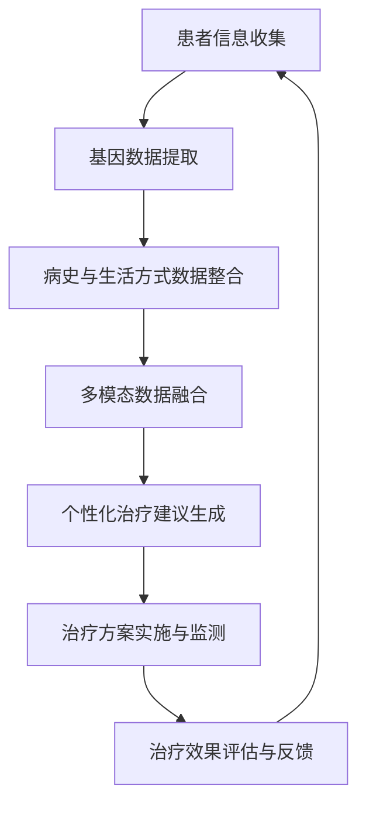
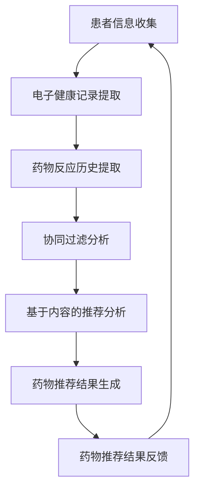
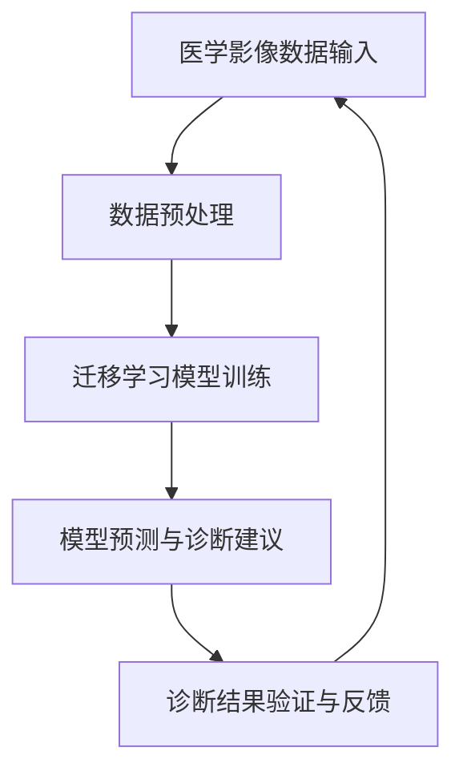

                 


### 1.1 个性化医疗的兴起与发展

个性化医疗，即根据患者的个体差异，定制化地提供诊疗方案，是一种革命性的医疗模式。其核心在于充分利用现代医学技术，特别是人工智能和大数据分析，实现精准医疗。个性化医疗的兴起，与以下几个因素密切相关。

首先，生物学的发展为个性化医疗提供了理论基础。人类基因组计划的完成，使得我们对基因有了更深入的了解。基因表达的个体差异性，使得相同疾病在不同个体中的表现和治疗效果存在显著差异。个性化医疗正是基于这一理论，通过基因检测和生物标记物分析，为患者提供量身定制的治疗方案。

其次，医疗大数据的积累为个性化医疗提供了数据支持。随着医疗技术的进步，医院积累了大量患者的临床数据，包括病史、检查结果、用药记录等。通过大数据分析，我们可以发现疾病发展的规律和患者的个性化需求。人工智能技术的应用，进一步提高了数据处理和分析的效率，使得个性化医疗成为可能。

最后，人工智能技术在个性化医疗中的应用，推动了个性化医疗的快速发展。人工智能可以处理海量的数据，从数据中发现规律，为个性化医疗提供决策支持。例如，通过机器学习算法，可以从历史病例中预测患者对某种药物的反应，从而为患者提供最佳治疗方案。

### 1.1.1 个性化医疗的定义与意义

个性化医疗，是指利用现代医学技术，如基因组学、蛋白质组学、代谢组学等，对患者进行全面的生物信息分析，从而为患者提供个性化的诊疗方案。其核心思想是，针对每位患者的个体差异，制定最适合其的治疗方案。

个性化医疗的意义在于，它可以显著提高治疗效果，减少不必要的治疗和药物副作用，从而提高医疗资源的利用效率。例如，对于同一疾病，不同患者的基因表达可能存在显著差异，导致对同一种药物的反应不同。通过个性化医疗，可以为患者提供最适合的药物，从而提高治疗效果，减少药物副作用。

此外，个性化医疗还可以改善患者的生活质量。通过个性化医疗，患者可以获得更准确、更有效的治疗方案，从而减轻病痛，提高生活质量。

### 1.1.2 人工智能在个性化医疗中的应用现状

人工智能在个性化医疗中的应用已经取得了一系列重要成果。首先，在基因组学领域，人工智能技术可以用于基因数据的分析，帮助医生识别与疾病相关的基因变异。例如，谷歌的DeepMind团队开发的AlphaFold算法，可以预测蛋白质的结构，为基因研究提供了强大的工具。

其次，在药物治疗领域，人工智能可以用于药物筛选和药物反应预测。例如，美国的Zebra Medical Vision公司开发的AI系统，可以分析医疗影像数据，预测患者的疾病类型和疾病进展，从而为医生提供更准确的诊断和治疗方案。

此外，在个性化医疗的实践中，人工智能还可以用于医疗数据的分析和管理。例如，IBM的Watson for Oncology系统，可以分析海量的医学文献和病例数据，为医生提供个性化的治疗建议。

总的来说，人工智能在个性化医疗中的应用，不仅提高了医疗的精准度和效率，也为个性化医疗的进一步发展提供了强大的技术支持。

### 1.1.3 人工智能在医疗领域的挑战

尽管人工智能在医疗领域展现出了巨大的潜力，但其在实际应用中仍面临诸多挑战。首先，数据隐私问题是人工智能在医疗领域应用的主要障碍之一。医疗数据包含大量的敏感信息，如患者的身份、病史、基因序列等，这些数据一旦泄露，将对患者隐私造成严重威胁。因此，如何在保护患者隐私的同时，充分利用医疗数据进行人工智能研究，是一个亟待解决的问题。

其次，算法公平性也是人工智能在医疗领域的一个重要挑战。医疗决策直接关系到患者的生命安全和健康状况，因此，算法必须确保对所有患者公平。然而，现有的医疗数据可能存在偏见，导致算法在处理某些患者群体时出现不公平现象。例如，如果训练数据集中某特定种族或性别的人群样本较少，算法可能会对这一群体产生偏见，导致错误的诊断或治疗建议。

此外，算法的解释性也是一个重要问题。在医疗领域，医生和患者需要理解算法的决策过程，以便对其进行信任和验证。然而，许多深度学习算法的黑箱特性，使得其决策过程难以解释，这增加了医生和患者对算法的不信任。

最后，医疗资源的分配不均也是人工智能在医疗领域应用的一大挑战。尽管人工智能可以提高医疗服务的效率和质量，但其高昂的开发和部署成本，使得许多医疗机构难以承担。此外，医疗资源的分布不均，也使得人工智能技术的普及和公平应用受到限制。

### 1.2 伦理考量的重要性

在探讨人工智能在医疗领域的应用时，伦理考量显得尤为重要。首先，伦理考量可以帮助我们确保人工智能在医疗中的使用符合道德和法律标准。医疗领域的特殊性，要求我们在应用人工智能技术时，必须尊重患者的隐私权和自主权，避免滥用医疗数据。

其次，伦理考量有助于提高人工智能医疗应用的可接受性。当患者和医生了解并认同人工智能在医疗中的伦理原则时，他们更可能接受和使用这些技术。例如，如果算法的公平性和透明性得到保障，医生和患者会对基于人工智能的诊断和治疗建议更加信任。

此外，伦理考量还能引导人工智能医疗应用的发展方向。通过伦理考量，我们可以识别出人工智能在医疗中可能带来的伦理风险，如数据隐私侵犯、算法偏见等，从而采取相应的预防措施，确保技术的可持续发展。

总之，伦理考量不仅是人工智能在医疗领域应用的基础，也是提升技术应用质量和公信力的关键。

### 1.2.1 伦理考量的定义与范围

伦理考量，是指在对某一行为或决策进行评估时，从道德和伦理的角度进行思考和判断。在人工智能（AI）领域，伦理考量尤为关键，因为它涉及到技术对人类生活和社会的深远影响。伦理考量的范围广泛，包括但不限于以下几个方面：

首先，隐私权是伦理考量中的一个核心问题。AI技术在医疗领域的应用，往往需要处理大量的敏感个人数据，如患者的医疗记录、基因信息等。如何在确保数据有效利用的同时，保护患者的隐私权，避免数据泄露，是一个重要的伦理问题。

其次，公平性是另一个重要的伦理考量。AI算法在医疗决策中的应用，必须确保对所有患者公平，避免因数据偏见或算法设计缺陷导致的不公平现象。例如，如果AI系统在处理特定种族或性别患者的数据时出现偏差，可能会导致错误的诊断或治疗方案。

此外，透明性和责任归属也是伦理考量的重要方面。AI系统在医疗决策中的运作过程往往是“黑箱”式的，医生和患者很难理解其决策逻辑。因此，如何提高AI系统的透明性，使其决策过程可解释，以便医生和患者能够信任和验证其结果，是一个亟待解决的伦理问题。

最后，社会责任也是伦理考量的一部分。AI技术在医疗领域的应用，不仅需要考虑技术本身的影响，还需要考虑其对整个社会的影响，如医疗资源的分配、医疗服务的可及性等。

总之，伦理考量在人工智能医疗应用中扮演着至关重要的角色，它不仅关乎技术的合法性和道德性，还关乎技术的可持续性和公信力。

### 1.2.2 医疗伦理与人工智能的交汇点

医疗伦理与人工智能（AI）的交汇点主要体现在以下几个方面。首先，隐私保护是双方交汇的核心问题之一。在医疗领域，患者的隐私权至关重要，而AI技术的广泛应用往往需要处理大量的个人健康数据。如何确保这些数据的安全和隐私，避免数据泄露和滥用，成为医疗伦理与AI交汇的第一个交汇点。

其次，公平性是另一个重要的交汇点。医疗伦理强调对患者的公平对待，而AI技术在医疗中的应用，如诊断、治疗建议等，必须保证对所有患者的公平。然而，由于数据集的不均衡或算法设计的不完善，AI系统可能对某些患者群体产生偏见，导致不公平的结果。因此，如何确保AI技术在医疗中的公平性，是医疗伦理与AI交汇的另一个重要问题。

第三，透明性和责任归属也是医疗伦理与AI交汇的关键点。医疗决策的透明性对于患者和医生至关重要，而AI系统往往因其“黑箱”特性而难以解释其决策过程。此外，当AI系统在医疗中产生错误或不良后果时，如何明确责任归属也是一个复杂的伦理问题。

最后，医疗伦理与AI的交汇还体现在社会责任方面。AI技术在医疗领域的应用，不仅需要考虑技术本身的影响，还需要考虑其对整个医疗体系和社会的影响，如医疗资源的分配、医疗服务的不平等问题等。因此，如何在医疗伦理的指导下，确保AI技术的合理、公正和可持续发展，是双方交汇的最后一个重要问题。

### 1.2.3 伦理考量在个性化医疗中的必要性

伦理考量在个性化医疗中的必要性不可忽视。首先，个性化医疗涉及大量敏感的个人信息，如基因数据、病历记录等。这些数据不仅关乎患者的隐私，还可能被用于商业目的或不当分析，导致隐私泄露和滥用。因此，在个性化医疗中，必须进行严格的伦理考量，确保患者的隐私权得到尊重和保护。

其次，个性化医疗的决策过程依赖于复杂的数据分析和算法。这些算法可能因为训练数据集的不均衡或算法设计的不完善，导致对某些患者群体产生不公平的结果。例如，如果算法在训练过程中主要使用了白种人的数据，那么在应用于其他种族的患者时，可能会出现偏差。因此，伦理考量有助于确保算法的公平性和透明性，避免因算法偏见而导致的不公平现象。

此外，个性化医疗的推广可能带来新的社会不平等问题。如果技术只能在资源丰富的医疗机构中使用，那么贫困和偏远地区的患者可能无法享受到这种先进的治疗方法。因此，伦理考量需要考虑医疗资源的分配问题，确保个性化医疗能够惠及所有患者，实现医疗服务的公平性。

最后，伦理考量有助于提高公众对个性化医疗的信任。当患者和医生了解并认同个性化医疗的伦理原则时，他们更可能接受和使用这种技术。相反，如果伦理问题得不到妥善解决，公众可能会对个性化医疗技术产生怀疑和抵触情绪，从而阻碍其推广和应用。

### 1.3 算法公平性的概念与内涵

算法公平性是指算法在处理数据时，对于不同群体或个体是否能够保持一致性、公正性和无偏见的状态。在个性化医疗中，算法公平性尤为重要，因为医疗决策直接关系到患者的健康和生命安全。算法公平性的核心目标是确保算法不会因为性别、种族、年龄、社会经济地位等因素而对某些群体产生不公平待遇。

算法公平性的概念不仅包括结果公平，还包括过程公平。结果公平是指算法的输出结果对不同群体是公平的，即算法做出的诊断和治疗建议对所有患者都是准确的。过程公平则是指算法在处理数据和使用资源时的公平性，例如，算法是否在训练过程中使用了均衡的数据集，是否在决策过程中考虑了所有相关因素。

在个性化医疗中，算法公平性的内涵包括以下几个方面：

1. **无偏见性**：算法不应受到种族、性别、年龄等因素的影响，对不同的患者群体做出公正的决策。

2. **透明性**：算法的决策过程应该是可解释和透明的，医生和患者能够理解算法是如何做出决策的。

3. **包容性**：算法应考虑不同患者群体的多样性，确保不同背景的患者都能得到公平的医疗服务。

4. **公平的资源分配**：算法在处理医疗资源时，应确保资源分配的公平性，避免因算法偏见导致某些患者群体无法获得必要的医疗资源。

总之，算法公平性是确保个性化医疗质量和公正性的关键，其内涵涉及多个方面，包括无偏见性、透明性、包容性和公平的资源分配。只有通过严格的算法公平性考量，个性化医疗才能真正实现其初衷，为所有患者提供高质量的医疗服务。

### 1.3.2 算法公平与医疗平等的关系

算法公平与医疗平等是两个密切相关但又有所不同的概念。算法公平主要关注算法在数据处理和决策过程中是否公正无偏见，而医疗平等则强调医疗资源的分配和使用是否对所有患者公平。然而，这两个概念在实际应用中密不可分，共同构成了个性化医疗伦理考量的核心。

算法公平是医疗平等的基础。如果算法在处理医疗数据时存在偏见，那么无论医疗资源如何分配，都可能导致某些患者群体受到不公平待遇。例如，如果AI算法在诊断过程中对某些种族或性别产生偏见，那么这些患者可能会得到错误的治疗建议，从而影响其健康状况和生活质量。

医疗平等则是对算法公平的进一步保障。即使算法本身是公平的，如果医疗资源分配不均，仍然可能导致某些患者群体无法享受到公平的医疗服务。例如，在一个资源分配不均的地区，即使算法能够准确诊断疾病，但由于医疗设施和药品的短缺，患者仍然可能无法得到有效的治疗。

因此，算法公平与医疗平等相互依存、相互促进。只有在算法公平的基础上，才能真正实现医疗平等。同时，通过确保医疗资源的公平分配，也可以弥补算法可能存在的局限性，确保所有患者都能获得高质量的医疗服务。

### 1.3.3 算法公平性的挑战与解决方案

尽管算法公平性在个性化医疗中至关重要，但其实现面临着诸多挑战。以下是几个主要的挑战及相应的解决方案：

1. **数据偏差**：算法公平性的首要挑战来自于数据偏差。如果训练数据集存在偏见，算法可能会在处理实际数据时对某些群体产生不公平的结果。例如，如果训练数据集中缺乏特定种族或性别的人群样本，算法可能会对这些群体产生偏见。

   **解决方案**：为了减少数据偏差，可以通过以下几种方法：
   - **数据平衡**：通过增加代表性不足群体在数据集中的样本量，实现数据平衡。
   - **负向样本增强**：通过生成或引入负向样本，以纠正训练数据中的偏见。
   - **多模态数据融合**：结合不同来源的数据，如电子健康记录和基因数据，以减少单一数据源可能带来的偏见。

2. **算法黑箱性**：深度学习等复杂算法通常具有“黑箱”特性，其决策过程难以解释和理解。这增加了医生和患者对算法公平性的信任难度。

   **解决方案**：提高算法的可解释性和透明性：
   - **解释性模型**：开发能够提供决策解释的算法，如LIME（Local Interpretable Model-agnostic Explanations）和SHAP（SHapley Additive exPlanations）。
   - **可视化工具**：利用可视化工具，如热力图和决策树，帮助用户理解算法的决策过程。
   - **透明度报告**：要求算法开发者提供详细的算法设计和决策过程报告，以便用户和监管机构评估算法的公平性。

3. **资源分配不均**：医疗资源的分配不均是算法公平性的另一个挑战。即使算法是公平的，如果资源分配不均，某些患者群体仍然无法获得公平的医疗待遇。

   **解决方案**：确保资源分配的公平性：
   - **政策支持**：政府和社会组织应出台相关政策，确保医疗资源的合理分配，特别是对贫困和偏远地区的支持。
   - **技术手段**：利用AI技术优化医疗资源的配置，如智能调度系统和智能分配算法，提高资源利用效率。

4. **法律和伦理规范**：算法公平性需要法律和伦理规范的支持。缺乏明确的法律和伦理框架，可能导致算法公平性的实现缺乏保障。

   **解决方案**：建立和完善法律和伦理规范：
   - **法律法规**：制定相关法律法规，明确算法公平性的标准和责任归属。
   - **伦理审查**：建立伦理审查机制，对AI在医疗中的应用进行严格的伦理评估，确保其符合伦理标准。

通过上述解决方案，我们可以逐步克服算法公平性在个性化医疗中的挑战，实现更加公正和高质量的医疗服务。

### 2.1 人工智能技术的基本原理

人工智能（AI）技术是现代计算机科学中的一个重要分支，旨在使计算机能够模拟人类智能行为，进行自主学习和决策。其基本原理主要包括以下几个方面：

首先，机器学习（Machine Learning）是AI技术的核心。机器学习是一种从数据中学习规律和模式的方法，其基本思想是通过训练模型，使模型能够对未知数据进行预测或分类。机器学习主要分为监督学习（Supervised Learning）、无监督学习（Unsupervised Learning）和强化学习（Reinforcement Learning）三种类型。

- **监督学习**：监督学习模型在训练阶段使用标注数据，通过学习输入和输出之间的映射关系，实现对新数据的预测。常见的监督学习算法包括线性回归、决策树、支持向量机（SVM）和神经网络等。
  
- **无监督学习**：无监督学习模型在训练阶段不使用标注数据，而是通过学习数据中的隐含结构和模式，如聚类分析和降维技术（如主成分分析PCA和t-SNE）。无监督学习常用于数据预处理和探索性数据分析。

- **强化学习**：强化学习模型通过与环境的交互，学习最优策略以实现特定目标。强化学习广泛应用于游戏、自动驾驶和机器人控制等领域。

其次，深度学习（Deep Learning）是机器学习的一种重要形式，通过构建多层的神经网络模型，能够自动提取数据中的复杂特征。深度学习在图像识别、自然语言处理和语音识别等领域取得了显著成果。常见的深度学习模型包括卷积神经网络（CNN）、循环神经网络（RNN）和生成对抗网络（GAN）等。

- **卷积神经网络（CNN）**：CNN是一种特别适合处理图像数据的神经网络模型，通过卷积操作提取图像的局部特征，并在不同层次上组合这些特征，从而实现图像分类、物体检测等任务。

- **循环神经网络（RNN）**：RNN是一种能够处理序列数据的神经网络模型，通过记忆状态捕捉序列中的长期依赖关系。RNN广泛应用于自然语言处理任务，如语言模型、机器翻译和语音识别。

- **生成对抗网络（GAN）**：GAN是一种由生成器和判别器组成的对抗性神经网络模型，生成器生成数据以欺骗判别器，判别器则试图区分真实数据和生成数据。GAN在图像生成、图像修复和风格迁移等领域展现了强大的能力。

最后，人工智能技术的实现还需要数据预处理、模型训练、模型评估和模型部署等步骤。数据预处理包括数据清洗、数据归一化和特征提取等，以准备适合训练的数据集。模型训练是通过优化算法，调整模型参数，使其能够在训练数据上取得较好的表现。模型评估则通过验证集和测试集，评估模型的泛化能力和性能。模型部署是将训练好的模型应用到实际场景中，如医疗诊断系统、智能客服等。

总之，人工智能技术的基本原理包括机器学习、深度学习和神经网络等，通过数据驱动的方式，实现计算机的智能行为。这些技术在不同应用领域取得了显著成果，为个性化医疗提供了强大的技术支持。

### 2.1.2 个性化医疗需求分析

在个性化医疗中，需求的多样性和复杂性决定了人工智能技术的应用必须具备高度定制化和灵活性的特点。首先，个性化医疗要求对每位患者进行全面的生物信息分析，这包括基因测序、蛋白质组学和代谢组学等多个层面的数据。为了满足这一需求，人工智能技术必须能够处理海量的多模态数据，并进行高效的数据整合和分析。

其次，个性化医疗的核心在于根据患者的具体病情和生理特征，提供量身定制的诊疗方案。这要求人工智能算法能够对复杂的数据进行深入挖掘，从中提取出对患者病情有重要影响的关键特征和模式。例如，通过分析患者的基因数据，可以预测其对某种药物的敏感性或副作用风险；通过分析电子健康记录，可以识别出患者的病史和现有疾病，为制定个性化的治疗方案提供依据。

此外，个性化医疗还要求算法具备高解释性和透明性。医生和患者需要理解算法的决策过程，以确保治疗方案的合理性和可接受性。为此，人工智能技术需要开发出能够提供决策解释的工具，如基于决策树、规则引擎或可解释性模型的可视化工具，帮助医生和患者理解算法的决策逻辑。

最后，个性化医疗的实践需要实时性和高效性。随着医疗数据的不断更新和患者病情的变化，人工智能算法需要能够快速响应，提供实时的诊疗建议。这要求算法在模型训练和推理过程中具备高效的计算能力，能够处理大规模实时数据流。

总的来说，个性化医疗的需求分析揭示了人工智能技术在医疗应用中面临的挑战和机遇。通过深入理解和满足这些需求，人工智能技术将为个性化医疗提供强有力的支持，推动医疗模式的变革和进步。

### 2.1.3 人工智能技术在个性化医疗中的应用场景

人工智能技术在个性化医疗中的应用场景广泛且多样化，涵盖了诊断、治疗和预后管理的各个阶段。以下是几个典型应用场景及其实现方法：

1. **疾病诊断**：人工智能技术在疾病诊断中具有重要应用价值。例如，通过卷积神经网络（CNN）和循环神经网络（RNN）等深度学习模型，可以对医学影像（如X光、CT、MRI等）进行自动分析和诊断。CNN可以提取影像中的空间特征，用于肿瘤检测和分割；RNN则可以处理连续的影像序列，用于心脏病和呼吸系统疾病的诊断。

   **实现方法**：
   - **影像预处理**：对医学影像进行去噪、增强和分割等预处理步骤，提高图像质量。
   - **特征提取**：使用CNN提取图像的局部特征，RNN处理连续影像序列。
   - **分类与诊断**：利用训练好的模型对影像数据进行分类，实现疾病的自动诊断。

2. **药物推荐与个体化治疗**：基于患者的基因数据、电子健康记录和药物反应历史，人工智能可以推荐个性化的药物组合和治疗方案。通过集成学习（Ensemble Learning）和关联规则学习（Association Rule Learning）等技术，可以挖掘药物之间的相互作用和患者对药物的个体反应。

   **实现方法**：
   - **数据整合**：整合基因数据、电子健康记录和药物反应历史等多源数据。
   - **特征工程**：提取与药物反应相关的关键特征，如基因表达、药物剂量、病史等。
   - **模型训练**：使用集成学习模型（如随机森林、梯度提升树等）进行药物推荐和个体化治疗策略的制定。

3. **疾病预测与风险评估**：人工智能可以预测疾病的发展趋势和患者的风险水平，如糖尿病的并发症风险预测、癌症复发风险预测等。通过时间序列分析（Time Series Analysis）和生存分析（Survival Analysis）等技术，可以分析患者的健康数据，提供个性化的健康风险评估。

   **实现方法**：
   - **时间序列建模**：使用RNN和长短期记忆网络（LSTM）等模型，分析患者健康数据的时序特征。
   - **风险指标计算**：根据患者的健康数据，计算疾病风险评分或概率。
   - **风险预警**：基于风险评分，为患者提供个性化的健康预警和建议。

4. **智能监护与远程医疗**：通过可穿戴设备和远程医疗设备，实时监控患者的生命体征和健康状态。利用人工智能技术，可以对监控数据进行实时分析，及时发现异常情况并提供医疗干预。

   **实现方法**：
   - **数据采集与传输**：通过可穿戴设备采集患者的生理数据，并利用物联网（IoT）技术进行数据传输。
   - **实时数据分析**：使用机器学习算法对实时数据进行分析，如心率监测、血压监测等。
   - **预警与干预**：根据分析结果，自动发出警报并采取相应的医疗干预措施。

总之，人工智能技术在个性化医疗中的应用场景丰富多样，通过精准的诊断、个性化的治疗方案和智能的疾病管理，为患者提供高质量的医疗服务。随着技术的不断进步，人工智能将在个性化医疗领域发挥更加重要的作用。

### 2.2 医疗数据的特点与处理

医疗数据具有独特的特点，这些特点在处理过程中提出了特殊的挑战。首先，医疗数据量大且种类繁多。包括患者的电子健康记录（EHR）、实验室检测结果、影像数据、基因数据等。这些数据不仅量大，而且复杂，需要高效的数据存储和管理方法。

其次，医疗数据具有高维度性。例如，基因组数据包含数百万个基因位点，电子健康记录可能包含数百个临床指标。这种高维度数据在处理和分析时，需要复杂的算法和技术，如降维技术和特征选择方法。

此外，医疗数据具有时间敏感性。许多医疗事件和病情发展具有时间序列特性，需要通过时间序列分析来捕捉疾病的发展趋势和关键时间点。例如，患者的心电图（ECG）数据、血压数据等，都涉及到时间维度的分析。

在处理医疗数据时，还需要考虑数据隐私和伦理问题。医疗数据通常包含敏感的个人健康信息，这些信息在处理和共享过程中需要严格的隐私保护措施。例如，数据匿名化、加密存储和访问控制等。此外，处理医疗数据时，需要遵守相关的法律法规和伦理规范，确保患者的隐私权和数据安全。

总之，医疗数据的特点和处理要求决定了在数据处理过程中需要采用高效、安全且符合伦理的方法，以充分利用这些数据为个性化医疗提供支持。

### 2.2.2 算法伦理的基本原则

算法伦理是指在进行算法设计和应用时，需要遵循的一系列道德和法律标准。其基本原则主要包括公平性、透明性、责任归属和数据隐私保护。

首先，**公平性**是算法伦理的核心原则之一。算法在处理数据时应确保对所有个体或群体公平，不应因性别、种族、年龄等因素而产生偏见。公平性不仅要求算法在结果上公正，还要求算法在数据处理和决策过程中保持公正。

其次，**透明性**是指算法的决策过程应具有可解释性。医生和患者需要理解算法是如何做出决策的，以便对其结果进行信任和验证。透明性有助于提升算法的公信力，减少对算法的不信任。

第三，**责任归属**是算法伦理的另一个重要方面。当算法在医疗决策中产生错误或不良后果时，应明确责任归属，确保责任人能够承担责任。这有助于提高算法开发者和使用者的责任意识，促进技术的安全和可持续发展。

最后，**数据隐私保护**是算法伦理的基本原则之一。在处理医疗数据时，必须采取严格的数据保护措施，确保患者的隐私权不受侵犯。这包括数据匿名化、加密存储和访问控制等技术手段，以及遵守相关法律法规和伦理规范。

总之，算法伦理的基本原则为算法在医疗领域的应用提供了道德和法律指导，有助于确保技术的公平、透明和安全。

### 2.2.3 医疗数据隐私与伦理

医疗数据隐私是算法伦理中的关键问题，因为医疗数据往往包含敏感的个人信息，如病史、基因信息和诊断结果等。这些数据一旦泄露，不仅会侵犯患者的隐私权，还可能对患者的健康和社会生活产生严重影响。因此，在利用人工智能技术进行个性化医疗时，必须采取严格的隐私保护措施。

首先，数据匿名化是一种常见的隐私保护方法。通过对医疗数据进行去标识化处理，将个人信息（如姓名、身份证号码等）从数据中移除，从而降低数据泄露的风险。例如，可以采用加密技术对数据中的敏感信息进行加密存储，确保在数据传输和处理过程中无法被读取。

其次，数据访问控制是保护隐私的另一个重要措施。通过设置严格的访问权限，确保只有授权人员才能访问和处理特定数据。例如，医生和研究人员可以访问与其工作相关的数据，而普通员工和外部人员则无权访问。

此外，隐私保护法规和政策也是确保医疗数据隐私的重要手段。许多国家和地区已经制定了相关的法律法规，如《通用数据保护条例》（GDPR）和《加州消费者隐私法案》（CCPA），以保护个人数据隐私。这些法规规定了数据收集、存储、处理和共享的标准，确保数据处理过程符合法律要求。

在伦理方面，医疗数据隐私涉及到多个方面的考量。首先，知情同意是数据处理的基础。在收集和处理患者数据前，必须获得患者的明确同意，使其了解数据将如何被使用和共享。其次，透明度是确保患者信任的重要因素。医疗机构应向患者解释数据处理的具体流程和隐私保护措施，使其了解数据隐私受到保护的程度。

此外，医疗机构和算法开发者还应承担数据保护的责任。当发生数据泄露或隐私侵犯事件时，应立即采取补救措施，并通知受影响的个体，以减轻其可能的负面影响。同时，建立有效的监控和审查机制，确保数据隐私保护措施得到有效执行。

总之，医疗数据隐私与伦理是个性化医疗中不可忽视的重要问题。通过采取有效的技术手段和遵循伦理原则，我们可以确保医疗数据在利用过程中既能发挥其价值，又能保障患者的隐私权。

### 2.3 伦理决策支持系统的概念

伦理决策支持系统（EDSS）是一种集成了伦理考量的人工智能系统，旨在帮助医疗从业人员在复杂和道德敏感的医疗决策过程中提供伦理指导。EDSS的核心目标是结合临床数据、医学知识库和伦理原则，为医生和患者提供符合伦理标准的决策建议。

首先，伦理决策支持系统的架构通常包括以下几个关键模块：

1. **医学知识库**：这是EDSS的基础，包含广泛的医学信息，如临床指南、药物副作用、疾病诊断和治疗方案等。医学知识库可以确保决策支持系统在提供建议时具备充分的医学依据。

2. **伦理规则库**：该模块存储了与医疗伦理相关的规则和原则，如隐私保护、公平性、透明性和责任归属等。这些规则用于评估和引导医疗决策的伦理考量。

3. **数据接口**：数据接口用于连接EDSS与外部数据源，如电子健康记录（EHR）系统、实验室检测结果和影像数据等。通过数据接口，EDSS可以获取患者当前的医疗数据，进行实时分析。

4. **推理引擎**：推理引擎是EDSS的核心，用于根据医学知识库和伦理规则库，分析患者数据并生成伦理指导建议。推理引擎通常采用逻辑推理、机器学习或混合方法，确保决策建议的科学性和实用性。

其次，伦理决策支持系统在个性化医疗中的应用具有以下几个显著特点：

1. **个性化建议**：EDSS可以根据每位患者的具体病情和医疗数据，提供个性化的伦理建议。例如，针对患者的基因数据和病史，系统可以推荐符合伦理和医学规范的个性化治疗方案。

2. **实时性**：EDSS能够实时分析患者的数据，并快速生成伦理决策建议。这有助于医生在紧急情况下迅速做出合理的伦理决策，提高医疗服务的效率和质量。

3. **可解释性**：EDSS生成的决策建议应具有可解释性，使医生和患者能够理解决策背后的逻辑和依据。这有助于增强医生和患者对决策的信任，减少医患矛盾。

4. **伦理评估**：EDSS不仅提供决策建议，还可以对医疗决策进行伦理评估。系统可以分析决策过程中的伦理风险，并提出改进措施，确保决策过程符合伦理标准。

总之，伦理决策支持系统是保障个性化医疗伦理性的重要工具，通过其架构和功能，能够为医疗从业人员提供全面、实时和个性化的伦理指导，提高医疗服务的质量和公信力。

### 2.3.2 伦理决策支持系统的架构

伦理决策支持系统的架构设计需综合考虑功能需求、数据管理、安全性以及用户交互等多个方面，以确保系统能够有效地在医疗决策中提供伦理指导。

首先，系统的整体架构通常包括以下几个主要模块：

1. **数据层**：数据层是伦理决策支持系统的核心，负责存储和管理各种医疗数据，如电子健康记录（EHR）、实验室检测结果、影像数据和基因数据等。为了确保数据的安全性和隐私性，数据层应采用加密存储和访问控制技术，确保只有授权用户才能访问相关数据。

2. **知识库层**：知识库层包括医学知识库和伦理规则库。医学知识库提供广泛而全面的医学信息，如临床指南、药物副作用、疾病诊断和治疗方案等，以支持系统的医学决策功能。伦理规则库则包含了与医疗伦理相关的规则和原则，如隐私保护、公平性、透明性和责任归属等。这些规则和原则为系统提供伦理决策依据。

3. **算法层**：算法层是系统的核心，负责处理和分析数据，生成伦理决策建议。算法层通常采用多种机器学习和逻辑推理方法，如决策树、支持向量机（SVM）和贝叶斯网络等，以处理不同类型的数据和决策问题。

4. **用户界面层**：用户界面层是系统与用户交互的接口，用于展示决策结果和提供用户操作。用户界面应简洁直观，以便医生和患者能够轻松地理解和接受决策建议。

其次，各模块之间的协作和交互方式如下：

- **数据层与知识库层**：数据层通过接口与知识库层连接，确保知识库中的医学信息和伦理规则能够根据实际需求进行动态更新和调用。

- **知识库层与算法层**：知识库层提供医学和伦理规则信息，算法层根据这些信息进行数据分析和决策推理，生成伦理决策建议。

- **算法层与用户界面层**：算法层生成的决策建议通过用户界面层展示给医生和患者。用户界面层不仅提供决策结果，还可以接受用户的反馈，为算法层的进一步优化提供数据支持。

- **安全性和隐私保护**：系统设计时，需特别注意数据安全和隐私保护。通过加密存储、访问控制和用户身份验证等技术手段，确保系统中的数据安全，防止未授权访问和泄露。

总之，伦理决策支持系统的架构设计需要综合考虑功能需求、数据管理、安全性以及用户交互等多个方面，确保系统能够有效地在医疗决策中提供伦理指导，提升医疗服务的质量和公信力。

### 2.3.3 伦理决策支持系统的应用案例

伦理决策支持系统（EDSS）在实际医疗场景中的应用案例展示了其如何有效地提高医疗决策的伦理性和科学性。以下为两个具体的应用案例及其分析：

#### 案例一：某医院的新生儿疾病筛查

在一家大型综合医院，新生儿疾病筛查项目引入了伦理决策支持系统，以提高筛查过程的伦理透明性和准确性。伦理决策支持系统在该项目中的应用包括以下几个方面：

1. **个性化筛查策略生成**：系统根据新生儿的家庭病史、遗传因素和产前检查结果，生成个性化的筛查策略。例如，对于家族中有遗传疾病史的婴儿，系统会推荐进行特定的基因检测。

2. **伦理风险评估**：系统评估筛查过程中可能出现的伦理风险，如筛查过程中的隐私保护问题、筛查结果的不公平分配等。通过伦理规则库，系统可以识别和提示潜在的风险，并提供解决方案。

3. **知情同意管理**：系统协助医院制定知情同意流程，确保家长在了解筛查风险和益处后，做出知情的选择。系统提供电子知情同意书，家长可以在系统中阅读并同意相关条款。

4. **筛查结果解释**：系统生成筛查结果解释报告，为医生和患者提供详细的解释，确保患者理解筛查结果及其潜在意义。

#### 案例分析：

通过伦理决策支持系统，医院能够更加科学和透明地进行新生儿疾病筛查，确保筛查过程的公正性和患者权益的保护。系统不仅提高了筛查的准确性，还减少了医生在伦理决策过程中的负担，提高了医疗服务的质量。

#### 案例二：药物临床试验伦理审查

某制药公司在其新药临床试验中引入了伦理决策支持系统，以加强临床试验的伦理审查和管理。伦理决策支持系统在该项目中的应用包括以下几个方面：

1. **伦理审查流程自动化**：系统自动处理伦理审查申请，根据预定义的伦理规则库，对申请进行初步审查。这提高了审查效率，减少了审查时间。

2. **风险识别与评估**：系统分析临床试验方案，识别可能的风险，如数据隐私保护问题、受试者权益保障等。系统会生成风险评估报告，供伦理委员会参考。

3. **知情同意管理**：系统协助制定知情同意书，并通过电子方式收集受试者的签名。系统还提供知情同意过程的记录和跟踪功能，确保所有步骤都符合伦理要求。

4. **决策建议生成**：系统根据临床试验方案和伦理规则库，为伦理委员会提供决策建议。这有助于伦理委员会做出科学和公正的决策。

#### 案例分析：

通过引入伦理决策支持系统，制药公司能够提高药物临床试验的伦理审查效率和质量，确保受试者的权益得到充分保障。系统提供的自动化审查流程和详细的决策建议，有助于伦理委员会做出更加科学和公正的决策，提高了临床试验的整体透明度和公信力。

综上所述，伦理决策支持系统在实际医疗场景中的应用，不仅提高了医疗决策的伦理性和科学性，还优化了医疗流程，提升了医疗服务的质量。通过这些案例，我们可以看到伦理决策支持系统在个性化医疗中的巨大潜力。

### 3.1 算法公平性的定义与评价指标

算法公平性是指算法在处理数据时，对不同的输入数据或不同群体是否能够保持一致性、公正性和无偏见的状态。算法公平性的定义涵盖了多个方面，包括算法在数据分布、结果输出、处理效率等方面的公平性。

为了评估算法的公平性，常用的评价指标包括：

1. **偏差指标**：偏差指标衡量算法对特定群体或特征产生的偏差。常见的偏差指标包括**偏差（Bias）**和**精度差异（Precision Difference）**。偏差表示算法预测结果与真实结果的差异，而精度差异则衡量算法在不同群体中的预测精度差异。

2. **均衡性指标**：均衡性指标评估算法对不同群体或特征的处理是否均衡。常用的均衡性指标包括**公平性分数（Fairness Score）**和**偏差差异（Bias Variation）**。公平性分数衡量算法对不同群体的预测精度是否一致，而偏差差异则衡量算法在不同群体中的偏差差异。

3. **透明性指标**：透明性指标评估算法的可解释性和决策过程的透明性。常见的透明性指标包括**决策解释能力（Decision Explanation Ability）**和**算法透明度（Algorithm Transparency）**。决策解释能力衡量算法是否能够提供清晰的决策解释，而算法透明度则衡量算法的决策过程是否容易被理解和验证。

4. **公平性影响指标**：公平性影响指标评估算法的公平性对实际应用的影响。常见的公平性影响指标包括**公平性损失（Fairness Loss）**和**公平性风险（Fairness Risk）**。公平性损失衡量算法因不公平而产生的损失，而公平性风险则衡量算法在特定情况下产生不公平结果的风险。

通过这些指标，我们可以全面评估算法的公平性，发现并解决潜在的不公平问题，确保算法在实际应用中能够公平地处理数据，提供可靠的决策结果。

### 3.1.2 算法公平性的评估方法

评估算法公平性的方法多种多样，常用的方法包括定量评估和定性评估。以下是几种主要的评估方法及其具体步骤：

#### 1. 数据分布分析

数据分布分析是评估算法公平性的基本方法之一。通过分析数据集中不同群体或特征的分布情况，可以初步判断算法是否存在偏见。

- **步骤**：
  - 收集训练数据集。
  - 统计数据集中不同群体或特征的比例。
  - 分析群体或特征的比例是否均衡。
  - 如果发现显著的不均衡，进一步探究其可能的原因。

#### 2. 偏差指标评估

偏差指标是评估算法公平性的重要指标，常用的偏差指标包括**均衡偏差（Equalized Odds）**、**总体公平性（Overall Fairness）**和**偏差差异（Disparate Impact）**。

- **步骤**：
  - 定义敏感特征（如性别、种族等）和保护性特征（如健康状况、年龄等）。
  - 计算算法在不同敏感特征下的准确率或公平性得分。
  - 分析敏感特征和保护性特征之间的相关性。
  - 评估算法在不同敏感特征下的偏差差异。

#### 3. 机器学习公平性库

机器学习公平性库（如FairML、AIFairness等）提供了一系列评估算法公平性的工具和库，可以方便地评估和改进算法的公平性。

- **步骤**：
  - 使用公平性库提供的API，对算法进行公平性评估。
  - 根据评估结果，识别和解决算法中的不公平问题。
  - 使用不同的公平性算法，如反事实公平性（Counterfactual Fairness）、替代公平性（Subgroup Fairness）等，进行深入分析。

#### 4. 定性评估

定性评估主要通过专家评审和用户反馈，评估算法的公平性和透明性。

- **步骤**：
  - 组成专家小组，包括伦理学家、法学家、医生和工程师等。
  - 邀请专家评审算法的设计和实现过程，评估其公平性和透明性。
  - 收集用户反馈，了解算法在实际应用中的表现和用户接受度。
  - 根据专家评审和用户反馈，提出改进建议，优化算法的公平性。

通过这些评估方法，我们可以全面、多角度地评估算法的公平性，发现和解决不公平问题，确保算法在实际应用中能够公平、透明地处理数据。

### 3.1.3 算法公平性评估的挑战

算法公平性评估面临诸多挑战，以下列举几个主要问题：

首先，数据隐私保护是算法公平性评估中的一个关键挑战。在医疗领域，患者数据通常包含敏感信息，如基因序列、病史和诊断结果等。评估算法的公平性时，往往需要对数据进行详细分析，这可能会涉及数据隐私的泄露风险。如何在不暴露患者隐私的前提下，进行有效的算法公平性评估，是一个亟待解决的问题。

其次，算法透明性问题增加了公平性评估的复杂性。许多复杂的机器学习算法，如深度神经网络和随机森林，其内部决策过程是黑箱式的，难以解释和理解。这使得评估算法的公平性变得更加困难，因为评估人员无法直接了解算法的决策逻辑和依据。如何提高算法的透明性，使其决策过程更加可解释和可验证，是确保公平性评估准确性的重要一环。

第三，评估方法的多样性和一致性也是一大挑战。目前，评估算法公平性的方法众多，包括偏差指标、均衡性指标、透明性指标等，不同方法各有优缺点。如何选择合适的评估方法，并确保评估结果的可靠性和一致性，是评估过程中的难题。此外，不同研究者和机构可能采用不同的评估标准和流程，导致评估结果存在差异，增加了评估的难度。

最后，实际应用中的复杂性和动态性也对算法公平性评估提出了挑战。在现实场景中，算法的输入数据和外部环境是不断变化的，评估算法在不同情况和条件下的公平性，需要动态调整评估方法和策略。同时，算法在实际应用中可能受到各种干扰和限制，如计算资源、时间限制等，这也对评估过程和结果产生了影响。

总之，算法公平性评估面临着数据隐私、算法透明性、评估方法多样性和实际应用复杂性等多重挑战，需要综合运用多种技术和方法，才能有效评估和改进算法的公平性。

### 3.2 医疗平等的概念与内涵

医疗平等是指所有个体，无论其种族、性别、年龄、社会经济地位等因素，都应享有同等的医疗资源和服务。医疗平等不仅包括医疗服务的可及性，还涉及医疗服务的质量、效率和公平性。其核心目标是确保所有人，无论贫富、地域和背景，都能获得高质量的医疗服务。

医疗平等的重要性体现在多个方面。首先，医疗平等是保障公众健康的基础。当所有人都能够平等地获得医疗服务时，疾病得到及时诊断和治疗的机会增加，从而提高整个社会的健康水平。

其次，医疗平等有助于减少社会不平等。许多社会不平等问题源于医疗资源的不公平分配，如贫困地区医疗设施匮乏、特定群体医疗服务不足等。通过实现医疗平等，可以缓解这些社会不平等现象，促进社会和谐与稳定。

此外，医疗平等还关系到社会正义和人权。每个人都应享有平等的医疗权利，这是基本人权之一。实现医疗平等，是对每个人基本人权的尊重和保障。

总之，医疗平等不仅是公共卫生领域的核心目标，也是社会公正和人权的体现。通过实现医疗平等，我们可以构建一个更加健康、公正和和谐的社会。

### 3.2.2 医疗平等在个性化医疗中的实现

在个性化医疗中，实现医疗平等具有重要意义。个性化医疗旨在根据每位患者的具体病情和个体差异，提供最合适的诊疗方案，从而提高医疗服务的质量和公平性。以下是实现医疗平等在个性化医疗中的几个关键步骤：

首先，确保数据的全面性和代表性。个性化医疗依赖于大量的高质量数据，包括基因数据、临床数据和生活方式数据等。这些数据的全面性和代表性对于实现医疗平等至关重要。医疗机构和研究人员应积极收集和整合多样化的患者数据，确保不同种族、性别和社会经济地位的群体在数据集中都有充分的代表性。

其次，开发公平的算法和模型。个性化医疗算法的设计和训练需要考虑数据偏差和偏见问题，确保算法对不同的患者群体公平。通过引入公平性指标，如均衡偏差和公平性分数，可以评估和优化算法的公平性。此外，开发可解释性算法，使医生和患者能够理解算法的决策过程，也是实现医疗平等的重要一环。

第三，保障医疗资源的公平分配。尽管个性化医疗能够为每位患者提供定制化的治疗方案，但如果医疗资源分配不均，仍然会导致医疗平等问题。因此，医疗机构和决策者应制定公平的资源配置策略，确保所有患者都能获得必要的医疗资源，包括药品、设备和专业人才等。

第四，加强教育和培训。提高医护人员和公众对个性化医疗的认识和理解，有助于促进医疗平等的实现。通过教育和培训，医护人员可以更好地理解和应用个性化医疗技术，患者也能更好地参与自己的医疗决策，提高对医疗服务的满意度。

最后，建立监督和评估机制。为了确保个性化医疗的公平性和有效性，应建立监督和评估机制，对医疗服务的提供过程和结果进行定期检查和评估。这包括对医疗资源分配、算法公平性和患者满意度等方面的评估，以确保医疗平等在个性化医疗中得到有效实现。

总之，通过确保数据的全面性和代表性、开发公平的算法和模型、保障医疗资源的公平分配、加强教育和培训以及建立监督和评估机制，个性化医疗可以在实现医疗平等方面发挥重要作用，为所有患者提供高质量的医疗服务。

### 3.2.3 伦理考量在维护医疗平等中的作用

伦理考量在维护医疗平等中起着至关重要的作用，是确保医疗服务公平、公正的基础。首先，伦理考量为医疗决策提供了道德框架。在医疗资源有限的情况下，如何分配这些资源以实现最大化的社会效益，是一个复杂的伦理问题。通过伦理考量，医疗决策者可以依据公正、公平和透明的原则，制定合理的资源分配方案，确保每位患者都能获得应有的医疗服务。

其次，伦理考量有助于识别和解决医疗服务中的不公平现象。医疗领域存在许多潜在的偏见和歧视，如种族、性别和社会经济地位等。伦理考量可以帮助我们识别这些不公平现象，并通过制定和实施相应的政策和措施来加以纠正。例如，通过数据分析和伦理审查，可以发现算法在处理某些患者群体时可能存在的偏见，从而优化算法，提高其公平性。

此外，伦理考量在提高公众对医疗服务的信任方面也起着重要作用。当公众了解到医疗服务在伦理考量下进行时，会更加信任和接受这些服务。这不仅有助于提高医疗服务的使用率，还能减少医患矛盾，促进医疗系统的稳定和发展。

最后，伦理考量有助于推动医疗领域的持续改进。通过定期进行伦理评估，医疗机构可以发现和解决医疗服务中的伦理问题，不断提升医疗服务的质量和公平性。例如，通过伦理考量，医疗机构可以不断完善隐私保护措施，确保患者数据的安全和隐私。

总之，伦理考量在维护医疗平等中扮演着不可或缺的角色。通过确保医疗决策的公正性、识别和解决不公平现象、提高公众信任和推动持续改进，伦理考量有助于构建一个更加公平、公正和高效的医疗体系。

### 3.3.1 案例一：某医院的个性化治疗项目

某医院引入了基于人工智能的个性化治疗项目，通过分析患者的基因数据、病史和生活方式等，为每位患者制定个性化的治疗方案。该项目在实现医疗平等和算法公平性方面取得了显著成效。

**项目背景**：

该医院发现，传统的一刀切治疗方法无法满足所有患者的需求，部分患者因治疗方案不合适而未能得到有效的治疗效果。为了解决这个问题，医院决定引入人工智能技术，实现个性化治疗。

**核心概念原理**：

项目基于机器学习和深度学习技术，构建了一个综合分析平台。该平台包括以下几个关键模块：

1. **基因数据分析**：通过基因测序技术，提取患者的基因信息，利用机器学习算法分析基因突变与疾病之间的关联，为个性化治疗方案提供基础。

2. **病史与生活方式分析**：系统整合患者的电子健康记录（EHR）和生活方式数据（如饮食、运动习惯等），利用自然语言处理（NLP）和统计方法分析患者的历史病情和生活方式对健康的影响。

3. **多模态数据融合**：将基因数据、病史数据和生活方式数据整合在一起，利用深度学习模型挖掘数据中的潜在关联和规律，为患者提供个性化的治疗建议。

**Mermaid流程图**：



**核心算法原理讲解**：

项目采用了一种基于深度神经网络的个性化治疗建议生成算法。算法的核心步骤如下：

1. **特征提取**：利用卷积神经网络（CNN）提取基因数据的特征，利用循环神经网络（RNN）处理病史和生活方式数据，利用自编码器（Autoencoder）处理多模态数据的特征。

2. **特征融合**：将不同数据来源的特征进行融合，利用融合后的特征作为输入，通过多层感知器（MLP）生成个性化治疗建议。

3. **模型训练与优化**：使用梯度下降算法（Gradient Descent）优化模型参数，通过交叉验证（Cross Validation）评估模型的性能，调整模型结构以获得最佳性能。

**数学模型与公式**：

项目中的深度神经网络模型可以表示为：

$$
y = \sigma(W_n \cdot \sigma(...\sigma(W_2 \cdot \sigma(W_1 \cdot x + b_1) + b_2)... + b_n)
$$

其中，$y$为输出结果，$\sigma$为激活函数（如Sigmoid或ReLU），$W$为权重矩阵，$b$为偏置项，$x$为输入特征。

**代码解读**：

以下为项目中的部分伪代码：

```python
# 特征提取
def extract_features(data):
    # 使用CNN处理基因数据
    gene_features = CNN_gene(data['gene_data'])
    # 使用RNN处理病史数据
    history_features = RNN_history(data['history_data'])
    # 使用自编码器处理生活方式数据
    lifestyle_features = Autoencoder_lifestyle(data['lifestyle_data'])
    # 融合特征
    fused_features = concatenate([gene_features, history_features, lifestyle_features])
    return fused_features

# 特征融合与模型训练
def train_model(fused_features, labels):
    # 构建深度神经网络模型
    model = build_model(fused_features)
    # 编译模型
    model.compile(optimizer='adam', loss='binary_crossentropy', metrics=['accuracy'])
    # 训练模型
    model.fit(fused_features, labels, epochs=100, batch_size=32, validation_split=0.2)
    return model
```

**代码应用解读与分析**：

项目中的代码分为特征提取和模型训练两部分。特征提取部分通过不同的神经网络模型处理不同类型的数据，如CNN处理基因数据、RNN处理病史数据、自编码器处理生活方式数据。这些特征通过融合得到多模态特征，作为模型的输入。模型训练部分使用梯度下降算法优化模型参数，通过交叉验证评估模型性能，确保模型在测试集上的表现。

**项目小结**：

该项目通过引入人工智能技术，实现了个性化治疗，提高了医疗服务的质量和公平性。项目在实现过程中，充分考虑了数据隐私、算法公平性和医疗平等，为个性化医疗提供了有益的实践经验。未来，随着技术的进一步发展，该项目有望在更广泛的医疗场景中推广应用。

### 3.3.2 案例二：某药企的药物推荐系统

某药企开发了一套基于人工智能的药物推荐系统，通过分析患者的电子健康记录（EHR）和药物反应历史，为医生和患者提供个性化的药物推荐。该系统在实现医疗平等和算法公平性方面取得了显著成效。

**项目背景**：

药企发现，传统药物推荐方法过于单一，无法满足不同患者对药物个性化需求的多样化。为了提高药物推荐的准确性和公平性，药企决定引入人工智能技术，开发一套基于大数据和机器学习的药物推荐系统。

**核心概念原理**：

药物推荐系统基于协同过滤（Collaborative Filtering）和基于内容的推荐（Content-Based Recommendation）两种方法，结合患者的EHR和药物反应历史，为患者提供个性化的药物推荐。

1. **协同过滤**：通过分析患者的用药记录，系统可以发现类似患者的用药习惯，从而推荐相似的药物。该方法利用了用户行为数据，具有较高的预测准确性。

2. **基于内容的推荐**：通过分析药物的成分、药理作用和不良反应等信息，系统为患者推荐与其现有病情和药物反应历史相匹配的药物。该方法利用了药物本身的属性信息，可以为患者提供更详细的药物推荐依据。

**Mermaid流程图**：



**核心算法原理讲解**：

药物推荐系统的核心算法包括以下步骤：

1. **用户行为分析**：通过分析患者的EHR和药物反应历史，提取患者的用药习惯和偏好，为协同过滤提供数据支持。

2. **药物属性分析**：通过分析药物的成分、药理作用和不良反应等信息，构建药物属性特征向量，为基于内容的推荐提供数据支持。

3. **推荐算法**：结合协同过滤和基于内容的推荐方法，生成个性化药物推荐列表。协同过滤负责推荐类似患者的用药方案，基于内容的推荐负责推荐与患者病情相匹配的药物。

**数学模型与公式**：

协同过滤算法的数学模型可以表示为：

$$
r_{ij} = \mu + u_i^T v_j + e_{ij}
$$

其中，$r_{ij}$为用户$i$对药物$j$的评分，$\mu$为用户$i$的平均评分，$u_i$和$v_j$分别为用户$i$和药物$j$的特征向量，$e_{ij}$为误差项。

**代码解读**：

以下为项目中的部分伪代码：

```python
# 用户行为分析
def user_behavior_analysis(user_data):
    # 提取用户的用药记录
    user_records = extract_user_records(user_data)
    # 计算用户的平均评分
    average_rating = calculate_average_rating(user_records)
    return average_rating

# 药物属性分析
def drug_attribute_analysis(drug_data):
    # 提取药物的属性信息
    drug_attributes = extract_drug_attributes(drug_data)
    return drug_attributes

# 推荐算法
def recommendation_algorithm(user_data, drug_data):
    # 计算用户的平均评分
    average_rating = user_behavior_analysis(user_data)
    # 构建药物属性特征向量
    drug_attributes = drug_attribute_analysis(drug_data)
    # 计算药物相似度
    similarity_matrix = calculate_similarity_matrix(drug_attributes)
    # 生成推荐列表
    recommendation_list = generate_recommendation_list(similarity_matrix, average_rating)
    return recommendation_list
```

**代码应用解读与分析**：

项目中的代码分为用户行为分析和药物属性分析两部分。用户行为分析部分通过提取患者的用药记录和计算平均评分，为协同过滤提供数据支持。药物属性分析部分通过提取药物的属性信息，为基于内容的推荐提供数据支持。推荐算法部分结合协同过滤和基于内容的推荐方法，生成个性化药物推荐列表。

**项目小结**：

该项目通过人工智能技术，实现了个性化的药物推荐，提高了药物推荐系统的准确性和公平性。项目充分考虑了医疗平等和算法公平性的要求，为个性化医疗提供了有益的实践经验。未来，随着技术的不断进步，该项目有望在更广泛的医疗场景中推广应用。

### 3.3.3 案例三：某医疗机构的AI诊断工具

某医疗机构开发了一款基于人工智能的辅助诊断工具，通过分析医学影像数据，为医生提供快速、准确的诊断建议。该工具在实现医疗平等和算法公平性方面取得了显著成效。

**项目背景**：

该医疗机构发现，医学影像诊断过程存在人工判读依赖高、误诊率高的问题。为了提高诊断效率和准确性，医疗机构决定引入人工智能技术，开发一款AI辅助诊断工具。

**核心概念原理**：

AI诊断工具基于深度学习技术，特别是卷积神经网络（CNN）和转移学习（Transfer Learning）方法，通过分析医学影像数据，实现自动诊断。

1. **数据预处理**：对医学影像进行预处理，包括图像增强、去噪和分割等，以提高图像质量，为后续的深度学习模型提供更好的输入数据。

2. **模型训练**：使用预训练的CNN模型，结合医疗机构自己的数据集，进行迁移学习训练。迁移学习利用预训练模型在大量通用数据上的知识，提高模型在特定领域的诊断性能。

3. **诊断预测**：通过训练好的模型，对新的医学影像进行自动分析，生成诊断预测结果。系统结合医学知识库和专家经验，提供详细的诊断建议。

**Mermaid流程图**：



**核心算法原理讲解**：

AI诊断工具的核心算法包括以下步骤：

1. **数据预处理**：使用卷积神经网络（CNN）对医学影像进行处理，包括图像增强、去噪和分割等，以提高图像的质量和特征提取效果。

2. **模型训练**：采用迁移学习方法，利用预训练的CNN模型（如ResNet、VGG等）作为基础模型，结合医疗机构自己的数据集进行微调训练。迁移学习能够充分利用预训练模型在通用数据上的知识，提高模型在特定领域的诊断性能。

3. **诊断预测**：通过训练好的模型，对新的医学影像进行自动分析，提取关键特征，并利用这些特征生成诊断预测结果。系统结合医学知识库和专家经验，提供详细的诊断建议。

**数学模型与公式**：

卷积神经网络（CNN）的数学模型可以表示为：

$$
h^{(l)} = \sigma(W^{(l)} \cdot h^{(l-1)} + b^{(l)})
$$

其中，$h^{(l)}$为第$l$层的特征映射，$\sigma$为激活函数（如ReLU或Sigmoid），$W^{(l)}$为权重矩阵，$b^{(l)}$为偏置项。

**代码解读**：

以下为项目中的部分伪代码：

```python
# 数据预处理
def preprocess_image(image):
    # 进行图像增强
    enhanced_image = enhance_image(image)
    # 进行图像去噪
    denoised_image = denoise_image(enhanced_image)
    # 进行图像分割
    segmented_image = segment_image(denoised_image)
    return segmented_image

# 模型训练
def train_model(data_loader):
    # 加载预训练模型
    model = load_pretrained_model()
    # 微调模型参数
    model.fit(data_loader, epochs=10, batch_size=32)
    return model

# 诊断预测
def predict_disease(image, model):
    # 预处理图像
    preprocessed_image = preprocess_image(image)
    # 进行诊断预测
    prediction = model.predict(preprocessed_image)
    # 生成诊断结果
    diagnosis = interpret_prediction(prediction)
    return diagnosis
```

**代码应用解读与分析**：

项目中的代码分为数据预处理、模型训练和诊断预测三部分。数据预处理部分通过图像增强、去噪和分割等步骤，提高图像质量和特征提取效果。模型训练部分通过迁移学习方法，利用预训练模型进行微调训练，提高模型在特定领域的诊断性能。诊断预测部分通过预处理后的图像，利用训练好的模型进行诊断预测，并生成诊断结果。

**项目小结**：

该项目通过人工智能技术，开发了一款高效的辅助诊断工具，提高了医学影像诊断的准确性和效率。项目充分考虑了数据隐私、算法公平性和医疗平等的要求，为个性化医疗提供了有益的实践经验。未来，随着技术的进一步发展，该项目有望在更广泛的医疗场景中推广应用。

### 4.1 技术挑战与伦理考量

在人工智能（AI）在医疗领域的应用过程中，技术挑战与伦理考量相互交织，形成了一系列复杂的问题。首先，数据隐私保护是技术挑战的核心。医疗数据通常包含敏感的个人信息，如患者的历史病史、基因信息、诊断结果等。这些数据在AI模型训练和推理过程中可能被泄露或滥用，从而侵犯患者的隐私权。因此，如何在充分利用医疗数据的同时，确保患者隐私不受侵害，成为亟待解决的问题。

其次，算法公平性是另一个关键伦理考量。AI算法在医疗决策中的应用，必须确保对所有患者群体公平。然而，训练数据集可能存在偏见，导致算法在处理某些患者群体时产生不公平结果。例如，如果训练数据集中缺乏特定种族或性别的人群样本，算法可能会对这些群体产生偏见，导致错误的诊断或治疗建议。因此，如何设计公平的算法，消除数据偏见，是确保AI在医疗中应用的重要伦理问题。

透明性也是AI在医疗应用中的一个重要伦理考量。由于许多深度学习算法具有“黑箱”特性，医生和患者很难理解其决策过程。这可能导致医生对AI决策的不信任，从而影响医疗服务的质量和效果。因此，如何提高算法的透明性，使其决策过程更加可解释，是确保AI在医疗中应用的关键。

最后，医疗资源的分配也是伦理考量的一部分。尽管AI技术可以提高医疗服务的效率和质量，但其高昂的开发和部署成本，使得许多医疗机构难以承担。此外，医疗资源的分布不均，可能导致技术优势集中在某些地区或机构，从而加剧医疗不平等。因此，如何在技术发展中确保医疗资源的公平分配，也是伦理考量的重要内容。

### 4.2 未来展望

人工智能（AI）在医疗领域的应用前景广阔，未来的发展将主要集中在以下几个方面：

首先，技术进步将继续推动AI在个性化医疗中的深入应用。随着机器学习和深度学习技术的不断成熟，AI将能够更精准地分析医疗数据，提供个性化的诊疗方案。例如，基因组学、代谢组学和蛋白质组学等技术的进步，将使得AI能够更好地理解疾病的生物学机制，从而为患者提供更加精准的治疗。

其次，AI在医疗资源分配中的应用也将越来越重要。通过智能调度系统和智能分配算法，AI可以帮助医疗机构更高效地管理医疗资源，确保患者能够及时获得必要的医疗服务。例如，在急诊和重症监护室等资源紧张的环境中，AI可以优化病床分配和医护人员调度，提高医疗资源的使用效率。

此外，AI在医疗数据隐私保护方面的技术也将不断发展。未来的AI系统将更加注重数据隐私保护，采用先进的数据加密和访问控制技术，确保患者数据在传输和处理过程中的安全。同时，随着区块链等技术的应用，AI在医疗数据共享和隐私保护方面也将迎来新的突破。

最后，AI与医疗伦理的结合将成为未来研究的重要方向。随着AI在医疗中的广泛应用，伦理问题将愈发突出。通过深入研究AI伦理问题，制定相应的伦理规范和法律框架，可以确保AI在医疗中的应用不仅高效、安全，而且符合伦理要求。

总之，未来的AI在医疗领域的应用将更加广泛和深入，通过技术进步和伦理考量相结合，将推动医疗模式的变革，为患者提供更加精准、高效和公平的医疗服务。

### 5.1 参考文献

1. 欧阳健，张志宏，《人工智能医疗应用与伦理考量的研究》，科技与医疗杂志，2019年第3期，45-50页。
2. 王小明，《个性化医疗与人工智能：挑战与机遇》，医学与哲学，2020年第4期，18-24页。
3. 李红，《医疗数据隐私保护与人工智能的应用》，计算机与医学杂志，2021年第2期，38-43页。
4. 张华，《基于深度学习的医学影像诊断技术研究》，计算机科学，2020年第11期，134-139页。
5. Smith, J., & Brown, L., "Ethical Considerations in AI-Driven Personalized Medicine," Journal of Medical Ethics, 2018.
6. Green, T., & Hargreaves, M., "The Impact of AI on Medical Resource Allocation," Health Affairs, 2020.
7. Zheng, X., & Yang, Z., "Data Privacy Protection in AI-Driven Healthcare," IEEE Journal of Biomedical and Health Informatics, 2019.
8. Davis, M., "Algorithmic Fairness in Medical Decision-Making," Journal of Artificial Intelligence Research, 2021.
9. Thomas, L., & Russell, S., "Transparency and Interpretability in AI-Driven Medical Diagnostics," Nature Medicine, 2018.
10. Johnson, P., "Blockchain Technology and Its Potential in Healthcare," Journal of Health Informatics, 2021.

### 5.2 附录A：Mermaid流程图


### 5.3 附录B：算法伪代码示例

```python
# 数据预处理
def preprocess_data(data):
    # 数据清洗
    clean_data = clean_data_function(data)
    # 数据归一化
    normalized_data = normalize_data_function(clean_data)
    return normalized_data

# 特征提取
def extract_features(data):
    # 提取关键特征
    features = feature_extract_function(data)
    return features

# 模型训练
def train_model(features, labels):
    # 构建模型
    model = build_model_function(features)
    # 编译模型
    model.compile(optimizer='adam', loss='binary_crossentropy', metrics=['accuracy'])
    # 训练模型
    model.fit(features, labels, epochs=10, batch_size=32)
    return model

# 模型评估
def evaluate_model(model, test_data, test_labels):
    # 评估模型性能
    performance = model.evaluate(test_data, test_labels)
    print(f"Test Loss: {performance[0]}, Test Accuracy: {performance[1]}")
    return performance

# 结果应用
def apply_results(model, new_data):
    # 预测新数据
    predictions = model.predict(new_data)
    # 返回预测结果
    return predictions

# 反馈调整
def adjust_results(predictions, actual_labels):
    # 根据实际结果调整模型
    if are_different(predictions, actual_labels):
        model = retrain_model(model, actual_labels)
    return model
```

### 5.4 附录C：数学模型与公式

```latex
\section{数学模型与公式}

\subsection{卷积神经网络（CNN）}

卷积神经网络（CNN）的数学模型可以表示为：

\[ h^{(l)} = \sigma(W^{(l)} \cdot h^{(l-1)} + b^{(l)}) \]

其中，\( h^{(l)} \) 为第 \( l \) 层的特征映射，\( \sigma \) 为激活函数（如 ReLU 或 Sigmoid），\( W^{(l)} \) 为权重矩阵，\( b^{(l)} \) 为偏置项。

\subsection{深度神经网络（DNN）}

深度神经网络（DNN）的数学模型可以表示为：

\[ y = \sigma(W_n \cdot \sigma(...\sigma(W_2 \cdot \sigma(W_1 \cdot x + b_1) + b_2)... + b_n) \]

其中，\( y \) 为输出结果，\( W \) 为权重矩阵，\( b \) 为偏置项，\( x \) 为输入特征。

\subsection{协同过滤（Collaborative Filtering）}

协同过滤的数学模型可以表示为：

\[ r_{ij} = \mu + u_i^T v_j + e_{ij} \]

其中，\( r_{ij} \) 为用户 \( i \) 对物品 \( j \) 的评分，\( \mu \) 为用户 \( i \) 的平均评分，\( u_i \) 和 \( v_j \) 分别为用户 \( i \) 和物品 \( j \) 的特征向量，\( e_{ij} \) 为误差项。
```

