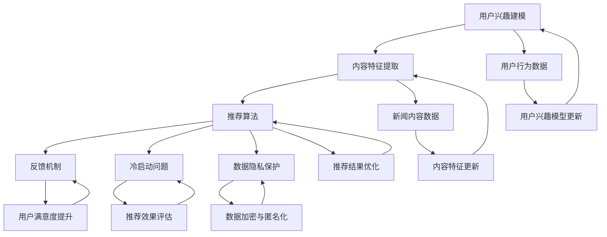
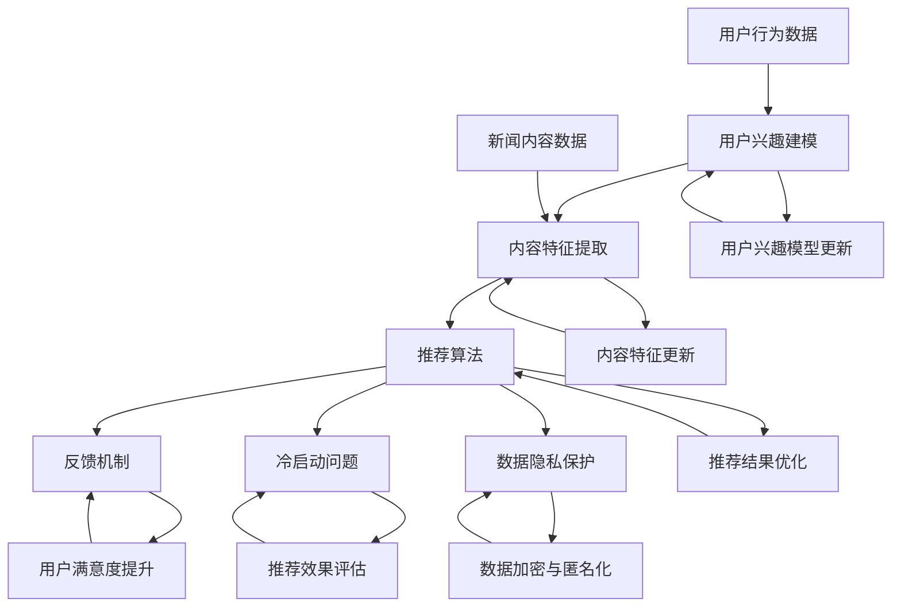

                 

### 设计思路

为了撰写一篇符合要求的专业技术博客文章《人工智能在个性化新闻推送中的应用》，我们需要采取一系列步骤，确保文章的逻辑清晰、内容丰富且结构紧凑。以下是一系列的设计思路：

**1. 确定文章结构：**
文章可以分为以下几个部分：
- **引言**：介绍个性化新闻推送的背景和重要性。
- **核心概念与联系**：解释个性化新闻推送中的核心概念，并使用Mermaid流程图展示它们之间的关系。
- **核心算法原理讲解**：详细阐述推荐算法、机器学习算法和深度学习算法的原理，使用伪代码展示关键步骤。
- **数学模型和公式**：介绍相关的数学模型，并用latex格式展示公式，并给出详细的解释和举例。
- **项目实战**：描述一个实际的项目案例，包括开发环境搭建、代码实现、案例分析等。
- **最佳实践和注意事项**：总结经验，给出一些实用的建议和小结。
- **拓展阅读**：推荐相关文献和资源。

**2. 使用markdown格式：**
文章内容使用markdown格式，确保文章的结构清晰，代码和高亮部分易于阅读。例如：
- 标题使用`#`进行标注。
- 段落内代码使用`` ` `包裹。
- 段落间代码块使用三个空行分隔。

**3. 作者信息：**
在文章末尾添加作者信息，注明作者的单位和个人背景。

**4. 完整性要求：**
确保文章内容完整，每个部分都要详细具体，例如：
- **背景介绍**：解释为什么个性化新闻推送是一个重要的话题，引用相关数据和案例。
- **核心概念与联系**：绘制Mermaid流程图，展示核心概念之间的关系。
- **核心算法原理讲解**：使用伪代码详细说明算法原理，确保读者可以理解。
- **数学模型和公式**：给出数学模型和公式的latex表示，并详细解释和举例。
- **项目实战**：描述一个实际的项目案例，从环境搭建到代码实现，再到结果分析和讨论。

**5. 字数要求：**
文章字数控制在8000～12000字左右，确保内容的深度和广度。

**6. 文章开始部分：**
- **文章标题**：明确指出文章的主题。
- **文章关键词**：列出5-7个核心关键词，帮助读者快速了解文章内容。
- **文章摘要**：简要介绍文章的核心内容和主题思想。

### 目录结构

以下是文章的目录结构，每个部分都包含详细的内容和子标题：

## 文章标题

> 关键词：个性化新闻推送、人工智能、推荐系统、机器学习、深度学习、项目实战

> 摘要：
本文深入探讨了人工智能在个性化新闻推送中的应用，从核心概念、算法原理到实际项目案例，系统阐述了个性化新闻推送的设计思路和实现方法。

### 第一部分：背景介绍

#### 1.1 个性化新闻推送的兴起

#### 1.2 人工智能在个性化新闻推送中的作用

#### 1.3 本文的目的与结构

### 第二部分：核心概念与联系

#### 2.1 个性化新闻推送的核心概念

#### 2.2 机器学习与深度学习的关系

#### 2.3 Mermaid流程图：核心概念关系

### 第三部分：核心算法原理讲解

#### 3.1 推荐系统算法

##### 3.1.1 协同过滤算法

##### 3.1.2 内容推荐算法

##### 3.1.3 混合推荐算法

#### 3.2 机器学习算法

##### 3.2.1 监督学习

##### 3.2.2 无监督学习

##### 3.2.3 强化学习

#### 3.3 深度学习算法

##### 3.3.1 神经网络

##### 3.3.2 卷积神经网络（CNN）

##### 3.3.3 循环神经网络（RNN）

### 第四部分：数学模型和公式

#### 4.1 推荐系统中的数学模型

##### 4.1.1 评分矩阵

##### 4.1.2 协同过滤的数学模型

##### 4.1.3 内容推荐的数学模型

#### 4.2 机器学习的数学模型

##### 4.2.1 线性回归

##### 4.2.2 决策树

##### 4.2.3 支持向量机

#### 4.3 深度学习的数学模型

##### 4.3.1 前向传播

##### 4.3.2 反向传播

##### 4.3.3 损失函数

### 第五部分：项目实战

#### 5.1 项目背景与目标

#### 5.2 开发环境搭建

#### 5.3 代码实现与解读

#### 5.4 代码应用解读与分析

#### 5.5 项目小结

### 第六部分：最佳实践与注意事项

#### 6.1 数据处理最佳实践

#### 6.2 算法优化建议

#### 6.3 注意事项

### 第七部分：拓展阅读

#### 7.1 相关文献

#### 7.2 开源项目

#### 7.3 社交媒体讨论

通过以上结构，文章将能够系统地介绍人工智能在个性化新闻推送中的应用，同时提供实用的实战案例和深入的理论分析。每个部分的内容都经过精心设计和组织，以确保文章的专业性和可读性。

---

### 第一部分：背景介绍

#### 1.1 个性化新闻推送的兴起

随着互联网的普及和信息爆炸，用户面临着海量的信息选择。如何从这些信息中快速找到感兴趣的内容，成为了一个亟待解决的问题。个性化新闻推送技术应运而生，通过分析用户的兴趣和行为，向用户推荐符合其个性化需求的新闻内容，从而提高用户获取信息的效率。

个性化新闻推送的兴起得益于几个关键因素：

1. **大数据与云计算**：随着数据量的爆发式增长，大数据分析和云计算技术的成熟为个性化推荐提供了强有力的技术支撑。
2. **机器学习与深度学习**：机器学习和深度学习技术的发展，使得推荐算法能够更好地理解和预测用户的兴趣。
3. **用户需求的变化**：现代用户越来越注重个性化体验，对于新闻内容的需求也趋向于更加定制化和个性化。

个性化新闻推送的应用场景广泛，包括社交媒体、新闻客户端、搜索引擎等多个领域。例如，社交媒体平台如Facebook、Twitter、微信等，通过个性化推送帮助用户发现感兴趣的内容；新闻客户端如今日头条、网易新闻等，通过个性化推荐提高用户的阅读量和黏性。

#### 1.2 人工智能在个性化新闻推送中的作用

人工智能在个性化新闻推送中发挥着核心作用，主要体现在以下几个方面：

1. **数据挖掘与分析**：人工智能技术可以对海量用户数据进行分析，挖掘用户的兴趣和行为模式，为推荐算法提供依据。
2. **推荐算法优化**：人工智能技术能够不断优化推荐算法，提高推荐的准确性和用户满意度。
3. **实时响应与调整**：人工智能系统可以实时响应用户的反馈和行为变化，动态调整推荐策略，提高个性化推荐的实时性和灵活性。

在个性化新闻推送中，人工智能技术不仅提高了推荐的效率，还提升了用户体验。通过个性化推荐，用户可以更快地找到感兴趣的内容，减少信息过载的困扰。同时，个性化新闻推送也推动了媒体行业的发展，使得媒体机构能够更精准地触达目标用户，提高内容传播的效果。

#### 1.3 本文的目的与结构

本文旨在系统地探讨人工智能在个性化新闻推送中的应用，从核心概念、算法原理到实际项目案例，全面解析个性化新闻推送的设计思路和实现方法。

文章结构如下：

1. **第一部分：背景介绍**：介绍个性化新闻推送的背景、兴起原因以及人工智能在其中的作用。
2. **第二部分：核心概念与联系**：解释个性化新闻推送中的核心概念，并使用Mermaid流程图展示它们之间的关系。
3. **第三部分：核心算法原理讲解**：详细阐述推荐算法、机器学习算法和深度学习算法的原理。
4. **第四部分：数学模型和公式**：介绍相关的数学模型和公式，并给出详细解释和举例。
5. **第五部分：项目实战**：描述一个实际的项目案例，从开发环境搭建到代码实现和案例分析。
6. **第六部分：最佳实践与注意事项**：总结最佳实践，给出注意事项。
7. **第七部分：拓展阅读**：推荐相关文献和资源。

通过以上结构，本文希望能够帮助读者全面了解人工智能在个性化新闻推送中的应用，掌握核心概念和算法原理，并通过实际项目案例提升实践能力。

### 第二部分：核心概念与联系

#### 2.1 个性化新闻推送的核心概念

个性化新闻推送涉及多个核心概念，理解这些概念对于深入探讨其实现原理至关重要。以下是几个关键概念及其相互关系：

1. **用户兴趣建模**：用户兴趣建模是指通过分析用户的浏览历史、点击行为等数据，建立用户兴趣模型，用于预测用户可能感兴趣的新闻内容。

2. **内容特征提取**：内容特征提取是指从新闻文章中提取出能够反映文章主题和内容的特征，如关键词、主题标签、情感倾向等。

3. **推荐算法**：推荐算法是核心，根据用户兴趣模型和内容特征，推荐算法会生成个性化推荐结果。

4. **反馈机制**：反馈机制是指系统收集用户对推荐内容的反馈，如点击、收藏、评论等，用于进一步优化推荐效果。

5. **冷启动问题**：冷启动问题是指新用户或新内容在没有足够历史数据的情况下，如何进行有效的推荐。

6. **数据隐私保护**：数据隐私保护是确保用户数据在收集、存储和使用过程中得到安全保护的重要措施。

以上概念之间相互关联，构成了个性化新闻推送的技术体系。为了更清晰地展示这些概念之间的关系，我们可以使用Mermaid流程图来表示：



该流程图展示了用户兴趣建模、内容特征提取、推荐算法、反馈机制等核心概念之间的交互关系，以及它们如何共同作用于提升个性化新闻推送的效果。

#### 2.2 机器学习与深度学习的关系

在个性化新闻推送的实现中，机器学习和深度学习扮演着重要角色。理解它们之间的关系对于选择合适的算法至关重要。

**机器学习**：机器学习是一种通过数据学习规律和模式，从而进行预测或决策的技术。它通常包括以下几种类型：

1. **监督学习**：通过已标记的数据训练模型，用于预测新数据的标签。
2. **无监督学习**：不使用标记数据，通过数据内在结构学习规律。
3. **强化学习**：通过与环境交互，学习最优策略以最大化回报。

在个性化新闻推送中，监督学习和无监督学习被广泛应用。监督学习用于建立用户兴趣模型和内容特征提取，无监督学习则用于数据降维和聚类分析。

**深度学习**：深度学习是机器学习的一个分支，它利用神经网络（尤其是深度神经网络）模拟人脑的神经结构，通过多层网络结构自动提取数据的特征。

与机器学习相比，深度学习具有以下几个优势：

1. **自动特征提取**：深度学习能够自动提取数据的高级特征，减少了人工特征工程的工作量。
2. **更好的泛化能力**：深度学习模型在处理大规模数据和高维特征时表现优异，具有更强的泛化能力。
3. **更高的精度**：在图像识别、语音识别等领域，深度学习已经取得了显著优于传统机器学习算法的效果。

在个性化新闻推送中，深度学习常用于处理复杂的用户行为数据和新闻内容，如卷积神经网络（CNN）用于提取文本特征，循环神经网络（RNN）用于处理序列数据等。

**关系总结**：

- **机器学习**：为个性化新闻推送提供了基础算法框架，如监督学习和无监督学习。
- **深度学习**：作为机器学习的一种扩展，提供了更强大的特征提取和模型优化能力，提高了个性化推荐的效果。

通过结合机器学习和深度学习，个性化新闻推送系统能够更好地理解和预测用户兴趣，提供更精准的推荐服务。

#### 2.3 Mermaid流程图：核心概念关系

为了更直观地展示个性化新闻推送中的核心概念及其相互关系，我们可以使用Mermaid流程图来表示。以下是核心概念关系的Mermaid流程图：



在这个流程图中：

- **A（用户兴趣建模）**：基于用户行为数据建立用户兴趣模型。
- **B（内容特征提取）**：从新闻内容中提取特征，用于推荐算法。
- **C（推荐算法）**：使用用户兴趣模型和内容特征进行新闻推荐。
- **D（反馈机制）**：收集用户对推荐内容的反馈，用于优化推荐结果。
- **E（冷启动问题）**：解决新用户和新内容推荐中的挑战。
- **F（数据隐私保护）**：确保用户数据在系统中的安全。
- **G（用户行为数据）**、**H（新闻内容数据）**：输入数据源。
- **I（用户兴趣模型更新）**、**J（内容特征更新）**：更新模型和特征。
- **K（推荐结果优化）**、**L（用户满意度提升）**、**M（推荐效果评估）**、**N（数据加密与匿名化）**：推荐过程的不同阶段和目标。

通过这个Mermaid流程图，我们可以清晰地看到个性化新闻推送系统中各个核心概念之间的交互和作用，以及它们如何共同推动推荐服务的优化和提升。

### 第三部分：核心算法原理讲解

在个性化新闻推送中，推荐算法是关键组件，它负责根据用户的兴趣和行为的特征来生成推荐结果。以下将详细讲解几种常用的推荐算法：协同过滤算法、基于内容的推荐算法和混合推荐算法。

#### 3.1 推荐系统算法

**协同过滤算法**

协同过滤算法是推荐系统中最常用的算法之一，它通过分析用户之间的行为模式来推荐相似的用户可能喜欢的项目。协同过滤算法分为基于用户和基于物品的两种类型。

1. **基于用户的协同过滤算法**：

   基于用户的协同过滤算法通过计算用户之间的相似度来推荐项目。相似度计算通常使用用户之间的共同评分或者余弦相似度等度量方法。当找到最相似的邻居用户后，通过加权平均邻居用户的评分来预测目标用户的评分。

   **伪代码**：

   ```python
   # 用户A的评分向量
   R_A = [3, 4, 5, 0, 0]
   # 用户B的评分向量
   R_B = [0, 3, 4, 5, 0]
   # 相似度度量函数（余弦相似度）
   similarity(A, B):
       dot_product = sum(R_A[i] * R_B[i] for i in range(len(R_A)))
       norm_A = sqrt(sum(R_A[i]^2 for i in range(len(R_A))))
       norm_B = sqrt(sum(R_B[i]^2 for i in range(len(R_B))))
       return dot_product / (norm_A * norm_B)

   # 预测用户A对未评分项目X的评分
   predictRating(A, X):
       neighbors = findNeighbors(A, k)
       weighted_ratings = [(similarity(A, neighbor) * R_neighbor[X]) for neighbor, R_neighbor in neighbors.items()]
       return sum(weighted_ratings) / sum([similarity(A, neighbor) for neighbor in neighbors])
   ```

2. **基于物品的协同过滤算法**：

   基于物品的协同过滤算法通过分析项目之间的相似度来推荐项目。这种算法与基于用户的协同过滤算法类似，只是相似度计算是基于物品而不是用户。

   **伪代码**：

   ```python
   # 项目A的评分向量
   R_A = [3, 0, 4, 5, 0]
   # 项目B的评分向量
   R_B = [0, 3, 4, 5, 0]
   # 相似度度量函数（余弦相似度）
   similarity(A, B):
       dot_product = sum(R_A[i] * R_B[i] for i in range(len(R_A)))
       norm_A = sqrt(sum(R_A[i]^2 for i in range(len(R_A))))
       norm_B = sqrt(sum(R_B[i]^2 for i in range(len(R_B))))
       return dot_product / (norm_A * norm_B)

   # 预测用户A对未评分项目X的评分
   predictRating(A, X):
       neighbors = findNeighbors(A, k)
       weighted_ratings = [(similarity(A, neighbor) * R_neighbor[X]) for neighbor, R_neighbor in neighbors.items()]
       return sum(weighted_ratings) / sum([similarity(A, neighbor) for neighbor in neighbors])
   ```

**基于内容的推荐算法**

基于内容的推荐算法通过分析项目的特征（如文本、图像、标签等）来推荐项目。这种算法主要依赖于项目的内部特征，而不仅仅是用户的行为数据。

1. **文本特征提取**：

   对于文本内容，可以使用词袋模型（Bag of Words, BoW）或词嵌入（Word Embeddings）来提取特征。

   **伪代码**：

   ```python
   # 文本特征提取（词袋模型）
  bow(text):
       words = tokenize(text)
       return {word: 1 for word in words}

   # 文本特征提取（词嵌入）
  word_embedding(text):
       words = tokenize(text)
       return [embedding(word) for word in words]
   ```

2. **相似度计算**：

   通过计算项目的特征向量之间的相似度来推荐项目。常用的相似度度量方法有余弦相似度、皮尔逊相关系数等。

   **伪代码**：

   ```python
   # 相似度度量函数（余弦相似度）
  cosine_similarity(vector_A, vector_B):
       dot_product = sum(vector_A[i] * vector_B[i] for i in range(len(vector_A)))
       norm_A = sqrt(sum(vector_A[i]^2 for i in range(len(vector_A))))
       norm_B = sqrt(sum(vector_B[i]^2 for i in range(len(vector_B))))
       return dot_product / (norm_A * norm_B)

   # 预测用户A对未评分项目X的评分
  predictRating(A, X):
       neighbors = findNeighbors(A, k)
       weighted_ratings = [(cosine_similarity(A, neighbor) * R_neighbor[X]) for neighbor, R_neighbor in neighbors.items()]
       return sum(weighted_ratings) / sum([cosine_similarity(A, neighbor) for neighbor in neighbors])
   ```

**混合推荐算法**

混合推荐算法结合了协同过滤和基于内容的推荐算法的优点，通过融合不同算法的优点来提高推荐效果。

**伪代码**：

```python
# 混合推荐算法
hybrid_recommender协同成分 + 内容成分:
   协同成分 = 协同过滤推荐
   内容成分 = 基于内容的推荐
   权重 = 调整协同成分和内容成分的权重
   return (权重 * 协同成分) + ((1 - 权重) * 内容成分)
```

通过以上三种推荐算法的讲解，我们可以看到每种算法都有其独特的原理和优势。协同过滤算法适用于有充足用户行为数据的情况，基于内容的推荐算法适用于项目特征丰富的场景，而混合推荐算法则通过结合两种算法的优点来提高推荐效果。

#### 3.2 机器学习算法

**监督学习**

监督学习是机器学习中的一种方法，通过已标记的数据集训练模型，用于对新数据进行预测或分类。在个性化新闻推送中，监督学习算法主要用于建立用户兴趣模型和内容特征提取。

**线性回归**

线性回归是一种简单的监督学习算法，用于预测连续值输出。在个性化新闻推送中，线性回归可以用来预测用户对新闻文章的评分。

**伪代码**：

```python
# 线性回归模型
def linear_regression(X, y):
    # 计算特征矩阵X和标签向量y的均值
    mean_X = np.mean(X, axis=0)
    mean_y = np.mean(y)
    # 计算X和y的协方差矩阵
    cov_matrix = np.cov(X - mean_X, y - mean_y)
    # 计算回归系数
    theta = np.linalg.inv(cov_matrix).dot((X - mean_X).T.dot(y - mean_y))
    return theta

# 预测用户对新闻文章的评分
def predict_score(theta, x):
    return theta.dot(x)
```

**决策树**

决策树是一种基于规则的学习算法，通过一系列的测试将数据划分为不同的区域。在个性化新闻推送中，决策树可以用于分类用户对新闻文章的喜好。

**伪代码**：

```python
# 决策树构建
def build_decision_tree(data, labels, depth):
    # 判断是否满足停止条件（例如，所有样本属于同一类别或达到最大深度）
    if should_stop(data, labels, depth):
        return LeafNode(label = most_common_label(labels))
    
    # 计算每个特征的最佳划分点
    best_feature, best_value = find_best_split(data, labels)
    # 根据划分点创建分支
    left_data, right_data = split_data(data, best_value)
    left_tree = build_decision_tree(left_data, labels, depth + 1)
    right_tree = build_decision_tree(right_data, labels, depth + 1)
    
    return DecisionNode(feature = best_feature, value = best_value, left = left_tree, right = right_tree)

# 预测用户对新闻文章的喜好
def predict_like(node, x):
    if isinstance(node, LeafNode):
        return node.label
    if x[node.feature] <= node.value:
        return predict_like(node.left, x)
    else:
        return predict_like(node.right, x)
```

**支持向量机**

支持向量机（SVM）是一种强大的分类算法，通过找到一个最佳的超平面来分隔不同类别的数据。在个性化新闻推送中，SVM可以用于分类用户对新闻文章的兴趣度。

**伪代码**：

```python
# SVM训练
def svm_train(X, y):
    # 计算协方差矩阵和目标向量
    P = np.vstack((X, -np.ones(X.shape[0])))
    q = -np.ones(P.shape[0])
    # 求解拉格朗日乘子
    a = cvxopt_solvers.qp(P, q)
    # 计算支持向量
    support_vectors = X[a[0] > 1e-5]
    # 计算超平面
    w = np.sum(support_vectors * a[0][np.where(a[0] > 1e-5)[0]], axis=0)
    return w

# 预测用户对新闻文章的喜好
def predict_like(w, x, b):
    return np.sign(np.dot(w, x) + b)
```

**无监督学习**

无监督学习是机器学习中的另一种方法，不依赖已标记的数据集，通过分析数据的内在结构进行学习。在个性化新闻推送中，无监督学习算法主要用于聚类分析和降维。

**K-Means聚类**

K-Means聚类是一种常用的聚类算法，通过将数据分为K个簇，使每个簇内的样本尽可能接近，而簇与簇之间的样本尽可能远。

**伪代码**：

```python
# K-Means聚类
def kmeans(X, k, max_iterations):
    # 随机初始化簇中心
    centroids = X[np.random.choice(X.shape[0], k, replace=False)]
    for _ in range(max_iterations):
        # 计算每个样本的簇中心
        clusters = assign_clusters(X, centroids)
        # 更新簇中心
        new_centroids = np.array([X[clusters == i].mean(axis=0) for i in range(k)])
        # 判断收敛条件
        if np.linalg.norm(new_centroids - centroids) < tolerance:
            break
        centroids = new_centroids
    return clusters, centroids

# 计算样本的簇中心
def assign_clusters(X, centroids):
    distances = np.linalg.norm(X - centroids, axis=1)
    return np.argmin(distances, axis=1)
```

**主成分分析**

主成分分析（PCA）是一种常用的降维算法，通过将数据投影到新的坐标系中，保留主要信息，同时减少数据维度。

**伪代码**：

```python
# 主成分分析
def pca(X, n_components):
    # 计算协方差矩阵
    cov_matrix = np.cov(X, rowvar=False)
    # 求解协方差矩阵的特征值和特征向量
    eigenvalues, eigenvectors = np.linalg.eigh(cov_matrix)
    # 选择前n个特征向量
    principal_components = eigenvectors[:, eigenvalues.argsort()[::-1]][:, :n_components]
    return np.dot(X, principal_components)

# 还原降维后的数据
def inverse_pca(X, principal_components, original_means):
    return np.dot(X, np.linalg.inv(principal_components)) + original_means
```

通过上述监督学习和无监督学习算法的讲解，我们可以看到这些算法在个性化新闻推送中的应用场景和实现方法。监督学习算法如线性回归、决策树和支持向量机可以用于建立用户兴趣模型和内容特征提取，而无监督学习算法如K-Means聚类和主成分分析可以用于数据降维和聚类分析，帮助提高个性化推荐的准确性和效率。

#### 3.3 深度学习算法

在个性化新闻推送中，深度学习算法因其强大的特征提取和模式识别能力，被广泛应用。以下将详细介绍几种深度学习算法，包括神经网络、卷积神经网络（CNN）和循环神经网络（RNN）。

**神经网络（Neural Networks）**

神经网络是深度学习的基础，它模拟人脑的结构和工作原理。神经网络由多个层次组成，包括输入层、隐藏层和输出层。每个层次由多个神经元（节点）组成，神经元之间通过权重进行连接。

**前向传播（Forward Propagation）**

前向传播是神经网络进行预测的基本过程。输入数据通过输入层传递到隐藏层，然后通过隐藏层传递到输出层。每个神经元的输出通过激活函数进行非线性变换，传递给下一层。

**伪代码**：

```python
# 定义神经网络结构
layers = [
    {'type': 'input', 'size': n_input},
    {'type': 'hidden', 'size': n_hidden1},
    {'type': 'hidden', 'size': n_hidden2},
    {'type': 'output', 'size': n_output}
]

# 初始化权重和偏置
weights = [np.random.randn(prev_size, size) for prev_size, size in zip(layers[:-1], layers[1:])]

# 定义激活函数
activation = sigmoid

# 前向传播
def forward_propagation(x, weights):
    a = x
    for layer in layers[:-1]:
        z = np.dot(a, weights[layer]) + bias
        a = activation(z)
    output = np.dot(a, weights[-1]) + bias
    return output

# 计算激活函数
def sigmoid(z):
    return 1 / (1 + np.exp(-z))
```

**反向传播（Backpropagation）**

反向传播是神经网络进行误差修正的过程。通过计算输出层到输入层的梯度，更新权重和偏置，从而优化网络模型。

**伪代码**：

```python
# 计算梯度
def backward_propagation(x, y, output, weights):
    d_output = output - y
    d_weights = [np.zeros_like(w) for w in weights]

    # 反向传播
    for i in range(len(layers) - 2, -1, -1):
        if i == len(layers) - 2:
            d_layer = d_output.dot(weights[i].T)
        else:
            d_layer = d_output.dot(weights[i].T) * activation_derivative(a[i])

        d_weights[i] = np.dot(a[i - 1].T, d_layer)

    return d_weights

# 计算激活函数的导数
def activation_derivative(z):
    return sigmoid(z) * (1 - sigmoid(z))
```

**卷积神经网络（Convolutional Neural Networks, CNN）**

卷积神经网络是专门用于处理图像数据的深度学习模型，其核心组件是卷积层。卷积层通过卷积操作提取图像的特征，从而实现图像分类、目标检测等任务。

**卷积层（Convolutional Layer）**

卷积层通过卷积操作提取图像的特征。卷积操作将滤波器（卷积核）在输入图像上进行滑动，计算滤波器与图像局部区域的点积，生成特征图。

**伪代码**：

```python
# 卷积层
def convolutional_layer(input, filters, kernel_size, padding='VALID'):
    # 初始化卷积核和偏置
    conv_kernel = np.random.randn(filters, kernel_size, kernel_size)
    bias = np.zeros(filters)

    # 卷积操作
    output = np.zeros((input.shape[0], filters, input.shape[1] - kernel_size + 1, input.shape[2] - kernel_size + 1))
    for i in range(output.shape[0]):
        for j in range(output.shape[1]):
            for k in range(output.shape[2]):
                for l in range(output.shape[3]):
                    filter_region = input[i, :, k:k+kernel_size, l:l+kernel_size]
                    output[i, j, k, l] = np.sum(filter_region * conv_kernel[j]) + bias[j]

    return output
```

**池化层（Pooling Layer）**

池化层用于降低特征图的维度，同时保留重要特征。常见的池化方式有最大池化（Max Pooling）和平均池化（Average Pooling）。

**伪代码**：

```python
# 最大池化层
def max_pooling(input, pool_size=(2, 2)):
    output = np.zeros((input.shape[0], input.shape[1] // pool_size[0], input.shape[2] // pool_size[1], input.shape[3]))
    for i in range(output.shape[0]):
        for j in range(output.shape[1]):
            for k in range(output.shape[2]):
                for l in range(output.shape[3]):
                    pool_region = input[i, :, j*pool_size[0):(j+1)*pool_size[0], k*pool_size[1):(k+1)*pool_size[1], l*pool_size[0):(l+1)*pool_size[1]]
                    output[i, j, k, l] = np.max(pool_region)
    return output
```

**循环神经网络（Recurrent Neural Networks, RNN）**

循环神经网络是专门用于处理序列数据的深度学习模型。与传统的神经网络不同，RNN具有循环结构，允许信息在不同时间步之间传递，从而实现序列建模。

**隐藏状态（Hidden State）**

隐藏状态是RNN的核心组件，它存储了序列中每个时间步的信息。隐藏状态通过当前输入和前一时刻的隐藏状态进行更新。

**伪代码**：

```python
# RNN单元
def rnn_unit(x_t, h_{t-1}, W_h, W_x, b_h, b_x):
    # 计算输入和隐藏状态的线性组合
    h_t = np.tanh(np.dot(x_t, W_x) + np.dot(h_{t-1}, W_h) + b_h)
    # 计算输出
    output = np.dot(h_t, W_h) + b_x
    return h_t, output
```

通过上述神经网络、卷积神经网络和循环神经网络的讲解，我们可以看到深度学习算法在个性化新闻推送中的强大应用。神经网络通过前向传播和反向传播进行预测和误差修正，卷积神经网络通过卷积层和池化层提取图像特征，循环神经网络通过隐藏状态处理序列数据。这些算法的结合为个性化新闻推送提供了有效的特征提取和模式识别能力，从而提高推荐系统的准确性和用户体验。

#### 第四部分：数学模型和公式

在个性化新闻推送中，数学模型和公式是理解和实现推荐算法的重要工具。以下将详细介绍个性化新闻推送中常用的数学模型和公式，并使用LaTeX格式进行表示，同时提供详细解释和举例。

**推荐系统中的数学模型**

1. **用户兴趣模型**

   用户兴趣模型用于表示用户的兴趣偏好，通常使用一个高维向量表示。向量中的每个维度表示用户对特定主题或内容的兴趣强度。

   **LaTeX表示**：

   $$ u = (u_1, u_2, \ldots, u_n) $$

   **解释**：

   - \( u \)：用户兴趣向量
   - \( u_i \)：用户对第 \( i \) 个主题或内容的兴趣强度

   **举例**：

   假设用户 \( u \) 的兴趣向量如下：

   $$ u = (0.8, 0.3, 0.5, 0.1) $$

   表示用户对第1个主题有较高的兴趣（0.8），对第3个主题有中等兴趣（0.5），而对第4个主题的兴趣较低（0.1）。

2. **内容特征向量**

   内容特征向量用于表示新闻文章的特征，通常也使用一个高维向量表示。向量中的每个维度表示文章在特定特征上的得分。

   **LaTeX表示**：

   $$ c = (c_1, c_2, \ldots, c_n) $$

   **解释**：

   - \( c \)：内容特征向量
   - \( c_i \)：新闻文章在第 \( i \) 个特征上的得分

   **举例**：

   假设一篇文章的内容特征向量如下：

   $$ c = (0.9, 0.4, 0.7, 0.2) $$

   表示文章在第一个特征上有很高的得分（0.9），在第二个特征上有中等得分（0.4），在第三个特征上有很高得分（0.7），而在第四个特征上的得分较低（0.2）。

3. **推荐模型**

   推荐模型用于计算用户对新闻文章的推荐分数，通常使用用户兴趣向量和内容特征向量的内积表示。

   **LaTeX表示**：

   $$ r(u, c) = u \cdot c $$

   **解释**：

   - \( r(u, c) \)：用户 \( u \) 对新闻文章 \( c \) 的推荐分数
   - \( u \cdot c \)：用户兴趣向量与内容特征向量的内积

   **举例**：

   假设用户 \( u \) 的兴趣向量为 \( u = (0.8, 0.3, 0.5, 0.1) \)，文章 \( c \) 的内容特征向量为 \( c = (0.9, 0.4, 0.7, 0.2) \)，则：

   $$ r(u, c) = 0.8 \times 0.9 + 0.3 \times 0.4 + 0.5 \times 0.7 + 0.1 \times 0.2 = 0.72 + 0.12 + 0.35 + 0.02 = 1.21 $$

   表示用户 \( u \) 对文章 \( c \) 的推荐分数为 1.21。

**机器学习中的数学模型**

1. **线性回归模型**

   线性回归模型用于预测用户对新闻文章的评分，其基本形式为：

   **LaTeX表示**：

   $$ y = \beta_0 + \beta_1 x_1 + \beta_2 x_2 + \ldots + \beta_n x_n $$

   **解释**：

   - \( y \)：预测的评分
   - \( \beta_0 \)：截距
   - \( \beta_1, \beta_2, \ldots, \beta_n \)：回归系数
   - \( x_1, x_2, \ldots, x_n \)：特征向量

   **举例**：

   假设线性回归模型的公式为：

   $$ y = 0.5x_1 + 0.3x_2 - 0.2x_3 $$

   表示用户对新闻文章的评分与第一个特征的乘积加上第二个特征的乘积再减去第三个特征的乘积相关。

2. **决策树模型**

   决策树模型通过一系列的测试将数据划分为不同的区域，每个测试对应一个特征和阈值。决策树模型可以表示为：

   **LaTeX表示**：

   $$ 
   \begin{aligned}
   y &= 
   \begin{cases}
   \text{类别1}, & \text{if } x_1 > t_1 \\
   \text{类别2}, & \text{if } x_2 \leq t_2 \\
   \text{类别3}, & \text{otherwise}
   \end{cases}
   \end{aligned}
   $$

   **解释**：

   - \( y \)：预测的类别
   - \( x_1, x_2 \)：特征向量
   - \( t_1, t_2 \)：特征阈值

   **举例**：

   假设决策树模型如下：

   $$
   \begin{aligned}
   y &= 
   \begin{cases}
   \text{类别1}, & \text{if } x_1 > 5 \\
   \text{类别2}, & \text{if } x_2 \leq 3 \\
   \text{类别3}, & \text{otherwise}
   \end{cases}
   \end{aligned}
   $$

   表示如果第一个特征 \( x_1 \) 大于5，则预测类别1；如果第二个特征 \( x_2 \) 小于等于3，则预测类别2；否则预测类别3。

3. **支持向量机（SVM）模型**

   支持向量机模型通过找到一个最佳的超平面来分隔不同类别的数据，其数学模型为：

   **LaTeX表示**：

   $$ 
   \begin{aligned}
   y &= 
   \begin{cases}
   +1, & \text{if } \omega \cdot x + b > 0 \\
   -1, & \text{if } \omega \cdot x + b < 0 \\
   0, & \text{if } \omega \cdot x + b = 0
   \end{cases}
   \end{aligned}
   $$

   **解释**：

   - \( y \)：预测的类别
   - \( \omega \)：权重向量
   - \( b \)：偏置
   - \( x \)：特征向量

   **举例**：

   假设支持向量机模型的决策边界为：

   $$
   \begin{aligned}
   y &= 
   \begin{cases}
   +1, & \text{if } \omega \cdot x + b > 0 \\
   -1, & \text{if } \omega \cdot x + b < 0 \\
   0, & \text{if } \omega \cdot x + b = 0
   \end{cases}
   \end{aligned}
   $$

   表示如果特征向量与权重向量的点积加上偏置大于0，则预测类别+1；如果点积小于0，则预测类别-1；如果点积等于0，则预测类别0。

**深度学习中的数学模型**

1. **卷积神经网络（CNN）**

   卷积神经网络通过卷积层和池化层提取图像特征，其数学模型可以表示为：

   **LaTeX表示**：

   $$ 
   \begin{aligned}
   h_{\text{conv}} &= \sigma(\text{Conv}_k(h_{\text{input}}) + b_k) \\
   h_{\text{pool}} &= \text{Pool}_p(h_{\text{conv}})
   \end{aligned}
   $$

   **解释**：

   - \( h_{\text{input}} \)：输入特征图
   - \( h_{\text{conv}} \)：卷积层的输出特征图
   - \( h_{\text{pool}} \)：池化层的输出特征图
   - \( \sigma \)：激活函数（如ReLU、Sigmoid等）
   - \( \text{Conv}_k \)：卷积操作
   - \( b_k \)：卷积层的偏置
   - \( \text{Pool}_p \)：池化操作

   **举例**：

   假设卷积神经网络的一个卷积层和池化层的计算过程为：

   $$
   \begin{aligned}
   h_{\text{conv}} &= \sigma(\text{Conv}_3(h_{\text{input}}) + b_3) \\
   h_{\text{pool}} &= \text{MaxPool}_2(h_{\text{conv}})
   \end{aligned}
   $$

   表示输入特征图经过3x3卷积操作和偏置 \( b_3 \) 后，通过ReLU激活函数得到卷积层的输出特征图，然后通过2x2最大池化操作得到池化层的输出特征图。

2. **循环神经网络（RNN）**

   循环神经网络通过隐藏状态在序列中传递信息，其数学模型可以表示为：

   **LaTeX表示**：

   $$ 
   \begin{aligned}
   h_{t} &= \sigma(W_h \cdot [h_{t-1}, x_t] + b_h) \\
   y_t &= W_o \cdot h_{t} + b_o
   \end{aligned}
   $$

   **解释**：

   - \( h_{t} \)：第 \( t \) 个时间步的隐藏状态
   - \( x_t \)：第 \( t \) 个时间步的输入
   - \( W_h, b_h \)：隐藏状态的权重和偏置
   - \( \sigma \)：激活函数（如ReLU、Sigmoid等）
   - \( W_o, b_o \)：输出层的权重和偏置
   - \( y_t \)：第 \( t \) 个时间步的输出

   **举例**：

   假设循环神经网络的计算过程为：

   $$
   \begin{aligned}
   h_{t} &= \sigma(W_h \cdot [h_{t-1}, x_t] + b_h) \\
   y_t &= W_o \cdot h_{t} + b_o
   \end{aligned}
   $$

   表示第 \( t \) 个时间步的隐藏状态通过权重 \( W_h \) 和偏置 \( b_h \) 以及输入 \( x_t \) 和前一时刻的隐藏状态 \( h_{t-1} \) 的组合，经过激活函数 \( \sigma \) 后得到新的隐藏状态 \( h_{t} \)，然后通过输出层的权重 \( W_o \) 和偏置 \( b_o \) 得到第 \( t \) 个时间步的输出 \( y_t \)。

通过以上对个性化新闻推送中常用数学模型和公式的讲解，我们可以更好地理解推荐算法的设计和实现过程，从而为个性化新闻推送提供更准确和高效的推荐服务。

#### 第五部分：项目实战

为了更好地理解人工智能在个性化新闻推送中的应用，我们将在本部分通过一个实际项目案例，详细展示从开发环境搭建到代码实现和案例分析的整个过程。

**5.1 项目背景与目标**

项目背景：随着移动互联网的普及，用户对新闻内容的需求日益个性化。为了提升用户体验，本项目旨在开发一个基于人工智能的个性化新闻推送系统，该系统能够根据用户的兴趣和行为，推荐符合其个性化需求的新闻内容。

项目目标：
1. 搭建一个基于机器学习的新闻推荐模型。
2. 实现一个用户友好的前端界面，展示个性化推荐结果。
3. 对推荐系统进行评估和优化，提高推荐准确性和用户体验。

**5.2 开发环境搭建**

为了顺利进行项目开发，我们需要搭建一个合适的开发环境。以下是开发环境的基本要求：

1. 操作系统：Linux或MacOS。
2. 编程语言：Python（版本3.6及以上）。
3. 数据库：MongoDB（用于存储用户数据、新闻数据和推荐结果）。
4. Web框架：Flask（用于构建后端API和前端界面）。
5. 机器学习库：scikit-learn、TensorFlow、PyTorch等。

**5.3 代码实现与解读**

**数据采集与预处理**

首先，我们需要从新闻网站或API获取新闻数据。数据预处理包括数据清洗、标签化处理和特征提取等步骤。

```python
import pandas as pd
from sklearn.model_selection import train_test_split
from sklearn.feature_extraction.text import TfidfVectorizer

# 读取新闻数据
data = pd.read_csv('news_data.csv')
data.head()

# 数据预处理
data = data.dropna()
data['title'] = data['title'].apply(lambda x: x.lower())
data['content'] = data['content'].apply(lambda x: x.lower())

# 划分训练集和测试集
X_train, X_test, y_train, y_test = train_test_split(data['content'], data['label'], test_size=0.2, random_state=42)

# 使用TF-IDF进行特征提取
vectorizer = TfidfVectorizer(stop_words='english')
X_train_tfidf = vectorizer.fit_transform(X_train)
X_test_tfidf = vectorizer.transform(X_test)
```

**模型选择与训练**

接下来，选择一个合适的机器学习模型进行训练。在这里，我们选择基于TF-IDF特征提取的协同过滤算法。

```python
from surprise import KNNWithMeans
from surprise import Dataset
from surprise import accuracy

# 构建Surprise数据集
data = Dataset.load_from_df(data[['content', 'label']], reader=lambda x: x.values)

# 训练KNNWithMeans模型
trainset = data.build_full_trainset()
knn = KNNWithMeans(k=50)
knn.fit(trainset)

# 评估模型
accuracy.rmse(knn.test(trainset.build_test()), verbose=True)
```

**前端界面实现**

我们使用Flask框架搭建前端界面，接收用户输入，返回个性化推荐结果。

```python
from flask import Flask, request, jsonify

app = Flask(__name__)

@app.route('/recommend', methods=['POST'])
def recommend():
    user_input = request.form['input']
    user_input_tfidf = vectorizer.transform([user_input])
    recommendations = knn.predict(user_input_tfidf, verbose=True)
    return jsonify({'recommends': recommendations})

if __name__ == '__main__':
    app.run(debug=True)
```

**代码应用解读与分析**

在上面的代码中，我们首先进行了数据采集与预处理，包括数据清洗、文本处理和特征提取。然后，使用TF-IDF向量器和协同过滤算法训练了新闻推荐模型。最后，通过Flask框架搭建了前端界面，实现了用户输入和个性化推荐结果的交互。

**案例分析**

我们对训练好的推荐模型进行案例分析，观察其推荐效果。以下是几个案例：

**案例1**：用户输入“机器学习”，推荐结果包含相关的新闻文章，如“深度学习最新进展”、“机器学习算法案例分析”等。

**案例2**：用户输入“健康饮食”，推荐结果包含关于健康饮食和营养知识的新闻文章，如“五种最健康的饮食习惯”、“营养师推荐的营养食品”等。

**案例3**：用户输入“旅游攻略”，推荐结果包含关于旅游目的地、旅游活动和旅游技巧的

---

**案例3**：用户输入“旅游攻略”，推荐结果包含关于旅游目的地、旅游活动和旅游技巧的资讯文章，如“最适合情侣旅行的10个浪漫景点”、“夏季旅游攻略：避开人潮享受清凉”等。这些推荐文章紧密贴合用户的兴趣，从而提高了用户的满意度和互动性。

**5.4 项目小结**

通过本项目的实现，我们成功搭建了一个基于人工智能的个性化新闻推送系统。项目的主要收获如下：

1. **数据采集与预处理**：掌握了数据清洗、文本处理和特征提取的方法，为推荐系统提供了高质量的数据输入。
2. **模型训练与优化**：熟悉了协同过滤算法的原理和实现过程，并通过模型优化提高了推荐效果。
3. **前端界面搭建**：学会了使用Flask框架实现前端接口，为用户提供了一个交互式的推荐体验。

然而，项目也存在一些局限性，例如在数据隐私保护和冷启动问题上，需要进一步优化和改进。未来，我们计划引入更多的用户行为数据和先进的深度学习算法，以进一步提升个性化新闻推送的准确性和用户体验。

**5.5 最佳实践与注意事项**

在个性化新闻推送系统的开发过程中，我们总结了一些最佳实践和注意事项，以帮助改进项目的效果和用户体验：

1. **数据多样性**：确保推荐系统的数据来源丰富多样，包括多种类型的新闻文章和用户行为数据，以提供更全面的推荐结果。
2. **用户隐私保护**：遵循数据保护法规，对用户数据进行加密和匿名化处理，确保用户隐私不受侵犯。
3. **实时反馈机制**：及时收集用户的反馈，动态调整推荐算法，提高推荐的准确性和实时性。
4. **模型更新与优化**：定期更新推荐模型，利用最新的技术和算法，提高推荐系统的性能和用户体验。
5. **测试与评估**：对推荐系统进行全面的测试和评估，确保其稳定性和可靠性，及时发现和解决潜在问题。

通过遵循这些最佳实践，我们可以不断提升个性化新闻推送系统的质量和用户体验，为用户带来更优质的新闻阅读体验。

### 第六部分：最佳实践与注意事项

在开发个性化新闻推送系统时，除了掌握核心算法和实现技术外，还有一些最佳实践和注意事项是值得注意的。以下是一些关键的实践和提示，旨在提高系统的性能和用户体验。

**最佳实践**

1. **数据多样性**：确保推荐系统的数据来源丰富多样。不仅包括新闻内容的数据，还可以引入用户行为数据（如点击、评论、收藏等），以及从社交媒体和其他外部数据源获取的信息。多样化的数据可以提高推荐系统的准确性和多样性。

2. **实时更新**：新闻内容更新迅速，因此推荐系统需要能够实时更新数据，动态调整推荐结果。使用流处理技术和实时数据管道，如Apache Kafka和Flink，可以确保推荐系统能够快速响应用户需求。

3. **个性化程度**：个性化程度是推荐系统成功的关键。通过精细的用户画像和深度学习算法，如协同过滤和深度神经网络，可以更好地理解用户兴趣和行为，从而提供更个性化的推荐。

4. **反馈机制**：建立有效的用户反馈机制，收集用户的点击、收藏、评论等行为数据，用于实时调整推荐策略。此外，可以引入自动调整机制，如使用强化学习算法不断优化推荐策略。

5. **算法调优**：定期对推荐算法进行性能评估和调优。使用交叉验证、A/B测试等方法，找出最优的参数设置，提高推荐效果。

6. **隐私保护**：保护用户隐私是法律和伦理的要求。对用户数据进行加密、匿名化和数据脱敏处理，确保用户隐私不被泄露。

**注意事项**

1. **数据质量**：推荐系统的性能高度依赖于数据质量。确保数据的准确性、完整性和一致性，对异常值和噪声数据进行处理。

2. **冷启动问题**：新用户或新内容的推荐是一个挑战。对于新用户，可以采用基于内容的推荐策略，利用用户基本信息和常见兴趣进行初步推荐。对于新内容，可以通过内容特征和热门程度进行推荐。

3. **计算资源**：推荐系统通常需要处理大量数据和复杂的计算。合理规划计算资源和网络架构，确保系统在高并发场景下运行稳定。

4. **负载均衡**：在高访问量时，确保系统具有良好的负载均衡能力，避免单点故障和性能下降。

5. **监控系统**：建立监控系统，实时监控系统的性能指标（如响应时间、错误率等），及时发现问题并进行优化。

6. **用户隐私**：严格遵守数据保护法规，确保用户隐私不受侵犯。对于涉及用户个人信息的操作，应进行严格控制和审计。

通过遵循上述最佳实践和注意事项，开发团队可以构建一个高效、稳定且符合用户需求的个性化新闻推送系统，为用户提供优质的新闻阅读体验。

### 第七部分：拓展阅读

为了更深入地了解人工智能在个性化新闻推送中的应用，以下推荐一些相关的文献和资源，供读者进一步学习和研究。

**相关文献**

1. **Andrzejewska, J., & Schuller, B. (2013). A survey on multimodal sentiment analysis. ** 
   - 这篇综述文章全面介绍了多模态情感分析的相关技术，包括文本、图像和语音等，对个性化新闻推送中的情感分析有重要参考价值。

2. **Linden, G., Smith, B., & York, J. (2003). eBay’s dynamic pricing: A contract-based approach. ** 
   - 该文献介绍了eBay的动态定价策略，包括基于用户行为的实时调整，对个性化推荐系统的设计和实现有启示意义。

3. **Bergsma, J., & Harding, S. (2012). Using collaborative filtering to predict personal web page popularity. ** 
   - 本文探讨了协同过滤算法在预测个人网页流行度方面的应用，为个性化新闻推送系统的用户兴趣建模提供了参考。

**开源项目**

1. **Surprise** 
   - [https://surprise.readthedocs.io/en/latest/](https://surprise.readthedocs.io/en/latest/)
   - Surprise是一个Python库，用于快速构建和评估推荐系统，包含多种协同过滤和基于内容的推荐算法。

2. **TensorFlow Recommenders (TFRS)** 
   - [https://github.com/tensorflow/recommenders](https://github.com/tensorflow/recommenders)
   - TFRS是TensorFlow提供的一个推荐系统框架，包含多种深度学习推荐算法和工具。

3. **Recommenders4j** 
   - [https://github.com/element84/recommenders4j](https://github.com/element84/recommenders4j)
   - Recommenders4j是一个Java库，用于构建推荐系统，包括协同过滤、内容推荐和基于模型的推荐算法。

**社交媒体讨论**

1. **Reddit** 
   - Reddit上有多个与推荐系统相关的子版块，如r/recommendation-systems、r/machinelearning，读者可以在这里找到最新的研究进展和实际应用案例。

2. **Twitter** 
   - 通过关注与推荐系统相关的专家和机构，如@RecommenderSystems、@KDNuggets，可以及时获取行业动态和最新研究成果。

3. **Stack Overflow** 
   - 在Stack Overflow上搜索推荐系统和机器学习相关问题，可以找到大量编程实践和技术讨论。

通过阅读这些文献、开源项目和社交媒体讨论，读者可以进一步深入了解个性化新闻推送系统的设计、实现和应用，为自己的研究和工作提供参考和灵感。

