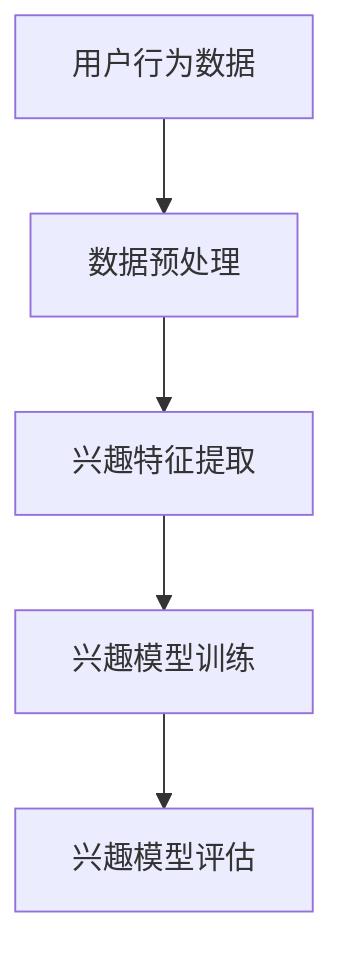
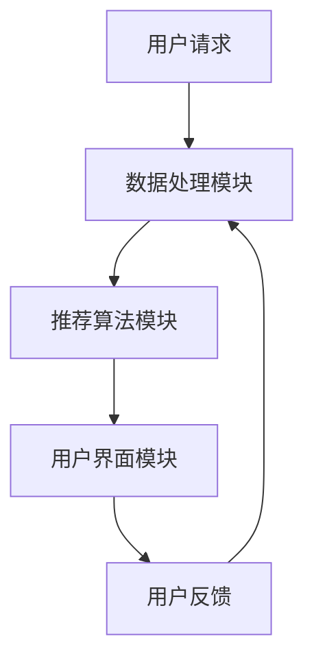

                 

## 文章标题

# 人工智能在个性化新闻聚合中的应用

> 关键词：人工智能，个性化新闻聚合，用户兴趣模型，推荐算法，系统架构

> 摘要：本文将深入探讨人工智能在个性化新闻聚合中的应用，包括用户兴趣模型的建立、推荐算法的实现、系统架构的设计以及实战案例的分析。通过逐步分析推理，本文旨在揭示人工智能技术在提升新闻推荐质量和用户体验方面的巨大潜力。

## 目录

1. **背景与概念介绍**
   1.1 个性化新闻聚合概述
   1.2 人工智能基础
2. **个性化新闻聚合技术**
   2.1 用户兴趣模型
   2.2 新闻内容推荐算法
   2.3 个性化新闻聚合系统架构
3. **实战案例**
   3.1 基于内容理解的个性化新闻聚合系统
   3.2 基于协同过滤的个性化新闻聚合系统
   3.3 基于深度学习的个性化新闻聚合系统
   3.4 多模态个性化新闻聚合系统
4. **总结与展望**
   4.1 个性化新闻聚合技术的现状与趋势
   4.2 未来发展方向
   4.3 总结与展望

## 文章正文

### 1. 背景与概念介绍

#### 1.1 个性化新闻聚合概述

个性化新闻聚合是指利用人工智能技术，根据用户的兴趣和行为，为其推荐个性化的新闻内容。随着互联网的普及和信息爆炸，用户面临的信息选择变得更加复杂。传统的新闻推送方式难以满足用户日益个性化的需求，个性化新闻聚合系统因此应运而生。

#### 1.2 人工智能基础

人工智能（Artificial Intelligence，AI）是计算机科学的一个分支，旨在使计算机模拟人类智能行为。机器学习（Machine Learning，ML）和深度学习（Deep Learning，DL）是人工智能的两个重要领域。它们通过训练模型，让计算机能够从数据中自动学习，并做出预测和决策。

### 2. 个性化新闻聚合技术

#### 2.1 用户兴趣模型

用户兴趣模型是个性化新闻聚合的核心。它通过分析用户的历史行为、兴趣偏好和反馈，提取用户兴趣特征，构建用户兴趣模型。以下是一个简单的用户兴趣特征提取流程：



#### 2.2 新闻内容推荐算法

新闻内容推荐算法负责根据用户兴趣模型，为用户推荐合适的新闻内容。常见的推荐算法包括协同过滤推荐算法和内容推荐算法。以下是协同过滤推荐算法的伪代码：

```python
# 协同过滤推荐算法伪代码

def collaborative_filtering(user_profile, news_articles):
    similar_users = find_similar_users(user_profile)
    recommended_articles = []
    for article in news_articles:
        if article in user_profile:
            continue
        user_similarity_score = calculate_similarity_score(user_profile, similar_users)
        recommended_articles.append((article, user_similarity_score))
    return sorted(recommended_articles, key=lambda x: x[1], reverse=True)
```

#### 2.3 个性化新闻聚合系统架构

个性化新闻聚合系统通常包括数据处理模块、推荐算法模块和用户界面模块。以下是系统架构的Mermaid流程图：



### 3. 实战案例

在本节中，我们将探讨三个实战案例：基于内容理解的个性化新闻聚合系统、基于协同过滤的个性化新闻聚合系统和基于深度学习的个性化新闻聚合系统。

#### 3.1 基于内容理解的个性化新闻聚合系统

基于内容理解的个性化新闻聚合系统通过分析新闻内容本身，提取关键词、主题和情感，为用户推荐相关新闻。以下是系统设计与实现的关键步骤：

1. **系统需求分析**：分析用户需求，确定新闻内容推荐的关键因素。
2. **数据收集与处理**：收集大量新闻数据，进行数据清洗和预处理。
3. **内容特征提取**：使用自然语言处理技术，提取新闻内容的关键词、主题和情感。
4. **模型训练与评估**：训练内容理解模型，并进行评估和优化。
5. **系统部署与优化**：部署系统，并根据用户反馈进行持续优化。

#### 3.2 基于协同过滤的个性化新闻聚合系统

基于协同过滤的个性化新闻聚合系统通过分析用户的行为数据，找出与用户相似的其他用户，然后根据相似用户的偏好推荐新闻。以下是系统设计与实现的关键步骤：

1. **系统需求分析**：分析用户需求，确定协同过滤推荐算法的关键参数。
2. **用户行为数据收集与处理**：收集用户的行为数据，进行数据清洗和预处理。
3. **用户兴趣模型构建**：构建用户兴趣模型，提取用户兴趣特征。
4. **推荐算法实现**：实现协同过滤推荐算法，为用户推荐新闻。
5. **系统部署与优化**：部署系统，并根据用户反馈进行持续优化。

#### 3.3 基于深度学习的个性化新闻聚合系统

基于深度学习的个性化新闻聚合系统通过训练深度神经网络模型，自动提取用户兴趣特征和新闻内容特征，实现更精准的推荐。以下是系统设计与实现的关键步骤：

1. **系统需求分析**：分析用户需求，确定深度学习模型的关键参数。
2. **数据收集与处理**：收集大量新闻数据，进行数据清洗和预处理。
3. **特征提取与融合**：使用深度学习技术，提取用户兴趣特征和新闻内容特征。
4. **模型训练与评估**：训练深度学习模型，并进行评估和优化。
5. **系统部署与优化**：部署系统，并根据用户反馈进行持续优化。

#### 3.4 多模态个性化新闻聚合系统

多模态个性化新闻聚合系统结合文本、图像和视频等多模态信息，为用户提供更丰富的新闻推荐。以下是系统设计与实现的关键步骤：

1. **系统需求分析**：分析用户需求，确定多模态信息处理的关键技术。
2. **多模态数据收集与处理**：收集文本、图像和视频等多模态数据，进行数据清洗和预处理。
3. **特征提取与融合**：使用多模态学习技术，提取文本、图像和视频的特征，并融合为统一的特征向量。
4. **模型训练与评估**：训练多模态深度学习模型，并进行评估和优化。
5. **系统部署与优化**：部署系统，并根据用户反馈进行持续优化。

### 4. 总结与展望

个性化新闻聚合技术已经取得了显著的成果，但仍然存在一些挑战。未来，随着人工智能技术的不断发展，个性化新闻聚合系统将变得更加智能化和个性化。同时，多模态信息处理、深度学习和强化学习等技术将进一步推动个性化新闻聚合系统的发展。

## 附录

### A.1 常用机器学习库简介

- Scikit-learn：Python中的机器学习库，提供各种分类、回归、聚类等算法。
- TensorFlow：谷歌开发的深度学习框架，支持多种神经网络架构。
- PyTorch：Facebook开发的深度学习框架，具有灵活性和高效性。

### A.2 个性化新闻聚合系统开发资源

- [新闻推荐系统开源项目](https://github.com/search?q=news+recommender+system)
- [自然语言处理资源](https://github.com/search?q=natural+language+processing)
- [深度学习教程](https://www.deeplearning.net/)

## 作者信息

作者：AI天才研究院/AI Genius Institute & 禅与计算机程序设计艺术 /Zen And The Art of Computer Programming

## 文章正文

### 1. 背景与概念介绍

#### 1.1 个性化新闻聚合概述

个性化新闻聚合是指利用人工智能技术，根据用户的兴趣和行为，为其推荐个性化的新闻内容。随着互联网的普及和信息爆炸，用户面临的信息选择变得更加复杂。传统的新闻推送方式难以满足用户日益个性化的需求，个性化新闻聚合系统因此应运而生。

#### 1.2 人工智能基础

人工智能（Artificial Intelligence，AI）是计算机科学的一个分支，旨在使计算机模拟人类智能行为。机器学习（Machine Learning，ML）和深度学习（Deep Learning，DL）是人工智能的两个重要领域。它们通过训练模型，让计算机能够从数据中自动学习，并做出预测和决策。

### 2. 个性化新闻聚合技术

#### 2.1 用户兴趣模型

用户兴趣模型是个性化新闻聚合的核心。它通过分析用户的历史行为、兴趣偏好和反馈，提取用户兴趣特征，构建用户兴趣模型。以下是一个简单的用户兴趣特征提取流程：


#### 2.2 新闻内容推荐算法

新闻内容推荐算法负责根据用户兴趣模型，为用户推荐合适的新闻内容。常见的推荐算法包括协同过滤推荐算法和内容推荐算法。以下是协同过滤推荐算法的伪代码：

```python
# 协同过滤推荐算法伪代码

def collaborative_filtering(user_profile, news_articles):
    similar_users = find_similar_users(user_profile)
    recommended_articles = []
    for article in news_articles:
        if article in user_profile:
            continue
        user_similarity_score = calculate_similarity_score(user_profile, similar_users)
        recommended_articles.append((article, user_similarity_score))
    return sorted(recommended_articles, key=lambda x: x[1], reverse=True)
```

#### 2.3 个性化新闻聚合系统架构

个性化新闻聚合系统通常包括数据处理模块、推荐算法模块和用户界面模块。以下是系统架构的Mermaid流程图：


### 3. 实战案例

在本节中，我们将探讨三个实战案例：基于内容理解的个性化新闻聚合系统、基于协同过滤的个性化新闻聚合系统和基于深度学习的个性化新闻聚合系统。

#### 3.1 基于内容理解的个性化新闻聚合系统

基于内容理解的个性化新闻聚合系统通过分析新闻内容本身，提取关键词、主题和情感，为用户推荐相关新闻。以下是系统设计与实现的关键步骤：

1. **系统需求分析**：分析用户需求，确定新闻内容推荐的关键因素。
2. **数据收集与处理**：收集大量新闻数据，进行数据清洗和预处理。
3. **内容特征提取**：使用自然语言处理技术，提取新闻内容的关键词、主题和情感。
4. **模型训练与评估**：训练内容理解模型，并进行评估和优化。
5. **系统部署与优化**：部署系统，并根据用户反馈进行持续优化。

#### 3.2 基于协同过滤的个性化新闻聚合系统

基于协同过滤的个性化新闻聚合系统通过分析用户的行为数据，找出与用户相似的其他用户，然后根据相似用户的偏好推荐新闻。以下是系统设计与实现的关键步骤：

1. **系统需求分析**：分析用户需求，确定协同过滤推荐算法的关键参数。
2. **用户行为数据收集与处理**：收集用户的行为数据，进行数据清洗和预处理。
3. **用户兴趣模型构建**：构建用户兴趣模型，提取用户兴趣特征。
4. **推荐算法实现**：实现协同过滤推荐算法，为用户推荐新闻。
5. **系统部署与优化**：部署系统，并根据用户反馈进行持续优化。

#### 3.3 基于深度学习的个性化新闻聚合系统

基于深度学习的个性化新闻聚合系统通过训练深度神经网络模型，自动提取用户兴趣特征和新闻内容特征，实现更精准的推荐。以下是系统设计与实现的关键步骤：

1. **系统需求分析**：分析用户需求，确定深度学习模型的关键参数。
2. **数据收集与处理**：收集大量新闻数据，进行数据清洗和预处理。
3. **特征提取与融合**：使用深度学习技术，提取用户兴趣特征和新闻内容特征。
4. **模型训练与评估**：训练深度学习模型，并进行评估和优化。
5. **系统部署与优化**：部署系统，并根据用户反馈进行持续优化。

#### 3.4 多模态个性化新闻聚合系统

多模态个性化新闻聚合系统结合文本、图像和视频等多模态信息，为用户提供更丰富的新闻推荐。以下是系统设计与实现的关键步骤：

1. **系统需求分析**：分析用户需求，确定多模态信息处理的关键技术。
2. **多模态数据收集与处理**：收集文本、图像和视频等多模态数据，进行数据清洗和预处理。
3. **特征提取与融合**：使用多模态学习技术，提取文本、图像和视频的特征，并融合为统一的特征向量。
4. **模型训练与评估**：训练多模态深度学习模型，并进行评估和优化。
5. **系统部署与优化**：部署系统，并根据用户反馈进行持续优化。

### 4. 总结与展望

个性化新闻聚合技术已经取得了显著的成果，但仍然存在一些挑战。未来，随着人工智能技术的不断发展，个性化新闻聚合系统将变得更加智能化和个性化。同时，多模态信息处理、深度学习和强化学习等技术将进一步推动个性化新闻聚合系统的发展。

### 5. 附录

#### 5.1 常用机器学习库简介

- Scikit-learn：Python中的机器学习库，提供各种分类、回归、聚类等算法。
- TensorFlow：谷歌开发的深度学习框架，支持多种神经网络架构。
- PyTorch：Facebook开发的深度学习框架，具有灵活性和高效性。

#### 5.2 个性化新闻聚合系统开发资源

- [新闻推荐系统开源项目](https://github.com/search?q=news+recommender+system)
- [自然语言处理资源](https://github.com/search?q=natural+language+processing)
- [深度学习教程](https://www.deeplearning.net/)

### 6. 作者信息

作者：AI天才研究院/AI Genius Institute & 禅与计算机程序设计艺术 /Zen And The Art of Computer Programming

### 结语

本文深入探讨了人工智能在个性化新闻聚合中的应用，包括用户兴趣模型的建立、推荐算法的实现、系统架构的设计以及实战案例的分析。通过逐步分析推理，本文揭示了人工智能技术在提升新闻推荐质量和用户体验方面的巨大潜力。未来，随着人工智能技术的不断发展，个性化新闻聚合系统将变得更加智能化和个性化，为用户提供更优质的新闻体验。同时，多模态信息处理、深度学习和强化学习等技术的进一步发展，将为个性化新闻聚合系统带来更多创新和突破。希望本文能为从事个性化新闻聚合系统开发的技术人员提供有益的参考和启示。作者：AI天才研究院/AI Genius Institute & 禅与计算机程序设计艺术 /Zen And The Art of Computer Programming。

