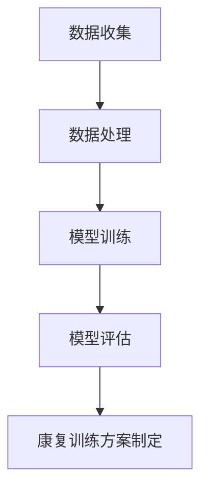
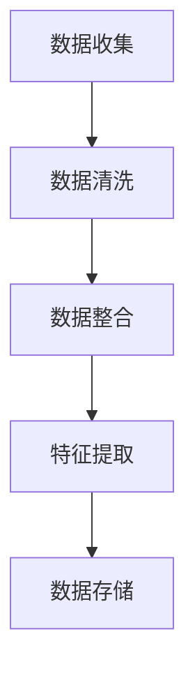

                 

### 2.2 个性化运动康复模型构建

#### 2.2.1 个性化运动康复模型概述

**核心概念与联系：**

个性化运动康复模型的核心概念在于根据患者的具体健康状况和运动能力，制定出适应其个人的康复训练方案。这一过程涉及多个核心概念的相互联系，如数据收集、数据处理、模型训练、模型评估等。

- **数据收集：** 收集与患者运动能力相关的各种数据，包括生理信号数据（如心率、血压等）、行为数据（如运动步数、运动时长等）和环境数据（如气候条件、场地条件等）。

- **数据处理：** 对收集到的数据进行预处理，包括数据清洗、整合和特征提取，以提取出对康复训练有用的信息。

- **模型训练：** 使用机器学习算法对预处理后的数据进行分析，训练出能够预测患者康复进度的模型。

- **模型评估：** 通过验证集和测试集对训练好的模型进行评估，确保其预测准确性和泛化能力。

**Mermaid 流程图：**



#### 背景介绍

运动康复是指通过运动训练，帮助受伤或患病的人恢复运动功能、改善健康状况的一种治疗方法。传统的运动康复方法通常基于医生的直觉和经验，缺乏个性化和数据驱动的支持。随着人工智能技术的发展，尤其是机器学习和数据挖掘技术的应用，个性化运动康复成为可能。

在个性化运动康复中，患者的数据对于模型构建至关重要。通过对数据的深入分析，可以更好地了解患者的健康状况和运动能力，从而制定出更有效的康复训练方案。

#### 核心概念与联系

个性化运动康复模型涉及多个核心概念：

- **生理信号数据：** 包括心率、血压、血氧饱和度等生理参数，这些数据反映了患者的健康状况。

- **行为数据：** 包括患者的日常活动、运动习惯等，这些数据可以帮助分析患者的运动能力和康复需求。

- **环境数据：** 包括气候条件、场地条件等，这些数据可能对康复训练的效果产生影响。

这些数据类型通过数据收集、数据处理、模型训练和模型评估等环节，共同构建出个性化的康复训练模型。

#### 数据收集方法

**伪代码：**

```python
def collect_data():
    # 收集生理信号数据
    physiological_data = get_physiological_signals()
    
    # 收集行为数据
    behavior_data = get_behavior_data()
    
    # 收集环境数据
    environmental_data = get_environmental_data()
    
    # 存储数据
    store_data(physiological_data, behavior_data, environmental_data)
```

**数据处理流程**

**Mermaid 流程图：**



#### 数学模型和数学公式

在个性化运动康复模型中，可以使用以下数学模型：

- **回归模型：** 用于预测患者康复进度。
- **分类模型：** 用于分类患者的康复状态。

**详细讲解举例：**

假设我们使用线性回归模型来预测患者康复进度，其数学模型为：

$$y = \beta_0 + \beta_1 \cdot x_1 + \beta_2 \cdot x_2 + ... + \beta_n \cdot x_n$$

其中，$y$ 是康复进度，$x_1, x_2, ..., x_n$ 是特征变量，$\beta_0, \beta_1, ..., \beta_n$ 是模型的参数。

通过收集患者的历史数据，我们可以使用最小二乘法来估计这些参数。

#### 项目实战

**开发环境搭建：**

- 使用 Python 作为主要编程语言。
- 使用 Scikit-learn 库进行机器学习模型的训练和评估。

**源代码详细实现：**

```python
from sklearn.linear_model import LinearRegression
from sklearn.model_selection import train_test_split
from sklearn.metrics import mean_squared_error

# 数据准备
X = ... # 特征数据
y = ... # 康复进度

# 数据集划分
X_train, X_test, y_train, y_test = train_test_split(X, y, test_size=0.2, random_state=42)

# 模型训练
model = LinearRegression()
model.fit(X_train, y_train)

# 模型评估
y_pred = model.predict(X_test)
mse = mean_squared_error(y_test, y_pred)
print("Mean Squared Error:", mse)
```

**代码解读与分析：**

这段代码首先从数据集中划分出训练集和测试集，然后使用线性回归模型进行训练，并使用测试集对模型进行评估。

**实际案例分析和详细讲解剖析：**

假设我们有一个包含100名患者的历史数据集，我们可以使用这个数据集来训练个性化康复模型，并评估其预测效果。通过分析模型在测试集上的表现，我们可以进一步优化模型，提高其预测准确率。

**项目小结：**

通过上述实战，我们展示了如何使用人工智能技术构建个性化运动康复模型。该模型可以根据患者的具体数据，预测其康复进度，为医生和患者提供更科学的康复指导。

---

**最佳实践 tips、小结、注意事项、拓展阅读等内容：**

- **最佳实践 tips：**
  - 在数据收集阶段，确保数据的准确性和完整性。
  - 在数据处理阶段，注意特征提取的方法和策略，以提取出对康复训练有用的信息。
  - 在模型训练阶段，选择合适的机器学习算法和参数，以提高模型的性能。

- **小结：**
  - 个性化运动康复模型是利用人工智能技术，根据患者个人数据制定的康复方案。
  - 通过数据收集、处理和模型训练等步骤，可以构建出有效的康复模型。

- **注意事项：**
  - 在模型评估阶段，要确保使用合适的评估指标。
  - 在实际应用中，要结合医生的专业意见，对模型结果进行综合分析。

- **拓展阅读：**
  - [1] Goodfellow, I., Bengio, Y., & Courville, A. (2016). *Deep Learning*. MIT Press.
  - [2] Russell, S., & Norvig, P. (2010). *Artificial Intelligence: A Modern Approach*. Prentice Hall.

---

通过本文的详细讲解，我们了解了如何使用人工智能技术构建个性化运动康复模型。这一技术不仅有助于提高康复效果，还为运动康复领域带来了新的发展方向。未来，随着人工智能技术的不断进步，个性化运动康复将更加智能化、精准化，为患者提供更好的康复服务。

