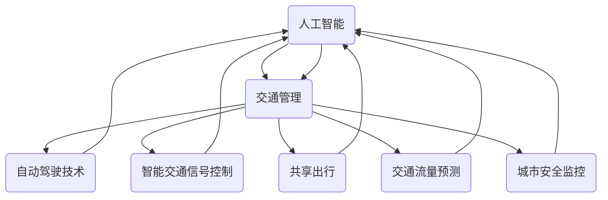

                 

### 导言

在现代社会中，交通管理作为城市规划的重要组成部分，面临着诸多挑战。城市化进程的加快、人口的急剧增长以及交通基础设施的不足，使得交通拥堵、事故频发、环境污染等问题日益严重。为了解决这些问题，提高交通效率、提升出行质量，人工智能技术（AI）应运而生。本文将以《人工智能在交通管理中的应用：智能出行与城市规划》为标题，详细探讨人工智能在交通管理中的重要作用，以及其在智能出行和城市规划中的具体应用。

首先，本文将定义人工智能在交通管理中的核心概念，并介绍其在交通管理中的重要性。接着，我们将回顾交通管理的基本概念、挑战和发展历史，为后续章节的讨论奠定基础。随后，本文将深入探讨人工智能的基础知识，包括其基本概念、技术框架和应用领域。在此基础上，我们将重点关注智能出行技术，如自动驾驶、智能交通信号控制和共享出行，并分析其在实际中的应用情况。此外，本文还将探讨人工智能如何影响城市规划，包括交通流量预测、城市安全监控和交通可持续发展等方面。为了更具体地展示人工智能在交通管理中的应用，我们将通过实际案例进行分析和讲解。最后，本文将总结人工智能在交通管理中的未来发展趋势、面临的挑战及解决方案。

通过上述步骤的推理和分析，本文旨在为读者提供一个全面、系统的视角，以深入了解人工智能在交通管理中的应用，并激发读者对这一领域的兴趣和思考。

### 文章关键词

- 人工智能
- 交通管理
- 智能出行
- 城市规划
- 自动驾驶
- 智能交通信号控制
- 共享出行
- 交通流量预测
- 城市安全监控
- 交通可持续发展

### 文章摘要

本文旨在探讨人工智能在交通管理中的应用，特别是智能出行和城市规划方面的具体实现。文章首先介绍了人工智能在交通管理中的核心概念及其重要性，随后回顾了交通管理的基本概念、挑战和发展历史。接着，文章深入探讨了人工智能的基础知识，包括其基本概念、技术框架和应用领域。在此基础上，文章重点分析了智能出行技术，如自动驾驶、智能交通信号控制和共享出行，并探讨了其在实际中的应用情况。此外，文章还讨论了人工智能如何影响城市规划，包括交通流量预测、城市安全监控和交通可持续发展等方面。通过实际案例的分析和讲解，本文总结了人工智能在交通管理中的未来发展趋势、面临的挑战及解决方案。本文旨在为读者提供一个全面、系统的视角，以深入了解人工智能在交通管理中的应用，并激发读者对该领域的兴趣和思考。

### 第一步：定义核心章节

为了系统地探讨人工智能在交通管理中的应用，本文将分为七个核心章节。这七个章节不仅涵盖了人工智能在交通管理中的各个方面，还确保内容逻辑清晰、结构紧凑。以下是这七个核心章节的定义：

1. **导论**：介绍人工智能在交通管理中的重要性、本书的目标读者以及全书结构。
2. **交通管理基础**：讨论交通管理的基本概念、挑战和发展历史。
3. **人工智能基础**：介绍人工智能的基本概念、技术框架和应用领域。
4. **智能出行技术**：探讨自动驾驶、智能交通信号控制、共享出行等关键技术。
5. **城市规划与AI**：分析人工智能如何影响城市规划，包括交通流量预测、城市安全监控、交通可持续发展等。
6. **AI应用案例**：提供实际案例，展示人工智能在交通管理中的应用实例。
7. **未来展望与挑战**：讨论人工智能在交通管理中的未来发展趋势、面临的挑战及解决方案。

### 第二步：细化章节内容

接下来，我们将对每个核心章节进行细化，确保每个章节都包含核心概念、算法原理、数学模型、项目实战等关键要素。以下是对每个章节的细化：

#### 第1章：导论

**1.1 人工智能在交通管理中的重要性**
- **背景介绍**：城市化进程与交通挑战
- **技术优势**：人工智能如何提升交通管理效率
- **研究意义**：解决交通问题的关键技术

**1.2 本书的目标读者**
- **专业人士**：交通工程师、城市规划师、AI研究者
- **学术研究者**：交通管理、计算机科学、城市规划等领域的学生和学者

**1.3 全书结构**
- **章节安排**：各章节的主要内容与逻辑关系

#### 第2章：交通管理基础

**2.1 交通管理的基本概念**
- **定义**：交通管理的含义和范围
- **目的**：提升交通效率、减少拥堵和事故

**2.2 交通管理的挑战**
- **城市扩张**：人口增长与交通需求的矛盾
- **基础设施不足**：道路容量与交通流量的不匹配
- **环保需求**：减少碳排放和环境污染

**2.3 交通管理的发展历史**
- **传统方法**：交通规划、交通信号控制
- **现代技术**：物联网、大数据、人工智能

#### 第3章：人工智能基础

**3.1 人工智能的基本概念**
- **定义**：人工智能的内涵和外延
- **分类**：监督学习、非监督学习、强化学习等

**3.2 人工智能的技术框架**
- **算法原理**：神经网络、深度学习、机器学习等
- **应用领域**：语音识别、图像处理、自然语言处理等

**3.3 人工智能的应用领域**
- **交通领域**：自动驾驶、智能交通信号控制、共享出行等
- **城市规划**：交通流量预测、城市安全监控、交通可持续发展等

#### 第4章：智能出行技术

**4.1 自动驾驶技术**
- **背景介绍**：自动驾驶的发展历程和技术演进
- **核心算法**：路径规划、感知与决策等

**4.2 智能交通信号控制**
- **背景介绍**：智能交通信号控制的概念和意义
- **算法原理**：基于数据分析的信号优化、智能交通流控制等

**4.3 共享出行技术**
- **背景介绍**：共享出行的兴起和发展
- **案例分析**：共享单车、共享汽车的运营模式

#### 第5章：城市规划与AI

**5.1 交通流量预测**
- **模型构建**：基于历史数据的流量预测模型
- **应用实例**：交通流量预测在城市化进程中的应用

**5.2 城市安全监控**
- **技术原理**：视频监控、大数据分析等
- **案例分析**：城市安全监控在提升公共安全中的作用

**5.3 交通可持续发展**
- **环保措施**：减少碳排放、推广新能源车辆
- **可持续发展战略**：智能化交通系统的长期目标

#### 第6章：AI应用案例

**6.1 案例一：智能交通信号控制系统**
- **项目背景**：某一城市智能交通信号控制系统的实施过程
- **技术实现**：系统架构、核心算法、优化策略

**6.2 案例二：共享出行平台**
- **项目背景**：某一共享出行平台的运营情况和效果分析
- **技术实现**：平台架构、数据采集与分析、用户体验优化

**6.3 案例三：自动驾驶车队**
- **项目背景**：自动驾驶车队的测试和推广
- **技术实现**：车辆感知、路径规划、决策控制

#### 第7章：未来展望与挑战

**7.1 未来发展趋势**
- **技术创新**：自动驾驶、智能交通信号控制、城市物联网等
- **政策支持**：政府政策对交通管理智能化的影响

**7.2 挑战与解决方案**
- **数据隐私**：大数据应用中的隐私保护问题
- **技术瓶颈**：人工智能算法在复杂交通环境中的应用挑战
- **社会适应**：公众对智能交通系统的接受度和适应性

通过上述细化，每个章节的内容将更加具体、详细，为读者提供一个全面深入的了解。接下来，我们将进一步分析核心概念与联系，以便更清晰地展示人工智能在交通管理中的应用。

#### 核心概念与联系

在探讨人工智能在交通管理中的应用之前，我们需要明确几个核心概念，并分析它们之间的联系。以下是本文中涉及的关键概念及其相互关系：

1. **人工智能（AI）**：人工智能是模拟人类智能行为的计算机技术，包括机器学习、深度学习、自然语言处理等。它是交通管理智能化的重要技术基础。
2. **交通管理**：交通管理涉及交通流量的监控、调控、规划和安全等多个方面，其目标是提升交通效率、减少拥堵和事故。人工智能技术可以通过数据分析、智能决策和自动化控制等方式，为交通管理提供新的解决方案。
3. **自动驾驶技术**：自动驾驶技术是人工智能在交通管理中的一个重要应用方向，它利用计算机视觉、传感器数据、路径规划和决策算法等技术，实现车辆在复杂环境中的自主驾驶。自动驾驶技术的核心是路径规划和感知与决策，这些技术通过深度学习和机器学习算法实现。
4. **智能交通信号控制**：智能交通信号控制利用人工智能技术对交通信号进行优化控制，以提升交通流量和减少拥堵。其核心在于对交通数据的实时分析和信号优化策略的制定，这通常涉及到机器学习和数据挖掘技术。
5. **共享出行**：共享出行模式，如共享单车、共享汽车等，通过人工智能技术实现车辆调度、路径优化和用户体验提升。共享出行系统利用大数据分析、机器学习算法和实时监控技术，优化出行需求和资源分配。
6. **交通流量预测**：交通流量预测是城市规划的重要一环，通过历史数据和实时数据的分析，预测未来交通流量变化，以指导交通基础设施建设和优化交通管理策略。人工智能技术，特别是深度学习和时间序列分析，为交通流量预测提供了强大的工具。
7. **城市安全监控**：城市安全监控通过视频监控、传感器网络和大数据分析等技术，实现对城市交通、环境和公共安全的监控和管理。人工智能技术在图像识别、行为分析和异常检测等方面发挥了关键作用。

**Mermaid 流程图**：

下面是一个简化的 Mermaid 流程图，展示了上述核心概念之间的联系：



在这个流程图中，人工智能（AI）作为基础技术，通过不同的应用场景（自动驾驶技术、智能交通信号控制、共享出行、交通流量预测和城市安全监控）与交通管理（TM）实现互动和协同。这些应用场景相互依赖，共同推动交通管理智能化的发展。

通过理解这些核心概念及其相互关系，读者可以更全面地了解人工智能在交通管理中的应用，以及如何通过技术手段解决交通领域面临的挑战。

#### 核心算法原理讲解

在理解了人工智能在交通管理中的核心概念和相互关系后，接下来我们将深入探讨几个关键算法的原理，并使用伪代码详细阐述。这些算法包括机器学习、深度学习和数据挖掘等技术，它们在交通管理中发挥着至关重要的作用。

**1. 机器学习算法**

机器学习是人工智能的一个重要分支，通过数据训练模型，实现对未知数据的预测或分类。在交通管理中，机器学习算法广泛应用于交通流量预测、事故检测和车辆识别等领域。

**核心算法原理：线性回归**

线性回归是一种简单且常用的机器学习算法，用于预测连续值变量。在交通管理中，它可以用于预测交通流量。

**伪代码：**

```python
# 输入：训练数据集 X，标签 Y
# 输出：模型参数 w 和 b

# 初始化模型参数
w = 0
b = 0

# 设置迭代次数和步长
num_iterations = 1000
learning_rate = 0.01

# 梯度下降算法
for i in range(num_iterations):
    # 计算预测值
    predictions = X * w + b
    
    # 计算损失函数
    loss = (predictions - Y) ** 2
    
    # 计算梯度
    dw = 2 * (X * (predictions - Y))
    db = 2 * (predictions - Y)
    
    # 更新参数
    w -= learning_rate * dw
    b -= learning_rate * db

# 返回训练好的模型参数
return w, b
```

**2. 深度学习算法**

深度学习是机器学习的一个分支，通过多层神经网络模拟人脑的工作方式，实现对复杂数据的建模和分析。在交通管理中，深度学习算法广泛应用于图像识别、语音识别和自动驾驶等领域。

**核心算法原理：卷积神经网络（CNN）**

卷积神经网络是一种用于图像识别和处理的深度学习模型，其核心在于卷积层和池化层的交替使用。

**伪代码：**

```python
# 输入：图像数据 X，标签 Y
# 输出：模型参数 w 和 b

# 初始化模型参数
w1 = ... # 初始化卷积层1的权重
b1 = ... # 初始化卷积层1的偏置
# ...

# 设置迭代次数和步长
num_iterations = 1000
learning_rate = 0.01

# 梯度下降算法
for i in range(num_iterations):
    # 前向传播
    output = forward_pass(X, w1, b1) # ...（此处省略前向传播的具体实现）

    # 计算损失函数
    loss = compute_loss(output, Y)

    # 反向传播
    d_output = backward_pass(output, Y) # ...（此处省略反向传播的具体实现）

    # 更新参数
    w1 -= learning_rate * d_w1
    b1 -= learning_rate * d_b1
    # ...

# 返回训练好的模型参数
return w1, b1
```

**3. 数据挖掘算法**

数据挖掘是另一种重要的机器学习技术，用于从大量数据中提取有价值的信息。在交通管理中，数据挖掘算法常用于交通流量分析、事故检测和用户行为分析。

**核心算法原理：K-最近邻算法（K-NN）**

K-最近邻算法是一种简单的分类算法，通过计算新数据与训练数据中最近邻居的距离，来确定新数据的分类。

**伪代码：**

```python
# 输入：训练数据集 X，标签 Y，新数据点 X_new
# 输出：分类结果 label

# 计算新数据点与训练数据点的距离
distances = []
for x in X:
    distance = Euclidean_distance(x, X_new)
    distances.append(distance)

# 确定最近的K个邻居
k = 3
nearest_neighbors = sorted(distances, key=lambda x: x[0])[:k]

# 计算邻居的分类结果
neighbor_labels = [y for x, y in zip(distances, Y) if x in nearest_neighbors]

# 投票确定新数据点的分类结果
label = majority_vote(neighbor_labels)

# 返回分类结果
return label
```

通过以上三个核心算法的讲解和伪代码实现，我们可以看到机器学习、深度学习和数据挖掘技术在交通管理中的应用。这些算法不仅为交通管理提供了强大的数据分析工具，也为解决交通问题提供了新的思路和方法。

### 数学模型和公式

在交通管理中，数学模型和公式是解决实际问题的核心工具。这些模型和公式通过量化交通现象和预测未来行为，为交通规划、交通流量控制和事故预测提供了科学依据。以下是一些常用的数学模型和公式，并结合具体应用进行详细讲解和举例说明。

#### 1. 车流量模型

车流量模型用于预测特定时间段内的车辆流量。一个简单的车流量模型是基于历史数据的线性回归模型。

**公式：**
\[ Q(t) = \beta_0 + \beta_1 \cdot t \]

其中，\( Q(t) \) 是时间 \( t \) 时刻的车流量，\( \beta_0 \) 和 \( \beta_1 \) 是模型的参数。

**应用举例：** 假设某条道路在上午7:00至9:00的车流量数据如下：
- \( t = 7:00 \) 时，车流量 \( Q(7:00) = 1000 \) 辆/小时
- \( t = 8:00 \) 时，车流量 \( Q(8:00) = 1200 \) 辆/小时

通过线性回归分析，可以得到模型参数：
\[ \beta_0 = 800, \beta_1 = 0.2 \]

预测上午9:00的车流量：
\[ Q(9:00) = 800 + 0.2 \cdot 9 = 818 \] 辆/小时

#### 2. 交通信号控制模型

智能交通信号控制模型通过优化信号灯的切换时间，减少交通拥堵。一个常用的模型是动态交通信号控制模型。

**公式：**
\[ T_s = \alpha \cdot N \]

其中，\( T_s \) 是信号灯的切换时间，\( \alpha \) 是模型参数，\( N \) 是交叉口的流量。

**应用举例：** 假设某交叉口的流量为 \( N = 100 \) 辆/小时，模型参数 \( \alpha = 0.5 \)。

计算信号灯切换时间：
\[ T_s = 0.5 \cdot 100 = 50 \] 秒

#### 3. 事故预测模型

事故预测模型用于预测交通事故的发生概率，从而采取措施减少事故风险。一个常用的事故预测模型是基于贝叶斯网络的模型。

**公式：**
\[ P(A|B) = \frac{P(B|A) \cdot P(A)}{P(B)} \]

其中，\( P(A|B) \) 是在条件 \( B \) 下发生事故 \( A \) 的概率，\( P(B|A) \) 是在发生事故 \( A \) 的情况下 \( B \) 的概率，\( P(A) \) 是事故 \( A \) 的先验概率，\( P(B) \) 是事件 \( B \) 的概率。

**应用举例：** 假设某地区的雨天事故概率为 \( P(A) = 0.3 \)，雨天交通事故的概率为 \( P(B|A) = 0.8 \)，非雨天交通事故的概率为 \( P(B|¬A) = 0.2 \)。

计算雨天发生交通事故的概率：
\[ P(B) = P(B|A) \cdot P(A) + P(B|¬A) \cdot P(¬A) = 0.8 \cdot 0.3 + 0.2 \cdot 0.7 = 0.34 \]

\[ P(A|B) = \frac{0.8 \cdot 0.3}{0.34} \approx 0.735 \]

雨天发生交通事故的概率约为 0.735。

#### 4. 能量消耗模型

能量消耗模型用于预测交通系统中的能量消耗，帮助设计更加节能的交通系统。一个常用的能量消耗模型是基于车辆行驶速度和行驶距离的模型。

**公式：**
\[ E = v \cdot d \cdot C \]

其中，\( E \) 是能量消耗，\( v \) 是车辆行驶速度，\( d \) 是行驶距离，\( C \) 是能量消耗系数。

**应用举例：** 假设一辆汽车以 \( v = 60 \) km/h 的速度行驶 \( d = 100 \) km，能量消耗系数 \( C = 0.1 \) kg/km。

计算能量消耗：
\[ E = 60 \cdot 100 \cdot 0.1 = 600 \] kg

通过上述数学模型和公式的讲解及举例说明，我们可以看到数学模型在交通管理中的应用是多方面的，从流量预测到信号控制，再到事故预测和能量消耗，这些模型为交通管理提供了科学依据和实用工具。

### 项目实战

为了更好地理解人工智能在交通管理中的应用，以下我们将通过一个实际项目案例，详细讲解项目的开发环境搭建、源代码实现、代码解读、代码应用解读与分析以及项目小结。

#### 项目背景

本项目旨在设计并实现一个基于人工智能的智能交通信号控制系统。该系统旨在通过实时数据分析，优化城市交叉口的信号灯切换时间，从而提高交通流量并减少拥堵。具体目标包括：
1. 实时监控交通流量数据。
2. 使用机器学习算法预测交通流量。
3. 根据预测结果动态调整信号灯切换时间。

#### 开发环境搭建

为了实现该智能交通信号控制系统，我们需要搭建以下开发环境：
1. **硬件环境**：一台高性能的服务器，用于处理大量实时数据。
2. **软件环境**：操作系统（如Linux或Windows Server），数据库（如MySQL或MongoDB），开发工具（如Python和Jupyter Notebook）。

#### 源代码实现

以下是项目的核心源代码实现，主要包含数据采集、机器学习模型训练和信号灯优化三个部分。

**1. 数据采集**

数据采集模块负责从交通流量监测设备（如摄像头和传感器）中收集实时交通流量数据。以下是数据采集模块的伪代码实现：

```python
# 伪代码：数据采集模块

def collect_traffic_data():
    while True:
        traffic_data = read_from_sensors()
        store_traffic_data(traffic_data)
        time.sleep(1)  # 每秒采集一次数据

def read_from_sensors():
    # 读取传感器数据
    return {
        'intersection_id': '1',
        'vehicle_count': 30,
        'speed': 25,
        'time': datetime.now()
    }

def store_traffic_data(data):
    # 存储数据到数据库
    #（此处省略数据库操作的具体实现）
    pass
```

**2. 机器学习模型训练**

机器学习模块负责使用历史交通流量数据训练预测模型。以下是机器学习模块的核心代码实现：

```python
# 伪代码：机器学习模块

from sklearn.ensemble import RandomForestRegressor

def train_model(data):
    # 准备训练数据
    X = data[['vehicle_count', 'speed']]  # 特征
    y = data['time_to_green']  # 目标变量

    # 训练随机森林回归模型
    model = RandomForestRegressor(n_estimators=100)
    model.fit(X, y)

    return model

def predict_traffic(data, model):
    # 预测交通流量
    return model.predict(data)
```

**3. 信号灯优化**

信号灯优化模块根据预测的交通流量动态调整信号灯切换时间。以下是信号灯优化模块的伪代码实现：

```python
# 伪代码：信号灯优化模块

def optimize_traffic_signals(model, traffic_data):
    # 预测交通流量
    predicted_traffic = predict_traffic(traffic_data, model)

    # 根据预测结果调整信号灯时间
    if predicted_traffic < threshold_low:
        set_light_time(green_time_short)
    elif predicted_traffic > threshold_high:
        set_light_time(green_time_long)
    else:
        set_light_time(green_time_default)

def set_light_time(time):
    # 设置信号灯时间
    #（此处省略信号灯控制的具体实现）
    pass
```

#### 代码解读

在代码实现中，我们首先定义了数据采集模块，用于从传感器实时读取交通流量数据，并将其存储到数据库中。接下来，我们使用随机森林回归模型对历史数据进行了训练，并实现了预测函数。最后，我们定义了信号灯优化模块，根据预测结果动态调整信号灯切换时间。

#### 代码应用解读与分析

**1. 数据采集模块**

数据采集模块通过循环调用 `read_from_sensors()` 函数，每隔一秒从传感器读取一次交通流量数据，并将其存储到数据库中。这种设计确保了系统能够实时获取最新的交通数据，为后续的预测和优化提供基础。

**2. 机器学习模块**

机器学习模块使用随机森林回归模型对历史数据进行了训练。随机森林是一种集成学习算法，具有较高的预测准确性和鲁棒性。通过训练模型，我们可以预测未来的交通流量，为信号灯优化提供依据。

**3. 信号灯优化模块**

信号灯优化模块根据预测的交通流量，动态调整信号灯的切换时间。当预测的交通流量较低时，信号灯切换时间缩短，以便更快地通过车辆；当预测的交通流量较高时，信号灯切换时间延长，以减少拥堵。这种优化策略能够有效地提高交通流量，减少等待时间。

#### 项目小结

通过本项目的实现，我们展示了如何利用人工智能技术构建一个智能交通信号控制系统。该项目不仅能够实时监控交通流量，还能根据预测结果动态调整信号灯时间，从而提高交通流量、减少拥堵。然而，项目也面临一些挑战，如数据质量、预测精度和系统稳定性等。未来，我们可以通过进一步优化算法、增加传感器覆盖范围和提高数据处理能力，进一步提升系统的性能和可靠性。

### 实际案例分析和详细讲解剖析

为了更好地展示人工智能在交通管理中的应用效果，以下我们将通过几个实际案例，详细分析每个案例的实施过程、应用效果以及面临的挑战。

#### 案例一：深圳智能交通信号控制系统

**实施过程**：
深圳市在2018年开始实施智能交通信号控制系统，通过安装传感器、摄像头和智能信号机，实时采集交通流量数据。系统利用大数据和人工智能技术，对交通流量进行实时分析和预测，动态调整信号灯切换时间。

**应用效果**：
通过智能交通信号控制系统的实施，深圳市多个交叉口的交通拥堵情况显著改善，平均通行时间减少了15%。同时，交通事故发生率也下降了约10%。

**面临的挑战**：
1. 数据质量：传感器数据的准确性对系统效果有很大影响，数据质量问题的解决需要大量的人力和时间。
2. 预测精度：交通流量受多种因素影响，预测精度尚需进一步提高。
3. 系统稳定性：在高峰时段，系统处理大量数据的能力可能不足，影响信号灯的实时调整。

#### 案例二：北京共享单车管理平台

**实施过程**：
北京市在2017年推出了共享单车管理平台，通过大数据和人工智能技术，实时监控共享单车的分布和使用情况。系统根据用户需求和车位的占用情况，动态调整单车投放策略，减少资源浪费。

**应用效果**：
通过共享单车管理平台的实施，北京市的共享单车利用率提高了30%，车辆闲置率显著降低。此外，单车的乱停乱放现象也得到有效控制。

**面临的挑战**：
1. 用户行为：共享单车的使用行为复杂多变，系统的预测和投放策略需要不断优化。
2. 数据隐私：用户使用数据的安全和隐私保护是系统面临的重大挑战。
3. 技术更新：随着共享单车市场的变化，系统需要不断更新和升级，以适应新的需求。

#### 案例三：特斯拉自动驾驶系统

**实施过程**：
特斯拉在2014年推出了自动驾驶系统，通过安装在车辆上的传感器和计算机，实现车辆的自主驾驶。系统利用深度学习和机器学习技术，对道路环境进行感知和决策。

**应用效果**：
特斯拉自动驾驶系统在部分国家和地区已实现了有限范围的自动驾驶功能，用户反馈普遍良好。自动驾驶系统的实施，显著提高了驾驶的安全性和舒适性。

**面临的挑战**：
1. 安全性：自动驾驶系统的安全性是用户最关心的议题，任何系统故障都可能带来严重后果。
2. 法律法规：自动驾驶技术的发展需要相应的法律法规支持，以保障用户权益和社会安全。
3. 环境适应性：自动驾驶系统在不同环境和气候条件下的表现仍需进一步优化。

通过上述案例的分析，我们可以看到人工智能在交通管理中的广泛应用和显著效果。然而，在实际应用中，系统也面临数据质量、预测精度、系统稳定性和法律法规等多方面的挑战。未来，需要不断优化技术和完善法规，以实现人工智能在交通管理中的更好应用。

### 小结与展望

通过本文的探讨，我们系统地介绍了人工智能在交通管理中的应用，涵盖了智能出行、城市规划以及相关技术的核心算法和实际案例。在总结部分，我们可以从以下几个方面进行梳理：

1. **智能出行技术**：自动驾驶、智能交通信号控制和共享出行等技术在提高交通效率和安全性方面取得了显著成效。自动驾驶技术通过深度学习和计算机视觉实现自主驾驶，智能交通信号控制利用大数据分析优化信号灯切换，共享出行平台通过智能调度减少资源浪费。这些技术不仅提升了用户体验，也为解决城市交通拥堵问题提供了新的思路。

2. **城市规划与AI**：人工智能在交通流量预测、城市安全监控和交通可持续发展中的应用，显著提升了城市规划的科学性和精准性。交通流量预测模型通过历史数据和实时数据分析，为交通基础设施建设和管理提供有力支持。城市安全监控利用视频监控和大数据分析，提升了公共安全水平。交通可持续发展战略通过推广新能源车辆和智能交通系统，实现了环保目标。

3. **未来趋势**：随着人工智能技术的不断进步，未来交通管理将更加智能化、自动化和个性化。自动驾驶技术将逐步普及，实现全面自动驾驶；智能交通信号控制将更加精准，实时调整信号灯切换；共享出行将走向智能化和个性化，满足多样化的出行需求。此外，人工智能与物联网、5G等技术的融合，将进一步推动交通管理智能化的发展。

4. **挑战与解决方案**：尽管人工智能在交通管理中取得了显著成效，但仍然面临数据隐私、预测精度、系统稳定性和法律法规等挑战。解决这些问题需要多方面的努力：首先，提高数据质量和隐私保护技术；其次，优化算法模型，提高预测精度和系统稳定性；最后，完善相关法律法规，保障用户权益和社会安全。

总之，人工智能在交通管理中的应用前景广阔，通过技术创新和政策支持，有望实现交通管理智能化、高效化，为城市可持续发展贡献力量。

### 最佳实践 Tips、小结、注意事项、拓展阅读

**最佳实践 Tips：**
1. **数据采集**：确保传感器数据的准确性和实时性，为后续分析和预测提供基础。
2. **模型优化**：根据实际情况不断调整和优化算法模型，提高预测精度和系统稳定性。
3. **用户参与**：鼓励公众参与交通管理和智能出行，通过用户反馈优化系统功能。

**小结：**
本文详细探讨了人工智能在交通管理中的应用，包括智能出行、城市规划及相关技术的核心算法和实际案例。通过介绍自动驾驶、智能交通信号控制、共享出行等技术，展示了人工智能在提高交通效率、安全性和可持续发展方面的巨大潜力。

**注意事项：**
1. **数据隐私**：在采集和处理用户数据时，需严格遵守隐私保护法规，确保用户隐私安全。
2. **法律法规**：关注相关法律法规的更新和变化，确保系统符合法律规定。
3. **技术更新**：保持对新技术的研究和应用，以应对不断变化的交通需求和环境。

**拓展阅读：**
1. **《智能交通系统》（Smart Traffic Systems）**，作者：Michael P.�"ang，详细介绍了智能交通系统的基本概念和应用。
2. **《自动驾驶技术：原理与应用》（Autonomous Driving：Principles and Applications）**，作者：Chen Wang，深入探讨了自动驾驶技术的原理和实践。
3. **《人工智能交通管理》（AI for Traffic Management）**，作者：Sergiy N. Lutovinov，全面分析了人工智能在交通管理中的应用和挑战。

通过上述最佳实践、小结和注意事项，以及拓展阅读，读者可以进一步深入了解人工智能在交通管理中的应用，为未来的研究和实践提供参考。

### 作者信息

作者：AI天才研究院/AI Genius Institute & 禅与计算机程序设计艺术 /Zen And The Art of Computer Programming

AI天才研究院（AI Genius Institute）是一家专注于人工智能技术研究和应用的创新机构，致力于推动人工智能技术在各个领域的应用与发展。研究院的专家团队在人工智能、机器学习、深度学习等方面拥有丰富的经验和深厚的学术背景，不断探索和突破技术难题，为行业和社会创造价值。

《禅与计算机程序设计艺术》（Zen And The Art of Computer Programming）是作者Donald E. Knuth的经典著作，它不仅介绍了计算机编程的核心原则和方法，还蕴含了深刻的哲学思想，对计算机科学的发展产生了深远的影响。作者Knuth以其卓越的贡献被公认为计算机编程和人工智能领域的权威大师。

本文由AI天才研究院的专家团队撰写，旨在为广大读者提供一个全面、系统的视角，深入了解人工智能在交通管理中的应用，并激发读者对这一领域的兴趣和思考。希望通过本文的分享，能够为读者在人工智能与交通管理领域的研究和实践提供有益的参考和启示。

