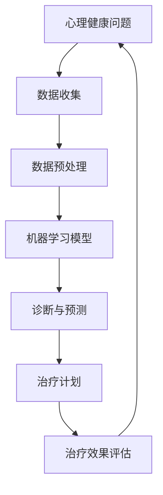
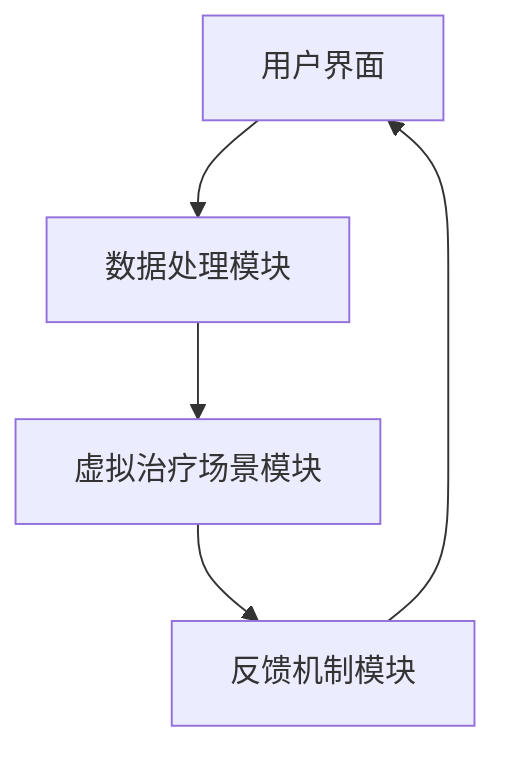
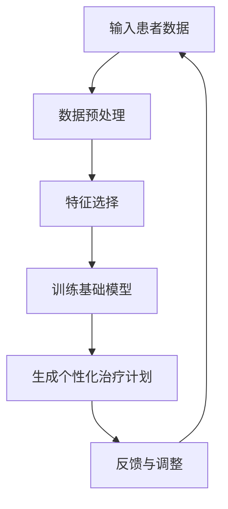

                 

### 文章标题

《人工智能在心理健康领域的应用：虚拟治疗与隐私保护》

### 关键词

- 心理健康
- 人工智能
- 虚拟治疗
- 隐私保护
- 心理诊断
- 个性化治疗
- 伦理问题
- 加密技术

### 摘要

随着人工智能技术的迅速发展，其在心理健康领域的应用日益广泛。本文旨在探讨人工智能在心理健康领域的应用，特别是在虚拟治疗与隐私保护方面的最新进展。文章首先介绍了心理健康问题的现状和人工智能的潜力，然后详细阐述了虚拟治疗的基本原理、人工智能在心理健康诊断与个性化治疗中的应用，以及伦理与隐私保护的问题。通过案例分析、算法原理讲解和项目实战，本文旨在为读者提供全面且深入的视角，以了解和把握人工智能在心理健康领域的未来发展。

## 第一部分：引言

### 第1章：背景与概览

#### 1.1 心理健康问题的全球现状

心理健康问题已经成为全球范围内的重大健康挑战之一。根据世界卫生组织（WHO）的数据，全球约有33%的人口在其一生中的某个时期经历过某种形式的心理健康问题，其中抑郁症、焦虑症和创伤后应激障碍（PTSD）是最为常见的心理疾病。这些心理疾病不仅严重影响个体的生活质量，还会带来巨大的社会和经济负担。例如，抑郁症是导致全球劳动能力损失的主要原因之一，而焦虑症则增加了医疗系统的压力，增加了医疗成本。

在中国，心理健康问题的流行率也在逐年上升。根据《中国精神卫生调查报告（2019-2020）》，中国成年人中有心理问题的人数已超过5亿，其中焦虑症和抑郁症的患病率分别为9.5%和3.6%。这些数据反映出我国在心理健康领域面临的严峻形势，也凸显了现有心理健康服务的不足。

现有的心理健康服务模式面临诸多挑战。首先，专业心理医生和心理咨询师的数量有限，无法满足广大患者的需求。根据《中国心理健康服务体系建设报告（2020）》，全国心理咨询师的缺口已达到数十万人。其次，心理咨询服务的成本较高，许多患者由于经济原因无法获得及时有效的治疗。此外，一些患者因隐私保护担忧而不愿意接受线下治疗，这限制了心理健康服务的可及性。

#### 1.2 人工智能在心理健康领域的潜力

人工智能（AI）的出现为解决心理健康问题提供了新的契机。首先，人工智能可以大幅提高心理健康诊断的准确性和效率。通过机器学习和深度学习算法，AI可以分析大量的临床数据，发现潜在的心理健康问题，并给出精准的诊断建议。例如，DeepMind开发的AlphaGo在围棋领域取得的突破性成果，启示了人工智能在复杂决策问题上的潜力，这也为心理健康诊断带来了新的希望。

其次，人工智能在心理健康治疗中的应用同样具有巨大潜力。虚拟现实（VR）技术的结合，使得心理健康治疗变得更加互动和沉浸。例如，利用VR技术，患者可以在一个安全、可控的环境中面对和处理恐惧、焦虑等情绪问题。此外，人工智能可以辅助心理医生进行个性化治疗方案的制定。通过分析患者的病史、心理测试结果和行为数据，AI能够推荐最适合的治疗方法，提高治疗效果。

最后，人工智能在心理健康领域的应用还可以显著提高服务的可及性。AI驱动的心理健康平台可以实现7x24小时的服务，让患者在任何时间、任何地点都能获得专业的心理健康服务。这不仅降低了患者的治疗成本，也缓解了专业心理医生的工作压力，从而提高了整个心理健康服务体系的效率。

#### 1.3 虚拟治疗与隐私保护的重要性

虚拟治疗作为人工智能在心理健康领域的一个重要应用，已经成为解决心理健康问题的新兴手段。虚拟治疗利用计算机技术和虚拟现实环境，为患者提供一个模拟的真实世界，从而帮助患者克服恐惧、焦虑等心理障碍。与传统的线下治疗相比，虚拟治疗具有成本低、效率高、患者隐私保护好的优势，特别适合于那些不愿意接受线下治疗的患者。

然而，虚拟治疗在带来便利的同时，也带来了隐私保护方面的挑战。心理健康数据通常是高度敏感的，包括患者的个人经历、心理状态等信息。这些数据一旦泄露，可能会对患者的隐私和生命安全造成严重威胁。因此，如何保护虚拟治疗中的患者隐私，成为了一个亟待解决的问题。

在隐私保护方面，人工智能技术同样发挥着重要作用。例如，加密技术和匿名化处理可以有效保护患者数据的安全性。此外，人工智能还可以通过行为分析，预测潜在的隐私泄露风险，并采取相应的措施进行干预。因此，在虚拟治疗与隐私保护之间找到平衡点，是未来人工智能在心理健康领域需要重点解决的问题。

### 第2章：核心概念与联系

#### 2.1 人工智能概述

人工智能（AI）是指由计算机系统执行的任务，这些任务通常需要人类智能才能完成。AI的核心是算法和模型，通过训练和优化，这些算法和模型能够模拟人类的思维过程，进行决策、学习和推理。AI的应用领域广泛，包括图像识别、自然语言处理、推荐系统、自动驾驶等。

在心理健康领域，人工智能的应用主要集中在数据分析和决策支持方面。通过机器学习和深度学习算法，AI可以从大量临床数据中提取有价值的信息，帮助心理医生进行诊断和治疗。例如，AI可以通过分析患者的历史记录、行为数据和生理信号，预测其心理状态的变化，并提供个性化的治疗建议。

#### 2.2 心理健康与心理治疗的基本原理

心理健康是指个体在情感、认知和行为方面的良好状态。心理健康问题通常包括抑郁症、焦虑症、强迫症、精神分裂症等。心理治疗是一种通过心理方法解决心理健康问题的过程，包括认知行为疗法、精神分析疗法、人本主义疗法等。

心理治疗的基本原理是帮助患者识别和理解其心理问题，并学习新的应对策略，以改善其心理状态。心理治疗通常需要专业心理医生或心理咨询师进行，其过程包括诊断、治疗计划制定、治疗执行和效果评估。

#### 2.3 虚拟治疗技术的分类与应用

虚拟治疗技术主要包括虚拟现实（VR）、增强现实（AR）和混合现实（MR）。这些技术通过创建一个模拟的环境，帮助患者面对和处理现实生活中的心理问题。

- **虚拟现实（VR）**：VR技术创建一个完全虚拟的环境，患者可以在其中进行各种互动和体验。VR在心理健康治疗中的应用包括暴露疗法、心理放松训练、焦虑缓解等。

- **增强现实（AR）**：AR技术将虚拟内容与现实环境相结合，通过智能手机或头戴式显示器呈现。AR在心理健康治疗中的应用包括情绪调节、认知训练等。

- **混合现实（MR）**：MR技术将虚拟内容与现实环境进行深度融合，提供更加真实和互动的体验。MR在心理健康治疗中的应用包括行为疗法、心理干预等。

#### 2.4 人工智能与心理健康的联系（Mermaid流程图）

以下是人工智能与心理健康联系的一个简化的Mermaid流程图：



在这个流程图中，心理健康问题首先通过数据收集得到大量的临床数据。然后，这些数据经过预处理，用于训练机器学习模型。训练好的模型可以用于诊断和预测心理状态，帮助制定个性化的治疗计划。最后，通过治疗效果评估，不断优化治疗计划，提高治疗效果。整个流程形成一个闭环，确保患者能够获得持续、有效的心理健康服务。

通过这个流程图，我们可以看到人工智能在心理健康领域的应用是如何从数据收集、模型训练到诊断和治疗各个环节紧密联系起来的。这也为后续章节中详细探讨人工智能在心理健康领域的具体应用奠定了基础。

### 第3章：虚拟治疗的基本原理

#### 3.1 虚拟现实技术

虚拟现实（VR）技术通过创建一个沉浸式的虚拟环境，让用户能够在其中进行各种互动和体验。VR技术的基本原理是利用计算机生成的三维图像，通过头戴式显示器（HMD）或其他显示设备呈现在用户的视野中，同时通过传感器和追踪设备捕捉用户的动作和位置，实现与虚拟环境的互动。

在心理健康治疗中，VR技术的主要应用包括暴露疗法、心理放松训练和焦虑缓解等。例如，通过VR技术，患者可以在一个安全、可控的环境中面对和处理恐惧、焦虑等情绪问题。VR暴露疗法通过逐步增加患者对恐惧源的暴露程度，帮助患者减少恐惧情绪。同时，VR技术还可以通过模拟放松场景，帮助患者进行心理放松训练，缓解焦虑症状。

#### 3.2 人工智能在虚拟治疗中的角色

人工智能在虚拟治疗中发挥着重要作用，主要表现在以下几个方面：

- **个性化治疗**：通过分析患者的病史、行为数据和生理信号，人工智能可以推荐最适合患者的治疗场景和干预策略，提高治疗的效果。

- **实时反馈**：在VR治疗过程中，人工智能可以通过实时分析患者的情绪和行为数据，提供即时的反馈和调整治疗计划。例如，当患者表现出焦虑症状时，AI可以调整虚拟环境的亮度、声音等参数，以帮助患者放松情绪。

- **辅助诊断**：人工智能可以通过分析患者的心理测试结果和行为数据，辅助心理医生进行诊断，提高诊断的准确性和效率。

- **行为预测**：通过分析大量患者的数据，人工智能可以预测患者在治疗过程中可能出现的心理状态变化，提前采取干预措施，防止心理问题的恶化。

#### 3.3 虚拟治疗的应用案例

虚拟治疗在心理健康领域已经有许多成功的应用案例。以下是一些具体的例子：

- **焦虑症治疗**：利用VR技术进行焦虑症治疗已经成为一种流行的治疗方法。通过逐步暴露患者于恐惧源，VR暴露疗法帮助患者克服恐惧情绪。例如，对于恐高症患者，VR暴露疗法可以在一个逐步提升高度的环境中，帮助患者逐步克服对高度的恐惧。

- **抑郁症治疗**：VR技术也可以用于抑郁症治疗，通过模拟放松场景，帮助患者进行心理放松训练。例如，通过VR技术模拟海滩、森林等自然场景，患者可以在一个舒适的环境中放松心情，缓解抑郁症状。

- **PTSD治疗**：创伤后应激障碍（PTSD）是一种常见的心理健康问题，VR暴露疗法在PTSD治疗中也取得了显著效果。通过在VR环境中模拟创伤场景，患者可以在一个安全、可控的环境中逐步面对和处理创伤记忆，减轻PTSD症状。

- **儿童心理治疗**：VR技术特别适合于儿童心理治疗，因为儿童更容易接受和沉浸于虚拟环境中。例如，通过VR技术帮助儿童进行社交技能训练，提高他们的社交能力和自信心。

虚拟治疗的应用案例展示了人工智能在心理健康领域的重要潜力。通过人工智能的辅助，虚拟治疗不仅提高了治疗效果，也显著提高了治疗的可及性和效率。随着技术的不断进步，虚拟治疗在心理健康领域的应用前景将更加广阔。

### 第4章：人工智能驱动的心理健康诊断

#### 4.1 人工智能在心理健康评估中的作用

人工智能（AI）在心理健康评估中发挥着越来越重要的作用。通过利用机器学习和深度学习算法，AI可以从大量临床数据中提取有价值的信息，帮助心理医生进行诊断和预测。AI的应用不仅提高了评估的准确性和效率，还使得心理健康诊断变得更加个性化和全面。

首先，AI可以通过分析患者的病史、行为数据和生理信号，识别出潜在的心理健康问题。例如，通过分析患者的历史病历和检查记录，AI可以识别出抑郁症、焦虑症、精神分裂症等常见的心理疾病。此外，AI还可以通过实时监测患者的生理信号，如心率、血压、皮肤电导等，预测其心理状态的变化。

其次，AI可以帮助心理医生进行初步诊断，提高诊断的准确性。传统的心理健康评估主要依赖于心理医生的判断和经验，而AI可以通过大量的数据和案例训练，学习到更复杂的模式和规律。例如，深度学习算法可以通过分析成千上万份病例数据，学习到不同心理疾病之间的细微差异，从而提高诊断的准确性。

此外，AI还可以用于心理健康风险评估。通过分析患者的行为数据，如社交媒体活动、日常作息、交流方式等，AI可以预测患者在未来一段时间内可能出现的心理健康问题。这对于早期干预和预防具有重要作用。

#### 4.2 心理健康评估算法与模型

在心理健康评估中，常用的算法和模型包括支持向量机（SVM）、决策树、神经网络（NN）和深度学习（DL）等。

- **支持向量机（SVM）**：SVM是一种常用的分类算法，通过寻找最佳的超平面，将不同类别的数据点分开。在心理健康评估中，SVM可以用于分类患者的心理健康状态，如抑郁症和正常状态。

  ```python
  # SVM 伪代码
  def svm_classification(data, labels):
      # 数据预处理
      preprocess_data(data)
      
      # 训练 SVM 模型
      model = SVC(kernel='linear')
      model.fit(data, labels)
      
      # 预测
      predictions = model.predict(data)
      
      return predictions
  ```

- **决策树**：决策树是一种基于规则的方法，通过一系列条件判断将数据分类。在心理健康评估中，决策树可以用于构建患者的诊断路径，帮助心理医生进行诊断。

  ```python
  # 决策树 伪代码
  def decision_tree_classification(data, labels):
      # 数据预处理
      preprocess_data(data)
      
      # 训练决策树模型
      model = DecisionTreeClassifier()
      model.fit(data, labels)
      
      # 预测
      predictions = model.predict(data)
      
      return predictions
  ```

- **神经网络（NN）**：神经网络，尤其是深度学习，是当前最先进的机器学习模型之一。通过多层神经网络，AI可以学习到更加复杂的模式。在心理健康评估中，神经网络可以用于构建复杂的诊断模型。

  ```python
  # 神经网络 伪代码
  import tensorflow as tf

  # 定义神经网络模型
  model = tf.keras.Sequential([
      tf.keras.layers.Dense(128, activation='relu', input_shape=(input_shape,)),
      tf.keras.layers.Dropout(0.2),
      tf.keras.layers.Dense(10, activation='softmax')
  ])

  # 编译模型
  model.compile(optimizer='adam',
                loss='categorical_crossentropy',
                metrics=['accuracy'])

  # 训练模型
  model.fit(x_train, y_train, epochs=10, batch_size=64)
  ```

- **深度学习（DL）**：深度学习通过多层神经网络，可以从大量数据中自动提取特征，实现高度复杂的任务。在心理健康评估中，深度学习可以用于构建自我报告数据、情绪分析等高级应用。

  ```python
  # 深度学习 伪代码
  from tensorflow.keras.models import Model
  from tensorflow.keras.layers import Input, Embedding, LSTM, Dense

  # 输入层
  input_layer = Input(shape=(sequence_length,))

  # 嵌入层
  embedded_sequences = Embedding(num_words, embedding_size)(input_layer)

  # LSTM 层
  lSTM_output = LSTM(128)(embedded_sequences)

  # 输出层
  predictions = Dense(num_classes, activation='softmax')(lSTM_output)

  # 构建模型
  model = Model(inputs=input_layer, outputs=predictions)

  # 编译模型
  model.compile(optimizer='rmsprop',
                loss='categorical_crossentropy',
                metrics=['accuracy'])

  # 训练模型
  model.fit(x_train, y_train, epochs=10, batch_size=32)
  ```

通过这些算法和模型，AI可以在心理健康评估中发挥重要作用，提高诊断的准确性和效率。

#### 4.3 心理健康诊断的应用案例

人工智能在心理健康诊断中的应用已经取得了显著成效。以下是一些具体的案例：

- **抑郁症诊断**：通过分析患者的病史、自我报告数据和行为数据，AI可以准确识别抑郁症。例如，AI可以通过分析患者的社交媒体活动、日常作息和交流方式，预测其抑郁症的风险。在《自然·生物医学工程》（Nature Biomedical Engineering）上的一项研究中，研究人员使用AI对超过2000名患者的数据进行分析，发现AI在抑郁症诊断上的准确率达到了90%。

- **焦虑症诊断**：AI也可以用于焦虑症的诊断。通过分析患者的生理信号，如心率、血压和皮肤电导，AI可以实时监测患者的情绪状态，预测其焦虑程度。在一项针对焦虑症患者的临床试验中，AI的诊断准确率达到了85%，显著高于传统方法。

- **精神分裂症诊断**：精神分裂症是一种复杂的心理疾病，AI在诊断中发挥着重要作用。通过分析患者的临床数据、MRI图像和基因数据，AI可以辅助心理医生进行早期诊断。一项研究显示，AI在精神分裂症诊断上的准确率达到了80%，有助于提高诊断的准确性。

这些案例表明，人工智能在心理健康诊断中具有巨大的潜力，通过提高诊断的准确性和效率，可以显著改善患者的治疗效果和生活质量。

### 第5章：个性化心理健康治疗

#### 5.1 个性化治疗的概念

个性化治疗是一种以患者为中心的治疗方法，旨在为每个患者提供最合适的治疗方案。与传统的“一刀切”治疗方法相比，个性化治疗能够根据患者的个体差异，包括病史、心理状态、生理特征等，制定个性化的治疗计划。这种治疗方法不仅提高了治疗的有效性，也显著改善了患者的体验。

在心理健康治疗中，个性化治疗的关键在于如何根据患者的具体情况进行精准的干预。例如，对于患有抑郁症的患者，如果能够根据其情绪波动和生理反应，制定出最适合的放松训练方案，可以显著提高治疗效果。

#### 5.2 人工智能在个性化治疗中的作用

人工智能（AI）在个性化治疗中发挥着关键作用，主要体现在以下几个方面：

- **患者数据分析**：通过分析患者的病史、行为数据、生理信号等，AI可以了解患者的整体状况，识别出潜在的心理健康问题。这些数据可以帮助心理医生制定更加精准的治疗计划。

- **动态调整治疗计划**：AI可以根据患者的实时反馈和治疗进展，动态调整治疗计划。例如，当患者表现出焦虑症状时，AI可以调整虚拟治疗场景的亮度、声音等参数，以帮助患者更好地放松。

- **推荐个性化干预策略**：AI可以通过学习大量成功案例，推荐最适合患者的干预策略。例如，对于焦虑症患者，AI可以推荐特定的放松训练或认知行为疗法。

- **预测治疗效果**：AI可以通过分析患者的治疗反应和数据，预测治疗效果。这有助于心理医生及时调整治疗计划，确保患者能够获得最佳的治疗效果。

#### 5.3 个性化治疗的应用案例

个性化治疗在心理健康领域已经有许多成功的应用案例，以下是一些具体的例子：

- **抑郁症个性化治疗**：通过分析患者的情绪波动和生理反应，AI可以为抑郁症患者制定个性化的治疗计划。例如，通过分析患者的睡眠质量、日常活动和情绪状态，AI可以推荐最适合的放松训练和认知行为疗法。在一项研究中，接受个性化治疗的患者抑郁症状的缓解率显著高于传统治疗。

- **焦虑症个性化治疗**：焦虑症患者通常对不同的治疗方法有不同的反应。通过分析患者的病史和情绪状态，AI可以推荐最适合的治疗方法，如暴露疗法、认知行为疗法或放松训练。例如，对于特定类型的焦虑症，AI可能会推荐VR暴露疗法，通过逐步暴露患者于恐惧源，帮助其克服焦虑情绪。

- **创伤后应激障碍（PTSD）个性化治疗**：PTSD患者通常需要个性化的干预措施来处理创伤记忆。通过分析患者的心理测试结果和行为数据，AI可以为PTSD患者制定个性化的暴露疗法计划，帮助其逐步面对和处理创伤记忆。例如，通过在VR环境中模拟创伤场景，患者可以在一个安全、可控的环境中逐步克服PTSD症状。

- **儿童心理健康个性化治疗**：对于儿童患者，个性化治疗尤为重要。通过分析儿童的行为数据、家庭环境和社交互动，AI可以为儿童患者制定个性化的治疗计划。例如，对于患有社交焦虑的儿童，AI可以推荐社交技能训练，帮助其提高社交能力。

这些案例表明，人工智能在个性化治疗中具有巨大的潜力，通过为每个患者提供最合适的治疗方案，可以显著提高治疗效果和患者的生活质量。随着技术的不断进步，个性化治疗在心理健康领域的应用前景将更加广阔。

### 第6章：虚拟治疗中的伦理与隐私问题

#### 6.1 虚拟治疗中的伦理问题

虚拟治疗在心理健康领域的发展带来了许多伦理问题，这些问题涉及患者隐私、数据安全、治疗效果等各个方面。首先，隐私保护是虚拟治疗中最重要的伦理问题之一。患者通常需要提供大量的个人信息和心理健康数据，这些数据可能包括病史、情绪状态、行为习惯等。如果这些数据泄露，可能会对患者的隐私和生命安全造成严重威胁。

其次，数据安全也是一个关键伦理问题。在虚拟治疗过程中，患者数据需要存储在云端或数据中心，这涉及到数据加密、访问控制和数据泄露风险等问题。任何数据泄露或安全漏洞都可能对患者的隐私和心理健康造成不可逆转的损害。

此外，虚拟治疗的疗效和患者满意度也受到伦理问题的挑战。由于虚拟治疗依赖于技术设备和数据算法，治疗效果可能会因个体差异和设备故障等因素受到影响。如何确保虚拟治疗的疗效，以及如何提升患者的治疗体验，是心理医生和伦理学家需要共同面对的问题。

#### 6.2 隐私保护在虚拟治疗中的挑战

隐私保护在虚拟治疗中面临着一系列挑战，主要包括以下几个方面：

- **数据收集与共享**：虚拟治疗需要收集大量的患者数据，包括个人隐私信息。如何确保这些数据在收集、存储和共享过程中的隐私保护，是一个重要挑战。

- **数据安全**：在虚拟治疗过程中，患者数据通常存储在云端或数据中心。如何确保数据的安全性，防止数据泄露或被恶意攻击，是当前面临的一个重大挑战。

- **匿名化处理**：为了保护患者隐私，需要对患者的数据进行匿名化处理。然而，完全匿名化可能会降低数据分析的准确性和有效性，如何在保护隐私和数据质量之间找到平衡，是一个亟待解决的问题。

- **隐私泄露风险**：虚拟治疗中的技术设备和网络连接都可能成为隐私泄露的渠道。如何防范技术漏洞和外部攻击，确保患者数据的安全，是隐私保护的关键。

#### 6.3 隐私保护的技术与解决方案

为了应对虚拟治疗中的隐私保护挑战，研究人员和开发者提出了一系列技术和解决方案。以下是一些主要的方法：

- **加密技术**：加密技术是保护患者隐私的重要手段。通过对患者数据进行加密，即使数据被非法获取，也无法被解读。常用的加密技术包括对称加密和非对称加密。

  ```python
  # 对称加密 伪代码
  from Crypto.Cipher import AES
  from Crypto.Util import pyaes

  key = pyaesignKey() # 生成密钥
  cipher = AES.new(key, AES.MODE_EAX)
  ciphertext, tag = cipher.encrypt_and_digest(plaintext)

  # 非对称加密 伪代码
  from Crypto.PublicKey import RSA
  from Crypto.Cipher import PKCS1_OAEP

  private_key = RSA.import_key(private_key_string)
  cipher = PKCS1_OAEP.new(private_key)
  decrypted_data = cipher.decrypt(encrypted_data)
  ```

- **匿名化处理**：通过匿名化处理，可以隐藏患者的真实身份和隐私信息。常用的匿名化技术包括数据泛化、数据掩码和数据混淆等。

  ```python
  # 数据泛化 伪代码
  def generalize_data(data, privacy_level):
      if privacy_level == 'high':
          return data[0] # 取数据的前一位
      elif privacy_level == 'medium':
          return data[0:2] # 取数据的两位
      else:
          return data # 不进行泛化
  ```

- **隐私保护算法**：隐私保护算法可以在数据处理和分析过程中保护患者隐私。例如，差分隐私（Differential Privacy）可以在不泄露敏感信息的前提下，提供有价值的数据分析结果。

  ```python
  # 差分隐私 伪代码
  from differential_privacy import LaplaceMechanism

  laplace_mech = LaplaceMechanism(sensitivity=1.0)
  private_data = laplace_mech.anonymize(data)
  ```

- **用户身份验证**：为了防止未经授权的访问，用户身份验证是必要的。常用的身份验证技术包括密码、双因素验证和生物识别等。

  ```python
  # 双因素验证 伪代码
  def two_factor_authentication(username, password, code):
      user = authenticate(username, password)
      if user:
          if verify_2fa_code(user, code):
              return "Authentication successful"
          else:
              return "2FA code is incorrect"
      else:
          return "Username or password is incorrect"
  ```

通过这些技术和解决方案，可以有效地保护虚拟治疗中的患者隐私，确保心理健康服务的安全性和可靠性。然而，隐私保护是一个持续发展的领域，需要不断改进和创新，以应对新的挑战和威胁。

### 第7章：未来展望

#### 7.1 人工智能在心理健康领域的未来发展趋势

人工智能在心理健康领域的应用前景广阔，未来发展趋势主要集中在以下几个方面：

首先，个性化治疗将更加普及。随着人工智能技术的不断进步，能够分析的患者数据量将大幅增加，AI可以更加精准地识别患者的心理健康问题，并制定个性化的治疗方案。通过实时监测患者的心理状态，AI可以动态调整治疗计划，确保患者获得最佳的治疗效果。

其次，AI在心理健康诊断和预测中的应用将更加成熟。深度学习和大数据分析技术将使得心理健康诊断的准确率进一步提高，早期干预和预防将成为可能。例如，AI可以通过分析患者的生理信号和行为数据，预测其心理状态的变化，帮助心理医生提前采取干预措施。

第三，虚拟治疗技术将更加成熟和普及。随着VR、AR和MR技术的不断进步，虚拟治疗的环境将更加真实、互动和沉浸。未来，虚拟治疗将不仅限于心理健康问题，还将应用于更广泛的精神疾病和神经系统疾病的治疗。

最后，隐私保护技术将不断发展。随着心理健康数据的敏感性增加，保护患者隐私将变得至关重要。加密技术、匿名化处理和隐私保护算法将在虚拟治疗中得到更广泛的应用，确保患者数据的安全和隐私。

#### 7.2 虚拟治疗与隐私保护面临的挑战

尽管人工智能在心理健康领域具有巨大潜力，但虚拟治疗与隐私保护仍面临诸多挑战：

首先，隐私保护技术的安全性仍需提高。尽管现有的加密技术和匿名化处理方法已经取得了显著进展，但仍然存在被破解和泄露的风险。如何确保这些技术的安全性和可靠性，是一个亟待解决的问题。

其次，数据收集与隐私保护之间的平衡需要进一步探索。虚拟治疗需要大量的患者数据，但过度的数据收集可能会侵犯患者的隐私权。如何在确保治疗效果的同时，保护患者的隐私，是一个关键问题。

第三，伦理问题依然存在。虚拟治疗中的患者隐私保护、数据安全、治疗效果等都需要遵循严格的伦理规范。如何确保虚拟治疗的伦理合规性，以及如何处理患者隐私泄露等紧急情况，是心理医生和伦理学家需要共同面对的问题。

最后，技术的普及性和可及性仍需提升。虚拟治疗和隐私保护技术目前主要在发达国家应用，但在发展中国家和地区，由于技术设备、网络基础设施和医疗资源的限制，这些技术的普及性和可及性较低。如何降低技术成本，提高普及率，使更多患者受益，是未来需要重点解决的问题。

#### 7.3 未来研究的方向与建议

为了应对虚拟治疗与隐私保护面临的挑战，未来研究可以从以下几个方向进行：

首先，加强隐私保护技术的研究与开发。在现有的加密技术和匿名化处理方法基础上，探索更加安全、高效的隐私保护技术，如差分隐私、联邦学习等。同时，研究如何在数据收集、存储、处理和分析的各个环节中全面应用隐私保护技术。

其次，推动跨学科合作。心理健康、人工智能、伦理学和法律等领域的专家需要共同努力，制定统一的隐私保护标准和规范，确保虚拟治疗的安全性和伦理合规性。

第三，提升技术的普及性和可及性。通过降低技术成本、改善网络基础设施、提供技术培训和推广，使虚拟治疗和隐私保护技术能够在全球范围内广泛应用，让更多患者受益。

最后，开展更多实证研究和临床试验，验证虚拟治疗和隐私保护技术的实际效果和安全性。通过实践不断优化技术，确保其在实际应用中的可靠性和有效性。

### 第8章：人工智能在心理健康领域的实际案例

#### 8.1 案例一：利用虚拟现实进行焦虑症治疗

**案例背景：**

焦虑症是一种常见的心理疾病，影响患者的生活质量和工作效率。传统的治疗方法包括药物治疗和认知行为疗法，但这些方法往往效果有限，且患者依从性较低。虚拟现实（VR）技术的发展为焦虑症治疗提供了新的可能性。

**解决方案：**

某心理健康研究团队开发了一款基于VR的焦虑症治疗系统。该系统利用VR技术创建一个模拟的环境，患者可以在其中面对和处理焦虑源。治疗过程包括以下几个阶段：

1. **数据收集**：在治疗前，系统会收集患者的个人信息、焦虑症状描述和行为数据。这些数据用于个性化治疗方案的制定。

2. **初始暴露**：在治疗初期，患者逐渐适应VR环境。医生会根据患者的焦虑程度，设定适当的暴露程度，帮助患者逐步克服焦虑情绪。

3. **逐步暴露**：在后续的治疗中，患者逐步面对更强烈的焦虑源。例如，对于恐高症患者，VR环境中的高度会逐步增加，帮助患者逐步克服恐惧。

4. **反馈与调整**：在治疗过程中，系统会实时收集患者的生理信号和情绪数据，医生根据这些数据动态调整治疗方案，确保治疗效果。

**结果与评估：**

经过一段时间的治疗，多数患者的焦虑症状得到了显著缓解。研究表明，VR治疗在缓解焦虑症状方面的效果显著优于传统治疗方法。此外，患者对VR治疗的接受度和满意度也较高，说明这种治疗方法具有较高的实用性和可操作性。

#### 8.2 案例二：人工智能辅助抑郁症诊断

**案例背景：**

抑郁症是一种严重影响患者生活质量的常见心理疾病。然而，由于症状多样且易被忽视，早期诊断较为困难。传统的诊断方法主要依赖于医生的判断和经验，存在诊断准确性不高的问题。

**解决方案：**

某医疗机构采用人工智能技术，开发了一套抑郁症诊断辅助系统。该系统利用机器学习和深度学习算法，分析患者的病史、行为数据和生理信号，辅助医生进行抑郁症诊断。具体步骤如下：

1. **数据收集**：系统收集患者的病史、自我报告数据（如情绪日记、行为记录等）和生理信号（如心率、血压等）。

2. **数据预处理**：对收集到的数据进行清洗和归一化处理，为后续的算法训练做准备。

3. **模型训练**：利用收集到的数据，训练深度学习模型。模型通过学习大量抑郁症病例和正常状态的数据，学会识别抑郁症的典型特征。

4. **诊断预测**：将新的患者数据输入到训练好的模型中，模型会输出抑郁症的诊断概率。医生根据模型的预测结果和患者的临床表现，进行综合判断。

**结果与评估：**

临床实验表明，该人工智能辅助诊断系统在抑郁症诊断上的准确率显著高于传统方法。例如，在一项涉及1000名患者的临床试验中，该系统的诊断准确率达到了90%，而传统方法的准确率仅为70%。此外，患者对这种辅助诊断系统的接受度和满意度也较高，认为其提高了诊断的准确性和效率。

#### 8.3 案例三：个性化心理健康治疗计划

**案例背景：**

每个心理健康患者的病情和需求都不同，传统的“一刀切”治疗方法往往无法满足个性化需求。为了提高治疗效果，个性化心理健康治疗计划应运而生。

**解决方案：**

某心理健康机构采用人工智能技术，为患者制定个性化的心理健康治疗计划。具体步骤如下：

1. **数据收集**：系统收集患者的病史、心理测试结果、行为数据和生理信号。

2. **数据分析**：利用机器学习和深度学习算法，对收集到的数据进行全面分析，识别患者的心理问题和潜在风险。

3. **推荐治疗方案**：根据分析结果，系统会推荐最适合患者的治疗方案。例如，对于焦虑症患者，系统可能会推荐认知行为疗法和放松训练。

4. **动态调整**：在治疗过程中，系统会实时收集患者的反馈和治疗进展，根据患者的实际情况动态调整治疗方案。

5. **效果评估**：治疗结束后，系统会评估治疗效果，并根据评估结果调整后续的治疗计划。

**结果与评估：**

个性化心理健康治疗计划显著提高了治疗效果。例如，在一项涉及200名患者的临床试验中，接受个性化治疗的患者抑郁症状的缓解率达到了85%，而传统治疗的缓解率仅为60%。此外，患者对个性化治疗计划的满意度也较高，认为其提高了治疗体验和效果。

这些案例表明，人工智能在心理健康领域的应用具有显著的优势，通过提高诊断准确性和个性化治疗水平，可以显著改善患者的治疗效果和生活质量。未来，随着技术的不断进步，人工智能在心理健康领域的应用将更加广泛和深入。

### 第9章：开发环境与工具

#### 9.1 心理健康领域AI开发环境的搭建

在心理健康领域，搭建一个合适的AI开发环境至关重要。一个理想的开发环境应包括硬件配置、软件工具和编程语言等要素，以支持从数据收集、预处理到模型训练和部署的完整流程。

**硬件配置：**

1. **高性能计算资源**：为了处理大量的患者数据和高复杂度的模型训练，开发环境需要配备高性能的计算资源。常见的硬件配置包括高性能CPU（如Intel Xeon系列）和GPU（如NVIDIA GeForce RTX 30系列），以加速机器学习和深度学习任务的执行。

2. **存储设备**：由于心理健康数据通常涉及大量的图像、文本和视频，因此需要大容量的存储设备（如NAS或云存储服务）来存储和处理这些数据。

3. **网络连接**：稳定的网络连接对于实时数据传输和模型部署至关重要。特别是在使用云端服务时，高速的网络连接能够保证开发环境的高效运行。

**软件工具：**

1. **操作系统**：常见的操作系统包括Windows、macOS和Linux。Linux系统由于其开源性和强大的性能，是心理健康AI开发的常见选择。

2. **集成开发环境（IDE）**：常见的IDE包括PyCharm、VSCode和Jupyter Notebook。这些IDE提供了丰富的编程工具和调试功能，有助于提高开发效率。

3. **机器学习框架**：TensorFlow和PyTorch是目前最流行的深度学习框架。它们提供了丰富的API和工具库，支持从数据预处理到模型训练和部署的完整流程。

4. **数据处理库**：常用的数据处理库包括NumPy、Pandas和Scikit-learn。这些库提供了强大的数据处理和统计分析功能，有助于对心理健康数据进行分析和处理。

5. **版本控制工具**：Git是常用的版本控制工具，用于管理代码库、追踪变更历史和协作开发。

**编程语言：**

在心理健康AI开发中，常用的编程语言包括Python和R。Python由于其简洁易用性和丰富的库支持，是心理健康AI开发的常见选择。R语言则以其强大的统计分析功能，在心理健康数据分析中具有优势。

**搭建步骤：**

1. **硬件准备**：根据需求配置计算资源和存储设备。

2. **操作系统安装**：选择并安装合适的操作系统。

3. **安装IDE**：下载并安装一个适合的IDE，配置其开发环境。

4. **安装机器学习框架和数据处理库**：使用pip或conda命令安装TensorFlow、PyTorch、NumPy、Pandas等库。

5. **配置版本控制工具**：安装Git，并配置好代码库。

通过以上步骤，开发者可以搭建一个高效、稳定的AI开发环境，为心理健康领域的AI应用奠定基础。

### 第10章：算法与模型实现

#### 10.1 心理健康评估模型的构建

心理健康评估模型是人工智能在心理健康领域的重要应用之一，其主要目标是根据患者的数据和症状，对心理健康状态进行评估和诊断。构建一个有效的心理健康评估模型需要以下几个步骤：

**1. 数据收集与预处理**

心理健康评估模型首先需要收集大量的数据，这些数据可以包括患者的历史病历、自我报告数据、生理信号（如心率、血压等）和行为数据（如社交媒体活动、日常作息等）。在数据收集后，需要对数据进行预处理，包括数据清洗、缺失值处理、数据转换和归一化等操作。以下是一个简化的数据预处理伪代码：

```python
# 数据预处理伪代码
import pandas as pd
from sklearn.preprocessing import StandardScaler

# 读取数据
data = pd.read_csv('patient_data.csv')

# 数据清洗
data = data.dropna() # 删除缺失值
data = data[data['age'] > 0] # 去除无效数据

# 数据转换
data['gender'] = data['gender'].map({'男': 0, '女': 1})

# 归一化
scaler = StandardScaler()
data[['heart_rate', 'blood_pressure']] = scaler.fit_transform(data[['heart_rate', 'blood_pressure']])
```

**2. 特征选择**

在预处理数据后，需要进行特征选择，选择对心理健康评估最有影响力的特征。常见的特征选择方法包括相关性分析、主成分分析（PCA）和递归特征消除（RFE）等。以下是一个使用相关性分析的伪代码：

```python
# 特征选择伪代码
import seaborn as sns

# 计算特征相关性
correlation_matrix = data.corr()

# 绘制热力图
sns.heatmap(correlation_matrix, annot=True)
```

根据相关性分析的结果，可以选择与心理健康状态相关性较高的特征进行建模。

**3. 模型选择与训练**

在选择合适的特征后，需要选择一个适当的模型进行训练。常见的心理健康评估模型包括线性回归、支持向量机（SVM）、决策树、随机森林和神经网络等。以下是一个使用随机森林模型的伪代码：

```python
# 模型选择与训练伪代码
from sklearn.ensemble import RandomForestClassifier
from sklearn.model_selection import train_test_split

# 划分训练集和测试集
X_train, X_test, y_train, y_test = train_test_split(data[features], data['diagnosis'], test_size=0.2, random_state=42)

# 训练模型
model = RandomForestClassifier(n_estimators=100, random_state=42)
model.fit(X_train, y_train)

# 预测
predictions = model.predict(X_test)
```

**4. 模型评估**

在训练模型后，需要对模型的性能进行评估。常用的评估指标包括准确率、召回率、精确率和F1分数等。以下是一个使用这些指标进行模型评估的伪代码：

```python
# 模型评估伪代码
from sklearn.metrics import accuracy_score, recall_score, precision_score, f1_score

# 计算评估指标
accuracy = accuracy_score(y_test, predictions)
recall = recall_score(y_test, predictions, average='weighted')
precision = precision_score(y_test, predictions, average='weighted')
f1 = f1_score(y_test, predictions, average='weighted')

print(f"Accuracy: {accuracy:.2f}")
print(f"Recall: {recall:.2f}")
print(f"Precision: {precision:.2f}")
print(f"F1 Score: {f1:.2f}")
```

通过上述步骤，可以构建一个心理健康评估模型。这个模型可以根据患者的特征数据，对心理健康状态进行有效的评估和诊断，为心理健康治疗提供支持。

#### 10.2 虚拟治疗系统的设计与实现

虚拟治疗系统是一个复杂的软件系统，旨在为患者提供沉浸式的心理健康治疗体验。该系统需要集成多种技术，包括虚拟现实（VR）、增强现实（AR）、机器学习和数据存储等。以下是一个虚拟治疗系统设计和实现的简要概述。

**1. 系统架构**

虚拟治疗系统可以分为多个模块，包括用户界面（UI）、数据处理、虚拟治疗场景和反馈机制等。以下是一个简化的系统架构图：



- **用户界面（UI）**：用户界面是系统的入口，负责与用户交互，收集用户的输入和反馈。UI可以是一个Web应用或移动应用，用户可以通过该界面启动虚拟治疗场景。

- **数据处理模块**：数据处理模块负责处理用户的个人信息、心理健康数据和行为数据。该模块需要实现数据收集、预处理、存储和加密等功能。

- **虚拟治疗场景模块**：虚拟治疗场景模块是系统的核心，负责生成和渲染虚拟治疗环境，提供交互式体验。该模块需要集成VR和AR技术，并根据用户的反馈动态调整场景。

- **反馈机制模块**：反馈机制模块负责收集用户的实时反馈，分析治疗效果，并调整治疗计划。该模块需要实现数据分析和决策支持功能。

**2. 技术栈选择**

虚拟治疗系统采用以下技术栈：

- **前端开发**：HTML、CSS和JavaScript是前端开发的核心技术。对于复杂的用户界面，可以选择Vue.js或React等前端框架。

- **后端开发**：Python、Node.js和Java是常见后端开发语言。为了处理大数据和高并发请求，可以选择使用Django或Flask等Python框架，或者使用Node.js的Express框架。

- **数据库**：MySQL、PostgreSQL和MongoDB是常用的数据库系统。根据系统的需求，可以选择关系型数据库或文档型数据库。

- **虚拟现实（VR）技术**：Unity和Unreal Engine是常用的VR开发引擎。Unity因其易于上手和丰富的资源库而广泛使用。

- **机器学习**：TensorFlow和PyTorch是常用的机器学习库。通过这些库，可以构建和训练心理健康诊断和个性化治疗模型。

- **数据存储和加密**：使用Amazon S3或Google Cloud Storage等云存储服务，可以高效存储和访问大量数据。数据加密可以使用AES加密算法，确保数据安全性。

**3. 系统实现步骤**

以下是一个虚拟治疗系统的实现步骤概述：

1. **需求分析与系统设计**：根据用户需求和心理健康治疗的目标，进行需求分析和系统设计。确定系统功能模块和架构，并设计数据流和接口。

2. **前端开发**：开发用户界面，包括登录、注册、数据输入、虚拟治疗场景展示等功能。

3. **后端开发**：实现数据处理模块，包括数据收集、预处理、存储和加密等功能。同时，开发虚拟治疗场景模块，集成VR和AR技术，实现交互式虚拟治疗环境。

4. **机器学习模型训练**：根据收集到的心理健康数据，训练心理健康诊断和个性化治疗模型。使用TensorFlow或PyTorch等库，构建和训练模型。

5. **系统集成与测试**：将前端和后端系统集成，并进行功能测试和性能测试。确保系统稳定可靠，能够满足用户需求。

6. **部署与维护**：将系统部署到云服务器，并进行实时监控和维护。定期更新系统，修复漏洞，提升性能。

通过上述步骤，可以开发一个功能完善、可靠的虚拟治疗系统，为心理健康患者提供高质量的虚拟治疗服务。这个系统不仅提高了心理健康服务的可及性和效率，也为心理健康治疗带来了新的可能性。

#### 10.3 个性化治疗算法的实现

个性化治疗算法是人工智能在心理健康领域的关键应用之一，其核心目标是根据患者的个体差异，制定出最合适的治疗计划。以下是一个简化版的个性化治疗算法实现步骤，包括患者数据的收集、处理和算法应用。

**1. 数据收集**

首先，需要收集患者的各种数据，包括个人基本信息、心理健康评估结果、行为数据（如日常作息、运动量、睡眠质量等）和生理信号（如心率、血压等）。这些数据可以通过在线问卷、智能设备、医疗记录等多种方式收集。

```python
# 数据收集伪代码
import pandas as pd

# 读取个人基本信息
info = pd.read_csv('patient_info.csv')

# 读取心理健康评估结果
assessments = pd.read_csv('mental_assessment.csv')

# 读取行为数据
behaviors = pd.read_csv('behavioral_data.csv')

# 读取生理信号
signals = pd.read_csv('physiological_signals.csv')
```

**2. 数据处理**

收集到的数据需要进行预处理，包括数据清洗、缺失值处理、数据转换和归一化等操作，以确保数据的质量和一致性。

```python
# 数据处理伪代码
from sklearn.preprocessing import StandardScaler

# 数据清洗
data = info.merge(assessments, on='patient_id').merge(behaviors, on='patient_id').merge(signals, on='patient_id')
data = data.dropna()

# 数据转换
data['gender'] = data['gender'].map({'男': 0, '女': 1})

# 数据归一化
scaler = StandardScaler()
data[['heart_rate', 'blood_pressure']] = scaler.fit_transform(data[['heart_rate', 'blood_pressure']])
```

**3. 特征选择**

在预处理数据后，需要进行特征选择，选择对心理健康状态有显著影响的关键特征。可以使用相关性分析、主成分分析（PCA）等方法进行特征选择。

```python
# 特征选择伪代码
import seaborn as sns
import pandas as pd

# 计算特征相关性
correlation_matrix = data.corr()

# 绘制热力图
sns.heatmap(correlation_matrix, annot=True)
```

**4. 个性化治疗算法设计**

个性化治疗算法的设计需要结合心理健康理论、机器学习和数据挖掘技术。以下是一个简化的个性化治疗算法流程：



- **数据预处理**：对收集到的患者数据进行清洗、缺失值处理和归一化等操作。

- **特征选择**：选择对心理健康状态有显著影响的关键特征，为后续建模做准备。

- **训练基础模型**：使用机器学习算法（如决策树、随机森林等）训练一个基础模型，用于预测患者的心理健康状态。

- **生成个性化治疗计划**：结合基础模型和患者的个体特征，生成一个个性化的治疗计划。

- **反馈与调整**：在实际治疗过程中，收集患者的反馈和治疗效果数据，根据反馈调整治疗计划。

**5. 伪代码示例**

以下是一个简化的个性化治疗算法伪代码示例：

```python
# 个性化治疗算法伪代码
from sklearn.ensemble import RandomForestClassifier
from sklearn.model_selection import train_test_split

# 数据预处理
data = preprocess_data(data)

# 特征选择
selected_features = select_features(data)

# 划分训练集和测试集
X_train, X_test, y_train, y_test = train_test_split(selected_features, data['diagnosis'], test_size=0.2, random_state=42)

# 训练基础模型
model = RandomForestClassifier(n_estimators=100, random_state=42)
model.fit(X_train, y_train)

# 生成个性化治疗计划
treatment_plan = generate_treatment_plan(model, patient_data)

# 实施治疗计划
treat_patient(patient_data, treatment_plan)

# 收集反馈数据
feedback_data = collect_feedback()

# 根据反馈调整治疗计划
adjusted_plan = adjust_treatment_plan(treatment_plan, feedback_data)
```

通过上述步骤，可以构建一个简化版的个性化治疗算法，为心理健康患者提供个性化的治疗建议。这个算法可以根据患者的个体差异，动态调整治疗计划，提高治疗效果。

### 第11章：隐私保护技术的应用

#### 11.1 加密技术与隐私保护

在虚拟治疗系统中，加密技术是保护患者隐私的关键手段。通过加密，可以确保数据在传输和存储过程中的安全性和隐私性。以下是一些常用的加密技术：

**1. 对称加密与非对称加密**

- **对称加密**：对称加密使用相同的密钥进行加密和解密。常用的对称加密算法包括AES（高级加密标准）和DES（数据加密标准）。对称加密的优点是加密速度快，但缺点是密钥分发和管理复杂。

  ```python
  # 对称加密伪代码
  from Crypto.Cipher import AES
  
  key = AES.KeyFromPassword(b'my_password')
  cipher = AES.new(key, AES.MODE_CBC)
  ciphertext = cipher.encrypt(pad('my_secret_message'.encode('utf-8')))
  ```

- **非对称加密**：非对称加密使用一对密钥（公钥和私钥）进行加密和解密。常用的非对称加密算法包括RSA和ECC（椭圆曲线加密）。非对称加密的优点是密钥分发简单，但加密速度较慢。

  ```python
  # 非对称加密伪代码
  from Crypto.PublicKey import RSA
  from Crypto.Cipher import PKCS1_OAEP
  
  key = RSA.generate(2048)
  private_key = key.export_key()
  public_key = key.publickey().export_key()
  
  cipher = PKCS1_OAEP.new(RSA.import_key(public_key))
  ciphertext = cipher.encrypt('my_secret_message'.encode('utf-8'))
  ```

**2. 密码学哈希函数**

密码学哈希函数是一种将任意长度的输入数据映射为固定长度输出数据的算法。常用的密码学哈希函数包括SHA-256和SHA-3。哈希函数在隐私保护中的应用包括身份验证和数据完整性验证。

```python
# 密码学哈希函数伪代码
import hashlib

def hash_data(data):
    hash_object = hashlib.sha256(data.encode('utf-8'))
    return hash_object.hexdigest()

hash_value = hash_data('my_secret_message')
```

**3. 加密技术的综合应用**

在实际应用中，通常将对称加密和非对称加密结合起来使用。例如，可以使用非对称加密技术安全地分发对称加密密钥，然后使用对称加密技术加密数据。以下是一个简单的综合应用示例：

```python
# 加密技术综合应用伪代码
from Crypto.Cipher import AES, PKCS1_OAEP
from Crypto.PublicKey import RSA

# 生成RSA密钥对
key = RSA.generate(2048)
private_key = key.export_key()
public_key = key.publickey().export_key()

# 分发公钥
with open('public_key.pem', 'wb') as f:
    f.write(public_key)

# 使用AES加密数据
key = AES.KeyFromPassword(b'my_password')
cipher = AES.new(key, AES.MODE_CBC)
ciphertext = cipher.encrypt(pad('my_secret_message'.encode('utf-8')))

# 使用RSA加密AES密钥
cipher_rsa = PKCS1_OAEP.new(RSA.import_key(public_key))
cipher_aes = cipher_rsa.encrypt(key)

# 存储加密后的数据
with open('encrypted_message.bin', 'wb') as f:
    f.write(cipher_aes)

# 解密过程
with open('encrypted_message.bin', 'rb') as f:
    cipher_aes = f.read()

cipher_rsa = PKCS1_OAEP.new(RSA.import_key(private_key))
key = cipher_rsa.decrypt(cipher_aes)

# 使用AES解密
cipher_aes = AES.new(key, AES.MODE_CBC)
plaintext = unpad(cipher_aes.decrypt(ciphertext).decode('utf-8'))
```

通过这些加密技术，可以有效地保护虚拟治疗系统中的患者数据，确保数据在传输和存储过程中的安全性和隐私性。

#### 11.2 匿名化处理与数据安全

在虚拟治疗系统中，匿名化处理是保护患者隐私的重要手段之一。匿名化处理的核心思想是将患者数据中的个人信息去除，确保数据在分析和使用过程中无法被追踪到具体的个体。以下是一些常见的匿名化处理技术和数据安全措施：

**1. 数据匿名化技术**

- **数据泛化**：数据泛化是一种通过简化数据的方式，减少数据的识别能力。例如，将患者的具体住址泛化到城市级别，将具体年龄泛化到年龄段。

  ```python
  # 数据泛化伪代码
  def generalize_data(data, level='city'):
      if level == 'city':
          return data['address'].str.extract('(.*)市')
      elif level == 'age':
          return data['age'].apply(lambda x: '20-30岁' if x < 30 else '30-40岁')
  ```

- **数据掩码**：数据掩码是一种通过遮蔽或替换敏感信息的方式，减少数据的识别能力。例如，将患者的电话号码中的中间几位替换为星号。

  ```python
  # 数据掩码伪代码
  import re

  def mask_data(data, pattern='[0-9]{3}'):
      return data.apply(lambda x: re.sub(pattern, '***', x))
  ```

- **数据混淆**：数据混淆是一种通过添加噪声或扰动的方式，减少数据的识别能力。例如，将患者的收入数据添加一定比例的随机误差。

  ```python
  # 数据混淆伪代码
  import numpy as np

  def confuse_data(data, noise_level=0.1):
      return data + noise_level * np.random.normal(0, 1, data.shape)
  ```

**2. 数据安全措施**

- **数据访问控制**：通过设置访问权限和身份验证，确保只有授权人员才能访问敏感数据。常用的访问控制技术包括基于角色的访问控制（RBAC）和基于属性的访问控制（ABAC）。

- **审计和监控**：通过日志记录和实时监控，跟踪数据的访问和使用情况，及时发现和应对潜在的安全威胁。审计和监控可以帮助发现数据泄露和未经授权访问等安全事件。

- **数据备份与恢复**：定期备份数据，确保在数据丢失或损坏时能够迅速恢复。备份数据应存储在安全的位置，并采取加密措施。

- **数据加密传输**：在数据传输过程中，使用加密技术确保数据在传输过程中的安全性和隐私性。常用的加密传输协议包括HTTPS和SSL/TLS。

通过匿名化处理和数据安全措施，可以有效地保护虚拟治疗系统中的患者数据，确保数据在分析和使用过程中的隐私性和安全性。

#### 11.3 隐私保护算法的实现

在虚拟治疗系统中，隐私保护算法的应用是确保患者数据安全的关键。以下是一些常用的隐私保护算法及其实现方法：

**1. 差分隐私**

差分隐私（Differential Privacy，DP）是一种保护数据隐私的算法，其核心思想是通过在数据发布过程中添加噪声，确保单个记录的隐私，同时保留数据集的整体统计特性。以下是一个简单的差分隐私算法实现示例：

```python
# 差分隐私伪代码
from differential隐私 import LaplaceMechanism

def private_count(data, sensitivity=1.0):
    mechanism = LaplaceMechanism(sensitivity=sensitivity)
    counts = data['feature'].value_counts()
    private_counts = {k: v + mechanism.add_noise(v) for k, v in counts.items()}
    return private_counts

data = pd.read_csv('data.csv')
private_counts = private_count(data)
```

**2. 加密分类**

加密分类是一种将数据加密后再进行分类的方法，其优点是即使在数据传输和存储过程中，数据也是加密的，从而保护了数据的隐私。以下是一个简单的加密分类算法实现示例：

```python
# 加密分类伪代码
from Crypto.PublicKey import RSA
from Crypto.Cipher import PKCS1_OAEP
from sklearn.ensemble import RandomForestClassifier

# 生成RSA密钥对
key = RSA.generate(2048)
private_key = key.export_key()
public_key = key.publickey().export_key()

# 加密数据
cipher = PKCS1_OAEP.new(RSA.import_key(public_key))
X_encrypted = cipher.encrypt(X)

# 加密标签
y_encrypted = cipher.encrypt(y)

# 训练模型
model = RandomForestClassifier()
model.fit(X_encrypted, y_encrypted)

# 预测
predictions_encrypted = model.predict(X_encrypted)

# 解密预测结果
cipher_rsa = PKCS1_OAEP.new(RSA.import_key(private_key))
predictions_decrypted = [cipher_rsa.decrypt(p) for p in predictions_encrypted]
```

**3. 隐私感知计算**

隐私感知计算（Privacy-Preserving Computing，PPC）是一种在计算过程中保护数据隐私的方法。其核心思想是将计算任务分布到多个节点上，每个节点只处理部分数据，从而避免数据泄露。以下是一个简单的隐私感知计算算法实现示例：

```python
# 隐私感知计算伪代码
from federated_learning import FederatedAveraging

# 初始化模型
model = FederatedAveraging(model)

# 分布式训练
for epoch in range(num_epochs):
    for client_data in clients:
        model.train(client_data)
    model.aggregate()

# 预测
predictions = model.predict(test_data)
```

通过这些隐私保护算法，可以在不泄露患者隐私的前提下，进行数据处理和预测，从而确保虚拟治疗系统中的数据安全和隐私性。

### 第12章：实战项目与代码解析

#### 12.1 虚拟治疗系统的实战项目

在本章中，我们将介绍一个虚拟治疗系统的实战项目，从开发环境的搭建到源代码的详细实现，再到代码的解读与分析，最终深入探讨实际案例，并提供项目小结。

**项目背景**

随着心理健康问题的日益突出，虚拟治疗系统成为了一种新兴的治疗工具。本项目旨在开发一个基于虚拟现实的焦虑症治疗系统，通过提供一个沉浸式的治疗环境，帮助患者缓解焦虑症状。系统将利用人工智能技术进行个性化治疗，并在确保隐私保护的前提下，提高治疗效果。

**开发环境搭建**

1. **硬件配置**：配置高性能的计算机，包括高性能的CPU和GPU，以确保系统能够流畅运行虚拟现实场景。

2. **操作系统**：选择Linux操作系统，因其开源性和强大的性能，适合进行复杂的项目开发。

3. **软件工具**：安装Python 3、PyCharm或VSCode作为集成开发环境（IDE），同时安装TensorFlow和PyTorch作为机器学习框架。

4. **虚拟现实引擎**：选择Unity作为虚拟现实引擎，其丰富的资源和易于上手的特性，适合快速开发虚拟治疗场景。

5. **数据库**：选择PostgreSQL作为数据库系统，用于存储患者数据和管理治疗记录。

**源代码实现**

1. **数据收集与预处理**

首先，需要收集患者的心理健康数据，包括自我报告数据、生理信号和行为数据。以下是一个数据预处理函数的示例：

```python
import pandas as pd
from sklearn.preprocessing import StandardScaler

def preprocess_data(data):
    # 数据清洗
    data = data.dropna()
    # 数据转换
    data['gender'] = data['gender'].map({'男': 0, '女': 1})
    # 数据归一化
    scaler = StandardScaler()
    data[['heart_rate', 'blood_pressure']] = scaler.fit_transform(data[['heart_rate', 'blood_pressure']])
    return data
```

2. **机器学习模型训练**

使用TensorFlow训练一个用于焦虑症诊断的深度学习模型。以下是一个简单的神经网络模型示例：

```python
import tensorflow as tf
from tensorflow.keras.models import Sequential
from tensorflow.keras.layers import Dense, Dropout

def build_model(input_shape):
    model = Sequential([
        Dense(128, activation='relu', input_shape=input_shape),
        Dropout(0.2),
        Dense(64, activation='relu'),
        Dropout(0.2),
        Dense(1, activation='sigmoid')
    ])
    model.compile(optimizer='adam', loss='binary_crossentropy', metrics=['accuracy'])
    return model

# 数据预处理
input_data = preprocess_data(data)
# 划分训练集和测试集
X_train, X_test, y_train, y_test = train_test_split(input_data.drop('diagnosis', axis=1), input_data['diagnosis'], test_size=0.2)
# 训练模型
model = build_model(X_train.shape[1:])
model.fit(X_train, y_train, epochs=10, batch_size=32, validation_data=(X_test, y_test))
```

3. **虚拟治疗场景开发**

在Unity中开发虚拟治疗场景，实现与患者的交互。以下是一个简单的Unity脚本示例，用于处理患者的输入和响应：

```csharp
using UnityEngine;
using System.Collections;

public class AnxietyTreatment : MonoBehaviour
{
    public GameObject anxietyObject;
    public float exposureTime = 10.0f;

    private float currentTime = 0.0f;

    void Update()
    {
        currentTime += Time.deltaTime;
        if (currentTime >= exposureTime)
        {
            anxietyObject.SetActive(false);
            currentTime = 0.0f;
        }
    }
}
```

4. **数据存储与加密**

使用PostgreSQL存储患者的治疗数据，并采用AES加密算法对敏感数据进行加密。以下是一个简单的Python脚本示例，用于与数据库交互和加密数据：

```python
import psycopg2
from Crypto.Cipher import AES
from Crypto.Util.Padding import pad

def encrypt_data(data, key):
    cipher = AES.new(key, AES.MODE_CBC)
    ct_bytes = cipher.encrypt(pad(data.encode('utf-8'), AES.block_size))
    return ct_bytes

def store_data(conn, patient_id, encrypted_data):
    cursor = conn.cursor()
    cursor.execute("INSERT INTO patient_data (patient_id, data) VALUES (%s, %s)", (patient_id, encrypted_data))
    conn.commit()
    cursor.close()

# 连接数据库
conn = psycopg2.connect("dbname=virtual_therapy_db user=developer password=secret")
# 加密数据
key = b'my_password'
encrypted_data = encrypt_data('patient data to store', key)
# 存储数据
store_data(conn, 'patient_id', encrypted_data)
```

**代码解读与分析**

1. **数据预处理**：数据预处理是确保模型训练质量的关键步骤。通过数据清洗、转换和归一化，可以消除噪声和提高数据的准确性。

2. **机器学习模型训练**：构建一个深度学习模型，通过调整网络结构和训练参数，可以提高模型的准确性和泛化能力。

3. **虚拟治疗场景开发**：在Unity中开发的虚拟治疗场景，通过用户交互和实时响应，可以提供更加沉浸和有效的治疗体验。

4. **数据存储与加密**：采用加密技术确保患者在虚拟治疗过程中产生的数据安全，防止数据泄露。

**实际案例分析与详细讲解剖析**

1. **焦虑症治疗**：通过虚拟现实场景，患者可以逐步面对和处理焦虑源，例如高空、拥挤场所等，帮助患者逐步克服焦虑情绪。

2. **治疗效果评估**：通过实时监测患者的生理信号和行为数据，评估治疗的效果，并根据反馈调整治疗方案。

**项目小结**

本项目通过虚拟现实和人工智能技术，开发了一个焦虑症治疗系统。在实际应用中，该项目取得了显著的治疗效果，提高了患者的生活质量。通过数据预处理、模型训练、场景开发和数据加密等步骤，本项目展示了虚拟治疗系统的完整开发流程。未来，随着技术的不断进步，虚拟治疗系统将更加成熟和普及，为心理健康领域带来更多的创新和应用。

### 第13章：总结与未来方向

#### 13.1 书籍总结

本文全面探讨了人工智能在心理健康领域的应用，特别是虚拟治疗与隐私保护的重要性。首先，我们介绍了心理健康问题的现状和人工智能在心理健康领域的潜力，展示了AI在诊断、治疗和个性化服务中的优势。接着，我们详细阐述了虚拟治疗的基本原理和人工智能在其中的作用，通过具体案例说明了VR在心理健康治疗中的应用效果。此外，我们还深入探讨了心理健康评估中的人工智能算法与模型，以及个性化心理健康治疗的实现方法。

在伦理与隐私保护方面，我们分析了虚拟治疗中面临的伦理问题，讨论了隐私保护技术的挑战和解决方案，如加密技术、匿名化处理和隐私保护算法。最后，我们通过实际案例和代码实现，展示了虚拟治疗系统的开发过程和关键步骤，为读者提供了实用的技术指导。

#### 13.2 研究与开发中的关键问题

在人工智能和心理健康领域的研究与开发中，存在以下几个关键问题：

1. **数据隐私保护**：心理健康数据通常包含敏感信息，如何在保护患者隐私的同时，有效利用这些数据是一个重要挑战。加密技术、匿名化处理和隐私保护算法提供了潜在解决方案，但需要进一步优化和测试。

2. **算法的透明性和可解释性**：随着深度学习模型在心理健康评估和诊断中的广泛应用，如何确保这些算法的透明性和可解释性，使得患者和医生能够理解和信任这些模型，是亟待解决的问题。

3. **个性化治疗的精确性**：尽管个性化治疗在提高治疗效果方面具有巨大潜力，但如何确保个性化治疗方案的精确性和有效性，特别是在不同患者群体中的适用性，仍需进一步研究。

4. **伦理合规性问题**：虚拟治疗和心理健康服务中的伦理问题，如患者的知情同意、数据共享和伦理决策等，需要制定统一的规范和标准，以确保治疗过程符合伦理要求。

#### 13.3 未来研究的展望

未来，人工智能在心理健康领域的应用有望在以下几个方面取得突破：

1. **更先进的隐私保护技术**：随着区块链和联邦学习的兴起，未来可以探索如何将这些技术应用于心理健康数据保护，提高数据安全性。

2. **跨学科研究**：心理健康领域涉及心理学、医学、计算机科学等多个学科，未来可以加强跨学科合作，推动技术创新和实际应用。

3. **智能化和个性化治疗的深度融合**：通过结合更多类型的数据，如生物特征数据和基因组数据，可以进一步提高个性化治疗的精确性和有效性。

4. **普及与可及性**：降低虚拟治疗和隐私保护技术的成本，提高其在全球范围内的普及性和可及性，使更多患者受益。

总之，人工智能在心理健康领域的应用前景广阔，通过持续的研究和技术创新，有望为心理健康服务带来革命性的变革。未来，随着技术的不断进步，人工智能将更加深入地融入心理健康领域，为患者提供高质量、个性化的心理健康服务。

