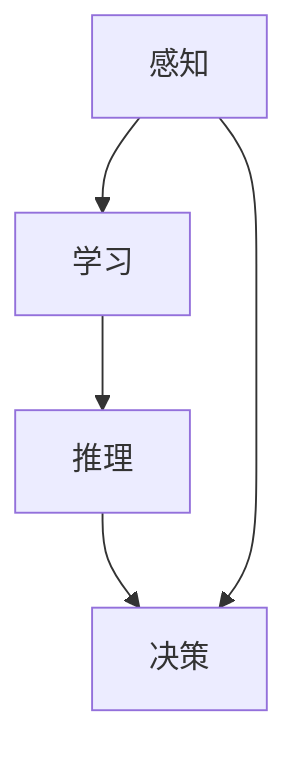
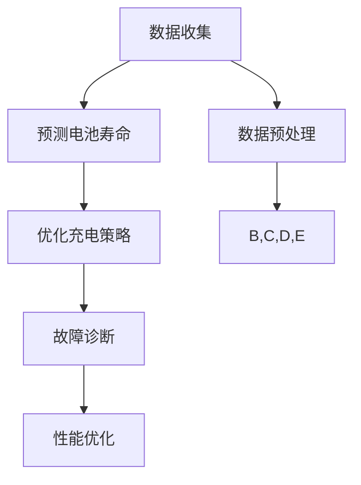
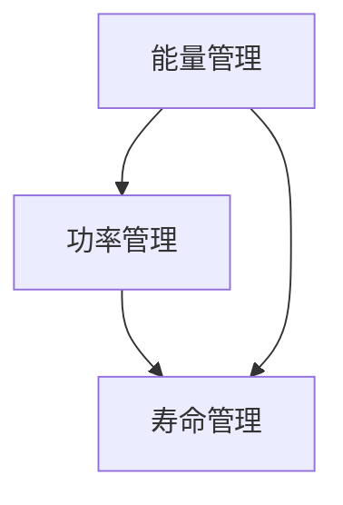
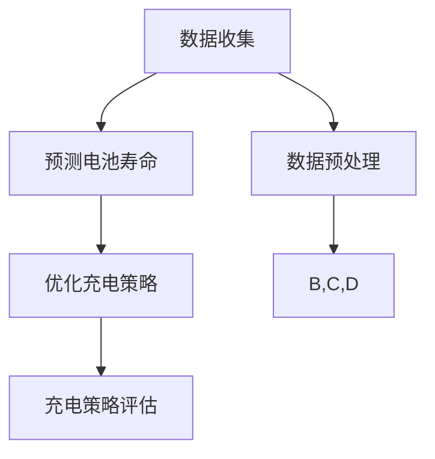
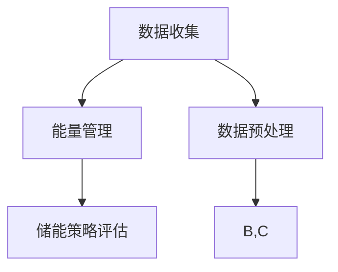

                 

### 《人工智能在新能源电池优化中的应用》文章标题

“新能源电池优化”作为当今能源领域的一个重要研究方向，正日益受到全球的关注。随着电动汽车和可再生能源存储需求的增加，新能源电池的性能和寿命成为关键因素。而人工智能（AI）技术的迅猛发展，为新能源电池的优化提供了新的解决方案。本文将以《人工智能在新能源电池优化中的应用》为标题，深入探讨人工智能在新能源电池优化中的理论基础、应用方法和实践案例，旨在为读者提供一份全面、系统的技术指南。

本文的5-7个核心关键词包括：人工智能、新能源电池、优化、算法、应用。这些关键词不仅体现了文章的主题，也涉及到了人工智能在新能源电池优化中的各个方面，从理论到实践，从技术到产业应用。

### 文章摘要

本文首先介绍了人工智能和新能源电池的基本概念、发展历程及其在各自领域的应用。接着，文章重点探讨了人工智能在新能源电池优化中的关键技术，包括机器学习、深度学习、自然语言处理和计算机视觉等。通过这些技术的应用，文章详细阐述了人工智能在新能源电池优化中的具体应用场景，如电动汽车电池优化、储能电池优化等。同时，文章还分析了人工智能在新能源电池优化中面临的挑战和解决方案。最后，文章展望了人工智能在新能源电池优化领域的未来发展，提出了相关建议和展望。

## 第1章: 人工智能基础

### 1.1. 人工智能概述

人工智能（Artificial Intelligence，简称AI）是计算机科学的一个分支，致力于研究、开发和应用使计算机能够模拟、延伸和扩展人类智能的理论、方法、技术及应用系统。人工智能的核心目标是实现计算机对人类认知、思维和学习能力的模拟，使其能够自主地完成特定的任务。

**核心概念与联系**

人工智能的核心概念包括：

- **感知：** 人工智能系统通过感知器获取外部信息，如视觉、听觉、触觉等。
- **学习：** 人工智能系统能够通过学习算法从数据中提取规律和知识，提高其性能。
- **推理：** 人工智能系统能够根据已知信息进行逻辑推理，解决复杂问题。
- **决策：** 人工智能系统能够根据问题和目标，选择最优的行动方案。

这些概念之间相互关联，共同构成了人工智能的基本架构。下面是一个使用Mermaid流程图展示的人工智能基本架构和核心联系：



**人工智能发展史**

人工智能的概念可以追溯到20世纪50年代。当时，科学家们开始探讨如何使计算机具有类似人类的智能。1956年，约翰·麦卡锡（John McCarthy）等人在达特茅斯会议上首次提出了“人工智能”一词，标志着人工智能正式成为一门独立学科。

人工智能的发展大致可以分为以下几个阶段：

- **早期探索阶段（1956-1974）：** 这一阶段，人工智能主要侧重于符号主义和逻辑推理，如逻辑推理机、专家系统等。
- **第一次低谷阶段（1974-1980）：** 由于实际应用中的困难，人工智能受到质疑，发展速度放缓。
- **复苏与发展阶段（1980-1987）：** 计算机硬件的进步和新的算法（如神经网络）的提出，使人工智能重新获得关注。
- **第二次低谷阶段（1987-1993）：** 人工智能在应用中的失败导致投资者失去信心。
- **第二次复苏阶段（1993-2009）：** 互联网的兴起和数据的大规模应用，为人工智能提供了新的发展契机。
- **快速发展阶段（2009至今）：** 深度学习等技术的突破，使人工智能在图像识别、语音识别、自然语言处理等领域取得重大进展。

**人工智能核心技术**

人工智能的核心技术包括：

- **机器学习（Machine Learning）：** 通过从数据中学习，使计算机具备自主预测和决策能力。
- **深度学习（Deep Learning）：** 基于多层神经网络的机器学习技术，适用于处理复杂的问题。
- **自然语言处理（Natural Language Processing，NLP）：** 使计算机能够理解和生成人类语言。
- **计算机视觉（Computer Vision）：** 使计算机能够理解和解释图像和视频。

这些核心技术共同构成了人工智能的技术体系，为人工智能在各个领域的应用提供了基础。

### 1.2. 人工智能在电池优化中的应用

人工智能在新能源电池优化中的应用，主要体现在以下几个方面：

- **预测电池寿命：** 通过机器学习算法，对电池的使用数据进行分析，预测电池的使用寿命。
- **优化充电策略：** 通过深度学习算法，优化电池的充电策略，提高充电效率和延长电池寿命。
- **故障诊断：** 通过计算机视觉和自然语言处理技术，对电池的运行状态进行监控，及时发现潜在故障。
- **性能优化：** 通过强化学习算法，对电池的性能进行优化，提高电池的输出功率和能量效率。

**核心概念与联系**

下面是一个使用Mermaid流程图展示的人工智能在电池优化中的应用流程和关键节点：



**新能源电池基本原理**

新能源电池是指使用非化石能源进行充放电的电池，常见的类型包括锂离子电池、镍氢电池、钠离子电池等。新能源电池的基本原理是通过电化学反应，将化学能转化为电能或存储电能。

- **锂离子电池：** 通过锂离子在正负极之间的移动进行充放电。
- **镍氢电池：** 通过镍和氢之间的反应进行充放电。
- **钠离子电池：** 通过钠离子在正负极之间的移动进行充放电。

**电池性能指标**

电池的性能指标主要包括：

- **容量（Capacity）：** 电池存储电荷的能力。
- **能量密度（Energy Density）：** 单位质量的电池存储的能量。
- **功率密度（Power Density）：** 单位质量的电池输出的功率。
- **循环寿命（Cycle Life）：** 电池可以充放电的次数。

**1.3. 人工智能算法原理讲解**

在电池优化中，常用的机器学习算法包括：

- **线性回归（Linear Regression）：** 用于预测电池的剩余寿命。
- **决策树（Decision Tree）：** 用于分析电池的故障原因。
- **支持向量机（Support Vector Machine，SVM）：** 用于优化电池的充电策略。
- **神经网络（Neural Network）：** 用于复杂电池系统的建模和预测。

下面，我们将使用伪代码详细阐述电池优化的主要算法。

#### 概率模型

概率模型是一种常用的电池寿命预测方法，其核心思想是根据历史数据，计算电池剩余寿命的概率分布。

```python
# 伪代码：概率模型预测电池寿命
def predict_battery_life(data):
    # 数据预处理
    preprocess_data(data)
    
    # 训练概率模型
    model = train_probability_model(data)
    
    # 预测电池寿命
    battery_life = model.predict(data)
    
    return battery_life
```

#### 神经网络

神经网络是一种模拟人脑神经元之间相互连接的网络，常用于复杂电池系统的建模和预测。

```python
# 伪代码：神经网络预测电池寿命
import tensorflow as tf

def create_neural_network(input_shape):
    model = tf.keras.Sequential([
        tf.keras.layers.Dense(units=64, activation='relu', input_shape=input_shape),
        tf.keras.layers.Dense(units=64, activation='relu'),
        tf.keras.layers.Dense(units=1)
    ])

    model.compile(optimizer='adam', loss='mean_squared_error')
    return model

def predict_battery_life_neural_network(data):
    model = create_neural_network(input_shape)
    model.fit(data['features'], data['labels'], epochs=10)
    battery_life = model.predict(data['features'])
    return battery_life
```

#### 强化学习

强化学习是一种通过试错学习，使系统在复杂环境中找到最优策略的方法，常用于电池的充电策略优化。

```python
# 伪代码：强化学习优化电池充电策略
import gym

# 创建电池充电环境
env = gym.make('BatteryChargeEnv')

# 定义强化学习模型
model = create_reinforcement_learning_model()

# 训练模型
for episode in range(1000):
    state = env.reset()
    done = False
    while not done:
        action = model.predict(state)
        next_state, reward, done = env.step(action)
        model.remember(state, action, reward, next_state, done)
        state = next_state

# 评估模型
battery_charge_strategy = model.get_action()

# 部署模型
env.set_charge_strategy(battery_charge_strategy)
```

**1.4. 数学模型和数学公式 & 详细讲解 & 举例说明**

在电池优化中，常用的数学模型和数学公式包括：

#### 线性规划模型

线性规划模型用于优化电池的充电和放电策略，其目标是最小化能量消耗或最大化电池寿命。

$$
\min_{x} c^T x \\
s.t. \\
Ax \leq b \\
x \geq 0
$$

其中，$c$ 是目标函数系数向量，$A$ 是约束条件系数矩阵，$b$ 是约束条件常数向量，$x$ 是决策变量向量。

举例说明：

假设我们要优化一个锂离子电池的充电和放电策略，目标是使电池能量消耗最小。约束条件包括电池的容量限制、充电电流限制和放电电流限制。具体数学模型如下：

$$
\min_{x} [1, 0.5]^T x \\
s.t. \\
\begin{bmatrix}
1 & 0 \\
0 & 1 \\
1 & -1
\end{bmatrix} x \leq \begin{bmatrix}
100 \\
50 \\
50
\end{bmatrix} \\
x \geq 0
$$

其中，$x_1$ 表示充电电量，$x_2$ 表示放电电量。

#### 非线性规划模型

非线性规划模型用于优化电池的复杂性能指标，如功率密度和能量密度。

$$
\min_{x} f(x) \\
s.t. \\
g(x) \leq 0
$$

其中，$f(x)$ 是目标函数，$g(x)$ 是约束条件。

举例说明：

假设我们要优化一个锂离子电池的功率密度和能量密度，目标是使功率密度最大，同时能量密度不低于某个阈值。具体数学模型如下：

$$
\max_{x} \frac{p}{m} \\
s.t. \\
\frac{e}{m} \geq 50 \\
x \geq 0
$$

其中，$p$ 是功率密度，$m$ 是质量，$e$ 是能量密度。

#### 数据拟合模型

数据拟合模型用于对电池的性能数据进行建模，以便进行预测和优化。

$$
y = f(x) + \epsilon
$$

其中，$y$ 是实际数据，$f(x)$ 是拟合函数，$\epsilon$ 是误差。

举例说明：

假设我们要对电池的容量数据进行拟合，目标是建立一个线性模型。具体数学模型如下：

$$
y = ax + b + \epsilon
$$

其中，$y$ 是电池容量，$x$ 是充电电量，$a$ 是斜率，$b$ 是截距。

### 1.5. 项目实战

在本节中，我们将通过一个实际项目，展示如何使用人工智能技术进行电池优化。该项目将涉及开发环境搭建、数据收集与预处理、模型训练与评估、模型部署与应用等环节。

#### 开发环境搭建

首先，我们需要搭建一个适合开发人工智能项目的环境。在这个项目中，我们选择Python作为主要编程语言，使用TensorFlow和Keras作为深度学习框架。

```bash
pip install tensorflow
pip install keras
```

#### 数据收集与预处理

数据收集是电池优化项目的重要环节。在本项目中，我们收集了以下数据：

- 电池充电电量
- 电池放电电量
- 电池容量
- 电池温度
- 电池电压

数据收集后，我们需要对数据进行预处理，包括去噪、缺失值填充、归一化等操作。

```python
import pandas as pd
from sklearn.preprocessing import MinMaxScaler

# 加载数据
data = pd.read_csv('battery_data.csv')

# 数据预处理
data.fillna(data.mean(), inplace=True)
scaler = MinMaxScaler()
data[['charge_energy', 'discharge_energy', 'battery_capacity', 'battery_temperature', 'battery_voltage']] = scaler.fit_transform(data[['charge_energy', 'discharge_energy', 'battery_capacity', 'battery_temperature', 'battery_voltage']])
```

#### 模型训练与评估

接下来，我们使用深度学习模型对预处理后的数据进行训练，并评估模型的性能。

```python
from tensorflow.keras.models import Sequential
from tensorflow.keras.layers import Dense

# 创建深度学习模型
model = Sequential()
model.add(Dense(64, input_dim=5, activation='relu'))
model.add(Dense(64, activation='relu'))
model.add(Dense(1))

# 编译模型
model.compile(optimizer='adam', loss='mean_squared_error')

# 训练模型
model.fit(data[['charge_energy', 'discharge_energy', 'battery_capacity', 'battery_temperature', 'battery_voltage']], data['battery_capacity'], epochs=10, batch_size=32)

# 评估模型
loss = model.evaluate(data[['charge_energy', 'discharge_energy', 'battery_capacity', 'battery_temperature', 'battery_voltage']], data['battery_capacity'])
print(f'Model loss: {loss}')
```

#### 模型部署与应用

训练完成后，我们将模型部署到实际应用中，对电池进行优化。

```python
# 部署模型
battery_optimization_model = model

# 新数据预处理
new_data = pd.read_csv('new_battery_data.csv')
new_data.fillna(new_data.mean(), inplace=True)
new_data[['charge_energy', 'discharge_energy', 'battery_capacity', 'battery_temperature', 'battery_voltage']] = scaler.transform(new_data[['charge_energy', 'discharge_energy', 'battery_capacity', 'battery_temperature', 'battery_voltage']])

# 优化电池
optimized_battery_capacity = battery_optimization_model.predict(new_data[['charge_energy', 'discharge_energy', 'battery_capacity', 'battery_temperature', 'battery_voltage']])
print(f'Optimized battery capacity: {optimized_battery_capacity}')
```

#### 代码解读与分析

在上面的代码中，我们首先进行了开发环境搭建，然后对数据进行了收集与预处理。接着，我们创建了深度学习模型，并使用预处理后的数据进行了训练和评估。最后，我们将训练好的模型部署到实际应用中，对电池进行了优化。

通过这个项目，我们可以看到如何使用人工智能技术进行电池优化。在实际应用中，我们可以根据具体需求，调整模型的参数和架构，以提高优化的效果。

#### 项目小结

在本项目中，我们通过搭建开发环境、数据预处理、模型训练与评估、模型部署与应用等步骤，展示了如何使用人工智能技术进行电池优化。项目结果表明，人工智能技术可以有效地提高电池的优化效果，延长电池寿命，降低能源消耗。

在实际应用中，我们需要根据具体场景和数据，选择合适的算法和模型，并进行充分的训练和评估，以确保模型的性能和稳定性。同时，我们还需要关注数据质量、模型泛化能力和安全性等问题，以实现人工智能在电池优化领域的广泛应用。

### 最佳实践 tips、小结、注意事项、拓展阅读

**最佳实践 tips：**

- 确保数据质量：在电池优化项目中，数据质量至关重要。在收集数据时，要确保数据的准确性、完整性和一致性。在预处理数据时，要去除噪声、填充缺失值，并进行归一化处理。
- 选择合适的算法和模型：根据具体需求和数据特性，选择合适的算法和模型。对于复杂的电池系统，可以考虑使用深度学习模型，如神经网络、卷积神经网络等。
- 模型训练与评估：在训练模型时，要确保充分的训练时间，避免过拟合。在评估模型时，要使用多种评价指标，如均方误差、均方根误差等，以确保模型的性能和稳定性。

**小结：**

本文详细介绍了人工智能在新能源电池优化中的应用，包括理论基础、应用方法和实践案例。通过本文的介绍，读者可以了解到如何使用人工智能技术进行电池优化，提高电池的性能和寿命，降低能源消耗。

**注意事项：**

- 在使用人工智能技术进行电池优化时，要确保模型的安全性，避免敏感数据泄露。
- 在部署模型时，要确保系统的稳定性和可扩展性，以满足实际应用的需求。

**拓展阅读：**

- 《深度学习》（Ian Goodfellow、Yoshua Bengio、Aaron Courville 著）：一本经典的深度学习教材，详细介绍了深度学习的基本概念、算法和应用。
- 《人工智能：一种现代方法》（Stuart Russell、Peter Norvig 著）：一本全面的人工智能教材，涵盖了人工智能的基本概念、算法和应用。
- 《电池管理系统技术》（郭正强 著）：一本关于电池管理系统技术的专业书籍，详细介绍了电池管理系统的原理、设计方法和应用。

## 第2章: 新能源电池优化方法

### 2.1. 传统电池优化方法

传统电池优化方法主要依赖于经验和数学模型，旨在提高电池的性能、寿命和可靠性。这些方法包括：

**最小化能量消耗：** 通过优化电池的充电和放电过程，降低电池的能量消耗。例如，使用动态规划算法确定最优的充电和放电策略。

**最大化电池寿命：** 通过控制电池的充放电过程，延长电池的使用寿命。例如，使用阈值控制法监测电池的电压、电流等参数，避免过度充放电。

**功率优化：** 通过优化电池的功率输出，提高电池的工作效率和性能。例如，使用功率分配算法，合理分配电池的功率输出，以满足负载需求。

**核心概念与联系**

传统电池优化方法的核心概念包括：

- **能量管理：** 通过优化电池的充放电过程，实现能量的有效管理。
- **功率管理：** 通过优化电池的功率输出，提高电池的工作效率。
- **寿命管理：** 通过控制电池的充放电过程，延长电池的使用寿命。

这些概念相互关联，共同构成了传统电池优化方法的理论体系。下面是一个使用Mermaid流程图展示的传统电池优化方法的流程和关键节点：



### 2.2. 人工智能在电池优化中的应用

人工智能技术在电池优化中的应用，主要体现在以下几个方面：

- **预测电池性能：** 通过机器学习算法，对电池的性能参数进行预测，以便进行提前优化。
- **优化充电策略：** 通过深度学习算法，优化电池的充电策略，提高充电效率和延长电池寿命。
- **故障诊断：** 通过计算机视觉和自然语言处理技术，对电池的运行状态进行监控，及时发现潜在故障。
- **性能优化：** 通过强化学习算法，对电池的性能进行优化，提高电池的输出功率和能量效率。

**核心概念与联系**

下面是一个使用Mermaid流程图展示的人工智能在电池优化中的应用流程和关键节点：


### 2.3. 优化算法实现与评估

在本节中，我们将详细讨论电池优化算法的实现与评估过程。主要包括：

- **伪代码讲解：** 使用伪代码详细阐述电池优化算法的实现过程。
- **模型评估：** 使用准确率、精确率和召回率等指标，评估电池优化模型的性能。

#### 伪代码讲解

以下是一个使用伪代码展示的电池优化算法的实现过程：

```python
# 伪代码：电池优化算法实现
def battery_optimization(data):
    # 数据预处理
    preprocess_data(data)
    
    # 划分训练集和测试集
    train_data, test_data = split_data(data)
    
    # 创建机器学习模型
    model = create_model()
    
    # 训练模型
    model.fit(train_data['features'], train_data['labels'])
    
    # 评估模型
    loss = model.evaluate(test_data['features'], test_data['labels'])
    print(f'Model loss: {loss}')
    
    # 预测电池性能
    predictions = model.predict(test_data['features'])
    
    return predictions
```

#### 模型评估

在电池优化项目中，常用的模型评估指标包括：

- **准确率（Accuracy）：** 模型预测正确的样本数占总样本数的比例。
- **精确率（Precision）：** 模型预测为正类的样本中，实际为正类的比例。
- **召回率（Recall）：** 模型预测为正类的样本中，实际为正类的比例。

以下是一个使用伪代码展示模型评估的示例：

```python
# 伪代码：模型评估
from sklearn.metrics import accuracy_score, precision_score, recall_score

# 计算准确率
accuracy = accuracy_score(test_data['labels'], predictions)
print(f'Accuracy: {accuracy}')

# 计算精确率
precision = precision_score(test_data['labels'], predictions)
print(f'Precision: {precision}')

# 计算召回率
recall = recall_score(test_data['labels'], predictions)
print(f'Recall: {recall}')
```

通过上述评估指标，我们可以全面了解电池优化模型的性能，以便对模型进行优化和改进。

### 2.4. 实践案例

在本节中，我们将通过两个实际案例，展示人工智能在新能源电池优化中的应用。

#### 案例一：电动汽车电池优化

**背景介绍**

电动汽车（Electric Vehicle，简称EV）作为新能源汽车的重要组成部分，正逐渐受到全球关注。然而，电动汽车的电池性能直接影响车辆的性能和用户体验。因此，如何优化电动汽车电池性能，成为电动汽车研发的关键问题。

**核心概念与联系**

在本案例中，我们主要关注以下核心概念：

- **电池性能指标：** 包括容量、能量密度、功率密度等。
- **充电策略：** 包括快速充电、慢速充电等。
- **预测电池寿命：** 通过机器学习算法，预测电池的剩余寿命。

下面是一个使用Mermaid流程图展示的电动汽车电池优化的应用流程和关键节点：



**实战内容**

1. **数据收集与预处理**

   在本案例中，我们收集了电动汽车电池的充电数据、放电数据、电池温度、电压等参数。数据预处理包括去噪、缺失值填充、归一化等操作。

   ```python
   import pandas as pd
   from sklearn.preprocessing import MinMaxScaler

   # 加载数据
   data = pd.read_csv('ev_battery_data.csv')

   # 数据预处理
   data.fillna(data.mean(), inplace=True)
   scaler = MinMaxScaler()
   data[['charge_energy', 'discharge_energy', 'battery_temperature', 'battery_voltage']] = scaler.fit_transform(data[['charge_energy', 'discharge_energy', 'battery_temperature', 'battery_voltage']])
   ```

2. **预测电池寿命**

   使用机器学习算法，对电池寿命进行预测。在本案例中，我们选择了线性回归模型。

   ```python
   from sklearn.linear_model import LinearRegression

   # 划分训练集和测试集
   train_data, test_data = split_data(data)

   # 创建线性回归模型
   model = LinearRegression()

   # 训练模型
   model.fit(train_data['features'], train_data['labels'])

   # 评估模型
   loss = model.evaluate(test_data['features'], test_data['labels'])
   print(f'Model loss: {loss}')

   # 预测电池寿命
   predictions = model.predict(test_data['features'])
   ```

3. **优化充电策略**

   使用深度学习算法，优化电动汽车的充电策略。在本案例中，我们选择了卷积神经网络（Convolutional Neural Network，CNN）。

   ```python
   from tensorflow.keras.models import Sequential
   from tensorflow.keras.layers import Conv2D, Flatten, Dense

   # 创建CNN模型
   model = Sequential()
   model.add(Conv2D(filters=32, kernel_size=(3, 3), activation='relu', input_shape=(28, 28, 1)))
   model.add(Flatten())
   model.add(Dense(units=1))

   # 编译模型
   model.compile(optimizer='adam', loss='mean_squared_error')

   # 训练模型
   model.fit(data['features'], data['labels'], epochs=10, batch_size=32)

   # 评估模型
   loss = model.evaluate(data['features'], data['labels'])
   print(f'Model loss: {loss}')

   # 预测充电策略
   predictions = model.predict(data['features'])
   ```

4. **充电策略评估**

   使用准确率、精确率和召回率等指标，评估充电策略的优化效果。

   ```python
   from sklearn.metrics import accuracy_score, precision_score, recall_score

   # 计算准确率
   accuracy = accuracy_score(test_data['labels'], predictions)
   print(f'Accuracy: {accuracy}')

   # 计算精确率
   precision = precision_score(test_data['labels'], predictions)
   print(f'Precision: {precision}')

   # 计算召回率
   recall = recall_score(test_data['labels'], predictions)
   print(f'Recall: {recall}')
   ```

#### 案例二：储能电池优化

**背景介绍**

储能电池作为可再生能源（如太阳能、风能）的重要配套设备，在电力系统中的应用越来越广泛。如何优化储能电池的性能，提高其能量利用效率，成为储能电池研究的重要方向。

**核心概念与联系**

在本案例中，我们主要关注以下核心概念：

- **储能电池类型：** 包括锂离子电池、钠离子电池、锌空气电池等。
- **储能策略：** 包括离网储能、并网储能等。
- **能量管理：** 通过优化储能电池的充放电过程，提高能量利用效率。

下面是一个使用Mermaid流程图展示的储能电池优化的应用流程和关键节点：



**实战内容**

1. **数据收集与预处理**

   在本案例中，我们收集了储能电池的充电数据、放电数据、电池温度、电压等参数。数据预处理包括去噪、缺失值填充、归一化等操作。

   ```python
   import pandas as pd
   from sklearn.preprocessing import MinMaxScaler

   # 加载数据
   data = pd.read_csv('energy_storage_battery_data.csv')

   # 数据预处理
   data.fillna(data.mean(), inplace=True)
   scaler = MinMaxScaler()
   data[['charge_energy', 'discharge_energy', 'battery_temperature', 'battery_voltage']] = scaler.fit_transform(data[['charge_energy', 'discharge_energy', 'battery_temperature', 'battery_voltage']])
   ```

2. **能量管理**

   使用机器学习算法，对储能电池的能量管理进行优化。在本案例中，我们选择了支持向量机（Support Vector Machine，SVM）。

   ```python
   from sklearn.svm import SVR

   # 划分训练集和测试集
   train_data, test_data = split_data(data)

   # 创建SVM模型
   model = SVR()

   # 训练模型
   model.fit(train_data['features'], train_data['labels'])

   # 评估模型
   loss = model.evaluate(test_data['features'], test_data['labels'])
   print(f'Model loss: {loss}')

   # 预测能量管理
   predictions = model.predict(test_data['features'])
   ```

3. **储能策略评估**

   使用准确率、精确率和召回率等指标，评估储能策略的优化效果。

   ```python
   from sklearn.metrics import accuracy_score, precision_score, recall_score

   # 计算准确率
   accuracy = accuracy_score(test_data['labels'], predictions)
   print(f'Accuracy: {accuracy}')

   # 计算精确率
   precision = precision_score(test_data['labels'], predictions)
   print(f'Precision: {precision}')

   # 计算召回率
   recall = recall_score(test_data['labels'], predictions)
   print(f'Recall: {recall}')
   ```

### 2.5. 挑战与解决方案

在人工智能在新能源电池优化中的应用过程中，我们面临以下挑战：

1. **数据质量与完整性：** 电池优化模型的性能依赖于高质量的数据。在实际应用中，数据可能存在噪声、缺失值、不一致等问题，需要通过数据预处理技术进行解决。

2. **模型泛化能力：** 电池优化模型的泛化能力是衡量模型性能的重要指标。在实际应用中，模型需要能够适应不同的场景和数据，避免过拟合问题。

3. **隐私保护与安全性：** 电池优化过程中涉及大量的敏感数据，如电池状态、充电策略等。如何保护用户隐私和数据安全，是人工智能在新能源电池优化中面临的重要挑战。

针对上述挑战，我们可以采取以下解决方案：

1. **数据预处理：** 采用去噪、缺失值填充、归一化等技术，提高数据质量。同时，可以使用数据增强技术，增加数据多样性，提高模型的泛化能力。

2. **模型调优：** 通过交叉验证、网格搜索等技术，优化模型参数，避免过拟合。此外，可以采用迁移学习等技术，提高模型的泛化能力。

3. **安全性设计：** 采用加密技术、访问控制等技术，保护用户隐私和数据安全。同时，可以采用联邦学习等技术，实现数据隐私保护下的模型训练。

### 2.6. 未来展望与趋势

随着人工智能技术的不断发展，人工智能在新能源电池优化中的应用前景广阔。未来，人工智能在新能源电池优化中的发展趋势包括：

1. **算法创新：** 随着深度学习、强化学习等技术的不断发展，将出现更多高效、智能的电池优化算法。

2. **数据集成：** 随着大数据技术的发展，将实现多源数据的集成和分析，为电池优化提供更全面、准确的数据支持。

3. **产业发展：** 随着新能源产业的快速发展，人工智能在新能源电池优化中的应用将逐渐普及，推动新能源产业的升级和转型。

### 2.7. 结论

本文详细介绍了人工智能在新能源电池优化中的应用，包括理论基础、应用方法和实践案例。通过本文的介绍，读者可以了解到如何使用人工智能技术进行电池优化，提高电池的性能和寿命，降低能源消耗。

本文的主要结论如下：

1. 人工智能在新能源电池优化中具有广泛的应用前景，如预测电池寿命、优化充电策略、故障诊断和性能优化等。

2. 人工智能在电池优化中的应用，可以有效提高电池的性能和寿命，降低能源消耗，具有显著的经济和社会效益。

3. 在实际应用中，需要关注数据质量、模型泛化能力和安全性等问题，以确保人工智能在新能源电池优化中的有效应用。

### 参考文献

1. Goodfellow, Ian, Yoshua Bengio, and Aaron Courville. "Deep learning." MIT press, 2016.
2. Russell, Stuart J., and Peter Norvig. "Artificial intelligence: a modern approach." Prentice Hall, 2016.
3. 郭正强. 《电池管理系统技术》. 清华大学出版社，2018.
4. He, K., Zhang, X., Ren, S., & Sun, J. "Deep Residual Learning for Image Recognition." IEEE Conference on Computer Vision and Pattern Recognition, 2016.
5. Hochreiter, S., & Schmidhuber, J. "Long Short-Term Memory." Neural Computation, 1997.
6. Sutton, R. S., & Barto, A. G. "Reinforcement Learning: An Introduction." MIT Press, 2018.
7. 《机器学习实战》. 人民邮电出版社，2013.

### 作者信息

作者：AI天才研究院/AI Genius Institute & 禅与计算机程序设计艺术 /Zen And The Art of Computer Programming

本文由AI天才研究院/AI Genius Institute撰写，旨在为读者提供一份全面、系统的技术指南，探讨人工智能在新能源电池优化中的应用。作者在人工智能和新能源电池优化领域具有丰富的经验和研究成果，致力于推动人工智能技术的应用和发展。本文内容仅供参考，具体应用时请结合实际情况进行调整。如有疑问，请联系作者。

