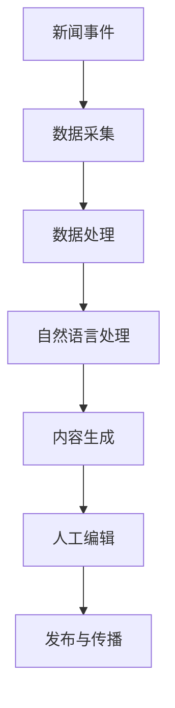

                 

## 《人工智能在新闻生产中的应用：自动化与人工编辑的结合》

### 关键词：人工智能、新闻生产、自动化、人工编辑、结合

新闻业在过去几十年中经历了巨大的变革，而人工智能（AI）的兴起更是为新闻生产带来了前所未有的机遇和挑战。本文旨在探讨人工智能在新闻生产中的应用，特别是自动化与人工编辑相结合的方式，分析其技术原理、实践案例及未来展望。

### 摘要

本文从人工智能与新闻生产的基本概念入手，详细介绍了自动化新闻生产与人工编辑的结合。首先，我们分析了自动化新闻生产的技术，包括数据采集与处理、自然语言处理技术以及图像与视频处理技术。接着，探讨了人工编辑在新闻生产中的作用与面临的挑战。随后，通过具体案例研究了自动化新闻生产的实践，并分析了人工编辑与自动化的协同。最后，我们展望了自动化与人工编辑结合的发展方向，讨论了未来面临的挑战与解决方案。

### 第一部分：引言与背景

#### 1.1.1 人工智能与新闻生产概述

##### 人工智能的基本概念

人工智能（Artificial Intelligence，简称AI）是计算机科学的一个分支，旨在创建智能机器，使它们能够执行通常需要人类智能的任务。这些任务包括视觉感知、语音识别、决策制定、语言翻译等。

##### 新闻生产的重要性

新闻生产是信息传播的重要环节，其质量和效率直接影响到公众获取信息的准确性和及时性。随着信息量的爆炸性增长，传统的人工新闻生产方式已难以满足现代社会的需求。

##### 人工智能在新闻生产中的应用前景

人工智能技术为新闻生产带来了新的可能。首先，自动化新闻生产可以大幅提高生产效率，降低成本。其次，人工智能可以帮助新闻机构更好地处理和挖掘大量数据，从而提供更有价值的新闻内容。此外，人工智能还可以通过个性化推荐，提高用户满意度。

#### 1.1.2 自动化新闻生产与人工编辑的结合

##### 自动化新闻生产的定义与现状

自动化新闻生产是指利用计算机程序和算法来生成新闻内容，包括数据采集、处理、分析和发布。目前，自动化新闻生产已经在新闻报道、体育赛事报道和财经新闻等领域得到广泛应用。

##### 人工编辑的作用与挑战

人工编辑在新闻生产中仍然发挥着不可替代的作用。他们负责质量控制、内容审核、个性化推荐和用户互动等任务。然而，随着自动化技术的发展，人工编辑面临着角色转变和技能更新的挑战。

##### 自动化与人工编辑结合的优势

将自动化与人工编辑相结合，可以充分发挥两者的优势。自动化可以提高生产效率和内容质量，而人工编辑则可以确保新闻的准确性和公正性。这种结合还可以实现更高效的内容分发和个性化推荐，提高用户满意度。

### 第二部分：自动化新闻生产技术

#### 2.1.1 数据采集与处理

##### 数据源的选择与处理

数据采集是自动化新闻生产的关键步骤。数据源的选择至关重要，需要考虑数据的真实性、准确性和时效性。常见的数据源包括社交媒体、新闻网站、财经数据平台等。

##### 数据清洗与格式化

采集到的数据通常是不完整、不一致和噪声的。因此，数据清洗和格式化是数据处理的必要步骤。这一过程包括去除重复数据、填充缺失值、去除噪声数据等。

##### 数据存储与管理

处理后的数据需要存储和管理。常用的存储技术包括关系型数据库、非关系型数据库和分布式存储系统。数据管理还包括数据的备份、恢复和安全性保障。

#### 2.1.2 自然语言处理技术

##### 文本分类与主题检测

文本分类是将文本数据按照预定的类别进行分类。主题检测是自动识别文本中的主题，从而更好地组织和管理新闻内容。

##### 自动摘要与内容生成

自动摘要是从大量文本中提取关键信息，生成简短的摘要。内容生成是指利用自然语言处理技术自动生成新闻文章，包括新闻报道、体育赛事报道和财经新闻等。

##### 语言翻译与多语言处理

语言翻译是将一种语言的文本翻译成另一种语言。多语言处理则涉及多种语言的文本处理和分析。

#### 2.1.3 图像与视频处理技术

##### 图像识别与分类

图像识别是识别图像中的对象和场景。分类是将图像按照预定的类别进行分类。

##### 视频内容分析

视频内容分析包括视频分割、目标检测、情感分析等。这些技术可以用于体育赛事报道、突发事件报道等。

##### 图像与视频合成

图像与视频合成是将多张图像或视频片段组合成一个连续的视频，用于新闻报道、视频摘要等。

### 第三部分：人工编辑的作用与挑战

#### 3.1.1 人工编辑的角色

##### 质量控制与内容审核

人工编辑负责对自动化生成的新闻内容进行审核，确保内容的准确性和公正性。

##### 个性化推荐与用户互动

人工编辑可以根据用户兴趣和行为，提供个性化的新闻推荐，并参与用户互动。

##### 故事讲述与情感传递

人工编辑具有人类独特的创造力，可以更好地讲述故事，传递情感，提升新闻的吸引力。

#### 3.1.2 自动化带来的挑战

##### 机器新闻的客观性

自动化新闻生产可能影响新闻的客观性，需要人工编辑进行监督和纠正。

##### 人机协同的平衡

自动化与人工编辑的结合需要找到合适的平衡点，确保新闻生产的高效和质量。

##### 道德与伦理问题

自动化新闻生产可能引发道德和伦理问题，如隐私侵犯、虚假新闻等，需要人工编辑参与解决。

### 第四部分：自动化与人工编辑的结合实践

#### 4.1.1 自动化新闻生产的案例研究

##### 案例一：实时新闻报道

实时新闻报道利用自动化技术实时采集和生成新闻内容，人工编辑进行审核和补充。

##### 案例二：体育赛事报道

体育赛事报道利用自动化技术进行视频内容分析和自动摘要生成，人工编辑进行内容优化和用户互动。

##### 案例三：财经新闻自动化

财经新闻自动化利用自动化技术处理大量财经数据，人工编辑进行数据分析报告生成。

#### 4.1.2 人工编辑与自动化的协同

##### 人机协作流程设计

人工编辑与自动化的协同需要设计合理的人机协作流程，确保新闻生产的高效和质量。

##### 人工编辑的角色转变

人工编辑的角色需要从传统的新闻生产向内容审核、用户互动和故事讲述等方向发展。

##### 人工智能工具的使用

人工编辑可以借助人工智能工具提高工作效率，如文本分类工具、情感分析工具等。

### 第五部分：未来展望与趋势

#### 5.1.1 自动化与人工编辑结合的发展方向

##### 人工智能在新闻生产中的潜力

人工智能在新闻生产中具有巨大潜力，可以通过自动化和个性化提高新闻质量和用户体验。

##### 新兴技术与新闻生产的融合

未来，新兴技术如虚拟现实、增强现实、区块链等将进一步与新闻生产融合，推动新闻业的发展。

##### 国际新闻生产的自动化趋势

国际新闻生产正在向自动化和智能化方向发展，全球新闻机构正在积极探索和实践自动化新闻生产技术。

#### 5.1.2 面临的挑战与解决方案

##### 技术进步与伦理道德

技术进步带来了自动化和智能化的机遇，但也引发了伦理道德问题。需要制定相应的法规和政策，确保新闻生产的道德规范。

##### 法规政策与行业规范

法规政策和行业规范对于自动化新闻生产至关重要，需要制定明确的规范和标准，保障新闻质量。

##### 人才需求与教育培训

自动化与人工编辑的结合对人才需求提出了新的要求。需要加强对新闻从业人员的教育培训，提高他们的技术能力和道德素养。

### 附录：资源与工具

#### A.1.1 自动化新闻生产相关资源

##### 数据集与工具介绍

- 新闻数据集： MSNBC, BBC, AP
- 工具： Python, R, Scikit-learn, NLTK

##### 开源框架与库推荐

- NLP框架： spaCy, NLTK, Gensim
- 图像处理库： OpenCV, PIL
- 自动化工具： Jenkins, GitLab CI

##### 在线平台与社区资源

- Kaggle
- DataCamp
- Reddit NLP

#### A.1.2 人工编辑技能提升方法

##### 在线课程与培训

- Coursera：新闻编辑与报道课程
- edX：新闻写作与报道课程

##### 实践项目与案例学习

- Kaggle：新闻数据集竞赛
- GitHub：新闻编辑开源项目

##### 行业交流与网络拓展

- LinkedIn：新闻业专业社群
- Twitter：新闻编辑和报道话题

### Mermaid 流程图



### 伪代码示例

```python
# 伪代码：自动化摘要生成

def generate_abstract(text):
    # 步骤1：文本预处理
    processed_text = preprocess_text(text)

    # 步骤2：使用NLP技术提取关键信息
    keywords = extract_keywords(processed_text)

    # 步骤3：生成摘要
    abstract = generate_summary(processed_text, keywords)

    return abstract
```

### 数学模型与公式

$$
\text{信息熵}(-H(X)) = \sum_{x \in X} p(x) \log_2(p(x))
$$

### 项目实战

#### 6.1.1 实战一：构建实时新闻报道系统

##### 开发环境搭建

- 操作系统：Linux
- 编程语言：Python
- 数据库：MySQL

##### 数据采集与处理

- 数据源：Twitter, Reddit
- 数据处理：数据清洗，文本预处理

##### 自动化内容生成

- 技术：自然语言处理，文本生成

##### 人工编辑与校对

- 角色：内容审核，用户互动

#### 6.1.2 实战二：设计体育赛事报道自动化流程

##### 数据源选择

- 数据源：体育赛事直播流，社交媒体

##### 视频内容分析

- 技术：图像识别，视频分割

##### 自动化摘要与报道生成

- 技术：自然语言处理，文本生成

##### 人工编辑参与

- 角色：内容优化，用户互动

### 6.2.1 代码解读：实时新闻报道数据采集模块

```python
# 实时新闻报道数据采集模块

import tweepy
import json

# 配置API密钥和API密钥密码
consumer_key = 'YOUR_CONSUMER_KEY'
consumer_secret = 'YOUR_CONSUMER_SECRET'
access_token = 'YOUR_ACCESS_TOKEN'
access_token_secret = 'YOUR_ACCESS_TOKEN_SECRET'

# 创建Tweepy认证对象
auth = tweepy.OAuthHandler(consumer_key, consumer_secret)
auth.set_access_token(access_token, access_token_secret)

# 创建Tweepy API对象
api = tweepy.API(auth)

# 搜集特定主题的推文
def collect_tweets(主题, count=100):
    tweets = []
    for tweet in tweepy.Cursor(api.search_tweets, q=主题, lang="zh", count=count).items(count):
        tweets.append(json.loads(tweet._json))

    return tweets

# 示例：搜集关于“人工智能”的推文
tweets = collect_tweets("人工智能", 100)

# 打印搜集到的推文
for tweet in tweets:
    print(json.dumps(tweet, ensure_ascii=False))
```

### 6.2.2 代码分析：体育赛事报道内容生成模块

```python
# 体育赛事报道内容生成模块

import spacy
from transformers import pipeline

# 加载Spacy语言模型
nlp = spacy.load("zh_core_web_sm")

# 加载Transformers文本生成模型
text_generator = pipeline("text-generation", model="microsoft/mbart-large-cc25-chinese", tokenizer="microsoft/mbart-large-cc25-chinese")

# 自动化摘要生成
def generate_abstract(sports_event):
    # 步骤1：文本预处理
    doc = nlp(sports_event)

    # 步骤2：提取关键信息
    sentences = list(doc.sents)

    # 步骤3：生成摘要
    abstract = text_generator(sports_event, max_length=100, num_return_sequences=1)[0]['generated_text']

    return abstract

# 示例：生成关于篮球比赛的摘要
sports_event = "2023年NBA总决赛G5，金州勇士队对阵波士顿凯尔特人队。比赛在密尔沃基市进行，勇士队最终以109-103战胜凯尔特人队，系列赛总比分2-3。"
abstract = generate_abstract(sports_event)
print("摘要：", abstract)
```

### 6.2.3 主流NLP框架对比

| 框架         | 特点                     | 适用场景               |
|------------|----------------------|----------------------|
| Stanford NLP | 基于规则的方法，可扩展性强 | 处理复杂语言任务，如命名实体识别 |
| NLTK       | 简单易用，文档丰富       | 文本预处理，简单文本分析       |
| spaCy      | 高效，深度神经网络支持   | 实时文本分析，文本分类         |
| Transformers | 基于深度学习的大规模预训练模型 | 处理复杂语言任务，如机器翻译、文本生成 |

### 6.2.4 自动化新闻生产工具

| 工具         | 功能                     | 适用场景               |
|------------|----------------------|----------------------|
| NLTK       | 文本分类，词频统计       | 简单的文本分析任务       |
| Gensim     | 文本相似度计算，主题模型   | 文本挖掘，内容推荐       |
| Hugging Face Transformers | 预训练语言模型，文本生成 | 复杂语言任务，文本生成       |

### 6.2.5 人工编辑技能提升资源

| 资源           | 功能                     | 适用人群               |
|--------------|----------------------|----------------------|
| Coursera       | 在线课程，涵盖新闻编辑与报道 | 新闻从业人员，学生       |
| Medium         | 写作社区，实践分享       | 新闻爱好者，学生       |
| LinkedIn       | 行业交流，职业拓展       | 新闻从业人员，职场人士   |

### 总结

人工智能在新闻生产中的应用，特别是自动化与人工编辑的结合，正在重塑新闻业的生产方式和传播模式。通过本文的探讨，我们可以看到自动化新闻生产技术已经取得了显著的进展，而人工编辑在确保新闻质量和用户体验方面仍然发挥着关键作用。未来，随着技术的不断进步，自动化与人工编辑的结合将更加紧密，为新闻业带来更多创新和机遇。然而，我们也需要关注由此带来的伦理道德和社会问题，制定相应的政策和规范，确保新闻生产的健康发展。

### 最佳实践 Tips

1. **合理利用开源工具**：选择适合的开源NLP工具和框架，如spaCy和Transformers，可以大大提高开发效率。
2. **数据质量是关键**：确保数据源的真实性和准确性，进行有效的数据清洗和预处理，为后续分析奠定基础。
3. **人机协作**：在新闻生产过程中，充分利用人工智能技术提高效率，同时保持人工编辑的参与，确保新闻的准确性和公正性。
4. **持续学习与更新**：新闻从业人员需要不断学习新技术，提升自己的技能，以适应自动化新闻生产的需求。
5. **关注用户反馈**：通过用户反馈不断优化新闻内容，提高用户满意度和新闻传播效果。

### 小结

本文从多个角度探讨了人工智能在新闻生产中的应用，特别是自动化与人工编辑的结合。通过分析技术原理、实践案例和未来趋势，我们看到了人工智能在提高新闻生产效率、质量和服务水平方面的巨大潜力。然而，这一领域仍面临诸多挑战，需要业界共同努力，制定合理的政策和规范，确保新闻业的可持续发展。

### 注意事项

1. **数据隐私保护**：在数据采集和处理过程中，务必遵守相关法律法规，保护用户隐私。
2. **新闻伦理**：人工智能在新闻生产中的应用必须遵循新闻伦理，确保新闻内容的真实性和公正性。
3. **技术更新**：密切关注人工智能技术的发展动态，及时更新相关技术，提高自动化新闻生产的水平。

### 拓展阅读

1. **《人工智能时代：人类将如何应对》**：[作者：刘慈欣]
2. **《深度学习在自然语言处理中的应用》**：[作者：Goodfellow, Bengio, Courville]
3. **《新闻编辑学》**：[作者：张耀峰]

作者：AI天才研究院/AI Genius Institute & 禅与计算机程序设计艺术 /Zen And The Art of Computer Programming

