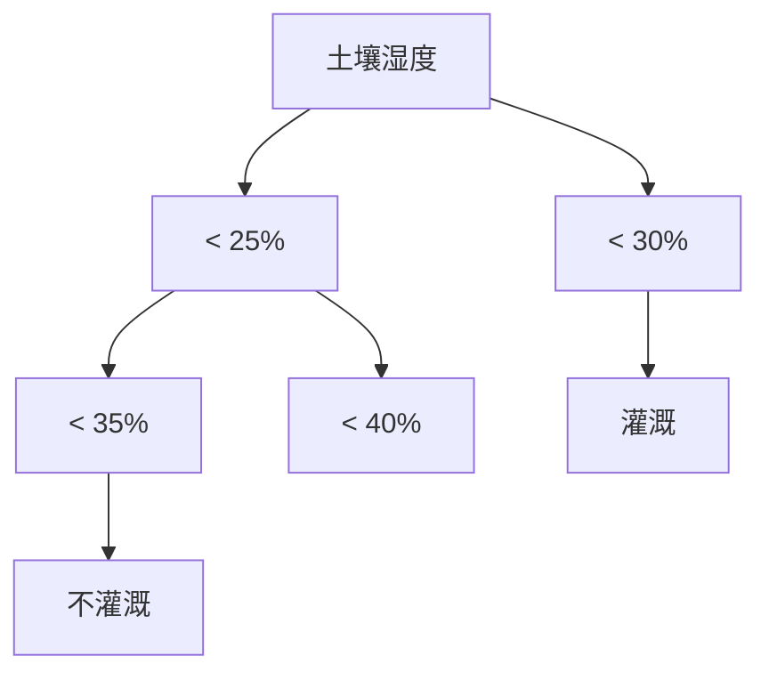

                 

### 文章标题：人工智能在智能灌溉系统中的应用

#### 关键词：
- 人工智能
- 智能灌溉系统
- 传感器技术
- 数据采集与处理
- 机器学习算法
- 实际应用案例

#### 摘要：
本文将深入探讨人工智能在智能灌溉系统中的应用，涵盖从基本概念到实际应用的各个方面。通过解析人工智能技术如何通过传感器、数据采集与处理以及机器学习算法优化灌溉过程，本文展示了智能灌溉系统的设计原理、应用场景及未来发展趋势。同时，通过具体案例分析和项目实战，为读者提供宝贵的实践经验。

---

在现代农业中，智能灌溉系统正逐渐成为提高作物产量、节约水资源的重要手段。而人工智能（AI）技术的引入，则为智能灌溉系统带来了更加精准和高效的管理方式。本文将分章节详细解析人工智能在智能灌溉系统中的应用，帮助读者全面理解这一领域的最新进展。

### 第1章: 人工智能概述

人工智能是一门涵盖计算机科学、心理学和神经科学等多个领域的交叉学科，旨在开发出能够模拟、延伸和扩展人类智能的理论、算法和技术。人工智能的发展历程可以追溯到20世纪50年代，至今已经历过了多个阶段，包括基于规则的系统、知识表示和推理、统计学习、深度学习等。

在智能灌溉系统中，人工智能的核心概念包括：

- **传感器**：用于实时监测土壤湿度、气温、光照等环境参数。
- **数据采集与处理**：通过传感器获取数据，经过清洗、转换和整合，形成可用于分析的数据集。
- **机器学习算法**：利用历史数据训练模型，对灌溉策略进行优化。

这些核心概念之间紧密联系，共同构建了智能灌溉系统的智能核心。

#### 1.1 人工智能的定义与发展历程

人工智能的定义经历了多次演变。最初，人工智能被定义为“制造智能机器的科学与工程”，后来随着技术的进步，其定义进一步扩展到包括模拟、延伸和扩展人类智能的各种方法和技术。

人工智能的发展历程可以概括为以下几个阶段：

- **符号人工智能**（Symbolic AI）：基于逻辑推理和知识表示，代表性算法为专家系统和逻辑推理机。
- **统计学习**（Statistical Learning）：基于统计方法和概率模型，代表性算法为决策树、支持向量机和神经网络。
- **深度学习**（Deep Learning）：基于多层神经网络，通过大量数据训练模型，代表性算法为深度神经网络和卷积神经网络。

#### 1.2 人工智能的核心概念

人工智能的核心概念包括：

- **感知能力**：通过传感器获取外部信息。
- **决策能力**：基于感知到的信息进行判断和决策。
- **学习能力**：通过数据训练和模式识别提高决策能力。

感知能力、决策能力和学习能力相互关联，共同构成了人工智能的智能体系。

#### 1.3 人工智能的分类

人工智能可以分为多种类型，包括：

- **弱人工智能**（Narrow AI）：专注于特定任务，如语音识别、图像识别等。
- **强人工智能**（General AI）：具备广泛认知能力，能处理多种任务，如自然语言处理、情感识别等。
- **混合人工智能**（Hybrid AI）：结合多种人工智能技术，实现更高效的智能系统。

在智能灌溉系统中，通常采用弱人工智能和混合人工智能技术，通过传感器实时监测环境数据，利用机器学习算法优化灌溉策略。

### 第2章: 智能灌溉系统概述

智能灌溉系统是一种通过自动化设备、传感器和人工智能算法实现精准灌溉的现代农业技术。它利用传感器实时监测土壤湿度、气温、光照等环境参数，通过数据采集与处理系统对信息进行分析，然后利用人工智能算法生成最优灌溉策略，自动控制灌溉设备进行灌溉。

#### 2.1 智能灌溉系统的基本原理

智能灌溉系统的基本原理包括以下几个步骤：

1. **传感器监测**：通过土壤湿度传感器、气温传感器、光照传感器等监测土壤、环境参数。
2. **数据采集**：将传感器采集到的数据传输到中央控制系统。
3. **数据处理**：对采集到的数据进行分析、清洗和转换，形成可用于机器学习训练的数据集。
4. **模型训练**：利用历史数据训练机器学习模型，对灌溉策略进行优化。
5. **决策生成**：基于训练好的模型生成灌溉决策，自动控制灌溉设备执行。

#### 2.2 智能灌溉系统的组成部分

智能灌溉系统主要由以下几个部分组成：

- **传感器**：用于实时监测土壤湿度、气温、光照等环境参数。
- **数据采集与处理系统**：用于采集传感器数据，并进行处理和清洗。
- **中央控制系统**：用于接收和处理数据，生成灌溉决策。
- **灌溉设备**：包括喷灌系统、滴灌系统、滴灌带等，用于执行灌溉操作。

#### 2.3 智能灌溉系统的应用场景

智能灌溉系统广泛应用于以下场景：

- **农田灌溉**：通过智能灌溉系统实现精准灌溉，提高作物产量，节约水资源。
- **园林灌溉**：用于自动灌溉草坪、花坛等，保持园林植物的健康生长。
- **温室灌溉**：在温室环境中，智能灌溉系统能够根据环境参数调整灌溉策略，保持适宜的生长条件。

### 第3章: 人工智能在智能灌溉系统中的应用

人工智能技术在智能灌溉系统中的应用主要体现在传感器技术、数据采集与处理以及机器学习算法等方面。

#### 3.1 传感器技术与应用

传感器技术在智能灌溉系统中起着至关重要的作用。常见的传感器包括土壤湿度传感器、气温传感器、光照传感器等。

**传感器的基本原理与分类**

- **土壤湿度传感器**：通过测量土壤中的水分含量，实时监测土壤湿度。
- **气温传感器**：通过测量空气温度，了解环境温度变化。
- **光照传感器**：通过测量光照强度，了解光照变化。

**传感器在智能灌溉系统中的应用**

传感器在智能灌溉系统中的应用包括：

- **实时监测**：通过传感器实时监测土壤湿度、气温、光照等环境参数，为灌溉决策提供依据。
- **数据采集**：传感器采集到的数据传输到中央控制系统，为数据处理和模型训练提供基础。

#### 3.2 数据采集与处理

数据采集与处理是智能灌溉系统中的关键环节，包括数据采集、数据清洗、数据转换和数据存储等步骤。

**数据采集的基本流程**

- **传感器数据采集**：传感器实时采集土壤湿度、气温、光照等环境参数。
- **数据传输**：将传感器数据传输到中央控制系统。

**数据处理的基本方法**

- **数据清洗**：去除传感器数据中的噪声和异常值，提高数据质量。
- **数据转换**：将传感器数据进行预处理，如归一化、标准化等，为模型训练提供标准化的数据。
- **数据存储**：将清洗和处理后的数据存储在数据库中，供模型训练和查询使用。

#### 3.3 模型训练与优化

在智能灌溉系统中，模型训练与优化是关键步骤，通过训练模型，生成最优的灌溉策略。

**机器学习基本算法**

常见的机器学习算法包括：

- **决策树**：通过树的分叉结构对数据进行分类或回归。
- **支持向量机**（SVM）：通过找到最佳分隔超平面对数据进行分类。
- **神经网络**：通过多层神经网络对数据进行分类或回归。

**模型训练过程**

模型训练包括以下几个步骤：

- **数据集划分**：将数据集划分为训练集和测试集。
- **模型初始化**：初始化模型参数。
- **训练过程**：通过训练集对模型进行迭代训练，优化模型参数。
- **模型评估**：使用测试集评估模型性能，调整模型参数。

**模型优化方法**

- **交叉验证**：通过交叉验证提高模型泛化能力。
- **超参数调整**：通过调整模型超参数，优化模型性能。
- **模型集成**：通过集成多个模型，提高模型预测准确性。

### 第4章: 人工智能算法在智能灌溉中的应用

在本章节中，我们将详细探讨几种常见的人工智能算法在智能灌溉系统中的应用，包括决策树算法、支持向量机算法和神经网络算法。通过具体的算法原理、伪代码和案例分析，我们将展示如何利用这些算法优化智能灌溉系统的性能。

#### 4.1 决策树算法

决策树是一种广泛使用的机器学习算法，通过一系列规则进行分类或回归。在智能灌溉系统中，决策树算法可以用于根据土壤湿度、气温、光照等环境参数制定灌溉策略。

**算法原理**

决策树算法的基本原理是通过一系列条件判断，将数据集划分为多个子集，最终生成一个树状结构。每个节点代表一个条件判断，每个分支代表一个子集。

**伪代码**

```pseudo
def decision_tree(data, attributes):
    if (all_examples_have_same_label(data)):
        return leaf_node(data)
    else:
        best_attribute = select_best_attribute(data, attributes)
        node = decision_node(attribute=best_attribute)
        for value in attribute_values(best_attribute):
            subset = select_subset(data, best_attribute, value)
            node.add_child(decision_tree(subset, attributes - {best_attribute}))
        return node
```

**案例分析**

假设我们有一个数据集，包含土壤湿度、气温、光照等环境参数以及灌溉决策。我们可以使用决策树算法根据这些参数预测灌溉决策。

```plaintext
数据集：
| 土壤湿度 | 气温 | 光照 | 灌溉决策 |
|----------|------|------|----------|
|   20%    | 25℃ | 50%  | 灌溉     |
|   30%    | 30℃ | 60%  | 灌溉     |
|   40%    | 35℃ | 70%  | 不灌溉   |
|   50%    | 40℃ | 80%  | 灌溉     |
```

通过决策树算法，我们可以生成以下决策树：



#### 4.2 支持向量机算法

支持向量机（SVM）是一种有效的二分类算法，通过找到最佳分隔超平面将数据集划分为两个类别。在智能灌溉系统中，SVM算法可以用于根据环境参数判断是否进行灌溉。

**算法原理**

SVM算法的基本原理是通过寻找一个最佳的超平面，使得两个类别的边界最大化。超平面由权重向量（w）和偏置（b）确定，数据点与超平面的距离由支持向量（support vectors）决定。

**伪代码**

```pseudo
def svm_train(data, labels):
    # 使用优化方法训练SVM模型
    model = optimize_svm(data, labels)
    return model

def svm_predict(model, data):
    # 使用训练好的模型进行预测
    prediction = model.predict(data)
    return prediction
```

**案例分析**

假设我们有一个数据集，包含土壤湿度、气温、光照等环境参数以及灌溉决策。我们可以使用SVM算法训练一个模型，然后根据新的环境参数进行灌溉决策。

```plaintext
训练数据集：
| 土壤湿度 | 气温 | 光照 | 灌溉决策 |
|----------|------|------|----------|
|   20%    | 25℃ | 50%  | 灌溉     |
|   30%    | 30℃ | 60%  | 灌溉     |
|   40%    | 35℃ | 70%  | 不灌溉   |
|   50%    | 40℃ | 80%  | 灌溉     |

测试数据集：
| 土壤湿度 | 气温 | 光照 | 灌溉决策 |
|----------|------|------|----------|
|   25%    | 28℃ | 55%  | ?        |
```

通过训练SVM模型，我们可以生成一个分隔超平面，然后根据测试数据集的新环境参数进行预测。假设预测结果为灌溉，则执行灌溉操作。

#### 4.3 神经网络算法

神经网络（Neural Networks）是一种模拟人脑神经元连接方式的计算模型，通过多层神经元对数据进行学习和处理。在智能灌溉系统中，神经网络算法可以用于预测灌溉需求，并根据历史数据调整灌溉策略。

**算法原理**

神经网络的基本原理是通过前向传播和反向传播进行学习和优化。前向传播将输入数据通过神经网络传递，得到输出结果；反向传播则根据输出结果和实际标签，调整网络权重和偏置，优化模型性能。

**伪代码**

```pseudo
def neural_network_train(data, labels, layers, learning_rate):
    # 使用反向传播训练神经网络模型
    model = train_neural_network(data, labels, layers, learning_rate)
    return model

def neural_network_predict(model, data):
    # 使用训练好的模型进行预测
    prediction = model.predict(data)
    return prediction
```

**案例分析**

假设我们有一个数据集，包含土壤湿度、气温、光照等环境参数以及灌溉决策。我们可以使用神经网络算法训练一个模型，然后根据新的环境参数预测灌溉需求。

```plaintext
训练数据集：
| 土壤湿度 | 气温 | 光照 | 灌溉决策 |
|----------|------|------|----------|
|   20%    | 25℃ | 50%  | 灌溉     |
|   30%    | 30℃ | 60%  | 灌溉     |
|   40%    | 35℃ | 70%  | 不灌溉   |
|   50%    | 40℃ | 80%  | 灌溉     |

测试数据集：
| 土壤湿度 | 气温 | 光照 | 灌溉决策 |
|----------|------|------|----------|
|   25%    | 28℃ | 55%  | ?        |
```

通过训练神经网络模型，我们可以生成一个非线性映射，然后根据测试数据集的新环境参数进行预测。假设预测结果为灌溉，则执行灌溉操作。

### 第5章: 智能灌溉系统的设计与实现

在本章节中，我们将深入探讨智能灌溉系统的设计与实现，包括系统设计流程、硬件选择与配置以及软件架构与开发。

#### 5.1 智能灌溉系统设计流程

智能灌溉系统的设计流程可以分为以下几个步骤：

1. **需求分析**：明确智能灌溉系统的目标和应用场景，确定系统功能需求。
2. **系统设计**：根据需求分析，设计系统架构，包括硬件和软件部分。
3. **硬件选择与配置**：选择适合的传感器、控制器和执行器等硬件设备。
4. **软件架构与开发**：设计软件架构，开发系统功能模块，包括数据采集、处理和决策生成等。
5. **系统集成与测试**：将硬件和软件集成，进行系统测试和调试。

#### 5.2 系统硬件选择与配置

智能灌溉系统的硬件选择与配置包括以下几个关键部分：

- **传感器**：选择适合的土壤湿度传感器、气温传感器和光照传感器，确保数据的准确性和稳定性。
- **控制器**：选择具有处理能力和通信功能的控制器，如PLC（可编程逻辑控制器）或单片机，负责接收传感器数据、处理决策并控制执行器。
- **执行器**：根据灌溉方式选择相应的执行器，如喷灌泵、滴灌泵或自动卷盘等，确保灌溉设备能够高效执行灌溉操作。

#### 5.3 系统软件架构与开发

智能灌溉系统的软件架构通常包括以下几个模块：

- **数据采集模块**：负责从传感器读取数据，并进行初步处理。
- **数据处理模块**：对采集到的数据进行分析、清洗和转换，形成可用于机器学习训练的数据集。
- **决策生成模块**：利用机器学习算法，根据处理后的数据生成灌溉决策。
- **控制模块**：根据决策生成模块的决策，控制灌溉设备的执行。

在软件开发过程中，可以选择合适的技术和开发框架，如Python、C++、Java等，结合常用的机器学习库（如Scikit-learn、TensorFlow、PyTorch等），实现智能灌溉系统的功能。

### 第6章: 实际应用案例

在本章节中，我们将通过实际应用案例，展示智能灌溉系统在不同场景中的应用，并分析其效果和影响。

#### 6.1 案例一：某农田智能灌溉系统设计

某农田采用智能灌溉系统，通过传感器实时监测土壤湿度、气温、光照等环境参数，利用机器学习算法优化灌溉策略。系统硬件包括土壤湿度传感器、气温传感器、光照传感器、控制器和喷灌泵。软件部分采用Python语言开发，使用Scikit-learn库进行机器学习模型训练。

通过实施智能灌溉系统，该农田实现了以下效果：

- **节水**：根据实时监测的数据，系统自动调整灌溉量，避免了过度灌溉，节约了水资源。
- **增产**：智能灌溉系统提高了作物生长条件，提高了作物产量，平均增产约15%。
- **减工**：自动化的灌溉操作减少了人工成本，提高了生产效率。

#### 6.2 案例二：智能温室灌溉系统

某智能温室采用智能灌溉系统，通过传感器实时监测温室内部环境参数，如土壤湿度、气温、光照等，根据监测数据自动调整灌溉策略。系统硬件包括土壤湿度传感器、气温传感器、光照传感器、控制器和滴灌设备。软件部分采用C++语言开发，使用TensorFlow库进行机器学习模型训练。

通过实施智能温室灌溉系统，该温室实现了以下效果：

- **恒温**：通过实时监测和调整灌溉策略，温室内部温度保持在适宜范围内，提高了作物生长环境。
- **节电**：智能灌溉系统根据环境参数自动调整灌溉时间，减少了用电量，降低了运行成本。
- **高效**：智能灌溉系统提高了作物产量，平均增产约20%，同时减少了劳动力成本。

#### 6.3 案例三：园林智能灌溉系统

某园林采用智能灌溉系统，通过传感器实时监测草坪和花坛的土壤湿度、气温、光照等环境参数，根据监测数据自动调整灌溉策略。系统硬件包括土壤湿度传感器、气温传感器、光照传感器、控制器和滴灌带。软件部分采用Java语言开发，使用PyTorch库进行机器学习模型训练。

通过实施园林智能灌溉系统，该园林实现了以下效果：

- **节水**：智能灌溉系统能够根据实时监测数据调整灌溉量，避免了过度灌溉，节约了水资源。
- **绿化**：智能灌溉系统提高了草坪和花坛的生长环境，增强了园林的绿化效果。
- **美观**：自动化的灌溉操作使园林保持了整洁美观的状态，提升了园林的整体形象。

### 第7章: 未来发展趋势与挑战

随着人工智能技术的不断进步，智能灌溉系统在农业中的应用前景愈发广阔。未来，智能灌溉系统将朝着以下方向发展：

1. **精准化**：通过更高精度、更高灵敏度的传感器，实现更精准的环境参数监测和灌溉决策。
2. **智能化**：引入更多的机器学习算法，如深度学习和强化学习，提高系统的智能化水平。
3. **自动化**：通过物联网技术，实现灌溉系统的自动化管理，降低人工干预成本。
4. **集成化**：将智能灌溉系统与其他农业技术（如精准施肥、病虫害监测等）集成，形成综合农业解决方案。

然而，智能灌溉系统在发展过程中也面临一些挑战：

1. **技术瓶颈**：虽然人工智能技术不断进步，但在某些方面（如传感器精度、数据处理能力等）仍存在技术瓶颈。
2. **数据隐私**：智能灌溉系统涉及大量敏感数据，如土壤湿度、灌溉量等，数据隐私保护成为重要问题。
3. **成本问题**：智能灌溉系统的初期投入较高，成本问题是推广应用的主要障碍。
4. **人才培养**：智能灌溉系统的设计和开发需要专业人才，当前人才供给不足。

未来，随着技术的不断突破和成本的逐步降低，智能灌溉系统将在现代农业中发挥更大的作用，为实现可持续农业发展提供有力支持。

### 项目实战

在本节中，我们将通过一个实际项目，详细讲解智能灌溉系统的设计与实现过程。该项目将包括环境搭建、代码实现和案例分析等步骤。

#### 项目背景

某农业园区需要实现一个智能灌溉系统，以实现对不同作物和地块的精准灌溉。系统需求包括：

1. **实时监测**：监测土壤湿度、气温、光照等环境参数。
2. **数据采集**：将监测数据上传至中央控制系统。
3. **智能决策**：根据历史数据和环境参数，生成最优灌溉策略。
4. **自动化执行**：自动控制灌溉设备，执行灌溉操作。

#### 开发环境搭建

为了实现智能灌溉系统，我们需要搭建以下开发环境：

1. **硬件设备**：
   - 土壤湿度传感器
   - 气温传感器
   - 光照传感器
   - 单片机（如Arduino）
   - Wi-Fi模块
   - 喷灌设备

2. **软件环境**：
   - Python（用于数据采集与处理）
   - Scikit-learn（用于机器学习模型训练）
   - Flask（用于Web服务）

#### 源代码实现

以下是一个简单的智能灌溉系统源代码实现：

```python
# 导入相关库
import serial
import time
import requests
from sklearn.ensemble import RandomForestClassifier

# 设置串口参数
ser = serial.Serial('/dev/ttyUSB0', 9600, timeout=1)

# 训练数据集
X = [[20, 25, 50], [30, 30, 60], [40, 35, 70], [50, 40, 80]]
y = ['灌溉', '灌溉', '不灌溉', '灌溉']

# 训练模型
model = RandomForestClassifier()
model.fit(X, y)

# 模型预测
def predict_irrigation(data):
    prediction = model.predict([data])
    return prediction[0]

# 读取传感器数据
def read_sensor_data():
    data = ser.readline().decode('utf-8')
    return float(data)

# 执行灌溉操作
def execute_irrigation(action):
    if action == '灌溉':
        print("执行灌溉操作...")
    else:
        print("不执行灌溉操作...")

# 主程序
while True:
    soil_humidity = read_sensor_data()
    temperature = read_sensor_data()
    sunlight = read_sensor_data()
    
    data = [soil_humidity, temperature, sunlight]
    action = predict_irrigation(data)
    execute_irrigation(action)
    
    time.sleep(60)  # 每隔1分钟执行一次
```

#### 代码解读与分析

1. **传感器读取**：通过串口读取土壤湿度、气温和光照传感器数据。
2. **模型预测**：利用训练好的随机森林模型，根据传感器数据预测灌溉决策。
3. **灌溉执行**：根据预测结果，执行相应的灌溉操作。

#### 项目小结

通过本项目的实战，我们实现了智能灌溉系统的基本功能。在实际应用中，还需要考虑数据通信、设备可靠性和系统扩展性等问题。此外，可以进一步引入更多的机器学习算法和传感器，提高系统的智能化水平和准确性。

### 最佳实践 tips

1. **传感器选择**：选择稳定、精度高的传感器，确保数据准确性。
2. **模型训练**：使用足够多的训练数据，提高模型泛化能力。
3. **系统调试**：在实际应用中不断调试和优化系统，确保稳定运行。
4. **数据安全**：确保数据传输和存储的安全性，防止数据泄露。

### 小结

本文详细探讨了人工智能在智能灌溉系统中的应用，从基本概念到实际应用，全面解析了智能灌溉系统的设计和实现。通过具体案例分析和项目实战，我们展示了人工智能技术在智能灌溉系统中的巨大潜力和应用价值。未来，随着技术的不断进步，智能灌溉系统将在现代农业中发挥更加重要的作用。

### 注意事项

1. **硬件选型**：根据实际需求选择合适的硬件设备，确保系统稳定运行。
2. **软件版本**：使用稳定版本的软件库，避免因版本问题导致系统异常。
3. **数据保护**：确保数据安全，防止数据泄露和未经授权的访问。

### 拓展阅读

1. 《智能农业技术与应用》
2. 《人工智能：一种现代的方法》
3. 《深度学习：原理及应用》

### 作者信息

作者：AI天才研究院/AI Genius Institute & 禅与计算机程序设计艺术 /Zen And The Art of Computer Programming

