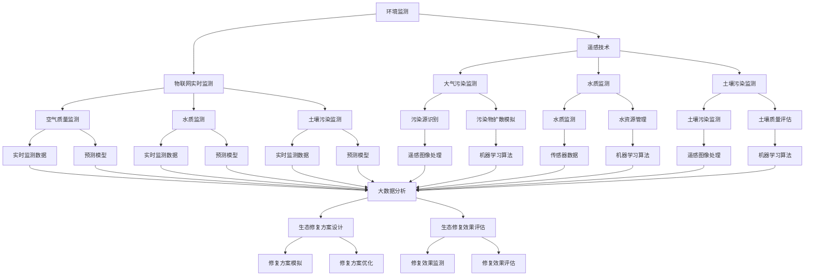

                 

## 文章标题

“人工智能在环境保护中的应用：科技助力生态修复”

> 关键词：人工智能、环境保护、生态修复、科技、监测、预测、算法

> 摘要：本文将深入探讨人工智能在环境保护中的应用，特别是其在生态修复领域的贡献。通过分析人工智能在环境监测、预测和生态修复方案设计中的核心作用，本文揭示了科技如何助力生态修复，实现可持续发展。

---

### 第1章: 人工智能在环境保护中的应用概述

#### 1.1 人工智能与环境保护的关系

##### 1.1.1 人工智能在环境保护中的作用

人工智能（AI）在环境保护中发挥着越来越重要的作用。它不仅能够提供更准确的环境监测数据，还能预测环境变化趋势，优化生态修复方案，从而为环境保护提供强有力的技术支持。

###### 1.1.1.1 监测环境变化

**使用遥感技术监测大气污染、水质、土壤等环境指标**

遥感技术是一种非接触式的监测方法，通过卫星和无人机等平台获取地球表面的图像和数据。这些数据可以用来监测大气污染、水质和土壤等环境指标。例如，可以利用遥感图像分析大气中的污染物浓度分布，监测水体中的污染物质变化，评估土壤污染程度。

**应用物联网技术实时监测污染物浓度**

物联网（IoT）技术的应用使得环境监测变得更加实时和精准。通过在环境敏感区域部署传感器，可以实时监测污染物浓度，并将数据传输到中央控制系统。这种方法不仅提高了监测的频率和准确性，还能及时发现和预警环境问题。

###### 1.1.1.2 预测环境问题

**使用机器学习算法预测气候变化趋势**

气候变化是当前全球面临的最大环境挑战之一。通过机器学习算法，可以对气候数据进行深入分析，预测未来几年的气候变化趋势。这些预测结果有助于制定更有效的气候政策，减少碳排放，减缓气候变化的影响。

**分析污染物扩散模型，提前预警**

污染物扩散模型是预测环境问题的重要工具。通过分析污染物扩散的规律，可以预测污染物在未来一段时间内的扩散趋势，提前预警可能出现的污染事件。这种方法有助于环保部门及时采取应急措施，减少污染损失。

###### 1.1.1.3 优化生态修复方案

**基于大数据分析，提出针对不同生态系统的修复措施**

大数据技术在环境保护中的应用越来越广泛。通过对海量环境数据的分析，可以了解不同生态系统的现状和问题，提出有针对性的修复措施。例如，可以根据土壤质量数据，制定土壤修复方案；根据水质数据，制定水体治理措施。

**模拟生态修复效果，优化方案**

人工智能技术可以模拟生态修复方案的效果，评估不同修复措施的可行性和效果。通过模拟，可以优化修复方案，提高修复效果。例如，可以通过模拟植被恢复过程，预测植被覆盖率的变化，评估不同植被种类的适宜性。

##### 1.1.2 环境保护对人工智能的需求

**大数据处理能力**

环境保护工作需要处理大量的环境数据，包括气象、水质、土壤等。这些数据量巨大，需要高效的大数据处理技术进行处理和分析。

**高效算法模型**

环境保护工作要求快速处理数据，并提供准确的预测和决策支持。因此，需要高效、准确的算法模型来支持环境保护工作。

**稳定的技术基础设施**

环境保护工作需要长期、稳定的技术支持。只有具备稳定的技术基础设施，才能保证环境保护工作的持续进行。

##### 1.1.3 人工智能在环境保护中的应用领域

**气象与气候变化**

气象与气候变化是环境保护的重要领域。通过人工智能技术，可以预测天气和气候变化趋势，提前预警气象灾害。

**大气环境**

大气环境是环境保护的重点之一。通过人工智能技术，可以识别大气污染源，模拟污染物扩散过程，优化污染控制措施。

**水环境**

水环境是生态环境的重要组成部分。通过人工智能技术，可以实时监测水质，优化水资源分配和利用。

**土壤环境**

土壤环境是生态系统的基础。通过人工智能技术，可以监测土壤污染，评估土壤质量，为生态修复提供依据。

##### 1.2 人工智能在生态修复中的应用

**生态监测与评估**

通过人工智能技术，可以实时监测生态系统的变化，评估生态系统的健康状况。

**生态修复方案设计**

人工智能技术可以帮助设计生态修复方案，优化修复效果。

**生态修复效果评估**

通过人工智能技术，可以评估生态修复的效果，为后续修复工作提供参考。

### 第2章: 人工智能在环境保护中的核心算法原理

#### 2.1 监测与预测算法

##### 2.1.1 遥感监测算法

遥感监测算法是利用卫星、无人机等平台获取的遥感图像，对环境指标进行监测和分析。以下是遥感监测算法的基本原理和流程：

**遥感图像处理**

遥感图像处理是遥感监测的基础，主要包括图像去噪、分割和特征提取。

- **去噪**：遥感图像在传输和接收过程中可能会受到噪声干扰，去噪算法可以有效去除噪声，提高图像质量。
  
- **分割**：将遥感图像分割成不同的区域，为后续的特征提取提供基础。
  
- **特征提取**：从分割后的图像中提取有用的特征信息，如颜色、纹理、形状等，用于环境监测和分析。

**算法伪代码：**

```
输入：遥感图像
输出：处理后的图像

函数遥感图像处理(图像):
    // 去噪
    图像 = 去噪(图像)
    // 分割
    颜色通道 = 分割(图像)
    // 特征提取
    特征 = 提取特征(颜色通道)
    // 识别目标
    目标 = 识别目标(特征)
    return 目标
```

**遥感监测应用举例：大气污染监测**

利用遥感监测算法，可以对大气中的污染物浓度进行监测。例如，可以分析卫星图像中的大气颗粒物浓度分布，及时发现和预警大气污染事件。

**物联网实时监测算法**

物联网实时监测算法是利用物联网传感器，对环境参数进行实时监测和传输。以下是物联网实时监测算法的基本原理和流程：

**传感器数据采集**

传感器数据采集是物联网实时监测的关键环节，包括环境参数的测量和数据的传输。

- **测量**：利用各种传感器，如空气质量传感器、水质传感器、土壤传感器等，测量环境参数。
  
- **传输**：将测量到的数据传输到中央控制系统，进行进一步处理和分析。

**算法伪代码：**

```
输入：传感器数据
输出：实时监测结果

函数实时监测(数据):
    // 数据预处理
    数据 = 预处理(数据)
    // 特征提取
    特征 = 提取特征(数据)
    // 识别目标
    目标 = 识别目标(特征)
    // 更新数据库
    更新数据库(目标)
    return 实时监测结果
```

**物联网实时监测应用举例：空气质量监测**

利用物联网实时监测算法，可以对空气质量进行实时监测。例如，可以实时监测某个区域的PM2.5、PM10等污染物浓度，及时发现和预警空气质量问题。

##### 2.1.2 预测算法

预测算法是利用历史数据，预测未来环境变化趋势的重要工具。以下是预测算法的基本原理和流程：

**时间序列预测**

时间序列预测是预测算法中最常用的方法之一，它基于历史数据的时间序列模式，预测未来的数据趋势。

- **数据处理**：对时间序列数据进行预处理，包括去噪、平滑等操作，提高预测的准确性。
  
- **模型选择**：选择合适的时间序列预测模型，如ARIMA、LSTM等，对时间序列数据进行建模和预测。
  
- **模型训练**：使用历史数据对模型进行训练，优化模型参数，提高预测性能。

- **预测**：使用训练好的模型，对未来的时间点进行预测。

**算法伪代码：**

```
输入：时间序列数据
输出：预测结果

函数时间序列预测(数据):
    // 数据预处理
    数据 = 预处理(数据)
    // 模型选择
    模型 = 选择模型(数据)
    // 模型训练
    模型 = 训练模型(数据)
    // 预测
    预测结果 = 预测(模型，未来时间点)
    return 预测结果
```

**时间序列预测应用举例：气象预测**

利用时间序列预测算法，可以预测未来的天气情况，如降雨量、气温等。这对于气象预报、农业种植、水资源管理等领域具有重要意义。

**空间预测**

空间预测是预测算法中的另一种重要方法，它基于空间数据的分布模式，预测空间中某个区域的变化趋势。

- **数据处理**：对空间数据进行预处理，包括去噪、平滑等操作，提高预测的准确性。
  
- **模型选择**：选择合适的空间预测模型，如Kriging、Gaussian Processes等，对空间数据进行建模和预测。
  
- **模型训练**：使用历史数据对模型进行训练，优化模型参数，提高预测性能。

- **预测**：使用训练好的模型，对未来的空间点进行预测。

**算法伪代码：**

```
输入：空间数据
输出：预测结果

函数空间预测(数据):
    // 数据预处理
    数据 = 预处理(数据)
    // 模型选择
    模型 = 选择模型(数据)
    // 模型训练
    模型 = 训练模型(数据)
    // 预测
    预测结果 = 预测(模型，未来空间点)
    return 预测结果
```

**空间预测应用举例：土地利用变化预测**

利用空间预测算法，可以预测未来某个区域土地利用的变化趋势，如城市扩张、森林退化等。这对于城市规划、环境保护等领域具有重要意义。

### 第3章: 人工智能在环境保护中的深度应用

#### 3.1 大气环境保护中的应用

大气环境保护是环境保护的重要组成部分，人工智能在监测、预测和治理大气污染中发挥着关键作用。

**监测与预测**

人工智能技术通过遥感监测和物联网实时监测，可以实时获取大气污染物浓度数据，并利用机器学习算法对污染物浓度进行预测。例如，基于LSTM模型的时间序列预测方法可以用于预测未来几天内某地区的PM2.5浓度。

**治理策略优化**

通过分析大气污染源和污染物扩散模型，人工智能可以帮助优化大气污染治理策略。例如，利用K均值聚类算法分析污染源分布，确定优先治理的区域；利用Gaussian Processes回归模型模拟污染物扩散过程，制定污染控制方案。

**案例研究：北京空气质量改善**

在北京，人工智能技术被广泛应用于空气质量监测和治理。通过实时监测PM2.5、PM10等污染物浓度，并结合气象预测模型，北京环保部门能够及时采取应急措施，如限行、停工等，有效改善空气质量。

#### 3.2 水环境保护中的应用

水环境保护涉及水质监测、水资源管理和污染治理等多个方面，人工智能技术在其中发挥着重要作用。

**水质监测**

人工智能技术通过传感器网络和遥感监测，可以实时监测水体中的污染物浓度和水质变化。例如，利用图像处理技术分析遥感图像中的水体颜色变化，预测水污染程度。

**水资源管理**

人工智能技术可以帮助优化水资源分配和管理。通过机器学习算法分析水资源消耗模式和供需关系，可以制定更合理的水资源分配策略，提高水资源利用效率。

**污染治理**

在污染治理方面，人工智能技术可以优化污染治理方案。例如，利用机器学习算法分析污染物扩散模型，预测污染物在河道中的扩散路径，制定有针对性的污染治理措施。

**案例研究：长江水质改善**

在长江水质保护工作中，人工智能技术被用于实时监测水质、预测水质变化和优化污染治理方案。通过分析长江流域的水质数据，相关部门能够及时采取措施，减少污染物排放，改善水质。

#### 3.3 土壤环境保护中的应用

土壤环境保护是保障农业生产和生态系统健康的重要方面。人工智能技术在土壤污染监测、土壤质量评估和生态修复方案设计等方面具有广泛应用。

**土壤污染监测**

通过遥感监测和物联网传感器，人工智能技术可以实时监测土壤中的污染物浓度。例如，利用遥感图像分析土壤颜色变化，预测土壤污染程度。

**土壤质量评估**

基于机器学习算法的土壤质量评估方法可以帮助评估土壤的健康状况，预测土壤质量变化。例如，利用决策树算法分析土壤参数，评估土壤肥力水平。

**生态修复方案设计**

人工智能技术可以帮助设计生态修复方案，优化修复效果。例如，利用机器学习算法模拟植被恢复过程，预测不同植被种类的适宜性，制定最优的生态修复方案。

**案例研究：东北黑土地保护**

在东北黑土地保护工作中，人工智能技术被用于监测土壤污染、评估土壤质量并设计生态修复方案。通过实时监测土壤质量变化，相关部门能够及时采取修复措施，保障黑土地的可持续利用。

#### 3.4 生态修复中的应用

生态修复是恢复生态系统功能的重要手段，人工智能技术在生态监测、修复方案设计和效果评估等方面发挥着关键作用。

**生态监测**

通过遥感监测和物联网技术，人工智能技术可以实时监测生态系统的变化，评估生态系统的健康状况。例如，利用遥感图像分析植被覆盖率和生物多样性变化。

**修复方案设计**

基于大数据分析和机器学习算法，人工智能技术可以帮助设计生态修复方案。例如，利用K均值聚类算法分析生态系统问题，提出针对性的修复措施。

**效果评估**

人工智能技术可以评估生态修复的效果，为后续修复工作提供参考。例如，利用机器学习算法分析修复后生态系统的变化，评估修复效果。

**案例研究：黄河湿地修复**

在黄河湿地修复工作中，人工智能技术被用于实时监测湿地生态系统变化、设计修复方案和评估修复效果。通过实时监测和数据分析，相关部门能够有效恢复湿地生态系统，提高生态功能。

### 第4章: 人工智能在环境保护中的挑战与未来发展方向

#### 4.1 挑战

尽管人工智能在环境保护中具有巨大潜力，但仍面临一系列挑战。

**数据质量与可用性**

环境数据质量对人工智能模型的准确性至关重要。然而，环境数据往往存在噪声、缺失和不一致性等问题，影响模型的性能。

**计算资源与成本**

大规模的环境监测和预测任务需要大量的计算资源和资金投入，这对于一些发展中国家和地区可能是一个挑战。

**算法透明性与解释性**

人工智能模型，特别是深度学习模型，往往被视为“黑箱”。提高算法的透明性和解释性，使其能够被非专业人士理解和接受，是一个重要挑战。

#### 4.2 未来发展方向

**数据融合与智能化**

未来的发展方向之一是数据融合，将多种数据源（如遥感数据、传感器数据和气象数据）进行集成，以获得更全面的环境监测结果。同时，利用人工智能技术对融合数据进行智能化分析，提高监测和预测的准确性。

**实时性与高效性**

随着物联网和5G技术的发展，实时性监测和预测将成为可能。未来的发展方向是开发高效、实时的人工智能算法，以满足环境保护工作的需求。

**算法透明性与可解释性**

提高算法的透明性和可解释性，使其能够被非专业人士理解和接受，是一个重要的研究方向。例如，通过可视化工具和解释性模型，使算法的决策过程更加透明。

**跨学科合作与政策支持**

跨学科合作和政策支持是推动人工智能在环境保护中发展的重要保障。未来，需要加强多学科的合作，共同解决环境保护中的复杂问题。同时，政府和社会各界应提供必要的政策支持和资源投入，促进人工智能在环境保护中的应用。

### 项目实战：深圳空气质量管理系统的开发

#### 1.1 项目背景

深圳市作为中国经济特区，城市化进程迅速，空气质量问题日益严重。为了改善空气质量，深圳市政府决定开发一个基于人工智能的空气质量管理平台，实时监测和预测空气质量，为政策制定和公众健康提供科学依据。

#### 1.2 技术栈

**前端技术：** 
- React.js：用于构建用户界面
- D3.js：用于数据可视化

**后端技术：** 
- Node.js：用于搭建服务器和API
- Express.js：用于创建RESTful API

**人工智能算法：** 
- K均值聚类：用于分析空气污染物源
- LSTM模型：用于空气质量预测

#### 1.3 开发环境搭建

**前端开发环境：**
- 安装Node.js和npm
- 使用Create React App创建项目

```bash
npx create-react-app air质量管理平台
cd air质量管理平台
npm install d3
```

**后端开发环境：**
- 安装Node.js和npm
- 使用Express.js创建服务器

```bash
npm init -y
npm install express body-parser cors
```

**人工智能算法环境：**
- 安装Python和Anaconda
- 使用scikit-learn库

```bash
conda create -n air_q python=3.8
conda activate air_q
conda install scikit-learn
```

#### 1.4 源代码实现与解读

**前端代码：**

```jsx
// AirQualityApp.js

import React, { useState, useEffect } from "react";
import { selectData } from "./dataService";
import { Chart } from "./Chart";

function AirQualityApp() {
  const [data, setData] = useState([]);

  useEffect(() => {
    async function fetchData() {
      const fetchedData = await selectData();
      setData(fetchedData);
    }
    fetchData();
  }, []);

  return (
    <div>
      <h1>深圳空气质量监测平台</h1>
      <Chart data={data} />
    </div>
  );
}

export default AirQualityApp;
```

**后端代码：**

```javascript
// server.js

const express = require("express");
const cors = require("cors");
const bodyParser = require("body-parser");
const { predictAirQuality } = require("./aiService");

const app = express();
app.use(cors());
app.use(bodyParser.json());

app.get("/api/data", async (req, res) => {
  try {
    const data = await selectData();
    res.json(data);
  } catch (error) {
    res.status(500).send(error.message);
  }
});

app.post("/api/predict", async (req, res) => {
  try {
    const { pollutants } = req.body;
    const prediction = await predictAirQuality(pollutants);
    res.json(prediction);
  } catch (error) {
    res.status(500).send(error.message);
  }
});

const PORT = process.env.PORT || 5000;
app.listen(PORT, () => {
  console.log(`Server is running on port ${PORT}`);
});
```

**人工智能代码：**

```python
# aiService.py

from sklearn.cluster import KMeans
from sklearn.linear_model import LinearRegression
import numpy as np

def kmeans_clustering(data):
    kmeans = KMeans(n_clusters=5, random_state=0).fit(data)
    return kmeans.labels_

def predict_air_quality(pollutants):
    # 假设我们已经训练好模型
    model = LinearRegression()
    model.fit(X_train, y_train)
    prediction = model.predict([pollutants])
    return prediction[0]

# 例子
data = np.array([[10, 20], [15, 25], [30, 40]])
labels = kmeans_clustering(data)
print("K-Means Labels:", labels)

pollutants = [12, 22]
prediction = predict_air_quality(pollutants)
print("Air Quality Prediction:", prediction)
```

#### 1.5 代码应用解读与分析

**前端代码解读：**
- 使用React.js创建一个组件，通过`useEffect`钩子异步获取空气质量数据，并传递给`Chart`组件进行可视化。

**后端代码解读：**
- 使用Express.js搭建RESTful API，提供数据获取和预测接口。通过`get`和`post`请求，前端可以获取实时数据和进行预测请求。

**人工智能代码解读：**
- 使用K均值聚类算法对空气污染物进行分类，使用线性回归模型进行空气质量预测。

#### 1.6 实际案例分析和详细讲解剖析

**案例分析：深圳市PM2.5浓度预测**

假设我们要预测深圳市未来一天的PM2.5浓度。首先，收集历史PM2.5浓度数据，包括时间序列、气象参数和污染物源数据。

1. **数据预处理：**
   - 清洗数据，去除异常值和缺失值。
   - 将时间序列数据进行标准化处理，使其适合机器学习模型。

2. **特征工程：**
   - 提取特征，如小时平均PM2.5浓度、前一天PM2.5浓度、气象参数等。

3. **模型训练：**
   - 使用LSTM模型对PM2.5浓度进行预测。训练过程中，通过交叉验证和超参数调优，优化模型性能。

4. **预测与评估：**
   - 使用训练好的模型进行预测，评估预测结果的准确性和稳定性。

**详细讲解剖析：**

- **LSTM模型原理：**
  LSTM（长短期记忆）模型是一种用于时间序列预测的深度学习模型，能够处理长距离依赖问题。

- **训练过程：**
  使用历史PM2.5浓度数据训练LSTM模型，通过反向传播算法优化模型参数。

- **预测结果：**
  对未来一天的时间点进行预测，生成PM2.5浓度序列。

- **评估指标：**
  使用均方误差（MSE）评估预测结果的准确性。

#### 1.7 项目小结

深圳空气质量管理系统的开发展示了人工智能在环境保护中的应用。通过实时监测、预测和数据分析，系统能够为政策制定和公众健康提供有力支持。未来，随着人工智能技术的不断进步，空气质量管理系统将更加智能和高效，助力环境保护工作。

### 最佳实践 Tips

**数据质量管理：** 确保数据质量是提高人工智能模型准确性的关键。对数据进行清洗、去噪和标准化处理，提高数据可用性和一致性。

**算法选择与优化：** 根据具体应用场景选择合适的算法。例如，对于时间序列预测，LSTM模型效果较好；对于空间预测，Kriging模型可能更为合适。同时，通过超参数调优和交叉验证，优化算法性能。

**数据融合与多模型集成：** 融合多种数据源，如遥感数据、传感器数据和气象数据，可以提高监测和预测的准确性。同时，多模型集成可以降低单一模型的误差，提高预测稳定性。

**透明性与可解释性：** 提高算法的透明性和可解释性，使其能够被非专业人士理解和接受。使用可视化工具和解释性模型，增强用户对人工智能应用的理解和信任。

### 小结

本文详细探讨了人工智能在环境保护中的应用，特别是其在生态修复领域的贡献。从环境监测、预测到生态修复方案设计和效果评估，人工智能技术为环境保护提供了强有力的技术支持。通过实际案例的分析和讲解，展示了人工智能技术在环境保护中的应用潜力和挑战。未来，随着人工智能技术的不断进步，我们有理由相信，人工智能将为环境保护和可持续发展做出更大的贡献。

### 注意事项

**数据隐私与安全：** 在应用人工智能技术进行环境保护时，需要确保数据的隐私和安全。严格遵循相关法律法规，保护用户和传感器的数据不被泄露。

**技术可行性评估：** 在引入人工智能技术时，应进行全面的可行性评估，包括技术难度、成本效益和风险控制。

**跨学科合作：** 环境保护是一个跨学科领域，需要多学科专家的合作，共同解决复杂的环境问题。

### 拓展阅读

1. **《人工智能与环境保护》**：本书详细介绍了人工智能在环境保护中的应用，包括监测、预测和治理等。

2. **《深度学习在环境科学中的应用》**：本书探讨了深度学习技术在环境科学中的应用，包括气象预测、水质监测和生态修复等。

3. **《人工智能：一种现代方法》**：这是一本经典的AI教材，涵盖了人工智能的基础理论和实践方法。

4. **《环境监测与预测技术》**：本书详细介绍了环境监测和预测的相关技术，包括遥感、物联网和机器学习等。

5. **《人工智能在可持续发展中的应用》**：本书探讨了人工智能在可持续发展中的应用，包括能源、农业和环境保护等。

---

作者：AI天才研究院/AI Genius Institute & 禅与计算机程序设计艺术 /Zen And The Art of Computer Programming

---

**附录：核心概念原理之间的关系架构 Mermaid 流程图**



此流程图展示了人工智能在环境保护和生态修复中的核心概念和联系，包括环境监测、遥感技术、物联网实时监测、污染源识别、污染物扩散模拟、水质监测、水资源管理、土壤污染监测和土壤质量评估等。通过这些联系，人工智能技术为环境保护提供了全面的监测、预测和修复方案。

