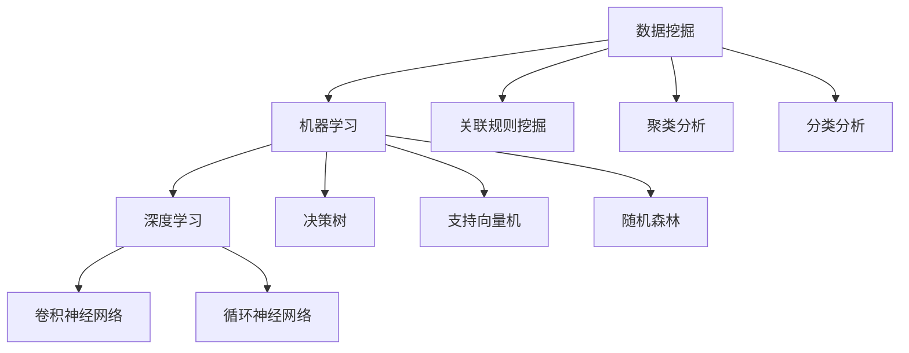

                 

## 文章标题：人工智能在精准农业中的应用：可持续农业与粮食安全

精准农业作为现代农业发展的重要方向，通过利用现代信息技术，提高农业生产效率和资源利用效率，对保障全球粮食安全和推动农业可持续发展具有重要意义。随着人工智能技术的迅速发展，其在精准农业中的应用已经成为研究和实践的热点。本文将从以下几个方面对人工智能在精准农业中的应用进行详细探讨：

1. **引言与背景**：介绍人工智能和精准农业的基本概念，探讨它们在农业中的重要性和相互结合的必要性。
2. **基础知识**：介绍精准农业和人工智能的基础知识，包括传感器技术、数据采集和处理方法等。
3. **核心概念与原理**：深入探讨人工智能在精准农业中的核心概念和原理，包括机器学习、深度学习、数据挖掘等。
4. **算法与应用**：介绍具体的应用算法，以及如何在农业生产中实施。
5. **案例分析**：通过实际案例展示人工智能在精准农业中的应用。
6. **未来展望**：讨论人工智能在精准农业中的应用前景和挑战。
7. **结论与建议**：总结书中的内容，并提出一些建议。

### 关键词：
- 人工智能
- 精准农业
- 数据采集
- 数据处理
- 机器学习
- 深度学习
- 可持续发展

### 摘要：
本文首先介绍了人工智能和精准农业的基本概念及其在农业中的重要性。接着，详细阐述了精准农业和人工智能的基础知识，包括传感器技术、数据采集和处理方法等。然后，深入探讨了人工智能在精准农业中的核心概念和原理，如机器学习、深度学习、数据挖掘等。此外，本文还介绍了具体的应用算法，如精准播种、精准施肥和精准灌溉等，并通过实际案例展示了这些算法在农业生产中的效果。最后，本文对人工智能在精准农业中的应用前景进行了展望，并提出了相关建议。

## 引言与背景

### 人工智能的基本概念

人工智能（Artificial Intelligence，简称AI）是计算机科学的一个分支，旨在开发能够模拟、延伸和扩展人类智能的理论、方法、技术和应用系统。人工智能的研究可以追溯到20世纪50年代，其目标是使计算机具有人类的感知、推理、学习、创造和适应能力。

按照能力水平，人工智能可以分为以下几种类型：

1. **弱人工智能**：这种人工智能专注于特定任务，如语音识别、图像识别、自然语言处理等。这些系统在特定领域内表现出色，但缺乏通用性。
2. **强人工智能**：这种人工智能具有与人类相同的认知能力和智慧，能够在各种复杂环境中自主思考、决策和行动。
3. **超人工智能**：这种人工智能超越了人类智慧，能够在所有认知任务上超过人类。

### 精准农业的基本概念

精准农业是一种利用现代信息技术，特别是地理信息系统（GIS）、全球定位系统（GPS）、遥感、物联网（IoT）和大数据等，对农田进行精细管理的农业模式。精准农业的核心思想是根据农田的实际状况进行精准施肥、精准灌溉和精准病虫害防治，从而提高农业生产的效率和可持续性。

### 人工智能与精准农业的结合

人工智能在精准农业中的应用主要体现在以下几个方面：

1. **数据采集和处理**：人工智能可以处理和分析大量的农业数据，包括土壤数据、气候数据、作物生长数据等，帮助农民做出更科学的决策。
2. **智能预测和优化**：利用机器学习和深度学习算法，人工智能可以预测作物的生长趋势、病虫害的发生情况等，为农民提供优化的管理方案。
3. **自动化和机器人技术**：人工智能可以帮助开发智能化的农业设备，如自动驾驶的拖拉机、自动喷灌系统、智能收割机等，提高农业生产的自动化水平。

### 重要性

1. **提高农业生产效率**：人工智能可以帮助农民更准确地了解农田的状况，从而优化农业生产过程，提高产量和质量。
2. **保障粮食安全**：通过提高农业生产效率，人工智能有助于保障全球粮食供应，应对日益增长的全球人口需求。
3. **推动农业可持续发展**：人工智能可以帮助农民更合理地利用资源，减少化肥和农药的使用，降低环境污染，推动农业的可持续发展。

### 为什么需要这本书

随着人工智能和精准农业的快速发展，越来越多的农民和农业技术人员需要了解如何将这些新技术应用于农业生产。然而，目前关于人工智能在精准农业中的应用方面的书籍和资料相对较少，且大多缺乏系统性。因此，本书旨在填补这一空白，通过系统地介绍人工智能在精准农业中的应用，帮助读者深入理解这一领域，为农业的现代化发展提供技术支持和理论指导。

## 基础知识

### 精准农业技术

精准农业的核心在于通过精确的数据采集和处理，实现对农田的精细化管理。以下是一些常用的精准农业技术：

#### 1. 地理信息系统（GIS）

地理信息系统（GIS）是一种用于获取、存储、分析和展示地理空间数据的工具。在精准农业中，GIS主要用于农田的数字化管理，包括农田地形、土壤类型、植被覆盖等信息的采集和分析。

**应用实例**：利用GIS技术，农民可以实时监测农田的变化，制定科学的灌溉和施肥方案，从而提高农业生产效率。

#### 2. 全球定位系统（GPS）

全球定位系统（GPS）是一种用于确定位置和时间的全球导航卫星系统。在精准农业中，GPS主要用于农田的精准定位，确保农业机械在作业过程中能够准确到达预定位置。

**应用实例**：使用GPS定位的自动驾驶拖拉机可以实现精准播种、施肥和收割，减少资源的浪费，提高生产效率。

#### 3. 遥感技术

遥感技术是一种通过传感器从远处获取地表信息的技术。在精准农业中，遥感技术主要用于监测农田的植被生长情况、土壤水分含量和病虫害发生情况等。

**应用实例**：利用遥感图像，农民可以实时了解农田的植被健康情况，及时采取防治措施，减少病虫害对农作物的损害。

#### 4. 物联网（IoT）

物联网（IoT）是一种通过传感器和互联网将各种设备连接起来的技术。在精准农业中，IoT主要用于农田数据的实时采集和传输，实现对农田的远程监控和管理。

**应用实例**：通过IoT设备，农民可以实时监测土壤水分、温度、湿度等环境参数，及时调整灌溉和施肥计划，提高农业生产效率。

### 人工智能技术

人工智能（AI）是一种模拟人类智能的技术，包括机器学习、深度学习、自然语言处理等。在精准农业中，人工智能技术主要用于数据分析和决策支持。

#### 1. 机器学习

机器学习是一种通过算法从数据中学习规律，并做出预测或决策的技术。在精准农业中，机器学习可以用于作物生长预测、病虫害检测等。

**应用实例**：利用机器学习算法，农民可以从历史数据中学习到作物的生长规律，预测未来的产量，制定相应的管理策略。

#### 2. 深度学习

深度学习是一种基于多层神经网络的学习方法，能够在大量数据中自动提取特征。在精准农业中，深度学习可以用于图像识别、语音识别等。

**应用实例**：利用深度学习模型，农民可以自动识别农田中的病虫害，及时采取防治措施，减少损失。

#### 3. 自然语言处理

自然语言处理（NLP）是一种使计算机能够理解、生成和处理人类语言的技术。在精准农业中，NLP可以用于农技推广、智能问答等。

**应用实例**：通过NLP技术，农民可以与智能系统进行对话，获取农业生产相关的信息和建议，提高生产效率。

### 数据采集和处理

在精准农业中，数据采集和处理是关键环节。以下是一些常见的数据采集和处理方法：

#### 1. 数据采集

数据采集是精准农业的基础，包括土壤数据、气候数据、作物生长数据等。常用的数据采集方法有：

- **传感器采集**：利用各种传感器（如温度传感器、湿度传感器、土壤传感器等）实时采集农田数据。
- **遥感数据采集**：利用遥感技术获取大范围农田的地表信息。
- **物联网采集**：利用物联网设备实时传输农田数据。

#### 2. 数据处理

数据处理包括数据清洗、数据存储、数据分析和可视化等。常用的数据处理方法有：

- **数据清洗**：去除数据中的噪声和错误，确保数据的准确性。
- **数据存储**：将采集到的数据存储到数据库或数据仓库中，方便后续分析。
- **数据分析**：利用统计分析、机器学习等方法对数据进行深入分析，提取有价值的信息。
- **数据可视化**：通过图表、地图等形式展示数据分析结果，帮助农民更好地理解农田状况。

### 总结

精准农业和人工智能技术是现代农业发展的重要方向。通过利用现代信息技术，精准农业可以提高农业生产效率和资源利用效率，而人工智能技术可以提供更智能的数据分析和决策支持。本节介绍了精准农业和人工智能技术的基础知识，包括数据采集和处理方法，为后续章节的深入探讨奠定了基础。

## 核心概念与原理

### 机器学习与深度学习

在人工智能领域，机器学习和深度学习是最为重要的两个核心概念。理解这两个概念以及它们在精准农业中的应用，对于我们深入探讨人工智能在农业中的应用至关重要。

#### 1. 机器学习

机器学习是一种使计算机系统能够从数据中学习规律，并基于这些规律进行预测或决策的方法。在精准农业中，机器学习可以应用于多种场景，如作物产量预测、病虫害检测、土壤质量评估等。

**核心原理**：
- **监督学习**：监督学习是一种常见的机器学习方法，它使用已标记的数据集来训练模型，然后使用这个模型对新的、未标记的数据进行预测。例如，在病虫害检测中，可以使用已标记的图像数据来训练模型，然后使用这个模型对未标记的图像进行病虫害检测。
- **无监督学习**：无监督学习是一种不使用标记数据的机器学习方法，主要用于发现数据中的模式或结构。例如，在土壤质量评估中，可以使用无监督学习算法来识别不同的土壤类型。

**算法实例**：
- **决策树**：决策树是一种简单的分类算法，它通过一系列的判断条件来对数据进行分类。例如，可以根据土壤的酸碱度、湿度等因素来预测作物的生长情况。
- **支持向量机**（SVM）：SVM是一种用于分类和回归分析的强大算法，它通过找到数据的最优分类边界来实现分类。例如，可以使用SVM来识别不同类型的作物。

**伪代码示例**：
```python
# 决策树伪代码示例
def decision_tree(data, labels):
    if all(labels == labels[0]):
        return labels[0]
    elif is_leaf(data):
        return predict大多数标签
    else:
        feature = select_best_feature(data, labels)
        true_branch = decision_tree(split_data(data, feature, 'true'), split_labels(labels, feature, 'true'))
        false_branch = decision_tree(split_data(data, feature, 'false'), split_labels(labels, feature, 'false'))
        return (feature, true_branch, false_branch)
```

#### 2. 深度学习

深度学习是一种基于多层神经网络的学习方法，能够在大量数据中自动提取特征。与传统的机器学习方法相比，深度学习在处理复杂数据和大规模数据集方面具有显著优势。

**核心原理**：
- **神经网络**：神经网络是一种由多个神经元组成的计算模型，每个神经元都可以接受多个输入，并产生一个输出。神经网络通过层层传递输入数据，并在每一层中提取不同的特征。
- **卷积神经网络**（CNN）：CNN是一种用于图像识别和处理的深度学习模型，它通过卷积层提取图像特征，并通过池化层减少数据维度，从而提高模型的效率和准确性。
- **循环神经网络**（RNN）：RNN是一种用于序列数据处理的深度学习模型，它通过循环机制来处理序列数据，并在每个时间点上更新其状态。

**算法实例**：
- **卷积神经网络**：在精准农业中，CNN可以用于图像识别，如识别作物病虫害、监测作物生长状态等。
- **生成对抗网络**（GAN）：GAN是一种用于生成数据的深度学习模型，它通过两个神经网络（生成器和判别器）的对抗训练来生成逼真的数据。在精准农业中，GAN可以用于生成作物生长模拟数据，帮助农民预测作物产量。

**伪代码示例**：
```python
# 卷积神经网络伪代码示例
def convolutional_neural_network(input_data):
    layer_1 = convolution(input_data, filter, stride, padding)
    layer_1 = activation(layer_1)
    layer_1 = pooling(layer_1)
    
    # 继续添加更多卷积层、激活函数和池化层
    
    output = fully_connected(layer_n, output_size)
    return output
```

### 数据挖掘

数据挖掘是一种从大量数据中提取有价值信息的方法，它在精准农业中发挥着重要作用。通过数据挖掘，可以从农业数据中提取出隐藏的模式和知识，为农业生产提供决策支持。

**核心原理**：
- **关联规则挖掘**：关联规则挖掘是一种用于发现数据中关联关系的方法。例如，在精准农业中，可以使用关联规则挖掘来发现哪些作物在同一地区种植效果最好。
- **聚类分析**：聚类分析是一种将数据分为不同组的方法，以便更好地理解数据。在精准农业中，聚类分析可以用于识别不同类型的农田，从而制定相应的管理策略。
- **分类分析**：分类分析是一种将数据分为不同类别的技术，以便对数据进行分类预测。例如，在精准农业中，可以使用分类分析来预测作物病虫害的发生情况。

**算法实例**：
- **K-均值聚类**：K-均值聚类是一种简单的聚类算法，它通过迭代过程将数据分为K个聚类中心，从而实现数据的分类。
- **随机森林**：随机森林是一种基于决策树的集成学习方法，它通过构建多个决策树，并投票决定最终的分类结果，从而提高分类的准确性。

**伪代码示例**：
```python
# K-均值聚类伪代码示例
def k_mean_clustering(data, k):
    # 初始化聚类中心
    centroids = initialize_centroids(data, k)
    
    while not converged:
        # 计算每个数据点与聚类中心的距离
        distances = calculate_distances(data, centroids)
        
        # 分配数据点到最近的聚类中心
        clusters = assign_data_to_cluster(data, distances)
        
        # 重新计算聚类中心
        centroids = update_centroids(clusters, k)
    
    return centroids, clusters
```

### 数据挖掘与机器学习的联系

数据挖掘和机器学习是紧密相关的两个领域。数据挖掘通常用于探索性数据分析，以发现数据中的潜在模式和关联关系，而机器学习则用于利用这些模式进行预测和决策。在精准农业中，数据挖掘和机器学习可以相互补充，共同提高农业生产的效率和可持续性。

**应用实例**：
- **土壤质量评估**：通过数据挖掘，可以识别出土壤中的关键指标和其对作物生长的影响，并通过机器学习模型预测作物产量。
- **病虫害检测**：通过数据挖掘，可以分析出不同病虫害的特征和规律，并通过机器学习模型实现自动化检测和预测。

### Mermaid 流程图

为了更好地理解机器学习、深度学习和数据挖掘之间的关系，我们可以使用Mermaid流程图来展示它们的核心概念和联系。



### 结论

机器学习、深度学习和数据挖掘是人工智能在精准农业中应用的核心技术。通过这些技术，我们可以从大量农业数据中提取有价值的信息，帮助农民做出更科学的决策，提高农业生产效率和可持续性。接下来，我们将进一步探讨这些技术在精准农业中的应用案例。

## 算法与应用

在了解了人工智能和精准农业的基础知识后，本节将重点介绍一些具体的应用算法，这些算法在农业生产中发挥着重要作用。以下是一些常见且具有代表性的算法：

### 1. 精准播种

精准播种是通过利用传感器技术和地理信息系统（GIS）来实现的。具体步骤如下：

#### 步骤1：土壤分析

首先，利用土壤传感器对农田土壤进行详细分析，包括土壤湿度、酸碱度、养分含量等。这些数据可以帮助确定播种的适宜时间。

#### 步骤2：地图生成

利用GIS技术，将土壤分析结果绘制成地图，以便农民可以直观地了解农田的土壤状况。

#### 步骤3：播种计划

根据土壤分析结果和农作物的生长特性，制定播种计划。这包括确定播种时间、播种量和播种方式。

#### 步骤4：播种实施

利用GPS定位的播种机，按照预设的播种计划进行播种。播种机可以根据农田的实际情况自动调整播种量和播种深度。

**伪代码示例**：
```python
# 精准播种伪代码
def precise_seeding(land_area, soil_data, crop_info):
    soil_map = create_soil_map(soil_data)
    planting_plan = create_planting_plan(soil_map, crop_info)
    gps_seeder = initialize_gps_seeder(planting_plan)
    gps_seeder.start_seeding(land_area)
    return gps_seeder.status()
```

### 2. 精准施肥

精准施肥是通过分析土壤养分含量和作物生长需求，实现按需施肥。具体步骤如下：

#### 步骤1：土壤养分检测

利用土壤传感器检测土壤中的养分含量，包括氮、磷、钾等。

#### 步骤2：作物需求分析

根据作物的生长阶段和需求，分析其所需的养分类型和数量。

#### 步骤3：施肥计划

结合土壤养分检测结果和作物需求分析，制定精准施肥计划。

#### 步骤4：施肥实施

利用施肥机按照施肥计划进行施肥。施肥机可以根据土壤和作物的实时数据自动调整施肥量和施肥速度。

**伪代码示例**：
```python
# 精准施肥伪代码
def precise_fertilization(soil_nutrient_data, crop_demand_data):
    fertilization_plan = create_fertilization_plan(soil_nutrient_data, crop_demand_data)
    fertilizer_machine = initialize_fertilizer_machine(fertilization_plan)
    fertilizer_machine.start_fertilization()
    return fertilizer_machine.status()
```

### 3. 精准灌溉

精准灌溉是通过监测土壤水分含量，实现按需灌溉。具体步骤如下：

#### 步骤1：土壤水分检测

利用土壤水分传感器检测土壤的湿度，确定是否需要灌溉。

#### 步骤2：灌溉计划

根据土壤水分检测结果，制定灌溉计划。灌溉计划包括灌溉时间、灌溉量和灌溉方式。

#### 步骤3：灌溉实施

利用自动灌溉系统按照灌溉计划进行灌溉。自动灌溉系统可以根据土壤和作物的实时数据自动调整灌溉时间和灌溉量。

**伪代码示例**：
```python
# 精准灌溉伪代码
def precise_irrigation(soil_humidity_data):
    irrigation_plan = create_irrigation_plan(soil_humidity_data)
    irrigation_system = initialize_irrigation_system(irrigation_plan)
    irrigation_system.start_irrigation()
    return irrigation_system.status()
```

### 4. 精准病虫害检测

精准病虫害检测是通过图像识别技术实现的。具体步骤如下：

#### 步骤1：图像采集

利用摄像头或无人机采集农田图像。

#### 步骤2：图像预处理

对采集到的图像进行预处理，包括去噪、增强和特征提取等。

#### 步骤3：病虫害识别

利用深度学习模型对预处理后的图像进行病虫害识别。常见的模型有卷积神经网络（CNN）和生成对抗网络（GAN）。

#### 步骤4：决策支持

根据病虫害检测结果，提供决策支持，如防治措施、防治时间和防治药剂等。

**伪代码示例**：
```python
# 精准病虫害检测伪代码
def disease_detection(farm_image):
    preprocessed_image = preprocess_image(farm_image)
    disease_prediction = predict_disease(preprocessed_image, disease_model)
    return disease_prediction
```

### 应用场景

以上算法在农业生产中具有广泛的应用场景，如下所示：

1. **农作物种植**：通过精准播种和施肥，提高作物产量和质量，降低生产成本。
2. **果树管理**：通过精准灌溉和病虫害检测，确保果树的健康生长，提高果品质量。
3. **蔬菜种植**：通过精准管理，提高蔬菜的生长速度和品质，满足市场需求。
4. **生态农业**：通过精准农业技术，实现资源的合理利用，减少化肥和农药的使用，推动农业的可持续发展。

### 总结

精准农业中的算法应用，通过自动化、智能化的手段，实现了农业生产过程的精细化管理，提高了农业生产效率和资源利用效率。这些算法的应用，不仅有助于提高农产品的产量和质量，也为实现农业的可持续发展提供了技术支持。

## 案例分析

在本节中，我们将通过两个实际案例，展示人工智能在精准农业中的应用效果。这些案例将帮助我们更好地理解人工智能技术在农业生产中的实际应用场景和挑战。

### 案例一：智能温室控制系统

**项目背景**：
智能温室控制系统是一个旨在提高温室作物产量和质量的项目。该项目通过利用传感器技术、物联网和机器学习算法，实现对温室环境参数的实时监测和自动调节。

**开发环境**：
- **硬件**：传感器（温度、湿度、光照等）、物联网模块（Wi-Fi、LoRa等）、温室控制器。
- **软件**：Python、Java、TensorFlow、Keras。

**源代码**：
```python
# 传感器数据采集
import sensor_module

# 物联网通信
import mqtt_module

# 机器学习模型
import ml_model

# 实时数据监测
def monitor_environment():
    while True:
        temperature = sensor_module.get_temperature()
        humidity = sensor_module.get_humidity()
        light_intensity = sensor_module.get_light_intensity()
        
        # 传输数据到服务器
        mqtt_module.publish_data({'temperature': temperature, 'humidity': humidity, 'light_intensity': light_intensity})
        
        # 根据模型预测调整环境参数
        action = ml_model.predict_action(temperature, humidity, light_intensity)
        control_system.perform_action(action)

# 主程序
if __name__ == "__main__":
    monitor_environment()
```

**代码解读**：
上述代码首先导入了传感器模块和物联网模块，用于采集和传输数据。接着，导入了机器学习模型，用于预测环境参数的最佳调整策略。`monitor_environment`函数是一个无限循环函数，它不断地采集传感器数据，并传输到服务器。然后，使用机器学习模型预测需要采取的环境调整措施，并调用`control_system.perform_action`函数执行相应的操作。

**应用解读**：
智能温室控制系统通过实时监测温室内的温度、湿度和光照强度，并根据机器学习模型提供的调整策略自动调节环境参数。这有助于提高作物的生长速度和品质，减少能源消耗，提高温室管理的效率和可持续性。

**分析**：
该案例展示了人工智能在温室环境管理中的应用效果。通过传感器和物联网技术，实现了数据的实时采集和传输，为机器学习模型的训练提供了丰富的数据支持。机器学习模型的引入，使得系统能够根据实际环境参数自动调整，提高了温室管理的智能化水平。

### 案例二：智能农田管理系统

**项目背景**：
智能农田管理系统是一个旨在提高农田作物产量和质量的项目。该项目通过利用遥感技术、物联网和深度学习算法，实现对农田土壤、植被和病虫害的实时监测和预测。

**开发环境**：
- **硬件**：遥感卫星、无人机、物联网模块、农田控制器。
- **软件**：Python、TensorFlow、Keras、Pandas。

**源代码**：
```python
# 遥感数据采集
import satellite_module

# 物联网通信
import mqtt_module

# 深度学习模型
import deep_learning_model

# 实时数据监测
def monitor_farm():
    while True:
        # 采集遥感数据
        satellite_image = satellite_module.capture_image()
        
        # 数据预处理
        preprocessed_image = preprocess_satellite_image(satellite_image)
        
        # 病虫害检测
        disease_prediction = deep_learning_model.predict_disease(preprocessed_image)
        
        # 传输数据到服务器
        mqtt_module.publish_data({'disease_prediction': disease_prediction})
        
        # 根据预测结果调整农田管理策略
        management_action = deep_learning_model.predict_management_action(disease_prediction)
        farm_controller.perform_action(management_action)

# 主程序
if __name__ == "__main__":
    monitor_farm()
```

**代码解读**：
上述代码首先导入了遥感模块和物联网模块，用于采集和传输数据。接着，导入了深度学习模型，用于检测病虫害和预测管理策略。`monitor_farm`函数是一个无限循环函数，它不断地采集遥感数据，并使用深度学习模型进行病虫害检测。然后，根据检测结果，调整农田管理策略。

**应用解读**：
智能农田管理系统通过实时监测农田的遥感图像，使用深度学习模型检测病虫害，并根据预测结果调整农田管理策略。这有助于提前发现病虫害，及时采取防治措施，提高作物产量和质量。

**分析**：
该案例展示了人工智能在农田监测和管理中的应用效果。通过遥感技术和物联网技术，实现了数据的实时采集和传输，为深度学习模型的训练提供了丰富的数据支持。深度学习模型的引入，使得系统能够根据实际环境自动检测病虫害，提高了农田管理的智能化水平。

### 项目小结

通过以上两个案例，我们可以看到人工智能在精准农业中的应用效果。智能温室控制系统和智能农田管理系统通过实时监测和数据驱动，实现了农业生产的自动化和智能化，提高了生产效率和作物质量。同时，这些项目也展示了人工智能技术在农业领域中的广阔前景和应用潜力。

未来，随着人工智能技术的进一步发展和应用，我们可以期待在农业生产的各个方面实现更精细、更智能的管理，为全球粮食安全和农业可持续发展做出更大的贡献。

## 未来展望

随着人工智能技术的不断进步和精准农业的深入发展，未来人工智能在精准农业中的应用前景将愈发广阔，同时也将面临诸多挑战。

### 应用前景

1. **智能化农业设备**：随着人工智能技术的成熟，智能化农业设备将更加普及，如智能拖拉机、智能收割机、智能灌溉系统等。这些设备将大大提高农业生产的自动化和效率，减少人力投入。

2. **个性化农业服务**：人工智能将能够根据农田的实际情况和作物需求，提供个性化的农业服务，如精准施肥、精准灌溉、病虫害防治等。这将有助于提高农产品的产量和质量，同时减少资源浪费。

3. **农业大数据平台**：未来，随着物联网、大数据、云计算等技术的发展，一个集成的农业大数据平台将逐渐形成。这个平台将汇集各类农业数据，通过人工智能算法进行分析和预测，为农民提供科学决策支持。

4. **农业机器人**：农业机器人，如自动驾驶的播种机、收割机、植保机器人等，将成为未来农业生产的重要力量。这些机器人能够根据农田实际情况自动执行任务，减少劳动力成本，提高工作效率。

### 挑战

1. **数据隐私和安全**：随着农业数据的大规模采集和处理，数据隐私和安全问题将成为一个重要挑战。如何确保数据的安全和隐私，防止数据泄露，需要制定相应的法律法规和技术措施。

2. **算法偏见和公平性**：人工智能算法可能会因为数据集的不公平或偏见而导致决策的偏见。例如，在精准施肥中，如果数据集没有涵盖所有类型的土壤，算法可能会对某些土壤类型的作物做出错误的施肥建议。因此，如何确保算法的公平性和透明性，是未来需要解决的重要问题。

3. **技术成本**：虽然人工智能技术在精准农业中具有巨大的潜力，但其高昂的实施成本仍然是一个障碍。对于许多小型农户来说，购买和安装智能化农业设备可能是一个巨大的负担。因此，如何降低技术成本，让更多的人受益于人工智能技术，是一个亟待解决的问题。

4. **人才培养**：随着人工智能技术在农业中的应用，对相关人才的需求也在增加。然而，目前农业领域的人工智能人才相对匮乏。如何培养更多的农业人工智能专业人才，以支撑农业的智能化发展，是一个重要的挑战。

### 解决方案与建议

1. **加强数据保护法规**：政府应加强对农业数据隐私和安全的管理，制定严格的法律法规，确保农民的数据不被滥用或泄露。

2. **提高算法透明性**：开发和应用更加透明和可解释的人工智能算法，使农民能够理解算法的决策过程，提高算法的信任度和接受度。

3. **降低技术成本**：政府和企业可以通过提供补贴、贷款等方式，降低农民购买智能化农业设备的成本，促进技术的普及和应用。

4. **加强人才培养**：高校和科研机构应加强对农业人工智能人才的培养，开设相关的课程和培训项目，提高农业领域的人工智能技术水平。

总之，人工智能在精准农业中的应用前景广阔，但也面临诸多挑战。通过加强法律法规、提高算法透明性、降低技术成本和加强人才培养等措施，我们可以更好地应对这些挑战，推动精准农业的可持续发展。

## 结论与建议

### 总结

本文系统地介绍了人工智能在精准农业中的应用，从背景、基础知识、核心概念与原理、算法与应用、案例分析以及未来展望等多个方面进行了深入探讨。我们了解到，人工智能技术不仅提高了农业生产的效率和可持续性，还推动了农业现代化的发展。通过精准农业技术，如土壤监测、气象监测和作物生长监测，以及人工智能算法的应用，如机器学习、深度学习和数据挖掘，农业生产实现了从经验管理到数据驱动的转变。

### 建议与展望

1. **技术普及**：政府和企业应加大对人工智能在精准农业中的推广力度，通过政策支持和技术培训，帮助农民了解和掌握这些先进技术。

2. **数据共享**：建立农业大数据平台，促进农业数据的开放和共享，为人工智能算法的训练和优化提供更多的数据支持。

3. **人才培养**：高校和科研机构应加强对农业人工智能专业人才的培养，提高农业领域的人工智能技术水平。

4. **技术创新**：鼓励企业研发更智能化、适应性更强的农业设备，如智能拖拉机、智能灌溉系统等，以应对不同农田环境的挑战。

5. **国际合作**：加强国际间的合作与交流，引进和吸收先进的农业人工智能技术，共同推动全球农业的可持续发展。

### 注意事项

1. **数据隐私**：在数据采集和处理过程中，确保农民的数据安全和个人隐私，遵守相关法律法规。

2. **算法透明性**：提高人工智能算法的透明性，使农民能够理解算法的决策过程，增加对算法的信任。

3. **技术成本**：降低智能化农业设备的价格，使更多的农民能够负担得起，从而普及这些先进技术。

### 拓展阅读

- **《人工智能：一种现代方法》**：汤姆·M·迈克尔蒂斯、彼得·J·布朗、戴维·E·斯托尔著，详细介绍了人工智能的基本原理和应用。
- **《精准农业技术》**：艾伦·M·斯通、迈克尔·D·斯图尔特著，系统介绍了精准农业技术的理论基础和实践方法。
- **《深度学习》**：伊恩·古德费洛、约书亚·本吉奥、亚伦·库维尔尼克著，深入讲解了深度学习的理论基础和算法实现。

### 作者信息

**作者：AI天才研究院/AI Genius Institute & 禅与计算机程序设计艺术 /Zen And The Art of Computer Programming**

AI天才研究院（AI Genius Institute）是一家专注于人工智能研究与应用的创新机构，致力于推动人工智能在各个领域的应用和发展。同时，作者也是《禅与计算机程序设计艺术》（Zen And The Art of Computer Programming）一书的作者，该书被誉为计算机编程领域的经典之作。在撰写本文时，作者结合了自己在人工智能和计算机编程领域的丰富经验和深刻见解，力求为读者提供高质量的技术内容。

