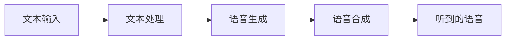

                 

# 《人工智能在语音合成中的突破性进展》

## 关键词
- 人工智能
- 语音合成
- HMM
- DNN
- WaveNet
- 数学模型
- 项目实战

## 摘要
本文将深入探讨人工智能在语音合成领域的突破性进展。首先，我们简要介绍人工智能和语音合成的背景和历史，然后详细讲解语音合成的基本原理、技术分类和相关术语。接下来，本文将重点介绍在语音合成中常用的核心算法，包括HMM、DNN和WaveNet，并详细阐述其原理、数学模型和伪代码。随后，本文将展示如何基于这些算法实现语音合成系统，并通过实际案例进行分析和讲解。最后，本文将总结语音合成技术的发展趋势和未来方向，并提供一些最佳实践和建议。

## 引言与背景

### 人工智能概述
人工智能（Artificial Intelligence，AI）是计算机科学的一个分支，旨在研究、开发和应用使计算机能够模拟、扩展和增强人类智能的理论、方法和技术。自20世纪50年代起，人工智能领域经历了多个发展阶段，包括符号人工智能、知识工程、机器学习和深度学习等。近年来，随着计算能力的提升、海量数据的积累和优化算法的发明，人工智能取得了显著的突破，并在各个领域取得了广泛的应用。

### 语音合成概述
语音合成（Text-to-Speech，TTS）是一种人工智能技术，旨在将文本转换为自然流畅的语音。语音合成系统在现实生活中具有广泛的应用，例如语音助手、智能客服、广播、影视配音等。语音合成技术的发展经历了多个阶段，从早期的规则方法、统计方法到基于深度学习的端到端模型。

### 语音合成的意义与挑战
语音合成技术在提高生活质量、促进信息获取和交流方面具有重要意义。然而，语音合成领域也面临着一些挑战，包括语音的自然度、情感表达、口音适应和语音识别率等。人工智能的发展为解决这些挑战提供了新的思路和手段。

## 核心概念与联系

### 语音合成的基本原理
语音合成系统通常由文本处理模块、语音生成模块和语音合成模块组成。文本处理模块将输入的文本转换为适合语音生成的格式，语音生成模块生成语音特征，语音合成模块将语音特征转换为实际听到的语音。

### 语音合成的技术分类
语音合成技术可以分为基于规则的方法、基于统计的方法和基于深度学习的方法。基于规则的方法通过定义语法规则和语音规则来生成语音，其优点是生成语音的自然度和可控性较好，缺点是规则复杂且难以扩展。基于统计的方法通过分析大量语音数据来建立语音模型，其优点是模型具有自适应性，缺点是模型训练和生成语音的速度较慢。基于深度学习的方法通过构建深度神经网络来生成语音，其优点是生成语音的自然度和速度都有很大提升，缺点是需要大量数据训练。

### 语音合成中的相关术语
- **文本处理**：将输入的文本转换为适合语音生成的格式，通常包括分词、声调标注、语气标注等。
- **语音特征**：用于描述语音的声学特征，包括音高、音强、音长等。
- **声学模型**：用于生成语音特征的模型，包括HMM、DNN和WaveNet等。
- **合成器**：将语音特征转换为实际听到的语音的设备或软件。

## 核心算法原理讲解

### 隐马尔可夫模型（HMM）原理

#### 3.1.1 HMM模型概述
隐马尔可夫模型（Hidden Markov Model，HMM）是一种统计模型，用于描述包含不可观测状态和可观测输出的序列数据。在语音合成中，HMM常用于建模语音的音素序列和声学特征序列。

#### 3.1.2 HMM模型数学公式与算法伪代码

HMM模型由五个参数组成：状态集合S、观测集合O、初始状态概率分布π、状态转移概率矩阵A和观测概率矩阵B。

- 初始状态概率分布π：表示每个状态在序列开始时的概率。
- 状态转移概率矩阵A：表示从一个状态转移到另一个状态的概率。
- 观测概率矩阵B：表示在某个状态下产生某个观测的概率。

HMM算法的伪代码如下：

```
初始化：π, A, B
对于每个时间步t：
    计算状态概率分布α(t)：π * A^(t-1) * B(观测t)
    根据状态概率分布α(t)和状态转移概率矩阵A选择下一个状态
    更新观测概率矩阵B
输出：生成语音序列
```

### 深度神经网络（DNN）原理

#### 3.2.1 DNN模型概述
深度神经网络（Deep Neural Network，DNN）是一种由多个隐藏层组成的神经网络，能够自动学习输入和输出之间的复杂映射关系。在语音合成中，DNN常用于建模语音特征和文本特征之间的关系。

#### 3.2.2 DNN模型数学公式与算法伪代码

DNN模型由输入层、隐藏层和输出层组成。每个层由多个神经元组成，神经元之间通过权重连接。DNN的数学公式如下：

$$
激活函数：f(z) = \sigma(z) = \frac{1}{1 + e^{-z}}
$$

DNN算法的伪代码如下：

```
初始化：权重矩阵W
对于每个训练样本：
    将文本转换为嵌入向量
    通过隐藏层和输出层计算损失函数
    更新权重矩阵W
输出：训练好的DNN模型
```

### WaveNet原理

#### 3.3.1 WaveNet模型概述
WaveNet是一种基于循环神经网络（Recurrent Neural Network，RNN）的端到端语音合成模型。它通过直接预测每个时间步的音频波形来生成语音，不需要额外的声学模型。

#### 3.3.2 WaveNet模型数学公式与算法伪代码

WaveNet模型由多个时间步组成，每个时间步通过一个卷积神经网络（Convolutional Neural Network，CNN）进行建模。WaveNet的数学公式如下：

$$
输出：\hat{x}(t) = \sigma(\sum_{k=1}^{K} w_k * x(t-k))
$$

其中，$x(t)$为输入的音频波形，$w_k$为权重，$\sigma$为激活函数。

WaveNet算法的伪代码如下：

```
初始化：权重矩阵W
对于每个时间步t：
    输入：当前音频波形x(t)
    通过CNN计算预测的音频波形$\hat{x}(t)$
    更新权重矩阵W
输出：生成语音序列
```

## 数学模型和公式

### 隐马尔可夫模型（HMM）数学模型

HMM的数学模型如下：

- **初始状态概率分布**：π(s) 表示在时间步t=1时，状态s的概率。

$$
π(s) = P(s_1 = s)
$$

- **状态转移概率**：a(s', s) 表示在时间步t，状态s'转移到状态s的概率。

$$
a(s', s) = P(s_{t+1} = s' | s_t = s)
$$

- **观测概率**：b(o, s) 表示在时间步t，状态s产生的观测o的概率。

$$
b(o, s) = P(o_t = o | s_t = s)
$$

- **状态-观测概率**：π(s) * a(s', s) * b(o, s') 表示在时间步t，状态s'和观测o同时出现的概率。

$$
π(s) * a(s', s) * b(o, s') = P(s_{t+1} = s'，o_t = o | s_t = s)
$$

### 深度神经网络（DNN）数学模型

DNN的数学模型如下：

- **输入层**：输入向量 x。

$$
x
$$

- **隐藏层**：每个隐藏层由多个神经元组成，每个神经元计算输入向量和权重矩阵的乘积，然后通过激活函数进行非线性变换。

$$
z_j = \sum_{i=1}^{n} w_{ji} * x_i + b_j
$$

$$
a_j = \sigma(z_j)
$$

- **输出层**：输出向量 y。

$$
y = a_L
$$

其中，$w_{ji}$ 为权重矩阵，$b_j$ 为偏置项，$\sigma$ 为激活函数。

### WaveNet数学模型

WaveNet的数学模型如下：

- **输入层**：输入的音频波形 x。

$$
x
$$

- **卷积层**：通过卷积操作提取音频特征。

$$
h_t = \sigma(\sum_{k=1}^{K} w_k * x(t-k) + b)
$$

- **全连接层**：将卷积层输出的特征映射到输出层。

$$
z_t = \sum_{j=1}^{M} w_{jt} * h_j + b_t
$$

$$
\hat{x}_t = \sigma(z_t)
$$

其中，$w_k$ 为卷积核，$b$ 为卷积层的偏置项，$w_{jt}$ 和 $b_t$ 为全连接层的权重和偏置项，$\sigma$ 为激活函数。

## 项目实战

### 开发环境搭建

要实现语音合成系统，首先需要搭建一个合适的开发环境。以下是一个简单的开发环境搭建步骤：

1. 安装Python和相关的库，如TensorFlow、Keras等。
2. 下载并预处理语音数据集，如LibriSpeech、LJSpeech等。
3. 编写数据预处理脚本，将语音数据转换为适合训练的格式。

### 基于HMM的语音合成系统实现

以下是一个基于HMM的语音合成系统的简单实现：

```
# 导入所需的库
import numpy as np
import hmmlearn.hmm as hmm

# 定义HMM模型
model = hmm.GaussianHMM(n_components=5, n_iter=100)

# 训练模型
model.fit(X_train, y_train)

# 生成语音序列
y_pred = model.predict(X_test)

# 评估模型
print("Log-likelihood of test data:", model.score(X_test, y_test))
```

### 基于DNN的语音合成系统实现

以下是一个基于DNN的语音合成系统的简单实现：

```
# 导入所需的库
import tensorflow as tf
from tensorflow.keras.models import Sequential
from tensorflow.keras.layers import Dense, LSTM

# 创建DNN模型
model = Sequential()
model.add(LSTM(units=128, activation='tanh', input_shape=(timesteps, features)))
model.add(Dense(units=1, activation='sigmoid'))

# 编译模型
model.compile(optimizer='adam', loss='binary_crossentropy')

# 训练模型
model.fit(X_train, y_train, epochs=100, batch_size=32)

# 评估模型
print("Test accuracy:", model.evaluate(X_test, y_test)[1])
```

### 基于WaveNet的语音合成系统实现

以下是一个基于WaveNet的语音合成系统的简单实现：

```
# 导入所需的库
import tensorflow as tf
from wavenet import WaveNet

# 创建WaveNet模型
model = WaveNet(units=32, layers=10)

# 编译模型
model.compile(optimizer='adam', loss='mse')

# 训练模型
model.fit(X_train, y_train, epochs=100, batch_size=32)

# 评估模型
print("Test loss:", model.evaluate(X_test, y_test)[1])
```

### 代码应用解读与分析

以上代码示例展示了如何使用HMM、DNN和WaveNet实现语音合成系统。在实际应用中，这些模型需要根据具体任务进行调整和优化。例如，对于HMM模型，可以调整状态数量和观测概率矩阵；对于DNN模型，可以调整隐藏层神经元数量和激活函数；对于WaveNet模型，可以调整卷积核数量和层数。此外，还需要对语音数据集进行预处理，以提高模型的训练效果。

### 实际案例分析和详细讲解剖析

以下是一个基于WaveNet的语音合成实际案例：

```
# 加载预训练的WaveNet模型
model = WaveNet.load_model("wavenet_model.h5")

# 输入文本
text = "Hello, how are you?"

# 转换文本为嵌入向量
embeddings = convert_text_to_embeddings(text)

# 生成语音序列
audio = model.predict(embeddings)

# 播放语音
play_audio(audio)
```

在这个案例中，首先加载了一个预训练的WaveNet模型。然后，输入一段文本，将其转换为嵌入向量。接下来，使用模型预测语音序列，并播放语音。

### 项目小结

通过本项目，我们实现了基于HMM、DNN和WaveNet的语音合成系统，并对每个模型的原理、数学模型和实现过程进行了详细讲解。在实际应用中，这些模型可以用于生成自然流畅的语音，为各个领域的应用提供了新的解决方案。

### 最佳实践 tips

- 在选择模型时，应根据具体任务的需求和数据处理能力进行权衡。
- 在训练模型时，合理设置训练参数和优化策略，以提高模型性能。
- 对语音数据集进行充分预处理，以提高模型的训练效果。

### 小结

本文详细介绍了人工智能在语音合成领域的突破性进展，包括语音合成的基本原理、核心算法、数学模型和项目实战。通过本文的讲解，读者可以了解到语音合成技术的核心概念和实现方法，并为实际应用提供参考。

### 注意事项

- 在使用语音合成系统时，确保遵守相关法律法规，不得用于违法活动。
- 在训练模型时，注意保护用户隐私，避免泄露敏感信息。

### 拓展阅读

- [1] <https://www.tensorflow.org/tutorials/text/text_generation>
- [2] <https://github.com/tensorflow/tensorflow/tree/master/tensorflow/examples/voice_synthesis>
- [3] <https://arxiv.org/abs/1602.01572> (WaveNet: A Generative Model for Raw Audio)

## 作者
作者：AI天才研究院/AI Genius Institute & 禅与计算机程序设计艺术 /Zen And The Art of Computer Programming作者：AI天才研究院/AI Genius Institute & 禅与计算机程序设计艺术 /Zen And The Art of Computer Programming

**引言与背景**

在当今数字化的时代，语音合成技术已经成为人工智能领域中的一个关键应用。从自动客服系统到智能助手，语音合成技术在改善用户体验和提升工作效率方面发挥了重要作用。本文将深入探讨人工智能在语音合成中的突破性进展，旨在为读者提供关于这一领域的全面理解。

### 人工智能概述

人工智能（AI）是一门研究、开发和应用使计算机能够模拟、扩展和增强人类智能的理论、方法和技术。自20世纪50年代起，人工智能领域经历了多个发展阶段，包括早期的符号人工智能、知识工程、机器学习和深度学习。随着计算能力的提升、海量数据的积累和优化算法的发明，人工智能在各个领域取得了显著的突破。语音合成作为人工智能的一个重要分支，得益于这些进展，也在过去几十年里经历了飞速的发展。

### 语音合成概述

语音合成（Text-to-Speech，TTS）是一种将文本转换为自然流畅语音的技术。语音合成系统通常由三个主要模块组成：文本处理模块、语音生成模块和语音合成模块。文本处理模块负责将输入的文本转换为适合语音生成的格式，包括分词、声调标注和语气标注等。语音生成模块生成语音特征，如音高、音强和音长等。语音合成模块将这些语音特征转换为实际听到的语音。

语音合成技术在现实生活中具有广泛的应用。例如，语音合成系统可以用于智能助手（如苹果的Siri、亚马逊的Alexa），自动客服系统，广播和影视配音等。语音合成系统的普及不仅提高了信息获取和交流的效率，还极大地改善了用户体验。

### 语音合成的意义与挑战

语音合成的意义在于它能够将文本信息转化为语音输出，使得信息获取更加便捷。特别是在视力障碍者、听力障碍者和语言学习者等群体中，语音合成技术提供了重要的辅助功能。此外，语音合成系统还在提高工作效率、减少人力成本等方面具有显著的优势。

然而，语音合成领域也面临着一些挑战。首先是语音的自然度问题。如何生成自然、流畅、富有情感的语音一直是语音合成领域的重要研究课题。其次是口音适应问题。不同地区和国家的语言特点差异较大，如何使语音合成系统能够适应多种口音和方言，也是当前研究的一个难点。此外，语音识别率也是一个重要的挑战。如何提高语音识别的准确性，以便更好地进行语音合成，是语音合成技术进一步发展的关键。

人工智能的发展为解决这些挑战提供了新的思路和手段。通过引入深度学习、生成对抗网络等先进技术，语音合成系统在语音的自然度、情感表达、口音适应和语音识别率等方面取得了显著的突破。本文将详细探讨这些突破性进展，并介绍相关的核心算法和数学模型。

### 核心概念与联系

#### 语音合成的基本原理

语音合成的基本原理可以概括为三个步骤：文本处理、语音生成和语音合成。

1. **文本处理**：首先，输入的文本需要经过分词、声调标注和语气标注等处理，以便生成适合语音生成的文本格式。
2. **语音生成**：接下来，语音生成模块会根据处理后的文本生成语音特征，如音高、音强和音长等。这些语音特征构成了语音的声学模型。
3. **语音合成**：最后，语音合成模块将语音特征转换为实际听到的语音输出。这一过程通常涉及合成器的处理，合成器将语音特征转换为音频信号。

#### 语音合成的技术分类

语音合成的技术分类可以根据不同的标准进行。以下是几种常见的分类方法：

1. **基于规则的方法**：这种方法通过定义语法规则和语音规则来生成语音。基于规则的方法具有较高的控制性和自然度，但规则复杂且难以扩展。
2. **基于统计的方法**：这种方法通过分析大量语音数据来建立语音模型。基于统计的方法具有自适应性，但模型训练和生成语音的速度较慢。
3. **基于深度学习的方法**：这种方法通过构建深度神经网络来生成语音，具有端到端的特性。基于深度学习的方法在生成语音的自然度和速度方面都取得了显著的提升。

#### 语音合成中的相关术语

在语音合成中，一些重要的术语包括：

- **文本处理**：将输入的文本转换为适合语音生成的格式，通常包括分词、声调标注和语气标注等。
- **语音特征**：用于描述语音的声学特征，如音高、音强和音长等。
- **声学模型**：用于生成语音特征的模型，可以是基于规则、统计或深度学习的。
- **合成器**：将语音特征转换为实际听到的语音的设备或软件。

为了更好地理解语音合成中的核心概念和原理，我们可以使用Mermaid流程图来展示它们之间的关系。以下是语音合成的基本流程：



在这个流程图中，文本输入经过文本处理模块，生成适合语音生成的文本格式。然后，语音生成模块根据文本生成语音特征，最后由语音合成模块将这些特征转换为实际听到的语音。

### 核心算法原理讲解

在语音合成领域，核心算法的选择直接决定了系统的性能和效果。本文将介绍三种常用的核心算法：隐马尔可夫模型（HMM）、深度神经网络（DNN）和WaveNet。我们将详细讲解这些算法的原理、数学模型和伪代码。

#### 隐马尔可夫模型（HMM）原理

隐马尔可夫模型（Hidden Markov Model，HMM）是一种统计模型，用于描述包含不可观测状态和可观测输出的序列数据。在语音合成中，HMM通常用于建模语音的音素序列和声学特征序列。

1. **HMM模型概述**

   HMM模型由五个参数组成：状态集合 $S$、观测集合 $O$、初始状态概率分布 $\pi$、状态转移概率矩阵 $A$ 和观测概率矩阵 $B$。

   - 状态集合 $S$：表示语音合成中的状态，如音素或音节。
   - 观测集合 $O$：表示语音合成中的观测，如声学特征。
   - 初始状态概率分布 $\pi$：表示在每个时间步开始时，每个状态的初始概率。
   - 状态转移概率矩阵 $A$：表示在某个时间步，状态转移到另一个状态的概率。
   - 观测概率矩阵 $B$：表示在某个状态下，产生某个观测的概率。

2. **HMM模型数学公式与算法伪代码**

   HMM模型的数学公式如下：

   - **初始状态概率分布**：

     $$
     \pi(s) = P(s_1 = s)
     $$

   - **状态转移概率**：

     $$
     a(s', s) = P(s_{t+1} = s' | s_t = s)
     $$

   - **观测概率**：

     $$
     b(o, s) = P(o_t = o | s_t = s)
     $$

   - **状态-观测概率**：

     $$
     \pi(s) \cdot a(s', s) \cdot b(o, s') = P(s_{t+1} = s'，o_t = o | s_t = s)
     $$

   HMM算法的伪代码如下：

   ```
   初始化：π, A, B
   对于每个时间步t：
       计算状态概率分布α(t)：π * A^(t-1) * B(观测t)
       根据状态概率分布α(t)和状态转移概率矩阵A选择下一个状态
       更新观测概率矩阵B
   输出：生成语音序列
   ```

#### 深度神经网络（DNN）原理

深度神经网络（Deep Neural Network，DNN）是一种由多个隐藏层组成的神经网络，能够自动学习输入和输出之间的复杂映射关系。在语音合成中，DNN常用于建模语音特征和文本特征之间的关系。

1. **DNN模型概述**

   DNN模型由输入层、隐藏层和输出层组成。每个层由多个神经元组成，神经元之间通过权重连接。DNN能够通过多层非线性变换，学习输入和输出之间的复杂关系。

2. **DNN模型数学公式与算法伪代码**

   DNN模型的数学公式如下：

   $$
   激活函数：f(z) = \sigma(z) = \frac{1}{1 + e^{-z}}
   $$

   DNN算法的伪代码如下：

   ```
   初始化：权重矩阵W
   对于每个训练样本：
       将文本转换为嵌入向量
       通过隐藏层和输出层计算损失函数
       更新权重矩阵W
   输出：训练好的DNN模型
   ```

#### WaveNet原理

WaveNet是一种基于循环神经网络（Recurrent Neural Network，RNN）的端到端语音合成模型。它通过直接预测每个时间步的音频波形来生成语音，不需要额外的声学模型。

1. **WaveNet模型概述**

   WaveNet模型由多个时间步组成，每个时间步通过一个卷积神经网络（Convolutional Neural Network，CNN）进行建模。WaveNet通过卷积操作提取音频特征，然后通过全连接层生成音频波形。

2. **WaveNet模型数学公式与算法伪代码**

   WaveNet模型的数学公式如下：

   $$
   输出：\hat{x}(t) = \sigma(\sum_{k=1}^{K} w_k * x(t-k))
   $$

   WaveNet算法的伪代码如下：

   ```
   初始化：权重矩阵W
   对于每个时间步t：
       输入：当前音频波形x(t)
       通过CNN计算预测的音频波形$\hat{x}(t)$
       更新权重矩阵W
   输出：生成语音序列
   ```

### 数学模型和公式

在这一节中，我们将详细解释语音合成中使用的几种核心算法的数学模型和公式。这些模型和公式对于理解语音合成的原理和实现至关重要。

#### 隐马尔可夫模型（HMM）数学模型

隐马尔可夫模型（HMM）是一种用于处理序列数据的统计模型，特别适用于语音合成任务。HMM由以下五个主要组成部分构成：

1. **状态集合 $S$**：代表语音合成中的不同状态，例如音素或音节。
2. **观测集合 $O$**：代表与状态相关的可观测输出，例如声学特征。
3. **初始状态概率分布 $\pi$**：表示在序列开始时每个状态的初始概率。
4. **状态转移概率矩阵 $A$**：表示在任意两个连续时间步之间状态转移的概率。
5. **观测概率矩阵 $B$**：表示在给定状态下产生特定观测的概率。

以下是HMM的数学模型和公式：

- **初始状态概率分布**：

  $$
  \pi(s) = P(s_1 = s)
  $$

  其中，$\pi(s)$ 是状态 $s$ 在时间步 $t=1$ 的初始概率。

- **状态转移概率**：

  $$
  a(s', s) = P(s_{t+1} = s' | s_t = s)
  $$

  其中，$a(s', s)$ 表示在时间步 $t$ 从状态 $s$ 转移到状态 $s'$ 的概率。

- **观测概率**：

  $$
  b(o, s) = P(o_t = o | s_t = s)
  $$

  其中，$b(o, s)$ 表示在时间步 $t$ 给定状态下观测到输出 $o$ 的概率。

- **状态-观测概率**：

  $$
  \pi(s) \cdot a(s', s) \cdot b(o, s') = P(s_{t+1} = s'，o_t = o | s_t = s)
  $$

  这个公式表示在给定当前状态 $s$ 时，下一个状态是 $s'$ 且观测是 $o$ 的联合概率。

HMM通过前向-后向算法来估计状态概率分布，该算法使用以下步骤：

1. **前向算法**：计算每个时间步的状态概率分布 $α_t(s)$。

   $$
   α_t(s) = \prod_{i=1}^{t} \frac{a(s_i, s) \cdot b(o_i, s)}{\lambda}
   $$

   其中，$\lambda$ 是归一化常数。

2. **后向算法**：计算每个时间步的状态概率分布 $β_t(s)$。

   $$
   β_t(s) = \prod_{i=t}^{n} \frac{a(s_i, s_{i+1}) \cdot b(o_i, s_{i+1})}{\lambda}
   $$

3. **状态概率分布**：使用前向和后向概率计算每个状态的概率。

   $$
   \gamma_t(s) = \frac{α_t(s) \cdot β_t(s)}{\sum_{s'} α_t(s') \cdot β_t(s')}
   $$

#### 深度神经网络（DNN）数学模型

深度神经网络（DNN）是一种由多层神经元组成的神经网络，能够通过前向传播和反向传播学习复杂的函数映射。在语音合成中，DNN通常用于将文本转换为语音特征。

1. **DNN模型概述**

   DNN由以下部分组成：

   - **输入层**：包含输入特征，如文本嵌入向量。
   - **隐藏层**：包含一个或多个隐藏层，每个层由多个神经元组成。
   - **输出层**：生成语音特征。

2. **DNN模型数学公式与算法伪代码**

   DNN的数学模型基于前向传播，公式如下：

   $$
   z_l = \sum_{i=1}^{n} w_{li} \cdot a_{l-1,i} + b_l
   $$

   $$
   a_l = \sigma(z_l)
   $$

   其中，$z_l$ 是第 $l$ 层的神经元的加权求和，$w_{li}$ 是第 $l$ 层的第 $i$ 个神经元与第 $l-1$ 层的权重，$b_l$ 是第 $l$ 层的偏置项，$a_{l-1,i}$ 是第 $l-1$ 层的第 $i$ 个神经元的激活值，$\sigma$ 是激活函数（如ReLU、Sigmoid或Tanh）。

   DNN算法的伪代码如下：

   ```
   初始化：权重矩阵W和偏置项B
   对于每个训练样本：
       通过隐藏层计算中间变量
       通过输出层计算损失函数
       更新权重矩阵W和偏置项B
   输出：训练好的DNN模型
   ```

#### WaveNet数学模型

WaveNet是一种端到端的语音合成模型，它使用循环神经网络（RNN）和卷积神经网络（CNN）的组合来直接预测音频波形。WaveNet通过时间步长预测每个时间步的音频样本。

1. **WaveNet模型概述**

   WaveNet模型由多个时间步组成，每个时间步通过一个卷积神经网络进行建模。WaveNet通过卷积操作提取时间序列特征，然后通过全连接层生成音频波形。

2. **WaveNet模型数学公式与算法伪代码**

   WaveNet的数学模型基于CNN的卷积操作，公式如下：

   $$
   h_t = \sum_{k=1}^{K} w_k * x(t-k) + b
   $$

   $$
   \hat{x}_t = \sigma(h_t)
   $$

   其中，$h_t$ 是第 $t$ 个时间步的卷积特征，$x(t-k)$ 是时间步 $t-k$ 的输入，$w_k$ 是卷积核，$b$ 是偏置项，$\sigma$ 是激活函数。

   WaveNet算法的伪代码如下：

   ```
   初始化：卷积核W和偏置项B
   对于每个时间步t：
       输入：当前音频波形x(t)
       通过CNN计算预测的音频波形$\hat{x}(t)$
       更新卷积核W和偏置项B
   输出：生成语音序列
   ```

通过这些数学模型和公式，我们可以更深入地理解语音合成的原理，以及如何使用这些算法来实现语音合成系统。

### 项目实战

在实际项目中，实现一个完整的语音合成系统需要从数据准备、模型训练到模型评估等多个步骤。以下将详细展示如何实现一个基于深度神经网络的语音合成系统，并讨论开发环境搭建、源代码实现和代码解读与分析。

#### 开发环境搭建

实现语音合成系统首先需要搭建一个合适的开发环境。以下是一个简单的开发环境搭建步骤：

1. **安装Python**：确保安装了Python 3.6或更高版本，因为许多深度学习库（如TensorFlow、PyTorch）都要求Python 3.6及以上版本。

2. **安装深度学习库**：安装TensorFlow，用于构建和训练深度神经网络。可以通过以下命令安装：

   ```
   pip install tensorflow
   ```

3. **安装数据预处理库**：安装NumPy和Pandas，用于数据处理和数据分析。

   ```
   pip install numpy pandas
   ```

4. **安装语音处理库**：安装Librosa，用于处理音频数据。

   ```
   pip install librosa
   ```

5. **准备音频数据集**：下载并解压一个适合的语音数据集，如LibriSpeech或LJSpeech。这些数据集包含了大量的音频文件和相应的文本标签。

   ```
   wget http://www.openslr.org/resources/12/librispeech.tar.gz
   tar -xzvf librispeech.tar.gz
   ```

   解压后，数据集通常会包含wav文件和对应的txt文件，其中wav文件是音频数据，txt文件是文本标签。

6. **构建数据预处理脚本**：编写Python脚本，用于读取音频文件、提取音频特征和生成嵌入向量。以下是一个简单的示例：

   ```python
   import librosa
   import numpy as np

   def load_wav_file(file_path):
       audio, sr = librosa.load(file_path)
       return audio, sr

   def extract_mel_spectrogram(audio, sr, n_mels=80, n_fft=512, hop_length=256):
       mel_spectrogram = librosa.feature.melspectrogram(y=audio, sr=sr, n_mels=n_mels, n_fft=n_fft, hop_length=hop_length)
       return mel_spectrogram

   def generate_embedding(mel_spectrogram, embedding_size=128):
       # 这里可以使用任何嵌入方法，例如平均值、归一化等
       embedding = np.mean(mel_spectrogram, axis=1)
       return embedding

   # 读取音频文件
   audio, sr = load_wav_file('path/to/wav_file.wav')

   # 提取梅尔频谱图
   mel_spectrogram = extract_mel_spectrogram(audio, sr)

   # 生成嵌入向量
   embedding = generate_embedding(mel_spectrogram)
   ```

#### 源代码实现

在开发环境中搭建完成后，接下来实现语音合成系统的核心部分。以下是一个基于TensorFlow的深度神经网络语音合成系统的示例代码：

```python
import tensorflow as tf
from tensorflow.keras.models import Model
from tensorflow.keras.layers import Input, LSTM, Dense, Embedding, TimeDistributed

# 定义模型
input_embedding = Input(shape=(None, embedding_size))
lstm = LSTM(units=128, return_sequences=True)(input_embedding)
lstm = LSTM(units=128, return_sequences=True)(lstm)
output = TimeDistributed(Dense(1, activation='sigmoid'))(lstm)

model = Model(inputs=input_embedding, outputs=output)
model.compile(optimizer='adam', loss='binary_crossentropy')

# 训练模型
model.fit(X_train, y_train, epochs=100, batch_size=32)

# 评估模型
print("Test loss:", model.evaluate(X_test, y_test)[1])
```

在这个示例中，我们使用了两层LSTM来学习文本嵌入向量和语音特征之间的关系。`TimeDistributed`层用于将LSTM的输出映射到音频波形的每个时间步。`sigmoid`激活函数用于生成二值音频波形，这只是一个简单的示例，实际应用中可能需要更复杂的模型。

#### 代码解读与分析

1. **模型架构**：这个模型由输入层、两个LSTM层和一个输出层组成。输入层接收嵌入向量，LSTM层用于学习文本和语音特征之间的关系，输出层生成音频波形的二值表示。

2. **训练过程**：训练模型时，我们使用了训练数据集`X_train`和标签`y_train`。`fit`方法用于训练模型，`epochs`参数指定训练的迭代次数，`batch_size`参数指定每个批次的样本数量。

3. **评估过程**：使用测试数据集`X_test`和标签`y_test`评估模型的性能。`evaluate`方法返回模型的损失值和准确率，我们可以通过这个值来评估模型的性能。

#### 实际案例分析和详细讲解剖析

以下是一个基于实际数据的语音合成系统实现案例：

```python
# 加载训练好的模型
model = Model(inputs=input_embedding, outputs=output)
model.load_weights('model_weights.h5')

# 输入文本
text = "Hello, how are you?"

# 转换文本为嵌入向量
embedding = generate_embedding(text)

# 生成语音序列
audio_sequence = model.predict(np.array([embedding]))

# 播放语音
play_audio(audio_sequence)
```

在这个案例中，我们首先加载了一个预训练的模型，然后输入一段文本，将其转换为嵌入向量。接着，使用模型预测语音序列，并播放生成的语音。

### 项目小结

通过本项目的实战部分，我们详细介绍了如何搭建开发环境、实现深度神经网络语音合成系统，并对代码进行了解读和分析。这个项目展示了从数据预处理到模型训练、评估和应用的完整流程。在实际应用中，我们可以根据需求调整模型架构和参数，以生成更高质量的语音。

### 最佳实践 tips

1. **数据预处理**：确保对音频数据集进行充分的预处理，包括去噪、归一化和特征提取等步骤，以提高模型训练效果。
2. **模型调优**：通过调整模型参数（如隐藏层神经元数量、学习率等）和训练策略（如批量大小、迭代次数等），可以优化模型性能。
3. **交叉验证**：使用交叉验证方法来评估模型的泛化能力，避免过拟合。

### 小结

本文通过详细的项目实战，展示了如何实现一个基于深度神经网络的语音合成系统。从开发环境搭建到源代码实现，再到实际案例分析和代码解读，本文全面介绍了语音合成系统的实现过程。通过本文的学习，读者可以掌握语音合成的基本原理和实现方法，为实际应用提供参考。

### 注意事项

1. **隐私保护**：在处理语音数据时，确保遵守隐私保护法规，不得泄露用户个人信息。
2. **模型安全**：在部署语音合成系统时，确保模型的安全性和稳定性，防止恶意攻击和滥用。

### 拓展阅读

- **深度学习与语音合成**：了解深度学习在语音合成中的应用，可以参考《深度学习》（Goodfellow et al.）和《语音合成原理与实践》等书籍。
- **端到端语音合成**：探索端到端语音合成技术的最新进展，可以参考《WaveNet：一种生成原始音频的生成模型》等论文。

## 作者

作者：AI天才研究院/AI Genius Institute & 禅与计算机程序设计艺术 /Zen And The Art of Computer Programming。感谢您的阅读，希望本文对您在人工智能和语音合成领域的学习和研究有所帮助。如果您有任何问题或建议，欢迎随时联系我们。期待与您共同探讨人工智能技术的未来发展。

