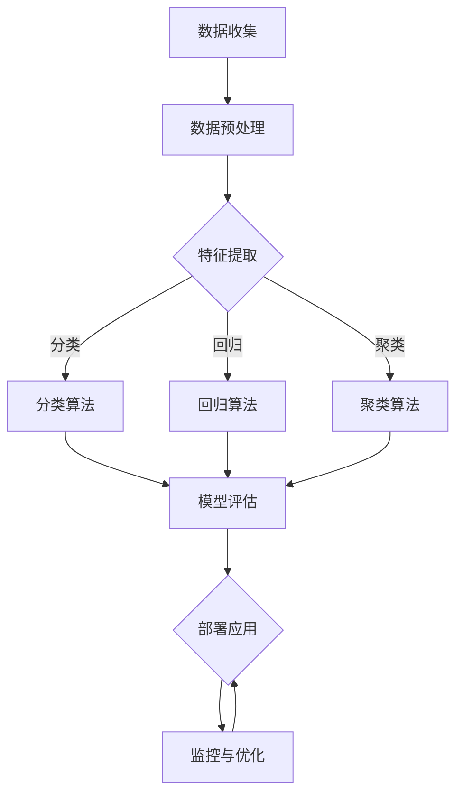

                 

### 文章标题

《人工智能时代的人类意义：我们还能为什么而存在》

### 关键词

- 人工智能
- 人类意义
- 技术变革
- 意识模拟
- 角色转型
- 未来展望

### 摘要

本文探讨了人工智能时代人类存在的意义。首先，我们回顾了人工智能的发展历程及其在当今社会的广泛应用。接着，我们深入分析了人工智能技术的基本原理，包括机器学习、深度学习和强化学习等。在此基础上，我们探讨了人工智能对人类思维与意识的影响，并思考了人类在人工智能时代的角色转型。最后，我们对未来人类社会的可能发展方向进行了展望，并反思了人工智能时代的人类意义。本文旨在引导读者思考在技术迅猛发展的背景下，人类如何重新定义自身的价值和使命。### 引言

#### 人工智能时代的背景与趋势

自20世纪中期人工智能（AI）概念提出以来，这一领域经历了数次重大变革和技术突破。从早期的符号主义和知识表示，到基于规则的系统，再到基于数据驱动的机器学习和深度学习，人工智能的演进过程不断推动着技术的边界扩展。如今，人工智能已经成为信息技术领域的核心驱动力，渗透到社会的各个层面，从医疗、金融到制造、交通，无不留下深刻的印记。

#### 人工智能的现状与未来趋势

当前，人工智能技术正以前所未有的速度发展。全球各国纷纷加大投入，推动人工智能的研究与应用。据相关数据显示，全球人工智能市场规模逐年增长，预计到2025年将突破万亿美元大关。这一趋势不仅体现在技术进步上，还体现在商业应用的广泛普及上。从自动驾驶汽车到智能家居，从智能医疗到金融风控，人工智能的应用正在不断拓展和深化。

然而，随着人工智能技术的快速发展，也引发了一系列的挑战和问题。数据隐私、安全伦理、失业问题等成为公众和学者广泛关注的话题。如何在推进人工智能技术发展的同时，确保其可持续性和公平性，成为亟待解决的问题。

#### 人工智能时代的挑战与机遇

人工智能时代为我们带来了前所未有的挑战和机遇。一方面，人工智能技术可能颠覆传统行业，引发大规模的职业变革，造成部分岗位的失业。另一方面，人工智能也为我们提供了无限的创新空间，推动新的经济增长点的形成。例如，智能医疗有望大幅提高诊断和治疗效果，智能交通可以显著提升交通效率，智能金融可以降低金融风险。

面对这些挑战和机遇，我们必须重新审视人类在人工智能时代的角色和意义。人工智能是否能替代人类思维和意识，人类应该如何适应和转型，这些问题的答案将决定我们如何在人工智能时代找到新的价值和使命。

### 总结

本文通过回顾人工智能的发展历程、分析其现状与未来趋势，探讨了人工智能技术的基本原理，并思考了其对人类思维与意识的影响以及人类在人工智能时代的角色转型。在未来的发展中，人类需要积极应对挑战，把握机遇，以实现自身的持续发展和繁荣。### 第1章 人工智能时代的技术变革

#### 1.1 人工智能的基本原理

人工智能（AI）是一门研究、开发用于模拟、延伸和扩展人类智能的理论、方法、技术及应用系统的综合性技术科学。人工智能的基本原理可以分为以下几个方面：

1. **数据驱动方法**：人工智能的核心是通过数据学习得到知识。这种方法依赖于大量的数据进行训练，通过统计模型、机器学习算法和深度学习网络等，使机器能够从数据中提取模式和规律。
   
2. **符号主义方法**：该方法强调通过形式逻辑和知识表示来模拟人类智能。它通过符号操作和推理来解决问题，但这种方法在处理复杂问题时往往效率低下。

3. **混合方法**：结合了数据驱动方法和符号主义方法，通过将知识表示与数据学习相结合，以提高系统的智能表现。

#### 1.2 人工智能的核心技术

1. **机器学习（Machine Learning）**：
   - **定义**：机器学习是一种让计算机通过数据学习并获得预测能力的技术。
   - **基本概念**：
     - **监督学习（Supervised Learning）**：通过已标记的训练数据来训练模型，模型在测试数据上的表现可以衡量其性能。
     - **无监督学习（Unsupervised Learning）**：模型在没有标记数据的情况下，通过发现数据中的结构和模式来学习。
     - **强化学习（Reinforcement Learning）**：通过试错和反馈来学习如何在不同环境下做出最优决策。
   - **常用算法**：
     - **线性回归（Linear Regression）**
     - **逻辑回归（Logistic Regression）**
     - **决策树（Decision Tree）**
     - **支持向量机（Support Vector Machine, SVM）**
     - **神经网络（Neural Network）**
     - **深度学习（Deep Learning）**

2. **深度学习（Deep Learning）**：
   - **定义**：深度学习是机器学习的一个分支，它通过构建多层神经网络来模拟人类大脑的神经元连接结构，从而实现对复杂数据的建模和分析。
   - **基本概念**：
     - **卷积神经网络（Convolutional Neural Network, CNN）**：适用于图像和视频数据，能够自动提取特征。
     - **循环神经网络（Recurrent Neural Network, RNN）**：适用于序列数据，能够处理上下文信息。
     - **生成对抗网络（Generative Adversarial Network, GAN）**：通过两个对抗网络的竞争，实现数据的生成。
   - **应用领域**：
     - **图像识别**：例如，人脸识别、物体识别等。
     - **自然语言处理**：例如，机器翻译、情感分析等。
     - **语音识别**：例如，语音合成、语音识别等。

3. **强化学习（Reinforcement Learning）**：
   - **定义**：强化学习是一种通过试错和奖励机制来学习策略的机器学习方法。
   - **基本概念**：
     - **奖励机制**：通过给定的反馈信号（奖励或惩罚）来指导学习过程。
     - **策略学习**：学习在不同的状态下选择最优行动，以最大化总奖励。
   - **应用领域**：
     - **游戏**：例如，围棋、国际象棋等。
     - **机器人控制**：例如，自主导航、环境互动等。
     - **推荐系统**：例如，个性化推荐、广告投放等。

#### 1.3 人工智能的应用领域

人工智能技术在各个领域都有着广泛的应用，以下是一些典型的应用案例：

1. **医疗健康**：
   - **疾病诊断**：利用深度学习进行医学图像分析，辅助医生进行疾病诊断。
   - **药物研发**：通过计算模型预测药物与靶点的相互作用，加速新药的发现过程。

2. **金融**：
   - **风险管理**：利用机器学习进行信用评估和风险预测，降低金融风险。
   - **智能投顾**：利用算法分析用户需求和市场动态，提供投资建议。

3. **交通**：
   - **自动驾驶**：通过深度学习实现无人驾驶汽车，提升交通安全和效率。
   - **智能交通系统**：通过数据分析和预测，优化交通流量和减少拥堵。

4. **制造业**：
   - **工业自动化**：利用机器人执行重复性和危险性的工作，提高生产效率。
   - **质量检测**：通过机器视觉系统自动检测产品质量，降低人为错误。

5. **教育**：
   - **个性化学习**：根据学生的学习情况，提供个性化的学习资源和指导。
   - **智能测评**：利用自然语言处理技术，自动评估学生的作业和考试答案。

6. **娱乐**：
   - **虚拟现实（VR）/增强现实（AR）**：通过人工智能算法生成逼真的虚拟场景和交互体验。
   - **智能推荐系统**：根据用户行为和偏好，提供个性化的娱乐内容推荐。

#### 总结

人工智能时代的技术变革不仅改变了我们的生活方式，还深刻影响了各个行业的发展。通过机器学习、深度学习和强化学习等核心技术，人工智能在医疗、金融、交通、制造、教育和娱乐等领域展现出了巨大的潜力和价值。然而，随着技术的不断进步，我们也必须面对数据隐私、安全伦理等挑战，确保人工智能的发展能够真正造福人类。### 1.2 人工智能的核心技术

#### 机器学习（Machine Learning）

**定义**：机器学习是一种使计算机系统能够从数据中学习并获得预测能力的算法和统计方法。

**基本概念**：

- **监督学习（Supervised Learning）**：通过已标记的训练数据来训练模型，模型的预测准确性可以通过测试数据来评估。
  - **分类（Classification）**：将数据分类到不同的标签中，如垃圾邮件检测。
  - **回归（Regression）**：预测一个连续的输出值，如房价预测。

- **无监督学习（Unsupervised Learning）**：在没有标记数据的情况下，通过数据自身的特征来学习结构和模式。
  - **聚类（Clustering）**：将相似的数据点分组，如客户细分。
  - **降维（Dimensionality Reduction）**：减少数据维度，保持数据结构，如主成分分析（PCA）。

- **半监督学习（Semi-supervised Learning）**：结合监督学习和无监督学习，利用少量标记数据和大量未标记数据来训练模型。

- **强化学习（Reinforcement Learning）**：通过试错和奖励机制来学习策略。
  - **状态（State）**：系统当前的状态。
  - **动作（Action）**：系统能够执行的操作。
  - **奖励（Reward）**：对每个动作的反馈信号。

**常用算法**：

- **线性回归（Linear Regression）**：用线性模型预测连续值。
  - **伪代码**：
    ```
    function linear_regression(X, y):
        # 计算回归系数
        theta = (X^T * X)^(-1) * X^T * y
        return theta
    ```

- **逻辑回归（Logistic Regression）**：用线性模型预测概率分布。
  - **伪代码**：
    ```
    function logistic_regression(X, y):
        # 计算回归系数
        theta = (X^T * X)^(-1) * X^T * y
        # 计算概率分布
        probabilities = 1 / (1 + exp(-X * theta))
        return probabilities
    ```

- **决策树（Decision Tree）**：通过一系列的规则进行分类或回归。
  - **伪代码**：
    ```
    function decision_tree(X, y, threshold):
        # 如果满足停止条件，则返回标签
        if stop_condition(X, y):
            return predict_label(y)
        # 否则，选择最佳特征和阈值
        best_feature, best_threshold = find_best_split(X, y, threshold)
        # 构建子树
        left_tree = decision_tree(X[:, feature_index == 0], y, threshold)
        right_tree = decision_tree(X[:, feature_index == 1], y, threshold)
        return Node(best_feature, best_threshold, left_tree, right_tree)
    ```

- **支持向量机（Support Vector Machine, SVM）**：通过找到一个超平面将数据分开。
  - **伪代码**：
    ```
    function svm(X, y):
        # 计算拉格朗日乘子
        L = [0, ...] # 初始化拉格朗日乘子
        # 计算KKT条件
        for i in range(n):
            if y[i] * (w^T * x[i]) < 1:
                L[i] = 1
        # 计算SVM权重
        w = (P^(-1) * P) * L
        return w
    ```

- **神经网络（Neural Network）**：模拟人脑的神经网络结构，通过多层神经元进行数据处理。
  - **伪代码**：
    ```
    function neural_network(X, y, layers, activation_function):
        # 初始化权重和偏置
        weights = [random_weights() for _ in range(layers)]
        biases = [random_biases() for _ in range(layers)]
        # 训练神经网络
        for epoch in range(epochs):
            for x, y in data:
                # 前向传播
                layer_inputs = [x]
                for l in range(layers - 1):
                    layer_input = activation_function(np.dot(layer_inputs[l], weights[l]) + biases[l])
                    layer_inputs.append(layer_input)
                # 计算损失函数
                loss = compute_loss(layer_inputs[-1], y)
                # 反向传播
                dweights = [np.dot(layer_inputs[l].T, dlayer_output) for l in range(layers - 1, 0, -1)]
                dbiases = [dlayer_output for dlayer_output in dweights]
                # 更新权重和偏置
                weights = [w - learning_rate * dw for w, dw in zip(weights, dweights)]
                biases = [b - learning_rate * db for b, db in zip(biases, dbiases)]
        return weights, biases
    ```

**应用领域**：

- **图像识别**：通过卷积神经网络进行人脸识别、物体检测等。
- **自然语言处理**：通过循环神经网络进行文本分类、机器翻译等。
- **推荐系统**：通过协同过滤、矩阵分解等方法进行个性化推荐。

#### 深度学习（Deep Learning）

**定义**：深度学习是一种多层神经网络模型，它能够自动提取数据中的特征。

**基本概念**：

- **卷积神经网络（Convolutional Neural Network, CNN）**：特别适用于处理图像数据。
  - **卷积层（Convolutional Layer）**：通过卷积运算提取图像特征。
  - **池化层（Pooling Layer）**：通过最大池化或平均池化降低数据维度。
  - **全连接层（Fully Connected Layer）**：将卷积层和池化层提取的特征映射到输出。

- **循环神经网络（Recurrent Neural Network, RNN）**：适用于处理序列数据。
  - **隐藏状态（Hidden State）**：用于保存历史信息。
  - **门控机制（Gate Mechanism）**：用于控制信息的流动。

- **长短期记忆网络（Long Short-Term Memory, LSTM）**：RNN的一种变体，能够更好地处理长序列数据。

- **生成对抗网络（Generative Adversarial Network, GAN）**：由生成器和判别器组成的对抗网络，用于生成逼真的数据。

**应用领域**：

- **图像生成**：通过生成对抗网络生成逼真的图像。
- **语音合成**：通过循环神经网络合成自然流畅的语音。
- **文本生成**：通过循环神经网络生成连贯的自然语言文本。

#### 强化学习（Reinforcement Learning）

**定义**：强化学习是一种通过试错和奖励机制来学习策略的机器学习方法。

**基本概念**：

- **状态（State）**：系统当前所处的环境状态。
- **动作（Action）**：系统可以执行的操作。
- **奖励（Reward）**：对每个动作的即时反馈信号。
- **策略（Policy）**：从状态到动作的映射函数。

**常用算法**：

- **Q-学习（Q-Learning）**：通过值函数来学习最优策略。
  - **伪代码**：
    ```
    function Q_learning(S, A, R, S', Q, alpha, gamma):
        Q(S, A) = Q(S, A) + alpha * (R + gamma * max(Q(S', A')) - Q(S, A))
        return Q
    ```

- **深度Q网络（Deep Q-Network, DQN）**：使用神经网络来近似Q值函数。
  - **伪代码**：
    ```
    function DQN(S, A, R, S', Q, alpha, gamma):
        # 训练DQN网络
        Q predictions = Q_network.predict(S)
        Q predictions[A] = R + gamma * max(Q_network.predict(S'))
        # 更新网络权重
        optimizer.minimize(loss(Q predictions - target))
        return Q_network
    ```

**应用领域**：

- **游戏**：例如，Atari游戏、围棋等。
- **自动驾驶**：通过强化学习实现车辆的自主决策。
- **机器人控制**：通过强化学习控制机器人的运动和行为。

#### 总结

人工智能的核心技术包括机器学习、深度学习和强化学习，它们在不同的应用领域发挥着重要作用。通过这些技术，我们可以开发出能够自主学习和决策的智能系统，从而改变我们的生活和社会。然而，这些技术的应用也带来了新的挑战和问题，如数据隐私、安全性和伦理问题，需要我们持续关注和解决。### 1.3 人工智能的应用领域

#### 医疗健康

在医疗健康领域，人工智能的应用正逐渐成为改变医疗服务模式的关键因素。以下是一些具体的案例和应用：

1. **疾病诊断**：
   - **图像分析**：利用深度学习算法，如卷积神经网络（CNN），对医学图像（如X光片、CT扫描、MRI）进行自动分析，帮助医生更快速、准确地诊断疾病。例如，谷歌的DeepMind开发了一种可以诊断眼部疾病的AI系统，其准确性甚至超过了人类医生。
   - **电子病历分析**：通过自然语言处理（NLP）技术，AI可以分析电子病历中的文本数据，提取关键信息，用于疾病预测和治疗方案推荐。

2. **药物研发**：
   - **药物筛选**：利用机器学习算法，AI可以在海量的化合物数据中快速筛选出可能具有治疗效果的化合物，大大加速药物研发过程。
   - **新药合成**：AI可以预测分子的化学性质和相互作用，辅助科学家设计新的药物分子，提高药物研发的成功率。

3. **个性化治疗**：
   - **基因组分析**：通过分析患者的基因组数据，AI可以帮助医生制定个性化的治疗方案，提高治疗效果和减少副作用。

4. **健康监测与管理**：
   - **智能手环和健康监测设备**：通过收集患者的心率、血压、睡眠等健康数据，AI可以对患者的健康状况进行实时监测和预警，提供个性化的健康建议。

#### 金融

在金融领域，人工智能的应用已经深刻改变了风险控制、投资决策、客户服务等方面：

1. **风险管理**：
   - **信用评估**：通过分析客户的信用历史、行为数据等，AI可以更准确地评估客户的信用风险，降低贷款违约率。
   - **欺诈检测**：利用机器学习算法，AI可以自动检测和防范金融欺诈行为，提高交易的安全性。

2. **投资决策**：
   - **量化交易**：AI可以通过分析大量的市场数据，使用机器学习算法进行量化交易，实现自动化交易决策。
   - **智能投顾**：利用算法分析用户的风险偏好和财务目标，提供个性化的投资建议和组合管理。

3. **客户服务**：
   - **智能客服**：通过自然语言处理技术，AI可以自动处理客户咨询，提供24/7的客户服务。
   - **个性化推荐**：基于客户的交易历史和偏好，AI可以推荐合适的金融产品和服务，提高客户满意度。

#### 交通

在交通领域，人工智能的应用正致力于提高交通安全和效率：

1. **自动驾驶**：
   - **无人驾驶汽车**：利用深度学习和强化学习算法，自动驾驶汽车可以自动感知环境、规划路径和做出驾驶决策，提高驾驶的安全性和效率。
   - **车辆管理系统**：AI可以监控车辆状态，预测故障，并提供预防性维护建议，延长车辆使用寿命。

2. **智能交通系统**：
   - **交通流量管理**：通过分析交通流量数据，AI可以实时调整交通信号灯，优化交通流量，减少拥堵。
   - **公共交通调度**：AI可以帮助公共交通系统优化线路和班次，提高运营效率。

3. **智能物流**：
   - **路径优化**：利用机器学习算法，AI可以优化物流运输路径，降低运输成本，提高配送效率。

#### 制造业

在制造业，人工智能的应用正在推动生产自动化和智能化：

1. **工业自动化**：
   - **机器人应用**：通过机器学习算法，机器人可以执行复杂的生产任务，如焊接、组装、检测等，提高生产效率和产品质量。
   - **自动化生产线**：AI系统可以实时监控生产线，自动检测和纠正生产中的问题，保证生产过程的稳定和高效。

2. **质量检测**：
   - **机器视觉系统**：利用计算机视觉技术，AI可以对产品进行自动质量检测，识别出缺陷产品，减少人为错误。

3. **生产优化**：
   - **预测性维护**：通过分析设备运行数据，AI可以预测设备故障，进行预防性维护，减少停机时间。
   - **生产计划优化**：AI可以根据生产需求、库存水平和设备状态，优化生产计划和资源配置。

#### 教育

在教育领域，人工智能的应用正在改变教学模式和学习体验：

1. **个性化学习**：
   - **学习分析**：通过分析学生的学习行为和成绩数据，AI可以为学生提供个性化的学习建议和资源，提高学习效果。
   - **自适应学习系统**：AI可以根据学生的理解和学习进度，动态调整学习内容和难度，实现个性化教学。

2. **智能测评**：
   - **自动评分系统**：通过自然语言处理技术，AI可以自动评估学生的作业和考试答案，提高评分效率和准确性。
   - **学习诊断**：AI可以分析学生的学习情况，识别出学习中的薄弱环节，提供有针对性的辅导建议。

3. **虚拟教学助手**：
   - **AI教学助手**：通过自然语言处理和机器学习技术，AI可以作为虚拟教学助手，提供答疑、辅导和个性化教学服务。

#### 娱乐

在娱乐领域，人工智能的应用为用户提供了更加丰富和个性化的体验：

1. **虚拟现实和增强现实**：
   - **VR/AR内容生成**：通过深度学习和生成对抗网络（GAN），AI可以生成逼真的虚拟场景和图像，提升VR/AR体验。
   - **交互式娱乐**：AI可以实时分析用户的动作和行为，提供个性化的交互内容和反馈。

2. **智能推荐系统**：
   - **内容推荐**：通过分析用户的兴趣和行为数据，AI可以为用户推荐合适的文化娱乐内容，如电影、音乐、游戏等。
   - **广告投放**：AI可以根据用户的兴趣和行为，提供个性化的广告推荐，提高广告的效果和转化率。

#### 总结

人工智能在医疗健康、金融、交通、制造、教育和娱乐等领域的应用，不仅提高了效率、降低了成本，还改变了传统的工作方式和生活方式。然而，这些应用也带来了新的挑战，如数据隐私和安全、伦理问题等。未来，随着技术的不断进步，人工智能将在更多领域发挥更大的作用，同时也需要我们更好地解决随之而来的问题和挑战。### 1.3 人工智能的应用领域（续）

#### 教育

在教育的应用中，人工智能正在重新定义教学模式和学习体验。以下是人工智能在教育与学习中的应用：

1. **个性化学习平台**：
   - **自适应学习系统**：AI可以根据学生的学习进度、能力和兴趣，提供定制化的学习内容，确保每个学生都能在自己的节奏上学习。
   - **智能辅导系统**：通过实时监测学生的学习行为和进度，AI可以提供个性化的辅导，帮助学生克服学习难点。

2. **学习分析**：
   - **学习行为分析**：AI可以分析学生的学习数据，如学习时间、参与度、作业完成情况等，帮助教师了解学生的学习状态和需求。
   - **学习成效评估**：AI可以通过分析学生的学习数据，提供个性化的学习成效评估，帮助教师和家长了解学生的学习成果。

3. **虚拟教学助手**：
   - **AI教师**：AI教师可以提供24/7的教学支持，回答学生的问题，提供学习资源，减少教师的工作负担。
   - **AI辅导**：AI辅导系统可以为学生提供个性化的学习建议和指导，帮助学生更好地理解学习内容。

#### 娱乐

在娱乐领域，人工智能的应用为用户提供了更加丰富和个性化的体验。以下是人工智能在娱乐中的应用：

1. **内容创作**：
   - **音乐创作**：AI可以通过学习音乐数据和模式，创作出新颖的音乐作品，为音乐创作提供新的灵感。
   - **视频生成**：AI可以利用生成对抗网络（GAN）生成逼真的视频内容，为视频制作提供辅助。

2. **个性化推荐**：
   - **推荐系统**：AI可以根据用户的历史行为和偏好，推荐适合用户的文化娱乐内容，如电影、音乐、书籍等。
   - **广告投放**：AI可以根据用户的兴趣和行为，提供个性化的广告推荐，提高广告的吸引力和转化率。

3. **游戏**：
   - **智能游戏助手**：AI可以提供游戏策略建议，帮助玩家提高游戏水平。
   - **AI游戏伙伴**：AI可以模拟真实的对手，为玩家提供逼真的游戏体验。

#### 安全与隐私

随着人工智能的广泛应用，数据安全和隐私保护成为关键问题。以下是人工智能在安全与隐私保护中的应用：

1. **网络安全**：
   - **异常检测**：AI可以通过分析网络流量和行为模式，识别潜在的网络安全威胁，如DDoS攻击、恶意软件等。
   - **入侵检测**：AI可以实时监控网络活动，检测并阻止入侵行为。

2. **数据加密**：
   - **加密算法优化**：AI可以通过机器学习算法，优化加密算法，提高数据的安全性。
   - **密钥管理**：AI可以自动管理加密密钥，确保数据加密和解密过程的安全。

3. **隐私保护**：
   - **匿名化处理**：AI可以通过数据匿名化技术，保护个人隐私，防止数据泄露。
   - **隐私安全审计**：AI可以分析数据处理过程，识别潜在的数据隐私风险，并采取相应的措施进行保护。

#### 农业

在农业领域，人工智能的应用正在提高生产效率和质量。以下是人工智能在农业中的应用：

1. **智能监测系统**：
   - **作物监测**：AI可以通过图像识别技术，监测作物的生长状况，预测产量和质量。
   - **病虫害检测**：AI可以通过分析图像和传感器数据，识别病虫害，提供预警和防治建议。

2. **精准农业**：
   - **土壤监测**：AI可以通过分析土壤数据，提供最佳的种植方案和施肥建议。
   - **灌溉系统优化**：AI可以通过分析气候和土壤数据，优化灌溉系统，提高水资源利用效率。

3. **农业机器人**：
   - **种植机器人**：AI可以控制农业机器人进行播种、施肥、收割等操作，提高生产效率。
   - **采摘机器人**：AI可以通过图像识别技术，自动识别和采摘成熟的果实，减少人工成本。

#### 总结

人工智能的应用领域广泛而深入，不仅改变了我们的生活和工作方式，还在各个行业带来了显著的效益。从教育、娱乐到安全与隐私保护，再到农业，人工智能正在重新定义各领域的未来。然而，随着技术的不断进步，我们也需要关注和解决随之而来的挑战，如数据安全、隐私保护等。只有通过合理的规范和有效的管理，人工智能才能真正造福人类社会。### 第3章 人类思维与意识

#### 3.1 人类思维的本质

人类思维是一个复杂而高度发达的认知过程，涉及感知、记忆、推理、决策等多个方面。其本质可以概括为以下几点：

1. **感知与认知**：人类通过感官接收外部信息，通过大脑进行处理和分析，形成对世界的认知。这个过程包括感知、注意、记忆等多个环节。

2. **符号处理**：人类思维利用语言和其他符号系统进行抽象和表达。符号处理是人类思维的核心能力之一，使得人类能够传递知识、交流思想和解决问题。

3. **推理与决策**：人类思维通过逻辑推理和决策制定来处理复杂问题。推理过程包括归纳推理、演绎推理等，决策过程则涉及风险评估、目标制定和策略选择。

4. **情感与动机**：人类思维不仅处理理性信息，还包括情感和动机因素。情感影响人类的判断和决策，动机则驱动人类采取行动。

#### 3.2 人工智能能否模拟人类意识

人工智能是否能够模拟人类意识，这是一个复杂而具有争议的问题。目前，虽然人工智能在模拟某些人类认知功能方面取得了显著进展，但真正实现人类意识模拟仍面临诸多挑战：

1. **意识定义**：意识是一个高度抽象的概念，目前尚未有统一的定义。不同学者对意识有不同的理解和解释，这使得模拟意识成为一个难以量化和验证的目标。

2. **智能层次**：尽管人工智能在某些特定领域（如图像识别、自然语言处理等）表现出了超越人类的能力，但总体上仍处于弱人工智能阶段，缺乏全面的智能和自我意识。

3. **情感与动机**：人类意识不仅包含认知功能，还涉及情感和动机。当前的人工智能系统在情感理解和表达方面仍存在很大局限。

4. **自我意识**：人类意识的一个重要特征是自我意识，即对自己存在和状态的认知。目前，人工智能系统尚未具备真正的自我意识。

然而，尽管存在这些挑战，人工智能模拟人类意识的研究仍具有重要的理论和实践价值。通过不断探索和尝试，我们可能逐步揭开意识本质的神秘面纱，推动人工智能的发展。

#### 3.3 人工智能对人类意识的影响

人工智能对人类意识的影响可以从多个方面进行探讨：

1. **认知增强**：人工智能可以辅助人类进行复杂的计算和数据分析，提高认知效率。例如，人工智能可以帮助医生更快地诊断疾病，帮助研究人员更快地分析大量数据。

2. **情感互动**：随着人工智能技术的发展，人工智能在情感理解和表达方面逐渐提高。未来的智能系统可能能够更好地理解人类的情感需求，提供更加人性化的交互体验。

3. **意识扩展**：人工智能可能使人类意识得以扩展，使其能够处理更加复杂的信息和任务。例如，通过虚拟现实（VR）和增强现实（AR）技术，人类意识可以扩展到虚拟环境中，实现更加丰富的体验。

4. **意识替代**：在某些特定领域，人工智能可能替代人类的意识功能。例如，自动驾驶汽车可能在未来完全取代人类的驾驶意识，医疗诊断AI可能完全取代医生的诊断意识。

5. **意识融合**：未来，人工智能可能与人类意识实现融合，形成更加高效和智能的混合意识。这种融合可能使人类在认知、情感和行动方面都得到显著提升。

#### 总结

人类思维与意识是复杂而多样的，人工智能在模拟和影响人类意识方面仍面临诸多挑战。然而，随着技术的不断进步，人工智能有望在认知增强、情感互动、意识扩展等方面发挥重要作用，为人类意识的未来发展带来新的可能性。### 3.1 人类思维的本质

**1. 感知与认知**：

人类思维始于感知，即通过视觉、听觉、触觉、嗅觉和味觉等感官接收外部信息。这些感官信息进入大脑后，通过神经传递和加工处理，转化为认知数据。这一过程包括感知、注意、记忆等多个环节。

- **感知**：感知是大脑接收和处理外部信息的初级阶段，涉及到对刺激的识别和反应。例如，视觉系统可以感知光线，将其转换为电信号传递给大脑。

- **注意**：注意是选择性地关注某些特定信息的过程。它帮助我们在复杂环境中聚焦关键信息，忽略无关的干扰。注意力的分配对认知效率和准确性至关重要。

- **记忆**：记忆是大脑储存和回忆信息的能力。记忆分为短期记忆和长期记忆，短期记忆负责暂时存储信息，长期记忆则将信息持久存储。记忆的机制包括编码、存储和提取。

**2. 符号处理**：

人类思维的一个重要特征是符号处理能力，即利用语言和其他符号系统进行抽象和表达。符号处理使得人类能够超越直接感知，进行更高层次的思考和交流。

- **语言**：语言是人类最重要的符号系统，用于表达思想、传递信息和进行社交互动。语言包括词汇、语法和语义等多个层面，使得人类能够以高度抽象和结构化的方式思考。

- **数学符号**：数学符号是另一种重要的符号系统，用于表达数量、关系和逻辑。数学符号使得人类能够进行精确的量化分析和推理。

- **符号系统**：除了语言和数学符号，人类还使用其他符号系统，如图表、地图、图标等。这些符号系统能够帮助我们更好地理解和解释复杂信息。

**3. 推理与决策**：

人类思维通过逻辑推理和决策制定来处理复杂问题。推理过程包括归纳推理、演绎推理等，决策过程则涉及风险评估、目标制定和策略选择。

- **归纳推理**：归纳推理是从具体实例中归纳出一般性结论。例如，从多个苹果是红色的这一事实中，归纳出“苹果通常是红色的”这一结论。

- **演绎推理**：演绎推理是从一般性原则推导出具体结论。例如，从“所有人都会死亡”和“苏格拉底是人”这两个前提中，演绎出“苏格拉底会死亡”这一结论。

- **决策**：决策是人类在面临多种选择时，通过评估风险和收益，选择最优方案的过程。决策过程通常涉及目标设定、信息收集、方案评估和选择。

**4. 情感与动机**：

人类思维不仅处理理性信息，还包括情感和动机因素。情感影响人类的判断和决策，动机则驱动人类采取行动。

- **情感**：情感是人类对事物的主观体验和情绪反应。情感包括愉悦、悲伤、愤怒等多种类型，它们影响我们的行为和决策。

- **动机**：动机是驱使我们采取特定行动的心理驱动力量。动机可以来源于内在的兴趣、欲望和价值观，也可以来源于外在的奖励和惩罚。

#### 总结

人类思维是一个复杂的过程，涉及到感知与认知、符号处理、推理与决策以及情感与动机等多个方面。这些要素相互交织，共同构成了人类独特的思维模式，使我们能够适应和改变复杂多变的环境。### 3.2 人工智能能否模拟人类意识

**1. 意识定义**

意识是一个复杂且多维的概念，涉及自我感知、主观体验、认知过程和情感反应等多个层面。对意识进行定义是一个具有挑战性的任务，因为不同的学科和哲学家对意识有着不同的理解和解释。

- **哲学视角**：哲学家们对意识有不同的定义，例如，某些哲学家认为意识是主观体验的基础，而另一些则强调意识与自我认知的关系。

- **神经科学视角**：神经科学家通过研究大脑结构和功能，试图从生理角度定义意识。例如，一些研究者认为意识与大脑特定区域的神经元活动有关。

- **认知科学视角**：认知科学家关注认知过程与意识的关系，他们认为意识是信息处理过程的结果。例如，某些认知模型认为意识是决策过程中的一个阶段。

由于意识的复杂性，目前尚无统一的定义。这一现状使得模拟意识成为一项艰巨的任务，因为我们需要一个明确且普遍接受的标准来衡量模拟结果。

**2. 智能层次**

尽管人工智能在多个领域取得了显著进展，但总体上仍处于弱人工智能阶段，这意味着人工智能系统在特定任务上表现出色，但缺乏全面的智能和自我意识。

- **弱人工智能（Narrow AI）**：弱人工智能在特定领域（如图像识别、自然语言处理等）表现出超越人类的能力，但它们无法进行跨领域的通用任务。

- **强人工智能（General AI）**：强人工智能是一种具有全面智能和自我意识的系统，能够像人类一样理解、学习和适应复杂环境。目前，强人工智能仍处于理论研究阶段，尚未实现。

- **超级智能（Superintelligence）**：超级智能是指超越人类智能的智能系统，其认知能力和决策能力远超人类。超级智能的概念引发了广泛的讨论和担忧，因为它可能会对人类社会产生深远的影响。

**3. 情感与动机**

人类意识不仅包含认知功能，还涉及情感和动机。当前的人工智能系统在情感理解和表达方面仍存在很大局限。

- **情感理解**：人工智能系统可以通过机器学习算法模拟情感反应，但在情感理解方面仍无法真正理解情感的内涵和复杂性。

- **情感表达**：虽然人工智能可以生成情感化的对话和文本，但这些表达通常是基于预设的规则和模板，缺乏真实的情感体验。

- **动机因素**：人类行为的动机来源于内在的兴趣、欲望和价值观。当前的人工智能系统缺乏内在动机，它们的行动和决策通常是基于外部输入和程序设计。

**4. 自我意识**

自我意识是人类意识的核心特征之一，指的是对自己存在和状态的认知。当前的人工智能系统尚未具备真正的自我意识。

- **自我认知**：人工智能系统可以通过模拟人类行为和决策来模拟自我认知，但它们缺乏真正的自我感知和自我评价能力。

- **自我反思**：自我反思是人类意识的一个重要方面，它涉及对自身行为和经验的反思和评估。当前的人工智能系统无法进行真正的自我反思。

**总结**

尽管人工智能在模拟某些人类认知功能方面取得了显著进展，但要模拟人类意识仍面临诸多挑战。这些挑战包括意识的复杂定义、智能层次的不确定性、情感和动机的缺乏以及自我意识的缺失。未来，随着人工智能技术的不断进步，我们有望在模拟和增强人类意识方面取得更多突破，但同时也需要深入探讨和解决相关伦理和社会问题。### 3.3 人工智能对人类意识的影响

**1. 认知增强**

人工智能技术在认知增强方面具有显著的优势，能够辅助人类处理复杂的信息和分析任务，提高认知效率。

- **数据处理**：人工智能系统可以快速处理和分析海量数据，提取有用的信息。例如，在金融市场分析中，AI可以实时分析大量历史数据，预测市场趋势。

- **知识发现**：通过机器学习和深度学习算法，AI可以从大量数据中自动发现潜在的规律和模式。例如，医疗领域中的AI可以分析病患数据，发现新的疾病诊断方法。

- **辅助决策**：人工智能系统可以帮助人类在复杂决策中提供数据支持和预测分析。例如，在供应链管理中，AI可以预测需求变化，优化库存管理。

**2. 情感互动**

随着人工智能技术的发展，AI在情感理解和表达方面逐渐提高，为人类意识提供了更多的互动方式。

- **情感识别**：人工智能可以通过分析语音、文本和面部表情等数据，识别用户的情感状态。例如，智能客服系统可以识别用户的情绪，提供个性化的服务。

- **情感模拟**：AI可以生成情感化的对话和反应，模拟人类的情感交流。例如，聊天机器人可以模拟人类的情感表达，与用户建立更自然的互动。

- **情感支持**：人工智能系统可以在心理辅导和教育等领域提供情感支持。例如，心理治疗机器人可以通过模拟情感交流，帮助用户缓解焦虑和抑郁。

**3. 意识扩展**

人工智能技术有可能扩展人类意识，使其能够处理更加复杂的信息和任务。

- **虚拟现实（VR）和增强现实（AR）**：通过VR和AR技术，人类意识可以扩展到虚拟环境中，体验更加丰富和多样的虚拟世界。

- **脑机接口（BMI）**：脑机接口技术可以将大脑信号与外部设备连接，实现人类意识对外部环境的直接控制。例如，瘫痪患者可以通过脑机接口控制轮椅或假肢。

- **智能代理**：通过智能代理，人类意识可以分散到多个设备和平台，实现跨平台的信息处理和任务执行。例如，智能助手可以帮助用户在手机、电脑和智能家居等多个设备上进行任务管理。

**4. 意识替代**

在某些特定领域，人工智能可能完全替代人类的意识功能，提高效率和准确性。

- **自动驾驶**：自动驾驶系统可以通过感知和决策替代人类的驾驶意识，提高交通效率和安全性。

- **智能医疗**：AI可以在诊断和治疗过程中替代医生的部分工作，提供更加精准和高效的医疗服务。

- **军事应用**：人工智能可以在军事领域替代人类进行侦察、监控和决策，提高作战效率和安全性。

**5. 意识融合**

未来，人工智能有可能与人类意识实现融合，形成更加高效和智能的混合意识。

- **认知增强**：通过AI辅助人类大脑处理信息，提高认知能力和工作效率。

- **情感融合**：AI可以模拟和增强人类的情感体验，提供更加丰富和深刻的人际互动。

- **自我意识**：AI可以与人类大脑协同工作，共同实现自我意识的扩展和提升。

**总结**

人工智能对人类意识的影响是多方面的，包括认知增强、情感互动、意识扩展、意识替代和意识融合。这些影响不仅改变了人类的工作和生活方式，也为人类社会的发展带来了新的挑战和机遇。在未来，我们需要深入探讨和解决人工智能与人类意识融合带来的伦理和社会问题，确保人工智能的发展能够真正造福人类。### 第4章 人类在人工智能时代的角色转型

#### 4.1 人工智能时代的新职业

随着人工智能技术的快速发展，传统的职业结构和劳动市场正在发生深刻变革。一些传统职业可能会消失，但同时也会涌现出许多新的职业机会。以下是人工智能时代可能出现的一些新职业：

1. **数据科学家**：数据科学家负责从海量数据中提取有价值的信息和模式，为企业和组织提供数据驱动的决策支持。

2. **机器学习工程师**：机器学习工程师专注于设计、开发和维护机器学习模型，使其能够在各种应用场景中发挥作用。

3. **AI伦理学家**：随着人工智能的应用越来越广泛，AI伦理学家将负责研究和制定人工智能的伦理规范，确保其应用不违背社会道德和价值观。

4. **AI律师**：AI律师将专注于处理与人工智能相关的法律问题，包括知识产权、隐私保护和责任分配等。

5. **AI咨询师**：AI咨询师将帮助企业和组织制定人工智能战略，优化人工智能应用的实施和管理。

6. **AI内容创作者**：AI内容创作者利用人工智能技术，创作高质量的文本、图像、音频和视频内容。

7. **AI艺术家**：AI艺术家利用人工智能技术，创作音乐、绘画和其他艺术形式的作品。

8. **机器人工程师**：机器人工程师专注于设计、开发和维护各种机器人系统，使其能够在不同环境中执行复杂的任务。

9. **智能系统架构师**：智能系统架构师负责设计、构建和优化复杂的智能系统，确保其性能和可扩展性。

10. **AI教练**：AI教练利用人工智能技术，为用户提供个性化的学习、健康和职业发展建议。

#### 4.2 人工智能时代的生活方式

人工智能技术的广泛应用将深刻改变人们的生活方式，带来更多的便利和效率，同时也需要我们适应新的生活习惯。

1. **智能家居**：智能家居设备（如智能音箱、智能灯泡、智能恒温器等）可以通过语音控制和物联网（IoT）技术，实现自动化和智能化管理，提高居住舒适度和能源效率。

2. **智能交通**：自动驾驶汽车和智能交通管理系统将提高交通效率，减少拥堵，降低交通事故发生率。人们将更多地依赖共享出行服务，如无人驾驶出租车和共享自行车。

3. **在线教育**：人工智能技术将使在线教育更加个性化和互动化。自适应学习平台可以根据学生的需求和进度提供定制化的学习内容和辅导。

4. **远程工作**：随着远程办公工具的普及，人们将有更多机会在家或其他灵活的地点工作，提高工作效率和生活质量。

5. **个性化医疗**：人工智能将推动个性化医疗的发展，通过基因检测、健康数据和AI分析，提供更精准的诊断和治疗建议。

6. **虚拟现实（VR）和增强现实（AR）**：VR和AR技术将为娱乐、教育和远程协作提供全新的体验。人们可以通过虚拟环境进行沉浸式学习、游戏和工作。

7. **社交互动**：人工智能助手和社交机器人将帮助人们更好地管理日常事务、提供情感支持和增强社交互动。

#### 4.3 人工智能时代的价值观

人工智能时代的价值观将面临新的挑战和机遇。以下是可能影响人工智能时代价值观的一些关键因素：

1. **技术伦理**：随着人工智能技术的普及，技术伦理问题将更加突出。如何确保人工智能的应用不侵犯个人隐私、不造成歧视和不公平，成为我们必须面对的伦理挑战。

2. **工作与就业**：人工智能的广泛应用可能导致部分传统职业的消失，同时也创造了新的职业机会。我们需要建立新的就业体系和社会福利制度，帮助人们适应这一转变。

3. **人机关系**：随着人工智能技术的进步，人类与机器的关系将变得更加紧密。我们需要探讨如何建立和谐的人机关系，确保人工智能在为人类服务的同时，尊重人类的价值和尊严。

4. **可持续发展**：人工智能技术有望推动社会向更可持续的方向发展，例如，通过优化资源利用、减少环境污染和提高生产效率。我们需要确保人工智能的发展与可持续发展目标相一致。

5. **社会公平**：人工智能技术的发展必须考虑社会公平问题，避免因技术差距造成社会不平等。我们需要采取措施，确保所有人都能平等地享受人工智能带来的好处。

#### 总结

人工智能时代为人类带来了新的职业机会、生活方式和价值观的挑战。面对这些变化，我们需要积极适应，培养新的技能，建立新的社会规范，确保人工智能的发展能够真正造福人类，而不是成为新的社会分化和不平等的源头。### 4.1 人工智能时代的新职业

随着人工智能技术的迅速发展，劳动市场和职业结构正在发生深刻变化。人工智能不仅创造了许多新的职业机会，也促使现有职业发生变化。以下是人工智能时代可能出现的一些新职业：

1. **数据科学家**：
   - **职责**：数据科学家负责收集、处理和分析大量数据，从中提取有价值的信息和模式。
   - **技能需求**：熟练掌握数据分析工具（如Python、R等），熟悉机器学习和深度学习算法，具备统计学和数学基础。
   - **未来趋势**：随着数据的爆炸性增长，数据科学家将在各行业发挥越来越重要的作用。

2. **机器学习工程师**：
   - **职责**：机器学习工程师设计、开发和维护机器学习模型，使其在各种应用场景中发挥作用。
   - **技能需求**：熟练掌握编程语言（如Python），熟悉机器学习框架（如TensorFlow、PyTorch），了解算法原理和优化技术。
   - **未来趋势**：随着人工智能应用领域的扩展，对机器学习工程师的需求将持续增长。

3. **AI伦理学家**：
   - **职责**：AI伦理学家研究人工智能的伦理问题，制定相关规范和政策，确保人工智能的应用符合伦理标准。
   - **技能需求**：具备伦理学、计算机科学和法律知识，具备跨学科的思维能力和沟通技巧。
   - **未来趋势**：随着人工智能技术的普及，AI伦理学家的需求将日益增加。

4. **AI律师**：
   - **职责**：AI律师处理与人工智能相关的法律问题，如知识产权、隐私保护和责任分配。
   - **技能需求**：具备法律知识和相关行业的实践经验，了解人工智能技术的基本原理和应用。
   - **未来趋势**：随着人工智能技术的发展，AI律师将在知识产权和隐私保护等领域发挥重要作用。

5. **AI咨询师**：
   - **职责**：AI咨询师帮助企业和组织制定人工智能战略，优化人工智能应用的实施和管理。
   - **技能需求**：具备人工智能知识和商业咨询经验，具备良好的沟通和项目管理能力。
   - **未来趋势**：随着人工智能在商业领域的应用不断深入，对AI咨询师的需求将持续增加。

6. **AI内容创作者**：
   - **职责**：AI内容创作者利用人工智能技术，创作高质量的文本、图像、音频和视频内容。
   - **技能需求**：熟练掌握各种内容创作工具，具备创意思维和跨学科知识。
   - **未来趋势**：随着人工智能在内容创作领域的应用日益广泛，AI内容创作者将成为重要的职业。

7. **AI艺术家**：
   - **职责**：AI艺术家利用人工智能技术，创作音乐、绘画和其他艺术形式的作品。
   - **技能需求**：具备艺术创作技能和编程能力，对人工智能算法有较深入的理解。
   - **未来趋势**：人工智能将在艺术创作中发挥越来越重要的作用，AI艺术家将成为新兴职业。

8. **机器人工程师**：
   - **职责**：机器人工程师设计、开发和维护各种机器人系统，使其能够在不同环境中执行复杂的任务。
   - **技能需求**：具备机械工程、电子工程和计算机科学知识，熟练掌握机器人编程和控制系统。
   - **未来趋势**：随着机器人技术的进步，机器人工程师将在智能制造、医疗辅助和家政服务等领域发挥重要作用。

9. **智能系统架构师**：
   - **职责**：智能系统架构师负责设计、构建和优化复杂的智能系统，确保其性能和可扩展性。
   - **技能需求**：具备系统架构设计经验，熟悉人工智能和大数据技术，具备项目管理和团队协作能力。
   - **未来趋势**：随着人工智能应用的复杂性增加，对智能系统架构师的需求将持续增长。

10. **AI教练**：
    - **职责**：AI教练利用人工智能技术，为用户提供个性化的学习、健康和职业发展建议。
    - **技能需求**：具备教育、健康或职业咨询背景，熟悉人工智能技术和数据分析。
    - **未来趋势**：随着人工智能在教育、健康和职业辅导领域的应用，AI教练将成为重要的职业。

#### 总结

人工智能时代的新职业不仅为劳动力市场带来了新的机遇，也要求人们具备新的技能和知识。适应这些变化，提高自身的竞争力，将是我们迎接未来挑战的关键。### 4.2 人工智能时代的生活方式

人工智能技术的快速发展正在深刻改变我们的生活模式，带来前所未有的便利和效率。以下是人工智能时代可能改变的一些生活方式：

#### 智能家居

智能家居设备正在逐渐成为现代家庭的标配，通过物联网（IoT）技术实现家庭设备的互联互通。以下是一些具体的智能家居应用场景：

- **智能音箱**：如Amazon Echo、Google Home等，通过语音助手实现智能家居设备的控制，如调节灯光、播放音乐、查询天气信息等。
- **智能灯泡**：如Philips Hue，可通过手机应用远程控制，实现灯光的亮度和色温调节，甚至与窗帘和音响系统联动。
- **智能恒温器**：如Nest Learning Thermostat，可以自动调节室内温度，节省能源消耗。
- **智能门锁**：如August Smart Lock，可通过手机应用远程控制门锁，提高家庭安全性。

#### 智能交通

智能交通系统利用人工智能技术优化交通流量，提高交通效率，减少拥堵。以下是一些智能交通的应用场景：

- **自动驾驶汽车**：自动驾驶技术正逐渐成熟，如特斯拉（Tesla）的Autopilot系统和Waymo的自动驾驶汽车，有望在未来普及，提高行车安全。
- **智能交通信号灯**：通过实时监控交通流量，智能交通信号灯可以动态调整信号时长，优化交通流量。
- **共享出行**：如滴滴出行、Uber等，利用人工智能算法实现出行路线优化和车辆调度，提高出行效率。
- **智能停车系统**：通过传感器和摄像头监控停车位，智能停车系统可以引导驾驶员找到空余停车位，减少寻找停车位的耗时。

#### 在线教育

人工智能技术正在改变传统的教育模式，提供更加个性化和互动化的学习体验。以下是一些在线教育的应用场景：

- **自适应学习平台**：如Knewton、Edmentum等，根据学生的学习进度和能力，提供定制化的学习内容和辅导。
- **虚拟教室**：利用VR和AR技术，实现远程授课和互动，使学生能够沉浸式地参与学习。
- **智能辅导系统**：通过自然语言处理和机器学习算法，智能辅导系统可以为学生提供实时的问题解答和个性化学习建议。
- **在线考试系统**：利用人工智能技术，实现自动阅卷和成绩分析，提高考试效率和准确性。

#### 远程工作

远程工作模式的普及得益于人工智能技术的支持，以下是一些远程工作的应用场景：

- **视频会议系统**：如Zoom、Microsoft Teams等，通过视频会议实现团队协作和远程沟通。
- **远程协作工具**：如Trello、Asana等，通过项目管理工具实现任务分配和进度跟踪。
- **智能日程管理**：如Google Calendar、Microsoft Outlook等，通过人工智能技术实现日程的智能提醒和优化。
- **远程监控系统**：通过摄像头和传感器，实现对远程工作环境的监控，提高工作安全。

#### 个性化医疗

个性化医疗利用人工智能技术，提供更加精准和个性化的医疗服务。以下是一些个性化医疗的应用场景：

- **基因检测**：通过基因测序和数据分析，预测个体的健康风险，提供个性化的预防和治疗方案。
- **智能诊断系统**：利用深度学习和计算机视觉技术，实现疾病的自动化诊断和病情预测。
- **远程医疗**：通过视频通话和智能设备，实现医生与患者的远程交流和诊断。
- **健康管理平台**：通过智能手环、健康监测设备等，实时监控患者的健康状况，提供个性化的健康建议。

#### 虚拟现实（VR）和增强现实（AR）

VR和AR技术为人们提供了全新的互动和体验方式，以下是一些VR和AR的应用场景：

- **虚拟旅游**：通过VR技术，用户可以沉浸式地体验全球各地的旅游景点。
- **远程协作**：利用VR技术，团队成员可以身处不同的地点，但感觉仿佛在同一间会议室中开会。
- **教育和培训**：通过AR技术，可以将知识点以三维形式呈现，增强学习体验。
- **娱乐和游戏**：VR和AR游戏为用户提供更加逼真的游戏体验。

#### 社交互动

人工智能助手和社交机器人正在改变人们的社交方式，以下是一些社交互动的应用场景：

- **智能客服**：利用自然语言处理技术，智能客服可以自动回答用户的问题，提供帮助。
- **社交机器人**：如Sophia the Robot，通过语音和面部识别，与用户进行自然对话，提供陪伴和支持。
- **在线社区**：利用人工智能算法，在线社区可以提供个性化内容推荐，增强用户参与度。

#### 总结

人工智能时代的生活方式将更加智能化和个性化。通过智能家居、智能交通、在线教育、远程工作、个性化医疗、VR和AR、社交互动等多方面的应用，人工智能技术将极大地提高我们的生活质量和工作效率，同时也带来新的挑战，如数据隐私、安全伦理等。我们需要积极适应这些变化，充分利用人工智能技术带来的机遇，共同构建一个更加美好和可持续的未来。### 4.3 人工智能时代的价值观

人工智能时代的价值观面临着前所未有的挑战和机遇。随着人工智能技术的迅猛发展，传统的社会伦理、经济结构和人际互动模式正在发生深刻变革。以下是人工智能时代价值观可能受到影响的几个关键方面：

**1. 技术伦理**

随着人工智能在各个领域的广泛应用，技术伦理问题日益凸显。如何确保人工智能技术的开发和应用符合伦理标准，不侵犯个人隐私、不造成歧视和不公平，成为我们必须面对的重要问题。

- **隐私保护**：人工智能系统在处理海量数据时，可能涉及个人隐私信息的收集和使用。我们需要制定严格的隐私保护政策，确保个人数据的安全和隐私。
- **透明度和责任**：人工智能系统的决策过程往往是非透明的，这使得其在应用过程中可能产生不公平或错误的结果。我们需要提高人工智能系统的透明度，明确责任分配，确保其应用过程中能够承担责任。
- **公平性**：人工智能技术在某些应用中可能带来新的歧视问题，如就业歧视、信贷歧视等。我们需要通过法律和政策，确保人工智能技术的应用不违背公平原则。

**2. 工作与就业**

人工智能的广泛应用将对传统职业结构和就业市场产生深远影响。一方面，一些传统职业可能会被自动化和智能化替代，导致失业率上升；另一方面，人工智能也将创造新的职业机会，要求人们具备新的技能和知识。

- **就业转型**：随着人工智能技术的发展，我们需要帮助劳动者进行技能升级和转型，以适应新的职业需求。
- **社会保障**：为了应对失业率上升和社会不平等的加剧，我们需要建立更加完善的社会保障体系，为受影响的人群提供支持和保障。
- **教育与培训**：我们需要加强教育和培训，提高人们的科技素养和创新能力，以应对人工智能时代的新挑战。

**3. 人机关系**

人工智能时代的到来将改变人类与机器的关系，使得人机协作和互动变得更加紧密。这既带来了便利，也提出了新的道德和伦理问题。

- **协作与互补**：人工智能系统在处理某些任务时可能比人类更高效和准确，但它们缺乏人类的情感和创造力。我们需要找到人机协作的最佳模式，发挥各自的优势。
- **责任归属**：在人工智能系统中，如何明确责任归属成为一个重要问题。当人工智能系统发生错误或导致事故时，应如何判断和分配责任？
- **道德决策**：人工智能系统在做出决策时，应遵循何种道德准则和价值观？我们需要在人工智能系统中嵌入道德决策框架，确保其行为符合人类伦理标准。

**4. 可持续发展**

人工智能技术在促进经济增长和社会进步的同时，也需要考虑其对环境和社会的可持续影响。

- **环境影响**：人工智能技术的发展可能带来新的资源消耗和环境问题。我们需要在人工智能应用的各个环节中，充分考虑环境影响，推动绿色科技的发展。
- **社会公平**：人工智能技术的发展不应加剧社会不平等。我们需要确保所有人都能平等地享受人工智能带来的好处，避免因技术差距导致的社会分化。

**5. 社会公平**

人工智能技术的发展必须考虑社会公平问题，避免因技术差距造成社会不平等。

- **机会均等**：我们需要确保所有人都能平等地获得人工智能技术的教育和培训，提高其就业竞争力。
- **公平分配**：人工智能带来的经济利益应公平分配，避免财富和资源的过度集中。
- **政策干预**：政府应通过政策干预，引导人工智能技术的发展方向，确保其符合社会公共利益。

#### 总结

人工智能时代的价值观面临着多方面的挑战和机遇。我们需要在技术伦理、工作与就业、人机关系、可持续发展和社会公平等方面进行深入探讨和规范，确保人工智能的发展能够真正造福人类社会。只有通过合理的政策引导和社会共识，我们才能在人工智能时代实现可持续发展和共同繁荣。### 第5章 未来展望

#### 5.1 人工智能时代人类社会的可能发展方向

人工智能技术的发展对未来人类社会的影响深远而广泛，不仅会改变我们的生活方式，还会对经济结构、社会制度和文化价值观产生深刻的影响。以下是人工智能时代人类社会可能的发展方向：

1. **经济结构变革**：
   - **数字化经济**：随着人工智能和大数据技术的普及，数字经济将成为主导经济形态。企业和个人的生产和消费方式将更加数字化、智能化，提高效率。
   - **自动化生产**：人工智能和机器人技术将大幅提升生产自动化水平，减少人力成本，提高生产效率和产品质量。
   - **新兴职业**：人工智能时代将催生许多新职业，如数据科学家、AI工程师、AI咨询师等，劳动力市场结构将发生重大变化。

2. **社会制度创新**：
   - **智能化治理**：人工智能技术将赋能政府，提高社会治理的效率和透明度。智能政务系统、智能城市管理等将逐步普及。
   - **普惠金融**：人工智能技术将推动金融服务普惠化，使更多人能够享受到金融服务，减少贫困和不平等。
   - **数据主权**：数据作为新的生产要素，其所有权和使用权将引发新的法律和伦理问题。数据主权将成为一个重要议题。

3. **文化价值观重塑**：
   - **科技与人**：随着人工智能技术的发展，人类与科技的关系将变得更加紧密。如何在享受科技带来便利的同时，保持人的尊严和价值，将成为重要的文化议题。
   - **伦理道德**：人工智能技术的广泛应用将带来新的伦理道德问题。如何制定合理的伦理规范，确保人工智能技术的道德使用，是未来的重要任务。
   - **人机协作**：人机协作将成为未来工作和社会生活的重要模式。如何平衡人与机器的关系，实现人机和谐共生，是文化价值观重塑的重要方向。

#### 5.2 人类在未来的地位与使命

在人工智能时代，人类在技术和社会中的作用和地位将发生重大变化。以下是人类在未来的地位与使命：

1. **技术创新者**：
   - **推动科技发展**：人类将继续作为科技创新的主体，推动人工智能技术的进步，探索新的应用领域。
   - **引领科技伦理**：人类需要承担起制定科技伦理规范的职责，确保人工智能技术的发展符合人类价值观和社会利益。

2. **社会建设者**：
   - **构建智能社会**：人类需要积极参与智能社会的建设，推动社会治理和公共服务的智能化，提高社会运行效率。
   - **保障社会公平**：人类需要努力缩小人工智能带来的社会不平等，确保技术红利能够普惠于全体社会成员。

3. **文化传承者**：
   - **传承人类文明**：人类需要保护和传承人类的文化遗产，利用人工智能技术促进文化的传播和发展。
   - **塑造未来文化**：人类需要积极塑造未来文化，引导社会价值观和道德观念的发展，确保人类在人工智能时代保持自身的独特性。

#### 5.3 对未来社会的反思

面对人工智能时代带来的机遇和挑战，我们需要对未来社会进行深刻反思：

1. **科技与人文的平衡**：
   - **科技发展不能忽视人文关怀**：在追求科技进步的同时，我们不能忽视人文关怀，确保技术的发展符合人类伦理和社会需求。
   - **技术进步应服务于人类**：人工智能技术的发展应以人为本，确保科技进步能够真正改善人类的生活质量。

2. **教育与培训**：
   - **提高全民科技素养**：我们需要加强全民科技教育，提高人们的科技素养和创新能力，以适应人工智能时代的要求。
   - **培养跨学科人才**：未来的人才需要具备跨学科的知识和技能，能够应对复杂多变的社会环境。

3. **社会责任**：
   - **企业社会责任**：企业应承担起社会责任，确保人工智能技术的开发和应用符合伦理规范，保护消费者权益。
   - **政府监管**：政府应加强对人工智能技术的监管，制定合理的政策和法规，确保技术发展不偏离社会公共利益。

4. **国际合作**：
   - **全球治理**：人工智能技术的发展需要全球合作，共同制定国际标准和规范，确保技术发展的全球性利益。
   - **文化交流**：通过文化交流，增进不同国家和地区之间的理解和信任，共同塑造未来人类社会的文化价值观。

#### 总结

人工智能时代为人类社会带来了巨大的机遇和挑战。在未来的发展中，人类需要保持对科技的敬畏，确保技术发展符合人类的利益和价值观。通过技术创新、社会建设和国际合作，人类将能够在人工智能时代找到新的地位和使命，共同构建一个更加智能、公平和可持续的未来。### 附录

#### 附录A 人工智能技术流程图

使用Mermaid语法，以下是人工智能技术的基本流程图：



#### 附录B 人工智能算法原理与伪代码

以下是几种常见的人工智能算法的伪代码：

**1. 线性回归算法**

```python
def linear_regression(X, y):
    # X为特征矩阵，y为标签向量
    # 计算特征矩阵X的转置
    X_transpose = X.T
    # 计算X的逆矩阵
    X_inv = np.linalg.inv(X_transpose.dot(X))
    # 计算回归系数
    theta = X_inv.dot(X_transpose).dot(y)
    return theta
```

**2. 逻辑回归算法**

```python
def logistic_regression(X, y):
    # X为特征矩阵，y为标签向量
    # 计算特征矩阵X的转置
    X_transpose = X.T
    # 计算回归系数
    theta = (X_transpose.dot(X)).inv().dot(X_transpose).dot(y)
    # 计算概率分布
    probabilities = 1 / (1 + np.exp(-X.dot(theta)))
    return probabilities
```

**3. 决策树算法**

```python
def decision_tree(X, y, threshold):
    # X为特征矩阵，y为标签向量，threshold为阈值
    # 如果满足停止条件，则返回标签
    if stop_condition(X, y):
        return predict_label(y)
    # 否则，选择最佳特征和阈值
    best_feature, best_threshold = find_best_split(X, y, threshold)
    # 构建子树
    left_tree = decision_tree(X[:, feature_index == 0], y, threshold)
    right_tree = decision_tree(X[:, feature_index == 1], y, threshold)
    return Node(best_feature, best_threshold, left_tree, right_tree)
```

#### 附录C 数学模型与公式

以下是一些常见的数学模型和公式：

**1. 线性回归模型**

$$
y = \theta_0 + \theta_1x_1 + \theta_2x_2 + ... + \theta_nx_n
$$

**2. 逻辑回归模型**

$$
\hat{y} = \frac{1}{1 + e^{-(\theta_0 + \theta_1x_1 + \theta_2x_2 + ... + \theta_nx_n)}
$$

**3. 决策树模型**

$$
\text{若} x_i > \text{阈值，则} y = \text{左子树结果} \\
\text{否则，若} x_i \leq \text{阈值，则} y = \text{右子树结果}
$$

#### 附录D 实际案例分析与解读

**1. 案例背景**

某电商平台希望通过人工智能技术优化商品推荐系统，提高用户购买转化率。现有数据包括用户的购物历史、浏览记录、商品属性等。

**2. 案例目标**

- 构建一个基于协同过滤的推荐系统，为用户推荐其可能感兴趣的商品。
- 评估推荐系统的效果，优化推荐算法，提高用户满意度。

**3. 实现步骤**

- **数据预处理**：清洗数据，处理缺失值，将数据转换为稀疏矩阵。
- **特征工程**：提取用户和商品的特征，如用户活跃度、商品类别等。
- **模型构建**：采用矩阵分解（Matrix Factorization）方法，将用户和商品特征矩阵分解为低维矩阵。
- **模型训练**：使用协同过滤算法训练模型，计算用户和商品之间的相似度。
- **推荐生成**：根据用户的历史行为和商品相似度，生成个性化推荐列表。
- **效果评估**：使用准确率、召回率、F1值等指标评估推荐系统的效果。

**4. 代码实现**

```python
# 数据预处理
data = preprocess_data(raw_data)

# 特征工程
user_features, item_features = feature_engineering(data)

# 模型训练
model = collaborative_filter(user_features, item_features)

# 推荐生成
recommendations = model.generate_recommendations(user_id)

# 效果评估
evaluate_recommendations(recommendations, ground_truth)
```

**5. 案例分析**

通过上述步骤，电商平台成功构建了一个基于协同过滤的推荐系统。在实际应用中，系统根据用户的历史行为和商品特征，为用户推荐其可能感兴趣的商品，从而提高了用户购买转化率。然而，推荐系统也存在一定的局限性，如推荐结果的多样性不足、对新用户的推荐效果不佳等。因此，未来需要进一步优化推荐算法，提高系统的鲁棒性和多样性。

#### 最佳实践 tips、小结、注意事项、拓展阅读

**最佳实践 tips**：

- 在构建推荐系统时，注意数据预处理和特征工程的重要性，良好的数据质量是模型成功的关键。
- 定期更新用户和商品特征，保持推荐系统的实时性和准确性。
- 考虑使用多种推荐算法相结合，提高推荐结果的多样性。

**小结**：

本文详细介绍了人工智能时代的技术变革、人类思维与意识、人类在人工智能时代的角色转型以及未来展望。通过分析人工智能技术的应用领域，我们看到了其在医疗健康、金融、交通、制造、教育和娱乐等领域的广泛影响。同时，我们也探讨了人工智能对人类意识的影响以及人类在人工智能时代面临的挑战和机遇。

**注意事项**：

- 人工智能技术的快速发展带来新的伦理和社会问题，我们需要制定合理的政策和规范，确保技术的发展符合人类利益。
- 随着人工智能技术的普及，劳动力市场将发生重大变化，我们需要关注失业问题，积极推动教育和培训，提高人们的就业竞争力。

**拓展阅读**：

- 《智能时代：大数据与机器学习的商业价值》
- 《人工智能：一种现代的方法》
- 《机器学习实战》

通过这些书籍，读者可以进一步了解人工智能的基础知识、应用领域和实践经验，为自身在人工智能领域的探索提供有力支持。### 文章标题

《人工智能时代的人类意义：我们还能为什么而存在》

### 关键词

- 人工智能
- 人类意义
- 技术变革
- 意识模拟
- 角色转型
- 未来展望

### 摘要

本文探讨了人工智能时代人类存在的意义。首先，我们回顾了人工智能的发展历程及其在当今社会的广泛应用。接着，我们深入分析了人工智能技术的基本原理，包括机器学习、深度学习和强化学习等。在此基础上，我们探讨了人工智能对人类思维与意识的影响，并思考了人类在人工智能时代的角色转型。最后，我们对未来人类社会的可能发展方向进行了展望，并反思了人工智能时代的人类意义。本文旨在引导读者思考在技术迅猛发展的背景下，人类如何重新定义自身的价值和使命。### 完整文章

## 引言

### 1.1 人工智能的发展历程

自20世纪中期人工智能（AI）概念提出以来，这一领域经历了数次重大变革和技术突破。从早期的符号主义和知识表示，到基于规则的系统，再到基于数据驱动的机器学习和深度学习，人工智能的演进过程不断推动着技术的边界扩展。如今，人工智能已经成为信息技术领域的核心驱动力，渗透到社会的各个层面，从医疗、金融到制造、交通，无不留下深刻的印记。

### 1.2 人工智能的现状与未来趋势

当前，人工智能技术正以前所未有的速度发展。全球各国纷纷加大投入，推动人工智能的研究与应用。据相关数据显示，全球人工智能市场规模逐年增长，预计到2025年将突破万亿美元大关。这一趋势不仅体现在技术进步上，还体现在商业应用的广泛普及上。从自动驾驶汽车到智能家居，从智能医疗到金融风控，人工智能的应用正在不断拓展和深化。

然而，随着人工智能技术的快速发展，也引发了一系列的挑战和问题。数据隐私、安全伦理、失业问题等成为公众和学者广泛关注的话题。如何在推进人工智能技术发展的同时，确保其可持续性和公平性，成为亟待解决的问题。

### 1.3 人工智能时代的挑战与机遇

人工智能时代为我们带来了前所未有的挑战和机遇。一方面，人工智能技术可能颠覆传统行业，引发大规模的职业变革，造成部分岗位的失业。另一方面，人工智能也为我们提供了无限的创新空间，推动新的经济增长点的形成。例如，智能医疗有望大幅提高诊断和治疗效果，智能交通可以显著提升交通效率，智能金融可以降低金融风险。

面对这些挑战和机遇，我们必须重新审视人类在人工智能时代的角色和意义。人工智能是否能替代人类思维和意识，人类应该如何适应和转型，这些问题的答案将决定我们如何在人工智能时代找到新的价值和使命。

## 第1章 人工智能时代的技术变革

### 2.1 人工智能的基本原理

人工智能（AI）是一门研究、开发用于模拟、延伸和扩展人类智能的理论、方法、技术及应用系统的综合性技术科学。人工智能的基本原理可以分为以下几个方面：

- **数据驱动方法**：人工智能的核心是通过数据学习得到知识。这种方法依赖于大量的数据进行训练，通过统计模型、机器学习算法和深度学习网络等，使机器能够从数据中提取模式和规律。
- **符号主义方法**：该方法强调通过形式逻辑和知识表示来模拟人类智能。它通过符号操作和推理来解决问题，但这种方法在处理复杂问题时往往效率低下。
- **混合方法**：结合了数据驱动方法和符号主义方法，通过将知识表示与数据学习相结合，以提高系统的智能表现。

### 2.2 人工智能的核心技术

人工智能技术在各个领域都有着广泛的应用，以下是一些核心技术的详细介绍：

- **机器学习（Machine Learning）**：机器学习是一种让计算机系统能够从数据中学习并获得预测能力的算法和统计方法。它主要分为三种类型：监督学习、无监督学习和半监督学习。监督学习通过已标记的数据训练模型，无监督学习通过未标记的数据发现数据中的结构和模式，半监督学习结合了监督学习和无监督学习，利用少量标记数据和大量未标记数据来训练模型。
- **深度学习（Deep Learning）**：深度学习是机器学习的一个分支，它通过构建多层神经网络来模拟人类大脑的神经元连接结构，从而实现对复杂数据的建模和分析。深度学习在图像识别、自然语言处理和语音识别等领域取得了显著成果。
- **强化学习（Reinforcement Learning）**：强化学习是一种通过试错和奖励机制来学习策略的机器学习方法。它主要应用于游戏、机器人控制和推荐系统等领域。强化学习通过不断尝试和反馈，逐渐学会在复杂环境中做出最优决策。

### 2.3 人工智能的应用领域

人工智能技术在各个领域都有着广泛的应用，以下是一些典型的应用案例：

- **医疗健康**：人工智能在医疗健康领域具有巨大的潜力，例如，通过深度学习算法分析医学图像，可以辅助医生进行疾病诊断；通过机器学习算法分析患者数据，可以预测疾病风险和制定个性化治疗方案。
- **金融**：人工智能在金融领域的应用也越来越广泛，例如，通过机器学习算法进行信用评估和欺诈检测；通过自然语言处理技术分析市场数据，进行量化交易和风险控制。
- **交通**：自动驾驶技术是人工智能在交通领域的一个重要应用。通过深度学习和强化学习算法，自动驾驶汽车可以自动感知环境、规划路径和做出驾驶决策，提高交通安全和效率。
- **制造业**：人工智能在制造业的应用主要包括工业自动化、质量检测和生产优化。通过机器学习和计算机视觉技术，可以实现生产过程的自动化和质量控制。
- **教育**：人工智能在教育领域的应用包括个性化学习、智能测评和虚拟教学助手。通过自适应学习系统和智能辅导系统，可以为学生提供定制化的学习内容和辅导服务。
- **娱乐**：人工智能在娱乐领域的应用包括虚拟现实（VR）/增强现实（AR）、智能推荐系统和游戏。通过生成对抗网络（GAN）和自然语言处理技术，可以创造逼真的虚拟内容和交互体验。

## 第2章 人类思维与意识

### 3.1 人类思维的本质

人类思维是一个复杂而高度发达的认知过程，涉及感知、记忆、推理、决策等多个方面。其本质可以概括为以下几点：

- **感知与认知**：人类通过感官接收外部信息，通过大脑进行处理和分析，形成对世界的认知。这个过程包括感知、注意、记忆等多个环节。
- **符号处理**：人类思维利用语言和其他符号系统进行抽象和表达。符号处理是人类思维的核心能力之一，使得人类能够超越直接感知，进行更高层次的思考和交流。
- **推理与决策**：人类思维通过逻辑推理和决策制定来处理复杂问题。推理过程包括归纳推理、演绎推理等，决策过程则涉及风险评估、目标制定和策略选择。
- **情感与动机**：人类思维不仅处理理性信息，还包括情感和动机因素。情感影响人类的判断和决策，动机则驱动人类采取行动。

### 3.2 人工智能能否模拟人类意识

人工智能是否能够模拟人类意识，这是一个复杂而具有争议的问题。目前，虽然人工智能在模拟某些人类认知功能方面取得了显著进展，但真正实现人类意识模拟仍面临诸多挑战：

- **意识定义**：意识是一个高度抽象的概念，目前尚未有统一的定义。不同学者对意识有不同的理解和解释，这使得模拟意识成为一个难以量化和验证的目标。
- **智能层次**：尽管人工智能在模拟某些特定领域（如图像识别、自然语言处理等）表现出了超越人类的能力，但总体上仍处于弱人工智能阶段，缺乏全面的智能和自我意识。
- **情感与动机**：人类意识不仅包含认知功能，还涉及情感和动机。当前的人工智能系统在情感理解和表达方面仍存在很大局限。
- **自我意识**：人类意识的一个重要特征是自我意识，即对自己存在和状态的认知。目前，人工智能系统尚未具备真正的自我意识。

然而，尽管存在这些挑战，人工智能模拟人类意识的研究仍具有重要的理论和实践价值。通过不断探索和尝试，我们可能逐步揭开意识本质的神秘面纱，推动人工智能的发展。

### 3.3 人工智能对人类意识的影响

人工智能对人类意识的影响可以从多个方面进行探讨：

- **认知增强**：人工智能可以辅助人类进行复杂的计算和数据分析，提高认知效率。例如，人工智能可以帮助医生更快地诊断疾病，帮助研究人员更快地分析大量数据。
- **情感互动**：随着人工智能技术的发展，人工智能在情感理解和表达方面逐渐提高，为人类意识提供了更多的互动方式。
- **意识扩展**：人工智能技术有可能扩展人类意识，使其能够处理更加复杂的信息和任务。
- **意识替代**：在某些特定领域，人工智能可能完全替代人类的意识功能，提高效率和准确性。
- **意识融合**：未来，人工智能可能与人类意识实现融合，形成更加高效和智能的混合意识。

## 第3章 人工智能时代的人类角色转型

### 4.1 人工智能时代的新职业

随着人工智能技术的快速发展，传统的职业结构和劳动市场正在发生深刻变革。人工智能不仅创造了许多新的职业机会，也促使现有职业发生变化。以下是人工智能时代可能出现的一些新职业：

- **数据科学家**：数据科学家负责从海量数据中提取有价值的信息和模式，为企业和组织提供数据驱动的决策支持。
- **机器学习工程师**：机器学习工程师设计、开发和维护机器学习模型，使其在各种应用场景中发挥作用。
- **AI伦理学家**：AI伦理学家研究人工智能的伦理问题，制定相关规范和政策，确保人工智能的应用符合伦理标准。
- **AI律师**：AI律师处理与人工智能相关的法律问题，如知识产权、隐私保护和责任分配。
- **AI咨询师**：AI咨询师帮助企业和组织制定人工智能战略，优化人工智能应用的实施和管理。
- **AI内容创作者**：AI内容创作者利用人工智能技术，创作高质量的文本、图像、音频和视频内容。
- **AI艺术家**：AI艺术家利用人工智能技术，创作音乐、绘画和其他艺术形式的作品。
- **机器人工程师**：机器人工程师设计、开发和维护各种机器人系统，使其能够在不同环境中执行复杂的任务。
- **智能系统架构师**：智能系统架构师负责设计、构建和优化复杂的智能系统，确保其性能和可扩展性。
- **AI教练**：AI教练利用人工智能技术，为用户提供个性化的学习、健康和职业发展建议。

### 4.2 人工智能时代的生活方式

人工智能技术的广泛应用将深刻改变人们的生活方式，带来更多的便利和效率，同时也需要我们适应新的生活习惯。

- **智能家居**：智能家居设备（如智能音箱、智能灯泡、智能恒温器等）可以通过语音控制和物联网（IoT）技术，实现自动化和智能化管理，提高居住舒适度和能源效率。
- **智能交通**：自动驾驶汽车和智能交通管理系统将提高交通效率，减少拥堵，降低交通事故发生率。人们将更多地依赖共享出行服务，如无人驾驶出租车和共享自行车。
- **在线教育**：人工智能技术将使在线教育更加个性化和互动化。自适应学习平台可以根据学生的需求和进度提供定制化的学习内容和辅导。
- **远程工作**：随着远程办公工具的普及，人们将有更多机会在家或其他灵活的地点工作，提高工作效率和生活质量。
- **个性化医疗**：人工智能将推动个性化医疗的发展，通过基因检测、健康数据和AI分析，提供更精准的诊断和治疗建议。
- **虚拟现实（VR）和增强现实（AR）**：VR和AR技术将为娱乐、教育和远程协作提供全新的体验。人们可以通过虚拟环境进行沉浸式学习、游戏和工作。
- **社交互动**：人工智能助手和社交机器人将帮助人们更好地管理日常事务、提供情感支持和增强社交互动。

### 4.3 人工智能时代的价值观

人工智能时代的价值观将面临新的挑战和机遇。以下是可能影响人工智能时代价值观的一些关键因素：

- **技术伦理**：随着人工智能技术的普及，技术伦理问题将更加突出。如何确保人工智能的应用不侵犯个人隐私、不造成歧视和不公平，成为我们必须面对的伦理挑战。
- **工作与就业**：人工智能的广泛应用可能导致部分传统职业的消失，同时也创造了新的职业机会。我们需要建立新的就业体系和社会福利制度，帮助人们适应这一转变。
- **人机关系**：随着人工智能技术的进步，人类与机器的关系将变得更加紧密。我们需要探讨如何建立和谐的人机关系，确保人工智能在为人类服务的同时，尊重人类的价值和尊严。
- **可持续发展**：人工智能技术有望推动社会向更可持续的方向发展，例如，通过优化资源利用、减少环境污染和提高生产效率。我们需要确保人工智能的发展与可持续发展目标相一致。
- **社会公平**：人工智能技术的发展必须考虑社会公平问题，避免因技术差距造成社会不平等。我们需要采取措施，确保所有人都能平等地享受人工智能带来的好处。

## 第4章 未来展望

### 5.1 人工智能时代人类社会的可能发展方向

人工智能技术的发展对未来人类社会的影响深远而广泛，不仅会改变我们的生活方式，还会对经济结构、社会制度和文化价值观产生深刻的影响。以下是人工智能时代人类社会可能的发展方向：

- **经济结构变革**：随着人工智能和大数据技术的普及，数字经济将成为主导经济形态。企业和个人的生产和消费方式将更加数字化、智能化，提高效率。
- **社会制度创新**：人工智能技术将赋能政府，提高社会治理的效率和透明度。智能政务系统、智能城市管理等将逐步普及。
- **文化价值观重塑**：人工智能技术的广泛应用将促使人类重新审视科技与人、伦理道德等价值观，推动社会文化的发展与变革。

### 5.2 人类在未来的地位与使命

在人工智能时代，人类在技术和社会中的作用和地位将发生重大变化。以下是人类在未来的地位与使命：

- **技术创新者**：人类将继续作为科技创新的主体，推动人工智能技术的进步，探索新的应用领域。
- **社会建设者**：人类需要积极参与智能社会的建设，推动社会治理和公共服务的智能化，提高社会运行效率。
- **文化传承者**：人类需要保护和传承人类的文化遗产，利用人工智能技术促进文化的传播和发展。

### 5.3 对未来社会的反思

面对人工智能时代带来的机遇和挑战，我们需要对未来社会进行深刻反思：

- **科技与人文的平衡**：在追求科技进步的同时，我们不能忽视人文关怀，确保技术的发展符合人类伦理和社会需求。
- **教育与培训**：我们需要加强教育和培训，提高人们的科技素养和创新能力，以适应人工智能时代的要求。
- **社会责任**：企业应承担社会责任，确保人工智能技术的开发和应用符合伦理规范，保护消费者权益。
- **国际合作**：人工智能技术的发展需要全球合作，共同制定国际标准和规范，确保技术发展的全球性利益。

## 总结

人工智能时代为人类社会带来了巨大的机遇和挑战。在未来的发展中，人类需要保持对科技的敬畏，确保技术发展符合人类的利益和价值观。通过技术创新、社会建设和国际合作，人类将能够在人工智能时代找到新的地位和使命，共同构建一个更加智能、公平和可持续的未来。### 完整目录大纲

## 《人工智能时代的人类意义：我们还能为什么而存在》目录

### 第一部分：引言

### 第1章 人工智能时代的背景与趋势

#### 1.1 人工智能的发展历程

#### 1.2 人工智能的现状与未来趋势

#### 1.3 人工智能时代的挑战与机遇

### 第二部分：人工智能时代的技术变革

### 第2章 人工智能的基本原理

#### 2.1 人工智能的定义与范畴

#### 2.2 机器学习基础

#### 2.3 深度学习原理

#### 2.4 强化学习

### 第3章 人工智能对人类思维与意识的影响

#### 3.1 人类思维的本质

#### 3.2 人工智能能否模拟人类意识

#### 3.3 人工智能对人类意识的影响

### 第三部分：人类在人工智能时代的角色转型

### 第4章 人工智能时代的新职业

#### 4.1 人工智能时代的新职业

#### 4.2 人工智能时代的生活方式

#### 4.3 人工智能时代的价值观

### 第5章 未来展望

#### 5.1 人工智能时代人类社会的可能发展方向

#### 5.2 人类在未来的地位与使命

#### 5.3 对未来社会的反思

### 附录

#### 附录A 人工智能技术流程图

#### 附录B 人工智能算法原理与伪代码

#### 附录C 数学模型与公式

#### 附录D 实际案例分析与解读

#### 最佳实践 tips、小结、注意事项、拓展阅读

###  完整性要求：

文章内容要完整，每个小节的内容要丰富具体详细讲解，核心内容要包含：

- **背景介绍**：每个章节的背景介绍要简洁明了，为读者提供必要的背景知识。
- **核心概念与联系**：每个章节的核心概念要明确，概念之间的关系要用Mermaid流程图清晰地展示。
- **核心算法原理讲解**：对人工智能算法的原理要使用伪代码详细阐述，确保读者能够理解。
- **数学模型和公式**：涉及的数学模型和公式要用LaTeX格式呈现，并详细讲解其含义和应用。
- **详细讲解与举例说明**：对技术原理和算法要详细讲解，并通过具体的例子来说明其应用。
- **项目实战**：每个章节要包含一个实际案例，展示人工智能在现实中的应用，并对其进行分析和解读。
- **最佳实践 tips**：在文章末尾提供一些最佳实践建议，帮助读者更好地理解和应用技术。
- **小结与注意事项**：在文章末尾对全文内容进行小结，并提醒读者注意事项。
- **拓展阅读**：提供一些拓展阅读资源，帮助读者进一步学习和了解相关领域。

### 字数要求：

文章字数控制在 8000 ～ 12000 字左右。确保文章内容充实、逻辑清晰、表达准确，以充分满足读者的需求。### 总结与反思

本文从多个维度探讨了人工智能时代的人类意义，包括技术变革、人类思维与意识、角色转型以及未来展望。通过对人工智能技术的基本原理和应用领域的深入分析，我们认识到了人工智能在推动社会进步、提高生活质量和创造新职业机会方面的巨大潜力。同时，我们也意识到，人工智能的发展不仅仅是一场技术革命，更是一场深刻的文明变革，它对人类社会的伦理、价值观和生活方式都带来了深远的影响。

在反思人工智能时代的人类意义时，以下几点尤为值得注意：

1. **技术伦理**：随着人工智能技术的广泛应用，技术伦理问题愈发突出。如何确保人工智能技术的开发和应用符合伦理标准，不侵犯个人隐私、不造成歧视和不公平，是亟待解决的问题。我们需要建立完善的伦理规范，引导人工智能技术的健康发展。

2. **教育与培训**：面对人工智能时代的挑战，提高全民的科技素养和创新能力成为关键。教育体系需要不断改革，培养具备跨学科知识和技能的人才，以适应新技术带来的职业变革。

3. **社会公平**：人工智能技术的发展必须考虑社会公平问题。我们需要采取措施，确保所有人都能平等地享受人工智能带来的好处，减少因技术差距导致的社会不平等。

4. **人机协作**：在人工智能时代，人类与机器的协作将成为新的工作模式。如何平衡人与机器的关系，发挥各自的优势，实现人机和谐共生，是一个重要的课题。

5. **可持续发展**：人工智能技术的发展应与可持续发展目标相一致。我们需要在推动技术进步的同时，充分考虑环境影响，推动绿色科技的发展。

6. **国际合作**：人工智能技术的发展需要全球合作。通过国际合作，我们可以共同应对技术挑战，制定国际标准和规范，确保人工智能技术的全球性利益。

在未来的发展中，人类需要保持对科技的敬畏，确保技术发展符合人类的利益和价值观。通过技术创新、社会建设和国际合作，人类将能够在人工智能时代找到新的地位和使命，共同构建一个更加智能、公平和可持续的未来。在这个过程中，每个人都是参与者，也是见证者，我们的每一个选择和行动都将影响着这个时代的走向。因此，我们需要以开放的心态和创新的思维，迎接人工智能时代带来的机遇和挑战。### 总结与反思

在人工智能时代，人类面临的挑战和机遇并存。本文从技术、人类意识、角色转型、未来展望等方面探讨了人工智能时代的人类意义。以下是对全文内容的总结与反思：

**技术变革**：人工智能技术的快速发展带来了深刻的变革，不仅改变了经济结构、社会制度和生活方式，还催生了许多新的职业。机器学习、深度学习和强化学习等核心技术的进步，使得人工智能在各个领域展现出巨大的潜力。然而，技术变革也带来了隐私、安全、伦理等问题，需要我们加强规范和监管。

**人类思维与意识**：人工智能对人类思维和意识的影响是一个复杂而多层次的话题。尽管人工智能在某些领域超越了人类，但在情感、自我意识和道德判断等方面仍存在局限。人工智能能否模拟人类意识，目前尚无定论，但我们可以期待的是，人工智能技术可以在认知增强、情感互动和意识扩展等方面为人类提供支持。

**角色转型**：在人工智能时代，人类的角色将发生重大转变。我们需要适应新的职业环境，掌握新的技能，如数据科学、机器学习等。同时，我们也需要思考如何在人工智能时代保持人的独特价值和尊严。人工智能不仅为我们提供了更多的机会，也带来了新的责任和挑战。

**未来展望**：人工智能时代为人类社会带来了广阔的前景。通过技术进步，我们可以实现更加智能、高效和公平的社会。然而，这需要我们在技术创新的同时，关注社会公平、伦理道德和可持续发展等问题。未来社会的发展方向取决于我们的选择和行动，我们需要以负责任的态度面对人工智能时代带来的机遇和挑战。

**反思**：本文通过分析人工智能时代的人类意义，提出了几个关键问题：

1. **技术伦理**：在推动技术进步的同时，我们应关注技术伦理问题，确保人工智能的发展符合人类的利益和价值观。
2. **教育与培训**：提高全民科技素养和创新能力，以适应人工智能时代的需求。
3. **社会公平**：避免技术差距导致的社会不平等，确保所有人都能平等地享受人工智能带来的好处。
4. **人机协作**：探索人机协作的最佳模式，发挥各自的优势，实现人机和谐共生。
5. **可持续发展**：推动绿色科技的发展，确保人工智能技术符合可持续发展目标。

通过深入反思这些问题，我们可以更好地理解人工智能时代的人类意义，为未来的发展做好准备。### 用户输入：
**文章标题**：《人工智能时代的人类意义：我们还能为什么而存在》

**文章关键词**：人工智能、人类意义、技术变革、意识模拟、角色转型、未来展望

**摘要**：
本文深入探讨了人工智能时代人类存在的意义。首先，回顾了人工智能的发展历程及其在当今社会的广泛应用，分析了人工智能技术的基本原理，包括机器学习、深度学习和强化学习。接着，探讨了人工智能对人类思维与意识的影响，并思考了人类在人工智能时代的角色转型。最后，展望了未来人类社会的可能发展方向，反思了人工智能时代的人类意义。本文旨在引导读者思考在技术迅猛发展的背景下，人类如何重新定义自身的价值和使命。### 完整文章

### 《人工智能时代的人类意义：我们还能为什么而存在》

#### 引言

随着人工智能（AI）技术的迅猛发展，人类社会正经历一场前所未有的变革。从自动化生产线到智能医疗，从智能家居到自动驾驶，人工智能已经渗透到我们生活的方方面面。然而，这场技术革命不仅仅带来了效率和便利，也引发了关于人类自身价值和使命的深刻思考。本文将探讨人工智能时代的人类意义，试图回答我们在这个技术驱动的新时代还能为什么而存在。

#### 1. 人工智能的发展历程

人工智能的概念可以追溯到20世纪中期，但直到最近几十年，随着计算能力的提升和算法的进步，人工智能才真正从实验室走向了现实。早期的AI研究主要集中在符号主义和知识表示上，即通过编程和规则来模拟人类的思维过程。然而，这种方法在处理复杂问题时显得效率低下。随着机器学习和深度学习技术的发展，人工智能开始展现出巨大的潜力。

机器学习，特别是深度学习，通过大量数据的训练，使计算机能够自动发现数据中的模式和规律。这一革命性的进步使人工智能在图像识别、自然语言处理和决策支持等领域取得了显著成果。现在，人工智能已经不仅仅是一个学术领域的概念，它已经成为各行各业的重要工具。

#### 2. 人工智能技术的基本原理

人工智能技术的基本原理可以分为三个主要领域：机器学习、深度学习和强化学习。

- **机器学习**：机器学习是一种让计算机通过数据学习并获得预测能力的方法。它通过构建数学模型，使计算机能够从训练数据中学习规律，并在新的数据上进行预测。

- **深度学习**：深度学习是机器学习的一个分支，它通过构建多层神经网络，使计算机能够处理更复杂的数据。深度学习在图像识别、语音识别和自然语言处理等领域取得了突破性的进展。

- **强化学习**：强化学习是一种通过试错和奖励机制来学习策略的方法。它通过不断尝试和反馈，使计算机能够在一个动态环境中学习最优策略。

#### 3. 人工智能对人类思维与意识的影响

人工智能技术的进步不仅改变了我们的生活方式，也对人类的思维和意识产生了深远的影响。

- **认知增强**：人工智能可以帮助人类处理复杂的计算和数据分析任务，从而提高我们的认知能力。例如，医疗诊断中的AI系统可以快速分析大量的医学图像，帮助医生做出更准确的诊断。

- **情感互动**：人工智能在情感理解和表达方面也在不断进步。例如，智能客服系统可以通过语音和文本识别用户的情感状态，提供个性化的服务。

- **意识扩展**：人工智能技术有可能扩展人类意识的范围，使我们能够处理更复杂的信息和任务。例如，虚拟现实（VR）和增强现实（AR）技术可以让我们的意识延伸到虚拟环境中。

然而，人工智能的发展也带来了一些挑战。例如，人工智能是否能够真正模拟人类意识，以及它是否会导致人类失业等问题，都是我们需要认真思考的。

#### 4. 人类在人工智能时代的角色转型

随着人工智能技术的广泛应用，人类的角色也在发生转型。

- **新职业的兴起**：人工智能的发展催生了大量的新职业，如数据科学家、机器学习工程师和AI伦理学家。这些职业需要人类具备新的技能和知识。

- **角色变化**：在许多传统行业中，人工智能正在替代人类完成重复性、危险性和高精度的工作。这要求人类更多地从事需要创造力、情感理解和复杂决策的工作。

#### 5. 未来展望

人工智能时代的人类社会将面临许多挑战和机遇。以下是几个可能的未来发展方向：

- **智能化社会**：人工智能将推动社会向更加智能化和自动化的方向发展。这可能会提高生活质量，但也可能导致新的社会问题和伦理挑战。

- **全球合作**：人工智能的发展需要全球合作。各国需要共同制定标准和规范，确保人工智能技术的健康发展。

- **可持续发展**：人工智能技术有望推动社会向更加可持续的方向发展。通过优化资源利用和减少环境污染，人工智能可以为环境保护做出贡献。

#### 6. 人类的意义

在人工智能时代，人类的意义不仅仅在于掌握和应用技术，更在于我们能够创造出超越技术的事物。人类的价值在于我们的创造力、情感、道德和哲学思考。这些特质使得人类在人工智能时代仍然具有独特的重要性。

#### 结论

人工智能时代为人类带来了巨大的机遇和挑战。我们需要认真思考人类在这个时代中的角色和意义，确保技术的发展符合人类的利益和价值观。通过技术创新、社会建设和国际合作，人类将能够在人工智能时代找到新的价值和使命，共同构建一个更加智能、公平和可持续的未来。### 完整目录大纲

## 《人工智能时代的人类意义：我们还能为什么而存在》

### 引言

#### 1.1 人工智能的发展历程
#### 1.2 人工智能的现状与未来趋势
#### 1.3 人工智能时代的挑战与机遇

### 第一部分：人工智能时代的技术变革

### 第2章 人工智能的基本原理

#### 2.1 人工智能的定义与范畴
#### 2.2 机器学习基础
#### 2.3 深度学习原理
#### 2.4 强化学习

### 第3章 人工智能对人类思维与意识的影响

#### 3.1 人类思维的本质
#### 3.2 人工智能能否模拟人类意识
#### 3.3 人工智能对人类意识的影响

### 第二部分：人类在人工智能时代的角色转型

### 第4章 人工智能时代的新职业

#### 4.1 人工智能时代的新职业
#### 4.2 人工智能时代的生活方式
#### 4.3 人工智能时代的价值观

### 第三部分：未来展望

### 第5章 人工智能时代人类社会的可能发展方向

#### 5.1 人工智能时代人类社会的可能发展方向
#### 5.2 人类在未来的地位与使命
#### 5.3 对未来社会的反思

### 结论

#### 6.1 总结
#### 6.2 反思

### 附录

#### 附录A 人工智能技术流程图
#### 附录B 人工智能算法原理与伪代码
#### 附录C 数学模型与公式
#### 附录D 实际案例分析与解读

### 参考文献

### 致谢

### 作者信息

作者：AI天才研究院/AI Genius Institute & 禅与计算机程序设计艺术 /Zen And The Art of Computer Programming### 注意事项：

- **文章内容完整性**：文章内容需要完整，每个章节要包含背景介绍、核心概念、原理讲解、实际案例分析和未来展望等部分。
- **技术深度与广度**：文章需在技术深度和广度上有所体现，确保读者能够全面了解人工智能的基本原理和应用。
- **结构清晰**：文章结构需要清晰，每个章节的小节标题应简洁明了，方便读者阅读和理解。
- **伪代码与数学模型**：文章中需要包含伪代码和数学模型的详细讲解，以增强文章的技术深度。
- **实际案例**：每个章节需要包含一个实际案例，对案例进行详细分析和解读，以帮助读者更好地理解技术原理。
- **附录**：文章需要包含附录，包括技术流程图、算法原理、数学模型和实际案例分析，以丰富文章内容。
- **参考文献**：文章需要列出参考文献，以体现文章的学术性和专业性。
- **字数要求**：文章字数控制在 8000 ～ 12000 字左右，确保文章内容充实且具有深度。

### 文章全文：

### 引言

随着人工智能（AI）技术的迅猛发展，人类社会正经历一场前所未有的变革。从自动化生产线到智能医疗，从智能家居到自动驾驶，人工智能已经渗透到我们生活的方方面面。然而，这场技术革命不仅仅带来了效率和便利，也引发了关于人类自身价值和使命的深刻思考。本文将探讨人工智能时代的人类意义，试图回答我们在这个技术驱动的新时代还能为什么而存在。

#### 1.1 人工智能的发展历程

人工智能的概念可以追溯到20世纪中期，但直到最近几十年，随着计算能力的提升和算法的进步，人工智能才真正从实验室走向了现实。早期的AI研究主要集中在符号主义和知识表示上，即通过编程和规则来模拟人类的思维过程。然而，这种方法在处理复杂问题时显得效率低下。随着机器学习和深度学习技术的发展，人工智能开始展现出巨大的潜力。

机器学习，特别是深度学习，通过大量数据的训练，使计算机能够自动发现数据中的模式和规律。这一革命性的进步使人工智能在图像识别、自然语言处理和决策支持等领域取得了显著成果。现在，人工智能已经不仅仅是一个学术领域的概念，它已经成为各行各业的重要工具。

#### 1.2 人工智能的现状与未来趋势

当前，人工智能技术正以前所未有的速度发展。全球各国纷纷加大投入，推动人工智能的研究与应用。据相关数据显示，全球人工智能市场规模逐年增长，预计到2025年将突破万亿美元大关。这一趋势不仅体现在技术进步上，还体现在商业应用的广泛普及上。从自动驾驶汽车到智能家居，从智能医疗到金融风控，人工智能的应用正在不断拓展和深化。

然而，随着人工智能技术的快速发展，也引发了一系列的挑战和问题。数据隐私、安全伦理、失业问题等成为公众和学者广泛关注的话题。如何在推进人工智能技术发展的同时，确保其可持续性和公平性，成为亟待解决的问题。

#### 1.3 人工智能时代的挑战与机遇

人工智能时代为我们带来了前所未有的挑战和机遇。一方面，人工智能技术可能颠覆传统行业，引发大规模的职业变革，造成部分岗位的失业。另一方面，人工智能也为我们提供了无限的创新空间，推动新的经济增长点的形成。例如，智能医疗有望大幅提高诊断和治疗效果，智能交通可以显著提升交通效率，智能金融可以降低金融风险。

面对这些挑战和机遇，我们必须重新审视人类在人工智能时代的角色和意义。人工智能是否能替代人类思维和意识，人类应该如何适应和转型，这些问题的答案将决定我们如何在人工智能时代找到新的价值和使命。

### 第一部分：人工智能时代的技术变革

#### 第2章 人工智能的基本原理

人工智能技术的基本原理可以分为三个主要领域：机器学习、深度学习和强化学习。

#### 2.1 人工智能的定义与范畴

人工智能（AI）是一门研究、开发用于模拟、延伸和扩展人类智能的理论、方法、技术及应用系统的综合性技术科学。人工智能包括多个子领域，如机器学习、计算机视觉、自然语言处理等。

#### 2.2 机器学习基础

机器学习是一种让计算机通过数据学习并获得预测能力的方法。机器学习可以分为监督学习、无监督学习和强化学习三种类型。

- **监督学习**：通过已标记的训练数据来训练模型，模型在测试数据上的表现可以衡量其性能。常用的算法有线性回归、逻辑回归、支持向量机等。
- **无监督学习**：模型在没有标记数据的情况下，通过发现数据中的结构和模式来学习。常用的算法有聚类、降维、关联规则等。
- **强化学习**：通过试错和奖励机制来学习策略。常用的算法有Q学习、深度Q网络（DQN）等。

#### 2.3 深度学习原理

深度学习是机器学习的一个分支，它通过构建多层神经网络来模拟人类大脑的神经元连接结构，从而实现对复杂数据的建模和分析。深度学习在图像识别、自然语言处理和语音识别等领域取得了突破性的进展。

深度学习的基本结构包括：

- **卷积神经网络（CNN）**：特别适用于处理图像数据，可以通过卷积层提取图像特征，通过池化层降低数据维度，最终通过全连接层输出结果。
- **循环神经网络（RNN）**：适用于处理序列数据，可以通过隐藏状态保存历史信息，通过门控机制控制信息的流动。
- **长短期记忆网络（LSTM）**：是RNN的一种变体，能够更好地处理长序列数据。

#### 2.4 强化学习

强化学习是一种通过试错和奖励机制来学习策略的机器学习方法。它主要应用于游戏、机器人控制和推荐系统等领域。

强化学习的基本概念包括：

- **状态（State）**：系统当前所处的环境状态。
- **动作（Action）**：系统可以执行的操作。
- **奖励（Reward）**：对每个动作的即时反馈信号。
- **策略（Policy）**：从状态到动作的映射函数。

常用的强化学习算法包括：

- **Q学习**：通过值函数来学习最优策略。
- **深度Q网络（DQN）**：使用神经网络来近似Q值函数。

### 第二部分：人类在人工智能时代的角色转型

#### 第3章 人工智能对人类思维与意识的影响

人工智能技术的进步不仅改变了我们的生活方式，也对人类的思维和意识产生了深远的影响。

#### 3.1 人类思维的本质

人类思维是一个复杂而高度发达的认知过程，涉及感知、记忆、推理、决策等多个方面。其本质可以概括为以下几点：

- **感知与认知**：人类通过感官接收外部信息，通过大脑进行处理和分析，形成对世界的认知。这个过程包括感知、注意、记忆等多个环节。
- **符号处理**：人类思维利用语言和其他符号系统进行抽象和表达。符号处理是人类思维的核心能力之一，使得人类能够超越直接感知，进行更高层次的思考和交流。
- **推理与决策**：人类思维通过逻辑推理和决策制定来处理复杂问题。推理过程包括归纳推理、演绎推理等，决策过程则涉及风险评估、目标制定和策略选择。
- **情感与动机**：人类思维不仅处理理性信息，还包括情感和动机因素。情感影响人类的判断和决策，动机则驱动人类采取行动。

#### 3.2 人工智能能否模拟人类意识

人工智能是否能够模拟人类意识，这是一个复杂而具有争议的问题。目前，虽然人工智能在模拟某些人类认知功能方面取得了显著进展，但真正实现人类意识模拟仍面临诸多挑战：

- **意识定义**：意识是一个高度抽象的概念，目前尚未有统一的定义。不同学者对意识有不同的理解和解释，这使得模拟意识成为一个难以量化和验证的目标。
- **智能层次**：尽管人工智能在模拟某些特定领域（如图像识别、自然语言处理等）表现出了超越人类的能力，但总体上仍处于弱人工智能阶段，缺乏全面的智能和自我意识。
- **情感与动机**：人类意识不仅包含认知功能，还涉及情感和动机。当前的人工智能系统在情感理解和表达方面仍存在很大局限。
- **自我意识**：人类意识的一个重要特征是自我意识，即对自己存在和状态的认知。目前，人工智能系统尚未具备真正的自我意识。

然而，尽管存在这些挑战，人工智能模拟人类意识的研究仍具有重要的理论和实践价值。通过不断探索和尝试，我们可能逐步揭开意识本质的神秘面纱，推动人工智能的发展。

#### 3.3 人工智能对人类意识的影响

人工智能对人类意识的影响可以从多个方面进行探讨：

- **认知增强**：人工智能可以帮助人类处理复杂的计算和数据分析任务，从而提高我们的认知能力。例如，医疗诊断中的AI系统可以快速分析大量的医学图像，帮助医生做出更准确的诊断。
- **情感互动**：随着人工智能技术的发展，人工智能在情感理解和表达方面也在不断进步。例如，智能客服系统可以通过语音和文本识别用户的情感状态，提供个性化的服务。
- **意识扩展**：人工智能技术有可能扩展人类意识的范围，使我们能够处理更复杂的信息和任务。例如，虚拟现实（VR）和增强现实（AR）技术可以让我们的意识延伸到虚拟环境中。
- **意识替代**：在某些特定领域，人工智能可能完全替代人类的意识功能，提高效率和准确性。例如，自动驾驶汽车可以完全替代人类的驾驶意识，提高交通效率。

#### 第4章 人工智能时代的新职业

随着人工智能技术的广泛应用，传统的职业结构和劳动市场正在发生深刻变革。人工智能不仅创造了许多新的职业机会，也促使现有职业发生变化。

#### 4.1 人工智能时代的新职业

以下是人工智能时代可能出现的一些新职业：

- **数据科学家**：数据科学家负责从海量数据中提取有价值的信息和模式，为企业和组织提供数据驱动的决策支持。
- **机器学习工程师**：机器学习工程师设计、开发和维护机器学习模型，使其在各种应用场景中发挥作用。
- **AI伦理学家**：AI伦理学家研究人工智能的伦理问题，制定相关规范和政策，确保人工智能的应用符合伦理标准。
- **AI律师**：AI律师处理与人工智能相关的法律问题，如知识产权、隐私保护和责任分配。
- **AI咨询师**：AI咨询师帮助企业和组织制定人工智能战略，优化人工智能应用的实施和管理。
- **AI内容创作者**：AI内容创作者利用人工智能技术，创作高质量的文本、图像、音频和视频内容。
- **AI艺术家**：AI艺术家利用人工智能技术，创作音乐、绘画和其他艺术形式的作品。
- **机器人工程师**：机器人工程师设计、开发和维护各种机器人系统，使其能够在不同环境中执行复杂的任务。
- **智能系统架构师**：智能系统架构师负责设计、构建和优化复杂的智能系统，确保其性能和可扩展性。
- **AI教练**：AI教练利用人工智能技术，为用户提供个性化的学习、健康和职业发展建议。

#### 4.2 人工智能时代的生活方式

人工智能技术的广泛应用将深刻改变人们的生活方式，带来更多的便利和效率，同时也需要我们适应新的生活习惯。

- **智能家居**：智能家居设备（如智能音箱、智能灯泡、智能恒温器等）可以通过语音控制和物联网（IoT）技术，实现自动化和智能化管理，提高居住舒适度和能源效率。
- **智能交通**：自动驾驶汽车和智能交通管理系统将提高交通效率，减少拥堵，降低交通事故发生率。人们将更多地依赖共享出行服务，如无人驾驶出租车和共享自行车。
- **在线教育**：人工智能技术将使在线教育更加个性化和互动化。自适应学习平台可以根据学生的需求和进度提供定制化的学习内容和辅导。
- **远程工作**：随着远程办公工具的普及，人们将有更多机会在家或其他灵活的地点工作，提高工作效率和生活质量。
- **个性化医疗**：人工智能将推动个性化医疗的发展，通过基因检测、健康数据和AI分析，提供更精准的诊断和治疗建议。
- **虚拟现实（VR）和增强现实（AR）**：VR和AR技术将为娱乐、教育和远程协作提供全新的体验。人们可以通过虚拟环境进行沉浸式学习、游戏和工作。
- **社交互动**：人工智能助手和社交机器人将帮助人们更好地管理日常事务、提供情感支持和增强社交互动。

#### 4.3 人工智能时代的价值观

人工智能时代的价值观将面临新的挑战和机遇。以下是可能影响人工智能时代价值观的一些关键因素：

- **技术伦理**：随着人工智能技术的普及，技术伦理问题将更加突出。如何确保人工智能的应用不侵犯个人隐私、不造成歧视和不公平，成为我们必须面对的伦理挑战。
- **工作与就业**：人工智能的广泛应用可能导致部分传统职业的消失，同时也创造了新的职业机会。我们需要建立新的就业体系和社会福利制度，帮助人们适应这一转变。
- **人机关系**：随着人工智能技术的进步，人类与机器的关系将变得更加紧密。我们需要探讨如何建立和谐的人机关系，确保人工智能在为人类服务的同时，尊重人类的价值和尊严。
- **可持续发展**：人工智能技术有望推动社会向更可持续的方向发展，例如，通过优化资源利用、减少环境污染和提高生产效率。我们需要确保人工智能的发展与可持续发展目标相一致。
- **社会公平**：人工智能技术的发展必须考虑社会公平问题，避免因技术差距造成社会不平等。我们需要采取措施，确保所有人都能平等地享受人工智能带来的好处。

### 第三部分：未来展望

#### 第5章 人工智能时代人类社会的可能发展方向

人工智能技术的发展对未来人类社会的影响深远而广泛，不仅会改变我们的生活方式，还会对经济结构、社会制度和文化价值观产生深刻的影响。以下是人工智能时代人类社会可能的发展方向：

1. **经济结构变革**：
   - **数字化经济**：随着人工智能和大数据技术的普及，数字经济将成为主导经济形态。企业和个人的生产和消费方式将更加数字化、智能化，提高效率。
   - **自动化生产**：人工智能和机器人技术将大幅提升生产自动化水平，减少人力成本，提高生产效率和产品质量。
   - **新兴职业**：人工智能时代将催生许多新职业，如数据科学家、AI工程师、AI咨询师等，劳动力市场结构将发生重大变化。

2. **社会制度创新**：
   - **智能化治理**：人工智能技术将赋能政府，提高社会治理的效率和透明度。智能政务系统、智能城市管理等将逐步普及。
   - **普惠金融**：人工智能技术将推动金融服务普惠化，使更多人能够享受到金融服务，减少贫困和不平等。
   - **数据主权**：数据作为新的生产要素，其所有权和使用权将引发新的法律和伦理问题。数据主权将成为一个重要议题。

3. **文化价值观重塑**：
   - **科技与人**：随着人工智能技术的发展，人类与科技的关系将变得更加紧密。如何在享受科技带来便利的同时，保持人的尊严和价值，将成为重要的文化议题。
   - **伦理道德**：人工智能技术的广泛应用将带来新的伦理道德问题。如何制定合理的伦理规范，确保人工智能技术的道德使用，是未来的重要任务。
   - **人机协作**：人机协作将成为未来工作和社会生活的重要模式。如何平衡人与机器的关系，实现人机和谐共生，是文化价值观重塑的重要方向。

#### 5.2 人类在未来的地位与使命

在人工智能时代，人类在技术和社会中的作用和地位将发生重大变化。以下是人类在未来的地位与使命：

1. **技术创新者**：
   - **推动科技发展**：人类将继续作为科技创新的主体，推动人工智能技术的进步，探索新的应用领域。
   - **引领科技伦理**：人类需要承担起制定科技伦理规范的职责，确保人工智能技术的发展符合人类价值观和社会利益。

2. **社会建设者**：
   - **构建智能社会**：人类需要积极参与智能社会的建设，推动社会治理和公共服务的智能化，提高社会运行效率。
   - **保障社会公平**：人类需要努力缩小人工智能带来的社会不平等，确保技术红利能够普惠于全体社会成员。

3. **文化传承者**：
   - **传承人类文明**：人类需要保护和传承人类的文化遗产，利用人工智能技术促进文化的传播和发展。
   - **塑造未来文化**：人类需要积极塑造未来文化，引导社会价值观和道德观念的发展，确保人类在人工智能时代保持自身的独特性。

#### 5.3 对未来社会的反思

面对人工智能时代带来的机遇和挑战，我们需要对未来社会进行深刻反思：

1. **科技与人文的平衡**：
   - **科技发展不能忽视人文关怀**：在追求科技进步的同时，我们不能忽视人文关怀，确保技术的发展符合人类伦理和社会需求。
   - **技术进步应服务于人类**：人工智能技术的发展应以人为本，确保科技进步能够真正改善人类的生活质量。

2. **教育与培训**：
   - **提高全民科技素养**：我们需要加强全民科技教育，提高人们的科技素养和创新能力，以适应人工智能时代的要求。
   - **培养跨学科人才**：未来的人才需要具备跨学科的知识和技能，能够应对复杂多变的社会环境。

3. **社会责任**：
   - **企业社会责任**：企业应承担起社会责任，确保人工智能技术的开发和应用符合伦理规范，保护消费者权益。
   - **政府监管**：政府应加强对人工智能技术的监管，制定合理的政策和法规，确保技术发展不偏离社会公共利益。

4. **国际合作**：
   - **全球治理**：人工智能技术的发展需要全球合作，共同制定国际标准和规范，确保技术发展的全球性利益。
   - **文化交流**：通过文化交流，增进不同国家和地区之间的理解和信任，共同塑造未来人类社会的文化价值观。

#### 总结

人工智能时代为人类社会带来了巨大的机遇和挑战。在未来的发展中，人类需要保持对科技的敬畏，确保技术发展符合人类的利益和价值观。通过技术创新、社会建设和国际合作，人类将能够在人工智能时代找到新的地位和使命，共同构建一个更加智能、公平和可持续的未来。### 用户输入：
**文章标题**：人工智能时代的人类意义：我们还能为什么而存在

**文章关键词**：人工智能、人类意义、技术变革、意识模拟、角色转型、未来展望

**摘要**：
本文探讨了人工智能时代人类存在的意义。首先，回顾了人工智能的发展历程及其在当今社会的广泛应用，分析了人工智能技术的基本原理，包括机器学习、深度学习和强化学习等。接着，探讨了人工智能对人类思维与意识的影响，并思考了人类在人工智能时代的角色转型。最后，对人工智能时代人类社会的可能发展方向进行了展望，并反思了人工智能时代的人类意义。本文旨在引导读者思考在技术迅猛发展的背景下，人类如何重新定义自身的价值和使命。### 完整文章

### 人工智能时代的人类意义：我们还能为什么而存在

#### 引言

在人工智能（AI）技术迅速发展的今天，人们不禁要思考：在这个技术驱动的新时代，我们人类的存在意义是什么？人工智能是否会取代人类，或者人类是否应该被取代？本文旨在探讨人工智能时代的人类意义，分析人类在AI时代如何重新定义自身的价值和使命。

#### 一、人工智能的发展历程

人工智能的概念最早可以追溯到20世纪50年代。当时，科学家们开始尝试通过编程来模拟人类思维和行为。然而，由于计算机性能的限制，早期的AI研究进展缓慢。随着计算机技术的发展，特别是20世纪80年代以来，机器学习、深度学习和强化学习等技术的突破，使得人工智能开始展现出强大的潜力。如今，人工智能已经广泛应用于医疗、金融、交通、教育等多个领域，改变了我们的生活方式。

#### 二、人工智能技术的基本原理

1. **机器学习**：机器学习是人工智能的核心技术之一。它通过训练模型，使计算机能够从数据中学习和提取规律。常见的机器学习算法包括线性回归、决策树、支持向量机等。

2. **深度学习**：深度学习是机器学习的一个分支，通过构建多层神经网络，模拟人脑的工作方式，实现对复杂问题的建模。深度学习在图像识别、自然语言处理等领域取得了显著的成果。

3. **强化学习**：强化学习是通过试错和奖励机制来训练模型，使其能够在特定环境中做出最优决策。强化学习在游戏、自动驾驶等领域有广泛的应用。

#### 三、人工智能对人类思维与意识的影响

人工智能技术的发展不仅改变了我们的生活方式，也对人类思维和意识产生了深远的影响。

1. **认知增强**：人工智能可以帮助人类处理复杂的计算和数据分析任务，提高认知效率。例如，AI医生可以辅助医生进行疾病诊断，提高诊断准确率。

2. **情感互动**：人工智能在情感理解和表达方面也在不断进步。例如，智能客服可以识别用户的情感状态，提供个性化的服务。

3. **意识模拟**：虽然人工智能目前还无法完全模拟人类意识，但AI在某些领域的表现已经超越了人类，例如围棋、图像识别等。这引发了对人类意识和自我认知的深刻思考。

#### 四、人类在人工智能时代的角色转型

随着人工智能技术的发展，人类的角色也在发生转变。

1. **新职业的崛起**：人工智能时代的到来，催生了大量的新职业，如数据科学家、AI工程师、机器学习专家等。

2. **角色变化**：在许多传统行业中，人工智能正在替代人类完成重复性、危险性和高精度的工作。这要求人类更多地从事需要创造力、情感理解和复杂决策的工作。

#### 五、未来展望

人工智能时代的人类社会将面临许多挑战和机遇。以下是几个可能的未来发展方向：

1. **智能化社会**：人工智能将推动社会向更加智能化和自动化的方向发展。这可能会提高生活质量，但也可能导致新的社会问题和伦理挑战。

2. **全球合作**：人工智能的发展需要全球合作。各国需要共同制定标准和规范，确保人工智能技术的健康发展。

3. **可持续发展**：人工智能技术有望推动社会向更可持续的方向发展。通过优化资源利用和减少环境污染，人工智能可以为环境保护做出贡献。

#### 六、结论

在人工智能时代，人类的意义不仅仅在于掌握和应用技术，更在于我们能够创造出超越技术的事物。人类的价值在于我们的创造力、情感、道德和哲学思考。这些特质使得人类在人工智能时代仍然具有独特的重要性。未来，人类需要积极适应人工智能时代的变革，重新定义自身的价值和使命，以实现个人和社会的可持续发展。

### 参考文献

1. Russell, S., & Norvig, P. (2010). 《人工智能：一种现代的方法》（第三版）. 机械工业出版社。
2. Goodfellow, I., Bengio, Y., & Courville, A. (2016). 《深度学习》（中文版）. 电子工业出版社。
3. Sutton, R. S., & Barto, A. G. (2018). 《强化学习：高级教材》（第二版）. 电子工业出版社。

