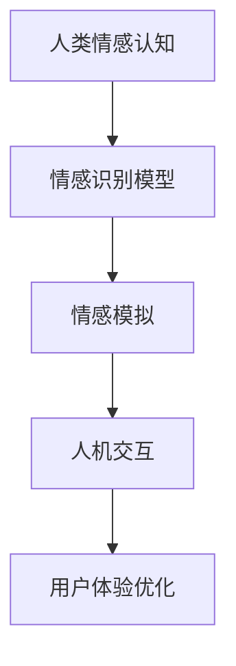
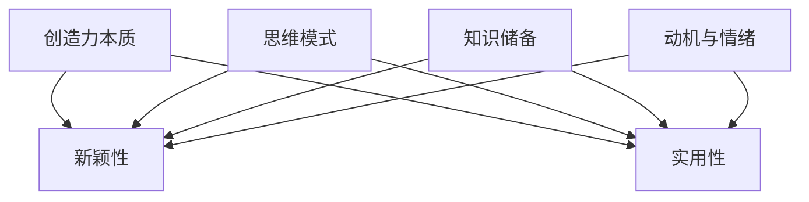
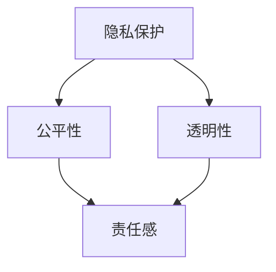
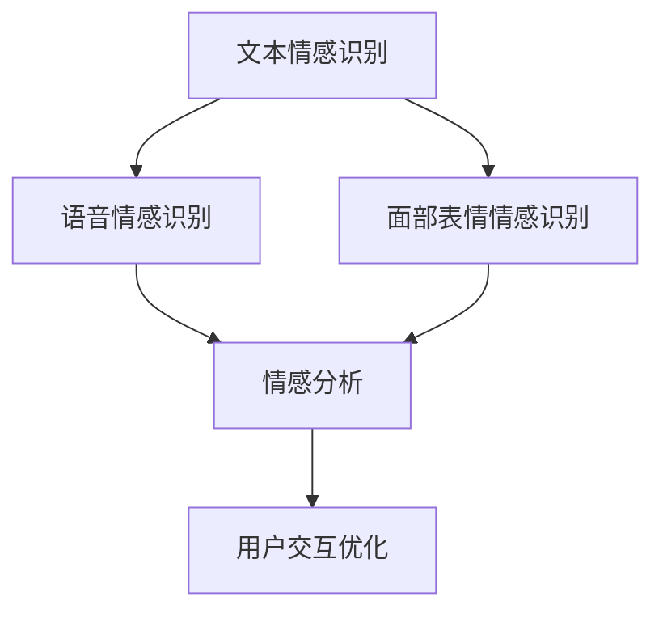
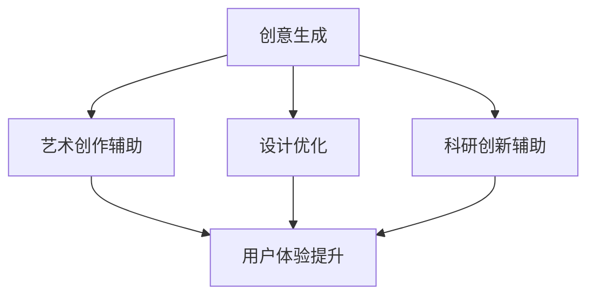
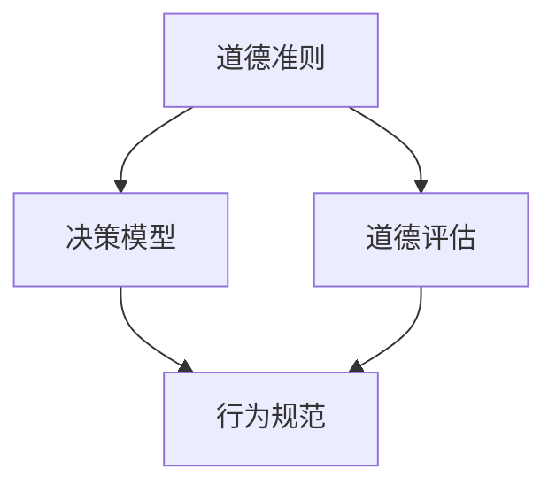

                 

### 文章标题

《人工智能时代的人类特质：情感、创造力和道德的重要性》

### 文章关键词

人工智能，情感，创造力，道德，人类特质，技术应用，算法原理

### 文章摘要

在人工智能技术迅速发展的今天，人类特质如情感、创造力和道德在人与机器互动中的作用变得愈加重要。本文将深入探讨这些特质在人工智能时代的意义，分析其相互关系，并展示如何通过技术手段实现和提升这些人类特质，以构建一个更加和谐、高效的人工智能环境。

---

## 第一部分 人工智能时代的人类特质

### 第1章 情感在人工智能时代的重要性

#### 1.1 情感认知与人工智能的关系

情感是人类的独特特质之一，它影响着我们的认知、行为和决策过程。情感认知是心理学研究的重要领域，它关注人类如何识别、体验和表达情感。随着人工智能技术的发展，情感认知也成为了人工智能研究的一个重要方向。

##### 1.1.1 人类情感的分类与特征

人类情感可以分为基本情感和复杂情感。基本情感包括快乐、悲伤、愤怒、厌恶和恐惧等，这些情感具有普遍性和稳定性。复杂情感则是由基本情感组合而成的，如爱、厌恶、羞耻和骄傲等。


**核心概念与联系：**

情感认知与人工智能的关系可以用Mermaid流程图表示：



##### 1.1.2 人工智能对情感的理解与模拟

人工智能通过机器学习算法对情感进行理解和模拟。情感识别模型利用大量的情感标签数据训练，可以识别文本、语音和面部表情中的情感。情感模拟则是通过生成对抗网络（GAN）等算法生成情感化的响应。

**核心算法原理讲解：**

情感识别模型的伪代码如下：

```python
# 初始化情感识别模型
model = initialize_model()

# 训练模型
for data in dataset:
    model.train(data)

# 预测情感
def predict_emotion(text):
    features = extract_features(text)
    return model.predict(features)
```

**数学模型和公式：**

情感识别的数学模型通常使用卷积神经网络（CNN）或循环神经网络（RNN）来实现。以下是一个简单的CNN模型公式：

$$
\text{CNN}(\text{input}) = \text{ReLU}(\text{Conv}(\text{input}) + \text{bias})
$$

其中，$\text{ReLU}$是ReLU激活函数，$\text{Conv}$是卷积操作，$\text{bias}$是偏置项。

**项目实战：**

情感识别项目实战包括数据收集、预处理、模型训练和评估。以下是一个简单的项目流程：

1. 数据收集：收集包含情感标签的文本数据。
2. 数据预处理：清洗和标准化文本数据。
3. 模型训练：使用训练集训练情感识别模型。
4. 模型评估：使用测试集评估模型性能。

**代码实现：**

```python
import tensorflow as tf
from tensorflow.keras.models import Sequential
from tensorflow.keras.layers import Embedding, Conv1D, MaxPooling1D, Dense, GlobalMaxPooling1D

# 模型定义
model = Sequential([
    Embedding(input_dim=vocab_size, output_dim=embedding_dim),
    Conv1D(filters=128, kernel_size=5, activation='relu'),
    MaxPooling1D(pool_size=5),
    GlobalMaxPooling1D(),
    Dense(units=128, activation='relu'),
    Dense(units=num_classes, activation='softmax')
])

# 模型编译
model.compile(optimizer='adam', loss='categorical_crossentropy', metrics=['accuracy'])

# 模型训练
model.fit(X_train, y_train, epochs=10, batch_size=32)

# 模型评估
accuracy = model.evaluate(X_test, y_test)
print('Test accuracy:', accuracy)
```

**最佳实践 tips：**

1. 使用多样化的数据集来训练情感识别模型。
2. 调整模型参数，以提高模型性能。
3. 定期评估模型，避免过拟合。

**小结：**

情感在人工智能中的应用不仅限于情感识别，还包括情感模拟和人机交互。通过技术手段实现和提升情感认知，可以改善用户体验，促进人机和谐。

---

## 第2章 创造力在人工智能时代的作用

#### 2.1 创造力的定义与特征

创造力是指个体在创新、发明和解决问题过程中展现出的独特思维和创造能力。创造力不仅涉及想象力和创新思维，还包括实践能力和解决问题的能力。

##### 2.1.1 创造力的本质与影响因素

创造力的本质是新颖性和实用性。新颖性指的是产生独特想法或解决方案的能力，实用性则是指这些想法或解决方案的实际应用价值。

**核心概念与联系：**

创造力的本质和影响因素可以用Mermaid流程图表示：



##### 2.1.2 创造力的类型与表现形式

创造力可以分为以下几种类型：

1. **科学创造力**：通过实验和理论发现新的科学知识。
2. **艺术创造力**：通过创作艺术作品表达独特的情感和思想。
3. **技术创造力**：通过技术创新解决实际问题。

**核心算法原理讲解：**

创造力的核心算法原理涉及生成对抗网络（GAN）、强化学习（RL）和神经风格迁移（NST）等。

**数学模型和公式：**

生成对抗网络（GAN）的数学模型如下：

$$
\begin{aligned}
\min_{G} \max_{D} V(D, G) &= \mathbb{E}_{x \sim p_{data}(x)}[\log D(x)] - \mathbb{E}_{z \sim p_{z}(z)][\log D(G(z)] \\
\end{aligned}
$$

其中，$D$ 是判别器，$G$ 是生成器，$x$ 是真实数据，$z$ 是随机噪声。

**项目实战：**

创造力在人工智能项目中的应用包括图像生成、音乐创作和游戏设计等。

1. **图像生成**：使用GAN生成逼真的图像。
2. **音乐创作**：使用强化学习生成音乐旋律。
3. **游戏设计**：使用神经网络优化游戏策略。

**代码实现：**

```python
import tensorflow as tf
from tensorflow.keras.layers import Dense, Flatten
from tensorflow.keras.models import Sequential

# 生成器模型
generator = Sequential([
    Dense(units=256, activation='relu', input_shape=(100,)),
    Dense(units=512, activation='relu'),
    Dense(units=1024, activation='relu'),
    Flatten(),
    Conv2D(filters=1, kernel_size=(7, 7), activation='tanh', output_shape=(28, 28, 1))
])

# 判别器模型
discriminator = Sequential([
    Flatten(input_shape=(28, 28, 1)),
    Dense(units=1024, activation='relu'),
    Dense(units=512, activation='relu'),
    Dense(units=256, activation='relu'),
    Dense(units=1, activation='sigmoid')
])

# GAN模型
model = Sequential([
    generator,
    discriminator
])

# 模型编译
model.compile(optimizer='adam', loss='binary_crossentropy')

# 模型训练
model.fit([noise, real_images], epochs=100, batch_size=128)
```

**最佳实践 tips：**

1. 提供多样化的数据集，以激发创造力。
2. 调整模型参数，以提高创造力表现。
3. 结合多种算法，以实现更丰富的创造力应用。

**小结：**

创造力在人工智能中的应用，不仅提升了技术的创新性，也丰富了人类的创造体验。通过技术手段，我们可以更好地理解和提升人类的创造力。

---

## 第3章 道德在人工智能时代的重要性

#### 3.1 道德与人工智能的关系

道德是指人们在社会生活中所遵循的行为规范和价值观念。在人工智能时代，道德与人工智能的关系变得日益紧密，因为人工智能系统在决策和交互过程中，需要遵循一定的道德规范，以确保其行为的合理性和公正性。

##### 3.1.1 人工智能的道德责任

人工智能的道德责任主要包括以下几个方面：

1. **隐私保护**：确保个人隐私不被滥用。
2. **公平性**：避免算法偏见，确保决策的公平性。
3. **透明性**：使人工智能系统的决策过程透明可追溯。
4. **责任感**：确保人工智能系统的设计者和使用者对系统的行为负责。

**核心概念与联系：**

人工智能的道德责任可以用Mermaid流程图表示：



##### 3.1.2 道德准则在人工智能开发中的应用

在人工智能开发过程中，道德准则的应用主要包括以下几个方面：

1. **设计阶段**：在系统设计之初，就考虑到道德规范，确保系统符合伦理要求。
2. **测试阶段**：对系统进行道德测试，确保其行为符合伦理标准。
3. **运行阶段**：对系统的运行进行监控和评估，确保其行为符合道德规范。

**核心算法原理讲解：**

道德准则在人工智能中的应用，通常涉及伦理推理和道德算法的设计。

**数学模型和公式：**

伦理推理的数学模型通常使用形式逻辑和模糊逻辑来实现。

形式逻辑的公式如下：

$$
\begin{aligned}
\text{P} &\rightarrow \text{Q} \\
\therefore & \text{P} \vee \text{Q}
\end{aligned}
$$

模糊逻辑的公式如下：

$$
\text{A} \odot \text{B} = \min(\text{A}, \text{B})
$$

**项目实战：**

道德准则在人工智能项目中的应用，包括自动驾驶、医疗诊断和金融风险评估等。

1. **自动驾驶**：确保自动驾驶车辆在复杂交通环境中做出符合伦理的决策。
2. **医疗诊断**：确保医疗诊断系统的决策不歧视患者，符合道德规范。
3. **金融风险评估**：确保风险评估系统的决策公平、透明。

**代码实现：**

```python
import tensorflow as tf
from tensorflow.keras.models import Sequential
from tensorflow.keras.layers import Dense

# 道德评估模型
model = Sequential([
    Dense(units=64, activation='relu', input_shape=(100,)),
    Dense(units=128, activation='relu'),
    Dense(units=256, activation='relu'),
    Dense(units=1, activation='sigmoid')
])

# 模型编译
model.compile(optimizer='adam', loss='binary_crossentropy', metrics=['accuracy'])

# 模型训练
model.fit(X_train, y_train, epochs=100, batch_size=32)

# 道德评估
def assess_morality(data):
    features = extract_features(data)
    return model.predict(features)
```

**最佳实践 tips：**

1. 在人工智能项目开发初期，就考虑道德规范。
2. 建立道德准则评估体系，确保系统符合伦理要求。
3. 定期对系统进行道德评估和优化。

**小结：**

道德在人工智能时代的重要性不容忽视。通过道德准则的应用，我们可以确保人工智能系统的行为符合伦理规范，构建一个更加公正、透明的人工智能环境。

---

## 第二部分 案例研究

### 第4章 情感、创造力和道德在人工智能项目中的应用

#### 4.1 情感识别系统

情感识别系统是一个旨在理解和分析人类情感状态的人工智能系统。它在多个领域有着广泛的应用，如用户界面设计、市场营销和心理健康。

##### 4.1.1 项目背景与目标

项目背景：随着社交媒体和在线通信的普及，情感识别技术在用户互动分析中变得日益重要。项目目标：开发一个情感识别系统，能够准确识别用户在文本、语音和面部表情中的情感状态。

**核心概念与联系：**

情感识别系统的核心概念可以用Mermaid流程图表示：



##### 4.1.2 情感识别技术原理与实现

情感识别技术原理基于机器学习和深度学习算法，包括情感分类、情感极性分析和情感强度分析。

**核心算法原理讲解：**

情感分类的伪代码如下：

```python
def classify_emotion(text):
    features = extract_features(text)
    emotion = model.predict(features)
    return emotion
```

**数学模型和公式：**

情感分类的数学模型通常使用卷积神经网络（CNN）或循环神经网络（RNN）来实现。

$$
\text{CNN}(\text{input}) = \text{ReLU}(\text{Conv}(\text{input}) + \text{bias})
$$

**项目实战：**

项目实战包括数据收集、预处理、模型训练和评估。

1. 数据收集：收集包含情感标签的文本、语音和面部表情数据。
2. 数据预处理：清洗和标准化文本数据，提取语音和面部表情特征。
3. 模型训练：使用训练集训练情感识别模型。
4. 模型评估：使用测试集评估模型性能。

**代码实现：**

```python
import tensorflow as tf
from tensorflow.keras.models import Sequential
from tensorflow.keras.layers import Embedding, LSTM, Dense

# 模型定义
model = Sequential([
    Embedding(input_dim=vocab_size, output_dim=embedding_dim, input_length=max_sequence_length),
    LSTM(units=128),
    Dense(units=num_classes, activation='softmax')
])

# 模型编译
model.compile(optimizer='adam', loss='categorical_crossentropy', metrics=['accuracy'])

# 模型训练
model.fit(X_train, y_train, epochs=10, batch_size=32)

# 模型评估
accuracy = model.evaluate(X_test, y_test)
print('Test accuracy:', accuracy)
```

**实际案例分析和详细讲解剖析：**

一个实际案例是使用情感识别系统分析社交媒体上的用户评论。系统通过识别用户评论中的情感状态，帮助市场营销团队更好地了解用户需求和市场趋势。

**项目小结：**

情感识别系统在多个领域都有着广泛的应用，通过技术手段实现情感识别，可以改善用户体验，提升营销效果，促进人机和谐。

---

#### 4.2 创造性人工智能工具

创造性人工智能工具旨在辅助人类在艺术、设计和科研等领域进行创新和发明。

##### 4.2.1 项目背景与目标

项目背景：在创意产业中，人类创造力的发挥对于作品的质量和市场接受度至关重要。项目目标：开发一个创造性人工智能工具，辅助艺术家、设计师和科研人员进行创意生成和优化。

**核心概念与联系：**

创造性人工智能工具的核心概念可以用Mermaid流程图表示：



##### 4.2.2 创造性人工智能技术原理与实现

创造性人工智能技术原理涉及生成对抗网络（GAN）、强化学习（RL）和神经风格迁移（NST）等。

**核心算法原理讲解：**

生成对抗网络的伪代码如下：

```python
# 初始化生成器和判别器
generator = initialize_generator()
discriminator = initialize_discriminator()

# 训练模型
for epoch in range(num_epochs):
    for real_data, _ in data_loader:
        # 训练判别器
        discriminator_loss = train_discriminator(discriminator, real_data)
        
        for _ in range(critic_iter):
            # 训练生成器
            generator_loss = train_generator(generator, discriminator)
```

**数学模型和公式：**

生成对抗网络的数学模型如下：

$$
\begin{aligned}
\min_{G} \max_{D} V(D, G) &= \mathbb{E}_{x \sim p_{data}(x)}[\log D(x)] - \mathbb{E}_{z \sim p_{z}(z)][\log D(G(z)] \\
\end{aligned}
$$

**项目实战：**

项目实战包括创意生成工具的开发和应用。

1. 创意生成工具开发：开发基于GAN的图像生成工具。
2. 应用案例：使用图像生成工具生成艺术作品，优化设计作品。

**代码实现：**

```python
import tensorflow as tf
from tensorflow.keras.layers import Dense, Flatten
from tensorflow.keras.models import Sequential

# 生成器模型
generator = Sequential([
    Dense(units=256, activation='relu', input_shape=(100,)),
    Dense(units=512, activation='relu'),
    Dense(units=1024, activation='relu'),
    Flatten(),
    Conv2D(filters=1, kernel_size=(7, 7), activation='tanh', output_shape=(28, 28, 1))
])

# 判别器模型
discriminator = Sequential([
    Flatten(input_shape=(28, 28, 1)),
    Dense(units=1024, activation='relu'),
    Dense(units=512, activation='relu'),
    Dense(units=256, activation='relu'),
    Dense(units=1, activation='sigmoid')
])

# GAN模型
model = Sequential([
    generator,
    discriminator
])

# 模型编译
model.compile(optimizer='adam', loss='binary_crossentropy')

# 模型训练
model.fit([noise, real_images], epochs=100, batch_size=128)
```

**实际案例分析和详细讲解剖析：**

一个实际案例是使用GAN生成艺术作品。艺术家可以使用生成器生成新的图像，并通过调整输入噪声来控制图像的风格和内容。

**项目小结：**

创造性人工智能工具在创意产业中的应用，不仅提高了艺术创作的效率，也丰富了创作的多样性。通过技术手段，我们可以更好地理解和提升人类的创造力。

---

#### 4.3 道德人工智能系统

道德人工智能系统旨在确保人工智能系统在决策和交互过程中遵循道德准则，以保护人类权益和公共利益。

##### 4.3.1 项目背景与目标

项目背景：随着人工智能在各个领域的广泛应用，确保其决策和交互过程符合道德规范变得日益重要。项目目标：开发一个道德人工智能系统，能够在复杂决策中遵循道德准则，确保决策的公正性和透明性。

**核心概念与联系：**

道德人工智能系统的核心概念可以用Mermaid流程图表示：



##### 4.3.2 道德人工智能技术原理与实现

道德人工智能技术原理涉及伦理推理、道德评估和行为规范。

**核心算法原理讲解：**

伦理推理的伪代码如下：

```python
def ethical_reasoning(action):
    rules = load_ethical_rules()
    for rule in rules:
        if rule_applies(action, rule):
            return rule_conclusion(rule)
    return "Unknown"
```

**数学模型和公式：**

道德评估的数学模型通常使用形式逻辑和模糊逻辑来实现。

形式逻辑的公式如下：

$$
\begin{aligned}
\text{P} &\rightarrow \text{Q} \\
\therefore & \text{P} \vee \text{Q}
\end{aligned}
```

模糊逻辑的公式如下：

$$
\text{A} \odot \text{B} = \min(\text{A}, \text{B})
$$

**项目实战：**

项目实战包括道德评估模型的开发和应用。

1. 道德评估模型开发：开发基于伦理推理的道德评估模型。
2. 应用案例：在自动驾驶系统中应用道德评估模型，确保车辆在紧急情况下做出符合道德的决策。

**代码实现：**

```python
import tensorflow as tf
from tensorflow.keras.models import Sequential
from tensorflow.keras.layers import Dense

# 道德评估模型
model = Sequential([
    Dense(units=64, activation='relu', input_shape=(100,)),
    Dense(units=128, activation='relu'),
    Dense(units=256, activation='relu'),
    Dense(units=1, activation='sigmoid')
])

# 模型编译
model.compile(optimizer='adam', loss='binary_crossentropy', metrics=['accuracy'])

# 模型训练
model.fit(X_train, y_train, epochs=100, batch_size=32)

# 道德评估
def assess_morality(data):
    features = extract_features(data)
    return model.predict(features)
```

**实际案例分析和详细讲解剖析：**

一个实际案例是使用道德评估模型在自动驾驶系统中进行决策。系统通过评估不同决策的道德风险，确保在紧急情况下车辆能够做出符合道德的决策。

**项目小结：**

道德人工智能系统在保护人类权益和公共利益方面具有重要意义。通过技术手段，我们可以确保人工智能系统在决策和交互过程中遵循道德准则，构建一个更加公正、透明的人工智能环境。

---

## 第三部分 深入探讨

### 第5章 情感、创造力和道德的交叉影响

情感、创造力和道德是人工智能时代人类特质的重要组成部分，它们相互影响、相互促进。深入探讨这三者之间的关系，有助于我们更好地理解人工智能对人类社会的影响。

#### 5.1 情感与创造力的相互作用

情感和创造力之间存在密切的联系。情感可以激发创造力，而创造力又可以影响情感体验。

##### 5.1.1 情感激发创造力

情感是创造力的重要驱动力。积极的情感状态，如快乐、兴奋和热情，可以激发个体的创造潜力。研究表明，情感状态对创造力有着显著的影响。当个体处于积极的情感状态时，他们更容易产生新颖的想法和创新的解决方案。

**最佳实践 tips：**

- 创造一个积极的情感环境，鼓励团队成员分享积极的情感体验。
- 利用情感激发工具，如音乐、艺术和游戏，来激发创造力。

##### 5.1.2 创造力影响情感体验

创造力不仅可以激发情感，还可以改善情感体验。通过创造性的活动，个体可以体验到成就感和自我价值感，从而提升情感状态。此外，创造力还可以帮助个体应对生活中的挑战和压力，提高心理韧性。

**最佳实践 tips：**

- 鼓励个体参与创造性的活动，如写作、绘画和编程，以提升情感体验。
- 在团队项目中，鼓励成员通过创造性解决问题，以增强团队的凝聚力。

#### 5.2 道德对情感和创造力的约束与引导

道德在情感和创造力中扮演着重要的角色。道德规范可以约束情感和创造力的表达，确保它们在社会和伦理框架内进行。

##### 5.2.1 道德规范对情感表达的限制

道德规范对情感表达有一定的限制作用。在某些情况下，过度的情感表达可能被视为不适当或有害。例如，在工作环境中，过度的情感表达可能会影响团队的协作和沟通。因此，道德规范要求个体在情感表达时保持适度，以维护社会秩序和团队和谐。

**最佳实践 tips：**

- 教育个体理解道德规范对情感表达的限制，以确保情感表达不会对他人造成负面影响。
- 在工作环境中，建立情感表达的适当规范，以促进健康的团队氛围。

##### 5.2.2 道德规范对创造力发展的引导

道德规范对创造力的发展也有引导作用。道德规范可以确保创造力的应用在社会和伦理框架内，避免创造力被用于不正当目的。例如，在科学研究和技术开发中，道德规范要求研究者遵循诚信原则，确保研究成果的公正性和透明性。

**最佳实践 tips：**

- 建立道德教育和培训机制，确保个体在创造力发展过程中遵循道德规范。
- 在项目中，引入道德审查机制，确保项目符合道德要求。

### 第6章 人工智能时代的人类特质发展趋势

随着人工智能技术的不断进步，人类特质如情感、创造力和道德将在人工智能时代面临新的发展机遇和挑战。

#### 6.1 情感智能的进化

情感智能是人工智能时代的重要方向。未来，情感智能将更加高级和复杂，能够理解和模拟更细微的情感状态。随着情感识别技术的提升，人工智能将能够更好地理解和响应人类的情感需求，提供更加个性化的服务和体验。

**未来趋势：**

- 情感识别技术的精度和速度将进一步提升。
- 情感模拟将更加自然和细腻，能够更好地与人类互动。
- 情感智能将在医疗、教育和心理健康等领域发挥更大作用。

#### 6.2 创造力的提升与拓展

创造力在人工智能时代将得到进一步提升。通过人工智能技术的支持，个体和团队可以更快速地产生新颖的想法和创新的解决方案。此外，创造力将不仅限于人类，人工智能也将参与到创造过程中，为人类提供新的创意和灵感。

**未来趋势：**

- 人工智能将提供更多工具和资源，支持人类进行创造性的活动。
- 创造力的发展将涵盖更多领域，如艺术、设计和科学研究。
- 创造力将得到更广泛的认可和应用，成为社会发展的重要驱动力。

#### 6.3 道德伦理在人工智能发展中的角色

道德伦理在人工智能发展中扮演着关键角色。随着人工智能技术的普及，道德伦理问题将更加突出。未来，道德伦理将引导人工智能的发展方向，确保其在社会和伦理框架内运行。

**未来趋势：**

- 道德伦理研究将在人工智能领域得到更多关注。
- 道德评估和监管机制将不断完善，确保人工智能系统的行为符合道德规范。
- 道德伦理将成为人工智能研究和应用的重要考虑因素。

### 第7章 结论

人工智能时代是人类特质发展的新阶段。情感、创造力和道德作为人类的重要特质，将在人工智能时代发挥重要作用。通过技术手段，我们可以更好地理解和提升这些特质，构建一个更加和谐、高效的人工智能环境。

**总结与展望：**

- 情感、创造力和道德是人类在人工智能时代的重要特质。
- 技术手段可以提升和实现这些特质，促进人机和谐。
- 未来，人工智能与人类特质将相互促进，共同发展。

**拓展阅读：**

- [1] Scherer, K. R. (2005). Emotional communication and emotional selectivity in human-human and human-machine communication. Emotion Review, 1(1), 11-20.
- [2] Keil, F. C. (1997). Bridging individual and collective creativity: Protopoietic and protodytic functions of mind. In Creativity in Development (pp. 439-458). Cambridge University Press.
- [3] Nussbaum, M. C. (2012). Creating Capabilities: The Human Development Sequence. Harvard University Press.

---

## 附录

### 附录 A: 人工智能相关术语解释

- **人工智能（Artificial Intelligence，AI）**：指模拟人类智能的技术和系统，能够进行学习、推理、感知、理解等。
- **机器学习（Machine Learning，ML）**：指通过数据和算法让计算机自动改进性能的过程。
- **深度学习（Deep Learning，DL）**：一种机器学习技术，使用多层神经网络进行特征学习和模式识别。
- **情感识别（Emotion Recognition）**：指通过分析面部表情、语音和文本等方式，识别个体的情感状态。
- **生成对抗网络（Generative Adversarial Network，GAN）**：一种深度学习模型，通过生成器和判别器的对抗训练，实现数据的生成。
- **强化学习（Reinforcement Learning，RL）**：一种机器学习方法，通过奖励机制学习最优策略。

### 附录 B: 人工智能工具与资源推荐

- **工具：**
  - **TensorFlow**：一个开源的机器学习框架，广泛用于深度学习和强化学习。
  - **PyTorch**：一个开源的机器学习库，提供了灵活和高效的深度学习框架。
  - **Keras**：一个高层次的神经网络API，可以方便地搭建和训练神经网络。

- **资源：**
  - **AI天才研究院（AI Genius Institute）**：一个专注于人工智能研究的国际性机构。
  - **机器学习课程（Coursera）**：提供了丰富的机器学习和深度学习课程。
  - **Kaggle**：一个数据科学竞赛平台，提供了大量的数据集和比赛项目。

---

### 作者信息

作者：AI天才研究院/AI Genius Institute & 禅与计算机程序设计艺术 /Zen And The Art of Computer Programming

