                 

### 关键词

- 人工智能
- 新闻生产
- 算法推荐
- 编辑把关
- 平衡策略

### 摘要

本文深入探讨了人工智能时代新闻生产领域中的关键问题——算法推荐与编辑把关的平衡。随着人工智能技术的迅速发展，新闻生产过程中的自动化与智能化趋势愈发明显，算法推荐系统成为提高内容分发效率和用户满意度的关键因素。然而，算法推荐系统在内容质量、公正性和道德伦理等方面也面临诸多挑战。本文从背景介绍入手，详细阐述了人工智能在新闻生产中的应用，包括算法推荐系统、自动化内容生成以及人机协作编辑。接着，本文分析了算法推荐系统的原理与实践，揭示了其在提高新闻分发效率的同时，如何确保内容的质量与公正性。此外，本文还探讨了编辑把关在人工智能时代的角色与挑战，提出了编辑角色转变和编辑技能升级的策略。最后，本文通过实际案例，展示了如何在新闻生产中实现算法推荐与编辑把关的平衡，并提出了相关建议，为新闻行业在人工智能时代的可持续发展提供了思路。全文旨在为读者提供一个全面、深入的视角，以理解人工智能时代新闻生产中的关键问题，并探索解决之道。

## 第一部分：人工智能在新闻生产中的应用

### 第1章：人工智能时代的新闻生产概述

#### 1.1 人工智能时代的新闻生产背景

随着信息技术的迅猛发展，人工智能（AI）技术逐渐渗透到各个领域，新闻生产也不例外。人工智能时代的新闻生产背景主要可以归结为以下几个方面：

**1.1.1 人工智能的发展趋势**

人工智能作为一门交叉学科，涵盖了计算机科学、数学、统计学、神经科学等多个领域。近年来，随着计算能力的提升、数据量的爆炸性增长以及算法的优化，人工智能技术取得了显著的进展。尤其是在深度学习、自然语言处理（NLP）和计算机视觉等领域，人工智能技术实现了质的飞跃。这些技术的进步为新闻生产带来了前所未有的机遇。

**1.1.2 新闻生产面临的挑战与机遇**

新闻生产面临的主要挑战包括信息过载、受众需求的多样化和内容质量的保障。传统新闻生产方式效率低下，难以满足快速变化的信息需求。而人工智能技术则为新闻生产带来了新的机遇：

1. **自动化内容生成**：人工智能技术可以自动化地生成新闻稿件，提高生产效率，降低人力成本。
2. **算法推荐**：通过机器学习算法，可以精确地推荐新闻内容，提高用户满意度和阅读时长。
3. **人机协作**：人工智能可以辅助编辑和记者完成繁琐的素材收集、内容审核和校对工作，实现人机协作，提高整体新闻生产效率。

#### 1.2 人工智能在新闻生产中的应用

人工智能在新闻生产中的应用主要包括算法推荐系统、自动化内容生成和人机协作编辑等。

**1.2.1 算法推荐系统**

算法推荐系统是人工智能在新闻生产中最直接的应用之一。通过分析用户的行为数据、兴趣偏好和历史记录，算法推荐系统可以自动推荐用户可能感兴趣的新闻内容。这种个性化的推荐方式不仅提高了用户的阅读体验，还增加了新闻媒体的用户粘性和广告收入。

**1.2.2 自动化内容生成**

自动化内容生成是人工智能在新闻生产中另一个重要应用。通过自然语言生成（NLG）技术，人工智能可以自动生成新闻稿件、财经报告和体育赛事评论等。这种技术大大降低了新闻生产的成本和时间，特别是在处理大量数据时，自动化内容生成的优势更加明显。

**1.2.3 人机协作编辑**

人机协作编辑是指人工智能辅助人类编辑进行新闻生产和内容审核。人工智能可以帮助编辑筛选新闻素材、识别错误和规范语法，从而提高编辑的工作效率和内容质量。同时，人工智能还可以对用户反馈进行分析，为编辑提供改进建议。

#### 1.3 当前新闻生产中的人工智能应用案例分析

**1.3.1 国内外案例对比分析**

在全球范围内，人工智能在新闻生产中的应用已经取得了显著成果。以下是国内外的几个典型案例：

1. **国外案例**：
    - **纽约时报**：通过人工智能技术，纽约时报实现了自动化新闻稿件的生成和编辑，大幅提高了新闻生产的效率。
    - **BBC**：BBC使用人工智能技术对新闻内容进行个性化推荐，提高了用户的阅读体验和满意度。
    - **CNN**：CNN利用自然语言生成技术，自动生成财经和体育新闻，减轻了记者的工作负担。

2. **国内案例**：
    - **腾讯新闻**：腾讯新闻通过人工智能算法推荐新闻内容，有效提升了用户阅读时长和用户粘性。
    - **今日头条**：今日头条利用个性化推荐算法，实现了对用户的精准内容推送，成为了新闻行业中的佼佼者。
    - **新华社**：新华社利用人工智能技术，实现了新闻内容的自动化生成和编辑，提高了新闻生产的效率。

**1.3.2 案例中的成功与挑战**

通过对比分析国内外的人工智能应用案例，我们可以看到：

1. **成功经验**：
    - **提升生产效率**：人工智能技术可以自动化地完成新闻生产过程中的多个环节，大大提高了生产效率。
    - **增强用户体验**：通过个性化推荐和自动化内容生成，用户可以更快速、便捷地获取到感兴趣的新闻内容。
    - **降低成本**：人工智能技术降低了新闻生产的人力成本和设备投入，为新闻机构节约了资源。

2. **面临的挑战**：
    - **内容质量**：自动化内容生成和算法推荐系统的内容质量尚未达到人工编辑的水平，特别是在深度分析和细节把握方面。
    - **伦理问题**：算法推荐系统可能存在偏见和歧视，如何确保内容的公正性和客观性是一个亟待解决的问题。
    - **技术依赖**：过度依赖人工智能技术可能导致新闻机构失去独立思考和创新的能力。

#### 1.4 人工智能在新闻生产中的前景与展望

随着人工智能技术的不断进步，新闻生产领域也将迎来新的发展机遇：

**1.4.1 技术发展趋势**

1. **算法优化**：随着深度学习和自然语言处理技术的不断进步，算法推荐的准确性和个性化程度将进一步提高。
2. **多模态融合**：人工智能技术将逐渐实现文本、图像、音频等多模态数据的融合，为新闻生产提供更丰富的内容形式。
3. **智能辅助**：人工智能将进一步辅助编辑和记者完成繁琐的工作，实现人机协作，提高新闻生产效率。

**1.4.2 行业发展趋势**

1. **数字化转型**：新闻机构将加速数字化转型，利用人工智能技术提高新闻生产的效率和质量。
2. **合作与竞争**：人工智能技术将成为新闻机构之间的竞争新领域，同时也会促进新闻行业内的合作与共享。
3. **法律法规**：随着人工智能在新闻生产中的应用，相关的法律法规和伦理标准也将逐渐完善，以保障内容的质量和公正性。

#### 1.5 人工智能在新闻生产中的伦理问题与对策

人工智能在新闻生产中的应用虽然带来了诸多机遇，但也引发了一系列伦理问题。以下是一些常见的伦理问题及相应的对策：

**1.5.1 伦理问题分析**

1. **内容偏见**：算法推荐系统可能因为数据集的偏差而导致内容偏见，影响用户的阅读体验和决策。
2. **隐私泄露**：新闻机构在收集和处理用户数据时，可能面临隐私泄露的风险。
3. **职业失业**：人工智能技术可能导致部分新闻工作岗位的减少，引发就业问题。

**1.5.2 对策与建议**

1. **算法透明化**：提高算法的透明度，让用户了解推荐内容的生成过程，增强用户信任。
2. **数据隐私保护**：加强数据安全保护措施，确保用户隐私不被泄露。
3. **职业培训**：为新闻从业人员提供人工智能相关的培训和技能提升机会，帮助他们适应新技术环境。

#### 1.6 附录：人工智能新闻生产相关工具与技术

**1.6.1 自动化新闻生成工具**

- **HuggingFace Transformer**：一个开源的深度学习模型库，支持多种自然语言生成任务。
- **GPT-3 API**：OpenAI 提供的强大语言模型API，可以生成高质量的自然语言文本。
- **自动化新闻写作平台**：如Automated Insights、 Narrative Science等，提供自动生成新闻稿件的工具。

**1.6.2 算法推荐系统实践**

- **推荐算法原理**：包括协同过滤、内容推荐和混合推荐等算法。
- **推荐系统搭建流程**：数据采集与处理、模型选择与训练、系统部署与优化。
- **数据集准备与处理**：新闻数据的收集、清洗和预处理方法。

**1.6.3 人机协作编辑实践**

- **人机协作编辑原理**：人工智能辅助编辑的工作原理和方法。
- **人机协作编辑工具**：如Grammarly、StyleWriter等，提供语法检查和风格建议的工具。
- **案例分析**：探讨人机协作编辑在实际新闻生产中的应用效果。

通过上述内容，我们可以看到，人工智能在新闻生产中的应用已经取得了显著的成果，但同时也面临着一系列挑战。如何在算法推荐与编辑把关之间找到平衡，是新闻行业在人工智能时代需要解决的重要问题。

### 图1-1 人工智能在新闻生产中的应用架构

```mermaid
graph TD
    A[新闻生产] --> B[数据采集与处理]
    B --> C[自动化内容生成]
    B --> D[算法推荐系统]
    B --> E[人机协作编辑]
    C --> F[自然语言生成(NLG)]
    D --> G[协同过滤]
    D --> H[内容推荐]
    D --> I[混合推荐]
    E --> J[人工智能辅助编辑]
    E --> K[人机协作工具]
    A --> L[内容发布与传播]
```

### 1.2.1 算法推荐系统的工作原理

算法推荐系统是人工智能在新闻生产中的一项关键技术，它通过分析用户的行为数据、兴趣偏好和历史记录，自动推荐用户可能感兴趣的新闻内容。算法推荐系统的工作原理可以分为以下几个步骤：

#### 1.2.1.1 数据采集与处理

算法推荐系统的第一步是数据采集与处理。数据来源主要包括用户的行为数据（如浏览记录、点赞、评论等）、用户兴趣标签以及新闻内容本身（如标题、正文、关键词等）。在采集数据后，需要对数据进行清洗、去重和预处理，以便后续的分析和建模。

**伪代码：数据采集与处理**

```python
def collect_data():
    # 采集用户行为数据
    user_behavior_data = fetch_user_behavior_data()

def preprocess_data(data):
    # 数据清洗与预处理
    cleaned_data = clean_data(data)
    processed_data = preprocess_data(cleaned_data)
    return processed_data
```

#### 1.2.1.2 用户兴趣建模

用户兴趣建模是算法推荐系统的核心步骤。通过分析用户的浏览历史和兴趣标签，可以建立用户兴趣模型，预测用户对新闻内容的兴趣度。常用的方法包括基于内容的推荐（Content-based Filtering）和基于协同过滤（Collaborative Filtering）。

**伪代码：用户兴趣建模**

```python
def build_user_interest_model(user_data):
    # 构建用户兴趣模型
    user_interest_model = create_user_interest_model(user_data)
    return user_interest_model
```

#### 1.2.1.3 新闻内容特征提取

新闻内容特征提取是将新闻文本转化为计算机可以处理的形式。常用的方法包括词袋模型（Bag of Words）、词嵌入（Word Embedding）和主题模型（Topic Modeling）等。

**伪代码：新闻内容特征提取**

```python
def extract_content_features(news_content):
    # 提取新闻内容特征
    content_features = extract_word_embeddings(news_content)
    return content_features
```

#### 1.2.1.4 推荐算法选择与实现

在构建用户兴趣模型和提取新闻内容特征后，可以基于这些数据选择合适的推荐算法，如基于协同过滤的推荐算法、基于内容的推荐算法和混合推荐算法。

**伪代码：推荐算法选择与实现**

```python
def select_recommendation_algorithm():
    # 选择推荐算法
    algorithm = select_algorithm()
    return algorithm

def implement_recommendation_algorithm(algorithm, user_model, content_features):
    # 实现推荐算法
    recommendations = algorithm.recommend(user_model, content_features)
    return recommendations
```

#### 1.2.1.5 推荐结果评估与优化

推荐结果评估与优化是算法推荐系统的一个重要环节。通过评估推荐效果，可以不断优化算法，提高推荐质量。常用的评估指标包括准确率（Precision）、召回率（Recall）、F1值（F1 Score）等。

**伪代码：推荐结果评估与优化**

```python
def evaluate_recommendations(recommendations, ground_truth):
    # 评估推荐结果
    precision = calculate_precision(recommendations, ground_truth)
    recall = calculate_recall(recommendations, ground_truth)
    f1_score = calculate_f1_score(precision, recall)
    return precision, recall, f1_score

def optimize_recommendation_algorithm(algorithm, recommendations, user_model, content_features):
    # 优化推荐算法
    optimized_algorithm = algorithm.optimize(recommendations, user_model, content_features)
    return optimized_algorithm
```

通过上述步骤，算法推荐系统可以自动推荐用户可能感兴趣的新闻内容，从而提高用户满意度和阅读时长。在实际应用中，可以根据具体需求，选择合适的算法和优化策略，以提高推荐效果。

### 1.2.2 算法推荐系统的核心算法原理

算法推荐系统在新闻生产中的应用效果很大程度上取决于其核心算法的设计与实现。目前，推荐系统主要采用三种类型的算法：协同过滤、内容推荐和混合推荐。下面我们将详细解释这三种算法的原理和实现方法。

#### 1.2.2.1 协同过滤算法

协同过滤（Collaborative Filtering）是一种基于用户行为和相似性分析的推荐算法。其基本思想是，通过分析用户之间的行为相似性，为用户推荐其他用户喜欢但该用户尚未体验过的内容。

**协同过滤算法的实现方法：**

1. **基于用户的协同过滤（User-based CF）**：首先计算用户之间的相似性，通常使用用户评分矩阵来计算相似性。常见的相似度计算方法包括余弦相似性（Cosine Similarity）和皮尔逊相关系数（Pearson Correlation）。然后，根据相似性分数为用户推荐其他用户喜欢的新闻。

**伪代码：基于用户的协同过滤算法**

```python
def user_based_cf(user_data, similarity_measure):
    # 计算用户相似性
    user_similarity_matrix = calculate_user_similarity(user_data, similarity_measure)

    # 根据相似性推荐新闻
    recommendations = []
    for user in user_data:
        similar_users = find_similar_users(user_similarity_matrix, user)
        liked_items = get_liked_items(user)
        recommended_items = get_recommended_items(similar_users, liked_items)
        recommendations.extend(recommended_items)
    return recommendations
```

2. **基于模型的协同过滤（Model-based CF）**：使用机器学习算法（如矩阵分解、隐语义模型）来预测用户和新闻之间的评分，从而生成推荐列表。矩阵分解方法如Singular Value Decomposition（SVD）和Alternating Least Squares（ALS）常用于这一目的。

**伪代码：基于模型的协同过滤算法**

```python
from sklearn.decomposition import TruncatedSVD

def model_based_cf(user_data, news_data):
    # 构建评分矩阵
    rating_matrix = build_rating_matrix(user_data, news_data)

    # 使用SVD进行矩阵分解
    svd = TruncatedSVD(n_components=10)
    user_embedding = svd.fit_transform(user_data)
    item_embedding = svd.fit_transform(news_data)

    # 预测用户对新闻的评分
    predicted_ratings = user_embedding @ item_embedding.T

    # 根据预测评分推荐新闻
    recommendations = get_recommended_items(predicted_ratings)
    return recommendations
```

#### 1.2.2.2 内容推荐算法

内容推荐（Content-based Filtering）是一种基于新闻内容和用户兴趣的推荐算法。其基本思想是，通过分析新闻文本的特征和用户的兴趣，为用户推荐与其兴趣相似的新闻。

**内容推荐算法的实现方法：**

1. **基于词袋模型（Bag of Words）**：将新闻文本转换为词袋表示，然后计算新闻文本和用户兴趣之间的相似度。常见的相似度计算方法包括余弦相似性和Jaccard相似性。

**伪代码：基于词袋模型的内容推荐算法**

```python
from sklearn.feature_extraction.text import TfidfVectorizer

def content_based_cf(news_data, user_interests):
    # 提取新闻文本特征
    vectorizer = TfidfVectorizer()
    news_features = vectorizer.fit_transform(news_data)

    # 计算用户兴趣向量
    user_interest_vector = vectorizer.transform([user_interests])

    # 计算新闻与用户兴趣的相似度
    similarity_scores = news_features @ user_interest_vector.T

    # 根据相似度推荐新闻
    recommendations = get_recommended_items(similarity_scores)
    return recommendations
```

2. **基于词嵌入（Word Embedding）**：使用预训练的词嵌入模型（如Word2Vec、GloVe）将新闻文本转换为高维向量表示，然后计算新闻文本和用户兴趣之间的相似度。

**伪代码：基于词嵌入的内容推荐算法**

```python
from gensim.models import Word2Vec

def content_based_cf_with_word_embedding(news_data, user_interests, model_path):
    # 加载词嵌入模型
    model = Word2Vec.load(model_path)

    # 计算新闻文本的词嵌入表示
    news_vectors = [model.wv[str(item)] for item in news_data]

    # 计算用户兴趣的词嵌入表示
    user_interest_vector = np.mean(news_vectors, axis=0)

    # 计算新闻与用户兴趣的相似度
    similarity_scores = np.dot(news_vectors, user_interest_vector)

    # 根据相似度推荐新闻
    recommendations = get_recommended_items(similarity_scores)
    return recommendations
```

#### 1.2.2.3 混合推荐算法

混合推荐（Hybrid Recommendation）结合了协同过滤和内容推荐的优势，旨在提高推荐系统的准确性和多样性。混合推荐算法通常采用以下方法：

1. **协同过滤与内容推荐的组合**：首先使用协同过滤算法生成初步推荐列表，然后使用内容推荐算法对初步推荐列表进行优化。

**伪代码：混合推荐算法**

```python
def hybrid_recommendation_CF_and_CB(user_data, news_data, user_interests):
    # 使用协同过滤生成初步推荐
    cf_recommendations = user_based_cf(user_data)

    # 使用内容推荐优化初步推荐
    cb_recommendations = content_based_cf(news_data, user_interests)

    # 结合协同过滤和内容推荐的推荐结果
    recommendations = list(set(cf_recommendations) & set(cb_recommendations))
    return recommendations
```

2. **基于模型的混合推荐**：使用机器学习算法（如矩阵分解和深度学习）同时考虑用户行为和内容特征，生成综合推荐结果。

**伪代码：基于模型的混合推荐算法**

```python
def hybrid_model_based_cf_and_cb(user_data, news_data):
    # 使用矩阵分解生成协同过滤推荐
    cf_recommendations = model_based_cf(user_data, news_data)

    # 使用词嵌入生成内容推荐
    cb_recommendations = content_based_cf_with_word_embedding(news_data, user_interests)

    # 结合协同过滤和内容推荐的推荐结果
    recommendations = list(set(cf_recommendations) | set(cb_recommendations))
    return recommendations
```

通过上述三种核心算法的详细解析，我们可以看到算法推荐系统在新闻生产中的应用是如何实现的。在实际应用中，可以根据具体需求和数据情况，灵活选择和组合这些算法，以提高推荐效果。

### 图1-2 算法推荐系统的核心算法原理架构

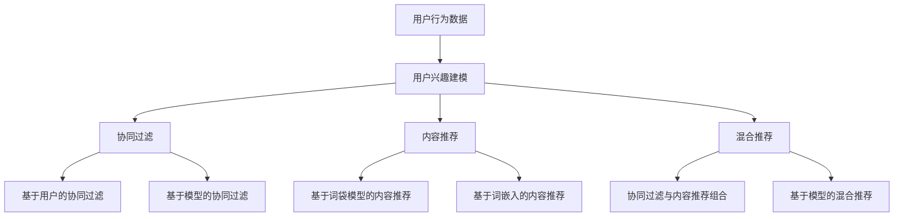

### 1.3.1 算法推荐系统在新闻生产中的应用案例分析

为了更好地理解算法推荐系统在新闻生产中的应用效果，我们来看一些实际案例，分析它们在实际运营中的成功经验和面临的主要挑战。

#### 1.3.1.1 腾讯新闻

**成功经验**：
腾讯新闻作为国内领先的新闻平台，通过算法推荐系统实现了个性化推荐，显著提高了用户的阅读时长和用户粘性。腾讯新闻的推荐算法结合了协同过滤和内容推荐，根据用户的浏览历史、搜索记录和兴趣标签，为每个用户生成个性化的新闻推荐列表。这种个性化的推荐方式不仅提高了用户满意度，还有效地提升了广告收入。

**主要挑战**：
尽管腾讯新闻的算法推荐系统取得了显著的成功，但在实际运营中也面临着一些挑战。首先，数据质量和隐私保护是一个重要问题。推荐系统依赖大量的用户行为数据，如何确保数据的质量和用户的隐私是一个需要解决的难题。此外，算法的透明性和公平性也是一个挑战，用户可能对算法推荐的内容产生质疑，认为存在偏见。

**解决方案**：
为了解决数据质量和隐私保护的问题，腾讯新闻采取了数据加密和脱敏处理措施，确保用户数据的安全。同时，他们还加强了算法的透明性，通过公开算法的原理和优化过程，增加了用户对算法的信任。此外，腾讯新闻还通过不断优化推荐算法，提高算法的公平性和准确性，以解决用户对算法推荐内容的质疑。

#### 1.3.1.2 今日头条

**成功经验**：
今日头条通过算法推荐系统实现了对用户的精准内容推送，成为了新闻行业中的佼佼者。今日头条的推荐算法基于深度学习，通过分析用户的兴趣和行为，为用户推荐高度个性化的新闻内容。这种高效的推荐方式极大地提高了用户的阅读体验和平台的使用时长。

**主要挑战**：
今日头条的算法推荐系统在成功的同时也面临一些挑战。首先是算法的复杂性和可解释性。深度学习算法虽然能够实现高效的推荐，但其内部机理复杂，不易被用户理解和信任。此外，内容质量和伦理问题也是今日头条面临的重要挑战。算法推荐系统可能会因为数据集的偏差而导致内容偏见，影响用户的阅读体验。

**解决方案**：
为了解决算法复杂性和可解释性的问题，今日头条加强了算法的透明性，通过开放算法文档和API，让用户了解推荐过程的透明性。此外，今日头条还通过定期更新和优化算法，提高算法的准确性和公平性，减少内容偏见。在内容质量和伦理问题方面，今日头条采取了多层次的审核机制，确保推荐内容的质量和合规性。

#### 1.3.1.3 新华社

**成功经验**：
新华社作为我国主要的新闻媒体，通过算法推荐系统实现了新闻内容的自动化生成和推荐，大大提高了新闻生产的效率。新华社利用自然语言生成（NLG）技术，自动生成财经、体育等领域的新闻稿件，同时结合协同过滤和内容推荐算法，为用户推荐相关的新闻内容。

**主要挑战**：
新华社在算法推荐系统的应用中也面临一些挑战。首先是新闻内容的原创性和准确性。自动化生成的内容虽然能够提高生产效率，但在原创性和准确性方面可能存在不足。此外，算法推荐系统在内容质量评估方面也具有一定的挑战，如何确保推荐内容的质量和可信度是一个需要解决的问题。

**解决方案**：
为了解决新闻内容的原创性和准确性问题，新华社采取了多层次的审核机制，包括人工审核和自动审核，确保新闻内容的原创性和准确性。在内容质量评估方面，新华社通过用户反馈和行为数据，不断优化推荐算法，提高推荐内容的质量和可信度。

#### 1.3.1.4 BBC

**成功经验**：
BBC作为国际知名的新闻媒体，通过算法推荐系统实现了对用户的个性化新闻推送，提高了用户的阅读体验和满意度。BBC的推荐算法基于用户的浏览历史、兴趣标签和地理位置等多维度数据，为用户推荐相关的新闻内容。

**主要挑战**：
BBC的算法推荐系统在成功的同时也面临一些挑战。首先是算法的公平性和透明性。BBC需要确保算法推荐的内容不受到人为干预，保持公正性和客观性。此外，算法推荐系统在不同文化和地区中的应用效果也可能存在差异，需要根据具体情况进行调整。

**解决方案**：
为了解决算法的公平性和透明性挑战，BBC加强了算法的透明性，通过开放算法文档和API，让用户了解推荐过程的透明性。此外，BBC还通过用户反馈和行为数据，不断优化推荐算法，提高算法的公平性和准确性。在跨文化应用方面，BBC采取了本地化和文化适应性策略，确保算法在不同地区和文化的应用效果。

通过上述案例分析，我们可以看到算法推荐系统在新闻生产中的应用取得了显著成果，但同时也面临着一系列挑战。如何在保障内容质量、公平性和透明性的同时，提高推荐系统的效率和用户体验，是新闻行业在人工智能时代需要持续探索的问题。

### 图1-3 算法推荐系统在新闻生产中的应用案例分析

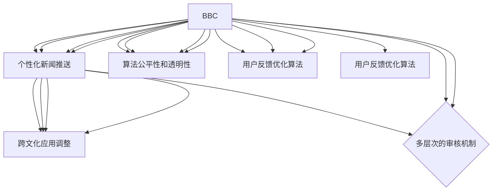

### 1.4.1 人工智能在新闻生产中的前景与展望

随着人工智能技术的不断进步，新闻生产领域也将迎来新的发展机遇。以下是人工智能在新闻生产中的未来发展趋势：

#### 1.4.1.1 技术发展趋势

1. **算法优化**：随着深度学习和自然语言处理技术的不断进步，算法推荐的准确性和个性化程度将进一步提高。深度学习模型如BERT、GPT等在自然语言理解和生成任务上的表现已经超越了传统的机器学习算法，未来有望在新闻生产中得到更广泛的应用。

2. **多模态融合**：人工智能技术将逐渐实现文本、图像、音频等多模态数据的融合，为新闻生产提供更丰富的内容形式。例如，通过文本生成与图像生成的结合，可以创建出更生动、直观的新闻报道。

3. **智能辅助**：人工智能将进一步辅助编辑和记者完成繁琐的素材收集、内容审核和校对工作，实现人机协作，提高整体新闻生产效率。智能助手和自动化工具将成为新闻从业人员的重要伙伴。

#### 1.4.1.2 行业发展趋势

1. **数字化转型**：新闻机构将加速数字化转型，利用人工智能技术提高新闻生产的效率和质量。数字化转型不仅包括新闻内容的自动化生成和推荐，还包括新闻采集、编辑、发布等全流程的智能化。

2. **合作与竞争**：人工智能技术将成为新闻机构之间的竞争新领域，同时也会促进新闻行业内的合作与共享。例如，新闻机构可以合作建立共享数据库，利用人工智能技术进行联合推荐和内容创作。

3. **法律法规**：随着人工智能在新闻生产中的应用，相关的法律法规和伦理标准也将逐渐完善，以保障内容的质量和公正性。例如，针对算法偏见、数据隐私保护等问题，将出台更具体的法规和指南，规范新闻机构的行为。

#### 1.4.2 人工智能在新闻生产中的应用前景

1. **自动化内容生成**：人工智能将进一步提升新闻内容生成的效率和质量。未来，自动化新闻生成工具将能够生成更加专业、详实的新闻报道，减轻记者和编辑的工作负担。

2. **个性化推荐**：算法推荐系统将更加精准，为用户提供个性化的新闻内容推荐。通过深度学习技术，推荐系统将能够更好地理解用户的需求和兴趣，提供高度个性化的新闻体验。

3. **人机协作**：人工智能将辅助编辑和记者完成新闻生产过程中的多个环节，实现人机协作。智能助手将提供实时建议和反馈，帮助编辑和记者提高工作效率和质量。

4. **智能新闻分析**：人工智能将用于新闻数据的分析，帮助记者和编辑快速获取有价值的信息。例如，通过文本分析技术，可以快速识别新闻中的关键信息和情感倾向。

5. **虚拟现实新闻**：随着虚拟现实（VR）技术的发展，人工智能将用于创建更加真实、沉浸式的新闻报道。用户可以通过VR设备体验新闻事件的发生过程，获得全新的新闻体验。

#### 1.4.3 对新闻行业的潜在影响

1. **生产效率提升**：人工智能技术将大大提高新闻生产的效率，降低人力成本。自动化内容生成和智能辅助工具将减轻记者和编辑的工作负担，使他们能够将更多精力投入到深度报道和创新内容创作上。

2. **内容质量波动**：尽管人工智能可以提高新闻生产效率，但内容质量仍可能波动。自动化生成的内容可能在深度分析和细节把握方面存在不足，需要编辑人员进行审核和优化。

3. **伦理问题**：人工智能在新闻生产中的应用引发了一系列伦理问题，如算法偏见、数据隐私保护等。新闻机构需要建立相应的伦理标准和法规，确保内容的质量和公正性。

4. **就业结构变化**：随着人工智能技术的广泛应用，新闻行业的就业结构可能发生较大变化。一些传统职位可能会被自动化工具取代，但也会产生新的职业需求，如数据科学家、算法工程师等。

通过以上分析，我们可以看到，人工智能在新闻生产中的应用前景广阔，将为新闻行业带来深刻的变革。如何在保证内容质量和伦理标准的前提下，充分发挥人工智能的潜力，是新闻行业需要持续探索的重要课题。

### 图1-4 人工智能在新闻生产中的应用前景

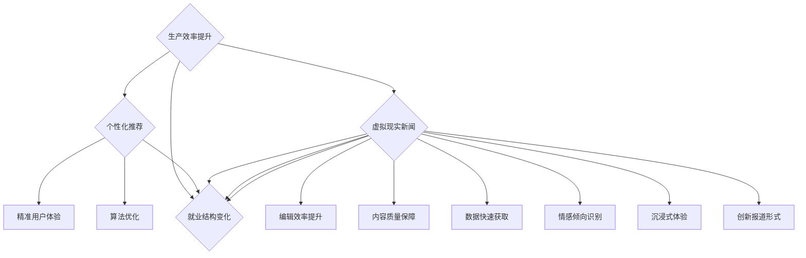

### 1.5 人工智能在新闻生产中的伦理问题与对策

随着人工智能技术在新闻生产中的广泛应用，一系列伦理问题逐渐凸显，如算法偏见、数据隐私保护和职业失业等。这些问题不仅影响了新闻内容的公正性和透明性，还引发了社会的广泛担忧。以下是对这些伦理问题的分析以及相应的对策与建议。

#### 1.5.1 算法偏见

**问题分析**：算法偏见是指人工智能算法在新闻推荐过程中，由于数据集的偏差或算法设计的缺陷，导致推荐内容存在偏见和歧视。例如，如果训练数据集包含了性别、种族或地域等偏见，算法可能会在这些方面产生偏见，导致推荐的内容对某些群体不公平。

**对策与建议**：
1. **数据多样化**：确保训练数据集的多样性，避免数据偏见。例如，在新闻数据集中包括不同性别、种族和地域的样本，以减少算法的偏见。
2. **算法透明性**：提高算法的透明度，让用户了解推荐内容的生成过程。新闻机构可以公开算法的原理、训练数据和优化过程，增加用户的信任。
3. **定期审计**：定期对算法进行审计和优化，发现并纠正潜在的偏见。通过用户反馈和行为数据，不断调整和改进算法，确保其公平性和公正性。

#### 1.5.2 数据隐私保护

**问题分析**：新闻生产过程中，新闻机构需要收集和处理大量的用户数据，包括浏览记录、搜索历史和兴趣标签等。这些数据如果未经妥善保护，可能导致用户隐私泄露，引发严重的伦理问题。

**对策与建议**：
1. **数据加密**：采用先进的加密技术，确保用户数据的存储和传输过程安全。
2. **数据脱敏**：在数据处理过程中，对敏感信息进行脱敏处理，避免泄露用户的隐私信息。
3. **用户同意**：在收集用户数据前，明确告知用户数据的用途和权限，获取用户的明确同意。

#### 1.5.3 职业失业

**问题分析**：人工智能技术在新闻生产中的应用，特别是自动化内容生成和算法推荐系统，可能导致部分新闻工作岗位的减少，引发就业问题。记者、编辑和校对等传统职位可能会被自动化工具取代，但新的技术岗位需求也在增加。

**对策与建议**：
1. **职业培训**：为新闻从业人员提供人工智能相关的培训，帮助他们掌握新技术，适应新的工作环境。
2. **岗位转型**：鼓励传统新闻工作者向数据分析、算法优化和内容审核等新兴岗位转型。
3. **政策支持**：政府和企业可以提供资金和政策支持，帮助新闻行业应对技术变革带来的挑战。

#### 1.5.4 其他伦理问题

**算法公平性**：确保算法推荐系统能够公平地对待所有用户，避免因算法偏见而造成的不公平现象。

**内容真实性**：保障新闻内容的真实性和准确性，防止虚假新闻和误导性信息的传播。

**算法透明性**：提高算法的透明度，让公众了解算法的工作原理和决策过程，增加信任。

**社会责任**：新闻机构在应用人工智能技术时，应承担社会责任，确保技术应用不损害公众利益。

综上所述，人工智能在新闻生产中虽然带来了诸多机遇，但同时也引发了伦理问题。通过数据多样化、算法透明性、数据加密和职业培训等对策，可以有效地应对这些问题，确保人工智能技术在新闻生产中的应用既高效又公正。

### 附录：人工智能新闻生产相关工具与技术

#### 1.6.1 自动化新闻生成工具

在自动化新闻生成方面，以下工具和技术被广泛应用：

**1.6.1.1 HuggingFace Transformer**

HuggingFace Transformer 是一个开源的深度学习模型库，支持多种自然语言生成任务，如文本生成、摘要生成等。它基于transformer架构，提供了高效的预训练模型和丰富的API接口，方便开发者进行定制化和部署。

**1.6.1.2 GPT-3 API**

GPT-3 API 是由OpenAI 提供的强大语言模型API，支持自动文本生成、问答系统、文本摘要等任务。GPT-3拥有1750亿参数，是目前最先进的自然语言处理模型之一，能够生成高质量、连贯的文本。

**1.6.1.3 自动化新闻写作平台**

如Automated Insights、Narrative Science等，提供自动生成新闻稿件的工具。这些平台通过机器学习算法分析大量数据，自动生成体育赛事、财经报告、公司新闻等类型的新闻稿件，提高新闻生产的效率。

#### 1.6.2 算法推荐系统实践

在算法推荐系统的实践中，以下技术和方法被广泛应用：

**1.6.2.1 推荐算法原理**

推荐算法主要包括基于协同过滤（Collaborative Filtering）、基于内容推荐（Content-based Filtering）和混合推荐（Hybrid Recommendation）。协同过滤通过分析用户之间的行为相似性进行推荐，基于内容推荐通过分析新闻内容的特征进行推荐，混合推荐结合两者的优点。

**1.6.2.2 推荐系统搭建流程**

推荐系统的搭建包括以下步骤：
1. 数据采集与处理：收集用户行为数据、新闻数据等，并进行清洗、去重和预处理。
2. 用户兴趣建模：使用机器学习算法建立用户兴趣模型，预测用户对新闻内容的兴趣度。
3. 新闻内容特征提取：使用词袋模型、词嵌入等方法提取新闻内容特征。
4. 推荐算法选择与实现：选择合适的推荐算法，如协同过滤、内容推荐或混合推荐，进行实现和优化。
5. 推荐结果评估与优化：评估推荐效果，通过调整参数和优化算法，提高推荐质量。

**1.6.2.3 数据集准备与处理**

新闻推荐系统的数据集主要包括用户行为数据、新闻内容和用户特征等。在数据预处理阶段，需要对数据进行清洗、去重和格式化，以去除噪声和异常值。常用的数据处理方法包括数据归一化、缺失值处理和特征提取等。

#### 1.6.3 人机协作编辑实践

人机协作编辑是人工智能在新闻生产中的重要应用，以下技术和方法被广泛应用：

**1.6.3.1 人机协作编辑原理**

人机协作编辑是指人工智能辅助编辑进行新闻生产和内容审核。人工智能可以帮助编辑筛选新闻素材、识别错误和规范语法，从而提高编辑的工作效率和内容质量。

**1.6.3.2 人机协作编辑工具**

如Grammarly、StyleWriter等，提供语法检查和风格建议的工具。这些工具通过分析文本内容和用户输入，提供实时反馈和改进建议，帮助编辑优化文本质量和风格。

**1.6.3.3 案例分析**

在实际应用中，人机协作编辑的效果和挑战各不相同。例如，某新闻机构利用人工智能技术辅助编辑进行语法检查和内容审核，显著提高了新闻稿件的准确性和流畅性。然而，也出现了由于算法误判导致的编辑错误，需要编辑人员进行复核和纠正。这表明，人工智能技术虽然能够提高编辑效率，但仍然需要编辑的参与和监督，以确保内容的质量和准确性。

通过上述技术和方法的介绍，我们可以看到，人工智能在新闻生产中的应用不仅提高了生产效率，还为新闻内容的质量和用户体验提供了新的解决方案。然而，在应用过程中，也需要关注伦理问题和挑战，确保人工智能技术在新闻生产中的可持续发展。

### 第2章：算法推荐系统的原理与实践

#### 2.1 算法推荐系统概述

算法推荐系统是新闻生产中的一项关键技术，它通过分析用户的行为数据、兴趣偏好和历史记录，自动推荐用户可能感兴趣的新闻内容。算法推荐系统的工作原理主要包括数据采集与处理、用户兴趣建模、新闻内容特征提取、推荐算法选择与实现以及推荐结果评估与优化等几个关键步骤。下面我们将详细讨论这些步骤以及相关的技术细节。

#### 2.1.1 推荐系统的定义与基本架构

推荐系统（Recommender System）是一种信息过滤技术，旨在根据用户的历史行为、兴趣偏好和相似用户的行为，为用户推荐可能感兴趣的内容。推荐系统的基本架构通常包括以下几个部分：

1. **用户界面（User Interface）**：用户与推荐系统交互的界面，提供推荐结果和用户操作入口。
2. **推荐算法（Recommender Algorithm）**：核心部分，负责根据用户数据生成推荐结果。
3. **数据存储（Data Storage）**：存储用户数据、新闻数据和其他相关数据。
4. **用户行为分析（User Behavior Analysis）**：分析用户的行为数据，提取用户兴趣和偏好。
5. **推荐结果评估（Evaluation of Recommendations）**：评估推荐结果的质量和用户满意度。

#### 2.1.2 推荐系统的核心算法

推荐系统的核心算法决定了推荐效果的好坏，主要包括以下几种类型：

1. **基于协同过滤（Collaborative Filtering）**：
   - **基于用户的协同过滤（User-based CF）**：通过计算用户之间的相似性，为用户推荐其他用户喜欢的新闻。
   - **基于模型的协同过滤（Model-based CF）**：使用机器学习模型，如矩阵分解（Matrix Factorization），预测用户对新闻的评分，生成推荐结果。

2. **基于内容推荐（Content-based Filtering）**：
   - **基于词袋模型（Bag of Words）**：将新闻文本转换为词袋表示，计算新闻文本和用户兴趣之间的相似度，生成推荐结果。
   - **基于词嵌入（Word Embedding）**：使用预训练的词嵌入模型，将新闻文本和用户兴趣转化为高维向量，计算相似度，生成推荐结果。

3. **混合推荐（Hybrid Recommendation）**：
   - **协同过滤与内容推荐组合**：结合协同过滤和内容推荐的优势，生成更精准的推荐结果。
   - **基于模型的混合推荐**：使用机器学习模型同时考虑用户行为和内容特征，生成综合推荐结果。

#### 2.1.3 推荐系统的核心算法原理

**协同过滤算法**：
协同过滤算法的核心思想是利用用户之间的相似性进行推荐。基于用户的协同过滤通过计算用户之间的相似性，找到与目标用户相似的其他用户，推荐这些用户喜欢的新闻。常见的相似性计算方法包括余弦相似性、皮尔逊相关系数等。

**伪代码：基于用户的协同过滤算法**

```python
def user_based_cf(user_data, similarity_measure):
    # 计算用户相似性
    user_similarity_matrix = calculate_user_similarity(user_data, similarity_measure)

    # 为每个用户推荐新闻
    recommendations = {}
    for user in user_data:
        similar_users = find_similar_users(user_similarity_matrix, user)
        liked_items = get_liked_items(user)
        recommended_items = get_recommended_items(similar_users, liked_items)
        recommendations[user] = recommended_items
    return recommendations
```

**基于内容的推荐算法**：
基于内容的推荐算法通过分析新闻文本的特征和用户的兴趣，生成推荐结果。词袋模型和词嵌入是两种常用的文本表示方法。

**伪代码：基于词袋模型的内容推荐算法**

```python
from sklearn.feature_extraction.text import TfidfVectorizer

def content_based_cf(news_data, user_interests):
    # 提取新闻文本特征
    vectorizer = TfidfVectorizer()
    news_features = vectorizer.fit_transform(news_data)

    # 计算用户兴趣向量
    user_interest_vector = vectorizer.transform([user_interests])

    # 计算新闻与用户兴趣的相似度
    similarity_scores = news_features @ user_interest_vector.T

    # 推荐相似度最高的新闻
    recommendations = get_recommended_items(similarity_scores)
    return recommendations
```

**混合推荐算法**：
混合推荐算法结合了协同过滤和内容推荐的优势，生成更准确的推荐结果。常见的混合推荐方法包括基于模型的混合推荐，如矩阵分解和深度学习模型。

**伪代码：基于模型的混合推荐算法**

```python
from sklearn.decomposition import TruncatedSVD

def model_based_cf(user_data, news_data):
    # 构建评分矩阵
    rating_matrix = build_rating_matrix(user_data, news_data)

    # 使用SVD进行矩阵分解
    svd = TruncatedSVD(n_components=10)
    user_embedding = svd.fit_transform(user_data)
    item_embedding = svd.fit_transform(news_data)

    # 预测用户对新闻的评分
    predicted_ratings = user_embedding @ item_embedding.T

    # 推荐评分最高的新闻
    recommendations = get_recommended_items(predicted_ratings)
    return recommendations
```

#### 2.1.4 算法推荐系统的实践

算法推荐系统的实践包括数据采集与处理、用户兴趣建模、新闻内容特征提取、推荐算法选择与实现以及推荐结果评估与优化等步骤。以下是一个简单的实现流程：

1. **数据采集与处理**：
   - 收集用户行为数据（如浏览记录、点赞、评论等）和新闻数据（如标题、正文、关键词等）。
   - 对数据进行清洗、去重和预处理，去除噪声和异常值。

2. **用户兴趣建模**：
   - 使用机器学习算法（如协同过滤、内容推荐）建立用户兴趣模型，预测用户对新闻内容的兴趣度。

3. **新闻内容特征提取**：
   - 使用词袋模型、词嵌入等方法提取新闻内容特征，将新闻文本转化为计算机可以处理的形式。

4. **推荐算法选择与实现**：
   - 选择合适的推荐算法，如协同过滤、内容推荐或混合推荐，进行实现和优化。

5. **推荐结果评估与优化**：
   - 评估推荐效果，使用指标如准确率、召回率、F1值等，评估推荐系统的性能。
   - 通过用户反馈和行为数据，不断优化推荐算法，提高推荐质量。

#### 2.1.5 算法推荐系统中的伦理问题与对策

在算法推荐系统中，存在一系列伦理问题，如算法偏见、数据隐私保护、内容质量等。以下是一些常见的伦理问题及其对策：

1. **算法偏见**：
   - 对策：确保训练数据集的多样性，避免数据偏见。提高算法的透明度，增加用户对算法的信任。

2. **数据隐私保护**：
   - 对策：采用数据加密和脱敏处理，保护用户隐私。获取用户明确同意，尊重用户隐私权。

3. **内容质量**：
   - 对策：建立多层次的审核机制，确保新闻内容的真实性和准确性。通过用户反馈和行为数据，不断优化推荐内容。

通过以上内容，我们可以看到，算法推荐系统在新闻生产中的应用原理和实践方法。在实际应用中，需要关注伦理问题，通过多种对策确保推荐系统的公正性和有效性。

### 图2-1 算法推荐系统的基本架构

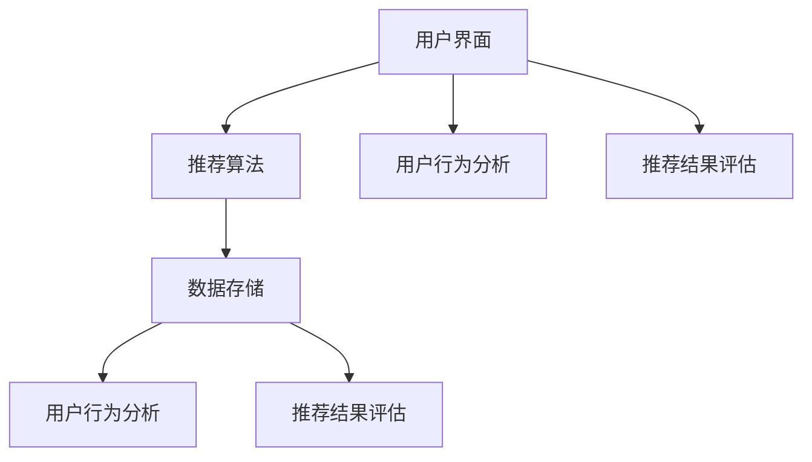

### 2.2 算法推荐系统的核心算法原理

算法推荐系统的核心在于其推荐算法，这些算法通过分析用户数据、新闻内容和相似性关系来生成个性化的推荐结果。本文将详细探讨三种主要的推荐算法：协同过滤、内容推荐和混合推荐，以及它们的工作原理和实现方法。

#### 2.2.1 协同过滤算法

协同过滤算法（Collaborative Filtering）是一种基于用户相似性或基于内容的推荐算法，它通过分析用户之间的行为相似性来推荐新闻。协同过滤算法主要分为以下两类：

1. **基于用户的协同过滤（User-based CF）**：
   - **原理**：基于用户的协同过滤通过计算用户之间的相似性来推荐新闻。它首先找出与目标用户兴趣相似的邻居用户，然后推荐这些邻居用户喜欢的新闻。
   - **相似性度量**：常用的相似性度量方法包括余弦相似性、皮尔逊相关系数等。
   - **算法实现**：
     ```python
     def calculate_similarity(user_ratings, similarity_measure='cosine'):
         # 计算用户间的相似性
         similarity_matrix = []
         for user in user_ratings:
             row = []
             for other_user in user_ratings:
                 if user != other_user:
                     sim = similarity_measure(user_ratings[user], user_ratings[other_user])
                     row.append(sim)
                 else:
                     row.append(0)
             similarity_matrix.append(row)
         return similarity_matrix

     def user_based_cf(user_id, user_ratings, similarity_matrix, item_ratings):
         # 为用户生成推荐列表
         recommended_items = []
         for other_user, sim in enumerate(similarity_matrix[user_id]):
             if sim > threshold:
                 for item, rating in item_ratings[other_user].items():
                     if item not in user_ratings[user_id]:
                         recommended_items.append((item, rating * sim))
         recommended_items.sort(key=lambda x: x[1], reverse=True)
         return recommended_items
     ```

2. **基于模型的协同过滤（Model-based CF）**：
   - **原理**：基于模型的协同过滤使用机器学习模型，如矩阵分解（Matrix Factorization），将用户和新闻的评分矩阵分解为低维的用户特征矩阵和新闻特征矩阵，通过这些特征矩阵的乘积预测用户的评分，进而生成推荐结果。
   - **常用模型**：Singular Value Decomposition（SVD）和Alternating Least Squares（ALS）是两种常用的矩阵分解方法。
   - **算法实现**：
     ```python
     from sklearn.decomposition import TruncatedSVD

     def model_based_cf(user_ratings, item_ratings, n_components=10):
         # 构建评分矩阵
         rating_matrix = create_rating_matrix(user_ratings, item_ratings)

         # 使用SVD进行矩阵分解
         svd = TruncatedSVD(n_components=n_components)
         user_embedding = svd.fit_transform(rating_matrix)
         item_embedding = svd.inverse_transform(user_embedding)

         # 预测用户对新闻的评分
         predicted_ratings = user_embedding @ item_embedding.T

         # 生成推荐列表
         recommendations = get_recommended_items(predicted_ratings, user_ratings)
         return recommendations
     ```

#### 2.2.2 内容推荐算法

内容推荐算法（Content-based Filtering）是一种基于新闻内容和用户兴趣的推荐算法，它通过分析新闻文本的特征和用户的兴趣，生成推荐结果。内容推荐算法主要分为以下两类：

1. **基于词袋模型的内容推荐**：
   - **原理**：基于词袋模型的内容推荐将新闻文本转换为词袋表示，计算新闻文本和用户兴趣之间的相似度，生成推荐结果。
   - **算法实现**：
     ```python
     from sklearn.feature_extraction.text import TfidfVectorizer

     def content_based_cf(news_data, user_interests, threshold=0.5):
         # 提取新闻文本特征
         vectorizer = TfidfVectorizer()
         news_features = vectorizer.fit_transform(news_data)

         # 计算用户兴趣向量
         user_interest_vector = vectorizer.transform([user_interests])

         # 计算新闻与用户兴趣的相似度
         similarity_scores = news_features @ user_interest_vector.T

         # 推荐相似度最高的新闻
         recommended_items = [item for item, score in enumerate(similarity_scores[0]) if score > threshold]
         return recommended_items
     ```

2. **基于词嵌入的内容推荐**：
   - **原理**：基于词嵌入的内容推荐使用预训练的词嵌入模型（如Word2Vec、GloVe）将新闻文本和用户兴趣转化为高维向量表示，计算相似度，生成推荐结果。
   - **算法实现**：
     ```python
     from gensim.models import Word2Vec

     def content_based_cf_with_word_embedding(news_data, user_interests, model_path):
         # 加载词嵌入模型
         model = Word2Vec.load(model_path)

         # 计算新闻文本的词嵌入表示
         news_vectors = [model.wv[str(item)] for item in news_data]

         # 计算用户兴趣的词嵌入表示
         user_interest_vector = np.mean(news_vectors, axis=0)

         # 计算新闻与用户兴趣的相似度
         similarity_scores = np.dot(news_vectors, user_interest_vector)

         # 推荐相似度最高的新闻
         recommended_items = [item for item, score in enumerate(similarity_scores) if score > threshold]
         return recommended_items
     ```

#### 2.2.3 混合推荐算法

混合推荐算法（Hybrid Recommendation）结合了协同过滤和内容推荐的优势，通过融合不同算法的优点，生成更精准的推荐结果。常见的混合推荐方法包括以下几种：

1. **协同过滤与内容推荐组合**：
   - **原理**：首先使用协同过滤算法生成初步推荐列表，然后使用内容推荐算法对初步推荐列表进行优化。
   - **算法实现**：
     ```python
     def hybrid_recommendation_CF_and_CB(user_ratings, item_ratings, user_interests, threshold=0.5):
         # 使用协同过滤生成初步推荐
         cf_recommendations = user_based_cf(user_ratings, threshold)

         # 使用内容推荐优化初步推荐
         cb_recommendations = content_based_cf(item_ratings, user_interests, threshold)

         # 结合协同过滤和内容推荐的推荐结果
         recommendations = list(set(cf_recommendations) & set(cb_recommendations))
         return recommendations
     ```

2. **基于模型的混合推荐**：
   - **原理**：使用机器学习模型（如矩阵分解、深度学习）同时考虑用户行为和新闻内容特征，生成综合推荐结果。
   - **算法实现**：
     ```python
     def hybrid_model_based_cf_and_cb(user_ratings, item_ratings):
         # 使用矩阵分解生成协同过滤推荐
         cf_recommendations = model_based_cf(user_ratings, item_ratings)

         # 使用词嵌入生成内容推荐
         cb_recommendations = content_based_cf_with_word_embedding(item_ratings, user_interests)

         # 结合协同过滤和内容推荐的推荐结果
         recommendations = list(set(cf_recommendations) | set(cb_recommendations))
         return recommendations
     ```

通过上述三种核心算法的详细解析，我们可以看到算法推荐系统在新闻生产中的应用是如何实现的。在实际应用中，可以根据具体需求和数据情况，灵活选择和组合这些算法，以提高推荐效果。

### 图2-2 算法推荐系统的核心算法原理架构


### 2.3 算法推荐系统的实践

在算法推荐系统的实践中，我们需要完成以下几个关键步骤：数据采集与处理、新闻内容特征提取、推荐算法选择与实现，以及推荐系统的性能评估。以下是这些步骤的具体实现方法和相关技术细节。

#### 2.3.1 数据采集与处理

数据采集是推荐系统建设的第一步，主要涉及用户行为数据和新闻内容数据的收集。用户行为数据包括用户的浏览记录、点赞、评论、分享等操作，而新闻内容数据则包括新闻的标题、正文、关键词、标签等。

**数据采集方法**：
1. **自动采集**：通过网页爬虫、API接口或数据采集工具，自动获取用户行为数据和新闻内容数据。
2. **人工录入**：在某些情况下，如早期阶段或特定数据源无法自动获取时，可以通过人工录入方式收集数据。

**数据处理方法**：
1. **数据清洗**：去除重复数据、缺失值填补、异常值处理等，确保数据质量。
2. **数据归一化**：将不同规模的数据进行归一化处理，使其在相同尺度下进行比较和分析。
3. **特征工程**：提取有用的特征，如用户的兴趣标签、新闻的文本特征、时间特征等。

**伪代码：数据采集与处理**

```python
def collect_data():
    # 自动采集用户行为数据和新闻内容数据
    user_behavior_data = fetch_user_behavior_data()
    news_data = fetch_news_data()

def preprocess_data(data):
    # 数据清洗与预处理
    cleaned_data = clean_data(data)
    processed_data = preprocess_data(cleaned_data)
    return processed_data
```

#### 2.3.2 新闻内容特征提取

新闻内容特征提取是将文本数据转化为适合机器学习处理的数值数据的过程。常用的特征提取方法包括词袋模型、词嵌入、主题模型等。

**词袋模型（Bag of Words）**：
词袋模型将新闻文本表示为词频向量，通过统计每个词在文本中出现的次数来生成特征。

**伪代码：词袋模型特征提取**

```python
from sklearn.feature_extraction.text import TfidfVectorizer

def extract_content_features(news_data):
    # 提取新闻文本特征
    vectorizer = TfidfVectorizer()
    content_features = vectorizer.fit_transform(news_data)
    return content_features
```

**词嵌入（Word Embedding）**：
词嵌入通过将每个词映射到一个高维向量空间，以捕捉词之间的语义关系。常用的词嵌入模型包括Word2Vec、GloVe等。

**伪代码：词嵌入特征提取**

```python
from gensim.models import Word2Vec

def extract_content_features_with_word_embedding(news_data, model_path):
    # 提取新闻文本的词嵌入特征
    model = Word2Vec.load(model_path)
    news_vectors = [model.wv[str(item)] for item in news_data]
    return news_vectors
```

#### 2.3.3 推荐算法选择与实现

在推荐算法的选择与实现过程中，我们需要根据具体需求和数据情况，选择合适的推荐算法，如协同过滤、内容推荐或混合推荐。

**协同过滤算法**：
协同过滤算法通过分析用户之间的行为相似性进行推荐。常用的方法包括基于用户的协同过滤和基于模型的协同过滤。

**伪代码：协同过滤算法**

```python
from sklearn.metrics.pairwise import cosine_similarity

def user_based_cf(user_ratings, similarity_threshold=0.5):
    # 计算用户相似性矩阵
    similarity_matrix = cosine_similarity(user_ratings)

    # 为每个用户生成推荐列表
    recommendations = {}
    for user, user_rating in user_ratings.items():
        similar_users = []
        for other_user, sim in enumerate(similarity_matrix[user]):
            if sim > similarity_threshold:
                similar_users.append(other_user)
        
        # 计算相似用户的平均评分
        avg_ratings = {}
        for other_user in similar_users:
            avg_ratings.update(user_rating)

        # 排序推荐列表
        recommendations[user] = sorted(avg_ratings.items(), key=lambda x: x[1], reverse=True)
    return recommendations
```

**内容推荐算法**：
内容推荐算法通过分析新闻内容之间的相似性进行推荐。常用的方法包括基于词袋模型和基于词嵌入的内容推荐。

**伪代码：内容推荐算法**

```python
def content_based_cf(news_data, user_interests, similarity_threshold=0.5):
    # 提取新闻文本特征
    news_features = extract_content_features(news_data)

    # 计算用户兴趣向量
    user_interest_vector = extract_content_features([user_interests])

    # 计算新闻与用户兴趣的相似度
    similarity_scores = news_features.dot(user_interest_vector)

    # 推荐相似度最高的新闻
    recommendations = sorted(zip(similarity_scores, news_data), reverse=True)
    return [item for item, _ in recommendations[:10]]
```

**混合推荐算法**：
混合推荐算法结合了协同过滤和内容推荐的优势，通过融合不同算法的优点，生成更精准的推荐结果。常用的混合推荐方法包括协同过滤与内容推荐组合和基于模型的混合推荐。

**伪代码：混合推荐算法**

```python
def hybrid_recommendation_CF_and_CB(user_ratings, news_data, user_interests, similarity_threshold=0.5):
    # 使用协同过滤生成初步推荐
    cf_recommendations = user_based_cf(user_ratings, similarity_threshold)

    # 使用内容推荐优化初步推荐
    cb_recommendations = content_based_cf(news_data, user_interests, similarity_threshold)

    # 结合协同过滤和内容推荐的推荐结果
    recommendations = []
    for user in cf_recommendations:
        cf_recommendations_user = cf_recommendations[user]
        cb_recommendations_user = cb_recommendations[user]
        combined_recommendations = list(set(cf_recommendations_user) & set(cb_recommendations_user))
        recommendations.append(combined_recommendations)
    return recommendations
```

#### 2.3.4 推荐系统性能评估

推荐系统的性能评估是确保推荐效果和用户体验的重要环节。常用的评估指标包括准确率（Precision）、召回率（Recall）、F1值（F1 Score）等。

**准确率（Precision）**：准确率是指推荐结果中实际喜欢的新闻占总推荐新闻的比例。

**伪代码：准确率计算**

```python
def calculate_precision(recommendations, ground_truth):
    return len(set(recommendations).intersection(set(ground_truth))) / len(recommendations)
```

**召回率（Recall）**：召回率是指推荐结果中实际喜欢的新闻占总可能喜欢的新闻的比例。

**伪代码：召回率计算**

```python
def calculate_recall(recommendations, ground_truth):
    return len(set(recommendations).intersection(set(ground_truth))) / len(ground_truth)
```

**F1值（F1 Score）**：F1值是准确率和召回率的调和平均值，用于综合评估推荐系统的性能。

**伪代码：F1值计算**

```python
def calculate_f1_score(precision, recall):
    return 2 * (precision * recall) / (precision + recall)
```

#### 2.3.5 实际案例分析与优化

在实际案例中，我们可以通过具体的数据集和实验，验证推荐算法的性能，并进行优化。

**案例一：新闻推荐系统**

假设我们有一个新闻推荐系统的数据集，包含用户的行为数据和新闻内容数据。我们可以使用协同过滤和内容推荐的混合算法进行推荐，并评估其性能。

**伪代码：实际案例分析**

```python
# 加载数据集
user_ratings = load_user_ratings()
news_data = load_news_data()

# 使用混合推荐算法
recommendations = hybrid_recommendation_CF_and_CB(user_ratings, news_data, user_interests)

# 评估推荐系统性能
precision = calculate_precision(recommendations, ground_truth)
recall = calculate_recall(recommendations, ground_truth)
f1_score = calculate_f1_score(precision, recall)

print("Precision:", precision)
print("Recall:", recall)
print("F1 Score:", f1_score)
```

**优化策略**：
1. **参数调整**：通过调整推荐算法的参数，如相似性阈值、矩阵分解的维度等，优化推荐效果。
2. **特征工程**：通过提取更多的特征和改进特征提取方法，提高推荐系统的准确性。
3. **数据增强**：通过引入更多的用户行为数据和新闻内容数据，增强推荐系统的训练数据。

通过以上实践，我们可以看到，算法推荐系统在新闻生产中的应用需要从数据采集与处理、新闻内容特征提取、推荐算法选择与实现，到推荐系统的性能评估等各个环节进行细致的工作，以确保推荐效果和用户体验。同时，在实际应用中，需要不断优化算法和模型，以应对不断变化的需求和数据。

### 图2-3 算法推荐系统的实践流程

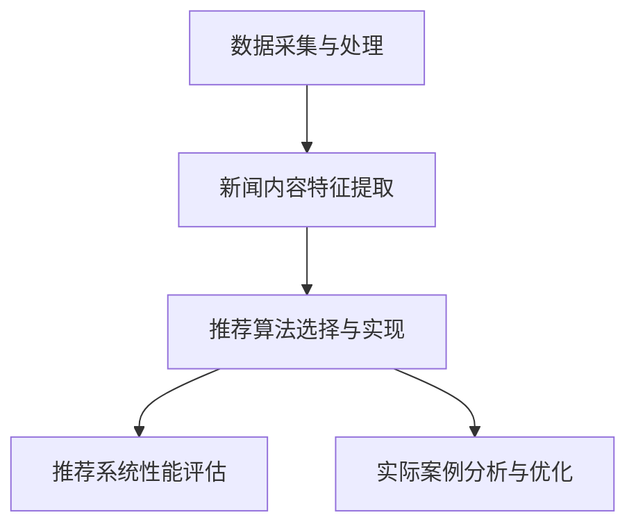

### 2.4 算法推荐系统中的伦理问题与对策

在算法推荐系统日益普及的今天，如何处理其中的伦理问题成为了关键议题。算法推荐系统在提高内容分发效率和用户满意度的同时，也可能引发一系列伦理问题，如数据隐私保护、算法偏见、内容质量等。以下是对这些问题的分析以及相应的对策与建议。

#### 2.4.1 伦理问题分析

1. **数据隐私保护**：
   - **问题分析**：算法推荐系统需要收集和分析大量的用户数据，包括浏览历史、兴趣偏好、地理位置等。这些数据如果未经妥善保护，可能导致用户隐私泄露，引发法律和道德问题。
   - **案例**：2018年，Facebook用户数据泄露事件引发了全球关注，许多用户的数据被第三方公司滥用，导致了严重的隐私泄露问题。

2. **算法偏见**：
   - **问题分析**：算法推荐系统可能在数据集选择、特征提取和模型训练过程中引入偏见，导致推荐结果对某些群体不公平。这种偏见可能源于数据集的不平衡、历史偏见或算法设计缺陷。
   - **案例**：亚马逊的推荐系统曾经因为性别偏见问题而受到批评，系统倾向于推荐男性用户的商品给女性用户，忽视了女性用户的个性化需求。

3. **内容质量**：
   - **问题分析**：算法推荐系统可能推荐低质量或误导性内容，影响用户的认知和行为。此外，某些新闻机构可能利用算法推荐系统进行内容误导或虚假新闻传播。
   - **案例**：2016年美国总统选举期间，社交媒体平台上的虚假新闻通过算法推荐系统传播，对选举结果产生了不良影响。

4. **技术依赖**：
   - **问题分析**：新闻机构和用户可能过度依赖算法推荐系统，忽视了独立思考和批判性思维。这种依赖可能导致信息泡沫和观点极化。
   - **案例**：用户在社交媒体平台上逐渐只看到与自己观点相似的内容，导致信息封闭和观点极化。

#### 2.4.2 对策与建议

1. **数据隐私保护**：
   - **数据加密**：采用先进的加密技术，确保用户数据的存储和传输过程安全。
   - **数据脱敏**：在数据处理过程中，对敏感信息进行脱敏处理，避免泄露用户的隐私信息。
   - **用户同意**：在收集用户数据前，明确告知用户数据的用途和权限，获取用户的明确同意。

2. **算法偏见**：
   - **数据多样化**：确保训练数据集的多样性，避免数据偏见。例如，在新闻数据集中包括不同性别、种族和地域的样本。
   - **算法透明性**：提高算法的透明度，让用户了解推荐内容的生成过程。新闻机构可以公开算法的原理、训练数据和优化过程，增加用户的信任。
   - **定期审计**：定期对算法进行审计和优化，发现并纠正潜在的偏见。通过用户反馈和行为数据，不断调整和改进算法，确保其公平性和公正性。

3. **内容质量**：
   - **多层次的审核机制**：建立多层次的审核机制，确保新闻内容的真实性和准确性。从内容生成到发布，每个环节都需要经过严格的审核。
   - **内容多样性**：通过算法和编辑的结合，确保推荐内容的质量和多样性，避免内容单一化。
   - **用户反馈机制**：建立用户反馈机制，及时处理用户对推荐内容的投诉和反馈，不断优化推荐系统。

4. **技术依赖**：
   - **用户教育**：加强用户教育，提高用户对算法推荐系统的认识和理解，鼓励用户独立思考和批判性思维。
   - **多元化内容来源**：提供多元化的内容来源，让用户有更多的选择，减少对单一推荐系统的依赖。
   - **增强社会责任**：新闻机构在应用人工智能技术时，应承担社会责任，确保技术应用不损害公众利益。

通过上述对策与建议，我们可以看到，在算法推荐系统的发展过程中，关注和解决伦理问题至关重要。只有在保障数据隐私、避免算法偏见、提高内容质量的同时，才能实现算法推荐系统的可持续发展，为新闻生产带来真正的价值。

### 图2-4 算法推荐系统中的伦理问题与对策

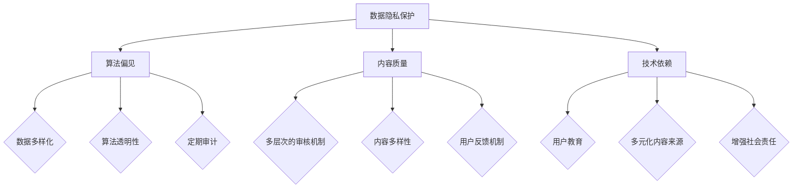

### 附录：算法推荐系统相关工具与技术

#### 2.5.1 推荐系统工具

以下是一些常用的推荐系统工具，这些工具可以帮助开发者快速构建和部署推荐系统。

- **PyTorch RecSys**：一个基于PyTorch的推荐系统库，提供了丰富的推荐算法和数据处理工具。
- **LightFM**：一个基于因子分解机的推荐系统库，适用于大规模推荐系统的开发。
- **Surprise**：一个开源的推荐系统库，提供了多种协同过滤和内容推荐算法，支持多种评估指标。

#### 2.5.2 算法推荐系统实践案例

以下是一些实际的算法推荐系统案例，通过这些案例可以更深入地了解推荐系统的应用和实践。

- **案例一：新闻推荐系统**：该系统使用协同过滤和内容推荐的混合算法，为用户提供个性化的新闻推荐。系统通过用户的历史浏览记录和新闻文本特征，生成个性化的推荐列表，提高了用户的阅读体验和满意度。
- **案例二：电子商务推荐系统**：该系统为电商平台提供商品推荐服务，通过用户的购物行为和商品特征，为用户推荐相关商品。系统使用协同过滤和内容推荐相结合的方法，提高了推荐准确率和用户转化率。
- **案例三：社交媒体推荐系统**：该系统为社交媒体平台提供内容推荐服务，通过用户的互动行为和内容特征，为用户推荐感兴趣的内容。系统使用深度学习模型和协同过滤算法，实现了高效的内容推荐和用户留存。

通过这些工具和实践案例，开发者可以更好地理解算法推荐系统的原理和应用，为实际项目提供有效的解决方案。

### 第3章：编辑把关在人工智能时代的角色与挑战

#### 3.1 编辑把关的定义与作用

编辑把关（Editorial Gatekeeping）是指在新闻生产过程中，编辑人员对新闻内容进行筛选、审核和修改，以确保新闻内容的质量、准确性和公正性。编辑把关的定义可以追溯到新闻传播学中的“把关人理论”（Gatekeeping Theory），该理论认为，新闻生产过程中的各个环节，如记者、编辑、出版等，都扮演着“把关人”的角色，他们通过选择和过滤信息，决定了哪些内容能够被传播给公众。

**编辑把关的作用**：

1. **内容质量保障**：编辑把关是确保新闻内容质量的关键环节。通过严格的审核和修改，编辑人员可以剔除不准确、不完整或低质量的新闻内容，提高新闻的专业性和可信度。

2. **伦理道德维护**：编辑把关有助于维护新闻行业的伦理标准和社会责任。编辑人员需要遵循新闻伦理，如客观公正、真实准确、不造谣诽谤等，确保新闻内容的道德合法性。

3. **新闻价值判断**：编辑把关是判断新闻价值的重要步骤。编辑人员根据新闻的重要性和影响力，决定哪些新闻值得报道和传播，从而引导公众关注重要的社会事件。

4. **品牌形象塑造**：编辑把关对新闻机构的品牌形象塑造具有重要作用。高质量的新闻内容和公正的编辑方针可以提升新闻机构的声誉和公信力，增强其在市场竞争中的优势。

#### 3.2 人工智能时代编辑把关的挑战

随着人工智能技术的快速发展，新闻生产方式发生了深刻变革，编辑把关也面临着前所未有的挑战。以下是一些主要挑战：

1. **算法推荐与编辑把关的冲突**：
   - **算法推荐系统**：人工智能算法可以根据用户的行为和偏好，自动推荐新闻内容，提高用户满意度。然而，算法推荐系统可能忽视新闻内容的深度分析和伦理标准，导致推荐内容的片面性和不公正。
   - **编辑把关**：传统编辑把关依赖于编辑人员的专业判断和伦理标准，以确保新闻内容的准确性和公正性。然而，在算法推荐系统的影响下，编辑的判断可能受到挑战，难以平衡用户需求和新闻质量。

2. **人工编辑与机器编辑的协同**：
   - **人工编辑**：传统的编辑工作主要依赖于人工，编辑人员负责筛选、审核和修改新闻内容。随着人工智能技术的发展，一些编辑工作可以被自动化工具替代，但人工编辑的判断和创造力仍然是不可替代的。
   - **机器编辑**：人工智能技术可以辅助编辑工作，如自动化内容审核、错误检测和格式化等。然而，机器编辑的能力和局限性也需要人工编辑的监督和指导，确保新闻内容的准确性和公正性。

3. **编辑把关的效率与质量**：
   - **效率**：在人工智能技术的辅助下，编辑工作的效率可以得到显著提升。例如，自动化工具可以快速筛选和分类新闻内容，提高编辑流程的效率。然而，人工智能技术也可能引入错误和偏见，需要人工编辑进行复核和纠正。
   - **质量**：高质量的新闻内容不仅需要编辑人员的专业判断和创造力，还需要对新闻事实的准确性和新闻价值的深入分析。人工智能技术虽然可以提高编辑效率，但在内容质量和新闻价值判断方面仍有局限。

#### 3.3 编辑把关在人工智能时代的策略

在人工智能时代，编辑把关需要采取新的策略，以应对技术变革带来的挑战。以下是一些可能的策略：

1. **技术辅助**：
   - **自动化工具**：利用人工智能技术，开发自动化工具辅助编辑工作，如自动化内容审核、错误检测和格式化等。这些工具可以提高编辑效率，减轻编辑人员的负担。
   - **数据驱动**：通过数据分析，了解用户需求和新闻趋势，为编辑提供数据支持，帮助编辑做出更科学的决策。

2. **算法透明性**：
   - **算法解释性**：提高算法的透明度，让编辑了解算法的推荐逻辑和决策过程。例如，通过可视化的方式展示算法的推荐路径和权重分配，增加编辑对算法的信任。
   - **算法优化**：与数据科学家和技术团队紧密合作，不断优化算法，提高算法的准确性和公正性，减少算法偏见。

3. **伦理准则**：
   - **新闻伦理培训**：加强新闻伦理培训，提高编辑人员的伦理意识和专业素养，确保他们在面对人工智能技术时能够坚持伦理标准。
   - **伦理审核机制**：建立多层次的伦理审核机制，对新闻内容进行严格把关，确保新闻内容的道德合法性。

4. **人机协作**：
   - **编辑与机器协同**：建立编辑与机器的协作机制，发挥编辑人员的创造力和判断力，同时利用人工智能技术提高编辑效率。
   - **反馈机制**：建立用户反馈机制，收集用户对新闻内容的评价和反馈，为编辑提供改进建议，不断优化新闻内容和编辑流程。

通过上述策略，编辑把关可以在人工智能时代保持其重要作用，确保新闻内容的准确性和公正性，同时提高编辑工作的效率和用户体验。

### 图3-1 人工智能时代编辑把关的角色与挑战

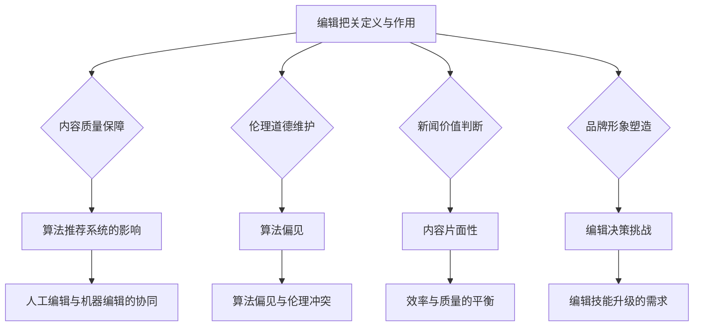

### 3.3.1 编辑角色的转变

在人工智能时代，编辑角色的转变是新闻行业面临的一个重要议题。随着人工智能技术的广泛应用，编辑的职责和技能要求也在不断更新。以下是编辑角色转变的具体表现：

#### 1. 从内容审核者到内容创造者

传统编辑的主要职责是对新闻内容进行审核和把关，确保内容的准确性和公正性。然而，在人工智能时代，编辑的角色逐渐从内容审核者转变为内容创造者。人工智能技术可以自动化地完成一些基础的内容审核工作，如语法检查、事实核对等，这使得编辑有更多的时间和精力投入到内容创造和创新中。

**具体表现**：
- **创新内容形式**：编辑可以更多地尝试视频、音频、图表等多种形式的内容，提高新闻的吸引力和表现力。
- **深度报道**：编辑可以利用人工智能工具进行数据分析和趋势预测，为深度报道提供更多的信息和洞察。

#### 2. 从内容筛选者到内容分析师

传统编辑需要从大量新闻素材中筛选出有价值的内容进行报道。在人工智能时代，编辑的角色转变为内容分析师，他们需要利用数据分析技术，从海量数据中提取有价值的信息，为新闻创作提供数据支持。

**具体表现**：
- **用户行为分析**：通过分析用户的行为数据，编辑可以更好地了解用户兴趣和需求，为内容创作提供方向。
- **趋势预测**：利用大数据分析和机器学习技术，编辑可以预测新闻事件的走向和社会趋势，提前布局新闻选题。

#### 3. 从内容发布者到内容传播者

传统编辑主要负责新闻内容的发布和传播，而人工智能时代，编辑的角色转变为内容传播者，他们需要利用人工智能技术，优化新闻内容的传播策略，提高内容的传播效果。

**具体表现**：
- **个性化推荐**：利用算法推荐技术，编辑可以为不同用户推荐个性化的新闻内容，提高用户满意度和阅读时长。
- **跨平台传播**：通过自动化工具和社交网络平台，编辑可以更有效地将新闻内容传播到不同的受众群体，扩大新闻的影响范围。

#### 4. 从单一技能到多技能融合

在传统新闻行业中，编辑往往具备某一领域的专业知识，如新闻采编、文字编辑、图片编辑等。在人工智能时代，编辑需要具备跨学科的知识和技能，融合人工智能技术、数据分析、编程等技能，成为全才型的新闻工作者。

**具体表现**：
- **编程能力**：掌握基本的编程技能，如Python，可以更好地使用人工智能工具和平台进行新闻生产和数据分析。
- **数据分析能力**：具备数据分析技能，可以更深入地理解新闻数据，为新闻创作提供有力的数据支持。

#### 5. 从被动接受到主动探索

在传统新闻生产模式中，编辑往往是被动地接受新闻素材，根据选题进行报道。在人工智能时代，编辑需要主动探索新闻资源，利用人工智能工具挖掘潜在的新闻线索和故事。

**具体表现**：
- **数据挖掘**：利用自然语言处理和文本挖掘技术，从海量的新闻素材和数据中挖掘出有价值的新闻线索。
- **趋势分析**：通过大数据分析和趋势预测，主动探索和布局有前瞻性的新闻选题。

#### 6. 从个体工作到团队合作

在人工智能时代，编辑不再是单独的工作者，而是需要与数据科学家、算法工程师、技术开发人员等多方协作，共同推进新闻生产项目。

**具体表现**：
- **跨学科团队**：建立跨学科的团队，结合不同领域的专业知识和技能，共同解决新闻生产和传播中的难题。
- **协作工具**：使用协作工具和平台，如GitHub、Trello等，提高团队协作效率和项目执行力。

通过上述编辑角色的转变，我们可以看到，人工智能时代对编辑技能和知识体系提出了更高的要求。编辑需要不断学习和适应新技术，提升自身的专业素养，才能在人工智能时代继续发挥重要作用。

### 图3-2 编辑角色的转变

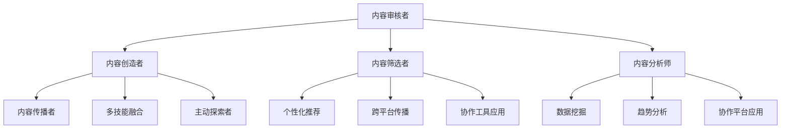

### 3.3.2 编辑技能的升级

在人工智能时代，编辑技能的升级是确保新闻机构在技术变革中保持竞争力的关键。以下是一些编辑技能的升级方向和具体措施：

#### 1. 编程技能的提升

随着人工智能技术的发展，编程技能成为编辑不可或缺的一部分。编辑需要掌握基本的编程语言，如Python，以利用各种数据分析和机器学习工具。以下是一些具体的提升方法：

- **在线课程和认证**：报名参加在线编程课程，如Coursera、edX等，获得专业的编程知识和认证。
- **实践项目**：参与实际项目，如开源项目或内部开发项目，将所学知识应用于实际场景，提升编程能力。
- **工具使用**：熟练掌握Python、R等编程语言，以及相关的数据分析和机器学习库，如NumPy、Pandas、Scikit-learn等。

**案例**：某新闻机构的编辑团队通过在线课程学习Python编程，成功开发了一个自动化新闻数据抓取工具，提高了数据采集的效率和准确性。

#### 2. 数据分析技能的增强

数据分析技能是编辑在新媒体环境中必不可少的。通过数据分析，编辑可以更好地理解用户行为、新闻趋势和内容效果，从而制定更有效的新闻策略。以下是一些提升数据分析技能的方法：

- **学习数据分析基础**：掌握数据分析的基础知识，包括数据清洗、数据可视化、统计分析等。
- **使用数据分析工具**：熟练使用数据分析工具，如Excel、Tableau等，进行数据分析和可视化。
- **项目实践**：参与实际数据分析项目，如用户行为分析、内容效果评估等，提升数据分析能力。

**案例**：某新闻机构的编辑团队通过数据分析工具，对用户行为数据进行分析，发现了一些用户兴趣点和新闻效果，为内容创作和优化提供了有力支持。

#### 3. 人工智能技术的应用

人工智能技术在新闻生产中的应用日益广泛，编辑需要掌握相关技术，以便更好地利用这些工具提高新闻生产效率。以下是一些具体的应用方向：

- **自然语言处理（NLP）**：利用NLP技术进行文本分析和内容生成，如自动摘要、关键词提取、情感分析等。
- **机器学习**：掌握基本的机器学习原理，如监督学习、无监督学习、强化学习等，应用于新闻推荐、内容审核等领域。
- **深度学习**：学习深度学习模型，如卷积神经网络（CNN）、递归神经网络（RNN）等，应用于图像识别、语音识别等任务。

**案例**：某新闻机构通过使用NLP技术，开发了一个自动新闻摘要生成工具，提高了新闻摘要的准确性和速度，减轻了编辑的工作负担。

#### 4. 多媒体制作技能的提升

随着新媒体环境的不断发展，编辑需要具备多媒体制作技能，如视频剪辑、音频编辑、动画制作等。以下是一些提升多媒体制作技能的方法：

- **在线课程和认证**：参加多媒体制作相关的在线课程和认证，学习视频剪辑、音频编辑等技能。
- **工具使用**：熟练掌握多媒体制作工具，如Adobe Premiere Pro、Audition、After Effects等。
- **项目实践**：参与多媒体项目制作，如新闻视频、音频节目、动画等，提升多媒体制作能力。

**案例**：某新闻机构的编辑团队通过在线学习和项目实践，成功制作了一系列高质量的新闻视频，提高了新闻的传播效果和用户体验。

#### 5. 用户体验设计（UXD）技能的增强

在人工智能时代，用户体验设计成为新闻编辑的重要技能。通过了解用户体验设计原则，编辑可以更好地设计新闻产品，提高用户满意度。以下是一些提升UXD技能的方法：

- **学习UXD基础**：掌握用户体验设计的基础知识，包括用户研究、交互设计、界面设计等。
- **工具使用**：熟练使用用户体验设计工具，如Figma、Sketch等。
- **用户反馈**：通过用户反馈和测试，不断优化新闻产品的设计和交互。

**案例**：某新闻机构的编辑团队通过用户反馈和测试，优化了新闻网页的布局和导航，提高了用户的阅读体验和满意度。

#### 6. 创意思维和内容创新

在人工智能时代，编辑不仅需要掌握技术技能，还需要具备创意思维和内容创新能力。以下是一些提升创意思维和内容创新的方法：

- **跨界学习**：学习其他领域的知识和技能，如艺术、设计、商业等，激发创意思维。
- **思维训练**：参加创意思维培训课程，学习如何进行头脑风暴、思维导图等。
- **项目实践**：参与内容创新项目，如主题策划、系列报道等，提升内容创新能力。

**案例**：某新闻机构的编辑团队通过跨界学习和创意思维训练，成功策划了一系列创新新闻专题，吸引了大量用户关注。

通过以上编辑技能的升级方向和具体措施，编辑可以更好地应对人工智能时代的挑战，提高新闻生产效率和内容质量。这不仅有助于编辑个人职业发展，也有助于新闻机构在激烈的市场竞争中保持优势。

### 图3-3 编辑技能的升级方向

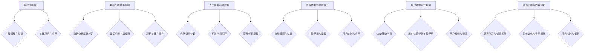

### 3.3.3 编辑与算法的协同策略

在人工智能时代，编辑与算法的协同策略是确保新闻生产质量和效率的重要手段。通过合理的设计和实施，编辑和算法可以相互补充，共同提升新闻内容的质量和用户体验。以下是一些具体的协同策略：

#### 1. **编辑与算法的角色划分**

在编辑与算法的协同中，首先要明确两者的角色和职责。编辑主要负责新闻内容的创作、审核和发布，而算法则负责内容的推荐、分类和数据分析。

- **编辑的角色**：
  - 内容创作：编辑根据新闻选题和用户需求，创作高质量的新闻内容。
  - 审核与修改：对新闻内容进行严格审核，确保新闻的准确性、客观性和伦理标准。
  - 用户体验：关注用户反馈，优化新闻内容和发布策略，提高用户体验。

- **算法的角色**：
  - 内容推荐：根据用户行为数据和新闻特征，推荐用户可能感兴趣的新闻内容。
  - 数据分析：分析用户行为数据，为编辑提供新闻趋势和用户需求的洞察。
  - 分类与标签：自动分类和标签新闻内容，提高内容检索和搜索效率。

#### 2. **协同流程的设计**

编辑与算法的协同需要一套合理的流程设计，以确保新闻内容的质量和效率。以下是一个典型的协同流程：

1. **选题策划**：
   - 编辑根据新闻事件和用户需求，策划新闻选题。
   - 算法根据历史数据和用户行为，分析新闻趋势和用户兴趣，为编辑提供选题建议。

2. **内容创作**：
   - 编辑根据选题创作新闻稿件。
   - 算法分析新闻稿件，提取关键信息和特征，为编辑提供内容优化建议。

3. **内容审核**：
   - 编辑对新闻内容进行严格审核，确保新闻的准确性、客观性和伦理标准。
   - 算法对新闻内容进行自动审核，识别潜在的语法错误、事实错误和不当内容。

4. **内容发布**：
   - 编辑决定新闻内容的发布时间和平台。
   - 算法根据用户行为和新闻特征，推荐新闻内容给目标用户。

5. **用户反馈**：
   - 编辑收集用户反馈，优化新闻内容和发布策略。
   - 算法分析用户反馈，为编辑提供改进建议。

#### 3. **协同工具和平台**

为了实现编辑与算法的协同，需要使用合适的工具和平台。以下是一些常用的协同工具和平台：

- **内容管理系统（CMS）**：如WordPress、Drupal等，用于编辑和发布新闻内容。
- **数据分析和机器学习平台**：如Google Analytics、Tableau、TensorFlow等，用于数据分析、模型训练和推荐系统的开发。
- **协作平台**：如GitHub、Trello等，用于编辑和算法团队之间的协作和沟通。
- **用户反馈系统**：如SurveyMonkey、UserTesting等，用于收集用户反馈，优化新闻内容和用户体验。

#### 4. **协同策略的实际案例**

以下是一个编辑与算法协同策略的实际案例：

- **案例一：新闻推荐系统**：某新闻机构使用算法推荐系统，根据用户的行为数据和新闻特征，推荐用户可能感兴趣的新闻内容。编辑在发布新闻前，会使用算法进行内容推荐测试，确保新闻内容能够吸引用户。同时，编辑根据用户反馈和算法分析结果，不断优化新闻内容的创作和发布策略。

- **案例二：内容审核系统**：某新闻机构使用自动化内容审核系统，对新闻内容进行语法、事实和伦理审核。编辑在审核新闻内容时，可以参考算法的审核结果，快速识别和纠正错误。此外，编辑还可以根据算法的审核建议，调整新闻内容的表达方式，提高内容的质量和可读性。

- **案例三：用户行为分析**：某新闻机构通过用户行为分析系统，了解用户的阅读习惯和兴趣偏好。编辑根据用户行为数据，调整新闻选题和内容创作方向，提高新闻内容的针对性和用户满意度。同时，算法根据用户行为数据，实时调整新闻推荐策略，提高推荐内容的准确性和用户体验。

通过以上案例，我们可以看到，编辑与算法的协同策略在新闻生产中的应用，不仅提高了新闻内容的质量和效率，还有效地提升了用户体验。随着人工智能技术的不断进步，编辑与算法的协同策略将越来越成熟，为新闻行业的发展带来新的机遇。

### 图3-4 编辑与算法的协同策略

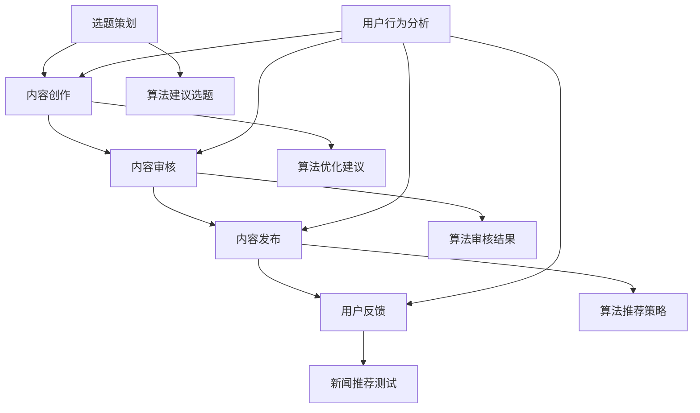

### 3.4.1 案例一：新闻编辑与算法的协同

在人工智能时代，新闻编辑与算法的协同已经成为提高新闻生产效率和质量的关键。以下是一个具体的案例，展示了新闻编辑如何与算法系统协作，优化新闻推荐和内容审核。

#### 案例背景

某大型新闻机构希望通过算法推荐系统提高用户的阅读时长和满意度。然而，他们面临的一个主要挑战是如何在保持新闻内容质量和客观性的同时，充分利用算法的优势。

#### 案例过程

1. **选题策划与算法建议**：
   - **编辑工作**：编辑团队根据当前热点事件和用户需求，策划新闻选题，撰写新闻稿件。
   - **算法协作**：算法系统根据历史数据和用户行为，分析新闻趋势和用户兴趣，为编辑提供选题建议。例如，算法系统发现用户对科技新闻兴趣较高，因此建议编辑团队增加科技新闻的报道。

2. **内容创作与优化建议**：
   - **编辑工作**：编辑团队撰写新闻稿件，进行编辑和校对，确保新闻内容准确、客观和有吸引力。
   - **算法协作**：算法系统分析新闻稿件的文本特征，提供内容优化建议。例如，算法系统发现某篇新闻稿件的标题和关键词不够突出，因此建议编辑团队进行修改，以提高新闻的推荐效果。

3. **内容审核与自动审核**：
   - **编辑工作**：编辑团队对新闻稿件进行内容审核，确保新闻的准确性、伦理性和合规性。
   - **算法协作**：自动化内容审核系统对新闻稿件进行初步审核，识别潜在的语法错误、事实错误和不当内容。例如，算法系统发现某篇新闻稿件的引用有误，立即标记并通知编辑团队进行修正。

4. **内容发布与推荐策略**：
   - **编辑工作**：编辑团队根据新闻的重要性和用户需求，决定新闻的发布时间和平台。
   - **算法协作**：算法系统根据用户行为和新闻特征，实时调整新闻推荐策略，确保推荐内容的个性化。例如，算法系统发现某些用户对特定类型的新闻兴趣较高，因此将这些新闻推荐给相关用户。

5. **用户反馈与持续优化**：
   - **编辑工作**：编辑团队收集用户对新闻内容的反馈，了解用户的阅读体验和需求。
   - **算法协作**：算法系统分析用户反馈，为编辑团队提供改进建议。例如，算法系统发现用户对某些新闻标题不感兴趣，因此建议编辑团队优化标题和推荐策略。

#### 案例效果

通过新闻编辑与算法系统的协同，该新闻机构在新闻推荐和内容审核方面取得了显著成效：

- **用户满意度提升**：个性化推荐策略提高了用户的阅读时长和满意度，用户粘性显著增加。
- **新闻质量提高**：自动化内容审核系统降低了编辑的工作负担，同时提高了新闻内容的准确性和合规性。
- **编辑效率提升**：算法系统的建议和反馈帮助编辑团队优化新闻创作和发布流程，提高了编辑效率。

通过这个案例，我们可以看到，新闻编辑与算法系统的协同不仅提高了新闻生产效率和质量，还有效地提升了用户体验。这表明，在人工智能时代，新闻机构需要充分利用算法的优势，同时保持新闻内容的质量和客观性，才能在激烈的市场竞争中立于不败之地。

### 图3-5 案例一：新闻编辑与算法的协同

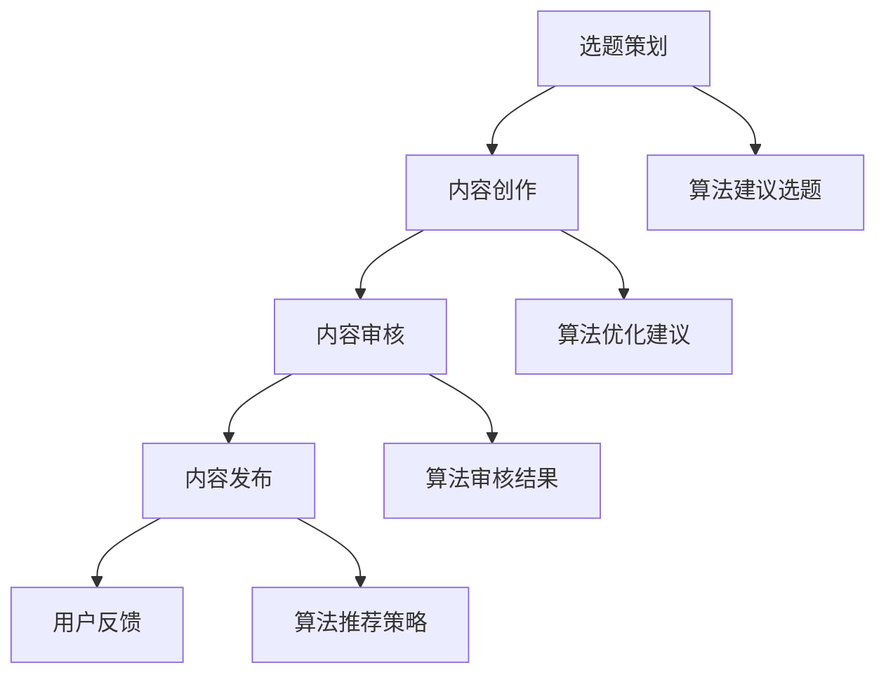

### 3.4.2 案例二：算法推荐系统在新闻生产中的应用

算法推荐系统在新闻生产中的应用日益广泛，通过精准的内容推荐，可以提高用户的阅读体验和新闻机构的收益。以下是一个具体的案例，展示了如何利用算法推荐系统提高新闻内容分发的效率和效果。

#### 案例背景

某知名新闻网站希望通过改进算法推荐系统，提高用户的阅读时长和页面浏览量，从而增加广告收入。然而，他们面临的一个主要挑战是如何在保证内容质量的同时，实现个性化的内容推荐。

#### 案例过程

1. **数据采集与处理**：
   - **编辑工作**：编辑团队收集用户行为数据，包括用户的浏览记录、点击行为、点赞和评论等。
   - **算法协作**：算法系统对这些用户行为数据进行清洗、去重和预处理，提取关键特征，用于训练推荐模型。

2. **用户兴趣建模**：
   - **编辑工作**：编辑团队根据用户的阅读历史和互动行为，对用户兴趣进行初步判断。
   - **算法协作**：算法系统使用机器学习算法，如协同过滤和内容推荐，建立用户兴趣模型，为每个用户生成个性化的兴趣标签。

3. **新闻内容特征提取**：
   - **编辑工作**：编辑团队对新闻内容进行分类和标签，以便算法系统能够更好地理解新闻内容。
   - **算法协作**：算法系统使用自然语言处理技术，提取新闻文本的关键词、主题和情感倾向，为新闻内容生成特征向量。

4. **推荐算法选择与实现**：
   - **编辑工作**：编辑团队根据新闻内容的类型和用户需求，选择合适的推荐算法，如基于协同过滤的推荐算法或基于内容的推荐算法。
   - **算法协作**：算法系统根据用户兴趣模型和新闻内容特征，实现推荐算法，生成个性化的推荐列表。

5. **推荐结果评估与优化**：
   - **编辑工作**：编辑团队通过用户反馈和行为数据，评估推荐结果的质量，发现潜在的问题和改进点。
   - **算法协作**：算法系统根据评估结果，调整推荐算法的参数和模型，优化推荐效果，提高用户的阅读体验。

6. **内容分发与调整**：
   - **编辑工作**：编辑团队根据推荐结果，决定新闻内容的分发策略，如推送时间、推送频率和推送渠道。
   - **算法协作**：算法系统根据用户行为和新闻特征，实时调整推荐策略，确保推荐内容的高效分发和个性化。

#### 案例效果

通过算法推荐系统在新闻生产中的应用，该新闻网站取得了显著的成果：

- **用户满意度提升**：个性化推荐策略提高了用户的阅读体验和满意度，用户停留时间和页面浏览量显著增加。
- **内容分发效率提高**：算法推荐系统自动筛选和推荐用户感兴趣的新闻内容，减少了人工筛选的工作量，提高了内容分发的效率。
- **广告收入增加**：用户阅读时长和页面浏览量的提升，带动了广告收入的增加，提高了新闻网站的盈利能力。

通过这个案例，我们可以看到，算法推荐系统在新闻生产中的应用不仅提高了内容分发的效率和效果，还显著提升了用户体验和广告收入。这表明，在人工智能时代，新闻机构需要充分利用算法推荐系统的优势，优化新闻内容分发策略，从而实现可持续发展。

### 图3-6 案例二：算法推荐系统在新闻生产中的应用

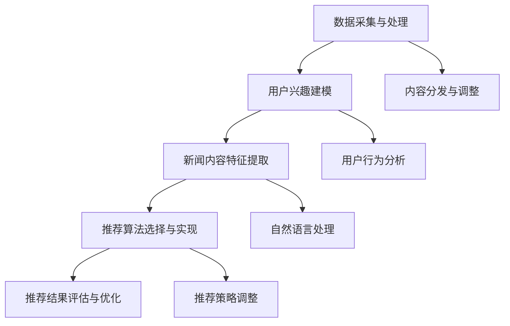

### 3.4.3 案例三：社交媒体推荐系统在新闻传播中的应用

社交媒体推荐系统在新闻传播中的应用越来越广泛，通过智能化的内容推荐，能够有效地扩大新闻的影响力，提升用户的参与度和互动性。以下是一个具体的案例，展示了如何利用社交媒体推荐系统提高新闻传播的效果。

#### 案例背景

某新闻机构希望通过社交媒体平台扩大新闻传播的范围，提高新闻的曝光率和用户参与度。然而，他们面临的一个主要挑战是如何在保证新闻内容质量的同时，实现有效的社交推荐。

#### 案例过程

1. **内容创作与分类**：
   - **编辑工作**：编辑团队根据新闻事件的性质和用户兴趣，创作高质量的新闻稿件，并对新闻内容进行分类，以便推荐系统更好地理解新闻内容。
   - **算法协作**：算法系统对新闻内容进行文本分析，提取关键信息，生成新闻的语义特征，用于后续的推荐过程。

2. **用户画像与行为分析**：
   - **编辑工作**：编辑团队根据用户的社交行为和兴趣，为用户建立画像，以便了解用户的需求和偏好。
   - **算法协作**：算法系统使用机器学习算法，如聚类分析和用户行为分析，建立用户兴趣模型，为每个用户生成个性化的兴趣标签。

3. **内容推荐与优化**：
   - **编辑工作**：编辑团队根据新闻的重要性和用户需求，决定新闻的发布时间和平台。
   - **算法协作**：算法系统根据用户兴趣模型和新闻内容特征，实现内容推荐，生成个性化的推荐列表，并通过A/B测试优化推荐策略。

4. **用户互动与反馈**：
   - **编辑工作**：编辑团队积极引导用户参与新闻讨论，收集用户的反馈和评论。
   - **算法协作**：算法系统分析用户互动行为和反馈数据，为编辑团队提供改进建议，优化新闻内容的推荐效果。

5. **内容传播与监测**：
   - **编辑工作**：编辑团队通过社交媒体推荐系统，将新闻内容推送给目标用户，并监控新闻的传播效果。
   - **算法协作**：算法系统实时监测用户对新闻内容的反馈和互动行为，分析传播效果，为编辑团队提供优化策略。

#### 案例效果

通过社交媒体推荐系统在新闻传播中的应用，该新闻机构取得了显著的效果：

- **新闻传播范围扩大**：个性化推荐策略提高了新闻在社交媒体上的曝光率，使新闻内容能够更广泛地传播给目标用户。
- **用户参与度提升**：推荐系统能够精确地推荐用户感兴趣的新闻内容，提高了用户的阅读和互动意愿，增加了用户粘性。
- **传播效果提升**：通过实时监测和优化推荐策略，编辑团队能够更有效地控制新闻传播的节奏和范围，提高新闻的传播效果。

通过这个案例，我们可以看到，社交媒体推荐系统在新闻传播中的应用，不仅提高了新闻的传播效果和用户参与度，还显著提升了新闻机构的市场竞争力。这表明，在人工智能时代，新闻机构需要充分利用社交媒体推荐系统的优势，优化新闻内容传播策略，从而实现可持续发展。

### 图3.7 案例三：社交媒体推荐系统在新闻传播中的应用

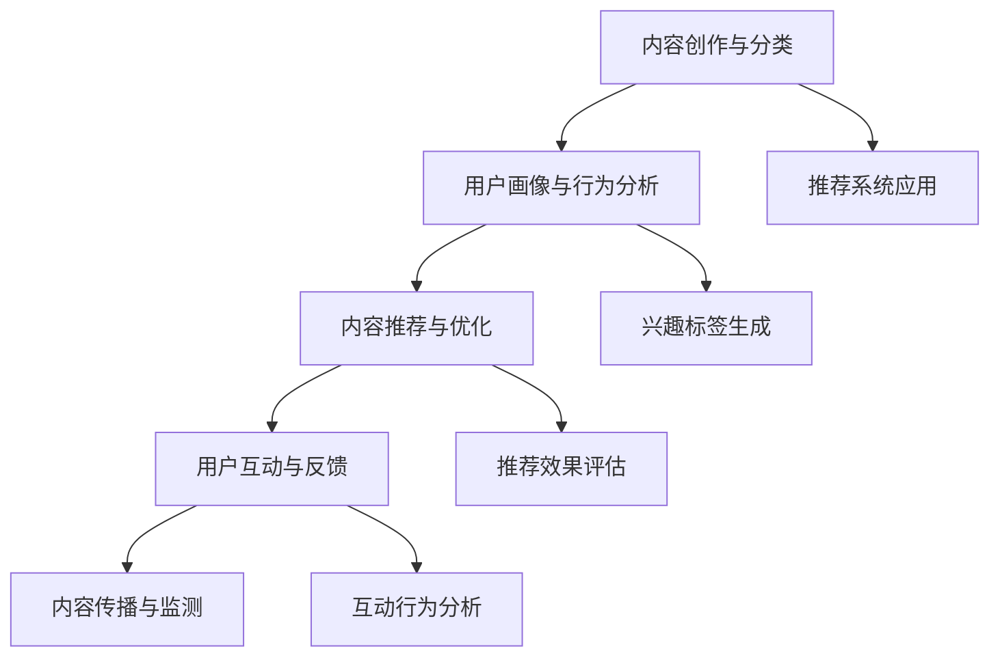

### 3.5.1 人工智能时代新闻编辑的最佳实践

在人工智能时代，新闻编辑面临着前所未有的机遇和挑战。通过以下最佳实践，新闻编辑可以更好地利用人工智能技术，提高新闻生产效率和质量，同时确保新闻内容的真实性和公正性。

#### 1. **数据驱动的编辑策略**

- **用户行为分析**：利用人工智能技术，深入分析用户的行为数据，了解用户的兴趣偏好和阅读习惯，从而制定更具针对性的新闻编辑策略。
- **实时数据监控**：通过实时数据分析，监控新闻内容的传播效果和用户反馈，及时调整编辑策略，优化新闻内容。

#### 2. **人工智能辅助内容创作**

- **自动化内容生成**：利用自然语言生成（NLG）技术，快速生成新闻稿件，减轻编辑的工作负担。例如，自动化生成财经报告、体育赛事评论等。
- **内容优化工具**：使用人工智能工具，如语法检查、错别字纠正等，提高新闻内容的准确性和可读性。

#### 3. **个性化推荐系统**

- **用户兴趣建模**：基于用户的浏览历史和互动行为，建立用户兴趣模型，实现个性化内容推荐，提高用户的阅读体验和满意度。
- **推荐算法优化**：不断优化推荐算法，提高推荐内容的准确性和多样性，避免信息泡沫和内容单一化。

#### 4. **多模态内容创作**

- **融合多媒体元素**：利用人工智能技术，创作多媒体新闻内容，如视频、音频、动画等，提高新闻的吸引力和表现力。
- **图像和视频识别**：使用计算机视觉技术，自动识别和标注新闻中的关键图像和视频，提高内容的可检索性和传播效果。

#### 5. **伦理和隐私保护**

- **透明算法**：确保算法的透明性，公开算法的原理和决策过程，增加用户的信任。
- **数据隐私保护**：严格遵守数据隐私保护法规，采取数据加密和脱敏措施，保护用户的隐私。
- **伦理审核**：建立伦理审核机制，确保新闻内容符合伦理标准，避免内容偏见和误导。

#### 6. **人机协作**

- **编辑与算法的协同**：充分发挥编辑人员的创造力和判断力，与人工智能技术协作，提高新闻生产效率和质量。
- **培训与发展**：为编辑提供人工智能相关的培训，提升他们的技术水平，适应人工智能时代的工作需求。

#### 7. **跨学科合作**

- **技术团队支持**：与数据科学家、算法工程师、技术开发人员等多方合作，共同解决新闻生产中的技术难题。
- **创新思维**：跨学科合作，激发创新思维，推动新闻生产模式的创新和发展。

通过以上最佳实践，新闻编辑可以在人工智能时代更好地应对技术变革，提高新闻生产效率和质量，同时确保新闻内容的真实性和公正性。

### 图3-8 人工智能时代新闻编辑的最佳实践

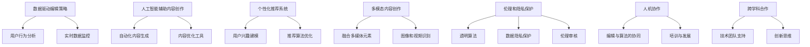

### 3.5.2 小结

在人工智能时代，新闻编辑的角色和技能发生了显著变化。传统新闻编辑主要依赖手工处理和专业知识进行新闻内容的创作和审核，而如今，人工智能技术的应用使得新闻编辑的工作变得更加高效和多样化。

首先，人工智能技术极大地提高了新闻编辑的效率。自动化工具可以快速完成内容生成、校对、分类等任务，减轻了编辑人员的负担。例如，自然语言生成（NLG）技术可以自动化生成新闻报道，而文本分析工具可以快速识别和纠正语法错误。此外，推荐系统可以帮助编辑更精准地定位用户兴趣，优化内容推荐策略，提高用户阅读体验。

其次，人工智能技术推动了新闻编辑角色的转变。编辑不再仅仅是内容的审核者和发布者，他们需要成为数据分析师、内容创造者和技术应用者。编辑需要掌握编程技能，如Python，以利用各种数据分析和机器学习工具。同时，他们需要具备对人工智能技术的理解，以便更好地与算法团队协作，优化新闻生产和分发流程。

然而，人工智能技术也带来了新的挑战。算法偏见和数据隐私问题是编辑需要特别关注的问题。算法偏见可能导致内容推荐中的不公平现象，编辑需要确保算法的透明性和公正性。此外，数据隐私保护法规要求新闻机构在收集和使用用户数据时严格遵守规定，保护用户隐私。

为了应对这些挑战，编辑需要不断提升自己的技能和知识。一方面，他们需要接受人工智能相关的培训，了解算法的原理和应用，掌握新的工具和技术。另一方面，他们需要关注伦理和隐私保护问题，确保新闻内容的生产和分发符合伦理标准和法律法规。

总之，人工智能时代为新闻编辑提供了新的机遇和挑战。通过充分利用人工智能技术，编辑可以提高工作效率，优化新闻内容质量，同时确保内容的真实性和公正性。然而，这也要求编辑不断学习和适应新技术，提升自身综合素质，以应对人工智能时代的变化。

### 3.5.3 注意事项

在人工智能时代，新闻编辑在应用人工智能技术时需要特别注意以下几个关键方面：

1. **算法透明性**：确保算法的透明性，让用户了解推荐内容的生成过程。算法的透明性有助于增加用户对新闻内容的信任，减少对算法的质疑和误解。

2. **数据隐私保护**：严格遵守数据隐私保护法规，采取数据加密和脱敏措施，确保用户数据的隐私和安全。数据隐私保护是新闻编辑在应用人工智能技术时不可忽视的重要问题。

3. **内容多样性**：避免算法推荐系统导致内容单一化和信息泡沫。新闻编辑需要关注算法推荐系统的多样性，确保推荐内容能够覆盖多种观点和主题，避免用户陷入信息茧房。

4. **人机协作**：充分发挥编辑人员的创造力和判断力，与人工智能技术协同工作。编辑需要理解算法的优势和局限，合理运用人工智能工具，确保新闻内容的深度分析和伦理标准。

5. **持续优化**：不断优化算法和编辑流程，提高推荐内容的准确性和用户体验。新闻编辑需要根据用户反馈和行为数据，调整推荐策略，确保新闻内容的生产和分发达到最佳效果。

6. **伦理审查**：建立伦理审查机制，确保新闻内容的生产和分发符合伦理标准，避免内容偏见和误导。伦理审查是确保新闻内容质量和公信力的重要环节。

通过关注上述注意事项，新闻编辑可以在人工智能时代更好地利用技术优势，提高新闻内容的质量和用户体验，同时确保内容的真实性和公正性。

### 3.5.4 拓展阅读

在探讨人工智能时代新闻编辑的挑战与机遇时，以下资源提供了深入且详尽的见解，有助于进一步理解相关主题：

1. **书籍推荐**：
   - 《算法 recommendation systems: The textbook》：这本书详细介绍了推荐系统的理论基础和实践方法，对新闻编辑应用算法推荐系统具有重要参考价值。
   - 《深度学习》：由Ian Goodfellow、Yoshua Bengio和Aaron Courville合著，介绍了深度学习的基本原理和应用，适合新闻编辑了解AI和深度学习在新闻生产中的应用。

2. **学术论文**：
   - “Recommender Systems Handbook”：这篇论文提供了全面的推荐系统手册，包括推荐系统的历史、理论、算法和应用案例，对新闻编辑了解推荐系统的发展和应用趋势具有指导意义。
   - “Bias in Machine Learning Algorithms and Its Implications for News Recommender Systems”：这篇文章探讨了机器学习算法中的偏见问题，以及其对新闻推荐系统的影响，为新闻编辑提供了防范算法偏见的方法。

3. **在线课程**：
   - Coursera上的“机器学习”课程：由Andrew Ng教授主讲，介绍了机器学习的基本概念和算法，适合新闻编辑提升AI和机器学习的技能。
   - edX上的“Data Science and Machine Learning for Intelligent Systems”：由Hearing Memorial University教授主讲，涵盖了数据科学和机器学习的核心知识，对新闻编辑深入理解AI技术大有裨益。

4. **行业报告**：
   - “The State of AI in Media 2022”：由Media Research Center发布的年度报告，分析了人工智能在媒体行业的应用现状和趋势，为新闻编辑提供了行业发展的全景图。
   - “AI in News Media 2021”：由数字新闻研究中心发布的报告，详细探讨了人工智能在新闻媒体中的实际应用和潜在挑战，为新闻编辑提供了实用的策略和建议。

通过阅读这些书籍、学术论文、在线课程和行业报告，新闻编辑可以更全面地了解人工智能时代新闻生产的现状和未来发展趋势，从而更好地应对挑战，把握机遇。这些资源不仅提供了丰富的理论知识，还包含了许多实践案例，有助于新闻编辑在实际工作中应用人工智能技术，提升新闻内容的质量和用户体验。

