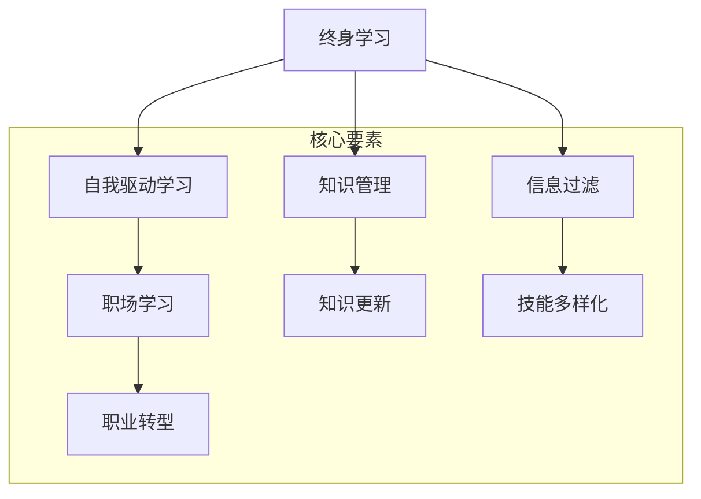
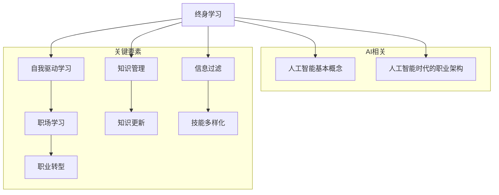

                 

### 文章标题：人工智能时代的终身学习：技能更新与职业转型

### 关键词：人工智能，终身学习，技能更新，职业转型，Mermaid流程图，算法原理，项目实战

### 摘要：
在人工智能快速发展的时代，终身学习成为个体和企业持续发展的关键。本文从终身学习的定义和价值入手，探讨了人工智能时代终身学习的策略与方法，并详细解析了技能更新与职业转型的核心概念与架构。通过Mermaid流程图、算法原理、项目实战等多维度的分析，本文旨在为读者提供一套系统的终身学习与实践指南，助力在人工智能时代实现技能更新与职业转型。

### 引言：人工智能时代的终身学习

#### 背景介绍
随着人工智能（AI）技术的迅猛发展，各行各业正经历着深刻的变革。传统的工作模式、技能需求以及职业发展路径都在被重新定义。在这个快速变化的时代，终身学习成为保持竞争力、适应新技术变革的必要途径。

#### 核心概念与联系
终身学习不仅是一种教育理念，更是一种生活方式。它涉及自我驱动学习、知识管理与信息过滤、职场学习等多个方面。在人工智能时代，终身学习的重要性进一步凸显，主要体现在以下几个方面：

1. **知识更新速度快**：人工智能技术不断进步，相关领域知识更新速度加快，要求个体具备持续学习的能力。
2. **技能多样化**：人工智能的应用使得多种新技能成为必备，例如数据科学、机器学习、自然语言处理等，这要求个体具备跨领域学习的灵活性。
3. **职业转型需求**：随着自动化和智能化的发展，某些职业面临消失的风险，而新的职业机会不断涌现，这要求个体具备职业转型的能力和意愿。

#### Mermaid流程图：人工智能时代的终身学习架构
为了更直观地展示终身学习在人工智能时代的核心概念与联系，我们可以使用Mermaid流程图来描绘其架构：



### 第一章：终身学习的概念与价值

#### 终身学习的定义
终身学习是一种贯穿人一生、旨在不断更新知识与技能的学习方式。它不仅包括正规教育，还包括非正规教育和自我教育。终身学习的核心理念是“学习无处不在”，强调学习不仅仅发生在学校，而是渗透到个体的日常生活和工作中。

#### 人工智能时代的终身学习需求
在人工智能时代，终身学习的需求更加迫切。首先，人工智能技术的发展使得知识更新速度加快，传统的一次性教育难以满足个体发展的需求。其次，随着人工智能在各个领域的应用，新的技能需求不断涌现，个体需要不断学习新知识、新技能以适应职业发展。此外，人工智能带来的就业结构变化要求个体具备跨领域的知识和技能，这也凸显了终身学习的重要性。

#### 终身学习的重要性
终身学习对于个体和社会都具有重要意义。对于个体而言，终身学习能够提升个人竞争力，增强适应新环境和新技术变化的能力。对于社会而言，终身学习有助于提升整体教育水平，促进经济发展和社会进步。

### 第二章：终身学习的策略与方法

#### 自我驱动学习
自我驱动学习是终身学习的核心，它强调个体在学习过程中的自主性。自我驱动学习的策略包括设定学习目标、制定学习计划、培养学习兴趣等。通过自我驱动学习，个体能够更好地掌握学习内容，提升学习效果。

#### 知识管理与信息过滤
知识管理是终身学习中的重要环节，它涉及知识的获取、存储、应用和更新。信息过滤则是知识管理的一部分，旨在从大量信息中筛选出有价值的内容。有效的知识管理和信息过滤可以帮助个体在信息爆炸的时代中保持清晰的头脑，专注于关键信息的学习。

#### 职场学习策略
职场学习是指在工作环境中进行的学习。职场学习的策略包括利用公司提供的培训资源、参与行业交流会议、参加在线课程等。通过职场学习，个体能够将理论知识与实践相结合，提升工作能力和职业素养。

### 第三章：核心概念与架构

#### 人工智能基本概念
人工智能是指使计算机具备类似人类智能的能力，包括感知、理解、学习、推理、决策等。人工智能的核心技术包括机器学习、深度学习、自然语言处理等。

#### 人工智能时代的职业架构
在人工智能时代，职业架构发生了显著变化。传统的职业分类正在被重新定义，新的职业形态不断涌现。职业架构的变化要求个体具备跨领域的知识和技能，同时也为个体提供了更多职业转型的机会。

#### Mermaid流程图：人工智能时代的终身学习架构
为了更直观地展示人工智能时代终身学习的核心概念与架构，我们可以使用Mermaid流程图：



### 核心算法原理讲解

在人工智能时代，算法原理是理解和技术实现的关键。以下我们将以机器学习算法为例，使用伪代码详细阐述其基本原理。

#### 机器学习算法：伪代码
```python
# 伪代码：简单的线性回归算法

# 输入：数据集 D，特征矩阵 X，目标值 y
# 输出：模型参数 w

# 初始化参数 w 为随机值
w = random_vector(num_features)

# 设置学习率 alpha 和迭代次数 max_iterations
alpha = 0.01
max_iterations = 1000

# 开始迭代
for i in range(max_iterations):
    # 计算预测值 y_pred
    y_pred = X * w
    
    # 计算误差
    error = y_pred - y
    
    # 更新模型参数 w
    w = w - alpha * (X.T * error)

# 输出最终的模型参数 w
return w
```

#### 数学模型与公式
线性回归的数学模型可以表示为：
$$ y = X * w + b $$
其中，$y$ 是目标值，$X$ 是特征矩阵，$w$ 是模型参数（权重），$b$ 是偏置项。

#### 详细讲解与举例说明
假设我们有如下数据集：
| 特征1 | 特征2 | 目标值 |
| --- | --- | --- |
| 1 | 2 | 3 |
| 4 | 5 | 6 |
| 7 | 8 | 9 |

我们希望通过线性回归模型预测新的特征组合（例如 (3, 4)）的目标值。

1. **初始化参数**：随机生成权重向量 $w$。
2. **迭代计算**：每次迭代中，计算预测值 $y_pred$ 和实际目标值 $y$ 的误差，并更新权重向量 $w$。
3. **输出模型参数**：经过多次迭代后，得到稳定的权重向量 $w$。

使用上述伪代码，我们可以实现线性回归算法，并通过具体数据集进行测试，验证模型的准确性和适用性。

### 项目实战：技能更新与职业转型

#### 开发环境搭建
为了进行技能更新与职业转型，首先需要搭建一个适合开发的人工智能环境。以下是一个简化的步骤：

1. **安装Python环境**：确保Python版本在3.7及以上。
2. **安装机器学习库**：例如scikit-learn、TensorFlow、PyTorch等。
3. **配置Jupyter Notebook**：用于编写和执行代码。

#### 源代码详细实现
以下是一个简单的机器学习项目，使用线性回归算法预测房价：

```python
# 导入所需的库
import numpy as np
import pandas as pd
from sklearn.linear_model import LinearRegression
from sklearn.model_selection import train_test_split

# 读取数据
data = pd.read_csv('house_prices.csv')

# 特征选择
X = data[['feature1', 'feature2']]
y = data['price']

# 划分训练集和测试集
X_train, X_test, y_train, y_test = train_test_split(X, y, test_size=0.2, random_state=42)

# 初始化模型
model = LinearRegression()

# 训练模型
model.fit(X_train, y_train)

# 预测测试集
y_pred = model.predict(X_test)

# 评估模型
score = model.score(X_test, y_test)
print(f'Model accuracy: {score:.2f}')
```

#### 代码解读与分析
上述代码首先导入了所需的库，然后读取了房价数据。通过特征选择和划分训练集与测试集，我们使用线性回归模型对数据进行了训练。最后，模型对测试集进行预测，并评估了模型的准确性。

#### 实际案例分析与详细讲解
以下是一个实际案例，使用线性回归模型预测房价，并分析结果：

1. **数据预处理**：确保数据质量，包括缺失值处理、异常值检测等。
2. **模型选择**：根据数据特征选择合适的模型，如线性回归、决策树、随机森林等。
3. **模型训练与评估**：通过交叉验证等方法训练模型，并评估模型的性能。
4. **结果分析**：分析预测结果，识别模型的优势和不足，提出改进措施。

#### 项目小结
通过上述项目实战，我们了解了从数据预处理到模型训练、评估的完整流程。这个项目不仅帮助我们更新了机器学习相关技能，也为我们的职业转型提供了实践经验。

### 最佳实践 Tips

1. **持续学习**：利用在线教育资源，如Coursera、edX等，定期更新知识体系。
2. **参与社区**：加入技术社区，如GitHub、Stack Overflow等，积极参与讨论，拓展人脉。
3. **实践经验**：通过实际项目，将理论知识应用于实践，提升解决实际问题的能力。

### 小结与注意事项

本文从终身学习的概念和价值入手，探讨了人工智能时代的终身学习策略与方法，并详细分析了技能更新与职业转型的核心概念与架构。通过Mermaid流程图、算法原理、项目实战等多维度的解析，本文旨在为读者提供一套系统的终身学习与实践指南。需要注意的是，终身学习是一个长期过程，需要持续的努力和投入。

### 拓展阅读

1. **《深度学习》（Deep Learning）**：Goodfellow、Bengio和Courville所著，是深度学习领域的经典教材。
2. **《Python机器学习》（Python Machine Learning）**：Sebastian Raschka所著，详细介绍了Python在机器学习中的应用。
3. **《人工智能：一种现代的方法》（Artificial Intelligence: A Modern Approach）**：Stuart Russell和Peter Norvig所著，全面介绍了人工智能的基本原理和应用。

### 附录：资源与工具

1. **在线学习平台**：推荐Coursera、edX、Udacity等平台，提供丰富的AI课程资源。
2. **技能评估工具**：可以使用LinkedIn的技能评估工具，评估自己的技能水平。
3. **职业转型支持机构**：如GitHub Education、Girls Who Code等，提供职业发展支持和资源。

### 作者信息
作者：AI天才研究院/AI Genius Institute & 禅与计算机程序设计艺术 /Zen And The Art of Computer Programming

