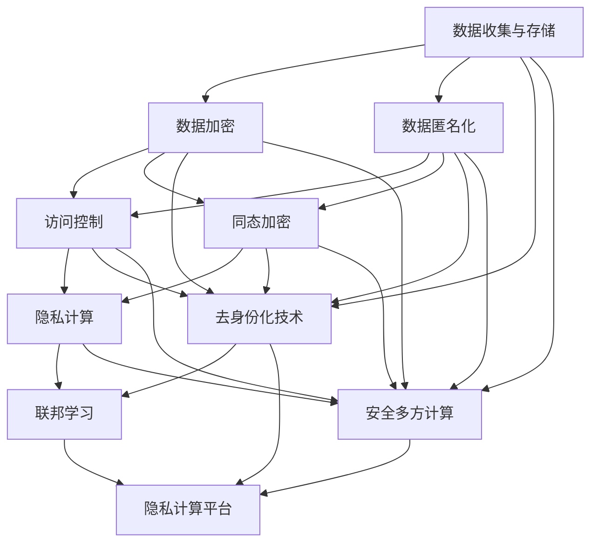

                 

### 文章标题

《人工智能时代的隐私保护：个人数据权与公共利益的权衡》

### 关键词

隐私保护、人工智能、个人数据权、公共利益、法律框架、技术发展、政策建议、去身份化、隐私计算

### 摘要

随着人工智能技术的迅速发展，隐私保护成为了一个不容忽视的问题。本文从隐私保护的基本概念与法律框架入手，详细探讨了个人数据权与公共利益的权衡。文章首先介绍了隐私保护的重要性及人工智能时代面临的挑战，接着深入分析了隐私保护的基本概念、法律框架以及相关技术与工具。随后，文章从人工智能技术介绍、隐私保护需求与挑战、权衡原则与标准等多个角度，探讨了人工智能与隐私保护的关系。在第三部分，文章探讨了个人数据权与公共利益的冲突与协调，通过案例分析展示了实践探索中的平衡方法。第四部分提出了隐私保护的政策与法律建议，包括全球隐私保护政策对比、政策制定与实施策略以及法律框架完善建议。最后，文章展望了隐私保护技术的发展趋势，包括隐私计算技术、去身份化技术等，并对未来隐私保护提出了展望。本文旨在为人工智能时代的隐私保护提供理论支持和实践指导。

### 引言

#### 1.1 人工智能时代隐私保护的重要性

随着人工智能（Artificial Intelligence, AI）技术的飞速发展，人们的生活、工作和社会运行模式发生了翻天覆地的变化。AI技术在医疗、金融、交通、教育等各个领域得到了广泛应用，极大地提高了效率，降低了成本，并为人类创造了前所未有的便利。然而，AI技术的广泛应用也带来了前所未有的隐私保护挑战。

隐私保护一直是人类社会关注的重点。个人数据的泄露、滥用或不当处理可能导致严重的后果，包括个人身份被盗用、经济损失、社会信任危机等。在人工智能时代，隐私保护的重要性更加凸显，因为AI技术的核心——数据，往往是个人隐私的核心载体。

首先，人工智能系统的运作依赖于大量的数据。这些数据不仅包括公开数据，还涉及大量的个人隐私数据，如医疗记录、金融交易记录、社交媒体信息等。这些数据的收集、存储和使用，往往涉及到个人隐私的保护问题。

其次，人工智能算法的强大数据处理能力，使得个人数据的挖掘和分析能力大大增强。这使得个人隐私更容易被泄露和滥用。例如，通过数据挖掘和分析，可以轻易地推断出个人的生活习惯、兴趣爱好、健康状况等信息，这些信息一旦泄露，可能会被用于各种不正当的目的。

此外，人工智能系统的自动化决策功能，使得个人数据的处理更加隐蔽。个人往往无法了解自己的数据如何被使用，也无法有效控制自己的数据。这种透明度缺失进一步加剧了个人隐私保护的风险。

综上所述，人工智能时代的隐私保护问题不仅仅是一个技术问题，更是一个社会问题。保障个人数据权，维护个人隐私，是人工智能健康发展的前提。因此，对人工智能时代的隐私保护进行深入研究和探讨，具有重要的理论和现实意义。

#### 1.2 隐私保护在人工智能时代面临的挑战

在人工智能时代，隐私保护面临着诸多前所未有的挑战。以下是其中一些主要挑战：

1. **数据量与多样化**

随着互联网和大数据技术的发展，人们产生的数据量日益庞大，数据类型也日趋多样化。这不仅包括文本、图像和音频等传统数据，还包括传感器数据、社交媒体数据、地理位置数据等。这些多样化的数据，为隐私保护带来了巨大的挑战。如何有效地管理这些数据，确保个人隐私不被泄露，是需要解决的问题。

2. **数据的处理速度与复杂性**

人工智能算法的强大数据处理能力，使得数据在收集、存储、处理和分析等环节的速度大大提高。然而，这也意味着个人隐私数据在短时间内被处理和传播的可能性增加。同时，人工智能算法的复杂性使得数据处理的透明度降低，个人难以了解自己的数据是如何被使用的。这种透明度缺失进一步加剧了隐私保护的风险。

3. **自动化决策的隐私风险**

人工智能系统具有强大的自动化决策能力，例如，自动驾驶汽车、智能客服、个性化推荐系统等。这些系统在做出决策时，往往基于大量的个人数据。然而，由于这些决策过程往往是非透明的，个人无法了解自己的数据是如何影响决策的。这使得个人隐私数据更容易被滥用，增加了隐私泄露的风险。

4. **数据共享与跨境流动**

人工智能时代，数据的共享和跨境流动变得更加频繁。这使得个人隐私数据更容易被跨国公司和政府机构获取和使用。然而，不同国家和地区在隐私保护法律和标准上存在差异，这为全球范围内的隐私保护带来了挑战。如何确保数据在跨境流动过程中得到有效保护，是需要解决的问题。

5. **隐私保护技术的局限性**

现有的隐私保护技术，如加密、匿名化、访问控制等，虽然可以在一定程度上保护个人隐私，但面临着诸多局限性。例如，加密技术虽然可以保护数据在传输过程中的安全性，但无法防止数据在存储和计算过程中的泄露。匿名化技术虽然可以隐藏个人身份，但可能会降低数据的可用性和准确性。访问控制技术虽然可以限制对数据的访问，但难以防止内部人员的滥用。

综上所述，人工智能时代的隐私保护面临着诸多挑战。为了有效应对这些挑战，需要从技术、法律、政策等多个层面进行综合研究和探索。只有通过多方面的努力，才能确保人工智能时代的隐私保护得到有效保障。

#### 1.3 书籍结构概述

本书旨在深入探讨人工智能时代隐私保护的问题，并提供系统的理论支持和实践指导。全书共分为六个主要部分，结构如下：

**第一部分：隐私保护的基本概念与法律框架**

本部分将详细介绍隐私保护的基本概念，包括个人数据权、隐私权等。还将探讨隐私保护的法律框架，包括国际和国内的法律制度，以及隐私保护技术的分类与应用。

**第二部分：人工智能与隐私保护**

本部分将介绍人工智能的基本概念、技术分类和发展趋势。同时，分析人工智能对隐私保护的需求和挑战，探讨人工智能与隐私保护的关系。

**第三部分：个人数据权与公共利益的权衡**

本部分将探讨个人数据权与公共利益的冲突与协调，分析两者的关系，并提出平衡策略。通过案例分析，展示个人数据权与公共利益在实践中如何得到协调。

**第四部分：隐私保护的政策与法律建议**

本部分将对比全球隐私保护政策，提出隐私保护政策制定与实施的建议，包括法律法规的修订和完善。还将讨论隐私保护政策的实施策略和效果评估。

**第五部分：隐私保护技术的发展趋势**

本部分将介绍隐私保护技术的发展趋势，包括隐私计算技术、去身份化技术等。分析这些技术的原理和应用，展望未来隐私保护技术的发展方向。

**第六部分：结论与展望**

本部分将对全书内容进行总结，提出对隐私保护的展望和建议。强调隐私保护在人工智能时代的重要性，呼吁各界共同努力，确保人工智能时代的隐私保护得到有效保障。

通过以上六个部分，本书力求为人工智能时代的隐私保护提供一个全面、系统的理论框架和实践指南，为政策制定者、法律专家、技术工程师和广大公众提供有价值的参考。

### 第一部分：隐私保护的基本概念与法律框架

#### 2.1 个人数据权概述

个人数据权是隐私保护的核心概念之一，它涉及到个人对其自身数据的控制权和保护权。个人数据权的基本概念可以从以下几个方面进行阐述。

首先，个人数据权的定义。个人数据权是指个人对其自身数据的控制权、保护权和收益权。具体来说，个人数据权包括以下几个方面：

1. **控制权**：个人有权决定其个人数据的收集、使用、存储和共享。
2. **保护权**：个人有权要求对其个人数据的安全保护，防止数据泄露、滥用和不当处理。
3. **收益权**：个人有权享有其个人数据带来的利益，如数据共享、数据分析和数据交易。

其次，个人数据权的法律依据。在全球范围内，个人数据权的保护主要通过各国法律法规来实现。以下是几个具有代表性的法律体系：

1. **欧盟《通用数据保护条例》（GDPR）**：GDPR是欧盟制定的一项全面的数据保护法规，旨在强化个人数据保护，赋予个人更多的数据权利。GDPR规定了数据主体的权利，包括访问权、纠正权、删除权、限制处理权和数据可携权等。
2. **美国《加州消费者隐私法》（CCPA）**：CCPA是加州制定的一项消费者隐私保护法律，旨在增强消费者对其个人数据的控制权。CCPA规定了消费者对其个人数据的访问、删除和拒绝销售的权利。
3. **中国《个人信息保护法》（PIPL）**：PIPL是中国制定的一项个人信息保护基本法，旨在规范个人信息处理活动，保护个人权益。PIPL规定了个人信息处理的基本原则、个人信息主体的权利和个人信息处理者的义务。

此外，不同国家和地区的个人数据权保护法律法规在具体实施过程中可能存在差异。例如，欧盟的GDPR强调个人权利的保护，而美国的CCPA则更注重商业实践中的透明度和消费者的选择权。

最后，个人数据权的保护范围。个人数据权的保护范围主要包括以下几个方面：

1. **身份信息**：包括姓名、身份证号码、手机号码等可以识别个人身份的信息。
2. **生物识别信息**：包括指纹、面部识别、声纹等用于身份验证的生物特征信息。
3. **网络身份信息**：包括IP地址、Cookie等可以识别个人网络行为的信息。
4. **敏感信息**：包括宗教信仰、政治观点、健康状况、性生活等可能对个人造成伤害的敏感信息。

总之，个人数据权是隐私保护的基础，它涉及到个人对其数据的控制权和保护权。通过法律法规的保护，个人数据权可以有效防止个人数据被滥用和泄露，维护个人隐私和权益。

#### 2.2 隐私保护法律框架

隐私保护法律框架是确保个人数据权得到有效保护的重要机制。在全球范围内，不同国家和地区制定了多种隐私保护法律，形成了多样化的法律体系。以下是几个主要国家和地区的隐私保护法律框架概述。

##### 2.2.1 国际隐私保护法律框架

1. **欧盟《通用数据保护条例》（GDPR）**：GDPR是欧盟于2018年5月25日正式实施的全面数据保护法规。GDPR旨在强化个人数据保护，赋予个人更多的数据权利，包括访问权、纠正权、删除权、限制处理权和数据可携权等。GDPR的核心原则包括合法性、透明度、数据最小化、目的限制、准确性、存储限制、完整性与保密性等。

2. **美国《加州消费者隐私法》（CCPA）**：CCPA是加州于2020年1月1日正式实施的消费者隐私保护法律。CCPA旨在增强消费者对其个人数据的控制权，包括访问、删除和拒绝销售的权利。CCPA的主要原则包括透明度、消费者控制权和数据责任等。

##### 2.2.2 国内隐私保护法律框架

1. **中国《个人信息保护法》（PIPL）**：PIPL是中国于2021年11月1日正式实施的个人信息保护基本法。PIPL旨在规范个人信息处理活动，保护个人权益。PIPL的主要原则包括合法性、正当性、必要性、诚信原则、目的明确原则、质量原则和安全原则。PIPL规定了个人信息处理的基本原则、个人信息主体的权利和个人信息处理者的义务。

2. **美国《健康保险可携性与责任法》（HIPAA）**：HIPAA是美国于1996年颁布的一项旨在保护患者隐私的法律。HIPAA的主要目的是确保医疗信息的安全和隐私，防止医疗信息的滥用和泄露。HIPAA涵盖了医疗机构的电子医疗记录、保险公司的健康保险信息以及药房的销售信息。

3. **加拿大《隐私法》（PIPEDA）**：PIPEDA是加拿大于2000年颁布的一项旨在保护个人隐私的法律。PIPEDA适用于商业活动中涉及个人信息的处理和流通。PIPEDA的主要原则包括通知、选择、访问、安全性和责任等。

##### 2.2.3 法律框架的比较与展望

虽然不同国家和地区的隐私保护法律框架在具体内容和实施方式上存在差异，但它们的核心目标是相似的，即保护个人隐私和数据安全。以下是一些主要法律框架的比较和展望：

1. **原则与目标的相似性**：欧盟的GDPR、美国的CCPA和中国PIPL等法律框架都强调个人数据的合法性、透明度、数据最小化、目的限制和完整性等原则，旨在保护个人数据权。

2. **消费者权利的差异**：GDPR和CCPA等法律框架更注重消费者对其个人数据的控制权，如访问、删除和拒绝销售的权利。而PIPEDA等法律框架则更强调商业活动中个人信息的处理和流通，如通知、选择和访问等。

3. **实施与执行的差异**：GDPR作为欧盟的全面数据保护法规，具有严格的执行机制和罚款制度。而CCPA和PIPL等法律框架在实施和执行方面相对较为灵活，更多依赖于市场自律和消费者意识的提升。

展望未来，隐私保护法律框架的发展趋势将更加注重跨国家和地区的协调与合作。随着全球化和数字经济的快速发展，个人数据的跨境流动日益频繁，各国隐私保护法律框架的协调和统一显得尤为重要。例如，国际组织如国际商会（ICC）和国际电信联盟（ITU）等正在积极推动全球隐私保护法律的制定和实施。

总之，隐私保护法律框架是确保个人数据权得到有效保护的重要机制。通过比较和分析不同国家和地区的隐私保护法律框架，我们可以更好地理解隐私保护的法律原则和目标，为全球隐私保护法律的发展提供有益的借鉴和启示。

#### 2.3 隐私保护技术与工具

隐私保护技术在确保个人数据安全、防止数据泄露和滥用方面发挥着关键作用。以下将介绍几种常见的隐私保护技术及其基本原理、应用场景和优缺点。

##### 2.3.1 加密技术

加密技术是保护数据隐私和安全的基本手段之一。其基本原理是将明文数据通过加密算法转换成密文，只有拥有正确密钥的人才能解密并还原明文数据。加密技术主要分为对称加密和非对称加密。

1. **基本原理**：
   - **对称加密**：使用相同的密钥进行加密和解密，如AES（高级加密标准）。
   - **非对称加密**：使用一对密钥（公钥和私钥），公钥加密、私钥解密，如RSA（Rivest-Shamir-Adleman）。

2. **应用场景**：加密技术广泛应用于数据传输和存储场景，如HTTPS协议中的数据传输加密、数据库中的敏感数据加密等。

3. **优缺点**：
   - **优点**：高强度、可靠性高，适用于保护静态和传输中的数据。
   - **缺点**：加密和解密速度相对较慢，密钥管理复杂。

##### 2.3.2 匿名化技术

匿名化技术通过去除或模糊化个人身份信息，将个人数据转换成无法识别特定个人的形式，从而保护个人隐私。匿名化技术主要包括数据泛化、数据混淆和数据去标识化。

1. **基本原理**：
   - **数据泛化**：将具体的数据值替换为更广泛的分类，如将具体的年龄值替换为年龄段。
   - **数据混淆**：在数据中引入噪声或随机变化，使数据失去识别性，如K-anonymity模型。
   - **数据去标识化**：删除或屏蔽能够识别个人身份的信息，如k-匿名性、l-多样性、r-紧密性。

2. **应用场景**：匿名化技术广泛应用于数据共享、数据分析和数据挖掘等场景，如医疗数据共享、社交媒体数据分析等。

3. **优缺点**：
   - **优点**：保护个人隐私，提高数据可用性。
   - **缺点**：可能降低数据准确性，存在重新识别的风险。

##### 2.3.3 访问控制技术

访问控制技术通过限制和监控对数据的访问，确保只有授权用户才能访问特定数据。访问控制技术主要包括身份认证、权限管理和审计。

1. **基本原理**：
   - **身份认证**：验证用户身份，如密码认证、生物识别等。
   - **权限管理**：根据用户的身份和角色分配访问权限，如角色基础访问控制（RBAC）。
   - **审计**：记录和监控用户对数据的访问行为，如安全审计日志。

2. **应用场景**：访问控制技术广泛应用于企业内部网络、云服务和数据库等场景，确保数据的安全和隐私。

3. **优缺点**：
   - **优点**：有效防止未经授权的访问，保障数据安全。
   - **缺点**：可能增加系统复杂性，影响系统性能。

##### 2.3.4 隐私计算技术

隐私计算技术是一种在保护数据隐私的同时进行数据处理和分析的方法。隐私计算技术主要包括同态加密、安全多方计算和联邦学习。

1. **基本原理**：
   - **同态加密**：允许在加密数据上进行计算，结果仍然是加密的，如HE（全同态加密）。
   - **安全多方计算**：多个参与方在不暴露各自数据的情况下，共同计算出一个结果，如联邦学习。
   - **联邦学习**：将数据分散存储在不同的设备或服务器上，通过模型聚合实现联合训练，如Google的联邦学习框架。

2. **应用场景**：隐私计算技术广泛应用于医疗数据共享、金融数据分析、自动驾驶等领域。

3. **优缺点**：
   - **优点**：保护数据隐私，实现数据共享和计算。
   - **缺点**：计算复杂度高，性能和效率有待提升。

总之，隐私保护技术与工具在保护个人数据隐私和安全方面发挥了重要作用。通过合理选择和应用这些技术，可以在确保数据隐私的同时，充分利用数据的价值。

### 第二部分：人工智能与隐私保护

#### 2.4 人工智能技术介绍

人工智能（AI）是指通过计算机模拟人类智能的技术。它涵盖了多种技术，包括机器学习、深度学习、自然语言处理、计算机视觉等。以下将详细介绍这些技术的基本概念、分类和发展趋势。

##### 2.4.1 基本概念

人工智能技术基于对数据、算法和计算的集成和优化。其核心思想是通过数据驱动的方法，使计算机系统能够从数据中学习并做出智能决策。

- **数据**：数据是人工智能的基础。大量的高质量数据可以训练出更准确和强大的模型。
- **算法**：人工智能算法包括监督学习、无监督学习、强化学习等。这些算法决定了模型如何从数据中学习。
- **计算**：高效的计算能力是人工智能技术发展的重要驱动力。随着计算能力的提升，人工智能算法可以处理更复杂的数据和分析更复杂的任务。

##### 2.4.2 技术分类

1. **机器学习**：机器学习是人工智能的核心技术之一，它使计算机系统能够从数据中学习并做出预测和决策。机器学习分为监督学习、无监督学习和强化学习。

   - **监督学习**：通过已标记的数据进行训练，如线性回归、决策树、支持向量机等。
   - **无监督学习**：在没有标记数据的情况下进行训练，如聚类分析、主成分分析、自编码器等。
   - **强化学习**：通过与环境的交互进行学习，如Q-learning、深度强化学习等。

2. **深度学习**：深度学习是机器学习的一个分支，它通过多层神经网络进行训练，以自动提取数据的复杂特征。深度学习在图像识别、语音识别、自然语言处理等领域取得了显著的成果。

   - **卷积神经网络（CNN）**：用于图像识别和处理，如人脸识别、物体检测等。
   - **循环神经网络（RNN）**：用于序列数据处理，如语言模型、时间序列预测等。
   - **生成对抗网络（GAN）**：用于生成数据，如生成逼真的图像、音乐等。

3. **自然语言处理（NLP）**：自然语言处理是人工智能的重要领域，它使计算机能够理解和生成自然语言。NLP技术包括词向量表示、语言模型、文本分类、机器翻译等。

4. **计算机视觉**：计算机视觉是使计算机能够像人类一样“看”和理解视觉信息的技术。计算机视觉技术包括图像识别、物体检测、人脸识别、场景理解等。

##### 2.4.3 发展趋势

人工智能技术正以前所未有的速度发展，其应用范围也越来越广泛。以下是一些当前和未来的人工智能发展趋势：

1. **算法创新**：随着数据量和计算能力的提升，人工智能算法不断进化，如自监督学习、迁移学习、联邦学习等。

2. **跨领域融合**：人工智能与其他领域的融合，如生物医学、金融科技、智能制造等，正在催生新的应用场景和商业模式。

3. **边缘计算**：随着物联网和边缘计算的兴起，越来越多的计算任务将在靠近数据源的边缘设备上进行，减少数据传输和处理延迟。

4. **隐私保护**：随着隐私保护需求的增加，隐私计算技术如同态加密、安全多方计算等将得到更广泛的应用。

5. **人机交互**：通过自然语言处理、计算机视觉等技术，人工智能将在人机交互领域发挥更大的作用，提高人机协作效率。

总之，人工智能技术正不断发展，其在各个领域的应用前景广阔。随着技术的进步和应用的深入，人工智能将为人类社会带来更多的便利和创新。

#### 2.5 人工智能时代隐私保护的需求与挑战

随着人工智能（AI）技术的飞速发展，人工智能在各个领域的应用越来越广泛，这也对隐私保护提出了更高的要求。在人工智能时代，隐私保护的需求和挑战主要体现在以下几个方面。

##### 2.5.1 数据隐私的重要性

首先，数据隐私的重要性在人工智能时代更加凸显。人工智能系统依赖于大量的数据，这些数据往往包括个人敏感信息，如医疗记录、金融交易信息、社交媒体活动等。这些数据一旦泄露或被滥用，可能对个人造成严重的负面影响，包括经济损失、名誉损害、社会信任危机等。因此，保护数据隐私成为人工智能应用的一个重要需求。

##### 2.5.2 数据隐私保护的需求

在人工智能时代，为了有效保护数据隐私，需要从以下几个方面入手：

1. **数据收集与使用限制**：明确数据收集和使用的目的，限制不必要的个人数据收集。例如，在应用中应仅收集必要的用户信息，避免过度收集。

2. **数据匿名化**：在数据处理和分析过程中，采用匿名化技术，如数据泛化、数据混淆等，以消除个人身份信息。

3. **数据加密**：对敏感数据进行加密处理，确保数据在传输和存储过程中的安全性。常用的加密技术包括对称加密、非对称加密和同态加密等。

4. **访问控制与身份认证**：实施严格的访问控制机制，确保只有授权用户才能访问敏感数据。通过身份认证技术，如密码认证、生物识别等，验证用户身份。

5. **隐私计算技术**：采用隐私计算技术，如安全多方计算、联邦学习等，在保证数据隐私的同时，实现数据的共享和计算。

6. **法律法规的完善**：制定和实施更加严格的隐私保护法律法规，明确数据收集、处理和使用的规范，加强对隐私保护的监管和处罚力度。

##### 2.5.3 隐私保护面临的挑战

尽管需求迫切，但在人工智能时代，隐私保护仍然面临着诸多挑战：

1. **数据量的增加**：随着互联网和大数据技术的发展，个人数据的量级不断增加。这给隐私保护带来了巨大的压力，因为更多的数据意味着更大的泄露风险。

2. **数据处理速度与复杂性**：人工智能算法具有强大的数据处理能力，能够在短时间内处理和分析大量数据。然而，这也增加了数据隐私泄露的风险。此外，人工智能算法的复杂性使得数据处理的透明度降低，个人难以了解其数据是如何被使用的。

3. **自动化决策的非透明性**：人工智能系统在做出决策时，往往基于复杂的算法和大量的数据。这些决策过程通常是非透明的，个人无法了解其数据是如何影响决策的。这种透明度缺失进一步加剧了隐私保护的难度。

4. **数据跨境流动**：在全球化和数字经济的背景下，个人数据往往需要跨境流动。然而，不同国家和地区在隐私保护法律和标准上存在差异，这为数据跨境流动带来了挑战。如何确保数据在跨境流动过程中得到有效保护，是一个亟待解决的问题。

5. **隐私保护技术的局限性**：现有的隐私保护技术，如加密、匿名化、访问控制等，虽然在一定程度上能够保护数据隐私，但面临着诸多局限性。例如，加密技术虽然能够保护数据在传输过程中的安全性，但无法防止数据在存储和计算过程中的泄露。匿名化技术虽然能够隐藏个人身份，但可能会降低数据的可用性和准确性。

综上所述，在人工智能时代，隐私保护的需求和挑战并存。为了有效应对这些挑战，需要从技术、法律、政策等多个层面进行综合研究和探索。只有通过多方面的努力，才能确保人工智能时代的隐私保护得到有效保障。

#### 2.6 人工智能与隐私保护的权衡

在人工智能（AI）时代，如何平衡人工智能的发展与个人隐私保护成为了一个关键问题。人工智能的进步带来了前所未有的便利和效率提升，但同时也引发了数据隐私和安全方面的担忧。为了实现这一平衡，需要从多个角度进行权衡和策略制定。

##### 2.6.1 权衡原则与标准

在权衡人工智能与隐私保护时，应遵循以下原则和标准：

1. **合法性原则**：所有数据处理活动必须遵守相关法律法规，确保数据的合法收集、存储、使用和共享。

2. **透明度原则**：数据处理过程应对个人透明，个人应了解其数据被如何收集、使用和共享，以及对其数据采取的保护措施。

3. **最小化原则**：仅收集和处理实现特定目的所必需的数据，避免过度收集和滥用。

4. **安全原则**：采取适当的技术和管理措施，确保个人数据的安全，防止数据泄露、滥用和未授权访问。

5. **责任原则**：明确数据处理者的责任，确保其在数据隐私保护方面的合规性和责任承担。

##### 2.6.2 案例分析：隐私保护与人工智能发展的平衡

为了更好地理解人工智能与隐私保护之间的权衡，以下通过几个具体案例进行分析：

1. **案例1：医疗健康领域的AI应用**

在医疗健康领域，人工智能技术被广泛应用于疾病预测、诊断和治疗建议。然而，医疗数据通常包含敏感的个人健康信息，如病史、基因数据等。为了平衡隐私保护与人工智能发展，医疗机构应采取以下措施：

   - **数据匿名化**：在数据分析前，对医疗数据进行匿名化处理，去除或模糊化个人身份信息。
   - **数据访问控制**：实施严格的访问控制机制，确保只有授权的医疗专业人员才能访问敏感数据。
   - **隐私计算技术**：采用隐私计算技术，如同态加密和安全多方计算，在保护数据隐私的同时进行数据分析。

2. **案例2：金融领域的AI应用**

在金融领域，人工智能技术被用于风险评估、欺诈检测和个性化推荐等。然而，金融数据通常包含个人的财务信息，如银行账户、交易记录等。为了平衡隐私保护与人工智能发展，金融机构应采取以下措施：

   - **透明度**：确保用户了解其数据被如何使用，提供数据使用的透明报告。
   - **隐私政策**：制定明确的隐私政策，告知用户其数据的收集、使用和共享方式。
   - **数据最小化**：仅收集和处理实现特定金融服务的必要数据，避免过度收集。

3. **案例3：社交媒体领域的AI应用**

在社交媒体领域，人工智能技术被用于用户行为分析、内容推荐和广告投放等。然而，社交媒体数据通常包含个人的兴趣爱好、社交关系等敏感信息。为了平衡隐私保护与人工智能发展，社交媒体平台应采取以下措施：

   - **用户同意**：在收集和使用用户数据前，获得用户的明确同意。
   - **数据使用限制**：确保用户数据仅用于特定的服务和功能，避免滥用。
   - **隐私保护工具**：提供用户数据保护工具，如数据删除、数据访问等。

通过上述案例分析可以看出，在人工智能与隐私保护的权衡中，关键在于采取适当的措施，确保个人数据的安全和保护，同时促进人工智能技术的健康发展。这需要政策制定者、技术工程师和用户共同努力，形成一套有效的平衡机制。

#### 2.7 权衡过程中需要考虑的因素

在人工智能与隐私保护的权衡过程中，需要考虑多个关键因素，以确保平衡的可行性和有效性。以下是一些主要的考虑因素：

1. **数据隐私的重要性**：首先，必须认识到数据隐私的重要性。数据隐私不仅是个人权益的一部分，也是社会稳定和信任的基础。在权衡过程中，应始终将保护个人隐私放在首位。

2. **公共利益**：在人工智能应用中，公共利益也是一个重要考量因素。例如，在公共安全、公共卫生等领域，人工智能技术的应用有助于提升社会效益。然而，这并不意味着可以牺牲个人隐私。在权衡过程中，需要找到公共利益与个人隐私之间的平衡点。

3. **技术可行性**：隐私保护技术的可行性是权衡过程中不可忽视的因素。一些先进的隐私保护技术，如同态加密、安全多方计算等，虽然能够有效保护数据隐私，但可能在计算性能和效率方面存在挑战。在权衡过程中，需要评估技术的实际可行性，选择适当的解决方案。

4. **法律法规的合规性**：所有数据处理活动必须符合相关法律法规的要求。在权衡过程中，应确保人工智能应用符合现有的隐私保护法律和标准，如GDPR、CCPA、PIPL等。这不仅有助于避免法律风险，也有助于增强公众对隐私保护的信心。

5. **用户信任**：用户信任是人工智能应用成功的关键。在权衡过程中，应采取措施增强用户对隐私保护的信任，如透明的数据处理流程、明确的数据使用政策等。用户信任的增强有助于推动人工智能技术的广泛接受和应用。

6. **技术发展**：人工智能和隐私保护技术都在不断发展。在权衡过程中，应关注最新的技术进展，并适时调整策略。例如，随着隐私计算技术的发展，可以采用更加先进的隐私保护技术，以适应不断变化的技术环境。

7. **成本效益**：在权衡过程中，还需要考虑成本效益。某些隐私保护措施可能会增加系统的复杂性和成本。在权衡过程中，应评估这些措施的成本和效益，选择成本效益最高的解决方案。

通过综合考虑上述因素，可以在人工智能与隐私保护的权衡过程中找到一种有效的平衡，既保障个人隐私，又促进人工智能技术的健康发展。这需要各方共同努力，形成一个动态的、可持续的平衡机制。

### 第三部分：个人数据权与公共利益的权衡

#### 3.1 公共利益概述

公共利益是指那些对所有社会成员都有益的利益，它涵盖了社会、经济、环境、安全等多个方面。在讨论个人数据权与公共利益的权衡时，理解公共利益的概念和重要性是至关重要的。

首先，公共利益是一个广泛的概念，它不仅包括物质利益，如经济增长、资源分配等，还包括非物质利益，如社会公正、文化多样性等。公共利益的核心在于满足社会整体的需求，促进社会整体的福祉。

其次，公共利益在社会治理中发挥着重要作用。政府和其他公共机构在制定政策、提供公共服务时，往往会以公共利益为出发点，确保政策和服务能够最大程度地满足社会需求，提高社会整体效益。

在人工智能时代，公共利益变得更加复杂和多样化。人工智能技术不仅为公共事业带来了创新和进步，同时也引发了一系列新的伦理和社会问题。例如，在医疗领域，人工智能可以帮助提高诊断准确性、优化治疗方案，从而提升公共卫生水平；在交通领域，自动驾驶技术可以减少交通事故、提高运输效率，改善交通状况。然而，这些应用也涉及个人数据的使用和保护，需要平衡个人数据权与公共利益。

#### 3.2 个人数据权与公共利益的冲突与协调

在人工智能时代，个人数据权与公共利益之间常常存在冲突。个人数据权强调个人对其数据的控制权、保护权和收益权，而公共利益则要求充分利用这些数据为社会整体带来效益。以下是一些常见的冲突点和协调方法：

##### 3.2.1 冲突点

1. **隐私与公共安全**：在某些情况下，为了维护公共安全，可能需要收集和分析大量个人数据。例如，在反恐和犯罪预防中，政府可能需要收集和分析个人的通信记录、旅行记录等。这种做法在保障公共安全的同时，也可能侵犯个人隐私。

2. **数据共享与数据保护**：人工智能技术的发展需要大量数据，而数据共享可以促进科技进步和社会发展。然而，数据共享也可能导致个人隐私泄露和数据滥用。如何在保障数据共享的同时保护个人隐私，是一个重要挑战。

3. **创新与合规**：人工智能技术的发展需要不断的实验和创新，这可能涉及到对个人数据的非传统使用。然而，现有的隐私保护法律和标准可能无法完全覆盖这些新兴应用，导致创新与合规之间的冲突。

##### 3.2.2 协调方法

1. **明确法律法规**：制定明确的隐私保护法律和标准，规范个人数据的收集、使用和共享。通过法律手段明确个人数据权与公共利益的边界，有助于避免不必要的冲突。

2. **技术手段**：采用先进的隐私保护技术，如数据加密、匿名化、隐私计算等，在保障个人隐私的同时，实现数据的有效利用。例如，在医疗领域，可以通过同态加密技术保护患者隐私，同时实现数据共享和联合分析。

3. **透明度与责任**：提高数据处理的透明度，确保个人了解其数据被如何使用。同时，明确数据处理者的责任，确保其在数据隐私保护方面的合规性和责任承担。

4. **公众参与与监督**：鼓励公众参与隐私保护政策的制定和实施，通过公众监督确保个人数据得到有效保护。例如，可以建立独立的隐私保护委员会，负责监督数据处理活动，并向公众报告。

5. **平衡原则**：在个人数据权与公共利益之间建立平衡原则，确保两者能够相互促进。在具体应用中，可以根据不同场景和需求，制定具体的平衡策略。

#### 3.3 案例分析：隐私保护与公共利益的实践探索

为了更好地理解个人数据权与公共利益的权衡，以下通过几个实际案例进行探讨：

1. **案例1：公共卫生领域的隐私保护与公共利益**

在公共卫生领域，人工智能技术被广泛应用于疫情监测、流行病预测和疫苗接种管理等。然而，这些应用通常需要收集和分析大量个人健康数据，如体温、症状、接触史等。为了平衡隐私保护与公共利益，可以采取以下措施：

   - **数据匿名化**：在数据分析前，对个人健康数据进行匿名化处理，去除或模糊化个人身份信息。
   - **数据访问控制**：实施严格的访问控制机制，确保只有授权的医疗专业人员才能访问敏感数据。
   - **隐私计算技术**：采用隐私计算技术，如同态加密和安全多方计算，在保护数据隐私的同时进行数据分析。

2. **案例2：交通领域的隐私保护与公共利益**

在交通领域，自动驾驶技术和智能交通系统被广泛应用于提高交通效率、减少交通事故和改善环境。然而，这些应用需要收集和分析大量个人出行数据，如行驶轨迹、交通流量等。为了平衡隐私保护与公共利益，可以采取以下措施：

   - **数据透明度**：确保用户了解其出行数据被如何使用，提供数据使用的透明报告。
   - **用户同意**：在收集和使用用户数据前，获得用户的明确同意。
   - **数据使用限制**：确保用户数据仅用于特定的服务和功能，避免滥用。

3. **案例3：金融领域的隐私保护与公共利益**

在金融领域，人工智能技术被广泛应用于风险评估、欺诈检测和个性化推荐等。然而，这些应用通常需要收集和分析大量个人财务数据，如交易记录、信用记录等。为了平衡隐私保护与公共利益，可以采取以下措施：

   - **隐私政策**：制定明确的隐私政策，告知用户其数据的收集、使用和共享方式。
   - **透明度与责任**：提高数据处理的透明度，确保用户了解其数据被如何使用，并明确数据处理者的责任。

通过上述案例分析可以看出，在个人数据权与公共利益的权衡过程中，需要采取多方面的措施，确保个人数据得到有效保护，同时实现公共利益的实现。这需要政策制定者、技术工程师和公众共同努力，形成一个动态的、可持续的平衡机制。

### 第四部分：隐私保护的政策与法律建议

#### 4.1 全球隐私保护政策对比

随着人工智能技术的广泛应用，全球范围内的隐私保护政策也在不断发展和完善。不同国家和地区在隐私保护政策上存在显著差异，本文将对几个主要国家和地区的隐私保护政策进行对比，分析其特点与影响。

##### 4.1.1 欧盟《通用数据保护条例》（GDPR）

欧盟的GDPR是当前全球最严格的隐私保护法律之一，自2018年5月25日生效以来，对全球企业的隐私保护实践产生了深远影响。GDPR的核心特点包括：

1. **个人数据主体权利**：GDPR赋予个人广泛的控制权，包括数据访问权、删除权、数据可携权等。
2. **合规要求**：企业必须进行数据保护影响评估（DPIA），确保数据处理活动的合法性和透明度。
3. **处罚机制**：GDPR规定了高额罚款，对违反规定的企业最高可处罚5000万欧元或全球营业额的4%。

GDPR的影响主要体现在以下几个方面：

- **推动全球隐私保护法律的发展**：GDPR的高标准和严格执行，促使许多国家和地区修订或制定本国的隐私保护法律。
- **提高企业的隐私保护意识**：GDPR的实施，使企业不得不重视隐私保护，加强内部管理和合规措施。
- **数据跨境流动的监管**：GDPR对数据跨境流动提出了严格要求，影响了跨国企业的数据处理策略。

##### 4.1.2 美国《加州消费者隐私法》（CCPA）

美国的CCPA是加州于2020年1月1日正式实施的隐私保护法律，旨在增强消费者对其个人数据的控制权。CCPA的核心特点包括：

1. **消费者权利**：CCPA赋予消费者访问、删除和拒绝销售其个人数据的权利。
2. **商业责任**：企业必须透明地披露其数据处理活动，并对消费者的权利请求进行响应。
3. **执法机构**：加州总检察长负责监督和执行CCPA。

CCPA的影响主要体现在以下几个方面：

- **推动其他州和联邦层面的隐私保护立法**：CCPA的成功实施，激发了其他州和联邦层面的隐私保护立法。
- **影响企业的数据处理策略**：CCPA的要求，使企业在数据收集、存储和使用方面更加谨慎，以避免法律风险。
- **增加合规成本**：企业需要投入更多资源进行隐私保护合规，从而增加了运营成本。

##### 4.1.3 中国《个人信息保护法》（PIPL）

中国的PIPL于2021年11月1日正式生效，是中国个人信息保护的基本法。PIPL的核心特点包括：

1. **个人信息保护原则**：PIPL规定了个人信息处理的基本原则，包括合法、正当、必要、诚信等。
2. **个人信息主体权利**：个人信息主体享有访问、更正、删除和个人信息可携权等权利。
3. **法律责任**：PIPL明确规定了个人信息处理者的法律责任，包括罚款、责任追究等。

PIPL的影响主要体现在以下几个方面：

- **提升个人信息保护的法制化水平**：PIPL的出台，标志着中国个人信息保护进入法制化、规范化的阶段。
- **规范个人信息处理活动**：PIPL对个人信息处理活动进行了详细规范，有助于减少个人信息滥用和泄露。
- **推动行业自律和社会监督**：PIPL鼓励企业建立个人信息保护管理体系，同时也加强了社会对个人信息保护的监督。

##### 4.1.4 全球隐私保护政策对比与展望

通过对欧盟GDPR、美国CCPA和中国PIPL的对比，可以看出全球隐私保护政策在原则、要求、执法机制等方面存在显著差异，但总体上均朝着加强个人信息保护的方向发展。

未来，全球隐私保护政策的发展趋势可能包括：

1. **全球协调与合作**：随着全球化的发展，个人数据的跨境流动日益频繁，全球隐私保护政策的协调与合作将变得更加重要。
2. **技术驱动**：随着人工智能、大数据等技术的不断发展，隐私保护政策需要适应新技术带来的挑战，采用更加先进的技术手段。
3. **隐私计算**：隐私计算技术如同态加密、安全多方计算等将成为隐私保护的重要手段，未来隐私保护政策可能会更多地关注隐私计算技术的发展和应用。
4. **公众参与**：公众在隐私保护中的角色将日益重要，隐私保护政策的制定和实施将更加注重公众参与和社会监督。

总之，全球隐私保护政策的发展将不断推动个人信息保护的进步，为人工智能时代的隐私保护提供更加坚实的法律基础。

#### 4.2 隐私保护政策制定与实施

隐私保护政策的制定与实施是确保个人数据权得到有效保障的关键环节。以下将探讨隐私保护政策制定的原则、流程以及实施策略和挑战。

##### 4.2.1 政策制定原则

在制定隐私保护政策时，应遵循以下原则：

1. **合法性原则**：政策制定必须符合国家法律法规和国际惯例，确保政策的合法性和有效性。
2. **透明度原则**：政策制定过程应公开透明，确保公众对政策的理解和支持。
3. **参与性原则**：政策制定应充分听取各方意见，包括政府、企业、学术界和公众，形成多方参与的决策机制。
4. **最小化原则**：在制定政策时，应尽量减少对个人数据的收集和处理，仅收集和处理为实现特定目的所必需的数据。
5. **安全性原则**：政策制定应充分考虑数据的安全保护措施，确保个人数据在收集、存储、传输和处理过程中的安全。

##### 4.2.2 政策制定流程

隐私保护政策的制定通常包括以下步骤：

1. **需求分析**：明确隐私保护政策的制定背景和目的，分析当前隐私保护现状和存在的问题。
2. **政策草案制定**：根据需求分析结果，制定隐私保护政策的初步草案。
3. **公众咨询**：通过公开咨询、座谈会、问卷调查等方式，征求公众和利益相关方的意见和建议。
4. **政策评审**：组织专家对政策草案进行评审，评估其科学性、可行性和合法性。
5. **政策发布**：发布正式的政策文件，明确隐私保护的具体措施和责任。

##### 4.2.3 实施策略

隐私保护政策的实施策略主要包括以下几个方面：

1. **法律执行**：加强隐私保护法律的执法力度，对违反隐私保护规定的行为进行严厉处罚，提高违法成本。
2. **宣传教育**：通过媒体宣传、培训课程等方式，提高公众对隐私保护政策的认知和理解，增强公众的隐私保护意识。
3. **技术支持**：利用先进的技术手段，如数据加密、匿名化、隐私计算等，加强个人数据的保护。
4. **行业自律**：鼓励企业建立隐私保护自律机制，制定行业标准和最佳实践，促进隐私保护水平的提升。
5. **国际合作**：积极参与国际隐私保护合作，借鉴国际先进经验，推动全球隐私保护法律的协调与合作。

##### 4.2.4 实施挑战

隐私保护政策在实施过程中可能面临以下挑战：

1. **法律执行难度**：隐私保护法律的具体执行难度较大，需要建立高效的执法机构和执行机制。
2. **公众认知不足**：公众对隐私保护政策的认知和接受程度较低，需要通过长期的教育和宣传来提高公众的隐私保护意识。
3. **技术难题**：隐私保护技术不断发展，如何在确保数据安全的同时提高数据处理效率和准确性，是一个亟待解决的问题。
4. **国际合作**：全球隐私保护法律的协调与合作难度较大，不同国家和地区在隐私保护标准和法律体系上存在差异，需要加强国际合作和协调。

总之，隐私保护政策的制定与实施是一个复杂的过程，需要多方合作和持续努力。通过遵循科学的原则和策略，可以有效应对实施过程中的挑战，为个人数据权的保障提供坚实的法律和政策支持。

#### 4.3 隐私保护法律框架完善建议

隐私保护法律框架的完善是确保个人数据权得到有效保障的关键。以下从法律法规修订、执行监管加强、国际合作和技术创新等方面，提出隐私保护法律框架完善的建议。

##### 4.3.1 法律法规修订

1. **更新法律法规内容**：随着人工智能、大数据等技术的发展，现有的隐私保护法律法规需要不断更新，以适应新的技术环境和数据形态。例如，可以新增针对人工智能时代隐私保护的具体条款，明确数据收集、处理和使用的合法性和合规性要求。

2. **完善数据主体权利**：进一步扩大数据主体的权利范围，确保其能够充分行使数据访问、删除、更正和数据可携权等权利。同时，应明确数据主体的权利保护机制，确保其在隐私保护过程中能够获得有效的法律救济。

3. **明确法律责任**：加强对数据处理者的法律责任，明确其在数据收集、存储、处理和传输过程中的责任和义务。特别是对于故意泄露、滥用个人数据的行为，应设立严厉的处罚措施，提高违法成本。

4. **引入责任保险机制**：鼓励数据处理者购买责任保险，以减轻其因隐私保护不当造成的数据泄露和侵权事件的损失，同时增加其隐私保护的责任意识。

##### 4.3.2 执行监管加强

1. **加强执法机构建设**：建立专门的隐私保护执法机构，提高执法机构的权威性和专业性，确保隐私保护法律得到有效执行。同时，应加强执法人员的培训，提高其法律素养和执法能力。

2. **建立举报和投诉机制**：建立健全的隐私保护举报和投诉机制，鼓励公众积极举报和投诉隐私侵犯行为。对于举报和投诉，应迅速响应，进行调查和处理，保护举报人的合法权益。

3. **强化国际合作**：积极参与国际隐私保护合作，借鉴国际先进经验和最佳实践，加强跨境数据隐私保护的法律监管和合作。

##### 4.3.3 技术创新

1. **推广隐私计算技术**：推动隐私计算技术，如同态加密、安全多方计算和联邦学习等的发展和应用，确保在数据共享和计算过程中保护个人数据隐私。

2. **加强数据安全技术研究**：加大数据安全技术的研究力度，提高数据加密、匿名化和访问控制等技术的性能和安全性，为隐私保护提供强大的技术支撑。

3. **推动区块链技术在隐私保护中的应用**：区块链技术具有去中心化、不可篡改和透明等特性，可以用于增强个人数据的安全性和隐私性。例如，可以用于构建隐私保护的数据共享平台，确保数据在共享过程中的安全性和可信性。

##### 4.3.4 宣传教育

1. **提高公众隐私保护意识**：通过媒体宣传、教育培训等方式，提高公众对隐私保护的认知和重视程度，使其能够主动维护自身的隐私权益。

2. **加强企业隐私保护培训**：鼓励企业开展隐私保护培训，提高员工的隐私保护意识和技能，确保企业在数据处理过程中能够遵循法律法规和最佳实践。

3. **推广隐私保护工具和产品**：支持隐私保护工具和产品的研发和推广，为公众和企业提供便捷的隐私保护解决方案。

总之，隐私保护法律框架的完善是一个系统性工程，需要从法律法规修订、执行监管加强、技术创新和宣传教育等多个方面进行综合推进。只有通过多方面的努力，才能构建一个更加完善、有效的隐私保护法律框架，为个人数据权的保障提供坚实的法律基础。

### 第五部分：隐私保护技术的发展趋势

隐私保护技术在人工智能时代发挥着至关重要的作用。随着技术的不断进步，隐私保护技术也在不断创新和演进。以下将探讨几种重要的隐私保护技术，包括隐私计算技术、去身份化技术，并展望其未来发展趋势。

#### 5.1 隐私计算技术

隐私计算技术是一种在保护数据隐私的同时进行数据处理和分析的方法。它通过加密、同态加密、安全多方计算和联邦学习等技术手段，实现数据的隐私保护。

##### 5.1.1 同态加密

同态加密是一种特殊的加密技术，允许在加密数据上进行计算，结果仍然是加密的。这意味着可以在不解密数据的情况下对数据执行计算操作，从而保护数据的隐私。同态加密技术在联邦学习、云数据分析等领域具有广泛应用。

1. **基本原理**：同态加密通过设计特定的加密算法，使得加密后的数据在数学运算上保持与明文数据一致。例如，可以使用全同态加密（HE）来实现对加密数据的加减乘除操作。

2. **应用场景**：同态加密广泛应用于需要数据处理和隐私保护的场景，如医疗数据分析、金融风控、智能家居等。

3. **发展趋势**：随着计算能力的提升，同态加密的效率正在不断提高。未来，同态加密技术有望在更多应用场景中得到推广，进一步提升隐私保护的水平。

##### 5.1.2 安全多方计算

安全多方计算是一种分布式计算技术，允许多个参与方在不暴露各自数据的情况下，共同计算出一个结果。它通过设计复杂的协议和算法，确保计算过程的安全性和隐私性。

1. **基本原理**：安全多方计算的核心思想是“分而治之”，即各个参与方只提供自己的数据片段，通过加密和协议设计，共同计算出最终结果。常用的安全多方计算协议包括 oblivious transfer（OT）、秘密分享（SS）和零知识证明（ZKP）等。

2. **应用场景**：安全多方计算广泛应用于金融、医疗、供应链管理等需要多方数据共享的场景。

3. **发展趋势**：随着区块链、联邦学习等技术的发展，安全多方计算的应用范围将进一步扩大。未来，安全多方计算将与其他技术结合，形成更加完善的隐私保护解决方案。

##### 5.1.3 联邦学习

联邦学习是一种分布式学习技术，通过将数据分散存储在多个设备或服务器上，通过模型聚合实现联合训练，从而保护数据的隐私。

1. **基本原理**：联邦学习将模型训练过程分为本地训练和全局模型更新两个阶段。在本地训练阶段，各个设备或服务器本地训练模型；在全局模型更新阶段，通过聚合本地模型更新，得到全局模型。

2. **应用场景**：联邦学习广泛应用于移动设备、物联网和云计算等领域，如个性化推荐、智能医疗、自动驾驶等。

3. **发展趋势**：随着5G、物联网等技术的发展，联邦学习将在更多应用场景中得到推广。未来，联邦学习将与其他分布式计算技术结合，进一步提升隐私保护和数据利用效率。

#### 5.2 去身份化技术

去身份化技术通过去除或模糊化个人身份信息，将个人数据转换成无法识别特定个人的形式，从而保护个人隐私。去身份化技术包括数据泛化、数据混淆和数据去标识化等。

##### 5.2.1 数据泛化

数据泛化是一种常见的去身份化技术，通过将具体的数据值替换为更广泛的分类，从而降低数据的识别性。例如，将具体的年龄值替换为年龄段。

1. **基本原理**：数据泛化通过统计方法或规则方法，将具体的数据值转换为更广泛的分类。例如，使用统计方法对年龄数据进行分组，将具体年龄转换为年龄段。

2. **应用场景**：数据泛化广泛应用于数据共享、数据分析和数据挖掘等场景，如医疗数据共享、社交媒体数据分析等。

3. **发展趋势**：随着数据隐私保护需求的增加，数据泛化技术将得到更广泛的应用。未来，数据泛化技术将与其他去身份化技术结合，形成更加完善的隐私保护解决方案。

##### 5.2.2 数据混淆

数据混淆通过在数据中引入噪声或随机变化，使数据失去识别性。常见的混淆方法包括 k-匿名性、l-多样性和r-紧密性等。

1. **基本原理**：数据混淆通过在数据中引入噪声或随机变化，降低数据的识别性。例如，k-匿名性通过将相似的数据记录分组，使得单个数据记录无法识别；l-多样性通过确保每个分组的数据记录具有多样性，进一步降低识别性。

2. **应用场景**：数据混淆广泛应用于数据共享、数据分析和数据挖掘等场景，如医疗数据共享、用户行为分析等。

3. **发展趋势**：随着数据隐私保护需求的增加，数据混淆技术将得到更广泛的应用。未来，数据混淆技术将与其他去身份化技术结合，进一步提升隐私保护水平。

##### 5.2.3 数据去标识化

数据去标识化通过删除或屏蔽能够识别个人身份的信息，将个人数据转换成无法识别特定个人的形式。常见的去标识化方法包括 k-匿名性、l-多样性和r-紧密性等。

1. **基本原理**：数据去标识化通过删除或屏蔽能够识别个人身份的信息，降低数据的识别性。例如，k-匿名性通过将相似的数据记录分组，使得单个数据记录无法识别；l-多样性通过确保每个分组的数据记录具有多样性，进一步降低识别性。

2. **应用场景**：数据去标识化广泛应用于数据共享、数据分析和数据挖掘等场景，如医疗数据共享、用户行为分析等。

3. **发展趋势**：随着数据隐私保护需求的增加，数据去标识化技术将得到更广泛的应用。未来，数据去标识化技术将与其他去身份化技术结合，形成更加完善的隐私保护解决方案。

#### 5.3 未来展望

随着人工智能和大数据技术的不断进步，隐私保护技术将迎来新的发展机遇。以下是未来隐私保护技术的发展趋势：

1. **隐私计算技术的广泛应用**：隐私计算技术，如同态加密、安全多方计算和联邦学习等，将在更多应用场景中得到推广。未来，隐私计算技术将与其他技术结合，形成更加完善的隐私保护解决方案。

2. **去身份化技术的深化研究**：去身份化技术，如数据泛化、数据混淆和数据去标识化等，将在隐私保护中发挥重要作用。未来，去身份化技术将进行更深入的研究，以提高其有效性和实用性。

3. **法律法规的完善与执行**：随着隐私保护需求的增加，全球范围内的隐私保护法律法规将不断完善。未来，法律法规的执行力度将进一步加强，确保隐私保护得到有效实施。

4. **公众隐私保护意识的提升**：随着隐私保护问题的日益突出，公众对隐私保护的认知和重视程度将不断提升。未来，公众将更加主动地维护自身的隐私权益。

总之，隐私保护技术将在人工智能时代发挥关键作用。通过技术创新、法律法规完善和公众意识提升，隐私保护水平将得到进一步提升，为人工智能时代的隐私保护提供坚实保障。

### 第六部分：结论与展望

#### 6.1 总结

本文从隐私保护的基本概念与法律框架入手，详细探讨了人工智能时代的隐私保护问题。首先，介绍了隐私保护的基本概念，包括个人数据权、隐私权等，并探讨了隐私保护的法律框架。随后，分析了人工智能技术的基本概念、分类和发展趋势，并探讨了人工智能对隐私保护的需求和挑战。在此基础上，本文进一步讨论了个人数据权与公共利益的权衡，提出了平衡策略，并通过案例分析展示了实践探索中的平衡方法。此外，本文还提出了隐私保护的政策与法律建议，包括全球隐私保护政策对比、政策制定与实施策略以及法律框架完善建议。最后，本文展望了隐私保护技术的发展趋势，包括隐私计算技术、去身份化技术等。

通过本文的研究，我们可以得出以下结论：

1. **隐私保护的重要性**：在人工智能时代，隐私保护不仅是一个技术问题，更是一个社会问题。保障个人数据权，维护个人隐私，是人工智能健康发展的前提。

2. **法律框架的必要性**：完善的隐私保护法律框架是确保个人数据权得到有效保护的基础。不同国家和地区的隐私保护法律框架存在差异，但核心目标都是为了保护个人隐私和数据安全。

3. **技术手段的创新**：隐私保护技术的不断发展，为个人数据隐私提供了强有力的保障。同态加密、安全多方计算、联邦学习等隐私计算技术，将在人工智能时代发挥重要作用。

4. **平衡策略的提出**：在个人数据权与公共利益的权衡中，需要采取多方面的平衡策略，确保个人数据得到有效保护，同时实现公共利益的实现。

5. **政策与法律建议**：全球隐私保护政策的对比与完善，以及隐私保护政策的制定与实施，对于提升隐私保护水平具有重要意义。

#### 6.2 展望

展望未来，人工智能时代的隐私保护仍面临诸多挑战。以下是对隐私保护未来发展的几点展望：

1. **技术发展的深化**：随着人工智能和大数据技术的不断进步，隐私保护技术将得到进一步发展。例如，同态加密、安全多方计算、联邦学习等隐私计算技术，将在更多应用场景中得到应用和优化。

2. **法律法规的完善**：全球隐私保护法律法规将不断完善，以适应技术发展和隐私保护需求的变迁。各国将在国际层面加强合作，推动隐私保护法律的协调与统一。

3. **公众隐私保护意识的提升**：随着隐私保护问题的日益突出，公众对隐私保护的认知和重视程度将不断提升。公众将更加主动地维护自身的隐私权益，推动隐私保护意识的普及。

4. **隐私保护机制的健全**：政府、企业、社会组织和公众将共同构建健全的隐私保护机制，确保个人数据得到全面、有效的保护。隐私保护机制将涵盖数据收集、处理、存储和共享的各个环节。

5. **隐私保护技术的普及**：隐私保护技术将逐渐从实验室走向实际应用，成为人工智能应用中不可或缺的一部分。企业将更加重视隐私保护技术的研发和应用，推动隐私保护技术的发展。

总之，人工智能时代的隐私保护是一个长期、复杂的过程，需要各方共同努力。通过技术创新、法律法规完善和公众意识提升，我们有望构建一个更加安全、可靠的隐私保护环境，为人工智能时代的可持续发展提供坚实保障。

### 参考文献

1. **欧盟《通用数据保护条例》（GDPR）**：2018年5月25日生效，对全球数据保护产生了深远影响。
2. **美国《加州消费者隐私法》（CCPA）**：2020年1月1日生效，旨在增强消费者对其个人数据的控制权。
3. **中国《个人信息保护法》（PIPL）**：2021年11月1日生效，是中国个人信息保护的基本法。
4. **[Schneier, B.](https://www.schneier.com/)《隐私无价》**：详细探讨了隐私保护的重要性和技术手段。
5. **[Dwork, C.]**（2014）。《隐私计算：一种新的计算范式》。ACM Transactions on Computer Systems，37(2)，本文介绍了隐私计算的基本原理和应用场景。
6. **[Gilbert, A., & Gianvecchio, S.]**（2019）。《隐私保护与人工智能：挑战与解决方案》。IEEE Computer Society，分析了人工智能时代隐私保护面临的挑战和解决方案。
7. **[Katz, J. R., & Wagner, D.]**（2013）。《隐私：理念、法律与政策》。牛津大学出版社，详细介绍了隐私保护的法律和政策框架。
8. **[Nissenbaum, H.]**（2010）。《隐私作为一种社会结构》。哈佛大学出版社，探讨了隐私的社会属性和隐私保护的重要性。

以上参考文献为本文的研究提供了重要的理论支持和实证依据，有助于读者进一步了解人工智能时代的隐私保护问题。作者声明：本文作者对所引用的参考文献负有责任，并确保引用内容的准确性和合法性。

### 附录

**附录A：隐私保护技术架构图**

以下是一个简单的隐私保护技术架构图，展示了隐私保护的主要技术和工具：



**附录B：隐私保护技术实现伪代码**

以下是一个简单的隐私保护技术实现伪代码示例，用于说明同态加密和去身份化技术的实现：

```python
# 同态加密实现伪代码
def homomorphic_encrypt(data, key):
    """
    同态加密函数，对数据进行同态加密
    :param data: 待加密的数据
    :param key: 加密密钥
    :return: 加密后的数据
    """
    encrypted_data = encrypt(data, key)
    return encrypted_data

# 去身份化实现伪代码
def anonymize_data(data, method='k-anonymity'):
    """
    去身份化函数，对数据进行去身份化处理
    :param data: 待去身份化的数据
    :param method: 去身份化方法，如k-anonymity、l-diversity等
    :return: 去身份化后的数据
    """
    if method == 'k-anonymity':
        anonymized_data = k_anonymity(data)
    elif method == 'l-diversity':
        anonymized_data = l_diversity(data)
    else:
        raise ValueError("未知去身份化方法")
    return anonymized_data
```

**附录C：隐私保护技术使用示例**

以下是一个简单的隐私保护技术使用示例，展示了如何使用同态加密和去身份化技术进行数据保护：

```python
# 加密密钥
key = generate_key()

# 同态加密数据
data = [1, 2, 3, 4]
encrypted_data = homomorphic_encrypt(data, key)

# 去身份化数据
anonymized_data = anonymize_data(data, method='k-anonymity')

# 输出加密和去身份化后的数据
print("加密后的数据:", encrypted_data)
print("去身份化后的数据:", anonymized_data)
```

通过上述示例，我们可以看到如何使用隐私保护技术对数据进行加密和去身份化处理，从而保护个人数据隐私。需要注意的是，实际应用中，隐私保护技术需要根据具体场景和需求进行灵活调整和优化。

