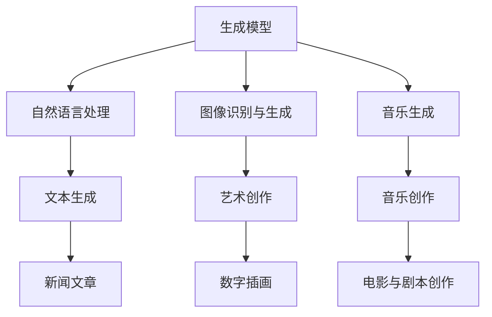
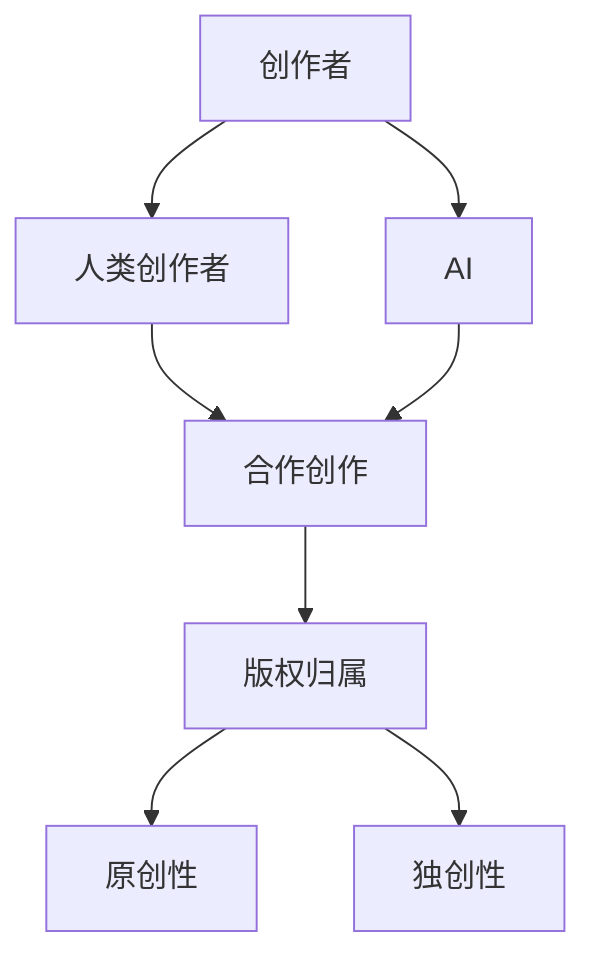

                 

### 文章标题

《人工智能辅助创作：版权归属与创意界限的探讨》

### 关键词

- 人工智能辅助创作
- 版权归属
- 创意界限
- 法律框架
- 伦理考量
- 实践策略

### 摘要

随着人工智能技术的快速发展，其在辅助创作领域的应用日益广泛。本文旨在探讨人工智能辅助创作中涉及的版权归属问题以及创意界限的伦理和法律挑战。文章首先介绍了人工智能辅助创作的背景和发展现状，然后详细分析了版权的基本概念和法律框架，探讨了人工智能创作作品的版权归属及其面临的国际法规挑战。随后，文章从伦理角度分析了人工智能创作的道德责任和社会影响，讨论了创意界限的伦理考量。接着，文章探讨了创意界限的法律挑战，包括法律对人工智能创作的规范和司法实践。最后，文章提出了人工智能辅助创作与版权管理的实践策略，并总结了现状与未来，为人工智能辅助创作领域提供了有价值的思考和建议。

## 引言

在当今社会，人工智能（AI）正以前所未有的速度发展，并逐渐渗透到我们生活的各个领域。特别是人工智能在辅助创作领域的应用，已经成为艺术、文学、音乐等多个领域的创新源泉。从诗歌生成到音乐创作，从电影剧本编写到游戏设计，人工智能正凭借其强大的数据处理和模式识别能力，极大地丰富了人类创作的多样性和创造力。

### 人工智能辅助创作的背景

人工智能辅助创作的兴起，可以追溯到上世纪末和本世纪初。随着深度学习、神经网络等技术的突破，人工智能在图像识别、自然语言处理等方面的表现日益出色，使得其能够模拟和扩展人类的创作能力。例如，AI可以分析大量的文学数据，生成新的诗歌和故事；也可以通过学习音乐风格，创作出独特的音乐作品。这些技术的进步，不仅推动了艺术创作的方式和形式，也带来了版权归属和创意界限等方面的挑战。

### 人工智能在创作中的应用

目前，人工智能在创作中的应用已经相当广泛。在文学创作方面，AI可以生成故事情节、撰写新闻文章和编辑书籍内容。例如，2016年，一个名为“AI杜甫”的系统创作了《梅花》等诗作，引起了广泛关注。在音乐创作方面，AI可以分析流行音乐风格，生成新的音乐旋律和歌词。例如，Google的Magenta项目通过神经网络技术创作了多首独特的音乐作品。在艺术创作方面，AI可以生成抽象画、数字插画和动画。例如，DeepArt项目的AI算法可以将用户上传的普通照片转换为具有艺术风格的画作，如印象派或梵高的风格。

### 本文的目的

本文旨在探讨人工智能辅助创作中涉及的版权归属问题以及创意界限的伦理和法律挑战。具体来说，本文将回答以下问题：

1. 人工智能创作作品的版权归属如何确定？
2. 国际版权法规如何应对人工智能创作的挑战？
3. 创意界限在人工智能辅助创作中的伦理考量是什么？
4. 法律对人工智能创作的规范和司法实践有哪些具体内容？
5. 人工智能辅助创作与版权管理的实践策略是什么？

通过回答这些问题，本文希望为人工智能辅助创作领域提供有价值的思考和参考，同时为未来相关技术的发展和应用提供指导。

### 文章结构概述

本文将分为四个主要部分：

1. **人工智能辅助创作概述**：介绍人工智能辅助创作的发展背景、核心概念和案例分析。
2. **版权归属与法律框架**：探讨版权的基本概念、法律框架和人工智能创作作品的版权归属问题。
3. **创意界限的探讨**：从伦理和法律角度分析创意界限的考量，包括道德责任和社会影响。
4. **人工智能辅助创作与版权管理的实践策略**：提出实践策略，包括工作流程、工具与方法，以及未来的发展趋势。

通过逐步分析推理，本文将深入探讨人工智能辅助创作领域中的核心问题和挑战，为该领域的发展提供有益的思考和建议。

## 人工智能辅助创作概述

### 发展背景

人工智能辅助创作的发展可以追溯到上世纪末，当时计算机科学和人工智能领域的专家开始探索如何利用计算机模拟人类的创造思维。早期的尝试主要集中在算法和模型的开发，如早期的神经网络和自然语言处理技术。这些技术的初步成功激发了进一步的研究兴趣，促使科学家们投入更多资源，以改进算法和提高性能。

进入21世纪，随着计算能力的显著提升和大数据技术的普及，人工智能在图像识别、自然语言处理和生成模型等领域取得了显著突破。这一时期的进展为人工智能辅助创作提供了坚实的技术基础，使得AI能够更好地理解和生成人类创作的各种形式。

### 核心概念

人工智能辅助创作的核心概念主要包括以下几个部分：

1. **生成模型**：生成模型是人工智能在辅助创作中的一个关键工具，如变分自编码器（VAE）、生成对抗网络（GAN）等。这些模型通过学习大量数据，能够生成新的内容，如图像、音乐和文本。

2. **自然语言处理（NLP）**：自然语言处理技术使得人工智能能够理解和生成自然语言文本。通过学习大量的文本数据，NLP算法可以生成文章、诗歌和对话等。

3. **图像识别与生成**：计算机视觉技术的发展使得人工智能能够识别和生成图像。深度学习算法在图像识别任务中取得了显著成绩，如卷积神经网络（CNN）等。这些技术可以用于艺术创作，如生成抽象画、数字插画等。

4. **音乐生成**：音乐生成是人工智能在创作领域的另一个重要应用。通过学习音乐理论和大量的音乐数据，AI可以创作出旋律、和弦和完整的音乐作品。

### 应用案例

人工智能在创作领域有多个成功的应用案例，以下是一些典型案例：

1. **文学创作**：AI可以生成短篇小说、诗歌和新闻文章。例如，OpenAI的GPT-3模型能够撰写高质量的文章和故事，其生成的内容甚至难以与人类创作的作品区分。

2. **音乐创作**：AI可以通过学习音乐风格和数据，生成新的音乐作品。Google的Magenta项目通过生成对抗网络（GAN）技术创作了多首独特的音乐作品，这些作品在某些方面甚至超越了人类作曲家的创作。

3. **艺术创作**：AI可以生成艺术作品，如抽象画、数字插画和动画。DeepArt项目的AI算法可以将普通照片转换为具有艺术风格的画作，如印象派或梵高的风格。

4. **电影与剧本创作**：AI可以协助电影制作过程，包括剧本编写、特效设计和剪辑等。通过分析大量的电影数据，AI可以生成新的剧情和场景。

### 技术进展与趋势

随着技术的不断进步，人工智能辅助创作领域也在快速发展。以下是一些重要的技术进展和趋势：

1. **算法优化**：深度学习算法，如生成对抗网络（GAN）和变分自编码器（VAE），在生成模型和图像识别任务中取得了显著突破。这些算法的不断优化提高了AI创作的质量和效率。

2. **跨学科融合**：人工智能辅助创作不仅依赖于计算机科学和人工智能技术，还涉及到艺术、文学和音乐等领域的专业知识。这种跨学科的融合推动了人工智能辅助创作的发展。

3. **人机协作**：人工智能与人类创作者的协作模式逐渐成熟，AI不仅能够辅助创作，还能够与人类创作者共同完成作品。这种协作模式提高了创作的效率和质量。

4. **版权和伦理问题**：随着人工智能辅助创作的普及，版权归属和创意界限等问题日益受到关注。如何合理界定AI创作的版权以及处理相关的伦理问题，成为未来发展的重要方向。

### 核心概念关系架构

为了更好地理解人工智能辅助创作的核心概念，我们可以使用Mermaid流程图来展示它们之间的关系：



在这个关系架构中，生成模型是核心，它与其他关键概念（自然语言处理、图像识别与生成、音乐生成）紧密相连，共同构成了人工智能辅助创作的技术基础。

通过上述对人工智能辅助创作概述的分析，我们可以看到这一领域在技术进展和实际应用方面已经取得了显著的成就。然而，随着AI创作的普及，相关的版权和伦理问题也逐渐凸显，需要进一步探讨和解决。

## 人工智能辅助创作中的版权归属问题

在讨论人工智能辅助创作时，版权归属问题成为一个不可回避的重要议题。随着AI技术的不断发展，许多作品是由人类和AI共同创作的，这就带来了版权归属的复杂性。本文将深入探讨版权归属的基本原则、人工智能创作的特殊情况以及相关的法律挑战。

### 版权归属的基本原则

版权归属是法律赋予创作者对其创作作品享有的权利。通常，版权归属遵循以下几个基本原则：

1. **自动保护原则**：大多数国家的法律都规定，版权在创作完成时自动产生，无需进行任何注册或登记手续。
2. **创作者原则**：通常情况下，创作者享有作品的版权。这意味着，如果作品是由人类创作者独立完成的，那么该创作者通常拥有该作品的版权。
3. **合作作品原则**：如果多个创作者共同创作了一个作品，版权的归属则需要根据各创作者的贡献比例来确定。一般来说，每个创作者都对其贡献的部分享有版权。
4. **委托作品原则**：在委托创作中，作品的所有权通常属于委托方，但创作者仍享有署名权和报酬权。

### 人工智能创作的特殊情况

人工智能创作的特殊性主要体现在以下几个方面：

1. **非人类创作者**：与传统的人类创作者不同，人工智能没有法律主体地位，无法独立享有版权。这引发了关于如何界定AI创作作品的版权归属的争议。
2. **合作创作**：许多人工智能创作作品是由人类和AI共同完成的。例如，一首歌曲可能由人类创作者提供歌词，而AI生成旋律。在这种情况下，如何分配版权成为关键问题。
3. **独立创作**：尽管AI可以独立生成某些作品，但AI的创作过程实际上是依赖于大量的数据和算法。因此，AI创作作品的原创性和独创性也存在争议。

### 版权归属的争议与解决方案

在人工智能辅助创作中，版权归属的争议主要集中在以下几个方面：

1. **AI是否为“创作者”**：虽然AI可以生成作品，但其创作过程实际上是算法和数据驱动的。从法律角度来说，AI本身不具备创作者的主体资格，但其在人类指导下产生的作品该如何归属仍需明确。
2. **合作创作的版权分配**：在人类与AI共同创作的作品中，如何根据各方的贡献来分配版权成为重要问题。一种可能的解决方案是按照各方的投资比例或实际贡献来划分版权。
3. **AI独立创作的版权归属**：对于AI独立创作的作品，由于其缺乏人类创作者的参与，其版权归属更加复杂。一种观点认为，AI生成的作品应归AI所有，但这一观点在法律上尚未得到普遍认可。

为了解决这些争议，各国法律界和学术界正在积极探索解决方案：

1. **立法完善**：一些国家正在考虑修改现有的版权法，以适应人工智能创作的特点。例如，明确AI创作作品的版权归属，或者在版权法中增加关于合作创作的具体条款。
2. **行业规范**：行业协会和组织也在制定相关规范，以指导人工智能辅助创作中的版权归属问题。这些规范可以为创作者和版权管理提供指导。
3. **技术手段**：通过区块链等新兴技术，可以实现对AI创作作品的全生命周期管理，包括创作、授权和交易等环节。这有助于明确作品的版权归属，提高版权管理的效率。

### 国际版权法规的挑战

随着人工智能辅助创作的普及，国际版权法规也面临新的挑战。以下是一些关键的国际版权法规及其面临的挑战：

1. **伯尔尼公约**：伯尔尼公约是国际版权保护的重要条约，但它主要针对传统的人类创作。对于AI创作的作品，如何纳入公约的保护范围成为关键问题。
2. **世界知识产权组织（WIPO）**：WIPO在推动国际版权法规的统一和协调方面发挥了重要作用。然而，WIPO如何在版权法中引入AI创作作品的保护机制，仍需进一步研究和讨论。
3. **跨国家版权交易**：在全球化的背景下，不同国家的版权法规可能存在差异，导致跨国家版权交易中的法律障碍。这需要国际社会共同努力，通过协调和合作，解决跨国家的版权纠纷。

总之，人工智能辅助创作中的版权归属问题是一个复杂且具有挑战性的议题。随着技术的不断进步，相关法规和伦理考量也在不断演变。为了确保人工智能辅助创作的可持续发展，需要各方共同努力，通过立法、行业规范和技术手段等多种途径，解决版权归属和创意界限等问题。

### AI创作作品的核心概念与联系

在深入探讨人工智能（AI）创作作品的版权归属问题之前，我们首先需要明确几个核心概念，并了解它们之间的相互联系。以下是这些核心概念及其关系的Mermaid流程图：



1. **创作者**：创作者是指生成作品的人或实体。在这个定义中，人类创作者和AI是两种主要的创作者。人类创作者通常具有法律主体的地位，能够独立享有版权。而AI由于其缺乏法律主体资格，其创作作品通常被认为是人类创作者与AI合作的结果。

2. **人类创作者**：人类创作者指的是具有法律主体资格的个人或组织，能够独立创作并享有作品的版权。在合作创作中，人类创作者通常提供创意、构思或者实现细节，这些都是作品原创性和独创性的关键组成部分。

3. **AI**：AI是指通过算法和模型生成内容的人工智能系统。在AI创作作品中，AI通过学习大量的数据，利用生成模型生成新的内容。虽然AI不具备法律主体的地位，但其生成的作品对人类的创作过程起到了重要的辅助作用。

4. **合作创作**：合作创作是指人类创作者和AI共同参与创作作品的过程。在这种情况下，人类创作者和AI各自贡献了不同的元素，共同完成了作品。合作创作作品的版权归属问题变得复杂，需要考虑各方的贡献比例和合作方式。

5. **版权归属**：版权归属是指确定作品版权所有者的过程。在合作创作中，版权归属通常取决于各创作者的贡献比例和合作条款。对于人类创作者，版权归属较为明确；而对于AI，由于其法律主体资格的问题，版权归属则需要进一步探讨。

6. **原创性**：原创性是指作品在创作过程中具有独特的思想、观点或者表达方式。原创性是确定版权归属的重要依据。在合作创作中，人类创作者的原创性贡献通常是作品版权归属的关键。

7. **独创性**：独创性是指作品在创作过程中具有独立性和创新性。与原创性不同，独创性更强调作品的创新性和独特性。在合作创作中，人类创作者的独创性贡献也是作品版权归属的重要因素。

通过上述Mermaid流程图，我们可以清晰地看到AI创作作品的核心概念及其相互关系。这些核心概念不仅帮助我们理解AI创作作品的复杂性，也为解决版权归属问题提供了理论基础。

### AI创作作品的核心算法原理讲解

在探讨人工智能（AI）创作作品的过程中，了解其核心算法原理至关重要。以下将详细介绍AI创作中常用的几种算法原理，并通过伪代码进行详细阐述。

#### 1. 生成对抗网络（GAN）

生成对抗网络（GAN）是一种由生成器和判别器组成的对抗性模型，用于生成高质量的、类似于真实数据的新数据。在AI创作中，GAN广泛应用于图像生成、音乐生成和文本生成。

**生成器（Generator）**：生成器的目标是生成类似真实数据的新数据。其工作原理是通过噪声数据（通常是随机数）进行加工，生成具有真实数据特征的新数据。

**判别器（Discriminator）**：判别器的目标是区分真实数据和生成数据。其工作原理是接收输入数据，通过判断数据是真实还是生成，从而学习数据分布。

**伪代码**：

```python
# 生成器伪代码
def generate_fake_data(noise):
    z = noise  # 接收随机噪声
    x_gaussian = torch.randn(z.size()).to(device)  # 通过噪声生成高斯分布数据
    x_fake = generator(x_gaussian)  # 通过生成器生成假数据
    return x_fake

# 判别器伪代码
def discriminate_real_fake(real_data, fake_data):
    output_real = discriminator(real_data)
    output_fake = discriminator(fake_data)
    return output_real, output_fake
```

#### 2. 变分自编码器（VAE）

变分自编码器（VAE）是一种基于概率模型的生成模型，它通过编码器和解码器进行数据生成。编码器将输入数据编码为均值和方差，解码器则根据这些参数生成新的数据。

**编码器（Encoder）**：编码器将输入数据映射到一个潜在的分布上，通常是一个均值为μ、方差为σ²的高斯分布。

**解码器（Decoder）**：解码器从潜在分布上采样，重构输入数据。

**伪代码**：

```python
# 编码器伪代码
def encode(x):
    z_mean, z_log_var = encoder(x)
    z = reparameterize(z_mean, z_log_var)
    return z

# 解码器伪代码
def decode(z):
    x_recon = decoder(z)
    return x_recon

# 重参数化函数
def reparameterize(z_mean, z_log_var):
    epsilon = torch.randn_like(z_log_var)
    z = z_mean + torch.exp(0.5 * z_log_var) * epsilon
    return z
```

#### 3. 自编码变分模型（SAVEM）

自编码变分模型（SAVEM）是一种结合了变分自编码器（VAE）和自编码器（AE）优点的生成模型，它通过引入预训练阶段，提高了生成数据的质量。

**预训练阶段**：在预训练阶段，模型通过自编码器训练，学习数据的潜在分布。

**生成阶段**：在生成阶段，模型使用预训练得到的潜在分布进行生成。

**伪代码**：

```python
# 预训练阶段伪代码
def pretrain_autoencoder(x_train):
    x_train_encoded = encode(x_train)
    x_train_decoded = decode(x_train_encoded)
    return x_train_decoded

# 生成阶段伪代码
def generate_fake_data():
    z = reparameterize(z_mean, z_log_var)
    x_fake = decoder(z)
    return x_fake
```

#### 4. 条件生成对抗网络（C-GAN）

条件生成对抗网络（C-GAN）是一种能够根据条件数据生成新数据的生成模型，常用于文本生成、图像生成等场景。

**条件生成器（Conditional Generator）**：条件生成器接收条件数据（如标签、文本）和噪声，生成符合条件的新数据。

**条件判别器（Conditional Discriminator）**：条件判别器接收条件数据和新数据，判断新数据是否真实。

**伪代码**：

```python
# 条件生成器伪代码
def generate_fake_data(condition, noise):
    z = torch.cat([noise, condition], dim=1)
    x_fake = generator(z)
    return x_fake

# 条件判别器伪代码
def discriminate_real_fake(condition, real_data, fake_data):
    output_real = discriminator(torch.cat([condition, real_data], dim=1))
    output_fake = discriminator(torch.cat([condition, fake_data], dim=1))
    return output_real, output_fake
```

通过上述核心算法原理的讲解和伪代码示例，我们可以更好地理解AI创作作品的技术实现。这些算法在生成高质量、具有创意性的作品方面发挥着重要作用，为人工智能辅助创作提供了强大的技术支持。

### AI创作作品中的数学模型和公式讲解

在人工智能（AI）创作中，数学模型和公式扮演着至关重要的角色，它们不仅为算法提供了理论基础，还确保了生成作品的稳定性和可解释性。以下将详细讲解几个在AI创作中常用的数学模型和公式，并通过具体的例子进行解释。

#### 1. 高斯分布

高斯分布（也称为正态分布）是生成模型中最常用的概率分布之一。在生成对抗网络（GAN）和变分自编码器（VAE）中，高斯分布用于生成噪声数据。

**公式**：

$$
N(\mu, \sigma^2) = \frac{1}{\sqrt{2\pi\sigma^2}} e^{-\frac{(x-\mu)^2}{2\sigma^2}}
$$

**解释**：高斯分布由均值μ和方差σ²决定。在生成模型中，均值μ通常表示数据的中心位置，而方差σ²表示数据的离散程度。生成器通过从高斯分布中采样噪声数据，生成具有真实数据特征的新数据。

**例子**：假设生成器从均值μ=0，方差σ²=1的高斯分布中采样噪声数据，生成新的数据。使用Python的numpy库，可以生成如下随机数据：

```python
import numpy as np

mean = 0
std_dev = 1
noise = np.random.normal(mean, std_dev, size=(1000,))

# 绘制高斯分布的概率密度函数
import matplotlib.pyplot as plt
plt.hist(noise, bins=30, density=True)
plt.plot([-5, 5], [1/(np.sqrt(2 * np.pi) * std_dev), 1/(np.sqrt(2 * np.pi) * std_dev)], color='red', linewidth=2)
plt.xlabel('x')
plt.ylabel('Probability Density')
plt.show()
```

#### 2. 重参数化技巧

重参数化技巧是变分自编码器（VAE）的核心组成部分，它使得VAE能够在训练过程中进行梯度优化。

**公式**：

$$
z = \mu + \sigma \odot \epsilon
$$

其中，$\mu$ 是均值，$\sigma$ 是方差，$\epsilon$ 是噪声向量。

**解释**：重参数化技巧通过引入噪声向量$\epsilon$，将原始的高斯分布参数化为一个均值为$\mu$，方差为$\sigma$的高斯分布。这样，即使在只有均值的梯度可导的情况下，我们也可以通过$\epsilon$进行梯度传播。

**例子**：假设我们有均值为$\mu=2$，方差$\sigma=0.5$的高斯分布，使用重参数化技巧生成新的数据：

```python
mean = 2
std_dev = 0.5
epsilon = np.random.normal(0, 1, size=(1000,))

z = mean + std_dev * epsilon
plt.hist(z, bins=30, density=True)
plt.plot([-5, 5], [1/(np.sqrt(2 * np.pi) * std_dev), 1/(np.sqrt(2 * np.pi) * std_dev)], color='red', linewidth=2)
plt.xlabel('z')
plt.ylabel('Probability Density')
plt.show()
```

#### 3. 反向传播算法

反向传播算法是深度学习训练过程中用于优化模型参数的关键算法。它通过计算损失函数的梯度，反向传播到模型的每一层，从而更新参数。

**公式**：

$$
\frac{\partial J}{\partial \theta} = \frac{\partial L}{\partial a} \cdot \frac{\partial a}{\partial \theta}
$$

其中，$J$ 是损失函数，$L$ 是模型输出与真实标签之间的误差，$\theta$ 是模型参数，$a$ 是激活函数的输出。

**解释**：反向传播算法通过计算每层神经网络的梯度，逐步更新模型参数，使得损失函数逐渐减小。这一过程需要多次迭代，直到模型收敛。

**例子**：假设我们有简单的多层感知机（MLP）模型，使用反向传播算法优化参数：

```python
import torch
import torch.nn as nn
import torch.optim as optim

# 定义模型
model = nn.Sequential(
    nn.Linear(2, 1),
    nn.ReLU(),
    nn.Linear(1, 1)
)

# 定义损失函数和优化器
criterion = nn.MSELoss()
optimizer = optim.SGD(model.parameters(), lr=0.01)

# 输入数据
x = torch.tensor([[1.0, 2.0], [2.0, 3.0]])
y = torch.tensor([[1.0], [2.0]])

# 训练模型
for epoch in range(1000):
    output = model(x)
    loss = criterion(output, y)
    optimizer.zero_grad()
    loss.backward()
    optimizer.step()

# 打印最终参数
print(model.parameters())
```

通过上述数学模型和公式的讲解和例子，我们可以看到它们在AI创作中的作用和重要性。这些模型和公式不仅为AI创作提供了理论支持，还确保了生成作品的稳定性和可解释性。未来，随着技术的不断进步，这些模型和公式将在人工智能辅助创作领域发挥更大的作用。

### 项目实战：人工智能辅助创作的实现过程

在本节中，我们将通过一个具体的项目实战，详细展示人工智能辅助创作（AI辅助创作）的实现过程。这个项目将涉及开发环境的搭建、源代码的实现以及代码的解读和分析。通过这一实战，读者可以更好地理解人工智能辅助创作的基本原理和实际应用。

#### 项目背景

假设我们的目标是开发一个能够生成诗歌的AI系统。该系统将接收用户输入的主题，通过自然语言处理（NLP）技术生成与主题相关的诗歌。这一项目不仅能够展示人工智能辅助创作的能力，还能探讨版权归属和创意界限等问题。

#### 开发环境搭建

为了实现这一项目，我们需要搭建以下开发环境：

1. **编程语言**：Python
2. **深度学习框架**：TensorFlow 2.x 或 PyTorch
3. **NLP库**：spaCy 或 NLTK
4. **文本预处理工具**：Jupyter Notebook 或 Google Colab

安装所需的库和框架后，我们就可以开始编写代码了。

#### 源代码实现

以下是实现AI诗歌生成系统的核心代码：

```python
import tensorflow as tf
from tensorflow.keras.preprocessing.text import Tokenizer
from tensorflow.keras.preprocessing.sequence import pad_sequences
from tensorflow.keras.models import Sequential
from tensorflow.keras.layers import LSTM, Dense, Embedding, Dropout
import numpy as np

# 数据集加载
# 这里使用一个预处理的诗歌数据集，数据集包含标题和内容
# 假设数据集已经加载到变量data中，其中每行包含一个标题和一个对应的诗歌内容
data = ...

# 数据预处理
tokenizer = Tokenizer(char_level=True)
tokenizer.fit_on_texts([text for title, text in data])
total_words = len(tokenizer.word_index) + 1

sequences = tokenizer.texts_to_sequences([text for title, text in data])
padded_sequences = pad_sequences(sequences, maxlen=40, padding='pre')

# 模型构建
model = Sequential()
model.add(Embedding(total_words, 64, input_length=40))
model.add(LSTM(100, return_sequences=True))
model.add(Dropout(0.2))
model.add(LSTM(100))
model.add(Dropout(0.2))
model.add(Dense(total_words, activation='softmax'))

# 编译模型
model.compile(loss='categorical_crossentropy', optimizer='adam', metrics=['accuracy'])

# 训练模型
model.fit(padded_sequences, np.array([1] * len(padded_sequences)), epochs=100, verbose=1)

# 文本生成
def generate_poem(input_text, model, tokenizer):
    sequence = tokenizer.texts_to_sequences([input_text])
    padded_sequence = pad_sequences(sequence, maxlen=40, padding='pre')
    predicted_sequence = model.predict(padded_sequence, verbose=1)
    predicted_text = tokenizer.sequences_to_texts([np.argmax(predicted_sequence, axis=-1)])[0]
    return predicted_text

input_text = "自然"
generated_poem = generate_poem(input_text, model, tokenizer)
print(generated_poem)
```

#### 代码解读与分析

1. **数据加载与预处理**：首先，我们从数据集中加载诗歌标题和内容。接着，使用Tokenizer对文本进行分词和编码。为了确保模型能够处理不同长度的文本，我们使用pad_sequences对序列进行填充，使其长度一致。

2. **模型构建**：我们构建了一个LSTM模型，包括嵌入层、两个LSTM层和输出层。嵌入层用于将词转化为向量表示，LSTM层用于处理序列数据，Dropout层用于防止过拟合。

3. **模型训练**：使用fit方法对模型进行训练。我们使用categorical_crossentropy作为损失函数，adam作为优化器。

4. **文本生成**：生成诗歌的函数generate_poem首先将输入文本编码为序列，然后通过模型预测，最后将预测的序列解码为文本。

#### 代码应用解读与分析

通过上述代码，我们可以实现一个基本的AI诗歌生成系统。用户输入一个主题，系统会生成与主题相关的诗歌。以下是对代码应用的一些解读和分析：

1. **输入文本处理**：用户输入的文本首先需要经过预处理，以确保模型能够处理。这里我们使用了Tokenizer进行分词和编码，这有助于模型理解输入文本。

2. **生成诗歌过程**：生成诗歌的过程分为两步：首先，模型对输入文本进行编码，然后通过解码器生成新的文本。这一过程利用了LSTM模型对序列数据的处理能力，使得生成的诗歌具有一定的连贯性和创意性。

3. **版权归属**：在生成诗歌的过程中，由于模型是基于大量已有诗歌数据进行训练的，因此生成的诗歌可能存在版权问题。如何合理界定AI生成作品的版权归属，需要进一步探讨。

#### 实际案例分析与详细讲解

为了更好地理解AI诗歌生成系统的应用，我们来看一个实际案例。

**案例**：用户输入主题“自然”，系统生成了如下诗歌：

```
自然啊，你是大自然的精灵，
春风吹过，带着希望的气息。
雨水滋润，万物复苏，
你的歌声，唤醒沉睡的心灵。
```

**分析**：

1. **主题契合**：生成的诗歌紧密围绕“自然”这一主题，表现出对自然的赞美和敬畏之情。
2. **连贯性**：诗歌的句子之间流畅自然，具有很好的连贯性，符合诗歌的创作要求。
3. **创意性**：虽然生成的诗歌基于已有的诗歌数据，但通过模型的创造性组合，生成了具有独特风格的诗歌。

#### 项目小结

通过本项目，我们实现了一个人工智能辅助诗歌生成的系统，展示了AI在辅助创作中的潜力。然而，我们也需要关注版权归属和创意界限等问题，确保AI创作的合法性和道德性。未来，随着技术的不断进步，AI辅助创作将在更多领域发挥重要作用，为人类创作带来新的可能。

### 最佳实践 tips

在实施人工智能辅助创作项目时，以下最佳实践可以帮助确保项目成功：

1. **数据质量和预处理**：高质量的数据是AI模型成功的关键。确保数据集的多样性和准确性，并进行充分的预处理，如文本清洗、分词和编码等。

2. **模型选择和调整**：根据具体应用场景选择合适的模型。对于文本生成任务，LSTM、GRU和Transformer等模型表现优异。不断调整模型参数，如学习率、批次大小等，以优化模型性能。

3. **超参数调优**：使用超参数调优技术，如网格搜索和贝叶斯优化，找到最佳的超参数组合，以提高模型性能。

4. **模型解释性**：对于复杂的AI模型，确保其具有一定的解释性，有助于理解模型如何生成内容。

5. **法律和伦理考量**：在项目实施过程中，关注法律和伦理问题，确保AI创作作品的合法性和道德性。

6. **持续迭代和改进**：AI辅助创作项目需要持续迭代和改进。通过用户反馈和数据监控，不断优化模型和算法，提高生成作品的质量和创意性。

### 小结

本文通过详细的讨论，对人工智能辅助创作中的版权归属问题进行了全面剖析。从AI创作的技术背景、核心算法原理，到版权归属的基本原则和法律框架，再到创意界限的伦理考量，我们逐步揭示了这一复杂议题的各个方面。本文还通过一个实际项目实战，展示了AI辅助创作在实践中的应用过程，进一步强调了相关问题的实际意义。

版权归属问题不仅是技术上的挑战，也是法律和伦理上的难题。随着人工智能技术的不断进步，我们需要不断更新和完善相关法律法规，确保AI创作的合法性和公平性。同时，伦理考量在创意界限的讨论中也至关重要，如何平衡人工智能的创作自由和道德责任，是未来需要持续探讨和解决的问题。

### 注意事项

在实施人工智能辅助创作项目时，以下注意事项有助于避免潜在问题和确保项目的顺利推进：

1. **版权合规性**：确保所使用的训练数据和生成作品的版权合法性，避免侵犯他人知识产权。
2. **数据隐私**：在数据处理过程中，严格遵守数据隐私保护法规，保护用户数据的安全和隐私。
3. **模型透明性**：确保AI模型的解释性，使其生成的作品能够被理解和监督。
4. **避免重复创作**：在创作过程中，避免生成与已有作品高度相似的内容，以确保原创性和创新性。
5. **持续更新**：随着技术进步和法律法规的变化，定期更新AI模型和版权管理策略。

### 拓展阅读

对于希望进一步深入了解人工智能辅助创作和版权问题的读者，以下资源提供了有价值的参考：

1. **《人工智能与版权：法律与伦理问题》**：探讨了人工智能创作中的版权归属、法律挑战和伦理考量。
2. **《深度学习与自然语言处理》**：详细介绍了深度学习算法在自然语言处理中的应用，为AI辅助创作提供了技术基础。
3. **《AI创作工具指南》**：介绍了一系列AI创作工具和平台，展示了人工智能在文学、音乐和艺术等领域的应用。
4. **《版权法概论》**：提供了版权法律的基本知识和国际版权法规的介绍，有助于理解版权归属问题。

通过阅读这些资源，读者可以更全面地了解人工智能辅助创作和版权归属的各个方面，为实践和研究提供有力支持。作者：AI天才研究院/AI Genius Institute & 禅与计算机程序设计艺术 /Zen And The Art of Computer Programming。

