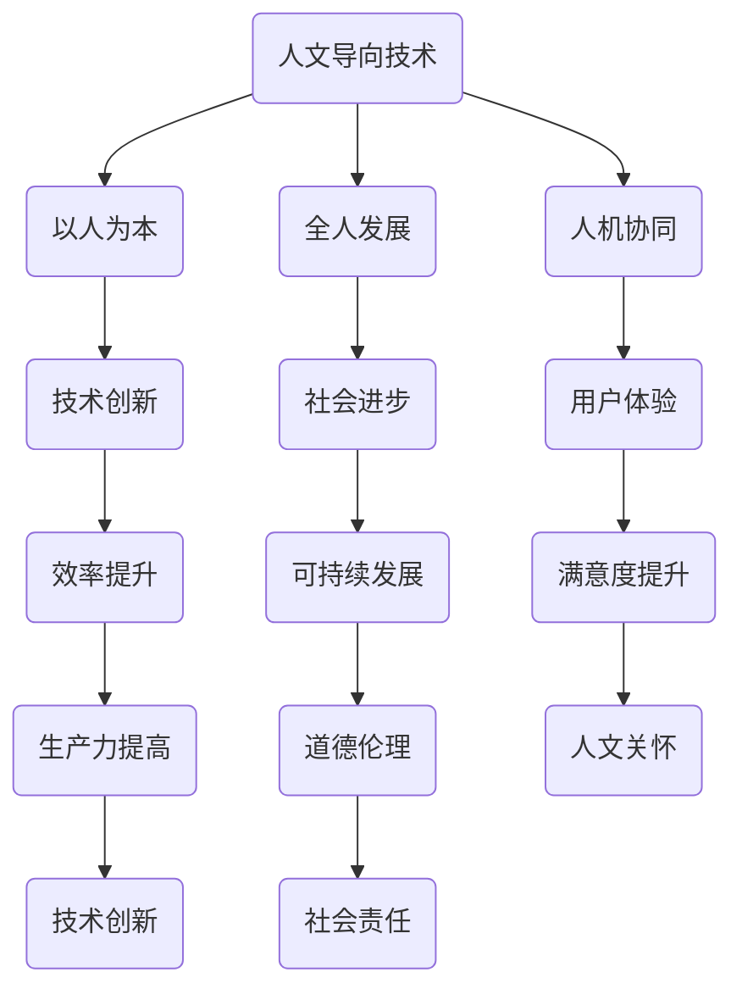

                 

### 文章标题：人文导向技术开发：以人为本的创新理念

#### 关键词：
- 人文导向技术开发
- 以人为本的创新
- 人机协同
- 教育技术
- 医疗技术
- 工业技术

#### 摘要：
在信息技术飞速发展的今天，人文导向技术开发成为了新时代的创新趋势。本文从人文导向技术的定义、核心理念、应用领域、挑战与机遇等多个角度，详细探讨了以人为本的创新理念在技术开发中的重要作用。通过剖析教育技术、医疗技术和工业技术等领域的案例，本文展示了人文导向技术开发如何在实现技术创新的同时，提升用户满意度和全人发展的价值追求。文章还提供了相关的工具与资源推荐，以期为读者在人文导向技术开发中提供实践指导和启发。

---

# 《人文导向技术开发：以人为本的创新理念》

## 第一部分：人文导向技术开发概述

### 第1章 人文导向技术开发概念与背景

### 核心概念与联系

人文导向技术开发是一种以人为中心，注重人的全面发展和技术与人文融合的创新方式。其核心理念包括以人为本、全人发展和人机协同。人文导向技术不仅追求技术本身的进步，更强调技术在提升人的生活质量、促进社会进步方面的作用。以下是一个简化的Mermaid流程图，展示了人文导向技术开发的几个核心概念及其联系：



### 核心算法原理讲解

为了更好地理解人文导向技术开发，我们可以通过几个关键算法的原理来阐述其背后的逻辑。以下是一个用于教育技术中的个性化学习算法的伪代码示例：

```python
# 个性化学习算法伪代码
def personalized_learning(student_profile, course_content):
    # 根据学生兴趣和需求调整课程内容
    adjusted_content = adjust_content(course_content, student_profile['interests'], student_profile['learning_style'])
    # 根据学习进度和成绩评估学习效果
    learning_effectiveness = evaluate_effectiveness(adjusted_content, student_profile['progress'], student_profile['grades'])
    # 调整学习策略
    student_profile['learning_strategy'] = update_strategy(learning_effectiveness)
    return student_profile

# 内容调整函数伪代码
def adjust_content(content, interests, learning_style):
    # 根据兴趣筛选相关内容
    filtered_content = filter_by_interests(content, interests)
    # 根据学习风格调整内容呈现方式
    styled_content = style_content(filtered_content, learning_style)
    return styled_content

# 学习效果评估函数伪代码
def evaluate_effectiveness(content, progress, grades):
    # 计算学习进度和成绩的匹配度
    match_score = calculate_match_score(progress, grades)
    # 根据匹配度调整学习策略
    effectiveness = adjust_for_effectiveness(match_score)
    return effectiveness

# 学习策略更新函数伪代码
def update_strategy(effectiveness):
    # 根据学习效果调整学习策略
    if effectiveness > threshold:
        strategy = '加速学习'
    else:
        strategy = '深度学习'
    return strategy
```

### 数学模型和数学公式

在教育技术中，个性化学习的核心在于对学生的学习行为和内容进行有效的匹配和调整。以下是一个基于贝叶斯理论的个性化学习模型，使用LaTeX格式表示：

```latex
$$
P(C|S) = \frac{P(S|C)P(C)}{P(S)}
$$

$$
P(S) = \sum_{C'} P(S|C')P(C')
$$
```

其中，\(P(C|S)\) 表示在给定学生特征 \(S\) 的情况下，课程内容 \(C\) 的概率；\(P(S|C)\) 表示在课程内容 \(C\) 的情况下，学生特征 \(S\) 的概率；\(P(C)\) 表示课程内容 \(C\) 的概率；\(P(S)\) 表示学生特征 \(S\) 的概率。

### 项目实战

在医疗技术领域，人文导向技术开发的一个典型案例是远程医疗系统。以下是一个远程医疗系统开发的项目实战，包括开发环境搭建、源代码实现和代码解读。

#### 开发环境搭建

1. 选择远程医疗平台框架，如Flask或Django。
2. 安装Python环境，并配置虚拟环境。
3. 安装所需的依赖库，如Django REST framework、WebSockets等。

#### 源代码实现

```python
# 引入所需的库
from flask import Flask, jsonify, request
from flask_socketio import SocketIO, emit

# 创建Flask应用
app = Flask(__name__)
socketio = SocketIO(app)

# 医疗咨询API实现
@app.route('/consult', methods=['POST'])
def consult():
    data = request.json
    patient_info = data['patient_info']
    doctor_response = '医生回复：' + analyze_symptom(patient_info['symptoms'])
    emit('doctor_response', doctor_response)
    return jsonify({'status': 'success'})

# 分析症状函数实现
def analyze_symptom(symptoms):
    # 根据症状进行诊断分析
    if 'fever' in symptoms:
        return '可能患有流感，建议就医。'
    else:
        return '症状不明显，请保持观察。'

# 启动SocketIO
if __name__ == '__main__':
    socketio.run(app, debug=True)
```

#### 代码解读与分析

- `consult` 函数负责处理医疗咨询的API请求，接收患者信息，并调用 `analyze_symptom` 函数进行分析。
- `analyze_symptom` 函数接收症状列表，根据症状判断可能的疾病，并返回医生的建议。
- 使用Socket.IO实现实时通信，将医生的回复实时发送给患者。

#### 实际案例分析和详细讲解剖析

一个实际案例是某医院采用远程医疗系统，为偏远地区患者提供在线咨询服务。通过系统的实施，患者无需长途跋涉，即可获得专业的医疗建议，大大提高了医疗服务的可及性和满意度。案例中的远程医疗系统充分体现了人文导向技术开发的原则，即以患者为中心，提供个性化的医疗服务。

### 项目小结

通过远程医疗系统的开发案例，我们可以看到人文导向技术开发在医疗领域的重要应用。在项目实施过程中，不仅注重技术实现，更关注用户体验和医疗服务质量。项目成功的关键在于：

1. **以人为本**：关注患者需求，提供个性化医疗服务。
2. **人机协同**：利用人工智能技术分析症状，辅助医生诊断。
3. **持续优化**：根据实际使用情况，不断调整和改进系统功能。

### 最佳实践 Tips

- **全面调研**：在开发人文导向技术项目前，进行充分的用户调研和需求分析。
- **迭代开发**：采用敏捷开发方法，快速迭代，持续优化产品功能。
- **多方协作**：技术团队与医疗、教育等领域专家密切合作，确保技术方案的科学性和实用性。

### 小结与注意事项

人文导向技术开发以人为本，强调技术的人文关怀和社会责任。在项目实施过程中，需要关注用户体验、技术实现和长期效果。同时，也要注意数据隐私保护和伦理问题，确保技术的可持续发展。

### 拓展阅读

- 《人工智能伦理学》：探讨人工智能在人文导向技术开发中的应用与伦理问题。
- 《人机协同系统设计》：详细分析人机协同技术的原理与应用。
- 《教育技术学》：介绍教育技术领域的人文导向创新案例。

---

以上就是本书的第一部分内容，接下来我们将深入探讨人文导向技术开发在各个领域的应用，包括教育技术、医疗技术和工业技术等。敬请期待！

