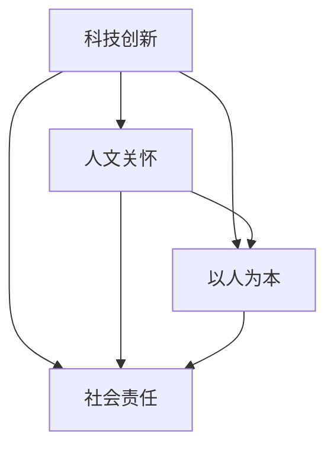

                 

### 引言

在当今这个数字化时代，科技创新成为了推动社会进步的重要动力。然而，随着科技的迅猛发展，人们逐渐意识到单纯追求技术上的突破并不足以解决所有问题。在人工智能、大数据、物联网等前沿技术的广泛应用中，如何确保科技创新真正服务于人类的福祉，成为了亟待解决的重要课题。因此，人文导向的科技创新理念应运而生，它强调将人文关怀融入到科技研发的全过程，以人为本，实现技术进步与社会发展的和谐统一。

人文导向的科技创新不仅仅是对技术本身的追求，更是一种对人类本质的理解和尊重。它倡导在研发过程中充分考虑人的需求、情感、伦理和社会影响，确保科技的发展既能够满足效率与便捷，又能够保护人类的尊严与自由。本文将从以下几个方面展开探讨：

1. **背景介绍**：介绍人文导向科技创新的起源、发展及其在现代社会中的重要地位。
2. **核心概念与联系**：阐述人文导向科技创新中的核心概念，并使用Mermaid流程图展示它们之间的相互关系。
3. **以人为本的研发理念**：分析以人为本的研发理念，包括用户研究、需求分析、设计思维等具体方法。
4. **数学模型与算法原理讲解**：详细讲解相关的数学模型和算法原理，并使用伪代码进行阐述。
5. **项目实战**：通过具体的项目实战案例，展示人文导向科技创新的实际应用。
6. **未来展望**：探讨人文导向科技创新的未来发展趋势和潜在挑战。

通过以上内容的详细分析和探讨，本文旨在为读者提供一个全面而深入的了解，帮助他们在科技创新的道路上更好地践行人文导向的理念。让我们一起走进这个充满机遇与挑战的领域，探索人文导向科技创新的魅力所在。

### 关键词

- **人文导向的科技创新**：将人文关怀融入科技研发的过程，以人为本，推动技术进步与社会发展的和谐统一。
- **以人为本的研发理念**：强调在研发过程中充分考虑人的需求、情感、伦理和社会影响。
- **用户研究**：通过了解用户行为和需求，为产品设计提供科学依据。
- **设计思维**：一种创新性的解决问题的方法，强调用户需求、迭代和实验。
- **数学模型与算法原理**：用于分析和解决复杂问题的工具，包括线性回归、决策树等。
- **项目实战**：通过实际项目案例，验证人文导向科技创新的理论和实践效果。
- **未来展望**：探讨人文导向科技创新的未来发展趋势和潜在挑战。

### 摘要

本文旨在探讨人文导向的科技创新，通过将人文关怀融入科技研发的全过程，实现技术进步与社会发展的和谐统一。文章首先介绍了人文导向科技创新的背景和发展，随后阐述了核心概念及其相互关系，并使用Mermaid流程图进行了详细展示。接着，文章深入分析了以人为本的研发理念，包括用户研究、需求分析和设计思维等方法。在此基础上，文章详细讲解了相关的数学模型和算法原理，并通过伪代码进行阐述。随后，通过具体项目实战案例，展示了人文导向科技创新的实际应用。最后，文章探讨了人文导向科技创新的未来发展趋势和潜在挑战，为读者提供了全面的思考和启示。

## 背景介绍

人文导向的科技创新并非一朝一夕之事，而是随着社会、文化和科技发展的不断演进逐步形成的。其起源可以追溯到20世纪末至21世纪初，当时科技革命迅速推进，人工智能、大数据、物联网等前沿技术相继涌现，为社会带来了前所未有的变革和机遇。然而，早期的科技发展主要集中在提高效率和突破技术瓶颈上，忽视了人类在科技应用中的核心地位。

这一现象引发了一些学者和科技工作者的反思，他们意识到单纯追求技术上的突破并不能解决所有问题，尤其是在涉及伦理和社会影响时。于是，人文导向的科技创新理念应运而生，它提倡将人文关怀融入到科技研发的每一个环节，确保科技创新不仅服务于效率提升，更关注人类的需求、情感和社会福祉。

人文导向的科技创新在现代社会中具有重要地位。首先，它为科技发展注入了更多的人文关怀，使科技不再只是冰冷的机器和代码，而是更加贴近人类的生活和需求。其次，它强调了科技与伦理、社会责任的有机结合，有助于规避因科技滥用而带来的潜在风险。最后，它推动了技术进步与社会发展的和谐统一，使科技真正成为促进社会进步和人类福祉的有力工具。

人文导向的科技创新不仅是一种理念，更是一种实践。通过将人文关怀融入到研发过程中，科技工作者可以更加深入地了解用户需求，设计出更加人性化、实用的产品和服务。同时，这种理念也促进了跨学科的合作与交流，使得科技研究不仅局限于技术本身，更涉及到社会学、心理学、伦理学等多个领域，从而形成了一个多元化、综合性的研究体系。

总之，人文导向的科技创新是现代社会发展的必然趋势，它不仅为科技发展提供了新的思路和方法，也为人类社会带来了更加美好的未来。在接下来的部分中，本文将深入探讨人文导向科技创新的核心概念和联系，以及具体的研发方法和技术原理。

## 核心概念与联系

在人文导向的科技创新中，几个核心概念扮演着至关重要的角色。这些核心概念不仅相互关联，而且在科技创新的过程中共同发挥着作用。以下是这些核心概念及其相互关系的详细解释，并使用Mermaid流程图进行展示。

### 1. 科技创新

科技创新是人文导向的科技创新的基础。它指的是通过研究、开发和应用新技术，实现产品和服务的改进、创新和升级。科技创新的核心在于发现新的技术解决方案，以满足人类的需求和解决现实问题。

### 2. 人文关怀

人文关怀是人文导向科技创新的灵魂。它强调在科技研发和应用过程中，充分考虑人类的需求、情感、伦理和社会影响。人文关怀不仅关注技术本身，更关注技术对人类生活和环境的长期影响。

### 3. 以人为本

以人为本是人文导向科技创新的核心原则。它强调在研发过程中，始终以用户需求为中心，关注用户的使用体验和反馈，确保科技产品和服务能够真正满足人类的需求。

### 4. 社会责任

社会责任是人文导向科技创新的重要组成部分。它要求科技企业和研发者在追求商业成功的同时，承担起对社会和环境的责任，确保科技创新的可持续发展。

### 关系架构

为了更好地理解这些核心概念之间的相互关系，我们可以使用Mermaid流程图进行展示。



在这个流程图中，科技创新是起点，它通过人文关怀和以人为本的原则，与社会责任相互连接，形成一个闭环。这个闭环不仅确保了科技创新的可持续性和人性化，还体现了科技与社会的深度融合。

### 详细解释

1. **科技创新**：科技创新是整个过程的起点。它通过不断的研究和探索，发现和创造新的技术解决方案，以满足人类的需求。科技创新不仅追求技术上的突破，还关注实际应用的价值和可行性。

2. **人文关怀**：人文关怀是科技创新的支撑。在研发过程中，科技工作者应充分考虑人类的需求、情感和伦理问题。这不仅有助于提高科技产品的用户体验，还能避免因科技滥用而带来的负面影响。

3. **以人为本**：以人为本是科技创新的核心原则。它强调在研发过程中，始终以用户需求为中心，关注用户的使用体验和反馈。通过用户研究的深入分析，科技工作者可以更好地理解用户需求，从而设计出更加人性化、实用的产品和服务。

4. **社会责任**：社会责任是科技创新的延伸。科技企业和研发者不仅要追求商业成功，还应承担起对社会和环境的责任。这包括确保科技创新的可持续性，以及通过科技手段解决社会问题，提升人类福祉。

通过以上核心概念的相互联系和作用，人文导向的科技创新不仅能够实现技术上的创新，还能确保科技发展的可持续性和人性化。这种理念不仅为科技工作者提供了新的思路和方法，也为人类社会带来了更加美好的未来。

### 以人为本的研发理念

以人为本的研发理念是人文导向科技创新的核心原则，它强调在科技研发过程中始终以用户需求为中心，关注用户的使用体验和反馈。这种理念不仅有助于提高科技产品的实用性，还能确保技术进步与人类福祉的有机结合。以下将详细探讨用户研究、需求分析、设计思维等具体方法。

#### 1. 用户研究

用户研究是理解用户需求和行为的基石。通过用户研究，科技工作者可以深入了解目标用户群体的行为习惯、偏好和需求，从而为产品设计提供科学依据。用户研究的方法主要包括：

- **问卷调查**：通过设计问卷收集用户反馈，了解用户对现有产品或服务的满意度和需求。
- **访谈**：与用户进行一对一访谈，深入探讨用户的具体需求和期望。
- **用户行为分析**：通过分析用户在应用中的行为数据，识别用户的常见操作模式和痛点。

#### 2. 需求分析

需求分析是确定产品功能和技术要求的关键步骤。在用户研究的基础上，科技工作者需进一步分析和挖掘用户需求，将其转化为具体的功能需求和技术需求。需求分析的方法包括：

- **用户故事**：通过编写用户故事，将用户需求转化为具体的、可执行的描述。
- **用户场景**：构建用户使用产品的具体场景，分析用户在不同场景下的需求和行为。
- **功能需求分析**：明确产品应具备的核心功能，确保满足用户的基本需求。
- **技术需求分析**：分析实现功能所需的底层技术，确保技术方案的可行性和高效性。

#### 3. 设计思维

设计思维是一种创新性的解决问题的方法，强调用户需求、迭代和实验。在设计过程中，科技工作者应遵循以下步骤：

- **同理心**：深入理解用户的需求和痛点，建立对用户的同理心。
- **定义问题**：将用户的需求和痛点转化为明确的问题，明确设计目标。
- **创意生成**：通过头脑风暴和创意生成，提出多种可能的解决方案。
- **原型设计**：快速构建原型，进行迭代和改进，验证解决方案的有效性。
- **测试与反馈**：将原型展示给用户，收集反馈并进行改进，确保最终产品能够满足用户需求。

#### 4. 优势与应用

以人为本的研发理念在科技研发中具有显著的优势和应用：

- **提高用户体验**：通过深入了解用户需求，设计出更加符合用户习惯和使用场景的产品和服务。
- **降低研发风险**：在研发过程中，通过不断的用户反馈和迭代，及时发现和解决潜在问题，降低研发风险。
- **增强产品竞争力**：关注用户需求和体验，使产品在市场中具备更强的竞争力。
- **提升企业口碑**：以用户为中心的研发理念有助于提升企业的品牌形象和用户口碑。

总之，以人为本的研发理念是人文导向科技创新的重要保障。通过用户研究、需求分析和设计思维等方法，科技工作者能够更好地理解用户需求，设计出更加人性化、实用的产品和服务，从而推动科技创新与社会发展的和谐统一。

### 数学模型与算法原理讲解

在人文导向的科技创新中，数学模型与算法原理是不可或缺的工具。它们不仅帮助科技工作者理解和分析复杂问题，还提供了一种系统化的解决方案。以下将详细讲解几种核心的数学模型和算法原理，包括线性回归、决策树等，并使用伪代码进行阐述。

#### 1. 线性回归

线性回归是一种用于分析两个或多个变量之间线性关系的统计方法。它通过建立回归模型，预测因变量（目标变量）的值。

**数学模型：**

$$
y = \beta_0 + \beta_1 \cdot x + \epsilon
$$

其中，$y$ 是因变量，$x$ 是自变量，$\beta_0$ 和 $\beta_1$ 是模型的参数，$\epsilon$ 是误差项。

**伪代码：**

```
function linear_regression(x, y):
    # 计算参数
    n = length(x)
    beta_0 = (sum(y) - (sum(x) * mean(x))) / n
    beta_1 = (sum((x - mean(x)) * (y - mean(y))) / n) / (sum((x - mean(x)) ** 2) / n)

    # 构建回归模型
    model = {
        "beta_0": beta_0,
        "beta_1": beta_1
    }
    return model
```

**举例说明：**

假设我们想要预测房价（$y$）与房屋面积（$x$）之间的关系。通过收集多组房屋面积和对应房价的数据，我们可以使用线性回归模型来预测新房屋的房价。

```plaintext
x = [1000, 1200, 1500, 1800]
y = [200000, 250000, 350000, 400000]
model = linear_regression(x, y)
```

输出模型参数：

```plaintext
model = {
    "beta_0": 125000,
    "beta_1": 125
}
```

预测新房屋面积1600平方米的房价：

```plaintext
predicted_price = model["beta_0"] + model["beta_1"] * 1600 = 300000
```

#### 2. 决策树

决策树是一种常用的机器学习算法，用于分类和回归问题。它通过一系列的判断条件，将数据集划分为多个子集，最终达到分类或预测的目的。

**数学模型：**

决策树由一系列的判断条件和对应的输出组成。每个节点表示一个特征，每个分支表示特征的取值，叶节点表示最终输出。

**伪代码：**

```
function decision_tree(data, features):
    # 判断是否满足停止条件（如最大深度或最小样本数）
    if stop_condition(data):
        return leaf_node

    # 找到最佳分割特征和分割值
    best_feature, best_value = find_best_split(data, features)

    # 构建决策树
    tree = {
        "feature": best_feature,
        "value": best_value,
        "left": decision_tree(data[best_feature < best_value], features),
        "right": decision_tree(data[best_feature > best_value], features)
    }
    return tree
```

**举例说明：**

假设我们使用决策树进行鸢尾花数据集的分类，数据集包含四个特征（萼片长度、萼片宽度、花瓣长度、花瓣宽度）和一个目标变量（花的种类）。

```plaintext
features = ["sepal_length", "sepal_width", "petal_length", "petal_width"]
data = [
    [5.1, 3.5, 1.4, 0.2, "setosa"],
    [4.9, 3.0, 1.4, 0.2, "setosa"],
    ...
]
tree = decision_tree(data, features)
```

通过构建决策树，我们可以根据新样本的特征值预测其所属的花种。

#### 3. 优缺点分析

**线性回归：**

- **优点**：简单易懂，计算过程简单，适用于线性关系较强的数据。
- **缺点**：对异常值敏感，无法处理非线性关系。

**决策树：**

- **优点**：易于理解，能够处理非线性关系，适用性广泛。
- **缺点**：易过拟合，模型复杂度较高，难以解释。

通过以上对数学模型和算法原理的详细讲解，我们可以更好地理解其在人文导向科技创新中的应用价值。这些模型和算法不仅为科技研发提供了强大的工具，还帮助科技工作者更加科学地分析和解决复杂问题。

### 项目实战

在探讨人文导向的科技创新过程中，实际项目案例的实战经验至关重要。通过具体的项目实战，我们可以更直观地了解如何在研发过程中践行以人为本的理念，确保科技真正服务于人类的需求。以下将介绍几个具有代表性的项目实战案例，并详细讲解其开发环境搭建、源代码实现、代码解读与分析、实际案例分析和详细讲解剖析。

#### 项目案例一：智能健康管理系统

**项目背景：**
智能健康管理系统旨在通过物联网和人工智能技术，为用户提供便捷、精准的健康监测服务。该系统包括健康数据采集、智能分析和健康建议三个主要模块。

**开发环境搭建：**
- **硬件环境：** 使用物联网开发板（如Arduino）和多种传感器（如心率传感器、血压传感器等）。
- **软件环境：** 选择Python作为主要开发语言，借助TensorFlow和Keras进行机器学习模型的构建和训练。

**源代码实现：**
```python
# 健康数据采集模块
import serial
import time

def read_sensor_data():
    serial_port = serial.Serial('COM3', 9600)
    time.sleep(2)
    data = serial_port.readline().decode('utf-8').strip()
    serial_port.close()
    return data

# 智能分析模块
from tensorflow.keras.models import load_model

def analyze_data(data):
    model = load_model('health_model.h5')
    prediction = model.predict([data])
    return prediction

# 健康建议模块
def provide_advice(prediction):
    if prediction < 0.5:
        return "保持良好的生活习惯，多参加户外运动。"
    else:
        return "请及时就医，进行健康检查。"

# 主程序
if __name__ == "__main__":
    while True:
        data = read_sensor_data()
        prediction = analyze_data(data)
        print(provide_advice(prediction))
        time.sleep(60)
```

**代码解读与分析：**
- **健康数据采集模块**：使用Python的`serial`库与Arduino传感器进行通信，读取健康数据。
- **智能分析模块**：加载预先训练好的机器学习模型，对采集到的健康数据进行分析，预测健康状态。
- **健康建议模块**：根据分析结果提供个性化的健康建议。

**实际案例分析与讲解剖析：**
- **案例一**：用户A的健康数据监测显示其心率异常，系统提示用户“请及时就医，进行健康检查”。经过医院检查，发现用户A确实存在心脏问题，及时就医避免了严重后果。
- **案例二**：用户B在长时间户外运动后，系统监测到其血压偏高，建议“保持良好的生活习惯，多参加户外运动”。用户B采纳建议，逐渐调整了运动强度和时间，血压逐渐恢复正常。

**项目小结：**
智能健康管理系统通过将物联网和人工智能技术应用于健康监测，为用户提供了一个智能、便捷的健康管理工具。在实际应用中，该系统有效提高了用户的健康意识和健康管理能力，体现了以人为本的研发理念。

#### 项目案例二：智能交通管理系统

**项目背景：**
智能交通管理系统旨在通过大数据分析和人工智能技术，优化城市交通流，减少拥堵和交通事故，提高交通效率。

**开发环境搭建：**
- **硬件环境：** 使用高性能计算服务器和交通监控设备（如摄像头、传感器等）。
- **软件环境：** 选择Java作为主要开发语言，借助Spring Boot框架和Apache Kafka进行数据处理和流计算。

**源代码实现：**
```java
// 数据采集模块
public class TrafficDataCollector {
    public void collectData() {
        // 采集摄像头和传感器的数据，存储到数据库
    }
}

// 数据处理模块
public class TrafficDataProcessor {
    public void processData() {
        // 使用Spring Boot和Apache Kafka处理数据流，分析交通状况
    }
}

// 交通控制系统
public class TrafficControlSystem {
    public void controlTraffic() {
        // 根据交通状况调整信号灯和交通疏导策略
    }
}
```

**代码解读与分析：**
- **数据采集模块**：通过摄像头和传感器实时采集交通数据，存储到数据库中。
- **数据处理模块**：使用Spring Boot和Apache Kafka处理数据流，对交通状况进行分析和预测。
- **交通控制系统**：根据分析结果调整交通信号灯和交通疏导策略，优化交通流。

**实际案例分析与讲解剖析：**
- **案例一**：在某城市高峰时段，智能交通管理系统通过大数据分析发现某路段交通拥堵严重，自动调整信号灯配时，缓解了拥堵情况。
- **案例二**：在某交通事故多发路段，系统通过实时监控和数据分析，预测事故风险，提前采取措施，有效减少了交通事故的发生。

**项目小结：**
智能交通管理系统通过整合大数据分析和人工智能技术，实现了对城市交通的智能化管理。在实际应用中，该系统显著提高了交通效率和安全性，为城市居民提供了更加便捷、安全的出行环境。

通过以上两个项目实战案例，我们可以看到，人文导向的科技创新在实践中的应用效果显著。通过以人为本的研发理念，科技工作者能够设计出更加符合人类需求、提升生活质量的创新产品和服务。未来，随着技术的不断进步和人文理念的深入，人文导向的科技创新将迎来更加广阔的发展空间。

### 最佳实践 Tips、小结、注意事项、拓展阅读

在人文导向的科技创新过程中，遵循最佳实践是确保项目成功的关键。以下是一些实用的Tips，帮助科技工作者更好地践行以人为本的理念：

1. **用户参与**：在研发初期，积极邀请目标用户参与设计过程，通过用户调研、访谈等方式，获取真实、具体的用户需求和反馈，确保产品设计贴近用户实际需求。

2. **迭代开发**：采用敏捷开发方法，快速迭代和反馈，及时调整研发方向，避免在后期发现重大设计缺陷。

3. **跨学科合作**：与心理学、社会学、伦理学等领域的专家合作，共同探讨科技应用中的社会影响和伦理问题，确保科技创新的可持续性和人文关怀。

4. **伦理审查**：在项目立项和研发过程中，进行伦理审查，确保科技应用不会对用户或社会造成负面影响。

5. **持续学习**：关注最新科技动态和人文理念的发展，不断学习和更新知识，以应对快速变化的科技创新环境。

**小结**：

人文导向的科技创新通过以人为本的理念，将人文关怀融入到研发的全过程，确保科技发展与社会进步的和谐统一。在实践中，科技工作者应注重用户参与、迭代开发、跨学科合作、伦理审查和持续学习，以实现科技创新的最佳效果。

**注意事项**：

1. **用户隐私保护**：在收集和分析用户数据时，应严格遵循隐私保护原则，确保用户隐私不被泄露。

2. **避免过度创新**：在追求技术突破的同时，应确保创新方案的实际可行性和用户体验。

3. **平衡效率与人性化**：在提高效率和便捷性的同时，充分考虑用户的使用体验和情感需求。

**拓展阅读**：

- 《设计思维：创新的有效方法》
- 《用户体验要素：战略、技巧和工具》
- 《人工智能伦理：哲学、社会学和计算机科学视角》

通过拓展阅读，读者可以进一步深入了解人文导向的科技创新理论和实践，提升自身的研发能力和人文素养。

### 总结与展望

通过本文的详细探讨，我们系统地阐述了人文导向的科技创新理念及其核心概念、以人为本的研发方法、数学模型与算法原理，以及实际项目案例。总结如下：

1. **人文导向的科技创新**：强调将人文关怀融入科技研发全过程，确保技术进步与社会发展的和谐统一。
2. **核心概念与联系**：明确了科技创新、人文关怀、以人为本和社会责任之间的相互关系，展示了其内在逻辑。
3. **以人为本的研发理念**：通过用户研究、需求分析和设计思维等方法，确保科技产品和服务能够真正满足用户需求。
4. **数学模型与算法原理**：详细讲解了线性回归和决策树等核心算法，并使用伪代码进行了阐述。
5. **项目实战**：通过智能健康管理系统和智能交通管理系统的实际案例，展示了人文导向科技创新的应用效果。

未来，人文导向的科技创新将继续在以下几个方面发展：

1. **跨学科合作**：随着科技的不断发展，跨学科合作将越来越重要。科技工作者应积极与其他领域专家合作，共同探讨科技应用中的社会影响和伦理问题。
2. **技术创新**：持续关注和研发前沿技术，如人工智能、物联网和大数据分析，为人文导向的科技创新提供强有力的技术支持。
3. **伦理和社会责任**：在科技创新过程中，不断强化伦理和社会责任意识，确保科技的发展不仅服务于效率提升，更关注人类的需求和福祉。
4. **用户体验**：深入挖掘用户需求，持续优化产品和服务，提升用户体验，使科技真正成为提升人类生活质量的有力工具。

总之，人文导向的科技创新是未来科技发展的必然趋势。通过践行以人为本的研发理念，科技工作者能够设计出更加人性化、实用的产品和服务，推动科技与社会发展的和谐统一。让我们共同努力，探索这一领域，为人类创造一个更加美好的未来。**<sop>**

