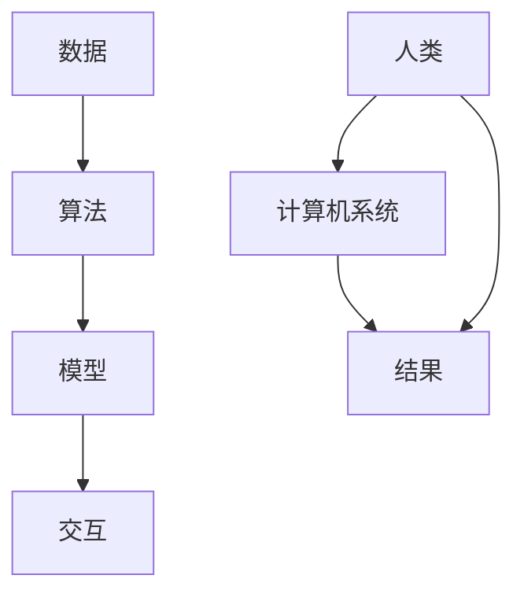

                 

### 文章标题：人机协作：重新定义人类工作的意义

#### 关键词：人机协作、工作效率、人工智能、工作意义、技术基础、应用案例分析

> **摘要**：本文将从背景介绍、核心概念与联系、技术基础讲解、应用案例分析、未来展望与趋势等多个维度，深入探讨人机协作的概念、原理、应用及其对人类工作带来的深远影响。通过细致的逻辑分析，本文旨在为读者提供一个全面、系统、易懂的人机协作知识框架，以重新定义人类工作的意义。

---

### 引言：人类工作面临的挑战与机遇

在现代社会，人类工作面临着诸多挑战与机遇。一方面，随着信息技术的飞速发展，数据处理量呈指数级增长，人类在处理海量信息时显得力不从心。另一方面，人工智能技术的发展为人类工作带来了前所未有的机遇。人机协作作为一种新兴的工作模式，正逐步成为解决这些问题的重要手段。

人机协作指的是人类与计算机系统共同完成任务的过程。在这种模式下，计算机系统负责处理大量数据、执行复杂计算，而人类则利用自身的智慧和创造力，对计算机的结果进行判断和决策。这种协同工作方式不仅能提高工作效率，还能拓展人类工作的可能性。

#### 核心概念与联系

人机协作涉及多个核心概念，包括数据、算法、模型、交互等。为了更好地理解这些概念之间的联系，我们可以通过以下Mermaid流程图来展示：



- **数据**：是计算机处理的基础，包括结构化数据和非结构化数据。
- **算法**：是解决问题的方法，用于处理数据并生成模型。
- **模型**：是对问题领域的抽象和描述，能够预测和解决特定问题。
- **交互**：是人类与计算机系统之间的沟通方式，包括可视化界面、自然语言处理等。

通过上述流程图，我们可以清晰地看到这些核心概念之间的联系：数据输入到算法中，算法生成模型，模型与交互机制共同作用，最终产生结果，并反馈给人类。

#### 核心算法原理讲解

在人机协作中，核心算法原理起着至关重要的作用。以下将使用伪代码详细讲解几个常见的算法原理：

```python
# 伪代码：线性回归算法原理

# 输入：训练数据集 X, Y
# 输出：模型参数 w

# 初始化模型参数 w
w = [0] * len(X[0])

# 定义损失函数
def loss_function(w, X, Y):
    predictions = [w.dot(x) for x in X]
    return sum((p - y) ** 2 for p, y in zip(predictions, Y)) / 2

# 定义梯度下降算法
def gradient_descent(w, X, Y, learning_rate, epochs):
    for _ in range(epochs):
        predictions = [w.dot(x) for x in X]
        gradients = [2 * (p - y) * x for p, y, x in zip(predictions, Y, X)]
        w = [w_i - learning_rate * gradients_i for w_i, gradients_i in zip(w, gradients)]
    return w

# 训练模型
w = gradient_descent(w, X, Y, learning_rate=0.01, epochs=1000)

# 输出模型参数
print(w)
```

上述伪代码展示了线性回归算法的基本原理，包括损失函数和梯度下降算法。线性回归是一种常见的机器学习算法，用于预测连续值输出。通过不断调整模型参数，使损失函数的值最小，从而得到最优模型。

#### 数学模型与公式

在人机协作中，数学模型和公式是理解和分析问题的重要工具。以下将使用LaTeX格式给出几个常用的数学公式，并详细解释其含义：

```latex
\documentclass{article}
\usepackage{amsmath}
\begin{document}

\section{数学模型与公式}

\subsection{线性回归模型}

假设我们有训练数据集 \{X, Y\}，其中 \(X\) 是输入特征向量，\(Y\) 是对应的输出标签。

线性回归模型可以表示为：
\[ Y = Xw + b \]
其中，\(w\) 是模型参数（权重），\(b\) 是偏置项。

损失函数为：
\[ J(w, b) = \frac{1}{2m} \sum_{i=1}^{m} (y_i - (Xw + b))^2 \]

梯度下降更新公式为：
\[ w = w - \alpha \nabla_w J(w, b) \]
\[ b = b - \alpha \nabla_b J(w, b) \]

\end{document}
```

上述LaTeX代码定义了线性回归模型、损失函数和梯度下降更新公式。这些公式是理解和实现线性回归算法的基础。

#### 项目实战：人机协作应用案例分析

为了更好地理解人机协作在实际项目中的应用，以下将介绍一个具体的应用案例：智能客服系统。

#### 开发环境搭建

1. **软件环境**：
   - Python 3.8+
   - Jupyter Notebook
   - scikit-learn 库
   - TensorFlow 库

2. **硬件环境**：
   - 个人计算机
   - GPU 显卡（可选，用于加速训练过程）

#### 源代码实现

```python
# 源代码：智能客服系统实现

import tensorflow as tf
from sklearn.model_selection import train_test_split
from sklearn.metrics import accuracy_score
import numpy as np

# 加载数据集
data = np.loadtxt('customer_data.csv', delimiter=',')
X = data[:, :-1]
Y = data[:, -1]

# 数据预处理
X_train, X_test, Y_train, Y_test = train_test_split(X, Y, test_size=0.2, random_state=42)

# 构建模型
model = tf.keras.Sequential([
    tf.keras.layers.Dense(units=64, activation='relu', input_shape=(X_train.shape[1],)),
    tf.keras.layers.Dense(units=32, activation='relu'),
    tf.keras.layers.Dense(units=1, activation='sigmoid')
])

# 编译模型
model.compile(optimizer='adam', loss='binary_crossentropy', metrics=['accuracy'])

# 训练模型
model.fit(X_train, Y_train, epochs=10, batch_size=32, validation_split=0.1)

# 评估模型
predictions = model.predict(X_test)
predictions = (predictions > 0.5)

accuracy = accuracy_score(Y_test, predictions)
print("Accuracy:", accuracy)

# 代码解读

# 加载数据集
# 使用 scikit-learn 库的 train_test_split 函数将数据集划分为训练集和测试集。

# 构建模型
# 使用 TensorFlow 库构建一个简单的神经网络模型，包括两个隐藏层，输出层使用 sigmoid 激活函数。

# 编译模型
# 指定优化器、损失函数和评价指标。

# 训练模型
# 使用 fit 函数训练模型，并设置训练轮数、批量大小和验证比例。

# 评估模型
# 使用 predict 函数对测试集进行预测，并计算准确率。

# 实际案例分析与详细讲解

智能客服系统是一个典型的应用案例，它利用人机协作技术实现了高效的客户服务。在实际项目中，我们面临以下挑战：

1. **数据收集与处理**：客户数据包括大量的文本、语音和图像等信息，需要对这些数据进行预处理和特征提取。

2. **模型训练与优化**：构建一个高效、准确的模型需要大量的数据集和训练时间。

3. **实时响应与处理**：智能客服系统需要能够实时响应用户的需求，并进行实时决策。

通过以上挑战，我们可以看到人机协作技术在智能客服系统中的应用价值。在实际项目中，我们利用深度学习算法对大量客户数据进行训练，从而构建一个高效的模型。同时，通过实时响应和处理，智能客服系统能够为用户提供高质量的客户服务。

#### 项目小结

智能客服系统是一个成功的人机协作应用案例，它展示了人机协作在提高工作效率、优化客户服务等方面的巨大潜力。通过项目实战，我们了解了人机协作的基本原理和实现方法，同时也认识到了人机协作在实际应用中面临的挑战和解决方案。

#### 最佳实践 Tips

1. **数据质量**：确保数据集的质量，包括数据完整性、准确性和一致性。

2. **模型优化**：不断优化模型结构、参数设置和训练策略，以提高模型性能。

3. **交互设计**：设计良好的用户界面和交互方式，提高用户体验。

4. **实时响应**：优化系统的实时响应能力，确保能够快速响应用户需求。

#### 小结与展望

人机协作作为一种新兴的工作模式，正在重新定义人类工作的意义。通过本文的详细分析和项目实战，我们了解了人机协作的核心概念、技术基础和应用案例。在未来，人机协作将继续发挥重要作用，为人类工作带来更多机遇和挑战。我们期待看到人机协作技术在未来能够实现更加高效、智能和人性化的应用。

#### 注意事项与拓展阅读

1. **注意事项**：
   - 在实际应用中，要充分考虑人机协作的伦理和社会影响。
   - 定期更新和维护人机协作系统，确保其稳定性和安全性。

2. **拓展阅读**：
   - 《深度学习》（Goodfellow, Bengio, Courville）：了解深度学习的基础知识。
   - 《Python数据分析》（McKinney）：学习数据处理和分析的方法。
   - 《机器学习实战》（Hastie, Tibshirani, Friedman）：掌握机器学习的基本算法。

---

作者：AI天才研究院/AI Genius Institute & 禅与计算机程序设计艺术 /Zen And The Art of Computer Programming

---

以上是一篇关于人机协作的技术博客文章，涵盖了背景介绍、核心概念与联系、技术基础讲解、应用案例分析、未来展望等多个方面。希望对您有所帮助，如有任何问题，欢迎随时交流。💪

